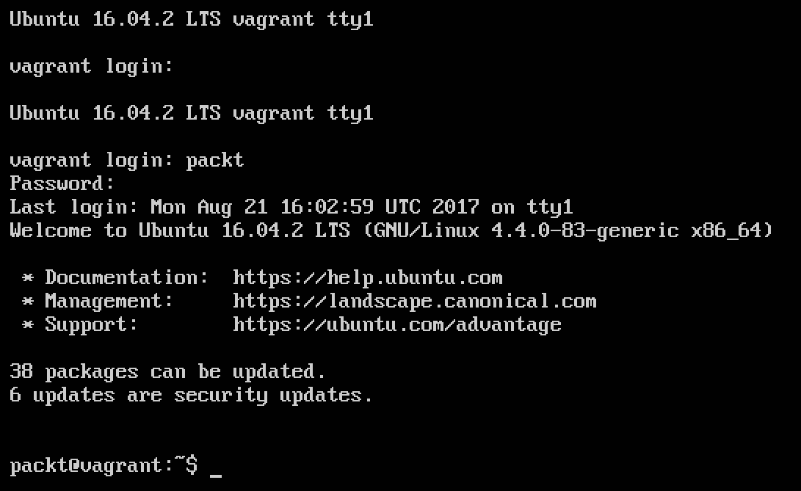

# 第三章：分析工具包

今天有几个平台用于大规模数据分析。在广义上，这些平台分为主要用于数据挖掘的平台，比如使用 NoSQL 平台分析大型数据集，以及用于数据科学的平台，即机器学习和预测分析。通常，解决方案可能具有这两种特征——一个用于存储和管理数据的强大基础平台，以及在其之上构建的提供数据科学附加功能的解决方案。

在本章中，我们将向您展示如何安装和配置您的分析工具包，这是我们在接下来的章节中将使用的一系列软件：

+   分析工具包的组件

+   系统建议

+   在笔记本电脑或工作站上安装

+   在云上安装

+   安装 Hadoop

+   Hadoop 分布

+   Cloudera Hadoop 分布（CDH）

+   安装 Spark

+   安装 R 和 Python

# 分析工具包的组件

本书将利用几种用于大数据挖掘和更一般的数据科学的关键技术。我们的分析工具包包括 Hadoop 和 Spark，它们可以在用户的本地机器上安装，也可以在云上安装；还有 R 和 Python，它们都可以在用户的机器上安装，也可以在云平台上安装。您的分析工具包将包括：

| **软件/平台** | **用于数据挖掘** | **用于机器学习** |
| --- | --- | --- |
| Hadoop | X |  |
| Spark | X | X |
| Redis | X |  |
| MongoDB | X |  |
| 开源 R | X | X |
| Python（Anaconda） | X | X |
| Vowpal Wabbit |  | X |
| LIBSVM，LIBLINEAR |  | X |
| H2O |  | X |

# 系统建议

如果您在本地机器上安装 Hadoop，建议您的系统至少具有 4-8GB 的 RAM（内存）和至少 50GB 的充足的磁盘空间。理想情况下，8GB 或更多内存对于大多数应用程序来说足够了。低于这个数值，性能会降低，但不会阻止用户进行练习。请注意，这些数字是适用于本书中概述的练习的估计值。生产环境自然会有更高的要求，这将在后面讨论。

安装分析软件，特别是像 Hadoop 这样的平台，可能在技术复杂性方面非常具有挑战性，用户很常见地会遇到必须要费力解决的错误。用户花费更多时间尝试解决错误和修复安装问题，而不是他们理想情况下应该花费的时间。这种额外的开销可以通过使用**虚拟机**（**VMs**）或者最近更常用的 Docker 等容器来轻松减轻。对于像 R 和 Python 这样更简单的平台，我们将使用预装有各种库的开源版本。

# 在笔记本电脑或工作站上安装

本书中的练习可以在任何 Windows、macOS 或 Linux 机器上进行。用户需要 Oracle VirtualBox（可以从[`www.virtualbox.org/wiki/Downloads`](https://www.virtualbox.org/wiki/Downloads)）开始安装分析工具包所需的软件。

# 在云上安装

在您的物理硬件上安装软件的另一种选择是使用基于云的服务。云服务，比如亚马逊的 AWS（亚马逊网络服务）和微软的 Azure，提供了一个极其灵活和多功能的环境，可以按需提供服务器，每小时的使用成本只需几美分到几美元。虽然云安装超出了本书的范围，但非常简单地创建一个免费的 AWS 账户，并使用它来安装本书中讨论的不同分析软件的各个部分。请注意，如果您使用 AWS/Azure 或任何其他云服务，您将需要使用 Cloudera Hadoop 分布的 Docker 版本。

# 安装 Hadoop

安装 Hadoop 有几种方法。最常见的方法有：

1.  从[`hadoop.apache.org`](https://hadoop.apache.org)的源文件中安装 Hadoop

1.  使用来自 Cloudera 和 Hortonworks 等商业供应商的开源发行版进行安装

在这个练习中，我们将安装**Cloudera 分布式 Apache Hadoop**（**CDH**），这是一个由几个 Hadoop 和与 Apache 相关的产品组成的集成平台。Cloudera 是一个流行的商业 Hadoop 供应商，除了其自己的 Hadoop 版本外，还为企业规模的 Hadoop 部署提供托管服务。在我们的情况下，我们将在 VM 环境中安装 HDP Sandbox。

# 安装 Oracle VirtualBox

VM 环境本质上是现有操作系统的副本，可能已经预装了软件。VM 可以以单个文件的形式交付，这允许用户通过仅启动文件而不是重新安装操作系统并配置它来模拟另一个系统来复制整个机器。VM 在一个独立的环境中运行；也就是说，它不依赖于主机操作系统来提供其功能。

要安装 CDH Quickstart VM，我们将使用 Oracle VirtualBox，该软件用于从 VM 文件启动 VMs。

在 VirtualBox 中安装 CDH 的步骤：

1.  从[`www.virtualbox.org/wiki/Downloads`](https://www.virtualbox.org/wiki/Downloads)下载适合您系统的 Oracle VirtualBox（Windows、macOS 或 Linux）（如果无法访问此链接，请转到[`www.virtualbox.org/`](https://www.virtualbox.org/)并选择适当的链接转到**下载**页面）。

1.  双击 Oracle VirtualBox 可执行文件，并按照屏幕上的提示进行安装（您可以接受屏幕上显示的默认设置）。

1.  安装了 VirtualBox 后，您还应该安装可在[`www.oracle.com/technetwork/server-storage/virtualbox/downloads/index.html#extpack`](http://www.oracle.com/technetwork/server-storage/virtualbox/downloads/index.html#extpack)下载的**Oracle VM VirtualBox 扩展包**。

下载与您的环境相关的扩展包文件，并单击/双击该文件。这将在 Oracle VM VirtualBox 应用程序中打开并在 VirtualBox 环境中安装扩展包。

**下载和安装 CDH Quickstart VM**：可以从 Cloudera 网站下载 CDH 的 Quickstart VM 或 Docker 镜像。步骤如下：

1.  转到[`www.cloudera.com`](https://www.cloudera.com)，然后单击页面顶部的**下载**菜单中的 Quickstart VMs。如果导航已更改，可以在 Google 上搜索 Cloudera Quickstart VM，通常会直接带您到 Cloudera 下载页面：


Cloudera 主页上的 QuickStart VM 链接

1.  这将打开 CDH 下载页面的 Quickstart。在“选择平台”菜单中，选择**VirtualBox**。填写出现的表格，然后单击“继续”。下载的文件将具有`.zip`扩展名。解压文件以提取`.ova 或.ovf`文件：


在 Cloudera Quickstart 下载选项上选择 Virtualbox

我们得到以下登录屏幕：


CDH 注册屏幕

首先列出了条款和条件：


CDH 许可条款接受

CDH 的 VM 下载开始：


CDH VM 超过 5GB，可能需要一段时间来下载

解压文件。文件夹中将包含以下图像中显示的文件：


如果文件是 Zip 格式，则解压文件

下载文件超过 5GB，根据您的互联网连接速度，可能需要一些时间

1.  下载完成后，双击`.ova 或.ovf`文件，它将在 Oracle VirtualBox 中打开：


在 Virtualbox 中为 VM 选择选项

您还可以通过启动 Oracle VirtualBox 手动打开文件，转到文件|导入虚拟设备，并选择您下载的`.ova/.ovf`文件作为要导入的设备。

保持所有选项默认，并单击导入按钮，这将开始导入过程。在此阶段，Cloudera CDH Quickstart VM 正在加载到您的 Oracle VirtualBox 环境中。

1.  导入文件后，您可以通过单击窗口顶部的绿色箭头来启动它：


已加载 CDH VM 的 Oracle Virtualbox

1.  在 OS 初始化时保持默认设置：


CDH 主 OS 页面

我们在安装的最后一步中得到以下屏幕：


CDH 网页管理 Hadoop 和其他 CDH 组件

这结束了使用 Hortonworks 数据平台安装 Hadoop 环境的安装。

# 在其他环境中安装 CDH

CDH Quickstart VM 也可以在 VMWare、Docker 和云平台上安装。有关相同的说明可在以下页面提供的链接中找到。

# 安装 Packt 数据科学 Box

我们还为书中的一些练习创建了一个单独的虚拟机。

从[`gitlab.com/packt_public/vm`](https://gitlab.com/packt_public/vm)下载 Packt 数据科学虚拟机 Vagrant 文件。

要加载 VM，首先从[`www.vagrantup.com/downloads.html`](https://www.vagrantup.com/downloads.html)下载**Vagrant**。


Vagrant 的下载页面

完成下载后，通过运行下载的 Vagrant 安装文件来安装**Vagrant**。安装完成后，您将收到重新启动计算机的提示。重新启动系统，然后继续加载 vagrant 文件的下一步：


完成 Vagrant 安装

在最后一步上点击确认以重新启动：


重新启动系统

在终端或命令提示符中，转到您下载了 Packt 数据科学 Vagrant 文件的目录，并运行以下命令（在 Windows 中显示）：

```scala
$ vagrant box add packtdatascience packtdatascience.box ==> box: Box file was not detected as metadata. Adding it directly... 

==> box: Adding box 'packtdatascience' (v0) for provider: 

box: Unpacking necessary files from: file://C:/Users/packt/Downloads/packt_public_vm/packtdatascience.box 

box: Progress: 100% (Rate: 435M/s, Estimated time remaining: --:--:--) 

==> box: Successfully added box 'packtdatascience' (v0) for 'virtualbox'! $ vagrant box list packtdatascience (virtualbox, 0) 

C:UsersNataraj DasguptaDownloadspackt_public_vm>vagrant up 

Bringing machine 'default' up with 'virtualbox' provider... 

==> default: Importing base box 'packtdatascience'... 

==> default: Matching MAC address for NAT networking... 

==> default: Setting the name of the VM: packt_public_vm_default_1513453154192_57570 

==> default: Clearing any previously set network interfaces... 

==> default: Preparing network interfaces based on configuration... 

    default: Adapter 1: nat 

==> default: Forwarding ports... 

    default: 22 (guest) => 2222 (host) (adapter 1) 

==> default: Booting VM...
 ...  
```

如果一切顺利，您应该在 Oracle VirtualBox 中看到一个新条目：


已加载 Packt 数据科学 VM 的 Oracle Virtualbox

双击框的名称以启动（和测试）它。使用 id/password 登录为`packt/packt`：



Packt VM 的登录屏幕

# 安装 Spark

CDH Quickstart VM 包括 Spark 作为其中一个组件，因此不需要单独安装 Spark。我们将在专门讨论 Spark 的章节中更多地讨论 Spark。

此外，我们关于 Spark 的教程将使用 Databricks 社区版，可以从[`community.cloud.databricks.com/`](https://community.cloud.databricks.com/)访问。有关创建帐户和执行必要步骤的说明已在第六章中提供，*用于大数据分析的 Spark*。

# 安装 R

R 是一种统计语言，在过去 3-5 年中变得非常流行，特别是作为一个可以用于各种用例的平台，从简单的数据挖掘到复杂的机器学习算法。根据 2016 年中期 IEEE Spectrum 发布的一篇文章，R 在世界排名前 10 的语言中排名第 5。

可以从[`www.r-project.org`](https://www.r-project.org)的 CRAN 网站上下载开源 R，该网站位于[`cran.r-project.org/mirrors.html`](https://cran.r-project.org/mirrors.html)。

或者，您可以从[`mran.microsoft.com/rro/`](https://mran.microsoft.com/rro/)的 Microsoft R Open 页面下载 R。 这以前被称为 Revolution R Open，是由 Revolution Analytics 发布的增强版本的开源 R。 在 2015 年 Microsoft 收购 Revolution Analytics 后，它在新所有权下进行了重新品牌。

Microsoft R Open 包括 R 的所有功能，还包括以下功能：

+   默认安装了许多 R 软件包，以及由 Microsoft Corporation 发布的一组专业软件包，这些软件包补充了开源 R 的现有功能

+   多线程数学库，用于 R 中的多线程计算

+   称为 MRAN 的固定 CRAN 存储库。 CRAN，全面的 R 存档网络是一个包含 R 二进制文件，软件包和相关内容的站点集合。 CRAN 上的软件包可以持续更新。 MRAN 获取 CRAN 的固定快照，直到下一个发布保持不变，从而实现可重现性和一致性。

# 下载并安装 Microsoft R Open 的步骤

我们按照以下步骤进行：

1.  前往[`mran.microsoft.com`](https://mran.microsoft.com)并点击**立即下载**按钮：


Microsoft 开放 R 主页

1.  选择适合您系统的发行版（Windows，macOS 或 Linux）：


Microsoft 开放 R 版本

1.  下载完成后，双击下载的文件安装**Microsoft R Open**。

1.  请注意，在 macOS 上，您可能会收到以下错误消息：


OS X 消息（使用下面的方法绕过）

1.  如果发生这种情况，请右键单击下载的文件，然后从弹出的菜单中选择“打开”。 这将允许您手动打开文件并安装：


绕过 OS X 之前显示的消息

1.  安装后，双击**Microsoft R Open**启动应用程序：


Microsoft R 控制台

# 安装 RStudio

RStudio 是由[rstudio.org](http://rstudio.org)发布的应用程序，提供了功能强大且功能丰富的图形**IDE**（**集成开发环境**）。

以下是安装 RStudio 的步骤：

1.  前往[`www.rstudio.com/products/rstudio/download`](https://www.rstudio.com/products/rstudio/download/)：


R Studio 版本

1.  点击与您的操作系统相关的链接，下载并安装相应的文件：


下载 RStudio

1.  请注意，在 macOS 上，您可以简单地将下载的文件移动到应用程序文件夹。 在 Windows 和 Linux 操作系统上，双击下载的文件以完成安装文件的步骤：


在 Mac 上安装 RStudio（复制到应用程序文件夹）

# 安装 Python

我们按照以下步骤进行安装：

1.  与 R 类似，Python 因其多功能和多样化的软件包而备受欢迎。 Python 通常作为大多数现代基于 Linux 的操作系统的一部分提供。 对于我们的练习，我们将使用 Continuum Analytics®的 Anaconda，它通过许多数据挖掘和机器学习相关的软件包本地安装作为平台的一部分，增强了基本的开源 Python 提供。 这消除了从业者手动下载和安装软件包的需要。 在这方面，它在精神上与 Microsoft R Open 类似。 正如 Microsoft R 增强了基本的开源 R 提供的附加功能一样，Anaconda 改进了基本的开源 Python 提供的功能，以提供新的功能。

1.  安装 Anaconda Python 的步骤

1.  前往[`www.continuum.io/downloads`](https://www.continuum.io/downloads)：


Python Anaconda 主页

1.  下载适合您系统的发行版。请注意，我们将下载 Python v2.7（而不是 3.x 版本）：


选择 Python Anaconda 安装程序

1.  安装完成后，您应该能够打开终端窗口（或 Windows 中的命令窗口）并输入 Python，这将启动 Anaconda：


在控制台中启动 Python Anaconda

安装 Hadoop（CDH）、Spark、R 和 Python 的过程到此结束。在后面的章节中，我们将更详细地研究这些平台。

# 总结

本章介绍了一些用于数据科学的关键工具。特别是，它演示了如何下载和安装 Cloudera Hadoop 分发（CDH）、Spark、R、RStudio 和 Python 的虚拟机。虽然用户可以下载 Hadoop 的源代码并安装在 Unix 系统上，但通常会出现问题，并且需要大量的调试。使用虚拟机可以让用户在最小的努力下开始使用和学习 Hadoop，因为它是一个完全预配置的环境。

此外，R 和 Python 是机器学习和一般分析中最常用的两种语言。它们适用于所有流行的操作系统。虽然它们可以安装在虚拟机中，但鼓励用户尝试在本地机器（笔记本电脑/工作站）上安装它们，如果可行的话，因为这样性能会相对更高。

在下一章中，我们将更深入地了解 Hadoop 及其核心组件和概念的细节。
