# 第四章：使用 Hadoop 的大数据

Hadoop 已经成为大数据世界的事实标准，特别是在过去三到四年里。 Hadoop 于 2006 年作为 Apache Nutch 的一个子项目开始，并引入了与分布式文件系统和分布式计算相关的两个关键功能，也被称为 MapReduce，这在开源社区中迅速流行起来。 今天，已经开发出了数千种利用 Hadoop 核心功能的新产品，并且它已经发展成一个包含 150 多种相关主要产品的庞大生态系统。可以说，Hadoop 是启动大数据和分析行业的主要催化剂之一。

在本章中，我们将讨论 Hadoop 的背景和核心概念，Hadoop 平台的组件，并深入了解 Hadoop 生态系统中的主要产品。 我们将了解分布式文件系统和分布式处理的核心概念，以及优化以提高 Hadoop 部署性能。 我们将以使用**Cloudera Hadoop Distribution**（**CDH**）进行真实世界的实践来结束。 我们将涵盖的主题有：

+   Hadoop 的基础知识

+   Hadoop 的核心组件

+   Hadoop 1 和 Hadoop 2

+   Hadoop 分布式文件系统

+   使用 MapReduce 的分布式计算原理

+   Hadoop 生态系统

+   Hadoop 生态系统概述

+   Hive，HBase 等

+   Hadoop 企业部署

+   内部部署

+   云部署

+   Cloudera Hadoop 的实践

+   使用 HDFS

+   使用 Hive

+   使用 WordCount 的 MapReduce

# Hadoop 的基础知识

在 2006 年，Hadoop 的创造者 Doug Cutting 正在 Yahoo！工作。 他积极参与了一个名为 Nutch 的开源项目，该项目涉及开发大规模网络爬虫。 从高层次上看，网络爬虫本质上是一种可以在互联网上以自动方式浏览和索引网页的软件。 直观地，这涉及对大量数据进行高效的管理和计算。 2006 年 1 月底，Doug 正式宣布了 Hadoop 的开始。 请求的第一行，仍然可以在[`issues.apache.org/jira/browse/INFRA-700`](https://issues.apache.org/jira/browse/INFRA-700)上找到，是*Lucene PMC 已投票将 Nutch 的一部分拆分为一个名为 Hadoop 的新子项目*。 因此，Hadoop 诞生了。

在开始时，Hadoop 有两个核心组件：**Hadoop 分布式文件系统**（**HDFS**）和 MapReduce。 这是 Hadoop 的第一次迭代，现在也被称为 Hadoop 1。 稍后，在 2012 年，添加了第三个组件，称为**YARN**（**另一个资源协调器**），它解耦了资源管理和作业调度的过程。 在更详细地探讨核心组件之前，了解 Hadoop 的基本前提将有所帮助：

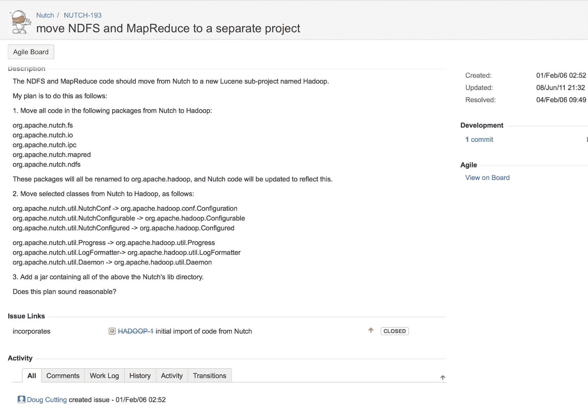

Doug Cutting 在[`issues.apache.org/jira/browse/NUTCH-193`](https://issues.apache.org/jira/browse/NUTCH-193)上发布了他打算将**Nutch 分布式 FS**（**NDFS**）和 MapReduce 分离到一个名为 Hadoop 的新子项目的意图。

# Hadoop 的基本前提

Hadoop 的基本前提是，不是尝试在单个大型机器上执行任务，而是将任务细分为较小的段，然后将其委派给多个较小的机器。 这些所谓的较小机器然后会在自己的数据部分上执行任务。 一旦较小的机器完成了它们的任务，产生了它们被分配的任务的结果，那么这些单独的结果单元将被聚合以产生最终结果。

尽管在理论上，这可能看起来相对简单，但有各种技术考虑要牢记。 例如：

+   网络是否足够快，可以从每个单独的服务器收集结果？

+   每个单独的服务器是否能够从磁盘快速读取数据？

+   如果一个或多个服务器失败，我们是否必须重新开始？

+   如果有多个大任务，应该如何设置优先级？

在处理这种性质的分布式架构时，还有许多其他考虑因素。

# Hadoop 的核心模块

Hadoop 的核心模块包括：

+   **Hadoop Common**：Hadoop 所需的库和其他常见的辅助工具

+   **HDFS**：存储数据的分布式、高可用、容错的文件系统

+   **Hadoop MapReduce**：涉及跨商品服务器（或节点）的分布式计算的编程范式

+   **Hadoop YARN**：作业调度和资源管理的框架

在这些核心组件中，YARN 于 2012 年推出，以解决 Hadoop 首次发布的一些缺点。Hadoop 的第一个版本（或者等效地说是 Hadoop 的第一个模型）使用 HDFS 和 MapReduce 作为其主要组件。随着 Hadoop 的流行，使用 MapReduce 提供的设施之外的设施的需求变得越来越重要。这，再加上一些其他技术考虑因素，导致了 YARN 的开发。

现在让我们来看一下之前列举的 Hadoop 的显著特点。

# Hadoop 分布式文件系统 - HDFS

HDFS 构成了所有 Hadoop 安装的基础。文件，或者更一般地说是数据，存储在 HDFS 中，并由 Hadoop 的节点访问。

HDFS 执行两个主要功能：

+   **命名空间**：提供保存集群元数据的命名空间，即 Hadoop 集群中数据的位置

+   **数据存储**：作为 Hadoop 集群中使用的数据的存储

文件系统被称为分布式，因为数据存储在多台服务器上的块中。可以通过一个简单的例子直观地理解 HDFS。考虑一本由 A-Z 章组成的大书。在普通文件系统中，整本书将作为一个单独的文件存储在磁盘上。在 HDFS 中，这本书将被分割成更小的块，比如 A-H 章的一个块，I-P 章的另一个块，以及 Q-Z 章的第三个块。这些块然后存储在不同的机架（或者用这个类比来说是书架）上。此外，每一章都会被复制三次，这样每一章都会有三个副本。

假设整本书的大小是 1GB，每一章大约是 350MB：

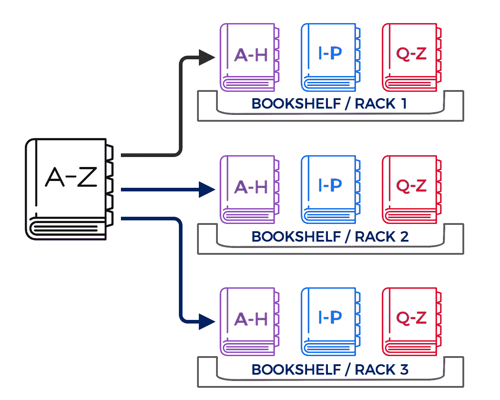

HDFS 的书架类比

以这种方式存储书籍实现了一些重要的目标：

+   由于这本书已经被分成了三部分，每部分都被章节组复制了三次，这意味着我们的进程可以通过从不同服务器查询部分来并行读取书。这减少了 I/O 争用，非常适合并行使用的一个很好的例子。

+   如果任何一个机架不可用，我们可以从任何其他机架检索章节，因为每个章节在不同机架上都有多个副本。

+   如果我被分配的任务只需要访问单独的一章，比如说 B 章，我只需要访问对应 A-H 章的文件。由于对应 A-H 章的文件大小是整本书的三分之一，访问和读取文件的时间会更短。

+   其他好处，比如对不同章节组的选择性访问权限等，也是可能的。

这可能是对实际 HDFS 功能的过度简化的类比，但它传达了这项技术的基本原则 - 大文件被分割成块（块），并以高可用性冗余配置分布在多台服务器上。现在我们将更详细地看一下实际的 HDFS 架构：

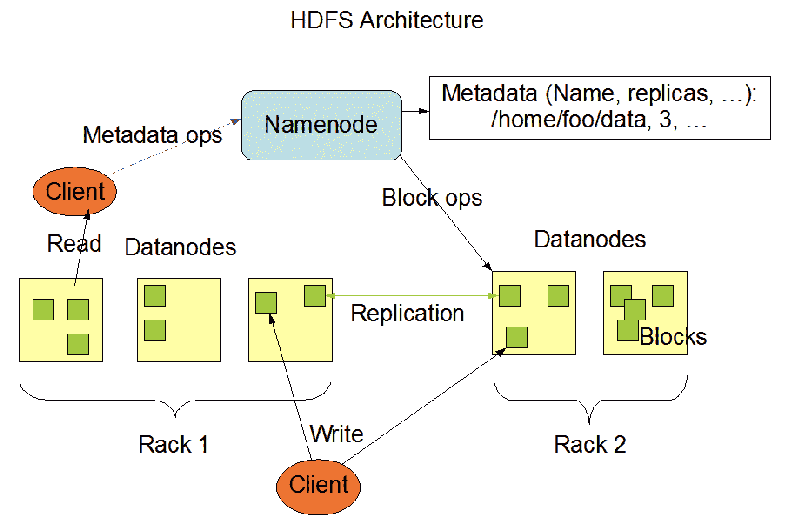

Hadoop 的 HDFS 后端包括：

+   **NameNode**：这可以被认为是主节点。NameNode 包含集群元数据，并知道存储在哪个位置的数据 - 简而言之，它持有命名空间。它将整个命名空间存储在 RAM 中，当请求到达时，提供有关哪些服务器持有所需任务的数据的信息。在 Hadoop 2 中，可以有多个 NameNode。可以创建一个辅助节点作为辅助节点。因此，它不是备用 NameNode，而是帮助保持集群元数据最新的节点。

+   **DataNode**：DataNodes 是负责存储数据块并在收到新请求时执行计算操作的单独服务器。这些主要是低性能的商品服务器，资源和容量比存储集群元数据的 NameNode 要低。

# HDFS 中的数据存储过程

以下几点应该能很好地说明数据存储过程：

HDFS 中的所有数据都是以块的形式写入的，通常大小为 128 MB。因此，一个大小为 512 MB 的单个文件将被分成四个块（4 * 128 MB）。然后将这些块写入 DataNodes。为了保持冗余和高可用性，每个块都会被复制以创建副本。一般来说，Hadoop 安装的复制因子为 3，表示每个数据块都会被复制三次。

这样可以保证冗余性，以便在其中一个服务器失败或停止响应时，始终有第二个甚至第三个副本可用。为了确保这个过程能够无缝运行，DataNode 将副本放在独立的服务器上，并且还可以确保数据中心不同机架上的服务器上放置块。这是因为即使所有副本都在独立的服务器上，但所有服务器都在同一个机架上，机架电源故障将意味着没有副本可用。

将数据写入 HDFS 的一般过程如下：

1.  NameNode 收到一个请求，要求将新文件写入 HDFS。

1.  由于数据必须以块或分块的形式写入，HDFS 客户端（发出请求的实体）开始将数据缓存到本地缓冲区，一旦缓冲区达到分配的块大小（例如 128 MB），它会通知 NameNode 准备好写入第一个数据块（分块）。

1.  根据其对 HDFS 集群状态的了解，NameNode 会提供关于需要存储块的目标 DataNode 的信息。

1.  HDFS 客户端将数据写入目标 DataNode，并在块的写入过程完成后通知 NameNode。

1.  随后，目标 DataNode 开始将其数据块的副本复制到第二个 DataNode，后者将作为当前块的副本。

1.  第二个 DataNode 完成写入过程后，它将数据块发送给第三个 DataNode。

1.  这个过程重复进行，直到所有与数据（或等效地，文件）对应的块都被复制到不同的节点上。

请注意，块的数量将取决于文件大小。以下图示了数据在 5 个数据节点之间的分布。

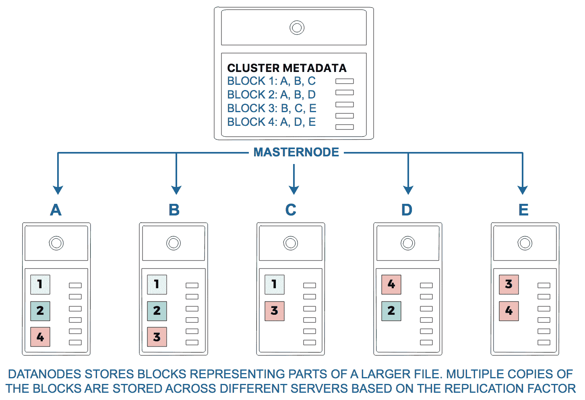

主节点和数据节点

Hadoop 的第一个版本中的 HDFS 架构，也称为 Hadoop 1，具有以下特点：

+   单个 NameNode：只有一个 NameNode 可用，因此它也是单点故障，因为它存储了整个集群的元数据。

+   存储数据块的多个 DataNodes，处理客户端请求，并在数据块上执行 I/O 操作（创建、读取、删除等）。

+   Hadoop 的第二个版本中的 HDFS 架构，也被称为 Hadoop 2，提供了原始 HDFS 设计的所有优点，并添加了一些新特性，最显著的是具有多个可以充当主要和次要 NameNode 的 NameNode 的能力。其他功能包括具有多个命名空间以及 HDFS 联邦。

+   HDFS 联邦值得特别一提。来自[`hadoop.apache.org`](http://hadoop.apache.org)的以下摘录以非常精确的方式解释了这个主题：

NameNode 是联邦的；NameNode 是独立的，不需要彼此协调。DataNode 被用作所有 NameNode 的块的共同存储。每个 DataNode 在集群中注册。DataNode 发送周期性的心跳和块报告。

Secondary NameNode 并不是备用节点，它不能在 NameNode 不可用时执行与 NameNode 相同的任务。然而，它通过执行一些清理操作使得 NameNode 重新启动过程更加高效。

这些操作（例如将 HDFS 快照数据与数据更改信息合并）通常在 NameNode 重新启动时由 NameNode 执行，根据自上次重新启动以来的更改量，可能需要很长时间。然而，Secondary NameNode 可以在主 NameNode 仍在运行时执行这些清理操作，以便在重新启动时，主 NameNode 可以更快地恢复。由于 Secondary NameNode 基本上在定期间隔对 HDFS 数据执行检查点，因此它也被称为检查点节点。

# Hadoop MapReduce

MapReduce 是 Hadoop 的一个重要特性，可以说是使其著名的最重要的特性之一。MapReduce 的工作原理是将较大的任务分解为较小的子任务。与将单个机器委派为计算大型任务不同，可以使用一组较小的机器来完成较小的子任务。通过以这种方式分配工作，相对于使用单机架构，任务可以更加高效地完成。

这与我们在日常生活中完成工作的方式并没有太大不同。举个例子会更清楚一些。

# MapReduce 的直观介绍

让我们以一个假设的由 CEO、董事和经理组成的组织为例。CEO 想知道公司有多少新员工。CEO 向他的董事发送请求，要求报告他们部门的新员工数量。董事再向各自部门的经理发送请求，要求提供新员工的数量。经理向董事提供数字，董事再将最终值发送回 CEO。

这可以被认为是 MapReduce 的一个现实世界的例子。在这个类比中，任务是找到新员工的数量。CEO 并没有自己收集所有数据，而是委派给了董事和经理，他们提供了各自部门的数字，如下图所示：


MapReduce 的概念

在这个相当简单的场景中，将一个大任务（在整个公司中找到新员工）分解为较小的任务（每个团队中的新员工），然后重新聚合个体数字，类似于 MapReduce 的工作方式。

# MapReduce 的技术理解

MapReduce，顾名思义，有一个映射阶段和一个减少阶段。映射阶段通常是对其输入的每个元素应用的函数，从而修改其原始值。

MapReduce 生成键值对作为输出。

**键值对：** 键值对建立了一种关系。例如，如果约翰今年 20 岁，一个简单的键值对可以是（约翰，20）。在 MapReduce 中，映射操作产生这样的键值对，其中有一个实体和分配给该实体的值。

在实践中，映射函数可能会复杂，并涉及高级功能。

减少阶段接收来自映射函数的键值输入，并执行汇总操作。例如，考虑包含学校不同年级学生年龄的映射操作的输出：

| **学生姓名** | **班级** | **年龄** |
| --- | --- | --- |
| John | 年级 1 | 7 |
| Mary | 年级 2 | 8 |
| Jill | 年级 1 | 6 |
| Tom | 年级 3 | 10 |
| Mark | 年级 3 | 9 |

我们可以创建一个简单的键值对，例如取班级和年龄的值（可以是任何值，但我只是拿这些来提供例子）。在这种情况下，我们的键值对将是（年级 1，7），（年级 2，8），（年级 1，6），（年级 3，10）和（年级 3，9）。

然后可以将计算每个年级学生年龄平均值的操作定义为减少操作。

更具体地说，我们可以对输出进行排序，然后将与每个年级对应的元组发送到不同的服务器。

例如，服务器 A 将接收元组（年级 1，7）和（年级 1，6），服务器 B 将接收元组（年级 2，8），服务器 C 将接收元组（年级 3，10）和（年级 3，9）。然后，服务器 A、B 和 C 将找到元组的平均值并报告（年级 1，6.5），（年级 2，8）和（年级 3，9.5）。

请注意，在这个过程中有一个中间步骤，涉及将输出发送到特定服务器并对输出进行排序，以确定应将其发送到哪个服务器。事实上，MapReduce 需要一个洗牌和排序阶段，其中键值对被排序，以便每个减少器接收一组固定的唯一键。

在这个例子中，如果说，而不是三个服务器，只有两个，服务器 A 可以被分配为计算与年级 1 和 2 对应的键的平均值，服务器 B 可以被分配为计算年级 3 的平均值。

在 Hadoop 中，MapReduce 期间发生以下过程：

1.  客户端发送任务请求。

1.  NameNode 分配将执行映射操作和执行减少操作的 DataNodes（单独的服务器）。请注意，DataNode 服务器的选择取决于所需操作的数据是否*位于服务器本地*。数据所在的服务器只能执行映射操作。

1.  DataNodes 执行映射阶段并产生键值（k，v）对。

当映射器生成（k，v）对时，它们根据节点分配的*键*发送到这些减少节点。键分配给服务器取决于分区函数，这可以是键的哈希值（这是 Hadoop 中的默认值）。

一旦减少节点接收到与其负责计算的键对应的数据集，它就应用减少函数并生成最终输出。

Hadoop 最大程度地利用了数据局部性。映射操作由本地保存数据的服务器执行，即在磁盘上。更准确地说，映射阶段将仅由持有文件对应块的服务器执行。通过委托多个独立节点独立执行计算，Hadoop 架构可以有效地执行非常大规模的数据处理。

# 块大小和映射器和减少器的数量

在 MapReduce 过程中的一个重要考虑因素是理解 HDFS 块大小，即文件被分割成的块的大小。需要访问某个文件的 MapReduce 任务将需要对表示文件的每个块执行映射操作。例如，给定一个 512MB 的文件和 128MB 的块大小，需要四个块来存储整个文件。因此，MapReduce 操作将至少需要四个映射任务，其中每个映射操作将应用于数据的每个子集（即四个块中的每一个）。

然而，如果文件非常大，比如需要 10,000 个块来存储，这意味着我们需要 10,000 个映射操作。但是，如果我们只有 10 台服务器，那么我们将不得不向每台服务器发送 1,000 个映射操作。这可能是次优的，因为它可能导致由于磁盘 I/O 操作和每个映射的资源分配设置而产生高惩罚。

所需的减少器数量在 Hadoop Wiki 上非常优雅地总结了（[`wiki.apache.org/hadoop/HowManyMapsAndReduces`](https://wiki.apache.org/hadoop/HowManyMapsAndReduces)）。

理想的减少器应该是最接近以下值的最佳值：

* 块大小的倍数 * 5 到 15 分钟之间的任务时间 * 创建尽可能少的文件

除此之外，很有可能你的减少器不太好。用户有极大的倾向使用一个非常高的值（“更多的并行性意味着更快！”）或一个非常低的值（“我不想超出我的命名空间配额！”）。这两种情况都同样危险，可能导致以下一种或多种情况：

* 下一个工作流程阶段的性能差 * 由于洗牌而导致性能差 * 由于过载了最终无用的对象而导致整体性能差 * 没有真正合理的原因而破坏磁盘 I/O * 由于处理疯狂数量的 CFIF/MFIF 工作而产生大量的网络传输

# Hadoop YARN

YARN 是 Hadoop 2 中引入的一个模块。在 Hadoop 1 中，管理作业和监视它们的过程是由称为 JobTracker 和 TaskTracker 的进程执行的。运行 JobTracker 守护进程（进程）的 NameNodes 会将作业提交给运行 TaskTracker 守护进程（进程）的 DataNodes。

JobTracker 负责协调所有 MapReduce 作业，并作为管理进程、处理服务器故障、重新分配到新 DataNodes 等的中央管理员。TaskTracker 监视 DataNode 中本地作业的执行，并向 JobTracker 提供状态反馈，如下所示：

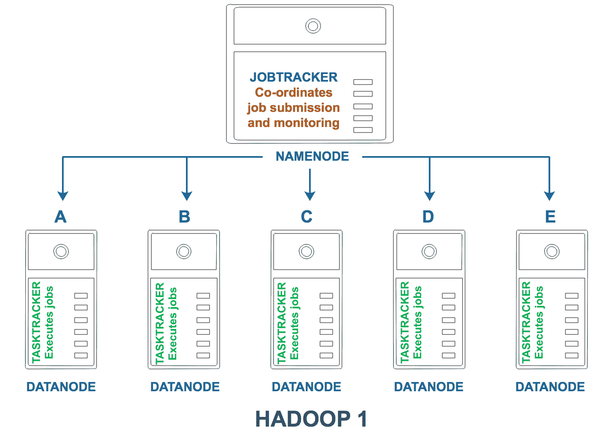

JobTracker 和 TaskTrackers

这种设计长时间以来运行良好，但随着 Hadoop 的发展，对更复杂和动态功能的需求也相应增加。在 Hadoop 1 中，NameNode，因此是 JobTracker 进程，管理作业调度和资源监控。如果 NameNode 发生故障，集群中的所有活动将立即停止。最后，所有作业都必须以 MapReduce 术语表示 - 也就是说，所有代码都必须在 MapReduce 框架中编写才能执行。

Hadoop 2 解决了所有这些问题：

+   作业管理、调度和资源监控的过程被解耦并委托给一个名为 YARN 的新框架/模块

+   可以定义一个辅助主 NameNode，它将作为主 NameNode 的辅助

+   此外，Hadoop 2.0 将容纳 MapReduce 以外的框架

+   Hadoop 2 不再使用固定的映射和减少插槽，而是利用容器

在 MapReduce 中，所有数据都必须从磁盘读取，这对于大型数据集的操作来说是可以接受的，但对于小型数据集的操作来说并不是最佳选择。事实上，任何需要非常快速处理（低延迟）、具有交互性的任务或需要多次迭代（因此需要多次从磁盘读取相同数据）的任务都会非常慢。

通过消除这些依赖关系，Hadoop 2 允许开发人员实现支持具有不同性能要求的作业的新编程框架，例如低延迟和交互式实时查询，机器学习所需的迭代处理，流数据处理等不同拓扑结构，优化，例如内存数据缓存/处理等。

出现了一些新术语：

+   **ApplicationMaster**：负责管理应用程序所需的资源。例如，如果某个作业需要更多内存，ApplicationMaster 将负责获取所需的资源。在这种情况下，应用程序指的是诸如 MapReduce、Spark 等应用执行框架。

+   **容器**：资源分配的单位（例如，1GB 内存和四个 CPU）。一个应用程序可能需要多个这样的容器来执行。ResourceManager 为执行任务分配容器。分配完成后，ApplicationMaster 请求 DataNodes 启动分配的容器并接管容器的管理。

+   **ResourceManager**：YARN 的一个组件，其主要作用是为应用程序分配资源，并作为 JobTracker 的替代品。ResourceManager 进程在 NameNode 上运行，就像 JobTracker 一样。

+   **NodeManagers**：NodeManagers 是 TaskTracker 的替代品，负责向 ResourceManager（RM）报告作业的状态，并监视容器的资源利用情况。

下图显示了 Hadoop 2.0 中 ResourceManager 和 NodeManagers 的高层视图：

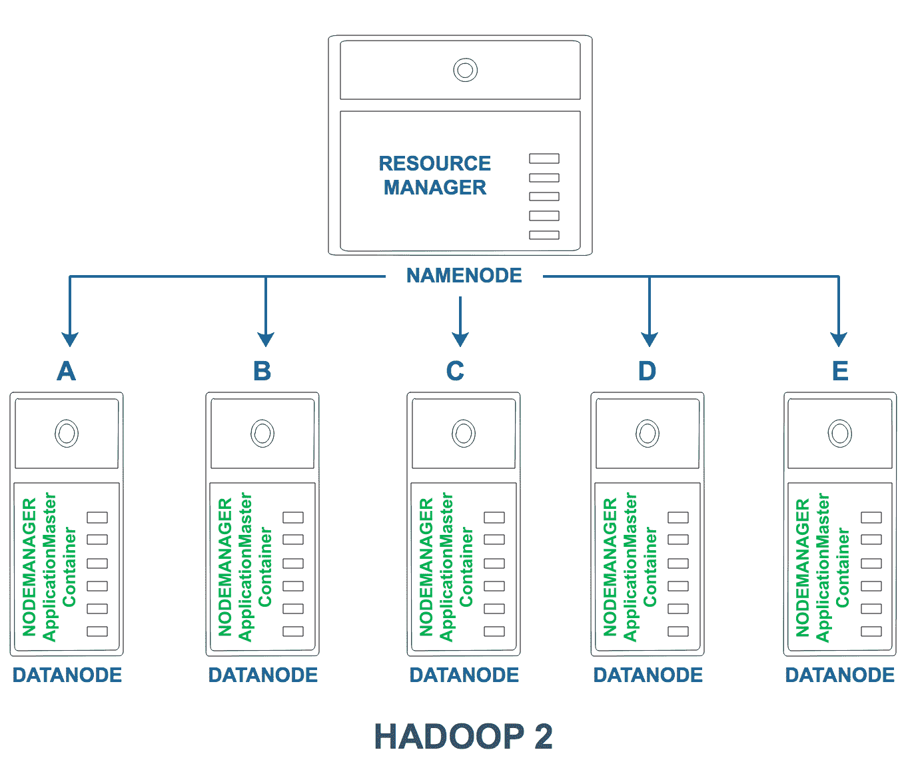

Hadoop 2.0

Hadoop 2 中固有的显着概念已在下一图中说明：

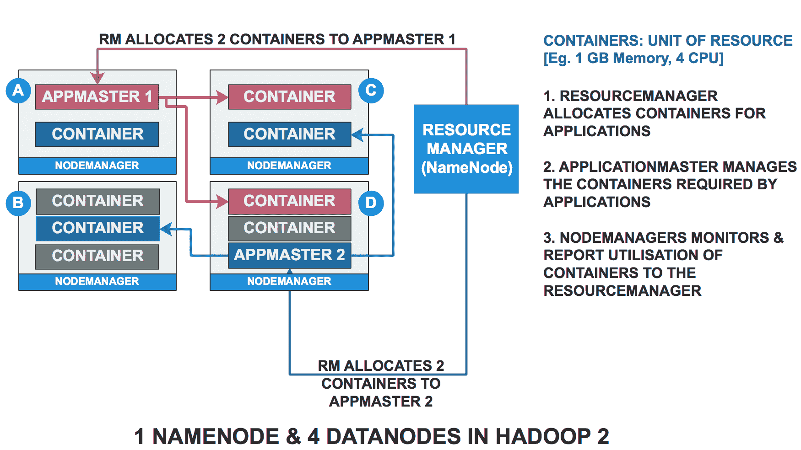

Hadoop 2.0 概念

# YARN 中的作业调度

大型 Hadoop 集群同时运行多个作业并不罕见。当有多个部门提交了多个作业时，资源的分配就成为一个重要且有趣的话题。如果说，A 和 B 两个部门同时提交了作业，每个请求都是为了获得最大可用资源，那么哪个请求应该优先获得资源呢？一般来说，Hadoop 使用**先进先出**（**FIFO**）策略。也就是说，谁先提交作业，谁就先使用资源。但如果 A 先提交了作业，但完成 A 的作业需要五个小时，而 B 的作业将在五分钟内完成呢？

为了处理作业调度中的这些细微差别和变量，已经实施了许多调度方法。其中三种常用的方法是：

+   **FIFO**：如上所述，FIFO 调度使用队列来优先处理作业。作业按照提交的顺序执行。

+   **CapacityScheduler**：CapacityScheduler 根据每个部门可以提交的作业数量分配值，其中部门可以表示用户的逻辑组。这是为了确保每个部门或组可以访问 Hadoop 集群并能够利用最少数量的资源。如果服务器上有未使用的资源，调度程序还允许部门根据每个部门的最大值设置超出其分配容量。因此，CapacityScheduler 的模型提供了每个部门可以确定性地访问集群的保证。

+   **公平调度程序**：这些调度程序试图在不同应用程序之间均匀平衡资源的利用。虽然在某个特定时间点上可能无法实现平衡，但通过随时间平衡分配，可以使用公平调度程序实现平均值更或多或少相似的目标。

这些以及其他调度程序提供了精细的访问控制（例如基于每个用户或每个组的基础）并主要利用队列来优先和分配资源。

# Hadoop 中的其他主题

Hadoop 还有一些其他方面值得特别提及。由于我们已经详细讨论了最重要的主题，本节概述了一些其他感兴趣的主题。

# 加密

数据加密是根据官方规定对各种类型的数据进行的。在美国，要求符合 HIPAA 规定的规则，对识别患者信息的数据进行加密存储。HDFS 中的数据可以在静态状态（在磁盘上）和/或传输过程中进行加密。用于解密数据的密钥通常由密钥管理系统（KMS）管理。

# 用户认证

Hadoop 可以使用服务器的本机用户认证方法。例如，在基于 Linux 的机器上，用户可以根据系统`/etc/passwd`文件中定义的 ID 进行身份验证。换句话说，Hadoop 继承了服务器端设置的用户认证。

通过 Kerberos 进行用户认证，这是一种跨平台的认证协议，在 Hadoop 集群中也很常见。Kerberos 基于授予用户临时权限的票据概念。可以使用 Kerberos 命令使票据无效，从而限制用户根据需要访问集群上的资源的权限。

请注意，即使用户被允许访问数据（用户认证），由于另一个名为授权的功能，他或她仍然可能受到访问数据的限制。该术语意味着即使用户可以进行身份验证并登录到系统，用户可能仅限于可以访问的数据。通常使用本机 HDFS 命令执行此级别的授权，以更改目录和文件所有权为指定的用户。

# Hadoop 数据存储格式

由于 Hadoop 涉及存储大规模数据，因此选择适合您用例的存储类型至关重要。Hadoop 中可以以几种格式存储数据，选择最佳存储格式取决于您对读/写 I/O 速度的要求，文件可以按需压缩和解压缩的程度，以及文件可以被分割的容易程度，因为数据最终将被存储为块。

一些流行和常用的存储格式如下：

+   **文本/CSV**：这些是纯文本 CSV 文件，类似于 Excel 文件，但以纯文本格式保存。由于 CSV 文件包含每行的记录，因此将文件拆分为数据块是自然而然的。

+   **Avro**：Avro 旨在改善在异构系统之间高效共享数据。它使用数据序列化，将模式和实际数据存储在单个紧凑的二进制文件中。Avro 使用 JSON 存储模式和二进制格式存储数据，并将它们序列化为单个 Avro 对象容器文件。多种语言，如 Python、Scala、C/C++等，都有本机 API 可以读取 Avro 文件，因此非常适合跨平台数据交换。

+   Parquet：Parquet 是一种列式数据存储格式。这有助于提高性能，有时甚至显著提高性能，因为它允许按列存储和访问数据。直观地说，如果你正在处理一个包含 100 列和 100 万行的 1GB 文件，并且只想从这 100 列中查询数据，能够只访问单独的列会比访问整个文件更有效。

+   ORCFiles：ORC 代表优化的行列格式。从某种意义上说，它是对纯列格式（如 Parquet）的进一步优化。ORCFiles 不仅按列存储数据，还按行存储，也称为条带。因此，以表格格式存储的文件可以分割成多个较小的条带，其中每个条带包含原始文件的一部分行。通过这种方式分割数据，如果用户任务只需要访问数据的一个小部分，那么该过程可以查询包含数据的特定条带。

+   SequenceFiles：在 SequenceFiles 中，数据表示为键值对并以二进制序列化格式存储。由于序列化，数据可以以紧凑的二进制格式表示，不仅减小了数据大小，而且提高了 I/O。Hadoop，尤其是 HDFS，在存在多个小文件（如音频文件）时效率不高。SequenceFiles 通过允许将多个小文件存储为单个单元或 SequenceFile 来解决了这个问题。它们也非常适合可分割的并行操作，并且对于 MapReduce 作业总体上是高效的。

+   HDFS 快照：HDFS 快照允许用户以只读模式保存特定时间点的数据。用户可以在 HDFS 中创建快照，实质上是数据在那个时间点的副本，以便在以后需要时检索。这确保了在文件损坏或其他影响数据可用性的故障发生时可以恢复数据。在这方面，它也可以被视为备份。快照存储在一个.snapshot 目录中，用户在那里创建了它们。

+   节点故障处理：大型 Hadoop 集群可能包含数万个节点。因此，任何一天都可能发生服务器故障。为了让 NameNode 了解集群中所有节点的状态，DataNodes 向 NameNode 发送定期心跳。如果 NameNode 检测到服务器已经失败，即它停止接收心跳，它会将服务器标记为失败，并将本地服务器上的所有数据复制到新实例上。

# Hadoop 3 中预期的新功能

在撰写本书时，Hadoop 3 处于 Alpha 阶段。关于 Hadoop 3 中将可用的新变化的详细信息可以在互联网上找到。例如，[`hadoop.apache.org/docs/current/`](http://hadoop.apache.org/docs/current/)提供了关于架构新变化的最新信息。

# Hadoop 生态系统

这一章应该被命名为 Apache 生态系统。像本节中将讨论的所有其他项目一样，Hadoop 是一个 Apache 项目。Apache 是一个开源项目的简称，由 Apache 软件基金会支持。它最初起源于 90 年代初开发的 Apache HTTP 服务器，并且今天是一个协作的全球倡议，完全由参与向全球技术社区发布开源软件的志愿者组成。

Hadoop 最初是 Apache 生态系统中的一个项目，现在仍然是。由于其受欢迎程度，许多其他 Apache 项目也直接或间接地与 Hadoop 相关联，因为它们支持 Hadoop 环境中的关键功能。也就是说，重要的是要记住，这些项目在大多数情况下可以作为独立产品存在，可以在没有 Hadoop 环境的情况下运行。它是否能提供最佳功能将是一个单独的话题。

在本节中，我们将介绍一些对 Hadoop 的增长和可用性产生了重大影响的 Apache 项目，如下图所示：

| **产品** | **功能** |
| --- | --- |
| Apache Pig | Apache Pig，也称为 Pig Latin，是一种专门设计用于通过简洁的语句表示 MapReduce 程序的语言，这些语句定义了工作流程。使用传统方法编写 MapReduce 程序，比如用 Java，可能会非常复杂，Pig 提供了一种简单的抽象来表达 MapReduce 工作流程和复杂的**抽取-转换-加载**（**ETL**）过程。Pig 程序通过 Grunt shell 执行。 |
| Apache HBase | Apache HBase 是一个分布式列式数据库，位于 HDFS 之上。它是基于 Google 的 BigTable 模型设计的，其中数据以列格式表示。HBase 支持跨数十亿条记录的表的低延迟读写，并且非常适合需要直接随机访问数据的任务。更具体地说，HBase 以三个维度索引数据 - 行、列和时间戳。它还提供了一种表示具有任意列数的数据的方法，因为列值可以在 HBase 表的单元格中表示为键值对。 |
| Apache Hive | Apache Hive 提供了类似 SQL 的方言来查询存储在 HDFS 中的数据。Hive 将数据以序列化的二进制文件形式存储在 HDFS 中的类似文件夹的结构中。与传统数据库管理系统中的表类似，Hive 以表格格式存储数据，根据用户选择的属性在 HDFS 中进行分区。因此，分区是高级目录或表的子文件夹。概念上提供了第三层抽象，即桶，它引用 Hive 表的分区中的文件。 |
| Apache Sqoop | Sqoop 用于从传统数据库中提取数据到 HDFS。因此，将数据存储在关系数据库管理系统中的大型企业可以使用 Sqoop 将数据从其数据仓库转移到 Hadoop 实现中。 |
| Apache Flume | Flume 用于管理、聚合和分析大规模日志数据。 |
| Apache Kafka | Kafka 是一个基于发布/订阅的中间件系统，可用于实时分析和随后将流数据（在 HDFS 中）持久化。 |
| Apache Oozie | Oozie 是一个用于调度 Hadoop 作业的工作流管理系统。它实现了一个称为**有向无环图**（**DAG**）的关键概念，这将在我们关于 Spark 的部分中讨论。 |
| Apache Spark | Spark 是 Apache 中最重要的项目之一，旨在解决 HDFS-MapReduce 模型的一些缺点。它最初是加州大学伯克利分校的一个相对较小的项目，迅速发展成为用于分析任务的 Hadoop 最重要的替代方案之一。Spark 在行业中得到了广泛的应用，并包括其他各种子项目，提供额外的功能，如机器学习、流式分析等。 |

# CDH 实战

在本节中，我们将利用 CDH QuickStart VM 来学习本章讨论的一些主题。这些练习不一定要按照时间顺序进行，并且不依赖于完成其他练习。

我们将在本节中完成以下练习：

+   使用 Hadoop MapReduce 进行词频统计

+   使用 HDFS

+   使用 Apache Hive 下载和查询数据

# 使用 Hadoop MapReduce 进行词频统计

在本练习中，我们将尝试计算有史以来最长小说之一中每个单词的出现次数。对于本练习，我们选择了由乔治和/或玛德琳·德·斯库德里（Georges and/or Madeleine de Scudéry）于 1649-1653 年间编写的书籍《Artamène ou le Grand Cyrus》。该书被认为是有史以来第二长的小说，根据维基百科上相关列表（[`en.wikipedia.org/wiki/List_of_longest_novels`](https://en.wikipedia.org/wiki/List_of_longest_novels)）。这部小说共有 10 卷，共计 13,905 页，约有两百万字。

首先，我们需要在 VirtualBox 中启动 Cloudera Distribution of Hadoop Quickstart VM，并双击 Cloudera Quickstart VM 实例：

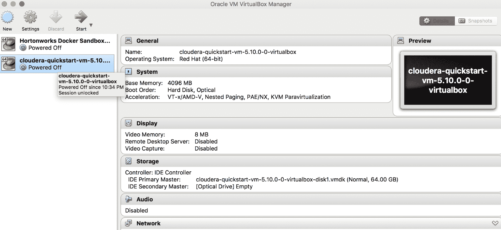

启动需要一些时间，因为它初始化所有与 CDH 相关的进程，如 DataNode、NameNode 等：

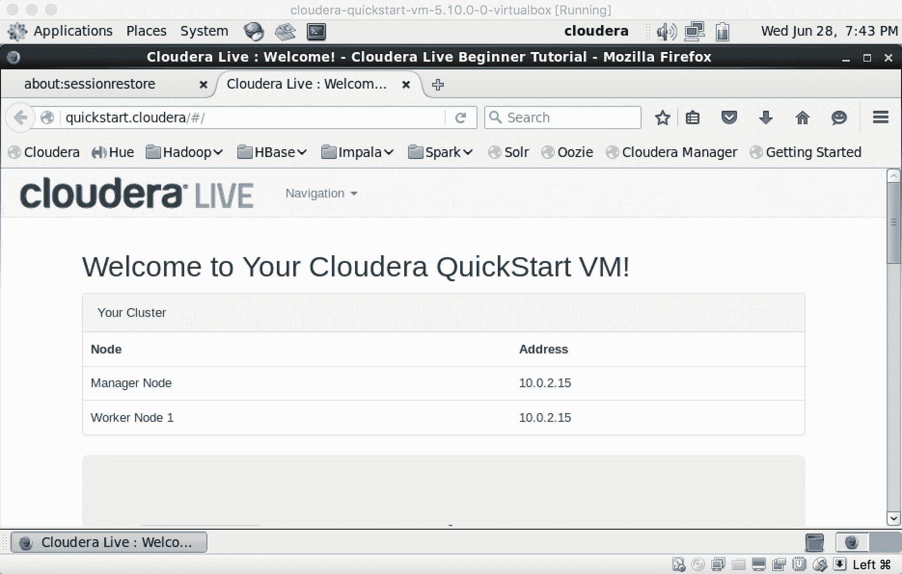

一旦进程启动，它将启动一个默认的着陆页，其中包含与 Hadoop 相关的许多教程的引用。在本节中，我们将在 Unix 终端中编写我们的 MapReduce 代码。从左上角菜单中启动终端，如下截图所示：


现在，我们必须按照以下步骤进行：

1.  创建一个名为`cyrus`的目录。这是我们将存储包含书文本的所有文件的地方。

1.  按照第 4 步所示运行`getCyrusFiles.sh`。这将把书下载到`cyrus`目录中。

1.  按照所示运行`processCyrusFiles.sh`。该书包含各种 Unicode 和不可打印字符。此外，我们希望将所有单词改为小写，以忽略相同但具有不同大小写的单词的重复计数。

1.  这将产生一个名为`cyrusprint.txt`的文件。该文件包含整本书的全部文本。我们将在这个文本文件上运行我们的 MapReduce 代码。

1.  准备`mapper.py`和`reducer.py`。顾名思义，`mapper.py`运行 MapReduce 过程的映射部分。同样，`reducer.py`运行 MapReduce 过程的减少部分。文件`mapper.py`将文档拆分为单词，并为文档中的每个单词分配一个值为一的值。文件`reducer.py`将读取`mapper.py`的排序输出，并对相同单词的出现次数进行求和（首先将单词的计数初始化为一，并在每个新单词的出现时递增）。最终输出是一个包含文档中每个单词计数的文件。

步骤如下：

1.  创建`getCyrusFiles.sh` - 此脚本将用于从网络中检索数据：

```scala
[cloudera@quickstart ~]$ mkdir cyrus 
[cloudera@quickstart ~]$ vi getCyrusFiles.sh 
[cloudera@quickstart ~]$ cat getCyrusFiles.sh  
for i in `seq 10` 
do 
curl www.artamene.org/documents/cyrus$i.txt -o cyrus$i.txt 
done 
```

1.  创建`processCyrusFiles.sh` - 此脚本将用于连接和清理在上一步中下载的文件：

```scala
[cloudera@quickstart ~]$ vi processCyrusFiles.sh 
[cloudera@quickstart ~]$ cat processCyrusFiles.sh  
cd ~/cyrus; 
for i in `ls cyrus*.txt` do cat $i >> cyrusorig.txt; done 
cat cyrusorig.txt | tr -dc '[:print:]' | tr A-Z a-z > cyrusprint.txt  
```

1.  更改权限为 755，以使`.sh`文件在命令提示符下可执行：

```scala
[cloudera@quickstart ~]$ chmod 755 getCyrusFiles.sh  
[cloudera@quickstart ~]$ chmod 755 processCyrusFiles.sh  
```

1.  执行`getCyrusFiles.sh`：

```scala
[cloudera@quickstart cyrus]$ ./getCyrusFiles.sh  
  % Total    % Received % Xferd  Average Speed   Time    Time     Time  Current 
                                 Dload  Upload   Total   Spent    Left  Speed 
100  908k  100  908k    0     0   372k      0  0:00:02  0:00:02 --:--:--  421k 
  % Total    % Received % Xferd  Average Speed   Time    Time     Time  Current 
                                 Dload  Upload   Total   Spent    Left  Speed 
100 1125k  100 1125k    0     0   414k      0  0:00:02  0:00:02 --:--:--  471k 
  % Total    % Received % Xferd  Average Speed   Time    Time     Time  Current 
                                 Dload  Upload   Total   Spent    Left  Speed 
100 1084k  100 1084k    0     0   186k      0  0:00:05  0:00:05 --:--:--  236k 
  % Total    % Received % Xferd  Average Speed   Time    Time     Time  Current 
                                 Dload  Upload   Total   Spent    Left  Speed 
100 1048k  100 1048k    0     0   267k      0  0:00:03  0:00:03 --:--:--  291k 
  % Total    % Received % Xferd  Average Speed   Time    Time     Time  Current 
                                 Dload  Upload   Total   Spent    Left  Speed 
100 1116k  100 1116k    0     0   351k      0  0:00:03  0:00:03 --:--:--  489k 
  % Total    % Received % Xferd  Average Speed   Time    Time     Time  Current 
                                 Dload  Upload   Total   Spent    Left  Speed 
100 1213k  100 1213k    0     0   440k      0  0:00:02  0:00:02 --:--:--  488k 
  % Total    % Received % Xferd  Average Speed   Time    Time     Time  Current 
                                 Dload  Upload   Total   Spent    Left  Speed 
100 1119k  100 1119k    0     0   370k      0  0:00:03  0:00:03 --:--:--  407k 
  % Total    % Received % Xferd  Average Speed   Time    Time     Time  Current 
                                 Dload  Upload   Total   Spent    Left  Speed 
100 1132k  100 1132k    0     0   190k      0  0:00:05  0:00:05 --:--:--  249k 
  % Total    % Received % Xferd  Average Speed   Time    Time     Time  Current 
                                 Dload  Upload   Total   Spent    Left  Speed 
100 1084k  100 1084k    0     0   325k      0  0:00:03  0:00:03 --:--:--  365k 
  % Total    % Received % Xferd  Average Speed   Time    Time     Time  Current 
                                 Dload  Upload   Total   Spent    Left  Speed 
100 1259k  100 1259k    0     0   445k      0  0:00:02  0:00:02 --:--:--  486k 

[cloudera@quickstart cyrus]$ ls 
cyrus10.txt  cyrus3.txt  cyrus6.txt  cyrus9.txt 
cyrus1.txt   cyrus4.txt  cyrus7.txt  getCyrusFiles.sh 
cyrus2.txt   cyrus5.txt  cyrus8.txt  processCyrusFiles.sh 

```

1.  执行`processCyrusFiles.sh`：

```scala

[cloudera@quickstart cyrus]$ ./processCyrusFiles.sh  

[cloudera@quickstart cyrus]$ ls 
cyrus10.txt  cyrus3.txt  cyrus6.txt  cyrus9.txt      getCyrusFiles.sh 
cyrus1.txt   cyrus4.txt  cyrus7.txt  cyrusorig.txt   processCyrusFiles.sh 
cyrus2.txt   cyrus5.txt  cyrus8.txt  cyrusprint.txt 

[cloudera@quickstart cyrus]$ ls -altrh cyrusprint.txt  
-rw-rw-r-- 1 cloudera cloudera 11M Jun 28 20:02 cyrusprint.txt 

[cloudera@quickstart cyrus]$ wc -w cyrusprint.txt  
1953931 cyrusprint.txt 
```

1.  执行以下步骤，将最终文件`cyrusprint.txt`复制到 HDFS，创建`mapper.py`和`reducer.py`脚本。

`mapper.py`和`reducer.py`文件在 Glenn Klockwood 的网站上有引用（[`www.glennklockwood.com/data-intensive/hadoop/streaming.html`](http://www.glennklockwood.com/data-intensive/hadoop/streaming.html)），该网站提供了大量关于 MapReduce 和相关主题的信息。

以下代码显示了`mapper.py`的内容：

```scala
[cloudera@quickstart cyrus]$ hdfs dfs -ls /user/cloudera 

[cloudera@quickstart cyrus]$ hdfs dfs -mkdir /user/cloudera/input 

[cloudera@quickstart cyrus]$ hdfs dfs -put cyrusprint.txt /user/cloudera/input/ 

[cloudera@quickstart cyrus]$ vi mapper.py 

[cloudera@quickstart cyrus]$ cat mapper.py  
#!/usr/bin/env python 
#the above just indicates to use python to intepret this file 
#This mapper code will input a line of text and output <word, 1> # 

import sys 
sys.path.append('.') 

for line in sys.stdin: 
   line = line.strip() 
   keys = line.split() 
   for key in keys: 
          value = 1 
          print ("%s\t%d" % (key,value)) 

[cloudera@quickstart cyrus]$ vi reducer.py # Copy-Paste the content of reducer.py as shown below using the vi or nano Unix editor.

[cloudera@quickstart cyrus]$ cat reducer.py  
#!/usr/bin/env python 

import sys 
sys.path.append('.') 

last_key = None 
running_total = 0 

for input_line in sys.stdin: 
   input_line = input_line.strip() 
   this_key, value = input_line.split("\t", 1) 
   value = int(value) 

   if last_key == this_key: 
       running_total += value 
   else: 
       if last_key: 
           print("%s\t%d" % (last_key, running_total)) 
       running_total = value 
       last_key = this_key 

if last_key == this_key: 
   print( "%s\t%d" % (last_key, running_total) ) 

[cloudera@quickstart cyrus]$ chmod 755 *.py
```

1.  执行 mapper 和 reducer 脚本，执行 MapReduce 操作以产生词频统计。您可能会看到如下所示的错误消息，但出于本练习的目的（以及为了生成结果），您可以忽略它们：

```scala
[cloudera@quickstart cyrus]$ hadoop jar /usr/lib/hadoop-mapreduce/hadoop-streaming.jar -input /user/cloudera/input -output /user/cloudera/output -mapper /home/cloudera/cyrus/mapper.py -reducer /home/cloudera/cyrus/reducer.py 

packageJobJar: [] [/usr/lib/hadoop-mapreduce/hadoop-streaming-2.6.0-cdh5.10.0.jar] /tmp/streamjob1786353270976133464.jar tmpDir=null 
17/06/28 20:11:21 INFO client.RMProxy: Connecting to ResourceManager at /0.0.0.0:8032 
17/06/28 20:11:21 INFO client.RMProxy: Connecting to ResourceManager at /0.0.0.0:8032 
17/06/28 20:11:22 INFO mapred.FileInputFormat: Total input paths to process : 1 
17/06/28 20:11:22 INFO mapreduce.JobSubmitter: number of splits:2 
17/06/28 20:11:23 INFO mapreduce.JobSubmitter: Submitting tokens for job: job_1498704103152_0002 
17/06/28 20:11:23 INFO impl.YarnClientImpl: Submitted application application_1498704103152_0002 
17/06/28 20:11:23 INFO mapreduce.Job: The url to track the job: http://quickstart.cloudera:8088/proxy/application_1498704103152_0002/ 
17/06/28 20:11:23 INFO mapreduce.Job: Running job: job_1498704103152_0002 
17/06/28 20:11:30 INFO mapreduce.Job: Job job_1498704103152_0002 running in uber mode : false 
17/06/28 20:11:30 INFO mapreduce.Job:  map 0% reduce 0% 
17/06/28 20:11:41 INFO mapreduce.Job:  map 50% reduce 0% 
17/06/28 20:11:54 INFO mapreduce.Job:  map 83% reduce 0% 
17/06/28 20:11:57 INFO mapreduce.Job:  map 100% reduce 0% 
17/06/28 20:12:04 INFO mapreduce.Job:  map 100% reduce 100% 
17/06/28 20:12:04 INFO mapreduce.Job: Job job_1498704103152_0002 completed successfully 
17/06/28 20:12:04 INFO mapreduce.Job: Counters: 50 
   File System Counters 
          FILE: Number of bytes read=18869506 
          FILE: Number of bytes written=38108830 
          FILE: Number of read operations=0 
          FILE: Number of large read operations=0 
          FILE: Number of write operations=0 
          HDFS: Number of bytes read=16633042 
          HDFS: Number of bytes written=547815 
          HDFS: Number of read operations=9 
          HDFS: Number of large read operations=0 
          HDFS: Number of write operations=2 
   Job Counters  
          Killed map tasks=1 
          Launched map tasks=3 
          Launched reduce tasks=1 
          Data-local map tasks=3 
          Total time spent by all maps in occupied slots (ms)=39591 
          Total time spent by all reduces in occupied slots (ms)=18844 
          Total time spent by all map tasks (ms)=39591 
          Total time spent by all reduce tasks (ms)=18844 
          Total vcore-seconds taken by all map tasks=39591 
          Total vcore-seconds taken by all reduce tasks=18844 
          Total megabyte-seconds taken by all map tasks=40541184 
          Total megabyte-seconds taken by all reduce tasks=19296256 
   Map-Reduce Framework 
          Map input records=1 
          Map output records=1953931 
          Map output bytes=14961638 
          Map output materialized bytes=18869512 
          Input split bytes=236 
          Combine input records=0 
          Combine output records=0 
          Reduce input groups=45962 
          Reduce shuffle bytes=18869512 
          Reduce input records=1953931 
          Reduce output records=45962 
          Spilled Records=3907862 
          Shuffled Maps =2 
          Failed Shuffles=0 
          Merged Map outputs=2 
          GC time elapsed (ms)=352 
          CPU time spent (ms)=8400 
          Physical memory (bytes) snapshot=602038272 
          Virtual memory (bytes) snapshot=4512694272 
          Total committed heap usage (bytes)=391979008 
   Shuffle Errors 
          BAD_ID=0 
          CONNECTION=0 
          IO_ERROR=0 
          WRONG_LENGTH=0 
          WRONG_MAP=0 
          WRONG_REDUCE=0 
   File Input Format Counters  
          Bytes Read=16632806 
   File Output Format Counters  
          Bytes Written=547815 
17/06/28 20:12:04 INFO streaming.StreamJob: Output directory: /user/cloudera/output
```

1.  结果存储在 HDFS 中的`/user/cloudera/output`目录下，文件名以`part-`为前缀：

```scala
[cloudera@quickstart cyrus]$ hdfs dfs -ls /user/cloudera/output 
Found 2 items 
-rw-r--r--   1 cloudera cloudera          0 2017-06-28 20:12 /user/cloudera/output/_SUCCESS 
-rw-r--r--   1 cloudera cloudera     547815 2017-06-28 20:12 /user/cloudera/output/part-00000  
```

1.  要查看文件的内容，请使用`hdfs dfs -cat`并提供文件名。在这种情况下，我们查看输出的前 10 行：

```scala
[cloudera@quickstart cyrus]$ hdfs dfs -cat /user/cloudera/output/part-00000 | head -10 
!  1206 
!) 1 
!quoy,    1 
'  3 
'' 1 
'. 1 
'a 32 
'appelloit 1 
'auoit    1 
'auroit   10  
```

# 使用 Hive 分析石油进口价格

在本节中，我们将使用 Hive 分析 1980-2016 年间世界各国的石油进口价格。数据可从**OECD**（经济合作与发展组织）的网站上获取，网址如下截图所示：


实际的 CSV 文件可从[`stats.oecd.org/sdmx-json/data/DP_LIVE/.OILIMPPRICE.../OECD?contentType=csv&amp;detail=code&amp;separator=comma&amp;csv-lang=en`](https://stats.oecd.org/sdmx-json/data/DP_LIVE/.OILIMPPRICE.../OECD?contentType=csv&detail=code&separator=comma&csv-lang=en)获取。

由于我们将在 Hive 中加载数据，因此通过 Cloudera Quickstart CDH 环境中的终端将文件下载到我们的主目录是有意义的。我们将执行以下步骤：

1.  将 CSV 文件下载到 CDH 环境中：

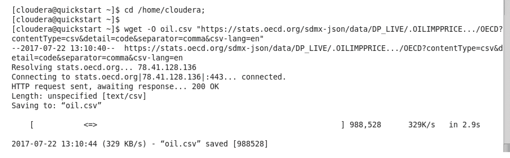

```scala
# Download the csv file 
cd /home/cloudera; 
wget -O oil.csv "https://stats.oecd.org/sdmx-json/data/DP_LIVE/.OILIMPPRICE.../OECD?contentType=csv&amp;detail=code&amp;separator=comma&amp;csv-lang=en" 
```

1.  清理 CSV 文件。数据清洗是数据科学中非常重要的领域。在实践中，经常会收到需要清洗的文件。这是因为列中可能包含无效字符或值、缺失数据、缺少或额外的分隔符等。我们注意到各种值都用双引号（"）括起来。在 Hive 中，我们可以通过在创建表时指定`quoteChar`属性来忽略引号。由于 Linux 也提供了简单易行的方法来删除这些字符，我们使用`sed`来删除引号：

```scala
[cloudera@quickstart ~]$ sed -i 's/\"//g' oil.csv 
```

此外，在我们下载的文件`oil.csv`中，我们观察到存在可能引起问题的不可打印字符。我们通过发出以下命令将它们删除：

```scala
[cloudera@quickstart ~]$ tr -cd '\11\12\15\40-\176' oil_.csv > oil_clean.csv
```

（来源：[`alvinalexander.com/blog/post/linux-unix/how-remove-non-printable-ascii-characters-file-unix`](http://alvinalexander.com/blog/post/linux-unix/how-remove-non-printable-ascii-characters-file-unix)）

最后，我们将新文件（`oil_clean.csv`）复制到`oil.csv`。由于`oil.csv`文件已存在于同一文件夹中，我们收到了覆盖消息，我们输入`yes`：

```scala
[cloudera@quickstart ~]$ mv oil_clean.csv oil.csv 
mv: overwrite `oil.csv'? yes 
```

1.  登录到 Cloudera Hue：

在浏览器的书签栏中点击 Hue。这将显示 Cloudera 登录界面。使用 ID`cloudera`和密码`cloudera`登录：

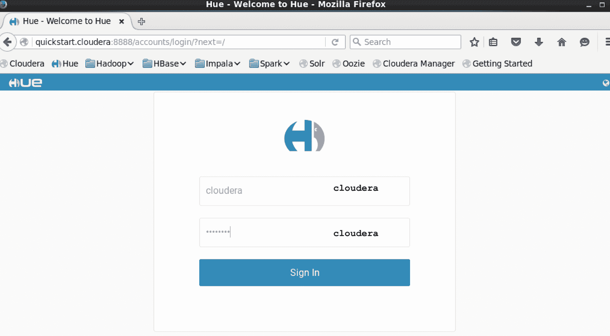

1.  从 Hue 登录窗口的快速启动下拉菜单中选择 Hue：

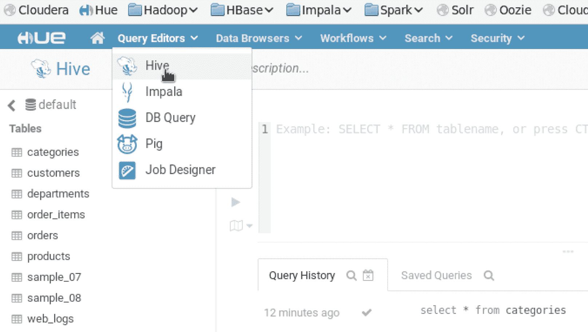

1.  创建表模式，加载 CSV 文件`oil.csv`，并查看记录：

```scala
CREATE TABLE IF NOT EXISTS OIL 
   (location String, indicator String, subject String, measure String,  
   frequency String, time String, value Float, flagCode String) 
   ROW FORMAT DELIMITED 
   FIELDS TERMINATED BY ',' 
   LINES TERMINATED BY '\n' 
   STORED AS TEXTFILE 
   tblproperties("skip.header.line.count"="1"); 

LOAD DATA LOCAL INPATH '/home/cloudera/oil.csv' INTO TABLE OIL; 
SELECT * FROM OIL; 
```

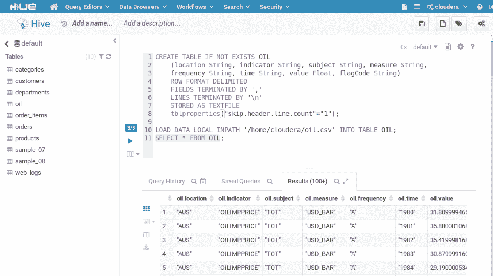

1.  加载石油文件。

1.  现在表已加载到 Hive 中，您可以使用 HiveQL 运行各种 Hive 命令。这些命令的完整集合可在[`cwiki.apache.org/confluence/display/Hive/LanguageManual`](https://cwiki.apache.org/confluence/display/Hive/LanguageManual)上找到。

例如，要查找 1980-2015 年（数据集的日期范围）每个国家的石油价格的最大值、最小值和平均值，我们可以使用熟悉的 SQL 运算符。查询如下：

```scala
SELECT LOCATION, MIN(value) as MINPRICE, AVG(value) as AVGPRICE,  
MAX(value) as MAXPRICE 
FROM OIL 
WHERE FREQUENCY LIKE "A" 
GROUP BY LOCATION; 
```

以下是相同的截图：

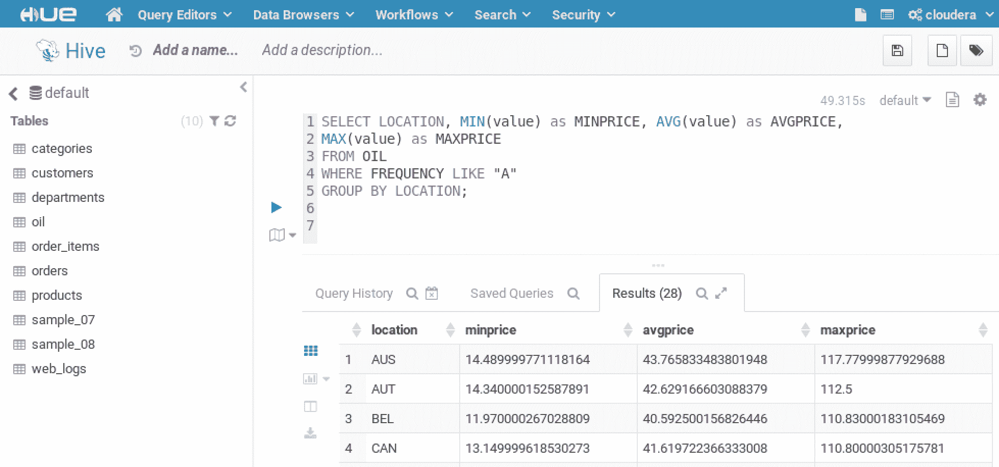

类似地，我们可以使用一系列其他 SQL 命令。Hive 手册详细介绍了这些命令以及数据保存、查询和检索的各种方式。

Hue 包括一系列有用的功能，如数据可视化、数据下载等，允许用户对数据进行临时分析。

要访问可视化功能，请在结果部分的网格图标下方点击可视化图标，如下截图所示：

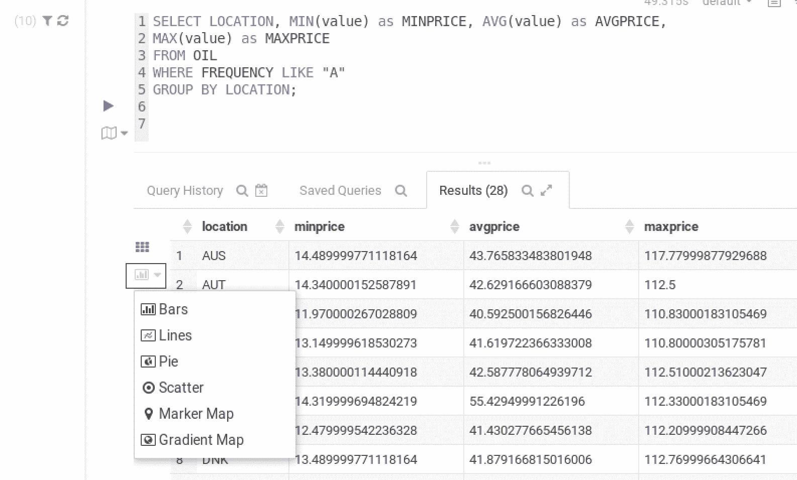

选择散点图。在 Hue 中，这种类型的图表，也被更普遍地称为散点图，允许用户非常容易地创建多变量图表。可以选择 x 和 y 轴的不同数值，以及散点大小和分组，如下截图所示：

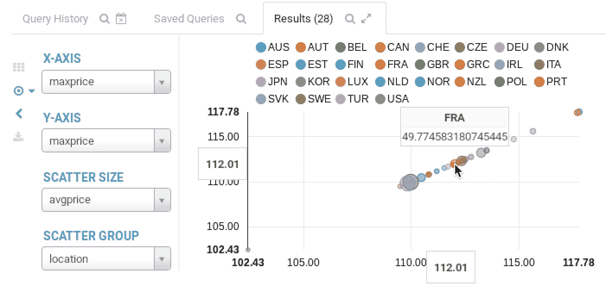

以下是一个简单的饼图，可以通过在下拉菜单中选择饼图来构建：

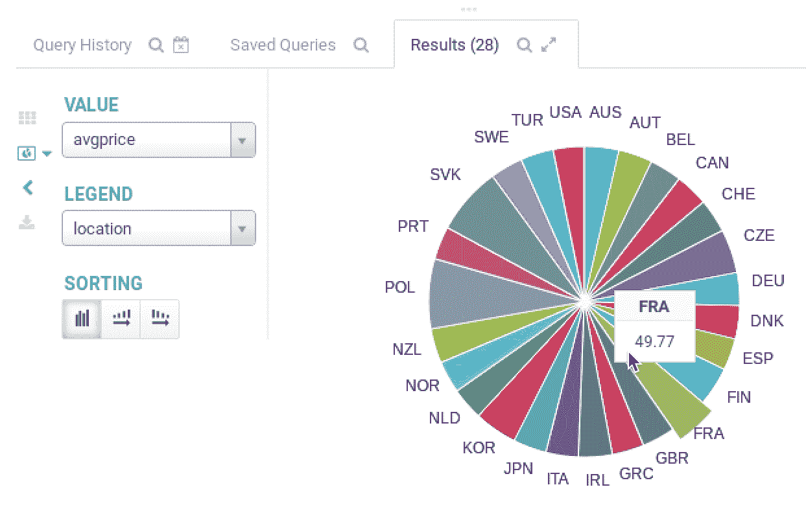

# 在 Hive 中连接表格

Hive 支持高级连接功能。以下是使用左连接的过程。如图所示，原始表格中有每个国家的数据，用它们的三字母国家代码表示。由于 Hue 支持地图图表，我们可以添加纬度和经度的数值，将石油定价数据叠加在世界地图上。

为此，我们需要下载一个包含纬度和经度数值的数据集：

```scala
# ENTER THE FOLLOWING IN THE UNIX TERMINAL 
# DOWNLOAD LATLONG CSV FILE 

cd /home/cloudera; 
wget -O latlong.csv "https://gist.githubusercontent.com/tadast/8827699/raw/7255fdfbf292c592b75cf5f7a19c16ea59735f74/countries_codes_and_coordinates.csv" 

# REMOVE QUOTATION MARKS 
sed -i 's/\"//g' latlong.csv 
```

一旦文件被下载和清理，就在 Hive 中定义模式并加载数据：

```scala
CREATE TABLE IF NOT EXISTS LATLONG 
   (country String, alpha2 String, alpha3 String, numCode Int, latitude Float, longitude Float) 
   ROW FORMAT DELIMITED 
   FIELDS TERMINATED BY ',' 
   LINES TERMINATED BY '\n' 
   STORED AS TEXTFILE 
   TBLPROPERTIES("skip.header.line.count"="1"); 

LOAD DATA LOCAL INPATH '/home/cloudera/latlong.csv' INTO TABLE LATLONG; 

```

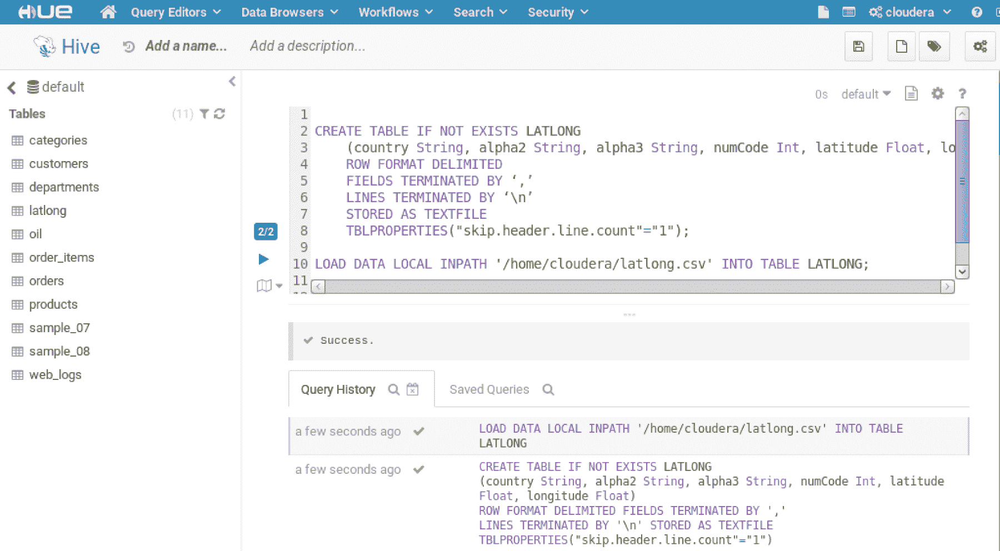

将石油数据与纬度/经度数据进行连接：

```scala
SELECT DISTINCT * FROM 
(SELECT location, avg(value) as AVGPRICE from oil GROUP BY location) x 
LEFT JOIN 
(SELECT TRIM(ALPHA3) AS alpha3, latitude, longitude from LATLONG) y 
ON (x.location = y.alpha3); 
```

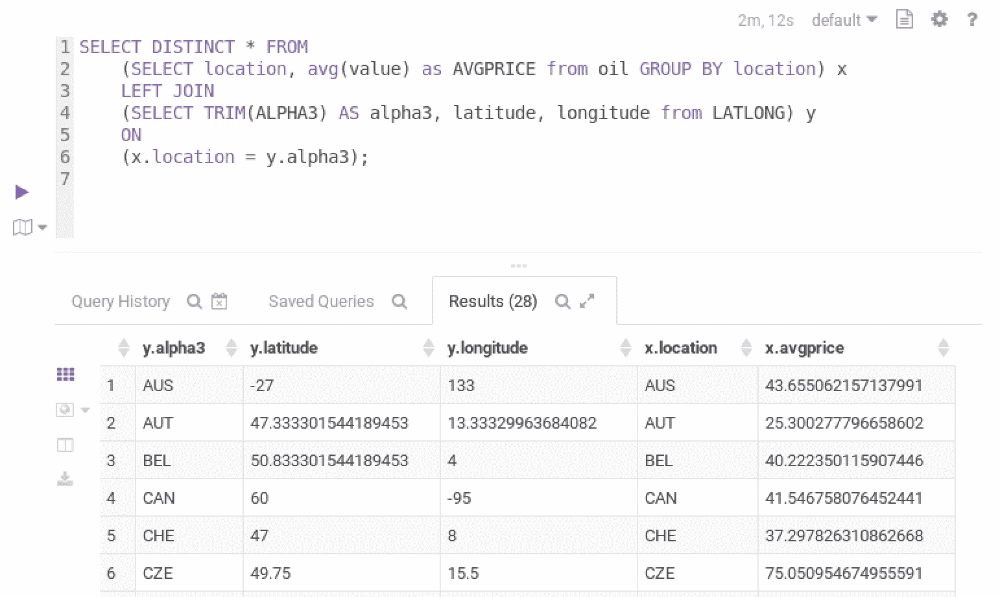

现在我们可以开始创建地理空间可视化。请记住，这些是在 Hue 中提供非常方便的查看数据的初步可视化。可以使用 shapefile、多边形和其他高级图表方法在地理数据上开发更深入的可视化。

从下拉菜单中选择渐变地图，并输入适当的数值来创建图表，如下图所示：

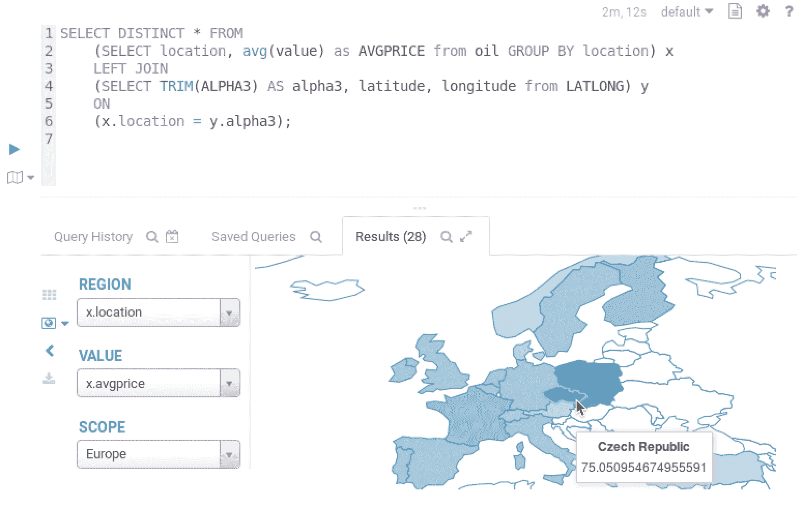

下一个图表是使用下拉菜单中的标记地图选项开发的。它使用三个字符的国家代码来在相应的区域放置标记和相关数值，如下图所示：

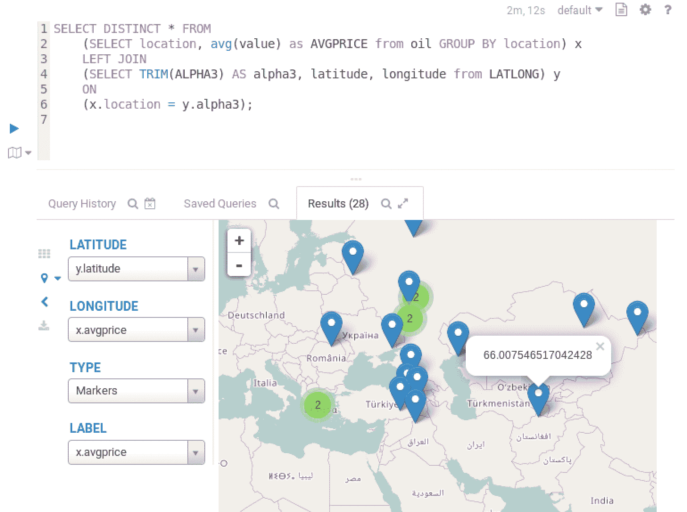

# 总结

本章提供了 Hadoop 的技术概述。我们讨论了 Hadoop 的核心组件和核心概念，如 MapReduce 和 HDFS。我们还研究了使用 Hadoop 的技术挑战和考虑因素。虽然在概念上可能看起来很简单，但 Hadoop 架构的内部运作和正式管理可能相当复杂。在本章中，我们强调了其中一些。

我们以使用 Cloudera Distribution 的 Hadoop 进行了实际操作的方式结束。对于本教程，我们使用了之前从 Cloudera 网站下载的 CDH 虚拟机。

在下一章中，我们将看一下 NoSQL，这是 Hadoop 的一个替代或补充解决方案，取决于您个人和/或组织的需求。虽然 Hadoop 提供了更丰富的功能集，但如果您的预期用例可以简单地使用 NoSQL 解决方案，后者可能是在所需的努力方面更容易的选择。
