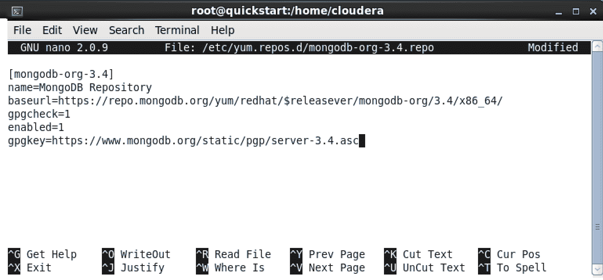

# 第五章：使用 NoSQL 进行大数据挖掘

术语**NoSQL**最初是由 Carlo Strozzi 使用的，他在 1998 年发布了 Strozzi NoSQL 开源关系数据库。在 2000 年代末，数据库架构中出现了新的范式，其中许多范式不符合关系数据库系统所需的严格约束。由于这些数据库不符合 ACID 兼容性等标准数据库约定，它们很快被归为一个称为 NoSQL 的广泛类别。

每个 NoSQL 数据库都声称对某些用例最优。虽然其中很少有适合成为通用数据库管理系统的要求，但它们都在整个 NoSQL 系统范围内利用了一些共同的主题。

在本章中，我们将讨论 NoSQL 数据库管理系统的一些广泛类别。我们将讨论引发迁移到 NoSQL 数据库系统的主要驱动因素，以及这些数据库如何解决导致它们广泛采用的特定业务需求，并最后进行一些 NoSQL 实际练习。

本章涵盖的主题包括：

+   为什么选择 NoSQL？

+   NoSQL 数据库

+   内存数据库

+   列式数据库

+   面向文档的数据库

+   键值数据库

+   图数据库

+   其他 NoSQL 类型和总结

+   NoSQL 系统的实际练习

# 为什么选择 NoSQL？

术语 NoSQL 通常意味着*不仅仅是 SQL*：也就是说，底层数据库具有与常见和传统数据库系统不同的属性。因此，除了它们不提供 ACID 兼容性的特征之外，没有明确的区分资格数据库作为 NoSQL 的标准。因此，了解 ACID 属性的性质将有助于理解数据库系统多年来的主要特点，以及简要讨论 BASE 和 CAP 的重要性，这两个术语是当今数据库的核心术语。

# ACID、BASE 和 CAP 属性

让我们首先讨论 ACID 和 SQL。

# ACID 和 SQL

ACID 代表原子性、一致性、隔离性和持久性：

+   **原子性**：这表示数据库事务要么完全执行，要么根本不执行。换句话说，要么所有事务都应该被提交，即完全持久化，要么根本不提交。没有部分执行事务的余地。

+   **一致性**：对数据的约束，即确定数据库内数据管理的规则，将在整个数据库中保持一致。不同的实例不会遵守与数据库其他实例不同的规则。

+   **隔离性**：此属性定义了并发操作（事务）如何读取和写入数据的规则。例如，如果某个记录正在被更新，而另一个进程读取同一条记录，数据库系统的隔离级别将决定返回给用户的数据版本。

+   **持久性**：数据库系统的持久性通常表示已提交的事务即使在系统故障的情况下也将保持持久。这通常通过数据库可以在恢复期间参考的事务日志来管理。

读者可能会注意到这里定义的所有属性主要与数据库事务有关。**事务**是遵守上述规则并对数据库进行更改的操作单元。例如，从 ATM 机中典型的取款可能有以下逻辑路径：

1.  用户从 ATM 机中取款

1.  银行检查用户的当前余额

1.  数据库系统从用户的账户中扣除相应的金额

1.  数据库系统更新用户账户中的金额以反映变化

因此，在 1990 年代中期之前广泛使用的大多数数据库，如 Oracle、Sybase、DB2 等，都针对记录和管理事务数据进行了优化。直到这个时候，大多数数据库都负责管理事务数据。90 年代中期互联网的快速增长导致出现了新类型的数据，这些数据不一定需要严格的 ACID 兼容性要求。YouTube 上的视频、Pandora 上的音乐和企业电子邮件记录都是事务数据库不会增加价值的用例的例子，除了作为存储数据的技术层之外。

# NoSQL 的 BASE 属性

到了 2000 年代末，数据量激增，显然需要一种新的替代模型来管理数据。这种新模型称为 BASE，成为取代 ACID 成为首选数据库管理系统模型的基础主题。

**BASE**代表**B**asically **A**vailable **S**oft-state **E**ventually consistency。这意味着数据库基本上大部分时间都可以使用；也就是说，可能会有一段时间服务不可用（因此应该实施额外的冗余措施）。*Soft-state*意味着系统的状态不能保证 - 相同数据的不同实例可能具有不同的内容，因为它可能还没有捕获集群另一部分的最新更新。最后，*eventually* consistent 意味着尽管数据库可能并非始终处于相同状态，但最终会达到相同状态；也就是说，变得*consistent*。

# CAP 定理

CAP 定理由 Eric Allen Brewer 于 1990 年代末首次提出，它对分布式数据库系统的约束或更一般地说特征进行了分类。简而言之，CAP 定理假设严格来说，数据库系统只能保证 CAP 定义的三个属性中的两个。

+   **一致性**：数据应该在数据库的所有实例中保持一致，因此，在查询时应该在所有节点上提供一致的结果

+   **可用性**：无论任何单个节点的状态如何，系统在执行查询时始终会响应结果（无论是否是最新提交）

+   **分区容错性**：这意味着当节点在网络上分离时，系统应该继续正常运行，即使任何节点失去与另一个节点的互联性

从这一点可以看出，在集群中，节点将通过*网络*连接，而网络本质上是可以中断的，因此必须保证分区容错性，以便系统能够继续正常运行。在这种情况下，争议在于选择一致性和可用性之间。例如，如果系统必须保持一致；也就是说，在所有节点上显示最新的提交，所有节点不能同时*可用*，因为一些节点可能没有最新的提交。在这种情况下，对新更新的查询将不会执行，直到所有节点都已更新为新数据。在可用性的情况下，以类似的术语，我们无法保证一致性，因为始终可用意味着一些节点将不具有与另一个节点相同的数据，如果新的更新尚未写入到相应的节点上。

在决定是确保一致性还是确保可用性之间存在很大的混乱和争议，因此数据库被分类为**CP**或**AP**。对于这个练习，我们不需要陷入术语，因为那将导致一场相当抽象和哲学的讨论。上述术语的信息主要是为了反映一些驱动数据库开发的基础理论。

# NoSQL 技术的需求

虽然大多数数据库系统最初是为了管理事务而设计的，但互联网相关技术的增长和不需要事务系统严格净化性质的新类型数据的增长，促使了替代框架的发展。

例如，存储以下类型的数据不一定需要复杂的*事务性数据库*：

+   电子邮件

+   媒体文件，如音频/视频文件

+   社交网络消息

+   网站 HTML 页面

+   许多其他类型的数据

此外，用户数量的增加，以及因此而产生的数据量，表明需要开发具有以下特点的更加健壮的架构：

+   可扩展以管理不断增加的数据量

+   利用商品硬件减少对昂贵硬件的依赖

+   提供跨多个节点的分布式处理能力，以处理大规模数据集

+   具有容错能力/提供高可用性以处理节点和站点故障

可扩展意味着系统可以通过增加节点数量（即横向扩展）来容纳数据量的增加。此外，增加节点数量对系统性能的影响应该最小。

容错意味着系统应该能够处理节点故障，在一个拥有数百甚至数千个节点的大型分布式系统中，这种情况并不罕见。

这导致了各种具有突破性和影响力的系统的发展，其中最显著的可能是 Google Bigtable 和 Amazon Dynamo。

# Google Bigtable

Bigtable 是一个于 2004 年启动的项目，旨在管理 Google 各种项目中使用的数据的可扩展性和性能。描述该系统特性的开创性论文于 2006 年发布（[`static.googleusercontent.com/media/research.google.com/en//archive/bigtable-osdi06.pdf`](https://static.googleusercontent.com/media/research.google.com/en//archive/bigtable-osdi06.pdf)），标题为*Bigtable: A Distributed Storage System for Structured Data*。实质上，Bigtable 是一个*列存储*（稍后详述），其中每个值可以使用行键、列键和时间戳唯一标识。它是最早体现将数据存储在列格式而不是使用更常见的基于行的布局的数据库之一。尽管在 Bigtable 之前存在诸如 kdb+和 Sybase IQ 之类的列式数据库，但行业领先者使用该方法来管理 PB 级别信息的概念将该概念推上了舞台。

Bigtable 的官方网站总结了键值主张：

Bigtable 旨在以一致的低延迟和高吞吐量处理大规模工作负载，因此它是操作和分析应用的绝佳选择，包括物联网、用户分析和金融数据分析。

自从 Bigtable 推出以来，其他几个 NoSQL 数据库也采用了列式数据布局的惯例；其中最著名的是 HBase 和 Accumulo，它们都是 Apache 项目。

Bigtable 解决方案如今可以在[`cloud.google.com/bigtable/`](https://cloud.google.com/bigtable/)上使用，并可以按订阅方式购买。较小数据量的费用相当低廉和合理，而更大的安装则需要更广泛的实施。

# Amazon Dynamo

就在 Google 宣布 Bigtable 不久之后，亚马逊在 2007 年 10 月举办的第 21 届操作系统原理研讨会上宣布了其内部 Dynamo 数据库（[`www.sosp2007.org`](http://www.sosp2007.org)）。

在这篇论文中，亚马逊描述了一种名为 Dynamo 的键值存储，该论文现在可以在 Werner Vogels 的网站上找到[`www.allthingsdistributed.com/files/amazon-dynamo-sosp2007.pdf`](http://www.allthingsdistributed.com/files/amazon-dynamo-sosp2007.pdf)，Dynamo 被用于支持亚马逊 AWS 上的一些最关键的内部服务，如 S3。该论文提出了一些关键概念，如键值存储、一致性哈希和向量时钟等，这些概念在 Dynamo 中得到了实现。

因此，Dynamo 为大规模数据集的列存储提供了一种替代方案，引入了一种基本不同的方法，利用了键值关联。

在接下来的几节中，我们将讨论各种类型的 NoSQL 技术，以及它们各自具有使它们对某些用例最优的特性。NoSQL 已经引领了我们对待数据库的范式转变，并为以前不可行的规模提供了急需的数据管理替代视图。

# NoSQL 数据库

在我们讨论 NoSQL 类型和数据库时，我们将主要关注 NoSQL 数据库的以下特性：

+   内存数据库

+   列式数据库

+   面向文档的数据库

+   键值数据库

+   图数据库

+   其他 NoSQL 类型和总结

今天在行业中使用的大多数 NoSQL 类型都属于这些类别中的一个或多个。接下来的几节将讨论每种 NoSQL 产品的高级特性、它们的主要优势以及市场上属于各自类别的产品。

# 内存数据库

**内存数据库**，顾名思义，利用计算机内存，即 RAM，来存储数据集。在我们研究内存数据库如何工作之前，值得回顾一下典型计算机中数据传输是如何发生的：


简单数据流计算机层次结构

如前图所示，数据从磁盘到内存到 CPU。这是对确切过程的非常高级的概括，因为在 CPU 不需要发送指令从内存读取数据的条件下（例如当数据已经存在于 CPU L2 缓存中 - 这是 CPU 中包含用于缓存数据的内存的一部分），但从根本上讲，CPU、RAM 和磁盘之间的过程是线性的。

存储在磁盘上的数据可以以取决于磁盘的 I/O（输入/输出）吞吐量的一定速率转移到内存。从磁盘访问数据大约需要 10-20 毫秒（ms）。虽然确切的数字取决于数据的大小，但最小的寻道时间（磁盘找到数据位置所需的时间）本身大约是 10-15 毫秒。将这与从内存获取数据所需的时间相比，大约是 100 纳秒。最后，从 CPU L2 缓存读取数据大约需要 7 纳秒。

为了形象地说明这一点，15 毫秒的磁盘访问时间，即 15,000,000 纳秒，比从内存访问数据所需的时间慢 150,000 倍。换句话说，相对于磁盘，已经存在于内存中的数据可以以惊人的速度读取，快 150,000 倍。这基本上是读取随机数据的情况。读取顺序数据的时间可能不那么引人注目，但仍然快近一个数量级。

如果将磁盘和 RAM 表示为汽车，RAM *汽车*在磁盘汽车只能勉强行驶两英里的时间内已经到达月球并且正在返回的路上。这就是差距有多大。

因此，从这个自然地得出结论，如果数据存储在 RAM 中，特别是在较大数据集的情况下，访问时间将大大降低，因此数据处理的时间（至少在 I/O 级别上）将显着减少。

传统上，所有数据库数据都存储在磁盘上。随着互联网的出现，行业开始利用*memcached*，它提供了一种通过 API 将数据以键值对的形式存储在内存中的方法。例如，MySQL 数据库通常使用 memcached API 来将对象缓存在内存中，以优化读取速度并减少对主要（MySQL）数据库的负载。

然而，随着数据量的增加，使用数据库和 memcached 方法的复杂性开始显现，专门设计用于在内存中存储数据（有时同时存储在磁盘和内存中）的数据库正在迅速发展。

因此，内存数据库（如 Redis）开始取代 memcached 成为驱动网站的快速缓存存储。在 Redis 的情况下，尽管数据将以键值对的形式存储在内存中，但也有选项将数据持久化到磁盘上。这使其与严格的内存缓存解决方案（如 memcached）有所区别。

推动向内存数据库转变的主要因素可以总结如下：

+   通过传统的 MySQL + memcached 组合等方式来管理不断增加的数据量的复杂性，例如网站流量

+   降低了 RAM 成本，使购买更大容量的内存更加经济

+   整个行业都在朝着 NoSQL 技术发展，这导致了对新型创新数据库平台的增加关注和社区参与。

+   内存中更快的数据操作提供了一种减少 I/O 开销的方法，这在需要超快速、低延迟处理数据的情况下非常重要

如今，行业中提供内存功能的数据库的主要选择包括：

| **开源** | **商业** |
| --- | --- |
| Redis | Kdb+ |
| memcacheDB | Oracle TimesTen |
| Aerospike | SAP HANA |
| VoltDB | HP Vertica |
| Apache Ignite | Altibase |
| Apache Geode | Oracle Exalytics |
| MonetDB | MemSQL |

请注意，其中一些支持混合架构，数据可以同时存储在内存和磁盘中。一般来说，数据会从内存传输到磁盘以实现持久化。此外，一些商业内存数据库提供可以根据各自解决方案适用的许可证条款免费下载和使用的社区版本。在这些情况下，它们既是开源的，也是商业的。

# 列式数据库

列式数据库自 90 年代以来就存在，但在谷歌 Bigtable 发布后变得更加突出。它们本质上是一种存储数据的方法，可以以相对于基于行/元组的存储方式更快速和高效地查询非常大量的数据。

列式数据库的好处，或者更具体地说，独立存储每列数据，可以通过一个简单的例子来说明。

考虑一个包含 1 亿个家庭地址和电话号码的表。同时考虑一个简单的查询，要求用户找到纽约州 Albany 市中 1990 年后建造的家庭数量。我们将创建一个假设的表来说明按行和按列查询数据的差异。

**硬件特性**：

平均磁盘读取速度：每秒 200 MB

**数据库特性**：

表名：`housedb`

+   总行数=1 亿

+   纽约州的总行数=两百万

+   拥有纽约州 Albany 市的总行数=10,000

+   拥有纽约州 Albany 市和 YearBuilt > 1990 的总行数= 500

**数据大小**：

假设每行数据的大小如下：

+   PlotNumber，YearBuilt 各= 8 字节=总共 16 字节

+   所有者，地址，州和城市各= 12 字节=总共 48 字节

+   每行的净大小（字节）= 16 + 48 = 64 字节

请注意，实际大小将更大，因为还有其他考虑因素，如索引和其他表优化以及相关的开销，出于简单起见，我们不会在这里考虑。

我们还将假设列式数据库维护了一个隐式的行索引，允许在每个列*向量*中的特定索引处查询数据。

以下表显示了前 4 条记录：

| **PlotNumber** | **Owner** | **Address** | **State** | **City** | **YearBuilt** |
| --- | --- | --- | --- | --- | --- |
| 1 | John | 1 Main St. | WA | Seattle | 1995 |
| 2 | Mary | 20 J. Ave. | NY | Albany | 1980 |
| 3 | Jane | 5 45^(th) St. | NY | Rye Brook | 2001 |
| 4 | John | 10 A. Blvd. | CT | Stamford | 2010 |

总的来说，这张表有 1 亿条记录。最后几条记录如下所示：

| **PlotNumber** | **Owner** | **Address** | **State** | **City** | **YearBuilt** |
| --- | --- | --- | --- | --- | --- |
| 99999997 | Jim | 23 B. Lane | NC | Cary | 1995 |
| 99999998 | Mike | 5 L. Street | NY | Syracuse | 1993 |
| 99999999 | Tim | 10 A. Blvd. | NY | Albany | 2001 |
| 100000000 | Jack | 10 A. Blvd. | CT | Stamford | 2010 |

我们将对这个数据集运行以下查询：

```scala
select * from housedb where State like 'NY' and City like 'Albany' and YearBuilt > 1990 
```

**场景 A：逐行搜索**

在第一种情况下，如果我们进行天真的逐行搜索，由于每列的数据并未分开存储，而是扫描了每行的数据，我们将不得不查询以下内容：

1 亿 * 64 字节（每行的大小）= 6,400 万字节=大约 6000 MB 的数据

以 200 MBps 的磁盘读取速度来说，这意味着大约需要 6000 / 200 = 30 秒来读取所有记录以找到匹配的条目。

**场景 B：逐列搜索**

假设数据的每一列都存储在代表各自列的单独文件中，我们将逐个查找每个 where 子句：

```scala
select * from housedb where State like 'NY' and City like 'Albany' and YearBuilt > 1990 
```

1.  **Where clause part 1**: `where State like 'NY'`

如前所述，州列有 1 亿条记录，每条记录大小为 12 字节。

在这种情况下，我们只需要搜索以下内容：

1 亿 * 12 字节= 12 亿字节= 1000 MB 的数据。

以 200 MBps 的数据读取速率，这将花费 200 MB，读取列数据将花费 1000 / 200 = 5 秒。

这返回了两百万条记录（如前面所述的数据库特性）

1.  **Where clause part 2**: `City like 'Albany'`

在前面的步骤中，我们已经将搜索范围缩小到满足 NY 州条件的两百万条记录。在第二个 where 子句步骤中，现在，我们不需要查询所有 1 亿条记录。相反，我们只需查看满足条件的两百万条记录，以确定哪些属于 Albany 市。

在这种情况下，我们只需要搜索以下内容：

*2 百万 * 12 字节= 2400 万字节=大约 20 MB 的数据*。

以 200 MBps 的数据读取速率，这将花费 0.1 秒。

这返回了 1 万条记录（如前面在数据库特性中提到的）。

1.  **Where clause part 3**: `YearBuilt > 1990`

在前面的步骤中，我们进一步将搜索范围缩小到满足 NY 州和 Albany 市两个条件的 1 万条记录。在这一步中，我们将查询 1 万条 YearBuilt 列的记录，以确定哪些满足 YearBuilt > 1990 的条件。

在这种情况下，我们只需要搜索以下内容：

*10,000 * 16 字节= 160,000 字节=大约 150 KB 的数据*。

以 200 MBps 的数据读取速率，这将花费 0.00075 秒，我们可以四舍五入为零秒。

因此，在查询数据时花费的净时间为：

+   Where clause part 1: `where State like 'NY'` - 五秒

+   Where clause part 2: `City like 'Albany'` - 0.1 秒

+   Where clause part 3: `YearBuilt > 1990` - 零秒

读取数据所花费的净时间= 5.1 秒。

重要提示：实际的读取或更具体地说，扫描性能取决于各种其他因素。元组（行）的大小，重建元组的时间（元组重建），内存带宽（数据从主存储器读入 CPU 的速度等），缓存行大小和其他因素。在实践中，由于各种抽象级别，实际性能可能会较慢。此外，还有其他考虑因素，如硬件架构和并行操作，可以积极或否定地影响整体性能。这些主题更加深入，需要专门阅读。这里的分析专注于磁盘 I/O，这是整体性能的关键方面之一。

前面的示例演示了查询以列存储的数据的好处，从查询性能或效率的角度来看，这取决于数据的大小。列式数据还提供了另一个好处，即它允许以列的形式存储可能具有任意模式的表。

考虑前表的前四行。例如，如果某些行中有缺失信息，那将导致稀疏列：

| **PlotNumber** | **Owner** | **Address** | **State** | **City** | **YearBuilt** |
| --- | --- | --- | --- | --- | --- |
| 1 | John | 1 Main St. | *NULL* | 西雅图 | 1995 |
| 2 | Mary | 20 J. Ave. | 纽约 | *NULL* | *NULL* |
| 3 | Jane | *NULL* | 纽约 | 莱布鲁克 | *NULL* |
| 4 | John | 10 A. Blvd. | 康涅狄格 | *NULL* | *NULL* |

我们可以创建一个名为`Complete_Address`的`列族`，而不是填充 NULL 值，该列族可以包含与仅具有相应数据的字段对应的任意数量的键值对：

| **PlotNumber** | **Owner** | **Complete_Address** |  | **YearBuilt** |
| --- | --- | --- | --- | --- |
| 1 | John | 地址：1 Main St. | 城市：西雅图 | 1995 |
| 2 | Mary | 地址：20 J. Ave. | 州：纽约 | *NULL* |
| 3 | Jane | 州：纽约 | 城市：莱布鲁克 | *NULL* |
| 4 | John | 地址：10 A. Blvd. | 州：康涅狄格 | *NULL* |

列式数据库提供的第三个非常重要的好处是能够根据三个键检索数据：行键、列键和时间戳，这些键可以唯一标识每条记录，从而可以非常快速地访问所需的数据。

例如，由于所有权字段在财产（PlotNumber）出售时可能会更改，因此我们可以添加另一个字段，表示记录的日期；即记录对应的日期。这将允许我们区分在所有其他数据保持不变的情况下发生所有权变更的属性：

| **PlotNumber** | **Owner** | **Address** | **State** | **City** | **YearBuilt** | **RecordDate** |
| --- | --- | --- | --- | --- | --- | --- |
| 1 | John | 1 Main St. | 华盛顿 | 西雅图 | 1995 | 2001.04.02 |
| 2 | Mary | 20 J. Ave. | 纽约 | 奥尔巴尼 | 1980 | 2007.05.30 |
| 3 | Jane | 5 45^(th) St. | 纽约 | 莱布鲁克 | 2001 | 2001.10.24 |
| 4 | John | 10 A. Blvd. | 康涅狄格 | 斯坦福 | 2010 | 2003.07.20 |

由于每个 PlotNumber 可以有多条记录以适应所有权的变更，我们现在可以定义三个键，可以唯一标识每条记录中每个数据单元，如下所示：

+   行键：`PlotNumber`

+   列键：列名

+   时间戳键：`RecordDate`

表中每条记录中的每个单元格都将具有一个唯一的三值对，用于将其与其他单元格区分开来。

诸如 Bigtable、Cassandra 等数据库采用这种方法，以便迅速高效地进行大规模数据分析。

以下是一些流行的列式数据库。请注意，由于数据库可以具有多个 NoSQL 属性（例如内存和列式），因此可能会有重复：

| **开源** | **商业** |
| --- | --- |
| Apache Parquet | Kdb+ |
| MonetDB | Teradata |
| MariaDB | SAP HANA |
| Druid | HP Vertica |
| HBase | Oracle Exadata |
| Apache Kudu | ParAccel |
| Apache Arrow | Actian Vector |

# 面向文档的数据库

**基于文档或面向文档**的数据库作为存储具有可变结构的数据的手段变得突出；也就是说，每条记录不一定总是符合固定模式。此外，文档可能既有结构化部分，也有*非结构化*部分。

结构化数据本质上是可以以表格格式存储的数据，比如电子表格中的数据。存储在 Excel 电子表格或 MySQL 表中的数据都属于结构化数据集的类别。无法以严格的表格格式表示的数据，比如书籍、音频文件、视频文件或社交网络消息，被视为非结构化数据。因此，在面向文档的数据库中，我们将主要处理结构化和非结构化文本数据。

一个直观的解释是，数据可以包含结构化和非结构化文本，可以在电话日记的例子中找到。尽管随着数字数据存储的增长，这些已经越来越少见，但我们中的许多人可能还记得电话号码写在口袋本上的时候。下面的图片展示了我们如何在电话日记中存储数据：


地址簿（半结构化数据集）

在上面的例子中，以下字段可以被视为结构化的：

+   姓名

+   地址

+   电话和传真

在地址字段下面有一行，用户可以输入任意信息，例如，在 2015 年的一次会议上见面，就职于 ABC 公司。这本质上是日记记录者在输入具体信息时写下的一条注释。由于这样的自由格式字段没有明确定义的特征，它也可能包含第二个电话号码，或者备用地址和其他信息。这将被视为非结构化文本。

此外，由于其他字段之间没有相互依赖，用户可以填写地址但不填写电话号码，或者填写姓名和电话号码但不填写地址。

面向文档的数据库，凭借其存储无模式数据的能力；也就是说，不符合任何固定模式的数据，比如固定列和固定数据类型，因此是存储这些信息的合适平台。

因此，由于电话日记包含的数据量要小得多，在实践中，我们可以以其他格式存储它，但是当我们处理包含结构化和非结构化信息的大规模数据时，面向文档的数据集的必要性就变得明显起来。

以电话日记为例，数据可以以 JSON 格式存储在面向文档的数据集中，如下所示：

```scala
( 
 { 
   "name": "John", 
   "address": "1 Main St.", 
   "notes": "Met at conference in 2015", 
   "tel": 2013249978, 
 }, 
 { 
   "name": "Jack", 
   "address": "20 J. Blvd", 
   "notes": "Gym Instructor", 
   "tel": 2054584538, 
   "fax": 3482274573 
 } 
) 
```

**JSON**，全称**J**ava**S**cript **O**bject **N**otation，提供了一种以可移植的基于文本的键值对格式表示数据的方法。如今，JSON 格式的数据在整个行业中无处不在，并已成为存储没有固定模式的数据的标准。它也是一个很好的交换结构化数据的媒介，因此经常用于这样的数据集。

上述示例提供了一个基本的例子，以传达面向文档的数据库是如何工作的。因此，这是一个非常简单且直观的例子。在实践中，像 MongoDB 和 CouchDB 这样的面向文档的数据库被用来存储吉字节和太字节的信息。

例如，考虑一个网站，它存储用户及其电影偏好的数据。每个用户可能有多部他们观看过的电影，评分过的电影，推荐的电影，他们愿望清单中添加的电影，以及其他类似的物品。在这种情况下，数据集中有各种任意的元素，其中许多是可选的，许多可能包含多个值（例如，用户推荐的多部电影），使用 JSON 格式来捕获信息变得最优。这就是面向文档的数据库提供了一个优越和最佳的平台来存储和交换数据的地方。

更具体地说，诸如 MongoDB 之类的数据库以 BSON 格式存储信息，这是 JSON 文档的二进制版本，具有额外的优化以适应数据类型、Unicode 字符和其他功能，以提高基本 JSON 文档的性能。

更全面的一个存储在 MongoDB 中的 JSON 文档的例子可能是关于航空乘客的数据，其中包含了关于个别乘客的许多属性的信息，例如：

```scala
{ 
   "_id" : ObjectId("597cdbb193acc5c362e7ae96"), 
   "firstName" : "Rick", 
   "age" : 66, 
   "frequentFlyer" : ( 
          "Delta" 
   ), 
   "milesEarned" : ( 
          88154 
   ) 
} 
{ 
   "_id" : ObjectId("597cdbb193acc5c362e7ae97"), 
   "firstName" : "Nina", 
   "age" : 53, 
   "frequentFlyer" : ( 
          "Delta", 
          "JetBlue", 
          "Delta" 
   ), 
   "milesEarned" : ( 
          59226, 
          62025, 
          27493 
   ) 
} 
```

每个条目都由`_id`字段唯一标识，这使我们能够直接查询与特定用户相关的信息，并在不必查询数百万条记录的情况下检索数据。

如今，面向文档的数据库被用来存储各种各样的数据集。例如包括以下用法：

+   日志文件和与日志文件相关的信息

+   文章和其他基于文本的出版物

+   地理位置数据

+   用户/用户账户相关信息

+   许多更适合基于文档/JSON 的存储的用例

知名的面向文档的数据库包括以下内容：

| **开源** | **商业** |
| --- | --- |
| MongoDB | Azure Cosmos DB |
| CouchDB | OrientDB |
| Couchbase Server | Marklogic |

# 键值数据库

**键值数据库**的操作原则是将数据结构化为与键对应的值对。为了突出键值数据库的好处，有必要重新审视哈希映射的重要性，哈希映射是计算机科学中常见的术语，用于指定一种独特的数据结构，为键对提供常数时间查找。

哈希表的一个直观例子如下：

考虑一组 500 本书和五个书架。每个书架有五层。书可以以任意顺序放置，但这将使查找特定书籍变得非常困难，您可能需要在找到所需的书之前浏览数百本书。对书籍进行分类的一种方法是为每个书架分配字母范围，例如 A-E，F-J，K-O，P-T，U-Z，并使用书名的第一个字母将其分配到特定的书架上。然而，假设您有大量以 A-E 字母开头的书。这意味着为 A-E 分配的书架相对于其他书架有更多的书。

一个更优雅的替代方案可能是为每本书分配一个值，并使用相应的值来确定书屋或书架属于哪本书。为了为每本书分配一个数字，我们可以使用书名中每个字母对应的数字之和，分别使用 1-26 的范围来对 A-Z 的字母进行编号：


我们的简单哈希映射

由于我们有五个书架，每个书架有五层，所以我们总共有 25 个书架。将书分配到特定书架的一种方法是取书名中字母的数字值，将其相加并除以 26 得到书的数字值。任何数字除以 25 都会得到 0-25 之间的余数；也就是说，26 个唯一的值。然后我们可以使用这个值来将书分配到特定的书架上。这就成为我们自己创建的哈希函数。

在这 25 个书架中，每个书架现在分配了一个与值 0-25 相对应的数字值，最后一个书架分配了值 24 和 25。例如，书架零被分配用于存储其数字值除以 26 得到零的书籍，书架一被分配用于存储其数字值除以 26 得到一的书籍，书架 25 被分配用于存储其数字值除以 26 得到 24 或 25 的书籍。

一个例子将有助于更具体地说明这个概念。

书名：**哈姆雷特**

标题的数字值：


哈希值

数字值的总和 = 8 + 1 + 13 + 12 + 5 + 20 = 59

将数字除以 26 = 2，余数为 7

因此，这本书被分配到第七个书架上。

我们基本上找到了一种有条不紊地为每本书分配书架的方法，因为我们有一个固定的规则，所以当新的书籍请求到达时，我们几乎可以立即找到它，因为我们将知道与书籍对应的书架。

上述方法说明了哈希的概念，在实践中，我们将使用一个哈希函数为每本书找到一个唯一的值，假设我们可以获得任意数量的书架和槽，我们可以简单地使用书的纯数值来确定它应该属于哪个书架。

有些情况下，两本书可能具有相同的数值，这种情况下，我们可以将书籍堆叠在相应的槽中。在计算机科学中，多个值对应一个键的这种效果被称为碰撞，在这种情况下，我们将通过列表或类似的数据类型分配多个项目。

在实际应用中，我们要处理的项目比书籍的简单示例要复杂得多。通常，我们会使用更复杂的哈希函数，以降低碰撞的几率，并相应地分配键值对。数据将存储在内存中的连续数组中，因此，当请求某个键时，我们可以通过使用哈希函数来立即找到数据所在的内存位置。

因此，使用键值对存储数据可能非常强大，因为检索与键对应的信息的时间可以非常快，因为无需搜索长列表以识别匹配的键。

键值数据库采用相同的原则为每个记录分配唯一的键，并且与每个键对应的数据存储在相应的位置。在我们讨论 MongoDB 时，我们看到记录被分配了一个特定的键，该键在每个记录中由`_id`值标识。在实践中，我们可以使用这个值以恒定时间检索相应的数据。

如前所述，memcached 曾经是存储键值对数据的首选方法，用于需要对频繁使用的数据进行非常快速访问的网络服务。实质上，它作为一个内存缓存，用于存储临时信息。随着 NoSQL 数据库的出现，扩展了 memcached 有限用例的新平台变得突出起来。诸如 Redis 之类的解决方案不仅提供了在内存中存储数据的能力，还提供了将数据持久化到磁盘的能力。此外，这些键值存储支持水平扩展，允许将键值对分布在数百个节点上。

键值存储的缺点是，无法像标准数据库那样灵活地查询数据，后者支持多级索引和更丰富的 SQL 命令集。然而，恒定时间查找的好处意味着对于需要键值结构的用例，几乎没有其他解决方案在性能和效率上可以与之媲美。例如，一个拥有成千上万用户的购物网站可以将用户配置文件信息存储在键值数据库中，并能够通过简单应用与用户 ID 相对应的哈希函数来查找个别信息。

如今，键值数据库使用各种方法来存储数据：

+   **SSTables**：以字符串形式表示的排序键值对文件（直接映射到**Google 文件系统**（**GFS**））。

+   **B-树**：平衡树，通过遍历叶子/节点来识别值。

+   **布隆过滤器**：当键的数量很大时使用的更优化的键值方法。它使用多个哈希函数将位值设置为数组中对应的键。

+   **分片**：涉及将数据分区到多个节点。

众所周知的键值数据库包括：

| **开源** | **商业** |
| --- | --- |
| Redis | 亚马逊 DynamoDB |
| Cassandra | Riak |
| Aerospike | Oracle NoSQL |
| Apache Ignite | Azure Cosmos DB |
| Apache Accumulo | Oracle Berkeley DB |

# 图形数据库

图形数据库提供了一种高效的数据表示，其中记录之间存在相互关系。典型的例子包括您的社交网络好友列表、LinkedIn 联系人、Netflix 电影订阅者。通过利用基于树形/图形数据结构的优化算法进行搜索，图形数据库可以以一种新颖的方式定位信息，相对于其他 NoSQL 解决方案。在这样的结构中，离散信息和属性被表示为叶子、边和节点。

下图显示了一个可以查询的网络的非典型表示，可以使用图形数据库发现或查找复杂的相互关系。在实践中，生产图形数据库包含数百万个节点：


图形数据库

尽管它们不像其他类型的 NoSQL 数据库那样普遍，基于图形的平台被用于业务关键领域。例如，信用卡公司使用图形数据库通过查询数百万数据点来评估其他具有类似购买模式的持卡人的购买行为，以发现个体持卡人可能感兴趣的新产品。社交网络网站使用图形数据库来计算相似度分数，提供好友建议和其他相关指标。

知名的图形数据库包括以下：

| **开源** | **商业** |
| --- | --- |
| Apache Giraph | Datastax Enterprise Graph |
| Neo4j | Teradata Aster |
| JanusGraph | Oracle Spatial and Graph |
| Apache Ignite |  |

# 其他 NoSQL 类型和其他类型的数据库

本节描述了当今使用的一些常见 NoSQL 范式。还有一些新兴平台具有自己的优势和独特特点。这里简要概述了其中一些：

| **类型** | **特性** |
| --- | --- |
| 面向对象数据库 | 这些数据库利用面向对象编程中的概念来存储以对象表示的数据。 |
| 云数据库 | 由云供应商提供的数据库，如亚马逊、微软和谷歌，仅在其各自的云平台上提供，如亚马逊 Redshift、Azure SQL 数据库和谷歌 BigQuery。 |
| GPU 数据库 | 这是数据库世界中的一个较新的参与者，利用 GPU（图形处理单元）卡来处理数据。例如 MapD、Kinetica 等。 |
| FPGA 加速数据库 | 随着英特尔即将宣布发布搭载 FPGA 的新芯片，百度等公司已开始开发利用 FPGA 处理能力来提高 SQL 查询性能的 FPGA 加速系统。 |
| 流处理/IoT 数据库 | 优化用于处理来自医疗设备和传感器等流数据的数据库，或更一般的平台。其中最流行的一个例子是 Apache Storm。 |

经常被问到的一个问题是是否有一个 NoSQL 数据库适用于所有用例。虽然数据库可以具有支持 NoSQL 系统多个元素的多个特性（通常被称为多模数据库），但在实践中，一个能够在广泛的用例集中表现良好的单一解决方案是罕见的。在实际应用中，公司通常实施多个解决方案来满足数据挖掘需求。在下一节中，我们将使用本章讨论的 NoSQL 解决方案完成一些真实数据集的实际练习。

# 使用 MongoDB 分析诺贝尔奖获得者的数据

在第一个练习中，我们将使用**MongoDB**，这是一种领先的面向文档的数据库，来分析 1902 年至今的诺贝尔奖获得者。MongoDB 提供了一个简单直观的界面，用于处理 JSON 文件。正如之前讨论的，JSON 是一种灵活的格式，允许使用结构化方法表示数据。

# JSON 格式

考虑以下表：

| **名字** | **姓氏** | **信息** |
| --- | --- | --- |
| 约翰 | 15 | 主题：历史，等级 B |
| 杰克 | 18 | 主题：物理，等级 A |
| 吉尔 | 17 | 主题：物理，等级 A+ |

信息字段包含一个包含在主题和等级下分类的多个值的列。包含多个数据的列也称为包含嵌套数据的列。

可移植性一直是将数据从一个系统转移到另一个系统的重要方面。通常情况下，ODBC 连接器用于在数据库系统之间传输数据。另一种常见的格式是 CSV 文件，其中数据表示为逗号分隔的值。CSV 文件适用于不包含更复杂数据结构（如嵌套值）的结构化数据。在这种情况下，JSON 提供了一种最佳和结构化的方式，使用键值对语法捕获和保留信息。

在 JSON 表示中，表可以定义如下：

```scala
( 
   { 
      "Firstname":"John", 
      "Age":15, 
      "Information":{ 
         "Subject":"History", 
         "Grade":"B" 
      } 
   }, 
   { 
      "Firstname":"Jack", 
      "Age":18, 
      "Information":{ 
         "Subject":"Physics", 
         "Grade":"A" 
      } 
   }, 
   { 
      "Firstname":"Jill", 
      "Age":17, 
      "Information":{ 
         "Subject":"Physics", 
         "Grade":"A+" 
      } 
   } 
) 
```

请注意，`信息`键包含两个键，`主题`和`等级`，每个键都有相应的值。

如今，大多数产品开发人员和供应商都能够接受 JSON 格式的数据。此外，由于复杂关系可以以简单的方式在文本格式中表达和交换，JSON 在全球开发者社区中变得非常流行。

MongoDB 以 JSON 格式捕获数据。它在内部以 BSON 的形式存储数据，这是 JSON 数据的优化二进制表示。

# 安装和使用 MongoDB

MongoDB 支持 Windows、Linux 和 OS X 等所有主要平台。

有关安装 MongoDB 的详细信息可以在官方网站[`docs.mongodb.com/manual/installation/`](https://docs.mongodb.com/manual/installation/)上找到。请注意，我们将使用 MongoDB 社区版。

对于我们的练习，我们将重复使用我们的 Cloudera Hadoop 分发 VM 中的 Linux CentOS 环境。

然而，这个练习并不依赖于您安装 MongoDB 的平台。安装完成后，您可以在任何其他支持的平台上执行本章中指示的命令。如果您有一个独立的 Linux 机器，您也可以使用它。

我们将讨论 MongoDB 的一些常见语义，并下载两个数据集来计算按大陆分组的诺贝尔奖获得者数量。诺贝尔奖获得者的完整数据转储可从[nobelprize.org](https://www.nobelprize.org)获取。数据包含所有获奖者的主要属性。我们希望将这些数据与各国的人口统计信息整合，以提取更有趣的分析信息：

1.  **下载 MongoDB**：MongoDB 可以从[`www.mongodb.com/download-center#community`](https://www.mongodb.com/download-center#community)下载。

为了确定适用于我们的版本，我们检查了 CDH VM 上安装的 Linux 版本：

```scala
(cloudera@quickstart ~)$ lsb_release -a 
LSB Version:     :base-4.0-amd64:base-4.0-noarch:core-4.0-amd64:core-4.0-noarch 
Distributor ID:  CentOS 
Description:     CentOS release 6.7 (Final) 
Release:  6.7 
Codename: Final 
```

1.  根据信息，我们必须使用 MongoDB 的 CentOS 版本，并根据[`docs.mongodb.com/manual/tutorial/install-mongodb-on-red-hat/`](https://docs.mongodb.com/manual/tutorial/install-mongodb-on-red-hat/)上的说明安装软件，如下所示：

```scala
The first step involved adding the repo as follows. Type in sudo nano /etc/yum.repos.d/mongodb-org-3.4.repo on the command line and enter the text as shown. 

(root@quickstart cloudera)# sudo nano /etc/yum.repos.d/mongodb-org-3.4.repo 

### Type in the information shown below and press CTRL-X 
### When prompted to save buffer, type in yes

(mongodb-org-3.4)
name=MongoDB Repository
baseurl=https://repo.mongodb.org/yum/redhat/$releasever/mongodb-org/3.4/x86_64/
gpgcheck=1
enabled=1
gpgkey=https://www.mongodb.org/static/pgp/server-3.4.asc
```

以下截图显示了文件的内容：



设置 MongoDB 仓库

如下截图所示，输入`Y`表示是：


保存.repo 文件

按照图像所示保存文件如下。这将允许我们安装`mongo-db`：

！[](img/73965396-a01a-47ff-9c5b-dcfda1f44c1b.png)

编写和保存.repo 文件

```scala
# Back in terminal, type in the following

(cloudera@quickstart ~)$ sudo yum install -y mongodb-org 

(...) 

Installing: 
 mongodb-org                x86_64         3.4.6-1.el6         mongodb-org-3.4         5.8 k 
Installing for dependencies: 
 mongodb-org-mongos         x86_64         3.4.6-1.el6         mongodb-org-3.4          12 M 
 mongodb-org-server         x86_64         3.4.6-1.el6         mongodb-org-3.4          20 M 
 mongodb-org-shell          x86_64         3.4.6-1.el6         mongodb-org-3.4          11 M 
 mongodb-org-tools          x86_64         3.4.6-1.el6         mongodb-org-3.4          49 M 

Transaction Summary 
===================================================================== 
Install       5 Package(s) 

Total download size: 91 M 
Installed size: 258 M 
Downloading Packages: 
(1/5): mongodb-org-3.4.6-1.el6.x86_64.rpm                             | 5.8 kB     00:00      
(...) 

Installed: 
  mongodb-org.x86_64 0:3.4.6-1.el6                                                            

Dependency Installed: 
  mongodb-org-mongos.x86_64 0:3.4.6-1.el6       mongodb-org-server.x86_64 0:3.4.6-1.el6       
  mongodb-org-shell.x86_64 0:3.4.6-1.el6        mongodb-org-tools.x86_64 0:3.4.6-1.el6        

Complete! 

### Attempting to start mongo without first starting the daemon will produce an error message ### 
### You need to start the mongo daemon before you can use it ### 

(cloudera@quickstart ~)$ mongo MongoDB shell version v3.4.6 
connecting to: mongodb://127.0.0.1:27017 
2017-07-30T10:50:58.708-0700 W NETWORK  (thread1) Failed to connect to 127.0.0.1:27017, in(checking socket for error after poll), reason: Connection refused 
2017-07-30T10:50:58.708-0700 E QUERY    (thread1) Error: couldn't connect to server 127.0.0.1:27017, connection attempt failed : 
connect@src/mongo/shell/mongo.js:237:13 
@(connect):1:6 
exception: connect failed
```

```scala
### The first step is to create the MongoDB dbpath - this is where MongoDB will store all data 

### Create a folder called, mongodata, this will be the mongo dbpath ### 

(cloudera@quickstart ~)$ mkdir mongodata
```

```scala
### Start mongod ### 

(cloudera@quickstart ~)$ mongod --dbpath mongodata 
2017-07-30T10:52:17.200-0700 I CONTROL  (initandlisten) MongoDB starting : pid=16093 port=27017 dbpath=mongodata 64-bit host=quickstart.cloudera 
(...) 
2017-07-30T10:52:17.321-0700 I INDEX    (initandlisten) build index done.  scanned 0 total records. 0 secs 
2017-07-30T10:52:17.321-0700 I COMMAND  (initandlisten) setting featureCompatibilityVersion to 3.4 
2017-07-30T10:52:17.321-0700 I NETWORK  (thread1) waiting for connections on port 27017 
```

打开一个新的终端，并按照以下截图中所示下载 JSON 数据文件：

！[](img/79111799-378b-41db-b833-2ed975307233.png)

从 Mac OS X 的终端应用程序中选择“打开终端”

```scala
# Download Files
# laureates.json and country.json ###
# Change directory to go to the mongodata folder that you created earlier 
(cloudera@quickstart ~)$ cd mongodata 

(cloudera@quickstart mongodata)$ curl -o laureates.json "http://api.nobelprize.org/v1/laureate.json" 
  % Total    % Received % Xferd  Average Speed   Time    Time     Time  Current 
                                 Dload  Upload   Total   Spent    Left  Speed 
100  428k    0  428k    0     0   292k      0 --:--:--  0:00:01 --:--:--  354k 

### Clean the file laureates.json 
### Delete content upto the first ( on the first line of the file 
### Delete the last } character from the file 
### Store the cleansed dataset in a file called laureates.json 
```

请注意，文件需要稍作修改。代码如下图所示：

！[](img/89ea74b9-5871-4841-91b6-66b3003aaee8.png)

修改我们应用程序的.json 文件

```scala
(cloudera@quickstart mongodata)$ cat laureates.json | sed 's/^{"laureates"://g' | sed 's/}$//g' > mongofile.json 

### Import the file laureates.json into MongoDB 
### mongoimport is a utility that is used to import data into MongoDB 
### The command below will import data from the file, mongofile.json 
### Into a db named nobel into a collection (i.e., a table) called laureates 

(cloudera@quickstart mongodata)$ mongoimport --jsonArray --db nobel --collection laureates --file mongofile.json 2017-07-30T11:06:35.228-0700   connected to: localhost 
2017-07-30T11:06:35.295-0700   imported 910 documents 
```

为了将`laureate.json`中的数据与特定国家的信息相结合，我们需要从[geonames.org](http://geonames.org)下载`countryInfo.txt`。我们现在将下载练习所需的第二个文件`country.json`。我们将使用`laureates.json`和`country.json`进行练习。

`### country.json`：从[`www.geonames.org`](http://www.geonames.org)下载（许可证：[`creativecommons.org/licenses/by/3.0/`](https://creativecommons.org/licenses/by/3.0/)）。修改 JSON 字符串的开头和结尾，以便导入 MongoDB，如下所示：

```scala
# The file country.json contains descriptive information about all countries
# We will use this file for our tutorial

### Download country.json

(cloudera@quickstart mongodata)$ curl -o country.json "https://raw.githubusercontent.com/xbsd/packtbigdata/master/country.json" 
  % Total    % Received % Xferd  Average Speed   Time    Time     Time  Current 
                                 Dload  Upload   Total   Spent    Left  Speed 
100  113k  100  113k    0     0   360k      0 --:--:-- --:--:-- --:--:--  885k 

### The file, country.json has already been cleaned and can be imported directly into MongoDB 
(cloudera@quickstart mongodata)$ mongoimport --jsonArray --db nobel --collection country --file country.json 2017-07-30T12:10:35.554-0700   connected to: localhost 
2017-07-30T12:10:35.580-0700   imported 250 documents 

### MONGO SHELL ### 
(cloudera@quickstart mongodata)$ mongo MongoDB shell version v3.4.6 
connecting to: mongodb://127.0.0.1:27017 
MongoDB server version: 3.4.6 
Server has startup warnings:  
(...) 

2017-07-30T10:52:17.298-0700 I CONTROL  (initandlisten)  

### Switch to the database nobel using the 'use <databasename>' command 
> use nobel switched to db nobel 

### Show all collections (i.e., tables) 
### This will show the tables that we imported into MongoDB - country and laureates
> show collections country 
laureates 
>  

### Collections in MongoDB are the equivalent to tables in SQL 

### 1\. Common Operations 

### View collection statistics using db.<dbname>.stats() 
> db.laureates.stats() 

   "ns" : "nobel.laureates", # Name Space 
   "size" : 484053,          # Size in Bytes 
   "count" : 910,            # Number of Records 
   "avgObjSize" : 531,       # Average Object Size 
   "storageSize" : 225280,   # Data size 

# Check space used (in bytes) 
> db.laureates.storageSize() 225280 

# Check number of records
> db.laureates.count() 910 

### 2\. View data from collection 
### 
### There is an extensive list of commands that can be used in MongoDB. As such discussing them all is outside the scope of the text. However, a few of the familiar commands have been given below as a marker to help the reader get started with the platform. 

### See first record for laureates using findOne() 
### findOne() will show the first record in the collection 
> db.laureates.findOne() 

{ 
   "_id" : ObjectId("597e202bcd8724f48de485d4"), 
   "id" : "1", 
   "firstname" : "Wilhelm Conrad", 
   "surname" : "Röntgen", 
   "born" : "1845-03-27", 
   "died" : "1923-02-10", 
   "bornCountry" : "Prussia (now Germany)", 
   "bornCountryCode" : "DE", 
   "bornCity" : "Lennep (now Remscheid)", 
   "diedCountry" : "Germany", 
   "diedCountryCode" : "DE", 
   "diedCity" : "Munich", 
   "gender" : "male", 
   "prizes" : ( 
          { 
                 "year" : "1901", 
                 "category" : "physics", 
                 "share" : "1", 
                 "motivation" : "\"in recognition of the extraordinary services he has rendered by the discovery of the remarkable rays subsequently named after him\"", 
                 "affiliations" : ( 
                        { 
                               "name" : "Munich University", 
                               "city" : "Munich", 
                               "country" : "Germany" 
                        } 
                 ) 
          } 
   ) 
} 

### See all records for laureates
> db.laureates.find() 

{ "_id" : ObjectId("597e202bcd8724f48de485d4"), "id" : "1", "firstname" : "Wilhelm Conrad", "surname" : "Röntgen", "born" : "1845-03-27", "died" : "1923-02-10", "bornCountry" : "Prussia (now Germany)", "bornCountryCode" : "DE", "bornCity" : "Lennep (now Remscheid)" 
(...) 

... 

### MongoDB functions accept JSON formatted strings as parameters to options 
### Some examples are shown below for reference 

### Query a field - Find all Nobel Laureates who were male 
> db.laureates.find({"gender":"male"}) 
(...) 
{ "_id" : ObjectId("597e202bcd8724f48de485d5"), "id" : "2", "firstname" : "Hendrik Antoon", "surname" : "Lorentz", "born" : "1853-07-18", "died" : "1928-02-04", "bornCountry" : "the Netherlands", "bornCountryCode" : "NL", "bornCity" : "Arnhem", "diedCountry" : "the Netherlands", "diedCountryCode" : "NL", "gender" : "male", "prizes" : ( { "year" : "1902", "category" : "physics", "share" : "2", "motivation" : "\"in recognition of the extraordinary service they rendered by their researches into the influence of magnetism upon radiation phenomena\"", "affiliations" : ( { "name" : "Leiden University", "city" : "Leiden", "country" : "the Netherlands" } ) } ) } 
(...) 
```

查询一个字段 - 查找所有在美国出生并获得诺贝尔物理学奖的诺贝尔奖获得者。请注意，这里有一个嵌套字段（如所示，类别在奖项下）。因此，我们将使用点表示法，如下图所示。

说明`category`，一个嵌套字段的图像：

！[](img/aad94718-e2e9-47dc-9789-3c79f0eb94ba.png)

嵌套的 JSON 字段

```scala
> db.laureates.find({"bornCountryCode":"US", "prizes.category":"physics", "bornCity": /Chicago/}) 

{ "_id" : ObjectId("597e202bcd8724f48de48638"), "id" : "103", "firstname" : "Ben Roy", "surname" : "Mottelson", "born" : "1926-07-09", "died" : "0000-00-00", "bornCountry" : "USA", "bornCountryCode" : "US", "bornCity" : "Chicago, IL", 
... 

### Check number of distinct prize categories using distinct 
> db.laureates.distinct("prizes.category") ( 
   "physics", 
   "chemistry", 
   "peace", 
   "medicine", 
   "literature", 
   "economics" 
) 

### Using Comparison Operators 
### MongoDB allows users to chain multiple comparison operators
### Details on MongoDB operators can be found at: https://docs.mongodb.com/manual/reference/operator/ 

# Find Nobel Laureates born in either India or Egypt using the $in operator
> db.laureates.find ( { bornCountryCode: { $in: ("IN","EG") } } ) 

{ "_id" : ObjectId("597e202bcd8724f48de485f7"), "id" : "37", "firstname" : "Sir Chandrasekhara Venkata", "surname" : "Raman", "born" : "1888-11-07", "died" : "1970-11-21", "bornCountry" : "India", "bornCountryCode" : "IN", "bornCity" : "Tiruchirappalli", "diedCountry" : "India", "diedCountryCode" : "IN", "diedCity" : "Bangalore", "gender" : "male", "prizes" : ( { "year" : "1930", "category" : "physics", "share" : "1", "motivation" : "\"for his work on the scattering of light and for the discovery of the effect named after him\"", "affiliations" : ( { "name" : "Calcutta University", "city" : "Calcutta", "country" : "India" } ) } ) } 
... 

### Using Multiple Comparison Operators 

### Find Nobel laureates who were born in either US or China and won prize in either Physics or Chemistry using the $and and $or operator 
> db.laureates.find( { 
$and : ({ $or : ( { bornCountryCode : "US" }, { bornCountryCode : "CN" } ) },
{ $or : ( { "prizes.category" : "physics" }, { "prizes.category" : "chemistry" }  ) } 
    ) 
} ) 

{ "_id" : ObjectId("597e202bcd8724f48de485ee"), "id" : "28", "firstname" : "Robert Andrews", "surname" : "Millikan", "born" : "1868-03-22", "died" : "1953-12-19", "bornCountry" : "USA", "bornCountryCode" : "US", "bornCity" : "Morrison, IL", "diedCountry" : "USA", "diedCountryCode" : "US", "diedCity" : "San Marino, CA", "gender" : "male", "prizes" : ( { "year" : "1923", "category" : "physics", "share" : "1", "motivation" : "\"for his work on the elementary charge of electricity and on the photoelectric effect\"", "affiliations" : ( { "name" : "California Institute of Technology (Caltech)", "city" : "Pasadena, CA", "country" : "USA" } ) } ) } 
... 

### Performing Aggregations is one of the common operations in MongoDB queries 
### MongoDB allows users to perform pipeline aggregations, map-reduce aggregations and single purpose aggregations 

### Details on MongoDB aggregations can be found at the URL 
### https://docs.mongodb.com/manual/aggregation/ 

### Aggregation Examples 

### Count and aggregate total Nobel laureates by year and sort in descending order 
### Step 1: Use the $group operator to indicate that prize.year will be the grouping variable 
### Step 2: Use the $sum operator (accumulator) to sum each entry under a variable called totalPrizes 
### Step 3: Use the $sort operator to rank totalPrizes 

> db.laureates.aggregate( 
  {$group: {_id: '$prizes.year', totalPrizes: {$sum: 1}}},  
  {$sort: {totalPrizes: -1}} 
); 

{ "_id" : ( "2001" ), "totalPrizes" : 15 } 
{ "_id" : ( "2014" ), "totalPrizes" : 13 } 
{ "_id" : ( "2002" ), "totalPrizes" : 13 } 
{ "_id" : ( "2000" ), "totalPrizes" : 13 } 

(...) 

### To count and aggregate total prizes by country of birth 
> db.laureates.aggregate( 
  {$group: {_id: '$bornCountry', totalPrizes: {$sum: 1}}}, 
  {$sort: {totalPrizes: -1}} 
); 

{ "_id" : "USA", "totalPrizes" : 257 } 
{ "_id" : "United Kingdom", "totalPrizes" : 84 } 
{ "_id" : "Germany", "totalPrizes" : 61 } 
{ "_id" : "France", "totalPrizes" : 51 } 
...

### MongoDB also supports PCRE (Perl-Compatible) Regular Expressions 
### For more information, see https://docs.mongodb.com/manual/reference/operator/query/regex 

### Using Regular Expressions: Find count of nobel laureates by country of birth whose prize was related to 'radiation' (as indicated in the field motivation under prizes) 

> db.laureates.aggregate( 
  {$match : { "prizes.motivation" : /radiation/ }}, 
  {$group: {_id: '$bornCountry', totalPrizes: {$sum: 1}}},  
  {$sort: {totalPrizes: -1}} 
); 

{ "_id" : "USA", "totalPrizes" : 4 } 
{ "_id" : "Germany", "totalPrizes" : 2 } 
{ "_id" : "the Netherlands", "totalPrizes" : 2 } 
{ "_id" : "United Kingdom", "totalPrizes" : 2 } 
{ "_id" : "France", "totalPrizes" : 1 } 
{ "_id" : "Prussia (now Russia)", "totalPrizes" : 1 } 

#### Result: We see that the highest number of prizes (in which radiation was mentioned as a key-word) was the US 

### Interestingly, we can also do joins and other similar operations that allow us to combine the data with other data sources 
### In this case, we'd like to join the data in laureates with the data from country information obtained earlier 
### The collection country contains many interesting fields, but for this exercise, we will show how to find the total number of nobel laureates by continent 

### The Left Join 

### Step 1: Use the $lookup operator to define the from/to fields, collection names and assign the data to a field named countryInfo 

### We can join the field bornCountryCode from laureates with the field countryCode from the collection country 
> db.laureates.aggregate( 
  {$lookup: { from: "country", localField: "bornCountryCode", foreignField: "countryCode", as: "countryInfo" }}) 

{ "_id" : ObjectId("597e202bcd8724f48de485d4"), "id" : "1", "firstname" : "Wilhelm Conrad", "surname" : "Röntgen", "born" : "1845-03-27", "died" : "1923-02-10", "bornCountry" : "Prussia (now Germany)", "bornCountryCode" : "DE", "bornCity" : "Lennep (now (..) "country" : "Germany" } ) } ), "countryInfo" : ( { "_id" : ObjectId("597e2f2bcd8724f48de489aa"), "continent" : "EU", "capital" : "Berlin", "languages" : "de", "geonameId" : 2921044, "south" : 47.2701236047002, ...

### With the data joined, we can now perform combined aggregations 

### Find the number of Nobel laureates by continent 
> db.laureates.aggregate( 
  {$lookup: { from: "country", localField: "bornCountryCode", foreignField: "countryCode", as: "countryInfo" }}, 
  {$group: {_id: '$countryInfo.continent', totalPrizes: {$sum: 1}}}, 
  {$sort: {totalPrizes: -1}} 
); 

... ); 
{ "_id" : ( "EU" ), "totalPrizes" : 478 } 
{ "_id" : ( "NA" ), "totalPrizes" : 285 } 
{ "_id" : ( "AS" ), "totalPrizes" : 67 } 
...
This indicates that Europe has by far the highest number of Nobel Laureates.  
```

还有许多其他操作可以执行，但前一节的目的是以简单的用例高层次介绍 MongoDB。本章中提供的 URL 包含有关使用 MongoDB 的更深入信息。

行业中还有几种可视化工具用于与 MongoDB 集合中存储的数据进行交互和可视化，使用点对点界面。一个简单但功能强大的工具叫做 MongoDB Compass，可以在[`www.mongodb.com/download-center?filter=enterprise?jmp=nav#compass.`](https://www.mongodb.com/download-center?filter=enterprise?jmp=nav#compass)下载。

导航到前面提到的 URL，并下载适合您环境的 Compass 版本：

！[](img/8a0c6779-586c-43e0-b01a-1218f24f78ec.png)

下载 MongoDB Compass

安装后，您将看到欢迎屏幕。点击“下一步”直到看到主仪表板：

！[](img/4e5fdace-8e95-40e7-a0d8-5e2af7313798.png)

MongoDB Compass 截图

点击“性能”以查看 MongoDB 的当前状态：

！[](img/c0f2af9b-958b-4ee4-ab32-1168f5ccd99e.png)

MongoDB 性能屏幕

单击左侧边栏上单词旁边的箭头，扩展诺贝尔数据库。您可以单击并拖动条形图的不同部分，并运行临时查询。如果您想要对数据集有一个整体的了解，而不必手动运行所有查询，这非常有用，如下图所示：

！[](img/ef06d694-d31f-458a-9c50-d9da40944e0a.png)

在 MongoDB Compass 中查看我们的文件

# 使用真实世界数据跟踪医生的付款

医生和医院都会收到来自各种外部组织的付款，例如从从事销售代表的制药公司，这些代表不仅教育从业者使用他们的产品，还提供礼物或以其他方式提供支付。理论上，给医生的礼物或付款并不意味着要影响他们的处方行为，制药公司采取谨慎措施来对向医疗保健提供者支付的款项进行核查和平衡。

2010 年，奥巴马总统的标志性**平价医疗法案**（**ACA**），在民间俗称为奥巴马医改，生效。与 ACA 同时生效的是一项名为阳光法案的单独立法，该法案规定了制药公司和其他组织必须报告以货币价值（直接或间接）支付的物品。尽管过去存在这样的规定，但很少有这样的规定可以公开获取。通过公开提供向所有医生支付的详细付款记录，阳光法案在涉及医疗保健提供者的货币交易中引入了前所未有的透明度。

数据可以在 CMS Open Payments 的网站[`openpaymentsdata.cms.gov`](https://openpaymentsdata.cms.gov)上免费获取。

该网站提供了一个查询数据的接口，但没有任何手段进行大规模数据聚合。例如，如果用户想要找到康涅狄克州的总付款金额，通过默认的基于 Web 的工具运行查询没有简单和容易的方法。提供了提供此功能的 API，但需要一定的熟悉度和技术知识才能有效使用。有第三方产品提供这样的设施，但在大多数情况下它们是昂贵的，并且最终用户无法根据自己的特定需求修改软件。

在本教程中，我们将开发一个快速、高效的基于 Web 的应用程序，用于分析 2016 年向医生支付的数千万条记录。我们将使用 NoSQL 数据库、R 和 RStudio 的组合来创建最终产品 - 基于 Web 的门户，通过该门户最终用户可以实时查询数据库。

我们将使用以下技术来开发应用程序：

+   Kdb+ NoSQL 数据库：[`www.kx.com`](http://www.kx.com)

+   R

+   RStudio

对于本教程，我将使用我们为 Hadoop 练习下载的 VM 镜像。这些工具也可以安装在 Windows、Mac 和其他 Linux 机器上。选择 VM 主要是为了提供一个一致的、本地的、与操作系统无关的平台。

# 安装 kdb+、R 和 RStudio

提供了 Packt Data Science VM 下载，其中包含本章所需的所有必要软件。但是，如果您更喜欢在本地计算机上安装软件，可以在以下部分提供的说明中进行。您可以跳过安装部分，直接进入*开发开放支付应用程序*部分。

# 安装 kdb+

**kdb+**是一个时间序列、内存中的列式数据库，已经在金融行业使用了近 20 年。它是可用于进行大规模数据挖掘的最快数据库平台之一，但由于几乎一直被对冲基金和投资银行专门使用，因此并不像其他 NoSQL 工具那样为人所知。特别是由于其速度和在处理大量数据时的低开销，它被进行高频交易的算法交易台使用。

使用 kdb+，在笔记本电脑上分析数千万甚至数亿条记录相当简单。主要的约束将在硬件层面 - 例如可用于处理数据的内存、磁盘空间和 CPU 的数量。在本教程中，我们将安装可供非商业使用的免费 32 位版本的 kdb+。

kdb+不是开源的，但学术机构可以通过写信至`academic@kx.com`免费使用 64 位许可证。

kdb+具有某些关键特征，使其非常适合大规模数据分析：

+   **低级实现**：数据库是用 C 编写的，因此减少了大多数当代 NoSQL 数据库的性能问题，这些数据库严重依赖于 Java，后者实现了多层抽象以提供处理能力。

+   **架构简单**：kdb+数据库的整个二进制文件大小约为 500-600 KB。这只是 MP3 歌曲大小的一小部分，即使在拨号连接上也可以轻松下载

+   **MapReduce**：该数据库实现了一个内部 MapReduce 过程，允许查询同时在多个核心上执行

+   **无需安装**：该数据库不需要系统级别的特权，用户可以在大多数系统上使用他们的用户帐户开始使用 kdb+

+   **企业就绪**：该数据库已经使用了近 20 年，是一个非常成熟的产品，用于全球企业环境中分析高频交易数据等应用

+   **接口广泛可用**：该数据库具有广泛的接口，可用于诸如 C、C++、C#、Java、R、Python、MATLAB 等语言，以便与现有软件轻松集成

安装 kdb+的步骤如下。请注意，如果您使用 Packt 数据科学 VM，则无需进行额外安装。这些说明主要是为了那些想要全新安装软件的用户提供的。

尽管说明是针对 Linux 的，但对于 Windows 和 Mac 来说，安装过程也非常简单。这些说明主要是针对 Packt 数据科学 VM 的。有关下载 Packt 数据科学 VM 的说明，请参阅第三章，*分析工具包*

1.  访问[www.kx.com](http://www.kx.com)，并从“Connect with us”菜单中点击**Download**下拉选项。您也可以直接访问位于[`kx.com/download/`](https://kx.com/download/)的下载页面：


Kx Systems 首页

下载页面如下截图所示：


下载 KDB+

1.  在下一页上点击下载。

1.  点击[`kx.com/download/`](https://kx.com/download/)，同意条款后，您可以选择您需要的下载。如果您使用 VM，请下载*Linux-86 版本*。

1.  选择“保存文件”以将下载的 ZIP 文件保存在您的下载文件夹中：


KDB+ 32 位许可条款

转到下载文件所在的文件夹，并将 ZIP 文件复制到您的主目录下：


KDB+ Zip 文件下载

对于 Mac 或 Linux 系统，这将是`~/`文件夹。在 Windows 中，将 ZIP 文件复制到`C:\`并解压以提取`q`文件夹。以下说明主要适用于基于 Linux 的系统：

```scala
$ cd Downloads/ # cd to the folder where you have downloaded the zip file 

$ unzip linuxx86.zip  
Archive:  linuxx86.zip 
  inflating: q/README.txt             
  inflating: q/l32/q                  
  inflating: q/q.q                    
  inflating: q/q.k                    
  inflating: q/s.k                    
  inflating: q/trade.q                
  inflating: q/sp.q                   

$ mv ~/Downloads/q ~/ 
$ cd ~/q 
$ cd l32 
$ ./q KDB+ 3.5 2017.06.15 Copyright (C) 1993-2017 Kx Systems 
l32/ 1()core 3830MB cloudera quickstart.cloudera 10.0.2.15 NONEXPIRE   

Welcome to kdb+ 32bit edition 
For support please see http://groups.google.com/d/forum/personal-kdbplus 
Tutorials can be found at http://code.kx.com/wiki/Tutorials 
To exit, type \\ 
To remove this startup msg, edit q.q 
q)\\
/NOTE THAT YOU MAY NEED TO INSTALL THE FOLLOWING IF YOU GET AN ERROR MESSAGE STATING THAT THE FILE q CANNOT BE FOUND. IN THAT CASE, INSTALL THE REQUISITE SOFTWARE AS SHOWN BELOW 

$ sudo dpkg --add-architecture i386 
$ sudo apt-get update 
$ sudo apt-get install libc6:i386 libncurses5:i386 libstdc++6:i386 
```

# 安装 R

应用的前端将使用 R 开发。有三种选项可供安装 R 以完成本教程：

1.  如果您已经从第三章，*分析工具包*中安装了 Microsoft R，并且将在本教程中使用您的本地机器，则无需进行进一步安装。

1.  或者，如果您将使用 Packt 数据科学 Virtualbox VM，则无需进行进一步安装。

1.  如果您计划从官方 R 网站安装 R，则可以从列在[`cran.r-project.org/mirrors.html`](https://cran.r-project.org/mirrors.html)的下载站点（镜像）中下载二进制文件：


安装开源 R

# 安装 RStudio

我们将使用 RStudio 来构建我们的基于 Web 的应用程序。您可以从网站上下载 RStudio 的二进制文件，也可以从终端安装。RStudio 有两个版本-RStudio 桌面版和 RStudio 服务器版。这两个版本都可以用于构建应用程序。服务器版提供了一个可以供多个用户使用的界面，而桌面版通常在用户的本地机器上使用。

这些说明也出现在第三章，*分析工具包*中。它们已在此提供供参考。

有两种方法可以完成 R 教程的安装：

1.  如果您将使用 Packt 数据科学 VM，则无需进行进一步安装。

1.  如果您将在本教程中使用本地计算机，您可以从[`www.rstudio.com/products/rstudio/download/#download`](https://www.rstudio.com/products/rstudio/download/#download)下载 RStudio 桌面，或者从[`www.rstudio.com/products/rstudio/download-server/`](https://www.rstudio.com/products/rstudio/download-server/)下载 RStudio 服务器（仅适用于 Linux 用户）。

以下说明是为希望从供应商网站下载 RStudio 并进行全新安装的用户提供的：

转到[`www.rstudio.com`](https://www.rstudio.com)的网站，然后点击**产品** | **RStudio**：


开源 R Studio 桌面版本

在 RStudio 页面上，点击**下载 RStudio 桌面**：


选择 RStudio 桌面

选择 RStudio 桌面的免费版本：


选择开源 R Studio 桌面

RStudio 适用于 Windows、Mac 和 Linux。

下载适合您系统的可执行文件，然后进行安装：


RStudio 二进制文件（版本）

# CMS Open Payments 门户

在这一部分，我们将开始为 CMS Open Payments 开发我们的应用程序。

Packt 数据科学 VM 包含本教程所需的所有软件。要下载 VM，请参考第三章，*分析工具包*。

# 下载 CMS Open Payments 数据

CMS Open Payments 数据可以直接从 CMS 网站作为基于 Web 的下载获得。我们将使用 Unix wget 实用程序下载数据，但首先我们必须在 CMS 网站上注册，以获得我们自己的 API 密钥：

1.  转到[`openpaymentsdata.cms.gov`](https://openpaymentsdata.cms.gov)，然后点击页面右上角的登录链接：


CMS OpenPayments 的主页

点击**注册**：


CMS OpenPayments 的注册页面

输入您的信息，然后点击**创建我的帐户**按钮：


CMS OpenPayments 的注册表格

**登录**到您的帐户：


登录到 CMS OpenPayments

点击**管理**下的**Packt 开发者应用程序**。请注意，这里的“应用程序”是指您可能创建的应用程序，该应用程序将查询 CMS 网站上可用的数据：


创建“应用程序”

为应用程序指定一个名称（示例显示在下图中）：


定义一个应用程序

您将收到通知，**应用程序令牌**已创建：


创建应用程序令牌

系统将生成一个**应用程序令牌**。复制**应用程序令牌**：


应用程序令牌

1.  现在，以 packt 用户的身份登录到 Packt 数据科学 VM，并在用您被分配的术语`YOURAPPTOKEN`替换为以下 shell 命令后执行（它将是一长串字符/数字）。请注意，对于本教程，我们将仅下载一些列并将数据限制为仅医生（另一个选项是医院）。

您可以通过减少命令末尾指定的限制值来减少下载的数据量。在命令中，我们使用了`12000000`（1200 万），这将允许我们下载代表医生支付的整个 2016 年数据集。例如，如果您只下载了一百万条记录，而不是大约 1100 万到 1200 万条记录，应用程序仍将正常工作。

注意：下面显示了两种方法。一种使用令牌，另一种不使用令牌。应用程序令牌允许用户具有更高的限流限制。更多信息请参阅[`dev.socrata.com/docs/app-tokens.html`](https://dev.socrata.com/docs/app-tokens.html)

```scala
# Replace YOURAPPTOKEN and 12000000 with your API Key and desired record limit respectively

cd /home/packt; 

time wget -O cms2016.csv 'https://openpaymentsdata.cms.gov/resource/vq63-hu5i.csv?$$app_token=YOURAPPTOKEN&$query=select Physician_First_Name as firstName,Physician_Last_Name as lastName,Recipient_City as city,Recipient_State as state,Submitting_Applicable_Manufacturer_or_Applicable_GPO_Name as company,Total_Amount_of_Payment_USDollars as payment,Date_of_Payment as date,Nature_of_Payment_or_Transfer_of_Value as paymentNature,Product_Category_or_Therapeutic_Area_1 as category,Name_of_Drug_or_Biological_or_Device_or_Medical_Supply_1 as product where covered_recipient_type like "Covered Recipient Physician" limit 12000000' 
```

**重要提示**：也可以在不使用应用程序令牌的情况下下载文件。但是，应该谨慎使用该方法。可以在以下显示的 URL 中下载文件，而无需使用应用程序令牌：

```scala
# Downloading without using APP TOKEN
 wget -O cms2016.csv 'https://openpaymentsdata.cms.gov/resource/vq63-hu5i.csv?$query=select Physician_First_Name as firstName,Physician_Last_Name as lastName,Recipient_City as city,Recipient_State as state,Submitting_Applicable_Manufacturer_or_Applicable_GPO_Name as company,Total_Amount_of_Payment_USDollars as payment,Date_of_Payment as date,Nature_of_Payment_or_Transfer_of_Value as paymentNature,Product_Category_or_Therapeutic_Area_1 as category,Name_of_Drug_or_Biological_or_Device_or_Medical_Supply_1 as product where covered_recipient_type like "Covered Recipient Physician" limit 12000000'
```

# 创建 Q 应用程序

本节描述了创建 kdb+/Q 应用程序的过程，从数据库加载数据并创建将作为应用程序后端的脚本开始。

# 加载数据

使用 ID `packt`（密码：`packt`）登录 VM：


登录 Packt VM

```scala
# We will start KDB+ - the NoSQL database that we'll use for the tutorial

# Launch the Q Console by typing: 

packt@vagrant:~$ rlwrap ~/q/l32/q -s 4 -p 5001 

KDB+ 3.5 2017.06.15 Copyright (C) 1993-2017 Kx Systems 
l32/ 1()core 3951MB packt vagrant 127.0.1.1 NONEXPIRE 

Welcome to kdb+ 32bit edition 
For support please see http://groups.google.com/d/forum/personal-kdbplus 
Tutorials can be found at http://code.kx.com/wiki/Tutorials 
To exit, type \\ 
To remove this startup msg, edit q.q 
q) 
# Enter the following at the Q console. Explanations for each of the commands have been provided in the comments (using /):/change to the home directory for user packt 
\cd /home/packt/ /Define the schema of the cms table 
d:(`category`city`company`date`firstName`lastName`payment`paymentNature`product`state)!"SSSZSSFSSS"; /Read the headersfrom the cms csv file. These will be our table column names 
 columns:system "head -1 cms2016.csv"; 
columns:`$"," vs ssr(raze columns;"\"";""); /Run Garbage Collection 
.Q.gc(); /Load the cms csv file 
\ts cms2016:(d columns;enlist",")0:`:cms2016.csv; /Add a month column to the data 
\ts cms2016: `month`date xasc update month:`month$date, date:`date$date from cms2016 

.Q.gc(); /Modify character columns to be lower case. The data contains u 
\ts update lower firstName from `cms2016 
\ts update lower lastName from `cms2016 
\ts update lower city from `cms2016 
\ts update lower state from `cms2016 
\ts update lower product from `cms2016 
\ts update lower category from `cms2016 
\ts update lower paymentNature from `cms2016 
\ts update lower company from `cms2016
.Q.gc() 

cms2016:`month`date`firstName`lastName`company`state`city`product`category`payment`paymentNature xcols cms2016 

count cms2016 /11 million /Function to save the data that was read from the CMS csv file
 savedata:{show (string .z.T)," Writing: ",string x;cms::delete month from select from cms2016 where month=x; .Q.dpft(`:cms;x;`date;`cms)} 
/Save the data in monthly partitions in the current folder 
 savedata each 2016.01m +til 12
```

# 后端代码

脚本完成后，通过键入`\\`并按*Enter*退出 Q 提示。

将以下文本复制到名为`cms.q`的文件中：

```scala
system "p 5001" 

system "l /home/packt/cms" 

/firstCap: Takes a string (sym) input and capitalizes the first letter of each word separated by a blank space 
firstCap:{" " sv {@(x;0;upper)} each (" " vs string x) except enlist ""}
/VARIABLES AND HELPER TABLES 

/alldata: Aggregates data from the primary cms database 
alldata: distinct `company`product xasc update showCompany:`$firstCap each company, showProduct:`$firstCap each product from ungroup select distinct product by company from cms where not null product 

/minDate: First month 
minDate:exec date from select min date from cms where month=min month 

/maxDate: Last month 
maxDate:exec date from select max date from cms where month=max month 

/companyStateCity: Cleans and normalises the company names (capitalisations, etc) 
companyStateCity:select asc upper distinct state, asc `$firstCap each distinct city by company from cms 

/FUNCTIONS 
/getShowProduct: Function to get product list from company name  getShowProduct:{$((`$"Select All") in x;raze exec showProduct from alldata;exec showProduct from alldata where showCompany in x)}
/getShowState: Function to get state list from company name getShowState:{$((`$"Select All") in x;raze exec state from companyStateCity;exec state from companyStateCity where company = exec first company from alldata where showCompany in x)}
/getShowCity: Function to get city list from company name 
getShowCity:{$((`$"Select All") in x;raze exec city from companyStateCity;exec city from companyStateCity where company = exec first company from alldata where showCompany in x)}
/getShowInfo: Generic Function for Product, State and City 
getShowInfo:{y:`$"|" vs y;:asc distinct raze raze $(x~`product;getShowProduct each y;x~`state;getShowState each y;x~`city;getShowCity each y;"")}

/Example: Run this after loading the entire script after removing the comment mark (/) from the beginning 
/getShowInfo(`state;"Abb Con-cise Optical Group Llc|Select All|Abbott Laboratories") 

/Convert encoded URL into a Q dictionary 
decodeJSON:{.j.k .h.uh x} 

/Convert atoms to list 
ensym:{$(0>type x;enlist x;x)}

/Date functions 

withinDates:{enlist (within;`date;"D"$x(`date))} 
withinMonths:{enlist (within;`month;`month$"D"$x(`date))} 
/Helper function to remove null keys 
delNullDict:{kx!x kx:where {not x~0n} each x}
/If showdata=enlist 1, 

/Function to process the data for displaying results only 

getData:{"x is the dictionary from web";d:`$dx:lower delNullDict x; enz:`$delete showData,date,columns from dx; ?(`cms;(withinMonths x),(withinDates x),{(in;x 0;enlist 1_x)} each ((key enz),'value enz);0b;(dc)!dc:ensym `$x`columns)}

/Aggregation Function

aggDict:(`$("Total Payment";"Number of Payments";"Minimum Payment";"Maximum Payment";"Average Payment"))!((sum;`payment);(#:;`i);(min;`payment);(max;`payment);(avg;`payment))
/Function to aggregate the data 
getDataGroups:{(aggDict;x) "x is the dictionary from web";d:`$dx:lower delNullDict x; enz:`$delete showData,date,columns,aggVars,aggData from dx; ?(`cms;(withinMonths x),(withinDates x),{(in;x 0;enlist 1_x)} each ((key enz),'value enz);xv!xv:ensym `$x`aggVars;xa!aggDict xa:ensym `$x`aggData)}(aggDict;)

/Generic Function to create error messages

errtable:{tab:(()Time:enlist `$string .z.Z;Alert:enlist x);(tab;"Missing Fields")}

/Validation for input

initialValidation:{$(0n~x(`company);:errtable `$"Company must be selected";(`aggVars in key x) and ((0=count x(`aggVars)) or 0n~x(`aggData));:errtable `$"Both Metric and Aggregate Data field should be selected when using Aggregate Data option";x)}
/Special Handling for some variables, in this case month specialHandling:{0N!x;$(`month in cols x; update `$string month from x;x)}

/Normalise Columns
columnFix:{(`$firstCap each cols x) xcol x}

/Use comma separator for numeric values
commaFmt: {((x<0)#"-"),(reverse","sv 3 cut reverse string floor a),1_string(a:abs x)mod 1}

/Wrapper for show data and aggregate data options
getRes:{0N!x;.Q.gc();st:.z.t;x:decodeJSON x; if (not x ~ ix:initialValidation x;:ix); res:$(`aggData in key x;getDataGroups x;getData x);res:specialHandling res; res:columnFix res;ccms:count cms; cres:count res; en:.z.t; .Q.gc();:(res;`$(string en),": Processed ",(commaFmt ccms)," records in ",(string en - st)," seconds. Returned result with ",(commaFmt cres)," rows.\n")
```

# 创建前端 Web 门户

**R Shiny**是一个旨在简化基于 Web 的应用程序开发的软件包，自 2012-2013 年左右推出以来一直备受关注。一般来说，R 开发人员往往不太擅长前端开发，因为他们的主要工作领域与统计学或类似学科相关。

随着数据科学作为一种职业和主流活动的普及，创建复杂的基于 Web 的应用程序成为必要手段，以便在动态环境中向最终用户提供结果。

自 2010-2011 年以来，JavaScript 几乎失去了原有的吸引力，却又意外地卷土重来，很快，Web 世界就因发布各种领先的 JavaScript 软件包（如 D3、Angular、Ember 等）而沸腾起来。

但这些主要是由经验丰富的 JavaScript 开发人员使用的，其中很少有人也精通 R。开发一个解决方案，可以帮助弥合 JavaScript 基础应用程序开发和 R 编程之间的差距，成为 R 开发人员展示和与更广泛的受众分享他们的工作的必要性。

# R Shiny 开发人员平台

R Shiny 为 R 开发人员引入了一个平台，可以创建基于 JavaScript 的 Web 应用程序，而无需涉及 JavaScript，或者即使精通 JavaScript 也无需涉及。

为了构建我们的应用程序，我们将利用 R Shiny，并创建一个接口来连接我们在前一节中设置的 CMS Open Payments 数据。

如果您正在使用自己的 R 安装（本地），您需要安装一些 R 软件包。请注意，如果您使用的是 Linux 工作站，可能需要安装一些额外的 Linux 软件包。例如，在 Ubuntu Linux 中，您需要安装以下软件包。您可能已经安装了其中一些软件包，如果是这样，您将收到一条消息，指示对应软件包不需要进一步更改：

```scala
sudo apt-get install software-properties-common libssl-dev libcurl4-openssl-dev gdebi-core rlwrap 
```

如果您正在使用 Packt 数据科学 VM，您可以直接进行应用程序开发，因为这些 Linux 软件包已经为您安装好了。

Shiny 应用程序需要一些额外的 R 软件包来提供其所有功能。请注意，R 软件包与前面描述的 Linux 软件包不同。数以千计的 R 软件包为特定学科领域提供专门的功能。对于 Web 应用程序，我们将安装一些 R 软件包，以便利用 Web 应用程序中的一些功能。

以下步骤概述了创建 Web 门户的过程：

1.  登录到 RStudio。如果您使用 Packt Data Science VM，请转到`http://localhost:8787/auth-sign-in`。使用用户 ID **packt** 和密码 **packt**（与用户 ID 相同）登录。

请注意，如果您已在本地安装了 RStudio，则不会有单独的登录屏幕。该说明纯粹适用于 Packt Data Science VM：


登录到 RStudio 服务器（仅适用于 Packt VM）

如果收到错误消息，说明无法加载该站点，可能是因为端口转发尚未设置。要解决此问题，请进行以下更改：

1.  在 VirtualBox 中，右键单击 VM 并选择设置。

1.  点击设置下的网络，并展开**高级**旁边的箭头：


设置 VM 参数

1.  点击端口转发并添加规则，将端口 8787 从 VM 转发到主机。必须添加标记为 Packt Rule 的规则，如下所示：


配置端口转发

1.  登录后，您将看到以下屏幕。这是 RStudio 的界面，您将使用它来完成练习。我们将在后面的章节中更详细地讨论 R 和 RStudio，本节说明了创建基本 Web 应用程序的过程：


RStudio 控制台

1.  安装必要的 R 包。点击文件|R 脚本并复制并粘贴以下代码。

1.  然后，点击源以执行以下行：

```scala
install.packages(c("shiny","shinydashboard","data.table", 
                   "DT","rjson","jsonlite","shinyjs","devtools")) 

library(devtools) 
devtools::install_github('kxsystems/rkdb', quiet=TRUE) 
```


通过 RStudio 在 R 中安装所需的包

1.  点击文件|新建文件|Shiny Web App：

>

创建新的 RShiny 应用程序

1.  在“应用程序名称”下键入`cmspackt`，然后点击“创建”：


为 RShiny 应用程序指定名称

这将在主目录中创建一个`cmspackt`文件夹，如下所示：


R Shiny 应用程序的 app.R 文件

1.  将以下代码复制并粘贴到`app.R`部分中：

```scala
# # This is a Shiny web application. You can run the application by clicking # the 'Run App' button above. # # Find out more about building applications with Shiny here: # # http://shiny.rstudio.com/ 

#
# This is a Shiny web application. You can run the application by clicking
# the 'Run App' button above.
#
# Find out more about building applications with Shiny here:
#
# http://shiny.rstudio.com/
#

library(shiny)
library(shinydashboard)
library(data.table)
library(DT)
library(rjson)
library(jsonlite)
library(shinyjs)
library(rkdb)

ui <- dashboardPage (skin="purple", dashboardHeader(title = "CMS Open Payments 2016"),
  dashboardSidebar(
  useShinyjs(),
  sidebarMenu(
  uiOutput("month"),
  uiOutput("company"),
  uiOutput("product"),
  uiOutput("state"),
  uiOutput("city"),
  uiOutput("showData"),
  uiOutput("displayColumns"),
  uiOutput("aggregationColumns"),
  actionButton("queryButton", "View Results")

  )
  ),dashboardBody(
  tags$head(tags$link(rel = "stylesheet", type = "text/css", href = "packt.css")),
  textOutput("stats"),
  dataTableOutput("tableData")
  ),
  title = "CMS Open Payments Data Mining"
)

# Define server logic required to draw a histogram
server <- function(input, output, session) {

  h <- open_connection("localhost","5001")

  minDate <- execute(h,"minDate")
  maxDate <- execute(h,"maxDate")
  startDate <- minDate
  endDate <- startDate + 31

cmsdata <- data.table(dbColumns=c("month","date","firstName","lastName","city","state","company","product","category","payment","paymentNature"), webColumns=c("Month","Date","First Name","Last Name","City","State","Company","Product","Category","Payment","Payment Nature"))

companyData <- execute(h,"exec distinct showCompany from alldata")

gbyVars <- c("Company","Product","State","City","Category","Payment Nature")

PLACEHOLDERLIST <- list(
    placeholder = 'Please select an option below',
    onInitialize = I('function() { this.setValue(""); }')
  )

PLACEHOLDERLIST2 <- list(
    placeholder = 'Select All',
    onInitialize = I('function() { this.setValue(""); }')
  )

output$month <- renderUI({
    dateRangeInput("date", label = 'PAYMENT DATE', start = startDate, end = endDate, min = minDate, max = maxDate)
  })

output$company <- renderUI({
    selectizeInput("company","COMPANY" , companyData, multiple = TRUE,options = PLACEHOLDERLIST)
  })

output$product <- renderUI({
    productQuery <- paste0("getShowInfo(`product;\"",paste(input$company,collapse="|"),"\")")
    productVals <- execute(h,productQuery)
    selectizeInput("product", "DRUG/PRODUCT" , productVals, multiple = TRUE,options = PLACEHOLDERLIST2)
  }) 

output$state <- renderUI({
    stateQuery <- paste0("getShowInfo(`state;\"",paste(input$company,collapse="|"),"\")")
    stateVals <- execute(h,stateQuery)
    selectizeInput("state", "STATE" , stateVals, multiple = TRUE,options = PLACEHOLDERLIST2)
  }) 

output$city <- renderUI({
    cityQuery <- paste0("getShowInfo(`city;\"",paste(input$company,collapse="|"),"\")")
    cityVals <- execute(h,cityQuery)
    selectizeInput("city", "CITY" , cityVals, multiple = TRUE,options = PLACEHOLDERLIST2)
  })

output$showData <- renderUI({
    selectInput("showData", label = "DISPLAY TYPE", choices = list("Show Data" = 1, "Aggregate Data" = 2), selected = 1)
  })

output$displayColumns <- renderUI({
    if (is.null(input$showData)) {selectInput("columns", "SHOW DATA",cmsdata$webColumns, selectize = FALSE, multiple = TRUE, size=11)}
    else if(input$showData == 1) {selectInput("columns", "SHOW DATA",cmsdata$webColumns, selectize = FALSE, multiple = TRUE, size=11) } 
    else if(input$showData == 2) {selectInput("aggVars", "AGGREGATE DATA",gbyVars, selectize = FALSE, multiple = TRUE, size=6) }
  }) 

output$aggregationColumns <- renderUI ({ conditionalPanel(
    condition = "input.showData != 1",
    selectInput("aggData", "CALCULATE METRICS" , c("Total Payment","Number of Payments","Minimum Payment","Maximum Payment","Average Payment"), selectize = TRUE, multiple = TRUE)
  )})

getTableData <- eventReactive(input$queryButton, {
    disable("queryButton")
    queryInfo <- (list(date=as.character(input$date),company=input$company, product=input$product, state=input$state, city=input$city,columns=cmsdata$dbColumns(cmsdata$webColumns %in% input$columns),showData=input$showData))
    if (input$showData !=1) {queryInfo <- c(queryInfo, list(aggVars=cmsdata$dbColumns(cmsdata$webColumns %in% input$aggVars), aggData=input$aggData))} else {queryInfo <- c(queryInfo)}
    JSON <- rjson::toJSON(queryInfo)
    getQuery <- paste0("getRes \"",URLencode(JSON),"\"")
    finalResults <- execute(h,getQuery)
    enable("queryButton")
    print (finalResults)
    fres <<- finalResults
    print (class(finalResults((1))))
    print (finalResults)
    finalResults
  })

 output$tableData <- renderDataTable({ datatable(getTableData()((1)))})
 output$stats <- renderText({(getTableData())((2))})

}

# Run the application 
shinyApp(ui = ui, server = server)
```

1.  点击右下角的新文件夹：


创建 CSS 文件夹

1.  将新文件夹重命名为`cmspackt/www`，如下所示：


为文件夹指定名称

1.  点击文件|新建文件|文本文件：


创建 CSS 文件

1.  复制并粘贴以下代码：

```scala
.shiny-text-output, .shiny-bount-output { 
  margin: 1px; 
  font-weight: bold; 
} 

.main-header .logo { 
height: 20px; 
font-size: 14px; 
font-weight: bold; 
line-height: 20px; 
} 

.main-header .sidebar-toggle { 
  padding: 0px; 
} 

.main-header .navbar { 
  min-height: 0px !important; 
} 

.left-side, .main-sidebar { 
  padding-top: 15px !important; 
} 

.form-group { 
  margin-bottom: 2px; 
} 

.selectize-input { 
  min-height: 0px !important; 
  padding-top: 1px !important; 
  padding-bottom: 1px !important; 
  padding-left: 12px !important; 
  padding-right: 12px !important; 
} 

.sidebar { 
  height: 99vh;  
  overflow-y: auto; 
} 

section.sidebar .shiny-input-container { 
    padding: 5px 15px 0px 12px; 
} 

.btn { 
  padding: 1px; 
  margin-left: 15px; 
  color:#636363; 
  background-color:#e0f3f8; 
  border-color:#e0f3f8; 
} 

.btn.focus, .btn:focus, .btn:hover { 
  color: #4575b4; 
  background-color:#fff; 
  border-color:#fff; 
} 

pre { 
    display: inline-table; 
    width: 100%; 
    padding: 2px; 
    margin: 0 0 5px; 
    font-size: 12px; 
    line-height: 1.42857143; 
    color: rgb(51, 52, 53); 
    word-break: break-all; 
    word-wrap: break-word; 
    background-color: rgba(10, 9, 9, 0.06); 
    border: 1px rgba(10, 9, 9, 0.06); 
    /* border-radius: 4px */ 
} 

.skin-red .sidebar a { 
    color: #fff; 
} 

.sidebar { 
  color: #e0f3f8; 
  background-color:#4575b4; 
  border-color:#4575b4; 
}
```

1.  点击文件|另存为以保存文件，如下所示：


为 CSS 文件选择另存为

1.  另存为`/home/packt/cmspackt/www/packt.css`，如下所示：


保存 CSS 文件

您的应用程序现在已准备就绪！

# 将所有内容放在一起- CMS Open Payments 应用程序

在之前的部分中，我们已经学习了如何：

+   下载数据集

+   创建后端数据库

+   为后端数据库创建代码

+   设置 RStudio

+   创建 R Shiny 应用程序

要启动应用程序，请完成以下步骤：

1.  启动 Q 应用程序，确保您在主目录中。键入 pwd 并按 Enter。这将显示`/home/packt`的当前工作目录，如下图所示。

1.  接下来，键入`q`并按 Enter。

1.  在`q`提示符下，键入`\l cms.q`。

请注意，`cms.q`是我们在开发 Q 应用程序时在早期部分创建的文件。

脚本将加载数据库并返回到`q)`提示：


将所有内容放在一起：在 KDB+会话中加载 CMS KDB+ Q 脚本

1.  启动 CMS Open Payment 应用程序

1.  在 RStudio 中打开包含 R 代码的`app.R`文件，并点击右上角的 Run App，如下所示：


运行 RShiny 应用程序

这将启动 Web 应用程序，如下所示：


RShiny 应用程序

我们现在已经完成了开发一个完整的 CMS Open Payments 应用程序，允许最终用户过滤、聚合和分析数据。现在，您可以通过在屏幕上选择各种选项来运行查询。应用程序有两个功能：

+   过滤数据（默认视图）

+   聚合数据（您可以通过从显示类型菜单中选择聚合数据切换到此选项）

# 应用程序

**过滤示例**：查看某家公司在纽约州为某种药物支付的款项：


使用 RShiny 应用程序

请注意，系统在标题消息中显示处理了 1100 万条记录，用时 21 毫秒。出于隐私原因，屏幕截图中的公司名称和产品名称已被隐藏，但您可以自由尝试不同的选项。

请注意，在默认的虚拟机中，我们只使用了一个内核和非常有限的内存，即使在具有非常有限资源的笔记本电脑上，使用 kdb+处理数据的速度也轻松超过了许多富裕的商业解决方案的性能。

**聚合示例**：选择*聚合数据*和*计算指标*字段的选项，以查看按州、支付类别和支付性质分组的总付款额，针对特定公司和产品。请注意，出于隐私原因，屏幕截图中的公司名称和产品名称已被隐藏。

请注意顶部的消息，其中说明：


记录指示查询和应用程序性能

这表明了底层 kdb+数据库处理数据的速度。在这种情况下，它使用给定的选项在 22 毫秒内过滤和聚合了 1100 万条记录。


CMS OpenPayments 应用程序截图

# 摘要

本章介绍了 NoSQL 的概念。这个术语近年来变得越来越流行，特别是由于它与**大数据**分析的相关性和直接应用。我们讨论了 NoSQL 中的核心术语、它们的各种类型以及行业中用于这些功能的流行软件。最后，我们通过使用 MongoDB 和 kdb+进行了几个教程。

我们还使用 R 和 R Shiny 构建了一个应用程序，以创建一个动态的 Web 界面，与加载在 kdb+中的数据进行交互。

下一章将介绍当今数据科学中另一个常见的技术，即 Spark。这是另一个工具包，如今赋予全球数据科学家们力量。
