# 第六章：用于大数据分析的 Spark

随着 Hadoop 及其相关技术在各自生态系统中的使用日益突出，Hadoop 操作模型的一些明显和显著的缺陷变得明显。特别是对 MapReduce 范式的根深蒂固的依赖以及与 MapReduce 相关的其他方面，使得 Hadoop 生态系统的真正功能性使用仅对深度投资于相关技术的主要公司可能。

在 2011 年的**加州大学伯克利分校电气工程和计算机科学**（**EECS**）年度研究研讨会上，Ian Stoica 教授在一次演讲中宣布了该大学一个新的研究小组的愿景（[`amplab.cs.berkeley.edu/about/`](https://amplab.cs.berkeley.edu/about/)）。它奠定了一个将深刻改变大数据格局的关键单位的基础。AMPLab 于 2011 年 2 月成立，旨在通过整合算法、机器和人员提供可扩展和统一的解决方案，以满足未来的需求，而无需进行任何重大的重新设计工作。

从 AMPLab 计划发展出来的最著名和最广泛使用的项目是 Spark，可以说是 Hadoop 生态系统的一个更优秀的替代方案，或者更准确地说是*扩展*。

在本章中，我们将介绍 Spark 的一些显著特点，并以一个真实世界的教程结束，介绍如何使用 Spark。我们将涵盖的主题包括：

+   Spark 的出现

+   Spark 中的理论概念

+   Spark 的核心组件

+   Spark 架构

+   Spark 解决方案

+   Spark 教程

# Spark 的出现

当 Spark 的第一个版本于 2014 年发布时，自 2009 年以来，Hadoop 在商业领域已经经历了数年的增长。尽管 Hadoop 解决了高效分析大规模数据集的主要障碍，使用广泛可访问的分布式计算方法，但仍存在阻碍其更广泛接受的缺陷。

# Hadoop 的限制

Hadoop 的一些常见限制如下：

+   **I/O 绑定操作**：由于依赖本地磁盘存储来保存和检索数据，Hadoop 中执行的任何操作都会产生 I/O 开销。在涉及数千个数据块跨越数百台服务器的大型数据集的情况下，问题变得更加严重。公平地说，通过 HDFS 协调并发 I/O 操作的能力构成了 Hadoop 世界中分布式计算的基础。然而，有效地利用这种能力并在不同的用例和数据集中调整 Hadoop 集群需要极大且可能是不成比例的专业知识水平。因此，工作负载的 I/O 绑定特性成为使用 Hadoop 处理极大数据集的阻碍因素。例如，需要数百次迭代操作的机器学习用例意味着系统会在每次迭代中产生 I/O 开销。

+   **MapReduce 编程（MR）模型**：正如本书前面部分所讨论的，Hadoop 中的所有操作都需要用 MapReduce 编程模型来表达问题，即用户必须以每对键值独立计算的方式来表达问题。在 Hadoop 中，编写高效的 MapReduce 程序，特别是对于那些对 Java 或 Hadoop（或两者）都不熟悉的人来说，是非常困难的。

+   **非 MR 使用案例**：由于依赖 MapReduce，其他更常见和更简单的概念，如过滤器、连接等，也必须以 MapReduce 程序的形式表达。因此，跨主键在两个文件之间进行连接必须采用键值对方法。这意味着简单和复杂的操作都很难在没有重大编程工作的情况下实现。

+   编程 API：在 Hadoop 中将 Java 作为中心编程语言的使用意味着，为了能够正确地管理和使用 Hadoop，开发人员必须对 Java 和相关主题（如 JVM 调优、垃圾收集等）有很强的了解。这也意味着，其他流行语言（如 R、Python 和 Scala）的开发人员几乎没有办法重用或至少在他们最擅长的语言中实现他们的解决方案。

+   总的来说，尽管 Hadoop 世界曾经领导了大数据革命，但它未能使大数据技术在广泛范围内得到民主化使用。

AMPLab 团队早早意识到了这些缺点，并着手创建 Spark 来解决这些问题，并希望开发一种新的、更优越的替代方案。

# 克服 Hadoop 的局限性

现在我们将看一下前一节讨论的一些限制，并了解 Spark 如何通过这些方面来解决这些问题，从而提供了 Hadoop 生态系统的一个更优越的替代方案。

首先要牢记的一个关键区别是，Spark 不需要 Hadoop 才能运行。事实上，Spark 访问数据的底层后端可以是诸如 HBase、Hive 和 Cassandra 以及 HDFS 等技术。

这意味着希望利用独立的 Spark 系统的组织可以在没有已有的 Hadoop 基础设施的情况下这样做。

Spark 的解决方案如下：

+   I/O 绑定操作：与 Hadoop 不同，Spark 可以存储和访问存储在内存中的数据，即 RAM - 正如前面讨论的，这比从磁盘读取数据快 1000 多倍。随着 SSD 驱动器的出现，成为当今企业系统的标准，差异已经显著减少。最近的 NVMe 驱动器可以提供每秒 3-5GB（千兆字节）的带宽。然而，RAM 的读取速度平均约为 25-30GB 每秒，仍然比从较新的存储技术中读取快 5-10 倍。因此，能够将数据存储在 RAM 中，可以使 Spark 操作读取数据的时间提高 5 倍或更多。这是对依赖于磁盘读取所有操作的 Hadoop 操作模型的显著改进。特别是，涉及迭代操作的任务，如机器学习，受益于 Spark 能够存储和从内存中读取数据的功能。

+   MapReduce 编程（MR）模型：虽然 MapReduce 是用户可以从 Hadoop 平台中受益的主要编程模型，但 Spark 并没有相同的要求。这对于更复杂的用例特别有帮助，比如涉及无法轻松并行化的计算的定量分析，比如机器学习算法。通过将编程模型与平台解耦，Spark 允许用户编写和执行用各种语言编写的代码，而不强制任何特定的编程模型作为先决条件。

+   非 MR 用例：Spark SQL、Spark Streaming 和 Spark 生态系统的其他组件提供了丰富的功能，允许用户执行常见任务，如 SQL 连接、聚合和相关的类似数据库的操作，而无需利用其他外部解决方案。Spark SQL 查询通常针对存储在 Hive 中的数据（JSON 是另一个选项）执行，并且该功能也可用于其他 Spark API，如 R 和 Python。

+   **编程 API**：Spark 中最常用的 API 是 Python、Scala 和 Java。对于 R 程序员，还有一个名为`SparkR`的单独包，允许直接从 R 访问 Spark 数据。这是 Hadoop 和 Spark 之间的一个主要区别，通过在这些语言中公开 API，Spark 立即对更大的开发者社区可用。在数据科学和分析中，Python 和 R 是最突出的选择语言，因此，任何 Python 或 R 程序员都可以利用 Spark，相对于 Hadoop，学习曲线更简单。此外，Spark 还包括一个用于临时分析的交互式 shell。

# Spark 中的理论概念

以下是 Spark 中的核心概念：

+   弹性分布式数据集

+   有向无环图

+   SparkContext

+   Spark DataFrames

+   操作和转换

+   Spark 部署选项

# 弹性分布式数据集

**弹性分布式数据集**，更常被称为**RDD**，是 Spark 中使用的主要数据结构。RDD 本质上是一个记录的集合，以分布式的方式存储在 Spark 集群中。RDD 是*不可变*的，也就是说，一旦创建就无法更改。存储在节点上的 RDD 可以并行访问，因此本身支持并行操作。

用户无需编写单独的代码来获得并行化的好处，只需运行特定的命令即可获得与 Spark 平台本身相关的*操作和转换*的好处。由于 RDD 也可以存储在内存中，作为额外的好处，并行操作可以直接在内存中对数据进行操作，而不会产生昂贵的 I/O 访问惩罚。

# 有向无环图

在计算机科学和数学术语中，有向无环图表示一对节点（也称为**顶点**）之间用边（或**线**）连接的图，这些边是单向的。也就是说，给定节点 A 和节点 B，边可以连接 A 到 B 或 B 到 A，但不能同时连接。换句话说，任何一对节点之间没有循环关系。

Spark 利用 DAG 的概念来构建内部工作流程，以划分 Spark 作业中不同阶段的处理。从概念上讲，这类似于创建一份虚拟流程图，展示了获得特定输出所需的一系列步骤。例如，如果所需的输出涉及在文档中生成单词计数，中间步骤 map-shuffle-reduce 可以表示为一系列导致最终结果的操作。通过维护这样的**map**，Spark 能够跟踪操作中涉及的依赖关系。更具体地说，RDD 是**节点**，而稍后在本节中讨论的转换是 DAG 的**边缘**。

# SparkContext

SparkContext 是所有 Spark 操作的入口点，也是应用程序连接到 Spark 集群资源的方式。它初始化了一个 Spark 实例，然后可以用于创建 RDD，对 RDD 执行操作和转换，提取数据和其他 Spark 功能。SparkContext 还初始化了进程的各种属性，如应用程序名称、核心数、内存使用参数和其他特性。这些属性集中在 SparkConf 对象中，作为参数传递给 SparkContext。

`SparkSession`是用户启动与 Spark 连接的新抽象。它是 Spark 2.0.0 之前`SparkContext`提供的功能的超集。然而，实践者仍然可以互换使用`SparkSession`和`SparkContext`来表示同一个实体；即与`Spark`交互的主要方式。`SparkSession`本质上结合了`SparkContext`和`HiveContext`的功能。

# Spark DataFrames

在 Spark 中，DataFrame 是组织成行和列的原始数据。这在概念上类似于 CSV 文件或 SQL 表。使用 R、Python 和其他 Spark API，用户可以使用常见的 Spark 命令与 DataFrame 交互，用于过滤、聚合和更一般的数据操作。DataFrame 中包含的数据实际上位于 Spark 集群的多个节点上。然而，通过在**DataFrame**中表示它们，它们看起来像是一个统一的数据单元，而不暴露底层操作的复杂性。

请注意，DataFrame 和 Dataset 不是 Spark 中常用的术语。Dataset 指的是存储在 Spark 集群中的实际数据。DataFrame 是 Dataset 的表格表示。

从 Spark 2.0 开始，DataFrame 和 Dataset API 被合并，DataFrame 现在本质上代表了一组行的 Dataset。也就是说，DataFrame 仍然是想要利用 Python 和 R 与 Spark 数据交互的用户的主要抽象。

# 操作和转换

Spark 操作有两种类型：

+   转换

+   操作

**转换**指定一般的数据操作，如过滤数据、连接数据、执行聚合、抽样数据等。当执行代码中包含转换操作的行时，转换不会返回任何结果。相反，命令在执行时会向 Spark 的内部 DAG 添加相应的操作请求。常见的转换示例包括：`map`、`filter`、`groupBy`、`union`、`coalesce`等等。

**操作**，另一方面，返回结果。换句话说，它们执行用户可能在相应的 RDD 上指定的一系列转换（如果有的话），并产生输出。换句话说，操作触发 DAG 中步骤的执行。常见的操作包括：`reduce`、`collect`、`take`、`aggregate`、`foreach`等等。

请注意，RDD 是不可变的。它们不能被改变；转换和操作总是会产生新的 RDD，但永远不会修改现有的 RDD。

# Spark 部署选项

Spark 可以以各种模式部署。最重要的是：

+   **独立模式**：作为一个独立的集群，不依赖于任何外部集群管理器

+   **Amazon EC2**：在亚马逊网络服务的 EC2 实例上，可以从 S3 访问数据

+   **Apache YARN**：Hadoop ResourceManager

其他选项包括**Apache Mesos**和**Kubernetes**。

更多详细信息可以在 Spark 文档网站找到，[`spark.apache.org/docs/latest/index.html`](https://spark.apache.org/docs/latest/index.html)。

# Spark API

Spark 平台可以通过 Python、Scala、R 和 Java 中可用的 Spark API 轻松访问。它们一起使得在 Spark 中处理数据变得简单且广泛可访问。在 Spark 项目初始阶段，它只支持 Scala/Java 作为主要 API。然而，由于 Spark 的一个主要目标是为多样化的开发者提供一个简单的接口，Scala API 之后又跟着 Python 和 R API。

在 Python 中，PySpark 包已经成为 Python 开发者社区编写 Spark 应用程序的广泛标准。在 R 中，用户通过 SparkR 包与 Spark 进行交互。这对于可能也对在 Spark 生态系统中存储的数据进行操作的 R 开发者来说是有用的。这两种语言在数据科学社区中非常普遍，因此，引入 Python 和 R API 为分析用例上的**大数据**分析在 Spark 上的民主化奠定了基础。

# Spark 的核心组件

以下组件在 Spark 中非常重要：

+   Spark Core

+   Spark SQL

+   Spark Streaming

+   GraphX

+   MLlib

# Spark Core

Spark Core 在 Spark 中提供了基本功能，如使用 RDD、执行操作和转换，以及更多的管理任务，如存储、高可用性和其他主题。

# Spark SQL

Spark SQL 为用户提供了使用标准 SQL 命令查询存储在 Apache Hive 中的数据的能力。这通过提供开发人员通过 Spark SQL 接口使用常见的 SQL 术语与数据集交互，增加了额外的可访问性。托管底层数据的平台不仅限于 Apache Hive，还可以包括 JSON、Parquet 等。

# Spark Streaming

Spark 的流处理组件允许用户与流数据进行交互，如与网络相关的内容等。它还包括高可用性等企业特性。Spark 可以从各种中间件和数据流服务中读取数据，如 Apache Kafka、Apache Flume 和云服务供应商如亚马逊网络服务。

# GraphX

Spark 的 GraphX 组件支持基于图的操作，类似于支持专门数据结构的图数据库技术。这使得使用、访问和表示数据的相互连接点变得容易，如社交网络。除了分析，Spark GraphX 平台还支持图算法，这些算法对于需要在规模上表示关系的业务用例非常有用。例如，信用卡公司使用类似于 Spark 的 GraphX 组件的基于图的数据库来构建检测具有相似特征的用户的推荐引擎。这些特征可能包括购买习惯、位置、人口统计学和其他定性和定量因素。在这些情况下使用图系统允许公司构建网络，其中节点代表个体，边代表关系度量，以找到它们之间的共同特征。

# MLlib

MLlib 是 Spark 生态系统的旗舰组件之一。它提供了一个可扩展的、高性能的接口，用于在 Spark 中执行资源密集型的机器学习任务。此外，MLlib 可以原生连接到 HDFS、HBase 和其他在 Spark 中支持的底层存储系统。由于这种多功能性，用户不需要依赖预先存在的 Hadoop 环境来开始使用内置到 MLlib 中的算法。MLlib 中支持的一些算法包括：

+   **分类**：逻辑回归

+   **回归**：广义线性回归、生存回归等

+   决策树、随机森林和梯度提升树

+   **推荐**：交替最小二乘法

+   **聚类**：K 均值、高斯混合和其他

+   **主题建模**：潜在狄利克雷分配

+   **Apriori**：频繁项集、关联规则

ML 工作流程实用程序包括：

+   **特征转换**：标准化、归一化等

+   ML Pipeline 构建

+   模型评估和超参数调整

+   **ML 持久性**：保存和加载模型和管道

# Spark 的架构

Spark 由 3 个主要的架构组件组成：

+   SparkSession/SparkContext

+   集群管理器

+   工作节点（托管执行器进程）

**SparkSession/SparkContext**，或者更一般地说，Spark Driver，是所有 Spark 应用程序的入口点，如前所述。SparkContext 将用于创建 RDD 并对 RDD 执行操作。SparkDriver 发送指令到工作节点以安排任务。

**集群管理器**在概念上类似于 Hadoop 中的资源管理器，事实上，支持的解决方案之一是 YARN。其他集群管理器包括 Mesos。Spark 也可以在独立模式下运行，在这种情况下不需要 YARN/Mesos。集群管理器协调工作节点之间的通信，管理节点（如启动、停止等），并执行其他管理任务。

**工作节点**是托管 Spark 应用程序的服务器。每个应用程序都有自己独特的**执行器进程**，即执行实际操作和转换任务的进程。通过分配专用的执行器进程，Spark 确保任何特定应用程序中的问题不会影响其他应用程序。工作节点由执行器、JVM 和 Spark 应用程序所需的 Python/R/其他应用程序进程组成。请注意，在 Hadoop 的情况下，工作节点和数据节点是一样的：

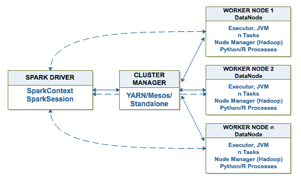

# Spark 解决方案

Spark 直接可从[spark.apache.org](http://spark.apache.org/)作为开源解决方案获得。**Databricks**是 Spark 商业解决方案的领先提供商。对于熟悉 Python、R、Java 或 Scala 编程的人来说，由于高效的接口（如 PySpark API），开始使用 Spark 所需的时间很短。

基于云的 Spark 平台，如 Databricks Community Edition，提供了一种简单易行的方式来使用 Spark，而不需要安装和配置 Spark。因此，希望使用 Spark 进行编程和相关任务的用户可以更快地开始，而不需要花时间在管理任务上。

# Spark 实践

在本节中，我们将在 Databricks 的 Community Edition 上创建一个帐户，并完成一个实际操作的练习，引导读者了解操作、转换和 RDD 概念的基础知识。

# 注册 Databricks Community Edition

以下步骤概述了注册**Databricks Community Edition**的过程：

1.  转到[`databricks.com/try-databricks`](https://databricks.com/try-databricks)：

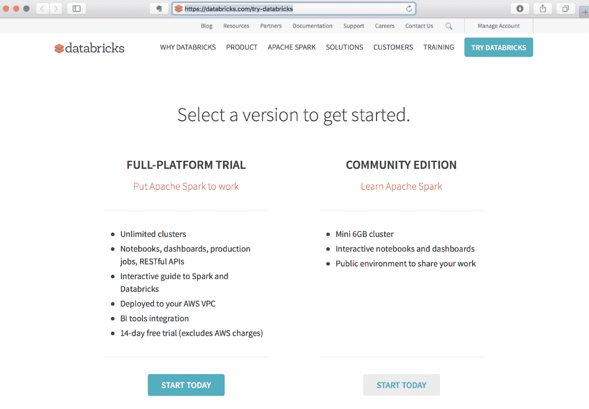

1.  点击**立即开始**按钮并输入您的信息：

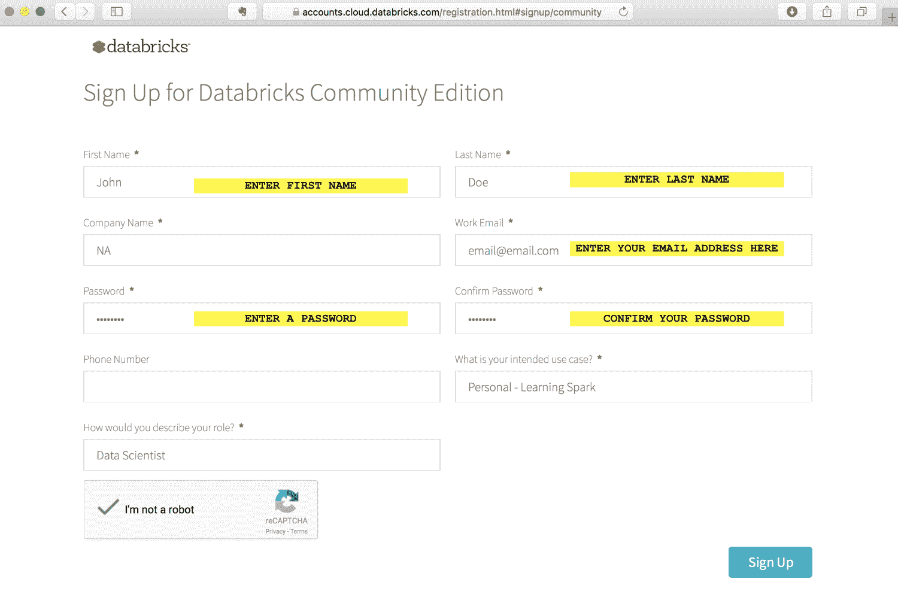

1.  确认您已阅读并同意弹出菜单中的条款（向下滚动到底部找到**同意**按钮）：

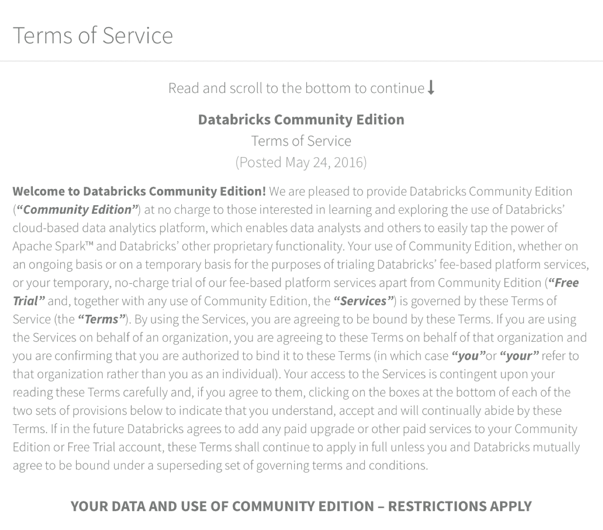

1.  检查您的电子邮件，确认来自 Databricks 的确认电子邮件，并点击链接确认您的账户：

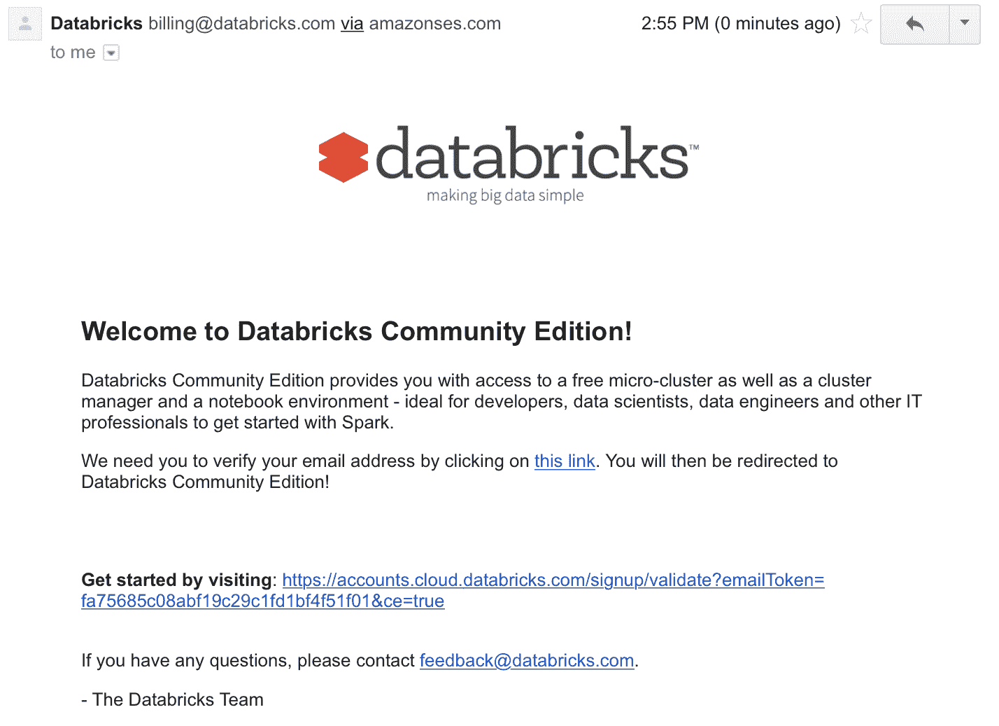

1.  点击链接确认您的账户后，您将被带到一个登录界面，在那里您可以使用注册账户时使用的电子邮件地址和密码登录：

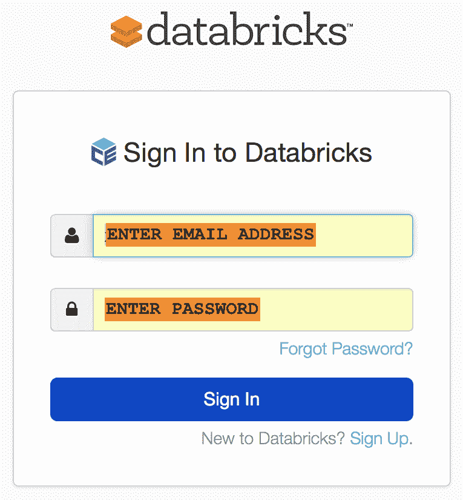

1.  登录后，点击集群设置一个 Spark 集群，如下图所示：

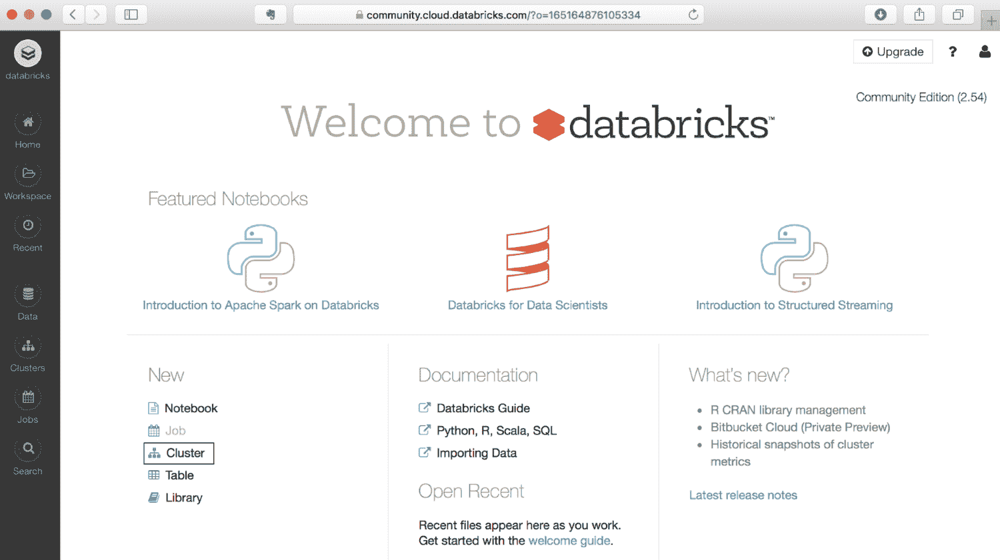

1.  输入`Packt_Exercise`作为集群名称，然后点击页面顶部的创建集群按钮：

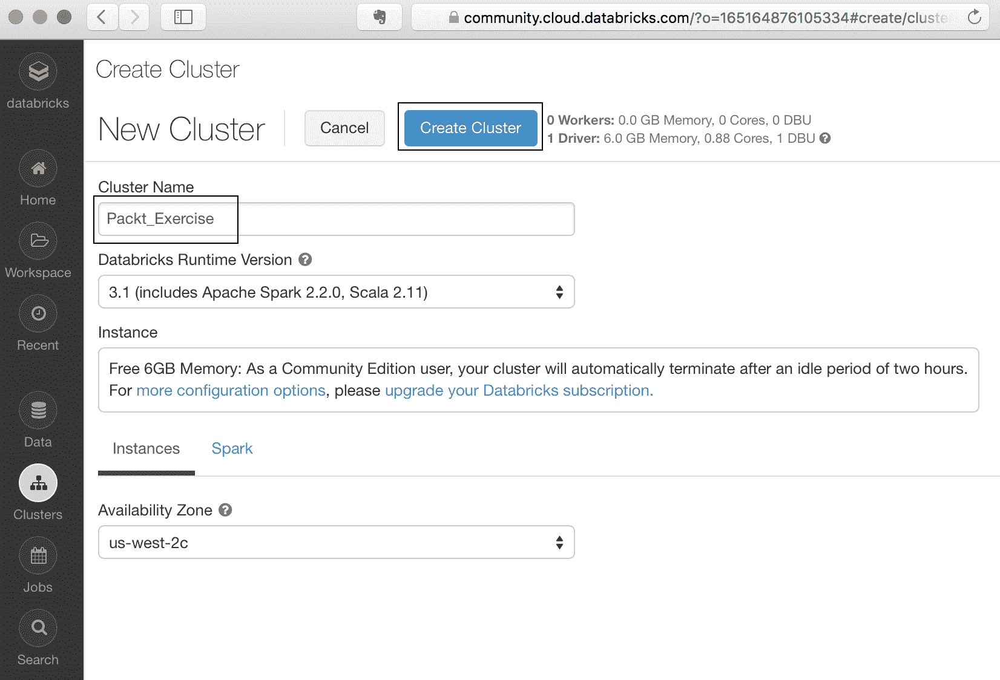

1.  这将启动启动一个 Spark 集群的过程，我们将在其中使用 iPython 笔记本执行我们的 Spark 命令。iPython Notebook 是一个常用的 IDE 的名称，它是一个用于编写和测试 Python 代码的基于 Web 的开发应用程序。笔记本还可以通过内核支持其他语言，但在本练习中，我们将专注于 Python 内核。

一段时间后，状态将从待定变为运行：

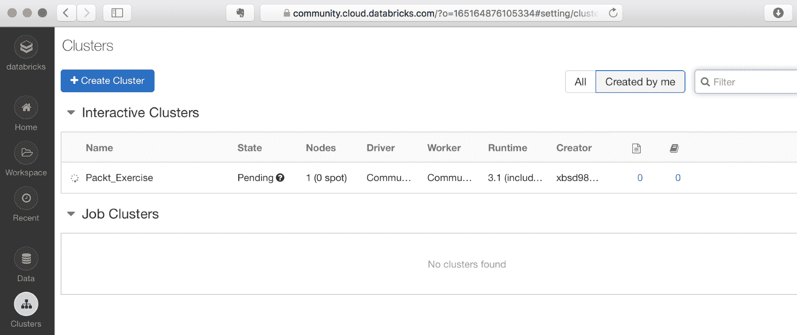

几分钟后状态变为运行：

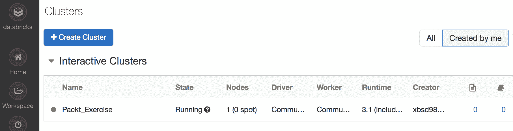

1.  点击**工作区**（在左侧栏）并选择**选项**，**用户** | (`您的用户 ID`)，然后点击您的电子邮件地址旁边的下拉箭头。选择创建 | 笔记本：

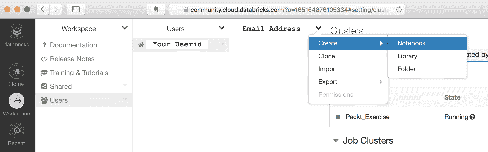

1.  在弹出屏幕中，输入`Packt_Exercise`作为笔记本的名称，然后点击创建按钮：

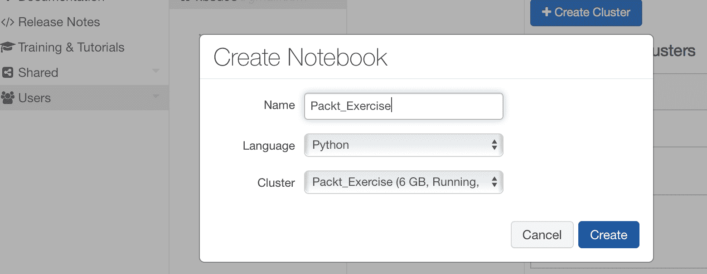

1.  单击**创建**按钮后，您将直接进入笔记本，如下面的屏幕截图所示。这是 Spark 笔记本，您将能够执行接下来几个部分中给出的其余代码。应在笔记本的单元格中输入代码，如所示。输入代码后，按*Shift + Enter*执行相应的单元格：

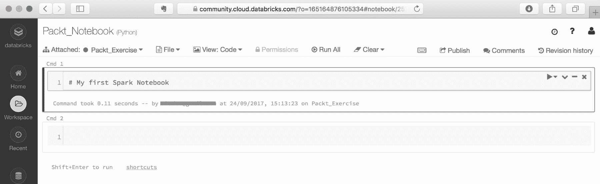

1.  在接下来的几个练习中，您可以将文本复制粘贴到笔记本的单元格中。或者，您还可以导入笔记本并直接在工作区中加载它。如果这样做，您将不需要输入命令（尽管输入命令将提供更多的实践熟悉度）。

1.  复制粘贴命令的另一种方法：您可以通过单击以下屏幕截图中显示的导入来导入笔记本：

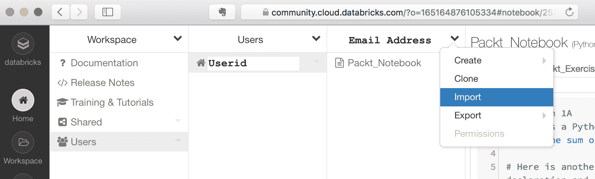

1.  在弹出菜单中输入以下**URL**（选择**URL**作为**从**选项**导入**）：

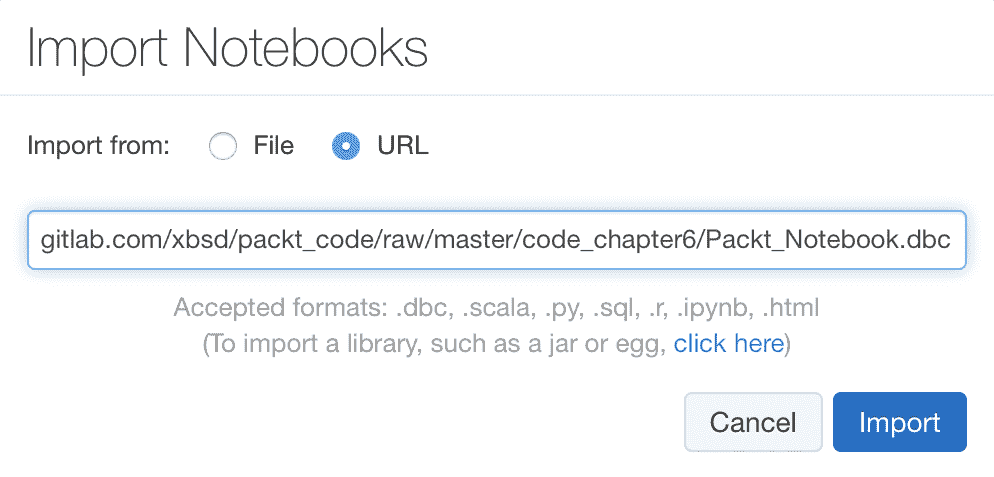

1.  然后笔记本将显示在您的电子邮件 ID 下。单击笔记本的名称加载它：


# Spark 练习-亲身体验 Spark（Databricks）

本笔记本是基于 Databricks 进行的教程（[`databricks.com/`](https://databricks.com/)）。该教程将使用 Databricks 的 Spark 社区版进行，可在[`databricks.com/try-databricks`](https://databricks.com/try-databricks)注册。Databricks 是 Spark 的商业和企业支持版本的领先提供商。

在本教程中，我们将介绍一些在 Spark 中使用的基本命令。鼓励用户尝试更广泛的 Spark 教程和笔记本，这些教程和笔记本可以在网络上找到更详细的示例。

Spark 的 Python API 文档可以在[`spark.apache.org/docs/latest/api/python/pyspark.html#pyspark.sql`](https://spark.apache.org/docs/latest/api/python/pyspark.html#pyspark.sql)找到。

本书的数据已导入 Databricks 的 Spark 平台。有关导入数据的更多信息，请转到**导入数据** - **Databricks** ([`docs.databricks.com/user-guide/importing-data.html`](https://docs.databricks.com/user-guide/importing-data.html))。

```scala
# COMMAND ----------

# The SparkContext/SparkSession is the entry point for all Spark operations
# sc = the SparkContext = the execution environment of Spark, only 1 per JVM
# Note that SparkSession is now the entry point (from Spark v2.0)
# This tutorial uses SparkContext (was used prior to Spark 2.0)

from pyspark import SparkContext
# sc = SparkContext(appName = "some_application_name") # You'd normally run this, but in this case, it has already been created in the Databricks' environment

# COMMAND ----------

quote = "To be, or not to be, that is the question: Whether 'tis nobler in the mind to suffer The slings and arrows of outrageous fortune, Or to take Arms against a Sea of troubles, And by opposing end them: to die, to sleep No more; and by a sleep, to say we end the heart-ache, and the thousand natural shocks that Flesh is heir to? 'Tis a consummation devoutly to be wished. To die, to sleep, To sleep, perchance to Dream; aye, there's the rub, for in that sleep of death, what dreams may come, when we have shuffled off this mortal coil, must give us pause."

# COMMAND ----------
sparkdata = sc.parallelize(quote.split(' '))

# COMMAND ----------
print "sparkdata = ", sparkdata
print "sparkdata.collect = ", sparkdata.collect
print "sparkdata.collect() = ", sparkdata.collect()[1:10]

# COMMAND ----------
# A simple transformation - map
def mapword(word):
 return (word,1)

print sparkdata.map(mapword) # Nothing has happened here
print sparkdata.map(mapword).collect()[1:10] # collect causes the DAG to execute

# COMMAND ----------
# Another Transformation

def charsmorethan2(tuple1):
 if len(tuple1[0])>2:
 return tuple1
 pass

rdd3 = sparkdata.map(mapword).filter(lambda x: charsmorethan2(x))
# Multiple Transformations in 1 statement, nothing is happening yet
rdd3.collect()[1:10] 
# The DAG gets executed. Note that since we didn't remove punctuation marks ... 'be,', etc are also included

# COMMAND ----------
# With Tables, a general example
cms = sc.parallelize([[1,"Dr. A",12.50,"Yale"],[2,"Dr. B",5.10,"Duke"],[3,"Dr. C",200.34,"Mt. Sinai"],[4,"Dr. D",5.67,"Duke"],[1,"Dr. E",52.50,"Yale"]])

# COMMAND ----------
def findPayment(data):
 return data[2]

print "Payments = ", cms.map(findPayment).collect()
print "Mean = ", cms.map(findPayment).mean() # Mean is an action

# COMMAND ----------
# Creating a DataFrame (familiar to Python programmers)

cms_df = sqlContext.createDataFrame(cms, ["ID","Name","Payment","Hosp"])
print cms_df.show()
print cms_df.groupby('Hosp').agg(func.avg('Payment'), func.max('Payment'),func.min('Payment'))
print cms_df.groupby('Hosp').agg(func.avg('Payment'), func.max('Payment'),func.min('Payment')).collect()
print
print "Converting to a Pandas DataFrame"
print "--------------------------------"
pd_df = cms_df.groupby('Hosp').agg(func.avg('Payment'), func.max('Payment'),func.min('Payment')).toPandas()
print type(pd_df)
print
print pd_df

# COMMAND ----------
wordsList = ['to','be','or','not','to','be']
wordsRDD = sc.parallelize(wordsList, 3) # Splits into 2 groups
# Print out the type of wordsRDD
print type(wordsRDD)

# COMMAND ----------
# Glom coallesces all elements within each partition into a list
print wordsRDD.glom().take(2) # Take is an action, here we are 'take'-ing the first 2 elements of the wordsRDD
print wordsRDD.glom().collect() # Collect

# COMMAND ----------
# An example with changing the case of words
# One way of completing the function
def makeUpperCase(word):
 return word.upper()

print makeUpperCase('cat')

# COMMAND ----------
upperRDD = wordsRDD.map(makeUpperCase)
print upperRDD.collect()

# COMMAND ----------
upperLambdaRDD = wordsRDD.map(lambda word: word.upper())
print upperLambdaRDD.collect()

# COMMAND ----------

# Pair RDDs
wordPairs = wordsRDD.map(lambda word: (word, 1))
print wordPairs.collect()

# COMMAND ----------

# #### Part 2: Counting with pair RDDs 
# There are multiple ways of performing group-by operations in Spark
# One such method is groupByKey()
# 
# ** Using groupByKey() **
# 
# This method creates a key-value pair whereby each key (in this case word) is assigned a value of 1 for our wordcount operation. It then combines all keys into a single list. This can be quite memory intensive, especially if the dataset is large.

# COMMAND ----------
# Using groupByKey
wordsGrouped = wordPairs.groupByKey()
for key, value in wordsGrouped.collect():
 print '{0}: {1}'.format(key, list(value))

# COMMAND ----------
# Summation of the key values (to get the word count)
wordCountsGrouped = wordsGrouped.map(lambda (k,v): (k, sum(v)))
print wordCountsGrouped.collect()

# COMMAND ----------

# ** (2c) Counting using reduceByKey **
# 
# reduceByKey creates a new pair RDD. It then iteratively applies a function first to each key (i.e., within the key values) and then across all the keys, i.e., in other words it applies the given function iteratively.

# COMMAND ----------

wordCounts = wordPairs.reduceByKey(lambda a,b: a+b)
print wordCounts.collect()

# COMMAND ----------
# %md
# ** Combining all of the above into a single statement **

# COMMAND ----------

wordCountsCollected = (wordsRDD
 .map(lambda word: (word, 1))
 .reduceByKey(lambda a,b: a+b)
 .collect())
print wordCountsCollected

# COMMAND ----------

# %md
# 
# This tutorial has provided a basic overview of Spark and introduced the Databricks community edition where users can upload and execute their own Spark notebooks. There are various in-depth tutorials on the web and also at Databricks on Spark and users are encouraged to peruse them if interested in learning further about Spark.
```

# 总结

在本章中，我们了解了 Spark 的一些核心特性，这是当今大数据领域中最突出的技术之一。自 2014 年发布以来，Spark 已迅速成熟，当时它作为一个大数据解决方案发布，缓解了 Hadoop 的许多缺点，如 I/O 争用等。

如今，Spark 有几个组件，包括专门用于流式分析和机器学习的组件，并且正在积极开发中。Databricks 是 Spark 商业支持版本的领先提供商，还托管了一个非常方便的基于云的 Spark 环境，用户可以免费访问有限资源。这大大降低了用户的准入门槛，因为用户无需安装完整的 Spark 环境来学习和使用该平台。

在下一章中，我们将开始讨论机器学习。直到这一部分，大部分文本都集中在大规模数据的管理上。有效利用数据并从数据中获得*洞察力*始终是最终目标。为了做到这一点，我们需要采用今天已经变得司空见惯的先进算法技术。下一章将讨论机器学习的基本原则，之后我们将在随后的章节中更深入地探讨这一主题领域。
