# 第七章：机器学习概念简介

机器学习已经成为我们日常生活中司空见惯的话题。该领域的发展如此戏剧性，以至于今天，甚至手机都集成了先进的机器学习和人工智能相关设施，能够根据人类指令做出响应和采取行动。

曾经只限于大学课堂的一个学科，如今已经发展成为一个完全成熟的行业，以一种我们几年前无法想象的方式渗透到我们的日常生活中。

本章的目的是向读者介绍机器学习的基础知识，并以简单明了的术语解释概念，帮助读者熟悉该学科的核心思想。我们将从机器学习的高层概述开始，解释不同的类别以及如何加以区分。我们将解释机器学习中一些显著的概念，如数据预处理、特征工程和变量重要性。下一章将更详细地介绍单个算法和理论机器学习。

我们将通过使用 R 来执行机器学习操作的真实数据集来结束本章。

我们将在本章中涵盖以下主题：

+   什么是机器学习？

+   流行的出现

+   机器学习、统计学和人工智能（AI）

+   机器学习的类别

+   机器学习的核心概念

+   机器学习教程

# 什么是机器学习？

**机器学习**并不是一个新的学科；它作为一个正式学科已经存在了 70 多年，但是以不同的名称存在：统计学，更普遍的是数学，然后是**人工智能**（**AI**），今天是机器学习。虽然统计学和人工智能等其他相关学科同样普遍，但是机器学习已经开辟了一个独立的领域，成为一个独立的学科。

简而言之，机器学习涉及基于历史数据预测未来事件。我们在日常生活中看到它的体现，无论我们是否知情，我们都会每天应用机器学习的原则。

当我们随意评论一部电影是否会在票房上成功，使用我们对主演的人气的理解时，我们正在应用机器学习，尽管是下意识地。我们对主演角色的理解是在多年观看他们出演的电影中形成的。当我们对未来出演同一人的电影的成功做出评估时，我们是在利用历史信息进行评估。

另一个例子是，如果我们有关于温度、湿度和降水（雨）的数据，比如 12 个月的数据，我们能否利用这些信息来预测今天是否会下雨，给定温度和湿度的信息？

这类似于统计学中常见的回归问题。但是，机器学习涉及对练习应用更高级别的严谨性，以便基于不仅仅是理论计算，而且是使用迭代方法进行数百次甚至数千次验证计算后得出结论。

需要在这里指出和澄清的是，术语“机器学习”指的是通常在计算设备上执行的旨在预测结果的算法或程序。这些算法构建数学模型，然后可以用来进行预测。人们普遍错误地认为机器学习实际上是指一个“学习”的“机器”。正如刚才解释的那样，实际含义要逊色得多。

# 机器学习的演变

机器学习的时间线，如维基百科上所述（[`en.wikipedia.org/wiki/Timeline_of_machine_learning`](https://en.wikipedia.org/wiki/Timeline_of_machine_learning)），提供了该领域演变的简明而富有洞察力的概述。其根源可以追溯到 18 世纪中期，当时托马斯·贝叶斯在伦敦皇家学会上发表了他关于*逆概率*的论文。逆概率，今天更常被称为概率分布，涉及确定给定一组先前事件的系统状态的问题。例如，如果一个盒子里有牛奶巧克力和白巧克力，你随机拿出几个，得到两块牛奶巧克力和三块白巧克力，我们能推断盒子里有多少块巧克力吗？

换句话说，我们能根据我们可以假设一个正式理论的一些数据点推断出未知的情况吗？贝叶斯的工作被皮埃尔-西蒙·拉普拉斯进一步发展成为贝叶斯定理，收录在他的著作《概率分析理论》中。

在 20 世纪初，安德烈·马尔可夫对普希金的诗《叶甫盖尼·奥涅金》的分析，以确定俄罗斯文学中辅音和元音的押韵，导致了一种称为马尔可夫链的技术的发展，该技术今天用于对涉及随机事件的复杂情况进行建模。谷歌的 PageRank 算法实现了马尔可夫链的一种形式。

机器学习的第一个正式应用，或者更普遍地说，人工智能的最终出现作为一门学科，应归功于艾伦·图灵。他开发了图灵测试——一种确定机器是否足够智能以模仿人类行为的方法。图灵在他的论文《计算机器械与智能》中提出了这一点，论文开头是这样的：

我建议考虑这个问题，“机器能思考吗？”这应该从定义“机器”和“思考”的含义开始。这些定义可能被构造得尽可能反映这些词的正常用法，但这种态度是危险的。如果通过检查它们通常的用法来找到“机器”和“思考”的含义，很难逃脱这样的结论，即问题“机器能思考吗？”的含义和答案应该在统计调查中寻找，比如盖洛普民意调查。但这是荒谬的。我不打算尝试这样的定义，而是用另一个问题来代替它，这个问题与它密切相关，并用相对明确的词语表达。

图灵在论文的后面写道：

*“原始问题‘机器能思考吗？’我认为太毫无意义，不值得讨论。尽管如此，我相信在本世纪末，词语的使用和一般受过教育的观点将发生如此大的变化，以至于人们将能够谈论机器思考而不期望遭到反驳。我进一步相信，隐藏这些信念是没有任何有益的目的。”*

图灵在人工智能领域的工作之后，机器学习和人工智能出现了一系列重要事件。1951 年，马文·米斯基开发了第一个神经网络，阿瑟·塞缪尔在 1952 年开始了第一个下棋的机器学习程序的工作，罗森布拉特在 1957 年发明了感知器，这是神经网络的基本单元。杰出人物如利奥·布雷曼、杰罗姆·弗里德曼、弗拉迪米尔·瓦普尼克和阿列克谢·切尔沃年基斯、杰夫·辛顿和杨立昆通过 20 世纪 90 年代末做出了重大贡献，使机器学习成为当今独立的研究领域。我们对他们的工作和贡献深表感激，这使得机器学习在当今的研究领域中脱颖而出。

1997 年，IBM 的深蓝击败了卡斯帕罗夫，这立刻成为了全球轰动的事件。一台机器能够击败世界顶级国际象棋冠军并非寻常的成就。这一事件为机器学习赢得了一些急需的可信度，使其成为图灵所设想的智能机器的有力竞争者。

# 机器学习成功的因素

鉴于机器学习作为一个学科已经存在了几十年，人们不禁要问：为什么它没有比今天更早地变得如此受欢迎？事实上，诸如神经网络之类的复杂机器学习算法的理论在 20 世纪 90 年代晚期就已经广为人知，而在理论领域，基础也早已奠定。

机器学习成功的几个因素：

+   **互联网**：网络在民主化信息和以前所未有的方式连接人们方面发挥了关键作用。它使信息交换变得简单，这是通过印刷媒体传播信息的现有方法所无法实现的。网络不仅转变和革新了信息传播，还开辟了新的机会。正如前面提到的，谷歌的 PageRank 是将统计模型应用于开发高度成功的网络企业的最早大规模和高度可见的成功之一。

+   **社交媒体**：虽然网络提供了一个交流平台，但缺乏与现实世界中人们互动的灵活性。有一个明显的但低调的、可以说是未被开发的差距。诸如 IRC 和 Usenet 之类的工具是社交网络网站的前身，比如 Myspace，这是最早用于创建个人网络的基于网络的平台之一。到了 21 世纪初至中期，Facebook 成为社交网络的领导者。这些平台提供了一个独特的机会，利用互联网以个人层面收集数据。每个用户留下了一串信息，可以使用自然语言处理和其他技术进行收集和分析。

+   **计算硬件**：用于计算机的硬件以指数速度发展。机器学习算法本质上是计算和资源密集型的，也就是说，它们需要强大的 CPU、快速的磁盘和根据数据大小的高内存。在**固态硬盘**（**SSD**）上存储数据的新方法是从以前的旋转硬盘存储方式中跨越的一大步。更快的访问意味着数据可以以更快的速度传递给 CPU，并减少了传统计算中一直存在的 I/O 瓶颈。更快的 CPU 意味着可以及时执行机器学习算法所需的数百甚至数千次迭代。最后，需求导致了计算资源价格的降低，使更多人能够负担得起原本价格昂贵的计算硬件。算法是存在的，但资源最终能够以合理的时间和成本来执行它们。

+   **编程语言和软件包**：R 和 Python 开发者等社区抓住了机会，个人开始发布暴露他们的工作给更广泛的程序员社区的软件包。特别是提供机器学习算法的软件包立即受到欢迎，并激发了其他从业者发布他们的个人代码库，使得 R 等平台成为一个真正的全球协作努力。如今，R 中有超过 10,000 个软件包，而 2010 年只有 2000 个。

# 机器学习、统计学和人工智能

机器学习是一个有各种同义词的术语——这些名称是企业的营销活动的结果，或者只是可以互换使用的术语。尽管有人可能会争辩它们有不同的含义，但它们最终都指的是机器学习作为一门学科，它利用历史信息来预测未来事件。

机器学习常听到的术语包括预测分析、预测分析、预测建模等等。因此，除非发布材料的实体解释了他们对术语的解释，更具体地说明了它的不同之处，否则可以安全地假设他们是在指机器学习。这往往会让新手感到困惑，主要是由于技术术语的误用和滥用。

另一方面，统计学是一个已经有 200 多年历史的独立学科领域。这个词源自新拉丁语*statisticum collegium*（英语中的国务院）和意大利语*statista*，意思是政治家或政治家。您可以访问[`en.wikipedia.org/wiki/History_of_statistics#Etymology`](https://en.wikipedia.org/wiki/History_of_statistics#Etymology)了解更多关于这个主题的详情。机器学习实现了各种统计模型，由于涉及到的计算严谨，它与经典统计学的分支有所不同。

人工智能也与机器学习密切相关，但它是一个更广泛的主题。它可以被宽泛地定义为在存在不确定性的情况下，能够以（通常）负责任和社会意识的方式做出具体决策，以达到目标终极目标的系统（软件/硬件）。换句话说，人工智能旨在通过系统地处理既包括已知又包括未知（潜在）因素的情况来产生行动。

人工智能唤起了智能机器人在科幻电影中的形象，就像它提醒我们智能系统，比如 IBM Watson，可以解析复杂问题并处理模糊陈述以找到具体答案一样。

机器学习与一些相同特征-使用训练数据逐步开发模型，并使用测试数据测量准确性。然而，人工智能已经存在了很多年，并且是一个家喻户晓的术语。美国的卡内基梅隆大学等机构一直在制定人工智能的关键原则和指导方针。

关于人工智能与机器学习的在线资源/文章似乎没有提供任何关于它们之间区别的定论。然而，大学的人工智能课程大纲使这些区别变得非常明显。您可以在[`cs.brown.edu/courses/csci1410/lectures.html`](https://cs.brown.edu/courses/csci1410/lectures.html)了解更多关于人工智能的信息。

人工智能涉及涉及的广泛研究领域：

+   **受限优化**：在给定情况下，达到最佳结果，考虑一组约束或限制

+   **博弈论**：例如，零和游戏，均衡等-根据决策如何影响未来决策和影响期望的最终目标来做出权衡决策

+   **不确定性/贝叶斯定理**：在先验信息的情况下，发生这种情况的可能性是多少，考虑到已经发生了其他事情

+   **规划**：制定行动计划=一组路径（图），以应对情况/达到最终目标

+   **机器学习**：通过使用旨在处理不确定性并模仿人类推理的算法来实现（实现）前述目标。通常用于人工智能的机器学习算法包括：

+   神经网络/深度学习（发现隐藏因素）

+   自然语言处理（NLP）（使用语气，语言学等理解上下文）

+   视觉对象识别

+   概率模型（例如，贝叶斯分类器）

+   马尔可夫决策过程（例如，随机事件的决策，例如赌博）

+   各种其他机器学习算法（聚类、支持向量机）

+   **社会学**：研究机器学习决策如何影响社会，并采取补救措施纠正问题

# 机器学习的分类

1959 年，Arthur Samuel 在 IBM 工作时创造了**机器学习**这个术语。机器学习的一个流行定义归功于 Arthur，据信他称机器学习为*一门计算机科学领域，使计算机能够在没有明确编程的情况下学习*。

1998 年，Tom Mitchell 对机器学习增加了更具体的定义，并称其为一种研究算法的学科，这些算法通过经验 E 在某个任务 T 上提高其性能 P。

一个简单的解释可以帮助说明这个概念。现在，我们大多数人都熟悉电子邮件中的垃圾邮件概念。大多数电子邮件账户也包含一个名为**垃圾邮件**、**垃圾**或类似术语的单独文件夹。对文件夹的粗略检查通常会显示出许多邮件，其中许多可能是未经请求的并包含无意义的信息。

将电子邮件分类为垃圾邮件并将其移动到文件夹中的简单任务也涉及机器学习的应用。Andrew Ng 在他的流行机器学习 MOOC 课程中优雅地强调了这一点。

在 Mitchell 的术语中，垃圾邮件分类过程涉及：

+   **任务 T**：将电子邮件分类为垃圾邮件/非垃圾邮件

+   性能 P：准确识别为垃圾邮件的数量

+   经验 E：模型提供了被标记为垃圾邮件/非垃圾邮件的电子邮件，并利用这些信息来确定新邮件是否为垃圾邮件

广义上讲，机器学习有两种明显的类型：

+   监督式机器学习

+   无监督式机器学习

我们将在这里依次讨论它们。

# 监督式和无监督式机器学习

让我们先从监督式机器学习开始。

# 监督式机器学习

**监督式机器学习**指的是涉及使用标记数据预测结果的机器学习练习。标记数据简单地指的是我们用来进行预测的数据集（以及我们将要预测的结果）具有明确的值（不管是什么）。例如，将电子邮件分类为垃圾邮件或非垃圾邮件、预测温度和从图像中识别人脸都是监督式机器学习的例子。

# 车辆里程、数字识别和其他例子

给定一个包含有关每加仑英里数、汽缸数等各种汽车信息的数据集，如果我们只有其他值可用，我们能预测每加仑英里数的值吗？

在这种情况下，我们的结果是`mpg`，我们使用`cyl`（汽缸数）、`hp`（马力）、`gear`（齿轮数）等其他变量来构建一个模型，然后应用于一个数据集，其中`mpg`的值标记为`MISSING`。模型读取数据的前五行中这些列的信息，并根据这些信息预测其他行中`mpg`的值，如下图所示：

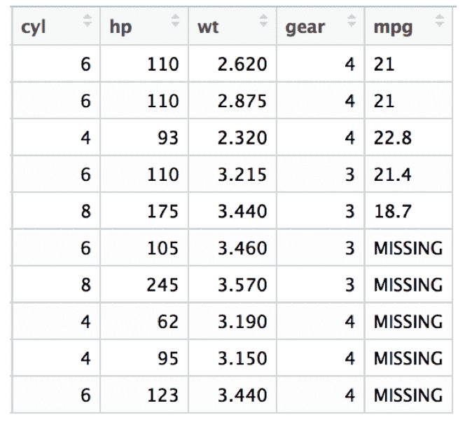

之所以被认为是监督式的是因为在构建我们的机器学习模型的过程中，我们向模型提供了关于结果的信息。其他例子包括：

+   **识别字母和数字**：在这种情况下，模型的输入是图像，比如字母和数字的图像，结果是图像上显示的字母数字值。构建模型后，可以用于识别和预测图像中显示的数字。这是一个简单的例子，但非常强大。想象一下，如果你拿到了 10 万张带有门牌号码的房屋图片。手动识别门牌号码的方式是逐个查看每张图片并写下号码。机器学习模型使我们能够完全自动化整个操作。你可以简单地运行模型来识别图像，以极短的时间内获得结果，而不必手动查看每个图像。

+   **自动驾驶汽车**：算法的输入是图像，图像中的对象已被识别，例如人、街道标志、汽车、树木、商店和其他元素。一旦展示了足够数量的图像，并且给出了一个未标记的图像，也就是对象尚未被识别的图像，算法就能够识别它们。公平地说，这是对一个非常复杂的主题的高度简化的解释，但总体原则是相同的。

用于数字识别的 MNIST 数据集：

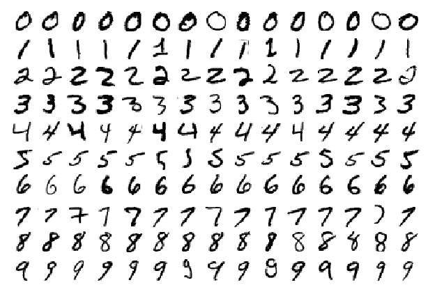

# 无监督机器学习

**无监督机器学习**涉及没有标记结果的数据集。以预测汽车的每加仑英里数为例，在无监督练习中，我们的数据集将如下所示：

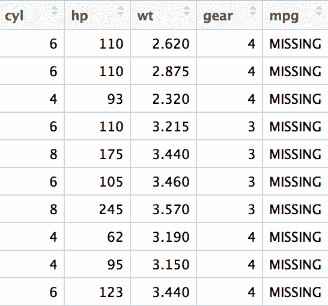

如果所有的结果都*缺失*，那么就不可能知道这些值可能是什么。请记住，机器学习的主要前提是利用历史信息对结果未知的数据集进行预测。但是，如果历史信息本身没有任何确定的结果，那么就不可能建立模型。在不知道任何其他信息的情况下，表中的 mpg 值可能全部为 0 或全部为 100；我们无法判断，因为没有任何数据点可以帮助我们得出这个值。

这就是*无监督*机器学习的应用。在这种类型的机器学习中，我们并不试图预测结果。相反，我们试图确定哪些项目彼此最相似。

这种练习的一个常见名称是*聚类*，也就是说，我们试图找到彼此最相似的记录的*簇*或组。我们可以在哪些地方使用这些信息，无监督学习的一些例子是什么？

网络上有各种新闻聚合器 - 这些网站本身不发布信息，而是从其他新闻来源收集信息。谷歌新闻就是这样的一个聚合器。比如，如果我们要搜索卡西尼号对土星拍摄的最新图像的信息，我们可以在谷歌新闻上简单搜索这个短语[`news.google.com/news/?gl=US&amp;ned=us&amp;hl=en`](https://news.google.com/news/?gl=US&ned=us&hl=en)。这里有一个示例：


请注意，在新闻文章底部有一个“查看全部”的链接。点击该链接将带您到包含所有其他相关新闻文章的页面。当然，谷歌并没有手动将文章分类为特定的搜索词。事实上，谷歌事先并不知道用户会搜索什么。搜索词本来也可能是“太空中土星环的图片”。

那么，谷歌是如何知道哪些文章属于特定的搜索词的呢？答案在于聚类或无监督学习原则的应用。无监督学习检查特定数据集的属性，以确定哪些文章彼此最相似。为了做到这一点，算法甚至不需要知道上下文背景。

假设你拿到了两套没有封面的书，一套是关于园艺的书，另一套是关于计算机编程的书。尽管你可能不知道书的标题，但很容易区分计算机书和园艺书。一套书会有大量与计算机相关的术语，而另一套会有大量与植物相关的术语。仅凭书中的图片就能区分出两种不同的书类别，即使是一个不了解计算机或园艺的读者也不难。

无监督机器学习的其他示例包括检测恶性和非恶性肿瘤以及基因测序。

# 细分监督机器学习

监督机器学习可以进一步细分为以下练习之一：

+   分类

+   **回归**

这些概念非常简单。

分类涉及具有离散结果的机器学习任务 - **分类**结果。所有**名词**都是分类变量，例如水果、树木、颜色和真/假。

分类练习中的结果变量也被称为**离散或分类变量**。

一些例子包括：

+   根据大小、重量和形状确定水果

+   给定一组数字图像的数字（如前一章所示）

+   识别街道上的物体

+   识别红心、黑桃、红桃和梅花的扑克牌

+   根据学生的成绩确定学生的班级排名

+   最后一个可能看起来不明显，但是排名，即 1^(st)、2^(nd)、3^(rd)表示一个固定的类别。一个学生可以排名，比如 1^(st)或 2^(nd)，但不能有 1.5 的排名！

下面显示了一些非典型的分类示例的图像：

| 不同类型水果的分类 | 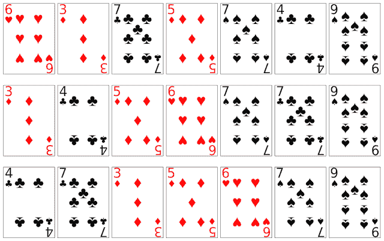扑克牌的分类：红心、黑桃、红桃和梅花 |
| --- | --- |

回归，另一方面，涉及计算数值结果。您可以执行数值运算的任何结果，例如加法、减法、乘法和除法，都将构成回归问题。

回归的例子包括：

+   预测每日温度

+   计算股价

+   预测住宅物业和其他物业的销售价格

下面显示了一些非典型的回归示例的图像。在这两种情况下，我们处理的是连续的定量数值数据。因此，回归的结果变量也被称为**定量或连续变量**。

| 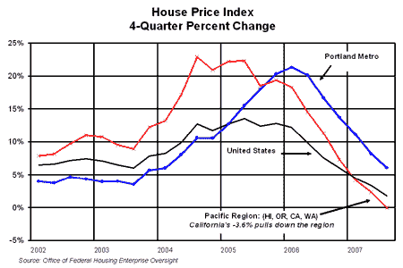计算房价 | 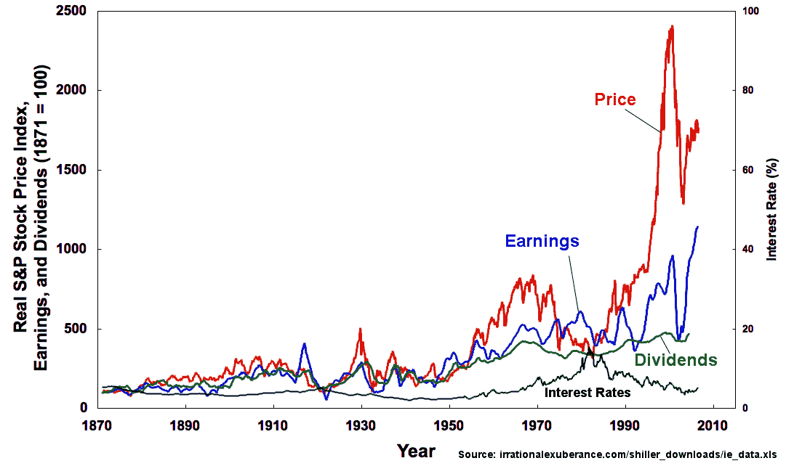使用其他市场数据计算股价 |
| --- | --- |

请注意，分类或回归的概念并不适用于无监督学习。由于无监督学习中没有标签，因此在严格意义上不存在离散的分类或回归。也就是说，由于无监督学习将数据分类为簇，簇中的对象通常被认为属于同一类（与同一簇中的其他对象相同）。这类似于分类，只是在事后创建，而在对象被分类到各个簇之前并不存在类。

# 机器学习中的常见术语

在机器学习中，您经常会听到特征、预测变量和因变量这些术语。它们都是一样的。它们都指的是用于预测结果的变量。在我们之前关于汽车的例子中，变量**cyl**（汽缸）、**hp**（马力）、**wt**（重量）和**gear**（齿轮）是预测变量，而**mpg**（每加仑英里数）是结果。

简单来说，以电子表格为例，列的名称本质上被称为特征、预测变量和因变量。例如，如果我们获得了一个收费站收费的数据集，并被要求根据一天的时间和其他因素来预测收费金额，一个假设的例子可能如下：

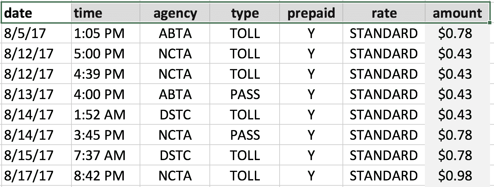

在这个电子表格中，列**date**、**time**、**agency**、**type**、**prepaid**和**rate**是特征或预测变量，而列**amount**是我们的结果或因变量（我们正在预测的内容）。

金额的值*取决于*其他变量的值（因此被称为*自变量*）。

简单的方程也反映了明显的区别，例如，在一个方程中，*y = a + b + c*，**左手边**（**LHS**）是因变量/结果变量，*a*、*b*和*c*是特征/预测变量。

总之：

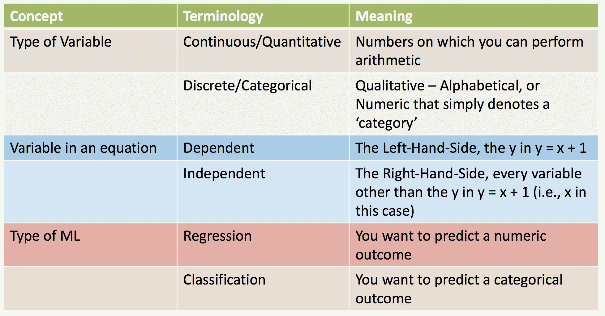

# 机器学习的核心概念

机器学习中有许多重要的概念；我们将介绍一些更常见的主题。机器学习涉及一个多步骤的过程，从数据获取、数据挖掘，最终到构建预测模型。

模型构建过程的关键方面包括：

+   **数据预处理**：预处理和特征选择（例如，居中和缩放，类别不平衡和变量重要性）

+   **训练，测试分割和交叉验证**：

+   创建训练集（比如说，数据的 80%）

+   创建测试集（数据的大约 20%）

+   执行交叉验证

+   **创建模型，获取预测**：

+   你应该尝试哪些算法？

+   你试图优化哪些准确性指标？

+   你应该使用哪些调整参数？

# 机器学习中的数据管理步骤

预处理，或者更一般地处理数据，是大多数机器学习练习的一个重要部分。你开始使用的数据集很少会与你构建机器学习模型的确切格式一致；在大多数情况下，它都需要进行相当多的清理。事实上，数据清理通常是整个过程中最耗时的部分。在本节中，我们将简要介绍一些你在实践中可能遇到的顶级数据处理步骤。

# 预处理和特征选择技术

**数据预处理**，顾名思义，涉及筛选数据，使其适用于机器学习练习。有各种各样的预处理方法，这里列举了一些比较常见的方法。

请注意，数据预处理应该作为交叉验证步骤的一部分进行，也就是说，预处理不应该在事先进行，而应该在模型构建过程中进行。稍后将对此进行更详细的解释。

# 居中和缩放

对数值列应用中心和缩放函数通常是为了标准化数据并消除数字的数量或差异的影响。你可能在大学课程中遇到过这种情况，学生会按照标准化的方式或曲线进行评分。

例如，假设一张考试试卷异常困难，10 名学生中有一半的学生得分低于 60 分 - 这是课程的及格率。教授可以选择 a)决定让 50%的学生重新上课，或者 b)标准化分数以找出学生相对于彼此的表现。

假设班级分数是：

45,66,66,55,55,52,61,64,65,49

以 60 分为及格分数，这意味着得分为 45、55、55、52 和 49 的学生将无法成功完成课程。

然而，这可能并不是他们相对优点的真正准确的表示。教授可以选择使用一种称为标准化的中心和缩放方法，它包括：

+   找到所有分数的平均值

+   从分数中减去平均值

+   将结果除以所有分数的标准差

下面是操作的示例。

分数的平均值是 57.8。因此，从每个数字中减去 57.8 会产生第二行中显示的数字。但是，我们还没有完成。我们需要将这些数字除以分数的*标准差*，以获得最终的标准化值：

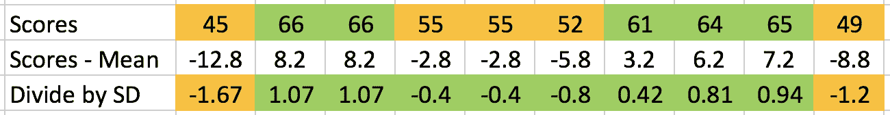

除以**SD**（**标准差**）表明，在所有测试成绩范围内，只有两名学生的成绩低于一个标准差。因此，根据原始数字，不是五名学生未能成功完成课程，而是只有两名学生。

尽管这是一个真正简单的操作，但不难看出，它在平滑数据的大波动方面非常有效。

在 R 中，可以使用 scale 命令非常容易地进行居中和缩放，如下所示：

```scala
> scores <- c(45,66,66,55,55,52,61,64,65,68) 
> scale(scores) 
            [,1] 
 [1,] -1.9412062 
 [2,]  0.8319455 
 [3,]  0.8319455 
 [4,] -0.6206578 
 [5,] -0.6206578 
 [6,] -1.0168223 
 [7,]  0.1716713 
 [8,]  0.5678358 
 [9,]  0.6998907 
[10,]  1.0960552 
attr(,"scaled:center") 
[1] 59.7 
attr(,"scaled:scale") 
[1] 7.572611 
```

# 接近零方差函数

`nearZeroVar`函数在`R package, caret`中可用于识别具有很少或没有方差的变量。考虑一个具有仅三个不同值的 10,000 个数字集。这样的变量可能对算法几乎没有价值。为了使用`nearZeroVar`函数，首先在 RStudio 中安装 R 软件包 caret（我们在第三章中设置了*The Analytics Toolkit*）。使用`nearZeroVar`的效果的确切代码如下所示：

```scala
> library(caret) 
Loading required package: lattice 
Loading required package: ggplot2 
Need help getting started? Try the cookbook for R: http://www.cookbook-r.com/Graphs/ 

> repeated <- c(rep(100,9999),10) # 9999 values are 100 and the last value is 10 

>random<- sample(100,10000,T) # 10,000 random values from 1 - 100 

>data<- data.frame(random = random, repeated = repeated) 

>nearZeroVar(data) 
[1] 2 

> names(data)[nearZeroVar(data)] 
[1] "repeated" 
```

正如示例所示，该函数能够正确检测到符合标准的变量。

# 去除相关变量

相关变量可能会产生过分强调变量贡献的结果。在回归练习中，这会增加 R² 的值，并且不准确地代表模型的实际性能。尽管许多类别的机器学习算法对相关变量的影响具有抵抗力，但它值得一提，因为这是该学科中的一个常见主题。

删除这样的变量的前提是冗余变量不会为模型增加增量值。例如，如果数据集包含英寸和米的身高，这些变量的相关性几乎完全为 1，使用其中一个与使用另一个一样好。使用去除相关变量的方法进行实际练习，可以极大地帮助简化模型，特别是涉及我们无法直观判断的变量。

以下示例说明了去除相关变量的过程。数据集**Pima Indians Diabetes**包含有关 Pima 印第安人饮食的重要统计数据，以及名为`diabetes`的结果变量。

在接下来的章节示例中，我们将经常提到这个数据集。数据集中不同列的含义的高级概述如下：

```scala
pregnant Number of times pregnant 
glucose  Plasma glucose concentration (glucose tolerance test) 
pressure Diastolic blood pressure (mm Hg) 
triceps  Triceps skin fold thickness (mm) 
insulin  2-Hour serum insulin (mu U/ml) 
mass     Body mass index (weight in kg/(height in m)\²) 
pedigree Diabetes pedigree function 
age            Age (years) 
diabetes Class variable (test for diabetes) 
```

我们有兴趣查找除糖尿病（我们的结果变量）以外的任何相关变量。如果有的话，删除冗余变量可能会有用。

在 RStudio 中安装`mlbench`和`corrplot`软件包，并执行以下命令：

```scala
install.packages("mlbench") 
install.packages("corrplot") 

library(corrplot) 
library(mlbench) 
data (PimaIndiansDiabetes)
diab <- PimaIndiansDiabetes # To produce a correlogram 
corrplot(cor(diab[,-ncol(diab)]), method="color", type="upper") # To get the actual numbers 
corrplot(cor(diab[,-ncol(diab)]), method="number", type="upper")
```

该命令将使用`corrplot`软件包从[`www.sthda.com/english/wiki/visualize-correlation-matrix-using-correlogram`](http://www.sthda.com/english/wiki/visualize-correlation-matrix-using-correlogram)生成一个图表，如下所示：

| 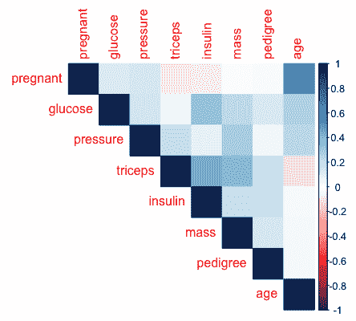 | >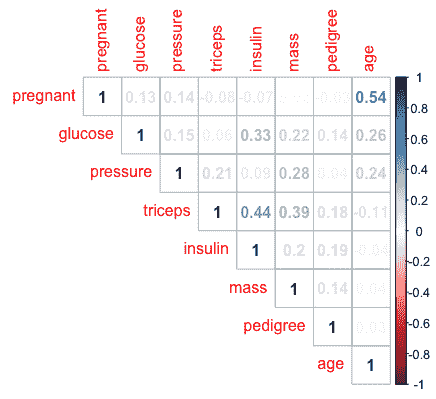 |
| --- | --- |

阴影越深，相关性越高。在这种情况下，它显示年龄和怀孕之间有相对较高的相关性。我们可以使用`method="number"`找到确切的值。您也可以在[`www.sthda.com/english/wiki/visualize-correlation-matrix-using-correlogram`](http://www.sthda.com/english/wiki/visualize-correlation-matrix-using-correlogram)上查看图表。

我们还可以使用以下函数直接查找相关变量，而无需绘制相关图：

```scala
correlated_columns<- findCorrelation(cor(diab[,-ncol(diab)]), cutoff = 0.5) 
correlated_columns 
```

# 其他常见的数据转换

还有其他几种数据转换方法适用于不同的情况。这些转换的摘要可以在`caret`软件包的文档网站的**Pre-Processing**下找到[`topepo.github.io/caret/pre-processing.html`](https://topepo.github.io/caret/pre-processing.html)。

在 caret 的预处理函数中提供的选项可以在其帮助部分中找到，通过在 RStudio 中运行命令`?preProcess`。其代码如下：

```scala
Method 

a character vector specifying the type of processing. 

Possible values are "BoxCox", "YeoJohnson", "expoTrans", "center", "scale", "range", "knnImpute", "bagImpute", "medianImpute", "pca", "ica", "spatialSign", "corr", "zv", "nzv", and "conditionalX" (see Details below) 
```

# 数据抽样

您可能会遇到具有高度不平衡结果类别的数据集。例如，如果您正在处理一个罕见疾病的数据集，您的结果变量是真或假，由于发生的罕见性，您可能会发现标记为假的观察数量（即，该人没有罕见疾病）远远高于标记为真的观察数量（即，该人患有罕见疾病）。

机器学习算法试图最大化性能，在许多情况下可能是预测的准确性。比如，在 1000 条记录的样本中，只有 10 条被标记为真，其余的`990`条观察结果都是假的。

如果有人随机将*所有*观察结果都标记为假，准确率将是：

```scala
(990/1000) * 100 = 99% 
```

但是，这项练习的目标是找到患有罕见疾病的*个体*。我们已经很清楚，由于疾病的性质，大多数个体不会属于这一类别。

数据抽样本质上是*最大化机器学习指标，如特异性、敏感性、精确度、召回率和 kappa*的过程。这些将在后面讨论，但在本节的目的上，我们将展示一些方法，通过这些方法，您可以对数据进行*抽样*，以产生一个更均衡的数据集。

R 软件包`caret`包括几个有用的函数，用于从不平衡的数据集中创建一个平衡的类别分布。

在这些情况下，我们需要重新对数据进行重新抽样，以获得更好的类别分布，以建立一个更有效的模型。

一些常见的方法包括：

+   **上采样**：增加具有较少实例的类别

+   **下采样**：减少具有更多实例的类别

+   **创建合成示例**（例如，**SMOTE**（**合成少数过采样技术**））

+   随机过采样（例如，(**ROSE**) **随机过采样示例**）

我们将使用与先前示例相同的数据创建一个模拟数据集，其中 95%的行将被标记为负：

```scala
library(mlbench) 
library(caret) 
diab<- PimaIndiansDiabetes 

diabsim<- diab 
diabrows<- nrow(diabsim) 
negrows<- floor(.95 * diabrows) 
posrows<- (diabrows - negrows) 

negrows 
[1] 729 

posrows 
[1] 39 

diabsim$diabetes[1:729]     <- as.factor("neg")
diabsim$diabetes[-c(1:729)] <- as.factor("pos")
table(diabsim$diabetes) 

neg. pos 
729  39 

# We observe that in this simulated dataset, we have 729 occurrences of positive outcome and 39 occurrences of negative outcome

# Method 1: Upsampling, i.e., increasing the number of observations marked as 'pos' (i.e., positive) 

upsampled_simdata<- upSample(diabsim[,-ncol(diabsim)], diabsim$diabetes) 
table(upsampled_simdata$Class) 

negpos 
729 729 

# NOTE THAT THE OUTCOME IS CALLED AS 'Class' and not 'diabetes' 
# This is because of the use of the variable separately 
# We can always rename the column to revert to the original name 

# Method 2: Downsampling, i.e., reducing the number of observations marked as 'pos' (i.e., positive) 

downsampled_simdata<- downSample(diabsim[,-ncol(diabsim)], diabsim$diabetes) 
table(downsampled_simdata$Class) 

neg pos 
39  39 
```

+   **SMOTE**（**合成少数类过采样技术**）是第三种方法，它不是简单的上/下采样，而是从少数类的最近邻中创建合成记录。在我们的模拟数据集中，很明显`neg`是少数类，也就是发生次数最少的类别。

SMOTE 函数的帮助文件简洁地解释了这个概念：

不平衡的分类问题给许多学习算法带来了问题。这些问题的特点是每个问题类别的案例比例不均衡。

SMOTE（Chawla 等人，2002）是一个用于解决这个问题的著名算法。该方法的一般思想是使用少数类的最近邻人工生成新的示例。此外，多数类的示例也被下采样，从而导致更平衡的数据集：

```scala
# Method 3: SMOTE 
# The function SMOTE is available in the R Package DMwR 
# In order to use it, we first need to install DmWR as follows 

install.packages ("DMwR") 

# Once the package has been installed, we will create a synthetic 
# Dataset in which we will increase the number of 'neg' records 
# Let us check once again the distribution of neg/pos in the dataset 

table(diabsim$diabetes) 

negpos 
729  39 

# Using SMOTE we can create synthetic cases of 'pos' as follows 

diabsyn<- SMOTE(diabetes ~ ., diabsim, perc.over = 500, perc.under = 150) 

# perc.over = 500 means, increase the occurrence of the minority 
# class by 500%, i.e., 39 + 5*39 = 39 + 195 = 234 

# perc.under = 150 means, that for each new record generated for the 
# Minority class, we will generate 1.5 cases of the majority class 
# In this case, we created 195 new records (500% of 39) and hence 
# we will generate 150% of 195 records = 195 * 150% = 195 * 1.5 
# = 292.5, or 292 (rounded down) new records 

# We can verify this by running the table command against the newly 
# Created synthetic dataset, diabsyn 

table(diabsyn$diabetes) 

negpos 
292 234
```

+   **ROSE（随机过采样示例）**，本节的最后一种方法，通过 R 中的 ROSE 软件包提供。与 SMOTE 类似，它是一种生成合成样本的方法。ROSE 的帮助文件说明了该函数的高级用法如下：

通过随机过采样示例生成合成数据，通过扩大少数和多数类示例的特征空间来创建合成数据样本。在操作上，新的示例是从两个类的条件核密度估计中抽取的，如 Menardi 和 Torelli（2013）中所述。

```scala
install.packages("ROSE") 
library(ROSE) 

# Loaded ROSE 0.0-3 
set.seed(1) 

diabsyn2 <- ROSE(diabetes ~ ., data=diabsim) 

table(diabsyn2$data$diabetes) 

# negpos 
# 395 373 
```

# 数据插补

有时，您的数据可能存在缺失值。这可能是由于数据收集过程中的错误、真正缺失的数据或其他原因，导致信息不可用。缺失数据的现实世界例子可以在调查中找到，调查对象没有回答调查中的特定问题。

您可能有一个包含 1000 条记录和 20 列的数据集，其中某一列有 100 个缺失值。您可以选择完全丢弃这一列，但这也意味着丢弃了 90%的信息。您仍然有其他 19 列具有完整数据。另一个选择是简单地排除该列，但这意味着您无法利用该列中可用的数据所带来的好处。

存在多种数据插补方法，即填充缺失数据的过程。我们不知道确切的值是什么，但通过查看表中的其他条目，我们可能能够对值进行系统的评估。

一些常见的数据插补方法包括：

+   **均值、中位数、众数插补**：使用列的均值、中位数或众数值替换缺失值。然而，这样做会增加被插补的变量之间的相关性，这对多变量分析可能不是理想的。

+   **K 最近邻插补**：kNN 插补是使用机器学习方法（最近邻）来填补缺失值的过程。它通过找到与具有缺失值的记录最相似的 k 条记录，并使用欧几里德距离相对于 k 条记录计算加权平均值来工作。

+   **使用回归模型进行插补**：回归方法使用 R 中的标准回归方法来预测缺失变量的值。然而，正如维基百科上关于基于回归的插补的相应部分所指出的那样[`en.wikipedia.org/wiki/Imputation_(statistics)#Regression`](https://en.wikipedia.org/wiki/Imputation_(statistics)#Regression)，问题在于（回归插补）估计的插补数据没有包括误差项。因此，估计值完全符合回归线，没有任何残差方差。这导致关系被过度识别，并表明插补值的精度比实际情况更高。

+   **热卡插补**：使用数据集本身的观察值填充缺失值的另一种技术。这种方法虽然非常普遍，但有一个局限性，即通过为大范围的缺失值分配一个单一值，可能会在观察中增加显著的偏差，并产生误导性的结果。

这里提供了一个简短的示例，演示了如何使用 kNN 插补进行插补。我们通过在`PimaIndiansDiabetes`数据集中将大量值更改为 NA 来模拟缺失数据。

我们利用以下因素进行处理：

+   我们使用均值来填充 NA 值。

+   我们使用 kNN 插补来填补缺失值。然后比较这两种方法的表现：

```scala
library(DMwR) 
library(caret) 

diab<- PimaIndiansDiabetes 

# In the dataset, the column mass represents the body mass index 
# Of the individuals represented in the corresponding row 

# mass: Body mass index (weight in kg/(height in m)\²) 

# Creating a backup of the diabetes dataframe 
diabmiss_orig<- diab 

# Creating a separate dataframe which we will modify 
diabmiss<- diabmiss_orig 

# Saving the original values for body mass 
actual <- diabmiss_orig$mass 

# Change 91 values of mass to NA in the dataset 
diabmiss$mass[10:100] <- NA 

# Number of missing values in mass 
sum(is.na(diabmiss$mass)) 

# 91 

# View the missing values 
diabmiss[5:15,] 
```

我们得到以下输出：

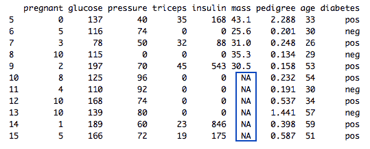

```scala
# Test with using the mean, we will set all the missing values 
# To the mean value for the column 

diabmiss$mass[is.na(diabmiss$mass)] <- mean(diabmiss$mass,na.rm = TRUE) 

# Check the values that have been imputed 
data.frame(actual=actual[10:100], impute_with_mean=diabmiss$mass[10:100]) 
```

前面代码的输出如下：

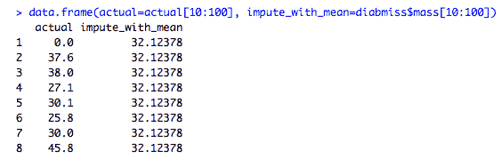

```scala
# Check the Root-Mean-Squared-Error for the entire column 
# Root Mean Squared Error provides an estimate for the 
# Difference between the actual and the predicted values 
# On 'average' 

diabmissdf<- data.frame(actual=actual, impute_with_mean=diabmiss$mass) 
rmse1 <- RMSE(diabmissdf$impute_with_mean,actual) 
rmse1 

# [1] 3.417476 

# We will re-run the exercise using knnImputation (from package DMwR) 

# Change the value of the records back to NA 
diabmiss<- diabmiss_orig 
diabmiss$mass[10:100] <- NA 

# Perform knnImputation 
diabknn<- knnImputation(diabmiss,k=25) 

# Check the RMSE value for the knnImputation method 
rmse2 <- RMSE(diabknn$mass,actual) 
rmse2 

# [1] 3.093827 

# Improvement using the knnImputation methods in percentage terms 

100 * (rmse1-rmse2)/rmse1 

[1] 22.20689 
```

虽然这可能不代表一个显著的变化，但仍然比使用简单的方法（如使用均值或常数值）要好。

R 中有几个数据插补的包。其中一些著名的包如下：

+   **Amelia II**：时间序列数据中的缺失信息

[`gking.harvard.edu/amelia`](https://gking.harvard.edu/amelia)

+   **使用 R 包进行热卡补充**: HotDeckImputation 和 hot.deck

[`cran.r-project.org/web/packages/HotDeckImputation/`](https://cran.r-project.org/web/packages/HotDeckImputation/)

[`cran.r-project.org/web/packages/hot.deck/`](https://cran.r-project.org/web/packages/hot.deck/)

+   **多变量填充（通过链式方程）**

[`cran.r-project.org/web/packages/mice/index.html`](https://cran.r-project.org/web/packages/mice/index.html)

+   **在 R 包中使用贝叶斯框架进行值的填充**: mi

[`cran.r-project.org/web/packages/mi/index.html`](https://cran.r-project.org/web/packages/mi/index.html)

# 变量的重要性

在模型构建过程中，数据集可能有数十个变量。并非所有变量都可能对预测模型有价值。将数据集减少到包括变量子集并允许机器学习程序员花更多时间来调整选择的变量和模型构建过程是很常见的。减少数据集中变量数量也有技术上的理由。在非常大的、即高维数据集上执行机器学习建模可能非常计算密集，即可能需要大量的时间、CPU 和 RAM 来执行数值运算。这不仅使得应用某些算法变得不切实际，还会导致不必要的延迟。因此，变量的系统选择有助于分析时间和算法分析的计算要求。

**变量选择**也被称为特征选择/属性选择。随机森林和套索回归等算法实现了变量选择作为其算法操作的一部分。但是，变量选择也可以作为一个单独的练习来完成。

R 包`caret`为变量选择提供了一个非常简单易用和直观的接口。由于我们还没有讨论建模过程，我们将学习如何找到重要的变量，并在下一章深入探讨这个主题。

我们将使用一个常见的、众所周知的算法，称为`RandomForest`，用于构建决策树。该算法将在下一章中更详细地描述，但在这里使用它的目的仅仅是为了展示如何进行变量选择。这个例子说明了一般过程是什么样的。

我们将重复使用我们一直在处理的数据集，即来自`mlbench`包的`PimaIndiansDiabetes`数据。我们还没有讨论模型训练过程，但在这里使用它是为了得出变量重要性的值。在这种情况下，结果变量是糖尿病，其他变量被用作自变量。换句话说，我们能否使用可用的数据来预测一个人是否患有糖尿病：

```scala
diab<- PimaIndiansDiabetes 

# We will use the createDataPartition function from caret to split 
# The data. The function produces a set of indices using which we 
# will create the corresponding training and test sets 

training_index<- createDataPartition(diab$diabetes, p = 0.80, list = FALSE, times = 1) 

# Creating the training set 
diab_train<- diab[training_index,] 

# Create the test set 
diab_test<- diab[-training_index,] 

# Create the trainControl parameters for the model 
diab_control<- trainControl("repeatedcv", number = 3, repeats = 2, classProbs = TRUE, summaryFunction = twoClassSummary) 

# Build the model 
rf_model<- train(diabetes ~ ., data = diab_train, method = "rf", preProc = c("center", "scale"), tuneLength = 5, trControl = diab_control, metric = "ROC") 

# Find the Variable Importance 
varImp(rf_model) 
rf variable importance 

         Overall 
glucose  100.000 
mass      52.669 
age       39.230 
pedigree  24.885 
pressure  12.619 
pregnant   6.919 
insulin    2.294 
triceps    0.000 

# This indicates that glucose levels, body mass index and age are the top 3 predictors of diabetes. 

# caret also includes several useful plot functions. We can visualize the variable importance using the command: 

plot(varImp(rf_model)) 
```

上述代码的输出如下所示。它表明葡萄糖、体重指数和年龄是对创建模型（预测糖尿病）做出最大贡献的变量。

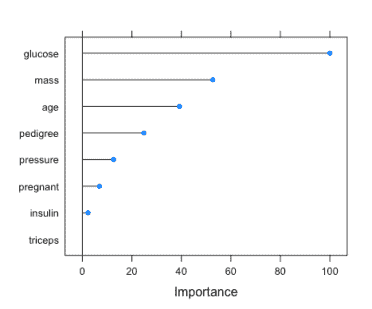

# 训练、测试拆分和交叉验证概念

在机器学习中，训练、测试拆分和交叉验证集是一个基本概念。这是一个纯统计方法与机器学习方法有实质区别的领域之一。在统计建模任务中，一个人可能进行回归、参数/非参数测试，并应用其他方法，而在机器学习中，算法方法被补充了对产生的结果的迭代评估和随后的模型改进的元素。

# 将数据拆分为训练集和测试集

每个机器学习建模练习都始于数据清洗的过程，正如前面讨论的那样。下一步是将数据分割成训练集和测试集。通常是通过随机选择数据中的行来完成的，这些行将被用来创建模型。然后未被选择的行将被用来测试最终模型。

通常的分割在 70-80%之间（训练数据与测试数据）。在 80-20 的分割中，80%的数据将被用来创建模型。剩下的 20%将被用来测试最终模型。

我们在前面的部分中应用了这个方法，但我们可以再次查看代码。`createDataPartition`函数被用来分割数据，参数为`p = 0.80`。`training_index`变量保存了我们将使用的训练索引（`dataset`，`diab`）：

```scala
training_index<- createDataPartition(diab$diabetes, p = 0.80, list = FALSE, times = 1) 

length(training_index) # Number of items that we will select for the train set [1] 615 

nrow(diab) # The total number of rows in the dataset [1] 768 

# Creating the training set, this is the data we will use to build our model 
diab_train<- diab[training_index,] 

# Create the test set, this is the data against which we will test the performance of our model 
diab_test<- diab[-training_index,] 
```

我们不一定要使用`createDataPartition`函数，而是可以使用简单的 R 命令创建一个随机样本，如下所示：

```scala
# Create a set of random indices representing 80% of the data 
training_index2 <- sample(nrow(diab),floor(0.80*nrow(diab))) 

# Check the size of the indices just created 
length(training_index2) [1] 614 

# Create the training set 
diab_train2 <- diab[training_index2,] 

# Create the test set 
diab_test2 <- diab[-training_index2] 
```

# 交叉验证参数

交叉验证将训练-测试分割的概念推向了下一个阶段。机器学习练习的目标本质上是找到哪组模型参数能提供最佳的性能。模型参数指的是函数（模型）所需的参数。例如，对于决策树模型，参数可能包括模型应该构建的深度级别、分割数量等。如果有*n*个不同的参数，每个参数有*k*个不同的值，那么总参数数量将是*k*^*n*。通常我们会为每个参数选择一组固定的组合，可能最终会有 100-1000+个组合。我们将测试模型的性能（例如，正确预测结果的准确度）。

对于一个简单的训练-测试分割，比如说，如果我们选择了 500 个参数组合，我们只需要对训练数据集运行它们，并确定哪一个显示出最佳性能。

通过交叉验证，我们进一步将训练集分成更小的子集，比如说通常使用三折或五折。如果有三折，也就是说，我们将训练集分成三个子集，我们将一折放在一边，比如说第 2 折，然后使用第 1 折和第 3 折构建一个模型。然后测试它对第 2 折的准确性。这个步骤会重复多次，每次迭代都代表了一组独特的折，训练-测试过程和准确度测量。最终，我们会选择表现最佳的参数组合。

标准的方法可以总结如下：

1.  创建一个 80-20 的训练-测试分割

1.  使用不同的模型参数组合执行你的模型

1.  选择表现最佳的模型参数并创建最终模型

1.  在测试集上应用最终模型以查看结果

交叉验证方法要求我们进一步将训练数据集分成更小的子集。这些子集通常被称为**折**，总称为**k 折**，其中*k*代表分割的数量：

1.  创建一个 80-20 的训练-测试分割

1.  将训练集分成 k 折，比如说三折

1.  将第 1 折放在一边，使用第 2 折和第 3 折构建模型

1.  在第 1 折上测试你的模型表现（例如，准确结果的百分比）

1.  将第 2 折放在一边，使用第 1 折和第 3 折构建模型

1.  在第 2 折上测试你的模型表现

1.  将第 3 折放在一边，使用第 1 折和第 2 折构建模型

1.  在第 3 折上测试你的模型表现

1.  取所有三折模型的平均性能

1.  对*每组模型参数*重复步骤 1

1.  选择表现最佳的模型参数并创建最终模型

1.  在测试集上应用最终模型以查看结果

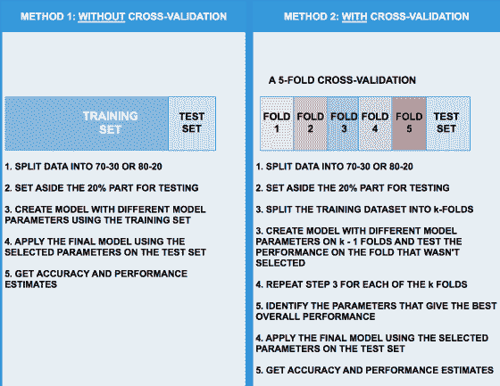

这张图片说明了使用不带交叉验证的方法和带交叉验证的方法之间的差异。交叉验证方法可以说更加健壮，并且涉及对模型的严格评估。也就是说，尝试最初创建一个不带交叉验证的模型通常是有用的，以了解可能期望的性能。例如，如果使用 2-3 个训练-测试分割构建的模型显示出 30%的准确性，那么很可能任何其他方法，包括交叉验证，都不会使其达到 90%。换句话说，标准方法有助于了解可能期望的性能。由于交叉验证可能非常耗费计算资源和时间，因此在性能的初步分析中获得初始反馈是有帮助的。

R 中的 caret 包提供了一个非常用户友好的方法来使用交叉验证构建模型。请记住，数据预处理必须通过或作为交叉验证过程的一个组成部分。因此，假设我们需要对数据集进行中心化和缩放，并进行五折交叉验证，我们只需要在 caret 的`trainControl`函数中定义我们想要使用的抽样类型。

Caret 关于`trainControl`的网页提供了函数的详细概述，并附有示例，网址为[`topepo.github.io/caret/model-training-and-tuning.html#basic-parameter-tuning`](https://topepo.github.io/caret/model-training-and-tuning.html#basic-parameter-tuning)。

我们在之前的练习中使用了这种方法，在`PimaIndiansDiabetes`数据集上使用`RandomForest`构建了一个模型。这里再次展示出来，以表明这种技术的使用情况：

```scala
# Create the trainControl parameters for the model 
# The parameters indicate that a 3-Fold CV would be created 
# and that the process would be repeated 2 times (repeats) 
# The class probabilities in each run will be stored 
# And we'll use the twoClassSummary* function to measure the model 
# Performance 
diab_control<- trainControl("repeatedcv", number = 3, repeats = 2, classProbs = TRUE, summaryFunction = twoClassSummary) 

# Build the model 
# We used the train function of caret to build the model 
# As part of the training process, we specified a tunelength** of 5 
# This parameter lets caret select a set of default model parameters 
# trControl = diab_control indicates that the model will be built 
# Using the cross-validation method specified in diab_control 
# Finally preProc = c("center", "scale") indicate that the data 
# Would be centered and scaled at each pass of the model iteration 

rf_model<- train(diabetes ~ ., data = diab_train, method = "rf", preProc = c("center", "scale"), tuneLength = 5, trControl = diab_control, metric = "ROC") 
```

您可以从[`cran.r-project.org/web/packages/caret/vignettes/caret.pdf`](https://cran.r-project.org/web/packages/caret/vignettes/caret.pdf)获取有关`summaryFunction`的更详细解释。

`summaryFunction`参数用于传递一个函数，该函数接受观察值和预测值，并估计某种性能指标。该包中已经包含了两个这样的函数：`defaultSummary`和`twoClassSummary`。后者将计算特定于两类问题的度量，例如 ROC 曲线下面积、灵敏度和特异性。由于 ROC 曲线是基于预测类别概率的（这些概率不会自动计算），因此需要另一个选项。`classProbs = TRUE`选项用于包括这些计算。

以下是来自`caret`的`train`函数的帮助文件中关于`tuneLength`的解释。

`tuneLength`是一个整数，表示调整参数网格中的粒度。默认情况下，该参数是由`train`生成的每个调整参数的级别数。如果`trainControl`选项中有`search = random`，则这是由随机搜索生成的调整参数组合的最大数量。

请注意，如果给出了这个参数，必须要有名称。

# 创建模型

创建模型后的最后一步是使用模型对测试数据集进行预测。通常使用 R 中的`predict`函数来完成，第一个参数是创建的模型，第二个参数是您想要获取预测结果的数据集。

以`PimaIndiansDiabetes`数据集为例，在模型构建完成后，我们可以按以下方式在测试数据集上进行预测：

```scala
# Install the R Package e1071, if you haven't already 
# By running install.packages("e1071") 

# Use the predict function and the rf_model that was previously built 
# To get the predictions on the test dataset 
# Note that we are not including the column diabetes in the test 
# dataset by using diab_test[,-ncol(diab_test)] 

predictions<- predict(rf_model, diab_test[,-ncol(diab_test)]) 

# First few records predicted 
head(predictions)
[1] negnegpospospospos 
Levels: negpos 

# The confusion matrix allows us to see the number of true positives 
# False positives, True negatives and False negatives 

cf<- confusionMatrix(predictions, diab_test$diabetes) 
cf 

# Confusion Matrix and Statistics 
#  
#        Reference 
# Prediction negpos 
#        neg  89  21 
#        pos  11  32 
#  
# Accuracy : 0.7908           
# 95% CI : (0.7178, 0.8523) 
# No Information Rate : 0.6536           
# P-Value [Acc> NIR] : 0.0001499        
#  
# Kappa : 0.5167           
# Mcnemar's Test P-Value : 0.1116118        
#  
# Sensitivity : 0.8900           
# Specificity : 0.6038           
# PosPredValue : 0.8091           
# NegPredValue : 0.7442           
# Prevalence : 0.6536           
# Detection Rate : 0.5817           
# Detection Prevalence : 0.7190           
# Balanced Accuracy : 0.7469           
#  
# 'Positive' Class :neg 
```

让我们看看混淆矩阵告诉我们什么：

```scala
# This indicates that of the records that were marked negative (neg) 
# We predicted 89 of them as negative and 11 as positive (i.e., they 
# were negative but we incorrectly classified them as a positive 

# We correctly identified 32 positives but incorrectly classified 
# 21 positives as negative 

# 
#           Reference 
# Prediction neg  pos 
#        neg  89  21 
#        pos  11  32 

# The overall accuracy was 79% 
# This can be improved (significantly) by using more  
# Accuracy : 0.7908           

# We can plot the model using plot(rf_model) as follows 
plot(rf_model) 
```

绘图如下：

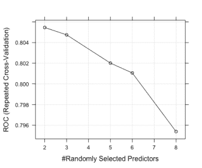

```scala
# And finally we can also visualize our confusion matrix using the 
# inbuilt fourfoldplot function in R 

fourfoldplot(cf$table) 
```

我们得到的绘图如下：

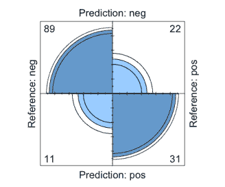

根据*`fourfoldplot`*的文档[来源：[`stat.ethz.ch/R-manual/R-devel/library/graphics/html/fourfoldplot.html`](https://stat.ethz.ch/R-manual/R-devel/library/graphics/html/fourfoldplot.html)]，二元行和列变量之间的关联（与 1 不同的几率比）由对角线相对方向的单元格大小差异的倾向来指示；颜色用于显示这个方向。几率比的置信环允许对无关联的零假设进行视觉检验；如果相邻象限的环重叠，那么观察计数与零假设一致。

# 利用模型中的多核处理

在这里使用 PimaIndianDiabetes2 数据集重复上一节的练习。该数据集包含一些缺失值。因此，我们将首先填补缺失值，然后运行机器学习示例。

该练习已经以一些额外的细微差别重复进行，比如使用多核/并行处理以使交叉验证运行更快。

要利用多核处理，使用以下代码安装`doMC`包：

```scala
Install.packages("doMC")  # Install package for multicore processing 
Install.packages("nnet") # Install package for neural networks in R 
```

现在我们将按照这里的代码运行程序：

```scala
# Load the library doMC 
library(doMC) 

# Register all cores 
registerDoMC(cores = 8) 

# Set seed to create a reproducible example 
set.seed(100) 

# Load the PimaIndiansDiabetes2 dataset 
data("PimaIndiansDiabetes2",package = 'mlbench') 
diab<- PimaIndiansDiabetes2 

# This dataset, unlike PimaIndiansDiabetes has 652 missing values! 
> sum(is.na(diab)) [1] 652 

# We will use knnImputation to fill in the missing values 
diab<- knnImputation(diab) 

# Create the train-test set split 
training_index<- createDataPartition(diab$diabetes, p = .8, list = FALSE, times = 1) 

# Create the training and test dataset 
diab_train<- diab[training_index,] 
diab_test<- diab[-training_index,] 

# We will use 10-Fold Cross Validations 
diab_control<- trainControl("repeatedcv", number = 10, repeats = 3, search = "random", classProbs = TRUE) 

# Create the model using methodnnet (a Neural Network package in R) 
# Note that we have changed the metric here to "Accuracy" instead of # ROC 
nn_model<- train(diabetes ~ ., data = diab_train, method = "nnet",   preProc = c("center", "scale"), trControl = diab_control, tuneLength = 10, metric = "Accuracy") 

predictions<- predict(nn_model, diab_test[,-ncol(diab_test)]) 
cf<- confusionMatrix(predictions, diab_test$diabetes) 
cf 

# >cf 
# Confusion Matrix and Statistics 
#  
#        Reference 
# Prediction negpos 
#        neg  89  19 
#        pos  11  34 
#  
# Accuracy : 0.8039           
# 95% CI : (0.7321, 0.8636) 
# No Information Rate : 0.6536           
# P-Value [Acc> NIR] : 3.3e-05          
#  
```

即使有 650 多个缺失值，我们的模型也能够达到 80%以上的准确率。

它肯定可以得到改进，但作为基准，它展示了机器学习模型可以期望的性能类型。

在二元结果变量的情况下，随机猜测的准确率为 50%。80%的准确率显然比我们只使用猜测所能达到的准确率要高得多：

```scala
 plot(nn_model) 
```

得到的图如下：

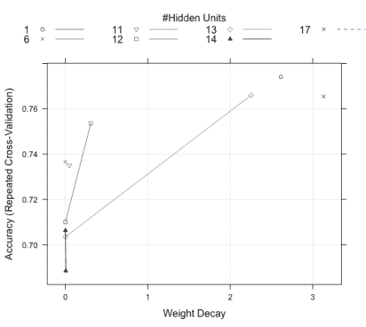

```scala
fourfoldplot(cf$table) 
```

结果如下图所示：

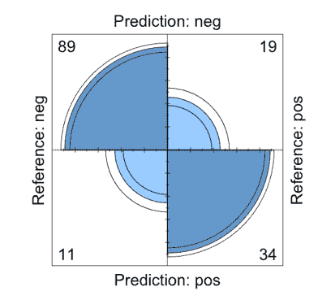

# 总结

在本章中，我们了解了机器学习的基本原理，不同类型，如监督和无监督，以及数据预处理、数据填补、管理不平衡类别和其他主题。

我们还了解了今天可以互换使用的一些关键术语之间的区别，特别是 AI 和机器学习这两个术语。我们了解到人工智能涉及到各种各样的主题，如博弈论、社会学、受限优化和机器学习；相对于机器学习，AI 的范围要广得多。

机器学习促进了人工智能；也就是说，机器学习算法被用来创建*人工智能*系统，但它们的范围不同。回归问题（在给定一组点的情况下找到最佳拟合线）可以被视为机器学习*算法*，但在概念上，它不太可能被视为 AI 算法（尽管从技术上讲它可能是）。

在下一章中，我们将研究机器学习中的其他概念，如偏差、方差和正则化。我们还将了解一些重要的算法，并学习如何使用 R 中的机器学习包应用它们。
