# 第八章：深入学习机器学习

之前关于机器学习的章节提供了该主题的初步概述，包括该主题领域的不同类别和核心概念。本章将更深入地探讨机器学习的理论方面，比如算法的限制以及不同算法的工作原理。

**机器学习**是一个广阔而复杂的主题，因此本章侧重于不同主题的广度，而不是深度。这些概念是以高层次介绍的，读者可以参考其他来源进一步了解这些主题。

我们将首先讨论机器学习中的一些基本理论，比如梯度下降和 VC 维度。接下来，我们将研究偏差和方差，这两个在任何建模过程中最重要的因素，以及偏差-方差权衡的概念。

接下来我们将讨论各种机器学习算法，它们的优势和应用领域。

最后，我们将通过使用真实世界的数据集来执行机器学习操作，来总结本章。

本章将涵盖以下主题：

+   偏差、方差和正则化属性

+   梯度下降和 VC 维度理论

+   机器学习算法

+   教程：使用 R 进行机器学习

# 偏差、方差和正则化属性

偏差、方差以及与之密切相关的正则化在机器学习领域中占据着非常特殊和基础的位置。

当机器学习模型过于“简单”时，就会出现偏差，导致结果与实际值一直偏离。

方差发生在模型过于“复杂”时，导致在测试数据集上结果非常准确，但在未见过/新的数据集上表现不佳。

一旦用户熟悉了创建机器学习模型的过程，似乎这个过程相当简单-获取数据，创建训练集和测试集，创建模型，在测试数据集上应用模型，练习完成。创建模型很容易；创建一个*好*模型则是一个更具挑战性的话题。但是如何测试模型的质量呢？也许更重要的是，如何构建一个“好”的模型呢？

答案在于一个叫做正则化的术语。这可能是一个花哨的词，但它的意思只是在创建模型的过程中，通过对训练数据集上过于出色的表现进行惩罚，对表现不佳的模型进行放松，从而受益。

要理解正则化，了解过拟合和欠拟合的概念会有所帮助。为此，让我们看一个简单但熟悉的例子，即绘制最佳拟合线。对于那些使用过 Microsoft Excel 的人，你可能已经注意到了绘制*最佳拟合线*的选项-实质上，给定一组点，你可以绘制一条代表数据并逼近点所代表的函数的线。

以下表格显示了几个属性的价格与面积的关系。为了确定房价与房屋大小之间的关系，我们可以绘制最佳拟合线或趋势线，如下所示：

| **Sq. ft.** | **Price ($)** |
| --- | --- |
| 862 | 170,982 |
| 1235 | 227,932 |
| 932 | 183,280 |
| 1624 | 237,945 |
| 1757 | 275,921 |
| **1630** | 274,713 |
| **1236** | 201,428 |
| **1002** | 193,128 |
| **1118** | 187,073 |
| **1339** | 202,422 |
| **1753** | 283,989 |
| **1239** | 228,170 |
| **1364** | 230,662 |
| **995** | 169,369 |
| **1000** | 157,305 |

如果我们使用线性趋势线绘制*最佳拟合线*，图表会看起来像这样：

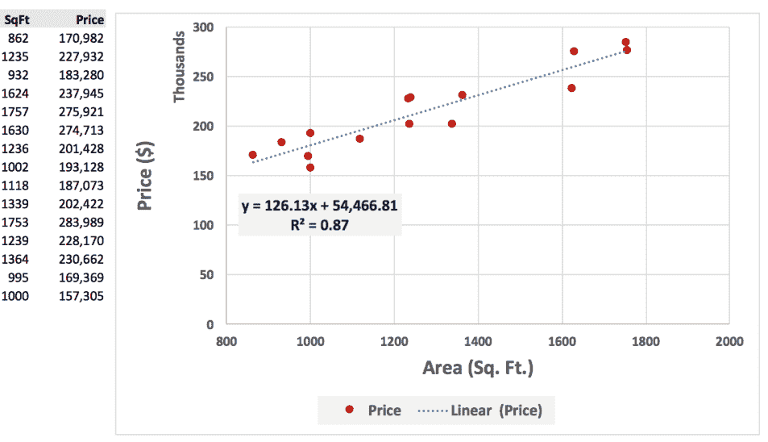

Excel 提供了一个有用的附加功能，允许用户绘制趋势线的延伸，这可以提供未知变量的估计或*预测*。在这种情况下，延伸趋势线将告诉我们，根据函数，1800-2000 平方英尺范围内的房屋价格可能是多少。

描述数据的线性函数如下：

*y=126.13x + 54,466.81*

下图中的延伸趋势线显示价格很可能在 275,000 美元和 300,000 美元之间：

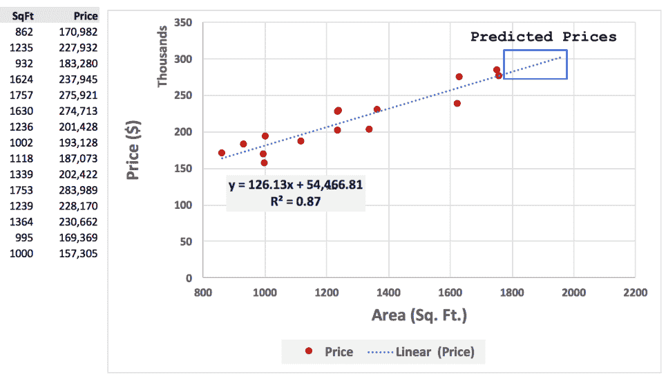

然而，有人可能会认为这条线不是最好的近似，可能可以增加 R2 的值，这种情况下是 0.87。一般来说，R² 越高，描述数据的模型就越好。有各种不同类型的*R²*值，但在本节中，我们假设*R²*越高，模型就越好。

在下一节中，我们将绘制一个具有更高 R² 的新趋势线，但使用多项式函数。这个函数具有更高的 R²（0.91 比 0.87），在视觉上看起来更接近平均点。

在这种情况下，函数是一个 6 次多项式：

*y = -0.00x⁶ + 0.00x⁵ - 0.00x⁴ + 2.50x³ - 2,313.40x² + 1,125,401.77x - 224,923,813.17*

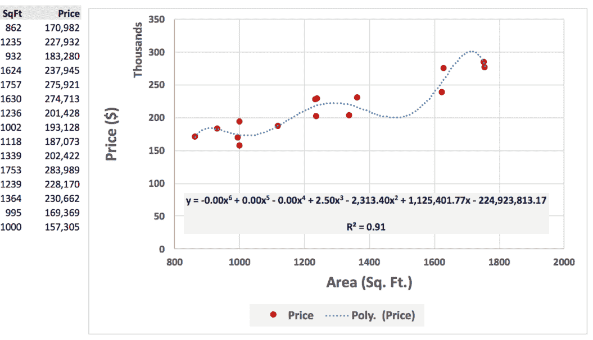

但是，即使该线具有更高的 R²，如果我们延伸趋势线，试图找出 1800-2000 平方英尺范围内房屋的价格可能是什么，我们得到以下结果。

1800-2000 平方英尺范围内的房屋价格从大约 280,000 美元到负 2 百万美元。换句话说，购买 1800 平方英尺房屋的人预计要花费 280,000 美元，而购买 2000 平方英尺房屋的人根据这个函数应该获得 200 万美元！当然，这是不准确的，但我们刚刚见证的是所谓的**过拟合**。下图说明了这一现象。

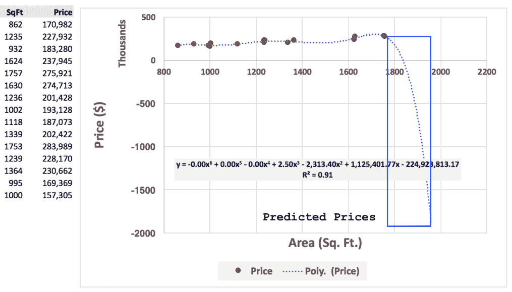

在光谱的另一端是**欠拟合**。当构建的模型不能描述数据时就会发生这种情况。在下图中，函数 y = 0.25x - 200 就是一个例子：

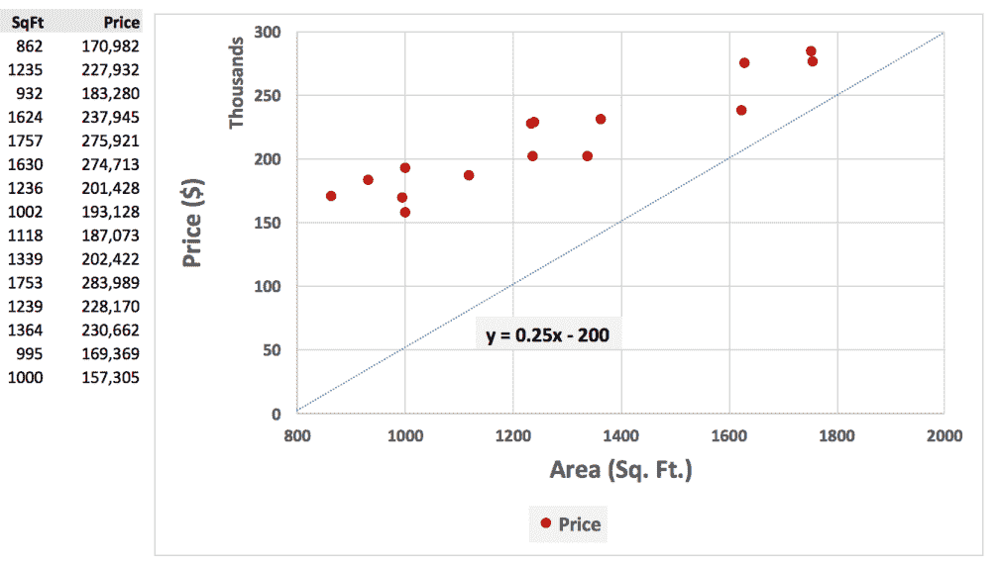

简而言之，这一部分可以简化如下：

+   一个过于拟合数据的函数，可以近似训练数据集中的几乎所有点的函数被认为是过拟合。

+   一个完全不适合数据的函数，或者换句话说远离训练数据集中实际点的函数被认为是欠拟合。

+   机器学习是在过拟合和欠拟合数据之间取得平衡的过程。这可能是一个不容易的练习，这就是为什么即使构建模型可能是微不足道的，构建一个相当不错的模型却是一个更加困难的挑战。 

+   欠拟合是指你的函数“根本不思考”-它具有很高的偏差。

+   过拟合是指你的函数“想得太多”-它具有很高的方差。

+   欠拟合和过拟合的另一个例子将在接下来的例子中给出。

假设我们的任务是确定一堆水果是橙子还是苹果，并已经知道它们在水果篮（左侧或右侧）、大小和重量的位置：

|  | 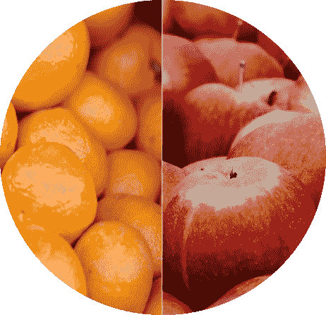 |
| --- | --- |
| **篮子 1（训练数据集）** | **篮子 2（测试数据集）** |

过拟合的一个例子可能是，根据训练数据集，关于篮子 1，我们可能得出结论说篮子右侧只有橙子，左侧全是苹果。

欠拟合的一个例子可能是我得出结论说篮子里只有橙子。

**模型 1**：在第一种情况下-过拟合-我实际上是在记忆位置。

**模型 2**：在第二种情况下 - 对于欠拟合 - 我根本记不清任何东西。

现在，给定第二个篮子 - 位置为苹果和橙子互换的测试数据集 - 如果我使用模型 1，我会错误地得出右手边的所有水果都是橙子，左手边的都是苹果的结论（因为我记住了训练数据）。

如果我使用模型 2，我会再次错误地得出所有水果都是橙子的结论。

然而，有办法管理欠拟合和过拟合之间的平衡 - 或者换句话说，高偏差和高方差之间的平衡。

用于偏差-方差权衡的常用方法之一称为正则化。这指的是对模型进行惩罚（例如，回归中的模型系数），以产生一个能够在一系列数据点上很好泛化的输出。

下一页的表格说明了偏差和方差的一些关键概念，并说明了当模型存在高偏差或高方差时的补救措施选项：

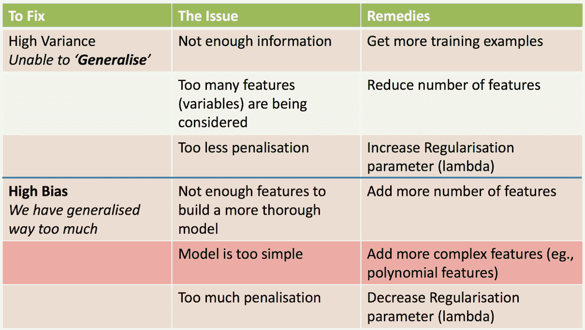

在建模过程中，高偏差通常表现为训练集误差和测试集误差保持一致地高。对于高方差（过拟合），训练集误差迅速减少，但测试集误差保持不变。

# 梯度下降和 VC 维度理论

梯度下降和 VC 维度是机器学习中的两个基本理论。一般来说，**梯度下降**提供了一种结构化方法来找到函数的最优系数。函数的假设空间可能很大，通过梯度下降，算法试图找到成本函数（例如，误差的平方和）最低的最小值。

**VC 维度**提供了系统中可以分类的最大点数的上限。它本质上是函数丰富性的度量，并以结构化方式提供了对假设限制的评估。函数或假设可以准确分类的点数称为假设的 VC 维度。例如，线性边界可以准确分类 2 或 3 个点，但不能是 4 个。因此，这个二维空间的 VC 维度将是 3。

VC 维度，就像计算学习理论中的许多其他主题一样，既复杂又有趣。这是一个较少人知晓（和讨论）的话题，但它试图回答关于学习限制的问题，因此具有深远的影响。

# 流行的机器学习算法

有各种不同类别的机器学习算法。因此，由于算法可以同时属于多个“类别”或类别，概念上很难明确说明算法专属于单一类别。在本节中，我们将简要讨论一些最常用和知名的算法。

这些包括：

+   回归模型

+   关联规则

+   决策树

+   随机森林

+   Boosting 算法

+   支持向量机

+   K 均值

+   神经网络

请注意，在这些示例中，我们展示了使用整个数据集的 R 函数的基本用法。在实践中，我们会将数据分成训练集和测试集，一旦建立了令人满意的模型，就会将其应用于测试数据集以评估模型的性能。

# 回归模型

回归模型从统计学中常用的线性、逻辑和多元回归算法到 Ridge 和 Lasso 回归，后者对系数进行惩罚以提高模型性能。

在我们之前的例子中，我们看到了在创建趋势线时应用**线性回归**的情况。**多元线性回归**指的是创建模型的过程需要多个自变量。

例如：

**总广告成本 = x*印刷广告**，将是一个简单的线性回归；而

**总广告成本 = X + 印刷广告 + 广播广告 + 电视广告**，由于存在多个独立变量（印刷、广播和电视），将是多元线性回归。

**逻辑回归**是另一种常用的统计回归建模技术，用于预测离散分类值的结果，主要用于结果变量是二分的情况（例如，0 或 1，是或否等）。然而，也可以有超过 2 个离散的结果（例如，州 NY、NJ、CT），这种类型的逻辑回归称为**多项式逻辑回归**。

**岭回归和 Lasso 回归**在线性回归的其他方面之外还包括一个正则化项（λ）。正则化项，岭回归，会减少β系数（因此“惩罚”系数）。在 Lasso 中，正则化项倾向于将一些系数减少到 0，从而消除变量对最终模型的影响：

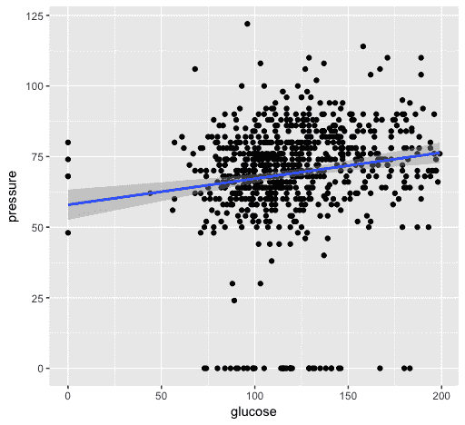

```scala
# Load mlbench and create a regression model of glucose (outcome/dependent variable) with pressure, triceps and insulin as the independent variables.

> library("mlbench") 
>lm_model<- lm(glucose ~ pressure + triceps + insulin, data=PimaIndiansDiabetes[1:100,]) 
> plot(lm_model) 
```

# 关联规则

关联规则挖掘，或**apriori**，试图找到数据集中变量之间的关系。关联规则经常用于各种实际的现实用例。给定一组变量，apriori 可以指示交易数据集中固有的模式。我们的一个教程将基于实现用于 apriori 的 R Shiny 应用程序，因此在本节中将更加重视这一点。

例如，假设一个超市连锁店正在决定货架上商品的摆放顺序。针对包含销售交易的数据库运行的 apriori 算法将识别出最常一起购买的商品。这使得超市能够确定哪些商品，当放置在彼此紧邻的战略位置时，可以产生最多的销售额。这通常也被称为*市场篮子分析*。

反映这一点的一个简单例子可能是：

```scala
# The LHS (left-hand side) leads to the RHS (right-hand side) in the relationships shown below.

# For instance, {Milk, Bread} --> {Butter} indicates that someone purchasing milk and bread is also likely to purchase butter.

{Milk, Bread} --> {Butter}
{Butter, Egg} --> {Baking Tray}
{Baking Tray, Butter} --> {Sugar}
...
```

在所有这些情况下，左侧购买某物导致了表达式右侧提到的物品的购买。

还可以从不一定包含*交易*的数据库中导出关联规则，而是使用滑动窗口沿着时间属性浏览事件，比如 WINEPI 算法。

Apriori 中有 3 个主要的度量。为了说明它们，让我们使用一个包含 4 个独立交易中购买的商品的样本数据集：

| **交易** | **商品 1** | **商品 2** | **商品 3** |
| --- | --- | --- | --- |
| 1 | 牛奶 | 面包 | 黄油 |
| 2 | 牛奶 | 鸡蛋 | 黄油 |
| 3 | 面包 | 鸡蛋 | 奶酪 |
| 4 | 黄油 | 面包 | 鸡蛋 |

# 置信度

置信度指的是当左侧有效时，apriori 表达式的右侧有多少次有效。例如，给定一个表达式：

```scala
{Milk} à {Bread}
```

我们想知道牛奶也购买时面包经常购买吗。

在这种情况下：

+   **交易 1**：牛奶和面包都存在

+   **交易 2**：有牛奶，但没有面包

+   **交易 3 和 4**：牛奶不存在

因此，根据我们所看到的，有 2 个交易中有牛奶，其中有 1 个交易中有面包。因此，规则{牛奶} à {面包}的置信度为 1/2 = 50%

再举个例子：

```scala
{Bread} à {Butter}
```

我们想知道，购买面包时，黄油也经常购买吗？：

+   **交易 1**：面包和黄油都存在

+   **交易 2**：没有面包（黄油是存在的，但我们的参考点是面包，因此这不算）

+   **交易 3**：有面包但没有黄油

+   **交易 4**：面包和黄油都存在

因此，在这种情况下，我们有 3 个交易中有面包，3 个交易中有面包和黄油。因此，在这种情况下，规则{面包} à {黄油}的“置信度”是*2/3 = 66.7*。

# 支持

支持是指规则满足的次数与数据集中的总交易次数的比率。

例如：

{牛奶} --> {面包}，在 4 次交易中发生了 1 次（在交易 1）。因此，这条规则的支持率为¼ = 0.25（或 25%）。

{面包} --> {黄油}，在 4 次交易中发生了 2 次（在交易 1 和 4）。因此，这条规则的支持率为½ = 0.50（或 50%）。

# 提升

提升可以说是 3 个度量中最重要的一个；它衡量了规则相对于表达式的两侧的支持度；换句话说，它衡量了规则相对于 LHS 和 RHS 的随机发生的强度。它正式定义为：

*提升=支持（规则）/（支持（LHS）*支持（RHS））*

低提升值（例如，小于或等于 1）表示 LHS 和 RHS 的发生是相互独立的，而较高的提升度量表示共同发生是显著的。

在我们之前的例子中，

{面包} --> {黄油}的提升为：

支持（{面包} --> {黄油}）

支持{面包} * 支持{黄油}

= 0.50/（（3/4）*（3/4））= 0.50/（0.75 * 0.75）= 0.89。

这表明尽管规则的置信度很高，但规则本身相对于可能高于 1 的其他规则并不重要。

一个提升高于 1 的规则示例是：

{项目 1：面包} --> {项目 3：奶酪}

这有一个提升：

支持{项目 1：面包 --> 项目 3：奶酪}/（支持{项目 1：奶酪} * 支持{项目 3：奶酪}）

=（1/4）/（（1/4）*（1/4）= 4。

# 决策树

决策树是一种预测建模技术，它生成推断出某种结果的可能性的规则，这些规则是基于先前结果的可能性推导出来的。一般来说，决策树通常类似于**流程图**，具有一系列节点和叶子，表示父子关系。不链接到其他节点的节点称为叶子。

决策树属于一类算法，通常被称为**CART**（**分类和回归树**）。如果感兴趣的结果是一个分类变量，它属于分类练习，而如果结果是一个数字，它被称为回归树。

一个例子将有助于使这个概念更清晰。看一下图表：

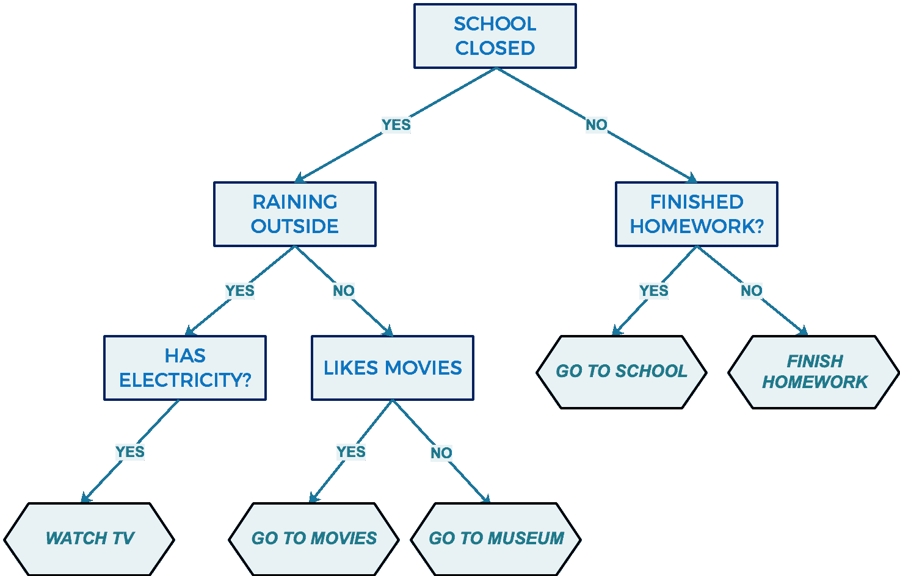

图表显示了一个假设的场景：如果学校关闭/不关闭。蓝色的矩形框代表节点。第一个矩形（学校关闭）代表*根*节点，而内部矩形代表*内部*节点。带有倾斜边缘的矩形框（绿色和斜体字母）代表“*叶子*”（或*终端*节点）。

决策树易于理解，是少数不是“黑匣子”的算法之一。用于创建神经网络的算法通常被认为是黑匣子，因为由于模型的复杂性，很难（甚至不可能）直观地确定最终结果达成的确切路径。

在 R 中，有各种创建决策树的工具。在 R 中创建它们的常用库是`rpart`。我们将重新访问我们的`PimaIndiansDiabetes`数据集，看看如何使用该包创建决策树。

我们想创建一个模型来确定葡萄糖、胰岛素、（体重）质量和年龄与糖尿病的关系。请注意，在数据集中，糖尿病是一个具有是/否响应的分类变量。

为了可视化决策树，我们将使用`rpart.plot`包。相同的代码如下所示：

```scala
install.packages("rpart") 
install.packages("rpart.plot") 

library(rpart) 
library(rpart.plot) 

rpart_model<- rpart (diabetes ~ glucose + insulin + mass + age, data = PimaIndiansDiabetes) 

>rpart_model 
n= 768  

node), split, n, loss, yval, (yprob) 
      * denotes terminal node 

  1) root 768 268 neg (0.6510417 0.3489583)   
    2) glucose< 127.5 485  94neg (0.8061856 0.1938144) * 
    3) glucose>=127.5 283 109 pos (0.3851590 0.6148410)   
      6) mass< 29.95 76  24neg (0.6842105 0.3157895)   
       12) glucose< 145.5 41   6 neg (0.8536585 0.1463415) * 
       13) glucose>=145.5 35  17pos (0.4857143 0.5142857)   
         26) insulin< 14.5 21   8 neg (0.6190476 0.3809524) * 
         27) insulin>=14.5 14   4 pos (0.2857143 0.7142857) * 
      7) mass>=29.95 207  57pos (0.2753623 0.7246377)   
       14) glucose< 157.5 115  45pos (0.3913043 0.6086957)   
         28) age< 30.5 50  23neg (0.5400000 0.4600000)   
           56) insulin>=199 14   3 neg (0.7857143 0.2142857) * 
           57) insulin< 199 36  16pos (0.4444444 0.5555556)   
            114) age>=27.5 10   3 neg (0.7000000 0.3000000) * 
            115) age< 27.5 26   9 pos (0.3461538 0.6538462) * 
         29) age>=30.5 65  18pos (0.2769231 0.7230769) * 
       15) glucose>=157.5 92  12pos (0.1304348 0.8695652) * 

>rpart.plot(rpart_model, extra=102, nn=TRUE)

# The plot shown below illustrates the decision tree that the model, rpart_model represents.
```

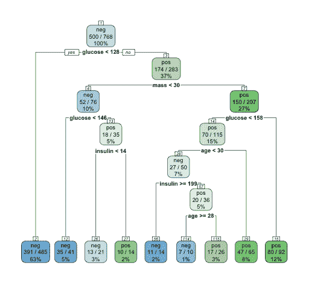

从顶部开始阅读，图表显示数据集中有 500 个`糖尿病=neg`的情况（共 768 条记录）。

```scala
> sum(PimaIndiansDiabetes$diabetes=="neg") 
[1] 500 
```

在数据集中总共 768 条记录中，血糖<128 的记录有 485 条被标记为负面。其中，模型正确预测了 391 个案例为负面（节点编号 2，从底部向左的第一个节点）。

对于血糖读数>128 的记录，有 283 条记录标记为阳性（节点编号 3，即最顶部/根节点的下方节点）。模型正确分类了这些案例中的 174 个。

另一个更近期的提供直观决策树和全面视觉信息的包是**FFTrees**（**Fast and Frugal Decision Trees**）。以下示例仅供信息目的：

```scala
install.packages("FFTrees") 
library(caret) 
library(mlbench) 
library(FFTrees) 
set.seed(123) 

data("PimaIndiansDiabetes") 
diab<- PimaIndiansDiabetes 
diab$diabetes<- 1 * (diab$diabetes=="pos") 

train_ind<- createDataPartition(diab$diabetes,p=0.8,list=FALSE,times=1) 

training_diab<- diab[train_ind,] 
test_diab<- diab[-train_ind,] 

diabetes.fft<- FFTrees(diabetes ~.,data = training_diab,data.test = test_diab) 
plot(diabetes.fft)

# The plot below illustrates the decision tree representing diabetes.fft using the FFTrees package.
```

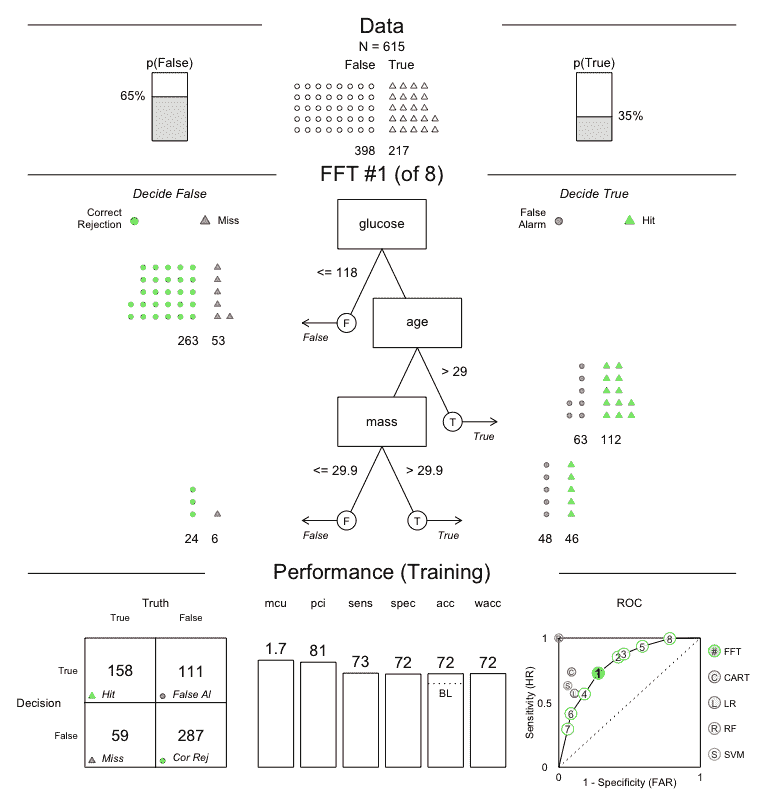

决策树通过递归地分割数据，直到达到停止条件，比如达到一定深度或案例数量低于指定值。每次分割都是基于将导致“更纯净子集”的变量进行的。

原则上，我们可以从给定的变量集合中生成无数棵树，这使得它成为一个特别困难和棘手的问题。存在许多算法可以提供一种有效的方法来分裂和创建决策树。其中一种方法是 Hunt's Algorithm。

有关该算法的更多详细信息可以在以下链接找到：[`www-users.cs.umn.edu/~kumar/dmbook/ch4.pdf`](https://www-users.cs.umn.edu/~kumar/dmbook/ch4.pdf)。

# 随机森林扩展

随机森林是我们刚讨论的决策树模型的扩展。在实践中，决策树易于理解、易于解释、使用现有算法快速创建，并且直观。然而，决策树对数据的细微变化敏感，只允许沿着一个轴进行分割（线性分割），并且可能导致过拟合。为了减轻决策树的一些缺点，同时仍然获得其优雅之处，诸如随机森林的算法会创建多个决策树，并对随机特征进行抽样以建立一个聚合模型。

随机森林基于**自助聚合**或**bagging**的原则。Bootstrap 是一个统计术语，表示带有替换的随机抽样。对给定的记录进行自助采样意味着随机抽取一定数量的记录，并可能在样本中多次包含相同的记录。然后，用户会在样本上测量他们感兴趣的指标，然后重复这个过程。通过这种方式，从随机样本中多次计算的指标值的分布预计将代表总体的分布，以及整个数据集。

Bagging 的一个例子是一组 3 个数字，比如（1,2,3,4）：

（1,2,3），（1,1,3），（1,3,3），（2,2,1），等等。

Bootstrap Aggregating，或*bagging*，意味着利用*多个自助采样*进行投票，同时在每个个体样本（n 条记录的集合）上构建模型，最后对结果进行聚合。

随机森林还实现了简单 bagging 之外的另一层操作。它还会在每次分裂时随机选择要包括在模型构建过程中的变量。例如，如果我们使用`PimaIndiansDiabetes`数据集创建一个随机森林模型，其中包括变量 pregnant, glucose, pressure, triceps, insulin, mass, pedigree, age, 和 diabetes，在每个自助采样（n 条记录的抽样）中，我们会选择一个随机特征子集来构建模型--例如，glucose, pressure, 和 insulin; insulin, age, 和 pedigree; triceps, mass, 和 insulin; 等等。

在 R 中，用于 RandomForest 的常用包被称为 RandomForest。我们可以通过该包直接使用，也可以通过 caret 使用。两种方法如下所示：

1.  使用 Random Forest 包：

```scala
> rf_model1 <- randomForest(diabetes ~ ., data=PimaIndiansDiabetes) > rf_model1 Call: randomForest(formula = diabetes ~ ., data = PimaIndiansDiabetes) 
Type of random forest: classification Number of trees: 500 No. of variables tried at each split: 2 OOB estimate of error rate: 23.44% Confusion matrix: negposclass.error neg430 70 0.1400000 pos 110 158 0.4104478
```

1.  使用 caret 的`method="rf"`函数进行随机森林：

```scala
> library(caret) 
> library(doMC) 

# THE NEXT STEP IS VERY CRITICAL - YOU DO 'NOT' NEED TO USE MULTICORE 
# NOTE THAT THIS WILL USE ALL THE CORES ON THE MACHINE THAT YOU ARE 
# USING TO RUN THE EXERCISE 

# REMOVE THE # MARK FROM THE FRONT OF registerDoMC BEFORE RUNNING 
# THE COMMAND 

># registerDoMC(cores = 8) # CHANGE NUMBER OF CORES TO MATCH THE NUMBER OF CORES ON YOUR MACHINE  

>rf_model<- train(diabetes ~ ., data=PimaIndiansDiabetes, method="rf") 
>rf_model 
Random Forest  

768 samples 
  8 predictor 
  2 classes: 'neg', 'pos'  

No pre-processing 
Resampling: Bootstrapped (25 reps)  
Summary of sample sizes: 768, 768, 768, 768, 768, 768, ...  
Resampling results across tuning parameters: 

mtry  Accuracy   Kappa     
  2     0.7555341  0.4451835 
  5     0.7556464  0.4523084 
  8     0.7500721  0.4404318 

Accuracy was used to select the optimal model using  the largest value. 
The final value used for the model was mtry = 5\. 

>getTrainPerf(rf_model) 

TrainAccuracyTrainKappa method 
1     0.7583831  0.4524728rf 
```

还可以在原始随机森林模型的每棵树中看到分裂和其他相关信息（未使用 caret）。这可以使用`getTree`函数来完成：

```scala
>getTree(rf_model1,1,labelVar = TRUE) 
    left daughter right daughter split var split point status prediction 
1               2              3      mass     27.8500      1       <NA> 
2               4              5       age     28.5000      1       <NA> 
3               6              7   glucose    155.0000      1       <NA> 
4               8              9       age     27.5000      1       <NA> 
5              10             11      mass      9.6500      1       <NA> 
6              12             13  pregnant      7.5000      1       <NA> 
7              14             15   insulin     80.0000      1       <NA> 
8               0              0      <NA>      0.0000     -1        neg 
9              16             17  pressure     68.0000      1       <NA> 
10              0              0      <NA>      0.0000     -1        pos 
11             18             19   insulin    131.0000      1       <NA> 
12             20             21   insulin     87.5000      1       <NA> 

 [...]
```

# 提升算法

提升是一种使用权重和一组*弱学习器*（如决策树）来提高模型性能的技术。提升根据模型误分类和未来学习器（在提升机器学习过程中创建）关注误分类示例来为数据分配权重。正确分类的示例将被重新分配新的权重，通常低于未正确分类的示例。权重可以基于成本函数，例如使用数据子集的多数投票。

简单而非技术性地说，提升使用*一系列弱学习器，每个学习器都从先前学习器的错误中“学习”*。

与装袋相比，提升通常更受欢迎，因为它根据模型性能分配权重，而不是像装袋那样对所有数据点分配相等的权重。这在概念上类似于加权平均与没有加权标准的平均函数之间的区别。

R 中有几个用于提升算法的软件包，其中一些常用的如下：

+   Adaboost

+   GBM（随机梯度提升）

+   XGBoost

其中，XGBoost 是一个广泛流行的机器学习软件包，在竞争激烈的机器学习平台（如 Kaggle）上被非常成功地使用。XGBoost 有一种非常优雅和计算效率高的方式来创建集成模型。由于它既准确又极快，用户经常用 XGBoost 来处理计算密集型的机器学习挑战。您可以在[`www.kaggle.com`](http://www.kaggle.com)了解更多关于 Kaggle 的信息。

```scala
# Creating an XGBoost model in R

library(caret)
library(xgboost) 

set.seed(123) 
train_ind<- sample(nrow(PimaIndiansDiabetes),as.integer(nrow(PimaIndiansDiabetes)*.80)) 

training_diab<- PimaIndiansDiabetes[train_ind,] 
test_diab<- PimaIndiansDiabetes[-train_ind,] 

diab_train<- sparse.model.matrix(~.-1, data=training_diab[,-ncol(training_diab)]) 
diab_train_dmatrix<- xgb.DMatrix(data = diab_train, label=training_diab$diabetes=="pos") 

diab_test<- sparse.model.matrix(~.-1, data=test_diab[,-ncol(test_diab)]) 
diab_test_dmatrix<- xgb.DMatrix(data = diab_test, label=test_diab$diabetes=="pos") 

param_diab<- list(objective = "binary:logistic", 
eval_metric = "error", 
              booster = "gbtree", 
max_depth = 5, 
              eta = 0.1) 

xgb_model<- xgb.train(data = diab_train_dmatrix, 
param_diab, nrounds = 1000, 
watchlist = list(train = diab_train_dmatrix, test = diab_test_dmatrix), 
print_every_n = 10) 

predicted <- predict(xgb_model, diab_test_dmatrix) 
predicted <- predicted > 0.5 

actual <- test_diab$diabetes == "pos" 
confusionMatrix(actual,predicted) 

# RESULT 

Confusion Matrix and Statistics 

          Reference 
Prediction FALSE TRUE 
     FALSE    80   17 
     TRUE     21   36 

Accuracy : 0.7532           
                 95% CI : (0.6774, 0.8191) 
    No Information Rate : 0.6558           
    P-Value [Acc> NIR] : 0.005956         

Kappa : 0.463            
Mcnemar's Test P-Value : 0.626496         

Sensitivity : 0.7921           
Specificity : 0.6792           
PosPredValue : 0.8247           
NegPredValue : 0.6316           
Prevalence : 0.6558           
         Detection Rate : 0.5195           
   Detection Prevalence : 0.6299           
      Balanced Accuracy : 0.7357           

       'Positive' Class : FALSE       
```

# 支持向量机

支持向量机，通常称为**SVMs**，是另一类用于使用称为**超平面**的概念将数据分类为一类或另一类的机器学习算法。超平面用于在点之间划定线性边界。

例如，在 x-y 轴上给定一组黑白点，我们可以找到多条分隔它们的线。在这种情况下，线代表了划分每个点所属类别的函数。在下图中，线 H1 和 H2 都准确地分隔了点。在这种情况下，我们如何确定 H1 和 H2 中哪一个是最佳线呢？：

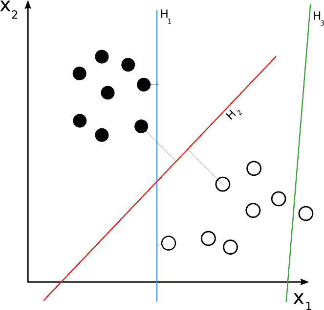

直观地说，最靠近点的线 - 例如，垂直线 H1 - 可能*不*是分隔点的最佳线。由于该线离点太近，因此对给定数据集上的点太具体，如果新点稍微偏离线的右侧或左侧，可能会被错误分类。换句话说，该线对数据的小变化过于敏感（这可能是由于随机/确定性噪声，如数据中的缺陷）。

另一方面，线 H2 成功地分隔了数据，同时保持了离线最近的点的最大可能距离。数据中的轻微缺陷不太可能影响点的分类，就像线 H1 可能做的那样。这本质上描述了下图中所示的最大间隔分离原则。

**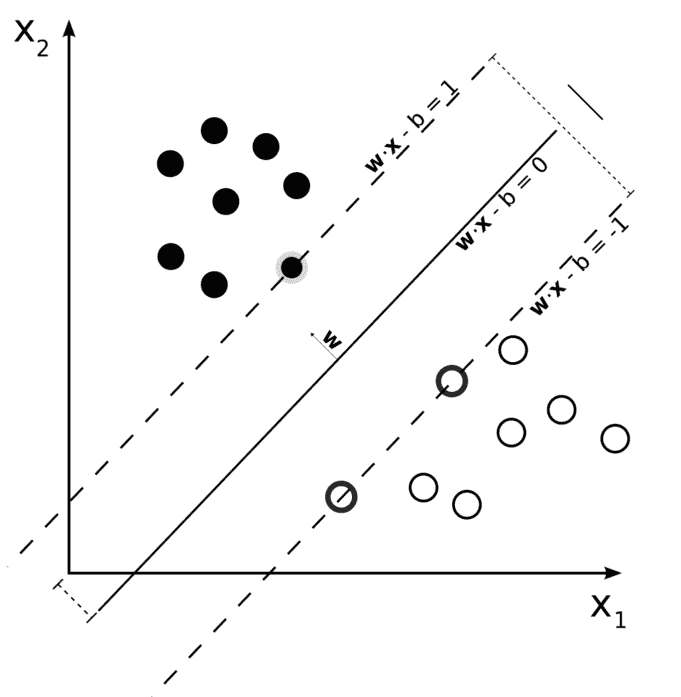**

靠近线的点，也称为超平面，被称为“支持向量”（因此得名）。在图像中，位于虚线上的点因此是支持向量。

然而，在现实世界中，并非所有点都可能是“线性可分”的。支持向量机利用了一种称为“核技巧”的概念。实质上，可能不是线性可分的点可以被投影或映射到更高维度的表面上。例如，给定一个在 2D x-y 空间上的一组点，如果它们不是线性可分的，那么可能可以将它们投影到 3 维空间上，如下图所示。红色的点在 2D 线上是不可分的，但是当映射到 3 维表面时，它们可以被如下图所示的超平面分开：

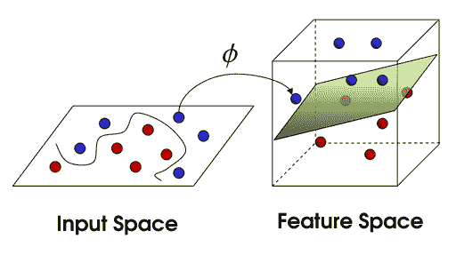

R 中有几个包可以让用户利用 SVM，比如`kernlab`、`e1071`、`klaR`等。在这里，我们展示了来自`e1071`包的 SVM 的使用，如下所示：

```scala
library(mlbench) 
library(caret) 
library(e1071) 
set.seed(123) 

data("PimaIndiansDiabetes") 
diab<- PimaIndiansDiabetes 

train_ind<- createDataPartition(diab$diabetes,p=0.8,list=FALSE,times=1) 

training_diab<- diab[train_ind,] 
test_diab<- diab[-train_ind,] 

svm_model<- svm(diabetes ~ ., data=training_diab) 
plot(svm_model,training_diab, glucose ~ mass) 

# The plot below illustrates the areas that are classified 'positive' and 'negative'
```

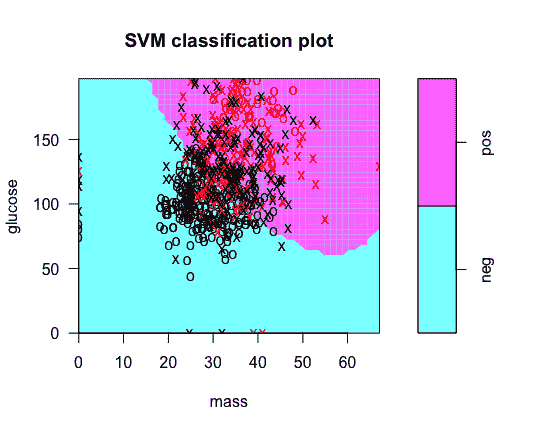

```scala
# Creating and evaluating the Confusion Matrix for the SVM model

svm_predicted<- predict(svm_model,test_diab[,-ncol(test_diab)]) 
confusionMatrix(svm_predicted,test_diab$diabetes) 

Confusion Matrix and Statistics 

          Reference 
Prediction negpos 
neg  93  26 
pos7  27 

Accuracy : 0.7843           
                 95% CI : (0.7106, 0.8466) 
    No Information Rate : 0.6536           
    P-Value [Acc> NIR] : 0.0003018        

Kappa : 0.4799           
Mcnemar's Test P-Value : 0.0017280        

Sensitivity : 0.9300           
Specificity : 0.5094           
PosPredValue : 0.7815           
NegPredValue : 0.7941           
Prevalence : 0.6536           
         Detection Rate : 0.6078           
   Detection Prevalence : 0.7778           
      Balanced Accuracy : 0.7197           

       'Positive' Class :neg 
```

# K-Means 机器学习技术

K-Means 是最流行的无监督机器学习技术之一，用于创建聚类，从而对数据进行分类。

一个直观的例子可以如下提出：

假设一所大学开设了一门新的美国历史和亚洲历史课程。该大学保持 15:1 的学生-教师比例，因此每 15 名学生配备 1 名教师。它进行了一项调查，其中包含每位学生对学习美国历史或亚洲历史的偏好分配的 10 分数值分数。

我们可以使用 R 中内置的 K-Means 算法创建 2 个簇，可能通过每个簇中的点的数量来估计可能报名每门课程的学生人数。相同的代码如下所示：

```scala
library(data.table) 
library(ggplot2) 
library() 

historyData<- fread("~/Desktop/history.csv") 
ggplot(historyData,aes(american_history,asian_history)) + geom_point() + geom_jitter() 

historyCluster<- kmeans(historyData,2) # Create 2 clusters 
historyData[,cluster:=as.factor(historyCluster$cluster)] 
ggplot(historyData, aes(american_history,asian_history,color=cluster)) + geom_point() + geom_jitter()

# The image below shows the output of the ggplot command. Note that the effect of geom_jitter can be seen in the image below (the points are nudged so that overlapping points can be easily visible)
```

以下图像可以直观地估计每门课程可能报名的学生人数（从而确定可能需要多少老师）：

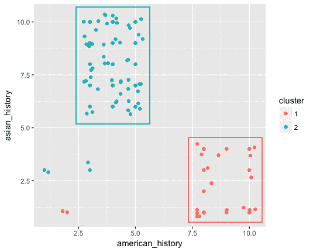

K-Means 算法有几种变体，但标准和最常用的是 Lloyd 算法。算法步骤如下：

给定一组 n 个点（比如在 x-y 轴上），为了找到 k 个簇：

1.  从数据集中随机选择 k 个点，代表 k 个簇的中点（比如*初始质心*）。

1.  从所选的 k 个点到其他点的距离（代表 k 个簇）被测量，并分配给距离最近的簇。

1.  簇中心被重新计算为簇中点的平均值。

1.  再次计算质心与所有其他点之间的距离，如步骤 2 中所示，并计算新的质心，如步骤 3 中所示。以此类推，重复步骤 2 和 3，直到没有新数据被重新分配。

存在各种用于聚类的*距离和相似度度量*，如**欧氏距离**（直线距离），**余弦相似度**（向量之间的夹角的余弦），**汉明距离**（通常用于分类变量），**马哈拉诺比斯距离**（以 P.C.马哈拉诺比斯命名；这测量了一个点与分布的均值之间的距离），等等。

尽管不能总是明确地确定最佳的簇数，但有各种方法试图找到一个估计。一般来说，可以通过簇内点之间的接近程度（簇内方差，如平方和-WSS）和簇之间的距离来衡量簇（因此簇之间的较大距离会使簇更容易区分）。用于确定最佳数量的一种方法称为**肘部法**。以下图表说明了这个概念：

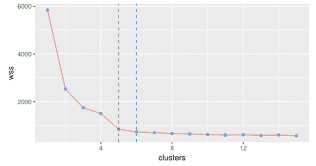

图表显示了 WSS（我们试图最小化的簇内平方和）与簇的数量之间的关系。显然，将簇的数量从 1 增加到 2 会大幅降低 WSS 值。当增加更多的簇时，WSS 的值会迅速下降，直到第 4 或第 5 个簇，之后再增加簇不会显著改善 WSS。通过视觉评估，机器学习从业者可以得出结论，可以创建的理想簇的数量在 3-5 之间，根据图像。

请注意，低 WSS 分数不足以确定最佳簇的数量。必须通过检查指标的改善来完成。当每个点成为独立簇时，WSS 最终会减少到 0。

# 与神经网络相关的算法

与神经网络相关的算法已经存在了很多十年。第一个计算模型是由沃伦·麦卡洛克和沃尔特·皮茨于 1943 年在《数学生物物理学公报》上描述的。

您可以在[`pdfs.semanticscholar.org/5272/8a99829792c3272043842455f3a110e841b1.pdf`](https://pdfs.semanticscholar.org/5272/8a99829792c3272043842455f3a110e841b1.pdf)和[`en.wikipedia.org/wiki/Artificial_neural_network`](https://en.wikipedia.org/wiki/Artificial_neural_network)了解更多相关概念。

物理世界中的各种人造物体，如飞机，都从自然中汲取了灵感。神经网络本质上是对神经元之间数据交换现象的一种表征，这种现象发生在*人类神经系统*中的轴突和树突（也称为树突）之间。就像数据在一个神经元和多个其他神经元之间传递以做出复杂的决策一样，人工神经网络以类似的方式创建了一个接收其他神经元输入的神经元网络。

在高层次上，人工神经网络由 4 个主要组件组成：

+   输入层

+   隐藏层

+   输出层

+   节点和权重

这在下图中表示出来：

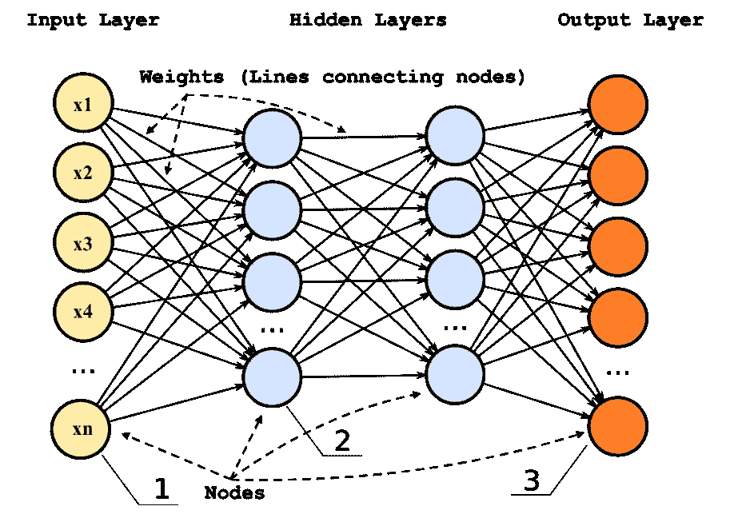

图中的每个节点根据前一层的输入产生输出。输出是使用**激活函数**产生的。有各种类型的激活函数，产生的输出取决于所使用的函数类型。例如二进制步进（0 或 1）、双曲正切（-1 到+1 之间）、Sigmoid 等。

下图说明了这个概念：

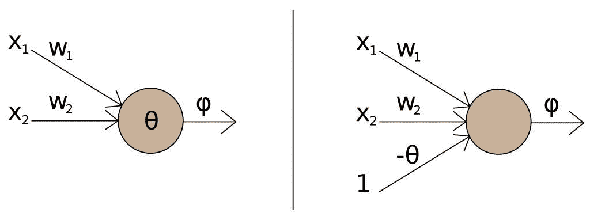

值 x1 和 x2 是输入，w1 和 w2 代表权重，节点代表对输入和它们的权重进行评估并由激活函数产生特定输出的点。因此，输出 f 可以表示为：

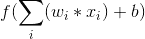

这里，f 代表激活函数，b 代表偏置项。偏置项独立于权重和输入值，并允许用户移动输出以实现更好的模型性能。

具有多个隐藏层（通常为 2 个或更多）的神经网络计算量很大，在最近的日子里，具有多个隐藏层的神经网络，也被称为深度神经网络或更一般地称为深度学习，已经变得非常流行。

行业中的许多发展都是由机器学习和人工智能推动的，这些发展直接是多层神经网络的实现结果。

在 R 中，`nnet`包提供了一个可直接使用的神经网络接口。尽管在实践中，神经网络通常需要复杂的硬件、GPU 卡等，但为了说明的目的，我们已经利用`nnet`包在`PimaIndiansDiabetes`数据集上运行了早期的分类练习。在这个例子中，我们将利用 caret 来执行`nnet`模型：

```scala
library(mlbench) 
library(caret) 
set.seed(123) 

data("PimaIndiansDiabetes") 
diab<- PimaIndiansDiabetes 

train_ind<- createDataPartition(diab$diabetes,p=0.8,list=FALSE,times=1) 

training_diab<- diab[train_ind,] 
test_diab<- diab[-train_ind,] 

nnet_grid<- expand.grid(.decay = c(0.5,0.1), .size = c(3,5,7)) 

nnet_model<- train(diabetes ~ ., data = training_diab, method = "nnet", metric = "Accuracy", maxit = 500, tuneGrid = nnet_grid) 

# Generating predictions using the neural network model
nnet_predicted <- predict(nnet_model, test_diab)

> plot (nnet_model)

```

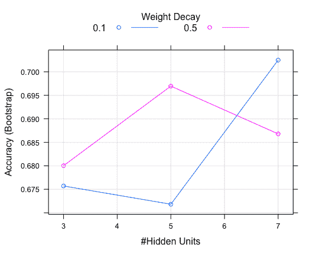

```scala
# Confusion Matrix for the Neural Network model

confusionMatrix(nnet_predicted,test_diab$diabetes)

Confusion Matrix and Statistics 

          Reference 
Prediction negpos 
neg  86  22 
pos  14  31 

Accuracy : 0.7647           
                 95% CI : (0.6894, 0.8294) 
    No Information Rate : 0.6536           
    P-Value [Acc> NIR] : 0.001988         

Kappa : 0.4613           
Mcnemar's Test P-Value : 0.243345         

Sensitivity : 0.8600           
Specificity : 0.5849           
PosPredValue : 0.7963           
NegPredValue : 0.6889           
Prevalence : 0.6536           
         Detection Rate : 0.5621           
   Detection Prevalence : 0.7059           
      Balanced Accuracy : 0.7225           

       'Positive' Class :neg 
```

# 教程 - 使用 CMS 数据进行关联规则挖掘

本教程将实现一个用于访问在 R 中使用 Apriori 包创建的规则的接口。

我们将从 CMS OpenPayments 网站下载数据。该网站提供有关公司向医生和医院支付的数据：


该网站提供了多种下载数据的方式。用户可以选择感兴趣的数据集并手动下载。在我们的情况下，我们将使用其中一种面向所有用户的基于 Web 的 API 来下载数据。

# 下载数据

数据集可以通过 Unix 终端（在虚拟机中）下载，也可以直接从浏览器访问该网站进行下载。如果您在虚拟机中下载数据集，请在终端窗口中运行以下命令：

```scala
time wget -O cms2016_2.csv 'https://openpaymentsdata.cms.gov/resource/vq63-hu5i.csv?$query=select Physician_First_Name as firstName,Physician_Last_Name as lastName,Recipient_City as city,Recipient_State as state,Submitting_Applicable_Manufacturer_or_Applicable_GPO_Name as company,Total_Amount_of_Payment_USDollars as payment,Nature_of_Payment_or_Transfer_of_Value as paymentNature,Product_Category_or_Therapeutic_Area_1 as category,Name_of_Drug_or_Biological_or_Device_or_Medical_Supply_1 as product where covered_recipient_type like "Covered Recipient Physician" and Recipient_State like "NY" limit 1200000' 
```

或者，如果您从浏览器下载数据，请在浏览器窗口中输入以下 URL 并点击*Enter*：

[`openpaymentsdata.cms.gov/resource/vq63-hu5i.csv?$query=select Physician_First_Name as firstName,Physician_Last_Name as lastName,Recipient_City as city,Recipient_State as state,Submitting_Applicable_Manufacturer_or_Applicable_GPO_Name as company,Total_Amount_of_Payment_USDollars as payment,Nature_of_Payment_or_Transfer_of_Value as paymentNature,Product_Category_or_Therapeutic_Area_1 as category,Name_of_Drug_or_Biological_or_Device_or_Medical_Supply_1 as product where covered_recipient_type like "Covered Recipient Physician" and Recipient_State like "NY"`](https://openpaymentsdata.cms.gov/resource/vq63-hu5i.csv?%24query=select%20Physician_First_Name%20as%20firstName,Physician_Last_Name%20as%20lastName,Recipient_City%20as%20city,Recipient_State%20as%20state,Submitting_Applicable_Manufacturer_or_Applicable_GPO_Name%20as%20company,Total_Amount_of_Payment_USDollars%20as%20payment,Nature_of_Payment_or_Transfer_of_Value%20as%20paymentNature,Product_Category_or_Therapeutic_Area_1%20as%20category,Name_of_Drug_or_Biological_or_Device_or_Medical_Supply_1%20as%20product%20where%20covered_recipient_type%20like%20%22Covered%20Recipient%20Physician%22%20and%20Recipient_State%20like%20%22NY%22)

如下图所示：

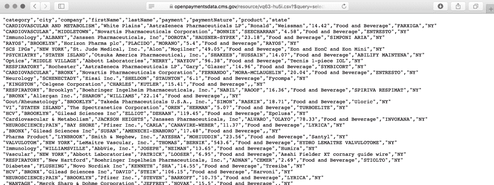

# 编写 Apriori 的 R 代码

如前所述，Apriori 算法允许用户查找数据集中固有的关系或模式。为此，我们将在 R/RStudio 中使用 arules 包。该代码将读取下载的数据集（在示例中称为`cms2016_2.csv`）并运行 Apriori 算法以查找关联规则。

在 RStudio 中创建一个新的 R 文件，并输入以下代码。确保您更改了下载的 csv 文件的位置，以便将其存储在适当的目录中：

```scala
library(data.table) 
library(arules) 

cms<- fread("~/cms2016_2.csv") # CHANGE THIS TO YOUR LOCATION OF THE DATA 

cols <- c("category","city","company","firstName","lastName","paymentNature","product") 

cms[ ,(cols) := lapply(.SD, toupper), .SDcols = cols] 

cms[,payment:=as.numeric(payment)] 

quantile_values<- quantile(cms$payment,seq(0,1,.25)) 
interval_values<- findInterval(cms$payment,quantile_values,rightmost.closed=TRUE) 

cms[,quantileVal:=factor(interval_values, labels=c("0-25","25-50","50-75","75-100"))] 

rules_cols<- c("category","city","company","paymentNature","product","quantileVal") 

cms[ ,(rules_cols) := lapply(.SD, factor), .SDcols = rules_cols] 

cms_factor<- cms[,.(category,city,company,paymentNature,product,quantileVal)] 

rhsVal<- paste0("quantileVal","=",c("0-25","25-50","50-75","75-100")) 

cms_rules<- apriori(cms_factor,parameter=list(supp=0.001,conf=0.25,target="rules",minlen=3)) 

cms_rules_dt<- data.table(as(cms_rules,"data.frame")) 
cms_rules_dt[, c("LHS", "RHS") := tstrsplit(rules, "=>", fixed=TRUE)] 
num_cols<- c("support","confidence","lift") 
cms_rules_dt[,(num_cols) := lapply(.SD, function(x){round(x,2)}), .SDcols = num_cols] 

saveRDS(cms_rules_dt,"cms_rules_dt.rds") 
saveRDS(cms_factor,"cms_factor_dt.rds") 
```

# Shiny（R 代码）

在 RStudio 中，选择文件|新建文件|Shiny Web 应用程序：


在`app.R`中输入以下代码：

```scala
# Packt: Big Data Analytics 
# Chapter 8 Tutorial 

library(shiny) 
library(shinydashboard) 
library(data.table) 
library(DT) 
library(shinyjs) 

cms_factor_dt<- readRDS("~/r/rulespackt/cms_factor_dt.rds") 
cms_rules_dt<- readRDS("~/r/rulespackt/cms_rules_dt.rds") 

# Define UI for application that draws a histogram 
ui<- dashboardPage (skin="green",    
dashboardHeader(title = "Apriori Algorithm"), 
dashboardSidebar( 
useShinyjs(), 
sidebarMenu( 
uiOutput("company"), 
uiOutput("searchlhs"), 
uiOutput("searchrhs"), 
uiOutput("support2"), 
uiOutput("confidence"), 
uiOutput("lift"), 
downloadButton('downloadMatchingRules', "Download Rules") 

         ) 
),dashboardBody( 
tags$head( 
tags$link(rel = "stylesheet", type = "text/css", href = "packt2.css"), 
tags$link(rel = "stylesheet", type = "text/css", href = "//fonts.googleapis.com/css?family=Fanwood+Text"), 
tags$link(rel = "stylesheet", type = "text/css", href = "//fonts.googleapis.com/css?family=Varela"), 
tags$link(rel = "stylesheet", type = "text/css", href = "fonts.css"), 

tags$style(type="text/css", "select { max-width: 200px; }"), 
tags$style(type="text/css", "textarea { max-width: 185px; }"), 
tags$style(type="text/css", ".jslider { max-width: 200px; }"), 
tags$style(type='text/css', ".well { max-width: 250px; padding: 10px; font-size: 8px}"), 
tags$style(type='text/css', ".span4 { max-width: 250px; }") 

         ), 
fluidRow( 
dataTableOutput("result") 
) 
       ), 
       title = "Aprior Algorithm" 
) 

# Define server logic required to draw a histogram 
server <- function(input, output, session) { 

  PLACEHOLDERLIST2 <- list( 
    placeholder = 'Select All', 
onInitialize = I('function() { this.setValue(""); }') 
  ) 

output$company<- renderUI({ 
datasetList<- c("Select All",as.character(unique(sort(cms_factor_dt$company)))) 
selectizeInput("company", "Select Company" ,  
datasetList, multiple = FALSE,options = PLACEHOLDERLIST2,selected="Select All") 
  }) 

output$searchlhs<- renderUI({ 
textInput("searchlhs", "Search LHS", placeholder = "Search") 
  }) 

output$searchrhs<- renderUI({ 
textInput("searchrhs", "Search RHS", placeholder = "Search") 
  }) 

  output$support2 <- renderUI({ 
sliderInput("support2", label = 'Support',min=0,max=0.04,value=0.01,step=0.005) 
  }) 

output$confidence<- renderUI({ 
sliderInput("confidence", label = 'Confidence',min=0,max=1,value=0.5) 
  }) 

output$lift<- renderUI({ 
sliderInput("lift", label = 'Lift',min=0,max=10,value=0.8) 
  }) 

dataInput<- reactive({ 
    print(input$support2) 
    print(input$company) 
    print(identical(input$company,"")) 

    temp <- cms_rules_dt[support > input$support2 & confidence >input$confidence& lift >input$lift] 

    if(!identical(input$searchlhs,"")){ 
searchTerm<- paste0("*",input$searchlhs,"*") 
      temp <- temp[LHS %like% searchTerm] 
    } 

    if(!identical(input$searchrhs,"")){ 
searchTerm<- paste0("*",input$searchrhs,"*") 
      temp <- temp[RHS %like% searchTerm] 
    } 

if(!identical(input$company,"Select All")){ 
      # print("HERE") 
      temp <- temp[grepl(input$company,rules)] 
    } 
    temp[,.(LHS,RHS,support,confidence,lift)] 
  }) 

output$downloadMatchingRules<- downloadHandler( 
    filename = "Rules.csv", 
    content = function(file) { 
      write.csv(dataInput(), file, row.names=FALSE) 
    } 
  ) 

output$result<- renderDataTable({ 
    z = dataInput() 
    if (nrow(z) == 0) { 
      z <- data.table("LHS" = '', "RHS"='', "Support"='', "Confidence"='', "Lift" = '') 
    } 
setnames(z, c("LHS", "RHS", "Support", "Confidence", "Lift")) 
datatable(z,options = list(scrollX = TRUE)) 
  }) 

}  shinyApp(ui = ui, server = server)
```

以下图像显示了代码被复制并保存在名为`app.R`的文件中。

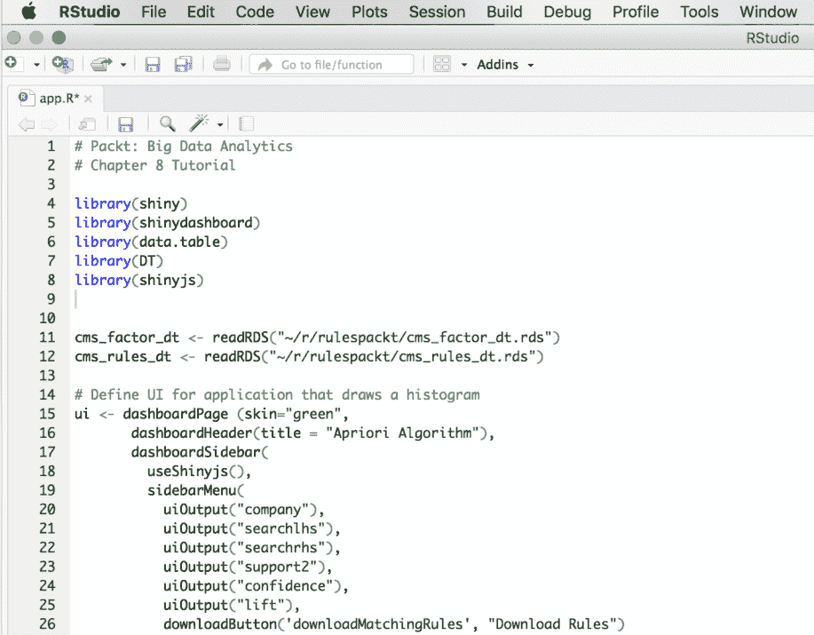

# 为应用程序使用自定义 CSS 和字体

对于我们的应用程序，我们将使用自定义的 CSS 文件。我们还将使用自定义字体，以使应用程序具有良好的外观和感觉。

您可以从本书的软件存储库中下载自定义的 CSS 文件。

CSS、字体和其他相关文件应存储在名为`www`的文件夹中，该文件夹位于您创建 R Shiny 应用程序的目录中：

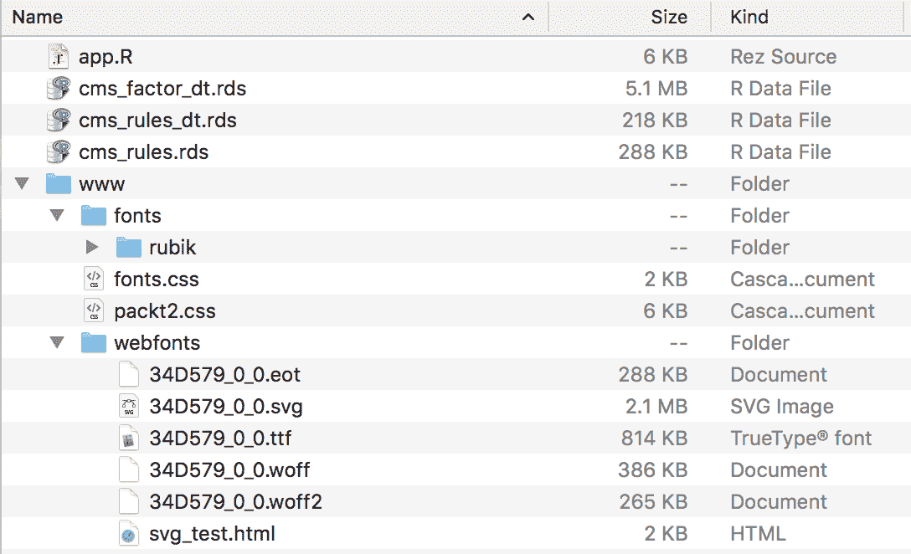

# 运行应用程序

如果一切顺利，您现在应该能够通过点击页面顶部的“运行应用程序”选项来运行应用程序，如下图所示：

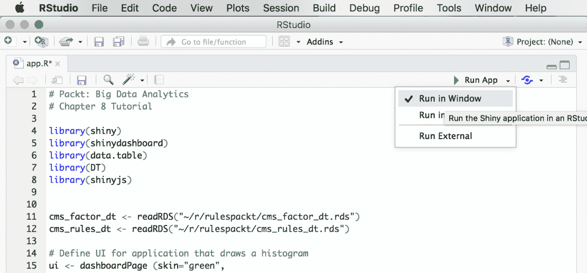

单击“运行”按钮后，用户将看到一个类似下面所示的弹出窗口。请注意，浏览器中应启用弹出窗口才能正常运行。

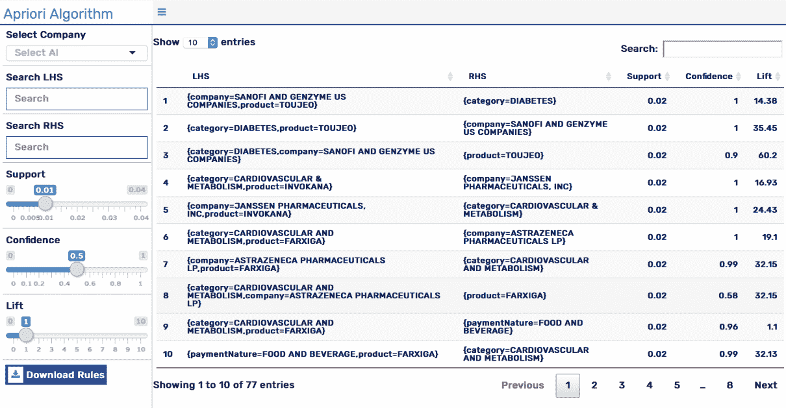

该应用程序具有多个控件，例如：

+   **搜索 LHS/RHS**：在规则的左侧或右侧输入您想要过滤的任何测试。

+   **支持**：指示数据集中规则的普遍性。

+   **置信度**：规则中有多少是精确匹配的。

+   **提升**：定义规则重要性的变量。大于 1 的数字被认为是显著的。

只要它们以与 R 脚本部分中概述的方式类似的方式进行处理，您就可以将此应用于任何其他规则文件。

# 总结

机器学习从业者常常认为创建模型很容易，但创建一个好模型要困难得多。事实上，不仅创建一个“好”模型很重要，更重要的是知道如何识别“好”模型，这是成功与不那么成功的机器学习努力之间的区别。

在本章中，我们深入了解了机器学习中一些更深层次的理论概念。偏差、方差、正则化和其他常见概念都在需要时用例子解释了。通过附带的 R 代码，我们还学习了一些常见的机器学习算法，如随机森林、支持向量机等。最后，我们通过教程学习了如何针对 CMS OpenPayments 数据创建一个详尽的基于 Web 的关联规则挖掘应用程序。

在下一章中，我们将阅读一些在企业中用于大数据和机器学习的技术。我们还将讨论云计算的优点以及它们如何影响企业软件和硬件堆栈的选择。
