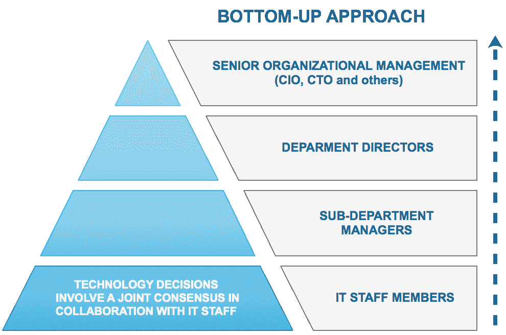
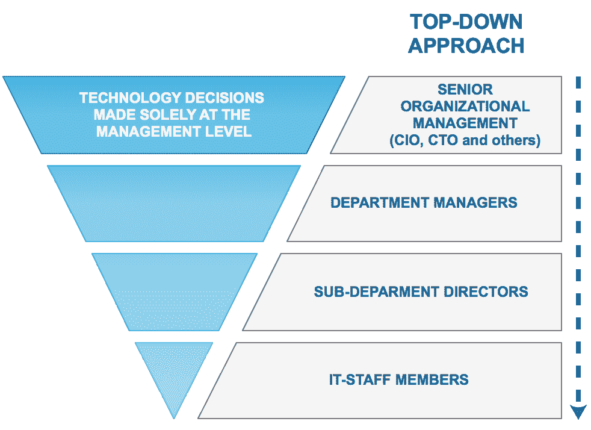
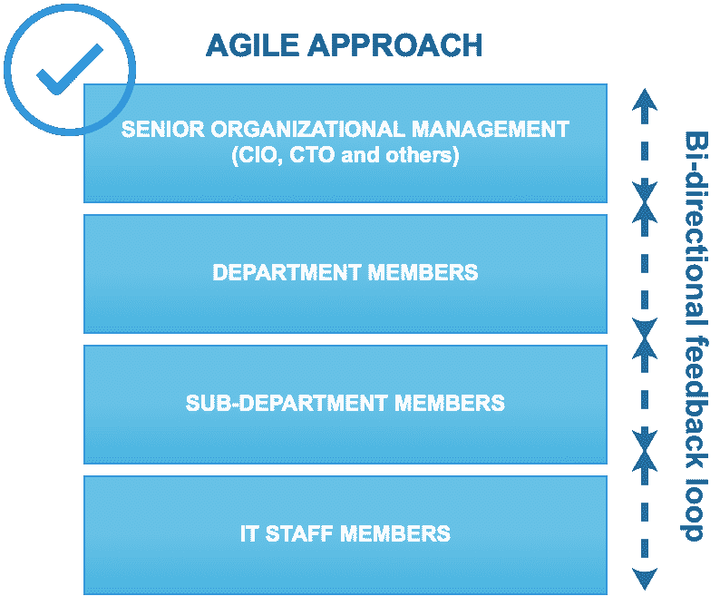
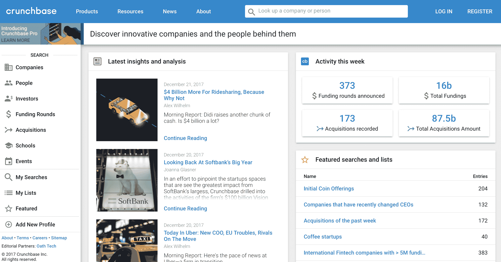

# 第十章：关于大数据的结束思考

到目前为止，我们已经涵盖了广泛的主题。我们已经研究了用于大数据、数据科学和机器学习的技术。我们已经了解了公司如何实施其大数据企业战略。在这个过程中，我们还开发了一些真实世界的应用程序。

本章讨论了公司在大数据或数据科学倡议中的实际考虑。该领域不断发展，引入了新技术、新的开源工具和数据挖掘中的新概念。因此，各种规模的组织都面临着共同的挑战。

数据科学的成功故事在媒体上随处可见。事实上，今天发生的大部分，如果不是全部的技术投资都与数据科学的某些方面有关。事实上，它已经成为 IT 发展中不可或缺的和整合的方面。

在本章中，我们将讨论实施数据科学的一些共同主题，共同的挑战，以及您可以采取什么措施使您的倡议成功。此外，我们将看一下数据科学的主要成功案例，以及数据科学未能实现其承诺的例子。我们还将提供一系列资源链接，您可以在那里了解更多相关主题。

本章将涵盖以下主题：

+   企业大数据和数据科学战略

+   道德考虑

+   硅谷和数据科学

+   人为因素

+   进一步阅读的链接

# 企业大数据和数据科学战略

你在报纸上读到它，你在晚间新闻中看到它，你从朋友那里听说过它 - 大数据和数据科学无处不在，它们已经到来并且会一直存在。

来自硅谷的成功故事使这种影响更加显著。谁会想到一款共享和叫车的手机应用 Uber，会成为估值接近 700 亿美元的世界上最受欢迎的公司之一。像 Airbnb 这样的网站和应用将公寓共享变成了一个蓬勃发展的业务，成为估值第二高的公司，达到 300 亿美元。

这些以及其他类似事件将大数据和数据科学的主题从纯理论和技术主题转变为人们已经将其与无限投资成功联系起来的常见术语。

由于几乎所有主要技术供应商都开始添加被归类为“大数据”的功能，今天投资技术的几乎所有公司都在知情或不知情地使用大数据的某些方面。

然而，实施的过程非常宽泛。因此，除了也许是 Hadoop 之外，没有明确定义的框架，Hadoop 已成为大多数公司采用的事实框架。高级管理层通常意识到大局，即大数据可以为他们的组织带来的价值。然而，实现愿景的道路具有挑战性，因此没有一个可以保证成功的明确解决方案。

广义上说，实施有三个阶段：

+   **休眠**：当公司尚未建立明确的授权，但正在讨论大数据时

+   **被动**：讨论开始变得更加正式，通常会导致委派一个团队/多个团队来评估对组织的影响和价值

+   **活跃**：公司开始评估技术并进行积极实施

大数据和/或数据科学战略的所有权可能有些混乱。这是因为该领域涵盖了分析和技术两个方面。前者，分析，通常由组织的面向业务的部门拥有，而技术则由 IT 部门拥有。然而，在数据科学中，两个方面都是必需的。了解领域非常好并且有领域中使用的数据的经验的数据专家可能是很好的业务主题专家。他们还可能能够全面地确定理想的用例以及如何最好地利用数据。然而，如果没有强大的技术知识，将很难确定实现愿景的正确工具。

在类似的情况下，IT 经理可能对与大数据相关的技术非常了解，但需要业务利益相关者的反馈，以有效确定哪种解决方案将满足组织的特定即时和长期需求。

换句话说，多个跨学科流需要合作，以实施真正有效的组织大数据生态系统。

实现战略的过程通常是自上而下或自下而上的。然而，与其采用严格的方向性方法，不如采用协作、迭代和敏捷的过程通常是最佳解决方案。在评估大数据需求的过程中，将根据新需求和发现做出决策和更改决策，并且可能需要修改先前的评估以满足修改后的目标。

自下而上的方法涉及从 IT 层面开始制定决策。自上而下的方法，可以说更常见，涉及从管理层开始制定决策。通常都不是最佳选择。理想的方法是一个连续的反馈循环，根据发现的过程调整需求：

相比之下，自下而上的方法如下：

无论自下而上还是自上而下的方法都不是成功的大数据计划的最佳选择。更好的选择是一个协作过程，考虑到不同部门的不断变化的需求和多样化的要求，这些部门将受益于大数据平台的实施：

# 伦理考虑

大数据通常涉及收集可能包含用户个人信息的大量数据。像 Facebook 和 Google 这样的公司通过分析个人信息来定位广告和执行其他类型的营销而蓬勃发展。这显然带来了伦理困境。个人数据应该被收集到什么程度？太多是多少？当然，这些问题没有正确答案。黑客攻击的兴起导致数亿用户帐户的信息被泄露，这种情况如此普遍，以至于我们对后果几乎变得麻木。

2017 年 10 月，雅虎披露，事实上，雅虎的每一个帐户都遭受了数据泄露。Equifax，美国最大的信用报告公司之一，遭受了一次数据泄露，泄露了超过 1.4 亿消费者的个人详细信息。还有许多类似的事件，而所有这些事件的共同点是所有公司都收集了一定程度的用户个人信息，无论是直接还是通过第三方。

实质上，每当涉及用户相关信息时，都需要实施适当的 IT 安全措施，以确保数据不会被泄露。后果不仅仅是数据丢失，还有声誉和信誉的影响，除了主要事实，即真实的人涉及到其数据被泄露。

因此，涉及敏感信息和/或任何个人信息的大数据安全变得至关重要。云服务提供商，如 AWS 和 Azure，部分原因是它们具有非常严格的安全标准和允许组织将责任转移给可信赖和强大实体的认证。

欧盟的《通用数据保护条例》（GDPR），自 2018 年 5 月生效，是保护其公民个人数据的重要一步。简而言之，GDPR 规定了任何个人数据的使用。在这种情况下，任何一词非常广泛，甚至包括个人的姓名。违反规定的人将被罚款高达 2,000 万欧元，或者违规组织全球营业额的 4%。

尽管这显然会减少大数据数据集的可用性，特别是那些涉及个人数据的数据集，但这也可能引发一场关于如何在约束条件下最好地利用数据的辩论和创新，也就是说，在不使用个人信息的情况下从数据中获取价值。

另一方面，美国等国家一直在放松有关个人数据收集的法律。2017 年初，美国取消了互联网服务提供商收集个人信息的隐私保护，并实际上使像 AT&T 这样的 ISP 不仅可以收集而且可以出售用户的浏览和应用程序数据合法化。

# 硅谷和数据科学

今天我们看到的许多大数据的关键创新都来自硅谷。这个地区几十年来一直是科技中心，推出了一些最成功的公司，如苹果、谷歌、Facebook 和 eBay。加州大学伯克利分校等大学的存在使得人才的获取相对容易。

也就是说，该地区的生活成本已经飙升，尤其是在大数据和数据科学行业增长的背景下。如今，一居室公寓的平均租金已经超过每月 3,500 美元，甚至比纽约市还要昂贵。

然而，硅谷与成功是同义词，许多新创业者被吸引到这个地区。初创公司如雨后春笋般涌现，其中许多公司获得了数千万美元的风险投资。然而，创业者应该注意统计警告，因为初创企业的高失败率。拥有一个伟大的想法，具有潜在的高商业价值是一回事。将这个想法变成商业成功需要不同类型的技能和商业头脑。

对于感兴趣的人，Crunchbase 网站提供了对初创企业领域活动的非常全面的视图。以下图片显示了在任何 7 天内发生的投资的平均数字，可能达到数十亿美元：

# 人的因素

尽管大数据和数据科学的显著优势，以及它们的成功和突破性增长，但仍然重要的是要记住人类思维在所有努力中的重要性。

大数据技术将使我们能够更有效地分析数据。但我们仍然需要正确的判断来决定我们的理想用例。这并不是微不足道的。大公司发现倡议同样具有挑战性（尽管规模更大），就像经验丰富的大数据专业人员一样。

同样，数据科学和机器学习可以让我们借助复杂的算法和代码进行预测和预见。然而，用户仍然有责任评估结果并不仅仅基于预测输出做出决定。用户应该在做出这样的评估时运用常识和经验。如果 GPS 指示司机在下雪的冬夜走某条路，而司机知道那条路不会被除雪车清理，盲目遵循 GPS 指示是不明智的。

一个最近的例子说明了这个概念，就是在 2016 年选举期间人与机器之间的脱节。使用非常复杂的算法估计出克林顿赢得选举的高概率的广泛模型都被证明是错误的。杰出的数据科学家和领先的统计组织估计克林顿当选的概率为 80-90％。我们都错过了做决定的人的因素。我们过于依赖模型的复杂性，而不是试图了解人们真正的感受，以及他们对候选人的最终选择和真实感受是否与他们在非正式调查中的断言一致。

# 成功项目的特点

数据科学项目本质上需要很长时间才能实现投资回报。特别是，很难准确衡量涉及长期预测的项目的成功。正如前面的章节所述，为了推动数据科学事业的发展，部门必须展示早期的成功。一般来说，项目的关键因素包括：a）短期；b）有可衡量的结果；c）可以受益并将被广泛用户使用。这些因素有助于建立可信度并确保数据科学相关项目的成功。

这样一个项目的例子是 Arterys，这是一家云公司，于 2016 年末开发了一种深度学习算法，可以在短时间内评估血液流向心脏，与传统扫描仪相比。它符合成功的关键标准。好处几乎立即显而易见，该算法提供了直接可衡量的结果，因为您可以将结果与扫描仪的结果进行比较，并且对广泛的用户，即患者，非常有用。此外，这个主题非常直观。

任何接受过血液检测的人都能直观地理解血流的测量。这种产品的好处也是非常明显的。能够在短时间内获得结果可以帮助挽救生命。2016 年 11 月，FDA 批准了这个算法。这是一个里程碑式的成就。

# 总结

总的来说，虽然通往大数据和数据科学成功的道路可能看起来艰难，但希望前面的章节已经全面概述了大数据的各种主题。我们讨论了数据挖掘和机器学习，了解了各自学科中的各种工具和技术，并在真实世界数据上开发了应用程序，并提供了关于组织大数据和数据科学倡议的微妙之处的离别思考。

接下来的几页列出了一些资源链接，读者可能会发现对于学习更多关于各自主题领域有用的。
