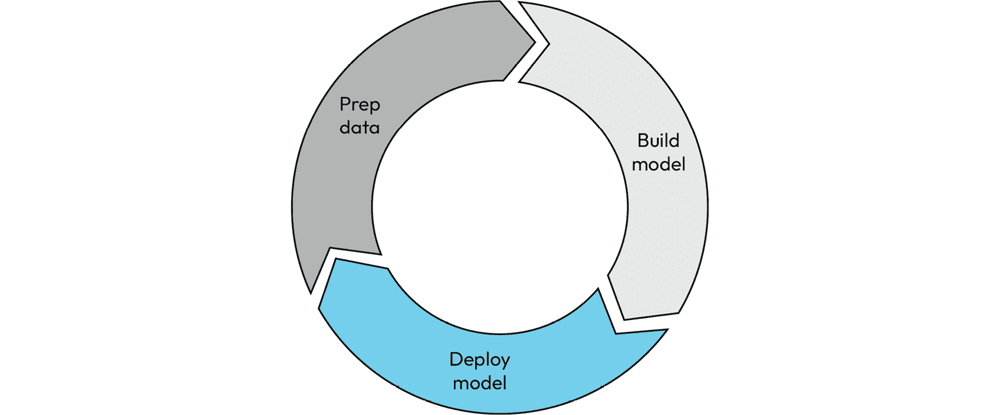
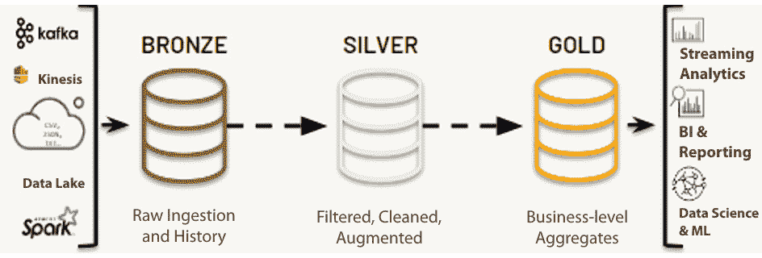
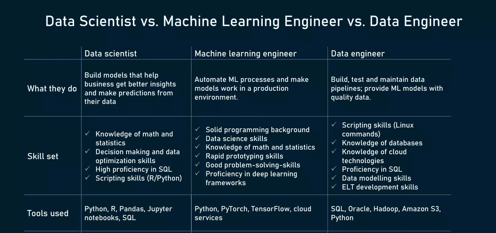
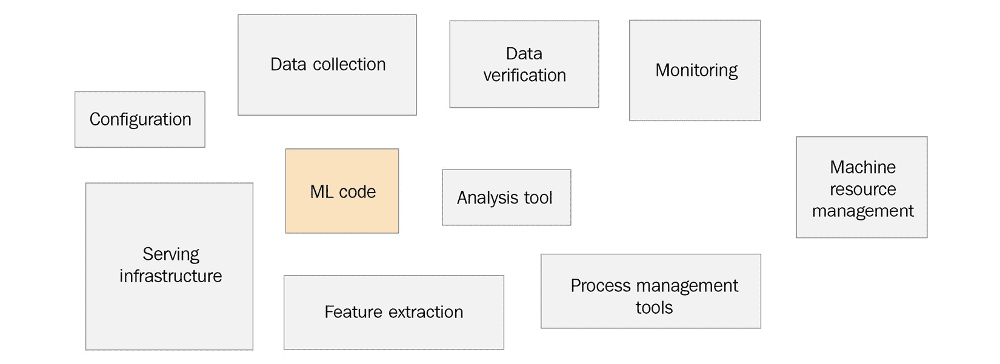
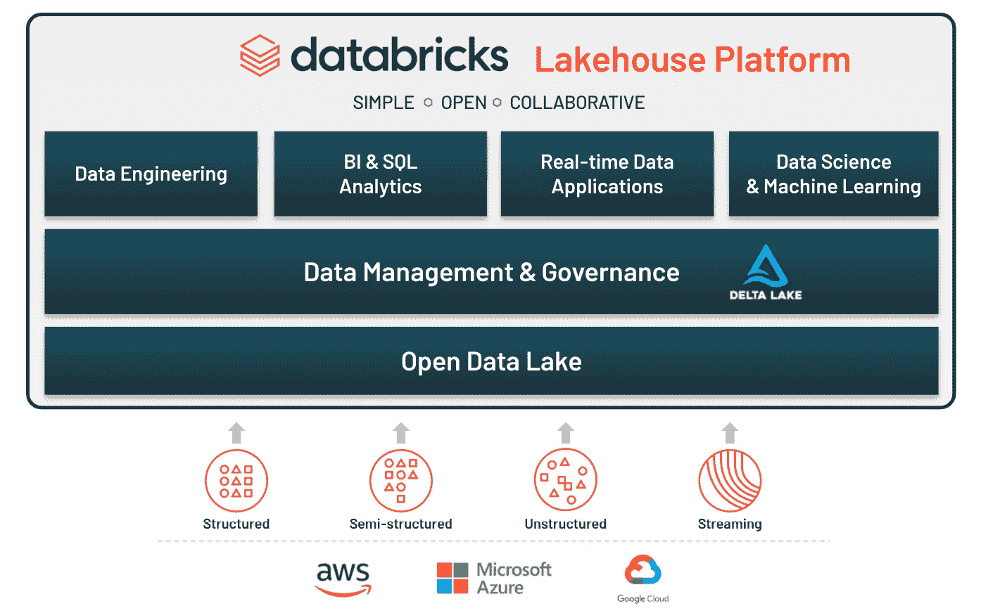

# 第一章：机器学习过程及其挑战

欢迎来到使用 Databricks 平台简化你的**机器学习**（**ML**）生命周期的世界。

作为 Databricks 的高级解决方案架构师，专注于机器学习，多年来，我有机会与企业合作，架构能够解决其独特商业用例的机器学习平台，使用 Databricks 平台。现在，这段经验将为你提供学习资源。你从本书中获得的知识将为你开启新的职业机会，并改变你为组织的机器学习用例架构机器学习流水线的方式。

本书假定你已经对 Python 语言有一定了解，因为附带的代码示例将使用 Python。 本书并不是从零开始教授机器学习技术；它假设你是一个经验丰富的数据科学从业者，想要学习如何利用 Databricks 平台将你的机器学习用例从开发到生产以及中间的所有步骤。

本书需要一定的 Python 和 pandas 知识。熟悉 Apache Spark 是加分项，具备扎实的机器学习和数据科学基础是必要的。

注意

本书重点介绍当前一般可用的功能。提供的代码示例使用 Databricks 笔记本。尽管 Databricks 正在积极开发支持使用外部**集成开发环境**（**IDEs**）的工作流的功能，但本书未涵盖这些特定功能。此外，阅读本书将为你奠定坚实的基础，使你能够在新功能发布时快速掌握它们。

本章将涵盖以下内容：

+   理解典型的机器学习过程

+   发现参与组织中机器学习过程的各个角色

+   在组织中将机器学习用例投入生产的挑战

+   理解企业机器学习平台的需求

+   探索 Databricks 和 Lakehouse 架构

本章结束时，你应该对企业中典型的机器学习开发生命周期以及其中涉及的不同角色有基本的了解。你还将知道为什么大多数机器学习项目未能带来商业价值，并且了解 Databricks Lakehouse 平台如何提供解决方案。

# 理解典型的机器学习过程

下图总结了组织中的机器学习过程：

图 1.1 – 数据科学开发生命周期包括三个主要阶段——数据准备、建模和部署

注意

来源: [`azure.microsoft.com/mediahandler/files/resourcefiles/standardizing-the-machine-learning-lifecycle/Standardizing%20ML%20eBook.pdf`](https://azure.microsoft.com/mediahandler/files/resourcefiles/standardizing-the-machine-learning-lifecycle/Standardizing%20ML%20eBook.pdf).

这是一种迭代过程。原始的结构化和非结构化数据首先从不同的来源进入数据湖。数据湖利用云存储提供的可扩展且低成本的存储服务，例如**Amazon 简单存储服务**（**S3**）或**Azure 数据湖存储**（**ADLS**），具体取决于组织使用的云服务商。由于法规要求，许多组织采用多云策略，这使得选择云中立的技术和框架变得至关重要，从而简化基础设施管理并降低运营成本。

Databricks 定义了一种名为勋章架构的数据湖组织设计模式。在继续之前，我们先简要了解一下什么是勋章架构：

图 1.2 – Databricks 勋章架构

勋章架构是一种数据设计模式，用于在湖仓中逻辑地组织数据。它通过将数据结构化为多个层次（铜层、银层和金层）来逐步改善数据的质量和结构。勋章架构也被称为“多跳”架构。

湖仓架构结合了数据湖和数据仓库的最佳特性，提供了多个优点，包括简单的数据模型、易于实现、增量的**提取、转换和加载**（**ETL**）以及能够随时从原始数据重新创建表格的能力。它还提供了诸如 ACID 事务和数据版本控制与历史分析的时间旅行等功能。我们将在*探索 Databricks 湖仓* *架构* 部分进一步展开湖仓的内容。

在勋章架构中，铜层保存从外部系统获取的原始数据，保留其原始结构以及附加的元数据。这里的重点是快速的**变更数据捕获**（**CDC**）和维护历史档案。银层则存放经过清洗、符合标准的以及“恰好足够”转换后的数据。它提供了一个企业范围内的关键业务实体视图，并作为自助分析、临时报告和高级分析的来源。

黄金层是精心策划的业务级表所在的位置，这些表已经为消费和报告目的进行了组织。该层使用去规范化、读优化的数据模型，减少了连接操作。这里应用了复杂的转换和数据质量规则，为各种项目提供了最终的展示层，如客户分析、产品质量分析、库存分析等。传统的数据集市和**企业数据仓库**（**EDWs**）也可以集成到湖仓中，以支持全面的“全企业数据仓库”高级分析和机器学习。

宝石架构与数据网格的概念非常契合，其中铜层和银层表可以以“一对多”的方式进行连接，生成多个下游表，从而提升数据的可扩展性和自主性。

在过去六年里，Apache Spark 因性能提升和大规模开发者社区的采纳与支持，已经取代了 Hadoop，成为处理大规模数据的*事实上的*标准。关于 Apache Spark，有许多由 Apache Spark 的创造者亲自撰写的优秀书籍；这些书籍已经列在了*进一步阅读*部分。它们能为你提供更多关于 Apache Spark 其他好处的见解。

一旦清洗后的数据进入金标准表，特征便通过结合黄金数据集生成，这些数据集作为机器学习模型训练的输入。

在模型开发和训练阶段，会测试不同的**超参数**和机器学习算法，以确定模型及其相应超参数的最佳组合。这个过程依赖于预先确定的评估指标，如准确率、R2 分数和 F1 分数。

在机器学习的背景下，超参数是控制模型学习过程的参数。它们不是从数据中学习到的，而是在训练之前设置的。超参数的例子包括学习率、正则化强度、神经网络中的隐藏层数，或支持向量机中核函数的选择。调整这些超参数会显著影响模型的表现和行为。

另一方面，训练一个机器学习模型涉及推导其他**模型参数**的值，如节点权重或模型系数。这些参数是在训练过程中使用训练数据学习的，通过最小化选择的损失或误差函数来优化。它们特定于所训练的模型，并通过梯度下降或闭式解等优化技术迭代确定。

超越节点权重，模型参数还可以包括回归模型中的系数、截距项、决策树中的特征重要性评分，或卷积神经网络中的滤波器权重。这些参数在训练过程中直接从数据中学习，并有助于模型进行预测。

参数

你可以在[`en.wikipedia.org/wiki/Parameter`](https://en.wikipedia.org/wiki/Parameter)了解更多关于参数的信息。

完成的模型将作为**表现状态转移**（**REST**）端点，通过容器进行批处理、流处理或实时推理部署。在此阶段，我们会设置监控机制以检测漂移并对已部署的模型进行治理，以便管理模型生命周期并强制执行使用控制。让我们看一下在将机器学习用例从开发阶段推向生产的过程中，涉及的不同角色。

# 发现组织中与机器学习项目相关的角色

通常，开发机器学习解决方案的过程中，涉及三种不同类型的角色：

+   **数据工程师**：数据工程师创建数据管道，将来自源系统的结构化、半结构化和非结构化数据导入数据湖。一旦原始数据进入数据湖，数据工程师还负责安全地存储数据，确保数据可靠、干净，并且易于组织中用户发现和使用。

+   **数据科学家**：数据科学家与**主题专家**（**SME**）合作，理解和解决业务问题，确保项目有充分的业务理由。他们利用来自数据湖的清洗数据，进行特征工程，选择并转换相关特征。通过使用不同超参数集开发和训练多个机器学习模型，数据科学家可以在测试集上评估这些模型，以识别最佳表现的模型。在整个过程中，与主题专家的合作帮助验证模型是否符合业务需求，确保其与目标和**关键绩效指标**（**KPI**）的一致性。这种迭代的方法帮助数据科学家选择一个有效解决问题并满足指定 KPI 的模型。

+   **机器学习工程师**：机器学习工程团队将数据科学家创建的机器学习模型部署到生产环境中。关键是尽早建立程序、治理和访问控制，包括定义数据科学家对特定环境和数据的访问权限。机器学习工程师还会实施监控系统来跟踪模型性能和数据漂移。他们执行治理实践，跟踪模型血统，并确保在整个机器学习生命周期中实施数据安全性和合规性访问控制。

一个典型的机器学习项目生命周期包括数据工程、数据科学，然后是机器学习工程团队的生产部署。这是一个迭代过程。

现在，让我们来看一下在将机器学习模型投入生产过程中所面临的各种挑战。

# 组织在将机器学习用例投入生产过程中面临的挑战

此时，我们已经了解了组织中典型的机器学习（ML）项目生命周期及参与其中的不同角色。虽然看起来很直观，但我们仍然看到许多企业在从数据科学项目中交付商业价值时遇到困难。

2017 年，Gartner 分析师 Nick Heudecker 承认，85%的数据科学项目失败。**Dimensional Research**（[`dimensionalresearch.com/`](https://dimensionalresearch.com/)）发布的一份报告也揭示，仅有 4%的公司成功将机器学习（ML）应用案例投入生产。Rackspace Global Technologies 在 2021 年进行的一项研究显示，来自各行各业的 1,870 家组织中，只有 20%的组织在人工智能（AI）和机器学习（ML）方面有成熟的实践。

来源

有关这些统计数据的更多细节，请参见*进一步阅读*部分。

大多数企业在成功交付数据科学项目的商业价值时面临一些共同的技术挑战：

+   **无意的数据孤岛和杂乱的数据**：数据孤岛可以被看作是组织中由特定用户或小组管理和访问的数据集合。存在数据孤岛的一些合理原因包括遵守特定的隐私法相关规定，如欧洲的**通用数据保护条例**(**GDPR**)或**加利福尼亚隐私权法案**(**CCPA**)等。这些情况通常是例外而非常规。Gartner 曾表示，几乎 87%的组织在分析和商业智能的成熟度上较低，这意味着数据并未得到充分利用。

    数据孤岛通常出现在组织内部的不同部门，它们有不同的技术栈来管理和处理数据。

    下图突出了这一挑战：

图 1.3 – 组织中不同团队使用的工具和不同的数据孤岛

不同的角色使用不同的工具集，并且有不同的工作环境。数据分析师、数据工程师、数据科学家和 ML 工程师由于各自的角色和目标，使用不同的工具和开发环境。数据分析师依赖 SQL、电子表格和可视化工具来获取洞察和报告。数据工程师使用编程语言和平台，如 Apache Spark，来构建和管理数据基础设施。数据科学家使用统计编程语言、ML 框架和数据可视化库来开发预测模型。ML 工程师将 ML 专业知识与软件工程技能相结合，将模型部署到生产系统中。这些不同的工具集可能在数据一致性、工具兼容性和协作方面带来挑战。标准化的流程和知识共享可以帮助减轻这些挑战，促进有效的团队合作。传统上，这些团队之间几乎没有合作。因此，一个具有验证商业价值的数据科学用例可能无法以所需的速度开发，从而对业务的增长和有效管理产生负面影响。

当过去十年提出数据湖的概念时，它们承诺提供一种可扩展且廉价的解决方案，支持结构化和非结构化数据。目标是使数据能够在整个组织中有效使用和协作。然而，实际上，大多数数据湖最终变成了数据沼泽，几乎没有关于数据质量的治理。

这本质上使得 ML 变得非常困难，因为一个 ML 模型的质量仅仅取决于它所训练的数据。

+   **构建和管理一个有效的 ML 生产环境是具有挑战性的**：Google 的 ML 团队在设置 ML 开发环境时，围绕技术挑战进行了大量研究。Google 在 NeurIPS 上发布的一篇关于 ML 系统工程中隐性技术债务的研究论文（[`proceedings.neurips.cc/paper/2015/file/86df7dcfd896fcaf2674f757a2463eba-Paper.pdf`](https://proceedings.neurips.cc/paper/2015/file/86df7dcfd896fcaf2674f757a2463eba-Paper.pdf)）记录了编写 ML 代码只是整个 ML 开发生命周期中的一小部分。为了在一个组织中发展有效的 ML 开发实践，需要将多个工具、配置和监控方面整合到整体架构中。一个关键的组成部分是监控模型性能的漂移并提供反馈和再训练：

图 1.4 – 机器学习系统中的隐性技术债务，NeurIPS 2015

让我们更深入地理解企业级 ML 平台的需求。

# 理解企业级机器学习平台的需求

在快速发展的**人工智能**（**AI**）和机器学习（ML）领域，企业级机器学习平台作为关键组成部分，处于核心地位。它是一个综合软件平台，提供构建、部署和管理大规模机器学习模型所需的基础设施、工具和流程。然而，一个真正强大的机器学习平台超越了这些能力，涵盖了机器学习生命周期的每个阶段，从数据准备、模型训练和部署到持续监控和改进。

当我们谈论企业级机器学习（ML）平台时，有几个关键特性决定了其有效性，这些特性每一个都是此类平台的基石。让我们深入探讨这些关键需求，并理解它们在企业环境中的重要性。

## 可扩展性 – 增长催化剂

可扩展性是一个至关重要的特性，使平台能够适应快速发展的组织需求。在机器学习的背景下，这包括处理海量数据集的能力，管理多个模型的能力，以及容纳越来越多并发用户的能力。随着组织数据量的指数级增长，平台必须具备扩展能力，并高效处理不断增加的数据，同时不降低性能。

## 性能 – 确保效率和速度

在现实世界的企业环境中，机器学习平台的性能直接影响业务运营。它应当具备在训练和推理阶段提供高性能的能力。这些阶段对确保模型能够用最少的资源高效训练，并且在生产环境中部署，做好及时且准确的预测至关重要。一个高性能的平台意味着更快的决策，而在当今快节奏的商业世界中，每一秒都至关重要。

## 安全性 – 保护数据和模型

在数据泄露时有发生的时代，机器学习平台的安全性变得尤为重要。一个强大的机器学习平台应当优先考虑安全性，并遵守行业法规。这涉及多种功能，例如严格的数据加密技术、访问控制机制以防止未经授权的访问，以及审计功能以跟踪系统中的活动，所有这些功能共同作用，确保安全地处理敏感数据和机器学习模型。

## 治理 – 驾驶机器学习生命周期

治理是一个经常被忽视但至关重要的企业级机器学习平台特性。有效的治理工具可以促进机器学习模型生命周期的管理。它们可以控制版本管理，维护模型的演变追踪，并进行审计以确保符合监管要求和透明度。随着机器学习项目复杂性的增加，治理工具通过管理模型和维护清晰可理解的系统，确保顺利运行。

## 可重复性 – 确保信任和一致性

可重现性是任何机器学习（ML）模型可信度的基础。ML 平台应确保实验结果的可重现性，从而建立模型的可信度和信任感。这意味着在相同的数据和条件下，模型应该始终如一地生成相同的输出。可重现性直接影响决策过程，确保决策的一致性和可靠性，同时使模型值得信赖。

## 易用性——平衡复杂性与可用性

最后但同样重要的是，ML 平台的易用性。尽管 ML 过程本身具有内在复杂性，但该平台应当直观且用户友好，适合各种用户使用，从数据科学家到 ML 工程师。这包括流畅的用户界面、完善的 API 文档和以用户为中心的设计，使用户在开发、部署和管理模型时更加轻松。易用的平台降低了入门门槛，提高了采用率，并使用户能够更多地专注于 ML 任务本身，而不是为平台而苦恼。

从本质上讲，企业级 MLOps 平台需要具备模型开发、部署、可扩展性、协作、监控和自动化的能力。Databricks 通过提供一个统一的环境，帮助 ML 从业者开发和训练模型，按需大规模部署，并监控其性能。它支持协作，整合流行的部署技术，并提供自动化和 CI/CD 能力。

现在，让我们深入了解 Databricks 湖仓架构及其统一的人工智能/分析平台，这使其成为一个卓越的企业级 ML 平台。

# 探索 Databricks 和湖仓架构

Databricks 是一个著名的云原生、企业级数据分析平台，它将数据工程、数据科学和机器学习（ML）整合在一起，帮助组织大规模开发和部署 ML 模型。

云原生指的是一种特定为云环境设计、开发和部署的软件应用程序方法。它涉及使用容器、微服务和编排平台等技术来实现可扩展性、韧性和敏捷性。通过利用云的能力，Databricks 可以动态扩展，恢复故障，并快速适应变化的需求，帮助组织最大化云计算的优势。

Databricks 实现了企业级 ML 平台的六大基石。让我们来更详细地看看。

## 可扩展性——增长催化剂

Databricks 提供完全托管的 Apache Spark（一个开源的分布式计算系统，以其处理大量数据和分布式计算的能力而闻名）集群。

Apache Spark 由多个组件组成，包括节点和驱动程序。**节点**指的是 Spark 集群中贡献计算资源的单独机器或服务器。**驱动程序**负责运行用户的应用程序代码，并协调 Spark 作业的整体执行。它与 **集群管理器** 通信，以分配资源，并管理 **SparkContext**，它作为访问 Spark 集群的入口点。**RDDs** 是核心数据结构，支持并行处理，Spark 使用 **有向无环图**（**DAG**）来优化计算。**转换**和 **操作** 在 RDD 上执行，而集群管理器处理资源分配。此外，缓存和洗牌操作提升了性能。

Spark 中的 **DataFrames** API 是一个分布式数据集合，组织为命名的列。与直接操作 Spark 中的 RDD 相比，它提供了更高级的抽象，使得操作和分析结构化数据变得更容易。它支持类似 SQL 的语法，并提供了丰富的数据操作和转换功能。

Spark 提供了多种语言的 API，包括 Scala、Java、Python 和 R，允许用户利用现有技能并选择他们最熟悉的语言。

Apache Spark 在多个节点上处理大规模数据集，使其具有高度可扩展性。它支持流处理和批处理。这意味着你可以使用 Spark 处理实时数据流以及大规模批处理作业。Spark 结构化流处理（Spark Structured Streaming）是 Spark 的一个组件，允许你以可扩展和容错的方式处理实时数据流。它提供了高级抽象，使得使用熟悉的批处理概念编写流处理应用程序变得更加容易。

此外，Databricks 允许集群动态扩展和自动扩展，根据工作负载调整资源，确保高效利用资源，同时满足组织日益增长的需求。

尽管本书没有详细讲解 Apache Spark，但我们整理了一个*进一步阅读*部分，提供了优秀的推荐书单，帮助你更全面地探索 Apache Spark。

## 性能 – 确保效率和速度

Databricks Runtime 针对云环境进行了优化，并且在开源 Apache Spark 的基础上进行了增强，显著提升了性能。Databricks Delta 引擎为大数据和 AI 工作流提供了快速查询执行，同时减少了数据准备和迭代模型训练所需的时间和资源。其优化的运行时提高了模型训练和推理的速度，从而提升了操作效率。

## 安全性 – 保护数据和模型

Databricks 通过多种方式确保高级别安全性。它提供数据静态和传输加密，在用户权限方面使用**基于角色的访问控制**（**RBAC**），并与身份提供者集成实现**单点登录**（**SSO**）。

Databricks 还有一个名为 Unity Catalog 的功能。Unity Catalog 是 Databricks 工作空间的集中式元数据存储，提供数据治理功能，如访问控制、审计、血统和数据发现。其主要特点包括集中式治理、统一安全模型、自动化血统追踪和简便的数据发现。其优点包括改善治理、降低运营开销和增强数据灵活性。Unity Catalog 是增强 Databricks 数据治理的强大工具。Unity Catalog 是本书中不会详细涵盖的复杂主题。但是，你可以在*进一步阅读*部分找到更多信息，提供了链接。

Databricks 平台符合多个行业法规，包括 GDPR、CCPA、HIPAA、SOC 2 Type II 和 ISO/IEC 27017\. 完整的认证列表，请查看 [`www.databricks.com/trust/compliance`](https://www.databricks.com/trust/compliance)。

## 治理 - 引导机器学习生命周期

Databricks 提供 MLflow，这是一个管理机器学习生命周期的开源平台，包括实验、可复现性和部署。它支持模型版本控制和模型注册，跟踪模型在生命周期中的阶段（暂存、生产等）。此外，该平台提供审计日志以跟踪用户活动，帮助满足监管要求并促进透明度。Databricks 还拥有自己托管的特征存储，我们将在后面的章节中详细介绍。

## 可复现性 - 确保信任和一致性

使用 MLflow，Databricks 确保了 ML 模型的可复现性。MLflow 允许用户记录每次实验运行的参数、指标和工件，提供了完成的操作记录，允许精确复制结果。它还支持将代码打包到可复现的运行中，并与他人共享，进一步确保实验的可重复性。

## 使用便捷性 - 平衡复杂性和可用性

Databricks 提供了一个协作工作空间，使数据科学家和工程师能够无缝协作。它提供了支持多种语言（Python、R、SQL 和 Scala）的交互式笔记本，允许用户使用他们偏好的语言。该平台直观的界面，加上丰富的文档和强大的 API，使其易于使用，帮助用户更专注于机器学习任务，而不是平台管理的复杂性。除了协作和分析能力外，Databricks 还与各种数据源、存储系统和云平台集成，使其灵活且适应不同的数据生态系统。它支持与流行的数据湖、数据库和云存储服务的无缝集成，使用户能够轻松访问和处理来自多个来源的数据。尽管本书专注于 Databricks 的机器学习和 MLOps 能力，但理解 Databricks Lakehouse 架构以及它如何简化组织中的机器学习项目生命周期管理和扩展，依然非常有意义。

**Lakehouse** 作为一个术语，是两个词的结合：**数据湖** 和 **数据仓库**。数据仓库擅长处理结构化数据和 SQL 查询。它们广泛用于为 **商业智能**（**BI**）应用程序提供支持，但在支持机器学习方面有所限制。它们以专有格式存储数据，并且只能通过 SQL 查询访问。

另一方面，数据湖在支持机器学习（ML）应用场景方面表现出色。数据湖允许组织将大量的结构化和非结构化数据存储在一个可扩展的中央存储库中。它们容易扩展并支持开放格式。然而，数据湖在运行商业智能（BI）工作负载时有一个显著的缺点。它们的性能无法与数据仓库相比。缺乏架构治理的执行使得许多组织中的数据湖变成了“沼泽”。

通常，在现代企业架构中，既需要数据仓库，也需要数据湖。这正是 Databricks 定义 Lakehouse 架构的背景。Databricks 提供了一个统一的分析平台，称为 Databricks Lakehouse 平台。Lakehouse 平台提供了一个基于角色的单一平台，满足所有数据处理和洞察获取相关人员的需求。这些角色包括数据工程师、BI 分析师、数据科学家和 MLOps。这个平台能够极大地简化任何组织的数据处理和分析架构。

在撰写本书时，Lakehouse 平台已在所有三大云服务平台上提供：**Amazon Web Services**（**AWS**）、**Microsoft Azure** 和 **Google Compute** **Platform**（**GCP**）。

Lakehouse 可以被认为是一种将数据仓库的性能和数据治理功能相结合，并在数据湖的规模上提供这些功能的技术。从技术实现上看，Lakehouse 使用了一种名为 **Delta** 的开放协议 ([`delta.io/`](https://delta.io/))。

Delta 格式为数据湖中的数据添加了可靠性、性能和治理。Delta 还提供了**原子性、一致性、隔离性和持久性**（**ACID**）事务，确保所有数据操作要么完全成功，要么完全失败。除了支持 ACID 事务外，Delta 在后台使用 Parquet 格式。与常规 Parquet 格式不同，Delta 格式会跟踪事务日志，提供增强的功能。它还支持对数据的细粒度访问控制，以及版本控制和回滚到先前版本的能力。Delta 格式表格能与数据轻松扩展，并且在 Apache Spark 支持下，通过先进的索引和缓存技术提升大规模操作的性能。Delta 格式还提供了许多其他优势，您可以在官方网站上了解更多信息。

当我们提到**Delta Lake**时，我们指的是使用 Delta 格式的数据湖，它为数据湖提供了前述的所有好处。

Databricks Lakehouse 架构是基于 Delta Lake 的基础构建的：

图 1.5 – Databricks Lakehouse 平台

注

来源：感谢 Databricks 提供

接下来，让我们讨论 Databricks Lakehouse 架构如何简化 ML。

## 简化机器学习开发的 Lakehouse 架构

正如我们在上一节看到的，Databricks Lakehouse 平台提供了一个云原生的企业级解决方案，简化了组织的数据处理需求。它提供了一个单一平台，使得企业内不同团队能够协作，并减少新项目的上市时间。

Lakehouse 平台有许多专门面向数据科学家和 ML 实践者的组件；我们将在本书后续章节中详细讲解这些组件。例如，在撰写本书时，Lakehouse 平台推出了一个下拉按钮，允许用户在基于角色的视图之间切换。在 ML 实践者角色视图中，有快速访问完全集成和管理的特性存储、模型注册表和 MLflow 跟踪服务器的标签：

图 1.6 – Databricks Lakehouse 平台角色选择下拉菜单

接下来，让我们总结一下本章内容。

# 总结

本章中，我们学习了机器学习（ML），包括 ML 流程、相关角色以及组织在生产化 ML 模型时面临的挑战。然后，我们了解了 Lakehouse 架构以及 Databricks Lakehouse 平台如何简化组织中的 MLOps。这些内容为我们深入理解 Databricks 针对 ML 生命周期的不同专用工具提供了坚实的基础。

若要深入学习各种功能并保持最新的公告，Databricks 文档是理想的资源。你可以通过*进一步阅读*部分提供的链接访问文档。此外，在文档页面上，你可以轻松切换到不同云平台的文档，探索平台特定的细节和功能。

在下一章中，我们将更深入地探讨 Databricks Lakehouse 平台中的机器学习专用功能。

# 进一步阅读

要了解本章涉及的更多内容，请参考以下资源：

+   维基百科，*超参数（机器学习）* ([`en.wikipedia.org/wiki/Hyperparameter_(machine_learning)`](https://en.wikipedia.org/wiki/Hyperparameter_(machine_learning)))。

+   Matt Asay，2017 年，*85%的大数据项目失败*，TechRepublic，11 月 ([`www.techrepublic.com/article/85-of-big-data-projects-fail-but-your-developers-can-help-yours-succeed/`](https://www.techrepublic.com/article/85-of-big-data-projects-fail-but-your-developers-can-help-yours-succeed/))。

+   Rackspace Technologies，*全球新的 Rackspace 技术研究揭示广泛存在的人工智能与机器学习知识差距*，2021 年 1 月 ([`www.rackspace.com/newsroom/new-global-rackspace-technology-study-uncovers-widespread-artificial-intelligence-and`](https://www.rackspace.com/newsroom/new-global-rackspace-technology-study-uncovers-widespread-artificial-intelligence-and))。

+   Gartner，*Gartner 数据显示 87%的组织在商业智能和分析方面的成熟度较低*，2018 年 12 月 ([`www.gartner.com/en/newsroom/press-releases/2018-12-06-gartner-data-shows-87-percent-of-organizations-have-low-bi-and-analytics-maturity`](https://www.gartner.com/en/newsroom/press-releases/2018-12-06-gartner-data-shows-87-percent-of-organizations-have-low-bi-and-analytics-maturity))。

+   *《学习 Spark：极速数据分析》*，作者：Holden Karau、Andy Konwinski、Patrick Wendell 和 Matei Zaharia：这本全面的指南涵盖了 Spark 的基础知识，包括 RDD、DataFrame API、Spark Streaming、MLlib 和 GraphX。通过实际示例和使用案例，它将帮助你熟练掌握使用 Spark 进行数据分析。

+   *《Spark：权威指南》*，作者：Bill Chambers 和 Matei Zaharia：这本备受赞誉的书籍深入探讨了 Spark 的核心概念和高级功能，涵盖了 Spark 的架构、数据处理技术、机器学习、图处理以及部署相关的注意事项。无论是初学者还是有经验的用户，都能全面理解 Spark。

+   *高性能 Spark：Apache Spark 扩展与优化最佳实践*，作者：Holden Karau、Rachel Warren 和 Matei Zaharia：本书探讨了优化 Spark 应用程序的策略，以实现最大性能和可扩展性。书中提供了关于调整 Spark 配置、改善数据本地性、利用高级功能以及设计高效数据管道的见解。

+   *Spark 实战*，作者：Jean-Georges Perrin：本实用指南带你了解整个 Spark 生态系统，涵盖数据摄取、转换、机器学习、实时处理以及与其他技术的集成。通过动手示例和实际用例，帮助你将 Spark 应用到具体项目中。

+   *开始使用 Unity* *目录* ([`docs.databricks.com/data-governance/unity-catalog/get-started.html`](https://docs.databricks.com/data-governance/unity-catalog/get-started.html))

+   *Databricks* *文档* ([`docs.databricks.com/introduction/index.html`](https://docs.databricks.com/introduction/index.html))。
