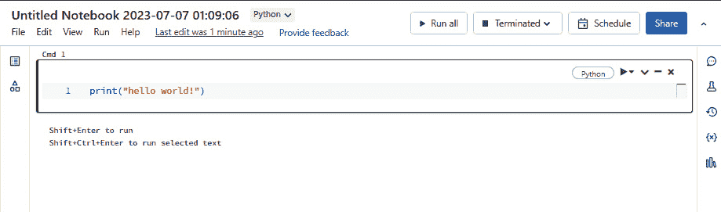

# 第二章：Databricks 上的 ML 概述

本章将为你提供如何在 Databricks 上开始进行 ML 操作的基本理解。ML 工作区对数据科学家非常友好，支持通过提供对流行 ML 库（如 TensorFlow、PyTorch 等）的开箱即用支持，快速进行 ML 开发。

我们将涵盖如何设置 Databricks 试用账户，并了解 Databricks 工作区中为 ML 从业者提供的各种 ML 专用功能。你将学习如何在 Databricks 上启动集群并创建新的笔记本。

在本章中，我们将涵盖以下主要内容：

+   设置 Databricks 试用账户

+   Databricks 上的 ML 工作区简介

+   探索工作区

+   探索集群

+   探索笔记本

+   探索数据

+   探索实验

+   探索特征存储

+   探索模型注册表

+   库

这些主题将涵盖在 Databricks 上执行有效**ML 操作**（**MLOps**）所需的基本功能。如果你希望更深入地了解某个特定功能，相关的 Databricks 官方文档链接也会包含在适当的地方。

让我们来看一下如何获取 Databricks 工作区的访问权限。

# 技术要求

对于本章内容，你需要拥有 Databricks 工作区的访问权限，并且具备集群创建权限。默认情况下，工作区的拥有者具有创建集群的权限。我们将在*探索集群*部分更详细地讨论集群。你可以在这里阅读更多关于不同集群访问控制选项的内容：[`docs.databricks.com/security/access-control/cluster-acl.html`](https://docs.databricks.com/security/access-control/cluster-acl.html)。

# 设置 Databricks 试用账户

在撰写本文时，Databricks 已在所有主要云平台上可用，分别是**谷歌云平台**（**GCP**）、**微软 Azure** 和 **亚马逊 Web** **服务**（**AWS**）。

Databricks 提供了一种简单的方式，可以在社区版中创建账户，或开始为期 14 天的试用，试用期内将提供工作区中的所有企业功能。

为了充分利用本书中提供的代码示例并探索我们将要介绍的企业功能，我强烈建议你利用 14 天的试用选项。这个试用将为你提供所有必要的功能，确保你在整个学习过程中拥有流畅的体验。

请通过以下链接注册试用账户：[`www.databricks.com/try-databricks?itm_data=PricingPage-Trial#account`](https://www.databricks.com/try-databricks?itm_data=PricingPage-Trial#account)

填写完介绍表格后，你将被重定向到一个页面，在该页面你可以选择开始在三个云平台中的任一云上进行试用部署，或创建一个社区版账户：


图 2.1 – 如何获得免费的 Databricks 试用账户

一旦注册成功，您将收到一封电子邮件，描述如何登录 Databricks 工作区。

注意

本章中我们将介绍的大部分功能，在 14 天的试用期内均可使用。

登录工作区后，访问左侧导航栏中的角色选择器标签。我们将把我们的角色切换为**机器学习**：


图 2.2 – 基于角色的工作区切换器

现在，让我们来看看新的 Databricks ML 工作区功能。

# 探索工作区

**工作区**位于 Databricks ML 环境内。每个 Databricks ML 环境的用户都有一个工作区。用户可以独立创建笔记本和开发代码，或通过细粒度的访问控制与其他团队成员协作。您将在工作区或仓库中度过在 Databricks 环境的大部分时间。我们将在 *仓库* 部分深入了解更多内容：


图 2.3 – 工作区标签

需要注意的是，**工作区**区域主要用于 Databricks 笔记本。虽然工作区确实支持使用 Git 提供者进行版本控制，但需要强调的是，相较于使用仓库，工作区内的版本控制功能现在被认为不太推荐。

版本控制，在软件开发中，是一种帮助跟踪文件随时间变化的系统。它允许您维护修改的历史记录，支持协作、错误跟踪，并在需要时恢复到先前版本。在 Databricks 中，版本控制专门指的是跟踪笔记本中的变更。

为了加强最佳实践，Databricks 正在逐步摆脱仅依赖工作区内的版本控制功能。相反，它强调使用仓库，这种方法为 Databricks 和非 Databricks 特定文件提供了更好的支持。这一战略转变为在 Databricks 环境中管理代码和文件提供了更加全面和多功能的方式。

通过利用仓库，您不仅可以有效地管理和跟踪笔记本的变更，还可以管理其他文件类型的变更。这包括代码文件、脚本、配置文件等。仓库使用流行的版本控制系统，如 Git，支持无缝协作、分支管理、代码审查工作流以及与外部工具和服务的集成。让我们来看看最近加入工作区的 **仓库** 功能。

## 仓库

仓库是 repository 的缩写。这个方便的功能让您可以在 Databricks 环境中对代码进行版本控制。使用仓库，您可以将任意文件存储在 Git 仓库中。写作时，Databricks 支持以下 Git 提供者：

+   GitHub

+   Bitbucket

+   GitLab

+   Azure DevOps

Databricks 仓库提供了一种日志机制，用于跟踪和记录用户与 Git 仓库的各种交互。这些交互包括提交代码更改和提交拉取请求等操作。仓库功能也可以通过 REST **应用程序编程接口**（**API**）使用（[`docs.databricks.com/dev-tools/api/latest/repos.html`](https://docs.databricks.com/dev-tools/api/latest/repos.html)）。


图 2.4 – Repos 选项卡

你可以在 https://docs.databricks.com/repos.html#configure-your-git-integration-with-databricks 了解更多关于如何为你的环境设置仓库的信息。仓库对于在 Databricks 环境中设置 CI/CD 流程至关重要。**Repos** 功能允许用户对代码进行版本控制，并支持可重复性。

**持续集成/持续部署**（**CI/CD**）是一种软件开发方法，涉及自动化集成代码更改、测试它们并将其部署到生产环境的过程。在本书的最后一章，我们将讨论更多关于 Databricks 中的部署范式以及作为 MLOps 一部分的 CI/CD：


图 2.5 – 支持的 Git 提供商

现在，让我们来看看集群，Databricks 环境中执行模型训练的核心计算单元。

# 探索集群

**集群**是进行机器学习模型训练时执行繁重计算任务的主要计算单元。与集群相关的虚拟机是在 Databricks 用户的云订阅中配置的；然而，Databricks 用户界面提供了控制集群类型及其设置的界面。

集群是短暂的计算资源。集群上不存储数据：


图 2.6 – 集群选项卡

**Pools** 功能允许最终用户创建 Databricks 虚拟机池。在云环境中工作的一个好处是你可以按需请求新的计算资源。最终用户按秒计费，并且在集群负载较低时归还计算资源。这很好；然而，从云服务提供商请求虚拟机，启动它并将其添加到集群中仍然需要一些时间。通过使用池，你可以预先配置虚拟机并将其保持在待命状态。如果集群请求新节点并且能够访问池，那么如果池中有所需的虚拟机可用，这些节点将在几秒钟内被添加到集群中，帮助减少集群的扩展启动时间。一旦集群完成高负载处理或终止，从池中借用的虚拟机会被归还到池中，可以被下一个集群使用。更多关于池的信息，请访问：[`docs.databricks.com/clusters/instance-pools/index.html`](https://docs.databricks.com/clusters/instance-pools/index.html)。

Databricks**作业**允许用户在特定的时间表上自动执行代码。它还提供了许多其他有价值的配置选项，例如在代码执行失败时可以重试的次数，并能够在失败时设置警报。你可以在这里阅读更多关于作业的信息：[`docs.databricks.com/data-engineering/jobs/jobs-quickstart.html`](https://docs.databricks.com/data-engineering/jobs/jobs-quickstart.html)。该链接适用于在 AWS 上部署的 Databricks 工作区；不过，你可以点击**更改云**标签以匹配你的部署：


图 2.7 – 选择与您云相关文档的下拉菜单

现在，让我们重点关注**创建** **集群**标签。

如果你来自机器学习领域，且大部分工作都是在笔记本或单独的虚拟机上完成的，那么 Databricks 提供了一种简单的方式来开始，提供单节点模式。在这种情况下，你将在单节点集群上使用 Databricks 的所有优势。现有的非分布式代码应该能在该集群上直接运行。例如，以下代码将在驱动节点上以非分布式方式运行：

```py
from sklearn.datasets import load_iris  # Importing the Iris datasetfrom sklearn.model_selection import train_test_split  # Importing train_test_split function
from sklearn.linear_model import LogisticRegression  # Importing Logistic Regression model
from sklearn.metrics import accuracy_score  # Importing accuracy_score metric
# Load the Iris dataset
iris = load_iris()
X = iris.data  # Features
y = iris.target  # Labels
# Split the dataset into training and test sets
X_train, X_test, y_train, y_test = train_test_split(X, y, test_size=0.2, random_state=42)
# Initialize the logistic regression model
model = LogisticRegression()
# Train the model
model.fit(X_train, y_train)
# Make predictions on the test set
y_pred = model.predict(X_test)
# Calculate the accuracy of the model
accuracy = accuracy_score(y_test, y_pred)
print("Accuracy:", accuracy)
```

注意

通常，集群指的是一组以分布式方式处理数据的机器。在单节点集群的情况下，一台**虚拟机（VM）**运行所有进程，而在常规集群中则有多个虚拟机共同运行。

在 Databricks 环境中启动集群非常简单。本书中提供的所有代码都可以在单节点集群上运行。要启动单节点集群，按照以下步骤操作：

1.  给集群命名。

1.  将集群模式更改为**单节点**。

1.  将最新的机器学习运行时设置为**Databricks** **运行时版本**。

1.  点击**创建集群**：


图 2.8 – 新建集群屏幕

这将启动集群配置过程。你可以阅读一些高级设置，如添加标签、使用初始化脚本以及通过 JDBC 连接到此集群等内容。

**Databricks Runtime**是一个强大的平台，通过提高 Spark 作业的性能、安全性和可用性，增强了大数据分析功能。凭借优化的 I/O、增强的安全性和简化的操作等功能，它提供了一个全面的解决方案。它有多种版本，包括**ML**和**Photon**，以满足特定需求。Databricks Runtime 是高效运行大数据分析工作负载的理想选择。Databricks Runtime 由 Delta Lake 提供支持，它无缝地集成了批处理和流数据，支持近实时分析。Delta Lake 能够跟踪数据的版本变更，对于重现机器学习模型训练和实验至关重要。这确保了数据的一致性，并在你的工作流程中提供了可重现性。你可以在这里阅读更多关于 Databricks Runtime 的内容：[`docs.databricks.com/runtime/index.html`](https://docs.databricks.com/runtime/index.html)。

作为 Databricks 上的机器学习实践者，你将使用 ML 运行时。Databricks Runtime ML 是一个预构建的机器学习基础设施，它与 Databricks 工作区的功能集成。它提供了流行的机器学习库，如 TensorFlow 和 PyTorch，分布式训练库，如 Horovod，以及预配置的 GPU 支持。通过更快的集群创建和与已安装库的兼容性，它简化了机器学习和深度学习任务的扩展。此外，它还提供了数据探索、集群管理、代码和环境管理、自动化支持，以及集成的 MLflow 用于模型开发和部署。

Databricks 提供了三种不同的集群访问模式及其特定的推荐使用案例模式。所有这些集群访问模式都可以在多节点模式（集群有一个专用的驱动节点和一个或多个执行节点）或单节点模式（集群仅有一个节点；驱动程序和执行程序都在一个节点上运行）下使用。

## 单一用户

此模式建议用于单一用户和可以使用 Python、Scala、SQL 和 R 开发的数据应用。集群会在 120 分钟无活动后终止，标准集群是默认的集群模式。最终用户也可以通过 Databricks 作业使用调度活动执行笔记本。最好将不同的数据处理管道划分到独立的标准集群中。划分数据管道可以防止一个集群的失败影响到另一个集群。由于 Databricks 按秒计费，这种方法是可行的并被广泛使用。具有此访问类型的集群支持机器学习工作负载。

## 共享

当多个用户尝试使用同一个集群时，此模式是理想的选择。它能够提供最大化的资源利用率，并且在多用户场景下具有较低的查询延迟要求。数据应用可以使用 Python 和 SQL 开发，但不能使用 R 和 Scala。这些集群提供用户隔离，并且也支持机器学习工作负载。

## 无隔离共享

这种类型的集群仅面向管理员用户。我们不会过多讨论此类访问，因为该集群类型不支持 ML 用例。

你可以在这里阅读更多关于用户隔离的内容：[`docs.databricks.com/notebooks/notebook-isolation.html`](https://docs.databricks.com/notebooks/notebook-isolation.html)。

让我们来看看单节点集群，因为这就是你将用来运行本书中共享代码的集群类型。

## 单节点集群

单节点集群没有工作节点，所有的 Python 代码都在驱动节点上运行。默认情况下，这些集群会在 120 分钟没有活动后自动终止，适用于构建和测试小型数据管道，以及进行轻量级的**探索性数据分析**（**EDA**）和 ML 开发。支持 Python、Scala、SQL 和 R。

如果你想使用运行时中未包含的特定库，我们将在本章的 *库* 部分探讨安装所需库的各种选项。

# 探索笔记本

如果你熟悉**Jupyter**和**IPython 笔记本**，那么 Databricks 笔记本会显得非常熟悉。Databricks 笔记本开发环境由多个单元组成，用户可以在其中互动式地编写 R、Python、Scala 或 SQL 代码。

Databricks 笔记本还具有其他功能，如与 Spark UI 的集成、强大的集成可视化、版本控制以及 MLflow 模型跟踪服务器。我们还可以对笔记本进行参数化，并在执行时向其传递参数。

我们将在后续详细介绍笔记本，因为本书中提供的代码示例利用了 Databricks 笔记本环境。有关笔记本的更多详细信息，请访问[`docs.databricks.com/notebooks/index.html`](https://docs.databricks.com/notebooks/index.html)：



图 2.9 – Databricks 笔记本

让我们看看 **数据** 标签上的下一个功能，也称为 Databricks 元数据存储。

# 探索数据

默认情况下，当部署新的工作区时，它会附带一个托管的 Hive **元数据存储**。元数据存储允许你以外部表的形式注册各种格式的数据集，如**逗号分隔值**（**CSV**）、**Parquet**、**Delta 格式**、**文本**或**JavaScript 对象表示法**（**JSON**）（[`docs.databricks.com/data/metastores/index.html`](https://docs.databricks.com/data/metastores/index.html)）。我们在这里不会深入讨论元数据存储的细节：


图 2.10 – 数据标签

如果您不熟悉“元存储”这个术语，也没关系。简单来说，它类似于关系数据库。在关系数据库中，有数据库，然后是表名和模式。最终用户可以使用 SQL 与存储在数据库和表中的数据交互。同样，在 Databricks 中，最终用户可以选择注册存储在云存储中的数据集，以便它们可以作为表格使用。您可以在这里了解更多：[`docs.databricks.com/spark/latest/spark-sql/language-manual/index.html`](https://docs.databricks.com/spark/latest/spark-sql/language-manual/index.html)。

Hive 元存储通过利用工作区内本地用户的表访问控制列表提供了一种实现访问控制的方法。然而，为了增强数据访问治理并确保对各种资产（如部署的模型和 AI 资产）进行统一控制，Databricks 引入了 Unity Catalog 作为最佳实践解决方案。这使得跨多个工作区进行全面的管理和治理成为可能。

让我们更详细地了解 Unity Catalog。

Unity Catalog 是湖仓中数据和 AI 资产的统一治理解决方案。它提供了跨 Databricks 工作区的集中访问控制、审计、血缘分析和数据发现功能：


图 2.11 – Unity Catalog 与工作区的关系

下面是 Unity Catalog 的一些关键特性：

+   **定义一次，处处安全**：Unity Catalog 从一个地方管理跨所有工作区和角色的数据访问策略

+   **符合标准的安全模型**：Unity Catalog 的安全模型基于标准 ANSI SQL，并允许管理员在现有数据湖中授予权限

+   **内建审计和血缘分析**：Unity Catalog 捕获用户级审计日志和血缘数据，跟踪数据资产在所有语言和角色中的创建和使用情况

+   **数据发现**：Unity Catalog 提供了一个搜索界面，帮助数据消费者找到数据，并允许用户标记和记录数据资产

+   **系统表（公共预览）**：Unity Catalog 提供操作数据，包括审计日志、可计费使用情况和血缘分析

让我们了解 Unity Catalog 对象模型的具体样子：


图 2.12 – Unity Catalog 对象模型

Unity Catalog 的主要数据对象层次结构从元存储到表格流动：

+   **元存储**：元数据的顶级容器。每个元存储公开一个三级命名空间（**目录.模式.表**），用于组织您的数据。

+   **目录**：这是对象层次结构的第一层，用于组织您的数据资产。

+   **模式**：也称为数据库，模式包含表格和视图。

+   **表格**：对象层次结构中最低级别是表格和视图。

如前所述，深入了解 Unity Catalog 是一个非常庞大的话题，超出了本书的范围。Unity Catalog 为 Databricks 工作区中的数据和 AI 资产提供集中式治理、审计和数据发现功能。它提供基于 ANSI SQL 的安全模型、自动捕获用户级审计日志和数据血缘关系、以及层级化的数据组织系统。它还支持多种数据格式、先进的身份管理、专门的管理员角色用于数据治理，并兼容 Databricks Runtime 11.3 LTS 或更高版本。

想要更全面了解 Unity Catalog，请访问 [`docs.databricks.com/data-governance/unity-catalog/index.html`](https://docs.databricks.com/data-governance/unity-catalog/index.html)。

到目前为止，我们所覆盖的所有功能都是 Databricks 针对特定角色的标准功能。

以下三个功能——实验、特征存储和模型——对于机器学习角色至关重要。

让我们一一查看这些功能。

# 探索实验

正如其名所示，实验是所有与业务问题相关的模型训练的集中位置，用户可以访问这些实验。用户可以为实验定义自己的名称，或者使用系统自动生成的默认名称，并用它来训练不同的机器学习模型。Databricks UI 中的实验来自将 MLflow 集成到平台中。我们将在接下来的章节中深入探讨 MLflow，以了解更多细节；然而，首先了解 MLflow 的基本概念及一些特定术语是非常重要的。

MLflow 是一个开源平台，用于管理端到端的机器学习生命周期。以下是 MLflow 的关键组件：

+   **跟踪**：这允许你跟踪实验，记录和比较参数与结果。

+   **模型**：此组件有助于管理和部署来自各种机器学习库的模型，支持多种模型服务和推理平台。

+   **项目**：这允许你以可重用、可复制的形式打包机器学习代码，以便与其他数据科学家共享或转移到生产环境中。

+   **模型注册表**：这是一个集中式的模型存储库，用于管理模型的完整生命周期阶段转换：从预发布到生产，并具备版本控制和注释功能。Databricks 在 Unity Catalog 中提供了一个托管版本的模型注册表。

+   **模型服务**：这允许你将 MLflow 模型作为 REST 端点进行托管。

还有一些专属于 MLflow 的术语：

+   **运行**：运行表示训练机器学习模型的具体实例。它包括与训练过程相关的参数、度量、工件和元数据。

+   **实验**：实验作为一个容器，用于组织和跟踪机器学习实验的结果。它由多个运行组成，便于不同方法的比较和分析。

+   **参数**：参数是指在训练机器学习模型过程中可以调整的可配置值。这些值影响模型的行为和性能。

+   **度量**：度量是用于评估机器学习模型性能的定量指标。度量提供了有关模型在特定任务或数据集上表现如何的洞察。

+   **工件**：工件是指在机器学习实验期间生成的任何输出。这可以包括文件、模型、图像或捕获实验结果或中间阶段的其他相关数据。

+   **项目**：项目包括重现机器学习实验所需的代码、数据和配置。它提供了一种结构化和组织化的方法，用于管理特定机器学习工作流程的所有组件。

+   **模型**：模型表示经过训练的机器学习模型，可用于基于训练数据学到的模式和信息进行预测或执行特定任务。

+   **模型注册表**：模型注册表作为集中存储和管理机器学习模型的库。它为不同模型版本及其关联的元数据提供版本控制、跟踪和协作能力。

+   **后端存储**：后端存储负责存储诸如运行、参数、度量和标签等 MLflow 实体。它为管理实验数据提供了基础存储基础设施。

+   **工件存储**：工件存储负责存储在机器学习实验期间生成的工件。这可能包括文件、模型、图像或任何在实验过程中生成的其他相关数据。

+   **风味**：风味代表一种标准化的 ML 模型打包方式，使其可以轻松被特定工具或平台消费。风味在部署和服务模型时提供了灵活性和互操作性。

+   **用户界面（UI）**：UI 指的是 MLflow 提供的图形界面，允许用户通过直观界面与实验结果进行交互和可视化，跟踪运行并管理模型。

MLflow 还采用了其他术语，但此处提到的是一些最常用的。有关详细信息，请参阅 MLflow 文档：[`mlflow.org/docs/latest/index.html`](https://mlflow.org/docs/latest/index.html)。

Databricks AutoML 与 MLflow 完全集成，因此生成的所有模型训练和工件都会自动记录在 MLflow 服务器中：


图 2.13 – 实验选项卡

最终用户也可以利用 Databricks AutoML 来为其机器学习问题建模。Databricks 在其 AutoML 能力中采用了一种不同的方法，称为**玻璃盒 AutoML**。

Databricks AutoML 通过自动生成全面的笔记本简化了 ML 从业者的工作流程。这些笔记本涵盖了特征工程和模型训练所需的所有代码，涵盖了多种 ML 模型和超参数的组合。此功能使 ML 从业者能够深入检查生成的代码，并获得对过程的更深层次理解。

Databricks AutoML 当前支持分类、回归和预测模型。有关 AutoML 可以使用哪些算法来创建模型的完整列表，请访问 [`docs.databricks.com/applications/machine-learning/automl.html#automl-algorithms`](https://docs.databricks.com/applications/machine-learning/automl.html#automl-algorithms)：


图 2.14 – 默认实验默认与 Python 笔记本连接

MLflow 是 Databricks 内部开发的，用于简化端到端的 ML 生命周期和 MLOps。自 MLflow 发布以来，它已经被广泛采用并得到了开源社区的支持。

现在，让我们来看看特征存储。

# 发现特征存储

**特征存储**是最新 Databricks ML 工作空间中的一个相对较新但稳定的版本。许多已经拥有成熟 ML 流程的组织，如 Uber、Facebook、DoorDash 等，已经在内部实现了他们的特征存储。

ML 生命周期管理和工作流程是复杂的。Forbes 进行了一项调查（[`www.forbes.com/sites/gilpress/2016/03/23/data-preparation-most-time-consuming-least-enjoyable-data-science-task-survey-says`](https://www.forbes.com/sites/gilpress/2016/03/23/data-preparation-most-time-consuming-least-enjoyable-data-science-task-survey-says)），并与数据科学家进行了交流，发现管理数据是他们日常工作中最昂贵且最耗时的操作。

数据科学家需要花费大量时间查找数据、清洗数据、进行 EDA，然后进行特征工程以训练他们的 ML 模型。这是一个迭代过程。为了使这个过程可以重复，需要投入的努力是一个巨大的挑战。这就是特征存储的作用所在。

Databricks 特征存储采用开源 Delta 格式进行标准化，这使得数据科学家能够像管理模型、笔记本或工作任务的访问权限一样管理特征。

Databricks 特征存储有几个独特之处：

+   它使用 Delta Lake 存储特征表。这使得最终用户能够从 Databricks 外部的任何受支持语言和连接器中读取数据。更多信息请访问： [`docs.delta.io/latest/delta-intro.html`](https://docs.delta.io/latest/delta-intro.html)。

+   Databricks ML 工作区中的集成 Feature Store UI 提供了端到端的可追溯性和特征生成的溯源信息，以及哪些下游模型在统一视图中使用了这些特征。我们将在*第三章*中更详细地探讨这一点。

Databricks Feature Store 还与 MLflow 无缝集成。这使得 Databricks Feature Store 能够利用 MLflow 特征管道的所有优点，并生成特征并将其以 Delta 格式写入特征表。Feature Store 具有自己的通用模型包装格式，与 MLflow Models 组件兼容，这使得模型能够明确了解哪些特征被用于训练模型。这种集成使我们能够简化 MLOps 管道。

客户端可以通过批处理模式或在线模式调用服务端点，模型将自动从 Feature Store 中获取最新的特征并提供推理服务。我们将在接下来的章节中看到相关的实际案例。

你也可以在这里了解更多关于 Databricks Feature Store 当前状态的信息：[`docs.databricks.com/machine-learning/feature-store/index.html`](https://docs.databricks.com/machine-learning/feature-store/index.html)

最后，我们来讨论一下模型注册表。

# 发现模型注册表

**模型**是一个完全托管且与 Databricks ML 工作区集成的 MLflow 模型注册表。该注册表拥有一套 API 和一个 UI，方便组织中的数据科学家进行协作并全面管理 MLflow 模型。数据科学家和机器学习工程师可以在任何受支持的 ML 框架中开发模型（[`mlflow.org/docs/latest/models.html#built-in-model-flavors`](https://mlflow.org/docs/latest/models.html#built-in-model-flavors)），并将其打包成通用的 MLflow 模型格式：


图 2.15 – 模型标签页

模型注册表提供了管理版本、标签以及在不同环境之间进行状态转换的功能（将模型从预发布阶段迁移到生产环境再到归档）：


图 2.16 – 已注册模型标签页

在我们继续之前，还有一个重要的功能需要理解：Databricks 的**库**功能。这个功能允许用户将第三方或自定义代码引入 Databricks 笔记本和在集群上运行的作业中。

# 库

库是任何编程生态系统中的基础构建模块。它们类似于工具箱，包含了预编译的例程，提供增强的功能并帮助优化代码效率。在 Databricks 中，库用于将第三方或自定义代码引入到在集群上运行的笔记本和作业中。这些库可以用多种语言编写，包括 Python、Java、Scala 和 R。

## 存储库

在存储方面，通过库 UI 上传的库存储在**Databricks 文件系统**（**DBFS**）根目录中。然而，所有工作区用户都可以修改存储在 DBFS 根目录中的数据和文件。如果需要更安全的存储选项，您可以选择将库存储在云对象存储中，使用库包仓库，或者将库上传到工作区文件。

## 管理库

在 Databricks 中，库的管理可以通过三种不同的界面进行：工作区 UI、**命令行界面**（**CLI**）或 Libraries API。每个选项都适应不同的工作流程和用户偏好，选择通常取决于个人使用场景或项目需求。

## Databricks Runtime 和库

Databricks Runtime 配备了许多常见的库。要查找您的运行时中包含哪些库，您可以参考 Databricks Runtime 发行说明中的**系统环境**子部分，检查您的具体运行时版本。

请注意，当您的笔记本或作业完成处理时，Python 的`atexit`函数不会被 Databricks 调用。如果您正在使用一个注册了`atexit`处理程序的 Python 库，确保您的代码在退出前调用所需的函数非常重要。另外，Databricks Runtime 正在逐步淘汰使用 Python eggs，并最终会移除它们；建议使用 Python wheels 或从 PyPI 安装包作为替代方案。

## 库使用模式

Databricks 提供三种库安装模式：集群安装、笔记本范围的库和工作区库：

+   **集群库**：这些库可供所有在特定集群上运行的笔记本使用。

+   **笔记本范围的库**：这些库适用于 Python 和 R，创建一个与笔记本会话范围相关的环境，不会影响在同一集群上运行的其他笔记本。它们是临时的，每个会话需要重新安装。

+   **工作区库**：这些库充当本地仓库，您可以从中创建集群安装的库。它们可以是贵组织编写的自定义代码，或者是贵组织偏好的开源库的特定版本。

接下来让我们讨论一下 Unity Catalog 的限制。

## Unity Catalog 限制

使用 Unity Catalog 时存在一些限制。有关更多细节，您应该参考*集群* *库*部分。

## 库的安装来源

集群库可以直接从公共仓库安装，如 PyPI、Maven 或 CRAN。或者，它们可以来自云对象存储位置、DBFS 根目录中的工作区库，甚至可以通过从本地机器上传库文件进行安装。通过上传直接安装的库存储在 DBFS 根目录中。

对于大多数使用场景，我们将使用笔记本范围的库。您可以使用`%pip` `magic`命令安装笔记本范围的库。

以下是一些在笔记本中使用 `%pip` 安装笔记本作用域库的方法：

+   `%pip install <package-name>` 用于笔记本作用域的库，或者选择 PyPI 作为集群库的来源

+   `%pip install <package-name> --index-url <mirror-url>` 用于笔记本作用域的库

+   `%pip install git+https://github.com/<username>/<repo>.git` 用于笔记本作用域的库，或者选择 PyPI 作为来源，并指定仓库 URL 作为集群库的包名

+   `%pip install dbfs:/<path-to-package>` 用于笔记本作用域的库，或者选择 DBFS/S3 作为集群库的来源

现在，让我们总结一下本章内容。

# 总结

本章中，我们简要了解了 Databricks ML 工作区的所有组件。这将帮助我们更实际地使用这些组件，从而在 Databricks 环境中高效地训练和部署 ML 模型，解决各种 ML 问题。

在下一章中，我们将开始处理客户流失预测问题，并在 Databricks 特征存储中注册我们的第一个特征表。

# 深入阅读

要了解更多本章涉及的主题，请查阅以下内容：

+   Databricks 库：[`docs.databricks.com/libraries/index.html`](https://docs.databricks.com/libraries/index.html%20)

+   Databricks 笔记本：[`docs.databricks.com/notebooks/index.html`](https://docs.databricks.com/notebooks/index.html)

# 第二部分：ML 管道组件与实现

在本节结束时，您将对 Databricks ML 体验中的每个 ML 组件有清晰的理解，并能够在项目中自如地使用它们。

本节包含以下章节：

+   *第三章*，*利用特征存储*

+   *第四章*，*了解 Databricks 上的 MLflow 组件*

+   *第五章*，*使用 Databricks AutoML 创建基准模型*
