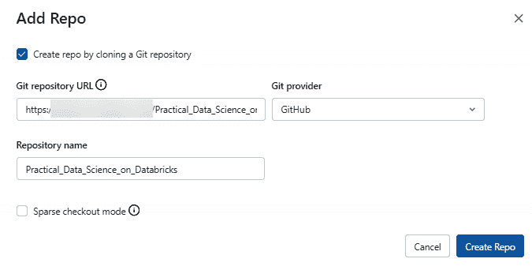

# 第三章：使用特征存储

在上一章中，我们简要介绍了什么是**特征存储**，以及**Databricks Feature Store**在其独特性方面的优势。

本章将采取更为实践的方式，利用 Databricks Feature Store 注册我们的第一个特征表，并讨论与 Databricks Feature Store 相关的概念。

我们将涵盖以下主题：

+   深入了解特征存储及其解决的问题

+   在 Databricks 平台上发现特征存储

+   在 Databricks Feature Store 中注册你的第一个特征表

# 技术要求

所有代码都可以在 GitHub 仓库[`github.com/PacktPublishing/Practical-Machine-Learning-on-Databricks`](https://github.com/PacktPublishing/Practical-Machine-Learning-on-Databricks)中找到，且是自包含的。要执行这些笔记本，你可以直接将代码仓库导入到你的 Databricks 工作区，使用**Repos**功能。我们在第二章中讨论过 Repos。

需要具备**Delta**格式的基本知识。如果你是 Delta 格式的新人，可以在继续之前查看[`docs.databricks.com/en/delta/index.html`](https://docs.databricks.com/en/delta/index.html)和[`docs.databricks.com/en/delta/tutorial.html`](https://docs.databricks.com/en/delta/tutorial.html)。

# 深入了解特征存储及其解决的问题

随着组织中的更多团队开始使用人工智能（AI）和机器学习（ML）来解决各种业务应用场景，建立一个集中的、可重用的、易于发现的特征库变得尤为必要。这个库被称为特征存储（Feature Store）。

所有经过整理的特征都存储在集中式、受管理、访问受控的存储中，例如整理过的数据湖。不同的数据科学团队可以根据需求被授予访问特征表的权限。像企业数据湖一样，我们可以追踪数据的血缘关系；同样，我们也可以追踪在 Databricks Feature Store 中注册的特征表的血缘关系。我们还可以查看所有消费已注册特征表中特征的下游模型。

在大型组织中，有数百个数据科学团队在解决不同的业务问题。每个团队可能都有自己的领域知识和专业技能。特征工程的实施通常需要大量的计算处理。如果没有特征存储，新加入的数据科学团队将很难重复使用其他团队创建和整理的特征。

我们可以将特征存储的工作流类比于 ETL 工作流，后者针对特定的 BI 或分析应用场景。将数据写入特征存储表的工作流针对的是特征工程过程，需要在数据湖中的整理数据集上执行这些过程，然后才能训练机器学习模型。

你可以像常规的 ETL 操作一样调度和监控特征表工作流的执行。

特性存储还通过提供一个跨组织的特性中央仓库，解决了模型训练和推理代码之间的*偏差*问题。在模型训练和推理时使用相同的特性工程逻辑。

让我们看看特性存储是如何构建并与 Databricks 工作空间集成的。

# 在 Databricks 平台上发现特性存储

每个 Databricks 工作空间都有自己的特性存储。在本书编写时，**Databricks 特性存储**仅支持 Python API。最新的 Python API 参考可以在 [`docs.databricks.com/applications/machine-learning/feature-store/python-api.html`](https://docs.databricks.com/applications/machine-learning/feature-store/python-api.html) 找到。

Databricks 特性存储与**管理的 MLFlow**及其他 Databricks 组件完全集成。这使得通过 MLFlow 部署的模型可以在训练和推理时自动检索特性。定义特性表并在模型训练和推理中使用它的具体步骤将在接下来的部分中介绍。

让我们来看一些与 Databricks 特性存储相关的关键概念和术语。

## 特性表

正如名称所示，特性存储存储由数据科学家在进行特性工程时为特定问题生成的特性。

这些特性可能来自数据湖中一个或多个清理过的表。Databricks 中的特性表包含两个主要组件：

+   **元数据**：元数据跟踪用于创建特性表的数据来源，哪些笔记本和定时任务将数据写入特性表，以及其频率。元数据还跟踪使用该特性表的下游 ML 模型。这提供了数据的溯源。

+   **生成的特性数据**：在批处理和流式推理的情况下，底层生成的特性 DataFrame 被写入作为 Delta 表到离线特性存储中。Databricks 为你管理这个离线特性存储。相比之下，特性表被写入到支持的**关系数据库管理系统**（**RDBMS**）中，以用于**在线特性存储**。在线特性存储不由 Databricks 管理，设置时需要一些额外的步骤。你可以在*进一步阅读*部分找到相关链接，以帮助你设置在线特性存储。

在继续之前，让我们简要了解不同类型的推理模式，以及 Databricks 特性存储在每种场景中的优势。

+   **批量推理**：批量推理涉及对大量数据进行一次性预测，通常是在间隔时间或按计划执行时进行。在 Databricks 中，你可以使用如**Apache Spark**等技术设置批处理作业，以处理和预测输入数据。批量推理适用于那些预测时效性不那么关键，可以等待结果的场景。例如，这可以用于客户细分，其中预测是定期进行的。此场景由离线特征存储支持。

    +   Databricks 特征存储通过提供集中式的特征数据存储库来增强批量推理。与其为每个批处理作业重新计算特征，特征存储允许你存储和管理预计算的特征。这减少了计算时间，确保在每次批处理运行中为你的模型提供一致且准确的特征。

+   **流式推理**：流式推理涉及在数据实时到达时进行处理和预测，而无需等待整个数据集的收集。Databricks 通过如 Apache Spark 的**结构化流式处理**等工具支持流式数据处理。流式推理在需要快速响应变化数据的场景中非常有价值，例如在欺诈检测中，及时采取行动至关重要。此场景由离线特征存储支持。

    +   特征存储在流式场景中发挥关键作用，提供可靠的特征数据源。当新数据流入时，特征存储可以提供预测所需的特征，确保为模型提供一致且最新的输入。这简化了流式管道，因为特征准备与实时推理过程解耦。

+   **实时推理**：实时推理将流式推理进一步发展，通过在新数据到达时立即提供预测。在推荐系统等应用中，这一点尤为重要，因为用户期望对其行为立即做出响应。此场景需要在线特征存储。

    +   对于实时推理，特征存储确保特征数据随时可用，以便快速预测。特征存储与实时推理管道的集成使得可以低延迟访问特征，从而有助于快速和准确的预测。这对于需要迅速决策的应用至关重要。

每个特征表都有一个主键，唯一标识一行数据。Databricks 特征存储也允许定义复合主键。

新数据可以通过定期执行的 ETL 管道以批量方式或利用结构化流式 API（[`docs.databricks.com/spark/latest/structured-streaming/index.html`](https://docs.databricks.com/spark/latest/structured-streaming/index.html)）以持续方式写入特征表中。

在 Databricks 中注册新特征表的工作流如下：

1.  创建一个数据库，用于存储我们的特征表。

1.  将特征工程逻辑编写为一个函数，该函数返回一个 Apache Spark 数据框（[`spark.apache.org/docs/latest/api/python/reference/api/pyspark.sql.DataFrame.html`](https://spark.apache.org/docs/latest/api/python/reference/api/pyspark.sql.DataFrame.html)）。此数据框还应为数据框中的每条记录生成一个唯一的主键。主键可以包含多个列。

1.  实例化一个 `FeatureStoreClient` 对象，并使用 `create_table`（在 DB ML Runtime 10.2 及以上版本支持）在特征存储中定义特征表。此时，特征表中没有存储数据。如果我们初始化一个额外的 `df` 参数，并将其赋值为特征工程数据框，我们可以跳过 *步骤 4*。

1.  使用 `write_table` 方法将特征工程数据集写入定义的特征表中。`write_table` 方法提供了两种模式：要么完全覆盖现有特征表，要么根据定义的查找键更新某些记录。

本章提供的代码示例将通过上述步骤并使其更容易理解。在深入研究代码之前，我们需要了解一些与特征存储相关的概念。

我们将在《MLFlow》一章中进一步探讨如何从特征表中读取数据。我们将重用本章中创建的特征表来预测银行客户流失。

## 离线存储

Databricks 离线特征存储由 Delta 表支持，主要用于模型训练、批量推理和特征发现。

Delta 表允许用户根据主键在此模式下更新特征值。利用 Delta 格式在 ML 的背景下也提供了额外的优势：

+   使用 `timestampAsOf` 来读取某些历史数据：

    ```py
    # Reading data from a Delta table as it appeared at a specific timestampdf = spark.read.format("delta").option("timestampAsOf", "2021-01-01").load("/path/to/delta-table")
    ```

+   Delta API 中的 `history()` 函数（[`docs.delta.io/latest/index.html`](https://docs.delta.io/latest/index.html)）：

    ```py
    from delta.tables import *deltaTable = DeltaTable.forPath(spark, write_path)fullHistoryDF = deltaTable.history()# get the full history of the table to pick the versiondisplay(fullHistoryDF)
    ```

    要从特定版本的表中加载数据，我们可以指定 `versionAsOf` 选项：

    ```py
    ## Specifying data version to use for model trainingversion = 1df_delta = spark.read.format('delta').option('versionAsOf', version).load(write_path)
    ```

这样，你就可以在数据的不同版本上训练模型并保持数据血统。

## 在线存储

在使用特征存储进行实时推理时，特征表需要存储在低延迟存储中，如关系数据库。

如果你必须在在线和离线特征存储中都能使用特征，你可以将离线存储作为流式数据源来更新在线存储的特征表。

## 训练集

在训练 ML 模型时，你可能希望将来自多个特征表的数据结合起来。每个特征表都需要有唯一的 ID 或主键，这些 ID 或主键将在模型训练和推理时用于连接和提取来自多个特征表的相关特征到 **训练集** 构建中。

训练集使用一个名为`FeatureLookup`的对象，它的输入包括特征表名称、我们需要从特征表中检索的特征名称，以及查找键（s）。查找键（s）用于在我们定义多个`FeatureLookup`以生成训练集时，从不同的特征表中连接特征。

在本章附带的笔记本中，我们将通过示例代码展示如何将一个欺诈检测数据集注册为 Databricks Feature Store 中的特征表。在*第五章*中，*使用 Databricks AutoML 创建基准模型*，我们将利用 AutoML 概述中的特征表，构建一个流失预测模型，并展示 Databricks 环境中集成的 MLFlow 的各种组件。

## 模型打包

`FeatureStoreClient` API（[`docs.databricks.com/en/dev-tools/api/python/latest/feature-store/client.html`](https://docs.databricks.com/en/dev-tools/api/python/latest/feature-store/client.html)）提供了一个名为`log_model`的方法，允许机器学习模型保留用于训练模型的特征的引用。这些特征存储在 Databricks Feature Store 中作为特征表。ML 模型可以根据推理时提供的主键（s）从特征表中检索必要的特征。在批量和流式推理模式下，特征值从离线存储中检索。在实时推理模式下，特征值则从在线存储中检索。

注意

在编写本书时，Databricks Feature Store 仅支持 Python 语言。你可以使用你喜欢的库，如`sklearn`和 pandas，进行特征工程；但是，在将表格写出为特征表之前，它需要转换为**PySpark** DataFrame。PySpark 是 Spark 分布式处理引擎的 Python 封装（[`spark.apache.org/docs/latest/api/python/`](https://spark.apache.org/docs/latest/api/python/)）。

让我们深入一个动手实践的例子，带你一步步完成在 Databricks Feature Store 中注册第一个特征表的过程。

我们将使用的数据集来自**Kaggle**，在进行一些特征工程后，我们将在 Databricks Feature Store 注册该数据集。

# 在 Databricks Feature Store 中注册你的第一个特征表

在开始之前，代码需要从与本书配套的 Git 仓库中下载（[`github.com/debu-sinha/Practical_Data_Science_on_Databricks.git`](https://github.com/debu-sinha/Practical_Data_Science_on_Databricks.git)）。

我们将使用 Databricks 的仓库功能来克隆 GitHub 仓库。

要克隆代码仓库，完成以下步骤：

1.  点击**Repos**标签并选择你的用户名：


图 3.1 – 显示 Repos 标签页的截图

重要说明

由于最近的用户界面更新，'Repos' 部分已被移动，现在可以通过点击 'Workspaces' 图标访问，以下图所示。


尽管进行了此更改，本章中概述的工作流程依然适用。

1.  右键点击并添加仓库：


图 3.2 – 显示如何克隆本章代码（步骤 2）的截图

1.  将链接粘贴到 **Git 仓库 URL** 字段中，然后点击 **创建**：



图 3.3 – 显示如何克隆本章代码（步骤 3）的截图

1.  在克隆的仓库中，点击 `Chapter 03`，然后在其中选择 `churn-analysis` 笔记本：


图 3.4 – 显示如何克隆本章代码（步骤 4）的截图

当你第一次打开笔记本时，它将处于分离状态。如果你还没有配置集群，请参考 *第二章*中的 *探索集群* 部分。

你可以在以下截图中看到笔记本：


图 3.5 – 显示笔记本初始状态的截图

1.  配置好集群后，你可以将其附加到笔记本：


图 3.6 – 显示将笔记本附加到可用集群列表的下拉菜单的截图

所有代码已在 Databricks ML Runtime 10.4 LTS 上进行测试。建议用户使用配置了 ML Runtime 10.4 LTS 或更高版本的集群。

1.  从下拉菜单中选择一个选项：


图 3.7 – 显示笔记本附加到集群并处于准备状态的截图

现在，你可以开始执行笔记本中的代码了：

1.  笔记本中的前几个单元描述了我们正在使用的数据集以及如何将其读取为 Spark DataFrame。我们也可以将数据导入为 pandas DataFrame。Databricks 提供了一个方便的显示功能，可以可视化加载到 pandas 或 Spark DataFrame 中的数据：

    ```py
    import osbank_df = spark.read.option("header", True).option("inferSchema", True).csv(f"file:{os.getcwd()}/data/churn.csv")display(bank_df)
    ```

1.  下一段代码介绍了创建特征表的步骤。第一步是定义一个数据库，用来存储我们定义的、以 Delta 表为基础的特征表。我们还定义了一种方法来执行一些基本的特征工程：

    ```py
    DATABASE_NAME = "bank_churn_analysis"# setup database and tmp space that will hold our Feature tables in Delta format.spark.sql(f"CREATE DATABASE IF NOT EXISTS {DATABASE_NAME}")dbutils.fs.mkdirs(f"/tmp/{DATABASE_NAME}")
    ```

1.  下面的代码块定义了一个基本函数，用于对输入的 Spark DataFrame 执行特征工程。

    在继续之前，我想强调一个强大的库称为 `pyspark.pandas`。作为机器学习实践者，你可能熟悉使用 pandas ([`pandas.pydata.org/docs/#`](https://pandas.pydata.org/docs/#)) 库来操作数据。它有一个很大的缺点，即它不具备可扩展性。使用 pandas API 进行的所有处理都在单台机器上进行，如果你的数据无法放入单台机器，你就会陷入困境。这就是 Apache Spark 可以帮助的地方。Apache Spark 专为处理大量数据而构建，它将大量数据划分为单个单位，并在集群的多个节点上分发处理。随着要处理的数据量增加，你可以简单地向集群添加更多节点，如果你的数据没有任何倾斜，数据处理流水线的性能将保持不变。

    然而，有一个很大的挑战：许多机器学习从业者不熟悉 Spark 库。这正是开发 `pyspark.pandas` ([`spark.apache.org/docs/latest/api/python/reference/pyspark.pandas/index.html`](https://spark.apache.org/docs/latest/api/python/reference/pyspark.pandas/index.html)) 库的核心原因。该库旨在弥合 pandas 库和 Apache Spark 之间的差距。

    `pyspark.pandas` 库的核心在于它能够在 Apache Spark 的领域内提供类似 pandas 的 API。这一创新将两个世界的优势结合在一起，使用户在使用熟悉的 DataFrame API 的同时，利用 Spark 的可扩展性和性能优势。对于熟悉 pandas 的用户来说，转向 `pyspark.pandas` 是无缝的，为简化采纳过程铺平了道路。然而，重要的是要记住，并非所有 pandas API 都在 `pyspark.pandas` API 中实现，可能会导致兼容性问题。

    如果你真的需要使用某些 pandas API 功能，而 `pyspark.pandas` 尚未提供，你可以使用一个名为 `toPandas()` 的方法（[`spark.apache.org/docs/latest/api/python/reference/pyspark.sql/api/pyspark.sql.DataFrame.toPandas.html?highlight=topandas`](https://spark.apache.org/docs/latest/api/python/reference/pyspark.sql/api/pyspark.sql.DataFrame.toPandas.html?highlight=topandas)）。作为最佳实践，在使用 pandas API 之前，尽量使用 PySpark/`pyspark.pandas` API。有关最佳实践的更多信息，请参阅 [`spark.apache.org/docs/latest/api/python/user_guide/pandas_on_spark/best_practices.html?highlight=pandas#use-pandas-api-on-spark-directly-whenever-possible`](https://spark.apache.org/docs/latest/api/python/user_guide/pandas_on_spark/best_practices.html?highlight=pandas#use-pandas-api-on-spark-directly-whenever-possible)。

    ```py
    import pyspark.pandas as psdef compute_features(spark_df):    # Convert to pyspark.pandas DataFrame # https://spark.apache.org/docs/3.2.0/api/python/user_guide/pandas_on_spark/pandas_pyspark.html#pyspark    ps_df = spark_df.to_pandas_on_spark() #https://spark.apache.org/docs/3.2.0/api/python/reference/pyspark.pandas/api/pyspark.pandas.DataFrame.drop.html#pyspark.pandas.DataFrame.drop    # drop RowNumber & Surname column    ps_df = ps_df.drop(['RowNumber', 'Surname'], axis=1)    # OHE (One hot encoding)    ohe_ps_df = ps.get_dummies(      ps_df,      columns=["Geography", "Gender"],      dtype="int",      drop_first=True    )    ohe_ps_df.columns = ohe_ps_df.columns.str.replace(r' ', '', regex=True)    ohe_ps_df.columns = ohe_ps_df.columns.str.replace(r'(', '-', regex=True)    ohe_ps_df.columns = ohe_ps_df.columns.str.replace(r')', '', regex=True)    return ohe_ps_df
    ```

1.  下一个代码块执行特征工程，利用前一节定义的函数，并显示结果：

    ```py
    bank_features_df = compute_features(bank_df)display(bank_features_df)
    ```

1.  接下来，我们将初始化`FeatureStoreClient`，注册表格，并使用`create_table`函数定义特征表的结构：

    ```py
    # Our first step is to instantiate the feature store client using `FeatureStoreClient()`.from databricks.feature_store import FeatureStoreClientfs = FeatureStoreClient()bank_feature_table = fs.create_table(  name=f"{DATABASE_NAME}.bank_customer_features", # the name of the feature table  primary_keys=["CustomerId"], # primary key that will be used to perform joins  schema=bank_features_df.spark.schema(), # the schema of the Feature table  description="This customer level table contains one-hot encoded categorical and scaled numeric features to predict bank customer churn.")
    ```

1.  一旦我们定义了特征表的结构，就可以使用`write_table`函数向表中填充数据：

    ```py
    fs.write_table(df=bank_features_df.to_spark(), name=f"{DATABASE_NAME}.bank_customer_features", mode="overwrite")
    ```

    如果你只想更新某些记录，可以选择`merge`作为选项，而不是覆盖原有数据。

    实际上，当你调用`create_table`方法并传入源 Spark DataFrame 作为`feature_df`参数时，可以填充特征表。当你已经有一个准备好的 DataFrame 用来初始化特征表时，这种方法非常有用。

1.  现在，我们可以在集成的特征存储 UI 中查看我们的特征表。我们可以看到谁创建了特征表，以及哪些数据源填充了特征表。特征存储 UI 提供了很多关于特征表的重要信息：


图 3.8 – 显示特征存储的截图

1.  我们可以通过 Databricks 的用户界面检查特征表的创建时间以及创建者。此信息对于跟踪数据来源和了解组织内的数据流向非常有价值。此外，UI 还显示其他相关信息，例如表格最后一次刷新时间，帮助了解表格数据的最新状态：


图 3.9 – 显示特征表的所有者、主键、创建日期和最后更新时间的截图

此外，UI 还提供了有关表格分区和主键的详细信息。分区对于查询优化至关重要，它们通过根据特定列值将表格划分为不同的子集，从而实现更高效的数据检索。而主键则充当表中每一行的唯一标识符，确保数据完整性，并便于快速查找。

1.  在生产环境中，如果我们的特征表通过笔记本定期填充，我们还可以查看历史更新：


图 3.10 – 显示特征表来源的截图

1.  最后，我们还可以查看特征表中每个特征的数据类型：


图 3.11 – 显示特征表各列及其数据类型的截图

该笔记本有详细的文档，指导你完成从导入到 Databricks 到编写第一个特征表所需的所有步骤。

要了解 Databricks Feature Store 的当前限制和其他可用的管理选项，请参考 [`docs.databricks.com/en/machine-learning/feature-store/troubleshooting-and-limitations.html`](https://docs.databricks.com/en/machine-learning/feature-store/troubleshooting-and-limitations.html)。

# 总结

在本章中，我们更深入地了解了特征库、它们解决的问题，以及在 Databricks 环境中实现特征库的详细过程。我们还进行了一个练习，注册了我们的第一个特征表。这将使我们能够利用特征表创建我们的第一个 ML 模型，正如我们在 MLFlow 章节中所讨论的。

接下来，我们将详细讲解 MLFlow。

# 进一步阅读

+   Databricks, *Git 集成的 Repos*：[`docs.databricks.com/repos.html#repos-for-git-integration`](https://docs.databricks.com/repos.html#repos-for-git-integration)

+   你可以在这里了解更多关于支持的 RDBMS 信息：[`docs.databricks.com/applications/machine-learning/feature-store/concepts.html#online-store`](https://docs.databricks.com/applications/machine-learning/feature-store/concepts.html#online-store)

+   你可以在这里了解更多关于如何将特征表与训练 DataFrame 合并的信息：[`docs.databricks.com/applications/machine-learning/feature-store/feature-tables.html#create-a-trainingset-when-lookup-keys-do-not-match-the-primary-keys`](https://docs.databricks.com/applications/machine-learning/feature-store/feature-tables.html#create-a-trainingset-when-lookup-keys-do-not-match-the-primary-keys)

+   Apache Spark, *Apache Arrow 在* *PySpark 中的应用*: [`spark.apache.org/docs/latest/api/python/user_guide/sql/arrow_pandas.html`](https://spark.apache.org/docs/latest/api/python/user_guide/sql/arrow_pandas.html)

+   Databricks, *将 PySpark DataFrames 转换为 pandas* *DataFrames*：([`docs.databricks.com/spark/latest/spark-sql/spark-pandas.html#convert-pyspark-dataframes-to-and-from-pandas-dataframes`](https://docs.databricks.com/spark/latest/spark-sql/spark-pandas.html#convert-pyspark-dataframes-to-and-from-pandas-dataframes))
