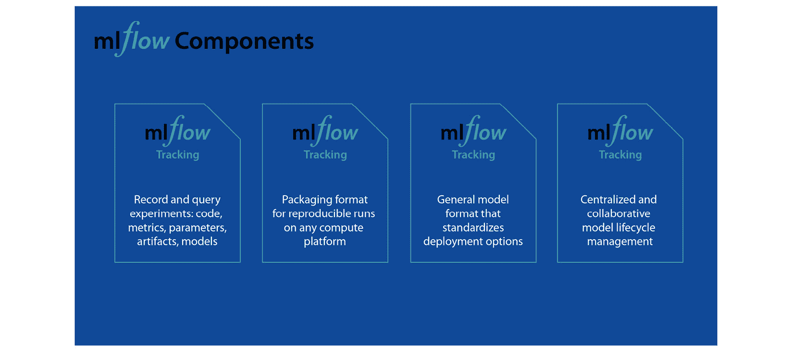
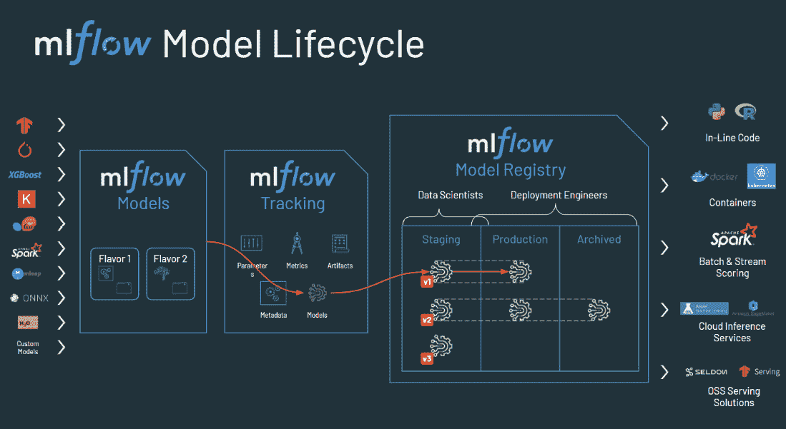
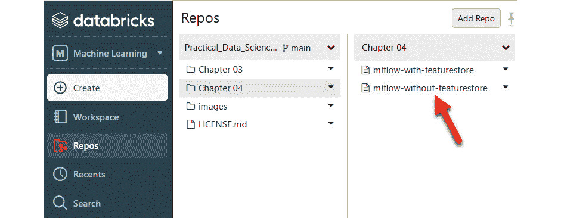
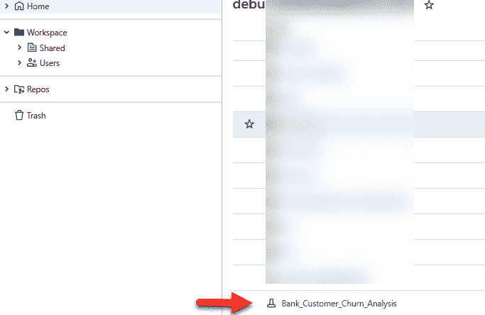
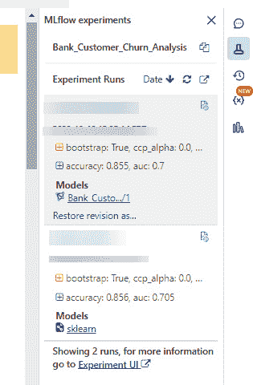
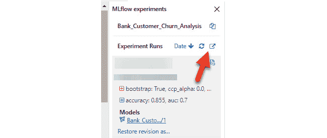
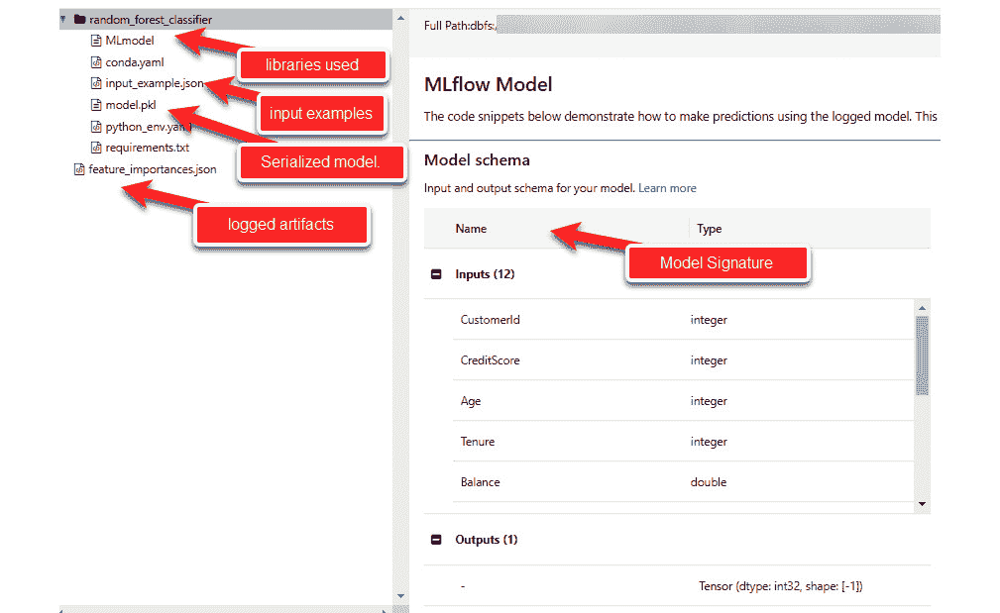
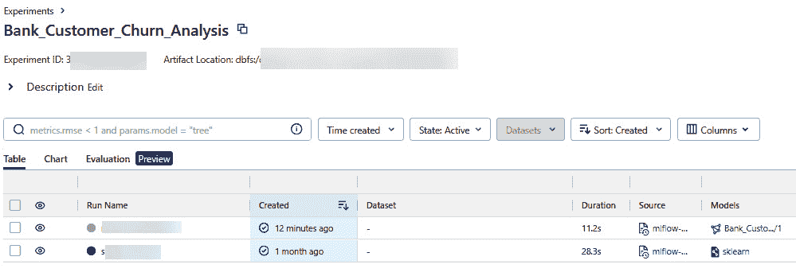

# 第四章：理解 Databricks 上的 MLflow 组件

在上一章中，我们学习了特征存储，了解了它解决的问题，以及 Databricks 如何提供内建的特征存储作为 Databricks **机器学习** (**ML**) 工作区的一部分，我们可以使用它来注册我们的特征表。

在本章中，我们将深入探讨如何管理我们的模型训练、跟踪和实验。在软件工程师的世界里，代码开发和生产化有既定的最佳实践；然而，在 ML 工程/数据科学领域，这样的最佳实践并不普遍采用。在与许多 Databricks 客户合作时，我观察到每个数据科学团队都有自己管理项目的方式。这正是 MLflow 进场的地方。

MLflow 是一个由 Databricks 工程师开发的 umbrella 项目，旨在为 Databricks 平台提供一个标准化的 ML 生命周期管理工具。截至 2023 年 9 月，它已成为一个开源项目，日均下载量超过 50 万次，并得到了广泛的行业和社区支持。MLflow 提供了管理端到端 ML 项目生命周期的功能，其中一些功能仅在 Databricks 上可用。

在本章中，我们将讨论以下主题：

+   MLflow 概述

+   MLflow 跟踪

+   MLflow 项目

+   MLflow 模型

+   MLflow 模型注册表

+   示例代码展示了如何在 Databricks 中跟踪 ML 模型训练

这些组件在标准化和简化 ML 项目的生命周期中发挥着至关重要的作用。当我们在 Databricks 中使用 MLflow 时，某些 MLflow 功能比其他功能更有用。我们将在本章中指出最有用的功能。

# 技术要求

本书的所有代码都可以在 GitHub 仓库中找到：[`github.com/PacktPublishing/Practical-Machine-Learning-on-Databricks`](https://github.com/PacktPublishing/Practical-Machine-Learning-on-Databricks)，并且是自包含的。要执行这些笔记本，你可以直接使用 repos 将代码仓库导入到你的 Databricks 工作区。我们在之前的章节中讨论过 repos。

本章还假设你对 Apache Spark 中的用户定义函数有初步的了解。你可以在这里阅读更多关于它们的信息：[`docs.databricks.com/en/udf/index.html`](https://docs.databricks.com/en/udf/index.html)。

# MLflow 概述

ML 生命周期很复杂。它从将原始数据以原始格式从各种批处理和流处理来源导入数据/Delta lake 开始。数据工程师使用 Apache Spark 等工具，结合 Python、R、SQL 或 Scala 创建数据管道，以可扩展、高效和具成本效益的方式处理大量数据。

数据科学家随后利用数据湖中的各种精心策划的数据集生成特征表来训练他们的 ML 模型。数据科学家更喜欢使用 Python 和 R 等编程语言进行特征工程，使用 scikit-learn、pandas、NumPy、PyTorch 或其他流行的 ML 或深度学习库进行模型训练和调优。

一旦模型训练完成，它们需要以**表述性状态转移**（**REST**）**应用程序编程接口**（**API**）的形式进行实时推理，或者以**用户定义函数**（**UDF**）的形式在 Apache Spark 上进行批处理和流式推理。我们还需要对部署的模型应用监控和治理。如果模型性能或数据发生漂移，我们可能需要重新训练并重新部署模型。

这个过程是迭代的，并给希望开始进行 ML 项目的组织带来了许多开发挑战：

+   为数据科学家提供稳定的工作环境需要管理大量的软件工具。许多库需要手动安装和配置。

+   跟踪和重现 ML 实验的结果也是一大挑战。

+   管理服务和治理，尤其是将模型生产化，是一项困难的任务。

+   随着数据量的增加，模型训练的规模化是一大挑战。

MLflow 及其组件为每个挑战提供了解决方案。在 Databricks 环境中，MLflow 与工作区组件（如笔记本、特征存储和 AutoML）集成。这种集成为数据科学家和 ML 工程师提供了无缝体验，使他们能够专注于生产力，而无需处理自己安装和管理 MLflow 的操作开销：



图 4.1 – MLflow 的各个组件

MLflow 由四个软件组件组成：

+   **MLflow 跟踪**

+   **MLflow 项目**

+   **MLflow 模型**

+   **MLflow** **模型注册表**

在 Databricks 中，除了 MLflow 项目外，所有这些组件都已集成、完全管理并作为 Databricks 工作区的一部分提供服务。由于我们的主要关注点是与 Databricks 无缝集成的 MLflow 特性，我们不会深入探讨 MLflow 项目。放心，使用 Databricks 时，这不会影响你的 ML 项目工作流程。Databricks ML 工作区还提供了高可用性、自动更新和对所有集成的 MLflow 组件的访问控制。

让我们详细了解一下这些组件。

# MLflow 跟踪

MLflow 跟踪允许您跟踪机器学习模型的训练过程。它还提高了模型训练过程的可观察性。MLflow 跟踪功能使您能够记录生成的度量、工件和模型本身，作为模型训练过程的一部分。MLflow 跟踪还在 Databricks 环境中跟踪模型的谱系。在 Databricks 中，我们可以看到负责生成模型的笔记本的确切版本，作为源代码进行列出。

MLflow 还提供了 **自动日志记录**（**autolog**）功能，能够在执行模型训练时自动记录许多度量、参数和工件。我们还可以将自己的一组度量和工件添加到日志中。

使用 MLflow 跟踪，我们可以按时间顺序跟踪模型训练。某些术语是 MLflow 跟踪特有的。我们来看看它们：

+   **实验**：为商业问题训练和调优机器学习模型是一个实验。默认情况下，Databricks 中的每个 Python 笔记本都有一个相同名称的实验，这被称为笔记本作用域实验。您可以通过 MLflow API 轻松更改和设置实验名称。像这样定义实验将创建一个工作区作用域的 MLflow 实验，该实验现在可以在您的工作区中看到。自定义 MLflow 实验名称在机器学习工作流程中提供了重要的优势——例如，通过帮助您对实验进行分类和区分，它提高了组织的清晰度，起到了文档作用，促进了沟通与协作。自定义名称有助于版本控制和跟踪实验的演变，这对于比较性能或回顾过去的配置特别有用。此外，它们简化了通过 MLflow 用户界面或编程查询访问特定实验的过程，最终有助于更高效、更有效的机器学习项目管理。我们将在示例代码中使用自定义实验名称。

+   **运行**：我们可以在每个实验下记录多个使用不同超参数训练的模型。每个在实验下记录的机器学习模型训练的独特组合称为一次运行。附带的 MLflow 跟踪用户界面允许我们对比不同的运行并找到最佳模型。

+   **Metrics**: 每个运行将会有关键的离线指标，我们在训练模型时希望记录这些指标。与在线指标不同，后者是在模型与实时数据和用户交互时实时计算的，离线指标是使用在模型部署之前收集的固定数据集进行回顾性计算的。这些指标在模型开发和测试阶段至关重要，用于评估模型在未见数据上的泛化能力，并指导模型的优化。离线指标的常见示例包括准确率、精确度、召回率、F1 分数、**均方误差**（**MSE**）和**接收者操作特征曲线下面积**（**AUC-ROC**），等等。它们为模型的性能提供见解，并可以指导超参数调整、特征工程和模型选择，以提高总体预测准确性和效果。

+   **Artifacts**: MLflow 的 artifacts 在 MLflow 的实验跟踪系统中发挥着关键作用，通过便捷地存储和版本管理与 ML 实验相关的附加文件和数据。这些多功能 artifacts 可以涵盖各种资源，包括 ML 模型文件、数据集、配置文件、数据可视化（例如绘图）、文档（例如 README 和 Jupyter 笔记本）、自定义脚本，甚至是总结实验结果的报告。重要的是，artifacts 会随着实验运行进行版本控制，确保随时间的精确追踪变化。它们支持远程存储解决方案，并可通过 MLflow 的 API 进行编程访问。这种全面的方法增强了 ML 项目中的可重现性、组织性和协作性，使得能够准确重现实验并访问所有相关资源成为可能。

+   **Parameters**: Parameters 是与 ML 实验运行相关联的用户定义的配置设置或超参数。它们通过记录每个运行中使用的具体配置设置，对实验进行跟踪、比较和重现起着至关重要的作用。这使得能够轻松可视化和分析参数值如何影响实验结果，从而更简单地识别最佳配置并有效管理实验。

+   **Tags**: Tags 是用户定义或自动生成的元数据标签，可以附加到 ML 实验运行中。它们用于为运行提供上下文、分类和组织，有助于搜索、过滤和分析实验。Tags 有助于记录和区分不同的运行，从而更轻松地理解和管理 ML 项目，并可以用于自定义工作流集成或自动化。

接下来，我们将了解 MLflow 的关键组件之一，称为 MLflow Models。

# MLflow Models

MLflow Models 是一种标准的 ML 模型包装格式。它在数据科学家创建的 ML 模型之上提供了标准化的抽象。每个 MLflow 模型本质上是一个包含根目录中的 `MLmodel` 文件的目录，该文件可以定义模型的多个 flavor。

Flavor 代表了一个基本概念，它通过为部署工具提供标准化的方法来理解和与 ML 模型交互，从而增强了 MLflow 模型的能力。这一创新消除了每个部署工具需要与每个 ML 库单独集成的需求。MLflow 引入了几个“标准”flavor，内置的部署工具普遍支持这些标准。例如，“Python 函数”flavor 描述了如何将模型作为 Python 函数执行。然而，flavor 的多样性不仅限于这些标准。库有灵活性来定义并使用自己的 flavor。例如，MLflow 的 `mlflow.sklearn` 库允许你将模型加载为 scikit-learn 管道对象，适用于在 scikit-learn 代码中使用，或者作为通用 Python 函数，满足需要应用模型的工具，比如使用 `-t sagemaker` 选项将模型部署到 Amazon SageMaker 上的 MLflow 部署工具。因此，flavor 作为 ML 库和部署工具之间的桥梁，提升了互操作性和易用性。

你可以使用 `mlflow.<model-flavor>.log_mode``l` 方法从实验中的一次运行注册一个 MLflow 模型。该方法将基础 ML 模型序列化为特定格式，并将其持久化到底层存储中。

查看官方文档，了解 MLflow Models 支持的完整 ML 库列表：[`www.mlflow.org/docs/latest/models.html#built-in-model-flavors`](https://www.mlflow.org/docs/latest/models.html#built-in-model-flavors)。如果你有一些已使用任何 Python ML 库开发的现有模型，MLflow 提供了一种通过 `mlflow.pyfunc` 模块创建自定义模型的方法。

还会记录其他文件，如 `conda.yaml` 和 `requirements.txt`，这些文件包含库的依赖关系，用于在需要时重建运行时环境。

ML 模型 YAML 文件包含以下属性：

+   `time_created`：以 UTC ISO 8601 格式表示的日期和时间，描述模型创建的时间。

+   `flavors`：定义了下游应用程序如何使用该模型。

+   `run_id`：表示 MLflow 运行的唯一标识符；该模型是通过 B 记录的。

+   `signature`：以 JSON 格式表示的模型签名。该签名定义了 ML 模型的输入和输出数据的预期格式。它是通过代表有效输入和输出示例的数据集自动推断出来的，例如训练数据集和模型预测。

+   `input_example`：这是如果在训练模型时提供示例记录作为输入时使用的。

MLflow 模型 API 提供了一种名为`mlflow.evaluate()`的方法，它可以自动在评估数据集上评估我们训练的模型，并记录必要的度量指标，例如准确率、R2 和 SHAP 特征重要性，具体取决于我们试图解决的是什么问题。你还可以创建自定义度量并将它们作为参数传递给`mlflow.evaluate(custom_metrics=[<your custom metric>])`。如果你想了解更多，*进一步阅读* 部分已提供相关链接。

MLflow 模型还提供 API，用于将打包的 ML 模型部署为 REST 端点进行实时推理，作为可以执行批量和流式推理的 Python 函数，或作为 Docker 容器，随后可以部署到 Kubernetes、Azure ML 或 AWS SageMaker。MLflow API 提供了诸如`mlflow.models.build_docker`这样的便捷方法来构建和配置 Docker 镜像。你可以在这里阅读有关各种可用方法的更多信息：[`www.mlflow.org/docs/latest/python_api/mlflow.models.html?highlight=docker#mlflow.models.build_docker`](https://www.mlflow.org/docs/latest/python_api/mlflow.models.html?highlight=docker#mlflow.models.build_docker)。我们将在*第七章*，*模型* *部署方法* 中探讨与 MLflow 集成的 Databricks 的各种部署选项。

现在，让我们看看列表中的下一个功能：MLflow 模型注册表。

# MLflow 模型注册表

MLflow 模型注册表是一个工具，用于以集中方式协作管理整个组织中所有 MLflow 模型的生命周期。在 Databricks 中，集成的模型注册表提供了对谁可以将模型从一个阶段转换到另一个阶段的精细访问控制。

MLflow 模型注册表允许在特定阶段有多个版本的模型。它支持通过编程方式或人工干预部署模型，在各个阶段（如预生产、生产和归档状态）之间进行最佳模型的转换。选择哪种策略进行模型部署取决于使用案例以及团队在自动化整个 ML 模型升级和测试过程方面的舒适度。我们将在*第六章*，*模型版本管理* *和 Webhooks* 中深入探讨这一点。

模型注册表还会记录模型描述、血统信息以及从一个阶段到另一个阶段的推广活动，提供完整的可追溯性。

我们将在*第六章*，*模型版本管理* *和 Webhooks* 中更详细地探讨模型注册表功能。

下图总结了各个 MLflow 组件之间的交互：



图 4.2 – 各个 MLflow 组件如何相互交互

你可以灵活选择自己喜欢的 Python ML 库来进行模型训练，同时 MLflow Tracking 服务器会认真记录指标、标签和工件，并将你的模型打包成 MLflow Models 格式。一旦你完善了一个候选模型并准备好将其集成到模型注册表中，注册过程非常简单。模型注册表不仅提供 API，还提供治理机制，确保模型在各阶段之间平稳过渡。此外，MLflow 模型注册表引入了 webhooks，能够在特定用户操作时触发自动通知；我们将在*第六章*，*模型版本控制与 Webhooks* 中深入探讨这一点。最终，下游应用可以利用 API 从注册表中获取最新的模型，并将其以各种形式部署，包括 Python 函数、Docker 容器或其他支持批处理、流处理和实时使用场景的部署选项。

你可以通过使用到目前为止讨论过的功能，独立管理你的 ML 项目生命周期，即使不使用 Databricks Feature Store。然而，在 ML 项目中使用 Feature Store 提供了许多优势，包括集中化的数据管理，便于访问和一致性，跨项目的特征重用，版本控制以确保可重现性，数据质量检查，协作团队合作，扩展性以应对日益复杂的数据，实时特征服务，模型监控集成，合规性支持，以及显著的时间和成本节约。简而言之，Feature Store 通过提供结构化和高效的数据管理和特征处理方法，提升了 ML 工作流的效率和效果。

让我们来看一个端到端的代码示例，展示在 Databricks 环境中训练 ML 模型的整个流程，并利用集成的 MLflow 所有功能。

# 示例代码展示了如何在 Databricks 中跟踪 ML 模型训练

在继续之前，确保你已经克隆了与本书配套的代码库，正如在*第三章*中所述。此外，请验证你是否已经执行了与*第三章*相关的笔记本。这些准备步骤对于全面参与此处提供的内容和练习至关重要：

1.  转到`第四章`，并点击`mlflow-without-featurestore`笔记本：



图 4.3 – 本章配套的代码

确保你的集群已经启动并运行，并且集群已附加到此笔记本，正如你在*第三章*中所做的，*使用 Feature Store*。

1.  `Cmd 3`展示了如何使用笔记本范围的库。这些库可以通过`%pip`魔法命令进行安装。最佳实践是将`%pip`命令保留在笔记本的最顶部单元格中，因为它会重启 Python 解释器。我们这里只是升级了`scikit-learn`库的版本：

    ```py
    %pip install -U scikit-learn
    ```

1.  在`Cmd 5`和`Cmd 6`中，我们只是定义了一些常量值，用于跟踪我们的 ML 模型训练。将`USER_EMAIL`值更改为您用于登录 Databricks 工作区的电子邮件。在此笔记本中，我们不会使用 Feature Store API；但是，每个特征表都存储为 Delta 表，可以像常规 Hive 表一样读取：

    ```py
    from databricks.feature_store import FeatureStoreClientfrom databricks.feature_store import FeatureLookupimport typingfrom sklearn import metricsfrom sklearn.ensemble import RandomForestClassifierfrom sklearn.model_selection import train_test_splitimport mlflowimport pandas as pd# Name of experiment where we will track all the different model training runs.EXPERIMENT_NAME = "Bank_Customer_Churn_Analysis"# Name of the modelMODEL_NAME = "random_forest_classifier"# This is the name for the entry in model registryMODEL_REGISTRY_NAME = "Bank_Customer_Churn"# The email you use to authenticate in the Databricks workspaceUSER_EMAIL = "<your email>"# Location where the MLflow experiment will be listed in user workspaceEXPERIMENT_NAME = f"/Users/{USER_EMAIL}/{EXPERIMENT_NAME}"# we have all the features backed into a Delta table so we will read directlyFEATURE_TABLE = "bank_churn_analysis.bank_customer_features"
    ```

1.  为了使用 Mlflow，我们需要导入`mlflow`包。`mlflow.setExperiment(…)`创建一个命名实验，以跟踪我们将在此笔记本中执行的所有 MLflow 运行。执行此代码后，您应该能够在您的工作区目录中看到一个新类型的实体，其中`EXPERIMENT_NAME`指向的内容。正如前面提到的，这会创建一个工作区范围的实验：

    ```py
    # set experiment namemlflow.set_experiment(EXPERIMENT_NAME)
    ```



图 4.4 – 在工作区中创建的新实验

1.  调用`mlflow.start_run()`将在列出的实验下启动一个运行。其余代码只是训练一个 scikit-learn 模型。只需几行代码，我们便开始使用 MLflow Tracking 的功能：

    ```py
    with mlflow.start_run():  TEST_SIZE = 0.20  # Now we will read the data directly from the feature table  training_df = spark.table(FEATURE_TABLE)  # convert the dataset to pandas so that we can fit sklearn RandomForestClassifier on it  train_df = training_df.toPandas()  # The train_df represents the input dataframe that has all the feature columns along with the new raw input in the form of training_df.  X = train_df.drop(['Exited'], axis=1)  y = train_df['Exited']  X_train, X_test, y_train, y_test = train_test_split(X, y, test_size=TEST_SIZE, random_state=54, stratify=y)  # here we will are not doing any hyperparameter tuning however, in future we will see how to perform hyperparameter tuning in scalable manner on Databricks.  model = RandomForestClassifier(n_estimators=100).fit(X_train, y_train)  signature = mlflow.models.signature.infer_signature(X_train, model.predict(X_train))  predictions = model.predict(X_test)  fpr, tpr, _ = metrics.roc_curve(y_test, predictions, pos_label=1)  auc = metrics.auc(fpr, tpr)  accuracy = metrics.accuracy_score(y_test, predictions)  # get the calculated feature importances.  importances = dict(zip(model.feature_names_in_, model.feature_importances_))  # log artifact  mlflow.log_dict(importances, "feature_importances.json")  # log metrics  mlflow.log_metric("auc", auc)  mlflow.log_metric("accuracy", accuracy)  # log parameters  mlflow.log_param("split_size", TEST_SIZE)  mlflow.log_params(model.get_params())  # set tag  mlflow.set_tag(MODEL_NAME, "mlflow demo")  # log the model itself in mlflow tracking server  mlflow.sklearn.log_model(model, MODEL_NAME, signature=signature, input_example=X_train.iloc[:4, :])
    ```

1.  以下代码利用 MLflow Tracking 服务器记录工件和超参数值，同时将`tag`设置为正在记录到 MLflow Tracking 服务器的`sklearn`模型：

    ```py
     mlflow.log_dict(importances, "feature_importances.json")  # log metrics  mlflow.log_metric("auc", auc)  mlflow.log_metric("accuracy", accuracy)  # log parameters  mlflow.log_param("split_size", TEST_SIZE)  mlflow.log_params(model.get_params())  # set tag  mlflow.set_tag(MODEL_NAME, "mlflow demo")  # log the model itself in mlflow tracking server  mlflow.sklearn.log_model(model, MODEL_NAME, signature=signature, input_example=X_train.iloc[:4, :])
    ```

    一旦我们完成执行此单元格中的代码，我们将能够在实验下看到该运行及其所有工件、参数和超参数：



图 4.5 – 实验下列出的运行

1.  您可以通过点击快捷方式图标，查看 Tracking UI 中每次运行的详情：



图 4.6 – 访问集成 MLflow Tracking UI 的快捷方式

Tracking UI 以更多细节展示每次运行的信息。除了序列化模型，您还可以访问记录的工件、指标、超参数、模型签名，或者如果您在运行时记录了它们，还可以查看模型期望的输入样本。在顶部，您可以看到此运行所跟踪的实验路径。每个运行都有一个唯一的 ID，也会在顶部显示。跟踪服务器提供了溯源功能，并将此模型运行与执行该运行的笔记本的确切版本链接起来：



图 4.7 – 运行详情在 Tracking UI 中

1.  点击顶部的实验路径，将带你进入实验视图，在这里，如果你执行了多个运行，你可以选择并比较不同的运行结果，以便找到最佳模型或比较最佳的超参数组合：



图 4.8 – 与我们的实验相关的所有运行

现在，让我们总结一下本章内容。

# 总结

本章我们介绍了 MLflow 的各个组件以及它们如何协同工作，使得端到端的机器学习项目生命周期管理变得简单。我们学习了 MLflow Tracking、Projects、Models 和 Model Registry。

本章介绍了 MLFlow 的一些关键组件及其用途。理解这些概念对于在 Databricks 环境中有效管理端到端的机器学习项目至关重要。

在下一章中，我们将详细介绍 Databricks 的 AutoML 功能，以及如何利用它们为机器学习项目创建基线模型。
