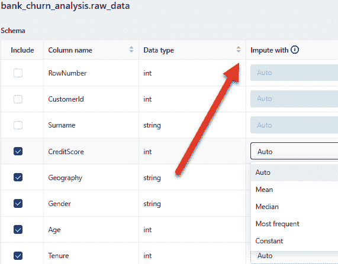

# 第五章：使用 Databricks AutoML 创建基准模型

在上一章中，我们理解了**MLflow**及其所有组件。运行*第四章*的笔记本《在 Databricks 上理解 MLflow 组件》后，你可能已经意识到，在 Databricks 中使用集成的 MLflow 跟踪服务器来开始跟踪你的机器学习模型训练是多么简单。在本章中，我们将介绍另一个新的独特功能——**Databricks**的**AutoML**。

Databricks AutoML，像 Databricks 工作区中的其他所有功能一样，完全与 MLflow 功能和 Feature Store 集成。

在编写本书时，Databricks AutoML 支持**分类**、**回归**和**预测**的使用案例，采用的是传统的机器学习算法，而非深度学习。你可以在本章第二部分看到支持的算法列表。

你可以使用 Databricks 的 Hive 元存储中注册的表、特征表，甚至通过 Databricks 中的导入数据功能上传新的文件来使用 AutoML。你可以通过点击*进一步阅读*部分的链接了解更多信息。

本章将涵盖以下内容：

+   理解 AutoML 的需求

+   理解 Databricks 中的 AutoML

+   在我们的流失预测数据集上运行 AutoML

+   当前的限制

让我们来了解本章的技术要求。

# 技术要求

要通过本章内容，我们需要满足以下要求：

+   我们需要先执行涉及将 CSV 文件中的原始数据导入 Delta 表，并随后注册新的特征表的*第三章*的笔记本。

# 理解 AutoML 的需求

如果你从未使用过任何 AutoML 框架，可能会想知道什么是 AutoML，以及它何时以及如何能发挥作用。

AutoML 通过自动化各种任务简化了机器学习模型开发过程。它会自动生成针对特定数据集的基准模型，并提供预配置的笔记本来启动你的项目。这对于各个水平的数据科学家都特别有吸引力，因为它能节省模型开发初期的宝贵时间。与其从头开始手动构建模型，不如借助 AutoML 快速高效地获取基准模型，这使它成为初学者和经验丰富的数据科学家都值得使用的工具。

AutoML 不仅让公民数据科学家和业务领域专家可以接触到机器学习。虽然 AutoML 无疑是一个强大的工具，但它也面临着显著的限制。一个明显的挑战是它固有的黑盒特性，这使得很难，有时甚至不可能，解读哪些超参数和算法对于特定问题最有效。这种不透明性在实现模型可解释性时构成了一个实质性的障碍。

此外，许多市场上可用的 AutoML 工具未能支持机器学习生命周期中的关键组件，包括将模型投入生产使用这一至关重要的步骤。这一缺陷可能会妨碍机器学习解决方案与实际应用的无缝集成。

需要注意的是，AutoML 并不会替代数据科学家的角色。虽然它简化了模型开发的某些方面，但熟练的数据科学家的专业知识和见解仍然是确保机器学习项目成功的不可或缺的因素。

这就是 Databricks AutoML 实际上提供的最大好处之一。让我们更深入地了解 Databricks 中的 AutoML，看看你如何在模型开发过程中使用它。

# 了解 Databricks 中的 AutoML

Databricks AutoML 使用透明盒子方法进行 AutoML。当你通过 UI 或支持的 Python API 使用 Databricks AutoML 时，它会将每一个模型和超参数组合（试验）作为 MLflow 运行进行日志记录，并生成对应每个模型试验的 Python 笔记本和源代码。所有这些模型试验的结果都会被记录到 MLflow 跟踪服务器中。每一个试验都可以进行比较和重现。由于你可以访问源代码，数据科学家可以在修改代码后轻松重新运行某个试验。我们将在后面的例子中详细讲解这一点。

Databricks AutoML 还会准备训练数据集，然后在 Databricks 集群上执行模型训练和超参数调优。这里需要注意的一点是，Databricks AutoML 会将超参数调优试验分布到整个集群。一个试验是与模型相关的超参数的唯一配置。如果你的数据集很大，所有训练数据集应该适应一个单独的执行器，因为 Databricks AutoML 会自动对你的数据集进行抽样。

在编写本书时，Databricks AutoML 支持以下算法：

| **机器学习问题** | **支持的算法** |
| --- | --- |
| 分类 |

+   Scikit-learn 模型：

    +   决策树

    +   随机森林

    +   逻辑回归

+   XGBoost

+   LightGBM

|

| 回归 |
| --- |

+   Scikit-learn 模型：

    +   使用随机梯度下降的线性回归

    +   决策树

    +   随机森林

+   XGBoost

+   LightGBM

|

| 预测 |
| --- |

+   Prophet

+   Auto ARIMA

|

表 5.1 – Databricks AutoML 支持的算法

让我们更详细地了解 Databricks AutoML 提供的一些关键功能。

## 大数据集的采样

采样是根据加载并训练模型所需的内存估算来进行的。在 ML Runtime 10.5 之前，数据采样不依赖于 VM 类型或执行器运行的内存量。在 ML Runtime 11.0 及更高版本中，如果节点是计算优化的并具有更大的内存，采样机制将增加采样比例和大小。

默认情况下，在 Databricks 中，每个执行器被配置为执行与可用 CPU 核心数量相同的试验次数。此外，执行器的可用内存会在这些试验之间均匀分配。然而，您可以通过调整 `spark.task.cpus` 配置参数来灵活修改此行为。

`spark.task.cpus` 的默认设置为 `1`，这意味着每个执行器将并行执行与其 CPU 核心数量相同的试验。如果您将此值更改为与执行器上可用的 CPU 核心数量相匹配，将会导致不同的行为。在这种情况下，每次只会在执行器上执行一个试验，但该试验将能够访问执行器的全部内存容量。如果您希望为每个试验提供更多资源，这个设置会非常有用。此举也会增加采样数据集的大小。AutoML 使用 PySparks 的 `sampleBy` 方法（[`spark.apache.org/docs/latest/api/python/reference/api/pyspark.sql.DataFrameStatFunctions.sampleBy.html`](https://spark.apache.org/docs/latest/api/python/reference/api/pyspark.sql.DataFrameStatFunctions.sampleBy.html)）进行分类问题的分层采样。

对于回归问题，AutoML 在需要采样时使用 `sample` 方法（[`spark.apache.org/docs/latest/api/python/reference/api/pyspark.sql.DataFrame.sample.html`](https://spark.apache.org/docs/latest/api/python/reference/api/pyspark.sql.DataFrame.sample.html)）。

*采样不适用于* *预测问题*。

## 不平衡数据检测

在 Databricks Runtime 11.2 ML 及更新版本中，当 AutoML 检测到分类用例的类别不平衡时，它会采取措施缓解训练数据集中的不平衡。通过对主类进行下采样和引入类别权重的组合，来实现这一目标。需要注意的是，这个平衡过程仅应用于训练数据集，不会影响测试和验证数据集。这种方法保证了模型性能是基于原始数据集及其真实类别分布来评估的。

为了解决不平衡的训练数据集问题，AutoML 会根据对特定类别应用的下采样程度，分配与类别权重成反比的类权重。例如，假设训练数据集中有 100 个样本，其中 95 个属于`Class A`，5 个属于`Class B`。AutoML 通过将`Class A`下采样到 70 个样本来减少这种不平衡，比例约为 70:95，即约为 0.736。与此同时，`Class B`的样本数保持为 5。为了确保最终模型得到正确的校准，并且保持与输入数据相同的概率分布，AutoML 通过此比例的倒数（约为 1:0.736，即 1.358）来调整`Class A`的类权重。`Class B`的权重保持为 1。这些类权重将在模型训练过程中作为参数使用，确保来自每个类别的样本得到适当的加权，从而帮助构建一个平衡且准确的模型。

## 数据拆分为训练集/验证集/测试集

在 Databricks Runtime 10.1 ML 及之后的版本中，您可以在执行分类和回归任务的数据拆分时指定一个时间列。当您指定这个时间列时，数据集将根据时间顺序划分为训练集、验证集和测试集。最早的时间段的数据点会分配到训练集，其次是验证集，最新的数据点则保留在测试集。

在 Databricks Runtime 10.1 ML 中，时间列必须是时间戳或整数数据类型。然而，从 Databricks Runtime 10.2 ML 开始，您还可以灵活选择字符串列作为时间列。这一增强功能为基于时间的数据拆分提供了更大的灵活性，从而有助于改进模型训练和评估。

## 增强语义类型检测

语义类型检测是一个强大的功能，它在 Databricks Runtime 9.1 LTS ML 及以后版本中引入，旨在通过提供对每列中数据类型的智能洞察，增强 AutoML 的能力。*需要注意的是，语义类型检测不适用于预测问题或已指定自定义填充方法的列。*

AutoML 会对列进行彻底分析，以确定它们的语义类型是否与表架构中指定的数据类型（Spark 或 pandas）不同。一旦发现不一致，AutoML 将根据检测到的语义类型采取具体的行动。然而，值得注意的是，这些检测可能并不总是 100%准确。以下是 AutoML 可以进行的关键调整：

+   **带有日期或时间戳数据的字符串和整数列**：这些列会被智能地识别为时间戳类型，从而更精确地处理时间信息

+   **表示数值数据的字符串列**：在适用的情况下，这些列会被转换为数值类型，确保可以无缝地进行数学运算

从 Databricks Runtime 10.1 ML 开始，AutoML 扩展了其功能，涵盖以下内容：

+   **包含类别 ID 的数值列**：这些列被识别为类别特征，有助于在处理类别数据时进行更准确的建模

+   **包含英文文本的字符串列**：这些列被识别为文本特征，增强了数据集中对文本数据的理解

在 Databricks Runtime 10.1 ML 及以后版本中，用户可以通过 Python 注解手动设置语义类型。以下代码示例演示了这种手动注解过程的语法：

```py
metadata_dict = df.schema["<column-name>"].metadatametadata_dict["spark.contentAnnotation.semanticType"] = "<semantic-type>"
df = df.withMetadata("<column-name>", metadata_dict)
```

您可以手动分配的可用语义类型如下：

+   **类别型**：适用于包含诸如 ID 等值的列

+   **数值型**：适用于包含数值的列

+   **DateTime**：适用于包含时间戳值的列

+   **文本**：保留用于包含英文文本的字符串列

若要禁用特定列的语义类型检测，可以使用特殊的关键字注解 native。

## Shapley 值（SHAP）用于模型可解释性

**Shapley 值**（**SHAP**）是一种基于博弈论的技术，用于估算每个特征在机器学习模型预测中的重要性。AutoML 回归和分类笔记本自带计算这些值的内置代码，使用 SHAP 包进行计算。然而，由于计算 SHAP 非常占用内存，因此默认情况下未启用。

若要在 AutoML 笔记本中启用并计算 SHAP，您需要将`shap_enabled`设置为`True`，然后重新运行笔记本。值得注意的是，如果数据集中包含`DateTime`列，则在版本 11.1 及更早版本的 MLR 中将不会生成 SHAP 图。

## 特征存储集成

在 Databricks Runtime 版本 11.3 LTS ML 及后续版本中，特征存储中的特征表可用于增强分类和回归任务的基础数据集。从版本 12.2 LTS ML 开始，这一功能扩展到增强输入数据集，以支持一整套 AutoML 挑战，包括分类、回归和预测。

当前 AutoML 的状态存在某些限制。仅支持数据集中以下数据类型：

+   数值型（`ByteType`、`ShortType`、`IntegerType`、`LongType`、`FloatType`和`DoubleType`）

+   布尔值

+   字符串（类别或英文文本）

+   时间戳（*TimestampType*和*DateType*）

+   `ArrayType[Numeric]`（Databricks Runtime 10.4 LTS ML 及更高版本）

+   `DecimalType`（Databricks Runtime 11.3 LTS ML 及更高版本）

您还需要确保源数据集中的所有列名都是唯一的。如果您使用 AutoML 进行时间序列预测，并且希望使用 Auto ARIMA，请确保时间序列输入数据集中的任何两点之间的间隔相同。默认情况下，AutoML 会自动用前一个值填充缺失的时间步。

让我们看一个 AutoML 的示例用例。

# 在我们的客户流失预测数据集上运行 AutoML

让我们来看一下如何使用 Databricks AutoML 来预测我们银行客户的流失率。

如果您执行了来自*第三章*的笔记本，*利用功能存储*，您将会在 Hive 元存储中看到原始数据作为 Delta 表。它的名称为 `raw_data`。在*第三章*的代码中，我们从 Git 仓库读取了一个 CSV 文件，将其作为 Delta 表写入，并在我们的集成元存储中注册它。请查看您笔记本中的 `cmd 15`。在您的环境中，数据集可能来自另一个数据管道，或通过 *上传文件* 功能直接上传到 Databricks 工作区。

要查看表格，您需要确保集群已启动并运行。


图 5.1 – 原始数据集的位置

让我们创建第一个 Databricks AutoML 实验。

重要提示

确保在执行下一步之前，您的集群已启动并运行，并且配置如下：

单节点或多节点

以单用户模式访问

Databricks 运行时版本设置为 13.3 LTS ML 或更高版本

*工作节点类型/驱动程序类型* 是至少有四个核心的任何虚拟机类型

*集群上不应安装除 Databricks 运行时为机器学习预装的库之外的任何其他库。AutoML 不兼容在共享访问模式下运行的集群。*

1.  在左侧选项卡中，点击**实验**。


图 5.2 – 实验选项卡的位置

1.  在此页面顶部，点击**创建 AutoML 实验**。这将引导您进入 AutoML 配置页面。


图 5.3 – 如何创建新的 AutoML 实验 (1)

1.  作为替代方案，您可以点击**新建**，然后选择**AutoML 实验**。


图 5.4 – 创建 AutoML 实验的另一种方式

1.  要开始，您需要输入以下基本信息：

    +   **对于该集群的目的**：这是您希望 AutoML 运行的集群配置。您可以重用我们在*第三章*中为*利用功能存储*创建的集群，和在*第四章*中为*理解 MLflow 组件*创建的集群。

    +   **机器学习问题类型**：回归、分类或预测。

    +   **数据集**：包含所有特征和标签/目标列的数据集。


图 5.5 – 如何创建一个新的 AutoML 实验 (2)

+   **预测目标**：这对于当前的分类问题是特定的。当您选择用于运行 AutoML 的数据集时，系统会自动填充所有列，您可以选择目标列。


图 5.6 – 展示如何创建一个新的 AutoML 实验 (3)

+   **实验名称**：这是用于跟踪所有试验的名称。

+   可选地，您还可以选择在运行试验时需要从选定的表格中包含哪些特性。在我们的案例中，`RowNumber`、`CustomerId` 和 `Surname` 对我们的分析没有任何帮助，因此我们将从选择中移除它们。


图 5.7 – 如何创建一个新的 AutoML 实验 (4)

可选地，您还可以选择如何处理数据集中的缺失值。

在 Databricks Runtime 10.4 LTS ML 及更高版本中，您可以定义处理 `null` 值的方法。在用户界面中，您可以通过表格 **Schema** 部分的 **Impute with** 下拉菜单选择您希望使用的填充技术。

值得注意的是，AutoML 会根据数据类型和相关列的内容自动选择合适的填充策略。



图 5.8 – 如何创建一个新的 AutoML 实验 (5)

就是这样！这就是您开始使用 Databricks 中的 Glassbox AutoML 所需要做的五件事。

还有一些高级配置，例如在选择最佳表现模型时，您希望优化哪些指标，或者您希望包含哪些支持的训练框架来运行试验：

+   评估指标作为运行的主要评分指标。

+   从 Databricks Runtime 10.3 ML 开始，您可以排除某些训练框架。默认情况下，AutoML 使用其算法下列出的框架。

+   停止条件是可定制的。默认设置如下：

    +   对于预测实验，120 分钟后停止。

    +   对于 Databricks Runtime 10.5 ML 及更早版本中的分类和回归实验，停止条件为 60 分钟或 200 次试验，以先到者为准。从 Databricks Runtime 11.0 ML 开始，试验次数不再作为停止条件。

+   从 Databricks Runtime 10.1 ML 开始，AutoML 为分类和回归任务引入了早停策略，如果验证指标停止改进，则会提前停止。

+   从 Databricks Runtime 10.1 ML 开始，您还可以选择用于分类和回归任务中时间序列数据拆分的时间列。

+   你可以在**数据目录**字段中指定一个 DBFS 位置来保存训练数据集。如果留空，数据集将作为 MLflow 产物保存。


图 5.9 – 如何创建一个新的 AutoML 实验 (6)

为了增强数据集的丰富性，你可以无缝地集成现有的特征表。只需滚动到页面底部并点击**连接特征**选项。这将带你进入一个配置面板，在那里你可以精确指定要与现有数据集合并的特征表，并建立一个或多个键来支撑这个合并过程，从而有效地链接数据集。

然而，需要注意的是，为了这个示例，我们将不会将*特征存储*表包含在*合并*操作中。此方法使你能够通过从选定的特征表中获取额外信息来增强数据集，从而提高其在分析或机器学习任务中的实用性，同时在这个练习中省略特征存储表。

现在我们只需要点击**开始 AutoML**：

+   我们的 AutoML 实验现在正在执行，并且当前状态在用户界面中可见。随着 AutoML 的进展，它会生成以下三个产物：

    +   它生成一个详细的数据探索笔记本，包含源代码，旨在概述任何偏差或问题，例如缺失数据或零值。它会自动使用`pandas.profiling`包来完成此操作。你可以通过点击**查看数据** **探索笔记本**来查看此笔记本。


图 5.10 – 如何访问自动生成的数据探索分析笔记本

数据探索笔记本还显示了不同特征之间的相关性：


图 5.11 – 由数据探索分析笔记本生成的相关性图

+   你可以看到实验试验，里面包含了每次在我们的数据集上运行的源代码。源代码列在你的工作区下的用户目录中的一个名为`databricks_automl`的文件夹中。


图 5.12 – 各种笔记本的位置，包含与每次试验相关的代码

+   最佳模型的笔记本也会在所有试验执行完成后由 AutoML 自动生成。这个笔记本会引导你完成所有特征工程和训练 ML 模型的步骤。试验会在追踪服务器中自动记录。笔记本还包含特征转换的代码。


图 5.13 – 记录由 AutoMl 识别的最佳模型的笔记本位置

它还利用 SHAP（[`pypi.org/project/shap/`](https://pypi.org/project/shap/)）记录特征重要性。


图 5.14 – 一个示例的 SHAP 值图，作为最佳模型笔记本的一部分自动生成

本笔记本还解释了如何最终利用已训练的模型，通过各种部署选项，我们将在稍后的*第六章*，*模型版本控制* *和 Webhook*中进行讨论。

+   你可以通过 UI 比较不同的实验。

+   你也可以利用 Python API 启动 AutoML 进行分类、预测或回归。通过 Python API，你还可以以编程方式从 AutoML 实验中提取最佳模型并用于推理。

    这是一个启动分类任务的示例代码：

    ```py
    databricks.automl.classify(  dataset: Union[pyspark.DataFrame, pandas.DataFrame],  *,  target_col: str,  data_dir: Optional[str] = None,  exclude_columns: Optional[List[str]] = None,           # <DBR> 10.3 ML and above  exclude_frameworks: Optional[List[str]] = None,        # <DBR> 10.3 ML and above  experiment_dir: Optional[str] = None,                  # <DBR> 10.4 LTS ML and above  imputers: Optional[Dict[str, Union[str, Dict[str, Any]]]] = None, # <DBR> 10.4 LTS ML and above  max_trials: Optional[int] = None,                     # deprecated in <DBR> 10.3 ML  primary_metric: str = "f1",  time_col: Optional[str] = None,  timeout_minutes: Optional[int] = None,) -> AutoMLSummary
    ```

你可以在[`docs.databricks.com/applications/machine-learning/automl.html#classification-and-regression`](https://docs.databricks.com/applications/machine-learning/automl.html#classification-and-regression)查看更多关于各种参数的信息。

# 摘要

在本章中，我们讨论了 AutoML 的重要性，以及它如何帮助数据科学家快速上手并高效解决手头的问题。然后我们介绍了 Databricks AutoML 的玻璃盒方法，这使得模型结果更易于解释，并能够自动捕获血缘关系。我们还学习了 Databricks AutoML 如何与 Databricks 工作区中的 MLflow 追踪服务器集成。

在接下来的章节中，我们将更详细地介绍如何使用 MLflow 模型注册表和 Webhooks 管理机器学习模型的生命周期。

# 深入阅读

这里有一些其他有用的链接：

+   Databricks，*什么是* *AutoML?*：([`docs.databricks.com/applications/machine-learning/automl.html#databricks-automl`](https://docs.databricks.com/applications/machine-learning/automl.html#databricks-automl))

+   Databricks，*导入* *数据*：([`docs.databricks.com/data/data.html#import-data-1`](https://docs.databricks.com/data/data.html#import-data-1))

# 第三部分：机器学习治理与部署

你将学习如何利用 MLFlow 模型注册表来管理模型版本，并从不同阶段过渡到生产环境，同时使用 webhook 设置警报和监控。

本节包含以下章节：

+   *第六章*，*模型版本控制与 Webhooks*

+   *第七章*，*模型部署方法*

+   *第八章*，*使用 Databricks Jobs 自动化 ML 工作流*

+   *第九章*，*模型漂移检测与再训练*

+   *第十章*，*使用 CI/CD 自动化模型再训练与重新部署*
