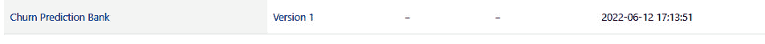

# 第六章：模型版本控制和 Webhooks

在上一章，我们深入探讨了**Databricks AutoML**的功能，详细分析了其各个组件。我们全面了解了数据科学从业者如何利用透明的“玻璃盒”AutoML 的强大功能，顺利启动机器学习解决方案，特别是在应对复杂的商业挑战时。

此外，我们通过自动化选择候选模型来将 AutoML 投入实践，解决我们的**银行客户流失**预测分类问题。为了促进这一过程，我们将强大的 MLflow 功能无缝集成到我们的工作流程中。这一集成让我们能够细致地跟踪模型训练的各个方面，提供了关于模型性能的宝贵见解，并使我们能够做出数据驱动的决策。我们的旅程还将我们带到了 MLflow 跟踪服务器，在那里我们记录并监控了整个训练过程，确保我们的银行客户流失预测项目高效且精准地执行。

本章中，我们将探讨如何从**MLflow 跟踪服务器**获取模型，并利用集成的**MLflow 模型注册表**来管理模型生命周期的下一步操作。

我们将覆盖以下主题：

+   理解模型注册表的必要性

+   将候选模型注册到模型注册表并管理访问权限

+   使用模型注册表管理 ML 模型生命周期

+   深入了解**Webhooks**在模型注册表中的支持

# 技术要求

让我们来看看本章的技术要求：

+   所有前面的笔记本，已经按描述执行过

+   一个启用了 Webhooks 的 Slack 工作区，用于某个频道（[`api.slack.com/messaging/webhooks`](https://api.slack.com/messaging/webhooks)）

# 理解模型注册表的必要性

在传统的软件工程中，中央代码仓库的概念已经相当成熟。然而，在数据科学领域，集中式模型仓库的概念仍在发展之中。虽然不能说不存在中央模型仓库——实际上确实有其他工具和平台提供类似的功能——但模型管理中的挑战是独特的，往往更加复杂。

这正是 Databricks 集成的 MLflow 模型注册表的亮点，特别是在促进数据科学团队之间的协作方面。

模型注册表的主要功能包括：

+   **集中式发现**：模型注册表作为一个集中的中心，注册了来自各个数据科学团队的模型。每个注册的模型都有一个可追溯到原始运行和模型训练时使用的笔记本版本的血统，使团队之间的协作变得更加容易。

+   **生命周期管理**：Databricks 提供了 UI 和 API 选项来管理模型的生命周期，从而简化了将模型从一个阶段提升到另一个阶段的过程。

+   **自动化测试与部署**：模型注册表允许你将不同版本的模型部署到各个阶段。你还可以附加备注并以自动化的方式对这些模型进行测试，确保只有最强健的模型进入生产环境。

+   **访问控制**：强大的权限功能控制谁可以访问、修改或部署已注册的模型，从而确保只有授权人员能够与模型进行交互。

现在，让我们看看如何将模型注册到模型注册表。

# 将你的候选模型注册到模型注册表并管理访问权限

你可以使用 UI 将候选模型注册到集成的模型注册表，或者使用 MLflow 模型注册表 API。

让我们首先看看 UI 选项：

1.  我们将首先导航到由我们的 AutoML 执行创建的 MLflow 实验。我们可以通过点击左侧导航栏中的**实验**标签来导航到此页面：


图 6.1 – 如何访问实验页面

1.  接下来，我们从列表中选择我们的实验：


图 6.2 – AutoML 创建的集成 MLflow 跟踪服务器中列出的实验

1.  现在，我们可以访问作为 AutoML 执行的一部分所执行的所有运行。在这里，我们可以在 UI 中对运行进行排序，获取最佳的 F1 分数：


图 6.3 – 根据 F1 分数排序的与 AutoML 实验相关的各种模型和运行

1.  接下来，我们选择列表中的第一个选项。在我的情况下，这是基于 LightGBM 的 `sklearn` 模型：


图 6.4 – 如何查看和访问最佳运行的记录模型

1.  现在我们将进入该特定模型的 MLflow **运行**页面。这个页面对你来说一定很熟悉，因为当你向下滚动时，你会看到所有的工件、指标和超参数都作为我们的运行的一部分自动记录下来（我们在前面的章节中讲解过这部分内容）：


图 6.5 – AutoML 为每个实验运行自动记录的不同工件

在右侧，你会看到一个标有**注册模型**的按钮：


图 6.6 – 如何将候选模型注册到模型注册表 1

1.  如果您是第一次使用 MLflow 模型注册表，您可以选择 `Churn Prediction Bank`。然后，点击**注册**：


图 6.7 – 如何将候选模型注册到模型注册表 2

此时，您的模型已在模型注册表中注册，并且如果访问**模型**页面，应该可以看到该模型。

1.  您可以通过点击左侧导航栏中的**模型**图标来访问**模型**页面：


图 6.8 – 如何访问模型注册表

1.  只需从列表中选择**Churn Prediction Bank**模型：



图 6.9 – 模型注册表中已注册的候选模型

这里有几个需要注意的事项如下：

+   最新版本显示为**版本 1**。这是因为我们在注册表中创建了一个新的模型条目。如果我们在*步骤 9*的下拉菜单中选择一个现有模型，那么版本将显示为**版本 2**，以此类推。

+   点击**版本 1**后，您将进入该版本模型的详细页面，并看到**源运行**列为**lightgbm**，这与生成我们最佳模型的运行相同。此外，输入和输出模式将自动从源运行中的模型签名继承。

您还可以在用户界面中为您的模型设置标签并添加描述：


图 6.10 – 已注册的候选模型版本详细信息

默认情况下，阶段设置为**无**。您可以通过内置的访问控制来管理谁有权限请求将模型从一个阶段转移到另一个阶段。

1.  您可以通过点击我们在*步骤 8*中交互的页面上的**权限**标签，按用户或组级别设置权限。


图 6.11 – 如何为模型访问添加治理 1

默认情况下，工作区管理员和模型的原始创建者拥有**可以** **管理**的权限：


图 6.12 – 如何为模型访问添加治理 2

您还可以指定按阶段授予对模型生命周期的访问权限或控制。在 Databricks MLflow 的模型注册表中，每个模型版本可以被分类到三个不同的生命周期阶段之一：**暂存**、**生产**或**归档**。值得注意的是，多个模型版本可以共存于同一生命周期阶段。这对于像 A/B 测试这样的场景非常有利，其中需要并行评估不同的模型版本。然而，这一特性可能给组织在管理和区分同一生命周期阶段内的多个模型时带来挑战。

为了解决这个问题，MLflow 提供了标签机制。可以为模型版本应用标签，以提供额外的元数据，便于在同一阶段内识别、过滤和管理模型。如果在同一阶段内有多个模型版本，默认情况下将加载最新版本的模型。然而，当同一阶段内存在多个版本时，明确指定要加载哪个模型版本是非常重要的，特别是在存在多个版本的情况下。在*第七章*《模型部署方法》中，我们将深入探讨如何有效地部署这些已过渡的模型。用户界面允许您修改模型版本的阶段，如下图所示。


图 6.13 – 模型阶段过渡的多种选项

1.  点击**请求过渡到**，然后选择**暂存**。此操作将向模型所有者发送通知，告知我们已经请求对该模型进行审查并要求其过渡到暂存阶段。在我们的案例中，由于我们拥有该模型，所以我们会收到该通知。我们还可以在模型过渡请求中添加评论：


图 6.14 – 将模型过渡到暂存阶段

1.  作为模型的所有者，我们可以查看所有关于该模型的评论，并有权选择批准、拒绝或取消请求。点击**批准**后，我们的模型将被过渡到**暂存**阶段：


图 6.15 – 文档历史记录及批准模型过渡请求的能力

通过用户界面执行的所有上述操作，也可以通过 MLflow Python API 来完成，当您想为模型训练和部署创建自动化工作流时。

现在让我们看看如何通过编程方式将模型注册到集成的模型注册表中，并将其过渡到暂存阶段。前往与`第六章`关联的笔记本，并在 Databricks 工作区中打开它。

在第三个代码单元格中，我们通过编程方式检索最近修改的实验。目标是根据我们选择的评估指标，从这个实验中提取出表现最好的模型：

```py
import mlflow# Initialize the Mlflow client
client = mlflow.tracking.MlflowClient()
# Fetch all available experiments
experiments = client.search_experiments()
# Sort the experiments by their last update time in descending order
sorted_experiments = sorted(experiments, key=lambda x: x.last_update_time, reverse=True)
# Retrieve the most recently updated experiment
latest_experiment = sorted_experiments[0]
# Output the name of the latest experiment
print(f"The most recently updated experiment is named '{latest_experiment.name}'.")
# Note: If you're specifically looking for the experiment related to AutoML for base model creation,
# ensure that 'latest_experiment' corresponds to that experiment.
```

在第五个单元格中，我们首先初始化一些参数，例如我们现有的用户名、`experiment_name`（与我们的 AutoML 相关联的实验名称），以及 `registry_model_name`（将在模型注册表中的模型名称）。在前面的部分，我们已经使用 UI 在注册表中注册了候选模型，注册名为 `MlflowClient` 库，该库来自 `mlflow.tracking` 包，用于访问基于与最佳模型运行关联的 `run_id` 的最佳模型：

```py
# Initialize the Databricks utilities to programmatically fetch the usernameusername = dbutils.notebook.entry_point.getDbutils().notebook().getContext().userName().get()
# Retrieve the name of the latest experiment; assumed to have been set in earlier steps
experiment_name = latest_experiment.name
# Define the model name for the registry, specific to our use-case of Churn Prediction for a Bank
registry_model_name = "Churn Prediction Bank"
# Fetch the experiment details using its name
experiment_details = client.get_experiment_by_name(experiment_name)
# Search for runs within the experiment and sort them by validation F1 score in descending order
sorted_runs = mlflow.search_runs(experiment_details.experiment_id).sort_values("metrics.val_f1_score", ascending=False)
# Get the run ID of the best model based on the highest validation F1 score
best_run_id = sorted_runs.loc[0, "run_id"]
best_run_id
# Note: The variable `best_run_id` now contains the run ID of the best model in the specified experiment
```

要注册与最佳模型训练运行相关联的模型，我们需要提供模型 URI（在跟踪服务器中的模型路径），作为输入传递给 MLflow 注册表的 `register_model` API。我们需要传递的另一个参数是我们希望从模型跟踪服务器中检索的新版本模型的名称。为了简化起见，我们将名称保持为与 UI 中定义的模型名称相同，因此新模型将作为 **版本 2** 注册到模型注册表中：

```py
# Initialize the model's URI using the best run ID obtained from previous stepsmodel_uri = f"runs:/{best_run_id}/model"
# Register the model in Mlflow's model registry under the specified name
try:
    model_details = mlflow.register_model(model_uri=model_uri, name=registry_model_name)
    print(f"Successfully registered model '{registry_model_name}' with URI '{model_uri}'.")
except mlflow.exceptions.MlflowException as e:
    print(f"Failed to register model '{registry_model_name}': {str(e)}")
model_details
```

你还可以使用 `MLflowClient` 对象来更新注册表中模型的描述或设置与模型相关的标签。在笔记本的 `Command 9` 中，我们演示了如何使用 `MLflowClient` 对象调用 `update_registered_model` 和 `update_model_version` 方法：

```py
# Update the metadata of an already registered modeltry:
    client.update_registered_model(
        name=model_details.name,
        description="This model predicts whether a bank customer will churn or not."
    )
    print(f"Successfully updated the description for the registered model '{model_details.name}'.")
except mlflow.exceptions.MlflowException as e:
    print(f"Failed to update the registered model '{model_details.name}': {str(e)}")
# Update the metadata for a specific version of the model
try:
    client.update_model_version(
        name=model_details.name,
        version=model_details.version,
        description="This is a scikit-learn based model."
    )
    print(f"Successfully updated the description for version {model_details.version} of the model '{model_details.name}'.")
except mlflow.exceptions.MlflowException as e:
    print(f"Failed to update version {model_details.version} of the model '{model_details.name}': {str(e)}")
```

在笔记本的 `Command 11` 中，我们演示了如何使用 `MLflowClient` 对象中的 `transition_model_stage` 方法，将最新的模型版本转换到 `Staging` 阶段。你也可以在将新模型转移到 `Staging` 阶段时归档早期的模型：

```py
# Transition the model version to the 'Staging' stage in the model registrytry:
    client.transition_model_version_stage(
        name=model_details.name,
        version=model_details.version,
        stage="Staging",
        archive_existing_versions=True  # Archives any existing versions in the 'Staging' stage
    )
    print(f"Successfully transitioned version {model_details.version} of the model '{model_details.name}' to 'Staging'.")
except mlflow.exceptions.MlflowException as e:
    print(f"Failed to transition version {model_details.version} of the model '{model_details.name}' to 'Staging': {str(e)}")
```

现在，让我们探索如何利用 MLflow 模型注册表提供的 webhook 事件来自动化通知。当与在 MLflow 注册表中注册的模型相关的特定事件发生时，这将提醒我们。

# 深入了解模型注册表中的 webhook 支持

Webhook 允许用户创建自定义回调，以便在 Web 应用程序之间启用通信。Webhook 使得系统在某些事件发生时，能够自动将数据推送到另一个系统。

举个例子，如果你想在检测到 MLflow 中的模型请求新转移时，自动在 Slack 上触发通知，或者当你在版本控制分支中进行新的代码提交时，自动触发新的模型构建，这种情况就适用。

MLflow Webhook 提供了功能，允许最终用户自动监听与模型注册表相关的任何事件，并触发相应的操作。这些 webhook 可以与消息系统（如 Slack）集成，用于发送通知或触发 CI/CD 流水线，自动测试和部署 ML 模型。

你可以使用 Python 客户端或 Databricks REST API 来使用 webhook。

MLflow 模型注册表支持两种不同类型的 webhook，具体取决于目标：

+   **具有 HTTP 端点的 Webhook**：当我们想要将触发事件发送到像 Slack 这样的 HTTP 端点时，使用此类型的 webhook。

+   **Databricks 作业的 Webhooks**：这些主要用于将触发事件发送到 Databricks 作业。这种类型的 webhook 对于在 CI/CD 过程中自动启动新推送到暂存或生产环境的模型的自动化测试特别有用。

以下图示总结了将模型注册到 MLflow 模型注册表的工作流，以及如何使用 MLflow webhooks 启动 Slack 通知和 Databricks 作业，以对新部署的模型应用标签/评论或自动化测试：


图 6.16 – 使用 webhooks 进行模型管理的典型工作流

注意

感谢 Databricks

一旦模型阶段转换请求被提交，HTTP webhook 可用于通知可以审查请求并*批准*它的用户/用户组。

您还可以为特定模型或为某个注册表中注册的所有模型设置 webhooks。

您可以在 [`docs.databricks.com/en/mlflow/model-registry-webhooks.html#webhook-events`](https://docs.databricks.com/en/mlflow/model-registry-webhooks.html#webhook-events) 阅读有关各种支持的 webhook 事件。

在本章提供的代码示例中，我们特别使用了以下两个事件：

+   `MODEL_VERSION_CREATED`：为相关模型创建了一个新的模型版本

+   `TRANSITION_REQUEST_CREATED`：用户请求将某个模型版本的阶段转换

为了演示如何通过 Slack 为模型转换建立自动警报，您必须首先获取一个 Slack webhook URL。以下步骤将指导您创建一个 Slack 应用程序，并随之设置一个入站 webhook。关于这一主题的详尽指南，请参阅官方的 Slack API 文档 [`api.slack.com/messaging/webhooks`](https://api.slack.com/messaging/webhooks)。

如果您正在积极运行 `Chapter 06` 笔记本中的代码，确保在继续执行 `Command 16` 之前，您已经准备好 Slack webhook URL。

注意

这里需要记住的一点是，我们将要访问的用于创建新的注册表 webhook、删除 webhooks、列出 webhooks 等 REST 端点仅在 Databricks 上可用，而在开源的 MLflow 中不可用。您可以在 [`docs.databricks.com/dev-tools/api/latest/mlflow.html#operation/get-registered-model`](https://docs.databricks.com/dev-tools/api/latest/mlflow.html#operation/get-registered-model) 阅读更多关于 Databricks REST API 规范的信息。

让我们继续查看位于 `Chapter 06` 文件夹中的笔记本。我们将深入探讨如何利用 webhooks 在模型注册表中当特定事件发生时，自动向 Slack 渠道发送通知。

1.  在`Command 15`中，我们指定了一个代码块，提供了与 MLflow 的 REST API 进行交互的实用功能。它初始化了一个 MLflow 客户端并获取主机和令牌凭证用于身份验证。`mlflow_call_endpoint`函数旨在使用`GET`或其他 HTTP 方法向指定的 MLflow API 端点发出 HTTP 调用。它接受 API 端点、HTTP 方法和一个可选的 JSON 有效负载作为参数，并将返回一个以字典形式表示的 JSON 响应。该脚本还处理异常，如果 API 调用失败，将打印错误信息：

    ```py
    from mlflow.utils.rest_utils import http_requestimport jsondef get_mlflow_client():    """Returns an initialized MLflowClient object."""    return mlflow.tracking.client.MlflowClient()def get_host_creds(client):    """Fetches host and token credentials."""    return client._tracking_client.store.get_host_creds()def mlflow_call_endpoint(endpoint, method, body='{}'):    """Calls an MLflow REST API endpoint.    Parameters:        endpoint (str): The endpoint to call.        method (str): HTTP method ('GET' or other HTTP methods).        body (str): JSON-formatted request payload.    Returns:        dict: JSON response as a dictionary.    """    host_creds = get_host_creds(get_mlflow_client())    try:        if method == 'GET':            response = http_request(                host_creds=host_creds,                endpoint=f"/api/2.0/mlflow/{endpoint}",                method=method,                params=json.loads(body)            )        else:            response = http_request(                host_creds=host_creds,                endpoint=f"/api/2.0/mlflow/{endpoint}",                method=method,                json=json.loads(body)            )        return response.json()    except Exception as e:        print(f"Failed to call MLflow endpoint '{endpoint}': {str(e)}")        return Noneclient = get_mlflow_client()host_creds = get_host_creds(client)host = host_creds.hosttoken = host_creds.token
    ```

1.  在`Command 16`中，将`slack_webhook`变量的值分配给你 Slack 频道的 Webhook 链接：

    ```py
    slack_webhook = "https://hooks.slack.com/services/?????????/??????????/???????????????????????"
    ```

1.  执行`Command 17`和`Command 18`。这将为我们为**客户预测银行**问题注册的新模型注册新 Webhook。当创建新的模型版本或对模型版本进行了转换请求时，我们将收到通知：

    ```py
    import jsontrigger_for_slack = json.dumps({  "model_name": registry_model_name,  "events": ["MODEL_VERSION_CREATED"],  "description": "Triggered when a new model version is created.",  "http_url_spec": {    "url": slack_webhook  }})mlflow_call_endpoint("registry-webhooks/create", method = "POST", body = trigger_for_slack)trigger_for_slack = json.dumps({  "model_name": registry_model_name,  "events": ["TRANSITION_REQUEST_CREATED"],  "description": "Triggered when a new transition request for a model has been made.",  "http_url_spec": {    "url": slack_webhook  }})mlflow_call_endpoint("registry-webhooks/create", method = "POST", body = trigger_for_slack)
    ```

1.  `http_url_spec`参数是你提供 HTTP Webhook URL 的位置。

1.  现在，在此之后，如果你返回到模型 UI 或请求将模型转换到新阶段，你将在 Slack 中收到通知：


图 6.17 – 使用 Slack Webhook 在 Slack 频道接收自动化通知

该笔记本还展示了其他 REST API 调用，这些调用可以帮助你管理 Webhooks。

我们刚刚看到一个如何使用 Webhook 处理 HTTP 端点的例子。同样，我们可以设置一个作业注册 Webhook。这可以用来触发你可能用于测试模型或重新训练模型版本的某些 Databricks 作业。

在工作注册 Webhook 中，你需要提供两个与 HTTP 注册 Webhook 不同的参数：`job_spec`和`workspace_url`。你可以在与模型注册中心不同的工作区中启动作业。如果你没有定义`workspace_url`，则默认情况下，作业规范将用于触发与模型注册中心相同工作区中的 Databricks 作业。

# 总结

在本章中，我们介绍了如何利用 Databricks 模型注册中心来管理 ML 模型的版本控制和生命周期。我们还学习了如何使用 MLflow 模型注册中心来管理 ML 模型的版本，并在管理访问控制的同时，将模型从一个阶段转换到另一个阶段。接着，我们了解了如何使用 MLflow 支持的 Webhook 回调设置自动化 Slack 通知，以便跟踪模型注册中心中的模型变更。

在接下来的章节中，我们将介绍各种模型部署方法。

# 进一步阅读

以下是一些进一步帮助理解的链接：

+   Databricks，*Databricks* *AutoML*：[`docs.databricks.com/applications/machine-learning/automl.html#databricks-automl`](https://docs.databricks.com/applications/machine-learning/automl.html#databricks-automl)

+   Databricks，*作业注册 Webhook 示例* *工作流*：[`docs.databricks.com/applications/mlflow/model-registry-webhooks.html#job-registry-webhook-example-workflow`](https://docs.databricks.com/applications/mlflow/model-registry-webhooks.html#job-registry-webhook-example-workflow)

+   Slack，*使用传入的* *Webhooks 发送消息*：[`api.slack.com/messaging/webhooks#enable_webhook`](https://api.slack.com/messaging/webhooks#enable_webhook)
