# 第八章：使用 Databricks Jobs 自动化 ML 工作流

在上一章中，我们介绍了 ML 部署生命周期和各种模型部署范式。我们还理解了响应延迟、解决方案的可扩展性以及访问预测的方式在决定部署方法时的重要性。

在本章中，我们将深入探讨 **Databricks 工作流** 和 **Jobs**（之前称为 **Databricks Jobs**）。这个功能不仅可以用来定期安排模型的再训练，还可以通过我们在 *第六章* 中讨论的 webhook 集成触发测试，检查模型在从一个 **模型注册表** 阶段过渡到另一个阶段时的表现。

我们将覆盖以下主题：

+   理解 Databricks 工作流

+   利用 Databricks 工作流与 Jobs 自动化模型训练和测试

# 技术要求

以下是本章的技术要求：

+   至少需要拥有 **无限制集群创建**权限的 Databricks 工作区访问权限

+   按照之前描述的执行所有笔记本

现在，让我们来看看 Databricks 工作流。

# 理解 Databricks 工作流

工作流在最简单的意义上是用于开发和运行数据处理管道的框架。

Databricks 工作流提供了一项可靠的、完全托管的编排服务，用于处理 **Databricks Lakehouse** 平台上所有数据、分析和 AI 工作负载，支持任何云平台。工作流从 Databricks Lakehouse 平台开始设计，提供深度监控功能，并提供跨所有其他工作流的集中可观察性。客户使用 Databricks 工作流无需额外费用。

使用工作流的主要好处是用户不需要担心管理编排软件和基础设施。用户只需要专注于指定需要在工作流中执行的业务逻辑。

在 Databricks 工作流中，有两种方式可以使用托管工作流：

+   **Delta Live Tables**（**DLT**）：DLT 是一个声明式的 ETL 框架，用于在 Databricks Lakehouse 平台上开发可靠的管道。DLT 允许轻松监控 ETL 管道，同时管理运行这些管道所需的基础设施。它还内置了期望功能，以便对每个 Delta 表的输入数据进行验证，并跟踪数据血缘，同时提供数据质量检查。DLT 提供了表级的详细数据血缘，并为 ETL 管道的所有部分提供统一的监控和警报功能。

    DLT 本身是一个高级话题。深入讨论 DLT 的细节超出了本书的范围。我们将在 *进一步阅读* 部分提供一个链接，以帮助你开始使用 DLT。

    下图展示了 DLT 中包含的功能：

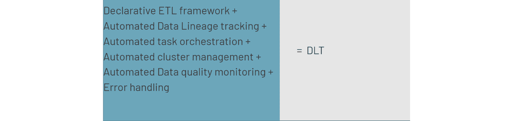

图 8.1 – DLT 提供的所有功能

注意

Delta 管道用于纯声明式 ETL。你不能使用它们进行 API 调用或发送电子邮件。你应该使用 Delta 管道进行 ETL。对于其他所有任务，使用带有作业的工作流。我们将在下一节中从触发自动化模型重新训练和对模型注册表中更新的模型进行自动化验证的角度来介绍带有作业的工作流。

+   **带有作业的工作流**：作业是一种触发 Databricks 笔记本、库等执行的方式，可以立即执行或按照固定计划执行。我们将在本章中更详细地讨论这一点，重点是如何自动化你的 ML 工作流。

与几乎所有 Databricks 功能一样，你可以通过 UI、**命令行接口**（**CLI**）或 API 创建作业。你可以定义一个或多个任务作为工作流的一部分。任务可以包括执行以下选项之一：

+   一个**Databricks 笔记本**，该笔记本位于可在 Databricks 工作区访问的 Git 存储库中，或者位于工作区中的某个位置

+   在云存储中加载的**Python 脚本**，可以通过**Databricks 文件** **系统**（**DBFS**）访问

+   **编译为 JAR 文件的 Java 代码**，此选项需要在集群上安装该 JAR 文件才能工作

+   **DLT**管道

+   **spark-submit**命令，这是一个允许将 Spark 或 PySpark 应用程序提交到底层集群的工具

+   **Python wheel**

你可以将多个任务串联在一起作为作业的一部分，并修复和重新运行失败或取消的作业。Databricks 还提供了通过 UI、CLI、API 和电子邮件通知监控作业状态的支持。如果你想了解如何使用 API 或 CLI 创建和管理带有作业的工作流，链接将在*进一步阅读*部分提供。Jobs 是一个非常灵活的工作流管理工具，可以用于开发和串联与 ETL 数据管道或 ML 工作流中各个步骤相关的任务。

让我们深入探讨如何使用 Databricks 中的*带有作业的工作流*功能，定期自动化机器学习模型的重新训练。工作流提供了精细的访问控制，允许所有者和管理员授予其他用户或小组查看工作流运行结果并管理工作流运行的权限。接下来，我们将更深入地探讨如何利用 Databricks 工作流与作业来自动化模型训练和测试。

# 利用 Databricks 带有作业的工作流自动化模型训练和测试

在本节中，我们将深入探讨 Databricks 工作流和任务之间的强大协同作用，以自动化机器学习模型的训练和测试。在开始实际操作之前，理解自动化在机器学习生命周期中的重要性，以及 Databricks 如何独特地解决这一挑战，至关重要。

在机器学习中，自动化训练和测试阶段不仅仅是一种便利，它是可扩展和高效的机器学习操作的必要条件。手动过程不仅耗时，而且容易出错，使得自动化成为现代 MLOps 中至关重要的一环。

这就是 Databricks 工作流发挥作用的地方，它允许复杂的机器学习管道的编排。

让我们看一个示例工作流，我们将使用工作流与任务来自动化它。我们将依次执行*图 8.2*中展示的以下逻辑步骤：

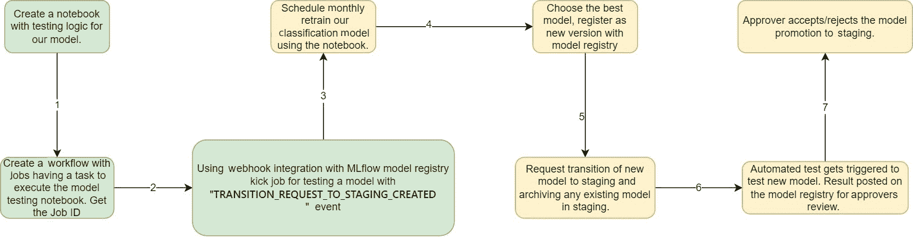

图 8.2 – 自动化测试和新模型推广警报的示例工作流

所有相关的代码都位于`Chaper-08`文件夹中。让我们来看一下如何将 Databricks 笔记本作为工作流与任务一起安排：

1.  我们首先导航到左侧导航栏中的  标签。在这里，我们可以点击**创建任务**：

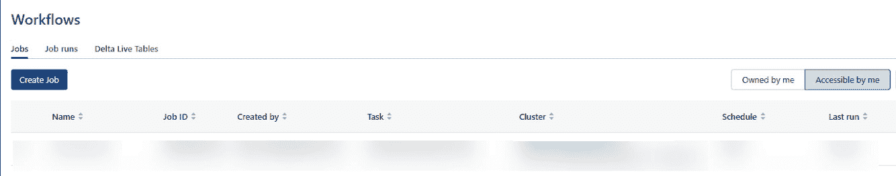

图 8.3 – Databricks 工作流标签的内容

1.  在这里，我们可以为任务提供一个名称，然后在**类型**下选择**Notebook**。在**来源**中，我们有两个选项 – **工作区**和**Git 提供者**：

    +   **工作区**：使用文件浏览器，您可以导航到您想要作为任务安排的工作区中的笔记本：

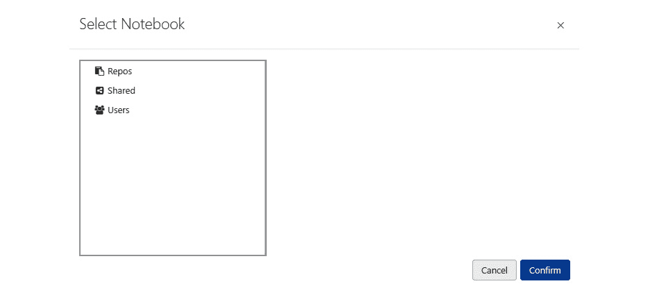

图 8.4 – 如何通过浏览工作区选项来浏览笔记本并将其安排为任务

您可以简单地导航到`Repos`文件夹中的笔记本，如下图所示，然后点击**确认**：

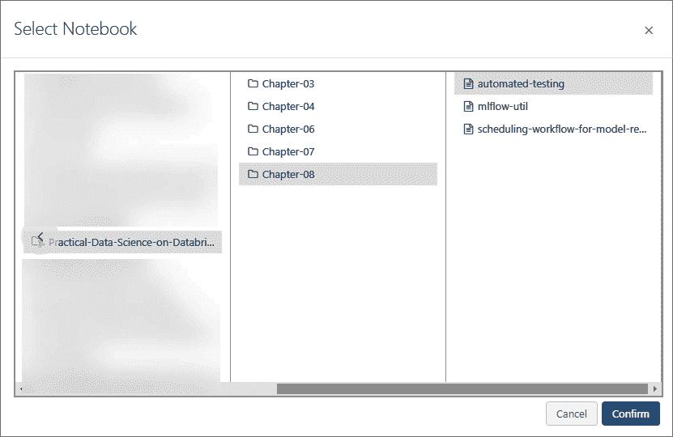

图 8.5 – 如何通过 Repos 功能浏览笔记本并将其安排为任务

注释

在这里需要记住的一件重要事情是，当您使用 Databricks 的 Repos 功能时，它会为您的代码库创建一个本地副本或克隆。如果您在代码库中更改了代码，但没有在本地代码库中执行 Git 拉取最新版本，那么您的更新将不会传递到您正在安排的任务中，且任务使用的是当前版本的代码库。

对于生产部署，重要的是使用 Git 提供者作为来源，而不是使用工作区作为来源。

+   **Git 提供者**：这种方法简化了在生产化和自动化部署过程中创建和管理作业的过程。这里的主要好处是，你可以在不管理多个代码仓库的权限的情况下对数据管道进行版本控制。你还将拥有一个统一的模型管道来源。每次作业执行时，它都会从远程仓库中拉取指定分支或标签的最新版本的笔记本/代码。Databricks 支持以下 Git 提供者：GitHub、Bitbucket Cloud、GitLab、Azure DevOps（不包括中国区域的 Azure）、AWS CodeCommit 和 GitHub AE。

注意

一个需要牢记的重要事项是，如果你使用 Git 提供者选项作为其中一个笔记本的来源，该笔记本将被安排为任务，你不能将其与使用工作区作为来源的笔记本任务混合在同一个作业工作流中。这一限制仅适用于使用 Databricks 笔记本。

要从 Git 提供者添加笔记本，输入你要访问笔记本的仓库详情。在我们的示例中，我将使用我自己为本书创建的 Git 仓库作为例子。

对于 **路径**，有几点需要注意：

+   你需要输入相对于笔记本位置的路径

+   不要在笔记本路径的开头添加 `/` 或 `./` 字符

+   不要包括文件扩展名，例如`.py`

+   要添加有关 Git 仓库的信息，请点击 **添加 Git 引用**，这将打开如 *图 8.6* 所示的窗口，在这里你可以选择你的 Git 提供者。

+   你可以选择从特定的 Git 分支/标签或提交执行笔记本。在我的例子中，我将使用 master 分支：

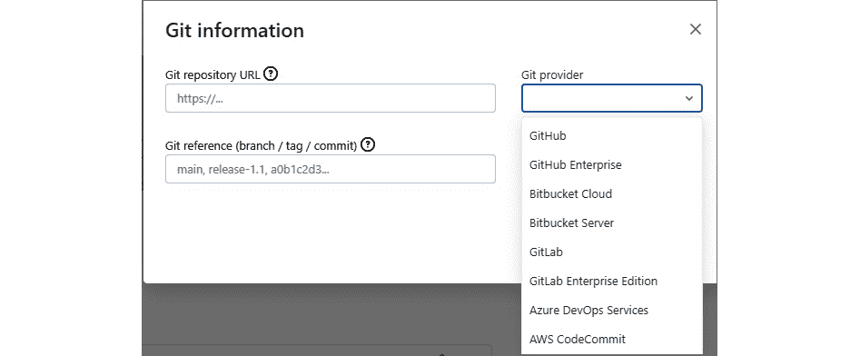

图 8.6 – 如何设置一个 Databricks 笔记本从仓库作为作业执行

选择集群时，你可以使用工作区中已经启动并运行的集群，也可以为工作流中的所有任务定义一个新的作业集群。我们已经在 *第二章* 中讨论了集群类型之间的差异。

1.  最后，你还可以将参数传递给你的任务。在笔记本中，参数作为笔记本小部件传递。

    如果你的使用场景需要设置 JAR、`spark-submit` 命令、Python 文件或 Python wheel 作为任务，你可以将输入参数定义为 JSON 格式的字符串数组。对于 Python 任务，可以通过 `argparse` ([`docs.python.org/3/library/argparse.html`](https://docs.python.org/3/library/argparse.html)) Python 模块访问传递的参数。对于 Python wheel 任务，你还可以选择传递关键字参数作为键/值对，然后使用 `argparse` 包访问这些参数。

1.  在`1`中。这个设置在某些情况下很重要，尤其是当你需要与任务并行执行某个特定工作流时。如果请求执行工作流与任务的并行实例达到了最大并行运行次数，系统将跳过该请求。

    在我们的例子中，我们的笔记本任务没有任何依赖任务，所以我们只需点击**创建**。你还可以通过点击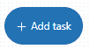图标来添加多个相互依赖的任务，作为工作流的一部分。

一旦我们成功创建了一个任务来作为工作流的一部分执行，我们可以在*工作流*部分的**作业**标签中看到关于我们工作流的信息。现在，我们可以选择通过**立即运行**按钮定期自动或交互式地调度工作流的运行。

我们可以看到一个图表，显示过去工作流执行的成功与失败，以及右侧显示的工作流与作业的运行时间和详细信息。请注意**作业 ID**，因为它将用于通过与模型注册表的 Webhooks 集成自动触发我们的模型测试笔记本：

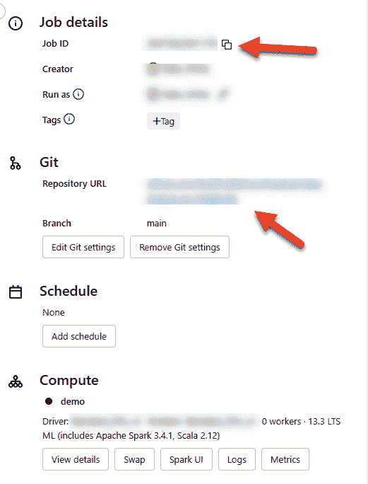

图 8.7 – 监控作业运行历史记录以及唯一作业 ID、Git、调度、计算和通知设置的总结页面

让我们来看一下我们刚刚调度的`Chapter-08`文件夹中自动化测试笔记本的内容：

+   `Cmd 2` 只是捕获由模型注册表 Webhook 发送的 `event_message` 参数的值。它包含有关触发此笔记本工作流执行的事件的信息，例如以下内容：

    +   `event_timestamp`：事件发生的时间

    +   `event`：事件的名称，如在 Webhooks 章节中描述的那样

    +   `text`：描述启动自动化测试执行的 Webhook 的目的

    +   `to_stage`：模型要转移到的目标阶段

    +   `version`：触发此 Webhook 的模型版本

    +   `from_stage`：模型版本在模型注册表中的初始阶段

    根据我们正在调度的任务类型，Webhooks 的有效载荷会有所不同。如果你想了解更多，*进一步阅读*部分会提供一个链接。以下代码片段演示了从 Webhooks 获取和解析有效载荷的过程：

    ```py
    import jsonevent_message = dbutils.widgets.get("event_message")event_message_dict = json.loads(event_message)model_name = event_message_dict.get("model_name")print(event_message_dict)print(model_name)
    ```

+   `Cmd 4` 只是运行一些工具代码来与 MLflow REST API 进行交互。编写模块化代码以编写单元测试是一个很好的实践：

    ```py
    import mlflowfrom mlflow.utils.rest_utils import http_requestimport jsondef client():    return mlflow.tracking.client.MlflowClient()host_creds = client()._tracking_client.store.get_host_creds()host = host_creds.hosttoken = host_creds.tokendef mlflow_endpoint(endpoint, method, body='{}'):    if method == 'GET':        response = http_request(            host_creds=host_creds, endpoint="/api/2.0/mlflow/{}".format(endpoint), method=method, params=json.loads(body))    else:        response = http_request(            host_creds=host_creds, endpoint="/api/2.0/mlflow/{}".format(endpoint), method=method, json=json.loads(body))    return response.json()
    ```

+   在`Cmd 7`中，我们正在从 MLflow 模型注册表下载一个特定的模型版本来运行我们的测试：

    ```py
    import mlflowpyfunc_model = mlflow.pyfunc.load_model(model_uri=f"models:/{model_name}/{version}")
    ```

其余的代码展示了如何编写任意测试，以在将模型提升到目标阶段之前对其进行测试。在示例代码中，我们测试了正在测试的模型是否具有输入所需的架构。我们还测试了响应的输出数据类型。

在测试成功运行结束时，我们向模型注册表发送一条消息，报告所有测试是否通过，供机器学习工程师审核：

```py
# Leave a comment for the ML engineer who will be reviewing the testscomment = "This model passed all the tests"
comment_body = {'name': model_name, 'version': version, 'comment': comment}
mlflow_endpoint('comments/create', 'POST', json.dumps(comment_body))
```

有了这个，我们现在可以准备将`automated-test`工作流与我们的模型训练笔记本进行注册。

让我们看看模型训练的代码。打开`scheduling-workflow-for-model-retraining`笔记本。

这个笔记本首先包含注册一个作业 Webhook 的代码，用于在模型注册表中触发`Churn Prediction Bank`模型的`TRANSITION_REQUEST_TO_STAGING_CREATED`事件。

让我们一一查看笔记本中的重要单元格：

1.  在`Cmd 2`中，我们仅从**Python 软件包索引**(**PyPI**)安装一个笔记本作用域的`databricks-registry-webhooks`库。这是与 Databricks 模型注册表 Webhooks 交互的另一种方式，而不是使用我们在*第六章*中介绍的 Databricks REST API。

1.  在`Cmd 3`中，我们仅从`bank_churn_analysis`表中读取原始`raw_data`表，并排除我们不会用来训练模型的特征。

1.  `Cmd 5`是一些实用代码，动态提取令牌和当前工作区的 URL。该代码可以放入独立的函数中，方便测试。

1.  在`Cmd 7`中，我们将注册我们在*步骤 1*中创建的工作流，以便通过`TRANSITION_REQUEST_TO_STAGING_CREATED`事件触发 Webhook。在代码中，将`<jobid>`替换为你在*步骤 2*中记录的`作业 ID`：

    ```py
    from databricks_registry_webhooks import RegistryWebhooksClient, JobSpecjob_spec = JobSpec(  job_id="<jobid>",  workspace_url="https://"+instance,  access_token=token)job_webhook = RegistryWebhooksClient().create_webhook(  model_name=model_name,  events=["TRANSITION_REQUEST_TO_STAGING_CREATED"],  job_spec=job_spec,  description="Registering webhook to automate testing of a new candidate model for staging")job_webhook
    ```

1.  接下来，我们使用`AutoML` Python API 触发一个模型重新训练任务，主要指标是`F1`得分：

    ```py
    import databricks.automlmodel = databricks.automl.classify(    new_data.select(features),    target_col=target_column,    primary_metric="f1",    timeout_minutes=5,    max_trials=30,)
    ```

1.  接下来，我们仅使用`MLflowClient`类对象将表现最佳的模型注册到我们的模型注册表中：

    ```py
    import mlflowfrom mlflow.tracking.client import MlflowClientclient = MlflowClient()run_id = model.best_trial.mlflow_run_idmodel_uri = f"runs:/{run_id}/model"model_details = mlflow.register_model(model_uri, model_name)
    ```

1.  我们现在导入一些实用代码，它只是`MLflow REST API`的一个包装器，使用`%run`魔法命令。这是你如何模块化代码，以便进行方便的测试和维护。

    ```py
    %run ./mlflow-util
    ```

1.  在`Cmd 17`中，我们请求将新模型版本过渡到暂存区。由于新模型在我们淘汰旧模型之前需要先进行测试，因此我们暂时不会将现有模型版本归档到暂存区。以下代码块演示了这一过程。

    ```py
    staging_request = {'name': model_name, 'version': model_details.version, 'stage': 'Staging', 'archive_existing_versions': 'false'}mlflow_endpoint('transition-requests/create', 'POST', json.dumps(staging_request))
    ```

1.  最后，我们还将添加一条评论，告知机器学习工程师模型已准备好进行测试：

    ```py
    comment = "This was the best model from the most recent AutoML run. Ready for testing"comment_body = {'name': model_name, 'version': model_details.version, 'comment': comment}mlflow_endpoint('comments/create', 'POST', json.dumps(comment_body))
    ```

    有了这个，我们可以看到，在`Churn Prediction Bank`模型中，注册模型的一个新版本有一个待处理的请求。

    我们可以通过点击**模型**版本获取更多有关此模型的详细信息。这将显示我们请求模型过渡的情况，并显示训练后留下的评论：

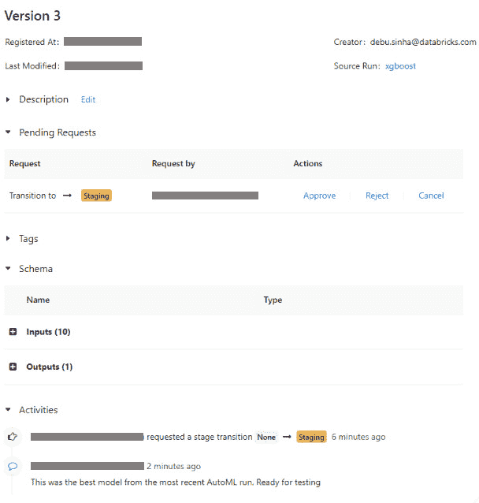

图 8.8 – 我们通过 API 创建的请求模型过渡到 Staging 的消息

1.  在请求过渡时，我们可以看到自动化测试现在正在执行新模型版本。通过点击 `automated_test`，我们可以查看更多详情：

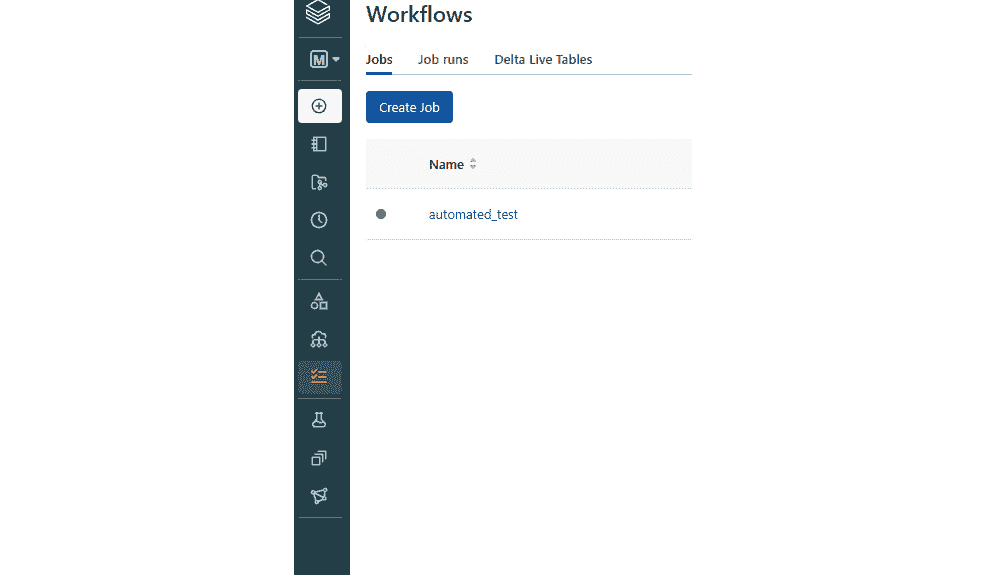

图 8.9 – 对任何请求过渡到 Staging 的新模型执行的自动化测试作业

矩阵视图显示了我们测试的当前状态。我们可以看到测试的实际输出：

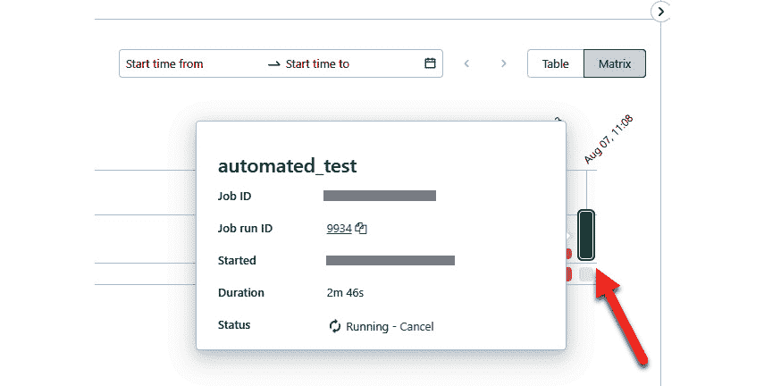

图 8.10 – 我们的自动化测试作业运行的矩阵视图

1.  在模型测试成功完成后，我们可以在*模型* *版本* 页面查看状态：

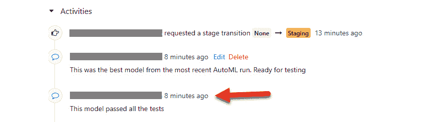

图 8.11 – 在成功测试新模型后，消息成功发布到模型注册表

1.  现在，ML 工程师或管理员可以归档旧模型并批准将此模型过渡到 Staging 环境的请求。

    在我的情况下，这意味着将模型版本 2 过渡到**归档**：

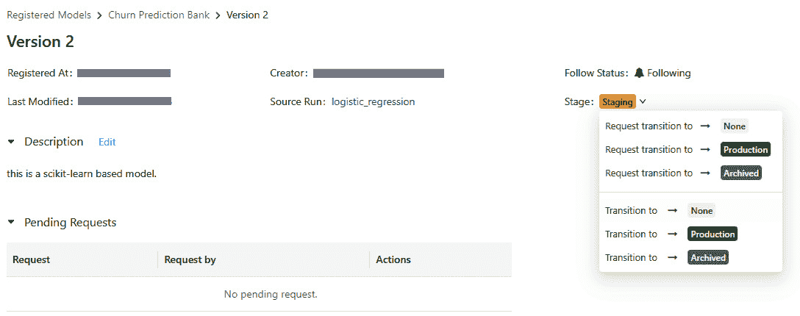

图 8.12 – 如何将现有模型从 Staging 过渡到归档

1.  我们可以添加一个评论，记录为什么这个模型被归档，这也将被记录在该模型版本的活动日志中：

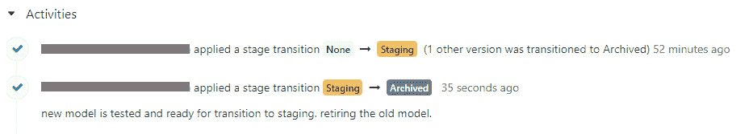

图 8.13 – 如何在归档操作中添加消息

1.  现在我可以批准模型版本 3 过渡到 Staging 并添加评论。当我们点击**批准**按钮时，我们可以批准模型过渡到 Staging，并将旧模型从 Staging 中退役：

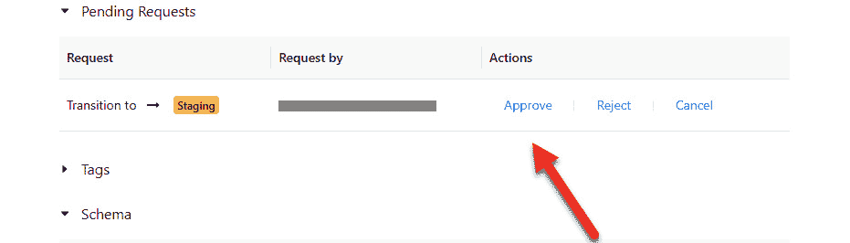

图 8.14 – 如何批准新模型过渡到 Staging

这种方式在每次 Staging 环境中只有一个版本的模型时非常有用。如果你希望在某一阶段同时存在候选模型进行 A/B 测试，选择最佳模型后再进行退役，明确的退役操作会非常有帮助。

所以，现在我们已经执行了从训练新模型到在推广到 Staging 之前触发自动化测试的端到端工作流。

最后需要做的事情是安排每月的模型再训练。

1.  返回 `scheduling-workflow-for-model-retraining` 笔记本并打开它。在每个 Databricks 笔记本的右上角，您会看到一个名为 **Schedule** 的按钮。点击该按钮后，您可以指定希望执行此笔记本的频率以及希望在哪种类型的集群上执行它。您还可以为笔记本添加参数并设置警报：

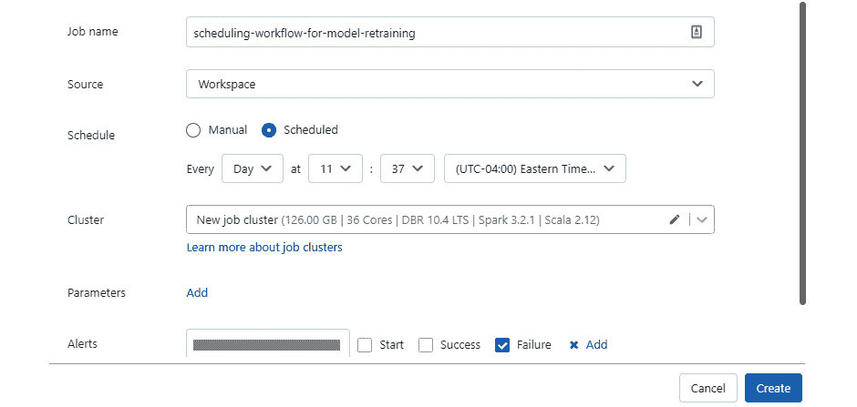

图 8.15 – 如何为自动化再训练设置模型

在我们深入探讨如何使用 Databricks Jobs 自动化机器学习工作流的复杂性后，您现在应该已经对如何设置和管理自动化 ML 再训练工作流有了扎实的理解。接下来，我们将在*总结*部分总结关键要点，帮助您巩固知识。

# 总结

本章中，我们讨论了在 Databricks 环境中可用的工作流管理选项。我们还更详细地探讨了带有 Jobs 功能的工作流，重点介绍了它在自动化 ML 工作流中的实用性。

我们演示了一个样本工作流，该工作流创建了一个包含测试的笔记本，以便对任何我们希望过渡到模型注册表 Staging 阶段的新模型进行测试。然后，我们配置了模型注册表 Jobs Webhook 功能，以便通过另一个自动化的模型再训练笔记本来触发该功能。类似的工作流可以使您的模型测试变得复杂多样，以满足您的需求。

在最后一章中，我们将介绍模型漂移的概念，以及如何自动触发模型的再训练。

# 进一步阅读

这里有一些链接可以进一步加深您的理解：

+   Databricks, *什么是 Delta Live* *表格*：[`docs.databricks.com/en/delta-live-tables/index.html`](https://docs.databricks.com/en/delta-live-tables/index.html)

+   Databricks, *Databricks 入门* *工作流*：[`docs.databricks.com/en/workflows/index.html`](https://docs.databricks.com/en/workflows/index.html)
