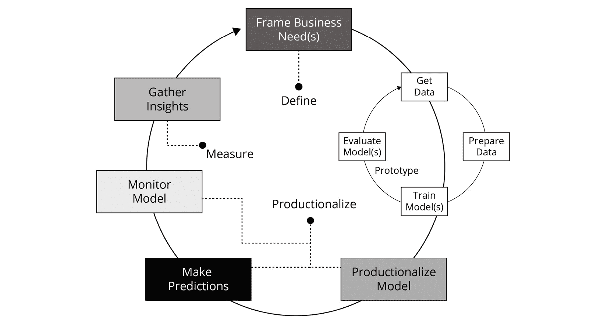
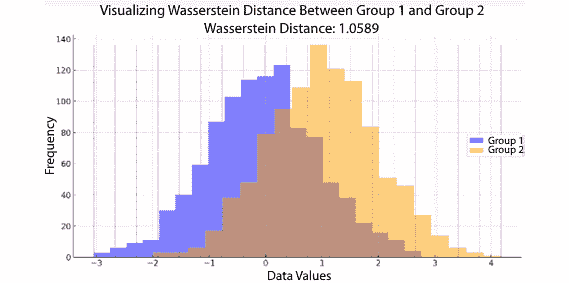

# 第九章：模型漂移检测与再训练

在上一章中，我们讨论了在 Databricks 中用于自动化**机器学习**（**ML**）任务的各种工作流管理选项。现在，我们将扩展我们迄今为止对 ML 生命周期的理解，并引入**漂移**的基本概念。我们将讨论为什么模型监控至关重要，以及如何确保你的 ML 模型随着时间推移仍然按预期表现。

在写这本书时，Databricks 正在开发一款产品，将简化模型性能和数据的监控。在本章中，我们将通过一个示例，展示如何使用现有的 Databricks 功能实现漂移检测和监控。

我们将涵盖以下主题：

+   模型监控的动机

+   模型漂移简介

+   统计漂移简介

+   漂移检测技术

+   在 Databricks 上实现漂移检测

让我们看看本章的技术要求。

# 技术要求

本章的先决条件如下：

+   访问 Databricks 工作区

+   一个运行中的集群，配备 Databricks 机器学习运行时（Databricks Runtime ML），版本高于 10.3

+   从*第九章*导入到 Databricks 工作区的笔记本

+   假设检验和统计测试解释的基础知识

让我们看看为什么模型监控如此重要。

# 模型监控的动机

根据 Enrique Dans 在 2019 年 7 月 21 日发表于《福布斯》杂志的文章，87% 的数据科学项目从未进入生产阶段（[`www.forbes.com/sites/enriquedans/2019/07/21/stop-experimenting-with-machine-learning-and-start-actually-usingit/?sh=1004ff0c3365`](https://www.forbes.com/sites/enriquedans/2019/07/21/stop-experimenting-with-machine-learning-and-start-actually-usingit/?sh=1004ff0c3365)）。

机器学习模型失败的原因有很多；然而，如果我们单纯从生产环境中 ML 项目失败的原因来看，归根结底是因为缺乏再训练以及在生产环境中测试已部署模型的性能一致性。

模型的性能随时间不断下降。许多数据科学家忽视了模型生产后的维护。以下可视化展示了两种不同的模型管理方法——一种是模型训练一次后长时间部署，另一种是模型在监控性能漂移的同时定期用新数据重新训练：


图 9.1 – 静态模型与定期训练模型的质量比较

来源

感谢 Databricks 提供

有许多统计测试可以帮助我们监控模型性能随时间的变化，由于 MLOps 领域仍处于发展初期，机器学习从业者在如何以及选择哪些测试纳入其机器学习生产化过程中面临挑战。

本章将深入探讨我们建议使用哪些统计测试来监控生产环境中的机器学习模型。几种 Python 库可以无缝集成到 Databricks 环境中，用于此目的。这些库包括开源选项，如 whylogs、Evidently 和 Seldon Alibi Detect，它们提供从数据漂移追踪到全面的模型健康评估等多种功能。尽管本章的主要重点将放在如何利用统计测试进行 Databricks 内的模型监控，但我们鼓励你探索这些库，以增强你的监控工具集。Databricks 的灵活性使你可以轻松地将这些库集成到你的工作流程中，若你希望扩展到统计方法之外的其他方法。

我们还将讨论如何利用迄今为止学到的内容，使用开源工具在 Databricks 上实施模型监控。

我们将探讨的例子集中于使用表格数据集进行批量评分。然而，底层原则同样适用于涉及图像或文本数据的流式或实时推理。

各组织在自动化偏好上有所不同，尤其是在针对性能漂移进行模型再训练时。在本节中，我们的主要目标是审视各种模型监控策略。根据你的具体使用案例，你可以根据这些见解决定最合适的下一步行动。

为了更好地说明模型监控的定位，我们来看看机器学习项目的典型生命周期。



图 9.2 – 显示机器学习项目的生命周期

来源

感谢 Databricks 提供

任何机器学习项目的第一步是业务方提出他们认为可以从应用机器学习中获益的业务问题。作为此过程的一部分，相关利益方和数据科学家共同制定在线和离线指标。

离线指标是在训练机器学习模型时可以计算的指标，如准确率和 F1 分数。在线指标则是与业务相关的指标。

在确定了指标和成功标准后，数据科学家和机器学习工程师与数据工程师合作，理解所有可用的数据源，并确定哪些对于当前的业务问题有用。在前面的图示中，这一阶段被称为**数据** **收集**阶段。

一旦数据收集完成，数据科学家将继续进行特征工程并训练各种机器学习模型，在评估模型后，他们将生产化最佳模型。

模型的生产化就是模型部署和监控的过程。整个过程，从收集数据到训练和评估模型，再到将最佳模型投入生产，都是一个迭代的过程。

将之前解释的整个过程付诸实践就是我们所说的 MLOps。所有的机器学习部署都各不相同，取决于我们要解决的领域和问题。

当你在 Databricks 上设计自己的机器学习解决方案时，应花费相当的时间来确定你将多频繁地训练和部署新模型，以及哪些性能监控和措施对于你的用例来说是合理的。

到目前为止，我们已经发现，随着时间推移，模型性能的下降是组织中机器学习项目失败的主要原因之一。现在，让我们来看一下模型性能为何可能随着时间而退化的一些原因。

# 模型漂移简介

机器学习模型可能会随着时间的推移而性能下降，这是项目中的常见问题。主要原因是输入到模型中的数据发生了变化。这些变化可能由于多种原因发生，例如数据的基础分布发生了变化，依赖特征与独立特征之间的关系发生了变化，或者生成数据的源系统发生了变化。

部署模型随时间的性能退化称为模型漂移。为了有效地识别模型漂移的实例，可以监控各种指标：

+   **准确性**：准确性下降的趋势可以作为模型漂移的强烈指示。

+   **精确度和召回率**：这些值的显著下降可能会突出模型在做出准确和相关预测方面能力的下降。

+   **F1 分数**：这是一个统一的度量，涵盖了精确度和召回率。F1 分数下降表明模型的整体效能受到影响。

+   **业务指标**：除了技术指标之外，关键的业务指标，如转化率、流失率和客户生命周期价值，也可以通过展示模型对业务目标影响的下降来揭示模型漂移。

模型漂移有许多类别，包括以下几种：

+   **特征漂移**：特征漂移指的是输入特征或预测变量的分布发生变化，这些特征或变量被机器学习模型用作输入。变化可能由于多种原因发生，例如数据收集过程的变化、测量误差，或数据源特征的变化：

    +   例如，如果一个模型是在某个特定地点和时间段收集的数据上训练的，然后被部署到一个特征分布不同的其他地点或时间段，模型可能会遇到特征漂移。这可能导致模型性能下降，因为模型可能无法准确地泛化到新的特征分布上。

+   **标签漂移**：标签漂移指的是用于训练机器学习模型的输出标签或目标变量的分布变化。这些变化可能由于基础数据生成过程的变化、数据收集方法的变化或标签定义的变化而发生：

    +   例如，如果一个模型通过历史数据训练来预测客户流失，而流失的定义随着时间变化，那么模型可能会经历标签漂移。这可能导致模型的预测与真实标签之间出现不一致，从而导致模型性能下降。

+   **预测漂移**：预测漂移指的是模型预测的分布随着时间变化而发生的变化。这种情况可能由于基础数据分布的变化、模型参数的变化或模型架构的变化而发生：

    +   例如，如果一个模型用于预测股市价格并部署在动态的金融市场中，随着市场条件的变化，模型的预测可能会发生漂移。预测漂移可能会影响模型预测的可靠性和准确性，从而可能对业务或运营产生影响。

+   **概念漂移**：概念漂移指的是数据分布中变量之间的基础概念或关系随着时间变化而发生的变化。这种情况可能由于数据源的变化、数据生成过程的变化或所建模的基础现象的变化而发生：

    +   例如，如果一个模型基于历史信用数据训练来预测信用风险，并且经济或监管环境发生变化，那么模型可能会经历概念漂移。概念漂移可能导致模型与现实世界现象之间的不一致，从而导致模型性能下降。

我们可以将有关各种漂移类型及其缓解措施的信息总结如下：


图 9.3 – 总结各种类型的漂移及我们可以采取的缓解措施

特征漂移、标签漂移和概念漂移共同归类为**数据漂移**。

理解并解决机器学习模型中的漂移至关重要，以确保它们在实际应用中的持续性能和可靠性。特征漂移、标签漂移、预测漂移和概念漂移是机器学习模型中可能发生的几种重要漂移类型。检测和缓解漂移需要使用适当的统计测试或方法来识别和量化数据分布随时间的变化。

在下一节中，我们将探讨另一个可能导致模型性能随时间恶化的重要因素——统计漂移。

# 统计漂移简介

统计漂移是指基础数据分布本身的变化。它可以影响输入特征和目标变量。这种漂移可能会或可能不会影响模型的性能，但理解它对更广泛的数据环境认知至关重要。

为了有效地识别统计漂移的实例，可以监控以下各种指标：

+   **均值和标准差**：显著的变化可能表明发生了漂移。

+   **峰度和偏度**：变化表明数据分布发生了改变。

+   **分位数统计**：例如，观察 25th、50th 和 75th 百分位数的变化。

为了全面理解模型漂移与统计漂移之间的相互关系，请考虑以下关键点：

+   **因果关系**：特征或目标变量的统计漂移通常是模型漂移的前兆。例如，若客户群体的年龄结构发生变化（显示统计漂移），则一个用来预测客户行为的模型可能会开始在性能上出现问题（导致模型漂移）。

+   **同时发生**：这两种漂移形式可以同时发生。例如，某电商模型可能因季节性变化而经历模型漂移，同时也由于客户群体的变化而发生统计漂移。

+   **多样化的监控需求**：每种类型的漂移都需要独特的监控策略。模型漂移通常通过检查预测误差来识别，而统计漂移通常通过观察数据分布的变化来检测。

+   **不同的纠正措施**：处理模型漂移通常涉及重新训练模型或进行微调。而统计漂移可能需要在数据处理协议或特征工程方面做出更全面的调整。

在做出选择使用哪种漂移检测方法的决策时，至关重要的是权衡每种方法的优缺点。你的选择将取决于项目的具体需求以及业务领域的细微差别。下表提供了一个简明的总结，突出了使用模型漂移检测方法与统计漂移检测方法的优点和挑战。

| **方面** | **模型漂移** **检测方法** | **统计漂移** **检测方法** |
| --- | --- | --- |
| 优点 | 通过性能指标易于检测；允许模型更新或再校准 | 提供对数据环境的更广泛理解，与模型无关 |
| 缺点 | 需要持续监控；可能会消耗资源 | 难以量化；可能需要复杂的测试；指示器不明显 |

表格 9.1 – 总结模型漂移检测方法与统计漂移检测方法的优缺点。

在下一部分中，我们将讨论可以用来监控特征和模型性能随时间变化的各种技术。

# 漂移检测技术

为了确保有效监控模型在时间上的表现，我们应追踪模型特征和目标变量的总结统计量和分布的变化。这将帮助我们早期检测到潜在的数据漂移。

此外，监控离线模型指标，如准确率和 F1 分数等，也很重要，这些指标是在模型最初训练时使用的。

最后，我们还应该关注在线指标或业务指标，确保我们的模型始终与我们要解决的特定业务问题相关。

以下表格提供了用于识别数据和模型漂移的各种统计检验和方法的概览。请注意，这个汇编并非包罗万象。

| **需要监控的数据类型** | **子类别** | **统计度量** **和检验** |
| --- | --- | --- |
| **数值特征** | 总结统计量 | - 均值 |
|  |  | - 中位数 |
|  |  | - 最小值 |
|  |  | - 最大值 |
|  |  | - 缺失值计数 |
|  | 统计检验 | - Kolmogorov-Smirnov (KS) 检验 |
|  |  | - Levene 检验 |
|  |  | - Wasserstein 距离 |
| **分类特征** | 总结统计量 | - 众数 |
|  |  | - 唯一水平计数 |
|  |  | - 缺失值计数 |
|  | 统计检验 | - 卡方检验 |
| **目标-特征关系** | 数值型目标 | - 皮尔逊系数 |
|  | 分类目标 | - 列联表 |
| **模型表现** | 回归模型 | - 均方误差 (MSE) |
|  |  | - 错误分布图 |
|  | 分类模型 | - 混淆矩阵 |
|  |  | - 准确率 |

表格 9.2 – 用于检测各种类型漂移的监测表

对每一种统计检验进行详细讲解超出了本书的范围。我们将使用开源库来执行这些检验并检测漂移；然而，了解我们将在本章附带的示例笔记本中使用的一些检验的高层次步骤仍然是有益的。

首先，让我们理解假设检验的基础知识。所有统计检验都使用假设检验框架。

## 假设检验

当我们需要根据样本数据得出关于总体特征的结论时，假设检验是无价的。这个统计技术旨在检验不同数据集之间是否存在显著差异。让我们看看假设检验的核心步骤。

### 假设检验的核心步骤

假设检验的核心步骤有四个：

1.  **制定假设**：

    1.  **原假设 H0**：该假设主张数据集之间没有显著差异。

    1.  **备择假设 Ha**：该假设主张数据集之间存在显著差异。

1.  **确定显著性水平**：通常用*α*表示，该值表示当原假设为真时，拒绝原假设所犯的错误的可能性。常选用 0.05 作为*α*值，这对应于 5%的第一类错误风险。

1.  **计算检验统计量**：这个数值度量来自样本数据和原假设，它是判断原假设有效性的依据。

1.  **确定 p 值**：p 值量化了在原假设成立的情况下，获得已计算的检验统计量或更极端结果的可能性。这个度量标准指导我们是否应该接受或拒绝原假设。

1.  **做出最终决策**

    1.  当 p−值 < *α* 时，原假设被拒绝。数据提供了充分的证据支持备择假设所提出的主张。

    1.  当 p−值 < *α* 时，原假设不被拒绝。支持备择假设的证据不足。

所以，现在我们了解了假设检验的基本知识。接下来，我们将回顾一些在本章附带的笔记本中用于演示漂移检测的统计检验步骤。

为了清晰地可视化我们将讨论的每个数值检验结果，附带的图形将基于一个合成数据集。这个数据集包含两个不同但可比较的数据点集，分别标记为“组 1”和“组 2”：

### 组 1

该数据集包括 1,000 个条目，使用均值为零、标准差为 1 的高斯分布生成。实质上，它是一个典型的钟形曲线，中心位于零。

第二组

该集合也包含 1,000 个条目。然而，这些条目来自均值为 1、标准差为 1 的高斯分布。其分布与组 1 相似，但在 x 轴上向右移动了一个单位。

### 定义特征

+   **样本大小**：组 1 和组 2 各包含相同数量的条目，从而实现平衡比较。

+   **分布性质**：两个组都遵循高斯分布，尽管中心值有所不同。

+   **方差齐性**：两个组的方差非常接近，使得它们适用于任何基于等方差假设的检验。

## 数值特征的统计检验和度量

在接下来的部分中，我们将深入探讨一系列统计技术，这些技术对于理解和分析数据集中的数值特征至关重要。我们将探索各种检验和度量方法，帮助你评估这些特征的质量、分布和关系，从而有助于有效的模型构建和监控。

### Kolmogorov-Smirnov 检验

**Kolmogorov-Smirnov**（**KS**）两样本检验是一种非参数方法，用于评估两个独立数据集是否来自相同的分布，或它们的分布是否在统计上有显著差异。该检验侧重于比较两个数据集的**经验累积分布函数**（**ECDFs**）。要进行 KS 检验以检测我们数值特征中的漂移，按照以下步骤进行：

1.  制定假设：

    +   **零假设（H0）**：该假设认为两个数据集来自相同的分布。

    +   **备择假设（H1）**：该假设认为两个数据集具有统计上不同的分布。

1.  选择显著性水平（alpha）。这是决定是否拒绝零假设的临界点。常见的 alpha 值为 0.05 或 0.01。

1.  计算检验统计量并根据 KS 检验的临界值表确定临界值或 p 值。

1.  做出决策：

    1.  将在*第 3 步*中获得的 p 值与选择的显著性水平（alpha）进行比较。

    1.  如果 p 值小于 alpha，拒绝零假设，并得出结论认为组别或样本的方差不相等。

如果 p 值大于 alpha，保留零假设。这表明没有足够的证据表明分布是不同的。

以下图表描绘了**经验累积分布函数**（**ECDFs**）在组 1 和组 2 之间的情况。红色虚线表示两个 ECDF 之间的最大差异，量化了**Kolmogorov-Smirnov**（**KS**）统计量。图中展示了 KS 统计量和 p 值，提供了两组之间漂移的统计量度量。


图 9.4 – 使用描述的虚拟数据为“组 1”和“组 2”进行 Kolmogorov-Smirnov 检验的可视化

KS 统计量为 0.4310，p 值接近 0.0，表明两组之间的差异在统计上显著。从“漂移”的角度来看，这表明“组 1”和“组 2”之间的分布确实发生了显著变化或漂移。这在长期监测模型时尤为重要，特别是监测它们处理的数据是否发生变化。

需要注意的是，根据具体的应用场景，可能需要使用 Bonferroni 校正以减少假阳性的出现。

### Levene t 检验

Levene 检验是一种统计检验，用于评估两个或更多组别或样本的方差是否相等。它是一个参数检验，当其他检验（如 t 检验或**方差分析**（**ANOVA**））所要求的方差相等假设（同方差性）无法满足时，可以使用 Levene 检验。Levene 检验可以通过以下步骤执行：

1.  制定假设：

    +   **零假设（H0）**：这意味着组别或样本的方差相等。

    +   **备择假设（H1）**：这意味着组或样本的方差不相等。

1.  选择显著性水平（alpha）。

1.  计算检验统计量，并将其与 p 值进行比较。

1.  做出决策：

    1.  将第三步中的 p 值与预设的 alpha 水平进行比较。

    1.  如果 p 值小于显著性水平（alpha），则拒绝零假设。这表明不同组或样本之间的方差不相同。

    1.  如果 p 值大于显著性水平（alpha），则保留零假设。这表明没有足够的证据证明方差存在差异。

箱线图显示了'Group 1'和'Group 2'的数据显示分布。每个组的方差被注释，并且 W 统计量和 p 值被呈现用于评估方差差异的统计显著性。


图 9.5 – Levene 检验的 W 统计量和 p 值

W 统计量较低，p 值较高，表明两个组之间的方差差异不显著。

### Wasserstein 距离

也被称为地球搬运工距离，Wasserstein 度量用于衡量两个统计分布之间的相似性或差异。它计算将一个分布转化为另一个分布所需的努力，其中这些分布可以表示为直方图或离散的概率值集合。在识别数据漂移时，可以使用此度量来评估两个分布之间的差异程度，无论是随着时间推移还是在不同条件下。

在使用 Wasserstein 距离比较两个分布时，较高的 Wasserstein 距离值表示分布之间的差异或不相似性较大，而较低的 Wasserstein 距离值则表示分布之间的相似性或一致性较强。在数据漂移检测的背景下，Wasserstein 距离随时间或不同环境的增加可以表明数据漂移的存在，数据漂移指的是基础数据生成过程或分布的变化。

换句话说，如果两个分布之间的 Wasserstein 距离在时间推移或不同环境下显著增加，表明这些分布已经发生偏离，数据可能已经从原始分布中漂移。这可能是数据特征、数据生成过程或数据源发生变化的迹象。这可能促使进一步调查和监控，以确保数据质量和模型性能。作为数据漂移指示器，Wasserstein 距离的显著增加的阈值可能取决于具体问题或应用，需要仔细考虑和领域知识。

以下直方图展示了'组 1'和'组 2'的分布。紫色虚线视觉上表示 Wasserstein 距离，量化了将一个分布转换为另一个分布所需的“工作量”。



图 9.6 – 用于表示'组 1'与'组 2'之间的 Wasserstein 距离的可视化

Wasserstein 距离提供了一种衡量两个分布在位置和形状上的差异的方法。在本例中，距离值和紫色线条在分布中的分布表明，两个组之间存在一定程度的差异，但并不是极端的。

## 类别特征的统计检验和度量

本节中，我们将简要介绍最常用的检验之一：卡方检验。如前所述，所有统计检验都遵循前面部分描述的假设检验框架。

### 卡方检验

卡方检验是评估两个类别变量之间是否存在有意义关系的统计方法，通常以列联表的形式表示。一般的步骤包括以下几个步骤：

1.  建立假设：

    +   **零假设 (H0)**：这表明两个类别变量之间不存在显著的关系。

    +   **备择假设 (Ha)**：这表示两个类别变量之间确实存在有意义的关系。

1.  **做出** **决策**：

    如果卡方统计量的 p 值小于选定的显著性水平（alpha），则拒绝零假设。否则，接受零假设。

为了清晰地理解卡方检验，我们将基于一个合成数据集使用示意图。该数据集包含两个不同的类别，称为'组 1'和'组 2'：

### **组** 1

该集合包含 1,000 个条目。具体来说，572 个条目属于类别 'A'，428 个条目属于类别 'B'。

### **组 2**

该数据集也包含 1,000 个条目，其中类别'A'包含 447 个条目，类别'B'包含 553 个条目。

### 关键属性

+   **样本大小**：组 1 和组 2 都有相同数量的条目（N=1,000），从而使得公平的比较分析成为可能。

+   **类别分布**：每个组包含两个类别——'A' 和 'B'。然而，这些类别中的条目分布在不同组之间有所不同。

+   **均匀样本大小**：由于两个组都有 1,000 个条目，因此它们适合像卡方检验这样从平衡数据集中受益的统计检验。

下方的柱状图展示了'组 1'和'组 2'中类别 'A' 和 'B' 的频率。角落中的注释统计信息提供了计算出的卡方统计量、p 值和自由度，作为视觉比较的定量度量。


图 9.7 – 可视化展示'组 1'与'组 2'之间的卡方检验结果

极低的 p 值和高的卡方统计量表明'组 1'和'组 2'之间的类别分布存在统计显著差异。

为了方便参考，这里有一张表，详细列出了各种统计方法、它们的假设公式、决策标准和示例用例及指标。

| **方法** | **假设公式** | **决策标准** | **示例指标** | **特征类型** |
| --- | --- | --- | --- | --- |
| T 检验 | 原假设：样本均值相同 &#124; 备择假设：样本均值不同 | 如果 p 值小于显著性水平，则拒绝原假设 | 平均用户会话时长：5 分钟 vs 8 分钟 | 数值型 |
| 卡方检验 | 原假设：类别之间没有关系 &#124; 备择假设：类别之间有关系 | 如果 p 值小于显著性水平，则拒绝原假设 | 各广告渠道的参与度 | 类别型 |
| 方差分析（ANOVA） | 原假设：组均值相同 &#124; 备择假设：至少一个组均值不同 | 如果 p 值小于显著性水平，则拒绝原假设 | 不同销售单元的绩效指标 | 数值型 |
| Kolmogorov-Smirnov 检验 | 原假设：数据分布匹配 &#124; 备择假设：数据分布不同 | 如果 D 超过临界值，则拒绝原假设 | 各地区的客户年龄分布 | 数值型 |
| Levene 检验 | 原假设：各组方差相等 &#124; 备择假设：组间方差不同 | 如果 p 值小于显著性水平，则拒绝原假设 | 性别间的评分方差比较 | 数值型 |
| Wasserstein 距离 | 原假设：分布相等 &#124; 备择假设：分布不同 | 考虑特定领域的 Wasserstein 距离阈值 | 随时间变化的客户收入分布变化 | 数值型 |

表 9.3 – 统计方法的指南，包括假设、决策标准、示例用例和适用的特征类型。

现在我们已经简要介绍了用于检测单个特征漂移的统计检验。接下来，我们将讨论可以在模型上实施的监控测试。

## 模型的统计检验和测量

当涉及到整体监控模型性能时，我们可以针对以下内容进行额外监控：

+   你可以监控目标与独立特征之间的关系：

    +   **数值型目标**：用于计算和监控皮尔逊相关系数

    +   **类别型目标**：用于计算和监控列联表

+   **模型性能**：在这里，我们可以监控模型的离线指标随时间的变化：

    +   **回归模型**：包括**均方误差**（**MSE**）、残差图、**均方根误差**（**RMSE**）等

    +   **分类模型**：包括准确率、F1 分数、**接收操作特性**（**ROC**）曲线等

    +   在保持数据集上的性能跟踪

+   **训练所需时间**：如果训练模型的时间随时间大幅增加，我们可能需要对此进行调查。

让我们来看一个在 Databricks 平台上检测漂移的端到端示例。我们将使用一个合成数据集，该数据集用于模拟各种类型的漂移。

# 在 Databricks 上实现漂移检测

本章所需的文件位于`Chapter-09`文件夹内。这个示例演示了如何将代码组织成特定模块，以保持结构的清晰。


图 9.8 – 显示我们代码库中文件布局的截图

`config`文件夹中的设置笔记本旨在建立用于数据读取和写入的文件夹结构。它还设置了用于跟踪模型性能的 MLflow 实验，并管理将会在我们的`model`-`drift`笔记本中使用的其他变量。

数据文件夹中的`datagen`笔记本用于创建一个合成数据集，有效地展示模型漂移的概念。该数据集涵盖了一个电子商务网站的在线销售时间序列数据，时间跨度为三个月。

在这个数据集中，我们有一组独立特征和一个目标特征，以及它们之间的模拟关系。独立特征包括以下内容：

+   `Temperature` **（数值型）**：表示每日的最高温度，单位为华氏度

+   `Weather_Condition` **`'sunny'`**, **`'cloudy'`**, 或 **`'rainy'`**

+   `Promotion_Type` **`'discount'`**, **`'free_gift'`**, 或 **`'bundle_deal'`**

+   `Website_Traffic` **（数值型）**：表示网站的总访问量

+   `Device_Type` **（类别型）**：表示用于访问网站的设备类型

目标特征是`Daily_Sales`（数值型），表示每天的总销售收入。

就关系而言，目标变量`Daily_Sales`与这些特征有特定的相关性。例如，它与`Temperature`和`Website_Traffic`相关，而与`Weather_Condition`和`Device_Type`相关。

我们的方法是使用初始月份的数据训练模型，然后在接下来的几个月数据中模拟不同的漂移模式。这个过程使我们能够有效地探索数据分布和模式变化对模型性能的影响。

最后，`util`文件夹中还有两个附加的笔记本。

`monitoring`笔记本包含一组监控工具函数，旨在确保新到数据与生产数据在数据驱动环境中的质量和一致性。这些函数涵盖了各个方面，包括检查空值比例、识别总结统计量中的显著差异、检测方差和分布的变化、评估类别差异以及比较模型性能。该工具函数有助于维护数据完整性、识别潜在差异，并为将模型迁移到生产环境提供建议。此外，还提供了一个绘制箱型图的功能，用于可视化新到数据和生产数据之间的分布差异。

为了对数据执行各种统计检验，我们将使用`scipy.stats`包。`scipy.stats`是 SciPy 库的一个基本组成部分，广泛应用于 Python 中的科学和统计计算。它提供了一整套统计分布、函数和方法，用于执行各种统计计算、概率密度估计和假设检验。借助`scipy.stats`，你可以轻松地处理连续和离散的概率分布、生成随机样本、计算统计量以及执行检验来分析数据。

该包涵盖了广泛的统计技术，例如计算概率、分位数、矩和进行拟合优度检验。`scipy.stats`中提供的分布包括常见的正态分布、指数分布、均匀分布等，以及在各个研究领域中使用的较不常见和专业的分布。

除了统计分布，`scipy.stats`还提供了假设检验、相关性分析、线性回归和非参数检验等函数。你可以在官方网站上了解更多信息（[`docs.scipy.org/doc/scipy/reference/stats.html`](https://docs.scipy.org/doc/scipy/reference/stats.html)）。

`training`笔记本专注于在 MLflow 环境中使用 scikit-learn 训练和管理机器学习模型。它包括与 MLflow 模型注册表交互、处理 Delta 表格和详细的机器学习工作流的工具函数。该工作流涵盖了数据加载、预处理、训练`RandomForestRegressor`模型、评估性能以及将相关指标和工件记录到 MLflow 以进行模型跟踪。该脚本的目的是简化训练、评估和跟踪机器学习模型的端到端过程，尤其是在生产环境中。

在处理完所有支持的笔记本和高级代码说明后，接下来我们将介绍名为`model-drift`的主驱动笔记本，它调用了所有其他笔记本。你可以在自己的时间里浏览支持的笔记本。

让我们直接进入`model-drift`笔记本：

1.  初始单元格只是调用其他支持性笔记本，以便为我们的示例准备所需的库、目录结构、原始数据集和 MLflow 实验：

    ```py
    %run ./config/setup%run ./util/training%run ./util/monitoring%run ./data/datagen
    ```

1.  接下来，我们使用 Databricks 笔记本小部件来参数化我们的笔记本，以设置假设检验和模型性能指标的某些阈值：

    ```py
    # Remove all existing widgetsdbutils.widgets.removeAll() # Create three widgets for the stats threshold limit, p-threshold, and min model R2 thresholddbutils.widgets.text("stats_threshold_limit", "0.5")dbutils.widgets.text("p_threshold", "0.05")dbutils.widgets.text("min_model_r2_threshold", "0.005")# Get the values of the widgets# stats_threshold_limit: how much we should allow basic summary stats to shiftstats_threshold_limit = float(dbutils.widgets.get("stats_threshold_limit"))# p_threshold: the p-value below which to reject null hypothesisp_threshold = float(dbutils.widgets.get("p_threshold"))# min_model_r2_threshold: minimum model improvementmin_model_r2_threshold = float(dbutils.widgets.get("min_model_r2_threshold"))
    ```

1.  从存储为 CSV 文件的原始合成数据集中提取第一个月的数据，并将其导入 Delta 表：

    ```py
    # Ensure we start with no existing Delta tabledbutils.fs.rm(months_gold_path, True) # Incoming Month 1 Dataraw_data = spark.read.csv(raw_good_data_path, header=True, inferSchema=True)# Filter the DataFrame to only include data for January 2023raw_data_month1 = raw_data.filter(raw_data["Date"].between("2023-01-01", "2023-01-31"))import pyspark.sql.functions as F# Create inital version of the Gold Delta table we will use for training - this will be updated with subsequent "months" of dataraw_data_month1.withColumn("month", F.lit("month_1")).write.format("delta").mode("overwrite").partitionBy("month").save(months_gold_path)
    ```

1.  使用我们自定义的方法`train_sklearn_rf_model`作为 MLflow 运行来训练基准模型。这个运行将可以在我们的实验中查看：

    ```py
    # read gold data for month 1 from the Delta tablemonth1_gold_delta_table = DeltaTable.forPath(spark, path=months_gold_path)month1_gold_df = month1_gold_delta_table.toDF()# Set the month number - used for naming the MLflow run and tracked as a parameter month = 1# Specify name of MLflow runrun_name = f"month_{month}"target_col = "Daily_Sales"cat_cols = [col[0] for col in month1_gold_df.dtypes if col[1]=="string" and col[0]!='month']num_cols= [col[0] for col in month1_gold_df.dtypes if ((col[1]=="int" or col[1]=="double") and col[0]!="Daily_Sales") ]print(f"category columns : {cat_cols}")print(f"numeric columns : {num_cols}")print(f"target column : {target_col}")# Define the parameters to pass in the RandomForestRegressor modelmodel_params = {"n_estimators": 500,               "max_depth": 5,               "max_features": "log2"}# Define a dictionary of parameters that we would like to use during preprocessingmisc_params = {"month": month,              "target_col": target_col,             "cat_cols": cat_cols,           "num_cols": num_cols}# Trigger model training and logging to MLflowmonth1_run = train_sklearn_rf_model(run_name,                        months_gold_path,  model_params, misc_params)month_1_run_id = month1_run.info.run_id
    ```

1.  将我们在第一个月的数据上训练的基准模型注册到模型注册表，并将其状态更改为生产环境：

    ```py
    # Register model to MLflow Model Registrymonth_1_model_version = mlflow.register_model(model_uri=f"runs:/{month_1_run_id}/model", name=mlflow_experiment_name)# Transition model to Productionmonth_1_model_version = transition_model(month_1_model_version, stage="Production")print(month_1_model_version)
    ```

1.  让我们深入了解训练基准模型后生成的运行。找到位于笔记本右侧的 Flask 图标，并点击它以访问该运行。需要注意的是，运行名称可能会有所不同，因为它是随机生成的。


图 9.9 – 显示使用第一个月数据进行基准模型训练的运行跟踪截图

除了度量指标外，我们的自定义模型训练方法还包含记录用于训练模型的数据集摘要统计信息的代码。


图 9.10 – 显示训练数据集的记录摘要统计信息截图

1.  此外，我们还记录了用于训练模型的 Delta 表的确切版本。如果将来需要分析此模型的训练过程以及训练中使用的特征，这将为我们提供可重现性和溯源信息。


图 9.11 – 记录 Delta 表版本以及用于此次运行的训练集和测试集大小的截图

在笔记本的其余部分，我们仅使用此基准模型来比较模型性能。

1.  对于第二个月的数据，我们通过引入某些推广类型的`website_traffic`缺失值和将温度的测量单位从华氏度改为摄氏度来模拟上游数据错误。通过执行检查所有数值列的空值比例的测试，我们能够捕捉到`web_traffic`有异常的缺失值：

    ```py
    print("\nCHECKING PROPORTION OF NULLS.....")check_null_proportion(month_2_pdf, null_proportion_threshold=.5)
    ```


图 9.12 – 显示对新数据进行空值检查的结果截图

1.  为了检测数据中的漂移，我们使用在监控笔记本中定义的`calculate_summary_stats`方法来计算第二个月数据的摘要统计。然后，我们使用其他实用方法，如`load_summary_stats_pdf_from_run`，从我们的基础运行中读取摘要统计，以便将第二个月的数据进行比较：

    ```py
    # Incoming Month 2 Dataraw_data_month2 = spark.read.csv(raw_month2_bad_data_path, header=True, inferSchema=True)# Filter the DataFrame to only include data for Feb 2023raw_data_month2 = raw_data_month2.filter(raw_data_month2["Date"].between("2023-02-01", "2023-02-28"))# Print the filtered DataFrameraw_data_month2.show(5)# Compute summary statistics on new incoming data# we will keep only the columns that we monitored for the last mode training data# convert to pandas dataframe should be used with care as if the size of data is larger than what can fit on driver node then this can cause failures.# In the case of data size being large use proper sampling technique to estimate population summary statistics.month_2_pdf = raw_data_month2.toPandas().drop(['Date'], axis=1)summary_stats_month_2_pdf = calculate_summary_stats(month_2_pdf)summary_stats_month_2_pdf# Get the original MLflow run associated with the model registered under Productioncurrent_prod_run = get_run_from_registered_model(mlflow_experiment_name, stage="Production")# Load in original versions of Delta table used at training time for current Production modelcurrent_prod_pdf = load_delta_table_from_run(current_prod_run).toPandas()# Load summary statistics pandas DataFrame for data which the model currently in Production was trained and evaluated againstcurrent_prod_stats_pdf = load_summary_stats_pdf_from_run(current_prod_run, project_local_tmp_dir)print("\nCHECKING PROPORTION OF NULLS.....")check_null_proportion(month_2_pdf, null_proportion_threshold=.5)statistic_list = ["mean", "median", "std", "min", "max"]unique_feature_diff_array_month_2 = check_diff_in_summary_stats(summary_stats_month_2_pdf,                                                                 current_prod_stats_pdf,                                                                 num_cols + [target_col],                                                                stats_threshold_limit,                                                                statistic_list)unique_feature_diff_array_month_2
    ```

    我们的摘要统计比较检验能够捕捉到数据中的漂移，并突出显示新数据中温度发生了剧烈变化。


图 9.13 – 截图展示了通过统计检验生成的输出，比较了新一个月的数据与基准数据的摘要统计

1.  接下来，我们将使用 Levine 检验来评估方差的变化，并结合修正过的 Bonferroni 检验来确定统计显著性：

    ```py
    print("\nCHECKING VARIANCES WITH LEVENE TEST.....")check_diff_in_variances(current_prod_pdf, month_2_pdf, num_cols, p_threshold)print("\nCHECKING KS TEST.....")check_dist_ks_bonferroni_test(current_prod_pdf, month_2_pdf, num_cols + [target_col], p_threshold)
    ```

1.  作为生产阶段的下一步，你可能需要与上游数据提供团队合作，了解与我们基础数据集相比，温度值为何发生如此剧烈的变化。

所展示的检验方法作为示例，突显了在 Databricks 的机器学习工作流中无缝集成漂移检测代码的重要性。值得注意的是，这些检验可以轻松地自动触发，类似于在*第八章*中展示的自动化示例，*使用 Databricks 作业自动化机器学习工作流*。

随着你继续浏览剩余的笔记本内容，你将遇到更多示例，这些示例阐明了如何随着时间的推移追踪模型指标以检测性能退化。此外，你还将获得关于如何通过编程管理模型在生产阶段或其他阶段的推进的见解，这一过程依赖于你从测试中得出的结果。

让我们总结一下本章的内容。

# 总结

在本章中，我们深入探讨了监控模型和数据的重要性，强调了漂移检测的关键作用。通过深入了解我们可以使用的各种统计检验方法，我们加深了对这一领域的理解，这些方法能够有效识别涵盖数值和分类特征的各种漂移形式。

此外，我们还进行了全面的演练，示范了这些概念的应用。通过使用合成的电子商务数据集进行模拟模型漂移场景，我们运用了`scipy.stats`包中的各种统计检验方法，准确地识别出了漂移的实例。

随着我们进入下一章，焦点将转向阐明 Databricks 工作区的组织结构，并深入探讨**持续集成/持续部署**（**CI/CD**）领域。
