# 第十章：使用 CI/CD 自动化模型再训练和重新部署

在*第九章*中，我们通过 Databricks 上多种开源库及其与 MLflow 的集成，探讨了多种统计测试，现在我们将重点关注 Databricks 上 MLOps 的一个核心组成部分。在本章中，我们将研究 Databricks 如何将 DevOps、DataOps 和 ModelOps 统一到一个平台中。

本章将涵盖以下主题：

+   MLOps 简介

+   MLOps 基础与部署模式

让我们来理解一下什么是 MLOps。

# MLOps 简介

MLOps 作为一种多学科的方法，融合了 DevOps、ModelOps 和 DataOps 的原则，旨在促进机器学习项目的端到端生命周期。它的目标是简化从模型开发到部署的过渡，同时确保有效的监控和管理。在这一框架中，我们有以下内容：

+   **DevOps**：专注于代码的持续集成和部署，旨在实现更快的发布和更可靠的软件。

+   **ModelOps**：专注于管理 ML 模型，确保它们经过有效的训练、验证和部署。

+   **DataOps**：涉及数据管理实践，涵盖从数据收集、预处理到存储和分析的各个方面。

MLOps 提高了 ML 系统的性能、稳定性和长期效率。MLOps 可以帮助减轻你的用例和行业中的两大主要风险：

+   **技术风险**：这些风险来源于管理不当的模型，这些模型未能按预期表现。若没有 MLOps 来实施你的基础设施和管道以训练新模型并将其重新部署到生产环境中，它可能非常脆弱。

+   **合规风险**：如果你属于受监管行业，必须跟踪新的法规和合规要求以确保不违反它们，MLOps 可以帮助减轻这些风险。

通过自动化，MLOps 还可以在进入生产环境之前减少并捕捉错误，缩短推出和维护依赖于最新模型的产品的上市时间。

现在，让我们看一下 Databricks 作为一个平台，它可以帮助减少之前提到的风险，并帮助提高团队和 ML 项目的长期效率。

Databricks 的一个独特之处在于它是一个*数据驱动的 AI 平台*。作为这个 AI 平台的一部分，Databricks 独特地提供了管理 ML 项目中数据、模型和代码所需的所有必要组件。

为了阐明 Databricks 如何促进 MLOps，以下图表展示了该平台与 Databricks 湖仓平台上的各种工具和服务的集成能力：

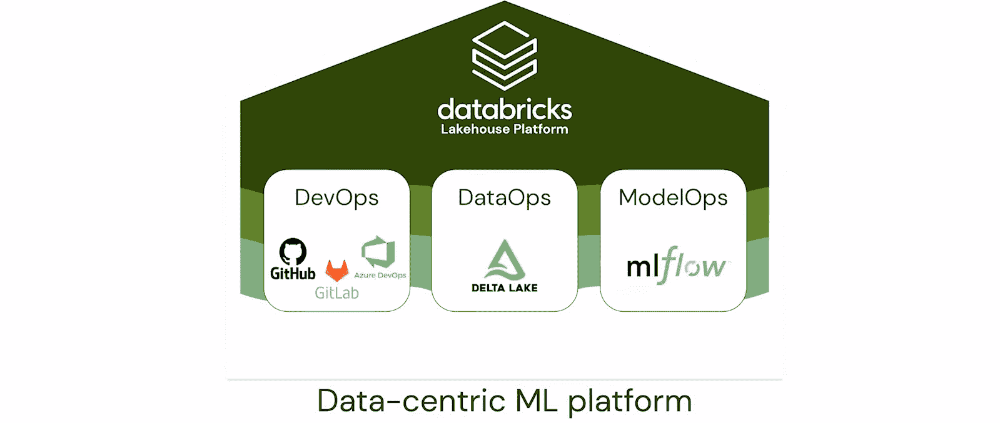

图 10.1 – Databricks 的数据驱动平台及其组件

注意

由 Databricks 提供。

接下来，我们将探讨 Delta Lake 如何作为一项关键技术，弥合强大数据存储与机器学习准备之间的差距。

## Delta Lake —— 不仅仅是一个数据湖

在管理复杂的数据生态系统时，Databricks 提供了 Delta Lake，这是一层综合性的开源存储层，我们在*第一章*中简要讨论过它。对于更深入的阅读，我的几位尊敬的同事也撰写了关于这一主题的其他详细书籍，它们列在本章的*进一步阅读*部分。

Delta Lake 凭借增强大数据处理框架，特别是 Apache Spark 的可靠性、可扩展性和性能而脱颖而出。由 Databricks 开发，它为数据湖提供**原子性、一致性、隔离性**和**持久性**（**ACID**）事务及强大的模式强制执行能力。这一点尤为关键，因为干净且可靠的数据不仅仅是一个优势，更是任何严肃数据工程或机器学习计划的前提条件。

### 为什么需要更清洁的数据和强大的数据工程管道？

在 Delta Lake 中拥有干净的数据和强大的数据工程管道，不仅是运营效率的问题，更是战略上的必要条件。数据质量直接影响机器学习模型的准确性、预测能力，最终影响商业结果。不一致或噪声数据可能误导算法，导致错误的洞察和决策。通过强制执行严格的模式并提供 ACID 事务，Delta Lake 将数据湖从单纯的存储库提升为能够有效处理机器学习算法复杂性的敏捷数据平台。

高效的管道同样至关重要。它们加速了从数据采集到洞察和模型部署的流动。缓慢或中断的管道会成为机器学习项目的瓶颈，导致组织在时间和资金上的损失。Delta Lake 的事务能力和元数据管理有助于构建不仅高效，而且具有韧性和未来适应性的管道。

#### 访问控制在机器学习建模中的作用

随着机器学习（ML）成为业务流程的核心，数据访问的安全性和控制需求愈加迫切。在这里，Delta Lake 的**基于角色的访问控制**（**RBACs**）发挥了重要作用，与组织身份管理系统无缝集成。这确保了敏感数据仅能被授权人员访问，从而增加了一层安全保障，有助于满足合规性要求并保护机器学习模型的完整性。

Delta Lake 的主要特点包括以下几点：

+   **ACID 事务**：Delta Lake 确保数据操作的原子性、一致性、隔离性和持久性，允许并发读取和写入。它提供事务性保证，让你可以放心地执行复杂的数据操作。

+   **模式演化**：Delta Lake 支持模式强制执行，允许你为数据指定并演化模式。它通过拒绝写入不兼容的模式来强制执行数据质量，并提供模式演化功能来处理随时间变化的模式。

+   **时间旅行**：Delta Lake 保持数据的完整历史版本，允许你在任何时间点查询和分析数据。你可以轻松跟踪变更并比较数据的不同版本，这对于审计、调试和重现分析非常有价值。

+   **优化的数据处理**：Delta Lake 利用先进的索引和缓存机制来优化查询性能。它通过使用统计信息和优化手段，在查询执行过程中跳过不必要的数据，从而提高响应速度。

+   **数据湖元数据管理**：Delta Lake 将元数据存储在事务日志中，实现自动模式发现和高效的表元数据管理。它提供数据血缘信息，使得理解数据流动和转换过程变得更加容易。

Delta Lake 与 Apache Spark 高度兼容，允许你在数据湖上利用 Spark 强大的分析能力。它在数据湖架构中获得了广泛的应用，使得数据工程师和科学家能够构建稳健、可扩展和可靠的数据处理管道。

接下来，我们将探讨 MLflow 在 Databricks 平台中的无缝集成，它提供了端到端模型管理的强大功能。我们还将深入了解新兴领域——ModelOps。

## 使用 Databricks MLflow 进行全面的模型管理

在管理模型方面，Databricks 提供了托管的 MLflow，我们在之前的章节中已经深入讲解了这一部分内容。

MLflow 是一个开源平台，旨在简化机器学习生命周期。它提供了一整套工具和 API，用于管理、追踪和部署机器学习模型。MLflow 由 Databricks 开发，并在机器学习社区中得到了广泛的采用。

MLflow 包含四个主要组件：

+   **跟踪**：MLflow Tracking 允许你记录并跟踪与机器学习项目相关的实验、参数、指标和工件。它提供了一个统一的界面，用于记录和比较不同实验的运行结果，使得重现结果和迭代模型变得更加容易。Tracking 还支持与 ML 框架的集成，如 TensorFlow、PyTorch 和 scikit-learn。

+   **项目**：MLflow Projects 提供了一种标准格式，用于打包和共享机器学习代码。通过 MLflow Projects，你可以将机器学习代码定义为可重用的项目，包含代码、依赖项和配置。这确保了代码可以在不同环境中轻松执行，从而实现可重现性和协作。

+   **模型**：MLflow 模型使您能够以多种格式管理和部署机器学习模型。它提供了一种简单的模型格式，允许您将模型及其相关元数据和依赖项打包。然后，您可以将这些模型部署到各种部署环境中，如批量评分、实时服务或云平台。

+   **模型注册表**：MLflow 模型注册表是一个可选组件，它为 MLflow 模型增加了模型版本控制、阶段转换和协作功能。它使您能够跟踪不同版本的模型，推动模型通过不同的阶段（例如，从预发布到生产），并管理不同团队成员的访问控制。

MLflow 支持多种编程语言，包括 Python、R 和 Java。它既可以在本地开发环境中使用，也可以在分布式集群中使用，适合不同的部署场景。

在我们从讨论使用 Databricks MLflow 进行模型管理过渡时，让我们深入探讨 DevOps 和 MLOps 之间的协同作用，以及这些原则如何在 Databricks 生态系统中被适配和扩展，以支持强大的 ML 管道。

## 在 Databricks 中整合 DevOps 和 MLOps，以构建强大的 ML 管道

Databricks 与著名的 Git 服务提供商（如 GitHub、GitLab 和 Azure DevOps）集成，用于管理和执行我们的 ML 项目的 DevOps 工作流。

DevOps 结合了软件**开发**（**Dev**）和 IT**运维**（**Ops**），促进了协作、自动化和持续交付。它旨在简化软件系统的开发、部署和维护。

通过引入 DevOps 原则，MLOps 为机器学习模型的生命周期增添了一层效率。它促进了各个阶段之间的紧密协作——从开发和验证模型到它们的部署、监控、再训练和重新部署。

在 MLOps 领域，**持续集成和持续交付**（**CI/CD**）成为了关键要素。它们支撑了自动化，并推动了 ML 系统中的持续学习。CI/CD 的最终目标是无缝地将数据与源代码版本集成，执行由相关事件触发的并行任务，编译工件，并将发布传播到生产阶段。

通过结合持续集成（CI）和持续交付（CD）原则进行持续学习，对于机器学习（ML）系统的成功至关重要。没有这一点，系统可能会陷入停滞，变成一个毫无成效的**概念验证**（**POC**）。持续的学习和适应使得机器学习模型能够提供有价值的商业洞察。

为了使用不断改进的机器学习模型，您需要理解 CI、CD 和相关方法。它们是相互协作且相互依赖的，如*图 10.2*所示：

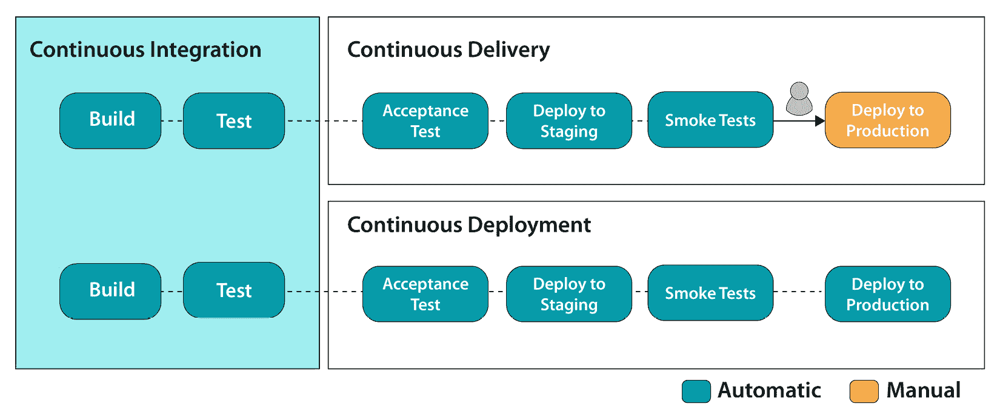

图 10.2 – 持续集成、持续交付和持续部署之间的关系

让我们稍微详细了解这些方法：

+   **持续集成**：在 MLOps 中，CI 不仅仅是测试和验证代码，还扩展到测试和验证数据、数据架构以及 ML 模型。这确保了一个更强大、更可靠的集成过程，专为 ML 需求量身定制。

+   **持续交付**：在 MLOps 中，CD 不仅仅是部署单一的软件包或服务，而是部署整个系统，通常包括 ML 训练管道和模型预测服务。

+   **持续部署**：与传统的 DevOps 类似，MLOps 中的 CD 更进一步，通过完全自动化发布过程，将新变化部署到生产环境中，而无需人工干预。

+   **持续训练**：这是机器学习系统独有的，CT 专注于自动化重训练和服务模型，确保模型随着时间的推移不断适应和改进。

在编写本书时，Databricks 正在开发一个名为 MLOps Stack 的新功能，它提供了一个模板，用于将复杂的 ML 项目结构化，以便与 Git 提供者进行 CI/CD 集成。

想要了解更多关于 MLOps Stack 的细节，建议访问*GitHub 上的 MLOps Stack* ([`github.com/databricks/mlops-stack`](https://github.com/databricks/mlops-stack))。

本章将不会涉及 MLOps Stack；相反，我们将介绍另一种基于迄今为止所学知识，在 Databricks 上构建 MLOps 管道的方法。

让我们深入探讨并理解 MLOps 的基本原理和各种部署模式。

# MLOps 基础与部署模式

为了有效管理 MLOps，首先必须熟悉其基础术语和结构。这包括理解与各种操作环境相关的角色和职责——即**开发**（**dev**）、预生产环境和**生产**（**prod**）。让我们从实际的 MLOps 框架中解析这些环境的含义。

在任何 ML 项目中，都有三个关键资产：

+   **代码库**：这作为项目的蓝图，包含与数据预处理、模型训练、评估和部署相关的所有源代码。

+   **数据**：这包括用于训练、验证和测试模型的数据集。数据的质量和可用性直接影响模型的效果。

+   **训练模型**：这是你 ML 工作流的最终成果，一个经过训练、评估并准备好进行推理的模型。

这些资产每个都经历不同的阶段——开发、测试和部署——通常这些阶段被分隔到不同的环境中：

+   **开发环境（dev）**：这是初始代码编写和测试的地方。通常在代码和数据方面最为便捷，但质量和测试要求最为宽松。

+   **预发布环境**：这是一个中间空间，用于在项目进入生产阶段之前进行额外的测试和质量保证。

+   **生产环境（prod）**：这是最具限制性的环境，最终版资源会部署在此。它有最高的质量和安全要求，且对直接交互的访问最为有限。下图提供了 MLOps 中关键资源的可视化表示，并展示了不同环境的组织结构。它展示了这些资源从开发、测试到最终生产的生命周期：

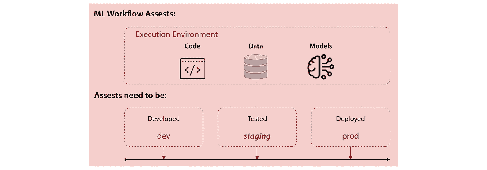

图 10.3 – 与机器学习项目及其环境相关的各种资源

注意

上述图由 Databricks 提供。

下图展示了这些环境中的可访问性级别和质量要求：

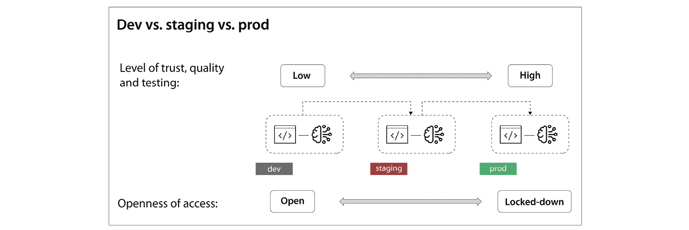

图 10.4 – 各种环境及其对可访问性的开放程度

注意

上述图由 Databricks 提供。

使用 Databricks，你可以灵活地以多种方式结构化这些开发、预发布和生产环境，以满足项目的特定需求。

需要注意的是，开发、预发布和生产环境的理论分离只是 MLOps 最佳实践的指南。然而，实际的实施可能会根据你的组织需求、工作流程和技术能力有显著差异。

在接下来的部分中，我们将深入探讨多种部署 Databricks 工作空间的方法，以便更好地将你的开发、预发布和生产环境与特定的组织需求对接。

下图展示了三种不同的部署模式，旨在有效地设置你的开发、质量保证和生产环境：

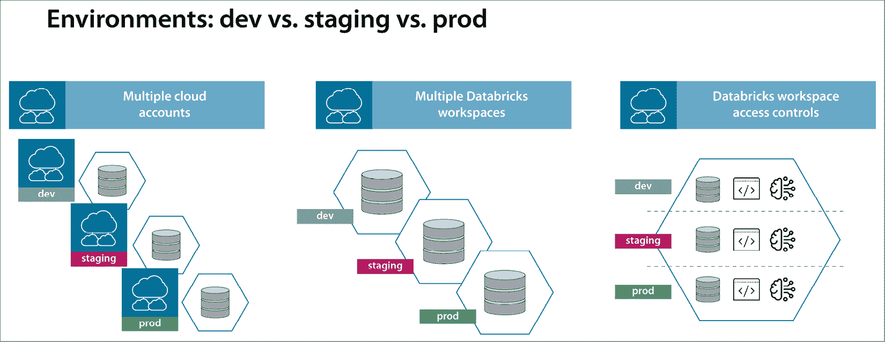

图 10.5 – 各种 Databricks 环境部署方式

注意

以下是前述图的来源：《*MLOps 大全*》。

让我们逐一了解这些模式。

## 在 Databricks 中导航环境隔离 – 多种 MLOps 策略

为了制定一个健壮的 MLOps 策略，你不仅需要考虑涉及的资源类型，还要考虑它们所在的环境——开发、预发布或生产。每个环境提供不同级别的可访问性、测试严格性和数据安全性，这些都受到组织规模、治理政策和安全要求的影响。

### 多个云账户

对于受严格规则和法规约束的大型组织，通常会将开发、预发布和生产环境分隔到不同的云账户中。在这种配置下，每个云账户将托管自己的 Databricks 工作区。该架构在云账户和网络级别上确保了隔离，但由于资源和数据存储的重复，可能会增加成本。

### 单一云账户与多个 Databricks 工作区

另外，较小的组织或项目可能会选择在一个云账户中包含多个 Databricks 工作区。每个工作区都部署在自己的网络中，并在该层级上实现隔离。虽然这种方式更具成本效益，但仍然能保证足够的隔离，并且能与组织的数据治理政策保持一致。

### 单一云账户与单一 Databricks 工作区

即便是在同一个云账户内，Databricks 也提供了严格隔离不同角色和项目的能力。像 RBAC、权限以及 Unity Catalog 等原生数据治理工具，使得在单一工作区内有效地进行访问隔离成为可能。

在探讨了多种组织 Databricks 开发、预发布和生产环境的方式后，是时候关注 MLOps 另一个关键方面：机器学习项目中生命周期的异步性。这与传统的软件 DevOps 有所不同，后者中的代码和应用更新通常是同步进行的。

以部署的**大型语言模型**（**LLM**）为例。这类模型的复杂性和规模使得重新训练成为一项艰巨的挑战。你可能会发现，尽管数据工程代码每月都会进行迭代，但模型本身的训练代码在长时间内保持静态。

另一方面，考虑一下一个 churn 预测模型。在这种情况下，可能会使用最新数据集每月安排自动重新训练。如果新训练的模型优于前一个模型，它会立即被迁移到生产环境中，而无需对现有代码库进行任何更改。

### 应对异步生命周期

鉴于机器学习模型和代码更新周期的不一致，采取管理这些异步性的方法变得至关重要。你可能会采用如金丝雀发布等技术以确保模型的安全发布，或选择蓝绿部署来确保更顺畅的回滚。自动化监控系统和警报机制同样重要，能够作为模型退化或操作问题的早期预警系统，从而实现快速修复。

### 财务和监管考虑事项

除了技术方面，MLOps 还涵盖了财务和合规变量。不能忽视成本考虑 – 包括数据存储和计算资源。此外，数据血统对于通过您的流水线跟踪数据移动至关重要，这不仅有助于调试，而且对于合规和审计目的至关重要。同样，数据版本控制在模型可重现性方面至关重要，尤其是对于频繁重新训练的模型而言。

通过这种微妙的理解，我们能更好地处理 ML 生命周期中异步更新带来的复杂性，特别是在 Databricks 或任何 MLOps 平台的背景下。

现在，让我们来看看你可以利用的各种 ML 部署范式。

# 理解 ML 部署模式

任何 ML 项目的最终目标是将我们的 ML 模型投入生产。根据我们正在服务的用例类型和我们的 ML 工程团队的复杂性，有两种广义的 ML 部署方法。

+   部署模型方法

+   部署代码方法

让我们逐个理解这些方法。

## 部署模型方法

模型部署工作流遵循结构化方法论，从开发环境开始，其中包括用于训练 ML 模型的代码的制定和完善。在模型经过训练并确定最佳版本之后，它将正式注册在专用模型注册表中。接着进行一系列集成测试以评估其性能和可靠性。成功通过这些评估后，模型首先升级到暂存环境进行进一步验证。一旦满足所有必要条件，它就会被部署到生产环境中。

以下图像展示了这种多阶段方法的图形化描述：

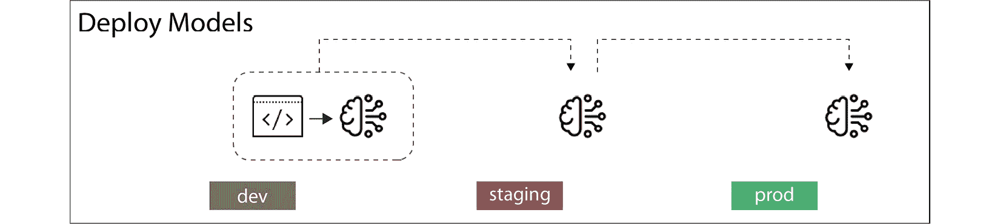

图 10.6 – 部署模型方法

注意

这是前述图像的来源：*MLOps 大书*。

在整本书中，迄今为止我们使用的所有笔记本都集中在这种特定的部署方法上。这是公司和团队特别是 ML 团队成员中，尤其是数据科学背景而非传统软件工程背景的人的流行选择。这种方法提供了简单性，并且是 ML 项目的一个很好的起点。

以下图像展示了部署模型方法的完整端到端 MLOps 生命周期：

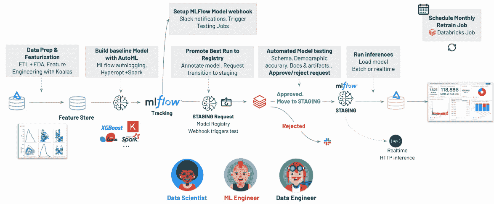

图 10.7 – 使用部署模型方法从开发到生产部署模型的参考架构和工作流程

注意

前述图像由 Databricks 提供。

在这个 MLOps 工作流程中，数据工程师、数据科学家和 ML 工程师协作完成各种步骤，确保 ML 模型的成功开发、部署和监控。以下是每个角色的责任和任务分解：

+   **数据工程师**：

    +   从各种来源收集数据，如数据库、云存储和传感器，确保数据的可靠性和质量。

    +   清洗和预处理数据，处理如删除重复数据、处理缺失值，并将数据转换为适合 ML 算法的格式。

    +   在数据仓库或 Delta Lake 中存储和管理数据，确保数据科学家和 ML 工程师可以高效利用和访问这些数据。

+   **数据科学家**：

    +   探索和分析数据，深入了解其特征，识别相关的模式和关系。

    +   生成并注册特征到特征表中以供重复使用。

    +   开发和训练 ML 模型，采用各种算法和技术实现准确的预测和期望的结果。所有的模型运行和实验会自动记录到 Databricks 上的 MLflow 跟踪服务器中。

    +   使用适当的度量标准和验证技术评估和评估训练模型的性能。

    +   根据性能和业务需求选择最合适的模型进行部署。最佳模型将被注册到模型注册表中，作为候选模型。

+   **ML 工程师**：

    +   将 ML 模型部署到生产环境中，使其能够实时进行预测或决策。

    +   监控已部署模型的性能，确保其正常运行，并检测任何异常或行为漂移。

    +   随着新数据的到来，更新和重新训练模型，保持模型的相关性和准确性。

本书中涵盖的所有笔记本都展示了这一工作流程。

现在我们已经了解了 MLOps 中模型部署方法的工作原理，接下来让我们看看部署代码的方法。

## 部署代码的方法

在部署代码的方法中，我们不仅对训练 ML 模型的代码进行版本控制，还对创建特征表的代码进行版本控制。当每个环境中对数据访问有严格规定时，这种方法非常有效。

数据科学家在开发环境中开发特征工程和模型训练的代码。在找到合适的候选模型后，开发分支代码被提交到暂存分支，在那里进行自动化单元测试。接着，我们在暂存环境中训练模型并进行性能基准测试。一旦一切正常，我们将代码推送到主分支和生产环境。在这里，我们再次在生产数据上重新训练模型：

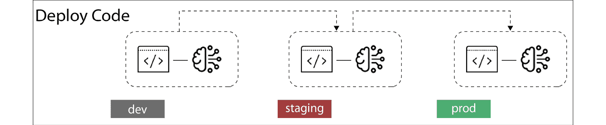

图 10.8 – 从开发到生产部署模型的参考架构和工作流，使用部署代码方法

注释

这是前面图表的来源：*《MLOps 大书》*。

开发过程涉及几个阶段，从开发环境中为训练模型和特征工程创建代码开始。以下图展示了开发环境中部署代码工作流的逐步过程：

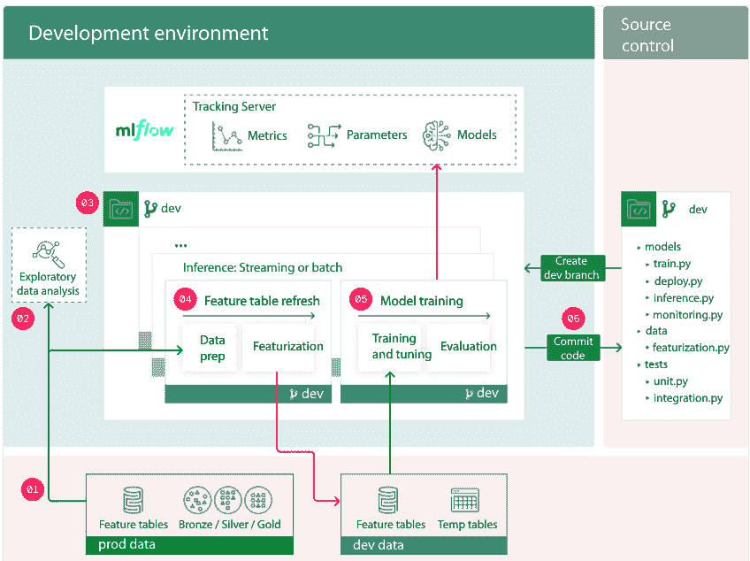

图 10.9 – 开发环境中的部署代码工作流

注释

由 Databricks 提供

让我们逐步了解这些步骤：

1.  **数据访问点**：在开发环境中，数据科学家通常对生产数据具有只读权限。出于合规性原因，访问可能仅限于这些数据的已清洗或复制版本。还可以为读写操作提供单独的开发存储，以便进行实验性工作。

1.  **初步数据调查**（**PDI**）：数据科学家使用迭代、交互式方法进行数据探索，利用笔记本、可视化图表和 Databricks SQL。此步骤通常是独立的过程，通常不属于可部署的管道的一部分。

1.  **源代码管理**：所有的机器学习系统代码都存储在版本控制库中。数据科学家在此 Git 库中的开发分支上工作。代码可以通过 Databricks Repos 与 Databricks 工作区进行同步。

1.  **增强特征数据集**：此管道从原始和现有特征表中摄取数据，并将其输出到特征库中的表。这一步包括两个主要任务：

    1.  **质量保证**：在此，数据会被验证以确保其符合质量标准。

    1.  **特征构建**：数据科学家编写或更新代码以生成新的特征。数据可能来自特征库或其他湖仓表。这些开发特征表用于构建实验模型，推广到生产后，它们会更新相应的生产表。

    如果特征管道由不同的团队管理，它们的管理可以是分开的。

1.  **模型训练管道**：数据科学家在只读生产数据或特定于开发的数据上构建模型训练管道。这些管道可能利用来自开发和生产环境的特征表：

    1.  **调优与训练**：训练过程从特征库和不同层次的湖仓表中获取数据，同时在 MLflow 跟踪系统中记录参数、度量和工件。

    1.  **模型存储**：在训练和调优完成后，模型存储在 MLflow 跟踪服务器上，记录其与输入数据和代码的关联。

    当在暂存或生产环境中执行时，模型可以被检索并注册以便进行持续管理和测试。

1.  **代码定稿**：一旦特征、训练和推理的管道开发工作完成，无论是数据科学家还是 ML 工程师都会将这些更改提交到版本控制系统中的开发分支。

接下来，让我们了解一下预发布环境中的工作流程。预发布环境作为 ML 代码进入生产环境之前的最终测试场地，涵盖了所有管道组件的全面测试，包括模型训练和特征工程。ML 工程师利用 CI 管道执行单元测试和集成测试。测试成功后，生成发布分支，触发 CI/CD 系统启动生产阶段。

下图为您提供了预发布环境工作流程的逐步可视化指南：

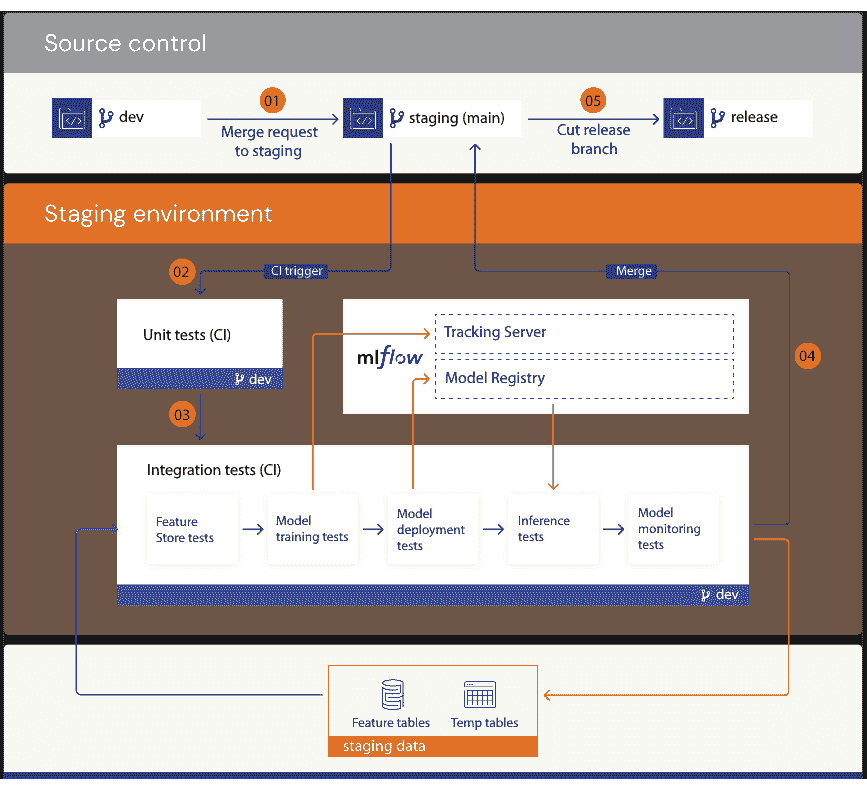

图 10.10 – 预发布环境中的部署代码工作流程

注意

感谢 Databricks 的提供

让我们详细了解每个步骤：

1.  **启动合并过程**：当 ML 工程师提交合并请求到源代码管理的预发布分支（通常是“main”分支）时，部署之旅开始。这一操作触发了 **CI** 工作流程。

1.  **执行单元测试**：在 CI 框架中，源代码会自动编译并启动单元测试。如果这些测试未通过，合并请求将被拒绝。请注意，单元测试与数据或外部服务相互独立。

1.  **进行集成测试**：在单元测试之后，CI 机制会执行集成测试。这些测试验证所有管道的兼容性和功能，包括特征工程、模型训练、推理和监控。预发布环境的设计尽可能接近生产环境。

    为了节省测试时间，可以在测试的彻底性与执行速度之间做出妥协。例如，可以使用较小的数据子集，或者减少训练周期。根据模型的预期应用，可能会在此阶段进行全面的负载测试。

    在预发布分支完成集成测试后，代码才有资格进行生产部署。

1.  **提交到预发布分支**：如果测试成功，代码会合并到预发布分支。如果测试失败，CI/CD 系统会通知相关人员，并将测试结果更新到合并（或拉取）请求中。

    可以定期安排集成测试，尤其是当预发布分支频繁收到多个贡献者的更新时。

1.  **建立发布分支**：当代码经过验证并准备好进行生产部署时，ML 工程师创建发布分支。此操作促使 CI/CD 系统刷新生产任务。

最后，让我们了解一下生产环境的工作流程。

在生产环境中，ML 工程师监督处理特征计算、模型训练与测试、预测发布和性能监控的 ML 管道的部署。一个再训练机制在生产数据上运行，以保持模型的更新和优化。性能基准经过严格评估，以确保新模型符合或超过设定的标准。在这个环境中，数据科学家通常没有写入和计算权限，但可以查看测试结果、日志、模型工件和管道状态，以帮助诊断生产中的问题。

以下图表提供了生产环境中工作流程的全面逐步可视化：

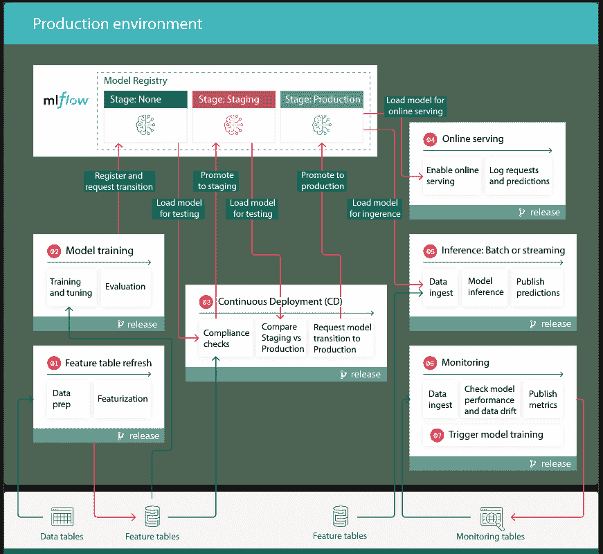

图 10.11 – 生产环境中部署代码的工作流程

注意

感谢 Databricks 提供支持

让我们一步一步地了解这个工作流程：

1.  **刷新特征数据**：此阶段涉及从生产环境摄取新数据并更新特征存储中的表格。此过程可以是批处理或实时处理，并且可以通过不同的触发器启动，例如定时任务或连续运行。

1.  **模型训练**：

    +   **调优和训练**：管道在完整数据上训练生产模型，并通过自动记录日志相关的度量和参数。与开发阶段不同，只有表现最佳的算法和超参数才会被考虑，以优化时间和性能。

    +   **模型评估**：模型质量通过与生产环境中的独立数据集进行测试。测试结果和自定义度量被记录。

    +   **模型注册**：在成功训练后，模型以“None”初始状态在模型注册表中注册。

1.  **自动化部署**：

    +   **合规性验证**：管道执行强制的合规性检查，可能包括复杂评估的人为审查。结果将被记录。

    +   **性能验证**：在预发布阶段的模型与生产环境中的模型进行比较，以避免性能退化。

    +   **过渡到生产环境**：模型在性能比较令人满意后，手动或自动地推进到生产阶段。

1.  **实时服务**：MLflow 使模型能够部署到低延迟的用例中。部署的模型获取特征并为每个传入的请求返回预测结果。

1.  **批量或流式推理**：对于更高的吞吐量或延迟要求，处理批量或流式推理。预测结果可以保存在各种存储选项中，包括消息队列，如 Apache Kafka。

1.  **持续监控**：

    +   **数据喂送**：从不同推理类型中摄取日志

    +   **性能和漂移度量**：计算各种质量和性能度量

    +   **度量报告**：度量结果被保存以供进一步分析和警报用途

1.  **重新训练触发器**：模型可以根据时间表自动重新训练，或者根据性能下降触发重新训练。

注意

自动化重新训练过程可能会很复杂，并可能需要手动干预来解决通过监控发现的问题，例如数据漂移或性能下降。

下图总结了在不同环境中执行部署代码方法的 ModelOps 中的各种步骤：

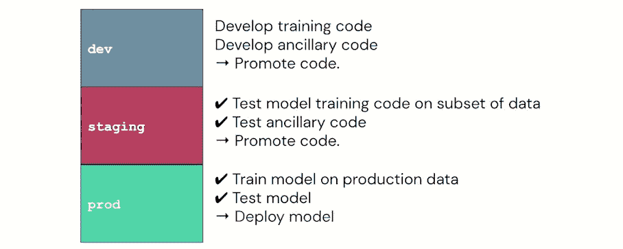

图 10.12 – 在不同环境中执行部署代码方法的 ModelOps 中的各种步骤

注意

上述图由 Databricks 提供。

总体而言，您有三个环境。在顶部，您有 Git 工作流提供者，负责管理代码从一个环境到另一个环境的过渡。在底部，您有数据访问层或跨不同环境的特征表的数据。

在这里需要记住的重要一点是，训练好的模型本身将在生产环境的模型注册表中有其自己的阶段。我们会在每个环境中重新训练模型，并基于更新后的代码填充相应的特征表。

注意

这种方法可能更适合那些具有传统软件工程背景并熟悉 DevOps 原则的个人。然而，在撰写本书时，尚无正式建立的方法来使用目前普遍可用的工具在 Databricks 平台上实施 MLOps 的部署代码方法。虽然我们在本节讨论了部署代码方法的概念，但我们不会将其作为提供的代码的一部分来覆盖。

一旦 MLOps Stack 普遍可用，将解决此模型部署范式。一旦新功能可用，我们将更新本书。

现在，让我们总结本章并总结我们的关键学习内容。

# 摘要

在本章中，我们介绍了 MLOps 的基础知识，Databricks 上的不同部署方法及其参考架构。

选择模型部署方法应基于团队在实施机器学习项目的 DevOps 流程方面的熟练程度。重要的是要认识到，我们讨论的每种方法都有其各自的优缺点，因此不存在通用解决方案。然而，在 Databricks 环境中可以创建定制的混合 ModelOps 架构。

通过考虑团队的优势和专业知识，您可以确定最适合您项目的部署方法。评估可扩展性、可维护性、部署便捷性以及与现有基础设施的集成是至关重要的。评估这些方面将帮助您做出明智的决策，并优化模型部署过程。

在 Databricks 中，你可以根据项目需求灵活定制你的 ModelOps 架构。利用 Databricks 的功能，你可以结合不同部署方法的最佳元素，创造出一个定制化且高效的工作流。这种混合方法让你能够在利用不同方法的优势的同时，减轻它们的局限性。

记住，最终目标是建立一个强大且简化的模型部署流程，使其与团队能力和项目需求保持一致。通过仔细考虑你的选择并利用 Databricks 环境中的资源，你可以创建一个最大化效率和生产力的 ModelOps 架构，以支持你的机器学习项目。

# 进一步阅读

请查阅以下来源及其链接，以了解更多关于本章涵盖的主题：

1.  *MLOps 大书*：[bit.ly/big-book-of-mlops](http://bit.ly/big-book-of-mlops)

1.  *MLOps 堆栈* 在 *GitHub*：[`github.com/databricks/mlops-stack`](https://github.com/databricks/mlops-stack)

1.  Damji, J. S., Wenig, B., Das, T., 和 Lee, D. (2020). *Learning Spark*（第二版）
