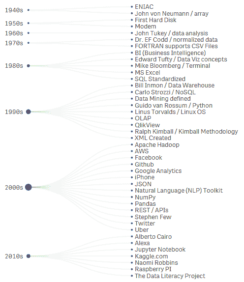
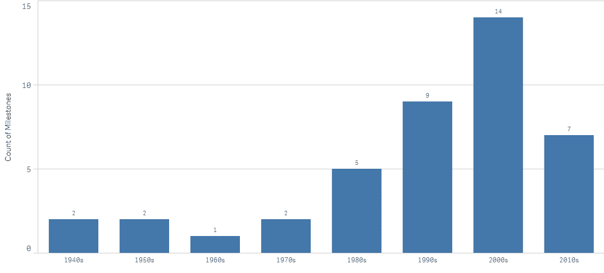
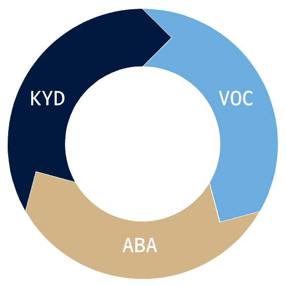
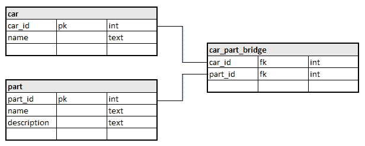
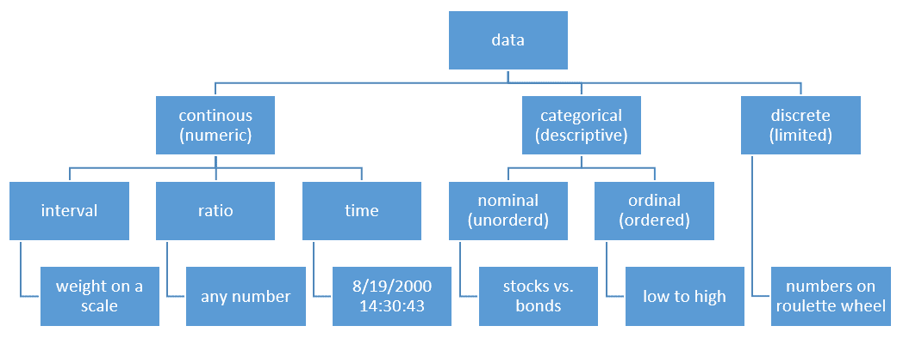
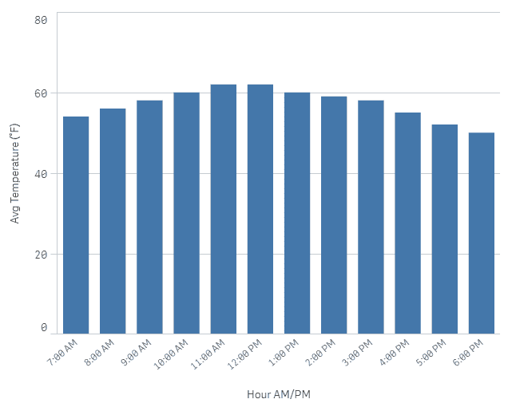

数据分析基础

欢迎并感谢您阅读我的书籍。我非常兴奋地分享我对数据的热情，并希望提供资源和见解，以加速您进入数据分析之旅。我的目标是教育、指导和辅导您，在本书中学习成为顶尖数据分析师的技术。在这个过程中，您将获得使用最新开源技术（如 Jupyter Notebook 和 Python）的实践经验。我们将保持在这一技术生态系统中，以避免混淆。然而，您可以确信所学的概念和技能可以跨开源和供应商解决方案迁移，重点关注所有数据相关的事物。

在本章中，我们将涵盖以下内容：

+   数据分析的发展及其重要性

+   什么使一个优秀的数据分析师？

+   理解数据类型及其重要性

+   数据分类和数据属性解释

+   理解数据素养

# 第三章：数据分析的发展及其重要性

首先，我们应该定义什么是数据。您会发现不同的定义，但我会将数据定义为事实、知识和信息的数字化持久存储，用于参考或分析。我的定义的重点应该是单词*persistence*，因为数字事实在创建它们的计算机关闭后仍然存在，并且可以用于未来的使用。而不是关注正式的定义，让我们讨论数据的世界以及它如何影响我们的日常生活。无论您是在阅读评论以决定购买哪种产品，还是在查看股票价格，消费信息已经变得更容易，以便您做出基于数据的明智决策。

数据已经与各行各业的产品和服务交织在一起，从农业到智能手机。例如，根据其年度报告，新泽西州的美国种植行农场到食物银行慈善机构，每年捐赠超过 150 万磅的新鲜农产品，以喂养该地区需要帮助的人们。美国种植行拥有数千名志愿者，并利用数据在收获季节最大化产量。

随着对成为数据*消费者*的需求增加，供应方也相应增加，这被定义为数据的*生产者*。随着技术创新的发展，数据生产的规模也在增加。我将在稍后详细讨论这一点，但大规模的消费和生产可以概括为大数据。美国国家标准与技术研究院的报告将大数据定义为包含<q>大量数据集</q><q>——主要在数量、速度和/或可变性方面</q><q>，需要可扩展的架构以实现高效的存储、操作和分析。</q>

大数据的爆炸性增长以**3V**为特征，即**数量**、**速度**和**多样性**，已成为数据专业人士广泛接受的概念：

+   **体积**是指存储在任何格式（如图像文件、电影和数据库事务）中的数据量，这些数据量以千兆字节、太字节甚至泽字节来衡量。为了提供背景，你可以在一个太字节的存储空间中存储数十万首歌曲或图片。甚至更令人惊讶的是，这些数据存储的成本。例如，根据他们的支持网站，Google Drive 提供高达 5 TB（太字节）的免费存储空间。

+   **速度**是指数据生成的速度。这个过程涵盖了数据的生产和消费方式。例如，批量处理是系统之间发送和接收数据块或文件包的方式。现代速度方法都是实时的，数据流处于持续运动的状态。

+   **多样性**是指数据可以存储的所有不同格式，包括文本、图像、数据库表和文件。这种多样性由于需要使用不同的技术和技术来处理数据，因此既带来了挑战，也带来了机遇。

理解 3V 对于数据分析非常重要，因为你必须成为数据的好消费者和生产者。简单的疑问，如你的数据是如何存储的、这个文件是什么时候产生的、数据库表在哪里，以及我应该以什么格式存储我的数据分析输出，都可以通过理解 3V 来解决。

对于是否应该将 3V 增加到包括**价值**、**可视化**和**真实性**，有一些争议——对此我并不认同。不用担心，我们将在本书中涵盖这些概念。

这引导我们得到了数据分析的正式定义，该定义被定义为“一个检查、清洗、转换和建模数据的过程，其目标是发现有用信息、得出结论并支持决策”，正如在《通过数据分析的商业智能综述》中所阐述的。

夏，B. S.，& Gong，P. (2015). 通过数据分析的商业智能综述. Benchmarking，21(2)，300-311. doi:10.1108/BIJ-08-2012-0050

我喜欢这个定义的地方在于它关注的是使用数据解决问题，而不是关注使用哪些技术。为了实现这一点，已经有一些重要的技术里程碑、新概念的引入以及打破障碍的人。

为了展示数据分析的发展历程，我整理了几张从 1945 年到 2018 年间的关键事件表，我认为这些事件最具影响力。以下表格包括了如 E.F. Codd 博士这样的创新者，他创造了数据库的概念，以及 iPhone 设备的推出，这催生了移动分析行业。

下面的图表是从多个来源收集的，并集中在一个地方作为表格的列和行，然后使用这个树状图进行可视化。我已在 GitHub 仓库中发布了 CSV 文件以供参考：[`github.com/PacktPublishing/python-data-analysis-beginners-guide`](https://github.com/PacktPublishing/python-data-analysis-beginners-guide)。将信息组织并统一数据在一个地方，使得数据可视化更容易制作，并允许进一步的分析：



收集、格式化和以这种可读格式存储数据的过程展示了成为**生产者**的第一步。为了使这些信息更容易消费，我在以下表格中按十年总结这些事件：*

| **十年** | **里程碑事件数量** |
| --- | --- |
| 1940 年代 | 2 |
| 1950 年代 | 2 |
| 1960 年代 | 1 |
| 1970 年代 | 2 |
| 1980 年代 | 5 |
| 1990 年代 | 9 |
| 2000 年代 | 14 |
| 2010 年代 | 7 |

从前面的总结表中，你可以看到大多数这些里程碑事件发生在 1990 年代和 2000 年代。这个分析有洞察力的是，最近的技术创新已经消除了个人与数据工作的进入障碍。在 1990 年代之前，硬件和软件的高购买成本将数据分析领域限制在相对有限的数量职业中。此外，分析所需基础数据的获取成本很高。通常需要高等教育和软件编程或精算学的专业职业。

以一种视觉方式查看这些相同的数据，可以是一个趋势条形图，如图中所示**。** 在这个例子中，条形的高度与前面表格中的信息相同，**里程碑事件的数量**位于左侧或**y**轴上。这种数据视觉表示的优点是，它为**消费者**提供了一个更快的方式，可以查看大多数事件发生的上升模式，而无需扫描前面图表或表格中找到的结果：



理解数据分析的演变过程很重要，因为现在你了解了一些为数据工作开辟机会和职业道路的先驱，以及关键的技术突破，这些突破显著减少了作为**消费者**和**生产者**做出数据决策的时间。

# 什么使一个好的数据分析师？

我现在将分解构成优秀数据分析师的因素。根据我的经验，优秀的数据分析师必须渴望学习，并在与数据工作的整个过程中不断提问。这些问题关注的焦点将根据消费结果的目标受众而变化。要成为数据分析领域的专家，需要出色的沟通技巧，以便你能够理解如何将原始数据转化为可以以积极方式影响变革的见解。为了更容易记住，使用以下缩写词来帮助你提高数据分析师技能。

## **了解你的数据 (KYD)**

了解你的数据就是理解用于创建数据的源技术，以及用于存储它的业务需求和规则。**提前进行研究**，了解业务是什么以及数据是如何被使用的。例如，如果你在与销售团队合作，了解是什么推动了他们团队的成功。他们有每日、每月还是每季度的销售配额？他们是否进行月末/季末报告，这些报告需要发送给高级管理层，并且必须准确，因为它对公司有财务影响？通过询问数据将如何被消费的问题来了解更多关于源数据的信息，将有助于你在需要交付结果时集中分析。

KYD 还涉及数据血缘，即理解数据最初是如何获取的，包括使用的技术以及在此之前、期间和之后发生的转换。参考 3Vs，以便你能够有效地传达关于数据的常见问题的答案，例如这些数据是从哪里来的，或者谁负责维护数据源。

## **客户之声 (VOC)**

VOC 的概念并不新鲜，多年来在大学里作为在销售、营销和许多其他业务运营中应用的知名概念而被教授。VOC 是通过在学习或倾听他们在使用公司产品或服务之前、期间和之后的需求来理解客户需求的概念。这个概念的相关性至今仍然重要，应该应用于你参与的每一个数据项目。这个过程是在你查看数据之前应该对数据分析结果的使用者进行访谈的地方。如果你与业务用户合作，通过写下他们试图回答的具体业务问题来倾听他们的需求。

与他们安排一个工作会议，在那里你可以进行对话。确保你关注他们的当前痛点，例如整理用于决策的所有数据所需的时间。每个月完成这个过程需要三天吗？如果你能提供一个自动化数据产品或仪表板，将时间缩短到几个鼠标点击，你的数据分析技能将使你的业务用户看起来像英雄。

在一次当地大学的科技讲座中，我被问到了 KYD 和 VOC 之间的区别。我解释说，两者都很重要，并且都专注于沟通和学习更多关于该领域或业务的知识。关键的区别在于准备与呈现。KYD 完全是关于在谈话专家之前提前做作业以做好准备。VOC 完全是关于倾听业务或消费者对数据的需要。

## **始终保持敏捷（ABA**）

敏捷方法已成为行业在应用、网页和移动开发**软件开发生命周期（SDLC**）中的常见做法。使敏捷项目管理过程成功的一个原因是它通过使用数据和可用功能，在业务和技术团队之间建立了一个交互式的沟通渠道，以迭代地交付业务价值。

敏捷过程包括创建具有共同主题的*故事*，开发团队在 2-3 周的*冲刺*中完成任务。在这个过程中，理解每个故事中的*什么*和*为什么*很重要，包括业务价值/你试图解决的问题。

敏捷方法中有*仪式*，开发者和业务赞助者聚集在一起来捕捉需求，然后交付*增量价值*。这种价值提升可能从可访问的新数据集到应用中添加的新功能等任何事物。

请参阅以下图表，以获得这些概念的直观表示。注意，这些概念不是线性的，并且应该需要多次迭代，这有助于在数据分析前、中、后所有参与人员之间改善沟通：



最后，我认为一个好的数据分析师最重要的特质是对与数据工作的热情。如果你的热情可以通过不断学习所有关于数据的知识来激发，那么它将变成一段终身且充实的人生旅程。

# 理解数据类型及其重要性

正如我们通过**3Vs**所发现的，数据以各种形状和大小存在，因此让我们分解一些关键数据类型，更好地理解它们为什么重要。首先，让我们从总体上把数据分为*非结构化*、*半结构化*和*结构化*。

## **非结构化数据**

**非结构化数据**的概念，其本质是文本，自 1990 年代以来一直存在，包括以下示例：电子邮件消息正文、推文、书籍、健康记录和图像。非结构化数据的一个简单例子是作为 **自由文本** 分类电子邮件消息正文。*自由文本* 可能有一些人类可以识别的明显结构，例如用于分隔段落的空白空间、日期和电话号码，但让计算机识别这些元素则需要编程来将任何数据元素分类为这种类型。使自由文本对数据分析具有挑战性的是其不一致性，尤其是在尝试处理多个示例时。

当处理非结构化数据时，由于自由文本的性质，包括拼写错误、日期的不同分类等，将存在不一致性。始终对用于整理数据的流程或代码进行同行评审。

## **半结构化数据**

接下来，我们有半结构化数据，它与非结构化数据类似，但关键区别是增加了 *标签*，这些标签是用于创建自然层次的关键词或任何分类。半结构化数据的例子包括 XML 和 JSON 文件，如下面的代码所示：

```py
{
  "First_Name": "John",
  "Last_Name": "Doe",
  "Age": 42,
  "Home_Address": {
    "Address_1": "123 Main Street",
    "Address_2": [],
    "City": "New York",
    "State": "NY",
    "Zip_Code": "10021"
  },
  "Phone_Number": [
    {
      "Type": "cell",
      "Number": "212-555-1212"
    },
    {
      "Type": "home",
      "Number": "212 555-4567"
    }
  ],
  "Children": [],
  "Spouse": "yes"
}
```

这种以 JSON 格式编写的代码允许存在自由文本元素，例如街道地址、电话号码和年龄，但现在已创建了用于识别这些字段和值的 *标签*，这是一个称为 **键值对** 的概念。这种键值对概念允许对具有分析结构的数据进行分类，例如过滤，但仍然具有足够的灵活性，可以根据需要更改元素以支持非结构化/自由文本。半结构化数据最大的优势是改变数据存储的底层架构的灵活性。架构是传统数据库系统的基础概念，它定义了数据必须如何持久化（即存储在磁盘上）。

半结构化数据的缺点是，您可能仍然会发现数据值的不一致性，这取决于数据是如何被捕获的。理想情况下，一致性的负担转移到 **用户界面**（**UI**），这将具有编码标准和业务规则，如必填字段，以提高质量，但作为一个实践 KYD 的数据分析师，您应该在项目中进行验证。

## **结构化数据**

最后，我们有 **结构化** 数据，这是数据库中最常见的类型，也是从应用程序（应用程序或软件）和代码中创建的数据。结构化数据最大的好处是每个记录之间的一致性和相对较高的质量，尤其是在同一数据库表中存储时。数据和结构的一致性是分析的基础，这使得结构化数据的产生者和消费者可以得出相同的结果。数据库或 **数据库管理系统** （**DBMS**）和 **关系数据库管理系统** （**RDMS**）的主题非常广泛，这里不会涉及，但了解一些相关知识将有助于你成为一名更好的数据分析师。

以下图是数据库中可能找到的三个表的基本 **实体-关系** （**ER**）图：



在这个例子中，每个 **实体** 都将代表数据库中存储的物理表，命名为 `car`、`part` 和 `car_part_bridge`。汽车和零件之间的关系由名为 `car_part_bridge` 的表定义，可以被称为多个名称，例如 `bridge`、`junction`、`mapping` 或 `link` 表。表中每个字段的名称将在左侧，例如 `part_id`、`name` 或 `description`，这些在 `part` 表中可以找到。

`car_id` 和 `part_id` 字段名称旁边的 `pk` 标签有助于识别每个表的唯一键。这允许一个字段唯一地标识表中找到的每个记录。如果一个表中的 **主键** 在另一个表中存在，它将被称为 **外键**，这是定义表之间关系并最终将它们连接在一起的基础。

最后，在字段名称旁边右侧对齐的文本是每个字段的类型。我们将在下一节中介绍这个概念，你现在应该对识别和分类数据的概念感到舒适。

## 常见的数据类型

数据类型是编程语言中一个众所周知的概念，并且在许多不同的技术中都可以找到。我将定义简化为，存储数据的详细信息及其预期用途。数据类型还会在数据存储在磁盘或内存时为每个数据值创建一致性。

数据类型将根据用于创建结构的软件和/或数据库而有所不同。因此，我们不会涵盖所有不同编码语言中的所有不同类型，但让我们通过几个例子来了解一下：

| **常见数据类型** | **常见简称** | **示例值** | **示例用法** |
| --- | --- | --- | --- |
| 整数 | `int` | `1235` | 计数发生次数、求和值或值的平均值，例如总和（点击次数） |
| 布尔值 | `bit` | `TRUE` | 条件测试，例如 if 销售额 > 1,000, *true* 否则 *false* |
| 地理空间 | `float` 或 `spatial` | `40.229290`, `-74.936707` | 基于经纬度的地理分析 |
| 字符串/文本 | `char` | `A` | 标签、分类或数据分组 |
| 浮点数 | `float` 或 `double` | `2.1234` | 销售额、成本分析或股价分析 |
| 字母数字字符串 | `blob` 或 `varchar` | `United States` | 标签、分类、编码或数据分组 |
| 时间 | `time`、`timestamp`、`date` | `8/19/2000` | 时间序列分析或年度比较 |

技术在不断变化，遗留系统将提供机会看到可能不常见的数据类型。处理新数据类型时，最好的建议是验证由**SME**（**主题专家**）或系统管理员创建的源系统，或者要求提供包含用于持久化数据的活动版本的文档。

在前面的表格中，我创建了一些常见数据类型的总结。理解数据类型之间的差异，以便确定可以对每个数据值执行哪种类型的分析，这是非常重要的。数值数据类型，如整数（`int`）、浮点数（`float`）或`double`，用于计算值，如销售额总和、苹果数量或股票的平均价格。理想情况下，记录的源系统应强制执行数据类型，但可能会有例外。

随着你数据分析技能的提升，帮助解决数据类型问题或提出改进建议，将使整个组织的报告质量和准确性得到提高。

在前面表格中定义为字符（`char`）和字母数字字符串（`varchar` 或 `blob`）的字符串数据类型可以表示为文本，如单词或完整的句子。`时间`是一个特殊的数据类型，可以用多种方式表示和存储，例如`12 PM EST`或日期`08/19/2000`。考虑地理坐标，如纬度和经度，这些坐标可以根据源系统以多种数据类型存储。

本章的目标是向您介绍数据类型的概念，未来的章节将直接提供实际操作经验。数据类型之所以重要，是因为它们可以避免在展示分析事实和见解时出现不完整或不准确的信息。无效或不一致的数据类型也会限制创建准确图表或数据可视化的能力。最后，良好的数据分析是建立对结论完整性的信心和信任，这些结论由支持您分析的定义良好的数据类型所支持。

# 数据分类和数据属性解释

现在我们对数据类型及其重要性有了更多的了解，让我们来分析不同的数据分类和不同的数据属性类型。首先，让我们通过以下总结图来总结所有可能的组合：



在前面的图中，直接位于**数据**下面的方框有三种分类数据的方法，即**连续**、**分类**或**离散**。

连续数据是可以测量的，使用数值数据类型进行量化，并且具有连续的范围和无限的可能性。此图中的底部方框是示例，以便您可以轻松找到它们进行参考。连续数据的示例包括股票价格、磅重和时间。

分类（描述性）数据将具有作为“字符串”数据类型的值。分类数据是“有资格的”，因此它将描述某个特定的事物，如人、地点或事物。一些例子包括原产国、一年中的月份、不同类型的树木，以及您的家庭称谓。

虽然数据被定义为分类数据，但不要假设所有值都相同或一致。月份可以存储为“1，2，3；Jan，Feb，Mar；或 January，February，March”，或者任何组合。您将在第七章“探索数据清洗、精炼和融合数据集”中了解更多关于如何清理和规范您的数据以进行一致分析的内容。第七章链接。

一个“离散”数据类型可以是连续的或分类的，这取决于它是如何用于分析的。例如，包括公司中的员工数量。您必须有一个整数/整个数字来表示每个员工的计数，因为您永远不能有部分结果，例如半个员工。由于其数值属性，离散数据在本质上具有连续性，但也具有使其类似于分类的限制。另一个例子是轮盘赌盘上的数字。轮盘上有从`1`到`36`，`0`，或`00`的整数限制，玩家可以下注，而且根据值，这些数字可以分类为红色、黑色或绿色。

如果只有两个离散值存在，例如“是/否”或“真/假”或“1/0”，它也可以被归类为二进制。

## **数据属性**

现在我们已经了解了如何分类数据，让我们分解可用的属性类型，以便更好地了解您如何使用它们进行分析。分解类型的最简单方法是先从您计划如何使用数据值进行分析开始：

+   **名义数据**是指可以区分不同值但不必一定对它们进行排序的数据。它本质上是定性的，因此可以将名义数据视为标签或名称，如“股票”或“债券”，因为它们是字符串值，不能在上面进行数学运算。使用名义值，没有额外信息，您无法确定“股票”或“债券”哪个更好或更差。

+   **有序数据**是有序数据，其中存在排名，但值之间的距离或范围无法定义。有序数据使用标签或名称进行定性，但现在值将具有自然或定义的序列。与名义数据类似，有序数据可以计数但不能用所有统计方法进行计算。

一个例子是将`1`赋值为低，`2`赋值为中，`3`赋值为高。这有一个自然的顺序，但低和高之间的差异不能单独量化。分配给*低*和*高*值的数据可能是任意的，或者背后有额外的业务规则。

另一个常见的有序数据例子是自然层次结构，如州、县和市，或者祖父、父亲和儿子。这些值之间的关系定义良好，通常无需额外信息即可理解。因此，儿子会有父亲，但父亲不能是儿子。

+   **间隔数据**类似于有序数据，但数据点之间的距离是均匀的。磅秤上的重量是一个很好的例子，因为从`5`到`10`、`10`到`15`和`20`到`25`的值之间的差异都是相同的。注意，并非所有算术运算都可以在间隔数据上执行，因此理解数据的上下文以及如何使用它变得很重要。

温度是一个很好的例子来展示这个范式。你可以记录每小时的数据值，甚至提供每日的平均值，但按日或周汇总数据并不会为分析提供准确的信息。参见以下图表，它提供了一个特定日期的小时温度。注意*x*轴将小时分开，而*y*轴提供平均值，标记为**平均温度**，单位为华氏度。每个小时之间的值必须是平均值或均值，因为温度的累积会提供误导性的结果和错误的分析：



+   **比率数据**允许进行所有算术运算，包括求和、平均、中位数、众数、乘法和除法。前面讨论的`integer`和`float`数据类型被归类为比率数据属性，这些属性反过来也是数值/定量的。此外，`time`也可以被归类为比率数据，然而，我决定进一步细分这个属性，因为它在数据分析中经常被使用。

注意，关于比率数据属性的高级统计细节，本书没有涉及，例如具有绝对或真实零点，所以我鼓励你更多地了解这个主题。

+   **时间数据**属性是一个丰富的主题，你在数据分析之旅中会经常遇到。时间数据包括日期和时间或任何组合，例如，时间为`HH:MM AM/PM`，如`12:03 AM`；年份为`YYYY`，如`1980`；时间戳表示为`YYYY-MM-DD hh:mm:ss`，如`2000-08-19 14:32:22`；或者甚至日期为`MM/DD/YY`，如`08/19/00`。处理时间数据时，重要的是要识别每个值之间的间隔，这样你才能准确测量它们之间的差异。

在许多数据分析项目中，你可能会发现时间数据值序列中的空白。例如，你得到一个数据集，其范围在`08/01/2019`到`08/31/2019`之间，但只有 25 个不同的日期值，而不是 30 天的数据。这种发生的原因有很多，包括系统故障导致日志数据丢失。如何处理这些数据空白将取决于你必须执行的分析类型，包括填补缺失结果的需要。我们将在第七章，*探索清理、精炼和合并数据集*中介绍一些示例。

# 理解数据素养

**数据素养**被拉胡尔·巴加瓦和凯瑟琳·迪加尼亚定义为*阅读、处理、分析和用数据辩论的能力*。在本章中，我指出了数据以各种形状和大小出现的情况，因此创建一个在不同受众之间关于数据沟通的共同框架成为一项重要的技能要掌握。

数据素养成为两个或更多不同技能或经验的人之间回答数据问题的共同分母。例如，如果一个销售经理想要验证季度报告中图表背后的数据，让他们精通数据语言将节省时间。通过直接询问与工程团队相关的*数据类型*和*数据属性*，而不是毫无目的地寻找这些细节，可以节省时间。

让我们分解数据素养的概念，以帮助识别它如何应用于你的个人和职业生活。

## **阅读数据**

阅读数据意味着什么？阅读数据是消费信息，这些信息可以是任何格式，包括图表、表格、代码或电子邮件正文。

阅读数据不一定能提供消费者所有问题的答案。拥有领域专业知识可能需要理解数据集是如何、何时以及为什么被创建的，以便消费者能够完全解释底层数据集。

例如，你是一名数据分析师，你的同事通过电子邮件发送了一个带有“仅供参考”主题行且正文没有其他信息的文件附件。我们现在从*什么是一个好的数据分析师？*这一部分知道，我们应该开始询问关于文件附件的问题：

+   创建文件使用了哪些方法（人工还是机器）？

+   使用了哪些系统和工作流程来创建文件？

+   谁创建了文件以及它是何时创建的？

+   这个文件多久刷新一次，是手动还是自动？

提出这些问题有助于你理解*数据血缘*的概念，这可以识别数据集是如何创建的过程。这将确保阅读数据将导致理解所有方面，从而自信地做出决策。

## **与数据工作**

我将**与数据工作**定义为创建数据集的人或系统，使用任何技术。用于创建数据的技术种类繁多，可能简单到有人只是在电子表格中输入行和列，也可能是一个软件开发者使用 Python 代码中的循环和函数来创建一个以管道分隔的文件。

由于编写数据因专业知识和工作职能而异，从数据素养的角度来看，一个关键的经验教训是数据的生产者应该意识到数据将被如何使用。理想情况下，生产者应该记录数据创建的细节，包括创建的时间、地点以及刷新的频率。发布这些信息将使元数据（关于数据的资料）民主化，以改善任何阅读和操作数据的人之间的沟通。

例如，如果你的数据集中有一个时间戳字段，它是使用**UTC**（**协调世界时**）还是**EST**（**东部标准时间**）？通过包括假设和原因，说明数据为什么以特定格式存储，与数据一起工作的人或团队能够通过改善分析沟通成为良好的数据公民。

## **数据分析**

分析数据始于建模和结构化以回答业务问题。数据建模是一个广泛的话题，但为了数据素养的目的，它可以简化为**维度**和**度量**。维度是独特的名词，如人、地点或事物，而度量是基于动作的动词，然后进行聚合（总和、计数、最小值、最大值和平均值）。

构建任何数据可视化和图表的基础在于数据建模，而大多数现代技术解决方案都内置了这一功能，所以你可能已经在不知不觉中建模了数据。

一个快速解决方案来帮助确定数据应该如何用于分析，可能就是一个**数据字典**，它被定义为**一个关于数据的集中式信息库，如意义、与其他数据的关系、来源、用途和格式**。

你可能在源系统的帮助页面或 GitHub 仓库中找到一个数据字典。如果你没有从文件创建者那里收到一个，你可以自己创建一个，并使用它来询问关于数据的问题，包括假设的数据类型、数据质量和识别数据缺口。

创建数据字典还有助于验证假设，并在与他人沟通数据时提出关于数据的问题。创建**数据字典**的最简单方法是将源数据的前几行转置，这样行就变成了列。如果你的数据有标题行，那么第一行就变成了所有可用字段的列表。让我们通过一个例子来了解一下如何从数据中创建自己的数据字典。这里，我们有一个表示**产品**和**客户**按季度销售的**销售**源表：

| **产品** | **客户** | **第一季度** | **第二季度** | **第三季度** | **第四季度** |
| --- | --- | --- | --- | --- | --- |
| 产品 1 | 客户 A | $          1,000.00 | $          2,000.00 | $          6,000.00 |  |
| 产品 1 | 客户 B |  | $          1,000.00 | $              500.00 |  |
| 产品 2 | 客户 A |  | $          1,000.00 |  |  |
| 产品 2 | 客户 C | $          2,000.00 | $          2,500.00 | $          5,000.00 |  |
| 产品 3 | 客户 A |  | $          1,000.00 | $          2,000.00 |  |
| 产品 4 | 客户 B |  | $          1,000.00 | $          3,000.00 |  |
| 产品 5 | 客户 A |  |  |  | $          1,000.00 |

在以下表中，我已经将先前的源表转置，以创建一个新的用于分析的表，这创建了一个初始的数据字典。左侧的第一列变成了源表中所有可用字段的列表。正如您从字段中可以看到的，表头行的**记录 1**到**记录 3**现在变成了数据样本行，但保留了源表中每行的完整性。以下表右侧的最后两列，标记为**估计数据类型**和**维度或度量**，被添加以帮助定义此数据在分析中的用途。理解数据类型并将每个字段分类为维度或度量将有助于确定我们可以执行哪种类型的分析以及每个字段如何在数据可视化中使用：

| **字段名称** | **记录 1** | **记录 2** | **记录 3** | **估计数据类型** | **维度或度量** |
| --- | --- | --- | --- | --- | --- |
| 产品 | 产品 1 | 产品 1  | 产品 2  | `varchar` | 维度 |
| 客户 | 客户 A | 客户 B | 客户 A | `varchar` | 维度 |
| 第一季度 | $   1,000.00 |  |  | `float` | 度量 |
| 第二季度 | $   2,000.00 | $      1,000.00 | $       1,000.00 | `float` | 度量 |
| 第三季度 | $   6,000.00 | $          500.00 |  | `float` | 度量 |
| 第四季度 |  |  |  | `float` | 度量 |

使用这种技术可以帮助您就数据提出以下问题，以确保您理解结果：

+   这个数据集代表哪一年，或者它是多年度数据的累积？

+   每个季度代表的是日历年还是财政年？

+   产品 5 是否是在第四季度首次推出，因为该产品在第一季度到第三季度期间没有任何客户销售记录？

## **关于数据的争论**

最后，让我们谈谈为什么以及我们应该如何就数据展开争论。挑战和捍卫图表或数据表中的数字有助于建立可信度，实际上在许多情况下是在幕后进行的。例如，大多数数据工程团队会在数据摄入期间进行各种检查和平衡，例如警报，以避免信息丢失。额外的检查还包括检查日志文件中的异常或数据处理的错误规则。

从消费者的角度来看，<q>信任并验证</q>是一个好的方法。例如，当查看一篇可信新闻文章中发布的图表时，你可以假设故事背后的数据是准确的，但你应该也验证源数据的准确性。首先应该问的问题是：底层的图表是否包含了指向公开可用的数据集的来源？[fivethirtyeight.com](http://www.fivethirtyeight.com)网站在提供访问原始数据和创建新闻故事中分析图表所使用的方法细节方面做得非常好。将底层数据集和收集数据的过程公之于众，可以开启关于数据背后的如何、什么和为什么的对话，并且是反驳错误信息的好方法。

作为数据分析师和数据输出创建者，能够捍卫你的工作应该受到欢迎。拥有诸如数据字典和 GitHub 仓库之类的文档，以及记录生产数据所使用的方法，将建立与观众的信任，并减少他们做出数据驱动决策的时间。

希望你现在看到了数据素养的重要性以及它如何被用来改善消费者和生产者之间数据交流的各个方面。任何语言，练习都会带来进步，所以我邀请你探索一些有用的免费数据集来提高你的数据素养。

这里有一些开始的方法：

+   **Kaggle**:[`www.kaggle.com/datasets`](https://www.kaggle.com/datasets)

+   **五三八**:[`data.fivethirtyeight.com/`](https://data.fivethirtyeight.com/)

+   **世界银行**:[`data.worldbank.org/`](https://data.worldbank.org/)

让我们从*Kaggle*网站开始，该网站是为了帮助公司举办数据科学竞赛而创建的，以使用数据解决复杂问题。通过探索这些数据集并回顾本章学到的概念，如识别每个字段的**数据类型**和确认存在**数据字典**，来提高你的阅读和与数据打交道的技能。

接下来是来自*五三八*的支持数据，这是一个提供从体育到政治等分析内容的数据新闻网站。我喜欢他们的过程是因为他们提供了透明度，通过公开 GitHub 链接到他们的源数据和关于数据背后方法论的讨论。

另一个重要的数据开源是*世界银行*，它提供了丰富的选项，用于在全球范围内消费或生产数据，以帮助通过数据改善生活。大多数数据集都受**创意共享许可**的约束，它规定了数据的使用方式和时间，但使它们免费可用则打开了将公共和私人数据结合起来的机会，并节省了大量的时间。

# **摘要**

在我们继续前进之前，让我们回顾一下本章所学的内容以及获得的技术技能。首先，我们简要回顾了数据分析的历史以及数据的科技演变，通过向使使用现代工具和技术处理数据成为可能的人和里程碑事件致敬。我们通过一个数据可视化趋势图表的例子展示了最近的技术创新如何改变数据行业。

我们从消费者和生产者的角度讨论了为什么数据变得重要，通过讨论使用结构化、半结构化和非结构化示例来识别和分类数据的概念，以及大数据的**3V**：**体积**、**速度**和**多样性**。

我们使用 KYD、VOC 和 ABA 技术回答了“什么使一个好的数据分析师”的问题。

然后，我们通过探讨数字（整数和浮点数）与字符串（文本、时间、日期和坐标）之间的区别，更深入地理解了*数据类型*。这包括分解数据分类（连续、分类和离散）以及理解数据属性类型。

我们通过介绍**数据素养**的概念及其通过改善他们之间的沟通对数据消费者和生产者的重要性来结束本章。

在下一章中，我们将通过安装和设置数据分析环境来获得更多实践经验，并开始应用关于数据的所学概念。

# **进一步阅读**

以下是一些您可以参考的链接，以获取更多关于以下主题的信息：

+   美国种植行：[`www.americasgrowarow.org/wp-content/uploads/2019/09/AGAR-2018-Annual-Report.pdf`](https://www.americasgrowarow.org/wp-content/uploads/2019/09/AGAR-2018-Annual-Report.pdf)

+   NIST 大数据互操作性框架：[`bigdatawg.nist.gov/_uploadfiles/NIST.SP.1500-1.pdf`](https://bigdatawg.nist.gov/_uploadfiles/NIST.SP.1500-1.pdf)

+   Google Drive 常见问题解答：[`support.google.com/drive/answer/37603?hl=en`](https://support.google.com/drive/answer/37603?hl=en)

+   Python 数据分析入门指南 GitHub 仓库：[`github.com/mwintjen/Python_Data_Analysis_Beginners_Guide`](https://github.com/PacktPublishing/python-data-analysis-beginners-guide)

+   Ralph Kimball 博士在其著作《数据仓库工具包》中的*维度建模技术*：[`www.kimballgroup.com/data-warehouse-business-intelligence-resources/kimball-techniques/dimensional-modeling-techniques/`](https://www.kimballgroup.com/data-warehouse-business-intelligence-resources/kimball-techniques/dimensional-modeling-techniques/)

+   IBM 计算机词典：[`portal.acm.org/citation.cfm?id=541721`](http://portal.acm.org/citation.cfm?id=541721)

+   Kaggle 数据集：[`www.kaggle.com/datasets`](https://www.kaggle.com/datasets)

+   五三八数据集：[`data.fivethirtyeight.com/`](https://data.fivethirtyeight.com/)

+   世界银行数据来源：[`data.worldbank.org/`](https://data.worldbank.org/)

+   创意共享许可信息：[`creativecommons.org/`](https://creativecommons.org/)

+   数据素养项目网站：[`thedataliteracyproject.org/`](https://thedataliteracyproject.org/)
