理解连接、关系和聚合

我对这一章非常兴奋，因为我们将要学习关于合并多个数据集基础的知识。这个概念已经存在了几十年，使用 SQL 和其他技术，包括 R、pandas、Excel、Cognos 和 Qlikview。

合并数据的能力是一项强大的技能，它适用于不同的技术，并帮助你回答复杂的问题，例如产品销售如何受到天气预报的影响。数据源是互斥的，但今天，通过基于地理位置和时间的一些连接，可以轻松地将天气数据添加到你的数据模型中。我们将介绍如何做到这一点，以及不同类型的连接。一旦接触到这个概念，你将了解根据数据的粒度可以回答哪些问题。在我们的天气和销售数据示例中，细节变得非常重要，以便了解可以进行的分析水平。如果你想知道雨是否会影响销售，那么在合并数据后，你必须确保日期、星期和时间的更常见字段以及经纬度这样的地理位置标签在两个数据源中都可用，以便在得出结论后保持准确性。

在本章中，我们将学习如何构建高质量的数据集以进行进一步分析。我们将通过学习如何处理连接关系以及如何创建用于分析的数据聚合来进一步提高你的动手数据素养技能。

在本章中，我们将涵盖以下主题：

+   连接关系的基础

+   连接类型的应用

+   解释数据聚合

+   概述统计和异常值

# 第十一章：技术要求

这是本书的 GitHub 仓库链接：[`github.com/PacktPublishing/Practical-Data-Analysis-using-Jupyter-Notebook/tree/master/Chapter08`](https://github.com/PacktPublishing/Practical-Data-Analysis-using-Jupyter-Notebook/tree/master/Chapter08)。

你可以从以下链接下载和安装所需的软件：[`www.anaconda.com/products/individual`](https://www.anaconda.com/products/individual)。

# 连接关系的基础

对于熟悉 SQL 的人来说，将数据合并在一起的概念已经非常清楚。将一个或多个表合并在一起进行数据分析的能力在我的 20 多年数据工作生涯中一直保持相关性，并且我希望它将继续保持相关性。

在前面的章节中，我们介绍了数据模型的概念以及定义关系时需要主键和外键字段的需求。现在，我们将通过解释连接以及 SQL 和 DataFrames 中存在的不同类型的连接来详细阐述这些概念。

在 SQL 中，连接简单地意味着将两个或多个表合并成一个单一的数据集。这个单一数据集的大小和形状将取决于所使用的连接类型。当你创建数据集之间的连接时，你想要记住的一些关键概念是应该始终使用**公共唯一键**。理想情况下，键字段同时作为主键和外键，但可以使用多个字段来定义所有数据行的唯一记录。

在本节中，我们将介绍以下类型的连接关系：

+   一对一

+   多对多

+   左连接

+   右连接

+   内连接

+   外连接

在我们的示例中，pandas DataFrame 的索引是默认的或单个定义的字段，因为它们具有唯一的值，但这并不总是如此。

## 一对一关系

**一对一**关系意味着源数据按行具有共同的唯一值，且不存在重复。在 Excel 中，具有启用精确匹配参数的`vlookup`函数具有类似的功能。当你使用这个 Excel 函数时，任何与源标识符匹配的都会返回一个与目标查找不同的值。在 SQL 中，一对一关系确保两个表之间的完整性保持一致。需要这些类型关系的原因有很多，但一个好的例子是将具有销售区域的参考表与唯一的`客户`表连接起来。在这个例子中，客户标识符（`ID`）字段将存在于两个表中，并且你永远不会在没有客户记录的情况下有销售区域，反之亦然。

## 多对一关系

**多对一关系**意味着其中一个源可以具有重复的行，但不是两个源都可以。你仍然需要在源之间有一个唯一键、索引或标识符。一个例子是将我们已在第七章，*探索数据集的清理、精炼和混合*中讨论过的查找维度表与事实表连接起来。

一个事务事实表将会有重复的记录，因为用户访问网站或产品销售的事件会按日期/时间记录，每个事件都会生成。结果将在`userid`字段中产生数百万行具有重复记录的行。当连接使用事实表和第二表之间的公共字段，如`userid`时，第二表中的每一行都必须是唯一的。这个第二表将包含关于`userid`的附加属性，例如`城市`、`州`和`邮编`，这将提供更丰富的分析选项。一旦你理解了两个源表之间存在这种类型的连接关系，你就可以自信地将它们连接起来。

## 多对多关系

**多对多关系**是指两个来源都有重复的行。同样，您应该在来源之间找到一个共同的唯一键（一个或多个字段）或索引。这些类型的连接通常被称为*昂贵的*连接，因为所需的计算资源（内存和 CPU）将根据来源中的记录和列的数量显著增加。一个常见的例子是学生和班级之间的逻辑关系，其中许多学生可以参加许多不同的课程。相反，许多班级可以有不同数量的学生。作为一个最佳实践，我会尽量避免直接的多对多连接，并使用桥表来解决它们以进行分析。对于学生到班级的例子，您需要一个名单表，将每个班级中每个学生的唯一列表配对，如下面的截图所示：

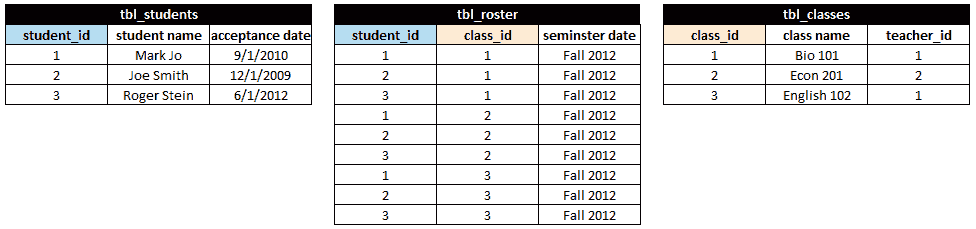

对于任何连接，你应该避免**笛卡尔积**，这是由于连接而产生的所有可能的行和列的组合。在某些情况下，这可能在您的分析中很有用，但请谨慎，尤其是在处理大量大数据时。

笛卡尔积是指所有可能的行和列的组合。在我们的例子中，如果我们不包含 `tbl_roster` 而将 `tbl_students` 和 `tbl_classes` 连接起来，您最终会得到被分配到他们从未注册的课程中的学生。有时我会故意构建一个笛卡尔积，因为它是进行某些类型分析或图表所需的。例如，如果您有一个从 1 到 10 的学生排名量表，但没有学生达到所有可能的值，您可以通过创建笛卡尔连接来填补缺失值的空白。

与处理多对多连接类型时对超出内存和 CPU 利用率的担忧类似，笛卡尔积可以轻易消耗所有可用内存，这可能导致您的工作站或工作空间崩溃。

## 左连接

现在我们已经涵盖了关键概念，我将开始用一个分析中最常见的连接类型之一的视觉表示来开始，这被称为**左连接**。让我们首先看看这个例子的源数据，如下面的截图所示：

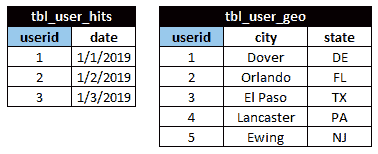

如您所见，我们有两个表名为 `tbl_user_hits` 和 `tbl_user_geo`。`tbl_user_hits` 的宽度是两列，长度是三行。在 `tbl_user_geo` 表中，它代表用户的地理位置，我们有三列和五行。这两个表都有一个名为 `userid` 的公共字段，我已经将其突出显示，并会使用它来连接数据。这些表之间存在主键和外键的多对一关系，因为一个表中的所有记录并不都存在于另一个表中。

对于这个例子，我们希望保留`tbl_user_hits`表中的所有记录，并通过合并匹配的属性（如城市和州）来丰富数据，其中`userid`仅存在于用户点击表中的记录。结果如下面的截图所示，原始来源`tbl_user_hits`具有相同的行数，但现在包括了来自`tbl_user_geo`表的列：

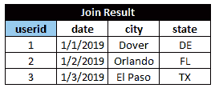

为什么行数保持不变但列数增加？成功的左连接保留源中的行数并扩展列数。

可以定义包含在连接结果中的特定列，但默认情况下将包括所有列。

为什么左连接在分析中很常见？那是因为我们感兴趣的是添加更多的维度字段来回答更多关于数据的问题，而这些数据仅存在于单个表中。此外，在你的分析中，你通常不想包含任何与我们的源用户点击不匹配的内容。有了这个新的连接结果，我们现在可以回答诸如哪个城市有最多用户等问题。通过一些日期计算，我们还可以按州提供月度趋势。

## 右连接

接下来，我们有一个称为**右连接**的连接类型，我认为它不太常见。那是因为没有多少用例需要创建合并数据记录中的空白。右连接是你想要保留第二个表的所有列和行，并用第一个表中的匹配值填充。

为了理解这个概念，首先回顾一下我们之前的源表`tbl_user_hits`和`tbl_user_geo`。成功的右连接结果如下面的截图所示，其中连接结果显示了五行和四列。`tbl_user_hits`的日期字段已与`tbl_user_geo`源合并，但缺失的值将显示为`null()`或`NaN`。请注意，如果`tbl_user_hits`有数千或数百万行，连接结果将增加`tbl_user_geo`的原始大小：

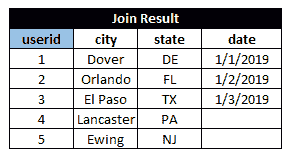

使用右连接的一个优点是现在你可以识别哪些城市和州没有任何用户点击。这可能是有用的信息，可用于营销活动。

## 内连接

接下来，我们有一个**内连接**。这是当两个表都返回精确值以及所有列时。为了演示效果，我对我们的源表做了一些调整，如下面的截图所示。表名相同，但现在`tbl_user_geo`中删除了一些先前记录。这可能是因为法规要求，或者`userid`行可能被确定为无效，因此现在我们可以使用内连接将它们从`tbl_user_hits`中删除：

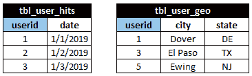

连接结果在以下屏幕截图中显示，其中仅显示在`userid`键字段中找到的匹配值，以及两个源表之间的所有合并列：

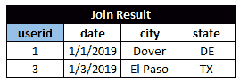

执行连接的 pandas 函数称为`merge`，内连接是默认选项。

## 外连接

最后，我们有一个**外连接**，它提供了来自两个源的所有行和列的完整列表。与**笛卡尔积**不同，笛卡尔积会创建任何可能的值组合，外连接反映了两个源表的真实情况。在我们的示例中，我们将使用以下屏幕截图中的相同源，其中已删除`tbl_user_geo`记录。与内连接不同，外连接结果允许你在 SQL 中看到任何缺失的记录作为 null，或在 Python/pandas 中作为`NaN`：

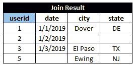

虽然这些概念和常见的连接类型并不全面，但你现在对将数据源连接在一起有了很好的基础理解，因此我们可以继续查看实际示例。

# 动态连接类型

不幸的是，我们使用的 SQLite 数据库不支持所有连接选项（右连接和外连接），因此我将只提供两个使用 SQL 的连接示例（左连接和内连接）。好消息是，`pandas`库使用`merge()`函数支持所有连接类型，因此我们可以重新创建所有已讨论的示例。请随意查看以下代码；我已经在 GitHub 上放置了 Jupyter Notebook 代码的副本以供参考。

在查看所有步骤之前，请确保将任何依赖文件复制到你的工作文件夹中。

我们将首先启动一个新的 Jupyter 笔记本，并将其命名为`ch_08_exercises`：

1.  加载 SQLite 数据库连接：

```py
In[]: import sqlite3
```

这个库应该已经通过 Anaconda 可用。有关设置环境的帮助，请参阅第二章，*Python 和 Jupyter Notebook 的概述*。

1.  接下来，我们需要将一个名为`conn`的连接分配给变量，并指向名为`user_hits.db`的数据库文件位置。由于我们在先前的`In[]`行中已经导入了`sqlite3`库，我们可以使用这个内置函数与数据库通信：

```py
In[]: conn = sqlite3.connect('user_hits.db')
```

确保你已经将`user_hits.db`文件复制到正确的 Jupyter 文件夹目录中，以避免连接错误。

1.  导入`pandas`库：

```py
In[]: import pandas as pd
```

1.  要运行 SQL 语句并将结果分配给 DataFrame，我们必须运行这一行代码。`pandas`库包含一个`read_sql_query`函数，这使得使用 SQL 与数据库通信变得更容易。它需要一个连接参数，我们在前面的步骤中将其命名为`conn`。我们将结果分配给一个新的 DataFrame 作为`df_left_join`，以便更容易识别：

```py
In[]: df_left_join = pd.read_sql_query("select u.userid, u.date, g.city, g.state from tbl_user_hits u left join tbl_user_geo g on u.userid = g.userid;", conn)
```

SQL 支持表名的别名概念，因此您可以缩短语法。在这个例子中，`tbl_user_hits` 的别名为 `u`，`tbl_user_geo` 为 `g`。这有助于在显式调用需要表名前缀的字段名时。

1.  现在我们已经将结果放入 DataFrame 中，我们可以使用所有可用的 `pandas` 库命令对此数据进行操作，而无需返回数据库。要查看结果，我们只需运行 `head()` 命令对此 DataFrame 使用此代码：

```py
In[]: df_left_join.head()
```

输出将类似于以下截图，其中 SQL 结果已加载到具有标记标题行的 DataFrame 中，索引列位于左侧，起始值为 `0`：

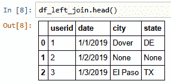

1.  下一个连接将是一个内部连接，我们将结果分配给一个新的 DataFrame，命名为 `df_inner_join`，以便更容易识别：

```py
df_inner_join = pd.read_sql_query("select u.userid, u.date, g.city, g.state from tbl_user_hits u, tbl_user_geo g where u.userid = g.userid;", conn)
```

1.  现在我们已经将结果放入 DataFrame 中，我们可以使用所有可用的 `pandas` 库命令对此数据进行操作，而无需返回数据库。要查看结果，我们只需运行 `head()` 命令对此 DataFrame 使用此代码：

```py
In[]: df_inner_join.head()
```

输出将类似于以下截图，其中 SQL 结果已加载到具有标记标题行的 DataFrame 中，索引列位于左侧，起始值为 `0`：

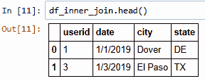

我们将继续使用 `pandas` 中的 `merge()` 函数进行剩余的练习。我在 *进一步阅读* 部分有一个关于该函数的详细信息参考，但使用它非常简单。一旦您将两个输入表存储为 DataFrame，您可以将它们作为参数输入到 `merge()` 函数中，同时指定您想要使用的连接类型，这由 `how` 参数控制。当您不指定参数时，默认为内部连接，它支持我们讨论的所有 SQL 连接，包括左连接、右连接和外连接。使用 `merge()` 函数的结果是返回一个包含源对象合并的 DataFrame。让我们通过将我们的源 SQL 表作为 DataFrame 加载来继续这个练习。

1.  创建一个新的 DataFrame，命名为 `df_user_hits`，它是 `tbl_user_hits` 表的副本，这样我们就可以在后面的示例中使用它：

```py
In[]: df_user_hits = pd.read_sql_query("select * from tbl_user_hits;", conn)
```

1.  为了验证结果，您可以使用此代码运行 `head()` 函数对此 DataFrame：

```py
In[]: df_user_hits.head()
```

输出将类似于以下截图，其中 SQL 结果已加载到具有标记标题行的 DataFrame 中，索引列位于左侧，起始值为 `0`：

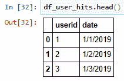

1.  创建一个新的 DataFrame，命名为 `df_user_geo`，它是 `tbl_user_geo` 表的副本，这样我们就可以在后面的示例中使用它：

```py
In[]: df_user_geo = pd.read_sql_query("select * from tbl_user_geo;", conn)
```

输出将类似于以下截图，其中 SQL 结果已加载到具有标记标题行的 DataFrame 中，索引列位于左侧，起始值为 `0`：

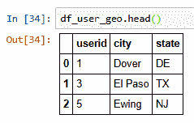

1.  由于我们不再需要运行任何 SQL 查询并已检索所有数据，关闭数据库连接是一种最佳实践。您将运行此命令来关闭它：

```py
In[]: conn.close()
```

现在我们已经将所有数据加载到 pandas DataFrame 中，我们可以通过稍微修改`merge()`函数中的参数来遍历不同的连接类型。所有示例的`left`和`right`参数分别为`df_user_hits`和`df_user_geo`。连接字段是一致的，即两个 DataFrame 的`userid`。在这个例子中，源表使用相同的公共字段名作为它们的唯一标识符，这很有帮助。

我们将传递给`merge()`函数的最后一个参数名为`how`，它决定了将执行哪种类型的连接。我们将从我最喜欢的开始，即左连接。

1.  使用 pandas 的`merge()`函数创建两个 DataFrame 之间的左连接，创建一个新的 DataFrame。在下一行中，您可以包含新的 DataFrame 名称，这将输出类似于使用`head()`函数的结果：

```py
In[]: df_left_join=pd.merge(left=df_user_hits, right=df_user_geo, how='left', left_on='userid', right_on='userid')
df_left_join
```

输出将类似于以下截图，其中`merge()`的结果已加载到名为`df_left_join`的新 DataFrame 中，带有标签的表头行，索引列位于左侧，起始值为`0`：


预期结果，仅显示来自`df_user_hits`的`userid`。

注意 SQL 和 pandas 之间的区别，其中空白`null()`值被**NaN**（代表**Not a Number**）所替换。

接下来，我们将创建一个右连接，这与我们之前的语法略有不同。

1.  使用 pandas 的`merge()`函数创建两个 DataFrame 之间的右连接，创建一个新的 DataFrame。在下一行中，您可以包含新的 DataFrame 名称，这将输出类似于使用`head()`函数的结果：

```py
In[]: df_right_join=pd.merge(left=df_user_hits, right=df_user_geo, how='right', left_on='userid', right_on='userid')
df_right_join
```

输出将类似于以下截图，其中合并结果已加载到名为`df_right_join`的新 DataFrame 中，带有标签的表头行，索引列位于左侧，起始值为`0`：

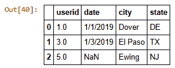

预期结果，仅显示来自`df_user_geo`的`userid`。

与我们的 SQL 示例类似，我们可以通过使用默认值来执行内部连接，即在将`how`参数传递给`merge()`函数时省略它。

如果您想确保定义所使用的连接类型，您始终可以显式包含`how`参数。

1.  使用 pandas 的`merge()`函数创建两个 DataFrame 之间的内部连接，创建一个新的 DataFrame。在下一行中，您可以包含新的 DataFrame 名称，这将输出类似于使用`head()`函数的结果：

```py
In[]: df_inner_join=pd.merge(left=df_user_hits, right=df_user_geo, left_on='userid', right_on='userid')
df_inner_join
```

输出将类似于以下截图，其中合并结果已加载到名为 `df_inner_join` 的新 DataFrame 中，带有标签的标题行，索引列从左侧开始，值为 `0`：

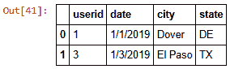

预期结果，仅显示存在于两个 DataFrame 中的 `userid`：

最后，让我们通过添加 `how` 参数并包含 `outer` 值来使用 `merge()` 函数创建一个外连接：

1.  创建一个新的 DataFrame，其中包含 pandas `merge()` 函数创建的两个 DataFrame 之间的外连接的结果。在下一行，您可以包含新的 DataFrame 名称，这将输出类似于使用 `head()` 函数的结果：

```py
In[]: df_outer_join=pd.merge(left=df_user_hits, right=df_user_geo, how='outer', left_on='userid', right_on='userid')
df_outer_join
```

输出将类似于以下截图，其中合并结果已加载到名为 `df_outer_join` 的新 DataFrame 中，带有标签的标题行，索引列从左侧开始，值为 `0`：


预期结果，将显示存在于任一 DataFrame 中的所有 `userid` 实例：

太棒了，我们已经成功重新创建了本章迄今为止讨论的所有连接类型。无论您更习惯使用 SQL 还是 `pandas`，将数据集连接起来的能力是一项强大的技能，并且显著提高了您的数据素养。

# 解释数据聚合

数据聚合是您日常生活中的一个部分，您可能甚至没有意识到它。当您查看使用一到五颗星的餐厅评论时，或者在亚马逊上购买一个有数千条客户评价的商品时，这两个例子都是数据聚合。数据聚合可以定义为基于显著更大的细节的摘要。在 SQL 中，聚合是在一个或多个表上应用 `groupby` 命令时发生的，这包括对一个或多个字段进行的统计计算，如总和、平均值、最小值或最大值。

## 理解数据的粒度

计算的聚合被称为度量。当您按一个或多个字段分组以获取它们的唯一值时，它们被分类为维度。

因此，这应该听起来都很熟悉，因为我们已经在 第五章，*在 Python 中收集和加载数据*，以及 第六章，*可视化和处理时间序列数据* 中介绍了维度和度量的概念，因为它是数据建模和可视化的基础。为了加强这一概念，让我们看看表格或 DataFrame 如何通过视觉方式汇总。如图所示，任何行数和列数的输入表格都可以通过多种不同的聚合类型进行汇总和简化，例如按用户或按日期：

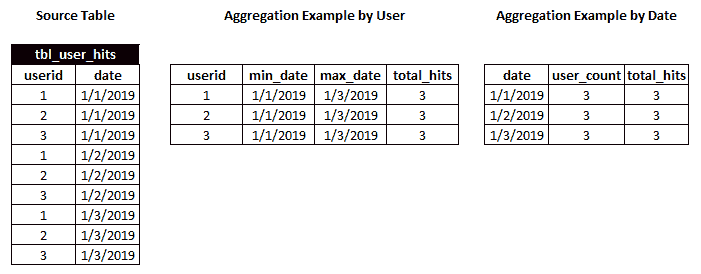

那么，为什么聚合对于分析来说是必需的和重要的呢？首先，正如你在前面的屏幕截图中所看到的，形状和大小显著减少，这有助于大型数据集便于人类或机器消费。 

对于人类来说，当数据聚合时，它变得易于查看和理解，因为人们不必视觉上筛选数千行和列。对于机器来说，在形状和大小上减少非常大的数据源有助于减少文件大小、内存占用和数据处理时的输入/输出。当你看到结构化数据的大小以**千兆字节**（**GB**）为单位时，影响该大小的主要因素（无论是文件、DataFrame 还是数据库表）是数据的密度。数据的密度由表或源文件中的行和列中的每个数据点值定义。当你聚合数据时，数据量将显著减少，因为一个或多个包含唯一值的字段被移除。

例如，如果你有一个高交易量的事务表，按时间戳有数百万个不同的`userid`值，如果用户每几秒钟执行一个动作或事件，每天的记录数可能达到数千万。如果你的分析需求是衡量每天用户的平均数量，你可以创建一个每天有一行的每日快照表。因此，简单的聚合将数千万行减少到每天一行！那么，问题在哪里呢？首先，我们失去了每个用户每天执行的动作的所有粒度。另一个因素是处理和管理聚合表的时间。任何数据工程师都会告诉你，停机时间和错误是会发生的，所以他们必须保持源表和任何聚合表同步，并在源表发生变化时恢复。

为了解决任何粒度的损失，你可以根据不同的字段/维度创建其他聚合，但如果你在聚合表创建后添加更多属性，可能会产生其他问题。例如，如果你对按城市和州平均每日用户计数进行一年的聚合表快照，然后想按邮政编码进行分析，你可能需要重新处理以回填所有历史数据，或者拥有两种不同的平均粒度，这些粒度在特定日期前后发生变化。

## 数据聚合的实际应用

因此，现在我们更好地理解了聚合的存在及其原因，让我们来了解一下如何在 SQL 和 pandas 中创建它们。在这个例子中，我们将使用名为`tbl_user_geo_hits`的用户点击数据的一个类似版本。这个表包含了我们之前一直在使用的来源的合并记录，但现在我们可以专注于聚合和`groupby`语法。SQL 语言可能很复杂，但足够强大，可以同时处理连接和聚合，但我发现分解这个过程会使学习更容易。此外，由于数据量很大和/或需要报告，通常会有持久化的表或视图（类似于表但由一个或多个连接派生的数据库对象）可用。

我们将首先启动一个新的 Jupyter 笔记本，并将其命名为`ch_08_sql_and_pandas_group_by`：

1.  加载 SQLite 数据库连接：

```py
In[]: import sqlite3
```

这个库应该已经通过 Anaconda 可用。有关设置环境的帮助，请参阅第二章，*Python 和 Jupyter Notebook 安装概述*。

1.  接下来，我们需要将一个连接分配给名为`conn`的变量，并指向数据库文件的位置，该文件名为`user_hits.db`。由于我们在之前的`In[]`行中已经导入了`sqlite3`库，我们可以使用这个内置函数与数据库进行通信：

```py
In[]: conn = sqlite3.connect('user_hits.db')
```

确保您已将`user_hits.db`文件复制到正确的 Jupyter 文件夹目录中，以避免连接错误。

1.  导入`pandas`库：

```py
In[]: import pandas as pd
```

1.  要运行 SQL 语句并将结果分配给 DataFrame，我们必须运行这一行代码。`pandas`库包含一个`read_sql_query`函数，这使得使用 SQL 与数据库通信变得更加容易。它需要一个连接参数，我们在之前的步骤中将其命名为`conn`。我们将结果分配给一个新的 DataFrame，命名为`df_user_geo_hits`，以便更容易识别：

```py
In[]: df_user_geo_hits = pd.read_sql_query("select * from tbl_user_geo_hits;", conn)
```

1.  为了验证结果，你可以使用以下代码运行`head()`函数对此 DataFrame 进行操作：

```py
In[]: df_user_geo_hits.head(10)
```

输出将类似于以下截图，其中合并结果已加载到名为`df_user_geo_hits`的新 DataFrame 中，带有标签的标题行，左侧的索引列从`0`开始：

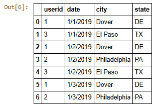

因此，我们有了用户点击量数据，并且通过将其加载到 DataFrame 中来预览了这些数据。使用按组功能的优势在于，它允许我们针对数据提出具体问题，并通过在 SQL 语法中使用的维度和聚合上进行一些轻微调整来返回答案。在所有时间范围内，按城市和州发生了多少用户点击量？为了回答这个问题，让我们确定所需的维度和度量。维度是`城市`和`州`，度量是通过计算记录出现的频率的聚合，这由`count (*)`函数表示。由于我们需要的所有这些信息都在一个表中，因此不需要进行连接。

如果我们只包括 `城市` 这一个维度，那么我们就会合并任何重复的 `城市` 名称，并错误地表示数据。例如，`多佛` 这个城市存在于多个州，如特拉华和新泽西州。这就是为什么如果不包括正确的字段在按组聚合中，数据可能会丢失粒度。

1.  要运行 SQL 语句并将结果分配给 DataFrame，我们必须运行这一行代码。`pandas` 库包含一个 `read_sql_query()` 函数，这使得使用 SQL 与数据库通信变得更容易。它需要一个连接参数，我们在前面的步骤中将其命名为 `conn`。我们将结果分配给一个新的 DataFrame，命名为 `df_groupby_SQL`，以便更容易识别：

```py
In[]: df_groupby_SQL=pd.read_sql_query("select city, state, count(*) as hits from tbl_user_geo_hits group by 1, 2;", conn)
```

1.  为了验证结果，你可以使用以下代码对此 DataFrame 运行 `head()` 函数：

```py
[]: df_groupby_SQL.head()
```

输出将类似于以下截图，其中合并结果已加载到名为 `df_groupby_SQL` 的新 DataFrame 中，带有标签的标题行从左侧的 `0` 值开始：

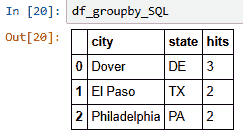

SQL 语言支持快捷方式，因此我们使用 `group by 1, 2` 来表示 `城市` 和 `州` 的二维字段。它还允许字段名称的别名，因此使用 `count(*) as hits` 来使其更容易表示。

要使用 `pandas` 重新创建 SQL 结果，我们可以使用我们加载的 DataFrame，并使用 `groupby()` 函数和一些参数。在我们的例子中，我们传递我们想要按其分组列的名称，即 `城市` 和 `州`。度量将与之前相似，通过包括 `.count()`，我们包括想要进行聚合的字段，由于我们是在计数频率，因此可以是任何字段。我们使用 `userid`，因为分析集中在用户上。

1.  要运行 SQL 语句并将结果分配给 DataFrame，我们必须运行这一行代码。`pandas` 库包含一个 `read_sql_query` 函数，这使得使用 SQL 与数据库通信变得更容易。它需要一个连接参数，我们在前面的步骤中将其命名为 `conn`。我们将结果分配给一个新的 DataFrame，命名为 `df_groupby_city_state`，以便更容易识别：

```py
In[]: df_groupby_city_state=df_user_geo_hits.groupby(["city", "state"]) ["userid"].count()
```

1.  为了验证结果，你可以使用以下代码对这个 DataFrame 运行`head()`函数：

```py
In[]: df_groupby_city_state.head()
```

输出将类似于以下截图，其中合并结果已加载到名为`df_groupby_city_state`的新 DataFrame 中：

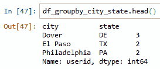

1.  由于我们不再需要运行任何 SQL 查询并已检索所有数据，关闭数据库连接是一个好习惯。你可以运行以下命令来关闭它：

```py
In[]: conn.close()
```

因此，我们已经展示了通过在`pandas`和 SQL 中使用聚合组来总结数据的力量。聚合可以针对单个表或多个表之间的连接执行。使用 SQL 或`pandas`的共同之处在于定义维度和度量，这些是从 DataFrame 或 SQL 对象（表、连接或视图）中可用的字段抽象出来的。到目前为止，我们只使用了一种度量类型，即计数，来触及表面。还有更多用于数据分析的统计函数。因此，接下来，我们将探讨均值、中位数和众数之间的区别。

# 概率统计和异常值

在第五章“在 Python 中收集和加载数据”中，我们讨论了处理数据时基本统计学的必要性。现在，让我们探讨统计学中均值、中位数和众数之间的区别，以及它们在数据分析中的应用。均值或平均值是指将一系列数值的总和除以这些数值的数量。均值或平均值是分析中的一个度量，通常用于衡量一段时间内的表现，并为每个时间段定义一个比较基准。

例如，你经常在新闻中看到平均每日气温——它是如何计算的？根据你的地理位置，天气记录将使用特定的增量来记录温度，例如小时。例如，**国家海洋和大气管理局**（**NOAA**）使用站点和科学方法来计算每一天和每个地点的最小和最大温度值。然后，这些个别记录被用来创建平均月温度和按月计算的 30 年平均值。

确保你理解你的数据来源，尤其是在处理平均值时，因为平均值的平均值将限制你如何处理数据，并且很可能是指标误用。理想情况下，拥有最低级别的细节，这样你就可以根据所需的任何时间段重新计算平均值。

对于我们在本章中一直在使用的示例，计算平均值或均值将提供一个我们可以用于比较的标准。因此，如果我们想知道每天的平均点击次数，我们只需计算所有记录并除以日期值的唯一计数。从`tbl_user_geo_hits`数据中，平均值为每天 2.3 次点击，因为你共有七个记录，三天是不同的。现在我们可以用这个作为试金石来衡量每天与该平均值相比是否有显著的增加或减少。

中位数，是一系列数值中的中心值，可以通过找到中间值来确定，其中 50%的数值大于或小于该特定数据值。通常将这些值按顺序排列，以便更容易识别中间值。确定平均值对于测量中心趋势很有用，这有助于你识别数据值的分布情况，并且不受异常数据点的影响。我们将在第九章绘图、可视化和讲故事中探讨分布的形状。

最后，我们有众数，它是系列中出现频率最高的值。众数在分析和分析中不太常用，但在识别数据中的异常值时很有用。什么是异常值？从数学上讲，它可能被定义为与平均值多个标准差的数据值。实际上，它是指与数据中的其他值相比，某个值或汇总值偏离正常模式的情况。一种识别异常值的好方法是绘制值与正态分布或通常所说的*钟形曲线*的对比图，以下图中用虚线黑色线表示：

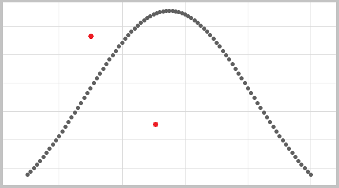

如前图所示，分布线遵循基于平均值和标准差形状。一个真正的正态分布将具有平均值、中位数和众数都相等的数据值。在曲线顶部的峰值左右，基于一个、两个或三个标准差。加减三个标准差的数据值将代表仅占所有数据值总人口的 99.7%。

从实际的角度来说，我们说的是所有数据中不到百分之一的数据会接近最小值和最大值。你的数据是否呈正态分布可能并不重要，但了解这一点有助于识别数据值的形状。在先前的例子中，有一些红色点明显低于和高于线，这些被认为是异常值。与正态分布相比，这种异常值的视觉表示将帮助数据分析师与他人就数据进行交流。这是数据素养的力量，其中视觉表示可以激发对话，并帮助回答关于预期或正常情况以及异常或异常值的问题。

# 摘要

恭喜，我们已经覆盖了在 SQL 和 Python 中使用 pandas DataFrames 进行数据连接和合并的基础知识。在整个过程中，我们讨论了实际例子，说明了应该使用哪些连接类型，以及为什么应该针对用户点击数据使用它们。通过混合多个数据表来丰富我们的数据，可以让我们进行更深入的分析，并能够回答更多关于原始单一数据源的问题。在了解连接和 `merge()` 函数之后，我们揭示了数据聚合的优缺点。我们通过实际例子介绍了在 SQL 和 DataFrames 中使用 `groupby` 功能。我们还探讨了统计函数与均值、中位数和众数之间的区别，以及通过将结果与正态分布的钟形曲线进行比较来寻找数据中异常值的技巧。

在下一章中，我们将回到使用绘图库和可视化数据。

# 进一步阅读

关于本章主题的更多信息，您可以参考以下链接：

+   使用合并函数的指南：[`pandas.pydata.org/pandas-docs/stable/reference/api/pandas.DataFrame.merge.html`](https://pandas.pydata.org/pandas-docs/stable/reference/api/pandas.DataFrame.merge.html)

+   NOAA 气象数据：[`www.ncdc.noaa.gov/cdo-web/datatools/records`](https://www.ncdc.noaa.gov/cdo-web/datatools/records)

+   SQL 连接类型：[`www.w3schools.com/sql/sql_join.asp`](https://www.w3schools.com/sql/sql_join.asp)

+   数据素养项目 - 理解聚合：[`qcc.qlik.com/mod/url/view.php?id=5268`](https://thedataliteracyproject.org/learn)
