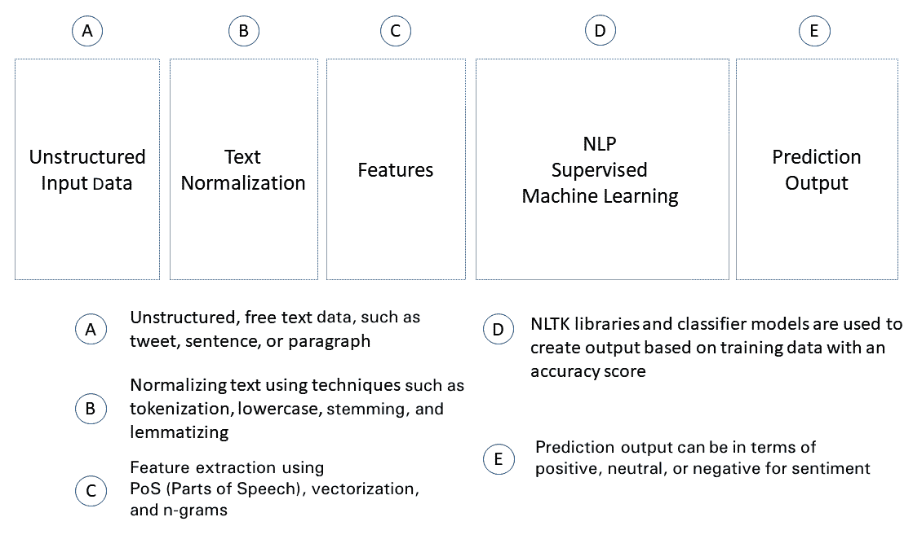
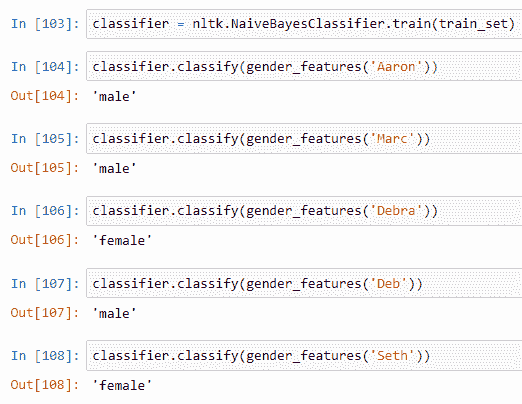
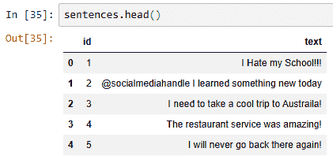
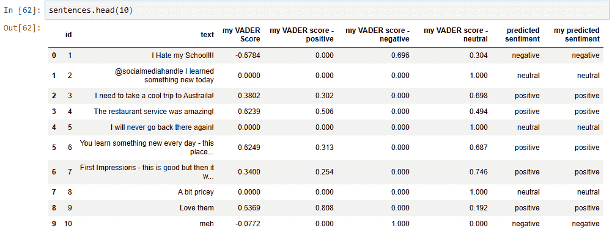
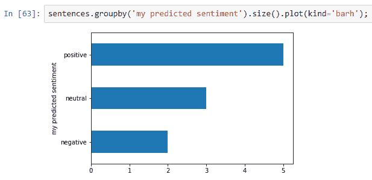

实用情感分析

这将是一个有趣的章节。在本章中，我们将探索并演示一些使用**自然语言处理**（**NLP**）概念的实际例子，以了解非结构化文本如何转化为洞察。在第十章“探索文本数据和非结构化数据”中，我们探讨了**自然语言工具包**（**NLTK**）库以及与识别单词、短语和句子相关的一些基本功能。在这个过程中，我们学习了如何处理数据和分类文本，但并未超出这个范围。在本章中，我们将学习情感分析，它预测算法输入文本的潜在语气。在共同分析一个例子之前，我们将分解构成 NLP 模型的要素以及用于情感分析的包。

本章我们将涵盖以下主题：

+   为什么情感分析很重要

+   NLP 模型的要素

+   情感分析包

+   情感分析实践

让我们开始吧。

# 第十五章：技术要求

你可以在此处找到本书的 GitHub 仓库：[`github.com/PacktPublishing/Practical-Data-Analysis-using-Jupyter-Notebook/tree/master/Chapter11`](https://github.com/PacktPublishing/Practical-Data-Analysis-using-Jupyter-Notebook/tree/master/Chapter11)。

你可以从以下链接下载并安装本章所需的软件：[`www.anaconda.com/products/individual`](https://www.anaconda.com/products/individual)。

# 为什么情感分析很重要

现在，我们生活在一个数字时代，数据与我们的日常生活紧密相连。然而，由于大部分数据都是非结构化的，且数据量巨大，它需要统计库和**机器学习**（**ML**）技术来解决技术问题。NLTK 库为我们提供了一个处理非结构化数据的框架，而情感分析则是 NLP 中的一个实际应用案例。**情感分析**，或称为意见挖掘，是一种监督式机器学习，需要训练数据集来准确预测输入的句子、短语、标题甚至推文是正面、负面还是中性。一旦模型被训练，你就可以像传递函数一样将非结构化数据输入其中，它将返回一个介于负一和正一之间的值。这个数值将输出小数，且越接近整数，模型的准确性就越高。情感分析是一个不断发展的科学，因此我们的重点将放在使用 NLTK 语料库库上。与任何 NLP 模型一样，如果你没有好的输入训练数据样本，你会在预测输出中找到不准确之处。

此外，请注意，NLP 和情感分析是一个深奥的主题，如果您计划使用内部公司数据源实现自己的模型，则应由数据科学家或机器学习工程团队进行验证。话虽如此，您今天会在许多不同的应用中注意到情感分析，本章中的练习为您提供了数据分析的另一个工具。了解如何使用情感分析的另一个好处是，它允许您就模型输出的数据进行辩论。能够捍卫处理非结构化数据的准确性和预测性将提高您的数据素养技能。例如，假设您正在分析一个关于餐厅的推文群体，该餐厅过去在营销活动中混合了正面和负面的评论。如果您的分析结果为 100%正面，您应该开始质疑训练数据、数据来源以及模型本身。当然，所有推文都是正面的可能性是存在的，尤其是在数据量较小的情况下，但每个推文都有正面情感的可能性大吗？

正如第一章“数据分析基础”中所述，无论使用什么技术和工具进行分析，**了解您的数据**（KYD）仍然很重要。然而，今天为什么情感分析很重要需要说明。首先，模型的准确性显著提高，因为训练数据越多，预测输出的效果越好。第二点是，NLP 模型可以扩展到人类在相同时间内无法处理的内容。最后，今天可用的情感分析替代方案，如专家系统，由于实施它们所需的时间和资源，成本更高。基于文本逻辑和通配符关键字搜索的专家系统开发是僵化的，且难以维护。

现在，让我们来探讨构成自然语言处理（NLP）元素的内容以及它在情感分析中应用的过程。

# NLP 模型的元素

为了总结使用 NLP 监督机器学习模型进行情感分析所需的过程，我创建了一个以下图表，它显示了从字母**A**到**E**的逻辑进展：



这个过程从我们的源**非结构化输入数据**开始，这在前面图中用字母 A 表示。由于非结构化数据有不同的格式、结构和形式，如推文、句子或段落，我们需要执行额外的步骤来处理数据以获得任何见解。

下一个元素被命名为文本归一化，并在前面的图中用字母 B 表示，涉及诸如分词、n-gram 和**词袋模型**（**BoW**）等概念，这些概念在第十章“探索文本数据和非结构化数据”中介绍过。让我们更详细地探讨它们，以便我们可以了解它们在情感分析中的应用。BoW 是指将文本字符串（如句子或段落）分解以确定单词出现的次数。在创建词袋表示的过程中进行**分词**，单词在句子、推文或段落中的位置变得不那么相关。每个单词如何被分类、分类和定义，将作为下一个过程的输入。

将标记和词袋视为情感分析食谱的原始原料；就像烹饪一样，原料需要额外的步骤进行精炼。因此，分类的概念变得很重要。这被认为是**特征**，并在前面的图中用字母 C 表示。因为对计算机来说，标记不过是一串 ASCII 字符，所以词嵌入和标记是将其转换为机器学习模型输入的过程。一个例子是将每个单词分类为一个值对，如一或零，以表示真或假。此过程还包括寻找相似单词或分组，以便解释上下文。

创建**特征**被称为特征工程，这是监督式机器学习的基础。特征工程是将非结构化数据元素转换为预测模型特定输入的过程。模型是抽象的，其输出的准确性仅取决于其背后的输入数据。这意味着模型需要带有提取特征的训练数据来提高其准确性。没有特征工程，模型的输出结果将是随机猜测。

## 创建预测输出

为了了解如何从非结构化数据中提取**特征**，让我们通过 NLTK 性别特征来举例，该特征对原始示例进行了一些小的修改。您可以在“进一步阅读”部分找到原始来源。

启动一个新的 Jupyter Notebook，并将其命名为 `ch_11_exercises`。现在，按照以下步骤操作：

1.  通过在 Jupyter Notebook 中添加以下命令并运行单元格来导入以下库。您可以自由地跟随操作，创建自己的 Notebook。我已经在这个书的 GitHub 仓库中放置了一个副本供参考：

```py
In[]: import nltk
```

该库应该已经通过 Anaconda 可用。有关设置环境的帮助，请参阅第二章“Python 概述和安装 Jupyter Notebook”。

1.  接下来，我们需要下载我们想要使用的特定语料库。或者，您可以使用`all`参数下载所有包。如果您在防火墙后面，有一个`nltk.set_proxy`选项可用。有关更多详细信息，请查看[nltk.org](http://www.nltk.org/)上的文档：

```py
In[]: nltk.download("names")
```

输出将如下所示，其中确认了包的下载，并且输出被验证为`True`：


1.  我们可以使用以下命令来引用语料库：

```py
In[]: from nltk.corpus import names
```

1.  为了探索这个语料库中可用的数据，让我们对两个输入源`male.txt`和`female.txt`运行`print`命令：

```py
In[]: print("Count of Words in male.txt:", len(names.words('male.txt')))
print("Count of Words in female.txt:", len(names.words('female.txt')))
```

输出将如下所示，其中在笔记本中打印出每个源文件中找到的单词数量：


由于我们计算了每个源文件中找到的单词数量，我们现在对数据的大小有了更好的理解。让我们继续查看每个源的内容，查看每个性别文件的一些样本。

1.  为了查看每个源中找到的前几个单词的列表，让我们对两个输入源`male.txt`和`female.txt`运行`print`命令：

```py
In[]: print("Sample list Male names:", names.words('male.txt')[0:5])
print("Sample list Female names:", names.words('female.txt')[0:5])
```

输出将如下所示，其中在笔记本中打印出每个源文件中找到的单词列表：


记住，计算机并不知道一个名字实际上返回的是`male`或`female`的值。语料库将它们定义为两个不同的源文件，作为 NLTK 库识别为单词的值列表，因为它们被定义为这样的。有成千上万的名称被定义为男性或女性，你可以使用这些数据作为情感分析输入。然而，仅识别性别并不能确定情感是积极的还是消极的，因此还需要额外的元素。

在第一个图中的下一个元素，标记为 D，是实际的 **NLP 监督机器学习** 算法。记住，构建一个准确模型需要使用特征工程，以及 NLTK 库和分类器模型。当正确使用时，输出将基于输入的 **训练** 和 **测试** 数据。模型应该始终进行验证，并且应该测量准确性。在我们的例子中，即构建一个基本的性别判断模型，我们将使用 NLTK 库中可用的 `NaiveBayesClassifier`。朴素贝叶斯分类器是一个基于贝叶斯定理创建的机器学习模型，用于根据另一个类似事件发生的频率来确定事件发生的概率。分类器是一个过程，它根据输入的特征数据集选择正确的标签值或标签。这些模型和库背后的数学概念非常广泛，因此我在 *进一步阅读* 部分添加了一些链接以供参考。为了完成第一个图中总结的情感分析元素，我们将创建一个预测输出，所以让我们继续在我们的 Jupyter Notebook 会话中继续：

1.  创建一个名为 `gender_features` 的函数，该函数返回任何输入单词的最后一个字母。模型将使用这个分类器特征作为输入来预测输出，基于这样的概念：以字母 **A**、**E** 和 **I** 结尾的名字更有可能是女性，而以 **K**、**O**、**R**、**S** 或 **T** 结尾的名字更有可能是男性。运行单元格后不会有输出：

```py
In[]: def gender_features(word):       
    return {'last_letter': word[-1]}
```

记住，在您的单元格中缩进第二行，以便 Python 可以处理该函数。

1.  为了确认函数将返回一个值，输入以下命令，该命令打印任何输入名称或单词的最后一个字符：

```py
In[]: gender_features('Debra')
```

输出将如下所示，其中在 Notebook 中打印了输入单词 `Debra` 的最后一个字符，并带有 `Out[]`：


1.  创建一个名为 `labeled_names` 的新变量，该变量遍历两个源性别文件，并为每个 **名称-值对** 分配标签，以便它可以被识别为男性或女性，然后输入到模型中。为了在循环完成后查看结果，我们打印前几个值以验证 `labeled_names` 变量是否包含数据：

```py
In[]: labeled_names = ([(name, 'male') for name in names.words('male.txt')] + [(name, 'female') for name in names.words('female.txt')])
print(labeled_names[0:5])
```

输出将如下所示，其中每个来自源文件的名称值将与 `male` 或 `female` 标签相结合，具体取决于它来自哪个文本文件源：


1.  由于模型应该使用随机值列表进行训练以避免任何偏差，我们将输入随机函数并打乱所有名称和性别组合，这将改变它们在 `labeled_names` 变量中的存储顺序。我添加了一个 `print()` 语句，以便您可以看到与先前步骤中创建的输出之间的差异：

```py
In[]: import random
random.shuffle(labeled_names)
print(labeled_names[0:5])
```

输出将如下所示，其中源文件中的每个名字值将与来自哪个文本文件源的`male`或`female`标签相结合：


注意，因为使用了`random()`函数，所以`print()`函数的结果每次运行单元格时都会改变。

1.  接下来，我们将通过使用`labeled_names`变量中每个名字的最后一个字母为每个性别创建特征来训练模型。我们将打印出新的变量`featuresets`，以便您可以看到在下一步中如何使用这个特征：

```py
In[]: featuresets = [(gender_features(n), gender) for (n, gender) in labeled_names]
print(featuresets[0:5])
```

输出将如下所示，其中每个名字最后一个字母的组合被分配给一个性别值，从而创建了一个名字-值对的列表：


1.  接下来，我们将从`featuresets`变量列表中切割数据，形成两个输入数据集，分别称为`train_set`和`test_set`。一旦我们将这些数据集分开，我们就可以使用`train_set`作为分类器的输入。我们使用`len()`函数来给我们一个每个数据集大小的感觉：

```py
In[]: train_set, test_set = featuresets[500:], featuresets[:500]
print("Count of features in Training Set:", len(train_set))
print("Count of features in Test Set:", len(test_set))
```

输出将如下所示，其中`len()`函数的结果提供了每个数据集相对于其他数据集大小的上下文：


1.  现在，我们将`train_set`变量作为输入传递给 NLTK 朴素贝叶斯分类器。模型被命名为`classifier`，因此您可以在下一步中像调用函数一样调用它。运行单元格后不会有输出：

```py
In[]: classifier = nltk.NaiveBayesClassifier.train(train_set)
```

1.  现在，我们将通过以下命令将随机名字发送到模型中，以验证模型的结果：

```py
In[]: classifier.classify(gender_features('Aaron'))
classifier.classify(gender_features('Marc'))
classifier.classify(gender_features('Debra'))
classifier.classify(gender_features('Deb'))
classifier.classify(gender_features('Seth'))
```

输出将如下所示，其中每个名字在通过`classifier`模型作为参数传递后，都会显示`male`或`female`的性别值：



恭喜您——您已成功创建了您的第一个监督式机器学习模型！如您所见，分类器模型存在一些准确度问题，在某些情况下返回了错误值。例如，当您传入`Aaron`、`Marc`或`Debra`的值时，性别预测结果是正确的。`Aaron`这个名字在训练数据中出现过，所以这并不令人惊讶。然而，模型显示出不完整或需要额外特征的迹象，因为它在用昵称`Deb`代表`Debra`以及代表男性名字`Seth`时返回了错误的性别。

我们如何解决这个问题？我们可以使用几种方法，我们将在下面一一探讨。

# 情感分析包

NLTK 库包含一些包来帮助我们解决我们在性别分类器模型中遇到的问题。第一个是 `SentimentAnalyzer` 模块，它允许您使用内置函数添加额外的功能。这些包的特殊之处在于，它们超越了传统的函数，其中定义的参数被传递进来。在 Python 中，参数（`args`）和关键字参数（`kwargs`）允许我们将名称-值对和多个参数值传递给一个函数。这些用星号表示；例如，`*args` 或 `**kwargs`。NLTK 的 `SentimentAnalyzer` 模块是一个用于教学目的的有用工具，因此让我们继续通过浏览其中可用的功能来继续。

第二个是称为 **VADER** 的，代表 **Valence Aware Dictionary and Sentiment Reasoner**。它是为了处理社交媒体数据而构建的。VADER 情感库有一个称为 **lexicon** 的字典，并包括一个基于规则的算法，专门用于处理缩写、表情符号和俚语。VADER 的一个不错的特点是它已经包含了训练数据，我们可以使用一个名为 `polarity_scores()` 的内置函数，该函数返回输出中显示的关键见解。第一个是介于负一和正一之间的复合得分。这为您提供了一个单一得分中 VADER 字典评级的标准化总和。例如，如果输出返回 `0.703`，这将是一个非常积极的句子，而复合得分为 `-0.5719` 将被解释为消极。VADER 工具的下一个输出是关于输入是积极、消极还是中性的分布得分，范围从零到一。

例如，句子 `我恨我的学校！` 会返回以下截图所示的结果：


如您所见，返回了一个 `-0.6932` 的复合值，这验证了 VADER 模型准确预测了非常消极的情感。在同一输出行上，您可以看到 `'neg'`、`'neu'` 和 `'pos'`，分别代表消极、中性和积极。每个值旁边的指标提供了一些关于复合得分是如何得出的更多细节。在前面的截图中，我们可以看到一个 `0.703` 的值，这意味着模型预测的消极程度为 70.3%，剩余的 29.7% 为中性。模型在 `pos` 旁边返回了一个 `0.0` 的值，因此基于内置的 VADER 训练数据集，没有积极的情感。

注意，VADER 情感分析评分方法已经训练过，可以处理社交媒体数据和非正式的正式语法。例如，如果一条推文包含多个感叹号以强调，复合评分将增加。大写字母、连词的使用以及脏话的使用都将计入模型输出的结果中。因此，使用 VADER 的主要好处是它已经包含了那些用于特征和训练模型的额外步骤，但你失去了使用额外功能来自定义它的能力。

现在我们对 VADER 工具有了更好的理解，让我们通过一个使用它的例子来演示。

# 情感分析实战

让我们继续我们的 Jupyter Notebook 会话，并介绍如何安装和使用 VADER 情感分析库。首先，我们将通过一个手动输入的例子来演示，然后学习如何从文件中加载数据。

## 手动输入

按照以下步骤学习如何在 VADER 中使用手动输入：

1.  导入 NLTK 库并下载`vader_lexicon`库，以便所有必要的函数和功能都将可用：

```py
In[]: import nltk
nltk.download('vader_lexicon')
```

输出将如下所示，其中包下载将被确认，输出被验证为`True`：


1.  从 NLTK Vader 库导入`SentimentIntensityAnalyzer`。运行单元格时不会有输出：

```py
In[]:from nltk.sentiment.vader import SentimentIntensityAnalyzer
```

1.  为了简化，我们将分配一个名为`my_analyzer`的变量对象，并将其分配给`SentimentIntensityAnalyzer()`模型。运行单元格后不会有输出：

```py
In[]:my_analyzer = SentimentIntensityAnalyzer()
```

1.  接下来，我们将创建一个名为`my_input_sentence`的变量，并将其分配一个字符串值`I HATE my school!`。在第二行，我们将调用模型并将变量作为参数传递给`polarity_scores()`函数：

```py
In[]:my_input_sentence = "I HATE my school!"
my_analyzer.polarity_scores(my_input_sentence)
```

输出将如下所示，其中我们可以看到 VADER 情感分析模型的结果：


极好——你现在已经使用了 VADER 情感分析模型，并返回结果以确定句子是正面还是负面。现在我们了解了模型如何处理单个输入句子，让我们演示如何处理一个示例社交媒体文件，并将其与我们使用`pandas`和`matplotlib`库所学的内容结合起来。

在下一个练习中，我们将处理一个文本文件源，你需要将其导入到你的 Jupyter Notebook 中。这是一个包含示例社交媒体类型自由文本的小型样本 CSV 文件，包括一个标签、非正式语法和额外的标点符号。

它有 2 列和 10 行内容，有一行标题行以便于参考，如下面的截图所示：


## 社交媒体文件输入

让我们继续使用我们的 Jupyter Notebook 会话，并介绍如何处理这个源文件，以便它包含 VADER 情感分析，然后分析结果：

1.  我们将导入一些额外的库，以便我们可以处理和分析结果，如下所示：

```py
In[]:import pandas as pd
import numpy as np
%matplotlib inline
```

1.  我们还必须安装一个名为 `twython` 的新库。使用以下命令在您的 Notebook 会话中安装它。`twython` 库包括一些功能，可以使其更容易读取社交媒体数据：

```py
In[]:!pip install twython
```

输出将如下所示，其中将显示结果安装情况。如果您需要升级 `pip`，可能需要运行额外的命令：


1.  如果需要，重新导入 NLTK 库并导入 `SentimentIntensityAnalyzer` 模块。运行单元格后不会显示任何输出：

```py
In[]:import nltk
from nltk.sentiment.vader import SentimentIntensityAnalyzer
```

1.  定义一个名为 `analyzer` 的变量，以便在代码中更容易引用。运行单元格后不会显示任何输出：

```py
In[]:analyzer = SentimentIntensityAnalyzer()
```

1.  如果需要，重新下载 NLTK 的 `vader_lexicon`：

```py
In[]:nltk.download('vader_lexicon')
```

输出将如下所示，其中将显示下载结果：


1.  现在，我们将使用 `pandas` 库读取 `.csv` 文件，并将结果分配给名为 `sentences` 的变量。为了验证结果，您可以运行 `len()` 函数：

```py
In[]:sentences = pd.read_csv('social_media_sample_file.csv')
len(sentences)
```

确保将源 CSV 文件上传到正确的文件位置，以便您可以在 Jupyter Notebook 中引用它。

输出将如下所示，其中将显示 `10` 的值。这与源 CSV 文件中的记录数相匹配：


1.  为了预览数据并验证您的 DataFrame 是否正确加载，您可以运行 `head()` 命令：

```py
In[]:sentences.head()
```

输出将如下所示，其中将显示 `head()` 函数的结果，以验证源文件现在是一个 DataFrame：



1.  以下代码块包括几个步骤，这些步骤将遍历 DataFrame，分析文本源，应用 VADER 情感度量，并将结果分配给 `numpy` 数组以方便使用。运行单元格后不会显示任何输出：

```py
In[]:i=0 #reset counter for loop

#initialize variables
my_vader_score_compound = [ ] 
my_vader_score_positive = [ ] 
my_vader_score_negative = [ ] 
my_vader_score_neutral = [ ] 

while (i<len(sentences)):

    my_analyzer = analyzer.polarity_scores(sentences.iloc[i]['text'])
    my_vader_score_compound.append(my_analyzer['compound'])
    my_vader_score_positive.append(my_analyzer['pos'])
    my_vader_score_negative.append(my_analyzer['neg']) 
    my_vader_score_neutral.append(my_analyzer['neu']) 

    i = i+1

#converting sentiment values to numpy for easier usage
my_vader_score_compound = np.array(my_vader_score_compound)
my_vader_score_positive = np.array(my_vader_score_positive)
my_vader_score_negative = np.array(my_vader_score_negative)
my_vader_score_neutral = np.array(my_vader_score_neutral)
```

在 Jupyter Notebook 输入单元格中输入多个命令时，务必仔细检查缩进。

1.  现在，我们可以扩展源 DataFrame，使其包括 VADER 情感模型的结果。这将创建四个新列。运行单元格后不会显示任何输出：

```py
In[]:sentences['my VADER Score'] = my_vader_score_compound
sentences['my VADER score - positive'] = my_vader_score_positive
sentences['my VADER score - negative'] = my_vader_score_negative
sentences['my VADER score - neutral'] = my_vader_score_neutral
```

1.  要查看更改，再次运行 `head()` 函数：

```py
In[]:sentences.head(10)
```

输出将如下所示，其中将显示 `head()` 函数的结果，以验证 DataFrame 现在包括从上一步的循环中创建的新列：


1.  虽然这些信息很有用，但仍需要用户逐行扫描结果。让我们通过创建一个新列来对化合物得分结果进行分类，使其更容易分析和总结结果。运行单元格后不会显示任何输出：

```py
In[]:i=0 #reset counter for loop

#initialize variables
my_prediction = [ ] 

while (i<len(sentences)):
    if ((sentences.iloc[i]['my VADER Score'] >= 0.3)):
        my_prediction.append('positive')
    elif ((sentences.iloc[i]['my VADER Score'] >= 0) & (sentences.iloc[i]['my VADER Score'] < 0.3)):
        my_prediction.append('neutral')
    elif ((sentences.iloc[i]['my VADER Score'] < 0)):
        my_prediction.append('negative') 

    i = i+1
```

1.  与之前类似，我们将取结果并添加一个名为`my prediction sentiment`的新列到我们的 DataFrame 中。在运行单元格后不会显示任何输出：

```py
In[]:sentences['my predicted sentiment'] = my_prediction
```

1.  要查看更改，请再次运行`head()`函数：

```py
In[]:sentences.head(10)
```

输出将如下所示，其中将显示`head()`函数的结果，以验证 DataFrame 现在包括从上一步骤中循环创建的新列：



1.  为了更容易地解释结果，让我们通过使用聚合`groupby`来总结结果，在 DataFrame 上创建数据可视化。我们将使用`matplotlib`库中的`plot()`函数来显示水平条形图：

```py
In[]:sentences.groupby('my predicted sentiment').size().plot(kind='barh');
```

输出将如下所示，其中将显示一个水平条形图，展示文本按情感（正面、负面和中性）的计数总结：



如您所见，我们数据源中正面意见较多。这样解释结果要快得多，因为我们通过可视化结果使其更容易视觉上消费。我们现在有一个可重用的工作流程，通过查看源数据文件并应用 VADER 情感分析模型到每条记录来分析大量非结构化数据。如果您用任何社交媒体源替换样本 CSV 文件，您可以重新运行相同的步骤，看看分析如何变化。

VADER 模型的准确率分数约为 96%，根据相关研究，这已被证明比人类解释更准确。

由于代码中可以调整**正面**、**负面**和**中性**的区间，因此在分析中存在一些偏差。作为一名优秀的数据分析师，理解偏差可以帮助您根据特定需求调整它，或者能够传达处理自由文本数据时的挑战。

# 摘要

恭喜您——您已经成功走过了 NLP 的基础，应该对使用 NLTK 库进行监督机器学习有一个高级理解！情感分析是一个令人着迷且不断发展的科学，有许多不同的组成部分。我希望这个介绍是您继续研究的好开始，以便您可以在数据分析中使用它。在本章中，我们学习了情感分析的各个方面，例如特征工程，以及 NLP 机器学习算法的工作过程。我们还学习了如何在 Jupyter 中安装 NLP 库以处理非结构化数据，以及如何分析分类模型创建的结果。有了这些知识，我们通过一个示例了解了如何使用 VADER 情感分析模型，并可视化结果以进行分析。

在我们上一章第十二章“整合一切”中，我们将结合本书中涵盖的所有概念，并探讨一些真实世界的示例。

# 进一步阅读

+   NLTK 情感分析示例：[`www.nltk.org/howto/sentiment.html`](https://www.nltk.org/howto/sentiment.html)

+   VADER 和其文档的源代码：[`github.com/cjhutto/vaderSentiment`](https://github.com/cjhutto/vaderSentiment)

+   贝叶斯定理解释：[`plato.stanford.edu/entries/bayes-theorem/`](https://plato.stanford.edu/entries/bayes-theorem/)

+   VADER 情感分析研究：[`comp.social.gatech.edu/papers/icwsm14.vader.hutto.pdf`](http://comp.social.gatech.edu/papers/icwsm14.vader.hutto.pdf)
