# 第二章：使用 ArcPy 编写基本的地理处理脚本

在本章中，我们将介绍以下菜谱：

+   使用 ArcGIS Python 窗口

+   使用 Python 访问 ArcPy

+   从脚本中执行工具

+   使用 ArcGIS Desktop 帮助

+   使用变量存储数据

+   使用 Python 访问 ArcPy 模块

# 简介

地理处理任务往往耗时且重复，通常需要定期运行。通常，涉及许多数据层和函数。ArcGIS 的 ArcPy Python 站点包提供了一套工具和执行环境，可用于将您的数据转换为有意义的成果。使用脚本，您可以自动化您的地理处理任务，并安排它们在您组织最方便的时候运行。

ArcGIS 提供了一个地理处理框架，用于通过一系列工具和执行环境来自动化您的重复性 GIS 任务。所有工具都操作在一个输入数据集上，您需要提供并对其进行某种方式的转换（取决于所使用的工具的性质），以生成一个新的输出数据集。如果需要，这个新的输出数据集可以随后用作更大工作流程中其他地理处理工具的输入数据集。ArcGIS 地理处理框架提供了许多工具，每个工具都旨在提供特定的功能。

尽管您可以使用许多不同的环境来编写您的地理处理脚本，但本书将专注于使用内置的 ArcGIS Python 窗口和 Python IDLE 编辑器。

# 使用 ArcGIS Python 窗口

在这个菜谱中，您将学习如何使用 ArcGIS Python 窗口。在第一章《ArcGIS Python 语言基础》中，您学习了如何使用 IDLE 开发环境进行 Python 开发，因此本章将为您提供编写地理处理脚本的另一种选择。两种开发环境都可以使用，但人们通常从使用 ArcGIS Desktop Python 窗口开始编写脚本，然后在脚本变得更加复杂时转向 IDLE。我还应该提到，还有许多其他您可能想要考虑的开发环境，包括 PythonWin、Wingware、Komodo 等。您选择哪种开发环境实际上是一个个人偏好的问题。

## 准备工作

新的 Python 窗口是 ArcGIS Desktop 10 中嵌入的交互式 Python 窗口，非常适合测试小块代码、学习 Python 基础知识、构建快速简便的工作流程以及执行地理处理工具。然而，随着您的脚本变得更加复杂，您很快就会发现自己需要更强大的开发环境。默认情况下，IDLE 与 ArcGIS Desktop 一起安装，因此对于许多人来说，这是一个合乎逻辑的下一步选择。但对于新程序员来说，ArcGIS Python 窗口是一个很好的起点！

除了是编写代码的位置之外，ArcGIS Python 窗口还具有许多功能。你可以将窗口的内容保存到磁盘上的 Python 脚本文件中，或者将现有的 Python 脚本加载到窗口中。窗口可以是固定的或浮动的。在浮动状态下，窗口可以按你的意愿扩展或收缩。窗口还可以固定在 ArcGIS 显示的各个部分。你还可以通过右键单击窗口并选择 **格式** 来格式化窗口中显示的字体和文本颜色。

## 如何操作…

Python 窗口可以通过点击主 ArcGIS Desktop 工具栏上的 Python 窗口按钮来打开。

1.  使用 ArcMap 打开 `c:\ArcpyBook\Ch2\Crime_Ch2.mxd`。

    ### 注意

    你不必专门打开 `Crime_Ch2.mxd`。任何地图文档文件都可以与 Python 窗口一起使用。

1.  从主 **ArcMap** 工具栏中点击 Python 窗口按钮。Python 窗口将显示如下截图所示。这是一个浮动窗口，因此你可以根据需要调整大小，也可以将其停靠在 **ArcMap** 界面的各个位置：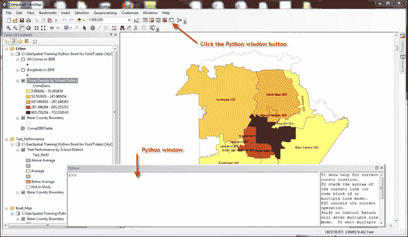

    Python 窗口本质上是一个 shell 窗口，允许你逐行输入语句，就在输入行字符`>>>`之后。在分隔符的右侧，你会找到一个帮助窗口。

1.  通过在 Python 窗口中右键单击并从菜单中选择 **加载** 来加载现有脚本。导航到 `c:\ArcpyBook\Ch2` 目录并选择 `ListFields.py` 以加载一个示例脚本。

    你也可以通过右键单击窗口并选择 **格式** 来格式化窗口中显示的字体和文本颜色。你将提供白色和黑色主题；你可以单独选择字体和颜色：

    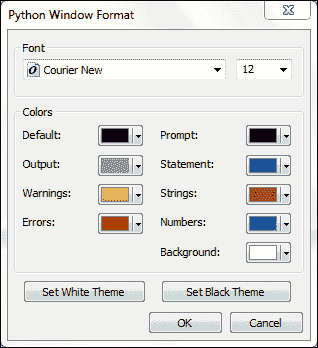

点击 **设置黑色主题** 按钮查看示例。如果你花费大量时间编写代码，你可能发现较暗的主题对眼睛更容易：

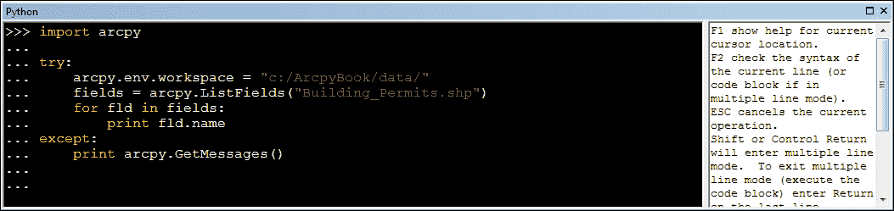

# 使用 Python 访问 ArcPy

在你可以利用 ArcPy 提供的所有地理处理功能之前，你必须首先将包导入到你的脚本中。这将是每个地理处理脚本中的第一行代码。

## 准备工作

ArcPy 是 ArcGIS 10 版本的一部分 Python 站点包，完全包含了 ArcGIS 9.2 中 `arcgis scripting` 模块提供的功能，进一步增强了其能力。使用 ArcPy，你可以访问用于处理 ESRI GIS 数据的地理处理工具、扩展、函数和类。ArcPy 为模块、类和函数提供代码补全和集成文档。ArcPy 还可以与其他 Python 模块集成，以扩大其功能范围。你用 Python 编写的所有 ArcGIS 地理处理脚本都必须首先提供对 ArcPy 的引用。

## 如何操作…

按照以下步骤将 `arcpy` 站点包导入到 ArcGIS Python 窗口：

1.  使用 ArcMap 打开 `c:\ArcpyBook\Ch2\Crime_Ch2.mxd` 文件。

1.  点击 Python 窗口按钮以显示一个可以编写 Python 代码的壳窗口。

1.  在 Python 窗口中导入 `arcpy` 包并按下键盘上的 *Enter* 键。在 Python 窗口中输入的每个语句之后，您都需要按下 *Enter* 键。您将在每个脚本中都包含这一行代码，所以请习惯它！这个 `import` 语句是您访问 ArcPy 提供的所有功能的基础。

    ### 注意

    从技术上讲，在 ArcMap Python 窗口内部工作时不一定要包含 `import arcpy` 语句。它是这个窗口固有的。然而，在创建 IDLE、PythonWin 或任何其他集成开发环境中的独立脚本时，它却是必需的。这也是一个好习惯，因为您的大多数脚本最终都将作为独立脚本运行。

    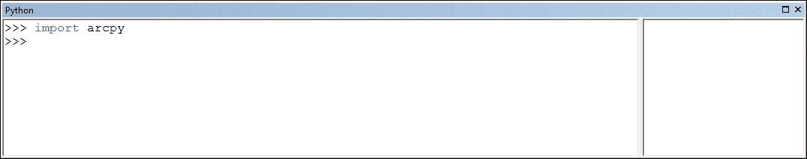

1.  ArcPy 还提供了代码补全功能，这使得您作为程序员的编程生活变得更加容易。在第二行，开始键入 `arcpy` 并然后一个点。ArcPy 是一个面向对象的包，这意味着您使用点符号来访问对象的属性和方法。请注意，提供了一个可用项的下拉列表。这些是在特定对象上可用的工具、函数、类和扩展。所有对象都有它们自己的相关项，因此呈现的项列表将根据您当前选定的对象而有所不同：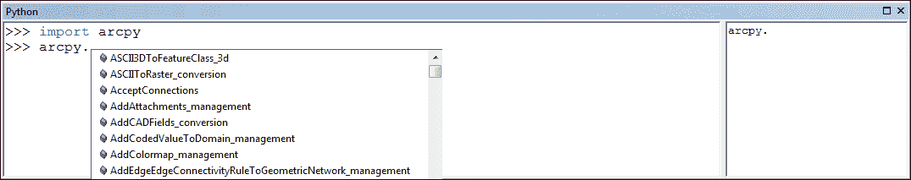

1.  这是一个自动过滤列表，因此当您开始键入工具、函数、类或扩展的名称时，列表将根据您输入的内容进行过滤：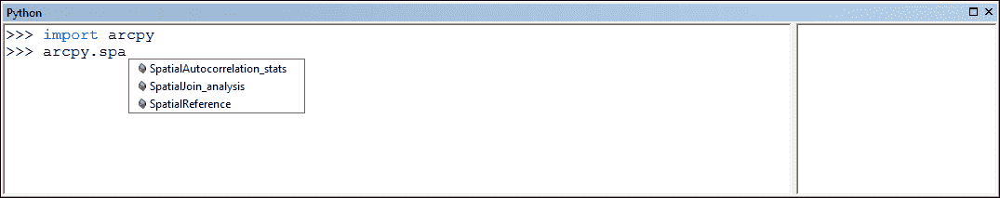

1.  您可以选择让 Python 窗口自动为您完成文本，通过鼠标从列表中选择一个项目，或者使用箭头键突出显示您的选择，然后使用 *Tab* 键来输入命令。这个自动完成功能使您成为一个更快、更高效的程序员。这不仅易于使用，而且还能显著减少您代码中的错误。

## 工作原理…

一旦导入了 ArcPy 模块，您就可以访问用于处理 ESRI GIS 数据的地理处理工具、扩展、函数和类。ArcPy 最重要的一点是，它根据当前使用的 ArcGIS Desktop 许可证级别提供对所有地理处理工具的访问。脚本可用的工具将根据您是否使用 ArcGIS 基础、标准或高级许可证级别而有所不同，其中基础级别提供最少的工具，而高级级别提供完整的工具集。

# 从脚本中执行工具

作为 ArcGIS 用户，您几乎肯定已经使用 ArcToolbox 中提供的许多工具来完成您的地理处理任务。一些例子包括 Clip、Buffer、Feature Class to Feature Class、Add Field 等。您的脚本可以执行 ArcToolbox 中找到的任何工具。请记住，您作为程序员可用的工具取决于您使用的 ArcGIS Desktop 的许可级别。这些任务可以通过创建一个执行这些工具的 Python 脚本来自动化。

## 如何操作…

1.  按照以下步骤学习如何从您的脚本中执行地理处理工具。使用 ArcMap 打开`c:\ArcpyBook\Ch2\TravisCounty.mxd`。

1.  打开 Python 窗口。

1.  导入`arcpy`包：

    ```py
    import arcpy
    ```

1.  设置工作空间。我们还没有讨论`env`类。ArcGIS 的环境设置作为`env`类的属性公开，它是`arcpy`的一部分。`env`类的一个属性是工作空间，它定义了数据输入和输出的当前工作目录。在这种情况下，它将是我们将从工具中写入输出数据集的目录：

    ```py
    arcpy.env.workspace = "c:/ArcpyBook/data/"
    ```

1.  我们将使用**Analysis Tools**工具箱中的**Buffer**工具来缓冲在 ArcMap 活动数据帧中看到的**Streams**层。打开 ArcToolbox 并找到此工具，如下面的截图所示：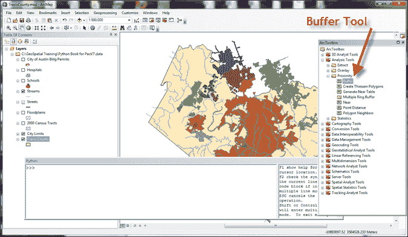

1.  双击**Buffer**工具以显示以下截图所示的界面。大多数工具都有一个或多个必须提供的输入参数，以便工具可以执行。无论您是从用户界面还是从 Python 脚本中运行工具，您都必须始终提供这些必需的参数：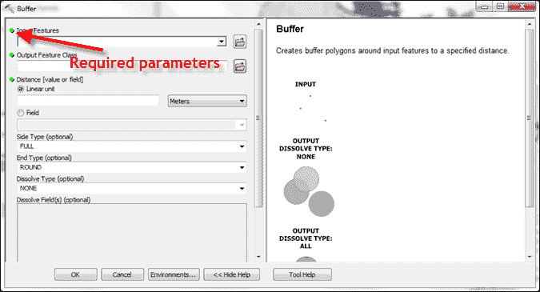

1.  关闭**Buffer**工具。

1.  在 Python 窗口中执行**Buffer**工具。使用 Python 窗口的代码补全功能以及窗口右侧显示的工具帮助来帮助您。

    这将使**Streams**层缓冲 50 米以创建一个新的`Streams_Buff`多边形层：

    ```py
    arcpy.Buffer_analysis("Streams", "Streams_Buff", "50 Meters")
    ```

1.  使用您的 ArcMap**缩放**和**平移**工具来更好地查看输出数据集，如下面的截图所示：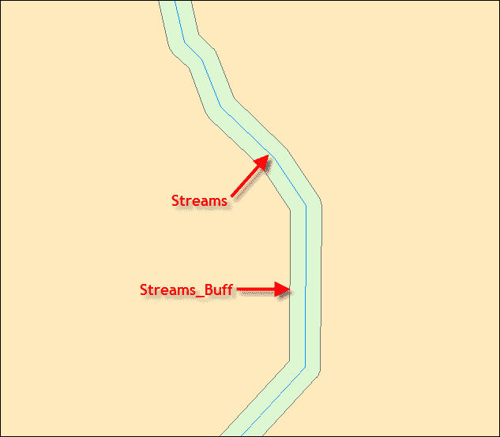

## 它是如何工作的…

您的脚本可用的所有地理处理工具都定义为来自主`arcpy`对象的动态函数。您从脚本中执行的每个工具都必须遵循特定的语法，首先定义工具名称，然后是一个下划线，接着是工具箱名称的别名。在我们的例子中，**Buffer**工具位于**Analysis Tools**工具箱中，其别名为`analysis`。这样做是因为可能存在多个工具具有相同的名称。使用语法`<toolname>_<toolbox_alias>`为每个工具生成一个唯一的引用。

在 ArcGIS Desktop 中获取工具箱别名很容易。找到与工具关联的工具箱，右键单击工具箱名称。选择**属性**。在显示的**属性**对话框中，找到**别名**文本框。当在地理处理脚本中引用特定工具时，你会看到以下别名：

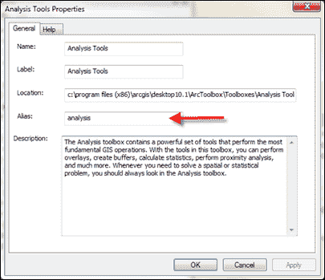

除了表示地理处理工具的动态函数外，`arcpy`类上还有许多其他可用函数，它们不是地理处理工具。提供了创建游标、列出数据集、描述数据集、处理环境设置、消息传递等许多其他功能的函数。随着我们阅读本书，我们将介绍这些函数中的许多。

## 还有更多…

地理处理工作流程通常需要多个步骤，这些步骤需要使用一个或多个地理处理工具。通过首先为你的脚本创建一个大纲，你可以更高效、更有效地开发脚本。这个大纲将帮助你考虑手头的任务并确定将使用的地理处理工具。大纲不必是复杂的任务。你可以简单地绘制一个工作流程图，然后根据这个工作流程实现你的代码。关键是实际开始编码之前做一些规划。

# 使用 ArcGIS Desktop 帮助

ArcGIS Desktop 帮助系统是获取任何可用工具信息的优秀资源。每个工具都在一个独特的页面上进行了详细描述。帮助系统可通过 ArcGIS Desktop 或在线访问。

## 准备工作

除了包含每个工具的基本描述信息外，帮助系统还包括对 Python 程序员感兴趣的信息，包括语法和代码示例，这些示例提供了有关如何在脚本中使用工具的详细信息。在本食谱中，你将学习如何访问 ArcGIS Desktop 帮助系统以获取语法信息和代码示例。

## 如何操作...

按照以下步骤学习如何使用 ArcGIS Desktop 帮助系统访问有关工具的语法信息，以及一个代码示例，展示如何在脚本中使用该工具。

1.  如果需要，打开 ArcMap 并从主菜单中选择**帮助** | **ArcGIS Desktop 帮助**。

1.  选择**内容**选项卡。

1.  选择**地理处理** | **工具参考**。工具根据工具箱分组，就像在 ArcToolbox 中一样。

1.  选择**分析工具箱**，然后选择**邻近工具集**。

1.  点击**缓冲区**工具。你应该会看到显示的**缓冲区**工具帮助，如图所示：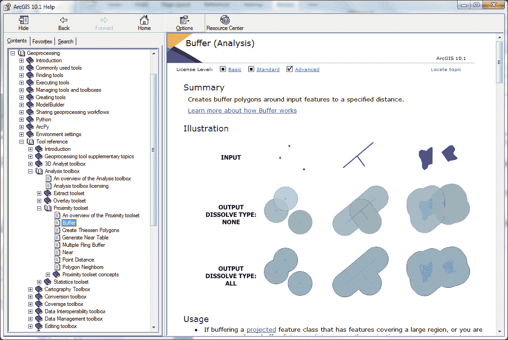

1.  滚动到**语法**部分，如图所示：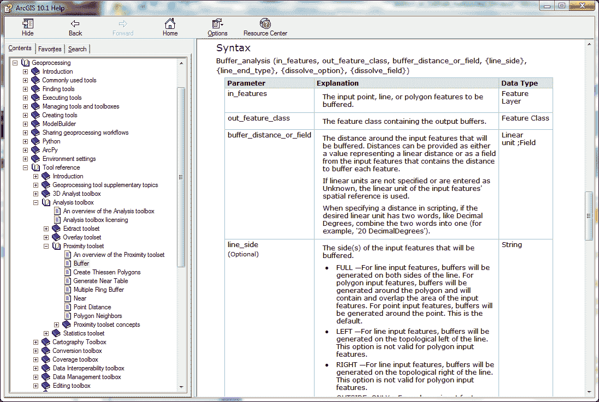

1.  该部分定义了从脚本中调用工具的语法。在这种情况下，语法如下：

    ```py
    Buffer_analysis (in_features, out_feature_class, buffer_distance_or_field, {line_side}, {line_end_type}, {dissolve_option}, {dissolve_field})
    ```

1.  滚动到 **代码示例** 部分。在这里，你可以找到一个或多个代码示例，展示如何在你的脚本中使用工具。我总是建议在编写脚本之前查看这些示例。

## 它是如何工作的...

每个工具的帮助系统包含几个部分，包括摘要、插图、用法、语法、代码示例、环境、相关主题和许可信息。作为一个程序员，你主要会对语法和代码示例部分感兴趣。

当查看语法部分时，请注意，你通过名称后跟一个下划线和工具所在工具箱的别名来调用每个工具。我们在这个章节的早期部分简要讨论了这一点。

工具通常接受一个或多个参数，这些参数通过括号传递到工具内部。参数可以是必需的或可选的。在这种情况下，**Buffer** 工具包括三个必需参数：输入要素、输出要素类和距离。必需参数首先列出，并且不被任何特殊字符包围。另一方面，可选参数被大括号包围，并且将跟在必需参数之后。**Buffer** 工具包含几个可选参数，包括线侧、线端类型、溶解选项和溶解字段。请注意，这些参数中的每一个都被大括号包围。在调用工具时，你不必包括这些参数，它仍然可以执行。

你还应该更详细地检查语法信息，以确定每个参数应传递的数据类型。例如，`buffer_distance_or_field` 参数可以接受的数据类型可以是线性单位或字段。因此，你可以为这个参数提供一个数值或一个表示包含距离信息的属性字段的 `Field` 对象。

在你的代码中使用每个工具之前，总是要检查其语法，以确保你有正确的参数、正确的顺序和正确的数据类型。

我建议你也看看代码示例，因为它们通常会为你提供脚本的起点。通常你会发现，你可以将示例代码的一部分复制粘贴到自己的脚本中，然后修改脚本以满足你的需求。这可以使你成为一个更高效的程序员，并且在学习方面，查看其他脚本并逐行检查脚本以确定脚本的工作方式是有帮助的。

# 使用变量存储数据

在第一章《ArcGIS 的 Python 语言基础》中，我们讨论了变量的主题，因此你应该对这些结构有一个基本的了解。在脚本中，变量被赋予一个名称并分配一个数据值。这些命名变量占据了计算机内存中的空间，在脚本运行期间，这些结构中的数据可以改变。脚本完成后，这些变量占用的内存空间将被释放，可用于其他操作。

## 准备工作

当使用 Python 编写地理处理脚本时，你将需要多次创建变量来存储不同类型的数据。这些数据然后可以用作脚本中的工具和函数的输入参数，作为内部处理的中间数据，存储数据集的路径，以及其他原因。此外，许多 ArcPy 函数和工具也会返回数据，这些数据可以存储在变量中以供脚本进一步使用。在本食谱中，你将学习创建变量并将数据赋给它们的基本技术。

## 如何做到这一点...

按照以下步骤创建一个包含硬编码值和从函数返回的变量的脚本：

1.  打开 IDLE 并创建一个新的脚本窗口。

1.  将脚本保存到`c:\ArcpyBook\Ch2\WorkingWithVariables.py`。

1.  导入`arcpy`包：

    ```py
    import arcpy
    ```

1.  创建一个名为`path`的变量并将其赋予一个值：

    ```py
    path = "c:/ArcpyBook/data"
    ```

1.  使用新创建的变量设置工作空间：

    ```py
    arcpy.env.workspace = path
    ```

1.  调用`ListFields()`函数并将返回值赋给一个名为`fields`的新变量：

    ```py
    fields = arcpy.ListFields("Building_Permits.shp")
    ```

1.  开始一个`for`循环以处理`fields`变量中包含的每个字段对象：

    ```py
    for fld in fields:
    ```

1.  打印每个字段的名称：

    ```py
    print fld.name
    ```

1.  整个脚本应如下所示：

    ```py
    import arcpy
    path = "c:/ArcpyBook/data"

    arcpy.env.workspace = path
    fields = arcpy.ListFields("Building_Permits.shp")
    for fld in fields:
           print fld.name
    ```

1.  保存脚本。

## 它是如何工作的...

在此脚本中我们创建了三个变量。第一个变量`path`被创建并赋予了一个硬编码的数据路径值。这是一个字面量变量的例子，意味着它们确实就是所说的那样。它们与变量不同，变量的值不是直接由其名称确定的。第二个变量`fields`是由`ListFields()`函数的返回值创建的，是一个包含一个或多个`Field`对象的 Python 列表对象。每个`Field`代表一个来自要素类或独立表的属性表中的字段。最后一个变量是一个名为`fld`的动态变量。当`for`循环遍历`ListFields()`函数返回的列表时，每个`Field`被分配给`fld`变量。然后，每个字段的名称将被打印到屏幕上。

# 使用 Python 访问 ArcPy 模块

到目前为止，我们已经介绍了一些与 ArcPy 相关的基本概念。除了基本的 ArcPy 站点包外，还有一些模块可以用来访问特定的功能。在使用这些模块提供的功能之前，你必须将这些模块明确导入到你的脚本中。在本教程中，你将学习如何导入这些模块。

## 准备工作

除了提供对工具、函数和类的访问外，ArcPy 还提供了几个模块。**模块**是针对特定目的的 Python 库，包含函数和类。这些模块包括一个映射模块（`arcpy.mapping`）、一个数据访问模块（`arcpy.da`）、一个空间分析模块（`arcpy.sa`）、一个地理统计模块（`arcpy.ga`）、一个网络分析模块（`arcpy.na`）和一个时间模块（`arcpy.time`）。要使用这些模块包含的函数和类，你必须明确导入它们相关的库。

## 如何操作…

按照以下步骤学习如何使用`arcpy.mapping`模块提供的函数和类：

1.  使用 ArcMap 打开`c:\ArcpyBook\Ch2\Crime_Ch2.mxd`。

1.  打开 Python 窗口。

1.  导入`arcpy.mapping`模块：

    ```py
    import arcpy.mapping as mapping
    ```

1.  获取当前地图文档（`Crime_Ch2.mxd`）的引用：

    ```py
    mxd = mapping.MapDocument("CURRENT")
    ```

1.  调用`arcpy.mapping.ListLayers`函数：

    ```py
    print mapping.ListLayers(mxd)
    ```

    这将返回地图文档中所有层的列表，并将这些打印到 shell 窗口中：

    ```py
    [<map layer u'City of Austin Bldg Permits'>, <map layer u'Hospitals'>, <map layer u'Schools'>, <map layer u'Streams'>, <map layer u'Streets'>, <map layer u'Streams_Buff'>, <map layer u'Floodplains'>, <map layer u'2000 Census Tracts'>, <map layer u'City Limits'>, <map layer u'Travis County'>]

    ```

访问映射模块中所有可用的函数和对象的方式是相同的。

## 它是如何工作的…

ArcPy 提供的每个模块都提供了访问特定功能的方法。例如，ArcPy 映射模块提供了访问允许你管理地图文档和层文件的函数。该模块中的函数和对象都与以某种方式管理这些文件相关。
