# 第三章. 管理地图文档和图层

在本章中，我们将介绍以下菜谱：

+   引用当前地图文档

+   引用磁盘上的地图文档

+   访问数据框架

+   获取地图文档中的图层列表

+   限制图层列表

+   改变地图范围

+   获取表格列表

+   向地图文档中添加图层

+   将图层插入到地图文档中

+   更新图层符号

+   更新图层属性

# 简介

ArcPy 映射模块是 ArcGIS 10 的新功能，为地图自动化带来了许多令人兴奋的特性，包括管理地图文档和图层文件以及这些文件中的数据的能力。支持自动化地图导出和打印，创建 PDF 地图集以及将地图文档发布到 ArcGIS Server 地图服务。这是一个极其有用的模块，可以完成许多 GIS 分析师日常执行的任务。

在本章中，您将学习如何使用 ArcPy 映射模块来管理地图文档和图层文件。您将学习如何将地理图层和表格添加到地图文档文件中，从地图文档中删除图层，将图层插入到数据框架中，以及在地图文档中移动图层。最后，您将学习如何更新图层属性和符号。

# 引用当前地图文档

当您从 ArcGIS Python 窗口或自定义脚本工具运行地理处理脚本时，您通常会需要获取当前在 ArcMap 中加载的地图文档的引用。在您对地图文档中的图层和表格执行地理处理操作之前，这是脚本中的第一步。在本菜谱中，您将学习如何从您的 Python 地理处理脚本中引用当前地图文档。

## 准备工作

在您实际上对地图文档文件执行任何操作之前，您需要在您的 Python 脚本中获取对其的引用。这是通过在 `arcpy.mapping` 模块上调用 `MapDocument()` 方法来完成的。您可以引用当前活动的文档或磁盘上特定位置的文档。要引用当前活动的文档，您只需将关键字 `CURRENT` 作为参数提供给 `MapDocument()` 函数。这将获取 ArcMap 中的当前活动文档。以下代码示例显示了如何获取当前活动文档的引用：

```py
mxd = mapping.MapDocument("CURRENT")
```

### 注意

当您从 ArcGIS Python 窗口或自定义脚本工具运行脚本时，您只能使用 `CURRENT` 关键字。如果您尝试在 IDLE 或任何其他开发环境中使用此关键字运行脚本，它将无法访问当前在 ArcGIS 中加载的地图文档文件。我还应该指出，`CURRENT` 关键字不区分大小写。您同样可以使用 `current`。

要引用本地或远程驱动器上的地图文档，只需提供地图文档的路径以及地图文档名称作为 `MapDocument()` 的参数。例如，您可以使用以下引用引用 `c:\data` 文件夹中的 `crime.mxd` 文件：`arcpy.mapping.MapDocument("C:/data/crime.mxd")`。

## 如何操作…

按照以下步骤学习如何在 ArcMap 中访问当前活动的地图文档：

1.  使用 ArcMap 打开 `c:\ArcpyBook\Ch3\Crime_Ch3.mxd`。

1.  从 ArcMap 的主工具栏中点击 Python 窗口按钮。

1.  通过在 Python 窗口中输入以下内容导入 `arcpy.mapping` 模块：

    ```py
    import arcpy.mapping as mapping
    ```

1.  引用当前活动文档 (`Crime_Ch3.mxd`) 并通过在 Python 窗口中输入以下内容将引用分配给变量： 

    ```py
    mxd = mapping.MapDocument("CURRENT")
    ```

1.  获取地图文档的标题并将其打印到壳窗口。当脚本执行时，地图文档的标题将使用 Python 的 `print` 语句打印出来：

    ```py
    print mxd.title
    ```

1.  为地图文档设置新标题：

    ```py
    mxd.title = "Copy of Crime Project"
    ```

1.  使用 saveACopy() 方法保存地图文档文件的副本。

    ```py
    mxd.saveACopy("c:/ArcpyBook/Ch3/crime_copy.mxd")
    ```

1.  运行脚本。

1.  在 ArcMap 中打开您刚刚创建的 `crime_copy.mxd` 文件，并选择 **文件** | **地图文档属性** 来查看您为地图文档设置的新标题。

## 工作原理

`MapDocument` 类有一个构造函数，用于创建该类的实例。在面向对象编程中，**实例**也称为**对象**。`MapDocument` 的构造函数可以接受 `CURRENT` 关键字或本地或远程驱动器上地图文档文件的路径。构造函数创建一个对象并将其分配给变量 `mxd`。然后，您可以使用点符号访问该对象上可用的属性和方法。在这种情况下，我们使用 `MapDocument.title` 属性打印出地图文档文件的标题，并且我们还使用了 `MapDocument.saveACopy()` 方法来保存地图文档文件的副本。

# 引用磁盘上的地图文档

除了能够在 ArcMap 中引用当前活动的地图文档文件外，您还可以使用 `MapDocument()` 方法访问存储在本地或远程驱动器上的地图文档文件。在本教程中，您将学习如何访问这些地图文档。

## 准备工作

如我之前提到的，您还可以引用存储在您的计算机或共享服务器上的地图文档文件。这只需提供文件的路径即可完成。这是一种更灵活的获取地图文档引用的方法，因为它可以在 ArcGIS Python 窗口或自定义脚本工具之外运行。

## 如何操作…

按照以下步骤学习如何访问存储在本地或远程驱动器上的地图文档：

1.  从 **开始** | **程序** | **ArcGIS** | **Python 2.7** | **IDLE** 打开 IDLE 开发环境。

1.  通过从 IDLE 壳窗口中选择 **新建** | **新建窗口** 创建一个新的 IDLE 脚本窗口。

1.  导入 `arcpy.mapping`：

    ```py
    import arcpy.mapping as mapping
    ```

1.  引用你在上一个菜谱中创建的 `crime` 地图文档的副本：

    ```py
    mxd = mapping.MapDocument("c:/ArcpyBook/Ch3/crime_copy.mxd")
    ```

1.  打印地图文档的标题：

    ```py
    print mxd.title
    ```

1.  运行脚本以查看以下输出：

    ```py
    Copy of Crime Project

    ```

## 它是如何工作的…

与上一个菜谱相比，唯一的区别是我们提供了一个指向本地或远程驱动器上的地图文档文件的引用，而不是使用 `CURRENT` 关键字。除非你确定你的地理处理脚本将在 ArcGIS 内运行，无论是 Python 窗口还是自定义脚本工具，否则这是引用地图文档文件的推荐方式。

# 访问数据帧

ArcMap 的目录由一个或多个数据帧组成。每个数据帧可以包含图层和表格。数据帧可以用来过滤从各种列表函数（如 `ListLayers()`）返回的列表。例如，可以使用 `DataFrame` 对象作为输入参数，将 `ListLayers()` 函数返回的图层限制在特定数据帧内。您还可以使用 DataFrame 对象获取或设置当前地图范围，这在创建地图册时可能很有用。在本菜谱中，您将学习如何从您的 Python 脚本中访问数据帧。

## 准备工作

`ListDataFrames()` 函数返回一个 `DataFrame` 对象列表。每个数据帧可以包含图层和表格，并且可以用来限制 `ListLayers()` 和 `ListTablesViews()` 函数返回的列表。

## 如何操作...

按照以下步骤学习如何从地图文档中获取图层列表：

1.  使用 ArcMap 打开 `c:\ArcpyBook\Ch3\Crime_Ch3.mxd`。

1.  从主 ArcMap 工具栏中点击 Python 窗口按钮。

1.  导入 `arcpy.mapping` 模块：

    ```py
    import arcpy.mapping as mapping
    ```

1.  引用当前活动文档（`Crime_Ch3.mxd`）并将引用分配给一个变量：

    ```py
    mxd = mapping.MapDocument("CURRENT")
    ```

1.  调用 `ListDataFrames()` 函数并传递一个指向地图文档的引用，以及一个用于仅查找以字母 `C` 开头的数据帧的通配符：

    ```py
    frames = mapping.ListDataFrames(mxd,"C*")
    ```

1.  开始一个 `for` 循环并打印出地图文档中每个图层的名称：

    ```py
    for df in frames:
        print df.name
    ```

1.  运行脚本以查看以下输出：

    ```py
    Crime
    Crime_Inset

    ```

## 它是如何工作的...

`ListDataFrames()` 函数返回 ArcMap 目录中所有数据帧的列表。像任何其他 Python 列表一样，您可以使用 `for` 循环遍历列表的内容。在 `for` 循环内部，每个数据帧被动态分配给 `df` 变量，并将数据帧的名称打印到屏幕上。

# 获取地图文档中图层列表

在地理处理脚本中的第一步通常是获取地图文档中的图层列表。一旦获取，您的脚本可能会遍历每个图层并执行某种类型的处理。映射模块包含一个 `ListLayers()` 函数，它提供了获取此图层列表的能力。在本菜谱中，您将学习如何获取地图文档中包含的图层列表。

## 准备工作

`arcpy.mapping` 模块包含各种列表函数，用于返回图层、数据框架、损坏的数据源、表视图和布局元素的列表。这些列表函数通常是多步过程中的第一步，其中脚本需要从列表中获取一个或多个项目以进行进一步处理。这些列表函数中的每一个都返回一个 Python 列表，正如您在本书前面的内容中所知，这是一个用于存储信息的高度功能性的数据结构。

通常，列表函数作为多步过程的一部分使用，其中创建列表只是第一步。脚本中的后续处理将遍历列表中的一个或多个项目。例如，您可能从地图文档中获取图层列表，然后遍历每个图层以查找特定的图层名称，然后该图层将受到进一步地理处理的约束。

在本菜谱中，您将学习如何从地图文档文件中获取图层列表。

## 如何操作...

按照以下步骤学习如何从地图文档中获取图层列表：

1.  使用 ArcMap 打开 `c:\ArcpyBook\Ch3\Crime_Ch3.mxd`。

1.  从主 ArcMap 工具栏中点击 Python 窗口按钮。

1.  导入 `arcpy.mapping` 模块：

    ```py
    import arcpy.mapping as mapping
    ```

1.  引用当前活动文档（`Crime_Ch3.mxd`）并将引用分配给一个变量：

    ```py
    mxd = mapping.MapDocument("CURRENT")
    ```

1.  调用 `ListLayers()` 函数并传递地图文档的引用：

    ```py
    layers = mapping.ListLayers(mxd)
    ```

1.  开始一个 `for` 循环并打印出地图文档中每个图层的名称：

    ```py
    for lyr in layers:
        print lyr.name
    ```

1.  运行脚本以查看以下输出：

    ```py
    Burglaries in 2009
    Crime Density by School District
    Bexar County Boundary
    Test Performance by School District
    Bexar County Boundary
    Bexar County Boundary
    Texas Counties
    School_Districts
    Crime Surface
    Bexar County Boundary

    ```

## 工作原理...

`ListLayers()` 函数检索地图文档中的图层列表、特定数据框架或图层文件。在这种情况下，我们将当前地图文档的引用传递给 `ListLayers()` 函数，它将检索地图文档中的所有图层列表。结果将存储在一个名为 `layers` 的变量中，这是一个可以由 `for` 循环迭代的 Python 列表。这个 Python 列表包含一个或多个 `Layer` 对象。

## 还有更多...

`ListLayers()` 函数是 `arcpy mapping` 模块提供的许多列表函数之一。这些函数中的每一个都返回一个包含某种类型数据的 Python 列表。其他一些列表函数包括 `ListTableViews()`，它返回一个 `Table` 对象列表，`ListDataFrames()` 返回一个 `DataFrame` 对象列表，以及 `ListBookmarks()` 返回地图文档中的书签列表。还有其他列表函数，其中许多我们将在本书的后续章节中介绍。

# 限制图层列表

在前面的菜谱中，您学习了如何使用 `ListLayers()` 函数获取图层列表。有时您可能不希望获取地图文档中所有图层的列表，而只是部分图层的子集。`ListLayers()` 函数允许您限制生成的图层列表。在本菜谱中，您将学习如何使用通配符和 ArcMap 内容表中的特定数据框架来限制返回的图层。

## 准备工作

默认情况下，如果你只传递地图文档或图层文件的引用，`ListLayers()` 函数将返回这些文件中的所有图层列表。然而，你可以通过使用可选的通配符参数或传递特定数据框的引用来限制该函数返回的图层列表。

### 注意

如果你正在处理一个图层文件（`.lyr`），你不能使用数据框来限制图层。图层文件不支持数据框。

在这个菜谱中，你将学习如何通过使用通配符和数据框来限制 `ListLayers()` 返回的图层列表。

## 如何做到这一点…

按照以下步骤学习如何限制来自地图文档的图层列表：

1.  使用 ArcMap 打开 `c:\ArcpyBook\Ch3\Crime_Ch3.mxd`。

1.  从主 ArcMap 工具栏中点击 Python 窗口按钮。

1.  导入 `arcpy.mapping` 模块：

    ```py
    import arcpy.mapping as mapping
    ```

1.  引用当前活动文档（`Crime_Ch3.mxd`）并将引用分配给一个变量：

    ```py
    mxd = mapping.MapDocument("CURRENT")
    ```

1.  获取地图文档中的数据框列表并搜索特定的数据框名称 `Crime`。请注意，文本字符串可以由单引号或双引号包围：

    ```py
    for df in mapping.ListDataFrames(mxd):
      if (df.name == 'Crime'):
    ```

1.  调用 `ListLayers()` 函数并传递地图文档的引用、一个用于限制搜索的通配符以及上一步找到的数据框，以进一步限制搜索。`ListLayers()` 函数应该缩进在刚刚创建的 `if` 语句内部：

    ```py
    layers = mapping.ListLayers(mxd,'Burg',df)
    ```

1.  开始一个 `for` 循环并打印出地图文档中每个图层的名称。

    ```py
    for layer in layers:
        print layer.name
    ```

1.  完整的脚本应如下所示：

    ```py
    import arcpy.mapping as mapping
    mxd = mapping.MapDocument("CURRENT")
    for df in mapping.ListDataFrames(mxd):
      if (df.name == 'Crime'):
            layers = mapping.ListLayers(mxd,"'Burg*',df)
            for layer in layers:
          print layer.name
    ```

1.  运行脚本以查看以下输出：

    ```py
    Burglaries in 2009

    ```

## 它是如何工作的…

如同你在之前的菜谱中学到的，`ListDataFrames()` 函数是 `arcpy mapping` 提供的另一个列表函数。这个函数返回一个包含地图文档中所有数据框的列表。然后我们遍历这个函数返回的每个数据框，寻找一个名为 `Crime` 的数据框。如果我们确实找到了一个具有这个名称的数据框，我们就调用 `ListLayers()` 函数，将可选通配符值 `Burg*` 作为第二个参数传递，以及 `Crime` 数据框的引用。作为第二个参数传递的通配符值接受任意数量的字符和一个可选的通配符字符（`*`）。

在这个特定的菜谱中，我们正在搜索所有以字符 `Burg` 开头并且数据框名称为 `Crime` 的图层。任何符合这些限制的图层都会被打印出来。请注意，在这种情况下，我们只是在打印图层名称，但在大多数情况下，你将通过使用工具或其他函数执行额外的地理处理。

# 改变地图范围

在你需要更改地图范围的情况下会有很多机会。当你自动化地图生产过程并需要创建不同区域或特征的许多地图时，这通常是这种情况。有几种方法可以使用 `arcpy` 来更改地图范围。但是，对于这个配方，我们将专注于使用定义表达式来更改范围。

## 准备工作

`DataFrame` 类有一个 `extent` 属性，你可以使用它来设置地理范围。这通常与用于为图层定义定义查询的 `Layer.definitionQuery` 属性一起使用。在本配方中，你将学习如何使用这些对象和属性来更改地图范围。

## 如何操作...

按照以下步骤学习如何从地图文档中获取图层列表：

1.  使用 ArcMap 打开 `c:\ArcpyBook\Ch3\Crime_Ch3.mxd`。

1.  从 ArcMap 的主工具栏中单击 Python 窗口按钮。

1.  导入 `arcpy.mapping` 模块：

    ```py
    import arcpy.mapping as mapping
    ```

1.  引用当前活动文档（`Crime_Ch3.mxd`），并将引用分配给变量：

    ```py
    mxd = mapping.MapDocument("CURRENT")
    ```

1.  创建一个 `for` 循环，该循环将遍历地图文档中的所有数据框：

    ```py
    for df in mapping.ListDataFrames(mxd):
    ```

1.  找到名为 `Crime` 的数据框以及我们将应用定义查询的特定图层：

    ```py
    if (df.name == 'Crime'):
      layers = mapping.ListLayers(mxd,'Crime Density by 
      School District',df)
    ```

1.  创建一个 `for` 循环，该循环将遍历图层。只有一个，但我们仍然会创建循环。在 `for` 循环中，创建一个定义查询并设置数据框的新范围：

    ```py
    for layer in layers:
      query = '"NAME" = \'Lackland ISD\''
      layer.definitionQuery = query
      df.extent = layer.getExtent()
    ```

1.  整个脚本应如下所示：

    ```py
    import arcpy.mapping as mapping
    mxd = mapping.MapDocument("CURRENT")
    for df in mapping.ListDataFrames(mxd):
      if (df.name == 'Crime'):
        layers = mapping.ListLayers(mxd,'Crime Density by School District',df)
      for layer in layers:
          query = '"NAME" = \'Lackland ISD\''
          layer.definitionQuery = query
          df.extent = layer.getExtent()
    ```

1.  保存并运行脚本。数据视图的范围应更新，以仅可视化与定义表达式匹配的特征，如下面的截图所示：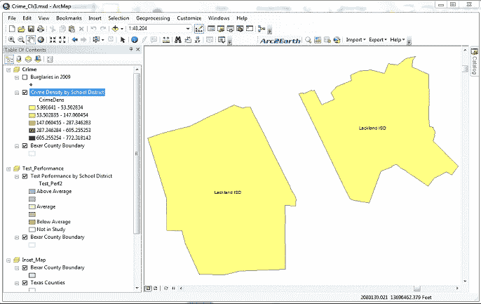

## 工作原理...

此配方在图层上使用定义查询来更新地图范围。在脚本末尾，你创建了一个名为 `query` 的新变量，用于存储定义表达式。该定义表达式被设置为查找名为 `Lackland ISD` 的学区。然后将此查询字符串应用于 `definitionQuery` 属性。最后，将 `df.extent` 属性设置为 `layer.getExtent()` 返回的值。

# 获取表格列表

`arcpy.mapping` 模块还有一个 `ListTableViews()` 函数，你可以使用它来获取包含在地图文档中的独立表格列表。在本配方中，你将学习如何使用 `ListTableViews()` 函数来创建此表格列表。

## 准备工作

除了提供在地图文档或数据框中生成图层列表的能力外，`arcpy mapping` 模块还提供了一个 `ListTableViews()` 函数，该函数生成表格列表。

### 注意

`ListTableViews()` 只适用于地图文档文件及其包含的数据框。图层文件没有保留表格的能力。

## 如何操作…

按照以下步骤学习如何获取地图文档中的独立表格列表：

1.  使用 ArcMap 打开 `c:\ArcpyBook\Ch3\Crime_Ch3.mxd`。

1.  从主 ArcMap 工具栏中点击 Python 窗口按钮。

1.  导入`arcpy.mapping`模块：

    ```py
    import arcpy.mapping as mapping
    ```

1.  引用当前活动文档（`Crime_Ch3.mxd`），并将引用分配给变量：

    ```py
    mxd = mapping.MapDocument("CURRENT")
    ```

1.  生成地图文档中的表格列表：

    ```py
    for tableView in mapping.ListTableViews(mxd):
        print tableView.name
    ```

1.  运行脚本以查看以下输出：

    ```py
    Crime2009Table

    ```

## 工作原理…

`ListTableViews()`函数与`arcpy.mapping`提供的其他列表函数非常相似。与`ListLayers()`函数的情况一样，`ListTableViews()`函数接受一个地图文档的引用（但不是图层文件），以及可选的通配符和数据帧参数。输出是一个可以迭代以`for`循环的表格列表。

# 将图层添加到地图文档

将会有许多需要将图层添加到地图文档的情况。映射模块通过`AddLayer()`函数提供此功能。在本例中，您将学习如何使用此函数将图层添加到地图文档。

## 准备工作

`arcpy.mapping`提供了将图层添加到现有地图文档文件或将图层分组到现有地图文档文件中的功能。您可以利用 ArcMap 的“自动排列”功能，该功能自动将图层放置在数据帧中以供查看。这基本上与 ArcMap 中**添加数据**按钮提供的功能相同，该按钮根据几何类型和图层权重规则将图层定位在数据帧中。

### 注意

无法将图层添加到图层文件（`.lyr`）中。

当将图层添加到地图文档时，图层必须引用磁盘上图层文件中找到的现有图层、同一地图文档和数据帧、同一地图文档的不同数据帧或完全不同的地图文档。图层可以是地图文档中的图层或`.lyr`文件中的图层。要将图层添加到地图文档，您必须首先创建`Layer`类的实例，然后调用`AddLayer()`函数，传入新图层以及它应该放置的数据帧和定位规则。

## 如何操作…

按照以下步骤学习如何将图层添加到地图文档：

1.  使用 ArcMap 打开`c:\ArcpyBook\Ch3\Crime_Ch3.mxd`。

1.  从主 ArcMap 工具栏中点击 Python 窗口按钮。

1.  导入`arcpy.mapping`模块：

    ```py
    import arcpy.mapping as mapping
    ```

1.  引用当前活动文档（`Crime_Ch3.mxd`），并将引用分配给变量：

    ```py
    mxd = mapping.MapDocument("CURRENT")
    ```

1.  获取对`Crime`数据帧的引用，它是`ListDataFrames()`返回的列表中的第一个数据帧。代码末尾指定的`[0]`获取从`ListDataFrames()`方法返回的第一个数据帧，该方法返回一个数据帧列表。列表是从零开始的，因此要检索第一个数据帧，我们提供一个索引`0`。

    ```py
    df = mapping.ListDataFrames(mxd)[0]
    ```

1.  创建一个引用`.lyr`文件的`Layer`对象。

    ```py
    layer = mapping.Layer(r"C:\ArcpyBook\data\School_Districts.lyr")
    ```

1.  将图层添加到数据帧：

    ```py
    mapping.AddLayer(df,layer,"AUTO_ARRANGE")
    ```

1.  运行脚本。`School_District.lyr`文件将被添加到数据帧中，如下面的截图所示：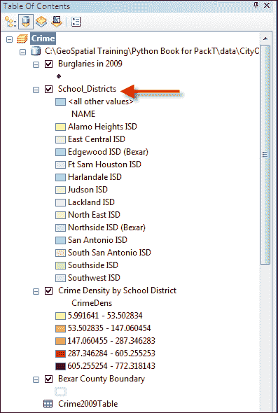

## 工作原理…

在前两行中，我们简单地引用了 `arcpy.mapping` 模块，并获取了对当前活动地图文档的引用。接下来，我们创建了一个名为 `df` 的新变量，它包含对 `Crime` 数据框的引用。这是通过 `ListDataFrames()` 函数获得的，该函数返回一个数据框对象列表。然后我们使用列表访问返回列表中的第一个项目，即 `Crime` 数据框。然后从磁盘上存储的 `layer` 文件创建了一个新的 `Layer` 实例，该文件名为 `School_Districts.lyr`。最后，我们调用 `AddLayer()` 函数，传入层将驻留的数据框以及层的引用，以及一个参数表示我们希望使用 **自动排列** 功能。除了允许 ArcMap 使用自动排列自动将层放置到数据框中之外，你还可以使用 `BOTTOM` 或 `TOP` 位置将层具体放置在数据框或组图层的顶部或底部。

## 还有更多…

除了提供将层添加到地图文档的能力之外，`arcpy.mapping` 还提供了一个 `AddLayerToGroup()` 函数，可以用来将层添加到组图层中。层可以添加到组图层的顶部或底部，或者你可以使用自动排列进行放置。你还可以将层添加到空组图层中。然而，就像常规层对象一样，组图层不能添加到层文件中。

从数据框或组图层中也可以移除层。`RemoveLayer()` 函数用于移除一个层或组层。如果两个层具有相同的名称，除非你的脚本设置为迭代，否则只移除第一个。

# 将层插入到地图文档中

`AddLayer()` 函数可以用来将层添加到地图文档中，无论是通过自动排列还是作为数据框中的第一层或最后一层。然而，它并不提供你在数据框中插入层所需的控制。为了获得这种额外的控制，你可以使用 `InsertLayer()` 函数。在这个菜谱中，你将学习如何控制添加到数据框中的层的放置。

## 准备工作

`AddLayer()` 函数简单地将层添加到数据框或组图层中，并自动使用自动排列或指定放置在数据框或组图层的顶部或底部。`InsertLayer()` 方法允许更精确地将新层放置到数据框或组图层中。它使用参考层来指定位置，并且层被添加到参考层之前或之后，具体取决于你的代码。由于 `InsertLayer()` 需要使用参考层，因此你无法在空数据框上使用此方法。

这在上面的截图中有说明，其中`District_Crime_Join`是参考图层，而`School_Districts`是要添加的图层。使用`InsertLayer()`，`School_Districts`图层可以放在参考图层之前或之后。


## 如何操作…

按照以下步骤学习如何使用`InsertLayer()`函数将图层插入到数据框中：

1.  使用 ArcMap 打开`c:\ArcpyBook\Ch3\Crime_Ch3.mxd`。

1.  从 ArcMap 主工具栏中点击 Python 窗口按钮。

1.  导入`arcpy.mapping`模块：

    ```py
    import arcpy.mapping as mapping
    ```

1.  引用当前活动文档（`Crime_Ch3.mxd`），并将引用分配给一个变量：

    ```py
    mxd = mapping.MapDocument("CURRENT")
    ```

1.  获取对`Crime`数据框的引用：

    ```py
    df = mapping.ListDataFrames(mxd, "Crime")[0]
    ```

1.  定义参考图层：

    ```py
    refLayer = mapping.ListLayers(mxd, "Burglaries*", df)[0]
    ```

1.  定义相对于参考图层的插入图层：

    ```py
    insertLayer = mapping.Layer(r"C:\ArcpyBook\data\CityOfSanAntonio.gdb\Crimes2009")

    ```

1.  将图层插入到数据框中：

    ```py
    mapping.InsertLayer(df,refLayer,insertLayer,"BEFORE")
    ```

1.  运行脚本。`Crimes2009`要素类将被添加到数据框中，如下截图所示：

## 工作原理…

在获取到`arcpy.mapping`模块、当前地图文档文件和`Crime`数据框的引用后，我们的脚本定义了一个参考图层。在这种情况下，我们使用带有通配符`Burglaries*`的`ListLayers()`函数和`Crime`数据框来限制返回的图层列表只包含一个项目。这个项目将是**2009 年入室盗窃**图层。我们使用 Python 列表访问，值为`0`，从列表中检索此图层并将其分配给一个`Layer`对象。接下来，我们定义插入图层，这是一个新的`Layer`对象，它引用来自`CityOfSanAntonio`地理数据库的**Crimes2009**要素类。最后，我们调用`InsertLayer()`函数，传入数据框、参考图层、要插入的图层以及一个关键字，表示要插入的图层应该放在参考图层之前。这在上面的截图中有说明：


## 更多内容…

你还可以重新定位数据框或组图层中已经存在的图层。`MoveLayer()`函数提供了在数据框或组图层内重新定位图层的功能。图层的移动必须在同一数据框内进行。你不能将图层从一个数据框移动到另一个数据框。与`InsertLayer()`类似，`MoveLayer()`使用参考图层来重新定位图层。

# 更新图层符号

有时候你可能想要更改地图文档中图层的符号。这可以通过使用`UpdateLayer()`函数来实现，它可以用来更改图层的符号以及图层的各种属性。在本例中，你将使用`UpdateLayer()`函数来更新图层的符号。

## 准备就绪

`arcpy.mapping`模块还通过使用`UpdateLayer()`函数，使您能够在脚本中更新图层符号的功能。例如，您可能希望脚本将图层的符号从渐变色更新为渐变符号，如下面的截图所示。`UpdateLayer()`也可以用于更新各种图层属性，但默认功能是更新符号。因为`UpdateLayer()`是一个强大的函数，能够更改符号和属性，所以您确实需要了解可以提供的各种参数。

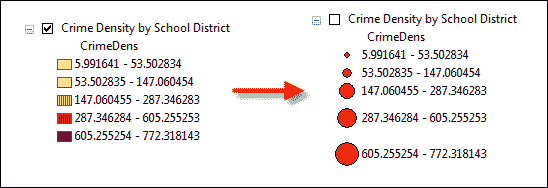

## 如何操作...

按照以下步骤学习如何使用`UpdateLayer()`更新图层的符号：

1.  使用 ArcMap 打开`c:\ArcpyBook\Ch3\Crime_Ch3.mxd`。

1.  从主 ArcMap 工具栏中点击 Python 窗口按钮。

1.  导入`arcpy.mapping`模块：

    ```py
    import arcpy.mapping as mapping
    ```

1.  引用当前活动文档（`Crime_Ch3.mxd`），并将引用分配给一个变量：

    ```py
    mxd = mapping.MapDocument("CURRENT")
    ```

1.  获取对`Crime`数据框的引用：

    ```py
    df = mapping.ListDataFrames(mxd, "Crime")[0]
    ```

1.  定义将要更新的图层：

    ```py
    updateLayer = mapping.ListLayers(mxd,"Crime Density by School District",df)[0]
    ```

1.  定义用于更新符号的图层：

    ```py
    sourceLayer = mapping.Layer(r"C:\ArcpyBook\data\CrimeDensityGradSym.lyr")
    ```

1.  调用`UpdateLayer()`函数来更新符号：

    ```py
    mapping.UpdateLayer(df,updateLayer,sourceLayer,True)
    ```

1.  运行脚本。现在**按学区划分的犯罪密度**图层将使用渐变符号而不是渐变色进行符号化，如下面的截图所示：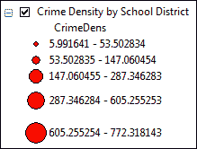

## 工作原理...

在这个菜谱中，我们使用了`UpdateLayer()`函数来更新图层的符号。我们没有更新任何属性，但在下一个菜谱中我们会这样做。`UpdateLayer()`函数要求您传递多个参数，包括数据框、要更新的图层以及一个引用图层，从该图层中提取符号并将其应用到更新图层。在我们的代码中，`updateLayer`变量持有对**按学区划分的犯罪密度**图层的引用，其符号将被更新。从该图层中提取符号并将其应用到更新图层的是包含渐变符号的图层文件（`CrimeDensityGradSym.lyr`）。

要更新图层的符号，您必须首先确保更新图层和源图层具有相同的几何形状（点、线和多边形）。您还需要检查属性定义是否相同，在某些情况下，取决于渲染器。例如，渐变色符号和渐变符号基于特定的属性。在这种情况下，两个图层都具有多边形几何形状，并且有一个`CrimeDens`字段包含犯罪密度信息。

一旦我们有了两个图层的引用，我们就调用`UpdateLayer()`函数，传递数据框和图层以及一个第四个参数，表示我们只更新符号。我们将`True`值作为第四个参数提供，表示我们只想更新符号，而不是属性。

```py
mapping.UpdateLayer(df,updateLayer,sourceLayer,True)

```

## 更多内容...

`UpdateLayer()`还提供了删除一个图层并添加另一个图层以替换它的能力。这些图层可以是完全不相关的，因此不需要确保与重新定义图层符号时相同的几何类型和属性字段。这种图层切换本质上执行了一个对`RemoveLayer()`的调用，然后是一个对`AddLayer()`的调用作为一个操作。为了利用这个功能，您必须将`symbology_only`参数设置为`False`。

# 更新图层属性

在上一个菜谱中，您学习了如何更新图层的符号。正如我提到的，`UpdateLayer()`还可以用于更新图层的各种属性，如字段别名、查询定义等。在这个菜谱中，您将使用`UpdateLayer()`修改图层的各种属性。

## 准备工作

您还可以使用`UpdateLayer()`函数更新有限数量的图层属性。特定的图层属性，如字段别名、选择符号、查询定义、标签字段等，可以使用`UpdateLayer()`进行更新。一个常见的场景是，在许多地图文档中有一个图层需要更改所有地图文档中该图层实例的特定属性。为了完成这项任务，您将不得不使用 ArcMap 修改具有适当属性的图层并将其保存到图层文件中。然后，该图层文件成为源图层，将用于更新另一个名为`update_layer`的图层的属性。在这个菜谱中，您将使用 ArcMap 修改图层的属性，将其保存到图层文件（`.lyr`），然后使用 Python 编写一个脚本，该脚本使用`UpdateLayer()`将属性应用到另一个图层。

## 如何做…

按照以下步骤学习如何使用`UpdateLayer()`更新图层属性：

1.  使用 ArcMap 打开`c:\ArcpyBook\Ch3\Crime_Ch3.mxd`。对于这个菜谱，您将使用如图所示的**2009 年入室盗窃**要素类，如下截图所示：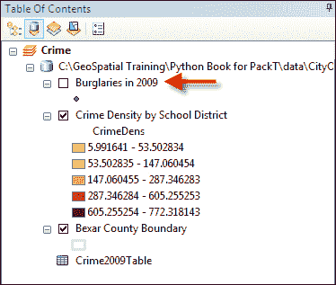

1.  双击**Crime**数据帧中的**2009 年入室盗窃**要素类以显示**图层属性**窗口，如图所示。每个选项卡代表可以设置图层的属性：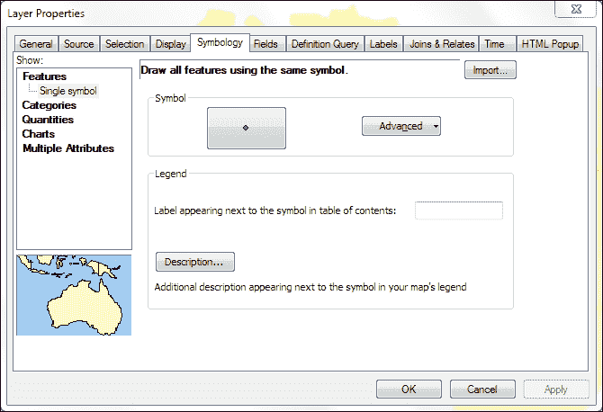

1.  点击**常规**选项卡，将**图层名称**文本框中的值更改为如图所示的名称：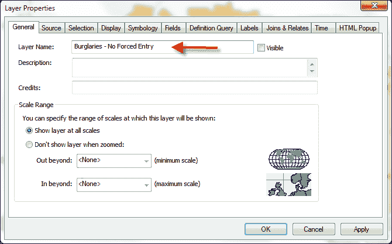

1.  点击**定义查询**选项卡，定义如图所示的查询。您可以使用**查询构建器**定义查询或直接输入查询：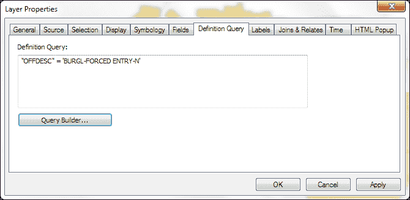

1.  将`OFFDESC`字段的别名更改为如图所示的前一个屏幕截图中的`Offense Description`。

1.  在**图层属性**中的**字段**选项卡上点击，只显示以下截图中所选中的带有勾选标记的字段。这是通过取消勾选以下截图中所看到的字段来完成的。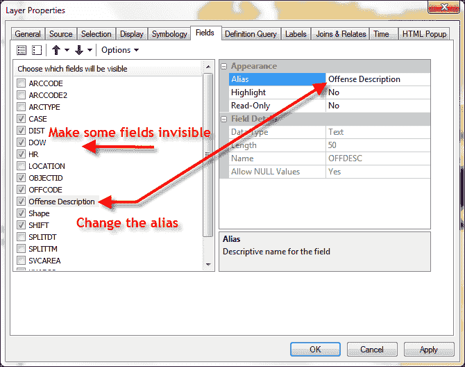

1.  点击**确定**关闭**图层属性**对话框。

1.  在数据框中，右键单击**Burglaries – No Forced Entry**并选择**另存为图层文件**。

1.  将文件保存为`c:\ArcpyBook\data\BurglariesNoForcedEntry.lyr`。

1.  右键单击**Burglaries – No Forced Entry**图层并选择**删除**。

1.  使用 ArcMap 中的**添加数据**按钮，从`CityOfSanAntonio`地理数据库中添加**Crimes2009**要素类。要素类将被添加到数据框中，如下截图所示：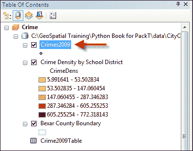

1.  在 ArcMap 中打开 Python 窗口。

1.  导入`arcpy.mapping`模块：

    ```py
    import arcpy.mapping as mapping
    ```

1.  引用当前活动文档（`Crime_Ch3.mxd`）并将引用分配给一个变量：

    ```py
    mxd = mapping.MapDocument("CURRENT")
    ```

1.  获取对`Crime`数据框的引用：

    ```py
    df = mapping.ListDataFrames(mxd, "Crime")[0]
    ```

1.  定义将要更新的图层：

    ```py
    updateLayer = mapping.ListLayers(mxd,"Crimes2009",df)[0]
    ```

1.  定义将要用于更新属性的图层：

    ```py
    sourceLayer = mapping.Layer(r"C:\ArcpyBook\data\BurglariesNoForcedEntry.lyr")
    ```

1.  调用`UpdateLayer()`函数来更新符号化：

    ```py
    mapping.UpdateLayer(df,updateLayer,sourceLayer,False)
    ```

1.  运行脚本。

1.  **Crimes2009**图层将使用与`BurglariesNoForcedEntry.lyr`文件关联的属性进行更新。这将在以下截图中进行说明。打开图层以查看已应用的定义查询。您还可以打开**图层属性**对话框来查看已应用到**Crimes2009**要素类的属性更改：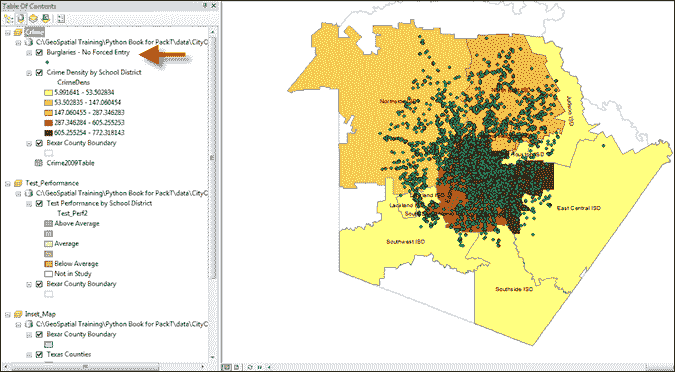
