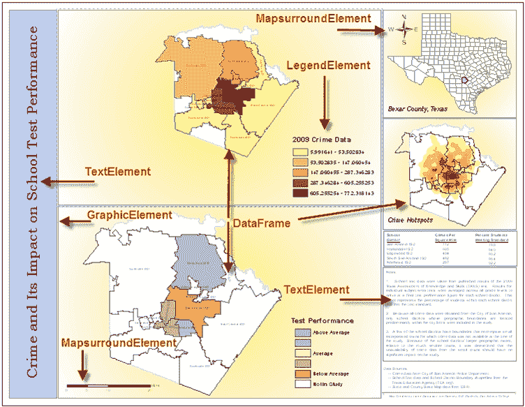
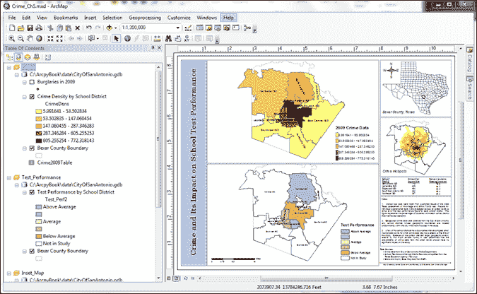
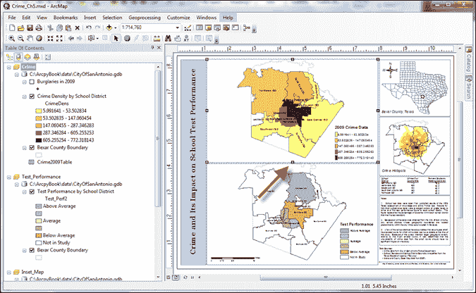
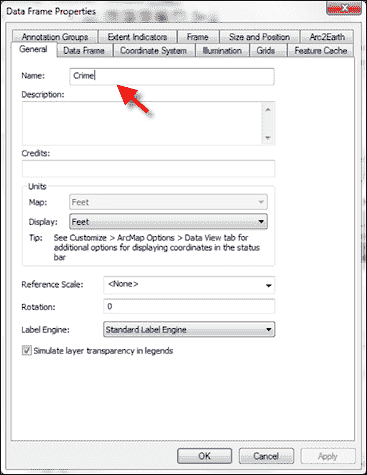
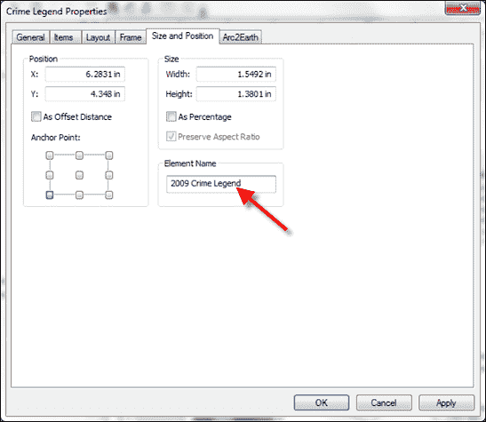
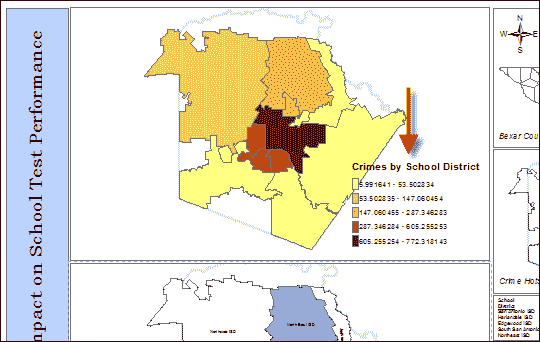
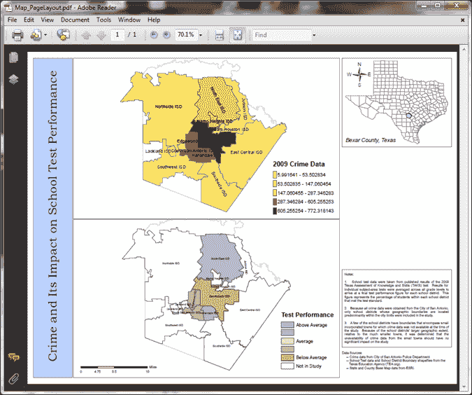

# 第五章：自动化地图生产和打印

在本章中，我们将介绍以下菜谱：

+   创建布局元素列表

+   为布局元素分配一个唯一的名称

+   限制`ListLayoutElements()`返回的布局元素

+   更新布局元素属性

+   获取可用打印机的列表

+   使用`PrintMap()`打印地图

+   将地图导出为 PDF 文件

+   将地图导出为图像文件

+   使用`PDFDocumentCreate()`和`PDFDocumentOpen()`创建地图册

# 简介

`arcpy.mapping`模块，随 ArcGIS 10 发布，提供了一系列与地图生产自动化相关的功能。`arcpy.mapping`可用于自动化地图生产、构建地图册、导出为图像或 PDF 文件，以及创建和管理 PDF 文件。在本章中，您将学习如何使用`arcpy.mapping`模块来自动化与地图生产和打印相关的各种地理处理任务。

# 创建布局元素列表

在自动化地图生产的地理处理脚本中，第一步通常是生成可用布局元素的列表。例如，您可能需要在打印或创建 PDF 文件之前更新地图的标题。在这种情况下，标题可能存储在一个`text`元素中。您可以在地图布局视图中生成`text`元素的列表，然后更改其中的标题。第一步是生成`text`元素的列表。

## 准备中...

在 ArcMap 中，有两个视图可用，即数据视图和布局视图。**数据视图**用于查看地理和表格数据、分析数据、符号化图层以及管理数据，而不考虑任何特定的地图页面大小或布局。**布局视图**显示打印在页面上的地图，并用于通过添加地图元素来创建生产质量的地图。这些元素包括地图框架、图层、图例、标题、北箭头、比例尺和标题块。布局中的每个对象在`arcpy.mapping`中均表示为一个布局元素类。以下截图显示了这些布局元素类中的许多示例：



每个元素都可以分配一个唯一的名称，然后可以用来以编程方式访问该元素。这个唯一的名称在 ArcMap 中定义。`arcpy.mapping`模块提供了一个`ListLayoutElements()`函数，该函数返回所有这些元素的列表。在本菜谱中，您将学习如何使用`ListLayoutElements()`函数生成地图布局元素列表。

## 如何做...

按照以下步骤学习如何生成布局元素列表：

1.  在 ArcMap 中打开`C:\ArcpyBook\Ch5\Crime_Ch5.mxd`。

1.  打开 Python 窗口。

1.  导入`arcpy.mapping`模块：

    ```py
    import arcpy.mapping as mapping
    ```

1.  引用当前活动文档（`Crime_Ch5.mxd`）并将引用分配给一个变量：

    ```py
    mxd = mapping.MapDocument("CURRENT")
    ```

1.  生成布局元素列表并将其打印到屏幕上，如果名称属性不为空：

    ```py
    for el in mapping.ListLayoutElements(mxd):
      if el.name != '':
        print el.name
    ```

1.  整个脚本应如下所示：

    ```py
    import arcpy.mapping as mapping
    mxd = mapping.MapDocument("CURRENT")
    for el in mapping.ListLayoutElements(mxd):
      if el.name != '':
        print el.name
    ```

1.  运行脚本以查看以下输出：

    ```py
    Crime_Inset
    Alternating Scale Bar
    Legend Test Performance
    Crime Legend
    North Arrow
    Inset_Map
    Test_Performance
    Crime

    ```

## 它是如何工作的...

`ListLayoutElements()`函数返回一个布局元素的列表，这些元素以各种布局类的形式存在。每个元素可以是以下对象实例之一：`GraphicElement`、`LegendElement`、`PictureElement`、`TextElement`或`MapSurroundElement`。每个元素都可以有一个唯一名称。您不必为每个元素分配名称，但如果您计划在脚本中以编程方式访问这些元素，这样做会有所帮助。在这个脚本中，我们在打印名称之前确保元素已分配了名称。这样做是因为 ArcMap 不需要为元素分配名称。

# 为布局元素分配唯一名称

使用 ArcMap 为所有布局元素分配唯一名称是一个好习惯。如果您的地理处理脚本需要访问特定元素进行更改，这很重要。例如，您可能需要更新显示公司标志的图标。而不是在所有地图文档文件中手动进行此更改，您可以编写一个地理处理脚本来以编程方式更新所有地图文档文件并使用新标志。但是，为了使这成为可能，必须为布局元素分配唯一名称。这使您能够单独访问布局元素。

## 准备工作

如我在前面的菜谱中提到的，每个布局元素将属于多种元素类型之一，并且每个都可以分配一个名称。这个元素名称可以在您需要引用 Python 脚本中的特定元素时使用。您可以使用 ArcMap 为每个布局元素分配唯一名称。在这个菜谱中，您将使用 ArcMap 为元素分配名称。

## 如何操作…

按照以下步骤学习如何使用 ArcMap 为每个布局元素分配唯一名称：

1.  在 ArcMap 中打开`C:\ArcpyBook\Ch5\Crime_Ch5.mxd`。

1.  切换到布局视图，您应该看到以下截图类似的内容：

1.  根据元素类型，名称的分配方式不同。单击最上面的数据帧，它应该是**Crime**，以选择它。选择句柄应如下所示：

1.  右键单击上层数据帧并选择**属性**以显示**数据帧属性**窗口，如下截图所示。**名称**属性定义了元素的唯一名称。在这种情况下，元素名称是`Crime`：

1.  关闭**数据帧属性**窗口。

1.  在布局视图中选择**2009 Crime Legend**，并通过右键单击图例并选择**属性**来打开**属性**窗口。

1.  为图例设置元素名称与为数据帧设置元素名称不同。单击**大小和位置**选项卡。

1.  在此情况下使用**元素名称**文本框。将当前值更改为`2009 Crime Legend`，如下所示：

1.  您也可以为文本元素定义唯一的名称。选择标题元素（`Crime and Its Impact on School Test Performance`），右键单击元素，并选择**属性**。

1.  选择**大小和位置**选项卡，并为该元素定义一个唯一的名称，如图下截图所示：

## 它是如何工作的…

布局视图中每个元素都可以分配一个名称，然后可以在您的地理处理脚本中使用该名称来检索特定元素。您应该努力为每个元素定义唯一的名称。并不是必须为每个元素定义唯一的名称，甚至也不必定义名称。然而，如果您打算从 Python 脚本中访问这些元素，那么给每个元素命名并确保每个元素名称唯一是一种最佳实践。在为元素命名时，您应该努力只包含字母和下划线。

## 更多内容…

您可以使用元素名称与`ListLayoutElements()`函数结合使用，通过使用通配符参数来限制函数返回的元素。在下一个菜谱中，您将学习如何通过使用通配符和元素类型来限制通过`ListLayoutElements()`函数返回的布局元素列表。

# 限制`ListLayoutElements()`返回的布局元素

布局可以包含大量元素，其中许多元素您可能不需要用于特定的地理处理脚本。`ListLayoutElements()`函数可以通过传递一个参数来限制返回的布局元素，该参数定义了应返回的元素类型，以及一个可选的通配符，该通配符通过名称的一部分来查找元素。

## 准备工作

布局元素有很多不同类型，包括图形、图例、图片、文本和数据框。当您返回一个布局元素列表时，您可以限制（过滤）返回的元素类型。在本菜谱中，您将编写一个脚本，通过元素类型和通配符来过滤通过`ListLayoutElements()`函数返回的布局元素。

## 如何操作…

按照以下步骤学习如何通过使用可选参数来限制`ListLayoutElements()`函数返回的图层列表，这些参数定义了应返回的元素类型以及可以限制返回元素的通配符。

1.  在 ArcMap 中打开`C:\ArcpyBook\Ch5\Crime_Ch5.mxd`。

1.  打开 Python 窗口。

1.  导入`arcpy.mapping`模块：

    ```py
    import arcpy.mapping as mapping
    ```

1.  引用当前活动文档（`Crime_Ch5.mxd`）并将引用分配给一个变量：

    ```py
    mxd = mapping.MapDocument("CURRENT")
    ```

1.  使用`ListLayoutElements()`函数，仅限制为图例元素，以及一个通配符，该通配符返回名称中包含文本`Crime`的元素：

    ```py
    for el in mapping.ListLayoutElements(mxd,"LEGEND_ELEMENT","*Crime*")
      print el.name
    ```

1.  运行脚本。在这种情况下，只会返回单个布局元素：

    ```py
    2009 Crime Legend

    ```

## 它是如何工作的...

`ListLayoutElements()` 是一个多功能函数，其最基本的形式用于返回地图文档页面布局上的所有布局元素的列表。然而，你可以提供两个可选参数来过滤此列表。第一种过滤类型是元素类型过滤器，其中你指定你只想返回布局元素类型之一。你还可以应用通配符来过滤返回的列表。这两种类型的过滤器可以组合使用。例如，在这个菜谱中，我们指定我们只想返回元素名称中包含 "Crime" 文本的 `LEGEND_ELEMENT` 对象。这导致了一个高度过滤的列表，只包含单个布局元素。

### 注意

`ListLayoutElements()` 可以通过以下元素类型之一进行过滤：`DATAFRAME_ELEMENT`、`GRAPHIC_ELEMENT`、`LEGEND_ELEMENT`、`MAPSURROUND_ELEMENT`、`PICTURE_ELEMENT`、`TEXT_ELEMENT`。

# 更新布局元素属性

每个布局元素都有一组你可以程序化更新的属性。例如，`LegendElement` 包含允许你更改图例在页面上的位置的属性，更新图例标题，以及访问图例项。

## 准备工作

布局元素有很多不同类型，包括图形、图例、文本、地图和图片。这些元素中的每一个都由 `arcpy.mapping` 包中的一个类表示。这些类提供了你可以用来程序化修改元素的属性。

`DataFrame` 类提供了在地图文档文件中对数据框架属性访问的途径。此对象可以与地图单元和页面布局单元一起工作，具体取决于所使用的属性。页面布局属性，如定位和尺寸，可以应用于包括 `elementPositionX`、`elementPositionY`、`elementWidth` 和 `elementHeight` 在内的属性。

`GraphicElement` 对象是用于添加到页面布局中的各种图形的通用对象，包括表格、图表、整洁线、标记、线条和区域形状。如果你打算通过 Python 脚本访问它，请确保为每个图形元素（以及任何其他元素）设置 `name` 属性。

`LegendElement` 提供了在页面布局中对图例进行定位、修改图例标题的操作，同时也提供了访问图例项和父数据框架的途径。`LegendElement` 只能与单个数据框架关联。

`MapSurroundElement` 可以指北箭头、比例尺和比例文本，并且像 `LegendElement` 一样与单个数据框架关联。此对象上的属性可以启用在页面上的重新定位。

`PictureElement`代表页面布局上的栅格或图像。此对象上最有用的属性允许获取和设置数据源，这在需要更改图片，如标志时非常有帮助。例如，您可以编写一个脚本，遍历所有地图文档文件，并用新标志替换当前标志。您还可以重新定位或调整大小对象。

`TextElement`代表页面布局上的文本，包括插入的文本、注释、矩形文本和标题，但不包括图例标题或表格或图表中的文本。属性允许修改文本字符串，这在需要在同一页面布局的多个位置或多个地图文档中更改相同的文本字符串时非常有用，当然也可以重新定位对象。

页面布局中的每个元素都返回为元素对象的一个实例。在这个菜谱中，我们将使用`Legend`对象的`title`属性来编程更改`Crime`图例的标题并获取属于图例的图层列表。

## 如何去做...

按照以下步骤学习如何更新布局元素的属性：

1.  在 ArcMap 中打开`C:\ArcpyBook\Ch5\Crime_Ch5.mxd`。

1.  打开 Python 窗口。

1.  导入`arcpy.mapping`模块：

    ```py
    import arcpy.mapping as mapping
    ```

1.  引用当前活动文档（`Crime_Ch5.mxd`），并将引用分配给变量：

    ```py
    mxd = mapping.MapDocument("CURRENT")
    ```

1.  使用`ListLayoutElements()`方法，通过通配符和仅限制图例元素来返回仅包含`Crime`图例并将其存储在变量中：

    ```py
    elLeg = mapping.ListLayoutElements(mxd, "LEGEND_ELEMENT","*Crime*")[0]
    ```

1.  使用`title`属性来更新图例的标题：

    ```py
    elLeg.title = "Crimes by School District"
    ```

1.  获取属于图例的部分图层列表并打印名称：

    ```py
    for item in elLeg.listLegendItemLayers():
      print item.name
    ```

1.  整个脚本应如下所示：

    ```py
    import arcpy.mapping as mapping
    mxd = mapping.MapDocument("CURRENT")
    elLeg = mapping.ListLayoutElements(mxd, "LEGEND_ELEMENT","*Crime*")[0]
    elLeg.title = "Crimes by School District"
    for item in elLeg.listLegendItemLayers():
      print item.name
    ```

1.  运行脚本。您应该看到以下图层被打印：

    ```py
    Burglaries in 2009
    Crime Density by School District

    ```

1.  改变在以下屏幕截图中显示：

## 它是如何工作的...

每个布局元素都有一组属性和方法。在这种情况下，我们使用了`Legend`对象的`title`属性。此对象的其它属性允许您设置宽度、高度、定位等。`Legend`对象上的方法允许您调整列数、列出图例项、删除和更新项。

# 获取可用打印机的列表

`arcpy`提供的另一个列表函数是`ListPrinterNames()`，它生成可用打印机的列表。与其他我们检查过的列表函数一样，`ListPrinterNames()`通常在多步脚本中的初步步骤中被调用。

## 准备工作

在使用 `PrintMap()` 函数打印地图之前，调用 `ListPrinterNames()` 函数是一种常见做法，该函数返回本地计算机上可用的打印机列表。然后可以通过遍历打印机列表并使用它作为 `PrintMap()` 函数的输入来找到特定的打印机。

## 如何操作…

按照以下步骤学习如何使用 `ListPrinterNames()` 函数返回脚本中可用的打印机列表：

1.  在 ArcMap 中打开 `C:\ArcpyBook\Ch5\Crime_Ch5.mxd`。

1.  打开 Python 窗口。

1.  导入 `arcpy.mapping` 模块：

    ```py
    import arcpy.mapping as mapping
    ```

1.  引用当前活动文档（`Crime_Ch5.mxd`）并将引用分配给变量：

    ```py
    mxd = mapping.MapDocument("CURRENT")
    ```

1.  调用 `ListPrinterNames()` 函数并打印每个打印机：

    ```py
    for printerName in mapping.ListPrinterNames():
      print printerName
    ```

1.  运行脚本。输出将根据计算机上可用的打印机列表而变化。但是，它应该打印出类似于以下代码片段的内容：

    ```py
    HP Photosmart D110 series
    HP Deskjet 3050 J610 series (Network)
    HP Deskjet 3050 J610 series (Copy 1)
    HP Deskjet 3050 J610 series
    Dell 968 AIO Printer

    ```

## 工作原理...

`ListPrinterNames()` 函数返回一个包含所有可用于脚本的打印机的 Python 列表。然后您可以使用 `PrintMap()` 函数，我们将在下一教程中探讨，将打印作业发送到计算机上可用的特定打印机。

# 使用 PrintMap() 打印地图

使用 `PrintMap()` 函数将地图布局发送到打印机非常简单。默认情况下，打印作业将被发送到与地图文档一起保存的默认打印机，但您也可以定义一个特定的打印机，将作业发送到该打印机。

## 准备工作

`arcpy.mapping` 提供了一个 `PrintMap()` 函数，用于从 ArcMap 打印页面布局或数据框架。在调用 `PrintMap()` 之前，调用 `ListPrinterNames()` 函数是一种常见做法。然后可以通过遍历打印机列表并使用它作为 `PrintMap()` 函数的输入来找到特定的打印机。

`PrintMap()` 可以打印特定的数据框架或地图文档的页面布局。默认情况下，此函数将使用与地图文档一起保存的打印机，或者如果地图文档中没有，则使用默认系统打印机。正如我提到的，您还可以使用 `ListPrinterNames()` 获取可用打印机的列表，并从中选择一个作为 `PrintMap()` 的输入。在本教程中，您将学习如何使用 `PrintMap()` 函数打印布局。

## 如何操作…

按照以下步骤学习如何使用 `PrintMap()` 函数在 ArcMap 中打印布局视图：

1.  在 ArcMap 中打开 `C:\ArcpyBook\Ch5\Crime_Ch5.mxd`。

1.  打开 Python 窗口。

1.  导入 `arcpy.mapping` 模块：

    ```py
    import arcpy.mapping as mapping
    ```

1.  引用当前活动文档（`Crime_Ch5.mxd`），并将引用分配给变量：

    ```py
    mxd = mapping.MapDocument("CURRENT")
    ```

1.  查找 `Test_Performance` 数据框架，如果找到则打印：

    ```py
    for df in mapping.ListDataFrames(mxd):
      if df.name == "Test_Performance":
        mapping.PrintMap(mxd,"",df)
    ```

## 工作原理...

`PrintMap()` 函数接受一个必需参数和一些可选参数。必需参数是对地图文档的引用。第一个可选参数是打印机名称。在这种情况下，我们没有指定要使用的特定打印机。因为我们没有提供特定的打印机，它将使用与地图文档一起保存的打印机或如果没有打印机是地图文档的一部分，则使用默认系统打印机。第二个可选参数是我们想要打印的数据框架，在这个例子中是 `Test_Performance`。其他未在此情况下提供的可选参数包括输出打印文件和图像质量。

# 将地图导出为 PDF 文件

与将地图或布局视图发送到打印机相比，你可能只想简单地创建可以共享的 PDF 文件。Arcpy 映射提供了 `ExportToPDF()` 函数，你可以使用它来做到这一点。

## 准备工作

PDF 是一个非常流行的交换格式，旨在从许多不同的平台上可查看和打印。arcpy 映射的 `ExportToPDF()` 函数可以用来导出数据框架或页面布局到 PDF 格式。默认情况下，`ExportToPDF()` 函数导出页面布局，但你可以通过传递一个可选参数来引用特定的数据框架，这样就可以打印页面布局而不是页面布局。在这个菜谱中，你将学习如何将页面布局以及特定的数据框架导出到 PDF 文件。

## 如何做到这一点…

按照以下步骤学习如何将地图导出为 PDF 文件：

1.  在 ArcMap 中打开 `C:\ArcpyBook\Ch5\Crime_Ch5.mxd`。

1.  打开 Python 窗口。

1.  导入 `arcpy.mapping` 模块：

    ```py
    import arcpy.mapping as mapping
    ```

1.  引用当前活动文档（`Crime_Ch5.mxd`），并将引用分配给一个变量：

    ```py
    mxd = mapping.MapDocument('CURRENT')
    ```

1.  使用 `ExportToPDF()` 函数导出页面布局：

    ```py
    mapping.ExportToPDF(mxd,r"c:\ArcpyBook\Ch5\Map_PageLayout.pdf").
    ```

1.  运行脚本。

1.  打开创建的 `Map_PageLayout.pdf` 文件，你应该会看到以下截图类似的内容：

1.  现在，我们将从我们的地图文档文件中打印一个特定的数据框架。修改你的脚本，使其看起来如下：

    ```py
    import arcpy.mapping as mapping
    mxd = mapping.MapDocument('CURRENT')
    for df in mapping.ListDataFrames(mxd):
      if df.name == "Crime":
        mapping.ExportToPDF(mxd,r"c:\ArcpyBook\Ch5\DataFrameCrime.pdf",df)
    ```

1.  运行脚本并检查输出 PDF。

## 它是如何工作的…

`ExportToPDF()` 函数需要两个参数，包括对地图文档的引用和作为输出 PDF 文件的文件。我们开发的第一个脚本，传递了地图文档的引用以及输出 PDF 文件。因为我们没有传递指定数据框架的可选参数，所以 `ExportToPDF()` 函数将导出页面布局。还有许多可选参数可以传递给此方法，包括特定的数据框架和许多与输出内容和质量相关的参数。我们的第二个脚本传递了应该导出的特定数据框架。你可以参考 ArcGIS 帮助页面以获取有关每个可选参数的更多信息。

# 将地图导出为图像文件

您还可以使用`arcpy.mapping`提供的许多函数之一将地图或布局视图的内容导出为图像文件。每个图像导出函数的名称将根据您想要创建的图像文件类型而有所不同。传递给函数的参数也将略有不同。

## 准备工作

除了能够将数据框和页面布局导出为 PDF 格式外，您还可以使用`arcpy.mapping`提供的许多导出函数之一来导出图像文件。支持的格式包括 AI、BMP、EMF、EPS、GIF、JPEG、SVG 和 TIFF。每个函数提供的参数将根据图像类型而有所不同。这些函数名称的示例包括`ExportToJPEG()`、`ExportToGIF()`和`ExportToBMP()`。在本教程中，您将学习如何将您的地图导出为图像。

## 如何操作...

按照以下步骤学习如何将您的数据或布局视图导出为图像文件：

1.  在 ArcMap 中打开`C:\ArcpyBook\Ch5\Crime_Ch5.mxd`。

1.  打开 Python 窗口。

1.  导入`arcpy.mapping`模块：

    ```py
    import arcpy.mapping as mapping
    ```

1.  引用当前活动文档（`Crime_Ch5.mxd`），并将引用分配给一个变量：

    ```py
    mxd = mapping.MapDocument("CURRENT")
    ```

1.  将`Crime`数据框导出为 JPEG 图像：

    ```py
    for df in mapping.ListDataFrames(mxd):
      if df.name == "Crime":
        mapping.ExportToJPEG(mxd,r"c:\ArcpyBook\Ch5\DataFrameCrime.jpg",df)
    ```

1.  运行脚本并检查输出文件。

1.  现在，我们将使用一个可选参数，该参数将输出一个与图像一起的`world`文件。修改您的脚本，使其如下所示：

    ```py
    import arcpy.mapping as mapping
    mxd = mapping.MapDocument("CURRENT")
    for df in mapping.ListDataFrames(mxd):
      if df.name == "Crime":
        mapping.ExportToPDF(mxd,r"c:\ArcpyBook\Ch5\DataFrameCrime2.jpg",df,world_file=True)
    ```

1.  运行脚本。将创建一个名为`DataFrameCrime.jpg`的新文件。在文本编辑器中打开此文件，您应该看到以下内容：

    ```py
    470.520239851286190
    0.000000000000000
    0.000000000000000
    -496.256971063348490
    1972178.761771137800000
    13815440.387677660000000

    ```

## 工作原理...

注意到`ExportToJPEG()`函数几乎与`ExportToPDF()`相同。但请记住，所有导出函数的可选参数将不同。每个`ExportTo<Type>`函数将根据可用于创建图像文件的参数而有所不同。

# 使用`PDFDocumentCreate()`和`PDFDocumentOpen()`创建地图册

对于许多 GIS 专业人士来说，一个常见的场景是需要创建一个可以与他人共享的地图册。地图册仅仅是特定区域的地图集合，通常还包含一个索引图。地图册通常使用 PDF 文件创建，因为它们是一种常见的交换格式。

## 准备工作

除了将您的地图导出为 PDF 外，您还可以操作现有的 PDF 文档或创建新的 PDF 文档。您可以合并页面、设置文档打开行为、添加文件附件以及创建或更改文档安全设置。`PDFDocumentOpen()`函数用于打开现有 PDF 文件进行操作。`PDFDocumentCreate()`创建一个新的 PDF 文档。这些函数通常用于创建地图册，这正是本教程中我们将要做的。

## 如何操作...

1.  打开 IDLE 并创建一个新的脚本窗口。

1.  导入`arcpy.mapping`和`os`模块：

    ```py
    import arcpy.mapping as mapping
    import os
    ```

1.  设置地图册的路径和文件名。如果文件已存在，则删除该文件：

    ```py
    pdfPath = r"C:\ArcpyBook\Ch5\CrimeMapBook.pdf"
    if os.path.exists(pdfPath):
      os.remove(pdfPath)
    ```

1.  创建 PDF 文档：

    ```py
    pdfDoc = mapping.PDFDocumentCreate(pdfPath)
    ```

1.  将现有的 PDF 页面追加到文档中：

    ```py
    pdfDoc.appendPages(r"c:\ArcpyBook\Ch5\Map_PageLayout.pdf")
    pdfDoc.appendPages(r"c:\ArcpyBook\Ch5\Map_DataFrameCrime.pdf")
    ```

1.  提交地图册的更改：

    ```py
    pdfDoc.saveAndClose()
    ```

1.  整个脚本应该如下所示：

    ```py
    import arcpy.mapping as mapping
    import os
    pdfPath = r"C:\ArcpyBook\Ch5\CrimeMapBook.pdf"
    if os.path.exists(pdfPath):
      os.remove(pdfPath)
    pdfDoc = mapping.PDFDocumentCreate(pdfPath)
    pdfDoc.appendPages(r"c:\ArcpyBook\Ch5\Map_PageLayout.pdf")
    pdfDoc.appendPages(r"c:\ArcpyBook\Ch5\Map_DataFrameCrime.pdf")
    pdfDoc.saveAndClose()
    ```

1.  运行脚本。

1.  查看位于 `c:\ArcpyBook\Ch5\CrimeMapBook.pdf` 的新地图册。这本书现在应该包含两个页面，包含我们在之前的菜谱中创建的 PDF 文件。

## 它是如何工作的...

`PDFDocumentCreate()` 函数通过提供文档的路径和文件名来创建一个新的 PDF 文档。实际上，PDF 文件直到你插入或附加页面并调用 `PDFDocument.saveAndClose()` 后才会被创建在磁盘上。`appendPages()` 和 `insertPages()` 函数用于插入和附加页面。

`PDFDocumentOpen()` 接受一个参数，指定 PDF 文件的路径，并返回 `PDFDocument` 类的一个实例。一旦打开，你可以修改 PDF 文件属性，添加或插入文件，并附加文档。确保在所有操作完成后调用 `PDFDocument.saveAndClose()` 以保存更改。

## 还有更多…

可以通过 `PDFDocument` 对象设置 PDF 文档的多个属性，包括获取页面数、附加文件、更新标题、作者、主题、关键词、打开行为和布局。你还可以通过调用 `PDFDocument.updateDocSecurity()` 来更新文档安全性，设置密码、加密和安全限制。
