# 第七章。创建自定义地理处理工具

在本章中，我们将介绍以下配方：

+   创建自定义地理处理工具

# 简介

除了访问 ArcGIS 提供的系统工具外，您还可以创建自己的自定义工具。这些工具与系统工具的工作方式相同，可以在 ModelBuilder、Python 窗口或独立 Python 脚本中使用。许多组织构建了自己的工具库，这些工具库执行特定于其数据的地理处理操作。

# 创建自定义地理处理工具

除了能够在脚本中执行任何可用的工具外，您还可以创建自己的自定义工具，这些工具也可以从脚本中调用。自定义工具通常被创建来处理特定于组织的地理处理任务。这些工具也易于共享。

## 准备工作

在这个配方中，您将学习如何通过将 Python 脚本附加到 ArcToolbox 中的自定义工具箱来创建自定义地理处理脚本工具。创建自定义脚本工具有许多优点。当您采取这种方法时，脚本成为地理处理框架的一部分，这意味着它可以从模型、命令行或另一个脚本中运行。此外，脚本可以访问 ArcMap 环境设置和帮助文档。其他优点包括美观、易于使用的用户界面和错误预防能力。提供的错误预防能力包括一个对话框，它会通知用户某些错误。

这些自定义开发的脚本工具必须添加到您创建的自定义工具箱中，因为 ArcToolbox 提供的系统工具箱是只读工具箱，因此不能接受新工具。

在这个配方中，您将获得一个预先编写的 Python 脚本，该脚本从逗号分隔的文本文件中读取野火数据，并将这些信息写入名为 `FireIncidents` 的点要素类。对这些数据集的引用是硬编码的，因此您将修改脚本以接受动态变量输入。然后，您将脚本附加到 ArcToolbox 中的自定义工具，以便您的最终用户可以使用脚本的可视界面。

## 如何操作…

您编写的自定义 Python 地理处理脚本可以添加到 ArcToolbox 中的自定义工具箱中。您不允许将您的脚本添加到任何系统工具箱中，例如**分析**或**数据管理**。然而，通过创建一个新的自定义工具箱，您可以添加这些脚本。

1.  使用空地图文档文件打开 ArcMap 并打开 ArcToolbox 窗口。

1.  在 ArcToolbox 的空白区域中右键单击，然后选择**添加工具箱**。在**添加工具箱**对话框中，单击**新建工具箱**按钮。这将创建一个名为 `Toolbox.tbx` 的默认名称的新工具箱；您将在下一步中重命名工具箱：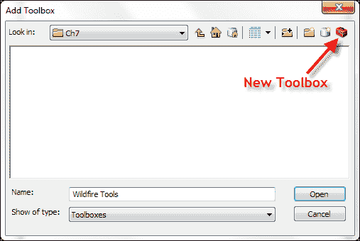

1.  导航到 `c:\ArcpyBook\Ch7` 文件夹，并将工具箱命名为 `Wildfire Tools`：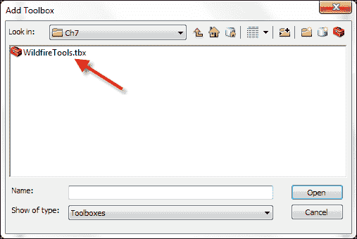

1.  通过选择**WildfireTools.tbx**并点击**打开**按钮来打开工具箱。现在工具箱应如以下截图所示显示在 ArcToolbox 中：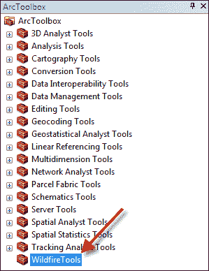

1.  每个工具箱都应该有一个名称和一个别名。别名将用于唯一定义您的自定义工具。别名名称应保持简短，且不应包含任何特殊字符。右键单击新工具箱并选择**属性**。添加一个别名为`wildfire`，如以下截图所示：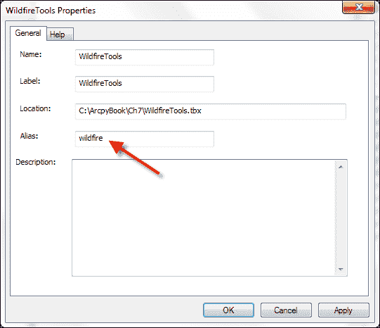

    ### 注意

    您可以选择在此工具箱内创建一个新的工具集，方法是右键单击工具箱并选择**新建** | **工具集**。工具集允许您按功能分组脚本。在这个例子中，这样做可能不是必要的，但如果您将来需要分组脚本，那么这就是您如何实现它的方法。

1.  在此下一步中，我们将修改一个名为`InsertWildfires.py`的现有 Python 脚本，以便接受通过 ArcToolbox 界面由工具用户提供的动态输入。在 IDLE 中打开`c:\ArcpyBook\Ch7\InsertWildfires.py`。

    注意，我们还将硬编码了工作空间路径以及包含野火事件的逗号分隔文本文件：

    ```py
    arcpy.env.workspace = "C:/ArcpyBook/data/Wildfires/WildlandFires.mdb"
      f = open("C:/ArcpyBook/data/Wildfires/NorthAmericaWildfires_2007275.txt","r")
    ```

1.  删除前两行代码。

    此外，我们还将硬编码输出要素类名称：

    ```py
    cur = arcpy.InsertCursor("FireIncidents")
    ```

    这种硬编码限制了脚本的有用性。如果数据集移动或被删除，脚本将无法运行。此外，脚本缺乏指定不同输入和输出数据集的灵活性。在下一步中，我们将移除这种硬编码，并替换为接受动态输入的能力。

1.  我们将使用`arcpy`中找到的`GetParameterAsText()`函数来接受用户动态输入。将以下代码行添加到您的`try`块中，以便您的代码如下所示：

    ```py
    try:
      # the output feature class name
      outputFC = arcpy.GetParameterAsText(0)

      # the template feature class that defines the attribute schema
      fClassTemplate = arcpy.GetParameterAsText(1)

      # open the file to read
      f = open(arcpy.GetParameterAsText(2),'r')

      arcpy.CreateFeatureclass_management(os.path.split(outputFC)[0], os.path.split(outputFC[1]), "point", fClassTemplate)
    ```

    注意，我们调用位于**数据管理工具**工具箱中的`CreateFeatureClass`工具，传递`outputFC`变量以及模板要素类（`fClassTemplate`）。此工具将创建包含用户定义的输出要素类的空要素类。

1.  您还需要修改创建`InsertCursor`对象的代码行。将行更改为以下内容：

    ```py
    cur = arcpy.InsertCursor(outputFC)
    ```

1.  整个脚本应如下所示：

    ```py
    import arcpy, os
    try:
    	outputFC = arcpy.GetParameterAsText(0)
      fClassTemplate = arcpy.GetParameterAsText(1)
    	f = open(arcpy.GetParameterAsText(2),'r')
    	arcpy.CreateFeatureclass_management(os.path.split(outputFC)[0], os.path.split(outputFC[1]), "point", fClassTemplate)
      lstFires = f.readlines()
      cur = arcpy.InsertCursor(outputFC)
      cntr = 1
      for fire in lstFires:
        if 'Latitude' in fire:
          continue
        vals = fire.split(",")
        latitude = float(vals[0])
        longitude = float(vals[1])
        confid = int(vals[2])
        pnt = arcpy.Point(longitude, latitude)
        feat = cur.newRow()
        feat.shape = pnt
        feat.setValue("CONFIDENCEVALUE", confid)
        cur.insertRow(feat)
        arcpy.AddMessage("Record number: " + str(cntr) + " written to feature class")
        cntr = cntr + 1
    except:
      print arcpy.GetMessages()
    finally:
      del cur
      f.close()
    ```

    在下一步中，我们将把刚刚创建的脚本添加到**Wildfire Tools**工具箱中作为脚本工具。

1.  在 ArcToolbox 中，右键单击你之前创建的**Wildfire Tools**自定义工具箱，然后选择**添加** | **脚本**。这将显示**添加脚本**对话框，如图下所示。给你的脚本一个名称、标签和描述。**名称**字段不能包含任何空格或特殊字符。**标签**是显示在脚本旁边的名称。对于这个例子，给它一个标签为 `Load Wildfires From Text`。最后，添加一些描述性信息，详细说明脚本将执行的操作。

1.  请参阅以下截图以获取**名称**、**标签**和**描述**的详细信息：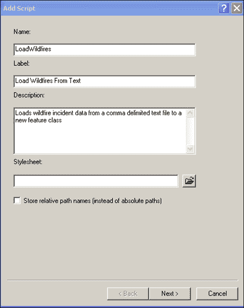

1.  点击**下一步**以显示**添加脚本**的下一个输入对话框。

1.  在此对话框中，你将指定将附加到工具的脚本。导航到 `c:\ArcpyBook\Ch7\InsertWildfires.py` 并将 `InsertWildfires.py` 添加为脚本。

1.  你还需要确保选择勾选了**在进程中运行 Python 脚本**复选框，如图下所示。在进程中运行 Python 脚本可以提高脚本的性能。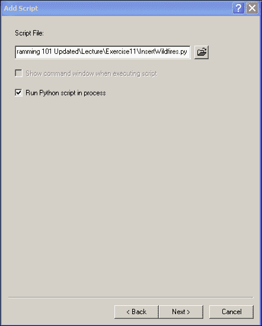

    ### 注意

    在进程外运行脚本需要 ArcGIS 创建一个单独的进程来执行脚本。启动此进程并执行脚本所需的时间会导致性能问题。始终在进程中运行你的脚本。在进程中运行脚本意味着 ArcGIS 不需要启动第二个进程来运行脚本。它将在与 ArcGIS 相同的进程空间中运行。

1.  点击**下一步**以显示参数窗口，如图下所示：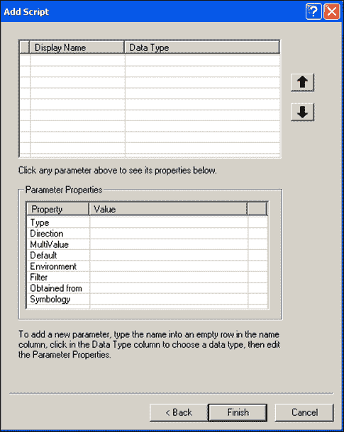

    你在此对话框中输入的每个参数都对应于对 `GetParameterAsText()` 的单个调用。之前，你修改了你的脚本以通过 `GetParameterAsText()` 方法接受动态参数。参数应按你的脚本期望接收它们的顺序输入此对话框。例如，你在代码中插入了以下行：

    ```py
    outputFC = arcpy.GetParameterAsText(0)
    ```

    你添加到对话框中的第一个参数需要与这一行相对应。在我们的代码中，这个参数代表运行此脚本将创建的特征类。你通过点击**显示名称**下第一个可用的行来添加参数。你可以在这一行输入任何文本。此文本将显示给用户。你还需要为参数选择一个相应的数据类型。在这种情况下，数据类型应设置为**特征类**，因为这是从用户那里收集的预期数据。每个参数还可以设置一些属性。一些比较重要的属性包括**类型**、**方向**和**默认值**。

1.  将以下截图所示的信息输入到你的对话框中，用于输出特征类。确保将**方向**设置为**输出**：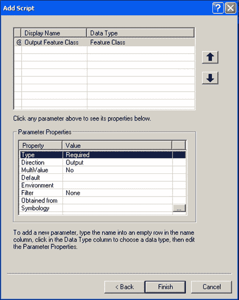

1.  接下来，我们需要添加一个参数，用于定义将用作新要素类属性模板的要素类。将以下信息输入到您的对话框中：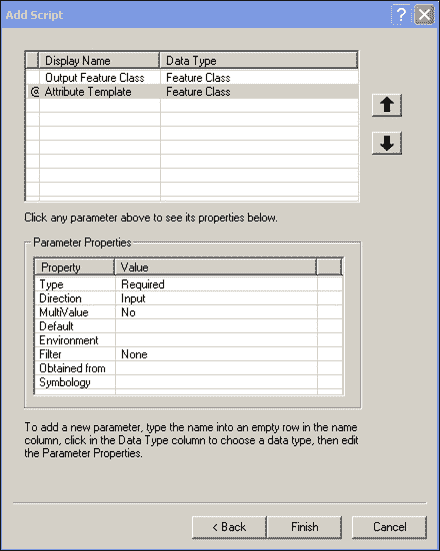

1.  最后，我们需要添加一个参数，用于指定在创建新的要素类时用作输入的逗号分隔的文本文件。将以下信息输入到您的对话框中：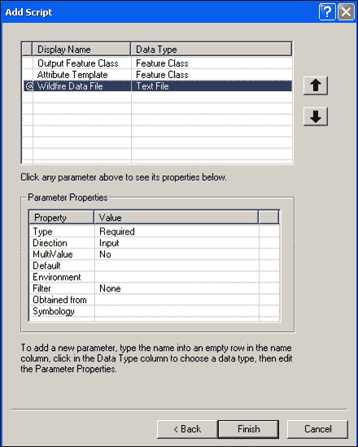

1.  点击**完成**。新的脚本工具将被添加到您的**Wildfire Tools**工具箱中，如下一截图所示：

1.  现在，我们将测试工具以确保它正常工作。双击脚本工具以显示如下截图所示的对话框：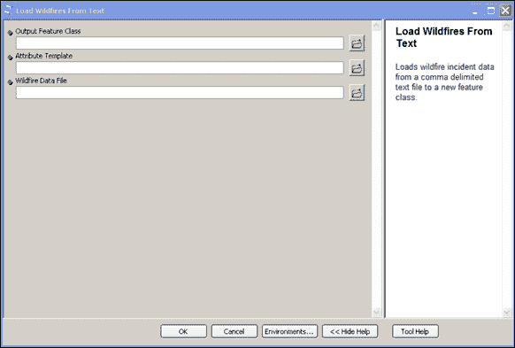

1.  定义一个新的输出要素类，该要素类应加载到现有的`WildlandFires.mdb`个人地理数据库中，如下一截图所示。点击打开文件夹图标，导航到`WildlandFires.mdb`个人地理数据库，它应位于`c:\ArcpyBook\data\Wildfires`。

1.  您还需要为新要素类提供一个名称。在这种情况下，我们将要素类命名为`TodaysWildfires`，但名称可以是您想要的任何名称。在以下截图中，您可以看到一个示例，说明如何进行此操作。点击**保存**按钮：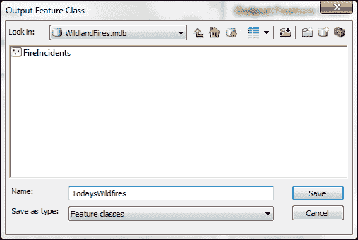

1.  对于属性模板，您希望指向已经为您创建的`FireIncidents`要素类。此要素类包含一个名为`CONFIDENCEVAL`的字段。此字段将在我们的新要素类中创建。点击**浏览**按钮，导航到`c:\ArcpyBook\data\Wildfires\WildlandFires.mdb`，您应该看到`FireIncidents`要素类。选择它，然后点击**添加**。

1.  最后，最后一个参数需要指向包含野火信息的逗号分隔的文本文件。此文件可在以下位置找到：`c:\ArcpyBook\data\Wildfires\NorthAmericaWildfires_2007275.txt`。点击**浏览**按钮，导航到`c:\ArcpyBook\data\Wildfires`。点击`NorthAmericaWildfires_2007275.txt`，然后点击**添加**按钮。

    您的工具应如下所示：

    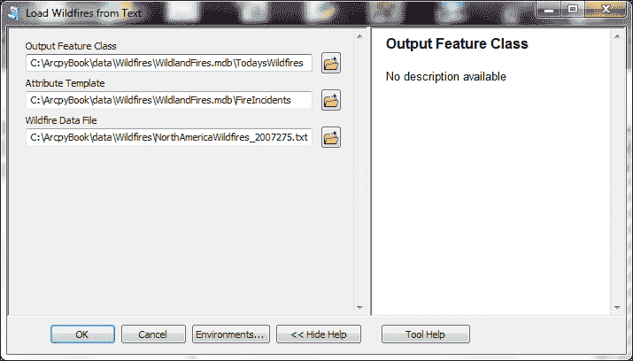

1.  点击**确定**以执行工具。任何消息都将写入到如下截图所示的对话框中。这是任何地理处理工具的标准对话框。如果一切设置正确，您应该看到如下截图，显示将有一个新的要素类添加到 ArcMap 显示中：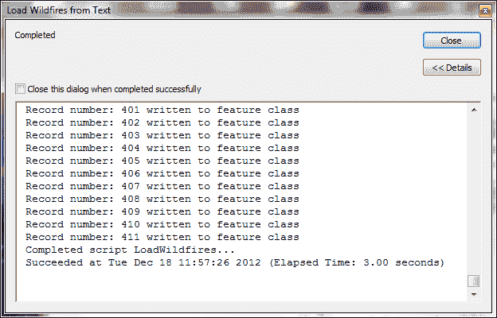

如果一切设置正确，您应该看到如下截图，显示将有一个新的要素类添加到 ArcMap 显示中：

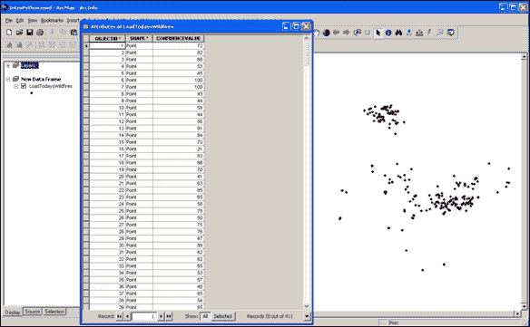

## 它是如何工作的…

几乎所有的脚本工具都有参数，这些值在工具对话框中设置。当工具执行时，参数值会被发送到您的脚本。您的脚本读取这些值，然后继续其工作。Python 脚本可以接受参数作为输入。参数，也称为参数，使您的脚本变得动态。到目前为止，我们所有的脚本都使用了硬编码的值。通过为脚本指定输入参数，您可以在运行时提供要素类的名称。这种能力使您的脚本更加灵活。

用于捕获参数输入的`GetParameterAsText()`方法是从 0 开始的，第一个输入的参数占据索引`0`。每个后续参数增加 1。通过读取逗号分隔的文本文件创建的输出要素类由变量`outputFC`指定，该变量通过`GetParameterAsText(0)`检索。使用`GetParameterAsText(1)`，我们捕获一个将作为输出要素类属性模式的模板的要素类。模板要素类中的属性字段用于定义将填充我们的输出要素类的字段。最后，`GetParameterAsText(2)`用于创建一个名为`f`的变量，该变量将保存要读取的逗号分隔的文本文件。

## 还有更多...

`arcpy.GetParameterAsText()`方法并不是捕获传递到您的脚本中的信息的唯一方式。当您从命令行调用 Python 脚本时，您可以传递一组参数。在传递参数到脚本时，每个单词必须由一个空格分隔。这些单词存储在一个从 0 开始的列表对象中，称为`sys.argv`。在`sys.argv`中，列表中的第一个项目，通过索引`0`引用，存储了脚本的名称。每个后续的单词通过下一个整数引用。因此，第一个参数将存储在`sys.argv[1]`中，第二个在`sys.argv[2]`中，依此类推。然后可以从脚本内部访问这些参数。

建议您使用`GetParameterAsText()`函数而不是`sys.argv`，因为`GetParameterAsText()`没有字符限制，而`sys.argv`每个参数的字符限制为 1,024 个字符。在任一情况下，一旦参数被读入脚本，您的脚本就可以使用输入值继续执行。
