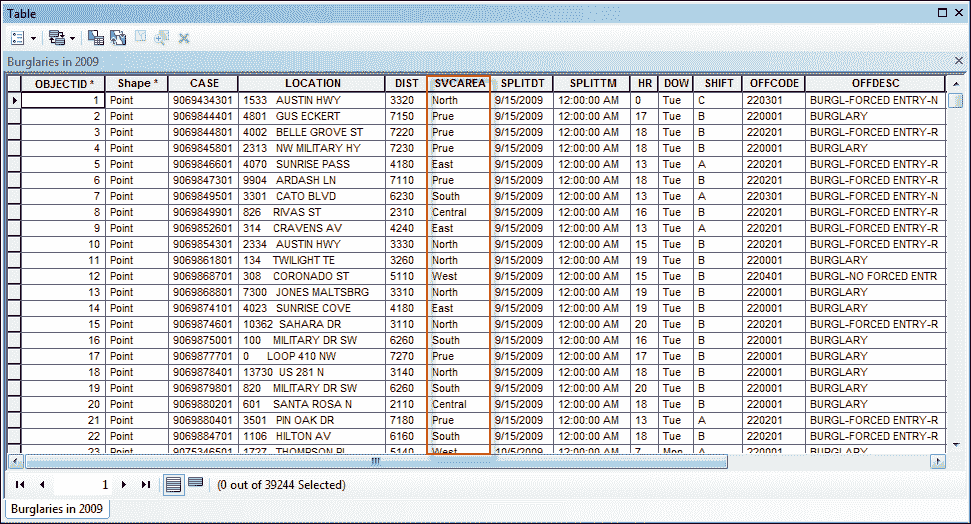
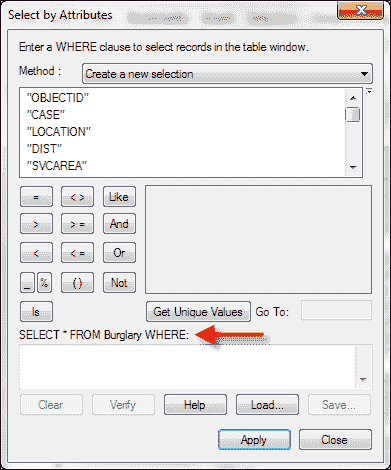
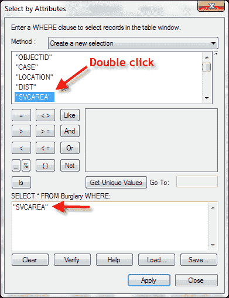
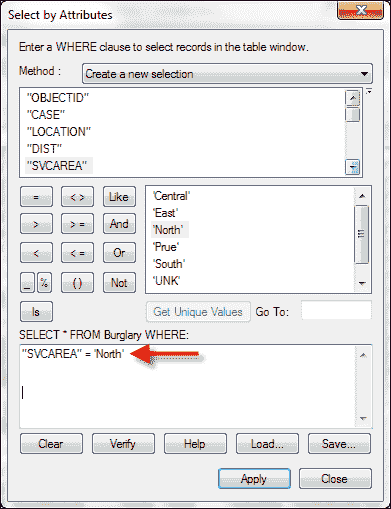
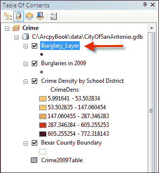
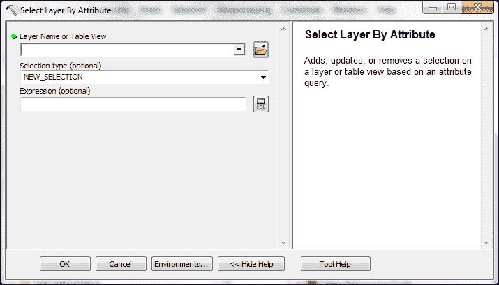
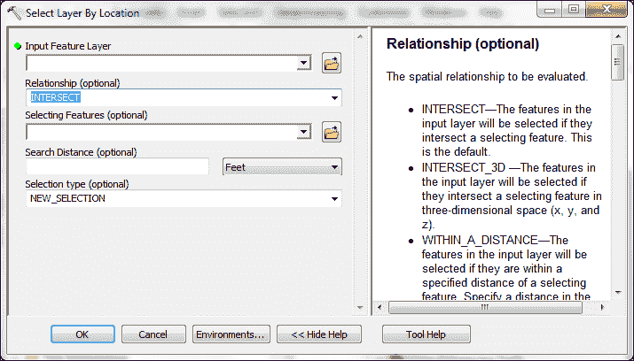
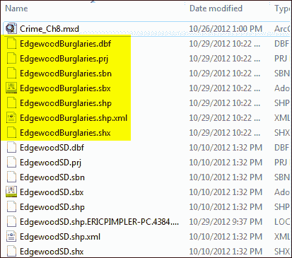

# 第八章。查询和选择数据

在本章中，我们将介绍以下食谱：

+   构建正确的属性查询语法

+   创建要素图层和表格视图

+   使用“按属性选择图层”工具选择特征和行

+   使用“按位置选择”工具选择特征

+   使用“按位置选择”工具结合空间和属性查询

# 简介

从地理图层选择特征或从独立属性表中选择行是 GIS 操作中最常见的操作之一。查询被创建以启用这些选择，可以是属性查询或空间查询。**属性查询**使用 SQL 语句通过使用数据集中一个或多个字段或列来选择特征或行。一个属性查询的例子可能是“选择所有价值超过 500,000 美元的土地地块”。**空间查询**用于根据某种空间关系选择特征。一个例子可能是“选择所有与 100 年一遇洪水平原相交的土地地块”或“选择所有完全位于德克萨斯州特拉维斯县的道路”。也可以将属性查询和空间查询结合起来。一个例子可能是“选择所有与 100 年一遇洪水平原相交且价值超过 500,000 美元的土地地块”。

# 构建正确的属性查询语法

构建属性查询对于您成功创建查询特征类和表的地理处理脚本至关重要。您对特征类和表执行的任何属性查询都需要正确的 SQL 语法，并且根据您执行的查询的数据类型，还需要遵循各种规则。

## 准备工作

创建属性查询的语法是在创建包含使用 **按属性选择** 工具的 Python 脚本时需要掌握的最困难且耗时最长的任务之一。这些查询基本上是 SQL 语句，以及一些你需要掌握的特殊性。如果你已经很好地理解了在 ArcMap 中创建查询或者在其他编程语言中创建 SQL 语句的经验，那么这对你来说会容易一些。除了创建有效的 SQL 语句外，你还需要了解一些特定的 Python 语法要求以及一些数据类型差异，这会导致某些数据类型的语句格式略有改变。在本食谱中，你将学习如何构建有效的查询语法，并了解不同数据类型如何改变语法以及一些 Python 特定的结构。

## 如何操作…

首先，我们将查看在 ArcMap 中如何构建查询，这样你可以了解它们的结构。

1.  在 ArcMap 中，打开 `C:\ArcpyBook\Ch8\Crime_Ch8.mxd`。

1.  右键单击**2009 年发生的盗窃事件**图层，选择**打开属性表**。你应该会看到一个类似于以下截图的属性表。我们将查询**SVCAREA**字段：

1.  在属性表打开的情况下，选择**表选项**按钮，然后选择**按属性选择**以显示一个对话框，该对话框将允许你构建一个属性查询。

    注意查询对话框（如下面的截图所示）上的**Select * FROM Burglary WHERE:**语句。这是一个基本的 SQL 语句，它将返回所有满足我们通过查询构建器定义的条件的**Burglary**属性表中的列。星号（****）简单地表示将返回所有字段：

    

1.  确保在**方法**下拉列表中选中的是**创建新选择**项。这将创建一个新的选择集。

1.  双击列表中的**SVCAREA**字段，将其添加到 SQL 语句构建器中，如下所示：

1.  点击**=**按钮。

1.  点击**获取唯一值**按钮。

1.  从生成的值列表中双击**'North'**以完成 SQL 语句，如下面的截图所示：

1.  点击**应用**按钮以执行查询。这应该选择 7520 条记录。

    许多人错误地认为可以将以这种方式生成的查询直接粘贴到 Python 脚本中。事实并非如此。我们将讨论一些重要的差异。

1.  关闭**按属性选择**窗口和**2009 年发生的盗窃事件**表。

1.  通过点击**选择** | **清除所选要素**来清除所选要素集。

1.  打开 Python 窗口，并添加导入`arcpy`的代码。

    ```py
    import arcpy
    ```

1.  创建一个新的变量来保存查询，并添加你之前创建的完全相同的语句：

    ```py
    qry = "SVCAREA" = 'North'
    ```

1.  按下键盘上的*Enter*键，你应该会看到一个类似于以下错误消息：

    ```py
    Runtime error SyntaxError: can't assign to literal (<string>, line 1)

    ```

Python 将**SVCAREA**和**North**解释为字符串，但两个字符串之间的等号不是设置`qry`变量的字符串的一部分。我们需要做一些事情来生成 Python 解释器可以正确理解的语句。

虽然已经处理了一个重要的事情。在查询中使用的每个字段名都需要用双引号括起来。在这种情况下，**SVCAREA**是查询中使用的唯一字段，并且已经用双引号括起来了。当你处理 shapefiles、文件地理数据库或 ArcSDE 地理数据库时，情况总是如此。然而，这里有一点可能会让人感到困惑。如果你正在处理个人地理数据库中的数据，字段名需要用方括号而不是双引号括起来，如下面的代码示例所示。这可能会给脚本开发者带来一定的困惑。

```py
qry = [SVCAREA] = 'North'

```

现在，我们需要处理围绕 **'North'** 的单引号。当从具有 `text` 数据类型的字段查询数据时，被评估的字符串必须用引号括起来。如果你检查原始查询，你会注意到我们实际上已经用引号括起了单词 `North`，所以一切应该没问题吧？不幸的是，在 Python 中并不是那么简单。引号，以及许多其他字符，必须用反斜杠后跟被转义的字符来转义。在这种情况下，转义序列将是 `\'`。

1.  修改你的查询语法以包含转义序列：

    ```py
    qry = "SVCAREA" = \'North\'
    ```

1.  最后，整个查询语句应该用引号括起来：

    ```py
    qry = '"SVCAREA" = \'North\''
    ```

除了用于测试相等的 `=` 符号之外，还有许多其他运算符可以与字符串和数值数据一起使用，包括不等于 (`< >`), 大于 (`>`), 大于等于 (`>=`), 小于 (`<`), 和小于等于 (`<=`)。

通配符字符包括 `%` 和 `_` 也可以用于 shapefile、文件地理数据库和 ArcSDE 地理数据库。这些包括 `%` 用于表示任意数量的字符。`LIKE` 运算符常与通配符字符一起使用，以执行部分字符串匹配。例如，以下查询将找到所有服务区域以 `N` 开头且后面跟有任意数量字符的记录。

```py
qry = '"SVCAREA" LIKE \'N%\''
```

下划线字符 (`_`) 可以用来表示单个字符。对于个人地理数据库，星号 (`*`) 用于表示任意数量字符的通配符，而 (`?`) 表示单个字符。

你还可以查询数据缺失的情况，也称为 `NULL` 值。`NULL` 值常被误认为是零的值，但这并不是事实。`NULL` 值表示数据缺失，这与零的值不同。Null 运算符包括 **IS NULL** 和 **IS NOT NULL**。以下代码示例将找到所有 `SVCAREA` 字段没有数据的记录：

```py
qry = '"SVCAREA" IS NULL'
```

在本节中我们将讨论的最后一个主题是用于组合表达式的运算符，当需要满足多个查询条件时。`AND` 运算符要求两个查询条件都满足，查询结果才为真，从而选择记录。`OR` 运算符要求至少满足一个条件。

## 它是如何工作的...

使用 Python 编程 ArcGIS 时，创建语法正确的查询是其中最具挑战性的方面之一。然而，一旦你理解了一些基本规则，它就会变得容易一些。在本节中，我们将总结这些规则。需要记住的一个重要事项是，对于所有数据集，字段名必须用双引号括起来，除了个人地理数据库，它要求字段名周围用大括号包围。

此外，还有一个`AddFieldDelimiters()`函数，您可以使用它根据作为函数参数提供的源数据添加正确的分隔符到字段。此函数的语法如下：

```py
AddFieldDelimiters(dataSource,field)
```

此外，大多数人，尤其是那些刚开始用 Python 进行编程的新手，都会遇到在查询中添加字符串值单引号的问题。在 Python 中，引号必须用单个反斜杠后跟引号进行转义。使用此转义序列将确保 Python 确实将其视为引号而不是字符串的结尾。

最后，花一些时间熟悉通配符字符。对于除个人地理数据库之外的数据集，您将使用(`%)`字符表示多个字符，以及下划线(_)字符表示单个字符。如果您使用的是个人地理数据库，则使用(`*)`字符来匹配多个字符，而使用`(?)`字符来匹配单个字符。显然，个人地理数据库与其他所有类型数据集之间的语法差异可能会导致一些混淆。

# 创建要素类和表视图

要素类和表视图作为中间数据集存储在内存中，专门用于与选择位置和选择属性等工具一起使用。尽管这些临时数据集可以保存，但在大多数情况下并不需要。

## 准备工作

要素类是地理数据的物理表示，以文件（形状文件、个人地理数据库和文件地理数据库）或地理数据库的形式存储。ESRI 将要素类定义为“共享公共几何形状（点、线或多边形）、属性表和空间参考的一组要素。”

要素类可以包含默认字段和用户定义字段。默认字段包括`SHAPE`和`OBJECTID`字段。这些字段由 ArcGIS 自动维护和更新。`SHAPE`字段包含地理要素的几何表示，而`OBJECTID`字段包含每个要素的唯一标识符。根据要素类的类型，还将存在其他默认字段。线要素类将有一个`SHAPE_LENGTH`字段。多边形要素类将同时具有`SHAPE_LENGTH`和`SHAPE_AREA`字段。

可选字段是由 ArcGIS 的用户创建的，并且不会被 GIS 自动更新。这些字段包含有关要素的属性信息。这些字段也可以通过您的脚本进行更新。

表在物理上表示为独立的 DBF 表或在地理数据库中。两者，表和要素类，都包含属性信息。然而，表只包含属性信息。与表关联的`SHAPE`字段不存在，并且它们可能包含或不包含`OBJECTID`字段。

使用**选择属性**或**选择位置**工具的独立 Python 脚本需要您创建一个中间数据集，而不是使用要素类或表格。这些中间数据集是临时性的，被称为**要素层**或**表视图**。与要素类和表格不同，这些临时数据集并不代表磁盘或地理数据库中的实际文件。相反，它们是要素类和表格的“内存”表示。这些数据集仅在 Python 脚本运行时是活动的。在工具执行后，它们将从内存中删除。然而，如果脚本在 ArcGIS 中作为脚本工具运行，则可以通过在内容表中右键单击图层并选择**另存为图层文件**或简单地保存地图文档文件来保存临时图层。

在您的 Python 脚本中，必须在调用**选择属性**或**选择位置**工具之前单独创建要素层和表视图。**创建要素层**工具生成要素类的“内存”表示，然后可以用来创建查询和选择集，以及连接表格。完成此步骤后，您可以使用**选择属性**或**选择位置**工具。同样，**创建表视图**工具用于创建表格的“内存”表示。该工具的功能与**创建要素层**相同。**创建要素层**和**创建表视图**工具都需要输入数据集、输出图层名称和可选的查询表达式，该查询表达式可以用来限制输出图层中的要素或行。此外，这两个工具都可以在**数据管理**工具箱中找到。

使用**创建要素层**工具的语法如下：

```py
arcpy.MakeFeatureLayer_management(<input feature layer>, <output layer name>,{where clause})
```

使用**创建表视图**工具的语法如下：

```py
Arcpy.MakeTableView_management(<input table>, <output table name>, {where clause})
```

在本食谱中，您将学习如何使用**创建要素层**和**创建表视图**工具。这些任务将在 ArcGIS 内部完成，以便您可以看到创建的层内存副本。

## 如何操作…

按照以下步骤学习如何使用**创建要素层**和**创建表视图**工具：

1.  在 ArcMap 中打开`c:\ArcpyBook\Ch8\Crime_Ch8.mxd`。

1.  打开 Python 窗口。

1.  导入`arcpy`模块：

    ```py
    import arcpy
    ```

1.  设置工作空间：

    ```py
    arcpy.env.workspace = "c:/ArcpyBook/data/CityOfSanAntonio.gdb"
    ```

1.  开始一个`try`块：

    ```py
    try:
    ```

1.  使用**创建要素层**工具创建`Burglary`要素类的内存副本。确保缩进此行代码：

    ```py
    flayer = arcpy.MakeFeatureLayer_management("Burglary","Burglary_Layer")
    ```

1.  在出现问题时添加一个`except`块和一行代码来打印错误信息：

    ```py
    except:
      print "An error occurred during creation"
    ```

1.  整个脚本应如下所示：

    ```py
    import arcpy
    arcpy.env.workspace = "c:/ArcpyBook/data/CityOfSanAntonio.gdb"
    try:
      flayer = arcpy.MakeFeatureLayer_management("Burglary","Burglary_Layer")
    except:
      print "An error occurred during creation"
    ```

1.  将脚本保存到`c:\ArcpyBook\Ch8\CreateFeatureLayer.py`。

1.  运行脚本。新的`Burglary_Layer`文件将被添加到 ArcMap 的内容表中：

1.  **创建表视图**工具的功能与**创建要素图层**工具等效。区别在于它针对独立表而不是要素类。

1.  删除以下代码行：

    ```py
    flayer = arcpy.MakeFeatureLayer_management("Burglary","Burglary_Layer")
    ```

1.  在其位置添加以下代码行：

    ```py
    tView = arcpy.MakeTableView_management("Crime2009Table","Crime2009TView")
    ```

1.  运行脚本以查看添加到 ArcMap 内容表的表视图。

## 它是如何工作的...

**创建要素图层**和**创建表视图**工具分别创建要素类和表的内存表示。**按属性选择**和**按位置选择**工具在从 Python 脚本调用时都需要将这些临时内存结构作为参数传递。这两个工具还要求您传递临时结构的名称。

## 还有更多...

您还可以将查询应用于**创建要素图层**或**创建表视图**工具，以限制在要素图层或表视图中返回的记录。这是通过在脚本中调用这两个工具时添加`where`子句来完成的。此查询与您通过**图层属性** | **定义查询**在图层上设置定义查询时设置的定义查询非常相似。

添加查询的语法如下：

```py
MakeFeatureLayer(in_features, out_layer, where_clause)
MakeTableView(in_table, out_view, where_clause)
```

# 使用**按属性选择图层**工具选择要素和行

可以通过使用**按属性选择图层**工具来对要素类或表执行属性查询。可以包含一个`where`子句来过滤所选记录，并可以包含各种选择类型。

## 准备工作

下面的屏幕截图显示的**按属性选择图层**工具用于根据您定义的查询从要素类或表中选择记录。我们在本章前面的配方中介绍了查询的相对复杂主题，因此希望您现在已经理解了创建查询的基本概念。您还学习了如何创建要素类或表的临时内存表示，这是使用**按属性选择**或**按位置选择**工具的先决条件。



**按属性选择**工具使用查询以及要素图层或表视图和一个选择方法来选择记录。默认情况下，选择方法将是一个新的选择集。其他选择方法包括“添加到选择”、“从选择中删除”、“子集选择”、“切换选择”和“清除选择”。每种选择方法如下总结：

+   `NEW_SELECTION`：这是默认选择方法，创建一个新的选择集

+   `ADD_TO_SELECTION`：根据查询将选择集添加到当前所选记录中

+   `REMOVE_FROM_SELECTION`：根据查询从选择集中删除记录

+   `SUBSET_SELECTION`：它将现有选择集中共有的所选记录组合起来

+   `SWITCH_SELECTION`：选择当前未选择的记录，并取消选择现有选择集

+   `CLEAR_SELECTION`：它清除当前选择集中的所有记录

调用 **Select by Attributes** 工具的语法如下：

```py
arcpy.SelectLayerByAttribute_management(<input feature layer or table view>, {selection method}, {where clause})
```

在这个示例中，你将学习如何使用 **Select by Attributes** 工具从要素类中选择要素。你将使用在之前的示例中学到的技能来构建查询、创建要素层，并最终调用 **Select by Attributes** 工具。

## 如何操作…

按照以下步骤学习如何使用 **Select Layer by Attributes** 工具从表格或要素类中选择记录：

1.  打开 IDLE 并创建一个新的脚本窗口。

1.  将脚本保存到 `c:\ArcpyBook\Ch8\SelectLayerAttribute.py`。

1.  导入 `arcpy` 模块：

    ```py
    import arcpy
    ```

1.  将工作空间设置为圣安东尼奥市地理数据库。

    ```py
    arcpy.env.workspace = "c:/ArcpyBook/data/CityOfSanAntonio.gdb"
    ```

1.  开始一个 `try` 块：

    ```py
    try:
    ```

1.  创建本章第一个示例中使用的查询。这将作为一个 `where` 子句，选择所有服务区域为 `North` 的记录。这一行代码和接下来的四行应该缩进：

    ```py
    qry = '"SVCAREA" = \'North\''
    ```

1.  创建 `Burglary` 要素类的内存副本：

    ```py
    flayer = arcpy.MakeFeatureLayer_management("Burglary","Burglary_Layer")
    ```

1.  调用 **Select Layer by Attribute** 工具，传入我们刚刚创建的要素层的引用。将其定义为一个新的选择集，并传入查询的引用：

    ```py
    arcpy.SelectLayerByAttribute_management(flayer, "NEW_SELECTION", qry)
    ```

1.  使用 **Get Count** 工具打印图层中选中的记录数：

    ```py
    cnt = arcpy.GetCount_management(flayer)
    print "The number of selected records is: " + str(cnt)
    ```

1.  添加一个 `except` 块和一行代码，以便在出现问题时打印错误消息：

    ```py
    except:
      print "An error occurred during selection"
    ```

1.  整个脚本应如以下代码片段所示。请记住，在 `try` 和 `except` 块中包含缩进：

    ```py
    import arcpy
    arcpy.env.workspace = "c:/ArcpyBook/data/CityOfSanAntonio.gdb"
    try:
      qry = '"SVCAREA" = \'North\''
      flayer =   arcpy.MakeFeatureLayer_management("Burglary","Burglary_Layer")
      arcpy.SelectLayerByAttribute_management(flayer, "NEW_SELECTION", qry)
      cnt = arcpy.GetCount_management(flayer)
      print "The number of selected records is: " + str(cnt)
    except:
      print "An error occurred during selection"
    ```

1.  保存脚本。

1.  运行脚本。如果一切操作正确，你应该会看到一个消息，表明已选中 7520 条记录：

    ```py
    The total number of selected records is: 7520

    ```

## 它是如何工作的…

**Select by** **Attributes** 工具要求传入一个要素层或表格视图作为第一个参数。在这个示例中，我们传入了一个由上一行中的 **Make Feature Layer** 工具创建的要素层。我们使用 **Make Feature Layer** 工具从 `Burglary` 要素类中创建了一个要素层。这个要素层被分配给变量 `flayer`，然后作为第一个参数传递给 **Select by Attribute** 工具。在这个脚本中，我们还传入了一个参数，表示我们希望创建一个新的选择集，以及 `final` 参数，它是一个 `where` 子句。`where` 子句在 `qry` 变量中指定。这个变量包含一个查询，将选择所有服务区域为 `North` 的要素。

# 使用 **Select by Location** 工具选择要素

如下截图所示的 **Select Layer by Location** 工具可以用于根据某种空间关系选择要素。由于它处理空间关系，此工具仅适用于要素类及其对应的内存要素层。

## 准备工作

在使用**按位置选择**工具选择要素时，你可以应用许多不同类型的空间关系，包括相交、包含、在内部、边界接触、相同，以及许多其他关系。如果没有指定，将应用默认的相交空间关系。输入要素层是唯一必需的参数，但还有许多可选参数，包括空间关系、搜索距离、要测试输入层的要素层或要素类，以及选择类型。在本菜谱中，你将学习如何在 Python 脚本中使用**按位置选择**工具根据空间关系选择要素。你将使用该工具选择位于 Edgewood 学区边界内的入室盗窃案件。



## 如何做到这一点...

按照以下步骤学习如何使用**按位置选择**工具执行空间查询：

1.  打开 IDLE 并创建一个新的脚本窗口。

1.  将脚本保存到`c:\ArcpyBook\Ch8\SelectByLocation.py`。

1.  导入`arcpy`模块：

    ```py
    import arcpy
    ```

1.  将工作空间设置为圣安东尼奥市地理数据库：

    ```py
    arcpy.env.workspace = "c:/ArcpyBook/data/CityOfSanAntonio.gdb"
    ```

1.  开始一个`try`块：

    ```py
    try:
    ```

1.  创建`Burglary`要素类的内存副本：

    ```py
    flayer = arcpy.MakeFeatureLayer_management("Burglary","Burglary_Layer")
    ```

1.  调用**按位置选择图层**工具，传入我们刚刚创建的要素层的引用。空间关系测试将是`COMPLETELY_WITHIN`，这意味着我们想要找到所有完全位于比较层边界内的入室盗窃案件。将`EdgewoodSD.shp`定义为比较层：

    ```py
    arcpy.SelectLayerByLocation_management (flayer, "COMPLETELY_WITHIN", "c:/ArcpyBook/Ch8/EdgewoodSD.shp")
    ```

1.  使用**获取计数**工具在图层中打印所选记录的数量：

    ```py
    cnt = arcpy.GetCount_management(flayer)
    print "The number of selected records is: " + str(cnt)
    ```

1.  添加一个`except`块和一行代码，以便在出现问题时打印错误消息：

    ```py
    except:
      print "An error occurred during selection"
    ```

1.  整个脚本应如以下代码片段所示。请记住，包括`try`和`except`块中的缩进：

    ```py
    import arcpy
    arcpy.env.workspace = "c:/ArcpyBook/data/CityOfSanAntonio.gdb"
    try:
      flayer =   arcpy.MakeFeatureLayer_management("Burglary","Burglary_Layer")
      arcpy.SelectLayerByLocation_management (flayer, "COMPLETELY_WITHIN", "c:/ArcpyBook/Ch8/EdgewoodSD.shp")
      cnt = arcpy.GetCount_management(flayer)
      print "The number of selected records is: " + str(cnt)
    except:
      print "An error occurred during selection"
    ```

1.  保存脚本。

1.  运行脚本。如果一切操作正确，你应该会看到一个消息指示已选择 1470 条记录：

    ```py
    The total number of selected records is: 1470

    ```

在这种情况下，我们没有定义可选的搜索距离和选择类型参数。默认情况下，将应用新的选择作为选择类型。在这种情况下，我们没有应用距离参数，但现在我们将这样做以说明它是如何工作的。

1.  更新调用**按位置选择图层**工具的代码行：

    ```py
    arcpy.SelectLayerByLocation_management (flayer, "WITHIN_A_DISTANCE", "c:/ArcpyBook/Ch8/EdgewoodSD.shp","1 MILES")
    ```

1.  保存脚本。

1.  运行脚本。如果一切操作正确，你应该会看到一个消息指示已选择 2976 条记录。这将选择所有位于 Edgewood 学区边界内的入室盗窃案件，以及任何位于边界一英里内的入室盗窃案件：

    ```py
    The total number of selected records is: 2976

    ```

在本节中，你将完成的最后一件事是使用**复制要素**工具将临时图层写入新的要素类。

1.  注释掉获取要素数量并打印到屏幕上的两行代码：

    ```py
    ## cnt = arcpy.GetCount_management(flayer)
    ## print "The number of selected records is: " + str(cnt)
    ```

1.  添加一行代码调用**复制要素**工具。这一行应放在调用**选择层位置**工具的代码行下方。**复制要素**工具接受一个要素层作为第一个输入参数和一个输出要素类，在这个例子中，将是一个名为`EdgewoodBurglaries.shp`的形状文件：

    ```py
    arcpy.CopyFeatures_management(flayer, 'c:/ArcpyBook/Ch8/EdgewoodBurglaries.shp')
    ```

1.  整个脚本现在应如下所示。请记住，包括`try`和`except`块的缩进：

    ```py
    import arcpy
    arcpy.env.workspace = "c:/ArcpyBook/data/CityOfSanAntonio.gdb"
    try:
      flayer = arcpy.MakeFeatureLayer_management("Burglary","Burglary_Layer")
      arcpy.SelectLayerByLocation_management (flayer, "WITHIN_A_DISTANCE", "c:/ArcpyBook/Ch8/EdgewoodSD.shp","1 MILES")
      arcpy.CopyFeatures_management(flayer, 'c:/ArcpyBook/Ch8/EdgewoodBurglaries.shp')
    	#cnt = arcpy.GetCount_management(flayer)
     #print "The total number of selected records is: " + str(cnt)
    except:
      print "An error occurred during selection"
    ```

1.  保存脚本。

1.  运行脚本。

1.  检查你的`c:\ArcpyBook\Ch8`文件夹以查看输出要素形状文件：

## 它是如何工作的…

**选择位置**工具需要将要素层作为第一个参数传入。在这个菜谱中，我们传入了一个由上一行中的**创建要素层**工具创建的要素层。我们使用**创建要素层**从`Burglary`要素类创建要素层。这个要素层被分配给变量`flayer`，然后作为第一个参数传递给**选择位置**工具。在这个脚本中，我们还传入了一个参数，表示我们想要应用的空間关系。最后，我们还定义了一个用于空間关系比较的源层。其他可以应用的可选参数包括搜索距离和选择类型。

# 使用**选择位置**工具结合空间和属性查询

有时候你可能想使用组合的属性和空间查询来选择要素。例如，你可能想选择在周一发生的所有位于 Edgewood 学区内的盗窃事件。这可以通过依次运行**选择位置**和**选择属性**工具并应用`SUBSET SELECTION`选择类型来实现。

## 准备工作

这个菜谱将需要你创建一个作为临时层的要素层，它将被用于**选择位置**和**选择层属性**工具。**选择位置**工具将找到所有位于 Edgewood 学区内的盗窃事件，并将选择集应用于这些要素。**选择层属性**工具使用相同的临时要素层，并应用一个`where`子句来找到所有发生在周一的盗窃事件。此外，工具还指定选择应该是**选择位置**工具找到的当前选定要素的子集。最后，你将打印出由组合的空间和属性查询选定的记录总数。

## 如何操作...

1.  打开 IDLE 并创建一个新的脚本窗口。

1.  将脚本保存为`c:\ArcpyBook\Ch8\SpatialAttributeQuery.py`。

1.  导入`arcpy`模块：

    ```py
    import arcpy 
    ```

1.  将工作空间设置为圣安东尼奥市地理数据库：

    ```py
    arcpy.env.workspace = "c:/ArcpyBook/data/CityofSanAntonio.gdb"
    ```

1.  开始一个`try`块。你将需要缩进下一行直到`except`块：

    ```py
    try:
    ```

1.  为查询创建一个变量并定义`where`子句：

    ```py
    qry = '"DOW" = \'Mon\''
    ```

1.  创建要素层：

    ```py
    flayer = arcpy.MakeFeatureLayer_management("Burglary","Burglary_Layer")
    ```

1.  执行 **按位置选择** 工具以找到 Edgewood 学区内的所有盗窃事件。

    ```py
    arcpy.SelectLayerByLocation_management (flayer, "COMPLETELY_WITHIN", "c:/ArcpyBook/Ch8/EdgewoodSD.shp")
    ```

1.  执行 **按属性选择图层** 工具以找到所有与我们在 `qry` 变量中先前定义的查询匹配的盗窃事件。这应该定义为子集查询：

    ```py
    arcpy.SelectLayerByAttribute_management(flayer, "SUBSET_SELECTION", qry)
    ```

1.  打印所选记录的数量：

    ```py
    cnt = arcpy.GetCount_management(flayer)
    ```

1.  添加 `except` 块：

    ```py
    except:
      print 'Error in selection'
    ```

    整个脚本应如下所示：

    ```py
    import arcpy
    arcpy.env.workspace = "c:/ArcpyBook/data/CityOfSanAntonio.gdb"
    try:
      qry = '"DOW" = \'Mon\''
      flayer = arcpy.MakeFeatureLayer_management("Burglary","Burglary_Layer")
      arcpy.SelectLayerByLocation_management (flayer, "COMPLETELY_WITHIN", "c:/ArcpyBook/Ch8/EdgewoodSD.shp")
      arcpy.SelectLayerByAttribute_management(flayer, "SUBSET_SELECTION", qry)
    	cnt = arcpy.GetCount_management(flayer)
      print "The total number of selected records is: " + str(cnt)
    except:
      print 'Error in selection'
    ```

1.  保存并运行脚本。

    如果一切操作正确，你应该会看到一个消息，表明已选择了 197 条记录。这将选择在周一发生的，位于 Edgewood 学区边界内的所有盗窃事件。

    ```py
    The total number of selected records is: 197

    ```

## 它是如何工作的...

使用 **创建要素图层** 工具创建一个新的要素图层，并将其分配给变量 `flayer`。这个临时图层随后被用作 **按位置选择** 工具的输入，同时使用空间运算符 `COMPLETELY_WITHIN`，以找到 Edgewood 学区内的所有盗窃事件。然后，使用已经定义了选择集的相同要素图层作为 **按属性选择图层** 工具的输入参数。除了传递要素图层的引用外，**按属性选择图层** 工具还传递了一个参数，用于定义选择类型和 `where` 子句。选择类型设置为 `SUBSET_SELECTION`。这种选择类型创建了一个新的选择，并将其与现有选择合并。只有两者共有的记录才会被选中。作为第三个参数传入的 `where` 子句是一个属性查询，用于找到所有在周一发生的盗窃事件。查询使用 `DOW` 字段，寻找值为 `Mon` 的值。最后，使用 **获取计数** 工具对 `flayer` 变量进行操作，以获取所选记录的数量，并将其打印到屏幕上。
