# 第四章：自动化地图生产和打印

在本章中，我们将介绍以下菜谱：

+   创建布局元素列表

+   为布局元素分配唯一名称

+   限制 ListLayoutElements() 返回的布局元素

+   更新布局元素属性

+   获取可用打印机的列表

+   使用 PrintMap() 打印地图

+   将地图导出为 PDF 文件

+   将地图导出为图像文件

+   导出报告

+   使用数据驱动页面和 ArcPy 映射构建地图集

+   将地图文档发布到 ArcGIS Server 服务

# 简介

ArcGIS 10 一起发布的 `arcpy.mapping` 模块提供了一系列与地图生产自动化相关的功能。`arcpy.mapping` 模块可用于自动化地图生产、构建地图集、将地图导出为图像或 PDF 文件，以及创建和管理 PDF 文件。在本章中，您将学习如何使用 `arcpy.mapping` 模块来自动化与地图生产和打印相关的各种地理处理任务。

# 创建布局元素列表

在自动化地图生产的地理处理脚本中，第一步通常是生成可用布局元素的列表。例如，您可能需要在打印或创建 PDF 文件之前更新地图的标题。在这种情况下，标题可能存储在 `TextElement` 对象中。您可以在地图布局视图中生成 `TextElement` 对象的列表，然后更改标题。第一步是生成 `TextElement` 对象的列表。

## 准备工作

在 ArcMap 中，有两个视图可用，即数据视图和布局视图。**数据视图**用于查看地理和表格数据、分析数据、符号化图层以及管理数据，而不考虑任何特定的地图页面大小或布局。**布局视图**显示打印在页面上的地图，并用于通过添加地图元素来创建生产质量的地图。这些元素包括地图框架、图层、图例、标题、北箭头、比例尺和标题块。布局中的每个对象在 `arcpy.mapping` 中都表示为一个布局元素类。以下屏幕截图显示了这些布局元素类中的许多示例：

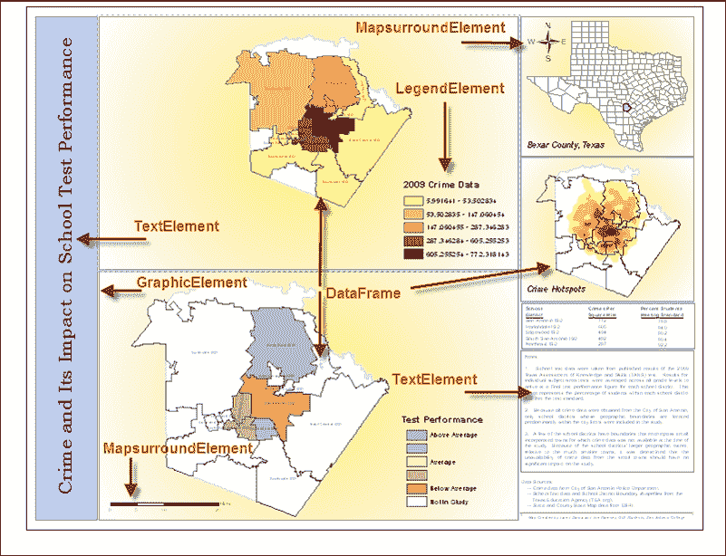

每个元素都可以分配一个唯一的名称，然后可以使用该名称以编程方式访问该元素。这个唯一名称在 ArcMap 中定义。`arcpy.mapping` 模块提供了一个 `ListLayoutElements()` 函数，该函数返回所有这些元素的列表。在本例中，您将学习如何使用 `ListLayoutElements()` 函数生成地图布局元素列表。

## 如何操作...

按以下步骤学习如何生成布局元素列表：

1.  在 ArcMap 中打开 `C:\ArcpyBook\Ch4\Crime_Ch4.mxd`。

1.  打开 Python 窗口。

1.  导入 `arcpy.mapping` 模块：

    ```py
    import arcpy.mapping as mapping
    ```

1.  引用当前活动文档（`Crime_Ch4.mxd`）并将此引用分配给一个变量：

    ```py
    mxd = mapping.MapDocument("CURRENT")
    ```

1.  如果名称属性不为空，则生成布局元素列表并将其打印到屏幕上：

    ```py
    for el in mapping.ListLayoutElements(mxd):
      if el.name != '':
        print(el.name)
    ```

1.  整个脚本应如下所示：

    ```py
    import arcpy.mapping as mapping
    mxd = mapping.MapDocument("CURRENT")
    for el in mapping.ListLayoutElements(mxd):
      if el.name != '':
        print(el.name)
    ```

1.  您可以通过检查`c:\ArcpyBook\code\Ch4\CreateListLayoutElements.py`解决方案文件来验证您的操作。

1.  运行脚本以查看以下输出：

    ```py
    Crime_Inset
    Alternating Scale Bar
    Legend Test Performance
    Crime Legend
    North Arrow
    Inset_Map
    Test_Performance
    Crime

    ```

## 工作原理…

`ListLayoutElements()`返回一个布局元素列表，这些元素以各种布局类形式存在。每个元素可以是`GraphicElement`、`LegendElement`、`PictureElement`、`TextElement`或`MapSurroundElement`对象实例之一。每个元素都可以有一个唯一名称。您不必为每个元素分配名称，但如果您计划在脚本中以编程方式访问这些元素，这样做会有所帮助。在此脚本中，我们首先确保元素已分配了名称，然后再打印名称。这样做是因为 ArcMap 不需要为元素分配名称。

# 为布局元素分配唯一名称

使用 ArcMap 为所有布局元素分配唯一名称是一种良好的做法。如果您的地理处理脚本需要访问特定元素进行更改，这很重要。例如，您可能需要更新显示公司标志的图标。而不是在所有地图文档文件中手动进行此更改，您可以编写一个地理处理脚本，以编程方式更新所有地图文档文件并使用新标志。但是，为了使这成为可能，必须为布局元素分配唯一名称。这使您能够单独访问布局元素。

## 准备工作

如我之前所述，每个布局元素将属于多种元素类型之一，并且每个都可以分配名称。此元素名称可以在您需要引用 Python 脚本中的特定元素时使用。您可以使用 ArcMap 为每个布局元素分配唯一名称。在此配方中，您将使用 ArcMap 为元素分配名称。

## 如何操作…

按照以下步骤学习如何使用 ArcMap 为每个布局元素分配唯一名称：

1.  在 ArcMap 中打开`C:\ArcpyBook\Ch4\Crime_Ch4.mxd`。

1.  切换到布局视图，您应该看到类似于以下截图的内容：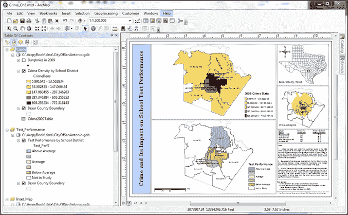

1.  根据元素类型，名称的分配方式不同。点击最上面的数据框，它应该是**Crime**，以选择它。选择手柄应如下所示：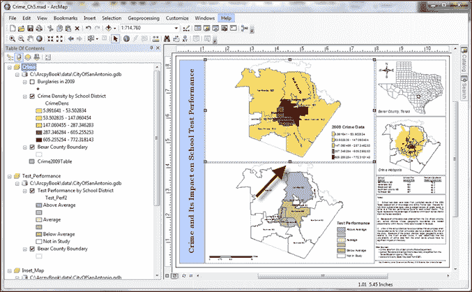

1.  右键点击上方的数据框并选择**属性**以显示**数据框属性**窗口，如图下所示截图。**元素名称**属性定义了元素的唯一名称，并在如图下所示截图的**大小和位置**选项卡中找到。在此情况下，将元素名称设置为`Crime`：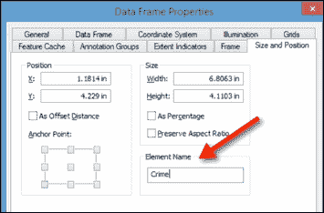

1.  关闭**数据框属性**窗口。

1.  选择**2009 犯罪数据图例**，并通过右键点击图例并选择**属性**来打开**属性**窗口。

1.  点击**大小和位置**选项卡。

1.  将**元素名称**值更改为`Crime Legend`，如图下所示：

1.  你也可以为文本元素定义唯一的名称。选择标题元素（`Crime and Its Impact on School Test Performance`），右键单击元素，并选择**属性**。

1.  点击**大小和位置**选项卡，并为该元素定义一个唯一的名称，如图下所示：

## 工作原理…

布局视图中每个元素都可以分配一个名称，然后可以在你的地理处理脚本中使用该名称来检索特定元素。你应该努力为每个元素定义唯一的名称。并不是必须为每个元素定义一个唯一的名称，甚至不需要定义名称。然而，如果你打算从 Python 脚本中访问这些元素，给每个元素命名并确保每个名称都是唯一的是一个最佳实践。在元素命名实践中，你应该努力只包含字母和下划线。

## 更多内容…

你可以使用元素名称与`ListLayoutElements()`函数结合使用，通过通配符参数来限制函数返回的元素。在下一个示例中，你将学习如何通过使用通配符和元素类型来限制返回的布局元素列表。

# 限制`ListLayoutElements()`返回的布局元素

布局可以包含大量元素，其中许多元素你可能不需要用于特定的地理处理脚本。`ListLayoutElements()` 函数可以通过传递一个参数来限制返回的布局元素，该参数定义了应返回的元素类型，并可以附带一个可选通配符，该通配符通过名称的一部分来查找元素。

## 准备工作

布局元素有多种不同类型，包括图形、图例、图片、文本和数据框。当你返回一个布局元素列表时，你可以限制（过滤）返回的元素类型。在本例中，你将编写一个脚本，通过元素类型和通配符来过滤返回的布局元素。

## 如何操作…

按照以下步骤学习如何通过使用可选参数来限制`ListLayoutElements()`函数返回的图层列表，这些参数定义了应返回的元素类型，以及可以进一步限制返回元素的通配符：

1.  在 ArcMap 中打开`C:\ArcpyBook\Ch4\Crime_Ch4.mxd`。

1.  打开 Python 窗口。

1.  导入`arcpy.mapping`模块：

    ```py
    import arcpy.mapping as mapping
    ```

1.  引用当前活动文档（`Crime_Ch4.mxd`）并将此引用分配给一个变量：

    ```py
    mxd = mapping.MapDocument("CURRENT")
    ```

1.  使用`ListLayoutElements()`函数，仅限制为图例元素，以及一个通配符，该通配符返回名称中包含`Crime`文本的元素：

    ```py
    for el in mapping.ListLayoutElements(mxd,"LEGEND_ELEMENT","*Crime*"):
      print(el.name)
    ```

1.  您可以通过检查 `c:\ArcpyBook\code\Ch4\RestrictLayoutElements.py` 解决方案文件来验证您的作品。

1.  运行脚本。在这种情况下，将只返回单个布局元素：

    ```py
    Crime Legend

    ```

## 它是如何工作的...

`ListLayoutElements()` 是一个多功能函数，在其最基本的形式中，用于返回地图文档页面布局上的所有布局元素的列表。但是，您可以提供两个可选参数来筛选此列表。第一种筛选类型是元素类型筛选，您指定只返回布局元素类型之一。您还可以应用通配符来筛选返回的列表。这两种类型的筛选可以组合使用。例如，在这个菜谱中，我们指定只返回元素名称中包含 `Crime` 文本的 `LEGEND_ELEMENT` 对象。这导致了一个高度筛选的列表，只包含单个布局元素。

### 注意

`ListLayoutElements()` 可以使用以下元素类型之一进行筛选：`DATAFRAME_ELEMENT`、`GRAPHIC_ELEMENT`、`LEGEND_ELEMENT`、`MAPSURROUND_ELEMENT`、`PICTURE_ELEMENT` 或 `TEXT_ELEMENT`。

# 更新布局元素的属性

每个布局元素都有一组可以编程更新的属性。例如，`LegendElement` 包含允许您更改图例在页面上的位置的属性，更新图例标题，并访问图例项。

## 准备工作

布局元素有很多不同类型，包括图形、图例、文本、地图和图片。这些元素中的每一个都在 `arcpy.mapping` 包中的一个类中得到了表示。这些类提供了各种属性，您可以使用它们以编程方式更改元素。

`DataFrame` 类提供了访问地图文档文件中的数据帧属性。此对象可以与地图单元和页面布局单元一起工作，具体取决于所使用的属性。页面布局属性，如定位和尺寸，可以应用于包括 `elementPositionX`、`elementPositionY`、`elementWidth` 和 `elementHeight` 在内的属性。

`GraphicElement` 对象是用于添加到页面布局的各种图形的通用对象，包括表格、图表、整洁线、标记、线条和区域形状。如果您打算通过 Python 脚本访问它，请确保为每个图形元素（以及任何其他元素）设置 `name` 属性。

`LegendElement` 提供了在页面布局中定位图例、修改图例标题以及访问图例项和父数据帧的操作。`LegendElement` 只能与单个数据帧相关联。

`MapSurroundElement` 可以指北箭头、比例尺和比例文本。它与 `LegendElement` 类似，并与单个数据帧相关联。此对象上的属性可以重新定位页面上的元素。

`PictureElement` 表示页面布局中的栅格或图像。此对象最有用的属性是获取和设置数据源，这在需要更改多个地图文档中的图片，如标志时非常有帮助。例如，您可以编写一个脚本，遍历所有地图文档文件，并用新的标志替换当前的标志。您还可以重新定位或调整大小对象。

`TextElement` 表示页面布局中的文本，包括插入的文本、注释、矩形文本和标题，但不包括图例标题或图表中的文本。属性允许修改文本字符串，这在需要在不同页面布局或多个地图文档中的多个位置更改相同的文本字符串时非常有用，当然，也可以重新定位对象。

页面布局中的每个元素都返回为元素对象的一个实例。在这个菜谱中，我们将使用 `Legend` 对象的 `title` 属性来编程更改 `Crime` 图例的标题，并获取图例中包含的图层列表。

## 如何做…

按照以下步骤学习如何更新布局元素的属性：

1.  在 ArcMap 中打开 `C:\ArcpyBook\Ch4\Crime_Ch4.mxd`。

1.  打开 Python 窗口。

1.  导入 `arcpy.mapping` 模块：

    ```py
    import arcpy.mapping as mapping
    ```

1.  引用当前活动文档（`Crime_Ch4.mxd`），并将此引用分配给一个变量：

    ```py
    mxd = mapping.MapDocument("CURRENT")
    ```

1.  使用 `ListLayoutElements()` 方法与通配符和仅限于图例元素的限制来返回仅 `Crime` 图例并将其存储在一个变量中：

    ```py
    elLeg = mapping.ListLayoutElements(mxd, "LEGEND_ELEMENT","*Crime*")[0]
    ```

1.  使用 `title` 属性更新图例的标题：

    ```py
    elLeg.title = "Crimes by School District"
    ```

1.  获取图例中包含的图层列表并打印名称：

    ```py
    for item in elLeg.listLegendItemLayers():
      print(item.name)
    ```

1.  整个脚本应如下所示：

    ```py
    import arcpy.mapping as mapping
    mxd = mapping.MapDocument("CURRENT")
    elLeg = mapping.ListLayoutElements(mxd, "LEGEND_ELEMENT","*Crime*")[0]
    elLeg.title = "Crimes by School District"
    for item in elLeg.listLegendItemLayers():
      print(item.name)
    ```

1.  您可以通过检查 `c:\ArcpyBook\code\Ch4\UpdateLayoutElementProperties.py` 解决方案文件来检查您的作品。

1.  运行脚本。您应该看到以下图层被打印出来：

    ```py
    Burglaries in 2009
    Crime Density by School District

    ```

1.  变更将在以下屏幕截图显示：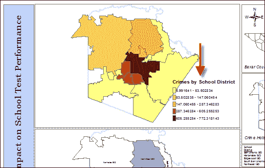

## 它是如何工作的...

每个布局元素都有一组属性和方法。在这个特定的情况下，我们使用了 `Legend` 对象的 `title` 属性。此对象的其它属性允许您设置宽度、高度、定位等。用于 `Legend` 对象的方法可以调整列数、列出图例项、删除和更新项。

# 获取可用打印机的列表

`arcpy` 提供的另一个列表函数是 `ListPrinterNames()`，它生成可用打印机的列表。与其他我们检查过的列表函数一样，`ListPrinterNames()` 通常在多步脚本中的初步步骤中被调用。

## 准备工作

在使用`PrintMap()`函数打印地图之前，调用`ListPrinterNames()`函数是一种常见做法，该函数返回本地计算机上可用的打印机列表。然后可以通过迭代打印机列表并使用它作为`PrintMap()`函数的输入来找到特定的打印机。

## 如何做...

按照以下步骤学习如何使用`ListPrinterNames()`函数来返回您脚本中可用的打印机列表：

1.  在 ArcMap 中打开`C:\ArcpyBook\Ch4\Crime_Ch4.mxd`。

1.  打开 Python 窗口。

1.  导入`arcpy.mapping`模块：

    ```py
    import arcpy.mapping as mapping
    ```

1.  引用当前活动文档（`Crime_Ch4.mxd`）并将此引用分配给一个变量：

    ```py
    mxd = mapping.MapDocument("CURRENT")
    ```

1.  调用`ListPrinterNames()`函数并打印每个打印机：

    ```py
    for printerName in mapping.ListPrinterNames():
      print(printerName)
    ```

1.  您可以通过检查`c:\ArcpyBook\code\Ch4\GetListOfPrinters.py`解决方案文件来检查您的工作。

1.  运行脚本。输出将根据您计算机上可用的打印机列表而变化。然而，它应该打印出类似于以下代码片段的内容：

    ```py
    HP Photosmart D110 series
    HP Deskjet 3050 J610 series (Network)
    HP Deskjet 3050 J610 series (Copy 1)
    HP Deskjet 3050 J610 series
    Dell 968 AIO Printer

    ```

## 它是如何工作的...

`ListPrinterNames()`函数返回一个包含所有可用于您脚本的打印机的 Python 列表。然后您可以使用`PrintMap()`函数，我们将在下一节中探讨，将打印作业发送到您计算机上可用的特定打印机。

# 使用 PrintMap()打印地图

使用`PrintMap()`函数将地图布局发送到打印机非常简单。默认情况下，打印作业将被发送到与地图文档一起保存的默认打印机，但您也可以定义一个特定的打印机，将作业发送到该打印机。

## 准备工作

`arcpy.mapping`模块提供了一个`PrintMap()`函数，用于从 ArcMap 打印页面布局或数据帧。在调用`PrintMap()`之前，调用`ListPrinterNames()`函数是一种常见做法，该函数返回本地计算机上可用的打印机列表。然后可以通过迭代可用于`PrintMap()`函数的打印机列表来找到特定的打印机。

`PrintMap()`可以打印特定的数据帧或地图文档的页面布局。默认情况下，此函数将使用与地图文档一起保存的打印机或地图文档中的默认系统打印机。正如我之前提到的，您还可以使用`ListPrinterNames()`来获取可用打印机的列表，并从这些打印机中选择一个作为`PrintMap()`的输入。在本食谱中，您将学习如何使用`PrintMap()`函数来打印布局。

## 如何做...

按照以下步骤学习如何使用`PrintMap()`函数在 ArcMap 中打印布局视图：

1.  在 ArcMap 中打开`C:\ArcpyBook\Ch4\Crime_Ch4.mxd`。

1.  打开 Python 窗口。

1.  导入`arcpy.mapping`模块：

    ```py
    import arcpy.mapping as mapping
    ```

1.  引用当前活动文档（`Crime_Ch4.mxd`），并将此引用分配给一个变量：

    ```py
    mxd = mapping.MapDocument("CURRENT")
    ```

1.  查找`Test_Performance`数据帧，如果找到则打印它：

    ```py
    for df in mapping.ListDataFrames(mxd):
      if df.name == "Test_Performance":
        mapping.PrintMap(mxd,"",df)
    ```

1.  您可以通过检查`c:\ArcpyBook\code\Ch4\PrintingWithPrintMap.py`解决方案文件来检查您的工作。

1.  运行脚本。脚本应将数据帧发送到默认打印机。

## 它是如何工作的...

`PrintMap()` 函数接受一个必需参数和一些可选参数。必需参数是对地图文档的引用。第一个可选参数是打印机名称。在这种情况下，我们没有指定要使用的特定打印机。由于我们没有提供特定的打印机；它将使用与地图文档一起保存的打印机或默认系统打印机，如果打印机不是地图文档的一部分。第二个可选参数是我们想要打印的数据帧，在这个例子中是 `Test_Performance`。其他可选参数，在本例中没有提供，是输出打印文件和图像质量。

# 将地图导出为 PDF 文件

而不是将你的地图或布局视图发送到打印机，你可能只想创建可以共享的 PDF 文件。ArcPy 映射提供了一个 `ExportToPDF()` 函数，你可以用它来做这件事。

## 准备工作

PDF 是一个非常流行的交换格式，旨在从许多不同的平台上可查看和打印。ArcPy 映射 `ExportToPDF()` 函数可以用来将数据帧或页面布局导出为 PDF 格式。默认情况下，`ExportToPDF()` 函数导出页面布局，但你可以传递一个可选参数，该参数引用特定的数据帧，可以打印而不是页面布局。在这个菜谱中，你将学习如何将页面布局以及特定的数据帧导出为 PDF 文件。

## 它是如何工作的…

按照以下步骤学习如何将地图导出为 PDF 文件：

1.  在 ArcMap 中打开 `C:\ArcpyBook\Ch4\Crime_Ch4.mxd`。

1.  打开 Python 窗口。

1.  导入 `arcpy.mapping` 模块：

    ```py
    import arcpy.mapping as mapping
    ```

1.  引用当前活动文档（`Crime_Ch4.mxd`），并将此引用分配给一个变量：

    ```py
    mxd = mapping.MapDocument('CURRENT')
    ```

1.  使用 `ExportToPDF()` 函数导出页面布局：

    ```py
    mapping.ExportToPDF(mxd,r"c:\ArcpyBook\Ch4\Map_PageLayout.pdf")
    ```

1.  你可以通过检查 `c:\ArcpyBook\code\Ch4\ExportToPDF_Step1.py` 解决方案文件来检查你的工作。

1.  运行脚本。

1.  打开创建的 `Map_PageLayout.pdf` 文件，你应该会看到以下截图类似的内容：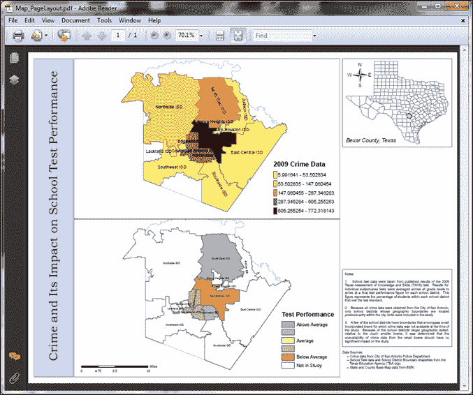

1.  现在，我们将从我们的地图文档文件中打印特定的数据帧。修改你的脚本，使其看起来如下。你可以通过检查 `c:\ArcpyBook\code\Ch4\ExportToPDF_Step2.py` 解决方案文件来检查你的工作。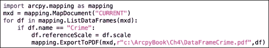

1.  运行脚本并检查 PDF 文件的输出。

## 它是如何工作的…

`ExportToPDF()`函数需要两个参数，包括地图文档的引用和作为输出 PDF 文件的文件。我们开发的第一个脚本传递了地图文档的引用以及输出 PDF 文件。由于我们没有传递指定数据帧的可选参数，`ExportToPDF()`函数将导出页面布局。还有许多可选参数可以传递给此方法，包括特定的数据帧以及与输出内容和质量相关的参数。我们的第二个脚本传递了一个应该导出的特定数据帧。您可以通过 ArcGIS 帮助页面获取有关每个可选参数的更多信息。

# 将地图导出为图像文件

您也可以通过使用`arcpy.mapping`提供的许多功能之一，将地图或布局视图的内容导出为图像文件。每个图像导出函数的名称将根据您想要创建的图像文件类型而有所不同。传递给函数的参数也会略有不同。

## 准备工作

除了提供将数据帧和页面布局导出为 PDF 格式的功能外，您还可以使用`arcpy.mapping`提供的许多导出函数之一来导出图像文件。一些可用的格式包括 AI、BMP、EMF、EPS、GIF、JPEG、SVG 和 TIFF。每个函数提供的参数将根据图像类型而有所不同。这些函数名称的示例包括`ExportToJPEG()`、`ExportToGIF()`和`ExportToBMP()`。在本食谱中，您将学习如何将地图导出为图像。

## 如何操作…

按照以下步骤学习如何将您的数据或布局视图导出为图像文件：

1.  在 ArcMap 中打开`C:\ArcpyBook\Ch4\Crime_Ch4.mxd`。

1.  打开 Python 窗口。

1.  导入`arcpy.mapping`模块：

    ```py
    import arcpy.mapping as mapping
    ```

1.  引用当前活动文档（`Crime_Ch4.mxd`），并将此引用分配给一个变量：

    ```py
    mxd = mapping.MapDocument("CURRENT")
    ```

1.  获取地图文档中的数据帧列表，并找到名为"`Crime`"的数据帧。

    ```py
    for df in mapping.ListDataFrames(mxd):
         if df.name == "Crime":
    ```

1.  将`Crime`数据帧导出为 JPEG 图像。您的整个脚本现在应如下所示：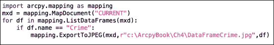

1.  您可以通过检查`c:\ArcpyBook\code\Ch4\ExportMapImageFile.py`解决方案文件来检查您的作品。

1.  运行脚本并检查输出文件。

## 工作原理…

注意，`ExportToJPEG()`函数看起来几乎与`ExportToPDF()`相同。但请记住，所有导出函数的可选参数将有所不同。每个`ExportTo<Type>`函数将根据创建图像文件时可以使用的参数而有所不同。

# 导出报告

ArcGIS 中的报告为你提供了一种展示数据或分析信息的方式。报告中的信息是通过直接从要素类中的属性表或独立表中提取的信息来显示的。报告可以包含属性信息、地图、图片、图形和其他支持信息。ArcMap 包含一个 **报告向导** 和 **报告设计器**，你可以使用它们来创建和修改报告。你还可以将报告的格式保存到模板文件中。这个模板文件可以重复使用，以根据数据中的任何变化生成新的报告。通过结合报告模板和 `arcpy.mapping`，你可以自动化报告的生产。

## 准备工作

ArcGIS 中的 **报告向导** 可以用来创建报告。ArcGIS 报告有两种原生数据格式：**报告文档文件**（**RDF**）和**报告布局文件**（**RLF**）。RDF 报告提供数据的静态报告。相当于一次性快照。RLF 是一个模板文件，它使用 **报告设计器** 创建。报告模板文件可以重复使用，并包含报告中的所有字段以及它们的分组、排序和格式。它还包括任何布局元素，如图形或地图。当报告重新运行时，报告将根据与模板连接的源数据重新生成。`arcpy.mapping ExportReport()` 函数可以用来将数据源连接到模板文件以自动化报告的创建。在本菜谱中，你将学习如何使用 `ExportReport()` 函数与 `PDFDocument` 类一起创建包含学区犯罪信息的报告。报告将包括属性信息和学区边界地图。

## 如何操作…

为了节省时间，我已经为你预先创建了一个报告模板（RLF）文件供你使用。这个文件名为 `CrimeReport.rlf`，位于 `c:\ArcpyBook\Ch4` 文件夹中，包含学区名称、犯罪数量、犯罪密度和测试成绩分数的属性列。此外，模板中还添加了一个包含学区边界的地图占位符。

按照以下步骤学习如何使用 `arcpy.mapping ExportReport()` 函数和 `PDFDocument` 类自动化生成报告：

1.  在 IDLE 或你喜欢的 Python 编辑器中创建一个新的脚本文件，并将其保存为 `c:\ArcpyBook\Ch4\CreateReport.py`。

1.  导入 `arcpy` 和 `os` 模块，并获取当前工作目录：

    ```py
    import arcpy
    import os
    path = os.getcwd()
    ```

1.  创建输出 PDF 文件：

    ```py
    #Create PDF and remove if it already exists
    pdfPath = path + r"\CrimeReport.pdf"
    if os.path.exists(pdfPath):
      os.remove(pdfPath)
    pdfDoc = arcpy.mapping.PDFDocumentCreate(pdfPath)
    ```

1.  创建一个学区列表。我们将遍历这个列表为每个学区创建报告：

    ```py
    districtList = ["Harlandale", "East Central", "Edgewood", "Alamo Heights", "South San Antonio", "Southside", "Ft Sam Houston", "North East", "Northside", "Lackland", "Southwest", "Judson", "San Antonio"]
    ```

1.  获取地图文档、数据框架和图层的引用：

    ```py
    mxd = arcpy.mapping.MapDocument(path + r"\Crime_Ch4.mxd")
    df = arcpy.mapping.ListDataFrames(mxd)[0]
    lyr = arcpy.mapping.ListLayers(mxd, "Crime Density by School District")[0]
    ```

1.  开始遍历学区，并应用一个 `where` 子句作为定义查询，以便只显示单个学区：

    ```py
    pageCount = 1
    for district in districtList:
      #Generate image for each district
      whereClause = "\"NAME\" = '" + district + " ISD'"
      lyr.definitionQuery = whereClause
    ```

1.  选择单个学区，将数据框架范围设置为学区的范围，并清除选择集：

    ```py
    arcpy.SelectLayerByAttribute_management(lyr, "NEW_SELECTION", whereClause)
    df.extent = lyr.getSelectedExtent()
    arcpy.SelectLayerByAttribute_management(lyr, "CLEAR_SELECTION")
    ```

1.  将数据框架导出为位图（`.bmp`）文件：

    ```py
    arcpy.mapping.ExportToBMP(mxd, path + "\DistrictPicture.bmp", df) #single file
    ```

1.  调用`ExportReport()`函数来创建报告：

    ```py
    #Generate report
    print("Generating report for: " + district + " ISD")
    arcpy.mapping.ExportReport(report_source=lyr, report_layout_file=path + r"\CrimeLayout.rlf",output_file=path + r"\temp" + str(pageCount) + ".pdf", starting_page_number=pageCount)
    ```

1.  将报告附加到 PDF 文件：

    ```py
    #Append pages into final output
    print("Appending page: " + str(pageCount))
    pdfDoc.appendPages(path + r"\temp" + str(pageCount) + ".pdf")
    ```

1.  删除临时 PDF 报告：

    ```py
    os.remove(path + r"\temp" + str(pageCount) + ".pdf")
    pageCount = pageCount + 1
    ```

1.  保存 PDF 文档：

    ```py
    pdfDoc.saveAndClose()
    ```

1.  整个脚本应如下所示：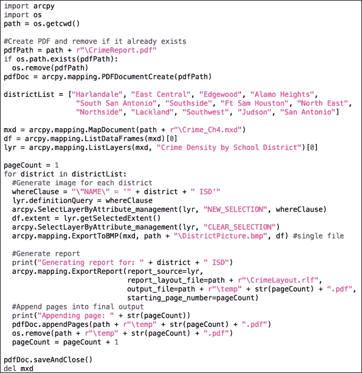

1.  您可以通过检查`c:\ArcpyBook\code\Ch4\CreateReport.py`解决方案文件来检查您的工作。

1.  保存并运行您的脚本。这将创建一个名为`CrimeReport.pdf`的文件，位于您的`c:\ArcpyBook\ch4`文件夹中。内容将包含每个学区的一页报告，如本截图所示：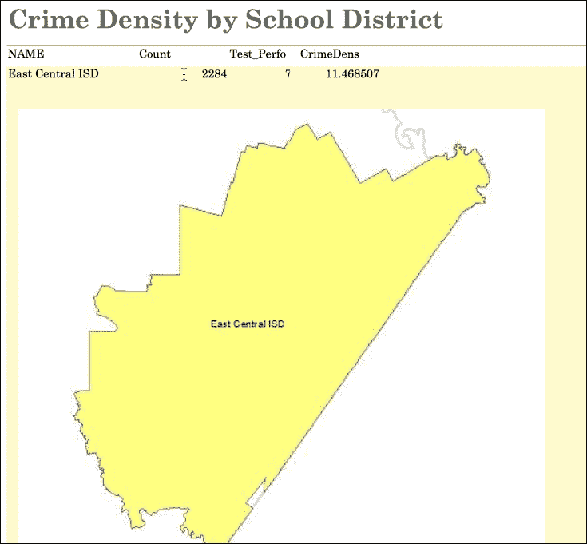

## 它是如何工作的…

在这个配方中，我们使用了`arcpy.mapping`模块中的几个函数和类，包括`PDFDocument`、`ExportToReport()`和`ExportToBMP()`。最初，我们使用了`PDFDocumentCreate()`函数来创建`PDFDocument`的一个实例，它包含指向我们将创建的`CrimeReport.pdf`文件的指针。接下来，我们创建了一个学区列表，并开始遍历其中的每一个。在循环内部，对于每个学区，我们在图层上设置了一个定义查询，选择了该学区，并返回了用于设置数据框架范围的学区范围。然后，使用`ExportToBMP()`函数创建了一个位图文件，并使用`ExportReport()`函数生成了报告。最后，每个页面都被附加到`CrimeReport.pdf`文件中，并保存了文档。

# 使用数据驱动页面和 ArcPy 地图构建地图集

许多组织需要创建包含一系列覆盖更大地理区域的单个地图的地图集。这些地图集包含一系列地图和一些可选和附加页面，包括标题页、概述图以及一些其他辅助信息，例如报告和表格。例如，一家公用事业公司可能希望生成一份详细说明其服务区域内资产的地图集。这份公用事业公司的地图集可能包括一系列地图，每个地图都采用大比例尺，以及标题页和概述图。然后，这些资源将被合并成一个可以打印或作为 PDF 文件分发的单一文档。

## 准备工作

ArcGIS for Desktop 通过结合数据驱动页面和`arcpy.mapping`脚本来提供高效创建地图集的能力。使用单个地图文档文件，您可以使用**数据驱动页面**工具栏，通过布局视图以及您的操作数据和`索引`图层来创建一系列基本地图。`索引`图层包含将用于定义系列中每个地图范围的特征。然而，如果您需要在地图集中包含额外的页面，包括标题页、概述图和其他辅助页面，您需要将数据驱动页面工具栏的输出与`arcpy.mapping`模块提供的功能相结合。使用`arcpy.mapping`模块，您可以自动化地图系列的导出并将辅助文件附加到单个地图集文档中。虽然当然可以使用 Python 和`arcpy.mapping`模块仅通过编程生成整个地图集，但结合编程和数据驱动页面工具栏的组合使用更为高效。在本菜谱中，您将学习如何创建包含一系列地图以及标题页和概述图页的地图集。

## 如何操作…

为了节省时间，我已经为您预先创建了一个包含数据和数据驱动页面功能以创建一系列华盛顿州金县地形图的地图文档文件。这个名为`Topographic.mxd`的文件位于`c:\ArcpyBook\Ch4`文件夹中。您可能需要花几分钟时间在 ArcGIS for Desktop 中打开此文件并检查数据。数据驱动页面功能已经为您启用。此外，还为您创建了一个地图标题页（`TitlePage.pdf`）和一个概述图页（`MapIndex.pdf`）。这些文件也位于您的`c:\ArcpyBook\Ch4`文件夹中。

生成地图系列的步骤可能有些长，超出了本书的范围。但是，如果您想了解过程概述，请访问**ArcGIS Desktop 帮助系统**，导航到**桌面** | **地图** | **页面布局** | **创建地图集**，并遵循此文件夹下的前七项。这包括通过向地图集中添加动态文本来使用 ArcGIS 创建地图集。

按照以下步骤学习如何使用数据驱动页面功能和`arcpy.mapping`模块来创建地图集：

1.  创建一个新的 IDLE 脚本并将其保存为`c:\ArcpyBook\Ch4\DataDrivenPages_MapBook.py`。

1.  导入`arcpy`和`os`模块：

    ```py
    import arcpy
    import os
    ```

1.  创建一个输出目录变量：

    ```py
    # Create an output directory variable
    outDir = r"C:\ArcpyBook\Ch4"
    ```

1.  在指定的输出目录中创建一个新的、空的 PDF 文档：

    ```py
    # Create a new, empty pdf document in the specified output directory
    finalpdf_filename = outDir + r"\MapBook.pdf"
    if os.path.exists(finalpdf_filename):
      os.remove(finalpdf_filename)
    finalPdf = arcpy.mapping.PDFDocumentCreate(finalpdf_filename)
    ```

1.  将标题页添加到 PDF 中：

    ```py
    # Add the title page to the pdf
    print("Adding the title page  \n")
    finalPdf.appendPages(outDir + r"\TitlePage.pdf")
    ```

1.  将索引图添加到 PDF 中：

    ```py
    # Add the index map to the pdf
    print("Adding the index page  \n")
    finalPdf.appendPages(outDir + r"\MapIndex.pdf")
    ```

1.  将数据驱动页面导出到一个临时 PDF 文件，并将其添加到最终 PDF 中：

    ```py
    # Export the Data Driven Pages to a temporary pdf and then add it to the
    # final pdf. Alternately, if your Data Driven Pages have already been
    # exported, simply append that document to the final pdf.
    mxdPath = outDir + r"\Topographic.mxd"
    mxd = arcpy.mapping.MapDocument(mxdPath)
    print("Creating the data driven pages \n")
    ddp = mxd.dataDrivenPages
    temp_filename = outDir + r"\tempDDP.pdf"

    if os.path.exists(temp_filename):
      os.remove(temp_filename)
    ddp.exportToPDF(temp_filename, "ALL")
    print("Appending the map series  \n")
    finalPdf.appendPages(temp_filename)
    ```

1.  更新最终 PDF 的属性：

    ```py
    # Update the properties of the final pdf.
    finalPdf.updateDocProperties(pdf_open_view="USE_THUMBS", pdf_layout="SINGLE_PAGE")
    ```

1.  保存 PDF：

    ```py
    # Save your result
    finalPdf.saveAndClose()
    ```

1.  删除临时数据驱动页面文件：

    ```py
    # remove the temporary data driven pages file
    if os.path.exists(temp_filename):
        os.remove(temp_filename)
    ```

1.  整个脚本应如下所示：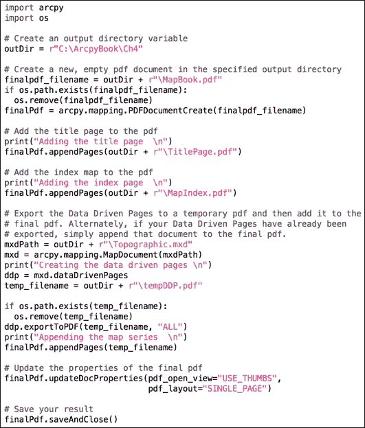

1.  您可以通过检查`c:\ArcpyBook\code\Ch4\DataDrivenPages_MapBook.py`解决方案文件来验证您的作品。

1.  保存并执行您的脚本。如果脚本成功执行，您应该在`c:\ArcpyBook\Ch4`文件夹中找到一个名为`MapBook.pdf`的新文件。当您打开这个文件时，您应该看到这个截图：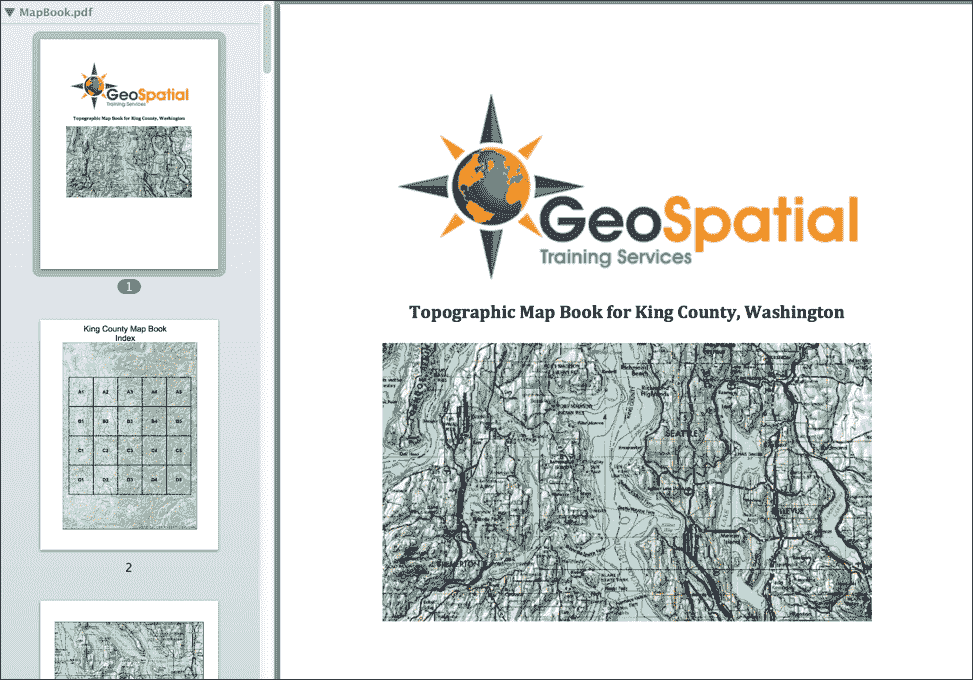

## 工作原理…

`arcpy.mapping`模块中的`PDFDocument`类常用于创建地图集。在这个示例中，我们使用了`PDFDocumentCreate()`函数来创建一个`PDFDocument`实例。将输出 PDF 文件的路径传递给了`PDFDocumentCreate()`函数。使用这个`PDFDocument`实例，我们随后调用了两次`PDFDocument.appendPages()`方法，插入已经存在的作为 PDF 文件的标题页和地图索引文件。接下来，我们从地图文档文件中检索了一个`dataDrivenPages`对象，并将每一页导出到单个 PDF 文档中。然后，将这个文档附加到我们最终的输出 PDF 文件中，该文件已经包含了标题页和地图索引页。最后，我们更新了`PDFDocument`属性以使用缩略图和单页视图，保存了整个文件，并删除了临时数据驱动页面文档。

# 将地图文档发布到 ArcGIS Server 服务

使用`arcpy.mapping`模块，您可以将地图文档文件发布到**ArcGIS Server**作为地图服务。ArcGIS Server 是一个在网络上分发地图和数据的平台。使用 ArcGIS JavaScript API，可以从 ArcGIS Server 中创建的服务创建 Web 和移动应用程序。有关 ArcGIS Server 的更多信息，请访问 esri ArcGIS Server 网站[`www.esri.com/software/arcgis/arcgisserver`](http://www.esri.com/software/arcgis/arcgisserver)。从地图文档文件创建地图服务涉及几个步骤。地图文档文件必须首先分析其适用性和性能问题，并在最终发布到 ArcGIS Server 之前修复任何出现的错误。这个过程包括调用`arcpy.mapping`函数以及使用`ArcToolbox`中的几个工具，这些工具可以从您的脚本中调用。错误修复后，您可以上传生成的**服务定义草案**文件到 ArcGIS Server 作为服务。

## 准备工作

使用 Python 将地图文档发布到 ArcGIS Server 是一个三步过程。第一步是调用`CreateMapSDDraft()` `arcpy.mapping`函数。这将把地图文档文件转换为服务定义草稿文件。此文件包含地图文档、关于服务的信息以及一组服务属性。关于服务的信息包括要发布到的服务器连接或服务器类型、要发布的服务类型、服务的元数据以及数据引用。草稿服务定义文件不包含数据。`CreateMapSDDraft()`还会生成一个包含可能引起服务发布问题的错误和警告的 Python 字典。

第二步是调用**StageService 工具(.sd)**。暂存编译了成功发布 GIS 资源所需的信息。如果您的数据未在服务器上注册，它将在服务定义草稿暂存时添加。最后，可以使用**UploadServiceDefinition 工具**将服务定义草稿文件上传并发布为 GIS 服务到指定的 GIS 服务器。此步骤将服务定义文件复制到服务器上，提取所需信息，并发布 GIS 资源。以下是此过程的示意图：

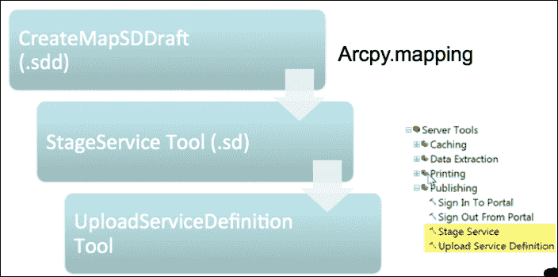

注意，您需要能够访问 ArcGIS Server 实例，并且还需要有发布服务的必要权限才能完成此练习。在本食谱中，您将学习如何将地图文档文件发布到 ArcGIS Server 地图服务。

## 如何操作…

按照以下步骤分析地图文档，以确定其是否适合发布到 ArcGIS Server，然后将其作为地图服务发布：

1.  创建一个新的 IDLE 脚本，并将其保存为`c:\ArcpyBook\Ch4\PublishMapService.py`。

1.  导入`arcpy.mapping`模块：

    ```py
    import arcpy.mapping as mapping
    ```

1.  设置当前工作空间：

    ```py
    wrkspc = r'c:\ArcpyBook\Ch4'
    ```

1.  获取地图文档的引用：

    ```py
    mxd = mapping.MapDocument(wrkspc + r"\Crime.mxd")
    ```

1.  定义服务名称和服务草稿定义文件的变量：

    ```py
    service = 'Crime'
    sddraft = wrkspc + service + '.sddraft'
    ```

1.  创建服务定义草稿文件：

    ```py
    mapping.CreateMapSDDraft(mxd, sddraft, service)
    ```

1.  分析草稿文件：

    ```py
    analysis = mapping.AnalyzeForSD(wrkspc + "Crime.sddraft")
    ```

1.  创建一个循环结构，该结构将遍历所有潜在的消息、警告和错误，并打印出信息：

    ```py
    for key in ('messages', 'warnings', 'errors'):
        print("----" + key.upper() + "----")
        vars = analysis[key]
        for ((message, code), layerlist) in vars.iteritems():
            print "    ", message, " (CODE %i)" % code
            print("     applies to:",)
            for layer in layerlist:
                print(layer.name)
    ```

1.  整个脚本应如下所示：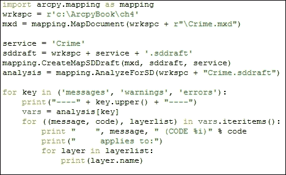

1.  您可以通过检查`c:\ArcpyBook\code\Ch4\PublishMapService.py`解决方案文件来验证您的操作。

1.  保存并运行您的代码以查看此输出：

    ```py
    ----MESSAGES----
         Layer draws at all scale ranges  (CODE 30003)
         applies to: District_Crime_Join
    Bexar_County_Boundary
    District_Crime_Join
    Bexar_County_Boundary
    Bexar_County_Boundary
    Texas_Counties_LowRes
    School_Districts
    Crime_surf
    Bexar_County_Boundary
    ----WARNINGS----
         Layer's data source has a different projection [GCS_WGS_1984] than the data frame's projection  (CODE 10001)
         applies to: District_Crime_Join
    Bexar_County_Boundary
    District_Crime_Join
    Bexar_County_Boundary
    Bexar_County_Boundary
    Texas_Counties_LowRes
    School_Districts
    Crime_surf
    Bexar_County_Boundary
         Missing Tags in Item Description  (CODE 24059)
         applies to:      Missing Summary in Item Description (CODE 24058)
         applies to: ----ERRORS----
         Data frame uses a background symbol that is not a solid fill  (CODE 18)

    ```

    ### 小贴士

    您需要特别注意错误部分。在创建服务之前，必须修复错误。警告可能表明与服务的性能相关的问题，但它们不会阻止服务发布。在这种情况下，错误表明数据帧使用了一个不是实心填充的背景符号。在我们可以继续之前，需要在 ArcGIS 中进行更正。

1.  在 ArcMap 中，打开位于`c:\ArcpyBook\ch4`文件夹中的`crime.mxd`文件，在**Crime**数据帧上右键单击并选择**属性**。

1.  选择 **框架** 选项卡，如图所示：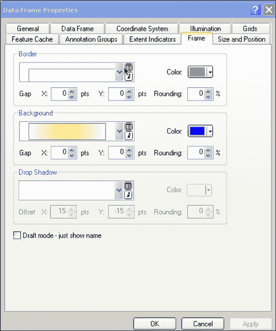

1.  将 **背景** 从当前符号更改为无，然后点击 **确定**：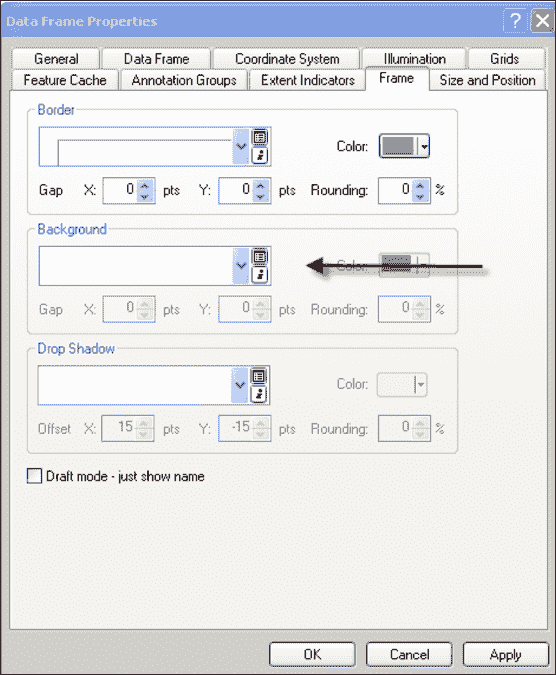

1.  对地图文档中的每个数据帧重复此过程。

1.  重新运行你刚才编写的脚本。这次，你不应该看到任何错误。你仍然有一个可能需要修复的警告，但警告不会阻止你的地图文档作为服务发布。

1.  在所有错误都修复后，我们现在将 `Crime.mxd` 文件转换为 `Crime.sd` 文件。删除你在第 6 步中添加的循环结构。

1.  添加以下 `if`/`else` 代码块。请注意，我对调用 `UploadServiceDefinition` 工具的代码行进行了注释。如果你有权访问一个 ArcGIS Server 实例，并且拥有适当的权限和连接信息，你可以取消注释此行，以便将其作为地图服务上传文件。你还需要在 `con` 变量中添加实例的连接参数，该变量作为此工具的第二个参数传递。保存并执行脚本以查看结果：

    ```py
    if analysis['errors'] == {}:
        #execute StageService
        arcpy.StageService_server(sddraft,sd)
        #execute UploadServiceDefinition
        #arcpy.UploadServiceDefinition_server(sd, con)
    else:
        #if the sddraft analysis contained errors, display them
        print(analysis['errors'])
    ```

1.  你的整个脚本应该如下所示：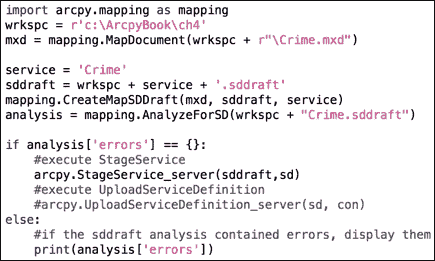

1.  你可以通过检查 `c:\ArcpyBook\code\Ch4\PublishMapService2.py` 解决方案文件来检查你的工作。

1.  如果你有权访问一个 ArcGIS Server 实例并且拥有必要的权限，你可以取消注释 `UploadServiceDefinition` 工具并执行脚本。

## 它是如何工作的…

`CreateMapSDDraft()` 函数从地图文档文件创建服务定义草案文件。接下来，我们调用 `AnalyzeForSD()` 函数并检查返回的消息、警告或错误。任何识别出的错误必须在创建地图服务之前修复。最后，如果没有错误，我们调用 `StageService` 工具，该工具创建一个可以传递给 `UploadServiceDefinition` 工具进行发布的 Service Definition Draft 文件。
