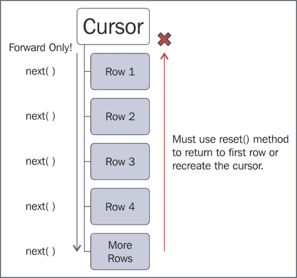
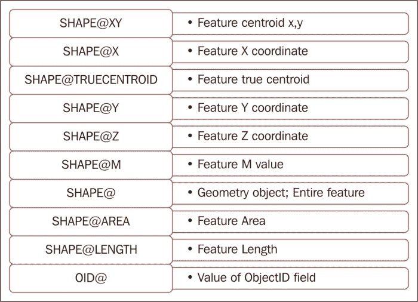
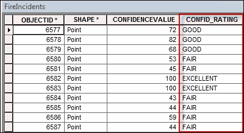
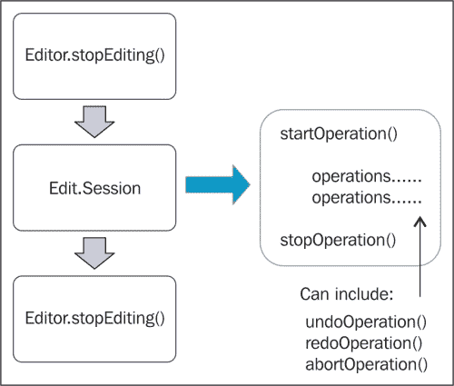
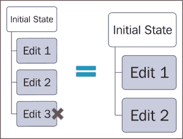
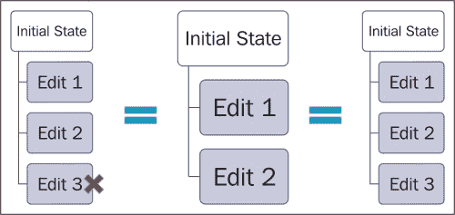

# 第八章：使用 ArcPy 数据访问模块与要素类和表

在本章中，我们将介绍以下菜谱：

+   使用 SearchCursor 从要素类中检索特征

+   使用 where 子句过滤记录

+   使用几何标记提高游标性能

+   使用 InsertCursor 插入行

+   使用 UpdateCursor 更新行

+   使用 UpdateCursor 删除行

+   在编辑会话中插入和更新行

+   从要素类中读取几何形状

+   使用 Walk() 导航目录

# 简介

我们将从这个章节的基本问题开始。什么是游标？**游标**是包含来自表或要素类的数据行的一个或多个行的内存对象。每一行包含数据源中每个字段的属性以及每个要素的几何形状。游标允许您在表和要素类中搜索、添加、插入、更新和删除数据。

`arcpy`数据访问模块或`arcpy.da`是在 ArcGIS 10.1 中引入的，它包含允许您遍历游标中每一行的方法。根据开发者的需求，可以创建各种类型的游标。例如，可以创建搜索游标来读取行中的值。可以创建更新游标来更新行中的值或删除行，也可以创建插入游标来插入新行。

随着 ArcPy 数据访问模块的引入，已经推出了一系列游标改进。在 ArcGIS 10.1 开发之前，游标性能臭名昭著地慢。现在，游标的速度显著提高。Esri 估计`SearchCursors`的速度可以快 30 倍，而`InsertCursors`可以快 12 倍。除了这些一般性能改进之外，数据访问模块还提供了一些新的选项，允许程序员加快处理速度。现在，您可以选择只返回游标中的部分字段，而不是所有字段，这样可以提高性能，因为需要返回的数据更少。同样也适用于几何形状。传统上，当访问要素的几何形状时，会返回整个几何定义。现在，您可以使用几何标记来返回几何形状的一部分，而不是要素的完整几何形状。您还可以使用列表和元组而不是使用行。还有其他一些新特性，例如编辑会话和与版本、域和子类型一起工作的能力。

在`arcpy.da`中有三个光标函数。每个函数都返回一个与函数同名的光标对象。`SearchCursor()`创建一个包含来自表或要素类行的只读`SearchCursor`对象。`InsertCursor()`创建一个`InsertCursor`对象，可用于向表或要素类插入新记录。`UpdateCursor()`返回一个可用于编辑或删除表或要素类记录的光标对象。这些光标对象都有访问光标中行的方法。你可以看到光标函数、它们创建的对象以及它们的使用之间的关系，如下所示：

| 函数 | 创建的对象 | 用途 |
| --- | --- | --- |
| `SearchCursor()` | `SearchCursor` | 这是从表或要素类获取数据的只读视图 |
| `InsertCursor()` | `InsertCursor` | 这用于向表或要素类添加行 |
| `UpdateCursor()` | `UpdateCursor` | 这用于编辑或删除表或要素类的行 |

`SearchCursor()`函数用于返回一个`SearchCursor`对象。此对象只能用于迭代为只读目的返回的一组行。通过此对象无法进行插入、删除或更新操作。可以设置可选的`where`子句以限制返回的行。

一旦你获得了光标实例，通常会对记录进行迭代，尤其是在使用`SearchCursor`或`UpdateCursor`时。在光标中导航记录时，你需要了解一些特殊之处。光标导航仅向前移动。当创建光标时，光标指针位于光标中第一行之上。对`next()`的第一次调用将指针移动到第一行。你不仅可以调用`next()`方法，还可以使用`for`循环来处理每条记录，而无需调用`next()`方法。在完成对这一行的任何所需处理之后，对`next()`的后续调用将指针移动到第二行。只要你需要访问额外的行，这个过程就会继续。然而，一旦访问过一行，你无法一次回退一个记录。例如，如果当前行是第三行，你无法通过编程方式回退到第二行。你只能向前移动。要重新访问第一行和第二行，你需要要么调用`reset()`方法，要么重新创建光标并通过对象回退。正如我之前提到的，光标通常通过使用`for`循环来导航。事实上，这是迭代光标和编写脚本更常见、更有效的方法。光标导航在以下图中展示：



使用 `InsertCursor()` 函数创建 `InsertCursor` 对象，允许您以编程方式向要素类和表中添加新记录。要插入行，请在此对象上调用 `insertRow()` 方法。您还可以通过 `fields` 属性检索包含游标正在使用的字段名称的只读元组。通过游标访问的表或要素类会被放置一个锁。因此，始终以在完成时释放游标的方式设计您的脚本是很重要的。

使用 `UpdateCursor()` 函数可以创建一个 `UpdateCursor` 对象，可以更新和删除表或要素类中的行。与 `InsertCursor` 一样，此函数在编辑或删除数据时会对数据进行锁定。如果游标在 Python 的 `with` 语句内部使用，则在数据被处理后锁将自动释放。这并不总是如此。在 ArcGIS 10.1 之前，必须使用 Python 的 `del` 语句手动释放游标。一旦获得 `UpdateCursor` 的实例，您就可以调用 `updateCursor()` 方法来更新表或要素类中的记录，以及调用 `deleteRow()` 方法来删除一行。

数据锁的主题需要更多的解释。`insert` 和 `update` 游标必须对其引用的数据源获取锁。这意味着没有其他应用程序可以同时访问此数据源。锁是防止多个用户同时更改数据并因此损坏数据的一种方式。当在您的代码中调用 `InsertCursor()` 和 `UpdateCursor()` 方法时，Python 会尝试获取数据的锁。此锁必须在游标完成处理之后特别释放，以便其他用户的运行应用程序，如 `ArcMap` 或 `ArcCatalog`，可以访问数据源。如果不这样做，其他应用程序将无法访问数据。在 ArcGIS 10.1 和 `with` 语句之前，游标必须通过 Python 的 `del` 语句特别解锁。同样，`ArcMap` 和 `ArcCatalog` 在更新或删除数据时也会获取数据锁。如果数据源被这两个应用程序中的任何一个锁定，您的 Python 代码将无法访问数据。因此，最佳实践是在运行任何使用 `insert` 或 `update` 游标的独立 Python 脚本之前关闭 `ArcMap` 和 `ArcCatalog`。

在本章中，我们将介绍使用游标访问和编辑表和要素类的方法。然而，ArcGIS 10.1 之前存在的许多游标概念仍然适用。

# 使用 SearchCursor 从要素类检索要素

有很多场合你需要从表或要素类中检索行以进行只读操作。例如，你可能想生成一个包含价值超过 $100,000 的所有土地地块的列表。在这种情况下，你不需要编辑数据。你的需求仅通过生成满足某些条件的行列表就能得到满足。`SearchCursor` 对象包含来自表或要素类的行的只读副本。这些对象也可以通过使用 `where` 子句进行过滤，以便只返回数据集的一个子集。

## 准备工作

`SearchCursor()` 函数用于返回一个 `SearchCursor` 对象。此对象只能用于迭代为只读目的返回的一组行。通过此对象不能进行插入、删除或更新操作。可以设置一个可选的 `where` 子句来限制返回的行。在本例中，你将学习如何通过使用 `SearchCursor()` 函数在要素类上创建一个基本的 `SearchCursor` 对象。

`SearchCursor` 对象包含一个 `fields` 属性以及 `next()` 和 `reset()` 方法。`fields` 属性是一个只读结构，形式为 Python **元组**，包含从要素类或表中请求的字段。你将经常在游标的使用中听到术语元组。如果你之前没有覆盖这个主题，元组是 Python 用来存储类似 Python 列表的数据序列的结构。然而，Python 元组和列表之间有一些重要的区别。元组定义为括号内的一系列值，而列表定义为方括号内的一系列值。与列表不同，元组不能增长和缩小，这在某些情况下可能是一个非常好的事情，当你希望数据值每次都占据一个特定的位置时。这是使用元组来存储来自表和要素类字段的数据的游标对象的情况。

## 如何操作...

按照以下步骤学习如何在 `SearchCursor` 对象内部检索表或要素类的行：

1.  打开 **IDLE** 并创建一个新的脚本窗口。

1.  将脚本保存为 `C:\ArcpyBook\Ch8\SearchCursor.py`。

1.  导入 `arcpy.da` 模块：

    ```py
    import arcpy.da
    ```

1.  设置工作空间：

    ```py
    arcpy.env.workspace = "c:/ArcpyBook/Ch8"
    ```

1.  使用 Python `with` 语句创建游标：

    ```py
    with arcpy.da.SearchCursor("Schools.shp",("Facility","Name")) as cursor:
    ```

1.  遍历 `SearchCursor` 中的每一行并打印学校的名称。确保在 `with` 块内缩进 `for` 循环：

    ```py
    for row in sorted(cursor):
      print("School name: " + row[1])
    ```

1.  整个脚本应如下所示：

    ```py
    import arcpy.da
    arcpy.env.workspace = "c:/ArcpyBook/Ch8"
    with arcpy.da.SearchCursor("Schools.shp",("Facility","Name")) as cursor:
        for row in sorted(cursor):
            print("School name: " + row[1])
    ```

1.  保存脚本。

1.  你可以通过检查 `C:\ArcpyBook\code\Ch8\SearchCursor_Step1.py` 解决方案文件来检查你的工作。

1.  运行脚本。你应该看到以下输出：

    ```py
    School name: ALLAN
    School name: ALLISON
    School name: ANDREWS
    School name: BARANOFF
    School name: BARRINGTON
    School name: BARTON CREEK
    School name: BARTON HILLS
    School name: BATY
    School name: BECKER
    School name: BEE CAVE

    ```

## 它是如何工作的...

使用与`SearchCursor()`函数一起使用的`with`语句将创建、打开和关闭游标。因此，你不再需要担心像在 ArcGIS 10.1 之前那样显式释放游标的锁。传递给`SearchCursor()`函数的第一个参数是一个要素类，由`Schools.shp`文件表示。第二个参数是一个 Python 元组，包含我们希望在游标中返回的字段列表。出于性能考虑，将游标中返回的字段限制为你需要完成任务的那些字段是一个最佳实践。在这里，我们指定只返回`Facility`和`Name`字段。`SearchCursor`对象存储在一个名为`cursor`的变量中。

在`with`块内部，我们使用 Python 的`for`循环遍历返回的每一所学校。我们还使用 Python 的`sorted()`函数对游标的内容进行排序。要访问行上的字段值，只需使用你想要返回的字段的索引号。在这种情况下，我们想要返回`Name`列的内容，这将是一个`1`索引号，因为它是在返回的字段名元组中的第二个项目。

# 使用`where`子句过滤记录

默认情况下，`SearchCursor`将包含表或要素类中的所有行。然而，在许多情况下，你可能希望根据某种标准限制返回的行数。通过使用`where`子句应用过滤器可以限制返回的记录。

## 准备工作

默认情况下，当你创建`SearchCursor`对象时，将返回表或要素类中的所有行。然而，在许多情况下，你可能希望限制返回的记录。你可以通过创建一个查询，并在调用`SearchCursor()`函数时将其作为`where`子句参数传递来实现这一点。在这个菜谱中，你将通过添加一个限制返回记录的`where`子句来扩展你在上一个菜谱中创建的脚本。

## 如何做…

按照以下步骤对`SearchCursor`对象应用过滤器，以限制从表或要素类返回的行：

1.  打开**IDLE**并加载你在上一个菜谱中创建的`SearchCursor.py`脚本。

1.  通过添加一个查询设施字段并查询具有`HIGH SCHOOL`文本的记录的`where`子句来更新`SearchCursor()`函数。

    ```py
    with arcpy.da.SearchCursor("Schools.shp",("Facility","Name"), '"FACILITY" = \'HIGH SCHOOL\'') as cursor:
    ```

1.  你可以通过检查`C:\ArcpyBook\code\Ch8\SearchCursor_Step2.py`解决方案文件来检查你的工作。

1.  保存并运行脚本。现在输出将小得多，仅限于高中：

    ```py
    High school name: AKINS
    High school name: ALTERNATIVE LEARNING CENTER
    High school name: ANDERSON
    High school name: AUSTIN
    High school name: BOWIE
    High school name: CROCKETT
    High school name: DEL VALLE
    High school name: ELGIN
    High school name: GARZA
    High school name: HENDRICKSON
    High school name: JOHN B CONNALLY
    High school name: JOHNSTON
    High school name: LAGO VISTA

    ```

## 它是如何工作的…

我们在第七章中介绍了查询的创建，*查询和选择数据*，所以希望你现在对这些结构的创建有一个很好的掌握，以及当你编写这些结构时需要遵循的所有规则。`where`子句参数接受任何有效的 SQL 查询，并且在这个情况下用于限制返回的记录数。

# 使用几何令牌提高游标性能

**几何令牌**是在 ArcGIS 10.1 中引入的，作为游标性能改进的一部分。而不是在游标内返回特征的整个几何形状，只返回几何形状的一部分。返回特征的整个几何形状可能会导致游标性能下降，因为需要返回的数据量很大。仅返回所需的具体几何形状部分要快得多。

## 准备工作

令牌作为字段列表中传递给构造函数的一个字段提供，其格式为`SHAPE@<要返回的特征部分>`。此格式的唯一例外是`OID@`令牌，它返回特征的对象 ID。以下代码示例仅检索特征的`X`和`Y`坐标：

```py
with arcpy.da.SearchCursor(fc, ("SHAPE@XY","Facility","Name")) as cursor:
```

以下表格列出了可用的几何令牌。并非所有游标都支持完整的令牌列表。请查阅 ArcGIS 帮助文件以获取有关每个游标类型支持的令牌的信息。`SHAPE@`令牌返回特征的整个几何形状。尽管如此，请谨慎使用，因为返回特征的整个几何形状是一个昂贵的操作，并且可能会显著影响性能。如果您不需要整个几何形状，则不要包含此令牌！



在这个菜谱中，您将使用几何令牌来提高游标的处理性能。您将从`parcels`要素类中检索每个土地地块的`X`和`Y`坐标，以及地块的一些属性信息。

## 如何做…

按照以下步骤将几何令牌添加到游标中，这应该会提高该对象的处理性能：

1.  打开**IDLE**并创建一个新的脚本窗口。

1.  将脚本保存为`C:\ArcpyBook\Ch8\GeometryToken.py`。

1.  导入`arcpy.da`模块和时间模块：

    ```py
    import arcpy.da
    import time
    ```

1.  设置工作空间：

    ```py
    arcpy.env.workspace = "c:/ArcpyBook/Ch8"
    ```

1.  我们将使用几何令牌来测量执行代码所需的时间。为脚本添加`start`时间：

    ```py
    start = time.clock()
    ```

1.  使用 Python 的`with`语句创建一个游标，该游标包括每个特征的质心以及存储在`PY_FULL_OW`字段中的所有权信息：

    ```py
    with arcpy.da.SearchCursor("coa_parcels.shp",("PY_FULL_OW","SHAPE@XY")) as cursor:
    ```

1.  遍历`SearchCursor`中的每一行，并打印包裹名称和位置。确保在`with`块内部缩进`for`循环：

    ```py
    for row in cursor:
      print("Parcel owner: {0} has a location of: {1}".format(row[0], row[1]))
    ```

1.  测量经过的时间：

    ```py
    elapsed = (time.clock() - start)
    ```

1.  打印执行时间：

    ```py
    print("Execution time: " + str(elapsed))
    ```

1.  整个脚本应如下所示：

    ```py
    import arcpy.da
    import time
    arcpy.env.workspace = "c:/ArcpyBook/Ch9"
    start = time.clock()
    with arcpy.da.SearchCursor("coa_parcels.shp",("PY_FULL_OW", "SHAPE@XY")) as cursor:
        for row in cursor:
            print("Parcel owner: {0} has a location of: {1}".format(row[0], row[1]))
    elapsed = (time.clock() - start)
    print("Execution time: " + str(elapsed))
    ```

1.  您可以通过检查`C:\ArcpyBook\code\Ch8\GeometryToken.py`解决方案文件来检查您的作品。

1.  保存脚本。

1.  运行脚本。您应该看到以下类似的输出。注意执行时间；您的时间会有所不同：

    ```py
    Parcel owner: CITY OF AUSTIN ATTN REAL ESTATE DIVISION has a location of: (3110480.5197341456, 10070911.174956793)
    Parcel owner: CITY OF AUSTIN ATTN REAL ESTATE DIVISION has a location of: (3110670.413783513, 10070800.960865)
    Parcel owner: CITY OF AUSTIN has a location of: (3143925.0013213265, 10029388.97419636)
    Parcel owner: CITY OF AUSTIN % DOROTHY NELL ANDERSON ATTN BARRY LEE ANDERSON has a location of: (3134432.983822767, 10072192.047894118)
    Execution time: 9.08046185109

    ```

现在，我们将测量如果返回整个几何形状而不是所需几何形状的部分，执行时间将如何变化：

1.  将脚本保存为新副本，命名为`C:\ArcpyBook\Ch8\GeometryTokenEntireGeometry.py`。

1.  将`SearchCursor()`函数更改为使用`SHAPE@`而不是`SHAPE@XY`返回整个几何形状：

    ```py
    with arcpy.da.SearchCursor("coa_parcels.shp",("PY_FULL_OW", "SHAPE@")) as cursor:
    ```

1.  你可以通过检查 `C:\ArcpyBook\code\Ch8\GeometryTokenEntireGeometry.py` 解决方案文件来检查你的工作。

1.  保存并运行脚本。你应该会看到以下输出。你的时间可能会和我的不同，但请注意执行时间较慢。在这种情况下，它只慢了一点点，但我们只返回了 2600 个特征。如果特征类的大小显著更大，像许多情况一样，这将放大：

    ```py
    Parcel owner: CITY OF AUSTIN ATTN REAL ESTATE DIVISION has a location of: <geoprocessing describe geometry object object at 0x06B9BE00>
    Parcel owner: CITY OF AUSTIN ATTN REAL ESTATE DIVISION has a location of: <geoprocessing describe geometry object object at 0x2400A700>
    Parcel owner: CITY OF AUSTIN has a location of: <geoprocessing describe geometry object object at 0x06B9BE00>
    Parcel owner: CITY OF AUSTIN % DOROTHY NELL ANDERSON ATTN BARRY LEE ANDERSON has a location of: <geoprocessing describe geometry object object at 0x2400A700>
    Execution time: 10.1211390896

    ```

## 它是如何工作的…

可以将几何标记作为游标构造函数中提供的字段名称之一提供。这些标记用于通过仅返回部分几何而不是整个几何来提高游标性能。这可以显著提高游标的性能，尤其是在处理大型折线或多边形数据集时。如果你只需要游标中几何的特定属性，你应该使用这些标记。

# 使用 InsertCursor 插入行

你可以使用 `InsertCursor` 对象将行插入到表或特征类中。如果你想将属性值与新行一起插入，你需要按属性表中的顺序提供这些值。

## 准备工作

`InsertCursor()` 函数用于创建一个 `InsertCursor` 对象，允许你以编程方式向特征类和表添加新记录。`InsertCursor` 对象上的 `insertRow()` 方法添加行。将形式为列表或元组的行传递到 `insertRow()` 方法中。列表中的值必须与创建 `InsertCursor` 对象时定义的字段值相对应。类似于包含其他类型游标的实例，你也可以使用方法的第二个参数限制返回的字段名称。此函数还支持几何标记。

以下代码示例说明了如何使用 `InsertCursor` 将新行插入到特征类中。在这里，我们将两个新的野火点插入到 `California` 特征类中。要插入的行值定义在一个 `list` 变量中。然后，创建一个 `InsertCursor` 对象，传入特征类和字段。最后，通过使用 `insertRow()` 方法将新行插入到特征类中：

```py
rowValues = [(Bastrop','N',3000,(-105.345,32.234)), ('Ft Davis','N', 456, (-109.456,33.468))]
fc = "c:/data/wildfires.gdb/California"
fields = ["FIRE_NAME", "FIRE_CONTAINED", "ACRES", "SHAPE@XY"]
with arcpy.da.InsertCursor(fc, fields) as cursor:
  for row in rowValues:
    cursor.insertRow(row)
```

在这个菜谱中，你将使用 `InsertCursor` 将从 `.txt` 文件中检索到的野火添加到点特征类中。在将行插入到特征类时，你需要知道如何将特征的空间表示添加到特征类中。这可以通过使用 `InsertCursor` 以及两个杂项对象：`Array` 和 `Point` 来实现。在这个练习中，我们将以野火事件的形式将点特征添加到空点特征类中。此外，你还将使用 Python 文件操作技术从文本文件中读取坐标数据。

## 如何做…

我们将导入 2007 年 10 月某一天的美国野火事件数据。这些数据包含在一个逗号分隔的文本文件中，该文件包含该特定日期上每个火灾事件的单独一行。每个火灾事件都有一个由逗号分隔的纬度、经度坐标对以及一个置信度值。这些数据是通过使用遥感数据来推导野火的有无而自动生成的。置信度值范围从 0 到 100。数值越高表示这是一个真正的野火的置信度越大：

1.  打开文件`C:\ArcpyBook\Ch8\Wildfire Data\NorthAmericaWildfire_2007275.txt`并检查其内容。

    你会注意到这是一个简单的逗号分隔的文本文件，包含每个火灾的经纬度值以及一个置信度值。我们将使用 Python 逐行读取该文件的内容，并将新的点要素插入到位于`C:\ArcpyBook\Ch8 \WildfireData\WildlandFires.mdb`个人地理数据库中的`FireIncidents`要素类中。

1.  关闭文件。

1.  打开`ArcCatalog`。

1.  导航到`C:\ArcpyBook\Ch8\WildfireData`。

    你应该看到一个名为`WildlandFires`的个人地理数据库。打开此数据库，你会看到一个名为`FireIncidents`的点要素类。目前，这是一个空要素类。我们将通过读取你之前检查的文本文件并插入点来添加要素。

1.  右键点击`FireIncidents`并选择**属性**。

1.  点击**字段**选项卡。

    在我们之前检查的文件中找到的纬度/经度值将被导入到`SHAPE`字段，置信度值将被写入`CONFIDENCEVALUE`字段。

1.  打开**IDLE**并创建一个新的脚本。

1.  将脚本保存到`C:\ArcpyBook\Ch8\InsertWildfires.py`。

1.  导入`arcpy`模块：

    ```py
    import arcpy
    ```

1.  设置工作空间：

    ```py
    arcpy.env.workspace = "C:/ArcpyBook/Ch8/WildfireData/WildlandFires.mdb"
    ```

1.  打开文本文件并将所有行读入一个列表：

    ```py
    f = open("C:/ArcpyBook/Ch8/WildfireData/NorthAmericaWildfires_2007275.txt","r")
    lstFires = f.readlines()
    ```

1.  开始一个`try`块：

    ```py
    try:
    ```

1.  使用`with`块创建一个`InsertCursor`对象。确保在`try`语句内部缩进。游标将在`FireIncidents`要素类中创建：

    ```py
    with arcpy.da.InsertCursor("FireIncidents",("SHAPE@XY","CONFIDENCEVALUE")) as cur:
    ```

1.  创建一个计数器变量，用于打印脚本的进度：

    ```py
    cntr = 1
    ```

1.  使用`for`循环逐行遍历文本文件。由于文本文件是逗号分隔的，我们将使用 Python 的`split()`函数将每个值分离到一个名为`vals`的列表变量中。然后我们将提取单独的纬度、经度和置信度值项并将它们分配给变量。最后，我们将这些值放入一个名为`rowValue`的列表变量中，然后将其传递给`InsertCursor`对象的`insertRow()`函数，然后打印一条消息：

    ```py
    for fire in lstFires:
          if 'Latitude' in fire:
            continue
          vals = fire.split(",")
          latitude = float(vals[0])
          longitude = float(vals[1])
          confid = int(vals[2])
          rowValue = [(longitude,latitude),confid]
          cur.insertRow(rowValue)
          print("Record number " + str(cntr) + " written to feature class")
          #arcpy.AddMessage("Record number" + str(cntr) + " written to feature class")
          cntr = cntr + 1
    ```

1.  添加`except`块以打印可能发生的任何错误：

    ```py
    except Exception as e:
      print(e.message)
    ```

1.  添加一个`finally`块以关闭文本文件：

    ```py
    finally:
      f.close()
    ```

1.  整个脚本应如下所示：

    ```py
    import arcpy

    arcpy.env.workspace = "C:/ArcpyBook/Ch8/WildfireData/WildlandFires.mdb"
    f = open("C:/ArcpyBook/Ch8/WildfireData/NorthAmericaWildfires_2007275.txt","r")
    lstFires = f.readlines()
    try:
      with arcpy.da.InsertCursor("FireIncidents", ("SHAPE@XY","CONFIDENCEVALUE")) as cur:
        cntr = 1
        for fire in lstFires:
          if 'Latitude' in fire:
            continue
          vals = fire.split(",")
          latitude = float(vals[0])
          longitude = float(vals[1])
          confid = int(vals[2])
          rowValue = [(longitude,latitude),confid]
          cur.insertRow(rowValue)
          print("Record number " + str(cntr) + " written to feature class")
          #arcpy.AddMessage("Record number" + str(cntr) + " written to feature class")
          cntr = cntr + 1
    except Exception as e:
      print(e.message)
    finally:
      f.close()
    ```

1.  你可以通过检查`C:\ArcpyBook\code\Ch8\InsertWildfires.py`解决方案文件来检查你的工作。

1.  保存并运行脚本。当脚本运行时，你应该会看到消息被写入输出窗口：

    ```py
    Record number: 406 written to feature class
    Record number: 407 written to feature class
    Record number: 408 written to feature class
    Record number: 409 written to feature class
    Record number: 410 written to feature class
    Record number: 411 written to feature class

    ```

1.  打开 **ArcMap** 并将 `FireIncidents` 要素类添加到内容表中。点应该可见，如下面的截图所示：

1.  你可能想要添加一个底图来为数据提供一些参考。在 ArcMap 中，点击 **添加底图** 按钮，并从图库中选择一个底图。

## 它是如何工作的…

这里可能需要一些额外的解释。`lstFires` 变量包含了一个逗号分隔的文本文件中包含的所有野火列表。`for` 循环将逐个遍历这些记录，将每个单独的记录插入到 `fire` 变量中。我们还包含了一个 `if` 语句，用于跳过文件中的第一个记录，该记录作为标题。正如我之前解释的，然后我们从 `vals` 变量中提取单个纬度、经度和置信度值项，`vals` 变量只是一个 Python 列表对象，并将它们分配给名为 `latitude`、`longitude` 和 `confid` 的变量。然后我们将这些值按照我们在创建 `InsertCursor` 时定义的顺序放入一个新的列表变量 `rowValue` 中。因此，纬度和经度对应该首先放置，然后是置信度值。最后，我们在 `cur` 变量分配的 `InsertCursor` 对象上调用 `insertRow()` 函数，传入新的 `rowValue` 变量。我们通过打印一条消息来结束，该消息指示脚本的进度，并创建 `except` 和 `finally` 块来处理错误和关闭文本文件。将 `file.close()` 方法放在 `finally` 块中确保即使在之前的 `try` 语句中发生错误，它也会执行并关闭文件。

# 使用 UpdateCursor 更新行

如果你需要编辑或删除表或要素类中的行，你可以使用 `UpdateCursor`。与 `InsertCursor` 一样，可以通过使用 `where` 子句来限制 `UpdateCursor` 的内容。

## 准备工作

`UpdateCursor()` 函数可用于更新或删除表或要素类中的行。返回的游标会对数据进行锁定，如果在使用 Python `with` 语句时使用，锁定将自动释放。从对该方法的调用返回一个 `UpdateCursor` 对象。

`UpdateCursor` 对象在编辑或删除数据时会对数据进行锁定。如果游标在 Python `with` 语句中使用，则在数据被处理后，锁定将自动释放。这并不总是如此。之前的游标版本需要使用 Python `del` 语句手动释放。一旦获得 `UpdateCursor` 实例，你就可以调用 `updateCursor()` 方法来更新表或要素类中的记录，并使用 `deleteRow()` 方法来删除一行。

在本菜谱中，你将编写一个脚本，通过使用`UpdateCursor`将`poor`、`fair`、`good`或`excellent`的值分配给一个新字段，该字段更能描述置信值，从而更新`FireIncidents`要素类中的每个要素。在更新记录之前，你的脚本将向`FireIncidents`要素类添加`new`字段。

## 如何操作…

按照以下步骤创建一个`UpdateCursor`对象，该对象将用于编辑要素类中的行：

1.  打开**IDLE**并创建一个新的脚本。

1.  将脚本保存到`C:\ArcpyBook\Ch8\UpdateWildfires.py`。

1.  导入`arcpy`模块：

    ```py
    import arcpy
    ```

1.  设置工作空间：

    ```py
    arcpy.env.workspace = "C:/ArcpyBook/Ch8/WildfireData/WildlandFires.mdb"
    ```

1.  开始一个`try`块：

    ```py
    try:
    ```

1.  向`FireIncidents`要素类添加一个名为`CONFID_RATING`的新字段。确保在`try`语句内缩进：

    ```py
    arcpy.AddField_management("FireIncidents","CONFID_RATING", "TEXT","10")
    print("CONFID_RATING field added to FireIncidents")
    ```

1.  在`with`块内创建一个新的`UpdateCursor`实例：

    ```py
    with arcpy.da.UpdateCursor("FireIncidents", ("CONFIDENCEVALUE","CONFID_RATING")) as cursor:
    ```

1.  创建一个计数器变量，用于打印脚本的进度。确保将此行代码及其后`with`块内的所有代码缩进：

    ```py
    cntr = 1
    ```

1.  遍历`FireIncidents`火类中的每一行。根据以下指南更新`CONFID_RATING`字段：

    +   置信值 0 到 40 = `POOR`

    +   置信值 41 到 60 = `FAIR`

    +   置信值 61 到 85 = `GOOD`

    +   置信值 86 到 100 = `EXCELLENT`

    这可以通过以下代码块进行翻译：

    ```py
        for row in cursor:
          # update the confid_rating field
          if row[0] <= 40:
            row[1] = 'POOR'
          elif row[0] > 40 and row[0] <= 60:
            row[1] = 'FAIR'
          elif row[0] > 60 and row[0] <= 85:
            row[1] = 'GOOD'
          else:
            row[1] = 'EXCELLENT'
          cursor.updateRow(row)			
          print("Record number " + str(cntr) + " updated")
          cntr = cntr + 1
    ```

1.  添加`except`块以打印可能发生的任何错误：

    ```py
    except Exception as e:
      print(e.message)
    ```

1.  整个脚本应如下所示：

    ```py
    import arcpy

    arcpy.env.workspace = "C:/ArcpyBook/Ch8/WildfireData/WildlandFires.mdb"
    try:
      #create a new field to hold the values
      arcpy.AddField_management("FireIncidents", "CONFID_RATING","TEXT","10")
      print("CONFID_RATING field added to FireIncidents")
      with arcpy.da.UpdateCursor("FireIncidents",("CONFIDENCEVALUE", "CONFID_RATING")) as cursor:
        cntr = 1
        for row in cursor:
          # update the confid_rating field
          if row[0] <= 40:
            row[1] = 'POOR'
          elif row[0] > 40 and row[0] <= 60:
            row[1] = 'FAIR'
          elif row[0] > 60 and row[0] <= 85:
            row[1] = 'GOOD'
          else:
            row[1] = 'EXCELLENT'
          cursor.updateRow(row)			
          print("Record number " + str(cntr) + " updated")
          cntr = cntr + 1
    except Exception as e:
      print(e.message)
    ```

1.  你可以通过检查`C:\ArcpyBook\code\Ch8\UpdateWildfires.py`解决方案文件来检查你的工作。

1.  保存并运行脚本。当脚本运行时，你应该会在输出窗口看到消息：

    ```py
    Record number 406 updated
    Record number 407 updated
    Record number 408 updated
    Record number 409 updated
    Record number 410 updated

    ```

1.  打开**ArcMap**并添加`FireIncidents`要素类。打开属性表，你应该会看到已添加并由`UpdateCursor`填充的新`CONFID_RATING`字段：

### 注意

当你在游标中插入、更新或删除数据时，更改是永久的，如果你在编辑会话外工作，则无法撤销更改。然而，使用 ArcGIS 10.1 提供的新编辑会话功能，你现在可以在编辑会话内进行这些更改以避免这些问题。我们很快会介绍编辑会话。

## 工作原理…

在这种情况下，我们使用了 `UpdateCursor` 来更新要素类中的每个要素。我们首先使用 `Add Field` 工具添加一个名为 `CONFID_RATING` 的新字段，该字段将保存我们根据另一个字段中找到的值分配的新值。这些组是差、一般、好和优秀，并且基于 `CONFIDENCEVALUE` 字段中找到的数值。然后，我们根据 `FireIncidents` 要素类创建了一个新的 `UpdateCursor` 实例，并返回了之前提到的两个字段。然后脚本遍历每个要素，并根据 `CONFIDENCEVALUE` 中找到的数值将 `CONFID_RATING` 字段（`row[1]`）的值设置为差、一般、好或优秀。使用 Python 的 `if`/`elif`/`else` 结构根据数值控制脚本的流程。然后通过将行变量传递到 `updateRow()` 方法中，将 `CONFID_RATING` 的值提交到要素类。

# 使用 UpdateCursor 删除行

除了用于编辑表或要素类中的行之外，`UpdateCursor` 还可以用于删除行。请注意，当在编辑会话之外删除行时，更改是永久的。

## 准备工作

除了更新记录之外，`UpdateCursor` 还可以从表或要素类中删除记录。在两种情况下，`UpdateCursor` 对象的创建方式相同，但不是调用 `updateRow()`，而是调用 `deleteRow()` 来删除记录。你还可以将 `where` 子句应用于 `UpdateCursor`，以限制返回的记录。在本例中，我们将使用带有 `where` 子句过滤的 `UpdateCursor` 对象来从我们的 `FireIncidents` 要素类中删除记录。

## 如何做到这一点...

按照以下步骤创建一个 `UpdateCursor` 对象，该对象将用于从要素类中删除行：

1.  打开 **IDLE** 并创建一个新的脚本。

1.  将脚本保存到 `C:\ArcpyBook\Ch8\DeleteWildfires.py`。

1.  导入 `arcpy` 和 `os` 模块：

    ```py
    import arcpy
    import os
    ```

1.  设置工作空间：

    ```py
    arcpy.env.workspace = "C:/ArcpyBook/Ch8/WildfireData/WildlandFires.mdb"
    ```

1.  开始一个 `try` 块：

    ```py
    try:
    ```

1.  在 `with` 块内创建 `UpdateCursor` 的新实例。确保在 `try` 语句内缩进：

    ```py
    with arcpy.da.UpdateCursor("FireIncidents",("CONFID_RATING"), '[CONFID_RATING] = \'POOR\'') as cursor:
    ```

1.  创建一个计数变量，该变量将用于打印脚本的进度。确保缩进此行代码以及 `with` 块内随后的所有代码行：

    ```py
    cntr = 1
    ```

1.  通过调用 `deleteRow()` 方法删除返回的行。这是通过遍历返回的游标并逐行删除来完成的：

    ```py
    for row in cursor:
      cursor.deleteRow()
      print("Record number " + str(cntr) + " deleted")
      cntr = cntr + 1
    ```

1.  添加 `except` 块以打印可能发生的任何错误：

    ```py
    except Exception as e:
      print(e.message)
    ```

1.  整个脚本应如下所示：

    ```py
    import arcpy
    import os

    arcpy.env.workspace = "C:/ArcpyBook/Ch8/WildfireData/WildlandFires.mdb"
    try:
      with arcpy.da.UpdateCursor("FireIncidents",("CONFID_RATING"), '[CONFID_RATING] = \'POOR\'') as cursor:
        cntr = 1
        for row in cursor:
          cursor.deleteRow()
          print("Record number " + str(cntr) + " deleted")
          cntr = cntr + 1
    except Exception as e:
      print(e.message)
    ```

1.  你可以通过检查 `C:\ArcpyBook\code\Ch8\DeleteWildfires.py` 解决方案文件来验证你的工作。

1.  保存并运行脚本。当脚本运行时，你应该会看到消息被写入输出窗口。`FireIncidents` 要素类中应该会删除 37 条记录：

    ```py
    Record number 1 deleted
    Record number 2 deleted
    Record number 3 deleted
    Record number 4 deleted
    Record number 5 deleted

    ```

## 它是如何工作的...

可以使用`UpdateCursor`中的`deleteRow()`方法从要素类和表中删除行。在本食谱中，我们使用`UpdateCursor`构造函数中的`where`子句来限制返回的记录仅包含`CONFID_RATING`为`POOR`的要素。然后我们遍历游标返回的要素，并调用`deleteRow()`方法从要素类中删除该行。

# 在编辑会话内插入和更新行

正如我在本章中提到的，在编辑会话之外对表或要素类进行的插入、更新或删除操作是永久的。这些更改无法撤销。编辑会话为您提供了更大的灵活性，可以回滚任何不希望的变化。

## 准备工作

到目前为止，我们使用插入和更新游标来向要素类和表中添加、编辑和删除数据。这些更改在脚本执行后立即生效，并且无法撤销。数据访问模块中的新`Editor`类支持创建编辑会话和操作的能力。使用编辑会话，对要素类或表应用的变化在通过特定方法调用永久应用之前是临时的。这与 ArcGIS for Desktop 中的`Edit`工具栏提供的功能相同。

编辑会话从调用`Editor.startEditing()`开始，这会启动会话。在会话内部，您然后使用`Editor.startOperation()`方法开始一个操作。在这个操作中，您执行各种操作，这些操作对您的数据进行编辑。这些编辑也可以受到撤销、重做和取消操作的影响，以回滚、前进和取消您的编辑操作。操作完成后，您然后调用`Editor.stopOperation()`方法，接着调用`Editor.stopEditing()`。会话可以在不保存更改的情况下结束。在这种情况下，更改不会被永久应用。以下截图提供了此过程的概述：



编辑会话也可以在不保存更改的情况下结束。在这种情况下，更改不会被永久应用。编辑会话还允许在会话内应用操作，然后可以选择将这些操作永久应用到数据库中或回滚。此外，`Editor`类还支持撤销和重做操作。

以下代码示例显示了完整的编辑会话堆栈，包括创建`Editor`对象、开始编辑会话和操作、对数据进行编辑（在本例中为插入操作）、停止操作，以及最后通过保存数据结束编辑会话：

```py
edit = arcpy.da.Editor('Database Connections/Portland.sde')
edit.startEditing(False)
edit.startOperation()
with arcpy.da.InsertCursor("Portland.jgp.schools",("SHAPE","Name")) as cursor:
  cursor.insertRow([(7642471.100, 686465.725), 'New School'])
edit.stopOperation()
edit.stopEditing(True)
```

`Editor`类可以与个人、文件和 ArcSDE 地理数据库一起使用。此外，也可以在版本化数据库上启动和停止会话。你一次只能编辑一个工作空间，并且这个工作空间通过在`Editor`对象的构造函数中传递一个引用工作空间的字符串来指定。一旦创建，这个`Editor`对象就可以访问所有启动、停止和取消操作以及执行撤销和重做操作的方法。

## 如何做到这一点…

按照以下步骤将`UpdateCursor`包裹在编辑会话内：

1.  打开**IDLE**。

1.  打开`C:\ArcpyBook\Ch8\UpdateWildfires.py`脚本并将其保存到一个名为`C:\ArcpyBook\Ch8\EditSessionUpdateWildfires.py`的新脚本中。

1.  我们将对这个现有的脚本进行几处修改，该脚本用于更新`CONFID_RATING`字段中的值。

1.  删除以下代码行：

    ```py
    arcpy.AddField_management("FireIncidents","CONFID_RATING", "TEXT","10")
    print("CONFID_RATING field added to FireIncidents")
    ```

1.  创建`Editor`类的实例并启动一个编辑会话。这些代码行应该放在`try`块内：

    ```py
    edit = arcpy.da.Editor(r'C:\ArcpyBook\Ch8\WildfireData\WildlandFires.mdb')
    edit.startEditing(True)
    ```

1.  修改`if`语句，使其如下所示：

    ```py
    if row[0] > 40 and row[0] <= 60:
      row[1] = 'GOOD'
    elif row[0] > 60 and row[0] <= 85:
      row[1] = 'BETTER'
    else:
      row[1] = 'BEST'
    ```

1.  结束编辑会话并保存更改。将此代码行放在计数器增加的下面：

    ```py
    edit.stopEditing(True)
    ```

1.  整个脚本应该如下所示：

    ```py
    import arcpy
    import os

    arcpy.env.workspace = "C:/ArcpyBook/Ch8/WildfireData/WildlandFires.mdb"
    try:
      edit = arcpy.da.Editor(r'C:\ArcpyBook\Ch8\WildfireData\WildlandFires.mdb')
      edit.startEditing(True)
      with arcpy.da.UpdateCursor("FireIncidents",("CONFIDENCEVALUE", "CONFID_RATING")) as cursor:
        cntr = 1
        for row in cursor:
          # update the confid_rating field
          if row[0] > 40 and row[0] <= 60:
            row[1] = 'GOOD'
          elif row[0] > 60 and row[0] <= 85:
            row[1] = 'BETTER'
          else:
            row[1] = 'BEST'
          cursor.updateRow(row)
          print("Record number " + str(cntr) + " updated")
          cntr = cntr + 1
      edit.stopEditing(True)
    except Exception as e:
      print(e.message)
    ```

1.  你可以通过检查`C:\ArcpyBook\code\Ch8\EditSessionUpdateWildfires.py`解决方案文件来检查你的工作。

1.  保存并运行脚本以更新 374 条记录。

## 工作原理…

编辑操作应在编辑会话内进行，可以通过`Editor.startEditing()`方法启动编辑会话。`startEditing()`方法包含两个可选参数，包括`with_undo`和`multiuser_mode`。`with_undo`参数接受布尔值`true`或`false`，默认为`true`。当设置为`true`时，这将创建一个撤销/重做堆栈。`multiuser_mode`参数默认为`true`。当它为`false`时，你可以完全控制编辑非版本化或版本化数据集。如果你的数据集是非版本化的，并且你使用`stopEditing(False)`，你的编辑将不会被提交。否则，如果设置为`true`，你的编辑将被提交。`Editor.stopEditing()`方法接受一个布尔值`true`或`false`，表示是否应保存更改。默认为`true`。

`Editor`类支持撤销和重做操作。我们将首先查看撤销操作。在编辑会话期间，可以应用各种编辑操作。如果需要撤销之前的操作，调用`Editor.undoOperation()`将移除堆栈中最新的编辑操作。这如下所示：



通过`Editor.redoOperation()`方法启动的重做操作将重做之前撤销的操作。这如下所示：



# 从特征类读取几何

有时候你可能需要检索特征类中特征的几何定义。ArcPy 通过各种对象提供了读取这些信息的能力。

## 准备工作

在 ArcPy 中，要素类关联着几何对象，包括 `Polygon`、`Polyline`、`PointGeometry` 或 `MultiPoint`，您可以从您的游标中访问这些对象。这些对象指向要素类 `table` 属性中的 `shape` 字段。您可以通过这些对象读取要素类中每个要素的几何形状。

多段线和多边形要素类由包含多个部分的要素组成。您可以使用 `partCount` 属性返回每个要素的部分数量，然后使用 `getPart()` 对每个要素中的每个部分进行循环，以遍历每个点并提取坐标信息。点要素类由每个要素的一个 `PointGeometry` 对象组成，该对象包含每个点的坐标信息。

在本菜谱中，您将使用 `SearchCursor` 和 `Polygon` 对象来读取多边形要素类的几何形状。

## 如何操作…

按照以下步骤学习如何从要素类中的每个要素读取几何信息：

1.  打开 **IDLE** 并创建一个新的脚本。

1.  将脚本保存到 `C:\ArcpyBook\Ch8\ReadGeometry.py`。

1.  导入 `arcpy` 模块：

    ```py
    import arcpy
    ```

1.  将输入要素类设置为 `SchoolDistricts` 多边形要素类：

    ```py
    infc = "c:/ArcpyBook/data/CityOfSanAntonio.gdb/SchoolDistricts"
    ```

1.  使用输入要素类创建一个 `SearchCursor` 对象，并返回 `ObjectID` 和 `Shape` 字段。`Shape` 字段包含每个要素的几何形状。游标将在一个 `for` 循环内创建，我们将使用它来遍历要素类中的所有要素：

    ```py
    for row in arcpy.da.SearchCursor(infc, ["OID@", "SHAPE@"]):
    #Print the object id of each feature.
    # Print the current ID
      print("Feature {0}:".format(row[0]))
      partnum = 0
    ```

1.  使用 `for` 循环遍历每个要素的部分：

    ```py
      # Step through each part of the feature
      for part in row[1]:
        # Print the part number
        print("Part {0}:".format(partnum))
    ```

1.  使用 `for` 循环遍历每个部分中的每个顶点并打印 `X` 和 `Y` 坐标：

    ```py
        # Step through each vertex in the feature
        #
        for pnt in part:
          if pnt:
            # Print x,y coordinates of current point
            #
            print("{0}, {1}".format(pnt.X, pnt.Y))
          else:
            # If pnt is None, this represents an interior ring
            #
            print("Interior Ring:")
        partnum += 1
    ```

1.  您可以通过检查 `C:\ArcpyBook\code\Ch8\ReadGeometry.py` 解决方案文件来检查您的作业。

1.  保存并运行脚本。当脚本为每个要素、每个要素的部分以及定义每个部分的 `X` 和 `Y` 坐标写入信息时，您应该看到以下输出：

    ```py
    Feature 1:
    Part 0:
    -98.492224986, 29.380866971
    -98.489300049, 29.379610054
    -98.486967023, 29.378995028
    -98.48503096, 29.376808947
    -98.481447988, 29.375624018
    -98.478799041, 29.374304981

    ```

## 它是如何工作的…

我们最初创建了一个 `SearchCursor` 对象来保存我们要素类的所有内容。之后，我们使用 `for` 循环遍历游标中的每一行。对于每一行，我们遍历几何的所有部分。请记住，多段线和多边形要素由两个或多个部分组成。对于每个部分，我们也返回与每个部分关联的点，并打印每个点的 `X` 和 `Y` 坐标。

# 使用 Walk() 导航目录

在本菜谱中，您将学习如何使用 `Arcpy Walk()` 函数在目录树中生成数据名称。尽管与 Python 的 `os.walk()` 函数类似，但 `da.Walk()` 函数提供了一些与地理数据库相关的重要增强功能。

## 准备工作

`arcpy.da`中的`Walk()`函数通过自上而下或自下而上遍历目录树来生成目录树中的数据名称。每个目录或工作空间产生一个包含目录路径、目录名称和文件名的元组。此函数类似于 Python 的`os.walk()`函数，但它具有额外的优势，即能够识别地理数据库结构。`os.walk()`函数基于文件，因此它无法告诉你关于地理数据库结构的信息，而`arcpy.da.walk()`可以做到这一点。

## 如何做到这一点…

按照以下步骤学习如何使用`da.Walk()`函数来遍历目录和空间，以揭示地理数据库的结构：

1.  在**IDLE**中创建一个名为`DAWalk.py`的新 Python 脚本，并将其保存到`C:\ArcpyBook\data`文件夹。

1.  导入`arcpy`、`arcpy.da`和`os`模块：

    ```py
    import arcpy.da as da
    import os
    ```

1.  首先，我们将使用`os.walk()`获取当前目录中的文件名列表。添加以下代码：

    ```py
    print("os walk")
    for dirpath, dirnames, filenames in os.walk(os.getcwd()):
      for filename in filenames:
        print(filename)
    ```

1.  保存文件并运行它，以查看类似于以下输出的内容：

    ```py
    a00000001.gdbindexes
    a00000001.gdbtable
    a00000001.gdbtablx
    a00000002.gdbtable
    a00000002.gdbtablx
    a00000003.gdbindexes
    a00000003.gdbtable
    a00000003.gdbtablx
    a00000004.CatItemsByPhysicalName.atx
    a00000004.CatItemsByType.atx
    a00000004.FDO_UUID.atx
    a00000004.freelist
    a00000004.gdbindexes
    a00000004.gdbtable
    a00000004.gdbtablx

    ```

1.  虽然可以使用`os.walk()`打印出目录中的所有文件名，但你可能会注意到它并不理解 Esri GIS 格式数据集的结构，例如文件地理数据库。像`a000000001.gdbindexes`这样的文件是构成要素类的物理文件，但`os.walk()`无法告诉你要素类的逻辑结构。在下一步中，我们将使用`da.walk()`来解决这个问题。

1.  注释掉你刚刚添加的代码。

1.  添加以下代码块：

    ```py
    print("arcpy da walk")
    for dirpath, dirnames, filenames in da.Walk(os.getcwd(),datatype="FeatureClass"):
      for filename in filenames:
        print(os.path.join(dirpath, filename)
    ```

1.  整个脚本应如下所示：

    ```py
    import arcpy.da as da
    import os

    print("os walk")

    for dirpath, dirnames, filenames in os.walk(os.getcwd()):
        for filename in filenames:
            print(filename)

    print("arcpy da walk")

    for dirpath, dirnames, filenames in da.Walk(os.getcwd(),datatype="FeatureClass"):
        for filename in filenames:
            print(os.path.join(dirpath, filename))
    ```

1.  你可以通过检查`C:\ArcpyBook\code\Ch8\Walk.py`解决方案文件来验证你的工作。

1.  保存并执行脚本以查看以下输出。注意输出变得更加整洁，并且实际包含在地理数据库中的要素类名称被打印出来，而不是物理文件名：

    ```py
    C:\ArcpyBook\data\Building_Permits.shp
    C:\ArcpyBook\data\Burglaries_2009.shp
    C:\ArcpyBook\data\Streams.shp
    C:\ArcpyBook\data\CityOfSanAntonio.gdb\Crimes2009
    C:\ArcpyBook\data\CityOfSanAntonio.gdb\CityBoundaries
    C:\ArcpyBook\data\CityOfSanAntonio.gdb\CrimesBySchoolDistrict
    C:\ArcpyBook\data\CityOfSanAntonio.gdb\SchoolDistricts
    C:\ArcpyBook\data\CityOfSanAntonio.gdb\BexarCountyBoundaries
    C:\ArcpyBook\data\CityOfSanAntonio.gdb\Texas_Counties_LowRes
    C:\ArcpyBook\data\CityOfSanAntonio.gdb\Burglary
    C:\ArcpyBook\data\TravisCounty\BuildingPermits.shp
    C:\ArcpyBook\data\TravisCounty\CensusTracts.shp
    C:\ArcpyBook\data\TravisCounty\CityLimits.shp
    C:\ArcpyBook\data\TravisCounty\Floodplains.shp
    C:\ArcpyBook\data\TravisCounty\Hospitals.shp
    C:\ArcpyBook\data\TravisCounty\Schools.shp
    C:\ArcpyBook\data\TravisCounty\Streams.shp
    C:\ArcpyBook\data\TravisCounty\Streets.shp
    C:\ArcpyBook\data\TravisCounty\TravisCounty.shp
    C:\ArcpyBook\data\Wildfires\WildlandFires.mdb\FireIncidents

    ```

## 它是如何工作的…

`da.Walk()`函数接受两个参数，包括要检索的最高级别工作空间（当前工作目录）以及用于过滤返回列表的数据类型。在这种情况下，我们只检索与要素类相关的文件。`Walk()`函数返回一个包含目录路径、目录名称和文件名的元组。
