# 第十二章. 使用 Python 进行高级 ArcGIS

在本章中，我们将介绍以下菜谱：

+   开始使用 ArcGIS REST API

+   使用 Python 发送 HTTP 请求并解析响应

+   使用 ArcGIS REST API 和 Python 获取图层信息

+   使用 ArcGIS REST API 和 Python 导出地图

+   使用 ArcGIS REST API 和 Python 查询地图服务

+   使用 Esri 世界地理编码服务进行地理编码

+   使用 FieldMap 和 FieldMappings

+   使用 ValueTable 向工具提供多值输入

# 简介

在本章中，我们将介绍一些更高级的主题。具体来说，你将学习如何使用 Python 的`requests`模块访问 ArcGIS REST API。通过这样做，你将学习如何访问由 ArcGIS Server 和 ArcGIS Online 发布的数据和服务。Python 的`requests`模块包括允许你的脚本向 URL 端点提交请求并接收各种格式的响应的能力，包括流行的 JSON 格式。在本章的末尾，我们还将介绍几个 ArcPy 的相关主题，包括使用`FieldMap`和`FieldMappings`对象合并数据集，以及处理具有接受多个输入能力的工具的`ValueTables`。

# 开始使用 ArcGIS REST API

在我们深入编码之前，你需要了解一些 ArcGIS REST API 的基本概念。你需要特别了解如何构造 URL 和解释返回的响应。

## 准备工作

ArcGIS REST API 的所有资源和操作都通过端点层次结构公开，随着我们阅读本书的进程，我们将检查这些端点。现在，让我们检查你需要了解的具体步骤，以便通过 Python 向 API 提交请求。在这个菜谱中，你将学习如何使用 ArcGIS Server 的`Services`目录来构造 URL 请求。

## 如何操作…

我们将使用一个公开可用的 ArcGIS Server 实例来学习如何使用`Services`目录中提供的工具来构造 URL 请求：

1.  打开一个网络浏览器（最好是 Google Chrome 或 Firefox）。

1.  前往[`sampleserver1.arcgisonline.com/arcgis/rest/services`](http://sampleserver1.arcgisonline.com/arcgis/rest/services)：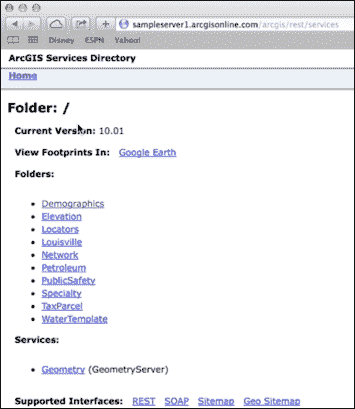

1.  接下来，我们需要确定已知的端点。这代表了一个服务器目录，它是一组 ArcGIS Server 可以执行的操作以及特定的服务。导航到**人口统计** | **ESRI_Census_USA**。这是一个已知的端点。如果你查看浏览器中的地址栏，你应该能看到这个：

    [`sampleserver1.arcgisonline.com/ArcGIS/rest/services/Demographics/ESRI_Census_USA/MapServer`](http://sampleserver1.arcgisonline.com/ArcGIS/rest/services/Demographics/ESRI_Census_USA/MapServer)。

    注意，这遵循了这里看到的模式：

    `http://<host>/<site>/rest/services/<folder>/<serviceName>/<serviceType>`

1.  花些时间点击各种链接。在这样做的时候，注意地址栏中的 URL 如何变化。这个 URL 非常重要，因为它提供了您将通过 Python 请求提交的内容：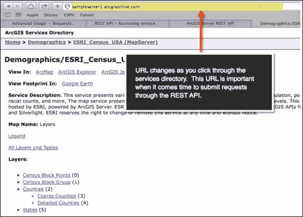

1.  接下来，您将学习如何进一步构建可以提交给 ArcGIS REST API 的 URL。这是一个非常重要的步骤。请求的语法包括资源的路径以及一个操作名称，后面跟着参数列表。操作名称指示将对资源执行的操作类型。例如，您可能希望将地图导出为图像文件。

1.  问号开始参数列表。然后，每个参数都作为由 ampersand 分隔的键/值对提供。所有这些信息都组合成一个单一的 URL 字符串。以下 URL 说明了这一点：

    `http://<资源 URL>/<操作>?<参数 1=值 1>&<参数 2=值 2>`

    目前，我们只需将 URL 输入到浏览器的地址栏中。将 `http://sampleserver1.arcgisonline.com/ArcGIS/rest/services/Demographics/ESRI_Census_USA/MapServer/3/query?text=&geometry=&geometryType=esriGeometryPoint&inSR=&spatialRel=esriSpatialRelIntersects&relationParam=&objectIds=&where=name+%3D+%27Bexar%27&time=&returnCountOnly=false&returnIdsOnly=false&returnGeometry=true&maxAllowableOffset=&outSR=&outFields=&f=json` 复制并粘贴到您的浏览器地址栏中。您可能想使用这本书的数字版本来复制和粘贴此 URL，而不是尝试将其键入到地址栏中。按回车键查看此输出：

    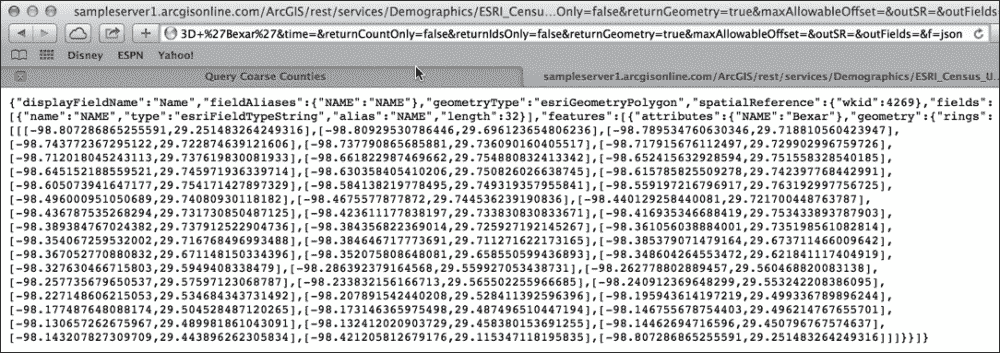

    您可以使用 Python 的 `requests` 模块来简化此过程，并在您的地理处理脚本中直接访问响应信息。`requests` 模块允许您将参数列表定义为 Python 字典，然后它将处理 URL 查询字符串的创建，包括 URL 编码。您将在本练习的末尾学习如何做到这一点。

1.  服务目录包含您可以使用来生成参数值的对话框。您可以在服务页面底部找到这些对话框的链接。在您的浏览器中，导航到 [`sampleserver1.arcgisonline.com/ArcGIS/rest/services/Demographics/ESRI_Census_USA/MapServer/1`](http://sampleserver1.arcgisonline.com/ArcGIS/rest/services/Demographics/ESRI_Census_USA/MapServer/1)。

1.  滚动到页面底部并点击 **查询** 链接以显示对话框，如图所示：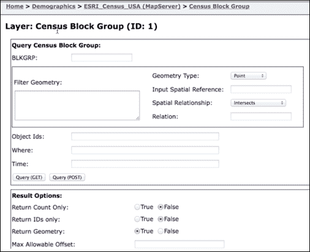

1.  添加一个 `where` 子句，如图所示。将 **返回字段（逗号分隔）** 设置为 `POP2000, POP2007` 和 `BLKGRP`。将 **格式** 更改为 `JSON` 并将 **返回几何形状** 更改为 `False`。然后，点击 **查询（GET）**：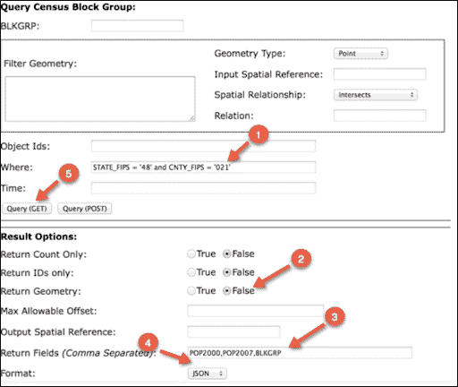

1.  查询将会运行，并将返回以下结果：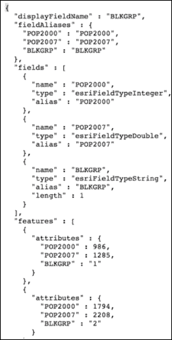

1.  查看浏览器地址栏以查看生成的 URL：`http://sampleserver1.arcgisonline.com/ArcGIS/rest/services/Demographics/ESRI_Census_USA/MapServer/1/query?text=&geometry=&geometryType=esriGeometryPolygon&inSR=&spatialRel=esriSpatialRelIntersects&relationParam=&objectIds=&where=STATE_FIPS+%3D+%2748%27+and+CNTY_FIPS+%3D+%27021%27&time=&returnCountOnly=false&returnIdsOnly=false&returnGeometry=false&maxAllowableOffset=&outSR=&outFields=POP2000%2CPOP2007%2CBLKGRP&f=pjson`。

1.  在即将到来的菜谱中，你将使用相同的 URL，提交请求，并使用 Python 处理结果。

## 它是如何工作的…

ArcGIS 服务器实例的服务目录提供了各种工具，你可以使用这些工具来生成 URL 请求并检查这些请求产生的响应。在这个菜谱中，你学习了如何使用查询任务来构建属性查询。在这个过程中，你学习了如何构建 URL 请求。

# 使用 Python 发送 HTTP 请求并解析响应

你可以使用许多 Python 模块来制作 REST 请求。实际上，太多了！模块包括`urllib2`、`httplib2`、`pycurl`和`requests`。在我看来，`requests`无疑是其中最好的。它更简洁，更容易用于与 RESTful API 的重复交互。一旦你发出了请求，你就可以使用 Python 的`json`模块来解析 JSON 响应。在这个菜谱中，你将学习如何做到这一点。

## 准备工作

Python 的`requests`模块可以用来向 ArcGIS 服务器资源提交请求并处理返回的响应。按照以下步骤学习使用`requests`模块提交请求和处理响应的基本步骤：

## 如何操作…

在我们开始之前，请确保你已经下载并安装了`requests`模块，使用`pip`。如果你还没有这样做，我提供了以下安装`pip`和`requests`模块的说明：

### 注意

这个菜谱以及本章中随后的所有菜谱都使用 Python 的`requests`模块。如果你还没有在你的计算机上安装这个模块，你将需要现在安装它。`requests`模块是通过`pip`安装的，在安装`requests`模块之前需要在你的计算机上安装`pip`。Python 2.7.9（Python 2 系列）和 Python 3.4 的后续版本默认包含`pip`，所以你可能已经有了它。为了测试你是否已经安装了`pip`，你可以在 DOS 提示符下输入以下内容：

```py
pip install requests

```

如果你没有安装`pip`，你会收到一个错误消息，你需要`安装 pip`([`pip.pypa.io/en/latest/installing.html`](https://pip.pypa.io/en/latest/installing.html))。一旦安装，你可以使用前面的安装命令下载并安装`requests`模块。

1.  打开**IDLE**（或另一个 Python 开发环境）并选择**文件** | **新建窗口**。将文件保存为`C:\ArcpyBook\Ch12\ReqJSON.py`。

1.  导入`requests`和`json`模块：

    ```py
    import requests
    import json
    ```

1.  创建一个包含 ArcGIS Online 提供的服务列表的 URL 的新变量。此 URL 包含输出格式为`pjson`的输出，这是一个包含在美观格式中的 JSON 格式，以提供易于阅读性：

    ```py
    import requests
    import json
    agisurl = "http://server.arcgisonline.com/arcgis/rest/services?f=pjson"

    ```

1.  使用`requests`模块中的`get()`方法向 ArcGIS REST API 提交 HTTP 请求。您将响应存储在一个名为`r`的变量中：

    ```py
    import requests
    import json
    agisurl = "http://server.arcgisonline.com/arcgis/rest/services?f=pjson"
    r = requests.get(agisurl)

    ```

1.  现在，让我们打印出返回的响应：

    ```py
    import requests
    import json
    agisurl = "http://server.arcgisonline.com/arcgis/rest/services?f=pjson"
    r = requests.get(agisurl)
    print(r.text)

    ```

1.  保存您的脚本。

1.  运行您的脚本，您将看到以下输出。这是由 ArcGIS REST API 返回的 JSON 响应：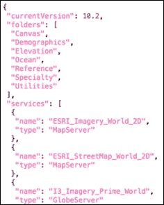

1.  使用`json.loads()`方法将返回的`json`解析为 Python 字典对象。现在，请删除之前的打印语句：

    ```py
    import requests
    import json
    agisurl = "http://server.arcgisonline.com/arcgis/rest/services?f=pjson"
    r = requests.get(agisurl)
    decoded = json.loads(r.text)
    print(decoded)

    ```

1.  您可以通过检查`C:\ArcpyBook\code\Ch12\ReqJSON.py`解决方案文件来验证您的作品。

1.  保存并运行您的脚本以查看输出。`loads()`方法已将`json`输出转换为 Python 字典：

    ```py
    {u'folders': [u'Canvas', u'Demographics', u'Elevation', u'Ocean', u'Reference', u'Specialty', u'Utilities'], u'services': [{u'type': u'MapServer', u'name': u'ESRI_Imagery_World_2D'}, {u'type': u'MapServer', u'name': u'ESRI_StreetMap_World_2D'}, {u'type': u'GlobeServer', u'name': u'I3_Imagery_Prime_World'}, {u'type': u'GlobeServer', u'name': u'NASA_CloudCover_World'}, {u'type': u'MapServer', u'name': u'NatGeo_World_Map'}, {u'type': u'MapServer', u'name': u'NGS_Topo_US_2D'}, {u'type': u'MapServer', u'name': u'Ocean_Basemap'}, {u'type': u'MapServer', u'name': u'USA_Topo_Maps'}, {u'type': u'MapServer', u'name': u'World_Imagery'}, {u'type': u'MapServer', u'name': u'World_Physical_Map'}, {u'type': u'MapServer', u'name': u'World_Shaded_Relief'}, {u'type': u'MapServer', u'name': u'World_Street_Map'}, {u'type': u'MapServer', u'name': u'World_Terrain_Base'}, {u'type': u'MapServer', u'name': u'World_Topo_Map'}], u'currentVersion': 10.2}

    ```

## 它是如何工作的…

在这个简单的菜谱中，您学习了如何使用 Python `requests`模块通过`requests.get()`方法向 ArcGIS 服务器实例提交请求，然后处理来自服务器的响应。`json.loads()`方法用于将响应转换为 Python 字典对象，以便更容易处理。响应包含有关 ArcGIS 服务器实例的基本数据，包括文件夹、服务和版本。在接下来的菜谱中，我们将查看更复杂的示例。

# 使用 ArcGIS REST API 和 Python 获取图层信息

地图服务资源包含数据集，这些数据集可以包括表格或图层。它包含有关服务的基本信息，包括要素图层、表格和服务描述。在本菜谱中，您将学习如何使用 Python 和 ArcGIS REST API 从地图服务中返回图层信息。

## 准备工作

要获取地图服务中特定图层的信息，您需要引用与该图层关联的索引号。当您检查服务的服务目录页面时，您将找到一个列表，其中包含地图服务中的图层及其每个图层的索引号。索引号在请求图层信息时用于代替图层名称。正如我们在过去几个菜谱中所做的那样，我们将使用 Python `requests`模块来发出请求并处理响应。

## 如何操作…

按照以下步骤学习如何从地图服务中获取图层信息：

1.  在 IDLE 或另一个 Python 开发环境中，创建一个名为`GetLayerInformation.py`的新 Python 脚本，并将其保存到`C:\ArcpyBook\Ch12`文件夹。

1.  导入`requests`和`json`模块：

    ```py
    import requests
    import json
    ```

1.  创建以下 `agisurl` 变量。这将成为引用 `ESRI_CENSUS_USA` 地图服务中特定层的基准 URL。在这里，我们引用了一个索引号为 `1` 的层。还包括一个输出格式 `pjson`：

    ```py
    import requests
    import json
    agisurl = "http://sampleserver1.arcgisonline.com/ArcGIS/rest/services/Demographics/ESRI_Census_USA/MapServer/1?f=pjson"

    ```

1.  创建一个 `payload` 变量。该变量将包含一个 Python 字典对象，其中包含作为请求一部分传递的参数。我们将包括一个 `where` 子句并设置一些其他属性：

    ```py
    import requests
    import json

    agisurl = "http://sampleserver1.arcgisonline.com/ArcGIS/rest/services/Demographics/ESRI_Census_USA/MapServer/1"
    payload = { 'where': 'STATE_FIPS = \'48\' and CNTY_FIPS = \'021\'','returnCountyOnly': 'false', 
    'returnIdsOnly': 'false', 'returnGeometry': 'false', 
    'f': 'pjson'}

    ```

1.  调用 `requests.get()` 方法并传递 `agisurl` 变量。响应将存储在名为 `r` 的变量中：

    ```py
    import requests
    import json
    agisurl = http://sampleserver1.arcgisonline.com/ArcGIS/rest/services/Demographics/ESRI_Census_USA/MapServer/1?f=pjson
    payload = { 'where': 'STATE_FIPS = \'48\' and CNTY_FIPS = \'021\'','returnCountyOnly': 'false', \
                'returnIdsOnly': 'false', 'returnGeometry': 'false', \
                'f': 'pjson'}

    r = requests.get(agisurl, params=payload)

    ```

1.  将 JSON 转换为 Python 字典：

    ```py
    r = requests.get(agisurl, params=payload)
    decoded = json.loads(r.text)
    ```

1.  打印出层的名称、地理范围和字段：

    ```py
    r = requests.get(agisurl, params=payload)

    decoded = json.loads(r.text)

    print("The layer name is: " + decoded['name'])
    print("The xmin: " + str(decoded['extent']['xmin']))
    print("The xmax: " + str(decoded['extent']['xmax']))
    print("The ymin: " + str(decoded['extent']['ymin']))
    print("The ymax: " + str(decoded['extent']['ymax']))
    print("The fields in this layer: ")
    for rslt in decoded['fields']:
     print(rslt['name'])

    ```

1.  您可以通过检查 `C:\ArcpyBook\code\Ch12\GetLayerInformation.py` 解决方案文件来验证您的作品。

1.  保存脚本并运行它以查看以下输出：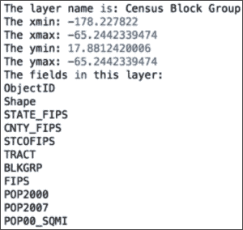

## 它是如何工作的…

在这个配方中，我们传递了一个包含指向地图服务中特定层路径的 URL 的引用。该层通过使用索引号（在这种情况下为 `1`）指定。此 URL 被传递给 Python `requests.get()` 方法。响应以 `json` 格式返回，然后我们将其转换为 Python 字典。该字典包含层的名称、范围和字段的键/值对。这些信息被打印到控制台。

# 使用 ArcGIS REST API 和 Python 导出地图

ArcGIS REST API 有一个庞大的操作集，您可以在请求 ArcGIS 服务器实例的信息时使用。例如，您可以导出地图、查询图层、地理编码地址等等。在这个配方中，您将学习如何从地图服务中导出地图图像。

## 准备工作

`export` 操作可用于从地图服务创建地图图像。此请求的响应包括图像的 URL、宽度、高度、范围和比例。在这个配方中，您将使用导出操作将地图导出为图像文件。

## 如何操作…

1.  在您的 Python 开发环境中创建一个新的脚本，将其保存为 `C:\ArcpyBook\Ch12\ExportMapToImage.py`。

1.  导入 `requests` 和 `json` 模块：

    ```py
    import requests
    import json
    ```

1.  创建一个新的变量 `agisurl`，分配 URL，并执行导出操作，如下所示：

    ```py
    import requests
    import json
    agisurl = "http://sampleserver1.arcgisonline.com/ArcGIS/rest/services/Specialty/ESRI_StateCityHighway_USA/MapServer/export"

    ```

1.  创建一个新的字典对象，该对象将包含帮助定义查询字符串的键/值对。这些是传递给导出操作的参数：

    ```py
    import requests
    import json
    agisurl = "http://sampleserver1.arcgisonline.com/ArcGIS/rest/services/Specialty/ESRI_StateCityHighway_USA/MapServer/export"
    payload = { 'bbox':'-115.8,30.4, 85.5,50.5', 
     'size':'800,600', 
     'imageSR': '102004', 
     'format':'gif', 
     'transparent':'false', 
     'f': 'pjson'}

    ```

1.  调用 `requests.get()` 方法，传递 URL 和 Python 字典参数。响应将存储在名为 `r` 的变量中：

    ```py
    import requests
    import json
    agisurl = "http://sampleserver1.arcgisonline.com/ArcGIS/rest/services/Specialty/ESRI_StateCityHighway_USA/MapServer/export"
    payload = { 'bbox':'-115.8,30.4, 85.5,50.5', 'size':'800,600', 'imageSR': '102004', 'format':'gif', 'transparent':'false', 'f': 'pjson'}
    r = requests.get(agisurl, params=payload)

    ```

1.  打印出 `response` 对象的内容：

    ```py
    import requests
    import json
    agisurl = "http://sampleserver1.arcgisonline.com/ArcGIS/rest/services/Specialty/ESRI_StateCityHighway_USA/MapServer/export"
    payload = { 'bbox':'-115.8,30.4, 85.5,50.5', 
                'size':'800,600', 
                'imageSR': '102004', 
                'format':'gif', 
                'transparent':'false', 
                      'f': 'pjson'}
    r = requests.get(agisurl, params=payload)
    print(r.text)

    ```

1.  您可以通过检查 `C:\ArcpyBook\code\Ch12\ExportMapToImage.py` 解决方案文件来验证您的作品。

1.  保存并运行脚本，查看类似以下输出：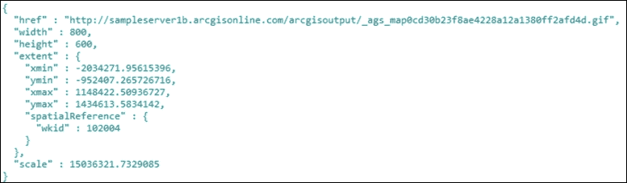

1.  将生成的 `.gif` 文件的 URL 复制并粘贴到浏览器地址栏中，然后在键盘上点击回车键查看文件：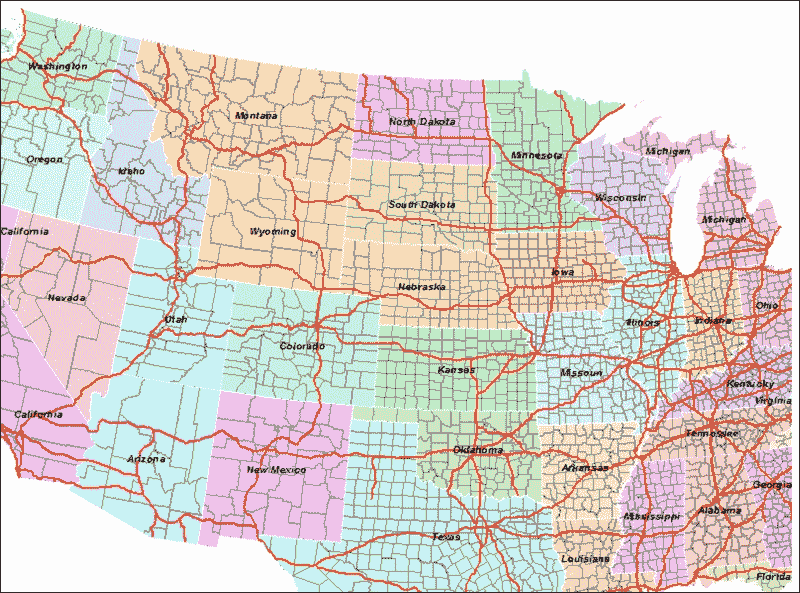

## 它是如何工作的…

ArcGIS REST API 中的导出操作可以用来从地图服务中导出图像文件。如果您检查[`sampleserver1.arcgisonline.com/ArcGIS/rest/services/Specialty/ESRI_StateCityHighway_USA/MapServer/export`](http://sampleserver1.arcgisonline.com/ArcGIS/rest/services/Specialty/ESRI_StateCityHighway_USA/MapServer/export)，这是我们用来生成本食谱中地图图像的，您会看到 URL 末尾的术语 `export`。这就是触发 `export` 操作执行的原因。除此之外，我们还在有效载荷变量中附加了一个边界框（地图范围）、大小、图像的空间参考和格式。

# 使用 ArcGIS REST API 和 Python 查询地图服务

ArcGIS REST API 中的 `query` 操作对地图服务执行查询并返回一个要素集。要素集包括用户请求的字段值，如果请求，还可以返回几何形状。

## 准备工作

在本食谱中，您将基于第一个食谱，在该食谱中，您使用 ArcGIS 服务页面对话框生成 URL 来生成结果。在本食谱中，您将使用 ArcGIS 服务器服务页面对话框生成一个查询地图服务层并返回结果的 URL 请求。您可能还记得 URL 是 `http://sampleserver1.arcgisonline.com/ArcGIS/rest/services/Demographics/ESRI_Census_USA/MapServer/1/query?text=&geometry=&geometryType=esriGeometryPolygon&inSR=&spatialRel=esriSpatialRelIntersects&relationParam=&objectIds=&where=STATE_FIPS+%3D+%2748%27+and+CNTY_FIPS+%3D+%27021%27&time=&returnCountOnly=false&returnIdsOnly=false&returnGeometry=false&maxAllowableOffset=&outSR=&outFields=POP2000%2CPOP2007%2CBLKGRP&f=pjson`。

现在，让我们学习如何使用 Python 提交此请求。

## 如何操作…

1.  在 IDLE 或另一个 Python 开发环境中，创建一个新的 Python 脚本，命名为 `QueryMapService.py`，并将其保存到 `C:\ArcpyBook\Ch12` 文件夹。

1.  在您的浏览器中，导航到：[`resources.arcgis.com/en/help/arcgis-rest-api/index.html#//02r3000000p1000000`](http://resources.arcgis.com/en/help/arcgis-rest-api/index.html#//02r3000000p1000000)。这是对地图服务中图层执行 `query` 操作的 REST API 页面。当您滚动到 `help` 页面时，您应该看到与对话框生成的相同参数，例如 `geometry`、`geometryType`、`inSR`、`spatialRel`、`where` 等。

1.  在您的脚本中，导入 `requests` 和 `json` 模块：

    ```py
    import requests
    import json
    ```

1.  创建以下 `agisurl` 变量。这将作为基 URL，引用 `ESRI_Census_USA` 地图服务中 `census block group` 层（在 URL 中通过标识符 `1` 识别）上的 `query` 操作：

    ```py
    import requests
    import json
    agisurl = "http://sampleserver1.arcgisonline.com/ArcGIS/rest/services/Demographics/ESRI_Census_USA/MapServer/1/query"

    ```

1.  现在，创建一个 Python 字典对象，如下面的代码所示。我们将省略在对话框中没有定义或使用的某些参数。在这个例子中，我们只是创建一个属性查询，以便可以删除所有几何参数：

    ```py
    import requests
    import json
    agisurl = "http://sampleserver1.arcgisonline.com/ArcGIS/rest/services/Demographics/ESRI_Census_USA/MapServer/1/query"
    payload = { 'where':'STATE_FIPS = \'48\' and CNTY_FIPS =       \'021\'','returnCountOnly':'false',
    'returnIdsOnly': 'false', 'returnGeometry':'false', 
    'outFields':'POP2000,POP2007,BLKGRP',
    'f': 'pjson'}

    ```

1.  `requests.get()` 方法可以接受一个 Python 字典对象作为第二个参数。此字典定义了一组键/值对，有助于定义查询字符串。添加 `requests.get()` 方法：

    ```py
    import requests
    import json
    agisurl = "http://sampleserver1.arcgisonline.com/ArcGIS/rest/services/Demographics/ESRI_Census_USA/MapServer/1/query"
    payload = { 'where':'STATE_FIPS = \'48\' and CNTY_FIPS =       \'021\'','returnCountOnly':'false', \
    'returnIdsOnly': 'false', 'returnGeometry':'false', \
    'outFields':'POP2000,POP2007,BLKGRP', \
    'f': 'pjson'}
    r = requests.get(agisurl, params=payload)

    ```

1.  包含一个 `print` 语句以打印返回的响应。

    ```py
    import requests, json
    agisurl = "http://sampleserver1.arcgisonline.com/ArcGIS/rest/services/Demographics/ESRI_Census_USA/MapServer/1/query"
    payload = { 'where':'STATE_FIPS = \'48\' and CNTY_FIPS =       \'021\'','returnCountOnly':'false', \
    'returnIdsOnly': 'false', 'returnGeometry':'false', \
    'outFields':'POP2000,POP2007,BLKGRP', \
    'f': 'pjson'}
    r = requests.get(agisurl, params=payload)
    print(r.text)

    ```

1.  保存脚本并运行它以查看此输出：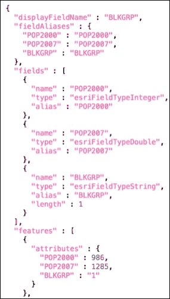

1.  现在，将此 JSON 对象转换为 Python 字典。同时，注释掉您在上一步中添加的 `print` 语句：

    ```py
    r = requests.get(agisurl, params=payload)
    #print(r.text)
    decoded = json.loads(r.text)
    ```

1.  由 `json.loads()` 方法返回的 Python 字典对象将包含 JSON 对象的内容。然后，您可以从中提取单独的数据元素。在这种情况下，我们想要提取返回的每个要素的属性（`BLKGRP`、`POP2007` 和 `POP2000`）。我们可以通过以下代码来实现，您需要将其添加到脚本中：

    ```py
    r = requests.get(agisurl, params=payload)
    #print(r.text)
    decoded = json.loads(r.text)
    for rslt in decoded['features']:
     print("Block Group: " + str(rslt['attributes']['BLKGRP']))
     print("Population 2000: " + str(rslt['attributes']['POP2000']))
     print("Population 2007: " + str(rslt['attributes']['POP2007']))

    ```

1.  您可以通过检查 `C:\ArcpyBook\code\Ch12\QueryMapService.py` 解决方案文件来检查您的工作。

1.  保存并执行您的脚本以查看这些结果：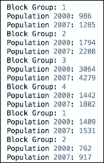

## 它是如何工作的…

在 ArcGIS REST API 中的 `query` 操作可以用来对 ArcGIS 服务器地图服务中的图层进行空间和属性查询。我们使用了 `requests.get()` 方法对 `census block groups` 图层进行属性查询。我们包含了各种参数，包括一个 `where` 子句，它将只返回 `ST_FIPS` 代码为 `48` 且 `CNTY_FIPS` 代码为 `021`（德克萨斯州的贝克斯县）的记录。然后，将 `response` 对象转换为 Python 字典，并包含一个 `for` 循环来遍历返回的每条记录，并打印出区块组名称以及 2000 年和 2007 年的人口。

# 使用 Esri 世界地理编码服务进行地理编码

Esri 世界地理编码服务可以用于在支持的国家中查找地址和地点。此服务包含免费和付费操作。每次请求查找一个地址的 `find` 操作始终是免费服务。`geocodeAddresses` 操作接受一个地址列表进行地理编码，并且仅是付费服务。其他操作可以是免费或付费。如果您是临时使用这些操作，它们是免费的。临时意味着您不会存储结果以供以后使用。如果是这种情况，那么它是一个付费服务。在这个菜谱中，您将使用 Esri 世界地理编码服务来地理编码一个地址。

## 准备工作

ArcGIS REST API 的 `find` 操作可以用来查找单个地址的地理坐标。正如我们在过去几个菜谱中所做的那样，我们将使用 Python `requests` 模块来发出请求并处理响应。

## 如何操作…

1.  在 IDLE 或其他 Python 开发环境中，创建一个名为 `GeocodeAddress.py` 的新 Python 脚本，并将其保存到 `C:\ArcpyBook\Ch12` 文件夹中。

1.  导入 `requests` 和 `json` 模块：

    ```py
    import requests
    import json
    ```

1.  创建以下 `agisurl` 变量。这将指向 Esri World Geocoding 服务和特定服务的 `find` 操作。同时，定义一个 Python 字典，它将包含要提交的地址和输出格式。如果您愿意，可以更改地址：

    ```py
    import requests
    import json
    agisurl = "http://geocode.arcgis.com/arcgis/rest/services/World/GeocodeServer/find"
    payload = { 'text': '1202 Sand Wedge, San Antonio, TX, 78258','f':'pjson'}

    ```

1.  调用 `requests.get()` 方法并传递 URL 和参数。响应将存储在一个名为 `r` 的变量中。然后，将返回的 JSON 对象转换为 Python 字典：

    ```py
    import requests
    import json
    agisurl = "http://geocode.arcgis.com/arcgis/rest/services/World/GeocodeServer/find"
    payload = { 'text': '1202 Sand Wedge, San Antonio, TX, 78258','f':'pjson'}

    r = requests.get(agisurl, params=payload)

    decoded = json.loads(r.text)

    ```

1.  打印一些结果：

    ```py
    import requests
    import json
    agisurl = "http://geocode.arcgis.com/arcgis/rest/services/World/GeocodeServer/find"
    payload = { 'text': '1202 Sand Wedge, San Antonio, TX, 78258','f':'pjson'}

    r = requests.get(agisurl, params=payload)

    decoded = json.loads(r.text)

    print("The geocoded address: " + decoded['locations'][0]['name'])
    print("The longitude: " + str(decoded['locations'][0]['feature']['geometry']['x']))
    print("The lattitude: " + str(decoded['locations'][0]['feature']['geometry']['y']))
    print("The geocode score: " + str(decoded['locations'][0]['feature']['attributes']['Score']))
    print("The address type: " + str(decoded['locations'][0]['feature']['attributes']['Addr_Type']))

    ```

1.  您可以通过检查 `C:\ArcpyBook\code\Ch12\GeocodeAddress.py` 解决方案文件来检查您的作业。

1.  保存脚本并运行，查看以下输出：

    ```py
    The geocoded address: 1202 Sand Wedge, San Antonio, Texas, 78258
    The longitude: -98.4744442811
    The lattitude: 29.6618639681
    The geocode score: 100
    The address type: PointAddress

    ```

## 工作原理...

ArcGIS REST API 中的 `find` 操作可用于对单个地址执行地理编码操作。正如我们在过去几个配方中所做的那样，我们使用了 Python 的 `requests.get()` 方法来提交操作请求（在这种情况下为 `find`），并包括要地理编码的地址等参数。返回的响应包括地址的纬度和经度、地理编码分数和地址类型。

# 使用 FieldMap 和 FieldMappings

到目前为止，本章已介绍了如何使用 Python 与 ArcGIS REST API 访问 ArcGIS Server 服务。现在，我们将转换方向，回到 ArcPy 模块，并讨论 `FieldMap` 和 `FieldMappings` 类。

## 准备工作

一个常见的 GIS 操作是将几个不同的数据集合并成一个更大区域的单个数据集。通常，要合并的数据集中的字段将是相同的，并且不会出现任何问题。然而，有时各种数据集的字段可能不匹配。在这种情况下，您需要将一个数据集中的字段与另一个数据集中的字段之间的关系进行映射。

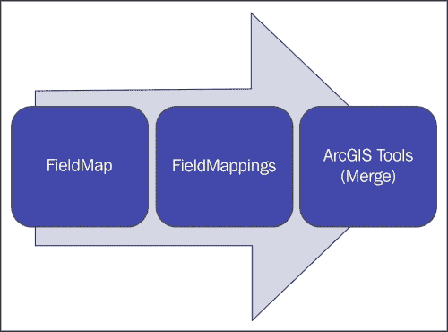

上述图示显示了用于定义字段映射的各种 ArcPy 类之间的关系。一个 `FieldMap` 对象包含字段定义和来自一个或多个表或要素类的输入字段列表，或提供字段值的要素类。您创建的每个 `FieldMap` 对象随后被添加到一个 `FieldMappings` 对象中，该对象作为这些对象的容器。最后，`FieldMappings` 对象可以被发送到各种地理处理工具，如 `Merge` 工具作为输入。

## 如何操作…

在本练习中，您将学习如何使用 FieldMap 和 FieldMappings 对象：

1.  在 IDLE 或其他 Python 开发环境中，创建一个名为 `UsingFieldMap.py` 的新 Python 脚本，并将其保存到您的 `C:\ArcpyBook\Ch12` 文件夹中。

1.  导入 `arcpy`:

    ```py
    import arcpy
    ```

1.  设置工作空间环境变量和一个指向输出要素类的变量：

    ```py
    import arcpy

    arcpy.env.workspace = r"c:\ArcpyBook\data"
    outFeatureClass = r"c:\ArcpyBook\data\AllTracts.shp"
    ```

1.  创建一个`FieldMappings`对象和三个`FieldMap`对象。`FieldMap`对象将持有州**联邦信息处理标准**（**FIPS**）代码、县 FIPS 代码和地块字段的引用：

    ```py
    arcpy.env.workspace = r"c:\ArcyBook\data"
    outFeatureClass = r"c:\ArcpyBook\data\AllTracts.shp"

    fieldmappings = arcpy.FieldMappings()
    fldmap_STFIPS = arcpy.FieldMap()
    fldmap_COFIPS = arcpy.FieldMap()
    fldmap_TRACT = arcpy.FieldMap()

    ```

1.  获取当前工作空间中所有县多边形特征类的列表。每个县特征类都有一个名为`STFID`的字段，其中包含每个特征的州 FIPS 代码、县 FIPS 代码和一个地块。这些信息存储为一个长的字符串（例如`48491020301`），其中前两位是州代码，第三到第五位是县代码，其余字符是地块。作为合并操作的一部分，我们将提取每个单独的元素并将它们存储在单独的字段中：

    ```py
    fieldmappings = arcpy.FieldMappings()
    fieldmap_STFIPS = arcpy.FieldMap()
    fieldmap_COFIPS = arcpy.FieldMap()
    fieldmap_TRACT = arcpy.FieldMap()

    #List all feature classes that start with 'County' and type Polygon
    fclss = arcpy.ListFeatureClasses("County*", "Polygon")

    ```

1.  创建一个`ValueTable`对象来保存要合并的特征类。`ValueTable`作为一个容器对象。它将保存工作空间中每个特征类的映射信息。所有信息都从一个字段（`STFID`）中提取，但我们需要为`STFIPS`、`COFIPS`和`TRACT`创建单独的`FieldMap`输入字段：

    ```py
    fclss = arcpy.ListFeatureClasses("County*", "Polygon")

    vTab = arcpy.ValueTable()
    for fc in fclss:
     fieldmappings.addTable(fc)
     fldmap_STFIPS.addInputField(fc, "STFID")
     fldmap_COFIPS.addInputField(fc, "STFID")
     fldmap_TRACT.addInputField(fc, "STFID")
     vTab.addRow(fc)

    ```

1.  为`STFIPS`字段添加内容。我们使用`startTextPosition()`函数从`STFID`列中提取前两个字符。第一个位置是`0`，因此我们需要使用`setStartTextPosition(x,0)`。在此步骤中，我们还定义了`STFIPS FieldMap`对象的输出字段，命名字段并定义输出字段名称：

    ```py
    vTab = arcpy.ValueTable()
    for fc in fclss:
      fieldmappings.addTable(fc)
      fldmap_STFIPS.addInputField(fc, "STFID")
      fldmap_COFIPS.addInputField(fc, "STFID")
      fldmap_TRACT.addInputField(fc, "STFID")
      vTab.addRow(fc)

    # STFIPS field
    for x in range(0, fldmap_STFIPS.inputFieldCount):
     fldmap_STFIPS.setStartTextPosition(x, 0)
     fldmap_STFIPS.setEndTextPosition(x, 1)

    fld_STFIPS = fldmap_STFIPS.outputField
    fld_STFIPS.name = "STFIPS"
    fldmap_STFIPS.outputField = fld_STFIPS

    ```

1.  为`COFIPS`字段添加内容。这三个字符的位置是从`STFID`列中提取的字符串的`2`-`4`位：

    ```py
    # STFIPS field
    for x in range(0, fldmap_STFIPS.inputFieldCount):
      fldmap_STFIPS.setStartTextPosition(x, 0)
      fldmap_STFIPS.setEndTextPosition(x, 1)

    fld_STFIPS = fldmap_STFIPS.outputField
    fld_STFIPS.name = "STFIPS"
    fldmap_STFIPS.outputField = fld_STFIPS

    # COFIPS field
    for x in range(0, fldmap_COFIPS.inputFieldCount):
     fldmap_COFIPS.setStartTextPosition(x, 2)
     fldmap_COFIPS.setEndTextPosition(x, 4)

    fld_COFIPS = fldmap_COFIPS.outputField
    fld_COFIPS.name = "COFIPS"
    fldmap_COFIPS.outputField = fld_COFIPS

    ```

1.  为**TRACT**字段添加内容：

    ```py
    # COFIPS field
    for x in range(0, fldmap_COFIPS.inputFieldCount):
    	fldmap_COFIPS.setStartTextPosition(x, 2)
    	fldmap_COFIPS.setEndTextPosition(x, 4)

    fld_COFIPS = fldmap_COFIPS.outputField
    fld_STFIPS.name = "COFIPS"
    fldmap_COFIPS.outputField = fld_COFIPS

    # TRACT field
    for x in range(0, fldmap_TRACT.inputFieldCount):
     fldmap_TRACT.setStartTextPosition(x, 5)
     fldmap_TRACT.setEndTextPosition(x, 12)

    fld_TRACT = fldmap_TRACT.outputField
    fld_TRACT.name = "TRACT"
    fldmap_TRACT.outputField = fld_TRACT

    ```

1.  将`FieldMap`对象添加到`FieldMappings`对象中：

    ```py
    # TRACT field
    for x in range(0, fldmap_TRACT.inputFieldCount):
    	fldmap_TRACT.setStartTextPosition(x, 5)
    	fldmap_TRACT.setEndTextPosition(x, 12)

    fld_TRACT = fldmap_TRACT.outputField
    fld_TRACT.name = "TRACT"
    fldmap_TRACT.outputField = fld_TRACT

    #Add fieldmaps into the fieldmappings objec
    fieldmappings.addFieldMap(fldmap_STFIPS)
    fieldmappings.addFieldMap(fldmap_COFIPS)
    fieldmappings.addFieldMap(fldmap_TRACT)

    ```

1.  运行`Merge`工具，传入`vTab`、输出特征类和`fieldmappings`对象：

    ```py
    #Add fieldmaps into the fieldmappings objec
    fieldmappings.addFieldMap(fldmap_STFIPS)
    fieldmappings.addFieldMap(fldmap_COFIPS)
    fieldmappings.addFieldMap(fldmap_TRACT)

    arcpy.Merge_management(vTab, outFeatureClass,fieldmappings)
    print("Merge completed")

    ```

1.  整个脚本应该如下所示：

    ```py
    import arcpy

    Arcpy.env.workspace = r"c:\ArcyBook\data"
    outFeatureClass = r"c:\ArcpyBook\data\AllTracts.shp"

    fieldmappings = arcpy.FieldMappings()
    fldmap_STFIPS = arcpy.FieldMap()
    fldmap_COFIPS = arcpy.FieldMap()
    fldmap_TRACT = arcpy.FieldMap()

    #List all feature classes that start with 'County' and type Polygon
    fclss = arcpy.ListFeatureClasses("County*", "Polygon")

    vTab = arcpy.ValueTable()
    for fc in fclss:
      fieldmappings.addTable(fc)
      fldmap_STFIPS.addInputField(fc, "STFID")
      fldmap_COFIPS.addInputField(fc, "STFID")
      fldmap_TRACT.addInputField(fc, "STFID")
      vTab.addRow(fc)

    # STFIPS field
    for x in range(0, fldmap_STFIPS.inputFieldCount):
      fldmap_STFIPS.setStartTextPosition(x, 0)
      fldmap_STFIPS.setEndTextPosition(x, 1)

    fld_STFIPS = fldmap_STFIPS.outputField
    fld_STFIPS.name = "STFIPS"
    fldmap_STFIPS.outputField = fld_STFIPS

    # COFIPS field
    for x in range(0, fldmap_COFIPS.inputFieldCount):
      fldmap_COFIPS.setStartTextPosition(x, 2)
      fldmap_COFIPS.setEndTextPosition(x, 4)

    fld_COFIPS = fldmap_COFIPS.outputField
    fld_COFIPS.name = "COFIPS"
    fldmap_COFIPS.outputField = fld_COFIPS

    # TRACT field
    for x in range(0, fldmap_TRACT.inputFieldCount):
    	fldmap_TRACT.setStartTextPosition(x, 5)
    	fldmap_TRACT.setEndTextPosition(x, 12)

    fld_TRACT = fldmap_TRACT.outputField
    fld_TRACT.name = "TRACT"
    fldmap_TRACT.outputField = fld_TRACT

    #Add fieldmaps into the fieldmappings objec
    fieldmappings.addFieldMap(fldmap_STFIPS)
    fieldmappings.addFieldMap(fldmap_COFIPS)
    fieldmappings.addFieldMap(fldmap_TRACT)

    arcpy.Merge_management(vTab, outFeatureClass,fieldmappings)
    print("Merge completed")
    ```

1.  您可以通过检查`C:\ArcpyBook\code\Ch12\UsingFieldMap.py`解决方案文件来检查您的工作。

1.  保存脚本并运行它。

1.  在 ArcMap 中添加由脚本创建的`All_Tracts.shp`文件。您应该看到一个合并后的县集合，如果您打开属性表，您将看到创建的新字段以及原始字段：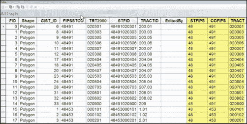

1.  在`All_Tracts.shp`文件的数据视图中，您现在应该看到一个单一的合并多边形层，如下面的截图所示。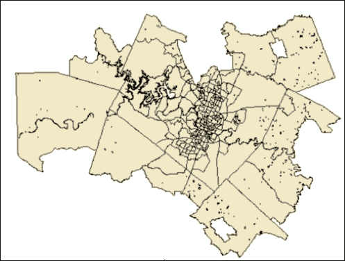

## 它是如何工作的…

ArcPy 模块中的`FieldMap`和`FieldMappings`对象以及`Merge`工具，可用于需要合并具有不匹配字段的数据集的 GIS 操作。当您需要从较长的字符串值集中提取连续的字符串值序列时，也可以使用`FieldMap`对象。在本食谱中，您学习了如何使用`FieldMap`对象从单个字段中提取州、县和人口普查信息。我们创建了单独的`FieldMap`对象来保存这些信息，然后将它们添加到一个`FieldMappings`对象中，该对象随后被传递到`Merge`工具中，以创建一个新的图层，该图层包含三个不同的字段，用于保存这些信息。

# 使用 ValueTable 向工具提供多值输入

许多地理处理工具接受多个值的输入参数。例如，多环缓冲区工具接受多个缓冲距离，删除字段工具接受可以删除的多个字段，还有许多其他例子。在本食谱中，您将学习如何创建一个`ValueTable`对象，该对象作为工具的多值输入。

## 准备工作

有三种方式可以指定多值参数：作为 Python 列表、每个值由分号分隔的字符串，或 ArcPy `ValueTable`对象。在本食谱中，我们将查看如何使用`ValueTable`指定多值输入参数。

## 如何操作...

按以下步骤学习如何使用`ValueTable`向工具提交多个值：

1.  打开**IDLE**（或您喜欢的 Python 开发环境）并创建一个名为`ValueTable.py`的新脚本。

1.  导入`arcpy`并设置工作空间：

    ```py
    import arcpy

    arcpy.env.workspace = r"c:\ArcyBook\data"
    ```

1.  创建一个新的`ValueTable`对象：

    ```py
    import arcpy

    arcpy.env.workspace = r"c:\ArcyBook\data"
    vTab = arcpy.ValueTable()
    ```

1.  为表格创建三行并分配距离`5`、`10`和`20`：

    ```py
    vTab = arcpy.ValueTable()
    vTab.setRow(0, "5")
    vTab.setRow(1, "10")
    vTab.setRow(2, "20")
    ```

1.  定义输入要素类、输出要素类、距离和缓冲单元的变量。距离变量（`dist`）被创建为对已创建的`ValueTable`的引用：

    ```py
    vTab = arcpy.ValueTable()
    vTab.setRow(0, "5")
    vTab.setRow(1, "10")
    vTab.setRow(2, "20")

    inFeature = 'Hospitals.shp'
    outFeature = 'HospitalMBuff.shp'
    dist = vTab
    bufferUnit = "meters"
    ```

1.  调用`MultipleRingBuffer`工具并传递变量作为参数：

    ```py
    inFeature = 'Hospitals.shp'
    outFeature = 'HospitalMBuff.shp'
    dist = vTab
    bufferUnit = "meters"

    arcpy.MultipleRingBuffer_analysis(inFeature, outFeature, dist, bufferUnit, '', 'ALL')
    print("Multi-Ring Buffer Complete")
    ```

1.  您可以通过检查`C:\ArcpyBook\code\Ch12\ValueTable.py`解决方案文件来检查您的工作。

1.  保存并运行脚本。检查输出以查看多个缓冲环。

## 工作原理...

`ValueTable`是一个简单的虚拟表，您可以用作接受多个值的工具的输入。在本食谱中，我们创建了一个`ValueTable`对象，添加了三个值，然后将此对象传递到`MultipleRingBuffer`工具中。`MultipleRingBuffer`工具使用这些信息根据`ValueTable`对象中提供的缓冲距离创建新的多边形图层。
