# 第十三章：使用 ArcGIS Pro 中的 Python

在本章中，我们将介绍以下主题：

+   在 ArcGIS Pro 中使用新的 Python 窗口

+   ArcGIS for Desktop 和 ArcGIS Pro 之间的编码差异

+   为独立 ArcGIS Pro 脚本安装 Python

+   将 ArcGIS for Desktop 的 Python 代码转换为 ArcGIS Pro

# 简介

在本章中，我们将简要介绍与在 ArcGIS Pro 中使用 Python 相关的几个概念。在 ArcGIS for Desktop 和 ArcGIS Pro 中使用 Python 之间存在许多相似之处，因此你到目前为止所学的知识几乎肯定可以迁移到新的 ArcGIS Pro 环境中。然而，ArcGIS for Desktop 和 ArcGIS Pro 之间也有一些差异，还有一个你可以使用的新 Python 窗口。

在 ArcGIS for Desktop 和 ArcGIS Pro 中使用 Python 之间存在一些差异。一般来说，你可以将差异归纳如下：

+   功能性差异

+   使用 Python 3 而不是版本 2

+   不支持的数据格式

ArcGIS Pro 中 ArcPy 功能的变化包括移除一些地理处理工具，包括 Coverage、数据互操作性、地籍网、图表和追踪分析师工具箱。在其他工具箱中也有一些不可用的额外工具。未包含的地理处理工具的完整列表可以在[`pro.arcgis.com/en/pro-app/tool-reference/appendices/unavailable-tools.htm`](http://pro.arcgis.com/en/pro-app/tool-reference/appendices/unavailable-tools.htm)找到。

ArcGIS Pro 使用 Python 3.4 版本，而 ArcGIS for Desktop 10.3 使用 2.7 版本。这两个版本之间存在一些显著差异，并且它们是不兼容的。大部分语言是相同的，但与字符串、字典和其他对象相关的某些重大差异。

在新的 ArcGIS Pro 环境中，将不支持多种数据格式，包括个人地理数据库、栅格目录、几何网络、拓扑、图层和地图包等。如果你一直在 ArcGIS for Desktop 中使用这些数据格式之一，请记住它们不受支持，因此任何使用这些格式的脚本将无法执行。

# 在 ArcGIS Pro 中使用新的 Python 窗口

如果你一直在使用 ArcGIS for Desktop 中的 Python 窗口，那么你将非常熟悉 ArcGIS Pro 中的 Python 窗口。然而，两者之间有一些差异和一些改进。在本食谱中，你将学习如何使用 ArcGIS Pro 的 Python 窗口。

ArcGIS Pro 中的 Python 窗口在功能上与 ArcGIS for Desktop 中的窗口非常相似。它是一个集成工具，用于执行地理处理操作中的 Python 代码。使用 Python 窗口，你可以执行 Python 功能，包括 ArcPy、核心 Python 功能和第三方库。你可以在窗口中编写的 Python 代码可以保存或从现有的脚本源加载。自动完成功能使得完成编码操作变得更容易，包括调用工具和传递参数。在本菜谱中，你将学习如何使用 ArcGIS Pro 的 Python 窗口。

按照以下步骤学习如何使用 ArcGIS Pro 的 Python 窗口：

1.  打开**ArcGIS Pro**并选择一个项目或创建一个新的项目。

1.  在 ArcGIS Pro 中单击**分析**菜单项，然后选择**Python**工具，如图所示：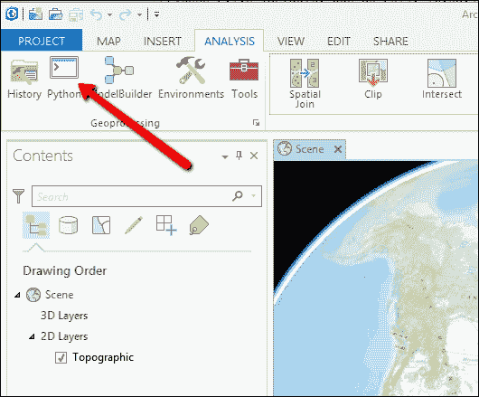

1.  这将在 ArcGIS Pro 窗口的底部显示**Python**窗口，如图所示：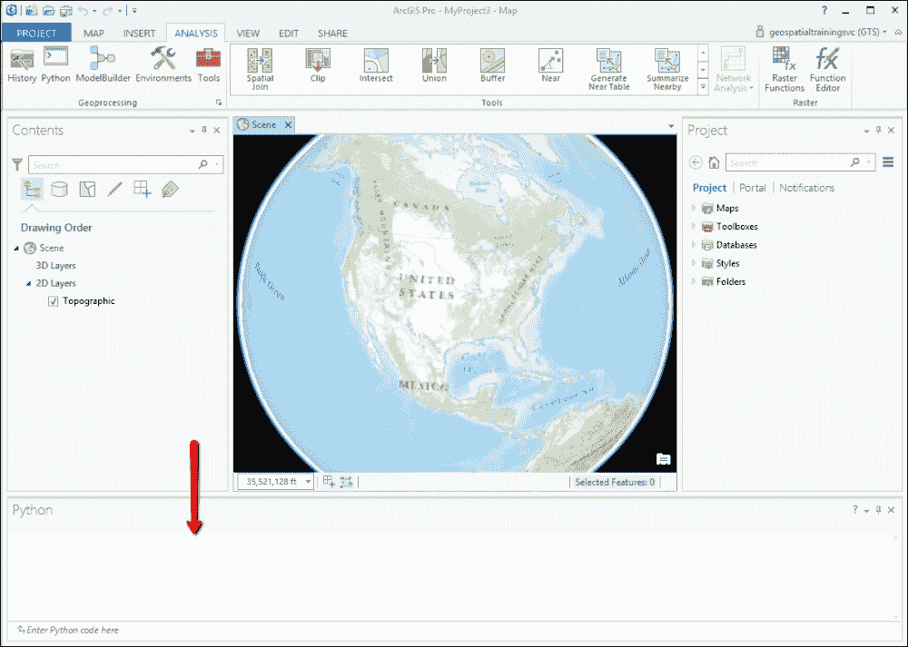

1.  Python 窗口可以被固定、取消固定和调整大小。

1.  ArcGIS Pro 中的 Python 窗口有两个基本部分：**转储**和**Python 提示**。两者都在以下屏幕截图中显示。你将逐行在 Python 提示部分编写代码。转储部分提供了已执行的 Python 代码的记录。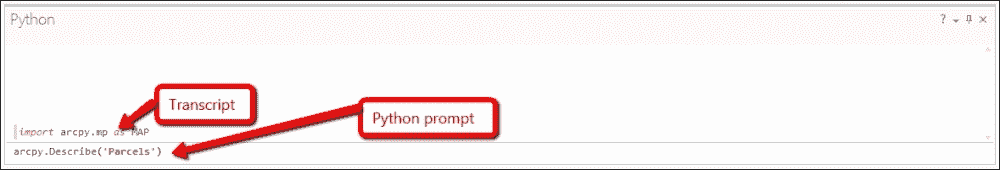

1.  在输入一行代码后，你按下键盘上的*Enter*键，代码将被执行并移动到转储部分。打印消息作为错误写入转储窗口。输入以下代码行以导入 ArcPy 映射模块：

    ```py
    import arcpy.mp as MAP
    ```

1.  ArcGIS Pro 的 Python 窗口具有代码自动完成功能，因此当你开始输入时，将提供各种匹配选项，以提供当前与所输入内容相匹配的选项。你可以从提供的列表中选择一个项目来完成输入。你可以通过在 Python 提示中输入`arc`来查看这一功能的说明。代码自动完成功能将提供两个选项：`arcgis`和`arcpy`。

1.  你可以通过使用`help()`方法访问内置的帮助系统。输入`help(arcpy.ListFeatureClasses())`以查看提供的帮助文档的说明：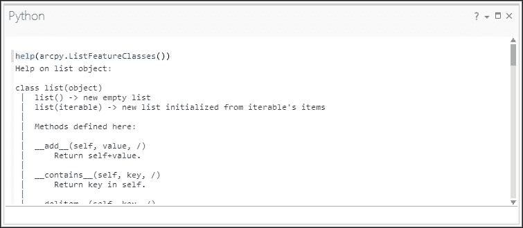

1.  你可以通过在转储部分右键单击并选择**保存转储**来保存你编写的任何 Python 代码。此外，你还可以通过在提示部分右键单击并选择**加载代码**将现有的 Python 脚本加载到窗口中。

ArcGIS Pro Python 窗口可用于编写基本的 Python 地理处理脚本、执行工具、访问 ArcPy 及其相关模块、Python 核心模块和第三方模块、加载和执行现有的 Python 脚本、保存 Python 脚本以供以后使用，以及获取 ArcPy 类和函数的帮助。但是，ArcGIS for Desktop 和 ArcGIS Pro 之间存在编码差异。

# ArcGIS for Desktop 和 ArcGIS Pro 之间的编码差异

在本节中，我们将讨论 ArcGIS for Desktop 和 ArcGIS Pro 编写的 Python 代码之间的一些差异。幸运的是，差异并不多。

ArcPy 支持多种模块，包括数据访问、制图、空间分析、网络分析和时间模块。正如您已经学到的，要使用这些模块，您必须首先将它们导入到您的脚本中。对于这些模块中的大多数，您导入它们的方式将不取决于您是使用 ArcGIS for Desktop 还是 ArcGIS Pro。然而，在导入 ArcPy 制图模块时有一些差异。

在 ArcGIS Pro Python 环境中，您需要使用以下语法来导入制图模块。使用两个字符引用制图模块的方式与其他所有模块的导入方式一致：

```py
import arcpy.mp
```

这与您在 ArcGIS for Desktop 中引用 ArcPy 制图模块的方式不同，如以下代码示例所示：

```py
import arcpy.mapping
```

# 安装 Python 用于 ArcGIS Pro

你们中的许多人可能已经非常熟悉在独立环境中执行您的 Python ArcGIS for Desktop 地理处理脚本。这包括从集成开发环境（如 IDLE 作为计划任务）或从操作系统提示符中执行脚本。默认情况下，ArcGIS Pro 不包括此功能。ArcGIS Pro 包含一个嵌入的 Python 编辑器，允许您将代码作为脚本工具或地理处理工具在 Python 窗口中执行。但是，如果您需要能够从独立环境中访问 ArcGIS Pro 功能，您将需要从 **My Esri** ([`my.esri.com/#/downloads`](https://my.esri.com/#/downloads)) 下载并安装一个 Python 设置文件。此安装文件将安装 Python 3.4.1 和 ArcGIS Pro 所需的其他要求。

# 将 ArcGIS for Desktop Python 代码转换为 ArcGIS Pro

如我在本章前面提到的，ArcGIS for Desktop 和 ArcGIS Pro 的 Python 代码之间没有太多差异。我们已经讨论了两者之间的主要差异。Python 的版本在 ArcGIS for Desktop 10.3 中有所不同，它运行 Python 2.7，而 ArcGIS Pro 1.0 运行 Python 3.4。这两个版本的 Python 不兼容，并且在将现有代码迁移到 ArcGIS Pro 时，您可以使用一些工具。

我们将要检查的第一个工具是 `AnalyzeToolsForPro`。这个地理处理工具可以在 `Management` 工具箱中找到。这个工具可以分析不支持 ArcGIS Pro 功能的 Python 脚本、自定义地理处理工具和工具箱。这个工具将识别任何不支持 ArcGIS Pro 的地理处理工具和环境设置，将 `arcpy.mapping` 替换为 `arcpy.mp`，以及任何不支持的数据格式，例如 ArcGIS Pro 不支持的个人地理数据库。对于与 Python 2 和 Python 3 相关的问题，该工具还使用 `2to3` 实用程序来识别任何 Python 特定问题。

以下是该工具的语法：

```py
AnalyzeToolsForPro_management(input, {report})
```

该工具的输入可以是地理处理工具箱、Python 文件或工具名称，可选的报表参数是一个包含任何已识别问题的输出文本文件。

你还可以使用独立的 `2to3` Python 工具，该工具可以识别与两种语言版本差异相关的任何 Python 特定编码问题。这是一个与 Python 2 和 3 安装一起提供的命令行实用程序。该实用程序可以在类似 `C:\Python34\Tools\Scripts\2to3.py` 或 `C:\Python27\Tools\Scripts\2to3.py` 的路径中找到。这不是一个完美的工具，但据估计可以识别大约 95% 的差异。

# 附录 A. 自动化 Python 脚本

在本章中，我们将涵盖以下主题：

+   从命令行运行 Python 脚本

+   使用 sys.argv[ ] 捕获命令行输入

+   将 Python 脚本添加到批处理文件中

+   安排批处理文件在指定时间运行

# 简介

Python 地理处理脚本可以在 ArcGIS 外部作为独立脚本或内部作为脚本工具执行。这两种方法都有其优缺点。到目前为止，本书中的所有脚本都是在 ArcGIS 内部作为脚本工具、从 Python 开发环境（如 IDLE）或 ArcGIS 中的 Python 窗口中运行的。然而，Python 脚本也可以从 Windows 操作系统命令行执行。命令行是一个可以输入命令的窗口，而不是 Windows 提供的常规点按操作。这种方法运行 Python 脚本对于安排脚本的执行很有用。你可能有很多理由想要安排你的脚本。许多地理处理脚本需要很长时间才能完全执行，需要定期在工作时间之外安排运行。此外，一些脚本需要定期执行（每天、每周、每月等），并且应该安排以提高效率。在本章中，你将学习如何从命令行执行脚本、将脚本放入批处理文件中，以及安排在指定时间执行脚本。请记住，任何从命令行运行的脚本仍然需要访问 ArcGIS for Desktop 许可证才能使用 `arcpy` 模块。

# 从命令行运行 Python 脚本

到目前为止，本书中您所有的 Python 脚本都是作为 ArcGIS 中的脚本工具或从 Python 开发环境中运行的。Windows 命令提示符提供了执行 Python 脚本的另一种方式。命令提示符主要用于执行作为批处理文件的一部分或作为计划任务运行的脚本。

## 准备工作

从命令提示符运行 Python 地理处理脚本有几个优点。这些脚本可以安排在非工作时间批量处理您的数据，以提高处理效率，并且由于内置的 Python 错误处理和调试功能，它们更容易调试。

在本食谱中，您将学习如何使用 Windows 命令提示符来执行 Python 脚本。您需要管理员权限才能完成此食谱，因此您可能需要联系您的信息技术支持团队以进行此更改。

## 如何操作…

按照以下步骤学习如何在 Windows 命令提示符中运行脚本：

1.  在 Windows 中，导航到**开始** | **所有程序** | **附件** | **命令提示符**，这将显示与以下截图类似的窗口：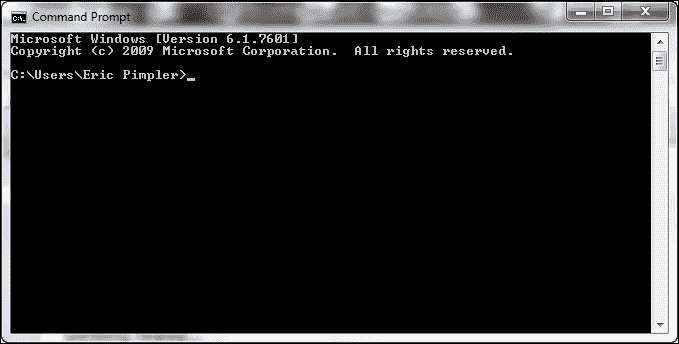

    窗口将显示当前目录。您的目录可能会有所不同。让我们切换到本附录的目录。

1.  输入`cd c:\ArcpyBook\Appendix1`。

1.  输入`dir`以查看文件和子目录的列表。您应该只看到一个名为`ListFields.py`的单个 Python 文件：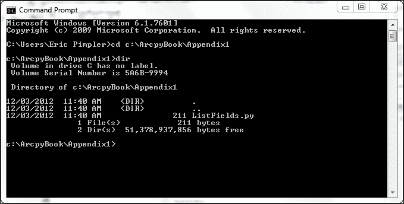

1.  您需要确保 Python 解释器可以从目录结构中的任何位置运行。按照以下截图所示，导航到**开始** | **所有程序** | **附件** | **系统工具** | **控制面板**：

1.  点击**系统和安全**。

1.  点击**系统**。

1.  点击**高级系统设置**。

1.  在**系统属性**对话框中，选择**高级**选项卡，然后点击**环境变量**按钮，如图所示：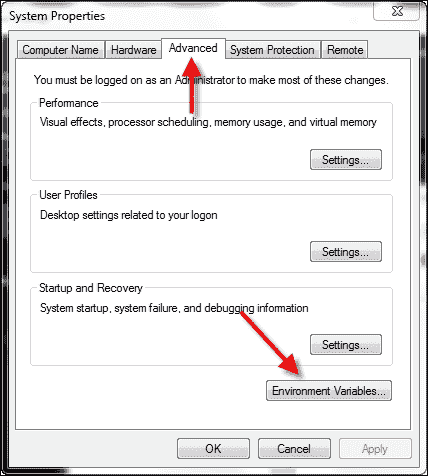

1.  查找**路径**系统变量，如图所示，并点击**编辑…**：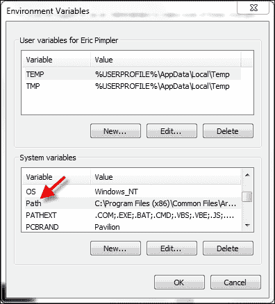

1.  检查整个文本字符串中是否存在`C:\Python27\ArcGIS10.3`目录。如果找不到文本字符串，请将其添加到末尾。确保在添加路径之前添加一个分号，如图所示。现在，当您在命令提示符中输入`python`时，它将遍历**路径**系统变量中的每个目录，检查是否存在名为`python.exe`的可执行文件。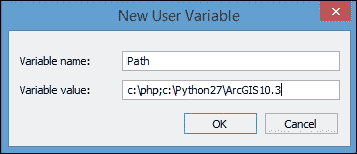

1.  点击**确定**以关闭**编辑系统变量**对话框。

1.  点击**确定**以关闭**环境变量**对话框。

1.  点击**确定**以关闭**系统属性**对话框。

1.  返回到命令提示符。

1.  输入`python ListFields.py`。这将运行`ListFields.py`脚本。在短暂的延迟后，你应该看到以下输出：

延迟是由导入`arcpy`模块的第一行代码引起的。

### 小贴士

考虑在`import`之前添加一个`print`语句，以通知用户延迟。

## 工作原理…

本菜谱中提供的`ListFields.py`脚本是一个简单的脚本，用于列出`Burglary`要素类的属性字段。脚本中的工作空间和要素类名称是硬编码的。输入`python`后跟脚本名称，在本例中为`ListFields.py`，将触发使用 Python 解释器执行脚本。如我之前提到的，此脚本中的工作空间和要素类名称是硬编码的。在下一个菜谱中，你将学习如何向脚本传递参数，以便你可以移除硬编码并使你的脚本更加灵活。

# 使用`sys.argv[ ]`捕获命令行输入

您可以通过允许脚本接受来自命令行的参数形式输入来使脚本更加灵活，而不是将脚本硬编码为特定数据集的路径。您可以使用 Python 的`sys.argv[]`对象捕获这些输入参数。

## 准备工作

Python 的`sys.argv[]`对象允许您在脚本执行时从命令行捕获输入参数。我们将通过一个示例来说明它是如何工作的。请看以下截图：

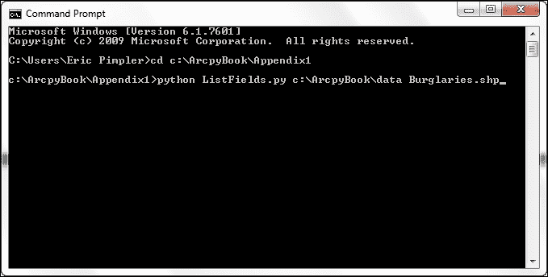

每个单词必须由空格分隔。这些单词存储在一个以零为基础的列表对象中，称为`sys.argv[]`。在`sys.argv[]`对象中，通过`0`索引引用的列表中的第一个项目存储了脚本的名称。在这种情况下，它将是`ListFields.py`。每个后续的单词通过下一个整数引用。因此，第一个参数（`c:\ArcpyBook\data`）将存储在`sys.argv[1]`中，第二个参数（`Burglaries.shp`）将存储在`sys.argv[2]`中。`sys.argv[]`对象中的每个参数都可以在您的地理处理脚本中访问和使用。在本菜谱中，您将更新`ListFields.py`脚本，使其能够从命令行接受输入参数。

## 如何操作…

按照以下步骤创建一个 Python 脚本，该脚本可以使用`sys.argv[]`从命令行接受输入参数：

1.  在 IDLE 中打开`C:\ArcpyBook\Appendix1\ListFields.py`。

1.  导入`sys`模块：

    ```py
    import arcpy
    import sys
    ```

1.  创建一个变量来保存将要传递到脚本中的工作空间：

    ```py
    wkspace = sys.argv[1]
    ```

1.  创建一个变量来保存将要传递到脚本中的要素类：

    ```py
    fc = sys.argv[2]
    ```

1.  更新设置工作空间和调用`ListFields()`函数的代码行：

    ```py
    arcpy.env.workspace = wkspace
    fields = arcpy.ListFields(fc)
    ```

    您完成的脚本应如下所示：

    ```py
    import arcpy
    import sys
    wkspace = sys.argv[1]
    fc = sys.argv[2]
    try:
      arcpy.env.workspace = wkspace
      fields = arcpy.ListFields(fc)
      for fld in fields:
        print(fld.name)
    except Exception as e:
      print(e.message)
    ```

1.  您可以通过检查`C:\ArcpyBook\code\Appendix1\ListFields_Step2.py`解决方案文件来验证您的作品。

1.  保存脚本。

1.  如果需要，打开命令提示符并导航到`C:\ArcpyBook\Appendix1`。

1.  在命令行中键入以下内容并按 *Enter* 键：

    ```py
    python ListFields.py c:\ArcpyBook\data Burglaries_2009.shp
    ```

1.  再次，您应该会看到输出详细说明 `Burglaries_2009.shp` 文件的属性字段。不同之处在于您的脚本不再有硬编码的工作空间和要素类名称。现在您有一个更灵活的脚本，能够列出任何要素类的属性字段。

## 工作原理...

`sys` 模块包含一个名为 `argv[]` 的列表对象，用于存储 Python 脚本命令行执行的输入参数。列表中存储的第一个项目总是脚本的名称。因此，在这种情况下，`sys.argv[0]` 包含 `ListFields.py`。将两个参数传递到脚本中，包括工作空间和要素类。这些值分别存储在 `sys.argv[1]` 和 `sys.argv[2]` 中。然后，将这些值分配给变量并在脚本中使用。

# 将 Python 脚本添加到批处理文件中

安排您的 Python 脚本在指定时间运行需要您创建包含一个或多个脚本和/或操作系统命令的批处理文件。然后可以将这些批处理文件添加到 Windows 计划任务中，以在特定时间间隔运行。

## 准备工作

批处理文件是包含运行 Python 脚本或执行操作系统命令的命令行序列的文本文件。它们具有 `.bat` 扩展名，Windows 识别为可执行文件。由于批处理文件仅包含命令行序列，因此可以使用任何文本编辑器编写，尽管建议您使用基本的文本编辑器，如记事本。这样做是为了避免包含由程序（如 Microsoft Word）有时插入的不可见特殊字符。在本食谱中，您将创建一个简单的批处理文件，该文件将导航到包含您的 `ListFields.py` 脚本的目录并执行它。

## 如何操作...

按照以下步骤创建批处理文件：

1.  打开记事本。

1.  将以下文本行添加到文件中：

    ```py
    cd c:\ArcpyBook\Appendix1
    python ListFields.py c:\ArcpyBook\data Burglaries_2009.shp
    ```

1.  将文件保存到您的桌面上，命名为 `ListFields.bat`。确保您将 **另存为类型** 下拉列表更改为 **所有文件**，否则您将得到一个名为 `ListFields.bat.txt` 的文件。

1.  在 Windows 中，导航到您的桌面，双击 `ListFields.bat` 以执行命令序列。

1.  执行过程中将显示命令提示符。命令执行完毕后，命令提示符将自动关闭。

## 工作原理...

Windows 将批处理文件视为可执行文件，因此双击文件将在新的命令提示符窗口中自动执行文件中包含的命令序列。所有的 `print` 语句都将写入窗口。命令执行完毕后，命令提示符将自动关闭。如果您需要跟踪输出，可以将这些语句写入输出日志文件。

## 更多内容...

批处理文件可以包含变量、循环、注释和条件逻辑。这些功能超出了本教程的范围。然而，如果你为你的组织编写和运行了许多脚本，花些时间学习更多关于批处理文件的知识是值得的。批处理文件已经存在很长时间了，因此关于这些文件的网上信息并不匮乏。有关批处理文件的更多信息，请参阅此主题的维基百科页面。

# 在指定时间安排批处理文件运行

一旦创建，你的批处理文件就可以使用 Windows 计划任务安排在指定时间运行。

## 准备工作

许多地理处理脚本需要花费大量时间，最好在非工作时间运行，这样它们可以充分利用系统资源，并为你腾出时间来专注于其他任务。在本教程中，你将学习如何使用 Windows 计划任务来安排批处理文件的执行。

## 如何操作...

按以下步骤使用 Windows 计划任务安排批处理文件：

1.  通过导航到**开始** | **所有程序** | **附件** | **系统工具** | **控制面板** | **管理工具**来打开 Windows 计划任务。选择**任务计划程序**。计划任务应该会显示，如下面的截图所示：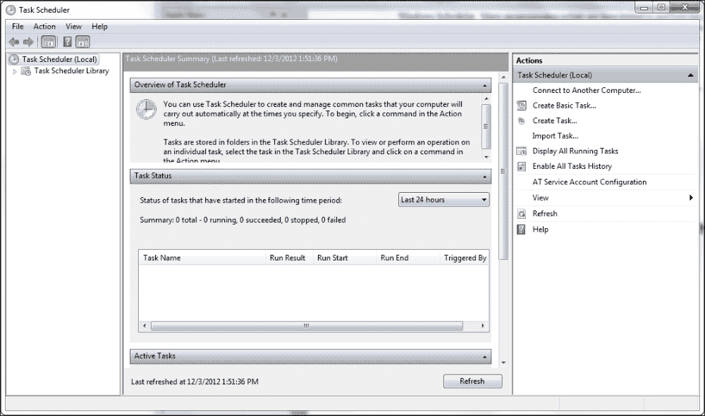

1.  选择**操作**菜单项，然后选择**创建基本任务**以显示**创建基本任务向导**对话框，如下面的截图所示。

1.  给你的任务命名。在这种情况下，我们将称之为`从要素类列出字段`。点击**下一步**：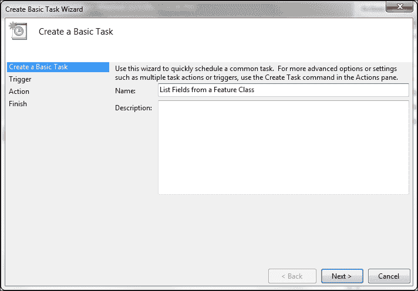

1.  选择任务执行的时间触发器。这可以，并且通常是一个基于时间的触发器，但也可以有其他类型的触发器，例如用户登录或计算机启动。在这种情况下，我们只需选择**每日**。点击**下一步**：

1.  选择开始日期/时间和重复间隔。在下面的截图中，我选择了日期为`12/3/2012`，时间为`凌晨 1:00:00`，重复间隔为`1`天。因此，每天凌晨 1:00，这个任务将被执行。点击**下一步**：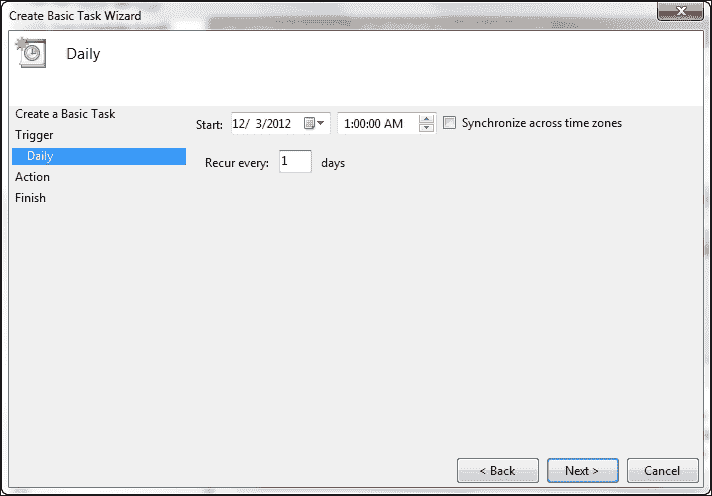

1.  选择**启动程序**作为操作：

1.  浏览到你的脚本并添加参数。点击**下一步**：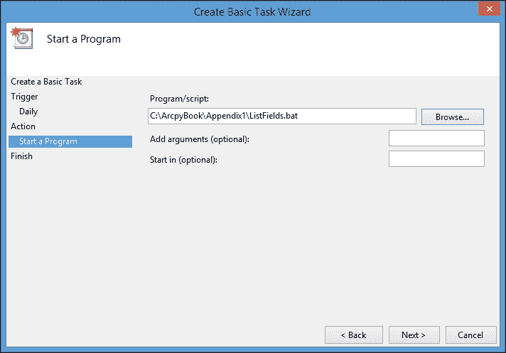

1.  点击**完成**将任务添加到计划任务中：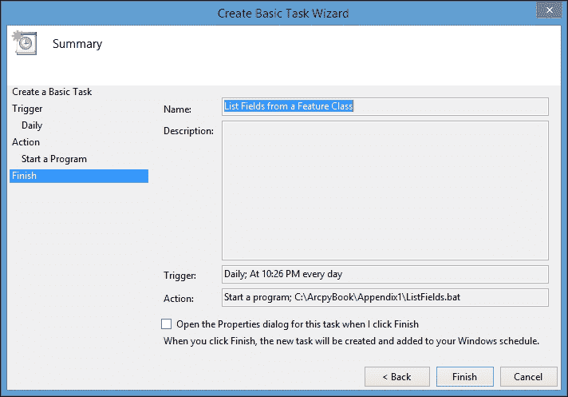

1.  任务现在应该显示在活动任务列表中：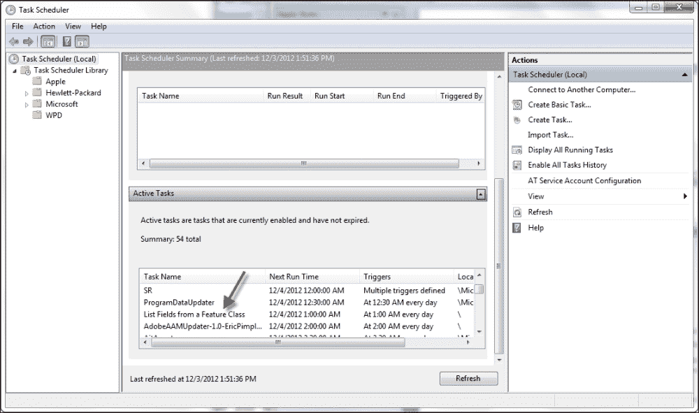

## 工作原理...

Windows 任务计划程序跟踪所有活动任务，并在预定触发器被激活时处理这些任务的执行。在本配方中，我们已将任务计划为每天凌晨 1:00 执行。此时，我们创建的批处理文件将被触发，并在创建任务时指定的参数将被传递到脚本中。使用计划程序在非工作时间自动执行地理处理任务，无需 GIS 人员与脚本交互，这为您提供了更大的灵活性并提高了效率。您还可能希望考虑将 Python 脚本中的错误记录到日志文件中，以获取有关特定问题的更多信息。

# 附录 B. 每个 GIS 程序员都应该知道的五个 Python 配方

在本章中，我们将涵盖以下主题：

+   从分隔符文本文件中读取数据

+   发送电子邮件

+   从 FTP 服务器检索文件

+   创建 ZIP 文件

+   读取 XML 文件

# 简介

在本章中，您将学习如何使用 Python 编写执行通用任务的脚本。这些任务，例如读取和写入分隔符文本文件、发送电子邮件、与 FTP 服务器交互、创建`.zip`文件以及读取和写入 JSON 和 XML 文件，都是常见的。每个 GIS 程序员都应该知道如何编写包含这些功能的 Python 脚本。

# 从分隔符文本文件中读取数据

使用 Python 进行文件处理是 GIS 程序员非常重要的一个主题。文本文件已被用作系统间数据交换的互交换格式。它们简单、跨平台且易于处理。逗号和制表符分隔的文本文件是文本文件中最常用的格式之一，因此我们将详细探讨可用于处理这些文件的 Python 工具。GIS 程序员的一个常见任务是读取包含*x*和*y*坐标以及其他属性信息的逗号分隔的文本文件。然后，这些信息被转换为 GIS 数据格式，如 shapefile 或地理数据库。

## 准备工作

要使用 Python 内置的文件处理功能，您必须首先打开文件。一旦打开，文件内的数据将使用 Python 提供的函数进行处理，最后关闭文件。

### 小贴士

总是记得在完成时关闭文件。Python 并不一定为您关闭文件，因此您可能会耗尽资源或覆盖某些内容。此外，某些操作系统平台不允许同时以只读和写入方式打开同一文件。

在本配方中，您将学习如何打开、读取和处理逗号分隔的文本文件。

## 如何操作…

按照以下步骤创建一个读取逗号分隔的文本文件的 Python 脚本：

1.  在您的`C:\ArcpyBook\data`文件夹中，您将找到一个名为`N_America.A2007275.txt`的文件。在文本编辑器中打开此文件。它应该如下所示：

    ```py
    18.102,-94.353,310.7,1.3,1.1,10/02/2007,0420,T,72
    19.300,-89.925,313.6,1.1,1.0,10/02/2007,0420,T,82
    19.310,-89.927,309.9,1.1,1.0,10/02/2007,0420,T,68
    26.888,-101.421,307.3,2.7,1.6,10/02/2007,0425,T,53
    26.879,-101.425,306.4,2.7,1.6,10/02/2007,0425,T,45
    36.915,-97.132,342.4,1.0,1.0,10/02/2007,0425,T,100

    ```

    ### 注意

    此文件包含与 2007 年某一天卫星传感器收集的野火事件相关的数据。每一行包含火灾的纬度和经度信息，以及额外的信息，包括日期和时间、卫星类型、置信值和其他细节。在这个菜谱中，您将只提取纬度、经度和置信值。第一个条目包含纬度，第二个条目包含经度，最后一个值包含置信值。

1.  打开**IDLE**并创建一个名为`C:\ArcpyBook\Appendix2\ReadDelimitedTextFile.py`的文件。

1.  使用 Python 的`open()`函数打开文件以读取它：

    ```py
    f = open("c:/ArcpyBook/data/N_America.A2007275.txt','r')
    ```

1.  添加一个`for`循环来迭代所有行：

    ```py
    for fire in f:
    ```

1.  使用`split()`函数将值拆分为一个列表，使用逗号作为分隔符。这个列表将被分配给一个名为`lstValues`的变量。确保将此行代码缩进到您刚刚创建的 for 循环中：

    ```py
    lstValues = fire.split(",")
    ```

1.  使用引用纬度、经度和置信值的索引值，创建新的变量：

    ```py
    latitude = float(lstValues[0])
    longitude = float(lstValues[1])
    confid = int(lstValues[8])
    ```

1.  使用`print`语句打印每个变量的值：

    ```py
    print("The latitude is: " + str(latitude) + " The longitude is: " + str(longitude) + " The confidence value is: " + str(confid))
    ```

1.  关闭文件：

    ```py
    f.close()
    ```

1.  整个脚本应如下所示：

    ```py
    f = open('c:/ArcpyBook/data/N_America.A2007275.txt','r')
    for fire in f.readlines():
      lstValues = fire.split(',')
      latitude = float(lstValues[0])
      longitude = float(lstValues[1])
      confid = int(lstValues[8])
      print("The latitude is: " + str(latitude) + " The longitude is: " + str(longitude) + " The confidence value is: " + str(confid))
    f.close()
    ```

1.  您可以通过检查`C:\ArcpyBook\code\Appendix2`\`ReadDelimitedTextFile.py`解决方案文件来验证您的操作。

1.  保存并运行脚本。您应该看到以下输出：

    ```py
    The latitude is: 18.102 The longitude is: -94.353 The confidence value is: 72
    The latitude is: 19.3 The longitude is: -89.925 The confidence value is: 82
    The latitude is: 19.31 The longitude is: -89.927 The confidence value is: 68
    The latitude is: 26.888 The longitude is: -101.421 The confidence value is: 53
    The latitude is: 26.879 The longitude is: -101.425 The confidence value is: 45
    The latitude is: 36.915 The longitude is: -97.132 The confidence value is: 100

    ```

## 它是如何工作的...

Python 的`open()`函数创建一个文件对象，该对象作为您计算机上文件的链接。在读取或写入文件数据之前，您必须在文件上调用`open()`函数。`open()`函数的第一个参数是要打开的文件的路径。`open()`函数的第二个参数对应于一个模式，通常是读取（`r`）、写入（`w`）或追加（`a`）。`r`的值表示您希望以只读方式打开文件，而`w`的值表示您希望以写入方式打开文件。如果您以写入模式打开的文件已存在，它将覆盖文件中的任何现有数据，因此在使用此模式时要小心。追加（`a`）模式将以写入方式打开文件，但不会覆盖任何现有数据，而是将数据追加到文件末尾。因此，在这个菜谱中，我们以只读模式打开了`N_America.A2007275.txt`文件。

在`for`循环内部，该循环用于逐行遍历文本文件中的每个值，使用`split()`函数将一行文本（以某种方式分隔）创建为一个列表对象。我们的文件是以逗号分隔的，因此我们可以使用`split(",")`。您也可以根据其他分隔符进行分割，例如制表符、空格或任何其他分隔符。由`split()`创建的这个新列表对象存储在一个名为`lstValues`的变量中。这个变量包含每个野火值。这在下图中得到了说明。您会注意到纬度位于第一个位置，经度位于第二个位置，依此类推。列表是从零开始的：

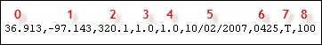

使用索引值（这些值引用纬度、经度和置信度值），我们创建了新的变量`latitude`、`longitude`和`confid`。最后，我们打印出每个值。一个更健壮的地理处理脚本可能会使用`InsertCursor`对象将此信息写入要素类。我们实际上在第八章的先前的配方中做了这件事，*使用 ArcPy 数据访问模块与要素类和表*。

使用`readlines()`函数将整个文件内容读入 Python 列表中是可能的，然后可以遍历。文本文件中的每一行都将成为列表中的一个唯一值。由于这个函数将整个文件读入列表中，因此在使用此方法时需要谨慎，因为大文件可能会引起显著的性能问题。

## 还有更多...

与读取文件实例类似，有几种方法可以将数据写入文件。`write()`函数可能是最容易使用的。它接受一个字符串参数并将其写入文件。`writelines()`函数可以用来将列表结构的内容写入文件。在将数据写入文本文件之前，您需要以写入或追加模式打开文件。

# 发送电子邮件

在某些情况下，您可能需要从 Python 脚本中发送电子邮件。这可能是一个长时间运行的地理处理操作成功完成或发生错误的警报的例子。在这些和其他情况下，发送电子邮件可能会有所帮助。

## 准备工作

通过 Python 脚本发送电子邮件需要您有权访问邮件服务器。这可能是一个公共电子邮件服务，如 Yahoo、Gmail 或其他服务。它也可以使用配置了应用程序的出站邮件服务器，例如 Microsoft Outlook。在任一情况下，您都需要知道电子邮件服务器的主机名和端口号。Python 的`smtplib`模块用于创建到邮件服务器的连接并发送电子邮件。

Python 的`email`模块包含一个`Message`类，它表示电子邮件消息。每个消息都包含标题和正文。这个类不能用来发送电子邮件，它只是处理其对象表示。在本食谱中，你将学习如何使用`smtp`类通过你的脚本发送包含附件的电子邮件。`Message`类可以使用`message_from_file()`或`message_from_string()`函数解析字符流或包含电子邮件的文件。两者都将创建一个新的`Message`对象。可以通过调用`Message.getpayload()`来获取邮件的正文。

### 注意

我们在这个练习中使用 Google Mail 服务。如果你已经有了 Gmail 账户，那么只需简单地提供你的用户名和密码作为这些变量的值。如果你没有 Gmail 账户，你需要创建一个或使用不同的邮件服务来完成这个练习。Gmail 账户是免费的。Google 可能会阻止通过脚本发送电子邮件的尝试，所以如果你使用 Gmail，请注意这可能不会按预期工作。

## 如何做到这一点…

按照以下步骤创建一个可以发送电子邮件的脚本：

1.  打开**IDLE**并创建一个名为`C:\ArcpyBook\Appendix2\SendEmail.py`的文件。

1.  为了发送带有附件的电子邮件，你需要导入`smtplib`模块以及`os`模块，以及电子邮件模块中的几个类。将以下导入语句添加到你的脚本中：

    ```py
    import smtplib
    from email.MIMEMultipart import MIMEMultipart
    from email.MIMEBase import MIMEBase
    from email.MIMEText import MIMEText
    from email import Encoders
    import os
    ```

1.  创建以下变量，并将你的 Gmail 用户名和密码作为值分配。请记住，从你的 Python 脚本中发送电子邮件可能会引起问题，因为它需要你包含你的用户名和密码：

    ```py
    gmail_user = "<username>"
    gmail_pwd = "<password>"
    ```

    ### 小贴士

    注意，在脚本中包含电子邮件`用户名`和`密码`是不安全的，因此你不会想在生产脚本中包含这些信息。有加密这些值的方法，但这超出了本食谱的范围。

1.  创建一个新的 Python 函数`mail()`。这个函数将接受四个参数：`to`、`subject`、`text`和`attach`。每个参数都应该很容易理解。创建一个新的`MIMEMultipart`对象，并分配`from`、`to`和`subject`键。你也可以使用`MIMEMultipart.attach()`将电子邮件文本附加到这个新的`msg`对象上：

    ```py
    def mail(to, subject, text, attach):
      msg = MIMEMultipart()
      msg['From'] = gmail_user
      msg['To'] = to
      msg['Subject'] = subject

      msg.attach(MIMEText(text))
    ```

1.  将文件附加到电子邮件中：

    ```py
      part = MIMEBase('application', 'octet-stream')
      part.set_payload(open(attach, 'rb').read())
      Encoders.encode_base64(part)
      part.add_header('Content-Disposition',
        'attachment; filename="%s"' % os.path.basename(attach))
      msg.attach(part)
    ```

1.  创建一个新的 SMTP 对象，该对象引用 Google Mail 服务，传入用户名和密码以连接到邮件服务，发送电子邮件，并关闭连接：

    ```py
      mailServer = smtplib.SMTP("smtp.gmail.com", 587)
      mailServer.ehlo()
      mailServer.starttls()
      mailServer.ehlo()
      mailServer.login(gmail_user, gmail_pwd)
      mailServer.sendmail(gmail_user, to, msg.as_string())
      mailServer.close()
    ```

1.  调用`mail()`函数，传入电子邮件的收件人、电子邮件的主题、电子邮件文本和附件：

    ```py
      mail("<email to send to>",
      "Hello from python!",
      "This is an email sent with python",
      "c:/ArcpyBook/data/bc_pop1996.csv")
    ```

1.  整个脚本应该如下所示：

    ```py
    import smtplib
    from email.MIMEMultipart import MIMEMultipart
    from email.MIMEBase import MIMEBase
    from email.MIMEText import MIMEText
    from email import Encoders
    import os

    gmail_user = "<username>"
    gmail_pwd = "<password>"

    def mail(to, subject, text, attach):
     msg = MIMEMultipart()

     msg['From'] = gmail_user
     msg['To'] = to
     msg['Subject'] = subject

     msg.attach(MIMEText(text))

     part = MIMEBase('application', 'octet-stream')
     part.set_payload(open(attach, 'rb').read())
     Encoders.encode_base64(part)
     part.add_header('Content-Disposition',
         'attachment; filename="%s"' % os.path.basename(attach))
     msg.attach(part)

     mailServer = smtplib.SMTP("smtp.gmail.com", 587)
     mailServer.ehlo()
     mailServer.starttls()
     mailServer.ehlo()
     mailServer.login(gmail_user, gmail_pwd)
     mailServer.sendmail(gmail_user, to, msg.as_string())
     mailServer.close()

    mail("<email to send to>", "Hello from python!", "This is an email sent with python", "bc_pop1996.csv")
    ```

1.  你可以通过检查`C:\ArcpyBook\code\Appendix2`\`SendEmail`.py 解决方案文件来检查你的工作。

1.  保存并运行脚本。为了测试，我使用了我的个人 Yahoo 账户作为收件人。你会注意到我的收件箱中有一个来自我的 Gmail 账户的新消息；同时，注意附件：

## 工作原理...

传递给`mail()`函数的第一个参数是接收电子邮件的电子邮件地址。这可以是任何有效的电子邮件地址，但您可能希望提供一个您实际上可以检查的邮箱账户，以确保您的脚本运行正确。第二个参数是电子邮件的主题行。第三个参数是文本内容。最后一个参数是要附加到电子邮件上的文件的名称。在这里，我简单地定义了应该将`bc_pop1996.csv`文件附加到电子邮件中。您可以使用您有权访问的任何文件，但您可能只想使用这个文件进行测试。

我们然后在`mail()`函数内部创建一个新的`MIMEMultipart`对象，并分配`from`、`to`和`subject`键。您还可以使用`MIMEMultipart.attach()`将电子邮件的文本附加到这个新的`msg`对象上。然后，使用`MIMEBase`对象将`bc_pop1996.csv`文件附加到电子邮件上，并通过`msg.attach(part)`将其附加到电子邮件中。

到目前为止，我们已经探讨了如何发送基本的文本电子邮件。然而，我们想要发送一个包含文本和附件的更复杂的电子邮件消息。这需要使用 MIME 消息，它提供了处理多部分电子邮件的功能。MIME 消息需要在电子邮件的多个部分之间设置边界，并添加额外的标题来指定发送的内容。《MIMEBase`类是`Message`的抽象子类，使得发送这种类型的电子邮件成为可能。由于它是一个抽象类，您不能创建这个类的实际实例。相反，您可以使用其子类之一，例如`MIMEText`。`mail()`函数的最后一步是创建一个新的 SMTP 对象，该对象引用 Google Mail 服务，传入用户名和密码以连接到邮件服务，发送电子邮件，然后关闭连接。

# 从 FTP 服务器检索文件

从 FTP 服务器检索文件进行处理的操作对于 GIS 程序员来说非常常见，可以使用 Python 脚本来自动化。

## 准备工作

通过`ftplib`模块连接到 FTP 服务器并下载文件是完成操作。通过 FTP 对象创建对 FTP 服务器的连接，该对象接受主机、用户名和密码来建立连接。一旦建立了连接，您就可以搜索并下载文件。

在这个菜谱中，您将连接到**国家机构火灾中心事件**FTP 站点，并下载一份科罗拉多州野火事件的 PDF 文件。在运行以下脚本之前，您需要通过[`gis.nwcg.gov/data_nifcftp.html`](http://gis.nwcg.gov/data_nifcftp.html)创建一个用户名/密码。

## 如何操作...

按照以下步骤创建一个连接到 FTP 服务器并下载文件的脚本：

1.  打开**IDLE**并创建一个名为`C:\ArcpyBook\Appendix2\ftp.py`的文件。

1.  我们将连接到 NIFC 的 FTP 服务器。有关更多信息，请访问他们的网站 [`gis.nwcg.gov/data_nifcftp.html`](http://gis.nwcg.gov/data_nifcftp.html)。

1.  导入 `ftplib`、`os` 和 `socket` 模块：

    ```py
    import ftplib
    import os
    import socket
    ```

1.  添加以下定义 URL、目录和文件名的变量：

    ```py
    HOST = 'ftp.nifc.gov'
    USER = '<your username here>'
    PASSW = '<your password here>'
    DIRN = '/Incident_Specific_Data/2012 HISTORIC/ROCKY_MTN/Arapaho/GIS/20120629'
    FILE = '20120629_0600_Arapaho_PIO_0629_8x11_land.pdf'
    ```

1.  添加以下代码块以创建连接。如果发生连接错误，将生成一条消息。如果连接成功，将打印成功消息：

    ```py
    try:

      f = ftplib.FTP(HOST,USER,PASS)
    except (socket.error, socket.gaierror), e:
      print('ERROR: cannot reach "%s"' % HOST)
    print('*** Connected to host "%s"' % HOST)
    ```

1.  添加以下代码块以匿名登录到服务器：

    ```py
    try:
      f.login()
    except ftplib.error_perm:
      print('ERROR: cannot login')
      f.quit()
    print('*** Logged in ')
    ```

1.  添加以下代码块以切换到我们 `DIRN` 变量中指定的目录：

    ```py
    try:
      f.cwd(DIRN)
    except ftplib.error_perm:
      print('ERROR: cannot CD to "%s"' % DIRN)
      f.quit()
    print('*** Changed to "%s" folder' % DIRN)
    ```

1.  使用 `FTP.retrbinary()` 函数检索 PDF 文件：

    ```py
    try:
      f.retrbinary('RETR %s' % FILE,
         open(FILE, 'wb').write)
    except ftplib.error_perm:
      print('ERROR: cannot read file "%s"' % FILE)
      os.unlink(FILE)
    else:
      print('*** Downloaded "%s" to CWD' % FILE)
    ```

1.  确保您从服务器断开连接：

    ```py
    f.quit()
    ```

1.  整个脚本应如下所示：

    ```py
    import ftplib
    import os
    import socket

    HOST = 'ftp.nifc.gov'
    USER = '<your username here>'
    PASSW = '<your password here>'
    DIRN = '/Incident_Specific_Data/2012 HISTORIC/ROCKY_MTN/Arapaho/GIS/20120629'
    FILE = '20120629_0600_Arapaho_PIO_0629_8x11_land.pdf'

    try:
      f = ftplib.FTP(HOST,USER,PASSW)
    except (socket.error, socket.gaierror), e:
      print('ERROR: cannot reach "%s"' % HOST)
    print('*** Connected to host "%s"' % HOST)

    try:
      f.login()
    except ftplib.error_perm:
      print('ERROR: cannot login')
      f.quit()
    print('*** Logged in ')

    try:
      f.cwd(DIRN)
    except ftplib.error_perm:
      print('ERROR: cannot CD to "%s"' % DIRN)
      f.quit()
    print('*** Changed to "%s" folder' % DIRN)

    try:
      f.retrbinary('RETR %s' % FILE,
         open(FILE, 'wb').write)
    except ftplib.error_perm:
      print('ERROR: cannot read file "%s"' % FILE)
      os.unlink(FILE)
    else:
      print('*** Downloaded "%s" to CWD' % FILE)
    f.quit()
    ```

1.  您可以通过检查 `C:\ArcpyBook\code\Appendix2\ftp`.py 解决方案文件来验证您的操作。

1.  保存并运行脚本。如果一切顺利，您应该看到以下输出：

    ```py
    *** Connected to host "ftp.nifc.gov"
    *** Logged in as "anonymous"
    *** Changed to "'/Incident_Specific_Data/2012 HISTORIC/ROCKY_MTN/Arapaho/GIS/20120629'" folder
    *** Downloaded "'20120629_0600_Arapaho_PIO_0629_8x11_land.pdf " to CWD

    ```

1.  检查您的 `C:\ArcpyBook\Appendix2` 目录中的文件。默认情况下，FTP 将文件下载到当前工作目录。

## 它是如何工作的…

要连接到 FTP 服务器，您需要知道 URL。您还需要知道要下载的文件的目录和文件名。在此脚本中，我们硬编码了此信息，以便您可以专注于实现 FTP 特定的功能。使用此信息，我们创建了与 NIFC FTP 服务器的连接。这是通过 `ftplib.FTP()` 函数完成的，该函数接受主机的 URL。

请记住，您需要获取用户名/密码以登录并下载数据。登录后，脚本将更改目录，从 FTP 服务器的根目录切换到 `DIRN` 变量中定义的路径。这是通过 `cwd(<path>)` 函数实现的。PDF 文件是通过使用 `retrbinary()` 函数检索的。最后，完成操作后，您将想要关闭与 FTP 服务器的连接。这可以通过 `quit()` 方法完成。

## 更多内容…

有许多其他与 FTP 相关的方法，您可以使用它们执行各种操作。通常，这些可以分为目录级操作和文件级操作。目录级方法包括 `dir()` 方法以获取目录中的文件列表，`mkd()` 创建新目录，`pwd()` 获取当前工作目录，以及 `cwd()` 更改当前目录。请记住，您通过脚本尝试执行的操作将由分配给您的账户的权限控制，因此您可能无法成功执行我提到的每个方法。

`ftplib` 模块还包括各种用于处理文件的方法。您可以使用二进制或纯文本格式上传和下载文件。`retrbinary()` 和 `storbinary()` 方法分别用于检索和存储二进制文件。纯文本文件可以使用 `retrlines()` 和 `storlines()` 检索和存储。

FTP 类有几个其他方法你应该知道。删除文件可以使用`delete()`方法完成，而重命名文件可以使用`rename()`方法完成。你还可以通过`sendcmd()`方法向 FTP 服务器发送命令。

# 创建 ZIP 文件

GIS 通常需要使用大文件，这些文件将被压缩成`.zip`格式以便于分享。Python 包含一个模块，你可以使用它来解压缩和压缩这种格式的文件。

## 准备工作

ZIP 是一种常见的压缩和存档格式，在 Python 中通过`zipfile`模块实现。`ZipFile`类可用于创建、读取和写入`.zip`文件。要创建一个新的`.zip`文件，只需提供文件名以及模式`w`，这表示你想要向文件写入数据。在以下代码示例中，我们正在创建一个名为`datafile.zip`的`.zip`文件。第二个参数`w`表示将创建一个新文件。在写入模式下，将创建一个新文件或截断具有相同名称的现有文件。在创建文件时还可以使用可选的压缩参数。此值可以设置为`ZIP_STORED`或`ZIP_DEFLATED`：

```py
zipfile.ZipFile('dataFile.zip', 'w',zipfile.ZIP_STORED)
```

在这个练习中，你将使用 Python 创建文件，添加文件，并将压缩应用于`.zip`文件。你将存档位于`C:\ArcpyBook\data`目录中的所有 shapefiles。

## 如何操作…

按照以下步骤学习如何创建一个构建`.zip`文件的脚本：

1.  打开**IDLE**并创建一个名为`C:\ArcpyBook\Appendix2\CreateZipfile.py`的脚本。

1.  导入`zipfile`和`os`模块：

    ```py
    import os
    import zipfile
    ```

1.  以写入模式创建一个名为`shapefiles.zip`的新`.zip`文件并添加压缩参数：

    ```py
    zfile = zipfile.ZipFile("shapefiles.zip", "w", zipfile.ZIP_STORED)
    ```

1.  接下来，我们将使用`os.listdir()`函数来创建数据目录中的文件列表：

    ```py
    files = os.listdir("c:/ArcpyBook/data")
    ```

1.  遍历所有文件的列表，如果文件以`shp`、`dbf`或`shx`结尾，则将其写入`.zip`文件：

    ```py
    for f in files:
      if f.endswith("shp") or f.endswith("dbf") or f.endswith("shx"):
        zfile.write("C:/ArcpyBook/data/" + f)
    ```

1.  打印出添加到 ZIP 存档中的所有文件的列表。你可以使用`ZipFile.namelist()`函数创建存档中的文件列表。

    ```py
    for f in zfile.namelist():
        print "Added %s" % f
    ```

1.  关闭`.zip`存档：

    ```py
    zfile.close()
    ```

1.  整个脚本应如下所示：

    ```py
    import os
    import zipfile

    #create the zip file
    zfile = zipfile.ZipFile("shapefiles.zip", "w", zipfile.ZIP_STORED)
    files = os.listdir("c:/ArcpyBook/data")

    for f in files:
      if f.endswith("shp") or f.endswith("dbf") or f.endswith("shx"):
        zfile.write("C:/ArcpyBook/data/" + f)

    #list files in the archive
    for f in zfile.namelist():
        print("Added %s" % f)

    zfile.close()
    ```

1.  你可以通过检查`C:\ArcpyBook\code\Appendix2`\`CreateZipfile_Step1`.py 解决方案文件来验证你的工作。

1.  保存并运行脚本。你应该看到以下输出：

    ```py
    Added ArcpyBook/data/Burglaries_2009.dbf
    Added ArcpyBook/data/Burglaries_2009.shp
    Added ArcpyBook/data/Burglaries_2009.shx
    Added ArcpyBook/data/Streams.dbf
    Added ArcpyBook/data/Streams.shp
    Added ArcpyBook/data/Streams.shx

    ```

1.  在 Windows 资源管理器中，你应该能够看到以下截图所示的输出`.zip`文件。注意存档的大小。此文件未进行压缩：

1.  现在，我们将创建`.zip`文件的压缩版本以查看差异。对创建`.zip`文件的代码行进行以下更改：

    ```py
    zfile = zipfile.ZipFile("shapefiles2.zip", "w", zipfile.ZIP_DEFLATED)
    ```

1.  你可以通过检查`C:\ArcpyBook\code\Appendix2`\`CreateZipfile_Step2`.py 解决方案文件来验证你的工作。

1.  保存并重新运行脚本。

1.  看看您刚刚创建的`shapefiles2.zip`文件的大小。注意由于压缩导致的文件大小减少：

## 工作原理…

在这个菜谱中，您以写入模式创建了一个名为`shapefiles.zip`的新`.zip`文件。在脚本的第一轮迭代中，您没有压缩文件内容。然而，在第二轮迭代中，您通过将`DEFLATED`参数传递给`ZipFile`对象的构造函数来执行压缩。然后脚本获取数据目录中的文件列表，并遍历每个文件。每个具有`.shp`、`.dbf`或`.shx`扩展名的文件随后使用`write()`函数写入归档文件。最后，将写入归档的每个文件的名称打印到屏幕上。

## 更多内容…

可以使用`read()`方法读取存储在 ZIP 存档中的现有文件的内容。首先应以读取模式打开文件，然后您可以调用`read()`方法，传递一个参数，表示要读取的文件名。然后可以将文件内容打印到屏幕上，写入另一个文件，或存储为列表或字典变量。

# 阅读 XML 文件

XML 文件被设计为一种传输和存储数据的方式。由于数据存储在纯文本文件中，因此它们是平台无关的。尽管与 HTML 相似，但 XML 与 HTML 不同，因为前者是为显示目的而设计的，而 XML 数据是为数据设计的。XML 文件有时被用作 GIS 数据在不同软件系统之间交换的格式。

## 准备工作

XML 文档具有由`root`元素、`child`元素和元素属性组成的树状结构。元素也被称为**节点**。所有 XML 文件都包含一个`root`元素。这个`root`元素是所有其他元素或子节点的父元素。以下代码示例说明了 XML 文档的结构。与 HTML 文件不同，XML 文件是区分大小写的：

```py
<root>
 <child att="value">
 <subchild>.....</subchild>
 </child>
</root>
```

### 小贴士

Python 提供了几个编程模块，您可以使用它们来处理 XML 文件。您应该使用的模块应由适合工作的模块决定。不要试图强迫单个模块做所有事情。每个模块都有它们擅长执行的具体功能。

在这个菜谱中，您将学习如何使用文档中的`nodes`和`element`属性从 XML 文件中读取数据。

有多种方法可以访问 XML 文档中的节点。也许，最简单的方法是通过标签名查找节点，然后遍历包含子节点列表的树。在这样做之前，你将想要使用 `minidom.parse()` 方法解析 XML 文档。一旦解析，你可以使用 `childNodes` 属性来获取从树根开始的所有 `child` 节点的列表。最后，你可以使用接受标签名作为参数的 `getElementsByTagName(tag)` 函数来搜索节点，这将返回与标签相关联的所有 `child` 节点的列表。

你也可以通过调用 `hasAttribute(name)` 来确定一个节点是否包含属性，这将返回一个 `true`/`false` 值。一旦确定属性存在，调用 `getAttribute(name)` 将获取属性的值。

在这个练习中，你将解析一个 XML 文件，并提取与特定元素（节点）和属性相关的值。我们将加载一个包含野火数据的 XML 文件。在这个文件中，我们将寻找 `<fire>` 节点和每个这些节点的 `address` 属性。地址将被打印出来。

## 如何操作...

1.  打开 **IDLE** 并创建一个名为 `C:\ArcpyBook\Appendix2\XMLAccessElementAttribute.py` 的脚本。

1.  将使用 `WitchFireResidenceDestroyed.xml` 文件。该文件位于你的 `C:\ArcpyBook\Appendix2` 文件夹中。你可以看到其内容的样本，如下所示：

    ```py
    <fires>
      <fire address="11389 Pajaro Way" city="San Diego" state="CA" zip="92127" country="USA" latitude="33.037187" longitude="-117.082299" />
      <fire address="18157 Valladares Dr" city="San Diego" state="CA" zip="92127" country="USA" latitude="33.039406" longitude="-117.076344" />
      <fire address="11691 Agreste Pl" city="San Diego" state="CA" zip="92127" country="USA" latitude="33.036575" longitude="-117.077702" />
      <fire address="18055 Polvera Way" city="San Diego" state="CA" zip="92128" country="USA" latitude="33.044726" longitude="-117.057649" />
    </fires>
    ```

1.  从 `xml.dom` 导入 `minidom`：

    ```py
    from xml.dom import minidom
    ```

1.  解析 XML 文件：

    ```py
    xmldoc = minidom.parse("WitchFireResidenceDestroyed.xml")
    ```

1.  从 XML 文件生成节点列表：

    ```py
    childNodes = xmldoc.childNodes
    ```

1.  生成所有 `<fire>` 节点的列表：

    ```py
    eList = childNodes[0].getElementsByTagName("fire")
    ```

1.  遍历元素列表，检查 `address` 属性是否存在，如果存在则打印属性值：

    ```py
    for e in eList:
      if e.hasAttribute("address"):
        print(e.getAttribute("address"))
    ```

1.  你可以通过检查 `C:\ArcpyBook\code\Appendix2` 文件夹下的 `XMLAccessElementAttribute.py` 解决方案文件来验证你的工作。

1.  保存并运行脚本。你应该看到以下输出：

    ```py
    11389 Pajaro Way
    18157 Valladares Dr
    11691 Agreste Pl
    18055 Polvera Way
    18829 Bernardo Trails Dr
    18189 Chretien Ct
    17837 Corazon Pl
    18187 Valladares Dr
    18658 Locksley St
    18560 Lancashire Way

    ```

## 工作原理...

将 XML 文档加载到你的脚本中可能是你可以用 XML 文件做的最基本的事情。你可以使用 `xml.dom` 模块通过 `minidom` 对象来完成这项操作。`minidom` 对象有一个名为 `parse()` 的方法，它接受一个 XML 文档的路径，并从 `WitchFireResidenceDestroyed.xml` 文件创建一个 **文档对象模型**（**DOM**）树对象。

DOM 树的 `childNodes` 属性生成 XML 文件中所有节点的列表。然后你可以使用 `getElementsByTagName()` 方法访问每个节点。最后一步是遍历 `eList` 变量中包含的所有 `<fire>` 节点。对于每个节点，我们使用 `hasAttribute()` 方法检查 `address` 属性，如果存在，则调用 `getAttribute()` 函数并将地址打印到屏幕上。

## 还有更多...

有时会需要搜索一个 XML 文档以查找特定的文本字符串。这需要使用 `xml.parsers.expat` 模块。您需要定义一个从基本 `expat` 类派生的搜索类，然后从这个类创建一个对象。一旦创建，您就可以在 `search` 对象上调用 `parse()` 方法来搜索数据。最后，您可以使用 `getElementsByTagName(tag)` 函数通过标签名称搜索节点，该函数接受一个标签名称作为参数。这将返回与该标签相关联的所有子节点的列表。
