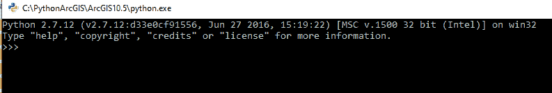
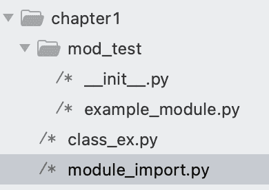

# 第二章：Python：入门

编程与计算机是人类最有意义同时也是最令人沮丧的努力之一。

这些回报可以以金钱的形式表现出来，正如我们今天看到的高科技薪资。但我认为，掌握编程最有意义的部分是把自己打造成一个能够轻松执行简单和复杂应用程序以及分析的计算机高手，能编写可重复使用的代码。

挫折会时有发生，但这是一件好事：你，像我以及无数人在你之前的人，将从每个错误中学习（或许当个吹毛求疵的人有帮助，但我自己并不是这样，所以不能确定）。你将通过本书中的每一个练习不断成长和学习，通过提问和密切关注，你可以避免一些常见问题。

无论你是 ArcGIS 专家还是新手，寻求拓展你的技能：恭喜你，你来对地方了。在本书中，你将学习如何利用一种看似简单的编程语言——Python，来提升你现有的 GIS 专业知识（或兴趣）并放大其潜力。

计算机编程是一个庞大的领域，当然无法在一章中完全概述。在这一章中，我将解释阅读、编写和运行 Python 脚本所必需的基本知识。我们将把 ArcGIS 工具放到后面的章节，专注于 Python：它的起源、现状、如何使用它，最重要的是，Python 是什么，它又不是什么。

我们将涵盖以下主题：

+   Python 基础

+   计算机编程基础

+   安装和导入模块

+   编写和执行脚本

## Python：独具一格

Python 编程语言的创造者 Guido Van Rossum 在 1980 年代末期对计算机编程的现状感到沮丧。当时的编程语言过于复杂，同时在格式要求上也过于宽松。这导致了大量的代码库和复杂的脚本，代码质量差且很少有文档记录。

仅仅运行一个简单的程序可能需要很长时间，因为代码需要进行类型检查（确保变量正确定义并分配给正确的数据类型）和编译（将文本文件中的高级代码转换为 CPU 能够理解的汇编语言或机器代码）。

作为一名荷兰程序员，他在 ABC 编程语言的专业工作中学到了很多关于语言设计的知识，完成该项目后，他决定将自己对 ABC 及其他语言局限性的看法转化为一种兴趣。

范·罗苏姆拥有阿姆斯特丹大学数学与计算机科学的硕士学位，他的兴趣偏向计算机，但他也热爱英国喜剧系列《Monty Python》。因此，他将自己的热情结合在一起，创造了 Python 语言，现在它被广泛应用于各种编程解决方案。如今，Python 无处不在，遍及互联网、家电、汽车等多个领域。由于其普及性和简洁性，它已被 GIS 软件生态系统采纳为标准编程工具。

## 为什么 Python 与众不同

由于范·罗苏姆在 1980 年代对计算机语言的广泛经验，他具备了创造一种解决许多语言缺陷的语言的能力。他从许多其他语言中借鉴了他欣赏的特性，并加入了一些自己的创新。以下是 Python 为改进其他语言所构建的一些特性：

| **问题** | **改进** | **Python 特性** |
| --- | --- | --- |
| 内存溢出 | 内建内存管理 | 垃圾回收和内存管理 |
| 慢编译时间 | 单行测试，动态类型 | Python 解释器 |
| 不清晰的错误信息 | 显示指示错误行和受影响代码的消息 | 错误追踪 |
| 意大利面式代码 | 清晰的导入和模块化 | 导入 |
| 不清晰的代码格式和间距使代码不可读 | 缩进规则和减少括号 | 强制空白 |
| 太多方式做同一件事 | 应该只有一种方式：Pythonic 的方式 | Python 之禅 |

### Python 版本

Python 的最初版本于 1991 年由范·罗苏姆发布，Python 1.0 及其后续版本，最终被广泛流行的 Python 2.x 所取代。发布时，特别注意确保版本 2.0 及之后版本与 Python 1.x 向后兼容。然而，对于新的 Python 3.0 及之后的版本，与 Python 1 和 Python 2 的向后兼容性被打破。

这一变化导致 Python 生态系统出现分歧。一些公司选择坚持使用 Python 2.x，这意味着旧版本的“退休”日期从 2015 年延长到 2020 年 4 月。现在，随着“退休”日期的到来，**Python 软件基金会**（**PSF**）不再对 Python 2.x 进行任何积极开发。Python 3.x 的开发仍在继续，并将由 PSF 监督，持续到未来。

范·罗苏姆曾担任 PSF（Python Software Foundation）终身慈善独裁者，直到 2018 年辞去该职务。

> 了解更多关于 Python 的历史：[`docs.python.org/3/faq/general.html`](https://docs.python.org/3/faq/general.html)

图 1：Python 3 与 Python 2 的分歧

#### ArcGIS Python 版本

自 ArcMap 9.x 版本以来，Python 已经集成到 ArcGIS 软件套件中。然而，ArcGIS Desktop 和 ArcGIS Pro 现在都依赖于不同版本的 Python。

#### ArcGIS Desktop：Python 2.x

ArcGIS Desktop（或 ArcMap）版本 9.0 及以上自带 Python 2.x。ArcGIS 的安装程序会自动安装 Python 2.x，并将`arcpy`模块（最初是`arcgisscripting`）添加到 Python 路径变量中，使其可以用于脚本编写。

ArcMap、ArcCatalog、ArcGIS Engine 和 ArcGIS Server 都依赖于安装 ArcGIS Desktop 或 Enterprise 软件时随附的 `arcpy` 和 Python 2.x 版本。

#### ArcGIS Pro：Python 3.x

ArcGIS Pro 是在宣布停用 Python 2.0 后设计的，它与 Python 2.x 生态系统脱钩，改为随附 Python 3.x。

与`arcpy`不同，ArcGIS Pro 使用 ArcGIS API for Python。

#### 管理两个版本

ArcGIS Desktop 的停用时间已延长至 2025 年 3 月，这意味着尽管 Python 软件基金会已正式停止对 Python 2.7 的支持，Esri 仍将在此日期之前将 Python 2.7 包含在内。

因此，我们将学习使用虚拟环境来管理版本，并且你将了解控制 Python 脚本执行版本的 PATH 和 PYTHONPATH 环境变量。

图片来源：[`media.geeksforgeeks.org/wp-content/uploads/20190502023317/TIMELINE.jpg`](https://media.geeksforgeeks.org/wp-content/uploads/20190502023317/TIMELINE.jpg)

### 什么是 Python？

简而言之，Python 是一个应用程序：`python.exe`。该应用程序本身也是一个可执行文件，这意味着它可以独立运行来解释代码，或者可以从其他应用程序中调用来运行自定义脚本。这种标准的互操作性是它被包括在 ArcGIS Pro 等应用程序中的原因之一。安装 ArcGIS 时，Python 也会随之安装在您的计算机上，并带有一系列支持文件和文件夹。

Python 包含大量的标准库工具或“模块”。这些包括对互联网请求、高级数学、CSV 读写、JSON 序列化等的支持，以及 Python 核心中包含的许多其他模块。尽管这些工具非常强大，但 Python 也被设计为可扩展的，这意味着可以轻松地将第三方模块添加到 Python 安装中。ArcGIS Python 模块就是扩展 Python 能力的一个很好的例子。还有成千上万的其他模块，涵盖了几乎所有类型的编程需求，质量各异。

Python 是用编程语言 C 编写的。为了各种技术原因，Python 有一些用其他语言编写的变体，但大多数 Python 实现都是建立在 C 之上的。这意味着 Python 通常通过构建在 C 代码之上的模块来扩展，通常是为了提高速度。一个 Python 代码“层”或“包装器”被放置在 C 代码之上，使其能够与普通的 Python 包兼容，从而获得 Python 的简洁性和预编译 C 代码带来的处理速度提升。NumPy 和 SciPy 就是这种模块的例子，并且它们随 ArcGIS 安装的 Python 一同提供。

Python 是免费的开源软件，这也是它被打包到许多其他软件应用程序中用于自动化目的的原因之一。Python 也可以单独安装，通过 Python 软件基金会提供的免费安装程序。

> 在互联网上查看 Python 软件基金会：[`www.python.org/psf`](https://www.python.org/psf)
> 
> > 从 PSF 直接下载 Python 版本：[`www.python.org/downloads/`](https://www.python.org/downloads/)

#### 它安装在哪里？


在 Windows 机器上，Python 默认不包含——它必须与 ArcGIS 一起安装，或者通过 Python 软件基金会的安装程序单独安装。运行 ArcGIS 安装程序后，你将在 `C:\ drive` 下看到一个文件夹。你可以设置自定义位置或使用默认位置。

### Python 解释器

当你通过双击 `python.exe` 启动它时（下面将介绍多种其他运行可执行文件的方法），它将启动所谓的 Python 解释器。

这是一个有用的接口，允许你一次输入一行代码进行测试和确认。输入完一行后，按 Enter/Return 键，代码将被执行。这个工具帮助你在同一个环境中学习编码和测试代码。

##### 启动解释器

双击文件夹中的 `python.exe` 或从开始菜单启动 Python（命令行），将启动解释器，允许执行单行命令：



### Python 3 非常相似：


#### 什么是 Python 脚本？

`python.exe` 可执行文件不仅是一个可以运行代码的程序，还可以执行 Python 脚本。这些脚本是可以由任何文本编辑软件编辑的简单文本文件。Python 脚本的文件扩展名为 `.py`。

当“运行”一个 Python 脚本时，它会作为第一个命令行参数传递给 Python 可执行文件（`python.exe`）。此程序将从上到下读取并执行代码，只要它是有效的 Python 代码并且没有错误。如果遇到错误，脚本将停止并返回错误信息。如果没有错误，除非你添加了“`print`”语句来在脚本运行时从主循环返回消息，否则不会返回任何内容。

在这个例子中，脚本通过“传递”脚本作为参数给可执行文件（`python.exe`）执行，且明确使用完整的文件夹路径调用 `python.exe` 文件，以避免路径问题：

```py
C:\Projects>C:\PythonArcGIS\ArcGIS10.5\python.exe chapter1.py
```

在这个例子中，脚本通过“传递”脚本作为参数给可执行文件执行，并可选择接受脚本本身在运行前的可选参数：

```py
C:\Projects>C:\PythonArcGIS\ArcGIS10.5\python.exe chapter1.py arg1 arg2
```

### 包含的版本

Python 附带了两个版本的 `python.exe` 文件。为了澄清，它们是相同版本的 Python，但每个文件的角色不同。python.exe 是主文件，另一个版本是 pythonw.exe。双击 pythonw.exe 不会启动解释器，这与正常的 python.exe 不同。pythonw.exe 没有解释器，它的作用是以比 `python.exe` 更“安静”的方式执行脚本。要启动解释器，请使用 python.exe。


#### 如何调用可执行文件

访问 Python “可执行文件” (`python.exe`) 以运行 Python 解释器或运行自定义 Python 脚本。启动 Python 可执行文件有许多不同的方法：


+   双击 python.exe

    +   启动 Python 解释器

+   打开 IDLE，随附的集成开发环境（IDE）

    +   在 Windows 中的 ArcGIS 文件夹内，你应该能在开始菜单找到它。

+   打开 CMD 终端并键入“python”

    +   只有当 Python 可执行文件位于 PATH 环境变量中时才有效

+   使用第三方 IDE，如 PyCharm

    +   每个 PyCharm 项目可以有自己的虚拟环境，因此也有自己的可执行文件，或者它可以使用 Esri 在安装 ArcGIS 时安装的那个。

    +   有很多 IDE，但我推荐 PyCharm，原因有很多。

+   使用 Jupyter Notebook，本书中将对此进行详细讨论。

    +   这需要安装 Jupyter，而 Jupyter 并不包含在标准 Python 安装包中。

+   在 ArcGIS Desktop 或 ArcGIS Pro 内部

    +   有一些菜单按钮可以让你在 ArcMap、ArcCatalog 或 ArcGIS Pro 内部启动 Python 解释器窗口。

    +   一行一行地运行代码，或通过右键菜单中的加载脚本命令运行代码。

### IDLE 开发环境


随附的 IDE，称为 IDLE，是一个有用的环境，标准配置每个 Python 实例时都会包含它。IDLE 对于 Python 解释器很有用，但也因为你可以通过从文件菜单打开新脚本，然后使用脚本的运行菜单来轻松创建和执行脚本。


#### Path 环境变量

在 Windows 上，有一个系统环境变量被称为 Windows Path 环境变量。这个变量对机器上安装的所有应用程序可用。其他程序将其用于不同的目的，但对 Python 来说，它用于查找所有可用的 Python 可执行文件和模块。

理解这一点很重要，因为你有可能在电脑上安装多个 Python 版本，或者只安装一次 ArcGIS Desktop 或 ArcGIS Pro 后便会出现多个版本。

如果在 CMD 窗口中使用 "`python script.py`" 命令运行脚本（将脚本作为参数传递给 Python），并且脚本中包含导入语句，那么有三件事必须发生。

首先，Windows 会在 Path 中查找名为 python.exe 的可执行文件。如果找到了，它会确认脚本是否有效。如果有效，Python 会运行该脚本，并且会检查 Path 环境变量，以查找允许导入所有模块的路径。

所以，Python 可执行文件不能仅通过名称运行（而不是文件位置），直到`python.exe`被添加到 Path 中。以下是如何编辑 Path 变量：

打开**控制面板**中的**高级系统设置**：


### 定位并双击 Path 变量（或者在选中时按编辑）：


在界面中为 Path 环境变量添加新的一行。如果你有多个版本的 Python，并且没有使用虚拟环境，确保按正确的顺序排列 Path 中的文件夹，这样当你在 CMD 窗口中输入“`python`”时，会调用正确版本的 Python：


如果你没有权限编辑 Path 变量，仍然可以通过使用可执行文件的完整路径来在命令行中运行 Python：`C:\ArcGIS10.8\Python\python.exe script.py`

**操作系统和 Python 系统模块**

需要首先提到两个内置的模块（代码库）。`os`模块和`sys`模块，也称为操作系统模块（`os`）和 Python 系统模块（`sys`），分别用于控制 Windows 系统操作和 Python 系统操作。

##### OS 模块

`os`模块用于许多操作，包括文件夹路径操作，如创建文件夹、删除文件夹、检查文件夹或文件是否存在，或者使用操作系统关联的应用程序来执行文件扩展名相关的文件。获取当前目录、复制文件等操作也可以通过这个模块实现。

在这个例子中，一个字符串被传递给`os.path.exists`方法，该方法返回布尔值。如果返回 False，表示文件夹不存在，然后使用`os.mkdir`方法创建该文件夹：

```py
import os
folderpath = "C:\Test_folder"
if not os.path.exists(folderpath):
   os.mkdir(folderpath)
```

> 了解 os 模块的更多信息，请访问：[`www.geeksforgeeks.org/os-module-python-examples/`](https://www.geeksforgeeks.org/os-module-python-examples/)

#### sys 模块接受参数

sys 模块允许你在脚本运行时接受参数，也就是说，在脚本执行时。可以通过使用`sys.argv`方法来实现，该方法是一个列表，包含了在执行脚本时传递给 Python 的所有参数。

```py
If a name variable is using the sys module to accept parameters, here is what the script looks like:
import sys
name = sys.argv[1]
print(name)
```

#### 系统路径

sys 模块包含 Python 路径或系统路径（这里的系统指的是 Python）。这是一个列表，Python 用它来在访问 Windows 路径后查找可导入的模块。如果你无法像上面解释的那样编辑 Windows 路径（通常是由于权限问题），你可以在运行时通过系统路径修改 Python 路径。

`sys.path`列表是 Python 内置的`sys`模块的一部分：


> 了解更多关于 sys 模块的信息，请访问：[`www.geeksforgeeks.org/python-sys-module/`](https://www.geeksforgeeks.org/python-sys-module/)

## 编程基础

计算机编程在不同语言的实现方式上各不相同，但这些语言在其内部逻辑如何工作的方面有显著的相似之处。这些编程基础适用于所有编程语言，具体的代码实现以 Python 为例。

##### 关键概念

| 变量 | 分配给 Python 任何数据类型对象的名称。变量名必须以字母开头。推荐使用下划线。 |
| --- | --- |

```py
x=0
y=1
xy = x+y
xy_str = str(xy)
```

|

| 迭代 | For 循环用于遍历可迭代数据对象（例如列表）。While 循环用于在满足条件之前不断循环。 |
| --- | --- |

```py
for item in datalist:
    print(item)
x=0
while x < 1:
    x+=1
```

|

| 条件语句 | If/Elif/Else 语句用于判断一个对象是否满足某个条件。 |
| --- | --- |

```py
list_var = [1,’1’,1.0]
for item in list_var:
  if type(item) == type(0):
    print(‘Integer’)
  elif type(item) == type(‘a’):
    print(‘String’)
  else:
    print(‘Float’) 
```

|

| 从零开始的索引 | 数据容器通过从 0 开始的索引来访问。索引通过方括号[]传递给列表或元组。字符串字符也可以使用相同的模式访问。 |
| --- | --- |

```py
list_var = [‘s’,’m’,’t’]
m_var = list_var[0]

name_var = “logan”
g_var = name_var[0]
```

|

| 数据类型 | 字符串用于文本。整数用于整数。浮动数用于浮动点数字。数据容器，如列表、元组和字典，广泛用于组织数据。 |
| --- | --- |

```py
Str_var = “string”
int_var = 4
float_var = 5.7
list_var = [45,43,24]
tuple_var = (87.’a’,34)
dict_var = {‘key’:’value’}
```

|

| 代码注释 | 在代码中使用注释是受到鼓励的。注释有助于向其他读者和自己解释你的思路。注释通过使用“#”符号创建。注释可以单独占一行，也可以添加在语句的末尾，因为#符号后面的内容会被忽略。 |
| --- | --- |

```py
# This is a comment
x = 0 #also a comment
```

|

| 错误 | Python 内置了许多类型的错误信息。错误追踪会显示受影响的代码行和错误类型。它并不完美。 |
| --- | --- |

```py
>>> str_var = 'red"
  File "<stdin>", line 1
    str_var = 'red"
                  ^
SyntaxError: EOL while scanning string literal
```

|

| 计数器/枚举器 | 使用变量跟踪 for 循环或 while 循环执行的次数是一个好主意。一些语言（包括 Python）具有一些内置的枚举功能。计数器在增加后会重新赋值给自己。在 Python 中，快捷方式“x += y”与“x = x + y”是等价的。 |
| --- | --- |

```py
counter = 0
list_var = [34,54,23,54]
for item in list_var:
    print(item, counter)
    counter += 1 
```

|

### 变量

变量用于将对象分配给标签或标识符。它们用于跟踪数据片段、组织数据在脚本中的流动，并帮助程序员阅读脚本。

```py
variable = 1 # a variable assignment
```

我建议（由我）使用描述性的变量，既不太长也不太短。当变量名太短时，阅读时可能会产生混淆。当变量名太长时，写起来可能会令人困惑。在变量中使用下划线分隔单词是一种常见的做法。

##### 赋值与等于（值比较）

在 Python 中，变量通过等号“=”赋值给对象。这意味着还有另一种方法可以检查一个值是否等于另一个值：使用双等号“==”。

```py
variable = 1 # a variable assignment
variable == 1 # a comparison (that is True)
```

##### 变量格式化规则

变量必须以字母开头，不能以数字或其他符号开头，否则会发生语法错误。不过，数字和下划线可以用在变量名中。

```py
>>> 2var = 34
  File "<stdin>", line 1
    2var = 34
     ^
SyntaxError: invalid syntax
>>> two_var = 34
>>> two_var
34
```

> 阅读更多关于变量的内容：[`realpython.com/python-variables/`](https://realpython.com/python-variables/)

### **迭代**

计算机编程的核心是`迭代`：递归地执行相同的操作、分析、函数调用或你所编写脚本要处理的任何任务。计算机擅长这种类型的任务：它们可以快速遍历数据集，在数据集中的每个数据项上执行你认为必要的操作。

#### **for 循环**

“for 循环”是一种迭代实现方式，当提供数据列表时，它会对列表中的每个成员执行某个操作。

在这个例子中，一个整数列表被赋值给变量名 `data_list`。然后，使用格式“`for {var} in {iterable}`”构建一个 `for` 循环，其中 `{var}` 是一个变量名，它会被分配给列表中的每个对象，随着循环的进行，逐一处理。一个常见的约定是使用“`item`”，但它可以是任何有效的变量：

```py
data_list = [45,56,34,12,2]
for item in data_list:
    print (item * 2)
90
112
68
24
4
```

#### **while 循环**

“while 循环”是一种迭代实现方式，直到满足特定条件时才会停止。`while` 循环可能会很危险，因为如果条件永远不满足，它会导致脚本进入无限循环。

在这个例子中，`while` 循环将执行（除了将 1 加到 x 上直到它达到 100，达到阈值时 `while` 循环结束）。

```py
x = 0
while x < 100:
    x = x + 1   #same as x += 1
```

> 阅读更多关于循环的内容：[`www.geeksforgeeks.org/loops-in-python/`](https://www.geeksforgeeks.org/loops-in-python/)

### **计数器和枚举器**

在 `for` 循环或 `while` 循环中的迭代通常需要使用计数器（也称为枚举器）来跟踪循环的迭代次数。

`for` 循环可以通过将迭代器传递给 `enumerate` 函数并在项目变量前面使用一个计数变量（可以是任何有效的变量名，但 `count` 是一个逻辑选择）来使用该函数。计数变量会跟踪循环，从索引零开始：

```py
>>> data_list = ['a','b','c','d','e']
>>> for count,item in enumerate(data_list):
...     print(count, item)
... 
0 a
1 b
2 c
3 d
4 e
```

在 Python 中，快捷方式“`x += y`”用于增加 x 的值，同时保持相同的变量名，这与“`x = x + y`”是等效的：

```py
>>> x = 0
>>> while x <100:
...    x = x + 1
>>> x
100
>>> x = 0
>>> while x <100:
...    x += 1
>>> x
100
```

### **条件语句**

`if` 语句、`elif` 语句（即 else if 的缩写）和 `else` 语句用于创建条件，用来评估数据对象。`if` 语句可以单独使用（`elif` 和 `else` 是可选的），通过声明 `if` 关键字，然后写出数据必须满足的条件：

```py
list_var = [1,’1’,1.0]
for item in list_var:
  if type(item) == type(0):
    print(‘Integer’)
  elif type(item) == type(‘a’):
    print(‘String’)
  else:
    print(‘Float’) 
```

> 阅读更多关于条件语句的内容：[`realpython.com/python-conditional-statements/`](https://realpython.com/python-conditional-statements/)

### **if 与 else**

If 语句通常特定于一个条件，而 Else 语句作为“兜底”语句，确保任何通过 If 语句的数据都有某种方式被处理，即使它不满足 If 语句的条件。Elif 语句依赖于 If 语句的存在，并且也是条件特定的，不是兜底语句。

### 列表位置（或者为什么程序员从 0 开始计数）

迭代发生在包含数据的列表上。在列表中，这些数据通过列表顺序或位置来区分。列表中的项目是通过项目索引来获取的，即数据在列表中的（当前）位置。

##### 从零开始的索引

在 Python 中，与大多数计算机编程语言一样，列表中的第一个项位于索引 0，而不是索引 1。

这对初学者来说有点混淆，但这是编程的标准。检索从 0 开始的列表中的项比从 1 开始的列表更高效，且这种标准在 C 语言及其前身中形成，这也意味着 Python（用 C 编写）使用零索引。

##### 使用索引位置提取数据

这是从列表中检索数据的基本格式。这个字符串列表有一个顺序，其中字符串“Bill”是第二个元素，意味着它位于索引 1。要将这个字符串赋值给变量，我们将索引传递给方括号：

```py
names = [“Silas”, “Bill”, ”Dara”]
name_bill = names[1]
```

##### 使用反向索引位置提取数据

这是从列表中提取数据的第二种格式。可以反向使用列表顺序，意味着索引从列表的最后一个成员开始，向后计数。使用负数来表示，从 -1 开始，这是列表最后一个成员的索引，-2 是倒数第二个成员的索引，依此类推。这意味着在使用反向索引位置时，“Bill”字符串位于索引 -2，因此必须将 -2 传递给列表的方括号：

```py
names = [“Silas”, “Bill”, ”Dara”]
name_bill = names[-2]
```

> 在这里阅读更多关于索引的内容：[`realpython.com/lessons/indexing-and-slicing/`](https://realpython.com/lessons/indexing-and-slicing/)

### 数据类型

变量的数据类型决定了它的行为。例如，字符 5 可以是整数类型（5）、浮点类型（5.0）或字符串类型（“5”）。每种版本的 5 都有不同的可用工具，比如字符串的 `replace` 方法，可以将字符串中的字符替换为其他字符。

##### 关键数据类型

| **数据类型** | **Python 数据类型对象** |
| --- | --- |
| 文本数据以字符串数据类型存储 | `str` |
| 数字数据以整数、浮点数或复数类型存储 | `int` ,  `float` ,  `complex` |
| 序列数据（列表或数组）可以存储为列表或元组。Range 是一种特殊的生成器 | `list` ,  `tuple` ,  `range` |
| 映射或键值对数据类型也被称为字典类型 | `dict` |
| 集合是一种包含唯一、不变对象的数据类型 | `set` ,  `frozenset` |
| 布尔值是 True 或 False，1 或 0 | `bool` |
| 二进制数据类型用于以二进制模式访问数据文件。 | `bytes`， `bytearray`， `memoryview` |

### 检查数据类型

### 要检查 Python 变量的数据类型，请使用`type()`函数：

```py
>>> x = 0
>>> type(x)
<class ‘int’>
```

#### 字符串

所有文本数据在 Python 中都表示为 String 数据类型。这些称为**字符串**。常见的存储为字符串的数据包括姓名、地址，甚至整篇博客文章。

字符串也可以在代码中进行模板化，以允许“填空”的字符串，直到脚本运行时才设定。字符串技术上是不可变的，但可以使用 Python 内置的字符串工具和独立的 String 模块进行操作。

##### 关键概念

| 引号 | 单引号或双引号都可以用来表示字符串，只要开头和结尾的引号一致。三重引号用于多行字符串。在字符串*内部*的引号可以使用与开头和结尾不同的引号表示。 |
| --- | --- |
| 字符串相加 | 字符串可以“相加”在一起形成更大的字符串。字符串也可以通过一个整数“乘法”来重复字符串 X 次。 |
| 字符串格式化 | 可以在代码中使用字符串模板或占位符，并在运行时用所需的数据填充。 |
| 字符串操作 | 可以使用内置功能对字符串进行操作。可以替换或定位字符。可以分割或连接字符串。 |

##### 引号

字符串必须被引号包围。在 Python 中，这些引号可以是单引号或双引号，但必须一致。如果单引号用于开始字符串，那么单引号也必须用于结束字符串：

```py
>>> string_var = 'the red fox"
  File "<stdin>", line 1
    string_var = 'the red fox"
                             ^
SyntaxError: EOL while scanning string literal
>>> string_var = 'the red fox'
>>> string_var
'the red fox'
```

##### 多行字符串

多行字符串通过在字符串开头和结尾分别配对三个单引号或双引号来创建。

在这个例子中，变量`string_var`是一个多行字符串（“`\n`”是一个代表新行的 Python 字符）：

```py
>>> string_var = """the red fox chased the
... dog across the yard"""
>>> string_var
'the red fox chased the\ndog across the yard'
```

##### 字符串相加（及更多）

字符串可以“相加”在一起，创建一个新的字符串。这个过程允许你从小字符串构建字符串，这对于填充数据文件中的其他字段组成的新字段或其他任务非常有用。

在这个例子中，字符串“forest”被赋值给`string_var`。然后，另一个字符串被添加到 string_var 中，创建一个更长的字符串。

```py
>>> string_var = "forest"
>>> string_var += " path" #same as string_var = string_var+ “ path”
>>> string_var
'forest path'
```

##### 字符串格式化

代码中的字符串经常使用“占位符”来表示稍后将填充的数据。这被称为字符串格式化，并且有多种方式可以使用 Python 执行字符串格式化。

##### 关键概念

| 格式化函数 | 所有字符串都有一个内置的函数叫做 format，允许传入参数。它接受所有数据类型，并根据模板格式化字符串。 |
| --- | --- |
| 字符串字面量 | 对于 Python 3.6+，有一个新的工具叫做字符串字面量，它允许你直接在字符串中插入变量。在字符串前面加上一个“f”。 |
| 数据类型字符串操作符 | 一个较旧但仍然有用的工具是字符串操作符，它们在字符串中作为占位符，用于表示特定的数据类型（可以是字符串、浮动点数或整数）。 |

#### 字符串格式化函数

这种格式化方法是 Python 3 推荐的形式（在 Python 2.7 中也可用）。它允许你将变量传递给`format`函数（该函数内建于所有字符串中），并让它们填充字符串中的占位符。任何数据类型都可以传递给`format`函数。

在这个例子中，字符串模板通过`format`字符串函数填充了其他变量中的详细信息。占位符按照变量列出的顺序进行填充，因此它们必须按照正确的顺序排列。大括号是占位符，`format`函数将接受参数并填充字符串：

```py
>>> year = 1980
>>> day = "Monday"
>>> month = "Feb"
>>> template = "It was a cold {} in {} {}"
>>> template.format(day, month, year)
'It was a cold Monday in Feb 1980'
```

在这个例子中，占位符已命名，并以关键字参数的格式传递给`format`函数。参数是命名的，因此在`format`函数中不需要按照顺序排列：

```py
>>> template = 'It was a cold {day} in {month} {year}'
>>> template.format(month=month,year=year,day=day)
'It was a cold Monday in Feb 1980'
```

在这个例子中，占位符是按编号排列的，这使得重复字符串变得更容易：

```py
>>> template = "{0},{0} oh no,{1} gotta go"
>>> template.format("Louie", "Me")
'Louie,Louie oh no,Me gotta go'
```

##### 字符串字面量

Python 3.6（及更高版本）新增了一种字符串格式化方法，称为格式化字符串字面量。通过在字符串前加上“`f`”，占位符变量可以通过变量来填充，而无需使用`format`函数。

在这个例子中，变量直接格式化到字符串字面量中，字符串前加上“`f`”以表示它是一个字符串字面量：

```py
>>> year = 1980
>>> day = "Monday"
>>> month = "Feb"
>>> str_lit = f"It was a cold {day} in {month} {year}"
>>> str_lit
'It was a cold Monday in Feb 1980'
```

> 了解更多关于字符串格式化的信息，请访问：[`realpython.com/python-string-formatting/`](https://realpython.com/python-string-formatting/)

##### 字符串操作

字符串操作是常见的，许多工具已内建于字符串数据类型中。它们允许你替换字符串中的字符或查找字符在字符串中的索引位置。

find 和 index 是类似的方法，但 find 可以用于条件语句。如果字符串中找不到字符，find 将返回-1，而 index 将返回错误。

join 方法用于将一个字符串数据列表连接在一起。split 方法是其反向操作：它根据提供的字符或默认的空格将一个字符串分割成一个列表。

| **方法** | **示例** |
| --- | --- |
| join |

```py
string_list = [‘101 N Main St’,’Eureka’,’Illinois 60133’]
address = ‘, ’.join(string_list)
```

|

| replace |
| --- |

```py
address = ‘101 N Main St’.replace(“St”,”Street”)
```

|

| find, rfind |
| --- |

```py
str_var = ‘rare’
str_index = str_var.find(‘a’) #index 1
str_index = str_var.find(‘r’) #index 0
str_index = str_var.rfind(‘r’) #index 2
```

|

| upper, lower, title |
| --- |

```py
name = “Laura”
name_upper = name.upper()
name_lower = name.lower()
name_title = name_lower.title()
```

|

| index, rindex |
| --- |

```py
str_var = ‘rare’
str_index = str_var.index(‘a’) #index 1
str_index = str_var.index(‘r’) #index 0
str_index = str_var.rindex(‘r’) #index 2
str_var.index(‘t’) #this will cause an error
```

|

| split |
| --- |

```py
latitude,longitude = “45.123,-95.321”.split(“,”)
address_split = ‘101 N Main St’.split()
```

|

##### 字符串索引

字符串索引类似于列表索引，如上所述。可以通过将需要的字符的索引传递给字符串并用方括号括起来，从字符串中选择单个字符或字符组。

在这个例子中，字符串“`readiness`”中的“`d`”是通过将索引[3]传递给字符串旁的方括号来访问的：

```py
>>> str_var = "readiness"
>>> d_var = str_var[3]
>>> d_var 
'd'
```

通过传递起始和结束索引，可以选择一组字符，其中结束索引是你不想包含的第一个字符的索引：

```py
>>> str_var = "readiness"
>>> din_var = str_var[3:6]. #index 6 is e
>>> din_var
'din'
>>> dine_var = str_var[3:7]. #index 7 is s
>>> dine_var
'dine'
```

#### 整数

整数数据类型表示整数。它可以用于执行加法、减法、乘法和除法（但有一个需要注意的例外，见下文）。

```py
>>> int_var = 50
>>> int_var * 5
250
>>> int_var / 5
10.0
>>> int_var ** 2
2500
```

##### 将字符串转换为整数

要将字符串（或浮点数）转换为整数，请使用`int`函数：

```py
>>> x = '0'
>>> y = int(x)
>>> y
0
>>> type(y)
<type 'int'>
>>> type(x)
<type 'str'>
```

##### Python 2 中的整数运算问题

Python 2 中一个著名且有意为之的设计问题是整数除法问题。这意味着，使用整数进行除法运算时，结果通常会是没有余数的（通常是）不希望看到的结果。建议在进行除法操作前将整数转换为浮点数。

这是该问题的一个示例：

```py
Python 2.7.16 (default, Dec 21 2020, 23:00:36) 
>>> 5/3
1
```

这个问题在 Python 3 中已被修复：

```py
Python 3.8.2 (default, Apr  8 2021, 23:19:18) 
>>> 5/3
1.6666666666666667
```

> 了解更多关于 Python 中整数的内容，请访问：[`realpython.com/python-numbers/`](https://realpython.com/python-numbers/)

#### 浮动数字

在 Python 中，浮点数用于表示实数，作为 64 位双精度值。有时使用二进制系统表示基于十进制的数字可能有些奇怪，所以需要留意，但通常它们会按预期工作。

```py
>>> x = 5.0
>>> x * 5
25.0
>>> x ** 5
3125.0
>>> x/2.3
2.173913043478261
```

##### 将字符串转换为浮点数

要将字符串（或整数）转换为浮点数，请使用`float`函数：

```py
>>> x = '5'
>>> y = float(x)
>>> type(y)
<type 'float'>
```

> 了解更多关于 Python 中浮点数的信息，请访问：[`www.geeksforgeeks.org/python-float-type-and-its-methods`](https://www.geeksforgeeks.org/python-float-type-and-its-methods)

### 数据类型之间的转换

在 Python 中，数据类型之间的转换是可能的，使用标准库中的内置函数。首先，`type`函数对查找对象的数据类型很有帮助。一旦确定了数据类型，数据对象可以从整数（`int`函数）转换为字符串（`str`函数）再到浮点数（`float`函数），只要该字符在该数据类型中是有效的。

### 在这些示例中，使用`int`、`str`和`float`函数将字符从字符串转换为整数、浮点数再转换回字符串：

```py
>>> str_var = "5"
>>> int_var = int(str_var)
>>> int_var
5
>>> float_var = float(int_var)
>>> float_var
5.0
>>> str_var = str(float_var)
>>> type(str_var)
'<class 'str'>'
```

### 数据结构或容器

数据结构，也称为数据容器和数据集合，是可以按可检索顺序存储任何数据项的特殊数据类型，这些数据项可以是任何数据类型（包括其他数据容器）。数据容器用于通过索引（在元组或列表中）或键值对（在字典中）组织数据项。

#### l 从数据容器中检索数据

要从数据容器中提取数据，可以使用方括号来传递索引（列表和元组）或键（字典）。如果有多个级别的数据容器（即一个容器包含另一个容器），首先使用第一个方括号中的索引或键来引用内部的数据容器，然后使用第二个方括号来访问容器中的数据。

| **数据容器** | **示例** |
| --- | --- |
| 元组 |

```py
tuple_var = (“blue”, 32,[5,7,2],’plod’,{‘name’:’magnus’})
plod_var = tuple_var[-2]
magnus_var = tuple_var[-1][‘name’]
```

|

| 列表 |
| --- |

```py
list_var = [‘fast’,’times’,89,4.5,(3,8),{‘we’:’believe’}]
times_var = list_var[1]
```

|

| 字典 |
| --- |

```py
dict_var = list_var[-1]
believe_var = list_var[-1][‘we’]
```

|

#### 元组

元组是有序的列表，可以存放任何类型的数据，甚至是同一元组中不同类型的数据。元组是不可变的，这意味着它们不能被修改，并且一旦创建，数据不能添加或删除。元组有长度，可以使用内置的 `len` 函数获取元组的长度。

在 Python 中，元组是通过使用圆括号 () 或 `tuple` 函数来声明的。数据通过零基索引访问，方法是将索引传递给紧邻元组的方括号。

在这个例子中，一个元组被赋值给变量名 `tuple_var`，并通过索引访问数据：

```py
>>> tuple_var = ("red",45,"left")
>>> type(tuple_var)
<class 'tuple'>
>>> ("red",45,"left")[0]
'red'
>>> tuple_var[0]
'red'
```

> 阅读更多关于元组的信息，点击这里：[`www.geeksforgeeks.org/python-tuples/`](https://www.geeksforgeeks.org/python-tuples/)

#### 列表

列表（在其他编程语言中通常称为数组）是数据容器，可以存放任何类型的数据，甚至可以在同一个列表中存放不同类型的数据，这意味着它们不必只有一种数据类型。列表在创建后可以被修改。在 Python 中，可以通过使用方括号 [] 或 `list` 函数来声明列表。数据通过零基索引访问，方法是将索引传递给紧邻列表的方括号。

在这个例子中，一个列表被赋值给变量名 `list_var`，并通过索引访问数据：

```py
>>> list_var = ["blue",42,"right"]
>>> type(list_var)
<class 'list'>
>>> ["blue",42,"right"][0]
'blue'
>>> list_var[0]
'blue'
```

> 阅读更多关于列表的信息，点击这里：[`www.geeksforgeeks.org/python-list/`](https://www.geeksforgeeks.org/python-list/)

##### 在列表和元组之间转换

列表可以通过使用 `tuple` 函数复制到一个新的元组对象中。反过来，元组可以通过 `list` 函数复制到一个列表数据类型中。从技术上讲，这并没有转换原始数据项，而是创建了数据项在新数据类型中的副本。

在这个例子中，列表被复制到一个元组数据类型中，然后元组被复制到一个列表数据类型中。注意，每创建一个新数据类型，方括号会发生变化：

```py
 >>> tuple_copy = tuple(list_var)
>>> tuple_copy
('blue', 42, 'right', 'ankle')
>>> list_copy = list(tuple_copy)
>>> list_copy
['blue', 42, 'right', 'ankle']
```

##### 列表和元组的操作

列表和元组都可以通过 `for` 循环进行迭代。它们也可以被“切片”，从而创建列表或元组的一个子集，该子集将用于 `for` 循环或其他操作。

##### 切片

对列表或元组进行切片会创建一个新的列表或元组。切片是通过将索引传递给列表或元组，方括号中用冒号分隔的方式创建的。第一个索引是起始索引，如果是索引 0（即原始列表的开始），可以忽略不写。第二个索引是你**不**想包含的第一个值的索引（如果是原始列表的其余部分，可以为空）。

```py
In this example we see a tuple with three data items sliced to only include the first two items. The string “left” is at index 2 in the tuple, meaning that the last index in the slice will be 2\. The slice is assigned to variable name tuple_slice: 
>>> tuple_var = ("red",45,"left")
>>> tuple_slice = tuple_var[:2]
>>> tuple_slice
('red', 45)
```

在这个例子中，我们看到一个包含四个数据项的列表，通过切片操作仅包含最后两个项。第一个索引是我们想要的第一个数据项的索引（字符串 "`right`"）。最后一个索引为空：

```py
>>> list_var = ["blue",42,"right","ankle"]
>>> list_slice = list_var[2:]
>>> list_slice
['right', 'ankle']
```

##### 仅限列表的操作

列表可以通过 `append` 方法添加单个数据项，或者通过 `extend` 方法扩展（将一个列表或元组中的所有数据项添加到主列表）。列表顺序可以被反转或排序。内建函数允许计算列表的最大值或最小值，甚至是列表的总和（前提是列表中数据项的类型正确）。

#### 集合

集合表示一组独特的对象。在 Python 中，集合是无序的，不允许重复，并且集合中的所有数据项必须是不可变的。

##### 集合操作

集合特别适用于获取列表中所有不同的成员。它们不能通过索引访问（因为是无序的），但是可以进行迭代：

```py
>>> orig_list = ["blue","pink","yellow","red","blue","yellow" ]
>>> set_var = set(orig_list)
>>> set_var
{'pink', 'yellow', 'blue', 'red'}
>>> set_var[0]
Traceback (most recent call last):
  File "<stdin>", line 1, in <module>
TypeError: 'set' object is not subscriptable
>>> for item in set_var:
...     print(item)
... 
pink
yellow
blue
red
```

#### 字典

字典是键值对存储，意味着它们是使用无序的键值对来组织数据的数据容器。键被用作组织和检索的参考点。当通过方括号提供键时，会返回对应的值。

```py
>>> dict_var = {"key":"value"}
>>> dict_var['key']
'value'
>>> dict_var = {"address":"123 Main St", "color":"blue"}
>>> dict_var["address"]
'123 Main St'
>>> dict_var["color"]
'blue'
```

> 在 Python 中阅读更多关于字典的内容：[`www.geeksforgeeks.org/python-dictionary/`](https://www.geeksforgeeks.org/python-dictionary/)

#### 键和值

键可以是任何不可变的数据类型（这意味着列表不能用作键，但字符串、整数、浮点数和元组可以用作键）。值可以是任何类型的数据，包括其他字典。

可以使用字典的 `keys` 函数将字典中的所有键作为列表进行访问。在 Python 2.x 中，这是一个列表；在 Python 3.x 中，这是一个生成器。

可以使用字典的 `values` 函数将字典中的所有值作为列表进行访问。在 Python 2.x 中，这是一个列表；在 Python 3.x 中，这是一个生成器。

### 函数

函数是由代码定义的子程序。当“调用”或运行时，函数会执行某些操作（如果写成这样的话，也可以什么都不做）。函数通常接受参数，且这些参数可以是必需的或可选的。

函数使得反复执行相同的操作变得容易，而无需反复编写相同的代码。这使得代码更加简洁、短小且智能。它们是一个好主意，应该经常使用。

> 在这里阅读更多关于函数的内容：[`realpython.com/defining-your-own-python-function/`](https://realpython.com/defining-your-own-python-function/)

##### `def` 关键字

函数使用 `def` 关键字定义，`def` 是“定义函数”的缩写。编写该关键字后，紧接着是函数名和圆括号 `()`，其中可以定义期望的参数。

##### 返回语句

函数允许通过 `return` 语句将数据从子程序返回到主循环。这些语句使得用户可以在函数中计算一个值或执行某些操作，然后将该值返回给主循环。

##### 参数

参数或论据是函数期望的值，并由代码在运行时提供。

##### 命名空间

在 Python 中，有一个叫做命名空间的概念。这些命名空间细分为两种类型：全局命名空间和局部命名空间。

脚本的主部分（函数外）中定义的所有变量都被认为是在全局命名空间中。在函数内部，变量有不同的“命名空间”，这意味着函数内部的变量位于`局部` `命名空间`中，它们与主脚本中的全局变量不同。如果函数内的变量名与函数外的变量名相同，改变函数内的值（在局部命名空间中）不会影响函数外的变量（在全局命名空间中）。

##### 函数示例

在这个示例中，定义了一个函数，每次调用时返回“hello world”。没有参数，但使用了`return`关键字：

```py
def new_function():
    return "hello world"
```

在这个示例中，一个预期的参数在括号中定义。调用时，提供该值，函数会将局部命名空间中的值返回到主循环中的全局命名空间：

```py
def accept_param(value):
    return value
```

在这个示例中，一个预期的参数有一个默认值，这意味着只有在函数使用非默认参数时才需要提供该参数：

```py
def accept_param(value=12):
    return value
```

##### 文档字符串

函数允许在定义行后添加一个字符串，用于声明该函数的用途，以便于文档化。

```py
def accept_param(value=12):
    'this function accepts a parameter if different from default'
    return value
```

### 类

类是组织多个变量和函数的特殊代码块，它们将这些内容整合成一个具有自身方法和函数的对象。类使得创建可以引用相同内部数据列表和函数的代码工具变得容易。类内部的函数和变量可以相互通信，从而使得在类的某一部分定义的变量可以在另一部分中使用。

类使用“self”这一概念来允许类的不同部分进行通信。通过将 self 作为参数引入类中的每个函数，数据可以被调用。

类是通过“实例化”来创建类对象的。这意味着类定义有点像该类的工厂，当你需要其中一个类对象时，你调用类类型并传递正确的参数（如果需要）。

```py
class Object():
    def __init__(self, name):
        'accepts a string'
        self.name = name
    def get_name(self):
        'return the name'
        return self.get_name
```

> 阅读更多关于类的信息：[`www.geeksforgeeks.org/python-classes-and-objects/`](https://www.geeksforgeeks.org/python-classes-and-objects/)

## 安装和导入模块

为了扩展内置标准 Python 库的功能，Python 被设计成可扩展的。第三方模块通常以某种格式从提供者（通常是 PyPI，即 Python 包索引，大部分模块都托管在此）下载，使用内置的`pip`程序或其他方法。像`arcpy`和 ArcGIS Python API 这样的模块就是很好的例子：它们扩展了 Python 的功能，使得可以控制 ArcGIS Desktop 或 Pro 中可用的工具。

### 使用 pip

为了简化 Python 模块的安装，现在 Python 附带了一个名为 pip 的程序。这个名字是一个递归首字母缩写，代表 Pip Installs Programs。它通过允许一行命令同时定位请求的模块并执行安装命令，简化了安装过程。

pip 连接到 Python 包索引（或 PyPI）。在这个仓库中存储了由其他开发者编写的成千上万的免费模块。值得检查模块的许可证，确认它是否允许你使用其代码。

pip 位于 Scripts 文件夹中，那里存放着许多可执行文件：


### 安装模块

我们将介绍

### setup.py 文件

在 Python 2.x 及有时在 Python 3.x 中，一个模块通常会包含一个 “`setup.py`” 文件。这个文件不是由 `pip` 运行的，而是由 Python 本身运行。

通常，一个模块会有一个可下载的 `zip` 文件，该文件应复制到 `/sites/packages` 文件夹中。然后解压缩，并使用 Python 可执行文件运行 `setup.py` 文件，通过 `install` 命令进行安装：`python setup.py install`

### 在虚拟环境中安装

虚拟环境刚开始可能是一个有点奇怪的概念，但在 Python 编程中非常有用。因为如果你安装了 ArcGIS Desktop 和 ArcGIS Pro，可能会有两个不同的 Python 版本在你的电脑上，因此将这些版本放在虚拟环境中会非常方便。

核心思路是使用 Python 虚拟环境模块中的一个，创建你所需的 Python 版本副本，然后将其与机器上其他 Python 版本隔离。这避免了在调用模块时出现路径问题，允许你在同一台计算机上拥有多个版本的这些重要模块。

以下是一些 Python 虚拟环境模块：

| **名称** | **描述** | **示例虚拟环境创建** |
| --- | --- | --- |
| `venv` | 内置于 Python 3.3+ | `python3 -m venv` |
| `virtualenv` | 必须单独安装。它非常有用，也是我个人最喜欢的。 |

```py
virtualenv namenv --python=python3.6
```

|

| `pyenv` | 用于隔离 Python 版本以进行测试。必须单独安装。 |
| --- | --- |

```py
pyenv install 3.7.7
```

|

| `Conda` /Anaconda | 在学术和科研环境中使用频繁。必须单独安装。 |
| --- | --- |

```py
conda create --name snakes python=3.9
```

|

> 了解更多关于虚拟环境的内容，请访问：[`towardsdatascience.com/python-environment-101-1d68bda3094d`](https://towardsdatascience.com/python-environment-101-1d68bda3094d)

#### 导入模块

为了访问 Python 标准库中的大量模块，以及第三方模块，如 `arcpy`，我们需要能够在脚本（或解释器）中导入这些模块。

为此，你将使用导入语句。这些语句声明你将在脚本中使用的模块或子模块（模块的较小组成部分），只要这些模块在你安装的 Python 的`/sites/packages`文件夹中，或者在 PATH 中（就像`arcpy`在安装后一样）。

```py
import csv
from datetime import timedelta
from arcpy import da.SearchCursor
```

#### 导入模块的三种方式

有三种不同且相关的方式可以导入模块。这些模块，无论是来自标准库还是第三方库，在脚本中的导入方式都是相同的。

##### 方法 1：导入整个模块

这是导入模块的最简单方式，通过导入它的顶级对象。其子方法通过点符号访问（例如`csv.Reader`，一个用于读取 CSV 文件的方法）：

```py
import csv
reader = csv.Reader
```

##### 方法 2：导入子模块

你可以使用“`from X import Y`”的格式，只导入你需要的模块或方法，而不是导入顶级对象：

```py
from datetime import timedelta
from arcpy import da.SearchCursor
```

##### 方法 3：导入所有子模块

你可以使用“`from X import *`”的格式导入所有模块或方法，而不是只导入一个子对象：

```py
from datetime import *
from arcpy import *
```

> 阅读更多关于导入模块的内容：[`realpython.com/python-import/`](https://realpython.com/python-import/)

### 导入自定义代码

模块不一定只是来自“第三方”：它们也可以来自你自己。通过使用特殊的`__init__.py`文件，你可以将普通文件夹转换为可导入的模块

### `__init__.py` 文件

这个特殊的文件可以包含代码，但通常只是一个空文件，它告诉 Python 一个文件夹是一个可以导入到脚本中的模块。该文件本身只是一个带有`.py`扩展名的文本文件，名为`__init__.py`（两边各有两个下划线），并放置在文件夹内。只要包含`__init__.py`的文件夹位于脚本旁边或在 Python 路径中（例如在 site-packages 文件夹中），文件夹中的代码就可以被导入。

### 示例自定义模块

在此示例中，我们看到在名为`example_module.py`的脚本中的一些代码：

```py
import csv
from datetime import timedelta
print('script imported')
```


创建一个名为`mod_test`的文件夹。将此脚本复制到该文件夹中。然后，创建一个名为`__init__.py`的空文本文件：


### 导入你的模块

在`mod_test`文件夹旁边创建一个新脚本，命名为“`module_import.py`”：



在脚本内，你将使用下面的格式从`mod_test`文件夹中的`example_module`脚本中导入“`test_function`”函数：


模块内的脚本可以通过点符号访问（例如`mod_test.example_module`）。在名为`example_module.py`的脚本中的函数和类可以通过名称进行导入。

因为模块与导入函数的脚本位于同一目录，所以这个导入语句会正常工作。但如果你移动了脚本，并且没有将模块复制到 Python 路径中的某个位置，那么这个导入就不会成功。

这是因为导入语句的工作方式是基于 Python 路径的。Python 会根据这个路径列表查找你请求的模块。默认情况下，第一个位置是本地文件夹，即包含你脚本的文件夹。下一个位置是 site-packages 文件夹。

### site-packages 文件夹

大多数模块都安装在 Python 文件夹中的一个子文件夹内，这个文件夹叫做 site-packages 文件夹，它位于 `*/Lib/sites-packages`。

要使你的模块可以导入，而无需将其与脚本放在同一目录下，请将模块文件夹放入 site-packages 文件夹。当你运行 "`from mod_test.example_module import test_function`" 时，它将定位到位于 site-packages 文件夹中的名为 mod_test 的模块。


## 编写脚本的基本风格建议

为了编写干净、可读的代码，建议遵循一些关于如何编写和组织代码的基本建议。Python 强制执行的主要规则是要求缩进，这旨在让代码更容易阅读和编写。

> 阅读更多关于 Python 代码风格的内容： [`realpython.com/python-pep8/`](https://realpython.com/python-pep8/)

### 缩进

Python 代码有严格的缩进规则，所有 IDE 都会强制执行这些规则。这些规则尤其与函数和循环相关。

按照标准，函数声明或创建循环后使用 4 个空格。这只是一个标准，虽然可以使用一个空格，但当脚本变得庞大时，保持 4 个空格的缩进对于提高可读性非常有帮助。

强烈建议在缩进时不要混用制表符和空格。

> 阅读更多关于缩进的内容： [`www.python.org/dev/peps/pep-0008/ - 缩进`](https://www.python.org/dev/peps/pep-0008/)

#### 在顶部添加包含脚本细节的注释

这是一个可选但推荐的方式来开始你的脚本：在顶部写一个注释，包含你的名字、日期和脚本功能的简短说明。当其他人需要阅读你的代码时，这特别有用。

在脚本中添加更多注释，以确保你知道脚本中的每一部分发生了什么。

#### 紧接着是导入语句

强烈建议但并非要求将导入语句放在脚本的顶部或靠近顶部。导入必须在调用模块对象之前发生，但导入语句可以放在任何地方。最好将它们放在顶部，这样阅读脚本的人可以很容易理解导入了哪些内容。

### 定义全局变量

在导入语句之后，定义脚本中需要用到的变量。有时需要在脚本的后面定义变量，但最好将重要的变量放在顶部。

### 定义函数

通过将函数定义放在全局变量下方，在阅读时更容易理解函数的作用。如果函数不在脚本中的已知位置，有时很难找到在脚本其他部分调用的函数。

### 包含`print`语句

内置函数`print`用于在脚本运行时将消息发送到命令窗口。将任何有效的数据传递给`print`语句，并用它来跟踪进度或在出现问题时进行调试。

```py
>>> print("blueberry")
blueberry
>>> x = 0
>>> print(x)
0
```

> 阅读更多关于`print`语句的内容：[`realpython.com/python-print/`](https://realpython.com/python-print/)

### 编写脚本的可执行部分

在导入模块和定义函数之后，脚本的下一部分是实际执行的地方。`for`循环运行，函数被调用，脚本完成执行。

确保添加大量注释，以帮助自己理解脚本中的操作，并添加`print`语句帮助在脚本运行时进行调试。

### 如果`__name__ == '__main__'`

在脚本的末尾，你常常会看到这一行，`if __name__ == "__main__"`。这意味着，如果脚本被直接执行，下面缩进的代码将会运行；但是如果脚本中的代码被另一个脚本导入，那么代码将不会执行，直到在第二个脚本中被调用。

> 阅读更多关于此的内容：[`www.geeksforgeeks.org/what-does-the-if-__name__-__main__-do/`](https://www.geeksforgeeks.org/what-does-the-if-__name__-__main__-do/)

## 小结

在本章中，我们快速而全面地概述了计算机编程和 Python 编程语言。我们回顾了计算机编程的基础，包括变量、迭代和条件语句。我们回顾了 Windows 的 Path 环境变量和 Python 系统路径。我们探讨了 Python 的数据类型，包括整数、字符串和浮点数，以及 Python 的数据容器，如列表、元组和字典。我们学习了脚本的一些基本代码结构，以及如何执行这些脚本。

在下一章，我们将讨论`arcpy`和 ArcGIS Python API 的基础知识。我们将学习如何导入这些模块并访问它们的方法和子模块。我们将开始执行 Python 代码，以自动化 ArcGIS Desktop 和 ArcGIS Pro。
