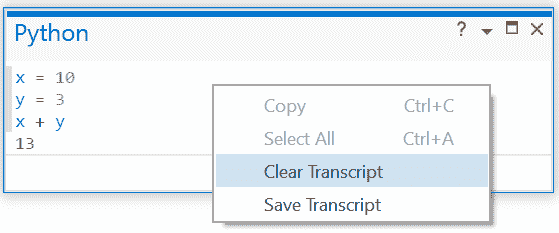
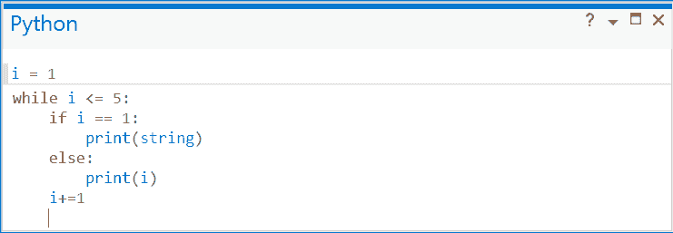
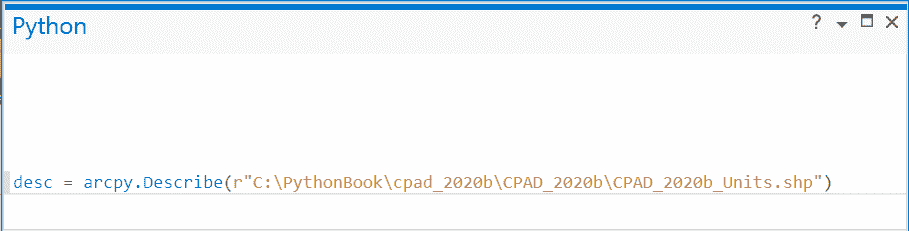
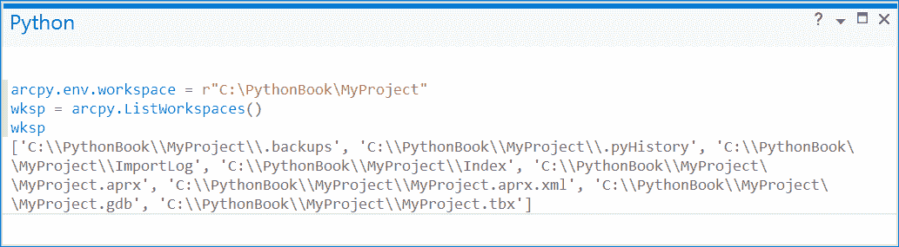

# 第三章：ArcPy 基础

现在你已经理解了 Python 语法，可以开始使用 **ArcPy** 包。ArcPy 是 ArcGIS 提供的 Python 包，用于执行和自动化地理处理和制图任务。除了 ArcGIS 中提供的 **地理处理** 工具外，你还可以访问其他模块、函数和类。将这些组合在一起，你可以创建简化并自动化复杂分析和制图的工作流程和独立工具。

本章将涵盖：

+   确保你的 Python 环境已为 ArcPy 配置

+   ArcPy 工具以及如何在 ArcGIS Pro 中使用它们

+   在 ArcPy 中访问 **环境设置**

+   **ArcPy** 中的 **函数**

+   ArcPy **模块**

## 检查你的 ArcPy 安装

ArcPy 包使你能够访问 ArcGIS Pro 的地理处理功能。Python 包包含多个模块、函数和类。一个包采用层次结构，并使用点表示法来访问模块和函数。

ArcPy 随 ArcGIS for Pro 和 ArcGIS Desktop 一起安装。从 ArcGIS 10.0 开始，ArcPy 就被用于在 ArcGIS 中编写 Python 脚本。它是官方的 ArcGIS 脚本语言，可用于自动化分析和制图工作流程。ArcGIS 桌面版使用 Python 2.7，当前版本为 2.7.18。ArcGIS Pro 使用的是新的 Python 版本 Python 3，当前最新版本是 Python 3.9.5。你可以通过前往 **项目>Python>已安装的包** 并查找 **Python** 来检查你安装的 Python 版本。


使用 ArcPy 包时，必须先导入。大多数脚本都以导入语句开始，以便访问包中的所有模块。要导入 ArcPy，可以使用以下代码行：

```py
import arcpy
```

导入 ArcPy 可以访问所有的地理处理工具和所包含的模块。

一些模块包括：

+   **Arcpy.sa**（空间分析）

+   **Arcpy.geocoding**（地理编码）

+   **Arcpy.na**（网络分析）

+   **Arcpy.da**（数据访问）

+   **Arcoy.mp**（制图）

后续章节将深入探讨数据访问和制图模块。这两个模块都非常强大，可以自动化工作。

### Python IDLE Shell for ArcGIS Pro 安装

由于 Python 和 ArcPy 是与 ArcGIS Pro 一起安装的，如果你使用的是 ArcGIS Pro 中安装的 Python 版本的 **IDLE Shell**，导入 ArcPy 时不会出现错误。如果你使用的是其他 Python 解释器，则需要进行配置，以使其找到 ArcPy 模块。大多数情况下，你会直接在 ArcGIS Pro 的 Python 窗口、ArcGIS Pro 中的 ArcGIS Notebook 或转化为脚本工具中编写脚本，因此使用 ArcGIS Pro 安装中附带的 Python IDLE 最为方便。

> 确保访问 ArcGIS Pro 安装附带的 Python IDLE 最简单的方法是创建一个快捷方式，因为安装时不会自动创建。

+   查找运行 IDLE 的路径，对于典型的 ArcGIS Pro 安装，它通常在这里：`C:\Program Files\ArcGIS\Pro\bin\Python\envs\arcgispro-py3\Lib\idlelib\idle.bat`，*双击* 它将打开 IDLE：

    

+   要创建快捷方式，*右键点击* **桌面** 并 *点击* **新建 > 快捷方式**，然后粘贴 idle.bat 文件的完整路径：

    

+   *点击* **下一步**，然后为你的快捷方式命名：

    

    > 我建议使用一个名称，这样你就能记住这是与 ArcGIS Pro 一起安装的 Python 环境。

+   图标将是默认的快捷方式图标。

    

    .

+   要更改图标为标准的 Python IDLE 图标：

    +   *右键点击* 它

    +   *点击* **属性**。

    +   在 **快捷方式** 标签中，*点击* **更改图标**。

        > 你可能会收到一个警告，提示没有图标，需要从其他文件中选择一个图标。如果是这种情况，点击确定，这样你就可以导航到图标所在的位置。

    +   导航到 Python IDLE 所在位置，通常在此路径：`C:\Program Files\ArcGIS\Pro\bin\Python\envs\arcgispro-py3\Lib\idlelib\Icons`

+   一个用于访问 ArcGIS Pro 安装的 IDLE 快捷方式现在已经安装在桌面上。这个安装是一个测试代码片段的地方，特别是在处理复杂脚本工具时，稍后的章节将对此进行详细探讨。


*当你想要使用 IDLE 与 ArcGIS Pro 一起工作时，你需要使用这个版本，因为它与你安装的 ArcGIS Pro 相关联。*

> 确保使用正确的 IDLE 的一种好方法是导入 arcpy。如果安装成功后显示三个尖括号 >>>，说明 IDLE 已正确设置。


如果没有显示，系统将会显示一个错误：


#### Python IDLE Shell

Python IDLE Shell 是尝试代码的好地方，因为它是交互式的，并且会立即显示代码结果：


IDLE Shell 还使用不同的颜色显示代码元素的解释。字符串用绿色显示，函数用紫色显示，循环和条件语句用橙色显示，结果用蓝色显示。

虽然从 IDLE Shell 获取即时结果很有用，但它并不适合用来保存代码。虽然可以在需要时将其复制出来，但更好的做法是将其写入脚本文件中以便保存。

> 要启动脚本文件，你需要在 IDLE Shell 的菜单栏上*点击* **文件>新建文件**。这将打开一个新的窗口，这是一个名为 Untitled 的空 Python 脚本文件。与 IDLE Shell 不同，它没有命令提示符，并且菜单栏也有所不同。


你可以创建一个脚本文件。

+   将之前在 IDLE 中编写的代码复制到脚本文件中。

+   移除尖括号。

+   修正缩进以匹配下面的格式。

+   保存文件。


这个新文件 `HelloLoop.py` 有 `.py` 扩展名，表示它是一个 Python 文件。你可以通过点击 **运行 > 运行模块** 来运行它，并将结果发送到 Python IDLE Shell。


现在你已经了解了

+   如何确保你的 Python 环境已设置为与 ArcPy 一起使用

+   如何使用 IDLE Shell

+   如何启动新的脚本文件

你现在已经准备好查看 ArcGIS Pro 中的 Python 窗口以及你能在其中做什么了。

### ArcGIS Pro 中的 Python 窗口

不仅可以通过 IDLE 访问 ArcPy，还可以通过 ArcGIS Pro 中的 Python 窗口访问。


Python 窗口允许你直接在 ArcGIS Pro 中编写和运行代码，并查看你运行任何地理处理工具时的结果。在测试新代码时，这可以帮助你看到代码的执行情况和效果。你编写的代码可以复制或保存到大型脚本工具中。你将在后续章节中学习更多关于脚本工具的内容。现在，让我们看看 ArcGIS Pro 中的 Python 窗口，了解它有多强大。

一旦点击图标，Python 窗口会弹出，通常第一次它会固定在屏幕底部。


就像 ArcGIS Pro 中的所有窗口一样，Python 窗口可以固定在任何位置，或者可以自由浮动。你可以像处理任何 ArcGIS Pro 窗口一样，通过拖动和隐藏来将其移动到最适合你工作的地方。

窗口的顶部部分称为 **转录内容**，其中显示你之前编写的代码。底部标有 **在此处输入 Python 代码** 的部分称为 **提示符**，这是你输入代码的地方。当你第一次打开 Python 窗口时，转录内容是空的，因为你还没有编写任何代码。

尝试在 IDLE 中编写的一些代码，看看它在 Python 窗口中是如何工作的。就像在 IDLE 中一样，当你输入一行代码时，需要按 *Enter*。

+   输入 `x = 10` 并按 *Enter*

    

+   输入 `y = 3` 并按 *Enter*

    

+   输入 `x + y` 并按 *Enter*


你可以看到这就像在 IDLE 中一样正常工作。*这意味着所有标准的 Python 函数和工具在 Python 窗口中的运行方式与它们在 IDLE Shell 中的表现是一样的*。

> 转录框可以随时通过右键点击转录框并选择清除转录内容来清空。这不会从内存中删除你的代码或变量。

+   点击转录框并选择 **清除转录内容**。

    

+   输入 `x + y` 并按 *Enter*



如你所见，x 和 y 的变量已经保存在内存中，即使清除了转录内容，它们仍然可用。即使你保存并关闭项目，再次打开时这些变量仍然可用。*它们被保存在项目的内存中，因此可以在同一个项目中稍后再次使用。* 这可能会很有用，但你将在后续章节中了解更好的方法来保存代码以便在同一项目和其他项目中重复使用。

就像在 IDLE Shell 中一样，Python 窗口能够理解你编写的多行连接代码。你可以通过在本章前面编写的 HelloLoop.py 脚本来看到这一点。

+   输入 `String = “Hello”` 并按 *Enter*

+   输入 `i = 1` 并按 *Enter*

+   *输入* `while i < 5:` 并按 *Enter*

    > 注意，提示窗口变大了，并且光标有了缩进。Python 窗口理解 `while` 语句开始了一个代码块，并且是多行构造的一部分。当你继续输入代码时，提示窗口会变大，以容纳需要的额外行数。`if` 语句也是多行构造的一部分，因此它也会像 `while` 语句一样增加额外的行并进行缩进。

+   输入 `if i == 1:` 并按 *Enter Enter*

+   输入 `print(string)` 并按 *Enter*

+   输入 `else:` 并按 *Enter*

+   输入 `print(i)` 并按 *Enter*

+   输入 `i+=1` 并按 *Enter*

+   按 *Enter*

> 当你编写多行代码并按下回车时，光标将移动到下一行。



> **如果你忘记了 i += 1 而导致死循环会发生什么？如何停止循环？**
> 
> 你可以点击 Python 窗口底部的 X 来停止执行。
> 
> 或者在提示窗口中输入*Ctrl*+*C*来停止执行。


### ArcPy 环境设置

+   ArcPy 环境设置允许你访问通用的地理处理设置，以及特定工具的地理处理设置。

+   对于工具，它们作为参数，可以设置来改变工具的结果。

+   有很多环境设置可以使用，但你会发现自己常用其中的一些。

你将看到最常见的一种情况，并学习如何设置它：`arcpy.env.workspace`。

> 使用环境类的工作空间属性，你可以检查并更改你的工作空间或临时工作空间

```py
arcpy.env.workspace
arcpy.env.scratchWorkspace
```

你可以检查并设置你的 **工作空间**

+   输入 `arcpy.env.workspace` 并按 *Enter*

返回的结果是你当前的工作空间。


现在你可以设置你的工作空间

+   输入 `arcpy.env.workspace = r"C:\PythonBook\Project_2\Project_2.gdb"` 并按 *Enter*


你可以通过类似的方法检查你的临时工作空间

+   `输入 arcpy.env.workspace` 并按 *Enter*


现在你可以设置你的临时工作空间

+   `输入 arcpy.env.scratchWorkspace = r”C:\PythonBook\Project_2\Project_2.gdb”` 并按 *Enter*


设置你的临时工作空间和工作空间是一个好主意，因为它可以为你创建的数据提供一个默认存放位置。它也是你在使用下文将要探索的列表函数时所使用的工作空间。在示例中，你已经将工作空间和临时工作空间设置为地理数据库。你也可以将它们设置为文件夹、要素数据集或你想要的任何工作空间。

> **路径前面的 r 是什么意思？**
> 
> 注意输入位置的方式。它以字母 r 开头，后面跟着用双引号括起来的路径。字母 r 代表“原始字符串”，意思是 Python 会按原样读取引号中的内容。这一点很重要，因为在 Python 中，\ 字符是一个转义字符，用于插入字符串中通常不允许出现的字符。你已经看到过如何在查询中使用转义字符来在字符串中的引号内插入引号。不过在这里你不需要转义字符，因此有 3 种选择。
> 
> 在引号前加上字母 r 来创建原始字符串。
> 
> 将所有单个的 \ 替换为双 \\。
> 
> 将单个 \ 改为 \\。

根据你运行的过程，可能还有许多其他环境设置对你有用。你在工具属性中找到的大多数设置都可以在环境设置中进行设置。例如，分析范围可以通过 `arcpy.env.extent` 设置，做栅格分析时的栅格快照可以通过 `arcpy.env.snapRaster` 设置。

重要的是要记住，一旦你设置了环境设置，它会保持不变，直到你修改它。在更高级的脚本工具中，你会修改它，或者在代码中设置并重置它。

### ArcPy 工具 - 使用 ArcPy 进行地理处理

现在你已经掌握了 Python 窗口的基本用法，是时候了解如何使用地理处理工具了。

+   你将学习如何在 Python 窗口中使用选择、缓冲、创建要素图层、按要素图层选择工具、添加字段和计算字段工具。

+   最终结果将是一个包含公园周围 1,000 英尺范围内的公交车站的要素类。

要进行一些地理处理，你需要一些数据。确保你在 ArcGIS Pro 中打开了一个地图，并将你下载的 CPAD_2020b_Units.shp 数据添加进来。该数据来自加利福尼亚保护区数据库，展示了加利福尼亚州内的公园及其他保护区。有关该数据集的更多信息，请访问 [`www.calands.org/`](https://www.calands.org/)。

你将使用 Python 窗口选择奥克兰市的公园，进行 1,000 英尺的缓冲，选择缓冲区内的公交车站，并将它们写入新的要素类。

右键点击目录表，选择**属性表**，查看数据展示的内容。


1.  你将使用 **AGENCY_NAME** 字段运行一个选择工具，创建一个仅包含奥克兰市保护区的新要素类。你将在 Python 窗口中通过输入以下内容来完成此操作：`arcpy.Se`。Python 窗口会显示一些自动完成选项，帮助你找到所需的工具。你将使用分析工具集中的选择工具，因此需要使用 **Select() analysis**。

    

1.  选择工具后，你可以看到该工具期望的**参数**。将光标悬停在工具上，帮助窗口会弹出，显示工具的参数。选择工具需要以下必需参数：

    1.  `in_features`

    1.  `out_features,`

        +   以及以下可选参数

    1.  `where_clause`。`where_clause`用大括号{}表示，因为它是可选的。

        +   `in_features`是加粗的，因为它是当前工具希望输入的参数。将以下内容输入括号中以创建选择查询：`“CPAD_2020b_Units”,”CPAD_2020b_units_Oakland”,’”AGNCY_NAME = \’Oakland, City of\’` 然后按*Enter*键！[](img/file50.png)

    运行后，它将如下所示，你应该会有一个新的要素类，表示奥克兰的保护区。

    > **如何编写 where 子句查询以确保其有效？正确使用转义字符“\”**
    > 
    > 反斜杠（\）是转义字符，在你需要使用多个单引号或双引号时非常必要。在此实例中，由于你正在对 shapefile 执行选择查询，所选属性字段需要使用双引号，而字符串值则需要使用单引号。整个 where 子句需要放在单引号或双引号内。因此，最简单的选项是将整个查询用单引号括起来，并在所选字符串周围使用转义字符。如果你想将整个 where 子句放在双引号中，它将如下所示：`“/”AGNCY_NAME” = ‘Oakland, City of’”`。这两种方式都能正常工作。

    如果你在 ArcGIS Pro 项目中工作，那么新文件将会保存在该项目的地理数据库中，因为这是默认的工作空间。如果你通过环境设置指定了工作空间，则将写入该工作空间。如果没有设置，它将存储在临时空间中，且不会写入磁盘。

    > **如果不想使用默认工作空间，如何指定不同的工作空间？**
    > 
    > 若要指定不同的保存位置，需要在保存时写出完整路径。例如，要将 shapefile 写入`MyProject`文件夹，你可以写出如下命令：`arcpy.analysis.Select(“CPAD_2020b_Units”,r”C:\PythonBook\MyProject\CPAD_2020b_Units_Oakland.shp”,’”AGNCY_Name” = \’Oakland, City of\’’)`

1.  现在你可以选择这些公园，并将它们缓冲 1000 英尺。缓冲工具位于**分析** **工具箱**中，因此要调用它，只需输入`arcpy.analysis.Buffer()`。你可以通过将光标悬停在括号中查看缓冲工具的参数。它按以下顺序接受以下必需参数：

    1.  `in_features`

    1.  `out_features`

    1.  `buffer_distance_or_field`

    以及以下可选参数，按此顺序排列：

    1.  `line_side`

    1.  `line_end_type`

    1.  `dissolve_option`

    1.  `dissolve_field`

    1.  `method`

    你希望为公园设置 1,000 英尺的缓冲区，仅解散为`UNIT_NAME`、`AGENCY_NAME`和`LABEL_NAME`。为此，你将输入`in_features`、`out_featuers`、`buffer_distance`、`dissolve_option`和`dissolve_field paramaters`。其中，`in_features`、`out_features`和`buffer_distance`是前 3 个参数，但`dissolve_option`和`dissolve_field`是第 6 和第 7 个参数。为确保它们处于正确位置，你将在第 4 和第 5 个参数中输入一对单引号或双引号。这告诉函数这些可选参数为空，就像它们没有被输入一样；并允许你在它们之后输入参数。在括号内输入`“CPAD_2020b_Units_Oakland”,”CPAD_2020b_Units_Oakland_1000ft”,”1000 FEET”, “”,””,”LIST”,[`UNIT_NAME`,”AGNCY_NAME”,”LABEL_NAME”]`，然后按*Enter*键。

    

1.  缓冲区应该已添加到你的地图中。你可以探索它们，看看它们的样子。当你准备好时，你现在要用**创建要素图层**工具制作公交车站要素类的要素图层。在括号内输入`arcpy.management.MakeFeatureLayer()`。你可以看到创建要素图层工具需要两个必填参数

    1.  `in_features`

    1.  `out_layer`以及以下可选参数

    1.  `where_clause`

    1.  `workspace`

    1.  `field_info`

1.  你将输入以下参数来制作所有公交车站的要素图层，只需在括号内输入以下内容。`“UniqueStops_Summer21”,”AC_TransitStops_Summer21”`，然后按*Enter*键。

    

1.  要素图层应已添加到你的地图中。你可以探索它，看看它与 UniqueStops_Summer21 要素类相似。但由于它是要素图层，你可以使用**按位置选择图层**工具选择缓冲区内的所有公交车站。在括号内输入`arcpy.management.SelectLayerByLocation()`。你可以看到按位置选择图层工具有一个必填参数

    1.  `in_layer`以及以下可选参数

    1.  `overlap_type`

    1.  `select_features`

    1.  `search_distance`

    1.  `selection_type`

    1.  `invert_spatial_relationship`

1.  你将输入以下参数来选择 1,000 英尺缓冲区内的公交车站，只需在括号内输入以下内容。`“AC_TransitStops_Summer21”,”INTERSECT”,”CPAD_2020b_Units_Oakland_1000ft”`，然后按*Enter*键。

    

1.  你应该看到已选择的公交车站。你可以探索数据，看看是否符合你的预期。从这里，你可以将数据导出为表格、CSV 或要素类，或者仅用于地图显示。现在，你要将数据导出为要素类以备日后使用，当你探索数据访问模块并使用游标时。为此，你将使用**复制要素工具**。在括号内输入`arcpy.management.CopyFeatures()`。复制要素工具有两个必填参数

    1.  `in_features`

    1.  `out_features`以及一个可选参数

    1.  `config_keyword`

1.  你将输入以下参数到括号中，将选定的公交站点复制到新的要素类中：`“AC_TransitStops_Summer21”, “AC_TransitStops_Within1000ft_OaklandPark”`


你的结果要素类将在地图中显示，并写入当前工作空间。有关此数据的下一步将在第四章：数据访问与行中探索。在那里，你将学习如何在内存中完成此过程并将公园名称添加到公交站点。

### 内置 ArcPy 函数

ArcPy 有许多内置函数可以帮助进行地理处理。ArcPy 函数的写法与地理处理工具类似。当你编写代码创建一个选择要素类时，你写了 `arcpy.analysis.select(in_features,out_features,{where_clause})`。通过将输入要素、输出要素和查询条件放在括号中，你调用了这个函数并向其传递了这些参数。*这就是函数的全部内容，你可以稍后通过传递不同的参数来调用它。*

ArcPy 具有帮助环境设置、描述数据、许可、ArcGIS Online、栅格、列出数据等功能，还有针对特定模块（如空间分析或映射模块）的函数。在本节中，你将探索两个更常用的内置函数。

+   describe 函数

+   列出函数

这些函数很常见，因为它们帮助你设置并完成迭代过程，比如在同一位置对不同的要素类进行相同的分析。

#### describe 函数

describe 函数将根据元素的类型返回不同的属性。*describe 函数可以作用于多种元素，包括但不限于：shapefile、地理数据库、要素类、要素数据集、表格、LAS 文件、栅格数据和地图文档。*

describe 函数返回一个包含所有属性的对象，因此你需要创建一个变量来保存这些属性，然后稍后调用它们。你可以在 CPAD 数据上尝试此操作。

+   输入 `desc = arcpy.Describe(r”C:\PythonBook\cpad_2020b\CPAD_2020b\CPAD_2020b_Units.shp` 然后按 *Enter* 键

    

+   看起来没有发生任何事情，但现在你可以使用该 desc 变量来获取有关 shapefile 的信息。你可以通过输入 `desc.dataType` 并按 *Enter* 键来查看数据类型。

    

+   你还可以通过输入 `desc.shapeType` 并按 *Enter* 键来查看要素类的几何类型。


> 你可以看到，如果你不了解某个文件，你可以调用 describe 函数并使用其属性来查找文件的相关信息。
> 
> 在上述示例中，你知道数据是一个 shapefile，你可以看到如果你在文件夹中搜索并且只想对 shapefile 执行分析时，这些信息是多么有用。

#### 列出函数

列表函数非常强大，因为它们允许你创建一个工作空间中数据的列表，然后你可以遍历这些数据。对于这些示例，你将使用`MyProject.gdb`地理数据库中的数据。

列表函数获取你所在的当前工作空间，并将为该类型的列表函数创建一个所有数据集的列表。以下是一些列表函数：

+   `ListDatasets`

+   `ListFeatureClasses`

+   `ListFields`

+   `ListFiles`

+   `ListIndexes`

+   `ListRasters`

+   `ListTables`

+   `ListVersions`

+   `ListWorkspace`

`ListDatasets`、`ListFeatureClasses`、`ListFiles`、`ListRasters`、`ListTables`和`ListWorkspaces`需要在运行之前设置工作空间，因为它们只会在当前工作空间上运行。

+   首先列出`MyProject.gdb`所在的工作空间。你需要首先将工作空间设置为地理数据库的所在位置。`arcpy.env.workspace = r"C:\\PythonBook\\MyProject"`并按下*Enter*键。

    

+   接下来，将`ListWorkspaces`函数分配给一个名为`wksp`的变量，`wksp = arcpy.ListWorkspaces()`并按下*Enter*键。

    

    > `ListWorkspaces`函数有两个可选参数，
    > 
    > > 通配符 - 用于限制返回列表的值，只有匹配你输入的值时才会返回。
    > > 
    > > 工作空间类型 - 用于限制工作空间的类型。

+   你可以通过输入`wksp`并按下*Enter*键来看它是什么样子。

    

+   你可以看到它是创建新项目时，在 ArcGIS Pro 中标准的所有工作空间。它们在这个列表中有些难以阅读。因此，为了让它们更容易阅读，你可以遍历该列表，逐个打印出来。输入`for w in wksp:`并按*Enter*键，再输入`print(w)`并按*Enter*键，然后按下*Enter*键。



现在你可以真正看清楚你拥有什么了。


这很棒，因为你可以看到文件夹中所有的工作空间。但是你只想要文件夹中的地理数据库。这时，你可以使用参数。为此，你可以使用工作空间类型参数。工作空间参数接受以下字符串值：

+   访问 - 个人地理数据库将被选中

+   覆盖 - 覆盖工作空间将被选中

+   FileGDB - 文件地理数据库将被选中

+   文件夹 - 将选择 shapefile 工作空间

+   SDE - 企业数据库将被选中

+   所有 - 所有工作空间 - 这是默认设置

要仅选择文件地理数据库，你需要输入以下内容。

```py
wksp = arcpy.ListWorkspaces("","FileGDB")
```

> **为什么会有一个“”后跟一个逗号？**
> 
> 第一个参数是通配符，输入“”将留空。不过需要有这个参数，因为函数会按书写顺序处理参数。如果你像这样写`wksp = arpcy.ListWorkspaces("FileGDB")`，函数仍然会运行。但是当你调用它时，你不会得到任何数据，因为没有名为“FileGDB”的工作空间。

你可以看到当调用`wksp`变量时，你现在只会得到一个值：`MyProject.gdb`。


虽然列表中只有一个值，但它仍然是一个列表，在 Python 中表现为列表。也就是说，如果 ArcPy 函数期望的是一个字符串而给它一个列表，它会失败。例如，你不能通过使用`wksp`变量将工作空间更新为该地理数据库位置。


> 列表的元素可以通过不同的方法设置为工作空间。如果你想将列表中的每个元素都设置为工作空间，可以按以下方式操作。
> 
> > 输入`for w in wksp:` 按下*Enter*
> > 
> > 输入`arcpy.env.workspace = w` 按下*Enter*
> > 
> > 输入`print(arcpy.env.workspace)` 按下*Enter* 按下*Enter*


> **如果你知道只有一个目标工作空间该怎么办？**
> 
> 在这个例子中，你只有一个项目在列表中，因此只会执行一次。在这种情况下，如果只有一个项目，你可以直接写`w = wksp[0]`


> 事实上，当你知道列表中只有一个项目时，你可以直接写以下代码来设置工作空间：`arcpy.env.workspace = ListWorkspaces(“”,”FileGDB”)[0]` *请小心使用这种表示法，如果你有多个工作空间，它将只会将工作空间设置为列表中的第一个。*

现在工作空间已经设置为你的地理数据库，你可以使用 ListFeatureClasses 函数获取该地理数据库中所有要素类的列表，并将其赋值给一个变量。

你将编写代码获取要素类的列表，然后编写一个 for 循环遍历该列表，以便你可以轻松读取列表中有哪些要素类。


+   输入`fcs = arcpy.ListFeatureClasses()` 按下*Enter*

+   输入`for fc in fcs:` 按下*Enter*

+   输入`print(fc)` 按下*Enter* 按下*Enter*


现在你有一个包含地理数据库中所有要素类的列表。这个列表可以进行迭代，得到单个要素类，你可以将其传递给其他 ArcPy 函数或地理处理工具。你可以使用上述的 Describe 函数来仅查找特定几何类型的要素类，确保分析只在该类型的要素类上进行。

你将从存储在变量 fcs 中的要素类列表开始，并像上面那样遍历它，之前你只是打印出了名称。然后，你将使用要素类的 ShapeType 属性来确定每个要素类的形状，并打印出相应的说明。

以下代码是你将在 Python 窗口中编写的内容。

```py
for fc in fcs:
    desc = arcpy.Describe(fc)
    fcName = desc.name
    if desc.shapeType == "Polygon":
        print("Shape Type for " + fcName + " is " + desc.ShapeType)
    elif desc.shapeType == "Polyline":
        print("Shape Type for " + fcName + " is " + desc.ShapeType)
    elif desc.ShapeType == "Point":
        print("Shape Type for " + fcName + " is " + desc.ShapeType)
    else:
        print(fcName + " is not a Point, Line, or Polygon")
```

这是编写它的步骤。

+   输入`for fc in fcs:` 按下*Enter*

+   输入`desc = arcpy.Describe(fc)` 按下*Enter*

+   输入`fcName = desc.name` 按下*Enter*

+   输入`if desc.shapeType == “Polygon”: ` 按下*Enter*

+   输入`print(“Shape Type for “ + fcName + “ is “ + desc.ShapeType)` 按下*Enter*

+   输入`elif desc.ShapeType == “Polyline”: ` 按下*Enter*

+   输入`print(“Shape Type for “ + fcName + “ is “ + desc.ShapeType)` 按下*Enter*

+   输入`elif desc.ShapeType == “Point”: ` 按下*Enter*

+   `print(“Shape Type for “ + fcName + “ is “ + desc.ShapeType)`并按*Enter*键

+   `else:`并按*Enter*键

+   `print(fcName + “ is not a Point, Line, or Polygon”)`并按*Enter*键，再按*Enter*键


for 循环会遍历每个要素类。对于该要素类，你会创建一个变量来保存该要素类的 Describe 属性。接着，你创建一个变量来保存该要素类的名称。然后，你编写 if/elif/else 语句来测试 Describe 对象的 ShapeType 属性。输出语句会像这样。


> **if/elif 语句可以简化吗？**
> 
> 是的，根据你的需求，它是可以的。但如果你不知道自己在寻找什么，有时候明确一些会更好。现在你已经写出了这段代码，可以保存它并复制粘贴某些部分。例如，如果你想对地理数据库中的点、线和多边形运行不同的地理处理工具，那么你现在已经有了示例的 if/elif 语句可以使用。

另一种选择列表函数中元素的方式是在将它们放入列表之前使用**通配符参数**。通配符限制了函数返回的内容。它不区分大小写，并使用*来包含任意数量的字符，可以在*前后使用。让我们看一下如何使用当前的地理数据库工作区的几个示例。

你可以选择所有的 CPAD 数据

+   输入`cpad_fcs = arcpy.ListFeatureClasses(“CPAD*”)`并按*Enter*键

    

+   使用 for 循环查看列表内容。输入`for fc in cpad_fcs:`并按*Enter*键

+   输入`print(fc)`并按*Enter*键，再按*Enter*键


通配符正在查找以 CPAD 开头的任何要素类，*告诉它匹配 CPAD 后面的任何内容。你可以在结果中看到，你现在有了一个包含所有 CPAD 要素类的列表。

> * 可以在任意字符前、后或前后使用。

你可以通过写出如下代码仅选择 CPAD 单元和超单元

```py
cpad_fcs_units = arcpy.ListFeatureClasses(“*Units”)
```

并通过 for 循环验证输出

```py
for fc in cpad_fcs_units:
  print(fc)
```


通配符可以用于选择仅包含 2019 的普查要素类，可以通过写出如下代码

```py
census_fcs = arcpy.ListFeatureClasses(“*2019*”)
```

并通过 for 循环验证输出

```py
for fc in census_fcs:
  print(fc)
```


通配符是许多列表函数中的可选参数之一，可以与其他参数一起使用。`ListFeatureClasses`函数有一个用于要素类型和要素数据集的参数。要素类型参数可以用来选择特定的要素类型，包括但不限于：点、面、多段线。要素数据集可以用来指定要在地理数据库中搜索的要素数据集。如果未指定要素数据集，则`ListFeatureClasses`函数只会查找地理数据库中的独立要素类。

使用你的`MyProjects.gdb`，你可以看到如何结合通配符和要素类型参数来获取特定的要素类。

你可以通过输入以下代码来选择仅包含人口普查多边形要素类：

```py
census_fc_poly = arcpy.ListFeatureClasses(“*2019*”, “Polygon”)
```

并通过输入变量来验证

```py
census_fc_poly
```


注意，要素类是以列表的形式存储在 [] 中。要执行任何地理处理任务，你需要通过迭代列表并在 for 循环中执行任务，或者使用列表索引提取要素类，获取你需要的列表索引。

```py
census_county = census_fc_poly[0]
```


注意，`census_county` 变量返回的是要素类的名称。只要你的工作空间仍然是地理数据库，你可以仅使用该名称来执行地理处理任务。但是，如果你重置了工作空间，ArcPy 将不知道在哪里找到具有该名称的要素类。因此，使用 `os` 库创建一个包含要素类完整路径的变量是一个良好的做法。在 IDLE 中工作时，要使用 `os` 库，它需要像 ArcPy 一样被导入。

+   输入 `import os` 然后按 *Enter*

+   现在你可以创建一个变量，包含人口普查要素类的完整路径。输入 `gdb = wksp[0]` 然后按 *Enter*

+   *输入* `census_county_full = os.path.join(gdb,census_county)` 然后按 *Enter*

现在，你已经在一个变量中得到了人口普查县 shapefile 的完整路径，可以在你编写的任何后续代码中使用该变量。


### ArcPy 模块介绍

ArcPy 附带了一套模块，除了地理处理工具和函数。模块是包含额外 Python 定义和语句的文件，包括函数和变量等。它们有助于更逻辑地组织代码。

ArcPy 附带了以下模块：

+   图表模块 (`arcpy.charts`)

+   数据访问模块 (`arcpy.da`)

+   地理编码模块 (`arcpy.geocoding`)

+   图像分析模块 (`arcpy.ia`)

+   映射模块 (`arcpy.mp`)

+   元数据模块 (`arcpy.metadata`)

+   网络分析模块 (`arcpy.na` 或 `arcpy.nax`)

+   共享模块 (`arcpy.sharing`)

+   空间分析模块 (`arcpy.sa`)

+   工作流管理模块 (`arpcy.wmx`)

上述一些模块确实需要特定的许可才能使用其中的功能和工具。例如，网络分析模块和空间分析模块需要你拥有网络分析和空间分析扩展。你将在后面的章节中深入学习的两个模块——数据访问模块和映射模块则不需要。数据访问模块可以帮助你简化数据清理和分析过程。映射模块可以简化大量地图的制作，并使得创建数百张地图成为一个简单的过程。

#### 空间分析模块

空间分析模块包含所有与空间分析扩展相关的地理处理工具。因为它使用了空间分析扩展，所以你需要导入该扩展。

```py
from arcpy.sa import *
```

就像使用通配符一样，星号表示所有内容。你可以仅导入空间分析模块中的特定模块、类或函数，但大多数时候你将导入整个模块。

你将学习如何编写代码，在 Python 窗口中运行空间分析工具，使用来自 CalFire 的 FVEG 数据。数据可以在这里找到：[`frap.fire.ca.gov/mapping/gis-data/`](https://frap.fire.ca.gov/mapping/gis-data/)

+   将`fveg15_1`数据加载到地图中

+   右键点击它并选择**符号系统**

+   点击下拉菜单中的**Stretch**，选择**唯一值**

+   点击**Field 1**的下拉菜单并选择 WHR10Name。如果需要，可以调整颜色和色彩图案。同时也可以稍微浏览一下数据，看看显示了什么。这是加利福尼亚州整个州的土地覆盖数据。你将提取奥克兰市受保护区域的数据。

+   输入`from arcpy.sa import *`并按下*Enter*

+   如果你已经为奥克兰市的公园创建了要素类，可以跳过下一步

+   输入`arcpy.analysis.Select(“CPAD_2020b_Units”,r”C:\PythonBook\MyProject\MyProject.gdb\CPAD_2020b_Units_Oakland”,’”AGNCY_NAME” = \’Oakland, City of\’’)`并按下*Enter*

+   通过输入`arcpy.CheckExtension(“Spatial”)`并按下*Enter*检查是否有空间分析扩展可用。如果没有，它应返回`‘Available’`，如果没有，你需要启用你的空间分析许可证，或者如果是在共享许可证网络上，需要让其他人释放他们的许可证。

+   一旦确认许可证可用，输入`arcpy.CheckOutExtension(“Spatial”)`并按下*Enter*。它应返回`‘已签出’`

+   输入`oaklandParksLandCover = ExtractByMask(“fveg15_1”,“CPAD_2020b_Units_Oakland”)`并按下*Enter*

+   输入`oaklandParksLandCover.save(r”C:\MyProject\MyProject.gdb\OaklandParksLandCover”)`并按下*Enter*

> **为什么需要保存栅格？是否可以用一行代码完成？**
> 
> 在 ArcPy 中使用空间分析扩展时，运行地理处理工具实际上是一个函数。该函数返回提取栅格。该栅格是在内存中创建的，如果你想保存它，必须使用返回栅格的保存属性。
> 
> 这可以用一行代码完成。代码如下：`oaklandParksLandCover_2 = ExtractByMask("fveg15_1","CPAD_2020b_Units_Oakland").save(r"C:\PythonBook\MyProject\MyProject.gdb\OakalndParksLandCover_2")`

现在你拥有了这些数据，你可以使用 Con 工具找到公园中非城市区域的部分。

+   首先为你的栅格命名，输入`oaklandParksNonUrban =`

+   通过输入`con(`调用 Con 工具

+   第一个参数是输入栅格，它是我们新创建的公园土地覆盖，输入`oaklandParksLandCover,`

+   下一个参数是实际的栅格或常量，这是新栅格将获取的值。由于你希望保留不是城市的不同土地覆盖类型在新栅格中，所以这是同样的栅格，输入`oaklandParksLandCover,`

+   下一个参数是可选的，它是虚假栅格或常数。这是新的栅格在城市区域中会得到的值。你希望它为无数据，这样新的栅格中的城市公园区域就会是空白，输入`“”,`

+   最后一个参数是可选参数，它是一个 where 子句。它的写法就像运行选择工具的查询，输入`“WHR10NAME <> ‘Urban’”)`

+   完整的代码应该如下所示`oaklandParksNonUrban = Con(oaklandParksLandCover,oaklandParksLandCover,””,”WHRNAME <> ‘Urban’”)`

+   在目录中的新栅格上打开属性表。它只有一个值字段，没有其他属性。这是因为 con 工具仅提取真实栅格的值属性。可以通过做连接来解决这个问题。

+   Join Field 工具位于管理工具箱中，适用于栅格数据、要素类，并创建一个永久连接。输入`arcpy.management.JoinField(`

+   第一个参数是输入图层，输入`oaklandParksNonUrban,`

+   第二个参数是要连接的字段，输入`VALUE,`

+   第三个参数是要连接的表，输入`oaklandParksLandCover,`

+   第四个参数是从连接表中连接的字段，输入`VALUE,`

+   最后一个参数是可选的，它是你想从连接表中加入到输入图层的字段列表。你可以使用列表来选择要连接的字段。如果留空，将连接所有字段。你将连接 WHR 字段，输入`[“WHRNUM”,”WHRNAME”,”WHRTYPE”,”WHR10NUM”,”WHR10NAME”,”WHR13NUM”,”WHR13NAME”]`

+   完整的代码应该如下所示`arcpy.management.JoinField(oaklandParksNonUrban,”VALUE”,oaklandParksLandCover,”VALUE”,[ [“WHRNUM”,”WHRNAME”,”WHRTYPE”,”WHR10NUM”,”WHR10NAME”,”WHR13NUM”,”WHR13NAME”])`

+   同样，必须保存以便存储。输入`(oaklandParksNonUrban.save(r”C:\MyProject\MyProject.gdb\OaklandParksLandCover”)`并按*Enter*

在接下来的章节中，你将学习如何使用搜索游标创建不同属性的列表，并遍历它们以创建多个栅格并进行进一步分析。
