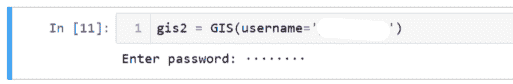

# 第四章：ArcGIS Python API

## 什么是 ArcGIS Python API？

ArcGIS Python API 是一个为 Web GIS 设计的 Python 包。它允许你直接处理托管在 ArcGIS Online 或 ArcGIS Enterprise 上的数据。之前你使用的是 ArcPy，虽然它非常适合桌面工作，但在处理托管数据时功能有限。ArcGIS Python API 提供了许多与 ArcPy 相同的功能，例如创建地图、地理编码、管理数据和地理处理，但它是在你的 ArcGIS Online 或 ArcGIS Enterprise 账户中进行的。除此之外，你还可以通过管理用户、组和项目来管理你组织的 Web GIS 数据。需要注意的是，虽然你将通过 ArcGIS Pro Notebooks 进行所有示例的操作，但你并不需要通过 ArcGIS Pro 来操作。你可以安装一个独立的环境，使用**conda**并通过 Jupyter Notebook 环境访问所有内容。本书不涉及这一点，因为它专注于在 ArcGIS Pro 中使用 Python。

ArcGIS Python API 类似于 ArcPy，它是一个 Python 包。它包含类、模块和函数。但它不仅仅是一个 Python 包：它还是一个**应用程序编程接口（API）**。API 是允许不同应用程序和软件相互通信的代码。它主要与 ArcGIS REST API 进行交互。这意味着你可以使用该模块向 ArcGIS Online 或 ArcGIS Enterprise 上托管的数据发出请求。这些数据可以是你自己组织中的数据，也可以是公开可用的数据。它是一个**Python 风格的**API，设计符合 Python 标准和最佳实践。作为一个 Python 风格的 API，它使 Python 程序员能够轻松使用 ArcGIS，而熟悉 Python 的 ArcGIS 用户可以自动化 Web GIS 任务。

该 API 已被组织成不同的模块供你使用。每个模块都有不同的功能和类型，以帮助你进行 GIS 工作。

模块：

+   `arcgis.gis` – 这是你将最常使用的模块。它允许进入 GIS，并提供创建、读取、更新和删除 GIS 用户、组或内容的功能。

+   `arcgis.features` – 该模块用于处理特征数据、特征图层、特征图层集合和特征集。它包含空间分析功能，用于处理特征数据。所有特征数据都是带有几何表示的数据。

+   `arcgis.raster` – 该模块用于处理栅格数据。它包含用于处理栅格和影像数据的类和函数。

+   `arcgis.realtime` – 该模块用于处理实时数据流。它用于处理流式数据，进行持续分析。它允许 Python 脚本订阅流式数据、广播更新或警报。

+   `arcgis.network` – 该模块用于完成网络分析。它用于网络图层，可用于查找最佳路线、最近设施、成本矩阵和服务区。

+   `arcgis.schematics` – 这个模块用于处理示意图。示意图是简化的网络。它用于解释示意图的结构和工作方式。

+   `arcgis.geoanalytics` – 这个模块用于对大数据集进行分布式分析，支持特征数据和表格数据。工具设计用于处理大数据和特征图层。

+   `arcgis.geocoding` – 这个模块用于地理编码和反向地理编码。它将地址创建为地理点，并在地图上可视化，或将其用作空间分析的输入数据。

+   `arcgis.geometry` – 这个模块用于处理几何类型。它包含接受几何类型作为输入和输出的函数，以及将几何图形转换为不同表示形式的函数。

+   `arcgis.geoprocessing` – 这个模块用于创建方法，以创建和共享地理处理工具。用户可以创建自己的地理处理工具并共享，此模块提供了一些可以协助创建工具的工具。

+   `arcgis.geoenrichment` – 这个模块提供有关某个地区或位置的数据。用户可以获取某个地区或指定距离内的人员和地点信息。它可以通过轻松提供人口统计数据来帮助模型。

+   `arcpy.env` – 这个模块用于创建一个共享环境，供不同模块使用。它存储当前活动的 GIS 和环境设置。

+   `arcgis.mapping` – 这个模块提供 GIS 数据的可视化功能。它包括 WebMap 和 WebScene，用于实现 2D 和 3D 可视化。

+   `arcgis.widgets` – 这个模块提供 GIS 数据的可视化功能。它包括 Jupyter Notebook MapView 小部件，帮助显示地图和图层。

+   `arcgis.apps` – 这个模块用于提供管理 ArcGIS 中可用的基于 Web 的应用程序的功能。

本章的重点将主要放在`arcgis.gis`模块上，用于管理组织中的数据，`arcgis.features`模块用于处理这些数据，以及`arcgis.mapping`模块用于可视化数据。

### 它做什么？为什么要使用它？

ArcGIS Python API 允许你在不进入 ArcGIS Online 的情况下访问 ArcGIS Online 中的数据。你可以管理你的 ArcGIS Online 或 ArcGIS Enterprise 组织、其用户和数据，通过 Jupyter Notebook 或 ArcGIS Pro Notebook 进行操作。通过在 Notebook 中执行此操作而非通过 ArcGIS Online 网页界面，你可以利用 Python 的完整功能，迭代数据并多次运行相同的过程，或安排任务执行。ArcGIS Python API 补充了 ArcPy，因为它允许你自动化组织的 Web GIS 流程。*就像在 ArcGIS Pro 中使用 ArcPy 来自动化过程一样，当你需要在 ArcGIS Online 或 ArcGIS Enterprise 组织中自动化某个过程时，你可以使用 ArcGIS Python API*

### 如何使用它？

ArcGIS API for Python 随 ArcGIS Pro 安装。如果您使用的是 ArcGIS Pro 2.5.x 或更高版本，conda 包应预先安装了 arcgis 包。默认的 conda 环境 arcgispro-py3，在 ArcPy 章节中已经看到，包含了 ArcGIS for Python API。如果需要升级包，可以通过**Python Package Manager**或**Python Command Prompt**来执行。*如果只安装了默认的 Python 环境且没有创建新环境或克隆环境，则无法进行更新。*

默认 Python 包安装

+   Python Package Manager 升级流程

    +   用空白项目打开 ArcGIS Pro

    +   选择**项目**选项卡

    +   选择**Python**菜单

    +   点击**管理环境**

    +   选择要更新的包（不能通过此方式更新默认安装）

    +   选择**更新软件包**

    +   从更新包列表中选择`arcgis`发布版

+   Python Command Prompt 升级流程

    +   在开始菜单的 ArcGIS 文件夹中，右键单击 Python Command Prompt

    +   激活要升级的环境

    +   输入`conda upgrade -c esri arcgis`

具有克隆环境的 Python Package Manager 以进行升级

一旦确认已安装了更新版本的`arcgis`包，可以测试是否正确安装。

1.  转到**项目>打开>计算机>打开另一个项目**，然后导航到您下载的 Chapter5.aprx 文件并打开它。

1.  在 Chapter5 文件夹上右键单击，然后选择新建>笔记本。将笔记本重命名为`TestArcGISAPI`

1.  在单元格 1 中输入以下内容

    ```py
    from arcgis.gis import GIS
    gis = GIS()
    map1 = gis.map("Oakland, California")
    map1
    ```

1.  点击**运行**以执行该单元格。您应该看到以下结果。

在 ArcGIS Pro Notebook 中创建的地图

让我们逐行查看代码，以了解其功能：

1.  `from arcgis.gis import GIS` 这从`arcgis.gis`模块导入 GIS

1.  `gis = GIS()` 这将以匿名用户身份连接到 ArcGIS Online。

1.  `map1 = gis.map("加利福尼亚州奥克兰")` 这将创建一个以加利福尼亚州奥克兰为中心的地图

1.  `map1` 这将地图打印到输出中，以便您可以查看创建的地图。

#### 连接到 ArcGIS Online 或 ArcGIS Enterprise

有多种方法可以通过构建 GIS 对象连接到 ArcGIS Online 或 ArcGIS Enterprise。GIS 对象需要三个参数，全部都是可选的。

1.  url - 这是您的组织的 ArcGIS Online 或 ArcGIS Enterprise 的网址。如果没有给出，则默认为 ArcGIS Online ([www.arcgis.com](https://www.arcgis.com))

1.  用户名 - 这是您的用户名，如果留空，则将以匿名方式登录

1.  密码 - 这是您的密码，如果留空并指定了用户名，系统将提示您输入密码。

使用用户名但不输入密码登录 ArcGIS Online

> 使用这种设置，您可以共享您的笔记本，但不能共享您的登录凭据。

##### 匿名用户

在之前的示例中，你以匿名用户连接到 ArcGIS Online 来测试你的 ArcGIS API for Python 安装。这使你能够查询和查看公开可用的数据。*但它不允许你创建或修改内容，或执行分析。*

##### 内置用户

ArcGIS Online 和 ArcGIS Enterprise 配备了内置的身份存储。可以在单元格中输入以下代码实现：

```py
gis = GIS(‘home’)
```

这将使用你当前登录 ArcGIS 时的凭证，将你的 Notebook 连接到 ArcGIS Online 账户。

##### ArcGIS Pro 连接

使用 ArcGIS Pro 的身份验证方案进行连接。可以在单元格中输入以下代码实现：

```py
gis = GIS(‘pro)
```

这将使用你登录 ArcGIS Pro 时使用的**凭证**，将你的 Notebook 连接到 ArcGIS Online 门户。这类似于内置用户。不同之处在于，Pro 身份验证方案仅在本地安装并同时运行 ArcGIS Pro 时有效。

##### 连接选项摘要

| 匿名用户 | `gis = GIS()` | 仅允许访问和查看公开可用的数据 |
| --- | --- | --- |
| 内置用户 | `gis = GIS(‘home’)` | 使用当前登录账户连接到 ArcGIS Online，并允许根据用户分配完全访问该数据。 |
| ArcGIS Pro | `gis = GIS(‘pro’)` | 当登录到 ArcGIS Pro 应用时，连接到活动的门户。这仅在 ArcGIS Pro 本地安装并同时运行时有效 |
| 凭证 | `gis = GIS({url}, username = ‘example’)` | 通过特定的用户名连接到一个网址，若留空，则默认连接到 `arcgis.com`，并且在运行时会提示输入密码，留空密码参数可保护你的凭证，方便分享 |

大多数时候，你将使用 `gis = GIS(‘home’)` 或 `gis = GIS(‘pro’)` 进行连接。在本书中，你将使用匿名连接或使用 `gis = GIS(‘home’)` 连接到你的组织。

## 使用 gis 模块管理你的 GIS

使用 `gis` 模块，你可以访问和管理文件夹、内容、组和用户。如果你有重复的任务和工作流，你可以将其自动化为脚本。在本节中，你将学习如何搜索数据、发布项目、将数据组织到文件夹中、访问和管理组、访问和管理用户、下载数据、删除数据和下载附件。

### 搜索数据

你可以使用 GIS 的内容属性来使用 `search()` 方法。这允许你在 GIS 中搜索并查找数据。`search()` 方法会根据提供的参数返回一个项目列表。`search()` 方法有多个可以使用的参数。通常，你将使用查询和项目类型参数。查询可以接受多种类型。在本节中，你将学习如何根据项目的标题或所有者进行查询。

在之前的示例中，你是连接到 ArcGIS Online 账户中的 GIS。对于搜索示例，你将以匿名方式连接，以了解如何搜索数据。你将搜索奥克兰的公开可用要素图层。

#### 作为匿名用户搜索公共数据

1.  转到**项目>打开>计算机>打开另一个项目**，然后导航到你下载的 Chapter5.aprx 并打开它。

1.  右键点击 Chapter5 文件夹，选择**新建>笔记本**。将笔记本重命名为`SearchForDataSample`

1.  你将通过匿名登录创建你的 GIS，并将导入一个显示模块，使返回的数据更容易查看。输入以下内容：

    ```py
    from arcgis.gis import GIS
    from IPython.display import display
    gis = GIS()
    ```

    点击**运行**按钮以运行。

1.  在下一个单元格中，你将搜索与奥克兰相关的要素图层，限制为仅显示 5 个项目，并展示结果。

    ```py
    oaklandResults = gis.content.search(query="Oakland",item_type="Feature Layer",max_items=5)
    for item in oaklandResults:
        print(item)
    for result in oaklandResults:
        display(result)
    ```

    这两个 for 循环将以两种不同的方式返回数据细节。第一种方式是仅打印结果，第二种方式是使用显示模块来显示更多细节。点击**运行**按钮以运行。

搜索奥克兰数据的结果

结果仅显示与奥克兰相关的前五个要素图层。还有很多其他参数可以用来查找不同的数据。你可以应用以下任何或所有参数：

+   `query` – 这可以用来查询标题或所有者，并且可以使用通配符。

+   `item_type` – 这可以用来查询任何可以出现在 ArcGIS Online 门户中的项目类型。它可以找到 shapefile、要素图层、要素集合、csv 文件、表格、地图、Web 场景等。它还可以接受通配符。

+   `sort_field` – 这可以用来根据字段（如标题、所有者或浏览次数）对数据进行排序。

+   `sort_order` – 这可以与排序字段一起使用，进行升序或降序排序。

+   `outside_org` – 当登录到你的组织时，可以使用此项来搜索组织外部的数据。

你将测试一些参数，看看如何通过`search()`方法获得不同的结果。

首先，你将修改上次的搜索，查找标题中包含奥克兰的要素图层或集合，并按浏览次数进行排序。

1.  现在你正在搜索标题中包含“奥克兰”的数据。你不需要在标题中使用通配符，因为这将搜索“奥克兰”一词。但它只会搜索“奥克兰”这个词，所以像“奥克兰县”这样的内容将不会被返回。你正在使用通配符来查询`item_type`，返回所有以“Feature”开头的类型。这将返回要素图层和要素集合。你还按浏览次数降序排序，以获取浏览量最多的项目，并且只返回 5 个项目。在同一个笔记本中输入以下内容：

    ```py
    oaklandResults2 = gis.content.search(query="title:Oakland",item_type="Feature *",
                                         sort_field="numViews",sort_order="desc",max_items=5)
    for item in oaklandResults2:
        print(item)
    for result in oaklandResults2:
        display(result)
    ```

    点击**运行**按钮以运行。输出结果应该如下所示。

    

    使用不同搜索参数的奥克兰搜索查询结果

    您还可以按数据所有者搜索数据。您的查询参数结构如下：`query=”owner:username”` 这将仅返回所有者公开的数据。

1.  您将从前一个单元格中获取两个数据集的所有者，并搜索他们拥有的所有要素数据类型。由于您不知道有多少种类型，并且不想打印所有数据，因此您只打印出返回的搜索结果列表的长度。在同一笔记本中的下一个单元格中输入以下内容

    ```py
    oaklandResults3 = gis.content.search(query="owner:antievictionmapdev",item_type="Feature *")
    print(len(oaklandResults3))
    ```

    点击**运行**按钮来运行并查看结果

    

    所有者查询的搜索结果

1.  现在，您知道在下一个单元格中有 10 个要素层或要素集合，您可以输入以下内容。

    ```py
    for result in oaklandResults3:
        display(result)
    ```

    点击**运行**以查看层显示。

 从所有者查询中显示的层

> 您可以点击输出单元格中的层名称，浏览器会打开并显示您点击的项目的概览页面。

#### 在连接到您的组织时搜索数据

在本节中，您已了解如何使用`search()`操作作为匿名用户搜索公共数据，以及如何搜索您组织中的数据。如您所见，根据您如何使用 ArcGIS API for Python，以及您使用的是 ArcGIS Online 还是 ArcGIS Enterprise，连接到您组织的方式会有所不同。由于在这些示例中您将连接到您的组织，因此将显示有限的图形，这些图形将取决于您在组织中拥有的数据。

要在您的组织中搜索数据，您将继续使用上面示例中的`SearchForDataSample`笔记本。

1.  在下一个单元格中，您将使用在 ArcGIS Pro 中登录的帐户创建另一个连接到 ArcGIS Online，输入以下内容

    ```py
    gis2 = GIS(‘home’)
    ```

    这将在 gis2 下创建一个 GIS，您可以用它来访问和管理您的 ArcGIS Online 中的内容和用户。如果您使用的是 ArcGIS Enterprise，则需要输入以下内容

    ```py
    gis2 = GIS(“https://portal/domain.com/webadapter”,”username”,”password”)
    ```

    点击**运行**按钮来运行该单元格。

1.  您可以通过输入以下内容查看您登录的用户的属性

    ```py
    gis2.properties.user
    ```

    点击**运行**按钮来运行该单元格。结果将是一个数据字典，包含有关用户的所有信息。

    

    用户详细信息

1.  所有这些都可以进一步访问并分配给变量（如果需要）。要访问姓氏，只需输入以下内容

    ```py
    firstName = gis2.properties.user.firstName
    firstName
    ```

    点击**运行**按钮。

    

    提取用户的姓名

1.  在匿名登录时，搜索您的内容与此相同。唯一的区别是您正在搜索您组织中的数据。在下一个单元格中输入以下内容

    ```py
    searchResults = gis2.content.search(query="*",item_type="Feature Layer")
    for result in searchResults:
        display(result)
    ```

    点击**运行**按钮来运行该单元格。它将显示您组织中的所有要素层。

1.  若要仅搜索您拥有的项目，请输入以下内容

    ```py
    searchResults = gis2.content.search(query="owner:"+gis2.users.me.username,item_type="Feature Layer")
    for result in searchResults:
        display(result)
    ```

    点击**运行**按钮来运行该单元格。

    > `search()`方法中唯一需要的参数是查询。因为可以使用通配符，您可以通过只写`query="*"`来搜索所有内容。但请小心，如果您有很多图层，搜索可能会很慢。

1.  当连接到您的组织时，您仍然可以通过将`outside_org`参数设置为`True`来搜索公开可用的数据。您可以通过编写以下代码，在`gis2`中找到相同的奥克兰数据集。

    ```py
    oaklandResultsHome = gis2.content.search(query="title:Oakland",item_type="Feature *",
                                         sort_field="numViews",sort_order="desc",max_items=5,outside_org=True)
    for result in oaklandResultsHome:
        display(result)
    ```

    点击**Run**按钮运行单元格。结果应该与匿名连接时相同。

在您的组织外部搜索的结果

在这一部分中，您已经学习了如何在匿名状态下以及连接到您的组织时搜索数据。现在您可以找到数据，接下来您将看到如何将数据添加到您的组织中，并如何组织这些数据。

### 发布数据

您发布到 ArcGIS Online 或 ArcGIS Enterprise 的大部分数据都是在 ArcGIS Pro 中完成的。当您发布单一地图或要素图层时，这非常有用且方便。如果您要发布一个包含纬度和经度字段的 csv，这就不太方便，因为您需要在 ArcGIS Pro 中显示坐标，然后再进行发布。使用 ArcGIS Python API，您可以将 csv 文件添加到您的组织，并通过几行代码进行发布。

#### 从 csv 添加数据

要将数据添加到您的 GIS 中，您将使用`add()`方法。与`search()`方法类似，`add()`方法是 GIS 对象的`content()`属性的一部分。要使用`add()`方法，您需要创建要创建的项的属性数据字典。这些属性与您需要填写的项相同，以便从 ArcGIS Pro 中添加项目：标题、描述、标签。您还可以使用`add()`方法添加一个可选的缩略图。

首先打开 csv 文件`AlamedaCountyFarmersMarket.csv`，看看您将要添加的内容。它是一个基本的 csv 文件，包含市场名称、营业天数、营业时间、位置、城市、纬度和经度。目前，它只包含奥克兰和伯克利的农贸市场，而不包括整个阿拉米达县。稍后，您将把剩余的数据附加到您从这个 csv 数据创建的要素图层中。

农贸市场 CSV

1.  右键点击`Chapter3`文件夹，选择**新建>笔记本**。将笔记本重命名为`AddPublishData`。

1.  在第一个单元格中输入您的导入语句，并创建您的 GIS。您将创建一个与您在 ArcGIS Pro 中登录的 ArcGIS Online 账户相关联的 GIS。输入以下内容：

    ```py
    from arcgis.gis import GIS
    from IPython.display import display
    gis = GIS(‘home’)
    ```

1.  点击**+**按钮添加一个单元格。在这个单元格中，您将为`csv`创建一个变量。

    ```py
    csvFM = r"C:\PythonBook\Chapter3\AlamedaCountyFarmersMarket.csv"
    ```

    *如果您的 csv 文件保存在其他位置，请确保使用其正确位置。*

1.  点击**+**按钮添加一个单元格。在这个单元格中，您将创建`csv`属性的数据字典。您将为标题、描述和标签填写属性，作为键值对填入它们的值。输入以下内容：

    ```py
    csvProperties = {
        "title":"Farmers Markets in Alameda County",
        "descrption":"Location, days, and hours of Farmers Markets in Alameda County",
        "tags":"Farmers Market, Alameda County, ArcGIS API for Python"
    }
    ```

    > 如果你要添加缩略图，可以在此单元格中通过定义一个变量来指定缩略图的位置。
    > 
    > > `thumbnail = r”PATH\TO\THUMBNAIL.png”`

1.  点击 **+** 按钮添加一个单元格。在这个单元格中，你将创建一个变量来保存正在添加的 `csv` 项。你需要使用内容模块中的 add 函数。传递的参数是属性字典和 `csv` 的路径。输入以下内容：

    ```py
    addCsvFM = gis.content.add(item_properties=csvProperties,data=csvFM)
    ```

1.  点击 **+** 按钮添加一个单元格。在这个单元格中，你将通过调用发布方法发布刚才添加的 csv 项。输入以下内容：

    ```py
    farmersMarketFL = addCsvFM.publish()
    farmersMarketFL
    ```

    > 通过将发布方法设置为一个变量，这个变量将包含要素图层。你可以调用该变量来显示要素图层的属性。

1.  点击 **+** 按钮添加一个单元格。在这个单元格中，你将创建一个快速地图来可视化你的数据，以验证要素图层是否已创建。输入以下内容：

    ```py
    map1 = gis.map("Oakland, California")
    map1.add_layer(farmersMarketFL)
    map1
    ```

1.  点击 **Cell>Run** All 来运行所有单元格。输出的地图应该如下所示：

地图小部件显示农贸市场要素图层。

#### 添加和发布摘要与提示

你已经了解了如何发布包含经度和纬度列的 csv 文件，用于点数据。这个过程可以通过使用循环将其转换为一个迭代过程来发布多个 csv 文件。你需要做的就是为每个 csv 编写一个属性数据字典。但是你的数据并不总是包含经度和纬度的点位 csv。以下是发布其他类型数据的一些技巧。

+   *在发布包含经纬度字段的 csv 时，确保它们的字段名称分别是 latitude 和 longitude*。模块会查找这些字段名。如果没有找到，它将无法正确定位点。你可以通过可选的 `publish_paramaters` 字典在 `publish()` 方法中指定要使用的字段名称。为此，你需要创建以下字典：

    ```py
    publishParam = {
        "locationType":"coordinates",
        "latitudeFieldName":"LatX",
        "longitudeFieldName":"LongY"
    }
    ```

    +   `locationType` 的值应为坐标，然后 `latitudeFieldName` 和 `longitudeFieldName` 分别是 csv 文件中对应字段的名称。

+   *没有经纬度但有地址的 csv 文件可以进行地理编码*。要对 csv 中的数据进行地理编码，你仍然需要使用 `publish_paramaters` 字典。

    ```py
    publishParam = {
        "locationType":"address",
        “addressTemplate”:”{address},{city},{state},{zip}”
    }
    ```

    +   `locationType` 字段设置为地址。然后，`addressTemplate` 字段设置为包含不同地址组件的字段。在这个示例中，有一个字段包含街道地址，一个字段包含城市，一个字段包含州，一个字段包含邮政编码。这个设置将取决于你在 csv 中的数据结构。

+   *Shapefile 和文件地理数据库可以使用相同的方法进行添加和发布，但它们必须被压缩为 zip 文件*。如果你有大量未压缩的 Shapefile 或文件地理数据库，可以通过自动化处理来压缩它们。

使用 ArcGIS API for Python 添加和发布数据对于快速将数据添加到你组织的 ArcGIS Online 或 ArcGIS Enterprise 账户中非常有用。你已经看到如何添加和发布 csv 文件。你已经看到这些 csv 文件在发布时可以使用 ArcGIS Online 地理编码器进行地理编码。在下一部分，你将看到如何将数据组织到文件夹中，创建小组并管理对小组的访问。

### 组织数据，管理小组和用户

在 ArcGIS Online 或 ArcGIS Enterprise 中组织你的数据非常重要。你希望能够找到你的数据。除了文件夹来存储数据外，你还可以创建小组来共享特定的数据。在大型组织中，这一点尤为重要，因为并非每个人都需要访问相同的数据。在本节中，你将看到如何创建文件夹并将数据移动到其中，创建小组并管理对小组的访问，以及创建和管理用户。

#### 将数据组织到文件夹中

在添加数据或发布数据之后，首先要做的事情之一是找到一个文件夹将其放入其中。使用文件夹来组织数据是一个良好的实践。它不仅帮助你找到数据，还能帮助组织中的其他成员。你可以使用 ArcGIS API for Python 添加文件夹并移动数据。在下面的示例中，你将创建一个新文件夹并将上面的农贸市场数据移入其中。

1.  右键点击`Chapter3`文件夹并选择**新建>笔记本**。将笔记本重命名为`CreateFolderMoveData`

1.  在第一个单元格中输入你的导入语句并创建 GIS。你将创建一个已登录 ArcGIS Online 账户的 GIS，这个账户和你在 ArcGIS Pro 中登录的账户是同一个。

    ```py
    from arcgis.gis import GIS
    from IPython.display import display
    gis = GIS(‘home’)
    ```

1.  点击**+**按钮添加一个单元格。在这个单元格中，你将创建一个新文件夹。

    ```py
    gis.content.create_folder(folder="AlamedaFarmersMarkets")
    ```

1.  点击**+**按钮添加一个单元格。在这个单元格中，你将搜索需要移动的数据。

    ```py
    alamedaFM = gis.content.search(query="title:Farmers Markets in Alameda County”)
    ```

1.  记住，`search()`方法返回的是一个项的列表。为了确认你的列表中有什么，你将运行一个 for 循环来遍历该列表并显示数据。在上述相同的单元格中输入。

    ```py
    alamedaFM = gis.content.search(query="title:Farmers Markets in Alameda County")
    for item in alamedaFM:
        display(item)
    ```

1.  点击**单元格>全部运行**来运行到目前为止的所有单元格。你的笔记本现在应该类似于这个样子。

    

    创建文件夹并查找数据以移动的输出。

1.  点击**+**按钮添加一个单元格。在这个单元格中，你将把要素图层和 csv 文件移动到新的文件夹中。你将通过遍历搜索结果并使用`move()`方法来完成此操作。

    ```py
    for item in alamedaFM:
        item.move(folder="AlamedaFarmersMarkets")
         print(item)
    ```

    点击**运行**按钮来运行这个单元格。你应该能看到类似以下的输出，确认你的数据已经被移动。如果你进入你的 ArcGIS Online，你会看到你现在有一个新文件夹，两个数据集也在其中。

移动数据到新文件夹的输出

创建文件夹并将数据移动到该文件夹的过程是 ArcGIS API for Python 可以帮助你组织数据的一个方法。在示例中，你能够通过名称找到所有数据集，并将它们移动到新创建的文件夹中。能够使用 ArcGIS API for Python 搜索 GIS 中的数据并将其移动到文件夹中是一个非常有价值的工具，能够节省你大量时间。

> 如果你需要将数据移回根目录，只需使用以下代码`item.move(“\”)`。

#### 访问和管理组

组是你与其他用户共享数据的空间。通过它，你可以创建一个协作 GIS，允许其他用户访问你的数据和地图。使用 ArcGIS API for Python，你可以以编程方式创建和管理组，从而节省时间，同时促进团队内外更好的协作。在本节中，你将学习如何搜索组、查看组属性、创建新组，并通过分享数据到组以及添加或移除组内用户来管理组。

##### 搜索组

搜索组与搜索数据非常相似。你可以在匿名登录时搜索公开的组，或者在登录到组织时搜索你所在组织内的组。你将首先匿名搜索组，然后访问你创建的组的属性。接着，你将搜索你所在组织内的组。

1.  右键点击`Chapter3`文件夹，选择**新建>笔记本**。将笔记本重命名为`SearchForGroups`。

1.  在第一个单元格中输入导入语句并创建你的 GIS。你将匿名创建 GIS。

    ```py
    from arcgis.gis import GIS
    from IPython.display import display
    gis = GIS()
    ```

    点击**运行**按钮来执行。

1.  在下一个单元格中，你将创建搜索并显示结果。就像功能图层一样，你将把数据搜索限制为前 5 条记录。你还将使用显示模块更好地展示组信息。输入以下代码。

    ```py
    oaklandGroups = gis.groups.search('title:Oakland',max_groups=5)
    for group in oaklandGroups:
        display(group)
    ```

    点击**运行**按钮来执行。你应该能看到如下图所示的结果。

    

    奥克兰组搜索的结果。

1.  就像搜索项目一样，你也可以按所有者而不是标题搜索组。你将使用搜索结果中的一个组所有者。输入以下代码。

    ```py
    oaklandGroups2 = gis.groups.search('owner:DebusB@oakgov.com_oakgov',max_groups=5)
    for group in oaklandGroups2:
        display(group)
    ```

    点击**运行**按钮来执行。你应该能看到如下图所示的结果。

    

    按所有者搜索组的结果。

1.  就像搜索项目一样，组搜索返回一个列表。要查看组的详细属性，你需要通过列表索引选择它。你将选择第一次搜索中的第一个组，查看其属性。输入以下代码。

    ```py
    oaklandGroup1 = oaklandGroups[0]
    oaklandGroup1
    ```

    点击**运行**按钮来执行。你应该能看到如下图所示的结果。

    

    从组列表中选择组的结果。

1.  现在你可以看到小组的一些属性。你将使用 `.format()` 输出这些值，以便为输出的值添加一些上下文信息。

    ```py
    print("Group Access is : {}".format(oaklandGroup1.access))
    print("Group id is: {}".format(oaklandGroup1.id))
    print("Group Tags are : {}".format(", ".join(oaklandGroup1.tags)))
    print("Group is Invitation only: {}".format(oaklandGroup1.isInvitationOnly))
    ```

    点击 **Run** 按钮以运行。你应该看到如下图所示的结果

    

    小组属性的结果

    你可以访问小组的更多属性。完整的列表请参见这里：[`developers.arcgis.com/rest/users-groups-and-items/group-search.htm`](https://developers.arcgis.com/rest/users-groups-and-items/group-search.htm)

1.  要在组织内部搜索小组，你需要登录到你的 GIS。通过在下一个单元格中输入以下内容来创建一个新的 GIS。

    ```py
    gis2 = GIS('home')
    ```

    点击 **Run** 按钮以运行

1.  在下一个单元格中，你将运行一个搜索，查找所有你所在组织中你有权限访问的小组。

    ```py
    myGroups = gis2.groups.search(query="*",max_groups=5)
    for group in myGroups:
        display(group)
    ```

    点击 **Run** 按钮以运行。你应该最多看到 5 个小组。如果你不是 5 个小组的成员，你将只看到你所在的小组。如果你想查看你是所有小组的成员，可以去掉 `max_groups=5`

##### 创建小组

现在你已经看过如何在组织中搜索小组，接下来你需要创建一个小组。你可以创建小组来公开分享数据，或者仅与小组成员分享。接下来你将学习如何创建一个公开共享数据的小组。你还将看到创建私人小组所需的参数以及如何更改设置。

1.  右键点击 `Chapter3` 文件夹并选择 **New>Notebook**。将笔记本重命名为 `CreateGroupMoveData`

1.  你将通过你当前登录 ArcGIS Pro 的用户登录到组织的 GIS，输入以下内容。

    ```py
    from arcgis.gis import GIS
    from IPython.display import display
    gis = GIS("home")
    ```

    点击 **Run** 按钮以运行

1.  在下一个单元格中，你将使用小组模块的 create 方法来创建小组。create 方法需要 5 个参数，参数解释见下表。输入以下内容：

    ```py
    farmerMarketGroup = gis.groups.create(title="Alameda County Farmers Markets",
                                          tags="Alameda County, Farmers Market",
                                          description = "Group with data for Alameda County Farmers Markets.",
                                          access = "public",
                                          is_invitation_only = "False"
                                         )
    ```

    点击 **Run** 按钮以运行

你应该不会收到退出消息，但你已经创建了一个新的公共小组。要验证这一点，你可以进入你的 ArcGIS Online 账户并查看“Groups”部分。你也可以输入 `farmerMarketGroup` 并点击 **Run** 按钮来查看该小组。它应该看起来像下面这样。

 新创建的小组。

为了创建小组，你使用了 5 个参数：标题、标签、描述、访问权限、`is_invitation_only`。这些是你在设置新小组时应使用的最基本的参数，它们为小组设置标题、标签、描述，并设置基本的访问权限。下面的表格列出了这些参数及其可能的值。

| `title` | 单引号或双引号之间的字符串，作为你小组的标题 |
| --- | --- |
| `tags` | 单引号或双引号之间的字符串，标签之间用逗号分隔。返回时，它是一个列表 |
| `description` | 单引号或双引号之间的字符串，作为你小组的描述 |
| `access` | 用单引号或双引号括起来的字符串，用于设置访问权限。访问权限的值可以是：org、private、public。Org 是指你的组织中的每个人都能看到的组。Private 是一个私密的组，只有被邀请的用户可以查看。Public 是一个公开的组，任何人都可以访问。 |
| `is_invitation_only` | 用单引号或双引号括起来的字符串，表示布尔值。当设置为 True 时，用户只能在被邀请后才能访问。当设置为 False 时，用户可以请求访问或被邀请。 |

你可以通过输入组的变量、点和相应的值来验证任何设置。要验证你刚创建的组的访问权限，可以在下一个单元格中输入以下内容

```py
farmerMarketGroup.access
```

然后点击**运行**以执行。

你应该能看到以下输出。

验证组的访问权限。

要更改组的任何值，可以使用更新功能。更新功能采用与创建组时相同的所有参数。要更新以下内容的访问类型

```py
farmerMarketGroup.update(access = "private")
```

然后点击**运行**以执行。

现在你已经创建了一个新组，并了解了如何更改该组的值。下一步是与组共享**数据**。

##### 向组共享内容

一个空组没有什么用处。创建组的目的是共享数据，不管是公开共享还是与其他用户共享。在这一部分，你将看到如何与组共享数据。

1.  你需要访问包含阿拉梅达县农贸市场的功能层。在上面同一个 Notebook 的下一个单元格中，你将使用`search()`方法来获取阿拉梅达县农贸市场的功能层。搜索方法返回一个列表，但你知道该列表中只有一个项，因此可以在搜索方法的末尾加上[0]，只返回列表中的第一个值。输入以下内容

    ```py
    alamedaFM = gis.content.search(query="title:Farmers Markets in Alameda County")[0]
    alamedaFM
    ```

    点击**运行**以执行。你应该能看到阿拉梅达县农贸市场功能层的显示

1.  现在你可以通过输入以下内容来检查功能层的访问权限

    ```py
    alamedaFM.access
    ```

    点击**运行**以执行。你应该能看到返回`‘private’`

1.  现在你有了一个功能层，可以与组共享它。为了与组共享，你将使用`share()`方法，并使用两个参数来设置共享给组时的组织共享级别。org 参数可以设置为 True 或 False，当设置为 True 时，它将与整个组织共享该项；当设置为 False 时，它仅与该组共享。group 参数接受组的 id。由于你有一个保存该组的变量，你只需要通过使用 id 方法访问它的 id。输入以下内容

    ```py
    alamedaFM.share(org=False,groups=farmerMarketGroup.id)
    ```

    点击**运行**以执行。你应该能看到以下结果

    

    向组共享项目的结果

1.  你可以通过对任何项调用`shared_with`方法来检查其共享级别。要查看这一点，输入以下内容

    ```py
    alamedaFM.shared_with
    ```

    点击**运行**以执行。你应该能看到以下结果

    

    shared_with 的结果

    结果是一个字典，其中包含有关每个用户、组织和组的值，表示该项目现在已与这些内容共享。

既然你已经向该组共享了一些数据，现在你需要添加或邀请用户加入该组。

##### 向组添加、邀请和移除用户

添加、邀请和移除用户的代码类似。它们都对该组应用一种方法。该方法接受一个包含用户名的字符串列表作为参数。下表展示了使用我们示例中的农贸市场组的语法。

| `add_users` | `farmerMarketGroup.add_users([“user1”,”user2”, . . .])` |
| --- | --- |
| `invite_users` | `farmerMarketGroup.invite_users([“user1”,”user2”, . . .])` |
| `remove_users` | `farmerMarketGroup.remove_users([“user1”,”user2”, . . .])` |

当执行上述任何代码时，输出将是一个字典，列出已添加、邀请或移除的用户及其详细信息。*组的所有者不能被移除。*

> 哪些用户可以属于某个组取决于你的组织类型。在某些情况下，组织不允许外部用户或公共用户成为组的成员。

现在你已经创建了一个组，向其共享了数据并添加或邀请了新的用户。接下来，你将看到如何管理用户。

#### 管理用户

通过 Python 的 ArcGIS API 管理你组织中的用户可以节省时间，因为你可以创建并运行笔记本，以快速创建新用户、访问用户数据、重新分配用户内容和删除用户。第一步是理解 User 类，以了解你可以查看哪些关于用户的信息。

##### 用户属性

为了更好地了解用户的属性，你将查看自己的账户并探索不同的用户属性。

1.  右键点击`Chapter3`文件夹，选择**新建>笔记本**。将笔记本重命名为`UserProperties`

1.  你将通过当前在 ArcGIS Pro 中登录的用户登录到你的组织的 GIS，输入以下内容：

    ```py
    from arcgis.gis import GIS
    from IPython.display import display
    gis = GIS('home')
    ```

    点击**运行**以执行

1.  在下一个单元中，你将通过使用 me 属性查看自己的账户。输入以下内容：

    ```py
    me = gis.users.me
    me
    ```

    点击**运行**以执行。你应该能看到返回的内容，其中包含你的用户信息。

    

    用户信息

1.  你可以识别用户档案的许多不同方面。比如用户的名字和姓氏、电子邮件地址、最后一次访问账户的时间、他们是哪些组的成员以及他们使用的存储量等。你将提取并写出所有这些信息。你需要导入时间模块，将返回的时间转换为月/日/年格式。groups 属性返回一个数据字典。为了访问名称，你需要创建一个空列表，并通过数据字典迭代访问每个标题，并将其附加到组中，然后使用 join 函数将组的内容写入字符串。接下来，在下一个单元中输入以下内容：

    ```py
    import time
    firstName = me.firstName
    lastName = me.lastName
    email = me.email
    accessedLast = time.localtime(me.lastLogin/1000)
    groups = me.groups
    myGroupsList =[]
    for group in groups:
        groupName = group["title"]
        myGroupsList.append(groupName)
    groupsName = ", ".join(myGroupsList)
    storageAssigned = me.storageQuota
    storageUsed = me.storageUsage
    prctStorage = round((storageUsed/storageAssigned)*100,4)
    print("First Name:           {0}".format(firstName))
    print("Last Name:            {0}".format(lastName))
    print("email:                {0}".format(email))
    print("Last Accessed:        {0}/{1}/{2}".format(accessedLast[1],accessedLast[2],accessedLast[0]))
    print("Groups:               {0}".format(groupsName))
    print("Storage Assigned:     {0}.".format(storageAssigned))
    print("Storage Used:         {0}.".format(storageUsed))
    print("Percent Storage Used: {0}".format(prctStorage))
    ```

    点击**运行**来执行。你应该看到以下返回的内容，其中包含你的用户信息

返回的用户信息

> 另一个有用的返回项是可用积分。为此，你需要开启积分预算功能。在后续部分，你将深入了解作为管理员如何管理积分，并且你可以将这些代码添加到你上面的代码中，来查找可用积分。

##### 用户搜索

你可以像搜索项目或组一样搜索用户。你可以设置查询条件，通过用户名查找用户，或者通过电子邮件地址查找用户。你将设置一个包含这两种搜索示例的笔记本，供你进一步在组织内搜索用户使用。

1.  右键点击`Chapter5`文件夹并选择**新建>笔记本**。将笔记本重命名为`SearchForUsers`

1.  你将通过你当前在 ArcGIS Pro 中登录的用户，登录到你组织的 GIS 中，输入以下内容

    ```py
    from arcgis.gis import GIS
    from IPython.display import display
    gis = GIS('home')
    ```

    点击**运行**来执行

1.  首先，你将通过用户名搜索用户。在代码中的`{userNameSearch}`部分，你将输入你的用户名。用户搜索与之前的所有搜索相似，它返回一个值的列表。因为你是在搜索特定的用户名，所以列表应该只有一个。为了确保，你将运行一个测试，打印出列表的长度。输入以下内容

    ```py
    userNameSearch = gis.users.search(query="username:{userNameSearch}")
    len(userNameSearch)
    ```

    点击**运行**来执行

    

    用户名搜索结果

1.  要访问返回的用户，你需要使用列表索引提取第一个用户。然后显示这些结果。输入以下内容

    ```py
    userNameSelect = userNameSearch[0]
    userNameSelect
    ```

    点击**运行**来执行

    

    选择单个用户的结果

1.  你也可以使用通配符`*`通过电子邮件进行搜索。这允许你搜索来自相同电子邮件提供商的所有电子邮件地址。代码与按用户名搜索时相同，只是查询部分有所不同。在这个示例中，你将在`{@email.com}`中输入你自己的电子邮件提供商。你再次需要查找返回给你的列表长度，然后再提取用户。接着在下一个单元格中输入以下内容。

    ```py
    emailSearch = gis.users.search(query="email: *{@email.com}")
    len(emailSearch) 
    ```

    点击**运行**来执行

1.  根据你所在组织中有多少人使用该电子邮件主机，你可能会有一个很大的用户列表。你可以使用`for`循环逐个遍历这些用户，并打印出来自上一个笔记本的用户信息。输入以下内容

    ```py
    import time
    for user in emailSearch:
        firstName = user.firstName
        lastName = user.lastName
        email = user.email
        accessedLast = time.localtime(user.lastLogin/1000)
        groups = user.groups
        myGroupsList =[]
        for group in groups:
            groupName = group["title"]
            myGroupsList.append(groupName)
        groupsName = ", ".join(myGroupsList)
        storageAssigned = user.storageQuota
        storageUsed = user.storageUsage
        prctStorage = round((storageUsed/storageAssigned)*100,4)
        print("--------------------------------------------")
        print("First Name:           {0}".format(firstName))
        print("Last Name:            {0}".format(lastName))
        print("email:                {0}".format(email))
        print("Last Accessed:        {0}/{1}/{2}".format(accessedLast[1],accessedLast[2],accessedLast[0]))
        print("Groups:               {0}".format(groupsName))
        print("Storage Assigned:     {0}.".format(storageAssigned))
        print("Storage Used:         {0}.".format(storageUsed))
        print("Percent Storage Used: {0}".format(prctStorage))
    ```

    点击**运行**来执行。它将打印出每个搜索结果中的用户信息，结果之间用`-----------`分隔。

用户搜索信息。

你已经学会了如何在组织内搜索用户并打印出用户信息。在接下来的部分，你将看到一些可以应用于用户的管理员权限。

#### 管理你的 GIS

在本节中，你将探索如果你是管理员并且拥有管理员权限，你能做什么。有了管理员权限，你可以添加和移除用户、管理用户许可证和管理 ArcGIS Online 积分。在本节中，你将学习如何执行这些操作。

> 你必须拥有管理员权限才能执行以下操作。要添加用户，你必须为新用户提供凭证。

##### 创建和删除用户

要在 ArcGIS Online 中创建新用户，你将使用 `create()` 方法。`create()` 方法需要以下参数：`username`、`password`、`firstname`、`lastname`、`email`、`description`、`role`、`user_type` 和 `provider`。

| `username` | 用户名的字符串值 |
| --- | --- |
| `password` | 密码的字符串值，用户可以在任何时候登录时更改此密码 |
| `firstname` | 用户的名字的字符串值 |
| `lastname` | 用户姓氏的字符串值 |
| `email` | 用户的电子邮件地址的字符串值 |
| `description` | 用户描述的字符串值 |
| `role` | 用户在组织中的角色的字符串值。ArcGIS Online 有三个选项，`org_admin` 是具有管理员权限的组织管理员，`org_publisher` 是可以发布 Web 图层和服务图层的发布者，`org_user` 是可以创建小组和内容并使用组织数据的普通用户 |
| `user_type` | 组织中用户类型的字符串值，`viewer_UT` 适用于需要查看与他们共享的数据的用户，他们不能创建或编辑数据；`fieldworkerUT` 适用于需要查看和编辑数据的用户，通常通过现场应用程序与数据互动；`editor_UT` 适用于需要查看和编辑与他们共享的数据的用户，他们不能创建或共享数据；`creator_UT` 适用于需要创建和共享内容（如 Web 地图和应用程序）的用户；`GISProfessionalBasicUT` 适用于具有所有创建者功能并能访问 ArcGIS Pro Basic 的用户；`GISProfessionalStdUT` 适用于具有所有创建者功能并能访问 ArcGIS Pro Standard 的用户；`GISProfessionalAdvUT` 适用于具有所有创建者功能并能访问 ArcGIS Pro Advanced 的用户 |
| `provider` | 提供者的字符串值，`arcgis` 代表 ArcGIS Online，`enterprise` 代表 ArcGIS Enterprise |

使用此表格，你可以创建新的用户。

1.  右键点击 `Chapter5` 文件夹并选择**新建>笔记本**。将笔记本重命名为 `AdminsteringYourOrg`

1.  你将通过当前在 ArcGIS Pro 中登录的用户登录到你组织的 GIS，方法是输入以下内容

    ```py
    from arcgis.gis import GIS
    from IPython.display import display
    gis = GIS('home')
    ```

    点击**运行**以执行

1.  你将创建一个新的示例用户。你需要为其分配用户名、密码、名字、姓氏、电子邮件、描述、角色、用户类型和提供者。请键入以下内容

    ```py
    newUser = gis.users.create(username = "newUser1",
                               password = "1234PleaseChange",
                               firstname = "New",
                               lastname = "User",
                               email = "newUser@company.com",
                               description  = "Creating a new user",
                               role = "org_publisher",
                               user_type = "GISProfessionalAdvUT",
                               provider = "arcgis"                          
                              )
    ```

    点击**运行**以执行。如果执行成功，你应该不会得到任何结果。

1.  在下一个单元格中输入 `newUser`，然后点击**运行**以执行

1.  删除用户时，首先要确保不会丢失任何数据。作为管理员，您可以将用户的数据重新分配给其他用户。第一步是找到该用户的所有数据。请回忆之前的内容，您可以根据所有者的用户名搜索内容。在下一个单元中输入以下内容：

    ```py
    items = gis.content.search(query="owner: newUser1")
    ```

    点击**运行**以执行。

1.  要将所有项目重新分配给新用户，您需要遍历项目列表，并调用`reassign_to`方法。`reassign_to`方法需要`target_owner`和`target_folder`参数。如果没有为`target_folder`指定名称，它将把项目放在根文件夹中。现在，您可以通过输入以下内容将所有数据从 newUser 重新分配给自己：

    ```py
    for item in items:
        item.reassign_to(target_owner = "{yourUserName}")
    ```

    点击**运行**以执行。您应该不会得到任何输出。

1.  现在，您可以删除该用户，因为他们的所有数据已经重新分配。在下一个单元中输入：

    ```py
    newUser1.delete()
    ```

    点击**运行**以执行。您应该不会得到任何输出。

> 删除用户时，您可以重新分配该用户的所有项目。但您只能将其重新分配到根文件夹。为此，您需要写入`newUser.delete(reassign_to ={userNameToAssignTo}”`

您已经看到如何创建用户，以及在创建用户时可以分配的不同属性。您还看到了如何重新分配用户的数据并删除该用户。接下来，您将看到如何分配许可证并监控用户的积分。

##### 分配许可证和积分

您可以通过笔记本管理用户许可证和积分。可以为用户分配许可证并撤销该许可证。您可以查看您组织中的可用积分，并通过信用预算管理这些积分。您将首先看到如何检查您组织中的应用程序，然后查看您组织中的许可证，并学习如何分配这些许可证。

1.  继续在`AdminsteringYourOrg`笔记本中工作，通过查找您组织中所有授权的应用程序。您将创建一个变量来保存应用程序列表，然后使用循环逐行打印出每个应用程序。输入以下内容：

    ```py
    license = gis.admin.license.all()
    for l in license:
        print(l)
    ```

    点击**运行**以执行。您将看到您组织中已授权的应用程序。

1.  在下一个单元中，您将使用 get 方法获取 ArcGIS Pro 应用程序的许可证，以便查看您拥有的具体许可证。输入以下内容：

    ```py
    proLic = gis.admin.license.get("ArcGIS Pro")
    ```

    点击**运行**以执行。您应该不会得到任何输出。

1.  现在，您拥有 Pro 应用程序许可证，可以查看您已授权的扩展名，以及是否已分配任何扩展名。您正在使用报告对象来获取一个表格，显示您拥有的许可证、已分配的数量以及剩余的数量。输入以下内容：

    ```py
    proLic.report
    ```

    点击**运行**以执行。您应该会看到一个类似于下方的表格，只是显示的是您组织中的许可证。

    

    您组织中的 ArcGIS Pro 许可证

1.  现在您已经知道可用的许可证，您可以分配一个。您使用分配方法，用户名和扩展名作为授权参数。为自己分配一个空间分析师许可证。

    ```py
    proLic.assign(username = me.username,entitlements="spatialAnalystN")
    ```

    点击**运行**以执行。如果已分配，您的结果应该是**True**。

1.  您可以检查用户分配了什么扩展名。您可以使用 `user_entitlement` 方法，将用户名作为参数传递。检查您分配给您的扩展名，输入以下内容，并在引号之间输入您的用户名。

    ```py
    proLic.user_entitlement("{yourUserName}")
    ```

    单击 **运行** 以运行。结果是带有用户名、最后登录、连接和授予权利的列表的字典作为键值对。

    

    分配给用户的扩展

1.  要撤销许可证，您可以在许可证对象上使用 revoke 方法。参数与 assign 相同，用户名和要撤销的扩展名。您可以使用 * 通配符来撤销所有许可证。撤销分配给您的所有许可证。

    ```py
    proLic.revoke(username = me.username,entitlements="*")
    ```

    单击 **运行** 以运行。如果分配，则您的结果应为 **真**

1.  要验证您没有许可证，请再次使用 `user_entitlement` 方法

    ```py
    proLic.user_entitlement("{yourUserName}")
    ```

    单击 **运行** 以运行。结果是一个空字典。

1.  您可以使用 credits 属性查看组织中可用的信用额度。输入以下内容

    ```py
    gis.admin.credits.credits
    ```

    单击 **运行** 以运行。结果将是组织中信用点的数量。

1.  您可以通过使用信用预算来管理每个用户的可用信用额度。通过在积分属性上使用 enable 方法打开信用预算。

    ```py
    gis.admin.credits.enable()
    ```

    单击 **运行** 以运行。您的结果应为 **真**

1.  现在，您可以使用分配方法为用户分配积分。分配方法以用户名和积分数作为其参数。为自己分配 10 个积分

    ```py
    gis.admin.credits.allocate(username=me.username, credits=api_acc_credits)
    ```

    单击 **运行** 以运行。您的结果应为 **真**

    > 您还可以通过使用分配方法从用户那里删除积分。分配方法从用户那里删除所有积分。如果您想删除所有积分，则应键入以下内容 `gis.admin.credits.deallocate(username='{username}')`

1.  当启用信用预算时，您可以检查每个用户的可用信用额度，因为他们分配了信用额度和可用信用额度属性。检查您可用的信用额度

    ```py
    me.availableCredits
    ```

    单击 **运行** 以运行。结果将是您可用的信用额度数量。*如果您使用单用户帐户，则无法向自己分配积分，因为您可以访问所有积分*

#### 摘要

在本节中，您已经看到如何在组织内外搜索内容。您现在可以创建新文件夹来组织您的内容。您可以创建组，并设置不同的共享级别以通过邀请用户到您的组来共享内容。使用管理设置，您可以创建具有不同角色和类型的新用户。您可以搜索现有用户并提取有关其角色和拥有的数据，他们是成员的组和使用的存储的信息。您可以为用户管理许可证和预算积分。总之，您有管理您的组织的内容和用户的工具和笔记本电脑。
