# 第一章：开始使用 Python 库

如你所知，Python 已成为最受欢迎的标准编程语言之一，是数据科学相关操作的完整工具包。Python 提供了大量的库，如 NumPy、Pandas、SciPy、Scikit-Learn、Matplotlib、Seaborn 和 Plotly。这些库为数据分析提供了一个完整的生态系统，广泛应用于数据分析师、数据科学家和业务分析师的工作中。Python 还具有灵活性、易学性、快速开发、大型活跃社区的特点，并能处理复杂的数值、科学和研究应用。所有这些特点使其成为数据分析的首选语言。

本章将重点介绍各种数据分析过程，如 KDD、SEMMA 和 CRISP-DM。之后，我们将提供数据分析与数据科学的比较，并探讨数据分析师和数据科学家的角色及不同的技能要求。最后，我们将转向安装各种 Python 库、IPython、Jupyter Lab 和 Jupyter Notebook，并查看 Jupyter Notebooks 的一些高级功能。

在本章导言中，我们将涵盖以下内容：

+   理解数据分析

+   数据分析的标准过程

+   KDD 过程

+   SEMMA

+   CRISP-DM

+   比较数据分析与数据科学

+   数据分析师和数据科学家的技能要求

+   安装 Python 3

+   本书使用的软件

+   使用 IPython 作为 Shell

+   使用 Jupyter Lab

+   使用 Jupyter Notebooks

+   Jupyter Notebooks 的高级功能

开始吧！

# 理解数据分析

21 世纪是信息的时代。我们正处于信息时代，这意味着我们日常生活的几乎每个方面都在生成数据。不仅如此，商业运营、政府运营和社交媒体的发布也在生成大量数据。这些数据随着业务、政府、科学、工程、健康、社会、气候和环境活动的不断生成而日积月累。在这些决策领域中，我们需要一个系统化、通用、高效且灵活的分析和科学处理系统，以便能够从生成的数据中获得有价值的见解。

在今天的智能世界里，数据分析为商业和政府运营提供了有效的决策过程。数据分析是检查、预处理、探索、描述和可视化给定数据集的活动。数据分析过程的主要目标是发现决策所需的信息。数据分析提供了多种方法、工具和技术，所有这些都可以应用于商业、社会科学和基础科学等不同领域。

让我们来看看 Python 生态系统中的一些核心基础数据分析库：

+   **NumPy**：这是“数字化 Python”的缩写。它是 Python 中最强大的科学计算库，能够高效处理多维数组、矩阵，并进行数学计算。

+   **SciPy**：这是一个强大的科学计算库，用于执行科学、数学和工程操作。

+   **Pandas**：这是一个数据探索和处理库，提供如 DataFrame 等表格数据结构，并提供多种数据分析和处理方法。

+   **Scikit-learn**：代表“机器学习科学工具包”。这是一个机器学习库，提供多种监督和无监督算法，如回归、分类、降维、聚类分析和异常检测。

+   **Matplotlib**：这是核心的数据可视化库，是 Python 中所有其他可视化库的基础库。它提供 2D 和 3D 图表、图形、图示和数据探索图表，运行在 NumPy 和 SciPy 之上。

+   **Seaborn**：基于 Matplotlib，提供易于绘制的高级互动图表和更有组织的可视化。

+   **Plotly**：Plotly 是一个数据可视化库，提供高质量的互动图表，如散点图、折线图、条形图、直方图、箱线图、热力图和子图。

安装所需库和软件的说明将在本书中按需提供。同时，我们将讨论各种数据分析过程，如标准过程、KDD、SEMMA 和 CRISP-DM。

# 数据分析的标准过程

数据分析是指对数据进行调查，从中发现有意义的洞察并得出结论。该过程的主要目标是收集、过滤、清理、转换、探索、描述、可视化并传达从数据中获得的洞察，以发现决策所需的信息。一般来说，数据分析过程包括以下几个阶段：

1.  **数据收集**：从多个来源收集并整理数据。

1.  **数据预处理**：过滤、清理并将数据转换为所需的格式。

1.  **数据分析与发现洞察**：探索、描述和可视化数据，发现洞察并得出结论。

1.  **洞察解读**：理解洞察，并找出每个变量对系统的影响。

1.  **讲故事**：以故事的形式传达你的结果，使普通人也能理解。

我们可以通过以下过程图来总结数据分析过程的这些步骤：

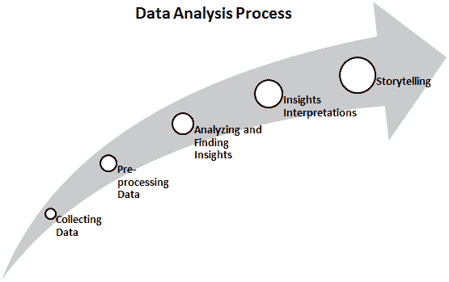

本节中，我们已经涵盖了标准的数据分析过程，重点是寻找可解释的洞察并将其转化为用户故事。在接下来的章节中，我们将讨论 KDD 过程。

# KDD 过程

**KDD**的全称是**数据中的知识发现**或**数据库中的知识发现**。许多人将 KDD 视为数据挖掘的同义词。数据挖掘被称为发现有趣模式的知识发现过程。KDD 的主要目标是从大型数据库、数据仓库以及其他 Web 和信息存储库中提取或发现隐藏的有趣模式。KDD 过程包括七个主要阶段：

1.  **数据清洗**：在此第一阶段，数据进行预处理。在这里，噪声被去除，缺失值得到处理，异常值被检测。

1.  **数据集成**：在此阶段，来自不同来源的数据通过数据迁移和 ETL 工具进行整合。

1.  **数据选择**：在此阶段，相关的分析任务数据被重新收集。

1.  **数据转换**：在此阶段，数据被转换为适合分析的所需形式。

1.  **数据挖掘**：在此阶段，使用数据挖掘技术发现有用的未知模式。

1.  **模式评估**：在此阶段，提取的模式将被评估。

1.  **知识呈现**：在模式评估之后，提取的知识需要进行可视化并呈现给业务人员，以便做出决策。

完整的 KDD 过程如下图所示：

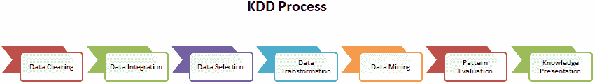

KDD 是一个迭代过程，旨在提升数据质量、集成和转换，以获取更优的系统。现在，让我们讨论 SEMMA 过程。

# SEMMA

**SEMMA**的全称是**样本**、**探索**、**修改**、**建模**和**评估**。这个顺序的数据挖掘过程是由 SAS 公司开发的。SEMMA 过程包括五个主要阶段：

1.  **样本**：在此阶段，我们识别不同的数据库并将它们合并。之后，我们选择足够的用于建模过程的数据样本。

1.  **探索**：在此阶段，我们理解数据，发现变量之间的关系，进行数据可视化，并获得初步的解释。

1.  **修改**：在此阶段，数据为建模准备好。该阶段涉及处理缺失值、检测异常值、转换特征和创建新的附加特征。

1.  **建模**：在此阶段，主要关注选择和应用不同的建模技术，例如线性回归、逻辑回归、反向传播网络、KNN、支持向量机、决策树和随机森林。

1.  **评估**：在最后阶段，开发的预测模型通过性能评估指标进行评估。

下图展示了这一过程：


上图展示了 SEMMA 过程中的各个步骤。SEMMA 强调模型构建和评估。现在，让我们讨论 CRISP-DM 过程。

# CRISP-DM

**CRISP-DM**的全称是**跨行业数据挖掘过程**。CRISP-DM 是一个经过明确定义、结构良好、被验证的机器学习、数据挖掘和商业智能项目过程。它是一种强大、灵活、循环、有用且实用的方法，用于解决商业问题。该过程从多个数据库中发现隐藏的有价值的信息或模式。CRISP-DM 过程包含六个主要阶段：

1.  **商业理解**：在第一阶段，主要目标是理解商业场景和需求，为设计分析目标和初步行动计划做准备。

1.  **数据理解**：在这个阶段，主要目标是理解数据及其收集过程，进行数据质量检查，并获得初步的见解。

1.  **数据准备**：在这个阶段，主要目标是准备适合分析的数据。这包括处理缺失值、检测并处理异常值、数据归一化以及特征工程。对于数据科学家/分析师而言，这一阶段是最耗时的。

1.  **建模**：这是整个过程中最激动人心的阶段，因为这是设计预测模型的环节。首先，分析师需要决定建模技术，并根据数据开发模型。

1.  **评估**：一旦模型开发完成，就该评估和测试模型在验证数据和测试数据上的表现，使用诸如 MSE、RMSE、R-Square（回归）以及准确率、精确率、召回率和 F1 值等模型评估指标。

1.  **部署**：在最后阶段，前一步选择的模型将被部署到生产环境中。这需要数据科学家、软件开发人员、DevOps 专家和商业专业人士的团队协作。

以下图表展示了 CRISP-DM 过程的完整周期：

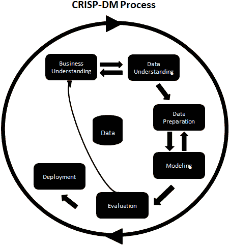

标准过程侧重于通过故事的形式发现洞察并进行解释，而 KDD 则侧重于基于数据的模式发现并进行可视化。SEMMA 主要关注模型构建任务，而 CRISP-DM 则专注于商业理解和部署。现在我们了解了与数据分析相关的一些过程，让我们比较一下数据分析和数据科学，了解它们之间的关系以及彼此的区别。

# 比较数据分析与数据科学

数据分析是探索数据的过程，目的是发现帮助我们做出业务决策的模式。它是数据科学的一个子领域。数据分析方法和工具被业务分析师、数据科学家和研究人员广泛应用于多个业务领域。其主要目标是提高生产力和利润。数据分析从不同来源提取和查询数据，进行探索性数据分析，数据可视化，准备报告，并呈现给业务决策者。

另一方面，数据科学是一个跨学科领域，采用科学方法从结构化和非结构化数据中提取洞察力。数据科学是所有相关领域的集合，包括数据分析、数据挖掘、机器学习和其他相关领域。数据科学不仅限于探索性数据分析，还用于开发模型和预测算法，如股票价格、天气、疾病、欺诈预测，以及推荐系统，如电影、书籍和音乐推荐。

## 数据分析师和数据科学家的角色

数据分析师收集、过滤、处理数据，并应用所需的统计概念，从数据中捕捉模式、趋势和洞察力，并准备报告以支持决策。数据分析师的主要目标是帮助公司通过发现的模式和趋势解决业务问题。数据分析师还评估数据质量，并处理与数据采集相关的问题。数据分析师应精通编写 SQL 查询、发现模式、使用可视化工具，以及使用报告工具，如 Microsoft Power BI、IBM Cognos、Tableau、QlikView、Oracle BI 等。

数据科学家比数据分析师更具技术性和数学性。数据科学家偏向于研究和学术，而数据分析师则更加偏向于应用。数据科学家通常需要预测未来事件，而数据分析师则从数据中提取重要洞察。数据科学家提出自己的问题，而数据分析师回答给定的问题。最后，数据科学家关注**将要发生什么**，而数据分析师关注**迄今为止已经发生了什么**。我们可以通过以下表格总结这两个角色：

| **特点** | **数据科学家** | **数据分析师** |
| --- | --- | --- |
| 背景 | 基于数据预测未来事件和场景 | 从数据中发现有意义的洞察 |
| 角色 | 提出有利于业务的问题 | 解决业务问题以作出决策 |
| 数据类型 | 处理结构化和非结构化数据 | 只处理结构化数据 |
| 编程 | 高级编程 | 基础编程 |
| 技能集 | 统计学、机器学习算法、自然语言处理和深度学习知识 | 统计学、SQL 和数据可视化知识 |
| 工具 | R、Python、SAS、Hadoop、Spark、TensorFlow 和 Keras | Excel、SQL、R、Tableau 和 QlikView |

现在我们已经了解了数据分析师和数据科学家的定义，以及它们之间的区别，让我们来看看成为其中一员所需要的各种技能。

# 数据分析师与数据科学家的技能集

数据分析师是通过数据发现洞察并创造价值的人。这有助于决策者了解业务表现如何。数据分析师必须掌握以下技能：

+   **探索性数据分析（EDA）**：EDA 是数据分析师的一个重要技能。它有助于检查数据以发现模式、检验假设并确保假设的正确性。

+   **关系型数据库**：至少了解一种关系型数据库工具，如 MySQL 或 Postgre，是必须的。SQL 是处理关系型数据库时必备的技能。

+   **可视化和商业智能工具**：一图胜千言。视觉效果对人类有更大的影响，且视觉是表达洞察的清晰简便的方式。像 Tableau、QlikView、MS Power BI 和 IBM Cognos 这样的可视化和商业智能工具可以帮助分析师进行可视化并准备报告。

+   **电子表格**：了解 MS Excel、WPS、Libra 或 Google Sheets 是必不可少的，它们用于以表格形式存储和管理数据。

+   **讲故事与展示技巧**：讲故事的艺术是另一个必备技能。数据分析师应该擅长将数据事实与一个想法或事件联系起来，并将其转化为一个故事。

另一方面，数据科学家的主要工作是通过数据解决问题。为了做到这一点，他们需要了解客户的需求、领域、问题空间，并确保获得他们真正需要的东西。数据科学家的任务因公司而异。有些公司使用数据分析师，并仅将“数据科学家”这一职称用来提升职位的光环。还有一些公司将数据分析师的任务与数据工程师的工作结合起来，并赋予数据科学家这一职称；还有一些则将他们分配到以机器学习为主的数据可视化任务中。

数据科学家的任务因公司而异。有些公司将数据科学家视为知名的数据分析师，并将其职责与数据工程师结合起来。其他公司则让他们执行机器上的密集型数据可视化任务。

数据科学家必须是多面手，能够担任多个角色，包括数据分析师、统计学家、数学家、程序员、机器学习或自然语言处理工程师。大多数人并不在所有这些领域都有足够的技能或是专家。而且，要具备足够的技能需要大量的努力和耐心。这就是为什么数据科学无法在 3 到 6 个月内学成的原因。学习数据科学是一个过程。数据科学家应该拥有多种技能，诸如以下这些：

+   **数学与统计学**：大多数机器学习算法都基于数学和统计学。数学知识帮助数据科学家开发定制的解决方案。

+   **数据库**：掌握 SQL 知识，能让数据科学家与数据库交互，收集数据以进行预测和推荐。

+   **机器学习**：了解监督学习技术，如回归分析、分类技术，以及无监督学习技术，如聚类分析、异常值检测和降维。

+   **编程技能**：编程知识帮助数据科学家自动化其推荐的解决方案。建议掌握 Python 和 R。

+   **故事讲述与演讲技巧**：通过 PowerPoint 演示文稿以故事讲述的形式传达结果。

+   **大数据技术**：了解 Hadoop 和 Spark 等大数据平台，有助于数据科学家为大型企业开发大数据解决方案。

+   **深度学习工具**：深度学习工具，如 Tensorflow 和 Keras，在自然语言处理（NLP）和图像分析中得到应用。

除了这些技能外，数据科学专业人员还需要掌握网络抓取工具/包，用于从不同来源提取数据，以及用于设计原型解决方案的 Web 应用框架，如 Flask 或 Django。这些都是数据科学专业人员所需的技能。

现在我们已经介绍了数据分析和数据科学的基础知识，接下来让我们深入了解数据分析所需的基本设置。在下一节中，我们将学习如何安装 Python。

# 安装 Python 3

安装 Python 3 的安装程序文件可以从官方网站（[`www.python.org/downloads/`](https://www.python.org/downloads/)）轻松下载，支持 Windows、Linux 和 Mac 32 位或 64 位系统。只需双击该安装程序即可进行安装。该安装程序还包含一个名为 "IDLE" 的 IDE，可用于开发。在接下来的几个部分中，我们将深入探讨每个操作系统的安装方法。

## Windows 上的 Python 安装与设置

本书基于最新的 Python 3 版本。书中的所有代码都是用 Python 3 编写的，因此在开始编码之前，我们需要先安装 Python 3。Python 是一种开源、分发和免费使用的语言，并且具有商业使用许可。Python 有许多实现，包括商业实现和分发版本。在本书中，我们将专注于标准的 Python 实现，它保证与 NumPy 兼容。

您可以从 Python 官方网站下载 Python 3.9.x：[`www.python.org/downloads/`](https://www.python.org/downloads/)。在这里，您可以找到适用于 Windows、Linux、Mac OS X 和其他操作系统平台的安装文件。您还可以在 [`docs.python.org/3.7/using/index.html`](https://docs.python.org/3.7/using/index.html) 找到有关如何安装和使用 Python 的说明。

您需要在系统上安装 Python 3.5.x 或更高版本。Python 2.7 的支持结束日期从 2015 年推迟到 2020 年，但在撰写本书时，Python 2.7 将不再由 Python 社区提供支持和维护。

在撰写本书时，我们在 Windows 10 虚拟机上安装了 Python 3.8.3 作为先决条件：[`www.python.org/ftp/python/3.8.3/python-3.8.3.exe`](https://www.python.org/ftp/python/3.8.3/python-3.8.3.exe)。

## 在 Linux 上安装和设置 Python

与其他操作系统相比，在 Linux 上安装 Python 要容易得多。要安装基础库，请运行以下命令行指令：

```py
$ pip3 install numpy scipy pandas matplotlib jupyter notebook
```

如果您在使用的机器上没有足够的权限，在执行上述命令之前，可能需要运行`sudo`命令。

## 使用 GUI 安装程序在 Mac OS X 上安装和设置 Python

Python 可以通过从 Python 官方网站下载的安装文件进行安装。安装文件可以从其官方网页（[`www.python.org/downloads/mac-osx/`](https://www.python.org/downloads/mac-osx/)）下载，适用于 macOS。此安装程序还包含一个名为 "IDLE" 的 IDE，可用于开发。

## 在 Mac OS X 上使用 brew 安装和设置 Python

对于 Mac 系统，您可以使用 Homebrew 包管理器来安装 Python。它将简化为开发人员、研究人员和科学家安装所需应用程序的过程。`brew install` 命令用于安装其他应用程序，例如安装 python3 或任何其他 Python 包，如 NLTK 或 SpaCy。

要安装最新版本的 Python，您需要在终端执行以下命令：

```py
$ brew install python3
```

安装后，您可以通过运行以下命令来确认您已安装的 Python 版本：

```py
$ python3 --version
Python 3.7.4
```

您还可以通过运行以下命令从命令行打开 Python Shell：

```py
$ python3 
```

现在我们知道如何在系统上安装 Python，让我们深入了解开始数据分析所需的实际工具。

# 本书中使用的软件

让我们讨论一下本书中将使用的软件。在本书中，我们将使用 Anaconda IDE 来进行数据分析。在安装之前，我们先了解一下什么是 Anaconda。

只要系统安装了 Python 程序，Python 程序就可以轻松运行。我们可以在记事本上编写程序并在命令提示符上运行它。我们还可以在不同的 IDE（如 Jupyter Notebook、Spyder 和 PyCharm）上编写和运行 Python 程序。Anaconda 是一个免费可用的开源软件包，包含各种数据处理 IDE 和一些用于数据分析的包，如 NumPy、SciPy、Pandas、Scikit-learn 等等。Anaconda 可以轻松下载和安装，具体如下：

1.  从 [`www.anaconda.com/distribution/`](https://www.anaconda.com/distribution/) 下载安装程序。

1.  选择您正在使用的操作系统。

1.  从 Python 3.7 版本部分选择 32 位或 64 位安装程序选项并开始下载。

1.  双击运行安装程序。

1.  安装完成后，在“开始”菜单中检查您的程序或搜索 Anaconda。

Anaconda 还有一个 Anaconda Navigator，这是一个桌面 GUI 应用程序，用于启动应用程序，如 Jupyter Notebook、Spyder、Rstudio、Visual Studio Code 和 JupyterLab：

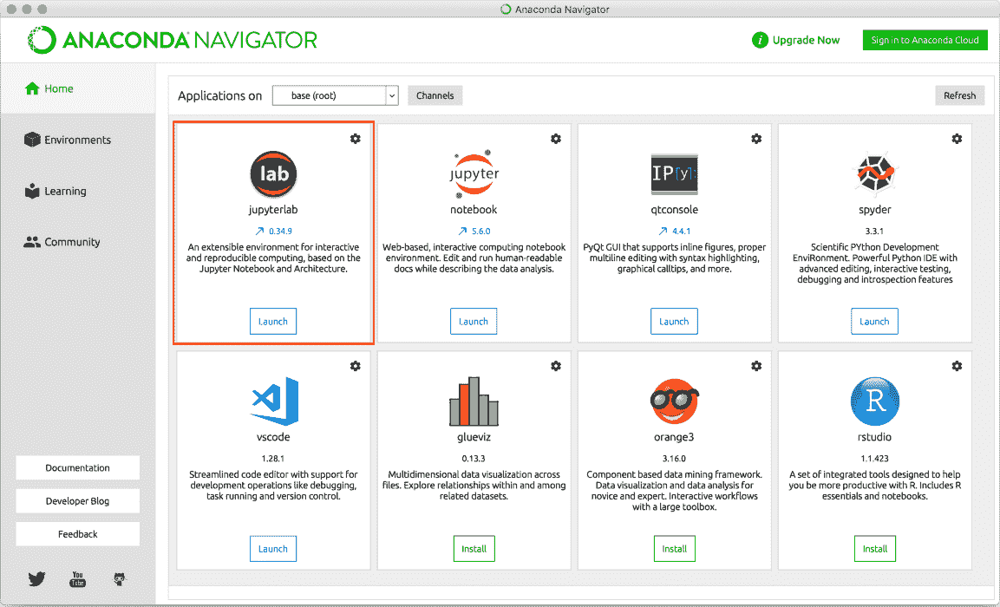

现在，让我们看一下 IPython，这是一个基于 shell 的计算环境，用于数据分析。

# 使用 IPython 作为 shell

IPython 是一个交互式 shell，相当于 Matlab 或 Mathematica 等交互式计算环境。这个交互式 shell 是为快速实验而创建的。对于进行小型实验的数据专业人员非常有用。

IPython shell 提供以下功能：

+   方便访问系统命令。

+   轻松编辑内联命令。

+   Tab 键自动完成，帮助您查找命令并加速任务。

+   命令历史记录，帮助您查看先前使用的命令列表。

+   轻松执行外部 Python 脚本。

+   使用 Python 调试器轻松调试。

现在，让我们在 IPython 上执行一些命令。要启动 IPython，请在命令行上使用以下命令：

```py
$ ipython3
```

当您运行上述命令时，将出现以下窗口：

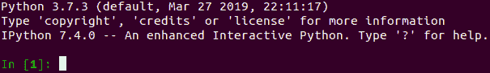

现在，让我们了解并执行 IPython shell 提供的一些命令：

+   **历史命令：** 使用 `history` 命令来查看以前使用过的命令列表。下面的截图显示了如何在 IPython 中使用 `history` 命令：

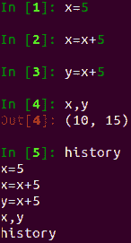

+   **系统命令：** 我们还可以使用感叹号 (`!`) 从 IPython 中运行系统命令。在这里，感叹号后的输入命令被视为系统命令。例如，`!date` 将显示系统的当前日期，而 `!pwd` 将显示当前工作目录：

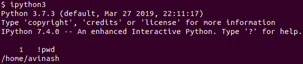

+   **编写函数：** 我们可以像在任何 IDE 中（如 Jupyter Notebook、Python IDLE、PyCharm 或 Spyder）编写函数一样编写它们。让我们看一个函数的例子：

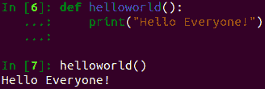

+   **退出 Ipython Shell：** 你可以使用`quit()`或`exit()`，或者按*CTRL + D*来退出或退出 IPython shell：

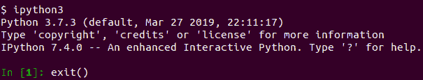

你还可以使用`quit()`命令退出 IPython shell：

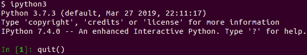

在本小节中，我们已经了解了一些可以在 IPython shell 中使用的基本命令。现在，让我们讨论如何在 IPython shell 中使用`help`命令。

## 阅读手册页

在 IPython shell 中，我们可以使用`help`命令打开可用命令列表。并不需要写出函数的完整名称。你只需输入几个初始字符，然后按*tab*键，它就会找到你正在寻找的词。例如，让我们使用`arrange()`函数。我们可以通过两种方式来获取关于函数的帮助：

+   **使用帮助功能：** 让我们输入`help`并写入函数的几个初始字符。然后，按*tab*键，使用箭头键选择一个函数，按*Enter*键：

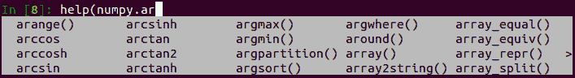

+   **使用问号：** 我们还可以在函数名称后使用问号。以下截图展示了这个例子：

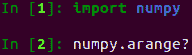

在本小节中，我们了解了为模块函数提供的帮助和问号支持。我们还可以通过库文档获得帮助。让我们讨论如何获取 Python 数据分析库的文档。

## 在哪里找到 Python 数据分析库的帮助和参考资料

以下表格列出了我们在本章中讨论的 Python 数据分析库的文档网站：

| **包/软件** | **描述** |
| --- | --- |
| NumPy | [`numpy.org/doc/`](https://numpy.org/doc/) |
| SciPy | [`docs.scipy.org/doc/`](https://docs.scipy.org/doc/) |
| Pandas | [`pandas.pydata.org/docs/`](https://pandas.pydata.org/docs/) |
| Matplotlib | [`matplotlib.org/3.2.1/contents.html`](https://matplotlib.org/3.2.1/contents.html) |
| Seaborn | [`seaborn.pydata.org/`](https://seaborn.pydata.org/) |
| Scikit-learn | [`scikit-learn.org/stable/`](https://scikit-learn.org/stable/) |
| Anaconda | [`www.anaconda.com/distribution/`](https://www.anaconda.com/distribution/) |

你还可以在 StackOverflow 平台上找到与 NumPy、SciPy、Pandas、Matplotlib、Seaborn 和 Scikit-learn 相关的各种 Python 编程问题的答案。你还可以在 GitHub 上提出与上述库相关的问题。

# **使用 JupyterLab**

JupyterLab 是一个下一代基于 Web 的用户界面。它提供了一组合适的数据分析和机器学习产品开发工具，如文本编辑器、笔记本、代码控制台和终端。它是一个灵活且强大的工具，应该成为任何数据分析师工具包的一部分：

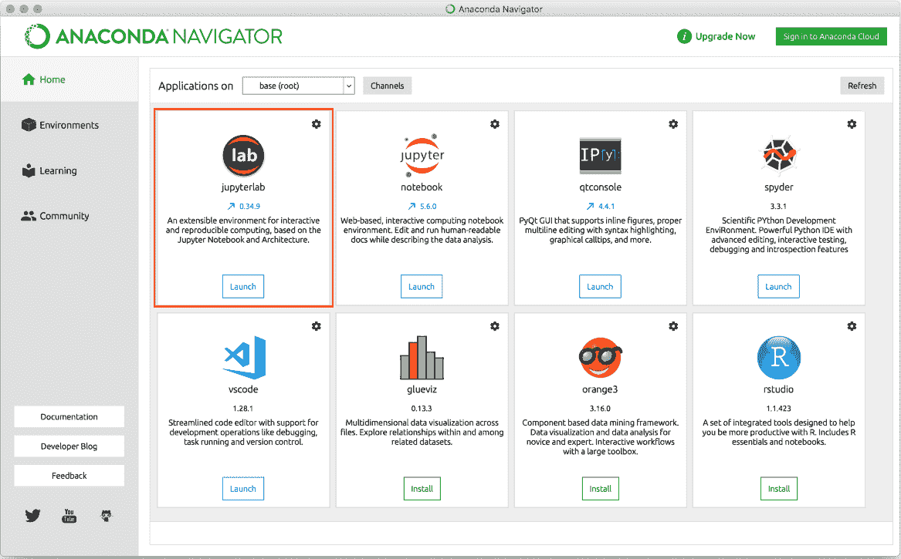

你可以使用`conda`、`pip`或`pipenv`来安装 JupyterLab。

要使用`conda`安装，可以使用以下命令：

```py
$ conda install -c conda-forge jupyterlab
```

要使用`pip`安装，可以使用以下命令：

```py
$ pip install jupyterlab
```

要使用`pipenv`安装，可以使用以下命令：

```py
$ pipenv install jupyterlab
```

在这一节中，我们已经学习了如何安装 Jupyter Lab。在下一节中，我们将重点介绍 Jupyter Notebooks。

# 使用 Jupyter Notebooks

Jupyter Notebook 是一个 Web 应用程序，用于创建包含代码、文本、图形、链接、数学公式和图表的数据分析笔记本。最近，社区推出了基于 Web 的下一代 Jupyter Notebooks，称为 JupyterLab。你可以通过以下链接查看这些笔记本集：

+   [`github.com/jupyter/jupyter/wiki/A-gallery-of-interesting-Jupyter-Notebooks`](https://github.com/jupyter/jupyter/wiki/A-gallery-of-interesting-Jupyter-Notebooks)

+   [`nbviewer.jupyter.org/`](https://nbviewer.jupyter.org/)

这些笔记本通常作为教育工具使用，或者用于展示 Python 软件。我们可以从纯 Python 代码或特殊的笔记本格式导入或导出笔记本。笔记本可以在本地运行，或者我们可以通过运行专用的笔记本服务器使它们在网上可用。一些云计算解决方案，如 Wakari、PiCloud 和 Google Colaboratory，允许你在云端运行笔记本。

"Jupyter" 是一个首字母缩略词，代表 Julia、Python 和 R。最初，开发者为这三种语言实现了它，但现在，它也可以用于其他多种语言，包括 C、C++、Scala、Perl、Go、PySpark 和 Haskell：

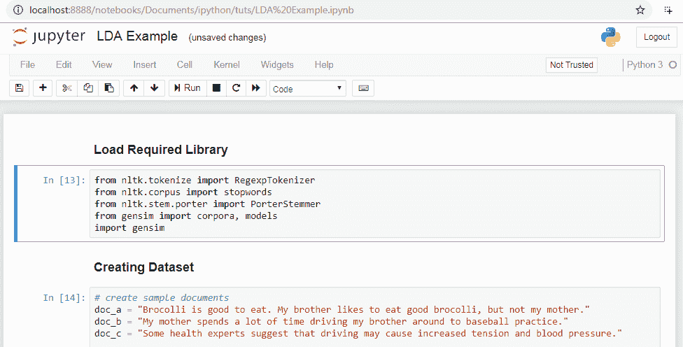

Jupyter Notebook 提供以下功能：

+   它具有在浏览器中编辑代码并保持正确缩进的能力。

+   它具有从浏览器执行代码的能力。

+   它具有在浏览器中显示输出的能力。

+   它可以在单元格输出中渲染图形、图像和视频。

+   它具有以 PDF、HTML、Python 文件和 LaTex 格式导出代码的能力。

我们还可以通过在 Anaconda 提示符中运行以下命令，在 Jupyter Notebooks 中同时使用 Python 2 和 3：

```py
# For Python 2.7
conda create -n py27 python=2.7 ipykernel

# For Python 3.5
conda create -n py35 python=3.5 ipykernel
```

现在我们已经了解了各种工具和库，并且也安装了 Python，让我们进入最常用工具之一 Jupyter Notebooks 的一些高级功能。

# Jupyter Notebooks 的高级功能

Jupyter Notebook 提供了各种高级功能，例如快捷键、安装其他内核、执行 shell 命令和使用各种扩展来加快数据分析操作。让我们开始逐一了解这些功能。

## 快捷键

用户可以通过选择帮助菜单中的“快捷键”选项，或者使用*Cmd + Shift + P*快捷键，在 Jupyter Notebook 内找到所有可用的快捷命令。这将显示快速选择栏，其中包含所有快捷命令以及每个命令的简要说明。使用这个栏非常简单，用户可以在忘记某些快捷键时使用它：

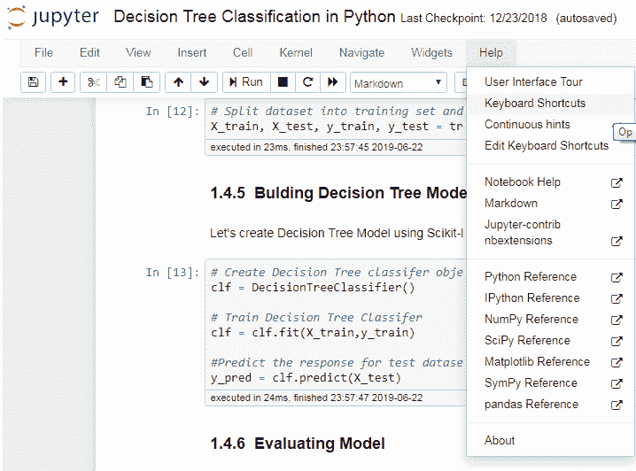

## 安装其他内核

Jupyter 可以运行多个内核支持不同的语言。使用 Anaconda 设置特定语言的环境非常容易。例如，可以通过在 Anaconda 中运行以下命令设置 R 内核：

```py
$ conda install -c r r-essentials
```

然后应会出现 R 内核，如下图所示：

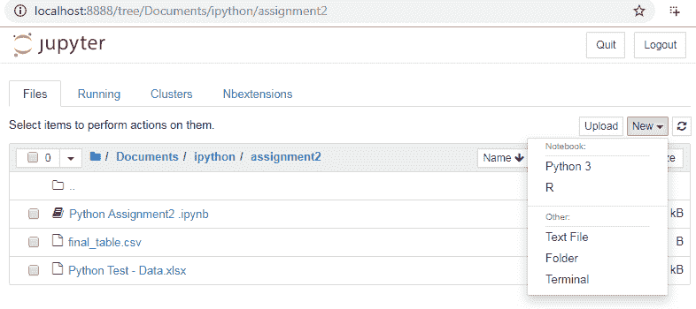

## 运行 shell 命令

在 Jupyter Notebook 中，用户可以运行 Unix 和 Windows 的 shell 命令。shell 提供了一个与计算机进行通信的接口。用户在运行任何命令前需要加上 `!`（感叹号）：

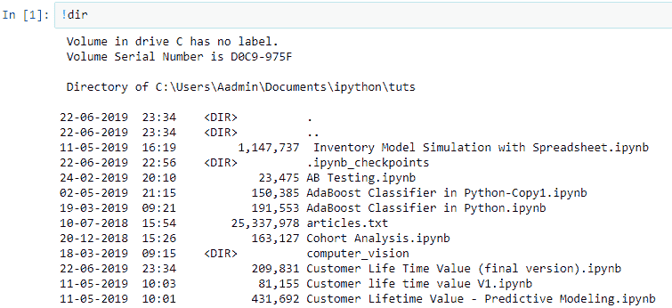

## Notebook 扩展

Notebook 扩展（或 nbextensions）相比基础的 Jupyter Notebook 增加了更多功能。这些扩展提升了用户的体验和界面。用户可以通过选择 **NBextensions** 标签轻松选择任何扩展。

在 Jupyter Notebook 中使用 `conda` 安装 `nbextension`，运行以下命令：

```py
conda install -c conda-forge jupyter_nbextensions_configurator
```

在 Jupyter Notebook 中使用 `pip` 安装 `nbextension`，运行以下命令：

```py
pip install jupyter_contrib_nbextensions && jupyter contrib nbextension install
```

如果在 macOS 上遇到权限错误，只需运行以下命令：

```py
pip install jupyter_contrib_nbextensions && jupyter contrib nbextension install --user 
```

所有可配置的 nbextensions 将显示在一个不同的标签中，如下图所示：

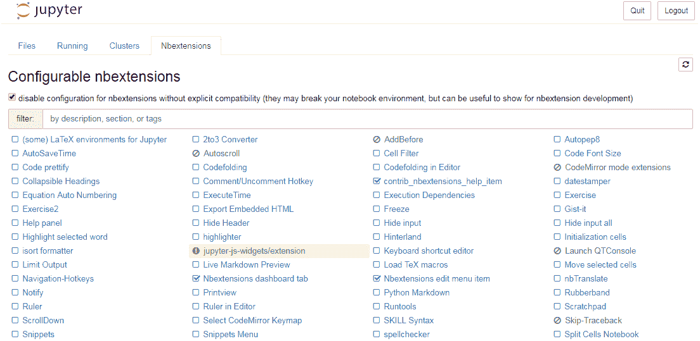

现在，让我们探索 Notebook 扩展的一些有用功能：

+   **Hinterland**：此扩展为每个按键提供自动完成菜单，像 PyCharm 一样在单元格中工作：

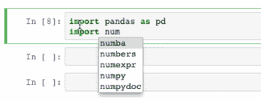

+   **目录**：此扩展会在侧边栏或导航菜单中显示所有标题。它可以调整大小、拖动、折叠，并且可以停靠：

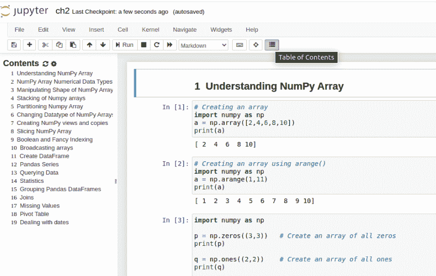

+   **执行时间**：此扩展显示单元格执行的时间以及完成单元格代码所需的时间：

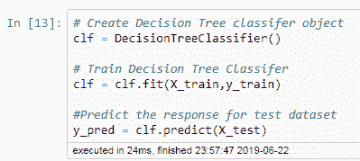

+   **拼写检查器**：拼写检查器会检查并验证每个单元格中书写的拼写，并高亮显示任何拼写错误的单词。

+   **变量选择器**：此扩展跟踪用户的工作空间。它显示用户创建的所有变量的名称，并显示它们的类型、大小、形状和数值。

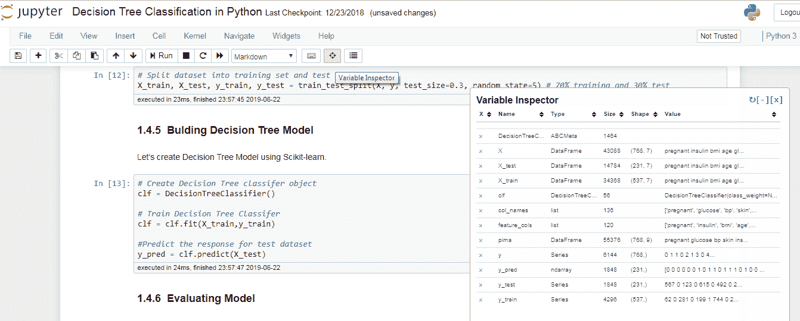

+   **幻灯片放映**：Notebook 结果可以通过幻灯片放映进行展示。这是讲故事的绝佳工具。用户可以轻松将 Jupyter Notebooks 转换为幻灯片，而无需使用 PowerPoint。如以下截图所示，可以通过视图菜单中的单元格工具栏选项启动幻灯片放映：

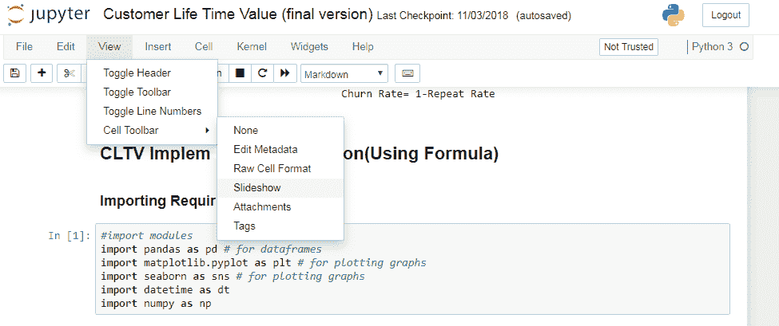

Jupyter Notebook 还允许你在幻灯片中显示或隐藏任何单元格。将幻灯片选项添加到视图菜单的单元格工具栏后，你可以在每个单元格中使用幻灯片类型下拉列表，并选择不同的选项，如下图所示：

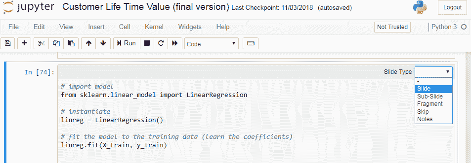

+   **嵌入 PDF 文档**：Jupyter Notebook 用户可以轻松添加 PDF 文档。以下语法需要运行以添加 PDF 文档：

```py
from IPython.display import IFrame
IFrame('https://arxiv.org/pdf/1811.02141.pdf', width=700, height=400)
```

这将产生如下输出：

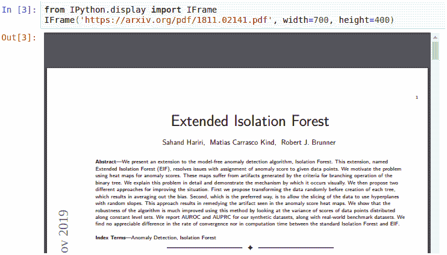

+   **嵌入 YouTube 视频**：Jupyter Notebook 用户可以轻松添加 YouTube 视频。以下语法需要运行以添加 YouTube 视频：

```py
from IPython.display import YouTubeVideo
YouTubeVideo('ukzFI9rgwfU', width=700, height=400)
```

这将产生如下输出：

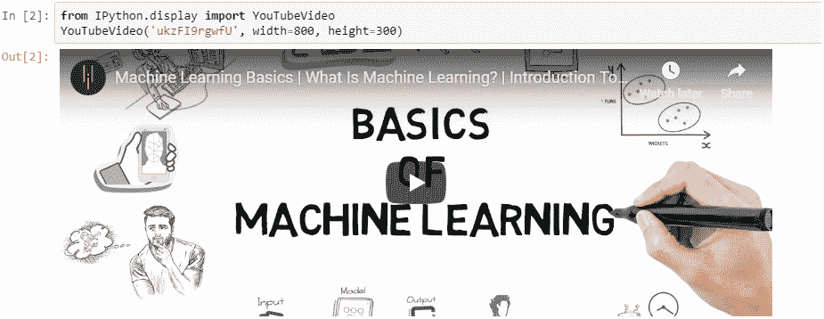

通过这些，你现在了解了数据分析及其所涉及的过程，以及它所包含的角色。你还学习了如何安装 Python 并使用 Jupyter Lab 和 Jupyter Notebook。在接下来的章节中，你将进一步学习各种 Python 库和数据分析技术。

# 总结

在本章中，我们讨论了各种数据分析过程，包括 KDD、SEMMA 和 CRISP-DM。接着我们讨论了数据分析师和数据科学家的角色与技能要求。随后，我们安装了 NumPy、SciPy、Pandas、Matplotlib、IPython、Jupyter Notebook、Anaconda 和 Jupyter Lab，这些都是我们在本书中将要使用的工具。你也可以选择安装 Anaconda 或 Jupyter Lab，它们自带了 NumPy、Pandas、SciPy 和 Scikit-learn。

接着，我们实现了一个向量加法程序，并了解到 NumPy 相比其他库提供了更优的性能。我们还探讨了可用的文档和在线资源。此外，我们讨论了 Jupyter Lab、Jupyter Notebook 及其功能。

在下一章，第二章，*NumPy 和 Pandas* 中，我们将深入了解 NumPy 和 Pandas 的内部实现，并探索一些与数组和数据框（DataFrames）相关的基本概念。
