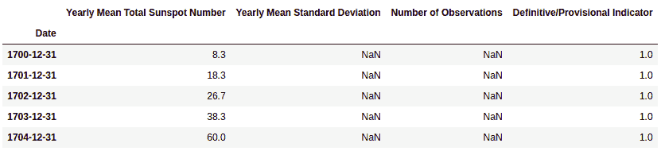
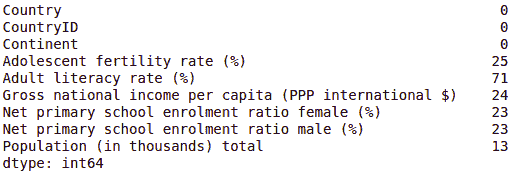
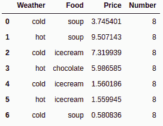

# 第二章：NumPy 和 pandas

现在我们已经理解了数据分析、数据分析过程以及在不同平台上的安装，是时候学习 NumPy 数组和 `pandas` DataFrames 了。本章将带你了解 NumPy 数组和 `pandas` DataFrames 的基础知识。在本章结束时，你将对 NumPy 数组、`pandas` DataFrames 及其相关函数有基本的理解。

`pandas` 以面板数据（一个计量经济学术语）和 Python 数据分析命名，是一个流行的开源 Python 库。在本章中，我们将学习 `pandas` 的基本功能、数据结构和操作。官方的 `pandas` 文档坚持将该项目命名为全小写的 `pandas`。`pandas` 项目坚持的另一个惯例是使用 `import pandas as pd` 的导入语句。

本章我们将重点讨论以下主题：

+   理解 NumPy 数组

+   NumPy 数组数值数据类型

+   操作数组形状

+   NumPy 数组的堆叠

+   划分 NumPy 数组

+   更改 NumPy 数组的数据类型

+   创建 NumPy 视图和副本

+   切片 NumPy 数组

+   布尔和花式索引

+   广播数组

+   创建 `pandas` DataFrames

+   理解 `pandas` Series

+   阅读和查询 Quandl 数据

+   描述 `pandas` DataFrames

+   分组和连接 `pandas` DataFrames

+   处理缺失值

+   创建数据透视表

+   处理日期

# 技术要求

本章具有以下技术要求：

+   你可以在以下 GitHub 链接找到代码和数据集：[`github.com/PacktPublishing/Python-Data-Analysis-Third-Edition/tree/master/Chapter02`](https://github.com/PacktPublishing/Python-Data-Analysis-Third-Edition/tree/master/Chapter02)。

+   所有代码块都可以在 `ch2.ipynb` 中找到。

+   本章使用四个 CSV 文件（`WHO_first9cols.csv`、`dest.csv`、`purchase.csv` 和 `tips.csv`）进行练习。

+   本章我们将使用 NumPy、`pandas` 和 Quandl Python 库。

# 理解 NumPy 数组

可以使用 `pip` 或 `brew` 在 PC 上安装 NumPy，但如果用户使用 Jupyter Notebook，则无需安装。NumPy 已经预装在 Jupyter Notebook 中。我建议你使用 Jupyter Notebook 作为 IDE，因为我们将在 Jupyter Notebook 中执行所有代码。我们在第一章中，*Python 库入门*，已经展示了如何安装 Anaconda，这是一个完整的数据分析套件。NumPy 数组是一系列同质的项目。同质意味着数组中的所有元素都是相同的数据类型。让我们使用 NumPy 创建一个数组。你可以使用 `array()` 函数结合一个项目列表来创建数组。用户还可以固定数组的数据类型。可能的数据类型有 `bool`、`int`、`float`、`long`、`double` 和 `long double`。

让我们来看一下如何创建一个空数组：

```py
# Creating an array
import numpy as np
a = np.array([2,4,6,8,10])
print(a)

Output:
[ 2 4 6 8 10]
```

创建 NumPy 数组的另一种方法是使用 `arange()`。它会创建一个均匀间隔的 NumPy 数组。可以传递三个值 —— start、stop 和 step —— 给 `arange(start,[stop],step)` 函数。start 是范围的起始值，stop 是范围的结束值，而 step 是该范围内的增量。stop 参数是必须的。在以下示例中，我们使用 `1` 作为起始值，`11` 作为结束值。`arange(1,11)` 函数将返回从 1 到 10 的值，步长默认为 1。`arange()` 函数会生成一个比 stop 参数值小 1 的值。让我们通过以下示例来理解这一点：

```py
# Creating an array using arange()
import numpy as np
a = np.arange(1,11)
print(a)

Output:
[ 1 2 3 4 5 6 7 8 9 10]
```

除了 `array()` 和 `arange()` 函数外，还有其他选项，如 `zeros()`、`ones()`、`full()`、`eye()` 和 `random()`，这些也可以用来创建 NumPy 数组，因为这些函数是初始占位符。以下是每个函数的详细说明：

+   `zeros()`: `zeros()` 函数为给定维度创建一个全为 0 的数组。

+   `ones()`: `ones()` 函数为给定维度创建一个全为 1 的数组。

+   `fulls()`: `full()` 函数生成一个具有常数值的数组。

+   `eyes()`: `eye()` 函数创建一个单位矩阵。

+   `random()`: `random()` 函数创建一个具有任意给定维度的数组。

让我们通过以下示例来理解这些函数：

```py
import numpy as np

# Create an array of all zeros
p = np.zeros((3,3)) 
print(p) 

# Create an array of all ones
q = np.ones((2,2)) 
print(q)

# Create a constant array
r = np.full((2,2), 4) 
print(r) 

# Create a 2x2 identity matrix
s = np.eye(4) 
print(s) 

# Create an array filled with random values
t = np.random.random((3,3))
print(t)
```

这将产生以下输出：

```py
[[0\. 0\. 0.]
 [0\. 0\. 0.]
 [0\. 0\. 0.]]

[[1\. 1.]
 [1\. 1.]]

[[4 4]
 [4 4]]

[[1\. 0\. 0\. 0.]
 [0\. 1\. 0\. 0.]
 [0\. 0\. 1\. 0.]
 [0\. 0\. 0\. 1.]]

[[0.16681892 0.00398631 0.61954178]
 [0.52461924 0.30234715 0.58848138]
 [0.75172385 0.17752708 0.12665832]]
```

在前面的代码中，我们已经看到了一些用于创建全零值、全一值和全常数值数组的内置函数。之后，我们使用 `eye()` 函数创建了一个单位矩阵，并使用 `random.random()` 函数创建了一个随机矩阵。接下来，我们将在下一节看到一些其他的数组特性。

## 数组特性

一般来说，NumPy 数组是一种同质的数据结构，所有项的类型相同。数组的主要优点是其存储大小的确定性，因为它们包含相同类型的项。Python 列表使用循环来迭代元素并对其执行操作。NumPy 数组的另一个优点是提供矢量化操作，而不是逐个迭代每个项并对其进行操作。NumPy 数组的索引方式与 Python 列表一样，从 0 开始。NumPy 使用优化的 C API 来加速数组操作的处理。

让我们像前面章节一样，使用 `arange()` 函数创建一个数组，并检查它的数据类型：

```py
# Creating an array using arange()
import numpy as np
a = np.arange(1,11)

print(type(a))
print(a.dtype)
 Output: <class 'numpy.ndarray'>
int64
```

当你使用 `type()` 时，它会返回 `numpy.ndarray`。这意味着 `type()` 函数返回的是容器的类型。当你使用 `dtype()` 时，它将返回 `int64`，因为它是元素的类型。如果你使用的是 32 位的 Python，你也可能得到 `int32` 作为输出。这两种情况都使用整数（32 位和 64 位）。一维的 NumPy 数组也被称为向量。

让我们找出几分钟前我们生成的向量的形状：

```py
print(a.shape)
Output: (10,)
```

如你所见，该向量有 10 个元素，值范围从 1 到 10。数组的 `shape` 属性是一个元组；在这个例子中，它是一个包含一个元素的元组，表示每个维度的长度。

## 选择数组元素

在这一部分，我们将学习如何选择数组中的元素。让我们看一个 2*2 矩阵的例子：

```py
a = np.array([[5,6],[7,8]])
print(a)

Output: [[5 6]
 [7 8]]
```

在前面的例子中，矩阵是通过 `array()` 函数创建的，输入是一个包含列表的列表。

选择数组元素非常简单。我们只需要指定矩阵的索引 `a[m,n]`。这里，`m` 是行索引，`n` 是列索引。我们现在将按顺序选择矩阵中的每个元素，如下代码所示：

```py
print(a[0,0])
Output: 5

print(a[0,1])
Output: 6

printa([1,0])
Output: 7

printa([1,1])
Output: 8

```

在前面的代码示例中，我们尝试使用数组索引访问数组的每个元素。你也可以通过这里的图示理解这一点：


在前面的图示中，我们可以看到它有四个块，每个块代表一个数组元素。每个块中的数值显示其索引。

在这一部分，我们已经了解了数组的基本概念。现在，让我们继续学习数值数据类型的数组。

# NumPy 数组数值数据类型

Python 提供了三种数值数据类型：整数类型、浮点类型和复数类型。在实际应用中，我们需要更多的数据类型来进行科学计算操作，以确保精度、范围和大小。NumPy 提供了大量的数学类型和数值类型。让我们看看下面的 NumPy 数值类型表格：

| **数据类型** | **详细信息** |
| --- | --- |
| `bool` | 这是一个布尔类型，存储一个比特，取值为 `True` 或 `False`。 |
| `inti` | 平台整数可以是 `int32` 或 `int64`。 |
| `int8` | 字节存储的值范围从 `-128` 到 `127`。 |
| `int16` | 该类型存储从 `-32768` 到 `32767` 的整数。 |
| `int32` | 该类型存储从 `-2 ** 31` 到 `2 ** 31 -1` 的整数。 |
| `int64` | 该类型存储从 `-2 ** 63` 到 `2 ** 63 -1` 的整数。 |
| `uint8` | 该类型存储无符号整数，范围从 `0` 到 `255`。 |
| `uint16` | 该类型存储无符号整数，范围从 `0` 到 `65535`。 |
| `uint32` | 该类型存储无符号整数，范围从 `0` 到 `2 ** 32 – 1`。 |
| `uint64` | 该类型存储无符号整数，范围从 `0` 到 `2 ** 64 – 1`。 |
| `float16` | 半精度浮点数；符号位，5 位指数和 10 位尾数。 |
| `float32` | 单精度浮点数；符号位，8 位指数和 23 位尾数。 |
| `float64` 或 `float` | 双精度浮点数；符号位，11 位指数和 52 位尾数。 |
| `complex64` | 复数类型存储两个 32 位浮点数：实数和虚数。 |
| `complex128` 或 `complex` | 复数类型存储两个 64 位浮点数：实数和虚数。 |

对于每种数据类型，都存在一个相应的转换函数：

```py
print(np.float64(21))
Output: 21.0

print(np.int8(21.0))
Output: 42

print(np.bool(21))
Output: True

print(np.bool(0))
Output: False

print(np.bool(21.0))
Output: True

print(np.float(True))
Output: 1.0

print(np.float(False))
Output: 0.0
```

许多函数都有一个数据类型参数，通常是可选的：

```py
arr=np.arange(1,11, dtype= np.float32)
print(arr)
 Output:  
[ 1\. 2\. 3\. 4\. 5\. 6\. 7\. 8\. 9\. 10.]
```

需要注意的是，你不能将复数转换为整数。如果尝试将复合数据类型转换为整数，将会遇到 `TypeError`。我们来看一下以下示例：

```py
np.int(42.0 + 1.j)
```

这将产生以下输出：


如果你尝试将复数转换为浮点数，也会遇到同样的错误。

但是，你可以通过设置各个部分，将浮动值转换为复数。你也可以通过 `real` 和 `imag` 属性提取这些部分。我们通过以下示例来看一下：

```py
c= complex(42, 1)
print(c)

Output: (42+1j)

print(c.real,c.imag)
 Output: 42.0 1.0
```

在前面的示例中，你已经使用 `complex()` 方法定义了一个复数。同时，你通过 `real` 和 `imag` 属性提取了实部和虚部。接下来，让我们来看看 `dtype` 对象。

## `dtype` 对象

我们在本章的前面部分已经看到，`dtype` 告诉我们数组中单个元素的类型。NumPy 数组的元素具有相同的数据类型，这意味着所有元素都有相同的 `dtype`。`dtype` 对象是 `numpy.dtype` 类的实例：

```py
# Creating an array
import numpy as np
a = np.array([2,4,6,8,10])

print(a.dtype)
Output: 'int64'
```

`dtype` 对象还通过 `itemsize` 属性告诉我们数据类型的字节大小：

```py
print(a.dtype.itemsize)
Output:8
```

## 数据类型字符代码

字符代码是为了与 Numeric 兼容。Numeric 是 NumPy 的前身。虽然不推荐使用它，但代码仍然被提供，因为它在不同的地方会出现。你应该使用 `dtype` 对象。以下表格列出了几种不同的数据类型及其相关字符代码：

| **类型** | **字符代码** |
| --- | --- |
| 整数 | i |
| 无符号整数 | u |
| 单精度浮动 | f |
| 双精度浮动 | d |
| 布尔值 | b |
| 复数 | D |
| 字符串 | S |
| Unicode | U |
| 空类型 | V |

我们来看以下代码，生成单精度浮动数组：

```py
# Create numpy array using arange() function
var1=np.arange(1,11, dtype='f')
print(var1)

Output:
[ 1.,  2.,  3.,  4.,  5.,  6.,  7.,  8.,  9., 10.]
```

同样，以下代码创建了一个复数数组：

```py
print(np.arange(1,6, dtype='D'))

Output:
[1.+0.j, 2.+0.j, 3.+0.j, 4.+0.j, 5.+0.j]
```

## `dtype` 构造函数

有许多方法可以通过构造函数创建数据类型。构造函数用于实例化或赋值给对象。在本节中，我们将通过浮动数据类型的例子来理解数据类型的创建：

+   要尝试一个通用的 Python 浮动，请使用以下代码：

```py
print(np.dtype(float))
Output: float64
```

+   要尝试带有字符代码的单精度浮动，请使用以下代码：

```py
print(np.dtype('f'))
Output: float32
```

+   要尝试带有字符代码的双精度浮动，请使用以下代码：

```py
print(np.dtype('d'))
Output: float64
```

+   要尝试带有双字符代码的 `dtype` 构造函数，请使用以下代码：

```py
print(np.dtype('f8'))
Output: float64
```

这里，第一个字符代表类型，第二个字符是指定类型字节数的数字，例如 2、4 或 8。

## `dtype` 属性

`dtype` 类提供了多个有用的属性。例如，我们可以通过 `dtype` 属性获取数据类型的字符代码信息：

```py
# Create numpy array 
var2=np.array([1,2,3],dtype='float64')

print(var2.dtype.char)

Output: 'd'
```

`type` 属性对应数组元素的对象类型：

```py
print(var2.dtype.type)

Output: <class 'numpy.float64'>
```

现在我们已经了解了 NumPy 数组中使用的各种数据类型，让我们在下一节中开始操作它们。

# 操作数组形状

在本节中，我们的主要关注点是数组操作。让我们学习一些 NumPy 的新 Python 函数，如 `reshape()`、`flatten()`、`ravel()`、`transpose()` 和 `resize()`：

+   `reshape()` 会改变数组的形状：

```py
# Create an array
arr = np.arange(12)
print(arr)
 Output: [ 0  1  2  3  4  5  6  7  8  9 10 11]

# Reshape the array dimension
new_arr=arr.reshape(4,3)

print(new_arr)

Output: [[ 0,  1,  2],
               [ 3,  4,  5],
               [ 6,  7,  8],
               [ 9, 10, 11]]

# Reshape the array dimension
new_arr2=arr.reshape(3,4)

print(new_arr2)

Output:
array([[ 0,  1,  2,  3],
       [ 4,  5,  6,  7],
       [ 8,  9, 10, 11]])
```

+   另一种可以应用于数组的操作是 `flatten()`。`flatten()` 将 n 维数组转换为一维数组：

```py
# Create an array
arr=np.arange(1,10).reshape(3,3)
print(arr)

Output: 
[[1 2 3]
 [4 5 6]
 [7 8 9]]

print(arr.flatten())

Output: 
[1 2 3 4 5 6 7 8 9]
```

+   `ravel()` 函数类似于 `flatten()` 函数。它也将 n 维数组转换为一维数组。主要区别在于，`flatten()` 返回的是实际的数组，而 `ravel()` 返回的是原数组的引用。由于 `ravel()` 不占用额外的内存，它比 `flatten()` 更快：

```py
print(arr.ravel())
 Output: 
[1, 2, 3, 4, 5, 6, 7, 8, 9]
```

+   `transpose()` 函数是一个线性代数函数，它将给定的二维矩阵进行转置。转置的意思是将行转化为列，将列转化为行：

```py
# Transpose the matrix
print(arr.transpose())
 Output:
[[1 4 7]
 [2 5 8]
 [3 6 9]]
```

+   `resize()` 函数改变 NumPy 数组的大小。它类似于 `reshape()`，但它会改变原数组的形状：

```py
# resize the matrix
arr.resize(1,9)
print(arr)

Output:[[1 2 3 4 5 6 7 8 9]]
```

在本节的所有代码中，我们看到了用于操作大小的内置函数，如 `reshape()`、`flatten()`、`ravel()`、`transpose()` 和 `resize()`。现在，是时候学习 NumPy 数组的堆叠了。

# NumPy 数组的堆叠

NumPy 提供了数组堆叠功能。堆叠是指沿着新的轴将具有相同维度的数组连接。堆叠可以在水平方向、垂直方向、列方向、行方向或深度方向进行：

+   **水平堆叠**：在水平堆叠中，具有相同维度的数组沿水平轴通过 `hstack()` 和 `concatenate()` 函数连接。让我们来看下面的例子：

```py
arr1 = np.arange(1,10).reshape(3,3)
print(arr1)

Output: [[1 2 3]
 [4 5 6]
 [7 8 9]]
```

我们已经创建了一个 3*3 的数组，现在是时候创建另一个 3*3 的数组了：

```py
arr2 = 2*arr1
print(arr2)

Output: [[ 2 4 6]
 [ 8 10 12]
 [14 16 18]]
```

创建两个数组后，我们将进行水平堆叠：

```py
# Horizontal Stacking
arr3=np.hstack((arr1, arr2))
print(arr3)

Output: [[ 1 2 3 2 4 6]
 [ 4 5 6 8 10 12]
 [ 7 8 9 14 16 18]]
```

在前面的代码中，两个数组沿 *x* 轴被水平堆叠。`concatenate()` 函数也可以用来生成水平堆叠，设置轴参数值为 `1`：

```py
# Horizontal stacking using concatenate() function
arr4=np.concatenate((arr1, arr2), axis=1)
print(arr4)

Output: [[ 1 2 3 2 4 6]
 [ 4 5 6 8 10 12]
 [ 7 8 9 14 16 18]]
```

在前面的代码中，两个数组通过 `concatenate()` 函数被水平堆叠。

+   **垂直堆叠**：在垂直堆叠中，具有相同维度的数组沿垂直轴通过 `vstack()` 和 `concatenate()` 函数连接。让我们来看下面的例子：

```py
# Vertical stacking
arr5=np.vstack((arr1, arr2))
print(arr5)

Output: [[ 1 2 3]
 [ 4 5 6]
 [ 7 8 9]
 [ 2 4 6]
 [ 8 10 12]
 [14 16 18]]
```

在前面的代码中，两个数组沿 *y* 轴被垂直堆叠。`concatenate()` 函数也可以用来生成垂直堆叠，设置轴参数值为 `0`：

```py
arr6=np.concatenate((arr1, arr2), axis=0) 
print(arr6)

Output: [[ 1 2 3]
 [ 4 5 6]
 [ 7 8 9]
 [ 2 4 6]
 [ 8 10 12]
 [14 16 18]]

```

在前面的代码中，两个数组通过 `concatenate()` 函数被垂直堆叠。

+   **深度堆叠**：在深度堆叠中，具有相同维度的数组沿第三个轴（深度）通过 `dstack()` 函数连接。让我们来看下面的例子：

```py
arr7=np.dstack((arr1, arr2))
print(arr7)

Output: [[[ 1 2]
  [ 2 4]
  [ 3 6]]

 [[ 4 8]
  [ 5 10]
  [ 6 12]]

 [[ 7 14]
  [ 8 16]
  [ 9 18]]]
```

在前面的代码中，两个数组沿着第三个轴（深度）进行堆叠。

+   **按列堆叠**：按列堆叠将多个一维数组按列堆叠成一个二维数组。让我们来看一个按列堆叠的例子：

```py
# Create 1-D array
arr1 = np.arange(4,7) 
print(arr1)

Output: [4, 5, 6]
```

在前面的代码块中，我们创建了一个一维的 NumPy 数组。

```py
# Create 1-D array
arr2 = 2 * arr1
print(arr2)

Output: [ 8, 10, 12]
```

在前面的代码块中，我们创建了另一个一维的 NumPy 数组。

```py
# Create column stack
arr_col_stack=np.column_stack((arr1,arr2))
print(arr_col_stack)

Output: [[ 4 8]
 [ 5 10]
 [ 6 12]]
```

在前面的代码中，我们创建了两个一维数组并按列堆叠它们。

+   **按行堆叠**：按行堆叠将多个一维数组按行堆叠成一个二维数组。让我们来看一个按行堆叠的例子：

```py
# Create row stack
arr_row_stack = np.row_stack((arr1,arr2)) 
print(arr_row_stack)

Output: [[ 4 5 6]
 [ 8 10 12]]
```

在前面的代码中，两个一维数组按行堆叠。

现在让我们来看一下如何将一个 NumPy 数组划分为多个子数组。

# NumPy 数组的划分

NumPy 数组可以被划分为多个子数组。NumPy 提供了三种划分功能：垂直划分、水平划分和深度划分。所有的划分函数默认将数组划分为相同大小的子数组，但我们也可以指定划分位置。让我们详细了解每个函数：

+   **水平划分**：在水平划分中，给定数组沿水平方向被划分为 *N* 个相等的子数组，使用 `hsplit()` 函数。让我们看看如何划分一个数组：

```py
# Create an array
arr=np.arange(1,10).reshape(3,3)
print(arr)

Output: 
[[1 2 3]
 [4 5 6]
 [7 8 9]]

# Peroform horizontal splitting
arr_hor_split=np.hsplit(arr, 3)

print(arr_hor_split)

Output: [array([[1],
       [4],
       [7]]), array([[2],
       [5],
       [8]]), array([[3],
       [6],
       [9]])]

```

在前面的代码中，`hsplit(arr, 3)` 函数将数组划分为三个子数组。每个部分是原始数组的一列。

+   **垂直划分**：在垂直划分中，给定数组沿垂直轴被划分为 *N* 个相等的子数组，使用 `vsplit()` 和 `split()` 函数。`split` 函数在 `axis=0` 时执行的操作与 `vsplit()` 函数相同：

```py
# vertical split
arr_ver_split=np.vsplit(arr, 3)

print(arr_ver_split)

Output: [array([[1, 2, 3]]), array([[4, 5, 6]]), array([[7, 8, 9]])]
```

在前面的代码中，`vsplit(arr, 3)` 函数将数组划分为三个子数组。每个部分是原始数组的一行。让我们看一下另一个可以用于垂直和水平划分的函数 `split()`，以下是一个例子：

```py
# split with axis=0
arr_split=np.split(arr,3,axis=0)

print(arr_split)

Output: [array([[1, 2, 3]]), array([[4, 5, 6]]), array([[7, 8, 9]])]

# split with axis=1
arr_split = np.split(arr,3,axis=1)

Output:
[array([[1],
        [4],
        [7]]), array([[2],
        [5],
        [8]]), array([[3],
        [6],
        [9]])]
```

在前面的代码中，`split(arr, 3)` 函数将数组划分为三个子数组。每个部分是原始数组的一行。`split` 的输出在 `axis=0` 时类似于 `vsplit()` 函数，而在 `axis=1` 时类似于 `hsplit()` 函数。

# 更改 NumPy 数组的数据类型

如前所述，NumPy 支持多种数据类型，例如 `int`、`float` 和复数。`astype()` 函数可以将数组的数据类型转换。让我们来看一个 `astype()` 函数的例子：

```py
# Create an array
arr=np.arange(1,10).reshape(3,3)
print("Integer Array:",arr)

# Change datatype of array
arr=arr.astype(float)

# print array
print("Float Array:", arr)

# Check new data type of array
print("Changed Datatype:", arr.dtype)
```

在前面的代码中，我们创建了一个 NumPy 数组，并使用 `dtype` 属性检查它的数据类型。

让我们使用 `astype()` 函数更改数组的数据类型：

```py
# Change datatype of array
arr=arr.astype(float)

# Check new data type of array
print(arr.dtype)

Output: float64
```

在前面的代码中，我们使用 `astype()` 将列的数据类型从整数更改为浮点数。

`tolist()` 函数将 NumPy 数组转换为 Python 列表。让我们来看一个 `tolist()` 函数的例子：

```py
# Create an array
arr=np.arange(1,10)

# Convert NumPy array to Python List
list1=arr.tolist()
print(list1)

Output: [1, 2, 3, 4, 5, 6, 7, 8, 9]
```

在前面的代码中，我们使用 `tolist()` 函数将数组转换为 Python 列表对象。

# 创建 NumPy 视图和副本

一些 Python 函数返回输入数组的副本或视图。Python 的副本会将数组存储在另一个位置，而视图则使用相同的内存内容。这意味着副本是独立的对象，并在 Python 中被视为深拷贝。视图是原始的基础数组，并被视为浅拷贝。以下是副本和视图的一些特点：

+   视图中的修改会影响原始数据，而副本中的修改则不会影响原始数组。

+   视图使用共享内存的概念。

+   与视图相比，副本需要额外的空间。

+   副本比视图慢。

让我们通过以下示例来理解副本和视图的概念：

```py
# Create NumPy Array
arr = np.arange(1,5).reshape(2,2)
print(arr)

Output: [[1, 2],
[3, 4]]
```

创建 NumPy 数组后，我们来进行对象复制操作：

```py
# Create no copy only assignment
arr_no_copy=arr

# Create Deep Copy
arr_copy=arr.copy()

# Create shallow copy using View
arr_view=arr.view()
print("Original Array: ",id(arr))
print("Assignment: ",id(arr_no_copy))
print("Deep Copy: ",id(arr_copy))
print("Shallow Copy(View): ",id(arr_view))

Output: Original Array:  140426327484256
Assignment:  140426327484256
Deep Copy:  140426327483856
Shallow Copy(View):  140426327484496
```

在前面的示例中，你可以看到原始数组和分配的数组具有相同的对象 ID，意味着它们指向相同的对象。副本和视图具有不同的对象 ID；两者会有不同的对象，但视图对象会引用相同的原始数组，而副本会有该对象的不同副本。

让我们继续这个示例，并更新原始数组的值，查看其对视图和副本的影响：

```py
# Update the values of original array
arr[1]=[99,89]

# Check values of array view
print("View Array:\n", arr_view)

# Check values of array copy
print("Copied Array:\n", arr_copy)

Output: 
View Array:
 [[ 1 2]
 [99 89]]
Copied Array:
 [[1 2]
 [3 4]]
```

在前面的示例中，我们可以从结果得出结论：视图是原始数组。当我们更新原始数组时，值发生了变化，而副本是一个独立的对象，因为它的值保持不变。

# 切片 NumPy 数组

NumPy 中的切片与 Python 列表类似。索引操作倾向于选择单一值，而切片用于从数组中选择多个值。

NumPy 数组也支持负索引和切片。这里，负号表示反向方向，索引从右侧开始，起始值为 `-1`：


让我们通过以下代码来检查这个：

```py
# Create NumPy Array
arr = np.arange(0,10)
print(arr)

Output: [0, 1, 2, 3, 4, 5, 6, 7, 8, 9]
```

在切片操作中，我们使用冒号符号来选择一组值。切片有三个值：起始、停止和步长：

```py
print(arr[3:6])
Output: [3, 4, 5]
```

这可以表示如下：


在前面的示例中，我们使用了 `3` 作为起始索引，`6` 作为停止索引：

```py
print(arr[3:])
Output: array([3, 4, 5, 6, 7, 8, 9])
```

在前面的示例中，仅给出了起始索引。`3` 是起始索引。此切片操作将从起始索引开始，选择数组从该索引到数组末尾的值：

```py
print(arr[-3:])
Output: array([7, 8, 9])
```

这可以表示如下：


在前面的示例中，切片操作将选择从数组右侧第三个值开始到数组末尾的值：

```py
print(arr[2:7:2])
Output: array([2, 4,6])
```

这可以表示如下：


在前面的示例中，起始、停止和步长索引分别为 2、7 和 2。在这里，切片操作从第二个索引到第六个（停止值减一）索引选择值，索引值增加 2。因此，输出将是 2、4 和 6。

# 布尔索引和花式索引

索引技术帮助我们从 NumPy 数组中选择和过滤元素。在本节中，我们将重点介绍布尔索引和花式索引。布尔索引在索引的地方使用布尔表达式（在方括号内）来过滤 NumPy 数组。此索引返回对布尔表达式为真的元素：

```py
# Create NumPy Array
arr = np.arange(21,41,2)
print("Orignial Array:\n",arr)

# Boolean Indexing
print("After Boolean Condition:",arr[arr>30])
 Output: Orignial Array:
 [21 23 25 27 29 31 33 35 37 39]
After Boolean Condition: [31 33 35 37 39]
```

花式索引是一种特殊的索引类型，其中数组的元素由索引数组选择。这意味着我们在方括号中传递索引数组。花式索引还支持多维数组。这将帮助我们轻松地选择和修改复杂的多维数组集合。让我们看一个以下示例来理解花式索引：

```py
# Create NumPy Array
arr = np.arange(1,21).reshape(5,4)
print("Orignial Array:\n",arr)

# Selecting 2nd and 3rd row
indices = [1,2]
print("Selected 1st and 2nd Row:\n", arr[indices])

# Selecting 3nd and 4th row
indices = [2,3]
print("Selected 3rd and 4th Row:\n", arr[indices])

Output:

Orignial Array:
 [[ 1 2 3 4]
 [ 5 6 7 8]
 [ 9 10 11 12]
 [13 14 15 16]
 [17 18 19 20]]
Selected 1st and 2nd Row:
 [[ 5 6 7 8]
 [ 9 10 11 12]]
Selected 3rd and 4th Row:
 [[ 9 10 11 12]
 [13 14 15 16]]
```

在上述代码中，我们创建了一个 5*4 的矩阵，并使用整数索引选择了行。您还可以从以下图表中可视化或内部化此输出：


我们可以看到其代码如下：

```py
# Create row and column indices
row = np.array([1, 2])
col = np.array([2, 3])

print("Selected Sub-Array:", arr[row, col])

Output:
Selected Sub-Array: [ 7 12]
```

前面的示例将结果作为第一个值`[1,2]`和第二个值`[2,3]`，作为行和列索引。数组将选择第一个和第二个索引值，分别为 7 和 12。

# 广播数组

Python 列表不支持直接向量化的算术操作。NumPy 提供了比 Python 列表循环操作更快的向量化数组操作。在这里，所有的循环操作都是在 C 中执行而不是 Python，这使得它更快。广播功能检查应用于数组不同形状的二进制函数（如加法、减法和乘法）的一组规则。

让我们看一个广播的例子：

```py
# Create NumPy Array
arr1 = np.arange(1,5).reshape(2,2) 
print(arr1)

Output: [[1 2]
 [3 4]]

# Create another NumPy Array
arr2 = np.arange(5,9).reshape(2,2) 
print(arr2)Output: [[5 6]
 [7 8]]

# Add two matrices
print(arr1+arr2)

Output: [[ 6 8]
 [10 12]]
```

在前面的三个示例中，我们可以看到两个大小相同数组的加法。这个概念称为广播：

```py
# Multiply two matrices
print(arr1*arr2)

Output: [[ 5 12]
 [21 32]]
```

在前面的示例中，两个矩阵进行了乘法运算。让我们执行加法和乘法与标量值：

```py
# Add a scaler value
print(arr1 + 3)

Output: [[4 5]
 [6 7]]

# Multiply with a scalar value
print(arr1 * 3)

Output: [[ 3 6]
 [ 9 12]]
```

在前面的两个示例中，矩阵被加和乘以一个标量值。

# 创建 pandas 数据框

`pandas`库设计用于处理面板或表格数据。`pandas`是一个快速、高效且富有生产力的工具，用于处理和分析字符串、数字、日期时间和时间序列数据。`pandas`提供了如 DataFrame 和 Series 等数据结构。`pandas` DataFrame 是一个二维的带标签和索引的表格数据结构，具有行和列的网格。它的列是异质类型。它能够处理不同类型的对象，进行分组和连接操作，处理缺失值，创建透视表，处理日期。可以通过多种方式创建`pandas` DataFrame。让我们创建一个空的 DataFrame：

```py
# Import pandas library
import pandas as pd

# Create empty DataFrame
df = pd.DataFrame()

# Header of dataframe. 
df.head()

Output:
_ 
```

在前面的示例中，我们创建了一个空的 DataFrame。让我们使用字典列表来创建一个 DataFrame：

```py
# Create dictionary of list
data = {'Name': ['Vijay', 'Sundar', 'Satyam', 'Indira'], 'Age': [23, 45, 46, 52 ]}  

# Create the pandas DataFrame
df = pd.DataFrame(data)

# Header of dataframe.
df.head()

Output:
  Name Age0 Vijay 231 Sundar 45
2 Satyam 46
3 Indira 52
```

在前面的代码中，我们使用了一个字典列表来创建一个 DataFrame。这里，字典的键相当于列，而值则表示为一个列表，相当于 DataFrame 的行。让我们使用字典列表创建一个 DataFrame：

```py
# Pandas DataFrame by lists of dicts. 
# Initialise data to lists. 
data =[ {'Name': 'Vijay', 'Age': 23},{'Name': 'Sundar', 'Age': 25},{'Name': 'Shankar', 'Age': 26}]

# Creates DataFrame. 
df = pd.DataFrame(data,columns=['Name','Age']) 

# Print dataframe header 
df.head() 
```

在前面的代码中，DataFrame 是通过使用字典列表来创建的。在列表中，每个项是一个字典。每个键是列名，每个值是某一行的单元格值。让我们使用元组列表创建一个 DataFrame：

```py
# Creating DataFrame using list of tuples.
data = [('Vijay', 23),( 'Sundar', 45), ('Satyam', 46), ('Indira',52)]

# Create dataframe
df = pd.DataFrame(data, columns=['Name','Age'])

# Print dataframe header
df.head() 

Output:
  Name Age
0 Vijay 23
1 Sundar 25
2 Shankar 26
```

在前面的代码中，DataFrame 是通过使用元组列表来创建的。在列表中，每个项是一个元组，每个元组相当于一行的列。

# 理解 pandas Series

`pandas` Series 是一个一维的顺序数据结构，能够处理任何类型的数据，如字符串、数字、日期时间、Python 列表和字典，具有标签和索引。Series 是 DataFrame 的其中一列。我们可以使用 Python 字典、NumPy 数组和标量值来创建 Series。我们还将在本节后面看到`pandas` Series 的特性和属性。让我们创建一些 Python Series：

+   **使用 Python 字典**：创建一个字典对象，并将其传递给 Series 对象。让我们看一下下面的示例：

```py
# Creating Pandas Series using Dictionary
dict1 = {0 : 'Ajay', 1 : 'Jay', 2 : 'Vijay'}

# Create Pandas Series
series = pd.Series(dict1)

# Show series
series

Output: 0     Ajay
1      Jay
2    Vijay
dtype: object
```

+   **使用 NumPy 数组**：创建一个 NumPy 数组对象，并将其传递给 Series 对象。让我们看一下下面的示例：

```py
#Load Pandas and NumPy libraries
import pandas as pd
import numpy as np

# Create NumPy array
arr = np.array([51,65,48,59, 68])

# Create Pandas Series
series = pd.Series(arr)
series

Output: 0    51
1    65
2    48
3    59
4    68
dtype: int64
```

+   **使用单一标量值**：要创建一个包含标量值的`pandas` Series，可以将标量值和索引列表传递给 Series 对象：

```py
# load Pandas and NumPy
import pandas as pd
import numpy as np

# Create Pandas Series
series = pd.Series(10, index=[0, 1, 2, 3, 4, 5])
series

Output: 0    10
1    10
2    10
3    10
4    10
5    10
dtype: int64
```

让我们探索一下`pandas` Series 的一些特性：

+   我们也可以通过选择一列来创建一个序列，例如`country`，它恰好是数据文件中的第一列。然后，显示当前本地作用域中的对象类型：

```py
# Import pandas
import pandas as pd

# Load data using read_csv()
df = pd.read_csv("WHO_first9cols.csv")

# Show initial 5 records
df.head()
```

这将产生以下输出：


在上述代码中，我们使用`read_csv()`函数读取了`WHO_first9cols.csv`文件。您可以从以下 GitHub 位置下载此文件：[`github.com/PacktPublishing/Python-Data-Analysis-Third-Edition/tree/master/Chapter02`](https://github.com/PacktPublishing/Python-Data-Analysis-Third-Edition/tree/master/Chapter02)。在输出中，您可以看到使用`head()`函数查看的`WHO_first9cols`数据集中的前五条记录：

```py
# Select a series
country_series=df['Country']

# check datatype of series
type(country_series)

Output:
pandas.core.series.Series
```

+   `pandas` Series 数据结构具有与 DataFrame 共享的一些共同属性，并且还具有一个`name`属性。按以下方式探索这些属性：

```py
# Show the shape of DataFrame
print("Shape:", df.shape)

Output: Shape: (202, 9)
```

让我们查看一下 DataFrame 的列列表：

```py
# Check the column list of DataFrame
print("List of Columns:", df.columns)

Output:List of Columns: Index(['Country', 'CountryID', 'Continent', 'Adolescent fertility rate (%)',
       'Adult literacy rate (%)',
       'Gross national income per capita (PPP international $)',
       'Net primary school enrolment ratio female (%)',
       'Net primary school enrolment ratio male (%)',
       'Population (in thousands) total'],
       dtype='object')
```

让我们检查一下 DataFrame 列的数据类型：

```py
# Show the datatypes of columns
print("Data types:", df.dtypes)

Output: Data types: Country                                                    object
            CountryID                                                   int64
            Continent                                                   int64
            Adolescent fertility rate (%)                             float64
            Adult literacy rate (%)                                   float64
            Gross national income per capita (PPP international $)    float64
            Net primary school enrolment ratio female (%)             float64
            Net primary school enrolment ratio male (%)               float64
            Population (in thousands) total                           float64
            dtype: object
```

1.  让我们看看`pandas` Series 的切片操作：

```py
# Pandas Series Slicing
country_series[-5:]

Output:
197               Vietnam
198    West Bank and Gaza
199                 Yemen
200                Zambia
201              Zimbabwe
Name: Country, dtype: object
```

现在我们知道如何使用 pandas Series，接下来让我们使用 Quandl 来处理数据库。

# 读取和查询 Quandl 数据

在上一部分，我们看到了`pandas` DataFrame，它们具有类似关系数据库的表格结构。它们提供类似的查询操作。在本节中，我们将重点介绍 Quandl。Quandl 是一家总部位于加拿大的公司，提供用于投资数据分析师的商业和替代金融数据。Quandl 理解投资和金融定量分析师的需求。它通过 API、R、Python 或 Excel 提供数据。

在本节中，我们将从 Quandl 中检索 Sunspot 数据集。我们可以使用 API 或手动下载 CSV 格式的数据。

首先，我们使用`pip`安装 Quandl 包：

```py
$ pip3 install Quandl
```

如果您想安装 API，可以通过从[`pypi.python.org/pypi/Quandl`](https://pypi.python.org/pypi/Quandl)下载安装包，或通过运行上述命令来安装。

使用该 API 是免费的，但每天限 50 次 API 调用。如果需要更多的 API 调用，您需要请求一个认证密钥。本教程中的代码没有使用密钥。应该很容易修改代码以使用密钥或读取已下载的 CSV 文件。如果遇到困难，请参考[第一章](https://docs.google.com/document/d/1BDrtOc3RwvX2ZzT42tRXvfrzPQ8EMJRy/edit#bookmark=id.4d34og8)中的*如何获取帮助和参考资料*部分，或浏览 Python 文档：[`docs.python.org/2/`](https://docs.python.org/2/)。

让我们看看如何在`pandas` DataFrame 中查询数据：

1.  第一步，显然我们需要下载数据。在导入 Quandl API 后，按照以下方式获取数据：

```py
import quandl
sunspots = quandl.get("SIDC/SUNSPOTS_A")
```

1.  `head()`和`tail()`方法的功能类似于 Unix 中具有相同名称的命令。选择 DataFrame 的前*n*和后*n*条记录，其中*n*是一个整数参数：

```py
sunspots.head()
```

这将产生以下输出：



让我们按照如下方式查看`tail`函数：

```py
sunspots.tail()
```

这将产生以下输出：


`head()` 和 `tail()` 方法分别返回 Sunspot 数据的前五行和最后五行。

1.  **筛选列**：`pandas` 提供了选择列的功能。我们来选择 `pandas` DataFrame 中的列：

```py
# Select columns
sunspots_filtered=sunspots[['Yearly Mean Total Sunspot Number','Definitive/Provisional Indicator']]

# Show top 5 records
sunspots_filtered.head()
```

这将产生以下输出：


1.  **筛选行**：`pandas` 提供了选择行的功能。我们来选择 `pandas` DataFrame 中的行：

```py
# Select rows using index
sunspots["20020101": "20131231"]
```

这将产生以下输出：


1.  **布尔过滤**：我们可以使用类似于 SQL 中 `WHERE` 子句的布尔条件查询数据。我们来筛选出大于算术平均值的数据：

```py
# Boolean Filter
sunspots[sunspots['Yearly Mean Total Sunspot Number'] > sunspots['Yearly Mean Total Sunspot Number'].mean()]
```

这将产生以下输出：


# 描述 `pandas` DataFrame

`pandas` DataFrame 具有十几种统计方法。下表列出了这些方法，并简要描述了每种方法：

| **方法** | **描述** |
| --- | --- |
| `describes` | 此方法返回一个包含描述性统计信息的小表格。 |
| `count` | 此方法返回非 NaN 项的数量。 |
| `mad` | 此方法计算均值绝对偏差，这是类似于标准差的稳健度量。 |
| `median` | 此方法返回中位数。它等于第 50^(th) 百分位数的值。 |
| `min` | 此方法返回最小值。 |
| `max` | 此方法返回最大值。 |
| `mode` | 此方法返回众数，即最频繁出现的值。 |
| `std` | 此方法返回标准差，用于衡量数据的离散程度。它是方差的平方根。 |
| `var` | 此方法返回方差。 |
| `skew` | 此方法返回偏度。偏度表示分布的对称性。 |
| `kurt` | 此方法返回峰度。峰度表示分布的形状。 |

使用上一节相同的数据，我们将展示这些统计方法：

```py
# Describe the dataset
df.describe()
```

这将产生以下输出：


`describe()` 方法将展示所有列的绝大多数描述性统计量：

```py
# Count number of observation
df.count()
```

这将产生以下输出：


`count()` 方法计算每一列中的观察值数量。它帮助我们检查数据集中的缺失值。除了最初的三列，其他列都有缺失值。类似地，你可以计算中位数、标准差、均值绝对偏差、方差、偏度和峰度：

```py
# Compute median of all the columns
df.median()
```

这将产生以下输出：


我们可以按如下方式计算所有列的偏差：

```py
# Compute the standard deviation of all the columns
df.std()
```

这将产生以下输出：


上述代码示例正在计算每个数字列的标准差。

# 对 `pandas` DataFrame 的分组与连接

分组是数据聚合操作的一种。分组术语来源于关系型数据库。关系型数据库软件使用 `group by` 关键字将列中相似的值进行分组。我们可以对分组应用聚合函数，例如均值、最小值、最大值、计数和求和。`pandas` DataFrame 也提供了类似的功能。分组操作基于拆分-应用-合并策略。它首先将数据分成组，并对每个组应用聚合操作，如均值、最小值、最大值、计数和求和，然后将每个组的结果合并：

```py
# Group By DataFrame on the basis of Continent column
df.groupby('Continent').mean()
```

这将产生以下输出：


现在，让我们根据文盲率对 DataFrame 进行分组：

```py
# Group By DataFrame on the basis of continent and select adult literacy rate(%)
df.groupby('Continent').mean()['Adult literacy rate (%)']
```

这将产生以下输出：


在上面的例子中，我们计算了按大洲划分的成人文盲率百分比。你也可以通过将多个列的列表传递给 `groupby()` 函数来进行多列分组。

连接是一种用于表格数据库的合并操作。连接概念源自关系型数据库。在关系型数据库中，表被规范化或拆分以减少冗余和不一致性，连接用于从多个表中选择信息。数据分析师需要将来自多个来源的数据进行合并。`pandas` 也提供了通过 `merge()` 函数连接多个 DataFrame 的功能。

为了理解连接操作，我们将以一个出租车公司为例。我们使用两个文件：`dest.csv` 和 `tips.csv`。每当司机将乘客送到目的地时，我们会将一条记录（员工编号和目的地）插入 `dest.csv` 文件中。每当司机获得小费时，我们会将记录（员工编号和小费金额）插入 `tips.csv` 文件中。你可以从以下 GitHub 链接下载这两个文件：[`github.com/PacktPublishing/Python-Data-Analysis-Third-Edition/tree/master/Python-Data-Analysis-Third-Edition/Ch2`](https://github.com/PacktPublishing/Python-Data-Analysis-Third-Edition/tree/master/Python-Data-Analysis-Third-Edition/Ch2)：

```py
# Import pandas
import pandas as pd

# Load data using read_csv()
dest = pd.read_csv("dest.csv")

# Show DataFrame
dest.head()
```

这将产生以下输出：


在前面的代码块中，我们使用 `read_csv()` 方法读取了 `dest.csv` 文件：

```py
# Load data using read_csv()
tips = pd.read_csv("tips.csv")

# Show DataFrame
tips.head()
```

这将产生以下输出：


在前面的代码块中，我们使用 `read_csv()` 方法读取了 `tips.csv` 文件。接下来，我们将查看不同类型的连接操作：

+   **内连接**：内连接相当于集合的交集操作。它只会选择两个 DataFrame 中的共同记录。要执行内连接，使用 `merge()` 函数，指定两个 DataFrame 和公共属性作为参数，并设置 `how` 为 "inner" 来展示参数。`on` 参数用于提供连接所依据的公共属性，`how` 定义连接类型：

```py
# Join DataFrames using Inner Join
df_inner= pd.merge(dest, tips, on='EmpNr', how='inner')
df_inner.head()
```

这会产生以下输出：


+   **全外连接**：外连接相当于集合的并操作。它将合并左右两个 DataFrame。它会包含两个 DataFrame 中的所有记录，并在没有匹配的地方填充 NaN：

```py
# Join DataFrames using Outer Join
df_outer= pd.merge(dest, tips, on='EmpNr', how='outer')
df_outer.head()
```

这会产生以下输出：


+   **右外连接**：在右外连接中，所有来自 DataFrame 右侧的记录都会被选中。如果在左侧 DataFrame 中找不到匹配的记录，则用 NaN 填充：

```py
# Join DataFrames using Right Outer Join
df_right= pd.merge(dest, tips, on='EmpNr', how='right')
df_right.head()
```

这会产生以下输出：


+   **左外连接**：在左外连接中，所有来自 DataFrame 左侧的记录都会被选中。如果在右侧 DataFrame 中找不到匹配的记录，则用 NaN 填充：

```py
# Join DataFrames using Left Outer Join
df_left= pd.merge(dest, tips, on='EmpNr', how='left')
df_left.head()
```

这会产生以下输出：


我们现在将继续检查数据集中的缺失值。

# 处理缺失值

大多数现实世界中的数据集都是杂乱无章且充满噪声的。由于其杂乱和噪声，许多值要么是错误的，要么是缺失的。`pandas` 提供了许多内置函数来处理 DataFrame 中的缺失值：

+   **检查 DataFrame 中的缺失值**：`pandas` 的 `isnull()` 函数检查是否存在空值，并返回 `True` 或 `False`，其中 `True` 表示空值，`False` 表示非空值。`sum()` 函数会将所有 `True` 值相加，返回缺失值的数量。我们尝试了两种方法来计算缺失值，两者显示的输出相同：

```py
# Count missing values in DataFrame
pd.isnull(df).sum()
```

以下是第二种方法：

```py
df.isnull().sum()
```

这会产生以下输出：



+   **删除缺失值**：一种非常简单的处理缺失值的方法是删除它们以便进行分析。`pandas` 提供了 `dropna()` 函数来删除 DataFrame 中的这些观察值。在这里，`inplace=True` 属性会在原始 DataFrame 中进行更改：

```py
# Drop all the missing values
df.dropna(inplace=True)

df.info()
```

这会产生以下输出：


在这里，观察值的数量从 202 减少到 118。

+   **填充缺失值**：另一种方法是用零、均值、中位数或常数值填充缺失值：

```py
# Fill missing values with 0
df.fillna(0,inplace=True)

df.info()
```

这会产生以下输出：


在这里，我们用 0 填充了缺失值。这就是处理缺失值的全部内容。

在下一节中，我们将重点讨论数据透视表。

# 创建数据透视表

数据透视表是一个汇总表格，它是 Excel 中最流行的概念。大多数数据分析师将其作为一个方便的工具来总结他们的结果。`pandas` 提供了 `pivot_table()` 函数来汇总 DataFrame。DataFrame 使用聚合函数进行汇总，例如均值、最小值、最大值或总和。你可以从以下 GitHub 链接下载数据集：[`github.com/PacktPublishing/Python-Data-Analysis-Third-Edition/tree/master/Python-Data-Analysis-Third-Edition/Ch2`](https://github.com/PacktPublishing/Python-Data-Analysis-Third-Edition/tree/master/Python-Data-Analysis-Third-Edition/Ch2)：

```py
# Import pandas
import pandas as pd

# Load data using read_csv()
purchase = pd.read_csv("purchase.csv")

# Show initial 10 records
purchase.head(10)
```

这将产生以下输出：



在前面的代码块中，我们使用 `read_csv()` 方法读取了 `purchase.csv` 文件。

现在，我们将使用以下代码汇总 DataFrame：

```py
# Summarise dataframe using pivot table
pd.pivot_table(purchase,values='Number', index=['Weather',],
                    columns=['Food'], aggfunc=np.sum)
```

这将产生以下输出：


在前面的示例中，`purchase` DataFrame 被汇总。这里，`index` 是 `Weather` 列，`columns` 是 `Food` 列，`values` 是 `Number` 列的聚合总和。`aggfun` 被初始化为 `np.sum` 参数。现在是时候学习如何在 `pandas` DataFrame 中处理日期了。

# 处理日期

处理日期是繁琐而复杂的。你可以回想起 Y2K 问题、即将到来的 2038 问题以及时区处理的不同问题。在时间序列数据集中，我们会遇到日期。`pandas` 提供了日期范围，重新采样时间序列数据，并执行日期算术操作。

创建一个从 2020 年 1 月 1 日开始的日期范围，持续 45 天，如下所示：

```py
pd.date_range('01-01-2000', periods=45, freq='D')

Output: DatetimeIndex(['2000-01-01', '2000-01-02', '2000-01-03', '2000-01-04',
               '2000-01-05', '2000-01-06', '2000-01-07', '2000-01-08',
               '2000-01-09', '2000-01-10', '2000-01-11', '2000-01-12',
               '2000-01-13', '2000-01-14', '2000-01-15', '2000-01-16',
               '2000-01-17', '2000-01-18', '2000-01-19', '2000-01-20',
               '2000-01-21', '2000-01-22', '2000-01-23', '2000-01-24',
               '2000-01-25', '2000-01-26', '2000-01-27', '2000-01-28',
               '2000-01-29', '2000-01-30', '2000-01-31', '2000-02-01',
               '2000-02-02', '2000-02-03', '2000-02-04', '2000-02-05',
               '2000-02-06', '2000-02-07', '2000-02-08', '2000-02-09',
               '2000-02-10', '2000-02-11', '2000-02-12', '2000-02-13',
               '2000-02-14'],
              dtype='datetime64[ns]', freq='D')
```

1 月份的天数少于 45 天，因此结束日期落在了 2 月份，你可以自己检查。

`date_range()` 的 freq 参数可以取值，例如 `B` 表示工作日频率，`W` 表示每周频率，`H` 表示每小时频率，`M` 表示每分钟频率，`S` 表示每秒频率，`L` 表示每毫秒频率，`U` 表示每微秒频率。更多详情，请参考官方文档：[`pandas.pydata.org/pandas-docs/stable/user_guide/timeseries.html`](https://pandas.pydata.org/pandas-docs/stable/user_guide/timeseries.html)。

+   **pandas 日期范围：** `date_range()` 函数生成具有固定频率间隔的日期和时间序列：

```py
# Date range function
pd.date_range('01-01-2000', periods=45, freq='D')
```

这将产生以下输出：


+   `to_datetime()`：`to_datetime()` 将时间戳字符串转换为 datetime：

```py
# Convert argument to datetime
pd.to_datetime('1/1/1970')

Output:  Timestamp('1970-01-01 00:00:00')
```

+   我们可以将时间戳字符串转换为指定格式的 datetime 对象：

```py
# Convert argument to datetime in specified format
pd.to_datetime(['20200101', '20200102'], format='%Y%m%d')

Output: DatetimeIndex(['2020-01-01', '2020-01-02'], dtype='datetime64[ns]', freq=None)
```

+   **处理未知格式字符串：** 未知的输入格式可能会导致值错误。我们可以通过使用带有 `coerce` 的 `errors` 参数来处理这种情况。`coerce` 将无效的字符串设置为 NaT：

```py
# Value Error
pd.to_datetime(['20200101', 'not a date'])

Output: ValueError: ('Unknown string format:', 'not a date')

# Handle value error
pd.to_datetime(['20200101', 'not a date'], errors='coerce')

Output: DatetimeIndex(['2020-01-01', 'NaT'], dtype='datetime64[ns]', freq=None)
```

在前面的示例中，第二个日期仍然无效，无法转换为 datetime 对象。`errors` 参数帮助我们通过输入值 `NaT`（不是时间）来处理此类错误。

# 摘要

在本章中，我们探讨了 NumPy 和 pandas 库。这两个库都用于处理数组和 DataFrame。NumPy 数组能够处理 n 维数组。我们学习了各种数组属性和操作。我们的主要关注点是数据类型、数据类型作为对象、重塑、堆叠、拆分、切片和索引。

我们还专注于用于 Python 数据分析的`pandas`库。我们看到了`pandas`如何模拟关系数据库表的功能。它提供了查询、聚合、操作和高效连接数据的功能。

NumPy 和`pandas`作为工具协同工作，使得执行基本的数据分析成为可能。此时，您可能会认为`pandas`是我们进行数据分析所需的一切。然而，数据分析远不止于此。

在掌握了基础知识后，是时候进入使用第三章中常用统计函数进行数据分析的环节，*统计学*。这包括了统计概念的应用。

鼓励您阅读*参考文献*部分中提到的书籍，深入探索 NumPy 和`pandas`。

# 参考文献

+   Ivan Idris, *NumPy Cookbook – 第二版*，Packt Publishing，2015 年。

+   Ivan Idris, *学习 NumPy 数组*，Packt Publishing，2014 年。

+   Ivan Idris, *NumPy：初学者指南* *– 第三版*，Packt Publishing，2015 年。

+   L. (L.-H.) Chin 和 T. Dutta，*NumPy 基础*，Packt Publishing，2016 年。

+   T. Petrou, *pandas Cookbook*，Packt Publishing，2017 年。

+   F. Anthony, *精通 pandas*，Packt Publishing，2015 年。

+   M. Heydt, *金融领域的 pandas 精通*，Packt Publishing，2015 年。

+   T. Hauck, *使用 pandas 进行数据密集型应用的操作指南*，Packt Publishing，2013 年。

+   M. Heydt, *学习 pandas*，Packt Publishing，2015 年。
