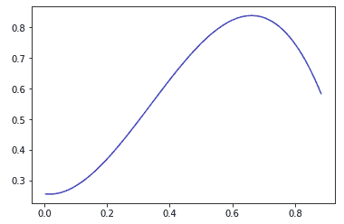
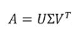
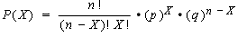
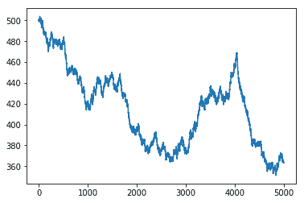
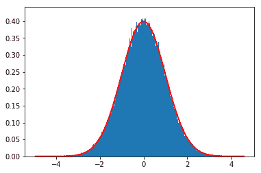
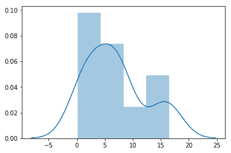
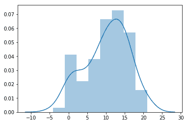
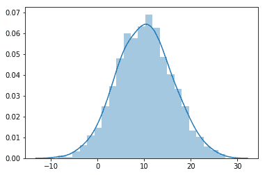
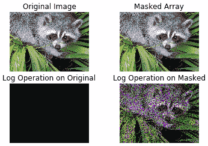

# 第四章：线性代数

线性代数和统计学是任何数据分析活动的基础。统计学帮助我们获得初步的描述性理解，并从数据中做出推断。在上一章中，我们已经理解了数据分析的描述性和推断性统计度量。另一方面，线性代数是数据专业人员的核心基础之一。线性代数对于处理向量和矩阵非常有用。大多数数据以向量或矩阵的形式存在。深入理解线性代数有助于数据分析师和数据科学家理解机器学习和深度学习算法的工作流程，使他们能够根据业务需求灵活地设计和修改算法。例如，如果你想使用**主成分分析**（**PCA**），你必须了解特征值和特征向量的基础知识；或者如果你想开发一个推荐系统，你必须了解**奇异值分解**（**SVD**）。扎实的数学和统计学背景将有助于更顺利地过渡到数据分析领域。

本章主要关注线性代数的核心概念，如多项式、行列式、矩阵逆；解线性方程；特征值和特征向量；SVD；随机数；二项分布和正态分布；正态性检验；以及掩码数组。我们还可以使用 Python 的 NumPy 和 SciPy 包来执行这些操作。NumPy 和 SciPy 都提供了用于线性代数运算的 `linalg` 包。

本章将涵盖以下主题：

+   使用 NumPy 拟合多项式

+   行列式

+   查找矩阵的秩

+   使用 NumPy 计算矩阵逆

+   使用 NumPy 解线性方程

+   使用 SVD 分解矩阵

+   使用 NumPy 计算特征向量和特征值

+   生成随机数

+   二项分布

+   正态分布

+   使用 SciPy 检验数据的正态性

+   使用 `numpy.ma` 子包创建掩码数组

# 技术要求

本章的以下技术信息可供参考：

+   你可以在以下 GitHub 链接找到代码和数据集：[`github.com/PacktPublishing/Python-Data-Analysis-Third-Edition/tree/master/Chapter04`](https://github.com/PacktPublishing/Python-Data-Analysis-Third-Edition/tree/master/Chapter04)。

+   所有的代码块都可以在 `ch4.ipynb` 中找到。

+   本章将使用 NumPy、SciPy、Matplotlib 和 Seaborn Python 库。

# 使用 NumPy 拟合多项式

多项式是具有非负策略的数学表达式。多项式函数的例子包括线性函数、二次函数、立方函数和四次函数。NumPy 提供了 `polyfit()` 函数来通过最小二乘法生成多项式。该函数接受 *x* 坐标、*y* 坐标和阶数作为参数，并返回一个多项式系数列表。

NumPy 还提供了 `polyval()` 函数来在给定的值上评估多项式。该函数接受多项式的系数和点的数组，并返回多项式的结果值。另一个函数是 `linspace()`，它生成一系列等间隔的值。它接受起始值、终止值和起止范围之间的值的个数，并返回闭区间内等间隔的值。

让我们看一个例子，使用 NumPy 生成并评估多项式，如下所示：

```py
# Import required libraries NumPy, polynomial and matplotlib
import numpy as np
import matplotlib.pyplot as plt

# Generate two random vectors
v1=np.random.rand(10)
v2=np.random.rand(10)

# Creates a sequence of equally separated values
sequence = np.linspace(v1.min(),v1.max(), num=len(v1)*10)

# Fit the data to polynomial fit data with 4 degrees of the polynomial
coefs = np.polyfit(v1, v2, 3)

# Evaluate polynomial on given sequence
polynomial_sequence = np.polyval(coefs,sequence)

# plot the polynomial curve
plt.plot(sequence, polynomial_sequence)

# Show plot
plt.show()
```

这将产生以下输出：



在上面的截图中显示的图形将在每次迭代中发生变化，使用的是之前编写的程序。这种波动的原因是向量的随机值生成。

让我们进入下一个话题：*行列式*。我们将使用 `numpy.linalg` 子包执行大部分的线性代数运算。NumPy 提供了 `linalg` 子包来进行线性代数运算。我们可以利用线性代数进行矩阵操作，如求逆、秩、特征值、特征向量、求解线性方程组以及执行线性回归。

# 行列式

行列式是线性代数中最基本的概念。它是一个标量值，由方阵计算得出。行列式是一个基础运算，它帮助我们进行逆矩阵的计算以及解线性方程组。行列式仅适用于方阵，方阵的行数和列数相等。`numpy.linalg` 子包提供了 `det()` 函数，用于计算给定输入矩阵的行列式。让我们在下面的代码块中计算行列式：

```py
# Import numpy
import numpy as np

# Create matrix using NumPy
mat=np.mat([[2,4],[5,7]])
print("Matrix:\n",mat)

# Calculate determinant
print("Determinant:",np.linalg.det(mat))

```

这将产生以下输出：

```py
Matrix:
[[2 4]
[5 7]]
Determinant: -5.999999999999998
```

在上面的代码块中，我们使用 `np.linalg.det()` 方法计算了给定矩阵的行列式。现在让我们理解另一个线性代数的概念——秩，并使用 `numpy.linalg` 子包计算它。

# 寻找矩阵的秩

秩是解决线性方程组时一个非常重要的概念。矩阵的秩表示矩阵中保留的信息量。秩越低表示信息越少，秩越高表示信息量越大。秩可以定义为矩阵中独立行或列的数量。`numpy.linalg` 子包提供了 `matrix_rank()` 函数。`matrix_rank()` 函数接受矩阵作为输入，并返回计算出的矩阵秩。让我们通过下面的代码块来看一个 `matrix_rank()` 函数的例子：

```py
# import required libraries
import numpy as np
from numpy.linalg import matrix_rank

# Create a matrix
mat=np.array([[5, 3, 1],[5, 3, 1],[1, 0, 5]])

# Compute rank of matrix
print("Matrix: \n", mat)
print("Rank:",matrix_rank(mat))

```

这将产生以下输出：

```py
Matrix:
[[5 3 1]
[5 3 1]
[1 0 5]]
Rank: 2
```

在上面的代码块中，`numpy.linalg` 的 `matrix_rank()` 函数用于生成矩阵的秩。现在让我们来看线性代数中的另一个重要概念：矩阵逆。

# 使用 NumPy 计算矩阵的逆

矩阵是由行和列组织的数字、表达式和符号的矩形序列。一个方阵与其逆矩阵相乘的结果是单位矩阵 I。我们可以用以下方程表示：

AA^(-1) = I

`numpy.linalg`子包提供了一个用于求逆的函数：`inv()`函数。让我们使用`numpy.linalg`子包来求矩阵的逆。首先，我们使用`mat()`函数创建一个矩阵，然后使用`inv()`函数求矩阵的逆，如下面的代码块所示：

```py
# Import numpy
import numpy as np

# Create matrix using NumPy
mat=np.mat([[2,4],[5,7]])
print("Input Matrix:\n",mat)

# Find matrix inverse
inverse = np.linalg.inv(mat)
print("Inverse:\n",inverse)

```

这将产生以下输出：

```py
Input Matrix:
[[2 4]
[5 7]]
Inverse:
[[-1.16666667 0.66666667]
[ 0.83333333 -0.33333333]]
```

在前面的代码块中，我们使用`numpy.linalg`子包的`inv()`函数计算了矩阵的逆。

如果给定的输入矩阵不是方阵或是奇异矩阵，它将引发`LinAlgError`错误。如果你愿意，可以手动测试`inv()`函数。我将把这个任务留给你自己完成。

# 使用 NumPy 求解线性方程

矩阵操作可以将一个向量转换为另一个向量。这些操作将帮助我们找到线性方程的解。NumPy 提供了`solve()`函数来求解形式为 Ax = B 的线性方程，其中 A 是 n*n 矩阵，B 是一个一维数组，x 是未知的一维向量。我们还将使用`dot()`函数来计算两个浮点数数组的点积。

让我们来解一个线性方程的例子，如下所示：

1.  为给定方程创建矩阵 A 和数组 B，如下所示：

x1 + x2 = 200

3x1 + 2x2 = 450

这在下面的代码块中进行了说明

```py
# Create matrix A and Vector B using NumPy
A=np.mat([[1,1],[3,2]])
print("Matrix A:\n",A)

B = np.array([200,450])
print("Vector B:", B)
```

这将产生以下输出：

```py
Matrix A:
[[1 1]
[3 2]]
Vector B: [200 450]
```

在前面的代码块中，我们创建了一个 2*2 矩阵和一个向量。

1.  使用`solve()`函数求解线性方程，如下所示：

```py
# Solve linear equations
solution = np.linalg.solve(A, B)
print("Solution vector x:", solution)

```

这将产生以下输出：

```py
Solution vector x: [ 50\. 150.]
```

在前面的代码块中，我们使用`numpy.linalg`子包的`solve()`函数求解了一个线性方程。

1.  使用`dot()`函数检查解，如下所示：

```py
# Check the solution
print("Result:",np.dot(A,solution))

```

这将产生以下输出：

```py
Result: [[200\. 450.]]
```

在前面的代码块中，我们使用`dot()`函数评估了解决方案。你可以看到，A 和解的点积等于 B。到目前为止，我们已经看到了行列式、秩、逆矩阵以及如何解线性方程。接下来，我们将讨论用于矩阵分解的 SVD。

# 使用 SVD 分解矩阵

矩阵分解是将一个矩阵拆分为多个部分的过程，也称为矩阵因式分解。常见的矩阵分解方法包括**下三角-上三角**（**LU**）分解、**QR**分解（其中**Q**是正交矩阵，**R**是上三角矩阵）、Cholesky 分解和 SVD。

特征分析将矩阵分解为向量和值。SVD 将矩阵分解为以下几部分：奇异向量和奇异值。SVD 在信号处理、计算机视觉、**自然语言处理**（**NLP**）和机器学习中被广泛应用——例如在主题建模和推荐系统中，SVD 在现实商业解决方案中被广泛接受和实现。请看以下内容：



这里，*A*是一个*m* x *n*的左奇异矩阵，Σ是一个*n x n*的对角矩阵，*V*是一个*m x n*的右奇异矩阵，*V^T*是 V 的转置矩阵。`numpy.linalg`子包提供了`svd()`函数来分解矩阵。我们来看一个 SVD 的例子，如下所示：

```py
# import required libraries
import numpy as np
from scipy.linalg import svd

# Create a matrix
mat=np.array([[5, 3, 1],[5, 3, 0],[1, 0, 5]])

# Perform matrix decomposition using SVD
U, Sigma, V_transpose = svd(mat)

print("Left Singular Matrix:",U)
print("Diagonal Matrix: ", Sigma)
print("Right Singular Matrix:", V_transpose)
```

这将产生以下输出：

```py
Left Singular Matrix: [[-0.70097269 -0.06420281 -0.7102924 ]
                       [-0.6748668  -0.26235919  0.68972636]
                       [-0.23063411  0.9628321   0.14057828]]

Diagonal Matrix: [8.42757145 4.89599358 0.07270729]

Right Singular Matrix: [[-0.84363943 -0.48976369 -0.2200092]
                        [-0.13684207 -0.20009952 0.97017237]
                        [ 0.51917893 -0.84858218 -0.10179157]]
```

在前面的代码块中，我们使用`scipy.linalg`子包的`svd()`函数将给定的矩阵分解成三个部分：`左奇异矩阵`、`对角矩阵`和`右奇异矩阵`。

# 使用 NumPy 计算特征向量和特征值

特征向量和特征值是理解线性映射和变换所需的工具。特征值是方程 Ax = λx 的解，其中 A 是方阵，x 是特征向量，λ是特征值。`numpy.linalg`子包提供了两个函数，`eig()`和`eigvals()`。`eig()`函数返回特征值和特征向量的元组，而`eigvals()`返回特征值。

特征向量和特征值是线性代数的核心基础。特征向量和特征值被广泛应用于 SVD、谱聚类和 PCA。

让我们计算一个矩阵的特征向量和特征值，如下所示：

+   使用 NumPy 的`mat()`函数创建矩阵，如下所示：

```py
# Import numpy
import numpy as np

# Create matrix using NumPy
mat=np.mat([[2,4],[5,7]])
print("Matrix:\n",mat)

```

这将产生以下输出：

```py
Matrix: [[2 4]
         [5 7]]
```

+   使用`eig()`函数计算特征向量和特征值，如下所示：

```py
# Calculate the eigenvalues and eigenvectors
eigenvalues, eigenvectors = np.linalg.eig(mat)
print("Eigenvalues:", eigenvalues) 
print("Eigenvectors:", eigenvectors) 
```

这将产生以下输出：

```py
Eigenvalues: [-0.62347538 9.62347538]

Eigenvectors: [[-0.83619408 -0.46462222]
 [ 0.54843365 -0.885509 ]]
```

在前面的两个代码块中，我们创建了一个 2*2 的矩阵，并使用`numpy.linalg`子包的`eig()`函数计算了特征向量和特征值。

+   使用`eigvals()`函数计算特征值，如下所示：

```py
# Compute eigenvalues 
eigenvalues= np.linalg.eigvals(mat)
print("Eigenvalues:", eigenvalues) 
```

这将产生以下输出：

```py
Eigenvalues: [-0.62347538 9.62347538]
```

在前面的代码片段中，我们使用`numpy.linalg`子包的`eigvals()`函数计算了特征值。完成特征分解后，我们将看到如何生成随机数和矩阵。

# 生成随机数

随机数在许多应用中都有使用，比如蒙特卡罗模拟、加密学、密码初始化和随机过程。生成真正的随机数并不容易，因此实际上大多数应用程序使用伪随机数。伪随机数对于大多数目的都是足够的，除非遇到一些极少数的特殊情况。随机数可以从离散和连续数据中生成。`numpy.random()`函数将为给定输入矩阵的大小生成一个随机数矩阵。

核心随机数生成器基于梅森旋转算法（参考 [`en.wikipedia.org/wiki/Mersenne_twister`](https://en.wikipedia.org/wiki/Mersenne_twister)）。

让我们看一个生成随机数的示例，如下所示：

```py
# Import numpy
import numpy as np

# Create an array with random values
random_mat=np.random.random((3,3))
print("Random Matrix: \n",random_mat)
```

这将产生以下输出：

```py
Random Matrix: [[0.90613234 0.83146869 0.90874706]
                [0.59459996 0.46961249 0.61380679]
                [0.89453322 0.93890312 0.56903598]]
```

在前面的示例中，我们使用 `numpy.random.random()` 函数生成了一个 3*3 的随机矩阵。让我们尝试其他分布来生成随机数，例如二项分布和正态分布。

# 二项分布

二项分布模型描述了在每次试验中都有相同概率的重复试验的次数。在这里，每次试验都是独立的，且每次试验有两个可能的结果——成功和失败——这些结果可能出现在每个客户上。以下公式表示二项分布：



在这里，p 和 q 分别是成功和失败的概率，n 是试验次数，X 是期望的输出数量。

`numpy.random` 子包提供了一个 `binomial()` 函数，用于基于二项分布生成样本，该分布需要指定参数：试验次数和成功概率。

让我们考虑一个 17 世纪的赌博馆，你可以在这里对八个投掷物和九个硬币的翻转进行下注。如果你得到五个或更多的正面朝上，则你获胜，否则你将失败。让我们编写代码，模拟 1,000 个硬币的投掷，使用 `binomial()` 函数，如下所示：

```py
# Import required libraries
import numpy as np
import matplotlib.pyplot as plt

# Create an numpy vector of size 5000 with value 0
cash_balance = np.zeros(5000)

cash_balance[0] = 500

# Generate random numbers using Binomial
samples = np.random.binomial(9, 0.5, size=len(cash_balance))

# Update the cash balance
for i in range(1, len(cash_balance)):
if samples[i] < 5:
    cash_balance[i] = cash_balance[i - 1] - 1
else:
    cash_balance[i] = cash_balance[i - 1] + 1

# Plot the updated cash balance
plt.plot(np.arange(len(cash_balance)), cash_balance)
plt.show()
```

这将产生以下输出：



在前面的代码块中，我们首先创建了一个大小为 500 且初始值为 0 的 `cash_balance` 数组，并将第一个值更新为 500。然后，我们使用 `binomial()` 函数生成了 0 到 9 之间的值。之后，我们根据掷硬币的结果更新了 `cash_balance` 数组，并使用 Matplotlib 库绘制了现金余额。

在每次执行中，代码将生成不同的结果或随机行走。如果你希望行走保持一致，你需要在 `binomial()` 函数中使用种子值。让我们尝试另一种形式的分布来生成随机数：正态分布。

# 正态分布

正态分布在现实生活中经常出现。正态分布也被称为钟形曲线，因为它的特征形状。概率密度函数描述了连续分布。`numpy.random` 子包提供了许多连续分布，如贝塔分布、伽马分布、逻辑分布、指数分布、多元正态分布和正态分布。`normal()` 函数可以从高斯分布或正态分布中生成样本。

让我们编写代码，通过 `normal()` 函数可视化正态分布，如下所示：

```py
# Import required library
import numpy as np
import matplotlib.pyplot as plt

sample_size=225000

# Generate random values sample using normal distribution
sample = np.random.normal(size=sample_size)

# Create Histogram
n, bins, patch_list = plt.hist(sample, int(np.sqrt(sample_size)), density=True) 

# Set parameters
mu, sigma=0,1

x= bins
y= 1/(sigma * np.sqrt(2 * np.pi)) * np.exp( - (bins - mu)**2 / (2 * sigma**2) )

# Plot line plot(or bell curve)
plt.plot(x,y,color='red',lw=2)
plt.show()
```

这将产生以下输出：



在这里，我们使用`numpy.random`子包的`normal()`函数生成随机值，并使用直方图和线性图或钟形曲线（即理论上的**概率密度函数**（**PDF**））将值进行展示，均值为 0，标准差为 1。

# 使用 SciPy 进行数据的正态性检验

正态分布在科学和统计操作中广泛应用。根据中心极限定理，随着样本量的增加，样本分布趋近于正态分布。正态分布因其已知且易于使用而广为人知。在大多数情况下，建议确认数据的正态性，特别是在假设数据符合高斯分布的参数方法中。文献中存在许多正态性检验方法，如 Shapiro-Wilk 检验、Anderson-Darling 检验和 D'Agostino-Pearson 检验。`scipy.stats`包提供了大多数正态性检验方法。

在本节中，我们将学习如何对数据应用正态性检验。我们使用三种样本：小型样本、中型样本和大型样本的随机数据。我们将使用`normal()`函数为这三种样本生成数据，如下所示：

```py
# Import required library
import numpy as np

# create small, medium, and large samples for normality test
small_sample = np.random.normal(loc=100, scale=60, size=15)
medium_sample = np.random.normal(loc=100, scale=60, size=100)
large_sample = np.random.normal(loc=100, scale=60, size=1000)
```

我们现在将探索多种方法来检查数据的正态性：

1.  **使用直方图：** 直方图是检查数据正态性的最简单和最快捷的方法。它将数据划分为多个区间，并统计每个区间中的观测值。最后，它将数据可视化。在这里，我们使用来自`seaborn`库的`distplot()`来绘制直方图和核密度估计。让我们来看一个关于小型样本的直方图示例，如下所示：

```py
# Histogram for small
import seaborn as sns
import matplotlib.pyplot as plt

# Create distribution plot
sns.distplot(small_sample)

sns.distplot(small_sample)

plt.show()
```

这将产生以下输出：



让我们来看一个关于中型样本的直方图示例，如下所示：

```py
# Histogram for medium
import seaborn as sns
import matplotlib.pyplot as plt

# Create distribution plot
sns.distplot(medium_sample)

plt.show()
```

这将产生以下输出：



让我们来看一个关于大型样本的直方图示例，如下所示：

```py
# Histogram for large
import seaborn as sns
import matplotlib.pyplot as plt

# Create distribution plot
sns.distplot(large_sample)

plt.show()
```

这将产生以下输出：



在前面的三个图中，我们可以观察到，随着样本量的增加，曲线逐渐变成正态分布曲线。直方图可以是检验数据正态性的一种有效工具。

1.  **Shapiro-Wilk 检验：** 此检验用于评估数据的正态性。在 Python 中，可以使用`scipy.stats`子包中的`shapiro()`函数来进行正态性检验。`shapiro()`函数将返回两个值的元组：检验统计量和 p 值。让我们来看以下示例：

```py
# Import shapiro function
from scipy.stats import shapiro

# Apply Shapiro-Wilk Test
print("Shapiro-Wilk Test for Small Sample: ",shapiro(small_sample))
print("Shapiro-Wilk Test for Medium Sample: ",shapiro(medium_sample))
print("Shapiro-Wilk Test for Large Sample: ",shapiro(large_sample))
```

这将产生以下输出：

```py
Shapiro-Wilk Test for Small Sample: (0.9081739783287048, 0.2686822712421417)
Shapiro-Wilk Test for Medium Sample: (0.9661878347396851, 0.011379175819456577)
Shapiro-Wilk Test for Large Sample: (0.9991633892059326, 0.9433153867721558)
```

在前面的代码块中，你可以看到小型和大型数据集的 p 值都大于 0.05，因此由于原假设未被拒绝，这意味着样本看起来像是高斯分布或正态分布；而对于中型数据集，p 值小于 0.05，因此原假设被拒绝，这意味着样本看起来不像高斯分布或正态分布。

同样，我们可以使用 `scipy.stats` 子包中的 `anderson()` 和 `normaltest()` 函数，尝试 Anderson-Darling 检验和 D'Agostino-Pearson 正态性检验。我将这个留给你作为练习。在可视化方面，我们也可以尝试箱线图和 **分位数-分位数** (**QQ**) 图技术来评估数据的正态性。我们将在接下来的章节 第五章，*数据可视化* 中学习箱线图技术。接下来我们将讨论掩码数组的概念。

# 使用 `numpy.ma` 子包创建掩码数组

在大多数情况下，现实数据是嘈杂且杂乱的。数据中通常会有很多空缺或缺失的字符。掩码数组在这种情况下非常有用，能够处理这个问题。掩码数组可能包含无效和缺失值。`numpy.ma` 子包提供了所有掩码数组所需的功能。在本章的这一部分中，我们将使用面部图像作为原始图像源，并执行对数掩码操作。

看一下以下的代码块：

```py
# Import required library
import numpy as np
from scipy.misc import face
import matplotlib.pyplot as plt

face_image = face()
mask_random_array = np.random.randint(0, 3, size=face_image.shape)

fig, ax = plt.subplots(nrows=2, ncols=2)

# Display the Original Image
plt.subplot(2,2,1)
plt.imshow(face_image)
plt.title("Original Image")
plt.axis('off')

# Display masked array
masked_array = np.ma.array(face_image, mask=mask_random_array)
plt.subplot(2,2,2)
plt.title("Masked Array")
plt.imshow(masked_array)
plt.axis('off')

# Log operation on original image
plt.subplot(2,2,3)
plt.title("Log Operation on Original")
plt.imshow(np.ma.log(face_image).astype('uint8'))
plt.axis('off')

# Log operation on masked array
plt.subplot(2,2,4)
plt.title("Log Operation on Masked")
plt.imshow(np.ma.log(masked_array).astype('uint8'))
plt.axis('off')

# Display the subplots
plt.show()
```

这将产生以下输出：



在前面的代码块中，我们首先从 `scipy.misc` 子包加载了面部图像，并使用 `randint()` 函数创建了一个随机掩码。然后，我们将随机掩码应用于面部图像。之后，我们对原始面部图像和掩码面部图像进行了对数操作。最后，我们将所有图像显示在 2*2 的子图中。你还可以尝试对图像进行一系列来自 `numpy.ma` 子包的掩码操作。这里，我们只关注掩码数组的对数操作。这就是基本线性代数概念的全部内容。接下来是时候进入数据可视化的概念了，我们将在下一章学习。

# 总结

最后，我们可以得出结论，像线性代数这样的数学学科是所有机器学习算法的核心支柱。在本章中，我们专注于基础的线性代数概念，旨在提升你作为数据专业人士的能力。在这一章中，你学习了许多使用 NumPy 和 SciPy 子包的线性代数概念。我们主要关注了多项式、行列式、矩阵求逆；解线性方程；特征值和特征向量；奇异值分解（SVD）；随机数；二项分布和正态分布；正态性检验；以及掩码数组。

下一章，第五章，*数据可视化*，将介绍如何使用 Python 进行数据可视化这一重要主题。数据可视化是我们在开始分析数据时经常进行的操作，它有助于展示数据中变量之间的关系。通过数据可视化，我们还可以更好地了解数据的统计属性。
