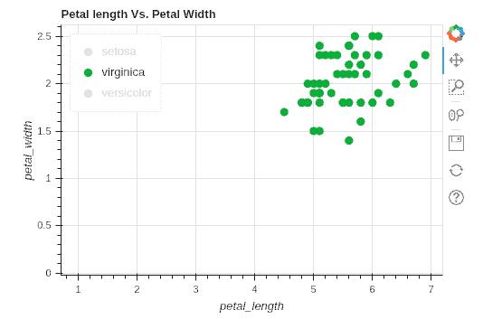
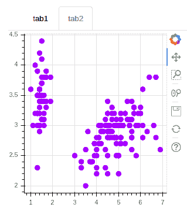

# 第六章：数据可视化

数据可视化是数据分析系统中帮助轻松理解和传达信息的初步步骤。它通过使用图表、图形、图表和地图等可视化元素将信息和数据以图形形式表示。这有助于分析师理解模式、趋势、异常值、分布和关系。数据可视化是一种有效处理大量数据集的方式。

Python 提供了多种用于数据可视化的库，如 Matplotlib、Seaborn 和 Bokeh。在本章中，我们将首先关注 Matplotlib，它是用于可视化的基础 Python 库。然后我们将探讨 Seaborn，Seaborn 基于 Matplotlib，并提供了高级的统计图表。最后，我们将使用 Bokeh 进行交互式数据可视化。我们还将探讨 `pandas` 绘图。以下是本章将要涵盖的主题列表：

+   使用 Matplotlib 进行可视化

+   使用 Seaborn 包进行高级可视化

+   使用 Bokeh 进行交互式可视化

# 技术要求

本章具有以下技术要求：

+   你可以在以下 GitHub 链接找到代码和数据集：[`github.com/PacktPublishing/Python-Data-Analysis-Third-Edition/tree/master/Chapter05`](https://github.com/PacktPublishing/Python-Data-Analysis-Third-Edition/tree/master/Chapter05)。

+   所有代码块都可以在 `ch5.ipynb` 文件中找到。

+   本章仅使用一个 CSV 文件（`HR_comma_sep.csv`）进行练习。

+   在本章中，我们将使用 Matplotlib、`pandas`、Seaborn 和 Bokeh Python 库。

# 使用 Matplotlib 进行可视化

正如我们所知道的，一图胜千言。人类对视觉信息的理解更好。可视化有助于向任何类型的观众展示事物，并可以用通俗的语言轻松解释复杂的现象。Python 提供了几种可视化库，如 Matplotlib、Seaborn 和 Bokeh。

Matplotlib 是最流行的 Python 数据可视化模块。它是大多数高级 Python 可视化模块（如 Seaborn）的基础库。它提供了灵活且易于使用的内置函数，用于创建图形和图表。

在 Anaconda 中，Matplotlib 已经安装。如果你仍然遇到错误，可以通过以下方式安装它。

我们可以通过 `pip` 安装 Matplotlib，方法如下：

```py
pip install matplotlib
```

对于 Python 3，我们可以使用以下命令：

```py
pip3 install matplotlib
```

你也可以通过终端或命令提示符使用以下命令简单地安装 Matplotlib：

```py
conda install matplotlib
```

要在 Matplotlib 中创建一个非常基础的图表，我们需要调用 `plot()` 函数，该函数位于 `matplotlib.pyplot` 子包中。此函数为已知 *x* 和 *y* 坐标的单个列表或多个列表的点生成一个二维图表。

以下示例代码位于本书代码包中的 `ch5.ipynb` 文件中，您可以通过以下 GitHub 链接找到该文件：[`github.com/PacktPublishing/Python-Data-Analysis-Third-Edition/blob/master/Chapter05/Ch5.ipynb`](https://github.com/PacktPublishing/Python-Data-Analysis-Third-Edition/blob/master/Chapter05/Ch5.ipynb)。

让我们看看一个小的示例代码，用于可视化折线图：

```py
# Add the essential library matplotlib
import matplotlib.pyplot as plt
import numpy as np

# create the data
a = np.linspace(0, 20)

# Draw the plot
plt.plot(a, a + 0.5, label='linear')

# Display the chart
plt.show()
```

这将产生以下输出：


在前面的代码块中，首先，我们导入了 Matplotlib 和 NumPy 模块。之后，我们使用 NumPy 的 `linespace()` 函数创建数据，并使用 Matplotlib 的 `plot()` 函数绘制这些数据。最后，我们使用 `show()` 函数显示图形。

图表有两个基本组件：图形和坐标轴。图形是一个容器，所有内容都绘制在上面。它包含如图表、子图、坐标轴、标题和图例等组件。在下一节中，我们将重点介绍这些组件，它们就像图表的配件。

## 图表的配件

在 `matplotlib` 模块中，我们可以向图表添加标题和坐标轴标签。我们可以使用 `plt.title()` 添加标题，使用 `plt.xlabel()` 和 `plt.ylabel()` 添加标签。

多个图形意味着多个对象，如折线、柱状图和散点图。不同系列的点可以显示在同一个图表上。图例或图表系列反映 *y* 轴。图例是一个框，通常出现在图表的右侧或左侧，显示每个图形元素的含义。让我们看看一个示例，展示如何在图表中使用这些配件：

```py
# Add the required libraries
import matplotlib.pyplot as plt

# Create the data
x = [1,3,5,7,9,11]
y = [10,25,35,33,41,59]

# Let's plot the data
plt.plot(x, y,label='Series-1', color='blue')

# Create the data
x = [2,4,6,8,10,12]
y = [15,29,32,33,38,55]

# Plot the data
plt.plot(x, y, label='Series-2', color='red')

# Add X Label on X-axis
plt.xlabel("X-label")

# Add X Label on X-axis
plt.ylabel("Y-label")

# Append the title to graph
plt.title("Multiple Python Line Graph")

# Add legend to graph
plt.legend()

# Display the plot
plt.show()
```

这将产生以下输出：


在前面的图表中，两个折线显示在同一个图表上。我们在 `plot()` 函数中使用了两个额外的参数 —— `label` 和 `color`。`label` 参数定义了系列的名称，`color` 定义了折线的颜色。在接下来的章节中，我们将重点介绍不同类型的图表。我们将在下一节中探讨散点图。

## 散点图

散点图使用笛卡尔坐标绘制数据点，显示数值的大小。它们还表示两个数值之间的关系。我们可以使用 Matplotlib 中的 `scatter()` 函数创建散点图，如下所示：

```py
# Add the essential library matplotlib
import matplotlib.pyplot as plt

# create the data
x = [1,3,5,7,9,11]
y = [10,25,35,33,41,59]

# Draw the scatter chart
plt.scatter(x, y, c='blue', marker='*',alpha=0.5)

# Append the label on X-axis
plt.xlabel("X-label")

# Append the label on X-axis
plt.ylabel("Y-label")

# Add the title to graph
plt.title("Scatter Chart Sample")

# Display the chart
plt.show()
```

这将产生以下输出：


在前面的散点图中，`scatter()` 函数接受 x 轴和 y 轴的值。在我们的示例中，我们绘制了两个列表：`x` 和 `y`。我们还可以使用一些可选参数，例如 `c` 来设置颜色，`alpha` 来设置标记的透明度（范围从 0 到 1），以及 `marker` 来设置散点图中点的形状，如 `*`、`o` 或任何其他符号。在下一节中，我们将重点介绍折线图。

## 折线图

折线图是一种显示两变量之间关系的图表，它由一系列数据点连接而成：

```py
# Add the essential library matplotlib
import matplotlib.pyplot as plt

# create the data
x = [1,3,5,7,9,11]
y = [10,25,35,33,41,59]

# Draw the line chart
plt.plot(x, y)

# Append the label on X-axis
plt.xlabel("X-label")

# Append the label on X-axis
plt.ylabel("Y-label")

# Append the title to chart
plt.title("Line Chart Sample")

# Display the chart
plt.show()
```

这会生成如下输出：


在之前的折线图程序中，`plot()` 函数接受 x 轴和 y 轴的数值。在接下来的章节中，我们将学习如何绘制饼图。

## 饼图

饼图是一个圆形图表，被分成楔形的部分。每一部分的大小与它所代表的数值成正比。饼图的总值为 100 百分比：

```py
# Add the essential library matplotlib
import matplotlib.pyplot as plt

# create the data
subjects = ["Mathematics","Science","Communication Skills","Computer Application"]
scores = [85,62,57,92]

# Plot the pie plot
plt.pie(scores,
        labels=subjects,
        colors=['r','g','b','y'],
        startangle=90,
        shadow= True,
        explode=(0,0.1,0,0),
        autopct='%1.1f%%')

# Add title to graph
plt.title("Student Performance")

# Draw the chart
plt.show()
```

这会生成如下输出：


在之前的饼图代码中，我们指定了 `values`、`labels`、`colors`、`startangle`、`shadow`、`explode` 和 `autopct`。在我们的例子中，`values` 是学生在四个科目中的成绩，`labels` 是科目名称的列表。我们还可以为每个科目的成绩指定颜色列表。`startangle` 参数指定第一个值的角度，默认为 90 度；这意味着第一个线条是垂直的。

可选地，我们还可以使用 `shadow` 参数来指定饼图切片的阴影，使用 `explode` 参数来突出显示某些饼图切片的二进制值。如果我们想突出显示第二个饼图切片，则值的元组为 (0, 0.1, 0, 0)。接下来我们跳到条形图部分。

## 条形图

条形图是一种比较不同组值的可视化工具，可以水平或垂直绘制。我们可以使用 `bar()` 函数创建条形图：

```py
# Add the essential library matplotlib
import matplotlib.pyplot as plt

# create the data
movie_ratings = [1,2,3,4,5]
rating_counts = [21,45,72,89,42]

# Plot the data
plt.bar(movie_ratings, rating_counts, color='blue')

# Add X Label on X-axis
plt.xlabel("Movie Ratings")

# Add X Label on X-axis
plt.ylabel("Rating Frequency")

# Add a title to graph
plt.title("Movie Rating Distribution")

# Show the plot
plt.show()
```

这会生成如下输出：


在之前的条形图程序中，`bar()` 函数接受 *x* 轴值、*y* 轴值和颜色。在我们的例子中，我们绘制的是电影评分及其频率。电影评分位于 *x* 轴上，评分频率位于 *y* 轴上。我们还可以使用 `color` 参数为条形图的条形指定颜色。接下来，让我们看看条形图的另一种变体。

## 直方图

直方图显示的是一个数值变量的分布情况。我们使用 `hist()` 方法创建直方图，它显示的是连续变量的概率分布。直方图只适用于单一变量，而条形图适用于两个变量：

```py
# Add the essential library
import matplotlib.pyplot as plt

# Create the data
employee_age = [21,28,32,34,35,35,37,42,47,55]

# Create bins for histogram
bins = [20,30,40,50,60]

# Plot the histogram
plt.hist(employee_age, bins, rwidth=0.6)

# Add X Label on X-axis
plt.xlabel("Employee Age")

# Add X Label on X-axis
plt.ylabel("Frequency")

# Add title to graph
plt.title("Employee Age Distribution")

# Show the plot
plt.show()
```

这会生成如下输出：


在之前的直方图中，`hist()` 函数接受 `values`、`bins` 和 `rwidth`。在我们的例子中，我们绘制的是员工的年龄，并使用 10 年的区间。我们从 20 岁到 60 岁开始，每个区间的大小为 10 年。我们使用 0.6 的相对条形宽度，但你可以选择任何大小来调整宽度的粗细。现在，我们将跳转到气泡图，它可以在二维图中处理多个变量。

## 气泡图

气泡图是一种散点图。它不仅使用笛卡尔坐标绘制数据点，还在数据点上创建气泡。气泡显示了图表的第三维度。它展示了三个数值：两个数值位于 *x* 和 *y* 轴上，第三个数值则是数据点（或气泡）的大小：

```py
# Import the required modules
import matplotlib.pyplot as plt
import numpy as np

# Set figure size
plt.figure(figsize=(8,5))

# Create the data
countries = ['Qatar','Luxembourg','Singapore','Brunei','Ireland','Norway','UAE','Kuwait']
populations = [2781682, 604245,5757499,428963,4818690,5337962,9630959,4137312]
gdp_per_capita = [130475, 106705, 100345, 79530, 78785, 74356,69382, 67000]

# scale GDP per capita income to shoot the bubbles in the graph
scaled_gdp_per_capita = np.divide(gdp_per_capita, 80)

colors = np.random.rand(8)

# Draw the scatter diagram
plt.scatter(countries, populations, s=scaled_gdp_per_capita, c=colors, cmap="Blues",edgecolors="grey", alpha=0.5)

# Add X Label on X-axis
plt.xlabel("Countries")

# Add Y Label on X-axis
plt.ylabel("Population")

# Add title to graph
plt.title("Bubble Chart")

# rotate x label for clear visualization
plt.xticks(rotation=45)

# Show the plot
plt.show()
```

这将产生以下输出：


在前面的图表中，使用散点图函数创建了一个气泡图。这里，重要的是散点图函数的 `s`（大小）参数。我们将第三个变量 `scaled_gdp_per_capita` 分配给了 `size` 参数。在前面的气泡图中，国家位于 *x* 轴上，人口位于 *y* 轴上，而人均 GDP 通过散点或气泡的大小来展示。我们还为气泡分配了随机颜色，以使其更具吸引力并易于理解。从气泡的大小，可以很容易看出卡塔尔的人均 GDP 最高，而科威特的人均 GDP 最低。在前面的所有部分中，我们集中讨论了大部分 Matplotlib 图表。现在，我们将看看如何使用 `pandas` 模块绘制图表。

## pandas 绘图

`pandas` 库提供了 `plot()` 方法，它是 Matplotlib 库的封装。`plot()` 方法允许我们直接在 `pandas` DataFrame 上创建图表。以下是用于创建图表的 `plot()` 方法参数：

+   `kind`: 用于图表类型的字符串参数，例如：line、bar、barh、hist、box、KDE、pie、area 或 scatter。

+   `figsize`: 这定义了图表的尺寸，采用 (宽度, 高度) 的元组形式。

+   `title`: 这定义了图表的标题。

+   `grid`: 布尔参数，表示轴的网格线。

+   `legend`: 这定义了图例。

+   `xticks`: 这定义了 x 轴刻度的序列。

+   `yticks`: 这定义了 y 轴刻度的序列。

让我们使用 `pandas plot()` 函数创建一个散点图：

```py
# Import the required modules
import pandas as pd
import matplotlib.pyplot as plt

# Let's create a Dataframe
df = pd.DataFrame({
            'name':['Ajay','Malala','Abhijeet','Yming','Desilva','Lisa'],
            'age':[22,72,25,19,42,38],
            'gender':['M','F','M','M','M','F'],
            'country':['India','Pakistan','Bangladesh','China','Srilanka','UK'],
            'income':[2500,3800,3300,2100,4500,5500]
        })

# Create a scatter plot
df.plot(kind='scatter', x='age', y='income', color='red', title='Age Vs Income')

# Show figure
plt.show()
```

这将产生以下输出：


在前面的图表中，`plot()` 函数使用了 `kind`、`x`、`y`、`color` 和 `title` 参数。在我们的示例中，我们使用 `kind` 参数为 `'scatter'` 来绘制年龄与收入之间的散点图。`age` 和 `income` 列分别分配给 `x` 和 `y` 参数。散点的颜色和图表的标题被分配给 `color` 和 `title` 参数：

```py
import matplotlib.pyplot as plt
import pandas as pd

# Create bar plot
df.plot(kind='bar',x='name', y='age', color='blue')

# Show figure
plt.show()
```

这将产生以下输出：


在前面的图表中，`plot()` 函数使用 `kind`、`x`、`y`、`color` 和 `title` 参数。在我们的示例中，我们使用 `kind` 参数为 `'bar'` 来绘制年龄与收入之间的柱状图。`name` 和 `age` 列分别分配给 `x` 和 `y` 参数。散点的颜色被分配给 `color` 参数。这就是关于 `pandas` 绘图的内容。从下一部分开始，我们将看到如何使用 Seaborn 库可视化数据。

# 使用 Seaborn 包进行高级可视化

可视化有助于轻松理解复杂的模式和概念。它以图像的形式表示洞察。在前面的部分中，我们学习了如何使用 Matplotlib 进行可视化。现在，我们将探索新的 Seaborn 库，它可以进行高级统计图表的绘制。Seaborn 是一个开源的 Python 库，用于高阶互动性和吸引人的统计可视化。Seaborn 以 Matplotlib 为基础库，提供了更简单、易懂、互动性强且美观的可视化效果。

在 Anaconda 软件包中，您可以通过以下方式安装 Seaborn 库：

使用 `pip` 安装 Seaborn：

```py
pip install seaborn
```

对于 Python 3，请使用以下命令：

```py
pip3 install seaborn
```

您可以通过终端或命令提示符使用以下命令轻松安装 Seaborn：

```py
conda install seaborn
```

如果您是在 Jupyter Notebook 中安装，则需要在 `pip` 命令前加上 `!` 符号。以下是示例：

```py
!pip install seaborn
```

让我们跳转到 Seaborn 的 `lm` 图。

## lm 图

`lm` 图绘制了散点图并在其上拟合回归模型。散点图是理解两个变量之间关系的最佳方式。它的输出可视化表示了两个变量的联合分布。`lmplot()` 接受两个列名——`x` 和 `y`——作为字符串和 DataFrame 变量。让我们来看以下示例：

```py
# Import the required libraries
import pandas as pd
import seaborn as sns
import matplotlib.pyplot as plt

# Create DataFrame
df=pd.DataFrame({'x':[1,3,5,7,9,11],'y':[10,25,35,33,41,59]})

# Create lmplot
sns.lmplot(x='x', y='y', data=df)

# Show figure
plt.show()
```

这将产生以下输出：


默认情况下，`lmplot()` 会拟合回归线。我们也可以通过将 `fit_reg` 参数设置为 `False` 来移除回归线：

```py
# Create lmplot
sns.lmplot(x='x', y='y', data=df, fit_reg=False)

# Show figure
plt.show()
```

这将产生以下输出：


让我们使用 HR Analytics 数据集并尝试绘制 `lmplot()`：

```py
# Load the dataset
df=pd.read_csv("HR_comma_sep.csv")

# Create lmplot
sns.lmplot(x='satisfaction_level', y='last_evaluation', data=df, fit_reg=False, hue='left')

# Show figure
plt.show()

```

这将产生以下输出：


在前面的示例中，`last_evaluation` 是员工的评估表现，`satisfaction_level` 是员工在公司的满意度，`left` 表示员工是否离开公司。`satisfaction_level` 和 `last_evaluation` 分别绘制在 *x* 和 *y* 轴上。第三个变量 `left` 被传递到 `hue` 参数中。`hue` 属性用于颜色阴影。我们将 `left` 变量作为 `hue`。从图表中我们可以清楚地看到，已经离职的员工分散成三组。接下来我们来看条形图。

## 条形图

`barplot()` 显示了分类变量和连续变量之间的关系。它使用不同长度的矩形条形图：

```py
# Import the required libraries
import pandas as pd
import seaborn as sns
import matplotlib.pyplot as plt

# Create DataFrame
df=pd.DataFrame({'x':['P','Q','R','S','T','U'],'y':[10,25,35,33,41,59]})

# Create lmplot
sns.barplot(x='x', y='y', data=df)

# Show figure
plt.show()
```

这将产生以下输出：


在前面的示例中，条形图是通过 `bar()` 函数创建的。它接受两个列——`x` 和 `y`——以及一个 DataFrame 作为输入。在接下来的部分中，我们将看到如何绘制分布图。

## 分布图

这绘制了一个单变量的分布图。它是默认箱体大小的直方图与**核密度估计**（**KDE**）图的结合。在我们的示例中，`distplot()`将接受`satisfaction_level`输入列并绘制其分布。在这里，`satisfaction_level`的分布有两个峰值：

```py
# Create a distribution plot (also known as Histogram)
sns.distplot(df.satisfaction_level)

# Show figure
plt.show()
```

这将产生以下输出：


在前面的代码块中，我们使用`distplot()`创建了分布图。现在是时候跳转到箱型图了。

## 箱型图

箱型图，又称箱形须图，是理解每个变量分布及其四分位数的最佳图表之一。它可以是水平的也可以是垂直的。它通过一个箱子显示四分位数分布，该箱子被称为须。它还显示数据的最小值、最大值和异常值。我们可以使用 Seaborn 轻松创建箱型图：

```py
# Create boxplot
sns.boxplot(data=df[['satisfaction_level','last_evaluation']])

# Show figure
plt.show()
```

这将产生以下输出：


在前面的示例中，我们使用了两个变量来绘制箱型图。这里，箱型图表明`satisfaction_level`的范围高于`last_evaluation`（表现）。接下来，我们来看看 Seaborn 中的 KDE 图。

## KDE 图

`kde()`函数绘制给定连续变量的概率密度估计。这是一种非参数估计方法。在我们的示例中，`kde()`函数接受一个参数`满意度`并绘制 KDE：

```py
# Create density plot
sns.kdeplot(df.satisfaction_level)

# Show figure
plt.show()
```

这将产生以下输出：


在前面的代码块中，我们使用`kdeplot()`创建了一个密度图。在下一节中，我们将看到另一种分布图，它是密度图和箱型图的结合，称为小提琴图。

## 小提琴图

小提琴图是箱型图和 KDE 的结合形式，能够提供易于理解的分布分析：

```py
# Create violin plot
sns.violinplot(data=df[['satisfaction_level','last_evaluation']])

# Show figure
plt.show()
```

这将产生以下输出：


在前面的示例中，我们使用了两个变量来绘制小提琴图。在这里，我们可以得出结论，`satisfaction_level`的范围高于`last_evaluation`（表现），且这两个变量的分布中都有两个峰值。完成分布图的分析后，我们将看到如何将`groupby`操作和箱型图结合成一个图表，使用计数图来展示。

## 计数图

`countplot()`是一个特殊类型的条形图。它显示每个分类变量的频率。它也被称为分类变量的直方图。与 Matplotlib 相比，它简化了操作。在 Matplotlib 中，要创建一个计数图，首先需要按类别列进行分组，并计算每个类别的频率。之后，Matplotlib 的条形图会使用这个计数。然而，Seaborn 的计数图只需要一行代码就可以绘制分布：

```py
# Create count plot (also known as Histogram)
sns.countplot(x='salary', data=df)

# Show figure
plt.show()
```

这将产生以下输出：


在上面的示例中，我们正在统计`salary`变量。`count()`函数接受一个单列和 DataFrame。因此，从图表中我们可以很容易地得出结论，大多数员工的工资都在低到中等范围内。我们还可以将`hue`作为第二个变量。让我们看看以下示例：

```py
# Create count plot (also known as Histogram)
sns.countplot(x='salary', data=df, hue='left')

# Show figure
plt.show()
```

这将产生以下输出：


在上述示例中，我们可以看到`left`被用作色调或颜色阴影。这表明大多数薪资最低的员工离开了公司。接下来，我们来看另一个用于可视化两个变量关系和分布的重要图表。

## 联合图

联合图是一种多面板可视化，显示了双变量关系以及单个变量的分布。我们还可以使用`jointplot()`的`kind`参数绘制 KDE 图。通过将`kind`参数设置为`"kde"`，我们可以绘制 KDE 图。让我们看以下示例：

```py
# Create joint plot using kernel density estimation(kde)
sns.jointplot(x='satisfaction_level', y='last_evaluation', data=df, kind="kde")

# Show figure
plt.show()
```

这将产生以下输出：


在上述图中，我们使用`jointplot()`创建了联合图，并通过`kind`参数设置为`"kde"`来添加了`kde`图。接下来让我们来看热力图，进行更丰富的可视化。

## 热力图

热力图提供了二维网格表示。网格的每个单元格包含矩阵的一个值。热力图功能还提供了对每个单元格的注释：

```py
# Import required library
import seaborn as sns

# Read iris data using load_dataset() function
data = sns.load_dataset("iris")

# Find correlation
cor_matrix=data.corr()

# Create heatmap
sns.heatmap(cor_matrix, annot=True)

# Show figure
plt.show()
```

这将产生以下输出：


在上述示例中，使用`load_dataset()`加载了 Iris 数据集，并通过`corr()`函数计算了相关性。`corr()`函数返回相关性矩阵。然后，使用`heatmap()`函数绘制相关性矩阵的网格视图。它接受两个参数：相关性矩阵和`annot`。`annot`参数设置为`True`。在图中，我们可以看到一个对称矩阵，所有对角线上的值都是 1，这表示一个变量与自身的完美相关性。我们还可以通过`cmap`参数设置新的颜色映射以实现不同的颜色：

```py
# Create heatmap
sns.heatmap(cor_matrix, annot=True, cmap="YlGnBu")

# Show figure
plt.show()
```

这将产生以下输出：


在上述热力图中，我们通过`cmap`参数为不同的颜色设置了颜色映射。这里，我们使用了`YlGnBu`（黄色、绿色和蓝色）组合作为`cmap`。现在，我们将进入对角矩阵图（pair plot）以进行更快速的探索性分析。

## 对角矩阵图

Seaborn 提供了快速的探索性数据分析，通过对角矩阵图展示变量间的关系以及单独的分布。对角矩阵图使用直方图显示单一分布，并通过散点图展示联合分布：

```py
# Load iris data using load_dataset() function
data = sns.load_dataset("iris")

# Create a pair plot
sns.pairplot(data)

# Show figure
plt.show()
```

这将产生以下输出：


在前面的示例中，Iris 数据集是通过`load_dataset()`加载的，并将该数据集传递给`pairplot()`函数。在图表中，它创建了一个*n*乘*n*的矩阵或图形网格。对角线展示了各列的分布，网格的非对角元素展示了散点图，以便理解所有变量之间的关系。

在前面的几个部分中，我们已经看到了如何使用 Seaborn 绘图。现在，我们将转到另一个重要的可视化库——Bokeh。在接下来的部分中，我们将使用 Bokeh 库绘制互动和多功能的图表。

# 使用 Bokeh 进行互动式可视化

Bokeh 是一个互动性强、高质量、功能多样、专注且更强大的可视化库，适用于大数据量和流式数据。它为现代 Web 浏览器提供互动丰富的图表、图形、布局和仪表板。其输出可以映射到笔记本、HTML 或服务器。

Matplotlib 和 Bokeh 库有不同的用途。Matplotlib 专注于静态、简单和快速的可视化，而 Bokeh 则专注于高度互动、动态、基于 Web 的高质量可视化。Matplotlib 通常用于出版物中的图像，而 Bokeh 则面向 Web 用户。在本章的后续部分，我们将学习如何使用 Bokeh 进行基础绘图。我们可以利用 Bokeh 为数据探索创建更多互动的可视化效果。

安装 Bokeh 库的最简单方法是通过 Anaconda 发行包。要安装 Bokeh，请使用以下命令：

```py
conda install bokeh
```

我们还可以使用`pip`来安装它。要使用`pip`安装 Bokeh，请使用以下命令：

```py
pip install bokeh
```

## 绘制一个简单的图形

让我们用 Bokeh 绘制一个简单的图形。首先，我们需要导入基本的`bokeh.plotting`模块。`output_notebook()`函数定义了图表将在 Jupyter Notebook 上渲染。`figure`对象是绘制图表和图形的核心对象之一。`figure`对象关注图表的标题、大小、标签、网格和样式。`figure`对象还处理图表样式、标题、坐标轴标签、坐标轴、网格以及添加数据的各种方法：

```py
# Import the required modules
from bokeh.plotting import figure
from bokeh.plotting import output_notebook
from bokeh.plotting import show

# Create the data
x = [1,3,5,7,9,11]
y = [10,25,35,33,41,59]

# Output to notebook
output_notebook()

# Instantiate a figure
fig= figure(plot_width = 500, plot_height = 350)

# Create scatter circle marker plot by rendering the circles
fig.circle(x, y, size = 10, color = "red", alpha = 0.7)

# Show the plot
show(fig)
```

这将产生如下输出：


在设置完`figure`对象后，我们将使用 circle 函数创建一个散点圆形标记图。`circle()`函数将接受`x`和`y`值。它还接受大小、颜色和透明度（alpha）参数。最后，`show()`函数将在所有特性和数据添加到图表后，绘制输出结果。

## 符号

Bokeh 使用视觉符号（glyph），它指的是圆圈、线条、三角形、正方形、条形、菱形以及其他形状的图形。符号是一种独特的标记，用于以图像形式传达信息。让我们使用`line()`函数创建一条线性图：

```py
# Import the required modules
from bokeh.plotting import figure, output_notebook, show

# Import the required modules
from bokeh.plotting import figure
from bokeh.plotting import output_notebook
from bokeh.plotting import show

# Create the data
x_values = [1,3,5,7,9,11]
y_values = [10,25,35,33,41,59]

# Output to notebook
output_notebook()

# Instantiate a figure
p = figure(plot_width = 500, plot_height = 350)

# create a line plot
p.line(x_values, y_values, line_width = 1, color = "blue")

# Show the plot
show(p)
```

这将产生如下输出：


在上面的示例中，`line()` 函数接受*x*和*y*轴值。它还接受线的`line_width`和`color`值。在下一节中，我们将重点介绍多图表的布局。

## 布局

Bokeh 提供了用于组织图和小部件的布局。布局将多个图表组织在单个面板中，用于交互式可视化。它们还允许根据面板大小设置调整图表和小部件的大小调整模式。布局可以是以下类型之一：

+   **行布局**：这将所有图表以行或水平方式组织。

+   **列布局**：这将所有图表以列或垂直方式组织。

+   **嵌套布局**：这是行和列布局的组合。

+   **网格布局**：这为您提供了一个网格矩阵，用于排列图表。

让我们看一个行布局的例子：

```py
# Import the required modules
from bokeh.plotting import figure
from bokeh.plotting import output_notebook, show
from bokeh.layouts import row, column

# Import iris flower dataset as pandas DataFrame
from bokeh.sampledata.iris import flowers as df

# Output to notebook
output_notebook()

# Instantiate a figure
fig1 = figure(plot_width = 300, plot_height = 300)
fig2 = figure(plot_width = 300, plot_height = 300)
fig3 = figure(plot_width = 300, plot_height = 300)

# Create scatter marker plot by render the circles
fig1.circle(df['petal_length'], df['sepal_length'], size=8, color = "green", alpha = 0.5)
fig2.circle(df['petal_length'], df['sepal_width'], size=8, color = "blue", alpha = 0.5)
fig3.circle(df['petal_length'], df['petal_width'], size=8, color = "red", alpha = 0.5)

# Create row layout
row_layout = row(fig1, fig2, fig3)

# Show the plot
show(row_layout)
```

这导致以下输出：


在此布局图中，我们导入了行和列布局，从 Bokeh 示例数据加载了鸢尾花数据，用图表宽度和高度实例化了三个 `figure` 对象，在每个图表对象上创建了三个散点圆圈标记，并创建了行布局。此行布局将以 `figure` 对象作为输入，并使用 `show()` 函数绘制。我们也可以通过创建列布局来创建列布局，如下所示：

```py
# Create column layout
col_layout = column(fig1, fig2, fig3)

# Show the plot
show(col_layout)
```

这导致以下输出：


在前面的图中，我们创建了三个图表的列布局。让我们跳转到嵌套布局，以进行更强大的可视化。

### 使用行和列布局进行嵌套布局

嵌套布局是多行和列布局的组合。让我们看看这里给出的示例，以便更好地实际理解：

```py
# Import the required modules
from bokeh.plotting import figure, output_notebook, show

# Import the required modules
from bokeh.plotting import figure
from bokeh.plotting import output_notebook
from bokeh.plotting import show
from bokeh.layouts import row, column

# Import iris flower dataset as pandas DataFrame
from bokeh.sampledata.iris import flowers as df

# Output to notebook
output_notebook()

# Instantiate a figure
fig1 = figure(plot_width = 300, plot_height = 300)
fig2 = figure(plot_width = 300, plot_height = 300)
fig3 = figure(plot_width = 300, plot_height = 300)

# Create scatter marker plot by render the circles
fig1.circle(df['petal_length'], df['sepal_length'], size=8, color = "green", alpha = 0.5)
fig2.circle(df['petal_length'], df['sepal_width'], size=8, color = "blue", alpha = 0.5)
fig3.circle(df['petal_length'], df['petal_width'], size=8, color = "red", alpha = 0.5)

# Create nested layout
nasted_layout = row(fig1, column(fig2, fig3))

# Show the plot
show(nasted_layout)
```

这导致以下输出：


在这里，您可以看到行布局有两行。在第一行中，分配了 `fig1`，第二行有 `fig2` 和 `fig3` 的列布局。因此，此布局变为 2*2 布局，第一列仅有一个组件，第二列有两个组件。

## 多个图表

还可以使用网格布局创建多个图表和对象。网格布局以行列矩阵方式排列图表和小部件对象。它接受每行的图形对象列表。我们还可以使用 `None` 作为占位符：

```py
# Import the required modules
from bokeh.plotting import figure
from bokeh.plotting import output_notebook
from bokeh.plotting import show
from bokeh.layouts import gridplot

# Import iris flower dataset as pandas DataFrame
from bokeh.sampledata.iris import flowers as df

# Output to notebook
output_notebook()

# Instantiate a figure
fig1 = figure(plot_width = 300, plot_height = 300)
fig2 = figure(plot_width = 300, plot_height = 300)
fig3 = figure(plot_width = 300, plot_height = 300)

# Create scatter marker plot by render the circles
fig1.circle(df['petal_length'], df['sepal_length'], size=8, color = "green", alpha = 0.5)
fig2.circle(df['petal_length'], df['sepal_width'], size=8, color = "blue", alpha = 0.5)
fig3.circle(df['petal_length'], df['petal_width'], size=8, color = "red", alpha = 0.5)

# Create a grid layout
grid_layout = gridplot([[fig1, fig2], [None,fig3]])

# Show the plot
show(grid_layout)
```

这导致以下输出：


前面的布局类似于嵌套布局。这里，我们导入了 `gridplot()`。它将组件排列在行和列中。网格图采用一列行图。列表中的第一项是 `fig1` 和 `fig2`。第二项是 `None` 和 `fig3`。每个项目都是网格矩阵中的一行。`None` 占位符用于使单元格保持空白或没有组件。

尺寸模式可以帮助我们配置具有可调整大小选项的图形。Bokeh 提供了以下尺寸模式：

+   `fixed`：保持原始宽度和高度不变。

+   `stretch_width`：根据其他组件的类型，拉伸到可用宽度。它不保持纵横比。

+   `stretch_height`：根据其他组件的类型，拉伸到可用高度。它不保持纵横比。

+   `stretch_both`：根据其他组件的类型，拉伸宽度和高度，同时不保持原始纵横比。

+   `scale_width`：根据其他组件的类型，拉伸到可用宽度，同时保持原始纵横比。

+   `scale_height`：根据其他组件的类型，拉伸到可用高度，同时保持原始纵横比。

+   `scale_both`：根据其他组件的类型，拉伸宽度和高度，同时保持原始纵横比。

在了解了布局和多个图表之后，接下来是学习互动可视化的交互。

## 交互

Bokeh 提供了交互式图例，用于运行时可操作的图表。可以通过点击符号图表来隐藏或静音图例。我们可以通过激活`click_policy`属性并点击图例项来启用这些模式。

### 隐藏点击策略

隐藏点击策略通过点击图例项来隐藏所需的符号。让我们看一个隐藏点击策略的例子：

```py
# Import the required modules
from bokeh.plotting import figure
from bokeh.plotting import output_notebook
from bokeh.plotting import show 
from bokeh.models import CategoricalColorMapper

# Import iris flower dataset as pandas DataFrame
from bokeh.sampledata.iris import flowers as df

# Output to notebook 
output_notebook() 

# Instantiate a figure object 
fig = figure(plot_width = 500, plot_height = 350, title="Petal length Vs. Petal Width", 
           x_axis_label='petal_length', y_axis_label='petal_width')

# Create scatter marker plot by render the circles 
for specie, color in zip(['setosa', 'virginica','versicolor'], ['blue', 'green', 'red']):
    data = df[df.species==specie]
    fig.circle('petal_length', 'petal_width', size=8, color=color, alpha = 0.7, legend_label=specie, source=data)

# Set the legend location and click policy
fig.legend.location = 'top_left'
fig.legend.click_policy="hide"

# Show the plot
show(fig)
```

这将产生以下输出：



在这里，我们可以通过`figure`对象的`legend.click_policy`参数设置点击策略。此外，我们需要对每种类型的符号或图例元素运行`for`循环，在这些元素上进行点击。在我们的示例中，我们正在为物种和颜色类型运行`for`循环。在点击图例中的任何物种时，它会过滤数据并隐藏该符号。

### 静音点击策略

静音点击策略通过点击图例项来静音符号。在这里，以下代码显示了高强度的所需符号，而不感兴趣的符号则使用较低强度，而不是隐藏整个符号。让我们看一个静音点击策略的例子：

```py
# Import the required modules
from bokeh.plotting import figure 
from bokeh.plotting import output_notebook
from bokeh.plotting import show 
from bokeh.models import CategoricalColorMapper

# Import iris flower dataset as pandas DataFrame
from bokeh.sampledata.iris import flowers as df

# Output to notebook 
output_notebook() 

# Instantiate a figure object 
fig = figure(plot_width = 500, plot_height = 350, title="Petal length Vs. Petal Width", 
           x_axis_label='petal_length', y_axis_label='petal_width')

# Create scatter marker plot by render the circles 
for specie, color in zip(['setosa', 'virginica','versicolor'], ['blue', 'green', 'red']):
    data = df[df.species==specie]
    fig.circle('petal_length', 'petal_width', size=8, color=color, alpha = 0.7,legend_label=specie,source=data,
            muted_color=color, muted_alpha=0.2)

# Set the legend location and click policy
fig.legend.location = 'top_left'
fig.legend.click_policy="mute"

# Show the plot
show(fig)
```

这将产生以下输出：


在这里，我们可以通过`legend.click_policy`参数设置静音点击策略来静音图形对象。此外，我们需要对每种类型的符号或图例元素运行`for`循环，在这些元素上进行点击。在我们的示例中，我们正在为物种和颜色类型运行`for`循环。在点击图例中的任何物种时，它会过滤数据并隐藏该符号。此外，我们需要为散点圆形标记添加`muted_color`和`muted_alpha`参数。

## 注解

Bokeh 提供了多种注解，用于为可视化提供补充信息。它通过添加以下信息来帮助查看者：

+   **标题**：这个注释为图表提供一个名称。

+   **轴标签**：这个注释为轴提供标签，帮助我们理解*x*轴和*y*轴表示的内容。

+   **图例**：这个注释通过颜色或形状表示第三个变量，并帮助我们将特征链接在一起，便于解释。

+   **颜色条**：颜色条是通过使用 ColorMapper 和颜色调色板创建的。

让我们看一个注释的例子：

```py
# Import the required modules
from bokeh.plotting import figure
from bokeh.plotting import output_notebook
from bokeh.plotting import show 
from bokeh.models import CategoricalColorMapper

# Import iris flower dataset as pandas DataFrame
from bokeh.sampledata.iris import flowers as df

# Output to notebook 
output_notebook() 

# Create color mapper for categorical column 
color_mapper = CategoricalColorMapper(factors=['setosa', 'virginica', 'versicolor'], palette=['blue', 'green', 'red'])

color_dict={'field': 'species','transform': color_mapper }

# Instantiate a figure object 
p = figure(plot_width = 500, plot_height = 350, title="Petal length Vs. Petal Width", 
           x_axis_label='petal_length', y_axis_label='petal_width')

# Create scatter marker plot by render the circles 
p.circle('petal_length', 'petal_width', size=8, color=color_dict, alpha = 0.5, legend_group='species', source=df)

# Set the legend location
p.legend.location = 'top_left'

# Show the plot
show(p)
```

这将生成以下输出：


在前面的例子中，导入了`CategoricalColorMapper`并通过定义鸢尾花品种中的因子或唯一项及其相应的颜色来创建对象。通过为映射器定义`field`和`transform`参数来创建颜色字典。我们需要定义图表的标题；`x_axis_label`和`y_axis_label`是在`figure`对象中定义的。图例是在圆形散点标记函数中定义的，使用品种列并通过`figure`对象的`top_left`位置属性定义其位置。

## 悬停工具

悬停工具会在鼠标指针悬停在特定区域时显示相关信息。让我们看一些例子来理解悬浮图：

```py
# Import the required modules
from bokeh.plotting import figure 
from bokeh.plotting import output_notebook
from bokeh.plotting import show 
from bokeh.models import CategoricalColorMapper
from bokeh.models import HoverTool

# Import iris flower dataset as pandas DataFrame
from bokeh.sampledata.iris import flowers as df

# Output to notebook 
output_notebook() 

# Create color mapper for categorical column 
mapper = CategoricalColorMapper(factors=['setosa', 'virginica', 'versicolor'], 
                                palette=['blue', 'green', 'red'])

color_dict={'field': 'species','transform': mapper}

# Create hovertool and specify the hovering information
hover = HoverTool(tooltips=[('Species type','@species'),
                            ('IRIS Petal Length','@petal_length'),
                            ('IRIS Petal Width', '@petal_width')])

# Instantiate a figure object
p = figure(plot_width = 500, plot_height = 350, title="Petal length Vs. Petal Width", 
           x_axis_label='petal_length', y_axis_label='petal_width',
           tools=[hover, 'pan', 'wheel_zoom'])

# Create scatter marker plot by render the circles 
p.circle('petal_length', 'petal_width', size=8, color=color_dict, alpha = 0.5,legend_group='species',source=df)

# Set the legend location
p.legend.location = 'top_left'

# Show the plot
show(p)
```

这将生成以下输出：


在前面的例子中，我们从`bokeh.models`导入了`HoverTool`并通过定义在鼠标悬停时显示的信息来创建它的对象。在我们的例子中，我们在元组列表中定义了信息。每个元组有两个参数，第一个是字符串标签，第二个是实际值（前面加上`@`）。这个悬停对象被传递到`figure`对象的`tools`参数中。

## 小部件

小部件提供了前端的实时交互。小部件能够在运行时修改和更新图表。它们可以运行 Bokeh 服务器或独立的 HTML 应用程序。使用小部件时，您需要指定功能。它可以嵌套在布局中。将小部件功能添加到程序中有两种方法：

+   CustomJS 回调

+   使用 Bokeh 服务器和设置事件处理程序，如`onclick`或`onchange`事件

### 标签面板

标签面板使我们能够在一个窗口中创建多个图表和布局。让我们看一个标签面板的例子：

```py
# Import the required modules
from bokeh.plotting import figure
from bokeh.plotting import output_notebook
from bokeh.plotting import show
from bokeh.models.widgets import Tabs
from bokeh.models.widgets import Panel

# Import iris flower dataset as pandas DataFrame
from bokeh.sampledata.iris import flowers as df

# Output to notebook
output_notebook()

# Instantiate a figure
fig1 = figure(plot_width = 300, plot_height = 300)
fig2 = figure(plot_width = 300, plot_height = 300)

# Create scatter marker plot by render the circles
fig1.circle(df['petal_length'], df['sepal_length'], size=8, color = "green", alpha = 0.5)
fig2.circle(df['petal_length'], df['sepal_width'], size=8, color = "blue", alpha = 0.5)

# Create panels
tab1 = Panel(child=fig1, title='tab1')
tab2 = Panel(child=fig2, title='tab2')

# Create tab by putting panels into it
tab_layout = Tabs(tabs=[tab1,tab2])

# Show the plot
show(tab_layout)
```

这将生成以下输出：



在前面的代码中，我们通过将`figure`对象传递给`child`参数，并将`title`传递给`title`参数，创建了两个面板。两个面板被组合成一个列表，并传递给`Tabs`布局对象。通过`show()`函数显示此`Tabs`对象。您只需点击标签即可更改标签。

### 滑块

滑块是一个图形化的轨迹条，它通过在水平刻度上移动来控制值。我们可以在不影响图表格式的情况下更改图表的值。让我们来看一个滑块的例子：

```py
# Import the required modules
from bokeh.plotting import Figure 
from bokeh.plotting import output_notebook 
from bokeh.plotting import show
from bokeh.models import CustomJS 
from bokeh.models import ColumnDataSource
from bokeh.models import Slider
from bokeh.layouts import column

# Show output in notebook 
output_notebook() 

# Create list of data
x = [x for x in range(0, 100)]
y = x

# Create a DataFrame
df = ColumnDataSource(data={"x_values":x, "y_values":y})

# Instantiate the Figure object 
fig = Figure(plot_width=350, plot_height=350)

# Create a line plot 
fig.line('x_values', 'y_values', source=df, line_width=2.5, line_alpha=0.8)

# Create a callback using CustomJS
callback = CustomJS(args=dict(source=df), code="""
    var data = source.data;
    var f = cb_obj.value
    var x_values = data['x_values']
    var y_values = data['y_values']
    for (var i = 0; i < x_values.length; i++) {
        y_values[i] = Math.pow(x_values[i], f)
    }
    source.change.emit();
""")

slider_widget = Slider(start=0.0, end=10, value=1, step=.1, title="Display power of x")

slider_widget.js_on_change('value', callback)

# Create layout
slider_widget_layout = column(fig,slider_widget)

# Display the layout
show(slider_widget_layout)
```

这将产生以下输出：


在前面的代码中，Bokeh 的`slider()`函数接受`start`、`end`、`value`、`step`、`title`和 CustomJS 回调作为输入。在我们的例子中，我们创建了一个折线图，并通过滑动条根据`x`变量的幂来改变其`y`值。我们可以通过将`start`、`end`、`value`、`step`、`title`和 CustomJS 回调传递给`Slider`对象来创建滑块。我们需要关注 CustomJS 回调。它获取源数据框，通过`cb_obj.value`获取滑块的值，并使用`change.emit()`函数更新其值。我们在`for`循环中更新`y_value`，通过找到其幂次来使用滑块值。

# 总结

在本章中，我们讨论了如何使用 Matplotlib、`pandas`、Seaborn 和 Bokeh 进行数据可视化。我们介绍了各种图表类型，如折线图、饼图、条形图、直方图、散点图、箱线图、气泡图、热图、KDE 图、提琴图、计数图、联合图和配对图。我们重点介绍了图表的附加功能，如标题、标签、图例、布局、子图和注释。此外，我们还学习了使用 Bokeh 布局、交互、悬停工具和小部件进行交互式可视化。

下一章，第六章，*数据的检索、处理与存储*，将教授我们如何从各种来源（如文件、对象、关系型数据库和 NoSQL 数据库）读取和写入数据的技能。虽然有些人认为这些技能不适用于数据分析，但独立或辅助的数据分析师必须了解如何从不同的文件格式和数据库中获取数据用于分析。
