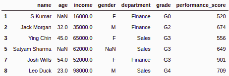
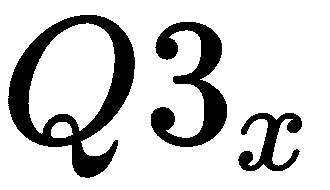
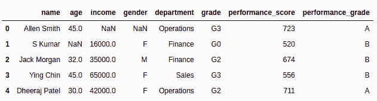

# 第八章：清理杂乱的数据

数据分析师和科学家大部分时间都在清理数据和预处理杂乱的数据集。虽然这项活动较少被讨论，但它是最常执行的活动之一，也是任何数据专业人士必须具备的重要技能。掌握数据清理技巧是每个有抱负的数据科学家必备的技能。数据清理和预处理是识别、更新和删除损坏或不正确数据的过程。清理和预处理的结果是高质量的数据，能够支持强大且无误的分析。优质数据能够击败复杂的算法，并超越简单和不复杂的算法。在这个背景下，高质量意味着准确、完整和一致的数据。数据清理包括处理缺失值、移除异常值、特征编码、缩放、转换和拆分等一系列活动。

本章重点讲解数据清理、处理和整理。数据准备、处理、整理和清洗是同一件事情的不同说法，主要目标是清理数据，以便获得有价值的洞察。我们将从探索员工数据开始，然后过滤数据并处理缺失值和异常值。清理完数据后，我们将集中进行数据转换操作，如编码、缩放和拆分。本章大部分内容将使用`pandas`和`scikit-learn`。

在本章中，我们将涵盖以下主题：

+   探索数据

+   过滤数据以剔除噪声

+   处理缺失值

+   处理异常值

+   特征编码技术

+   特征缩放

+   特征转换

+   特征拆分

让我们开始吧！

# 技术要求

以下是本章的技术要求：

+   你可以在本书的 GitHub 仓库中找到本章将使用的代码和数据集，链接为[`github.com/PacktPublishing/Python-Data-Analysis-Third-Edition/tree/master/Chapter07`](https://github.com/PacktPublishing/Python-Data-Analysis-Third-Edition/tree/master/Chapter07)。

+   所有代码都可以在`ch7.ipynb`文件中找到。

+   本章仅使用一个 CSV 文件（`employee.csv`）进行练习。

+   在本章中，我们将使用`pandas`和`scikit-learn`这两个 Python 库，因此请确保你已安装它们。

# 探索数据

在本节中，我们将通过进行**探索性数据分析**（**EDA**）来探索数据。EDA 是数据分析过程中最关键和最重要的组成部分。EDA 带来以下好处：

+   它提供了数据及其背景的初步了解。

+   它可以快速捕捉洞察，并识别出数据中可能影响预测分析的潜在驱动因素。它可以发现那些有助于决策的查询和问题。

+   它评估数据质量，帮助我们为数据清理和预处理制定路线图。

+   它可以找到缺失值、异常值，以及分析中各特征的重要性。

+   EDA（探索性数据分析）使用描述性统计和可视化技术来探索数据。

在 EDA 中，第一步是读取数据集。我们可以使用`pandas`来读取数据集。`pandas`库提供了多种读取数据的选项。它可以读取多种格式的文件，如 CSV、Excel、JSON、parquet、HTML 和 pickle。所有这些方法在前一章节中都有讲解。读取数据后，我们可以对数据进行探索。这一初步探索将帮助我们理解数据并获得一些领域洞察。让我们开始 EDA 过程吧。

首先，我们将读取`employee.csv`文件（你可以在本书 GitHub 仓库的`Chapter-7`文件夹中找到该文件，链接为[`github.com/PacktPublishing/Python-Data-Analysis-Third-Edition/blob/master/Chapter07/employee.csv`](https://github.com/PacktPublishing/Python-Data-Analysis-Third-Edition/blob/master/Chapter07/employee.csv)）：

```py
# import pandas
import pandas as pd

# Read the data using csv
data=pd.read_csv('employee.csv')
```

让我们使用`head()`方法查看文件中的前五条记录：

```py
# See initial 5 records
data.head()
```

这将产生以下输出：


同样，让我们使用`head()`方法查看文件中的最后五条记录：

```py
# See last 5 records
data.tail()
```

这将产生以下输出：


我们可以通过使用`columns`属性查看列的列表：

```py
# Print list of columns in the data
print(data.columns)
```

这将产生以下输出：

```py
Index(['name', 'age', 'income', 'gender', 'department', 'grade',
 'performance_score'], dtype='object')
```

让我们通过使用`shape`属性查看数据框的列列表：

```py
# Print the shape of a DataFrame
print(data.shape)
```

这将产生以下输出：

```py
(9, 7)
```

如我们所见，数据集包含`9`行和`7`列。

我们可以通过以下代码检查数据框的表模式、列、行、数据类型和缺失值：

```py
# Check the information of DataFrame
data.info()
```

这将产生以下输出：


在前面的输出中，你可以看到数据中有 7 列。在这 7 列中，有 3 列（年龄、收入和性别）包含缺失值。这 7 列中，4 列是对象类型，2 列是浮动类型，1 列是整数类型。

现在，让我们通过使用`describe`函数查看数据的描述性统计信息。该函数将描述数值型数据。在我们的例子中，年龄、收入和表现分数将描述计数、均值、标准差、最小值和最大值，以及第一个、第二个和第三个四分位数：

```py
# Check the descriptive statistics
data.describe()
```

这将产生以下输出：


在前面的代码块中，我们使用`describe()`函数检查了数据的描述性统计值。从这些结果我们可以解读出员工的年龄范围是从 23 岁到 54 岁。在这里，平均年龄是 40 岁，中位年龄是 45 岁。同样，我们也可以对收入和表现分数得出类似的结论。现在我们已经描述了数据，让我们来学习如何从数据中过滤噪声。

# 过滤数据以剔除噪声

在过去的二十年里，随着数字化的发展，企业和政府机构的数据量不断增加。这也导致了一致性、错误和缺失值的增加。数据过滤负责处理这些问题，并优化它们以用于管理、报告和预测。过滤过程通过处理脏数据、杂乱无章的数据或粗糙数据集，提升了数据的准确性、相关性、完整性、一致性和质量。这是任何数据管理中非常关键的步骤，因为它能够决定一个企业的竞争优势。数据科学家需要掌握数据过滤的技巧。不同类型的数据需要不同的处理方法。正因如此，数据过滤需要采取系统化的方法。

在上一节中，我们学习了数据探索，而在本节中，我们将学习数据过滤。数据可以按列或按行过滤。我们一一探讨这两种方法。

## 按列过滤

在这一小节中，我们将学习如何过滤按列排列的数据。我们可以使用`filter()`方法来过滤列数据。`slicing []. filter()`方法在列作为列列表传递时选择这些列。看看下面的例子：

```py
# Filter columns
data.filter(['name', 'department'])
```

这将产生如下输出：


类似地，我们也可以通过切片来过滤列数据。在切片中，单个列不需要列表，但是当我们要过滤多个列时，它们应放在一个列表中。单列的输出是一个 pandas Series。如果我们希望输出为 DataFrame，则需要将单个列的名称放入列表中。看看下面的例子：

```py
# Filter column "name"
data['name']

0       Allen Smith
1           S Kumar
2       Jack Morgan
3         Ying Chin
4     Dheeraj Patel
5     Satyam Sharma
6      James Authur
7        Josh Wills
8          Leo Duck
Name: name, dtype: object
```

在前面的例子中，我们选择了单个列而没有将其放入列表中，输出是一个 pandas Series。

现在，让我们使用 Python 列表选择单个列：

```py
# Filter column "name"
data[['name']]
```

这将产生如下输出：


如你所见，单个列可以使用 Python 列表进行选择。此过滤的输出是一个包含单列的 pandas DataFrame。

现在，让我们从 pandas DataFrame 中过滤多个列：

```py
# Filter two columns: name and department
data[['name','department']]
```

这将产生如下输出：


如你所见，我们在没有使用`filter()`函数的情况下对两列数据进行了过滤。

## 按行过滤

现在，让我们来过滤按行排列的数据。我们可以通过索引、切片和条件进行数据过滤。在索引中，你需要传递记录的索引，而在切片中，我们需要传递切片范围。看看下面的例子：

```py
# Select rows for the specific index
data.filter([0,1,2],axis=0)
```

这将产生如下输出：


在前面的例子中，我们是基于索引来过滤数据的。

以下是通过切片过滤数据的例子：

```py
# Filter data using slicing
data[2:5]
```

这将产生如下输出：


在基于条件的筛选中，我们必须将一些条件传递给方括号`[ ]`或圆括号`( )`。对于单一值，我们使用`==`（双等于）条件，而对于多个值，我们使用`isin()`函数并传递值的列表。让我们看一下以下示例：

```py
# Filter data for specific value
data[data.department=='Sales']
```

这将得到以下输出：


在前面的代码中，我们在代码的第一行使用`==`（双等于）作为条件筛选了销售部门。现在，让我们使用`isin()`函数筛选多个列：

```py
# Select data for multiple values
data[data.department.isin(['Sales','Finance'])]
```

这将得到以下输出：



在前面的例子中，我们使用`isin()`函数筛选了销售部门和财务部门。

现在，让我们来看一下`>=`和`<=`条件，适用于连续变量。我们可以使用单个或多个条件。让我们看一下以下示例：

```py
# Filter employee who has more than 700 performance score
data[(data.performance_score >=700)]
```

这将得到以下输出：


在前面的例子中，我们根据员工的绩效评分（performance_score >=700）进行了筛选。现在，让我们使用多个条件来筛选数据：

```py
# Filter employee who has more than 500 and less than 700 performance score
data[(data.performance_score >=500) & (data.performance_score < 700)]
```

这将得到以下输出：


我们还可以尝试使用`query()`方法。这个方法使用布尔表达式查询列。让我们看一个例子：

```py
# Filter employee who has performance score of less than 500
data.query('performance_score<500')
```

这将得到以下输出：


在前面的例子中，我们筛选了绩效分数低于 500 的员工。现在，让我们学习如何处理缺失值。

# 处理缺失值

缺失值是数据中缺失的值。缺失值可能由于人为错误、隐私问题，或调查填写者未填写该值而出现。这是数据科学中最常见的问题，也是数据预处理的第一步。缺失值会影响机器学习模型的表现。处理缺失值的方法有以下几种：

+   删除缺失值记录。

+   手动填充缺失值。

+   使用集中趋势的测量值填充缺失值，例如均值、中位数和众数。均值用于填充数值特征，中位数用于填充序数特征，而众数或最高频次值用于填充分类特征。

+   使用机器学习模型，如回归、决策树、KNN，填充最可能的值。

需要理解的是，在某些情况下，缺失值不会影响数据。例如，驾驶执照号码、社会保障号码或任何其他唯一的身份证号码不会影响机器学习模型，因为它们无法作为模型中的特征使用。

在接下来的子章节中，我们将更详细地了解如何处理缺失值。首先，我们将学习如何删除缺失值。

## 删除缺失值

在 Python 中，缺失值可以使用 `dropna()` 函数删除。`dropna` 接受一个参数：`how`。`how` 可以取两个值：`all` 或 `any`。`any` 会删除包含 NAN 或缺失值的某些行，而 `all` 会删除包含 NAN 或缺失值的所有行：

```py
# Drop missing value rows using dropna() function
# Read the data

data=pd.read_csv('employee.csv')
data=data.dropna()
data
```

这会产生以下输出：


这将数据集总结为一个数据框。

### 填充缺失值

在 Python 中，缺失值可以使用 `fillna()` 函数填充。`fillna()` 函数接受我们希望填充的值来替代缺失值。我们可以使用均值、中位数和众数来填充缺失值：

```py
# Read the data
data=pd.read_csv('employee.csv')

# Fill all the missing values in the age column with mean of the age column
data['age']=data.age.fillna(data.age.mean())
data
```

这会产生以下输出：


在前面的示例中，年龄列的缺失值已经使用年龄列的均值填充。接下来我们将学习如何使用中位数填充缺失值：

```py
# Fill all the missing values in the income column with a median of the income column
data['income']=data.income.fillna(data.income.median())
data
```

这会产生以下输出：


在前面的示例中，收入列的缺失值已经使用收入列的中位数填充。接下来我们将学习如何使用众数填充缺失值：

```py
# Fill all the missing values in the gender column(category column) with the mode of the gender column
data['gender']=data['gender'].fillna(data['gender'].mode()[0])
data
```

这会产生以下输出：


在前面的代码示例中，性别列的缺失值已经使用性别列的众数进行了填充。正如你所见，均值、中位数和众数帮助我们在 pandas DataFrame 中处理缺失值。在接下来的部分，我们将重点讨论如何处理异常值。

# 处理异常值

异常值是那些与大多数相似数据点相距较远的数据点——换句话说，我们可以说，异常值是与大多数数据不同的实体。当建立预测模型时，异常值会引发问题，例如训练时间过长、准确度差、误差方差增大、正态性下降，以及统计检验的效能降低。

异常值有两种类型：单变量异常值和多变量异常值。单变量异常值可以在单一变量分布中找到，而多变量异常值可以在 n 维空间中找到。我们可以通过以下方法检测和处理异常值：

+   **箱型图**：我们可以使用箱型图通过四分位数生成一组数据点。它将数据点分组在第一四分位数和第三四分位数之间，形成一个矩形框。箱型图还通过四分位距显示异常值作为单独的点。

+   **散点图**：散点图在二维图表上展示点（或两个变量）。一个变量放在 x 轴上，另一个变量放在 y 轴上。

+   **Z-Score**：Z-Score 是一种检测异常值的参数方法。它假设数据服从正态分布。异常值位于正态曲线分布的尾部，远离均值：


+   **四分位距 (IQR)**：IQR 是一种稳健的统计数据离散度量。它是第三四分位数与第一四分位数之间的差值。这些四分位数可以通过箱线图可视化。这也被称为中间离差、中间 50% 或 H-离差：


+   **百分位数**：百分位数是一种统计度量，将数据分为 100 个相等大小的组。它的值表示该值以下的人群百分比。例如，第 95 百分位意味着 95% 的人处于此类别下。

让我们通过标准差和均值来去除一些异常值：

```py
# Dropping the outliers using Standard Deviation
# Read the data
data=pd.read_csv('employee.csv')

# Dropping the outliers using Standard Deviation
upper_limit= data['performance_score'].mean () + 3 * data['performance_score'].std ()
lower_limit = data['performance_score'].mean () - 3 * data['performance_score'].std ()
data = data[(data['performance_score'] < upper_limit) & (data['performance_score'] > lower_limit)]
data
```

这将产生以下输出：


在上面的例子中，我们使用标准差和均值来处理异常值。我们使用  作为上限，并使用  作为下限来筛选异常值。我们也可以尝试使用百分位数来去除异常值。让我们看一下以下示例：

```py
# Read the data
data=pd.read_csv('employee.csv')

# Drop the outlier observations using Percentiles
upper_limit = data['performance_score'].quantile(.99)
lower_limit = data['performance_score'].quantile(.01)
data = data[(data['performance_score'] < upper_limit) & (data['performance_score'] > lower_limit)]
data
```

这将产生以下输出：


在上面的代码示例中，我们通过使用百分位数来处理异常值。我们通过使用 1 的百分位数作为下限，99 的百分位数作为上限来去除异常值。这有助于我们处理 pandas DataFrame 中的异常值。在接下来的部分，我们将重点介绍如何进行特征编码。

# 特征编码技术

机器学习模型是数学模型，需要数值型和整数型数据进行计算。此类模型无法处理类别特征。因此，我们通常需要将类别特征转换为数值型特征。机器学习模型的性能受我们使用的编码技术的影响。类别值的范围从 0 到 N-1 类。

## One-hot 编码

One-hot 编码将类别列转换为标签，并将该列拆分为多个列。数字会被二进制值如 1 或 0 替代。例如，假设在 `color` 变量中有三类，即 `red`、`green` 和 `blue`。这三类将被标记并编码为二进制列，如下图所示：


One-hot 编码也可以使用 `get_dummies()` 函数进行。我们以 `get_dummies()` 函数为例：

```py
# Read the data
data=pd.read_csv('employee.csv')
# Dummy encoding
encoded_data = pd.get_dummies(data['gender'])

# Join the encoded _data with original dataframe
data = data.join(encoded_data)

# Check the top-5 records of the dataframe
data.head()
```

这将产生以下输出：


在这里，我们可以看到两个额外的列，F 和 M。这两列是布尔编码器添加的虚拟列。我们也可以使用 `scikit-learn` 模块中的 `OneHotEncoder` 来执行相同的任务。让我们看一下使用 `OneHotEncoder` 的示例：

```py
# Import one hot encoder
from sklearn.preprocessing import OneHotEncoder

# Initialize the one-hot encoder object
onehotencoder = OneHotEncoder()

# Fill all the missing values in income column(category column) with mode of age column
data['gender']=data['gender'].fillna(data['gender'].mode()[0])

# Fit and transforms the gender column
onehotencoder.fit_transform(data[['gender']]).toarray()
```

这将产生以下输出：

```py
array([[1., 0.],
       [1., 0.],
       [0., 1.],
       [1., 0.],
       [1., 0.],
       [1., 0.],
       [1., 0.],
       [1., 0.],
       [0., 1.]])
```

在前面的代码示例中，我们导入了`OneHotEncoder`，初始化了它的对象，然后对性别列进行了拟合和转换。我们可以看到，输出数组为女性和男性员工各有一列。

## 标签编码

标签编码也被称为整数编码。整数编码将分类值替换为数值。在这里，变量中的唯一值被替换为一系列整数值。例如，假设有三个类别：红色、绿色和蓝色。这三个类别已经用整数值进行了编码；也就是说，`red`是 0，`green`是 1，`blue`是 2。

让我们来看一个标签编码的例子：

```py
# Import pandas
import pandas as pd

# Read the data
data=pd.read_csv('employee.csv')

# Import LabelEncoder
from sklearn.preprocessing import LabelEncoder

# Instantiate the Label Encoder Object
label_encoder = LabelEncoder()

# Fit and transform the column
encoded_data = label_encoder.fit_transform(data['department'])

# Print the encoded
print(encoded_data)
```

这将产生以下输出：

```py
[2 1 0 0 2 1 2 1 0 2]
```

在前面的例子中，我们进行了简单的标签编码。

在以下例子中，我们使用`LabelEncoder`类对部门列进行编码。首先，我们必须导入并初始化`LabelEncoder`对象，然后拟合并转换我们想要编码的列。让我们对已编码的标签执行反向转换：

```py
# Perform inverse encoding
inverse_encode=label_encoder.inverse_transform([0, 0, 1, 2])

# Print inverse encode
print(inverse_encode)
```

这将产生以下输出：

```py
['Finance' 'Finance' 'Operations' 'Sales']
```

在前面的例子中，我们使用`inverse_transformation()`方法反转了已编码值的编码。我们还可以对数值变量使用独热编码。在这里，每个唯一的数值都被编码为一个等效的二进制变量。

## 序数编码器

序数编码与标签编码类似，唯一的区别是编码是有顺序的。输出编码从 0 开始，到类别数量减 1 为止。我们来看一个包含员工等级的例子，例如 G0、G1、G2、G3 和 G4。这五个等级已经用序数整数值进行了编码；也就是说，`G0`是 0，`G1`是 1，`G2`是 2，`G3`是 3，`G4`是 4。我们可以将值的顺序定义为一个列表，并将其传递给类别参数。序数编码器使用整数或数值来进行编码。在这里，整数和数值是有序的。这种编码有助于机器学习算法利用这种序数关系。

让我们来看一个`OrdinalEncoder`的例子：

```py
# Import pandas and OrdinalEncoder
import pandas as pd
from sklearn.preprocessing import OrdinalEncoder

# Load the data
data=pd.read_csv('employee.csv')

# Initialize OrdinalEncoder with order
order_encoder=OrdinalEncoder(categories=['G0','G1','G2','G3','G4'])

# fit and transform the grade
data['grade_encoded'] = label_encoder.fit_transform(data['grade'])

# Check top-5 records of the dataframe
data.head()
```

这将产生以下输出：


前面的例子与`LabelEncoder`的例子类似，唯一的区别是在初始化`OrdinalEncoder`对象时传递的值的顺序。在这个例子中，`categories`参数与`grade`顺序一起在初始化时传递。

# 特征缩放

在现实生活中，大多数特征有不同的范围、大小和单位，比如年龄在 0 到 200 之间，薪资从几千到几百万不等。从数据分析师或数据科学家的角度来看，当这些特征处于不同的尺度时，我们如何进行比较呢？大规模的特征会在机器学习模型中比小规模的特征权重更大。幸运的是，特征缩放或特征归一化可以解决这些问题。

特征缩放将所有特征的量级调整到相同水平。这对于所有类型的算法并非强制性的；有些算法显然需要缩放数据，例如那些依赖于欧几里得距离度量的算法，如 K 近邻算法和 K-means 聚类算法。

## 特征缩放方法

现在，让我们来看一下我们可以使用的各种特征缩放方法：

+   **标准化缩放或 Z 得分归一化**：该方法通过使用特征的均值和标准差来计算特征的缩放值。它最适用于正态分布的数据。假设![]是特征列的均值，![]是标准差。这将导致以下公式：


让我们来看一下以下的标准化缩放示例：

```py
# Import StandardScaler(or z-score normalization)
from sklearn.preprocessing import StandardScaler

# Initialize the StandardScaler
scaler = StandardScaler()

# To scale data
scaler.fit(data['performance_score'].values.reshape(-1,1))
data['performance_std_scaler']=scaler.transform(data['performance_score'].values.reshape(-1,1))
data.head()
```

这将产生以下输出：


在这里，我们需要导入并初始化`StandardScaler`对象。初始化后，我们必须对要缩放的列执行拟合和转换操作。

+   **最小-最大缩放**：该方法将原始数据线性转换为给定范围。它保留了缩放数据与原始数据之间的关系。如果分布不是正态分布，并且标准差值非常小，则最小-最大缩放器效果更好，因为它对异常值更为敏感。假设![]是特征列的最小值，![]是最大值，而和是新的最小值和最大值。这将导致以下公式：


让我们来看一下以下的最小-最大缩放示例：

```py
# Import MinMaxScaler
from sklearn.preprocessing import MinMaxScaler

# Initialise the MinMaxScaler
scaler = MinMaxScaler()

# To scale data
scaler.fit(data['performance_score'].values.reshape(-1,1))
data['performance_minmax_scaler']=scaler.transform(data['performance_score'].values.reshape(-1,1))
data.head()
```

这将产生以下输出：


在这里，我们需要导入并初始化`MinMaxScaler`对象。初始化后，我们必须对要缩放的列执行拟合和转换操作。

+   **鲁棒缩放**：该方法类似于最小-最大缩放方法。与最小-最大不同，使用的是四分位数范围。因此，它对异常值具有鲁棒性。假设和是 x 列的第一四分位数和第三四分位数。这将导致以下公式：


让我们来看一下以下的鲁棒缩放示例：

```py
# Import RobustScaler
from sklearn.preprocessing import RobustScaler

# Initialise the RobustScaler
scaler = RobustScaler()

# To scale data
scaler.fit(data['performance_score'].values.reshape(-1,1))
data['performance_robust_scaler']=scaler.transform(data['performance_score'].values.reshape(-1,1))

# See initial 5 records
data.head()
```

这将产生以下输出：


在这里，我们需要导入并初始化`RobustScaler`对象。初始化后，我们必须对要缩放的列进行拟合和转换操作。

# 特征变换

特征变换改变特征的形式，使其符合要求。它还减少了异常值的影响，处理了偏态数据，并使模型更加稳健。以下是不同类型的特征变换：

+   对数变换是最常用的数学变换，用于将偏态数据转换为正态分布。在应用对数变换之前，确保所有数据值仅包含正值；否则，这会抛出异常或错误信息。

+   平方和立方变换对分布形状有中等的影响。它可以用于减少左偏。

+   平方和立方根变换对分布形状有相当强的变换效果，但其效果比对数变换弱。它可以应用于右偏数据。

+   离散化也可以用来转换数字列或属性。例如，一组候选人的年龄可以分组为 0-10 岁、11-20 岁等区间。我们还可以使用离散化来分配概念标签，而不是区间，例如青年、成人和老年。

如果特征是右偏或正偏，或者在较低值处聚集，那么我们可以应用平方根、立方根和对数变换；而如果特征是左偏或负偏，或者在较高值处聚集，那么我们可以应用立方、平方等变换。

让我们看一个离散化变换的例子：

```py
# Read the data
data=pd.read_csv('employee.csv')

# Create performance grade function
def performance_grade(score):
    if score>=700:
        return 'A'
    elif score<700 and score >= 500:
        return 'B'
    else:
        return 'C'

# Apply performance grade function on whole DataFrame using apply() function.
data['performance_grade']=data.performance_score.apply(performance_grade)

# See initial 5 records
data.head()
```

这会产生以下输出：



在前面的例子中，我们加载了数据集并创建了`performance_grade()`函数。`performance_grade()`函数接受表现分数并将其转换为等级；即`A`、`B`和`C`。

# 特征拆分

特征拆分帮助数据分析师和数据科学家为建模创造更多的新特征。它使机器学习算法能够理解特征并揭示决策过程中的潜在信息；例如，将姓名特征拆分为名、中间名和姓，或将地址拆分为门牌号、地区、地标、区域、城市、国家和邮政编码。

诸如字符串和日期列之类的复合特征违反了整洁数据原则。如果你希望从复合特征中生成更多特征，特征拆分是一个不错的选择。我们可以利用列的组件来做到这一点。例如，从一个日期对象中，我们可以轻松获得年份、月份和星期几。这些特征可能直接影响预测模型。拆分特征成组件时没有固定规则；这取决于特征的具体特点：

```py
# Split the name column in first and last name
data['first_name']=data.name.str.split(" ").map(lambda var: var[0])
data['last_name']=data.name.str.split(" ").map(lambda var: var[1])

# Check top-5 records
data.head()
```

这会产生以下输出：


在前面的示例中，我们使用 `split()` 和 `map()` 函数拆分了姓名列。`split()` 函数使用空格拆分姓名列，而 `map()` 函数将拆分后的第一个字符串分配给名字，将第二个字符串分配给姓氏。

# 总结

在本章中，我们探讨了使用 Python 进行数据预处理和特征工程。这帮助你获得了数据分析中重要的技能。本章的主要重点是清理和过滤脏数据。我们从 EDA（探索性数据分析）开始，讨论了数据过滤、处理缺失值和异常值。之后，我们重点介绍了特征工程任务，如数据变换、特征编码、特征缩放和特征分割。接着，我们探索了可以用于特征工程的各种方法和技术。

在下一章，第八章，*信号处理与时间序列*，我们将重点讨论信号处理和时间序列数据在 Python 中的重要性。我们将从分析时间序列数据开始，讨论移动平均、自相关、回归模型和 ARMA 模型。然后，我们将研究信号处理，讨论傅里叶变换、谱变换以及信号的滤波。
