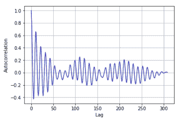

# 第九章：信号处理与时间序列

信号处理是电气工程和应用数学的一个子领域。它涵盖了时间相关变量或随时间变化的变量的分析和处理，例如模拟信号和数字信号。模拟信号是非数字化的信号，例如广播或电话信号。数字信号是数字化的、离散的、按时间采样的信号，例如计算机和数字设备信号。时间序列分析是信号处理的一个类别，处理的是有序或按顺序排列的观察列表。这些数据可以按小时、日、周、月或年排序。时间序列中的时间因素非常重要。我们需要提取数据中所有与时间相关的关系。与时间序列分析相关的例子有很多，例如产品的生产和销售、按小时或每天预测股价、经济预测和人口普查分析。

在本章中，我们的主要关注点是使用 NumPy、SciPy、`pandas`和`statsmodels`库进行信号处理和时间序列操作。本章将对数据分析师理解趋势和模式，以及预测销售、股价、生产、人口、降水量和气温等有所帮助。

本章将涵盖以下主题：

+   `statsmodels`模块

+   移动平均

+   窗口函数

+   定义协整

+   STL 分解

+   自相关

+   自回归模型

+   ARMA 模型

+   生成周期信号

+   傅里叶分析

+   谱分析滤波

# 技术要求

本章有以下技术要求：

+   你可以在以下 GitHub 链接找到代码和数据集：[`github.com/PacktPublishing/Python-Data-Analysis-Third-Edition/tree/master/Chapter08`](https://github.com/PacktPublishing/Python-Data-Analysis-Third-Edition/tree/master/Chapter08)。

+   所有的代码块都在`Ch8.ipynb`文件中。

+   本章使用两个 CSV 文件（`beer_production.csv`和`sales.csv`）进行实践。

+   本章将使用`pandas`和 Scikit-learn Python 库。

# statsmodels 模块

`statsmodels`是一个开源的 Python 模块，提供了多种统计操作的功能，例如中心值（均值、众数和中位数）、离散度量（标准差和方差）、相关性和假设检验。

让我们使用`pip`安装`statsmodels`并运行以下命令：

```py
pip3 install statsmodels
```

`statsmodels`提供了`statsmodels.tsa`子模块用于时间序列操作。`statsmodels.tsa`提供了有用的时间序列方法和技术，例如自回归、 autocorrelation、部分自相关、移动平均、简单指数平滑、霍尔特线性法、霍尔特-温特斯法、ARMA、ARIMA、**向量自回归**（**VAR**）模型和许多助手函数，我们将在接下来的章节中探讨这些。

# 移动平均

移动平均或滚动均值是时间序列滤波器，通过对一组或窗口的观测值进行平均，滤除冲动响应。它使用窗口大小的概念，并计算每个周期连续窗口滑动的平均值。简单移动平均可以表示如下：


有多种类型的移动平均可用，例如居中、双重和加权移动平均。让我们使用`rolling()`函数找到移动平均值，但在此之前，我们将首先加载数据并可视化：

```py
# import needful libraries
import pandas as pd
import statsmodels.api as sm
import matplotlib.pyplot as plt

# Read dataset
sales_data = pd.read_csv('sales.csv')

# Setting figure size
plt.figure(figsize=(10,6))

# Plot original sales data
plt.plot(sales_data['Time'], sales_data['Sales'], label="Sales-Original")

# Rotate xlabels
plt.xticks(rotation=60)

# Add legends
plt.legend()

#display the plot
plt.show()
```

这将产生以下输出：


在前面的代码中，我们读取了 2017 年 1 月到 2019 年 12 月 36 个月的销售数据，并使用 Matplotlib 绘制了图表。现在，我们将使用滚动函数计算移动平均值：

```py
# Moving average with window 3
sales_data['3MA']=sales_data['Sales'].rolling(window=3).mean()

# Moving average with window 5
sales_data['5MA']=sales_data['Sales'].rolling(window=5).mean()

# Setting figure size
plt.figure(figsize=(10,6))

# Plot original sales data
plt.plot(sales_data['Time'], sales_data['Sales'], label="Sales-Original", color="blue")

# Plot 3-Moving Average of sales data
plt.plot(sales_data['Time'], sales_data['3MA'], label="3-Moving Average(3MA)", color="green")

# Plot 5-Moving Average of sales data
plt.plot(sales_data['Time'], sales_data['5MA'], label="5-Moving Average(5MA)", color="red")

# Rotate xlabels
plt.xticks(rotation=60)

# Add legends
plt.legend()

# Display the plot
plt.show()
```

这将产生以下输出：


在前面的代码中，我们使用滚动均值计算了 3 和 5 的移动平均值，并使用 Matplotlib 显示了线形图。现在，让我们在下一节中看看不同类型的移动平均窗口函数。

# 窗口函数

NumPy 提供了多种窗口选项，可以计算滚动窗口中的权重，正如我们在前一节中所做的那样。

窗口函数用于光谱分析和滤波器设计的间隔（更多背景信息，请参见[`en.wikipedia.org/wiki/Window_function`](http://en.wikipedia.org/wiki/Window_function)）。箱型窗口是一个矩形窗口，其公式如下：

*w(n) = 1*

三角窗口的形状像一个三角形，其公式如下：


在这里，*L*可以等于*N*、*N*+1 或*N*–1。

如果*L*的值为*N*–1，则称为 Bartlett 窗口，其公式如下：


在`pandas`模块中，`DataFrame.rolling()`函数使用`win_type`参数提供相同的功能，以实现不同的窗口函数。另一个参数是窗口，用于定义窗口的大小，如前一节所示，这非常容易设置。让我们使用`win_type`参数并尝试不同的窗口函数：

```py
# import needful libraries
import pandas as pd
import statsmodels.api as sm
import matplotlib.pyplot as plt

# Read dataset
sales_data = pd.read_csv('sales.csv', index_col ="Time")

# Apply all the windows on given DataFrame
sales_data['boxcar']=sales_data.Sales.rolling(3, win_type ='boxcar').mean()
sales_data['triang']=sales_data.Sales.rolling(3, win_type ='triang').mean()
sales_data['hamming']=sales_data.Sales.rolling(3, win_type ='hamming').mean()
sales_data['blackman']=sales_data.Sales.rolling(3, win_type ='blackman').mean()

#Plot the rolling mean of all the windows
sales_data.plot(kind='line',figsize=(10,6))
```

这将产生以下输出：


在前面的代码块中，我们使用`rolling()`函数中的`win_type`参数绘制了不同窗口函数的滚动均值，如箱型、三角形、汉明窗口和布莱克曼窗口。现在，让我们学习如何使用协整找到两个时间序列之间的相关性。

# 定义协整

协整就像是相关性，可以看作是定义两个时间序列相关性的更优指标。协整是两个时间序列线性组合的平稳行为。这样，以下方程的趋势必须是平稳的：

*y(t) - a x(t)*

想象一个醉汉带着他的狗在散步。相关性告诉我们他们是否朝同一方向走。协整则告诉我们男人与狗之间的距离随时间的变化。我们将使用随机生成的时间序列和实际数据来展示协整。**增强型迪基-福勒**（**ADF**）检验用于检验时间序列中的单位根，并可用来判断时间序列的平稳性。

让我们通过一个例子来理解两个时间序列的协整。

你可以通过以下 GitHub 链接查看完整的代码：[`github.com/PacktPublishing/Python-Data-Analysis-Third-Edition/blob/master/Chapter08/Ch8.ipynb`](https://github.com/PacktPublishing/Python-Data-Analysis-Third-Edition/blob/master/Chapter08/Ch8.ipynb)

让我们开始协整演示：

1.  导入所需的库并定义以下函数来计算 ADF 统计量：

```py
# Import required library
import statsmodels.api as sm
import pandas as pd
import statsmodels.tsa.stattools as ts
import numpy as np

# Calculate ADF function 
def calc_adf(x, y):
    result = sm.OLS(x, y).fit()
    return ts.adfuller(result.resid)
```

1.  将太阳黑子数据加载到一个 NumPy 数组中：

```py
# Read the Dataset
data = sm.datasets.sunspots.load_pandas().data.values
N = len(data)
```

1.  生成一个正弦波并计算正弦与自身的协整：

```py
# Create Sine wave and apply ADF test  
t = np.linspace(-2 * np.pi, 2 * np.pi, N)
sine = np.sin(np.sin(t))
print("Self ADF", calc_adf(sine, sine))
```

代码应该打印以下内容：

```py
Self ADF (-5.0383000037165746e-16, 0.95853208606005591, 0, 308,
{'5%': -2.8709700936076912, '1%': -3.4517611601803702, '10%':
-2.5717944160060719}, -21533.113655477719)
```

在打印的结果中，第一个值代表 ADF 指标，第二个值代表 p 值。如你所见，p 值非常高。接下来的值为滞后和样本大小。最后的字典给出了此样本大小对应的 t 分布值。

1.  现在，给正弦波加入噪声，以演示噪声如何影响信号：

```py
# Apply ADF test on Sine and Sine with noise 
noise = np.random.normal(0, .01, N)
print("ADF sine with noise", calc_adf(sine, sine + noise))
```

有了噪声，我们得到以下结果：

```py
ADF sine with noise (-7.4535502402193075, 5.5885761455106898e- 11, 3, 305, {'5%': -2.8710633193086648, '1%': -3.4519735736206991, '10%': -2.5718441306100512}, -1855.0243977703672)
```

p 值已经大幅下降。这里的 ADF 指标`-7.45`低于字典中的所有临界值。所有这些都是强有力的理由来拒绝协整。

1.  让我们生成一个幅度更大的余弦并进行偏移。再次，加入噪声：

```py
# Apply ADF test on Sine and Cosine with noise 
cosine = 100 * np.cos(t) + 10

print("ADF sine vs cosine with noise", calc_adf(sine, cosine + noise))
```

以下值将被打印出来：

```py
ADF sine vs cosine with noise (-17.927224617871534, 2.8918612252729532e-30, 16, 292, {'5%': -2.8714895534256861, '1%': -3.4529449243622383, '10%': -2.5720714378870331}, -11017.837238220782) 
```

同样，我们有充分的理由拒绝协整。检查正弦与太阳黑子之间的协整，得到以下输出：

```py
print("Sine vs sunspots", calc_adf(sine, data))
```

以下值将被打印出来：

```py
Sine vs sunspots (-6.7242691810701016, 3.4210811915549028e-09, 16, 292,
{'5%': -2.8714895534256861, '1%': -3.4529449243622383, 
'10%': -2.5720714378870331}, -1102.5867415291168)
```

这里使用的配对的置信水平大致相同，因为它们依赖于数据点的数量，而这一点变化不大。结果总结在以下表格中：

| **配对** | **统计量** | **p 值** | **5%** | **1%** | **10%** | **拒绝** |
| --- | --- | --- | --- | --- | --- | --- |
| 自身的正弦 | -5.03E-16 | 0.95 | -2.87 | -3.45 | -2.57 | 否 |
| 噪声影响下的正弦与正弦 | -7.45 | 5.58E-11 | -2.87 | -3.45 | -2.57 | 是 |
| 噪声影响下的正弦与余弦 | -17.92 | 2.89E-30 | -2.87 | -3.45 | -2.57 | 是 |
| 正弦与太阳黑子 | -6.72 | 3.42E-09 | -2.87 | -3.45 | -2.57 | 是 |

在前面的表格中，汇总了所有四个正弦波的结果，并讨论了它们的显著性水平以及拒绝/接受的标准。现在让我们进入本章的另一个重要话题，即任何时间序列的 STL 分解。

# STL 分解

**STL** 代表 **季节性** **和趋势分解** **使用 LOESS**。STL 是一种时间序列分解方法，可以将观测信号分解为趋势、季节性和残差。它能够估计非线性关系并处理任何类型的季节性。`statsmodels.tsa.seasonal`子包提供了`seasonal_decompose`方法，用于将给定的输入信号分解为趋势、季节性和残差。

让我们看以下示例来理解 STL 分解：

```py
# import needful libraries
import pandas as pd
import matplotlib.pyplot as plt
from statsmodels.tsa.seasonal import seasonal_decompose

# Read the dataset
data = pd.read_csv('beer_production.csv')
data.columns= ['date','data']

# Change datatype to pandas datetime
data['date'] = pd.to_datetime(data['date'])
data=data.set_index('date')

# Decompose the data
decomposed_data = seasonal_decompose(data, model='multiplicative')

# Plot decomposed data
decomposed_data.plot()

# Display the plot
plt.show()
```

这将产生以下输出：


在前面的代码块中，给定的时间序列信号通过`statsmodels`模块的`seasonal_decompose()`函数被分解为趋势、季节性和残差组件。现在让我们跳到自相关，理解时间序列与其滞后序列之间的关系。

# 自相关

自相关，或滞后相关，是时间序列与其滞后序列之间的相关性。它指示数据集中的趋势。自相关公式可以定义如下：


我们可以使用 NumPy 的`correlate()`函数来计算日冕周期的实际自相关。我们还可以直接使用`autocorrelation_plot()`函数可视化自相关图。让我们计算自相关并可视化它：

```py
# import needful libraries
import pandas as pd
import numpy as np
import statsmodels.api as sm
import matplotlib.pyplot as plt

# Read the dataset
data = sm.datasets.sunspots.load_pandas().data

# Calculate autocorrelation using numpy
dy = data.SUNACTIVITY - np.mean(data.SUNACTIVITY)
dy_square = np.sum(dy ** 2)

# Cross-correlation
sun_correlated = np.correlate(dy, dy, mode='full')/dy_square
result = sun_correlated[int(len(sun_correlated)/2):]

# Diplay the Chart
plt.plot(result)

# Display grid
plt.grid(True)

# Add labels
plt.xlabel("Lag")

plt.ylabel("Autocorrelation")
# Display the chart
plt.show()
```

这将产生以下输出：



在前面的代码块中，我们使用 NumPy 模块看到了一个自相关示例。现在让我们计算由`pandas`生成的自相关图：

```py
from pandas.plotting import autocorrelation_plot

# Plot using pandas function
autocorrelation_plot(data.SUNACTIVITY)
```

这将产生以下输出：


在前面的代码块中，我们使用`pandas`库的`autocorrelation_plot()`函数生成了自相关图。与 NumPy 库相比，使用`pandas`库更容易绘制自相关图。现在让我们跳到自回归模型进行时间序列预测。

# 自回归模型

自回归模型是用于预测未来事件的时间序列模型。以下公式展示了这一点：


在前面的公式中，*c*是常数，最后一项是随机成分，也称为白噪声。

让我们使用`statsmodels.tsa`子包构建自回归模型：

1.  导入库并读取数据集：

```py
# import needful libraries
from statsmodels.tsa.ar_model import AR
from sklearn.metrics import mean_absolute_error
from sklearn.metrics import mean_squared_error
import matplotlib.pyplot as plt
import statsmodels.api as sm
from math import sqrt

# Read the dataset
data = sm.datasets.sunspots.load_pandas().data
```

1.  将日冕数据拆分为训练集和测试集：

```py
# Split data into train and test set
train_ratio=0.8

train=data[:int(train_ratio*len(data))]
test=data[int(train_ratio*len(data)):]
```

1.  训练并拟合自回归模型：

```py
# AutoRegression Model training
ar_model = AR(train.SUNACTIVITY)
ar_model = ar_model.fit()

# print lags and
print("Number of Lags:", ar_model.k_ar)
print("Model Coefficients:\n", ar_model.params)
```

这将产生以下输出：

```py
Number of Lags: 15
Model Coefficients:
const            9.382322
L1.SUNACTIVITY   1.225684
L2.SUNACTIVITY  -0.512193
L3.SUNACTIVITY  -0.130695
L4.SUNACTIVITY   0.193492
L5.SUNACTIVITY  -0.168907
L6.SUNACTIVITY   0.054594
L7.SUNACTIVITY  -0.056725
L8.SUNACTIVITY   0.109404
L9.SUNACTIVITY   0.108993
L10.SUNACTIVITY -0.117063
L11.SUNACTIVITY  0.200454
L12.SUNACTIVITY -0.075111
L13.SUNACTIVITY -0.114437
L14.SUNACTIVITY  0.177516
L15.SUNACTIVITY -0.091978
dtype: float64
```

在前面的代码中，我们读取了 Sunspot 数据集并将其分成了两部分：训练集和测试集。然后，我们通过创建实例并拟合模型构建了自回归模型。接下来，我们进行预测并评估模型的性能。

1.  进行预测并评估模型：

```py
# make predictions
start_point = len(train)
end_point = start_point + len(test)-1
pred = ar_model.predict(start=start_point, end=end_point, dynamic=False)

# Calculate errors
mae = mean_absolute_error(test.SUNACTIVITY, pred)
mse = mean_squared_error(test.SUNACTIVITY, pred)
rmse = sqrt(mse)
print("MAE:",mae)
print("MSE:",mse)
print("RMSE:",rmse)
```

这将产生以下输出：

```py
MAE: 31.17846098350052
MSE: 1776.9463826165913
RMSE: 42.15384184883498
```

在前面的代码块中，我们对测试数据集进行了预测，并使用**平均绝对误差**（**MAE**）、**均方误差**（**MSE**）和**均方根误差**（**RMSE**）评估了模型的性能。接下来，我们绘制原始序列和预测序列的折线图。

1.  让我们绘制预测序列和原始序列，以便更好地理解预测结果：

```py
# Setting figure size
plt.figure(figsize=(10,6))

# Plot test data
plt.plot(test.SUNACTIVITY, label='Original-Series')

# Plot predictions
plt.plot(pred, color='red', label='Predicted Series')

# Add legends
plt.legend()

# Display the plot
plt.show()
```

这将产生以下输出：


在前面的图中，我们可以看到使用自回归模型得到的原始序列和预测序列。在生成了自回归模型后，我们需要进入时间序列预测的另一个高级方法——**自回归移动平均**（**ARMA**）。

# ARMA 模型

ARMA 模型结合了自回归和移动平均。ARMA 模型通常称为 ARMA(*p*,*q*)，其中*p*是自回归部分的阶数，*q*是移动平均部分的阶数：


在前面的公式中，就像在自回归模型公式中一样，我们有一个常数项和一个白噪声分量；但是，我们还尝试拟合滞后的噪声分量：

1.  导入库并读取数据集：

```py
# import needful libraries
import statsmodels.api as sm
from statsmodels.tsa.arima_model import ARMA
from sklearn.metrics import mean_absolute_error
from sklearn.metrics import mean_squared_error
import matplotlib.pyplot as plt
from math import sqrt

# Read the dataset
data = sm.datasets.sunspots.load_pandas().data
data.drop('YEAR',axis=1,inplace=True)
```

1.  将 Sunspot 数据集分成训练集和测试集：

```py
# Split data into train and test set
train_ratio=0.8
train=data[:int(train_ratio*len(data))]
test=data[int(train_ratio*len(data)):]
```

1.  训练并拟合自回归模型：

```py
# AutoRegression Model training
arma_model = ARMA(train, order=(10,1))
arma_model = arma_model.fit()
```

1.  进行预测并评估模型：

```py
# make predictions
start_point = len(train)
end_point = start_point + len(test)-1
pred = arma_model.predict(start_point,end_point)

# Calculate errors
mae = mean_absolute_error(test.SUNACTIVITY, pred)
mse = mean_squared_error(test.SUNACTIVITY, pred)
rmse = sqrt(mse)
print("MAE:",mae)
print("MSE:",mse)
print("EMSE:",rmse)
```

这将产生以下输出：

```py
MAE: 33.95457845540467
MSE: 2041.3857010355755
EMSE: 45.18169652675268
```

1.  让我们绘制预测序列和原始序列，以便更好地理解预测结果：

```py
# Setting figure size
plt.figure(figsize=(10,6))

# Plot test data
plt.plot(test, label='Original-Series')

# Plot predictions
plt.plot(pred, color='red', label='Predicted Series')

# Add legends
plt.legend()

# Display the plot
plt.show()
```

这将产生以下输出：


在前面的代码中，我们读取了 Sunspot 数据集并将其分成了两部分：训练集和测试集。然后，我们通过创建实例并拟合模型构建了 ARMA 模型。我们对测试数据集进行了预测，并使用 MAE、MSE 和 RMSE 评估了模型性能。最后，我们查看了原始序列和预测序列的折线图。接下来，我们将讨论另一个重要主题——生成周期性信号。

# 生成周期性信号

许多自然现象是规律和可靠的，比如准确的时钟。有些现象展现出看似规律的模式。一组科学家发现，利用 Hilbert-Huang 变换（参见[`en.wikipedia.org/wiki/Hilbert%E2%80%93Huang_transform`](https://en.wikipedia.org/wiki/Hilbert%E2%80%93Huang_transform)）可以发现太阳黑子活动有三个周期，分别为大约 11 年、22 年和 100 年。通常，我们会使用三角函数，如正弦函数，来模拟周期信号。你可能记得高中时学过一点三角学。对于这个例子来说，这些知识就足够了。因为我们有三个周期，所以看起来合理的是创建一个由三个正弦函数线性组合而成的模型。这只需要对自回归模型的代码进行一点小的调整：

1.  创建模型、误差和拟合函数：

```py
# Import required libraries
import numpy as np
import statsmodels.api as sm
from scipy.optimize import leastsq
import matplotlib.pyplot as plt

# Create model function
def model(p, t):
    C, p1, f1, phi1 , p2, f2, phi2, p3, f3, phi3 = p
    return C + p1 * np.sin(f1 * t + phi1) + p2 * np.sin(f2 * t + phi2) +p3 * np.sin(f3 * t + phi3)

# Create error function
def error(p, y, t):
    return y - model(p, t)

# Create fit function
def fit(y, t):
    p0 = [y.mean(), 0, 2 * np.pi/11, 0, 0, 2 * np.pi/22, 0, 0, 2 * np.pi/100, 0]
    params = leastsq(error, p0, args=(y, t))[0]
    return params
```

1.  让我们加载数据集：

```py
# Load the dataset
data_loader = sm.datasets.sunspots.load_pandas()
sunspots = data_loader.data["SUNACTIVITY"].values
years = data_loader.data["YEAR"].values
```

1.  应用并拟合模型：

```py
# Apply and fit the model
cutoff = int(.9 * len(sunspots))
params = fit(sunspots[:cutoff], years[:cutoff])
print("Params", params)

pred = model(params, years[cutoff:])
actual = sunspots[cutoff:]
```

1.  打印结果：

```py
print("Root mean square error", np.sqrt(np.mean((actual - pred) ** 2)))
print("Mean absolute error", np.mean(np.abs(actual - pred)))
print("Mean absolute percentage error", 100 *
np.mean(np.abs(actual - pred)/actual))
mid = (actual + pred)/2
print("Symmetric Mean absolute percentage error", 100 *
       np.mean(np.abs(actual - pred)/mid))
print("Coefficient of determination", 1 - ((actual - pred) 
        **2).sum()/ ((actual - actual.mean()) ** 2).sum())
```

这将产生以下输出：

```py
Params [47.1880006  28.89947462   0.56827279 6.51178464  4.55214564
 0.29372076 -14.30924768 -18.16524123 0.06574835 -4.37789476]
Root mean square error 59.56205597915569
Mean absolute error 44.58158470150657
Mean absolute percentage error 65.16458348768887
Symmetric Mean absolute percentage error 78.4480696873044
Coefficient of determination -0.3635315489903188
```

第一行显示了我们尝试的模型的系数。我们的 MAE 是 44，意味着我们平均偏离这个值无论是正向还是反向。我们还希望决定系数尽可能接近 1，这样拟合效果才好。然而，我们得到的是一个负值，这是不理想的。让我们绘制一张图表，详细了解这些结果。

1.  绘制原始数据和预测数据：

```py
year_range = data_loader.data["YEAR"].values[cutoff:]

# Plot the actual and predicted data points
plt.plot(year_range, actual, 'o', label="Sunspots")
plt.plot(year_range, pred, 'x', label="Prediction")
plt.grid(True)

# Add labels
plt.xlabel("YEAR")
plt.ylabel("SUNACTIVITY")

# Add legend
plt.legend()

# Display the chart
plt.show()
```

这将产生以下输出：


从前面的图表可以得出结论，模型未能捕捉到序列的实际模式。这就是为什么我们得到负的决定系数或 R 平方值的原因。现在，我们将看另一种重要的时间序列分析技术——傅里叶分析。

# 傅里叶分析

傅里叶分析使用了数学家约瑟夫·傅里叶提出的傅里叶级数概念。傅里叶级数是一种将函数表示为正弦和余弦项的无限级数的数学方法。这里的函数可以是实数值或复数值的：


对于傅里叶分析，最有效的算法是**快速** **傅里叶变换**（**FFT**）。FFT 将信号分解为不同频率的信号。这意味着它生成了给定信号的频谱。SciPy 和 NumPy 库提供了 FFT 的相关函数。

`rfft()`函数对实值数据执行 FFT。我们也可以使用`fft()`函数，但在这个太阳黑子数据集上会给出警告。`fftshift()`函数将零频率成分移动到频谱的中间。

让我们通过以下示例来理解 FFT：

1.  导入库并读取数据集：

```py
# Import required library
import numpy as np
import statsmodels.api as sm
import matplotlib.pyplot as plt
from scipy.fftpack import rfft
from scipy.fftpack import fftshift

# Read the dataset
data = sm.datasets.sunspots.load_pandas().data

# Create Sine wave
t = np.linspace(-2 * np.pi, 2 * np.pi, len(data.SUNACTIVITY.values))
mid = np.ptp(data.SUNACTIVITY.values)/2
sine = mid + mid * np.sin(np.sin(t))
```

2\. 计算正弦波和太阳黑子的 FFT：

```py
# Compute FFT for Sine wave
sine_fft = np.abs(fftshift(rfft(sine)))
print("Index of max sine FFT", np.argsort(sine_fft)[-5:])

# Compute FFT for sunspots dataset
transformed = np.abs(fftshift(rfft(data.SUNACTIVITY.values)))
print("Indices of max sunspots FFT", np.argsort(transformed)[-5:])
```

1.  创建子图：

```py
# Create subplots
fig, axs = plt.subplots(3,figsize=(12,6),sharex=True)
fig.suptitle('Power Specturm')
axs[0].plot(data.SUNACTIVITY.values, label="Sunspots")
axs[0].plot(sine, lw=2, label="Sine")
axs[0].legend() # Set legends
axs[1].plot(transformed, label="Transformed Sunspots")
axs[1].legend() # Set legends
axs[2].plot(sine_fft, lw=2, label="Transformed Sine")
axs[2].legend() # Set legends

# Display the chart
plt.show()
```

这将产生以下输出：


在前面的代码中，首先，我们读取了太阳黑子数据集并创建了正弦波。之后，我们计算了正弦波和`SUNACTIVITY`列的 FFT。最后，我们绘制了原始序列、正弦波以及变换后的太阳黑子和正弦波的三张图。

# 谱分析滤波

在前一节中，我们讨论了数据集的幅度谱。现在是时候探索功率谱了。任何物理信号的功率谱都可以显示信号的能量分布。我们可以通过以下语法轻松地修改代码并通过对变换信号进行平方来显示功率谱：

```py
plt.plot(transformed ** 2, label="Power Spectrum")
```

我们还可以使用以下 Python 语法绘制相位谱：

```py
plt.plot(np.angle(transformed), label="Phase Spectrum")
```

让我们看一下完整的代码，用于计算太阳黑子数据集的功率谱和相位谱：

1.  导入库并读取数据集：

```py
# Import required library
import numpy as np
import statsmodels.api as sm
from scipy.fftpack import rfft
from scipy.fftpack import fftshift
import matplotlib.pyplot as plt

# Read the dataset
data = sm.datasets.sunspots.load_pandas().data
```

1.  计算 `FFT`、`Spectrum` 和 `Phase`：

```py
# Compute FFT
transformed = fftshift(rfft(data.SUNACTIVITY.values))

# Compute Power Spectrum
power=transformed ** 2

# Compute Phase
phase=np.angle(transformed)
```

1.  创建子图：

```py
# Create subplots
fig, axs = plt.subplots(3,figsize=(12,6),sharex=True)
fig.suptitle('Power Specturm')
axs[0].plot(data.SUNACTIVITY.values, label="Sunspots")
axs[0].legend() # Set legends
axs[1].plot(power, label="Power Spectrum")
axs[1].legend() # Set legends
axs[2].plot(phase, label="Phase Spectrum")
axs[2].legend() # Set legends

# Display the chart
plt.show()
```

这将产生以下输出：


在前面的代码中，首先，我们读取了太阳黑子数据集并计算了 `SUNACTIVITY` 列的 FFT。然后，我们计算了变换后 FFT 的功率谱和相位谱。最后，我们使用子图绘制了原始序列、功率谱和相位谱的三张图。

# 总结

在本章中，我们使用的时间序列示例包括年度太阳黑子周期数据、销售数据和啤酒生产数据。我们学到，在同一时间序列中，尝试推导一个值与另一个数据点或一组数据点在过去固定周期内的关系是常见的做法。我们了解到，移动平均通过使用窗口大小将随机变化趋势转换为平滑趋势。我们还学到了 `DataFrame.rolling()` 函数如何为不同的窗口函数提供 `win_type` 字符串参数。协整与相关性类似，是用来定义两个时间序列之间关系的度量指标。我们还重点讲解了 STL 分解、自相关、自动回归、ARMA 模型、傅里叶分析和谱分析滤波。

下一章，第九章，*监督学习 – 回归分析*，将重点讲解回归分析和逻辑回归在 Python 中的重要主题。章节首先介绍了多元线性回归、多重共线性、虚拟变量和模型评估指标。在后面的部分，将重点讨论逻辑回归。
