# 第十章：监督学习 - 回归分析

回归是统计学和机器学习中最受欢迎的算法。在机器学习和数据科学领域，回归分析是监督式机器学习领域的一个成员，它帮助我们预测连续变量，如股价、房价、销售额、降雨量和温度。例如，作为一家电子商店的销售经理，假设你需要预测未来几周所有类型产品的销售情况，如电视、空调、笔记本电脑、冰箱等。许多因素可能影响你的销售情况，如天气条件、节假日、促销策略、竞争对手的优惠等。回归分析是帮助你识别这些因素的重要性，从而做出商店决策的工具之一。

回归分析用于识别因变量如何依赖于自变量。例如，假设作为一名教育官员，你希望识别体育活动、智能课堂、师生比、额外课程和教师培训对学生成绩的影响。**普通最小二乘法** (**OLS**) 通过最小化平方误差和（或误差方差）来找出最佳拟合函数。它预测在给定条件下最可能的结果。本章的主要目标是学习**多重线性回归** (**MLR**) 的基础知识、多重共线性、虚拟变量、回归以及模型评估指标，如 R 平方、**均方误差** (**MSE**)、**平均绝对误差** (**MAE**) 和**均方根误差** (**RMSE**)。另一个目标是创建一个逻辑回归分类模型。

本章涵盖的主题如下：

+   线性回归

+   理解多重共线性

+   虚拟变量

+   开发线性回归模型

+   评估回归模型性能

+   拟合多项式回归

+   用于分类的回归模型

+   逻辑回归

+   使用 scikit-learn 实现逻辑回归

# 技术要求

本章有以下技术要求：

+   你可以在以下 GitHub 链接中找到代码和数据集：[`github.com/PacktPublishing/Python-Data-Analysis-Third-Edition/tree/master/Chapter09`](https://github.com/PacktPublishing/Python-Data-Analysis-Third-Edition/tree/master/Chapter09)[。](https://github.com/PacktPublishing/Python-Data-Analysis-Third-Edition/tree/master/Chapter09)

+   所有代码块都可以在`ch9.ipynb`文件中找到。

+   本章使用三个 CSV 文件（`Advertising.csv`、`bloodpress.txt` 和 `diabetes.csv`）用于练习。

+   在本章中，我们将使用 Matplotlib、`pandas`、Seaborn 和 scikit-learn Python 库。

# 线性回归

线性回归是一种曲线拟合和预测算法，用于发现因变量（或目标列）与一个或多个自变量（或预测变量）之间的线性关系。这种关系是确定性的，意味着它以一定的误差预测因变量。在回归分析中，因变量是连续的，而自变量可以是连续的或离散的。线性回归已广泛应用于各种商业和科学问题，如股票价格、原油价格、销售额、房产价格和 GDP 增长率的预测。在下图中，我们可以看到线性回归如何在二维空间中拟合数据：

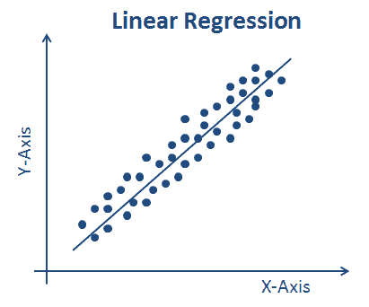

主要目标是找到最佳拟合线，以最小的误差理解变量之间的关系。回归中的误差是预测值与实际值之间的差异。回归系数是通过 OLS 方法估计的。OLS 试图最小化残差平方和。我们来看回归模型的方程：

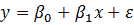

这里，*x* 是自变量，*y* 是因变量。 截距是 *x* 的系数，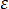（希腊字母发音为 epsilon）是作为随机变量的误差项。

线性回归的参数是通过 OLS 估计的。OLS 是一种广泛用于估计回归截距和系数的方法。它通过减少残差平方和（或误差）来优化，这个误差是预测值与实际值之间的差异。

在了解了线性回归之后，现在是时候学习 MLR 了。

## 多重线性回归

多重线性回归（MLR）是简单线性回归的推广形式。它是一种统计方法，用于根据多个特征或解释变量预测连续的目标变量。MLR 的主要目标是估计多个特征与目标变量之间的线性关系。MLR 在现实生活中的应用非常广泛。MLR 模型可以表示为数学方程：

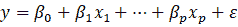

这里，![] 是自变量，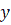 是因变量。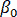 截距是 *x* 的系数，（希腊字母发音为 epsilon）是作为随机变量的误差项。

现在我们知道什么是线性回归，让我们继续讨论多重共线性。

# 理解多重共线性

多重共线性表示自变量（或预测变量）之间高度的相互相关性或相互关系。

多重共线性发生在多元回归分析中的自变量彼此高度相关时。这种关联是由于自变量之间的高相关性造成的。这种高相关性会导致线性回归模型预测结果出现问题。在进行线性回归分析时，避免多重共线性是基本假设，以获得更好的结果：

+   它是由于虚拟变量的不当使用而发生的。

+   它还可能是由于相似变量的重复出现引起的。

+   它还可能是由于从数据中的其他变量合成的变量引起的。

+   它可能是由于变量之间的高相关性引起的。

多重共线性会导致以下问题：

+   它会导致回归系数的精确估计变得困难，并且系数对模型中的微小变化变得更加敏感。

+   它还可能导致系数的符号和大小发生变化。

+   它使得评估自变量相对重要性变得困难。

## 移除多重共线性

可以使用以下方法检测多重共线性：

+   自变量之间的相关系数（或相关矩阵）

+   **方差膨胀因子**（**VIF**）

+   特征值

相关系数或相关矩阵有助于我们识别自变量之间的高度相关性。通过相关系数，我们可以通过检查相关系数的大小来轻松检测多重共线性：

```py
# Import pandas
import pandas as pd

# Read the blood pressure dataset
data = pd.read_csv("bloodpress.txt",sep='\t')

# See the top records in the data
data.head()
```

这会导致以下输出：

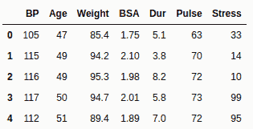

在前面的代码块中，我们使用`read_csv()`函数读取了`bloodpress.txt`数据。我们还检查了数据集的初始记录。这个数据集包含了`BP`、`Age`、`Weight`、`BSA`、`Dur`、`Pulse`和`Stress`字段。让我们使用相关矩阵来检查数据集中的多重共线性：

```py
# Import seaborn and matplotlib
import seaborn as sns
import matplotlib.pyplot as plt

# Correlation matrix
corr=data.corr()

# Plot Heatmap on correlation matrix 
sns.heatmap(corr, annot=True, cmap='YlGnBu')

# display the plot
plt.show()
```

这会导致以下输出：

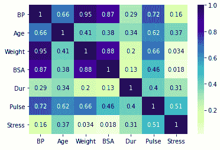

在前面的示例中，我们使用相关矩阵查找多个变量之间的相关性。我们加载了`bloodpress.txt`文件，并使用`corr()`函数找到了相关性。最后，我们使用`heatmap()`函数可视化了相关矩阵。

这里，**BP**（**血压**）是因变量或目标变量，其他列是自变量或特征。我们可以看到，**Weight**和**BSA**（**体表面积**）之间有很高的相关性。我们需要移除其中一个变量（**Weight**或**BSA**），以消除多重共线性。在我们的例子中，体重比体表面积更容易测量，因此专家会选择体重并移除体表面积。

# 虚拟变量

虚拟变量是回归分析中使用的分类自变量。它也被称为布尔值、指示变量、定性变量、分类变量和二元变量。虚拟变量将具有*N*个不同值的分类变量转换为*N*–1 个虚拟变量。它只取 1 和 0 这两个二进制值，分别代表存在和不存在。

`pandas`提供了`get_dummies()`函数来生成虚拟值。让我们通过一个例子来理解`get_dummies()`函数：

```py
# Import pandas module
import pandas as pd

# Create pandas DataFrame
data=pd.DataFrame({'Gender':['F','M','M','F','M']})

# Check the top-5 records
data.head()
```

这将产生以下输出：

|  | **Gender** |
| --- | --- |
| 0 | F |
| 1 | M |
| 2 | M |
| 3 | F |
| 4 | M |

在前面的代码块中，我们创建了包含`Gender`列的 DataFrame，并使用`get_dummies()`函数生成了虚拟变量。让我们通过以下代码看一个例子：

```py
# Dummy encoding
encoded_data = pd.get_dummies(data['Gender'])

# Check the top-5 records of the dataframe
encoded_data.head()
```

这将产生以下输出：

```py
 F M
0 1 0
1 0 1
2 0 1
3 1 0
4 0 1
```

在前面的例子中，`get_dummies()`函数生成了两列，这意味着每个值都有一个单独的列。

我们可以通过使用`drop_first=True`参数，去掉一列，避免共线性问题，首先删除*N*个类别中的第一列虚拟变量：

```py
# Dummy encoding
encoded_data = pd.get_dummies(data['Gender'], drop_first=True)

# Check the top-5 records of the dataframe
encoded_data.head()
```

这将产生以下输出：

```py
  M
0 0
1 1
2 1
3 0
4 1
```

在前面的代码块中，我们使用`get_dummies()`函数并设置`drop_first=True`参数，为`Gender`列创建了虚拟变量。这将删除第一列，剩下*N–*1 列。现在，让我们学习如何使用`scikit-learn`库实现线性回归模型。

# 开发线性回归模型

在理解回归分析、多重共线性和虚拟变量的概念之后，是时候通过实际操作体验回归分析了。让我们学习如何使用科学机器学习工具包（scikit-learn）构建回归模型：

1.  我们将首先使用`read_csv()`函数加载数据集：

```py
# Import pandas
import pandas as pd

# Read the dataset using read_csv method
df = pd.read_csv("Advertising.csv")

# See the top-5 records in the data
df.head()

```

这将产生以下输出：

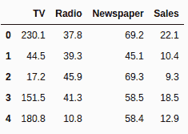

现在我们已经使用`read_csv()`加载了`Advertising.csv`数据集，并使用`head()`函数查看了初始记录，我们将数据拆分为两部分：因变量或目标变量和自变量或特征变量。

1.  在这一步，我们将数据拆分两次：

+   将数据分为两部分：因变量或目标变量与自变量或特征变量。

+   将数据拆分为训练集和测试集。这可以使用以下代码完成：

```py
# Independent variables or Features
X = df[['TV', 'Radio', 'Newspaper']]

# Dependent or Target variable
y = df.Sales
```

在将列分为因变量和自变量部分之后，我们将使用`train_test_split()`函数按 75:25 的比例将数据拆分为训练集和测试集。这个比例可以通过`test_size`参数指定，`random_state`用作种子值，确保每次拆分的数据相同。如果`random_state`为`None`，则每次都会随机拆分记录，可能会得到不同的性能度量：

```py
# Lets import the train_test_split method
from sklearn.model_selection import train_test_split

# Distribute the features(X) and labels(y) into two parts training and testing sets
X_train, X_test, y_train, y_test = train_test_split(X, y, test_size=0.25, random_state=0)
```

在之前的代码块中，我们已经将数据分为两部分——训练集和测试集——比例为 75:25 或 3:1。

1.  让我们导入`LinearRegression`模型，创建它的对象，并将其拟合到训练数据集（`X_train`, `y_train`）。在拟合模型后，我们可以预测测试数据（`X_test`）的值。通过`intercept_`和`coef_`属性，我们可以看到回归方程的截距和系数：

```py
# Import linear regression model
from sklearn.linear_model import LinearRegression
# Create linear regression model
lin_reg = LinearRegression()

# Fit the linear regression model
lin_reg.fit(X_train, y_train)

# Predict the values given test set
predictions = lin_reg.predict(X_test)

# Print the intercept and coefficients
print("Intercept:",lin_reg.intercept_)
print("Coefficients:",lin_reg.coef_)
```

这将产生以下输出：

```py
Intercept: 2.8925700511511483
Coefficients: [0.04416235 0.19900368 0.00116268]
```

在之前的代码中，我们已经准备了线性回归模型，对测试集进行了预测，并显示了截距和系数。在接下来的部分，我们将使用回归评估指标（如 R 平方和误差函数）评估回归模型的性能。

# 评估回归模型性能

在这一部分，我们将回顾回归模型评估指标，以了解回归模型的性能水平。模型评估是任何机器学习模型构建过程中的关键方面之一。它帮助我们评估当模型投入生产时的表现。我们将使用以下指标进行模型评估：

+   **R 平方**

+   **MSE**

+   **MAE**

+   **RMSE**

## R 平方

R 平方（或决定系数）是一个统计学模型评估指标，用于评估回归模型的拟合优度。它帮助数据分析师解释模型相较于基准模型的表现。其值介于 0 和 1 之间。接近 0 的值表示模型较差，而接近 1 的值表示完美拟合。有时，R 平方结果可能为负值，这意味着你的模型比平均基准模型还差。我们可以通过以下公式解释 R 平方：

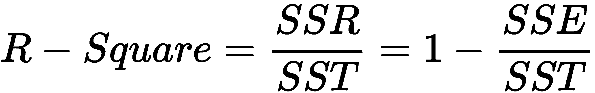

让我们逐一理解所有组件：

+   **回归平方和**（**SSR**）：这是预测值与数据均值之间差异的估算。

+   **误差平方和**（**SSE**）：这是原始值与预测值之间变化的估算。

+   **总平方和**（**SST**）：这是原始值与数据均值之间的变化。

## MSE

MSE 是均方误差（Mean Squared Error）的缩写。它的定义为原始值与预测值之间变化的平方，以及所有值之间的平均值：

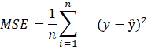

这里， 是原始值，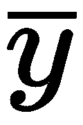 是预测值。

## MAE

MAE 是均绝对误差（Mean Absolute Error）的缩写。它的定义为原始值与预测值之间的绝对变化，以及所有值之间的平均值：

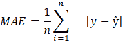

这里， 是原始值， 是预测值。

## RMSE

RMSE 是均方根误差的缩写。它可以解释为 MSE 的平方根：

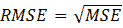

让我们在测试数据集上评估模型性能。在前一部分，我们预测了测试集的值。现在，我们将预测值与测试集的实际值（`y_test`）进行比较。scikit-learn 提供了 `metrics` 类来评估模型。对于回归模型评估，我们有 R 平方值、MSE、MAE 和 RMSE 的评估方法。每个方法都需要两个输入：测试集的实际值和预测值（`y_test` 和 `y_pred`）。让我们评估线性回归模型的表现：

```py
# Import the required libraries
import numpy as np
from sklearn.metrics import mean_absolute_error
from sklearn.metrics import mean_squared_error
from sklearn.metrics import r2_score

# Evaluate mean absolute error
print('Mean Absolute Error(MAE):', mean_absolute_error(y_test,predictions))

# Evaluate mean squared error
print("Mean Squared Error(MSE):", mean_squared_error(y_test, predictions))

# Evaluate root mean squared error
print("Root Mean Squared Error(RMSE):", np.sqrt(mean_squared_error(y_test, predictions)))

# Evaluate R-square
print("R-Square:",r2_score(y_test, predictions))
```

这将产生以下输出：

```py
Mean Absolute Error(MAE): 1.300032091923545
Mean Squared Error(MSE): 4.0124975229171
Root Mean Squared Error(RMSE): 2.003121944095541
R-Square: 0.8576396745320893
```

在这个例子中，我们通过 MAE、MSE、RMSE 和 R 平方值评估了线性回归模型。在这里，R 平方值为 0.85，表示该模型解释了数据 85% 的变异性。

# 拟合多项式回归

多项式回归是一种回归分析方法，用于适应因变量与自变量之间的非线性关系。在这种回归类型中，变量被建模为 *n* 次多项式的形式。它用于理解各种现象的增长率，如流行病爆发和销售增长。让我们理解一下多项式回归的方程：

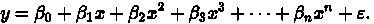

在这里，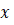 是自变量， 是因变量。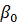 截距，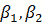...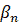 是 *x* 的系数，（这个希腊字母发音为 epsilon）是误差项，作为随机变量起作用。

让我们看一个例子来详细理解多项式概念：

```py
# import libraries
import matplotlib.pyplot as plt
import numpy as np

# Create X and Y lists
X=[1,2,3,4,5,6,7,8,9,10]
y=[9,10,12,16,22,28,40,58,102,200]

# Plot scatter diagram
plt.scatter(X,y, color = 'red')
plt.title('Polynomial Regression')
plt.xlabel('X-Axis')
plt.ylabel('y-Axis')
```

这将产生以下输出：

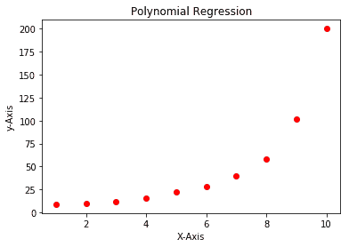

在前面的代码中，我们展示了一个具有多项式关系的数据集。让我们来看一下如何在回归分析中映射这个关系：

```py
# import libraries
import pandas as pd
from sklearn.preprocessing import PolynomialFeatures
from sklearn.linear_model import LinearRegression

# Prepare dataset 
data = pd.DataFrame({"X":[1,2,3,4,5,6,7,8,9,10], 
"y":[9,10,12,16,22,28,40,58,102,200]}) 

X = data[['X']] y = data[['y']]

# Apply Polynomial Features 
polynomial_reg = PolynomialFeatures(degree = 6) 
X_polynomial = polynomial_reg.fit_transform(X) 

# Apply Linear Regression Model 
linear_reg = LinearRegression() 
linear_reg.fit(X_polynomial, y) predictions=linear_reg.predict(X_polynomial) 

# Plot the results 
plt.scatter(X,y, color = 'red') 
plt.plot(X, predictions, color = 'red') 
plt.title('Polynomial Regression') 
plt.xlabel('X-Axis') 
plt.ylabel('y-Axis')
```

这将产生以下输出：

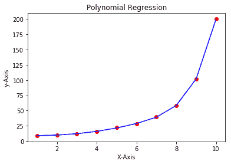

在前面的代码中，我们读取了多项式关系数据集，使用 `PolynomialFeatures()` 将 *X* 列转换为多项式 *n* 次方列，然后对 `X_polynomial` 和 `label` 应用了线性回归。前面的输出图显示了结果模型的表现。现在，轮到我们转向另一种回归模型，这种模型可以用于分类目的。

# 用于分类的回归模型

分类是机器学习和统计学习领域中使用最多的技术。大多数机器学习问题都是分类问题，例如，垃圾邮件检测、金融风险分析、客户流失分析以及潜在客户发现等。

分类可以分为两种类型：二分类和多分类。二分类目标变量只有两个值：0 和 1，或者是是和否。例如，二分类的实例包括：客户是否会购买某商品，客户是否会转向其他品牌或流失，垃圾邮件检测，疾病预测，以及贷款申请者是否会违约等。多分类则有多个类别，例如，新闻文章的类别可以包括体育、政治、商业等多个类。

逻辑回归是其中一种分类方法，尽管它的名字以“回归”结尾。它是一种常用的二分类方法，是解决各种分类问题的基础机器学习算法。它找出因变量（或目标变量）与一组自变量（或特征）之间的关联。在接下来的部分中，我们将详细介绍逻辑回归。

# 逻辑回归

逻辑回归是一种有监督的机器学习算法，用于预测二元结果并进行观察分类。其因变量是一个二元变量，具有两个类别：0 或 1。例如，它可以用来检测贷款申请者是否会违约。它是一种特殊类型的回归，其中因变量是二元的。它计算目标变量的赔率比的对数，表示某事件发生的概率，例如，一个人患糖尿病的概率。

逻辑回归是一种简单的线性回归，其中因变量或目标变量是类别型的。它在线性回归的预测结果上使用了 sigmoid 函数。我们还可以使用逻辑回归算法来处理多个目标类别。在多类别问题中，它被称为多项逻辑回归。多项逻辑回归是对逻辑回归的一种修改；它使用 softmax 函数代替 sigmoid 激活函数：

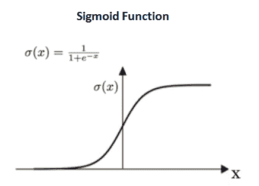

Sigmoid 函数也叫做逻辑函数或 S 形曲线。它将输入值映射到 0 到 1 之间，这表示某事件发生的概率。如果曲线向正无穷延伸，则结果变为 1；如果曲线向负无穷延伸，则结果变为 0。让我们看看 Sigmoid 函数和逻辑回归方程的公式：

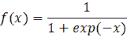

以下公式展示了逻辑回归方程：

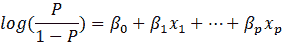

`log()` 函数中的项称为赔率比或“赔率”。赔率比是事件发生的概率与事件不发生的概率之比。在下图中，您可以看到逻辑回归输出的表现：

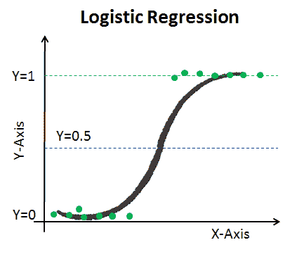

我们可以看到这里的比率大致在 0.5 左右。接下来我们将在下面的小节中进一步探讨逻辑回归。

## 逻辑回归模型的特点

在本小节中，我们将重点讨论逻辑回归的基本特征和假设。让我们了解以下特征：

+   因变量或目标变量应为二元类型。

+   自变量之间不应存在多重共线性。

+   系数通过最大似然法估计。

+   逻辑回归遵循伯努利分布。

+   该模型没有 R 平方值用于评估。模型通过一致性和 KS 统计量进行评估。

## 逻辑回归算法类型

不同的逻辑回归算法适用于不同的使用场景和情境。在本节中，我们将重点讨论二项逻辑回归、多项逻辑回归和顺序逻辑回归。让我们逐一了解这些模型，并理解它们的应用场景：

+   **二项逻辑回归模型**：

在二项逻辑回归模型中，因变量或目标列只有两个取值，例如贷款是否违约、电子邮件是否为垃圾邮件，或者患者是否为糖尿病患者。

+   **多项逻辑回归模型**：

在多项逻辑回归模型中，因变量或目标列有三个或更多的取值，例如预测鸢尾花的种类，或预测新闻文章的类别，如政治、商业和体育。

+   **顺序逻辑回归**：

在顺序逻辑回归模型中，因变量将具有顺序或序列类别，例如电影和酒店评分。

## 逻辑回归的优缺点

逻辑回归模型不仅提供预测（0 或 1），还给出结果的概率，这有助于我们理解预测的置信度。它易于实现和理解，并且具有可解释性。

如果自变量数量过多，将增加解释的方差，这会导致模型过拟合。逻辑回归无法处理非线性关系，并且在特征变量（或自变量）高度相关时表现不佳。

# 使用 scikit-learn 实现逻辑回归

现在您已经了解了逻辑回归的所有内容，接下来让我们使用 `scikit-learn` 库在 Python 中实现它。我们将使用朴素贝叶斯分类来创建模型。我们将通过以下步骤进行：

1.  我们将首先导入数据集和所需的库，使用以下代码：

```py
# Import libraries
import pandas as pd
# read the dataset
diabetes = pd.read_csv("diabetes.csv")

# Show top 5-records
diabetes.head()
```

这将产生以下输出：

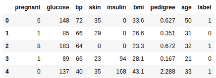

在前面的示例中，我们正在读取 Pima Indians 糖尿病数据集。此数据集没有列名，因此我们需要手动添加列名。

1.  在`read_csv()`函数中，我们将`header`设置为`None`，并将之前创建的列名列表传递给`names`参数：

```py
# Split dataset in two parts: feature set and target label
feature_set = ['pregnant', 'insulin', 'bmi', 'age','glucose','bp','pedigree']

features = diabetes[feature_set]

target = diabetes.label

# Partition data into training and testing set
from sklearn.model_selection import train_test_split
feature_train, feature_test, target_train, target_test = train_test_split(features, target, test_size=0.3, random_state=1)
```

加载数据集后，我们需要将数据集分为独立（特征集）列特征和依赖（或标签）列目标。之后，数据集将被划分为训练集和测试集。现在，依赖列和独立列将使用`train_test_split()`函数分为训练集和测试集（`feature_train`、`feature_test`、`target_train`和`target_test`）。`train_test_split()`接受依赖和独立的 DataFrame，`test_size`和`random_state`。其中，`test_size`决定训练-测试数据集的划分比例（例如，`test_size`为`0.3`表示 30%的数据用于测试集，剩余的 70%用于训练集），而`random_state`用作种子值，以确保每次划分的数据集相同。如果`random_state`为`None`，则每次都会随机划分记录，可能会得到不同的性能指标：

```py
# import logistic regression scikit-learn model
from sklearn.linear_model import LogisticRegression
from sklearn.metrics import accuracy_score 

# instantiate the model
logreg = LogisticRegression(solver='lbfgs')

# fit the model with data
logreg.fit(feature_train,target_train)

# Forecast the target variable for given test dataset
predictions = logreg.predict(feature_test)

# Assess model performance using accuracy measure
print("Logistic Regression Model Accuracy:",accuracy_score(target_test, predictions))
```

结果如下所示：

```py
Logistic Regression Model Accuracy: 0.7835497835497836
```

现在，我们准备好创建一个逻辑回归模型。首先，我们将导入`LogisticRegression`类并创建其对象或模型。该模型将在训练数据集（`X_train`和`y_train`）上进行训练。训练完成后，模型即可使用`predict()`方法进行预测。scikit-learn 的`metrics`类提供了多种性能评估方法，如准确率。`accuracy_score()`方法将接受实际标签（`y_test`）和预测标签（`y_pred`）。

# 总结

在本章中，我们探讨了回归分析算法。这将帮助你获得进行预测数据分析的重要技能。你已经掌握了回归分析、多重共线性、虚拟变量、回归评估指标和逻辑回归等概念。本章从简单线性回归和多重回归开始，之后我们的主要重点是多重共线性、模型开发和模型评估指标。在后续部分，我们重点介绍了逻辑回归、回归的特点、回归类型及其实现。

下一章，第十章，*监督学习 – 分类技术*，将重点讨论分类及其技术、训练-测试数据集划分策略和性能评估指标。在后续部分，我们将重点介绍数据划分、混淆矩阵以及性能评估指标，如准确率、精确度、召回率、F1 分数、ROC 和 AUC。
