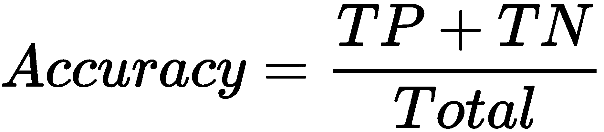

# 第十一章：监督学习 - 分类技术

大多数现实世界中的机器学习问题都使用监督学习。在监督学习中，模型将从一个带标签的训练数据集中学习。标签是我们想要预测的目标变量。它是一个额外的信息，帮助做出决策或预测，例如，哪个贷款申请是安全的或有风险的，患者是否患有某种疾病，房价，以及信用资格分数。这些标签作为学习过程中的监督者或老师。监督学习算法可以分为两种类型：分类或回归。分类问题有一个分类目标变量，例如，贷款申请状态是安全的还是有风险的，患者是否患有“疾病”或“无疾病”，或顾客是否是“潜在的”或“非潜在的”。

本章重点介绍监督学习，特别是分类技术。本章将主要使用 scikit-learn。将深入讨论分类的基本技术，如朴素贝叶斯、**支持向量机**（**SVM**）、**K-最近邻**（**KNN**）和决策树。此外，还重点介绍训练集与测试集的划分策略以及模型评估方法和参数。

本章的主题如下：

+   分类

+   朴素贝叶斯分类

+   决策树分类

+   KNN 分类

+   SVM 分类

+   划分训练集和测试集

+   评估分类模型的表现

+   ROC 曲线与 AUC

# 技术要求

本章的技术要求如下：

+   你可以在以下 GitHub 链接找到代码和数据集：[`github.com/PacktPublishing/Python-Data-Analysis-Third-Edition/tree/master/Chapter10`](https://github.com/PacktPublishing/Python-Data-Analysis-Third-Edition/tree/master/Chapter10)。

+   所有代码块都在 `ch10.ipynb` 文件中。

+   本章仅使用一个 CSV 文件（`diabetes.csv`）进行练习。

+   在本章中，我们将使用 `pandas` 和 `scikit-learn` 这两个 Python 库。

# 分类

作为一名医疗数据分析师，你的工作是识别那些患某种特定疾病（例如糖尿病或癌症）可能性较高的患者或病人。这些预测将帮助你在疾病发生之前对患者进行治疗。同样，销售和市场经理也希望预测那些有更高可能性购买产品的潜在客户。这就是将客户分类为两个或多个类别的过程，称为分类。分类模型预测类别标签，例如客户是否是潜在客户。在分类过程中，模型基于现有数据进行训练，做出预测，并评估模型的表现。开发出来的模型称为分类器。这意味着分类模型有三个阶段：训练、预测和评估。训练好的模型通过准确率、精确度、召回率、F1 分数和**曲线下面积**（**AUC**）等参数来评估。分类在许多领域中有广泛的应用，如银行、金融、公共服务、医疗保健、文本分析、图像识别和物体检测等。

作为分析师，你首先需要定义你想通过分类解决的问题，然后确定能够准确预测标签的潜在特征。特征是负责预测的列或属性。在糖尿病预测问题中，健康分析师会收集患者的信息，例如年龄、锻炼习惯、垃圾食品摄入习惯、酒精消费和吸烟习惯等特征。这些特征将用于预测患者是否会患上糖尿病。你可以在下面的图示中看到，如何通过一条线将数据分类为两个类别：


机器学习和数据挖掘过程有多个步骤：数据收集、数据预处理、训练-测试拆分、模型生成和评估。我们已经看到了像 KDD、SEMMA 和 CRISP-DM 这样的数据分析模型。在分类中，我们只关注训练-测试拆分、模型生成和评估这几个步骤。

分类模型有三个阶段：训练-测试拆分、模型生成和模型评估。在训练-测试拆分阶段，数据被分为两部分：训练集和测试集。在训练阶段，使用训练集来生成模型，而在评估阶段，使用测试集来评估模型的表现，通过准确率、误差、精确度和召回率等评估指标。你可以在以下图示中看到分类过程：


在上面的图示中，展示了分类过程的各个步骤。现在我们已经理解了分类过程，接下来是学习分类技术。在下一节中，我们将重点介绍朴素贝叶斯分类算法。

# 朴素贝叶斯分类

朴素贝叶斯是一种基于贝叶斯定理的分类方法。贝叶斯定理以其发明者、统计学家托马斯·贝叶斯命名。它是一种快速、准确、稳健、易于理解和解释的技术。它还可以在大数据集上更快速地工作。朴素贝叶斯广泛应用于文本挖掘，如文档分类、客户评论情感预测和垃圾邮件过滤等。

朴素贝叶斯分类器被称为“朴素”，因为它假设类条件独立。类条件独立意味着每个特征列独立于其他特征。例如，在确定一个人是否患有糖尿病时，可能依赖于他们的饮食习惯、锻炼习惯、职业性质和生活方式。即使特征之间存在相关性或依赖关系，朴素贝叶斯仍然假设它们是独立的。让我们理解贝叶斯定理的公式：


这里，*y* 是目标，*X* 是特征集。*p(y)* 和 *p(X)* 是不考虑证据的先验概率。这意味着在看到证据之前事件的概率。*p(y|X)* 是在看到证据 *X* 后事件 *X* 的后验概率。它是给定证据 *X* 的 *y* 的概率。*p(X|y)* 是在看到证据后事件 *y* 的后验概率。它是给定证据 *y* 的 *X* 的概率。我们来看看前面的方程示例：


在这里，我们使用贝叶斯定理找出一个患者是否会因吸烟频率而患糖尿病的概率。

让我们看看朴素贝叶斯分类算法的工作原理。假设数据集 *D* 具有 *X* 特征和标签 *y*。特征可以是 n 维的，*X* = *X*1, *X*2, *X*3... *Xn*。标签 *y* 可能有 *m* 个类，*C*1, *C*2, *C*3... *Cm*。它将按以下方式工作：

1.  计算给定类标签的先验概率， 和 。

1.  计算后验概率， 和 ，每个类的每个属性：


1.  乘以相同类的后验概率，：


1.  如果属性是分类的，那么应该有多个类  在具有  值的记录中，除以数据集中的  记录数。

1.  如果属性是连续的，则使用高斯分布进行计算：


1.  将先验概率 *p*(*y*) 乘以*步骤 3*中的后验概率：


1.  找到给定输入特征集的最大概率类。这个类将作为我们的最终预测。

现在，让我们使用 Python 中的朴素贝叶斯分类创建一个模型：

1.  使用以下代码行加载 Pima 印度糖尿病数据集（[`github.com/PacktPublishing/Python-Data-Analysis-Third-Edition/blob/master/Chapter09/diabetes.csv`](https://github.com/PacktPublishing/Python-Data-Analysis-Third-Edition/blob/master/Chapter09/diabetes.csv)）：

```py
# Import libraries
import pandas as pd
# read the dataset
diabetes = pd.read_csv("diabetes.csv")

# Show top 5-records
diabetes.head()
```

这将产生以下输出：


因此，我们已经导入了`pandas`并读取了数据集。在之前的示例中，我们正在读取 Pima 印度糖尿病数据集。

1.  我们现在将数据集拆分成两部分，如下所示：

```py
# split dataset in two parts: feature set and target label
feature_set = ['pregnant', 'insulin', 'bmi', 'age','glucose','bp','pedigree'] features = diabetes[feature_set]
target = diabetes.label

# partition data into training and testing set
from sklearn.model_selection import train_test_split

feature_train,feature_test, target_train, target_test = \
train_test_split(features, target, test_size=0.3, random_state=1)
```

加载数据集后，我们将数据集分为依赖列或标签列（`target`）和独立列或特征列（`feature_set`）。之后，数据集将被拆分为训练集和测试集。现在，依赖列和独立列将通过`train_test_split()`被拆分为训练集和测试集（`feature_train`、`feature_test`、`target_train`和`target_test`）。`train_test_split()`接受依赖和独立的 DataFrame，`test_size`和`random_state`。其中，`test_size`决定了训练集和测试集的比例（例如，`test_size 0.3`意味着 30%是测试集，剩余的 70%数据是训练集），`random_state`用作种子值，用于每次重新生成相同的数据拆分。如果`random_state`为`None`，则每次都会随机拆分记录，这会导致不同的性能度量。

1.  我们现在将构建朴素贝叶斯分类模型：

```py
# Import Gaussian Naive Bayes model
from sklearn.naive_bayes import GaussianNB
# Create a Gaussian Classifier
model = GaussianNB()

# Train the model using the training sets
model.fit(feature_train,target_train)

# Forecast the target variable for given test dataset
predictions = model.predict(feature_test)
```

在这里，我们创建了一个朴素贝叶斯模型。首先，我们将导入`GaussianNB`类并创建其对象或模型。这个模型将根据训练数据集（`feature_train`、`target_train`）进行拟合。训练完成后，模型准备好使用`predict()`方法进行预测。

1.  最后，我们将评估模型的性能：

```py
# Import metrics module for performance evaluation
from sklearn.metrics import accuracy_score
from sklearn.metrics import precision_score
from sklearn.metrics import recall_score
from sklearn.metrics import f1_score
# Calculate model accuracy
print("Accuracy:",accuracy_score(target_test, predictions))

# Calculate model precision
print("Precision:",precision_score(target_test, predictions))

# Calculate model recall
print("Recall:",recall_score(target_test, predictions))

# Calculate model f1 score
print("F1-Score:",f1_score(target_test, predictions))
```

这将产生以下输出：

```py
Accuracy: 0.7748917748917749
Precision: 0.7391304347826086
Recall: 0.6
F1-Score: 0.6623376623376623
```

scikit-learn 的`metrics`类提供了多种性能评估方法，例如准确率、精确率、召回率和 F1 分数。这些方法将使用实际目标标签（`target_test`）和预测标签（`predictions`）。我们将在*评估分类模型性能*部分详细了解这些指标。

朴素贝叶斯是一种简单、快速、准确且易于理解的预测方法。它具有较低的计算成本，可以处理大型数据集。朴素贝叶斯还可以用于多类分类问题。当数据具有类独立性假设时，朴素贝叶斯分类器比逻辑回归表现更好。

朴素贝叶斯存在 **零频率问题**。零频率意味着如果某个特征的类别缺失，则该类别的频率计数为零。这个问题可以通过拉普拉斯修正来解决。拉普拉斯修正（或拉普拉斯变换）是一种平滑技术，会为每个类别添加一条记录，使得缺失类别的频率计数变为 1，从而不会影响贝叶斯定理中的概率。朴素贝叶斯的另一个问题是其假设类条件独立性，因为在实际情况中，所有预测因子完全独立几乎是不可能的。在这一部分，我们已经学习了朴素贝叶斯分类法。现在是时候学习决策树分类算法了。

# 决策树分类

决策树是最著名的分类技术之一。它可以应用于两种类型的监督学习问题（分类问题和回归问题）。决策树是一种类似流程图的树形结构，模仿人类思维方式，这使得它更容易理解和解释。与支持向量机（SVM）和神经网络等“黑箱”算法不同，决策树能让你看到预测背后的逻辑。

决策树有三个基本组件：内部节点、分支和叶子节点。在这里，每个终端节点代表一个特征，链接代表决策规则或分割规则，叶子节点提供预测结果。树中的第一个起始节点或主节点是根节点。它根据特征或属性值来划分数据。在这里，我们分割数据，然后递归地再次划分剩余数据，直到所有项属于同一类别或没有剩余列。决策树可以应用于分类和回归问题。市面上有许多决策树算法，例如 CART、ID3、C4.5 和 CHAID。但在这里，我们主要关注 CART 和 ID3，因为在 scikit-learn 中，这两种算法是可用的。让我们在下图中看看决策树分类器的生成过程：


**CART** 代表 **分类与回归树**。CART 使用基尼指数来选择最佳列。基尼指数是每个类别的概率平方和与 1 的差值。具有最小基尼指数值的特征或列被选为分割或划分特征。基尼指数的值范围在 0 和 1 之间。如果基尼指数值为 0，表示所有项属于同一类；如果基尼指数值为 1，则表示所有元素是随机分布的。基尼指数值为 0.5 表示项在多个类别中均匀分布：


**ID3** 代表 **Iterative Dichotomiser 3（迭代二分法 3）**。它使用信息增益或熵作为属性选择度量。熵由香农提出，用于衡量数据集中的杂乱度或随机性。信息增益衡量在特定列的分割前后，熵的变化量。具有最大信息增益值的特征或属性将被选择为分裂特征或属性。如果熵为 0，表示只有一个类；如果熵为 1，则表示项目均匀分布：


决策树非常直观，易于理解、解释并向利益相关者讲解。无需对特征进行标准化，并且是无分布假设的算法。决策树也可以用来预测缺失值。它们具备捕捉非线性模式的能力。决策树可能会过拟合，并且对噪声数据敏感。决策树在数据不平衡时有偏差，这也是在应用决策树之前，我们需要平衡数据集的原因。决策树在时间和复杂度上更为昂贵。

让我们使用 scikit-learn 构建决策树并执行预测数据集。之后，我们将准备好构建模型：

1.  首先，您需要导入 `pandas` 并使用我们在上一部分中看到的 `read_csv()` 方法加载 Pimas 数据集。

1.  接下来，我们需要将数据集划分为训练集和测试集，类似于我们在前一部分中执行的操作。

1.  现在，我们将构建决策树分类模型：

```py
# Import Decision Tree model
from sklearn.tree import DecisionTreeClassifier

# Create a Decision Tree classifier object
clf = DecisionTreeClassifier()

# Train the model using training dataset
clf = clf.fit(feature_train,target_train)

# Predict the response for test dataset
predictions = clf.predict(feature_test)
```

这里，我们创建了一个决策树模型。首先，我们将导入 `DecisionTreeClassifier` 类并创建其对象或模型。该模型将在训练数据集（`feature_train`，`target_train`）上进行拟合。训练完成后，模型已准备好使用 `predict()` 方法进行预测。

1.  现在，我们将评估模型的性能：

```py
# Import metrics module for performance evaluation
from sklearn.metrics import accuracy_score
from sklearn.metrics import precision_score
from sklearn.metrics import recall_score
from sklearn.metrics import f1_score

# Calculate model accuracy
print("Accuracy:",accuracy_score(target_test, predictions))

# Calculate model precision
print("Precision:",precision_score(target_test, predictions))

# Calculate model recall
print("Recall:",recall_score(target_test, predictions))

# Calculate model f1 score
print("F1-Score:",f1_score(target_test, predictions))
```

这将输出以下结果：

```py
Accuracy: 0.7229437229437229
Precision: 0.6438356164383562
Recall: 0.5529411764705883
F1-Score: 0.5949367088607594
```

在上述示例中，模型性能通过准确度、精确度、召回率和 F1 分数进行评估。

在完全理解决策树之后，让我们继续进行 KNN 分类。

# KNN 分类

KNN 是一种简单、易于理解和实现的分类算法。它也可以用于回归问题。KNN 可用于许多应用场景，如项目推荐和分类问题。具体来说，它可以在 Netflix 上推荐电影，在 Medium 上推荐文章，在 naukari.com 上推荐候选人，在 eBay 上推荐产品，在 YouTube 上推荐视频。在分类中，它可以用于分类实例，例如银行机构可以对风险较大的贷款候选人进行分类，或者政治学家可以对潜在选民进行分类。

KNN 有三个基本属性，分别是非参数性、懒惰学习者和基于实例的学习。非参数性意味着算法不依赖于分布，因此不需要像均值和标准差这样的参数。懒惰学习者意味着 KNN 不进行模型训练；也就是说，模型是在测试阶段进行训练的。这使得训练速度更快，但测试速度较慢，并且也更加耗时和占用内存。基于实例的学习意味着预测结果是基于与其最近邻的相似度。它不会为预测创建抽象的方程或规则，而是存储所有数据并查询每个记录。

KNN 分类算法从训练数据集中找到 *k* 个最相似的实例，且多数决定了给定输入特征的预测标签。KNN 分类器将执行以下步骤来进行预测：

1.  计算输入观察与训练数据集中所有观察的距离。

1.  通过按距离对所有实例进行升序排序，找到 *K* 个最接近的邻居。

1.  对 *K* 个最接近的邻居进行投票，并预测获得最多票数的标签。

这一过程可以通过以下图示来更好地展示：


让我们使用 scikit-learn 构建一个 KNN 分类器，并对数据集进行预测：

1.  加载皮马印第安糖尿病数据集。

首先，您需要导入 `pandas` 并使用我们在 *朴素贝叶斯分类* 课程中已经看到的 `read_csv()` 方法加载数据集。

1.  划分数据集。

之后，我们需要将数据集分成两部分——训练集和测试集——就像我们在 *朴素贝叶斯分类* 部分所做的那样。

1.  构建 KNN 分类模型。

现在，我们准备开始构建模型：

```py
# Import KNN model
from sklearn.neighbors import KNeighborsClassifier 

# Create a KNN classifier object 
model = KNeighborsClassifier(n_neighbors=3) 

# Train the model using the training dataset 
model.fit(feature_train,target_train) 

# Predict the target variable for test dataset 
predictions = model.predict(feature_test)
```

在前面的代码块中，我们导入了 `KNeighborsClassifier` 类并创建了它的对象或模型。在这里，我们将 3 个邻居作为模型的输入参数。如果我们没有指定邻居的数量，模型将默认选择 5 个邻居。该模型将拟合训练数据集（`feature_train`, `target_train`）。训练完成后，模型已准备好使用 `predict()` 方法进行预测。

1.  评估模型性能：

```py
# Import metrics module for performance evaluation
from sklearn.metrics import accuracy_score 
from sklearn.metrics import precision_score 
from sklearn.metrics import recall_score 
from sklearn.metrics import f1_score 

# Calculate model accuracy 
print("Accuracy:",accuracy_score(target_test, predictions)) 

# Calculate model precision 
print("Precision:",precision_score(target_test, predictions)) 

# Calculate model recall 
print("Recall:",recall_score(target_test, predictions)) 

# Calculate model f1 score 
print("F1-Score:",f1_score(target_test, predictions))
```

这将产生以下输出：

```py
Accuracy: 0.7532467532467533
Precision: 0.7058823529411765
Recall: 0.5647058823529412
F1-Score: 0.6274509803921569
```

在前面的示例中，模型性能通过准确率、精确度、召回率和 F1 分数进行评估。

在理解了 KNN 分类算法之后，接下来是学习 SVM 分类算法。

# SVM 分类

由于其较少的计算资源需求和较高的准确性，SVM 是许多数据科学家最喜欢的机器学习算法。它们被用于回归和分类问题，并提供了核技巧来建模非线性关系。SVM 有多种应用场景，例如入侵检测、文本分类、人脸识别和手写识别。

SVM 是一个判别模型，它在 n 维空间中生成具有大间隔的最优超平面来分隔数据点。其基本思想是发现**最大间隔超平面**（**MMH**），该超平面完美地将数据分成不同类别。最大间隔意味着两类数据点之间的最大距离。

## 术语

现在，我们将探讨一些与 SVM 分类相关的术语：

+   **超平面**：超平面是用来区分两类的决策边界。超平面的维度由特征的数量决定。它也被称为决策平面。

+   **支持向量**：支持向量是距离超平面最近的点，它们通过最大化间隔来帮助确定超平面的方向。

+   **间隔**：间隔是距离最近点的最大距离。间隔越大，分类效果越好。间隔可以通过从支持向量线到超平面的垂直距离来计算。

SVM 的核心目标是选择具有最大可能边界的超平面，边界由支持向量之间的距离决定。SVM 通过以下两个阶段来找到 MMH：

1.  创建超平面，以最佳方式分隔数据点。

1.  选择具有最大间隔的超平面：


与朴素贝叶斯相比，SVM 算法是一种更快、更准确的分类器。它在较大的分隔间隔下表现更好。SVM 不适用于大规模数据集。其性能也依赖于所使用的核函数类型。对于重叠类，它的表现较差。

让我们使用`scikit-learn`进行支持向量分类器的工作，并执行一个预测数据集。完成后，我们将数据集划分为训练集和测试集，就像我们在*朴素贝叶斯分类*部分所做的那样。接下来，我们准备好进行模型构建：

1.  加载皮马印第安人糖尿病数据集。

首先，你需要导入`pandas`并使用我们在*朴素贝叶斯分类*环节中已经看到的`read_csv()`方法加载数据集。

1.  划分数据集。

完成后，我们需要将数据集拆分为两个集合——训练集和测试集——就像我们在*朴素贝叶斯分类*部分所做的那样。

1.  构建 SVM 分类模型。

现在，我们已经准备好开始模型构建：

```py
# Import SVM model
from sklearn import svm

# Create a SVM classifier object
clf = svm.SVC(kernel='linear')

# Train the model using the training sets
clf.fit(feature_train,target_train)

# Predict the target variable for test dataset
predictions = clf.predict(feature_test)
```

在上述代码块中，我们将导入 `svm` 模块并创建其 `svm.SVC()` 对象或模型。 这里我们传递了 `linear` 核。 您还可以传递另一个核，例如 **`poly`**，**`rbf`** 或 `sigmoid`。 如果我们不指定核心，则默认选择 `rbf` 作为核心。 线性核将创建一个线性超平面来区分糖尿病患者和非糖尿病患者。 该模型将适合于训练数据集（`feature_train`，`target_train`）。 训练后，模型已准备使用 `predict()` 方法进行预测。

1.  评估模型的性能：

```py
# Import metrics module for performance evaluation
from sklearn.metrics import accuracy_score
from sklearn.metrics import precision_score
from sklearn.metrics import recall_score
from sklearn.metrics import f1_score

# Calculate model accuracy
print("Accuracy:",accuracy_score(target_test, predictions))

# Calculate model precision
print("Precision:",precision_score(target_test, predictions))

# Calculate model recall
print("Recall:",recall_score(target_test, predictions))

# Calculate model f1 score
print("F1-Score:",f1_score(target_test, predictions))
```

这将导致以下输出：

```py
Accuracy: 0.7835497835497836
Precision: 0.7868852459016393
Recall: 0.5647058823529412
F1-Score: 0.6575342465753424
```

在上述示例中，将使用准确性、精确度、召回率和 F1 分数等指标评估模型的性能。 理解所有这些分类器后，现在是时候看看训练和测试集分割策略了。

# 分割训练和测试集

数据科学家需要评估模型的性能，克服过拟合并调整超参数。 所有这些任务都需要一些未在模型开发阶段使用的隐藏数据记录。 在模型开发之前，数据需要分成一些部分，例如训练、测试和验证集。 训练数据集用于构建模型。 测试数据集用于评估在训练集上训练的模型的性能。 验证集用于找到超参数。 让我们看看下面的训练-测试分割策略：

+   保留样本法

+   K 折交叉验证

+   Bootstrap 方法

## 保留样本法

在此方法中，数据集被随机分成两部分：训练集和测试集。 通常，这个比例是 2:1，即 2/3 用于训练，1/3 用于测试。 我们还可以将其分割成不同的比例，如 6:4、7:3 和 8:2：

```py
# partition data into training and testing set
from sklearn.model_selection import train_test_split

# split train and test set
feature_train, feature_test, target_train, target_test = train_test_split(features, target, test_size=0.3, random_state=1)
```

在上述示例中，`test_size=0.3` 表示测试集占 30%，训练集占 70%。 `train_test_split()` 将数据集分割为 7:3。

## K 折交叉验证

在此方法中，数据分为大致相同大小的 *k* 个分区。 它将训练 *k* 个模型，并使用每个分区进行评估。 在每次迭代中，一个分区将保留用于测试，其余的 *k* 个分区将集体用于训练。 分类准确度将是所有准确度的平均值。 它还确保模型不会过拟合：


在分层交叉验证中，*k* 个分区大致相同的类分布。 这意味着它保留每个分区中每个类的百分比。

## Bootstrap 方法

自助法是一种重采样技术。它从数据集中反复进行有放回的抽样。有放回的抽样会进行随机选择。它需要样本的大小和迭代次数。在每次迭代中，它会均匀选择记录。每条记录被选择的机会相同。未被选择的样本称为“袋外”样本。我们可以通过以下图表来理解自助法：


在上面的图表中，我们可以看到每个元素在每次自助采样中都有相同的选择机会。接下来，我们将跳到分类的另一个重要话题——分类模型评估。下一个话题帮助我们评估分类模型的表现。

# 评估分类模型的表现

到目前为止，我们已经学习了如何创建分类模型。创建机器学习分类模型还不够；作为业务或数据分析师，你还需要评估它的表现，以便可以将其部署到实际项目中。

scikit-learn 提供了各种度量标准，如混淆矩阵、准确率、精确度、召回率和 F1 分数，用于评估模型的表现。

## 混淆矩阵

混淆矩阵是一种简要说明二分类和多分类问题预测结果的方法。假设我们要找出一个人是否患有糖尿病。混淆矩阵的概念是找出正确预测和错误预测的数量，然后将它们进一步总结并分开到每个类别中。它阐明了与我们分类模型表现相关的所有混淆信息。这个 2x2 矩阵不仅显示了分类器所犯的错误，还展示了犯的是什么类型的错误。混淆矩阵用于更快速地完成统计数据分析，并通过清晰的数据可视化使结果更具可读性和易理解性。它包含两行两列，如下所示。让我们理解混淆矩阵的基本术语：

+   **真阳性** (**TP**)：这代表预测为`是`，且实际情况也是`是`的案例；例如，我们预测它们为欺诈案例，实际上它们确实是欺诈案例。

+   **真阴性** (**TN**)：这代表预测为`不是`，且实际情况也是`不是`的案例；例如，我们预测它们为非欺诈案例，实际上它们确实是非欺诈案例。

+   **假阳性** (**FP**)：这代表预测为`是`，但实际情况是`不是`的案例；例如，我们预测它们为欺诈案例，但实际上它们不是欺诈案例。这种类型的事件类别表示类型 I 错误。

+   **假阴性**（**FN**）：这表示那些预测为`否`，但实际上是`否`的案例；例如，我们预测它们为非欺诈案件，实际上它们是欺诈案件。这种类型的事件类别表示的是第二类错误。

让我们以一个欺诈检测问题为例：


在前面的例子中，我们考虑了两类欺诈行为：是和否。是表示欺诈行为，否表示非欺诈行为。预测记录的总数为 825，这意味着测试了 825 笔交易。在这 825 个案例中，模型或分类器预测了 550 次是，275 次否。实际上，实际的欺诈案件为 525 个，非欺诈案件为 300 个。

让我们使用 scikit-learn 在 Python 中创建一个混淆矩阵：

```py
# Import libraries
import pandas as pd

# read the dataset
diabetes = pd.read_csv("diabetes.csv")

# split dataset in two parts: feature set and target label
feature_set = ['pregnant', 'insulin', 'bmi', 'age','glucose','bp','pedigree']
features = diabetes[feature_set]

target = diabetes.label

# partition data into training and testing set
from sklearn.model_selection import train_test_split
feature_train, feature_test, target_train, target_test = train_test_split(features, target, test_size=0.3, random_state=1)

# import logistic regression scikit-learn model
from sklearn.linear_model import LogisticRegression
from sklearn.metrics import accuracy_score # for performance evaluation

# instantiate the model
logreg = LogisticRegression(solver='lbfgs')

# fit the model with data
logreg.fit(feature_train,target_train)

# Forecast the target variable for given test dataset
predictions = logreg.predict(feature_test)

# Get prediction probability 
predictions_prob = logreg.predict_proba(feature_test)[::,1]

# Import the confusion matrix
from sklearn.metrics import plot_confusion_matrix

# Plot Confusion matrix
plot_confusion_matrix(logreg , feature_test, target_test, values_format='d')
```

这将产生以下输出：


在前面的例子中，我们加载了数据并将其分为两个部分：训练集和测试集。之后，我们使用逻辑回归进行了模型训练，正如在前一章中所做的那样。在这里，为了绘制混淆矩阵，我们使用了`plot_confusion_matrix()`方法，传入了模型对象、测试特征集、测试标签集和`values_format`参数。

## 准确率

现在，我们将计算从混淆矩阵得出的模型准确率。它告诉我们预测模型的准确性：




## 精确度

当模型预测为`是`时，它的正确率有多高？这是数据集中总预测案例中正类案例的百分比。简而言之，我们可以将精确度理解为“当模型说它正确时，它到底有多正确”：


## 召回率

当实际为`是`时，模型预测`是`的频率是多少？这也被称为灵敏度。它是数据集中所有实际正类案例中，预测为正类的比例：


## F-measure（F 值）

F-measure 被认为是评估模型的较好方式之一。在数据科学的许多领域，竞争模型的性能都是通过 F-measure 来评估的。它是精确度和召回率的调和均值。F1 分数的值越高，模型越好。F1 分数为精确度和召回率赋予相等的权重，这意味着它表示两者之间的平衡：


F-measure 的一个缺点是它对精确度和召回率赋予相同的权重，但在某些情况下，需要其中一个高于另一个，这也是为什么 F1 分数可能不是一个准确的度量标准。

在前面的章节中，我们看到了诸如朴素贝叶斯、决策树、KNN 和 SVM 等分类算法。我们通过使用 scikit-learn 的 `accuracy_score()` 来评估模型准确率，`precision_score()` 来评估模型精度，`recall_score()` 来评估模型召回率，以及 `f1_score()` 来评估模型的 F1 分数。

我们还可以打印分类报告，深入了解分类模型的细节。让我们创建混淆报告：

```py
# import classification report
from sklearn.metrics import classification_report

# Create classification report
print(classification_report(target_test, predictions, target_names=['Yes(1)','No(0)']))

```

这将产生以下输出：


在前面的代码中，我们使用 `confusion_report()` 方法打印了混淆矩阵报告，传入了测试集标签、预测集或预测标签以及目标值列表参数。

# ROC 曲线和 AUC

AUC-ROC 曲线是衡量和评估分类模型性能的工具。**ROC**（**接收者操作特性**）是模型性能的图示化表示。它绘制了 FP 率（或 1-特异性）与 TP 率（或灵敏度）之间的二维概率图。我们还可以使用 AUC 用一个数字表示模型所覆盖的区域：


让我们使用 scikit-learn 模块创建 ROC 曲线：

```py
# import plot_roc_curve
from sklearn.metrics import plot_roc_curve

plot_roc_curve(logreg , feature_test, target_test)
```

这将产生以下输出：


在前面的示例中，我们使用模型对象、测试特征集和测试标签集参数绘制了 `plot_roc_curve()` 方法的 ROC 图。

在 ROC 曲线中，AUC 是一种可分性度量。它告诉我们模型的类区分能力。AUC 值越高，模型在区分“欺诈”和“非欺诈”方面就越好。对于理想的分类器，AUC 等于 1：


让我们计算 AUC 分数，如下所示：

```py
# import ROC AUC score
from sklearn.metrics import roc_auc_score

# Compute the area under ROC curve
auc = roc_auc_score(target_test, predictions_prob)

# Print auc value
print("Area Under Curve:",auc)
```

这将产生以下输出：

```py
Area Under Curve: 0.8628525382755843
```

scikit-learn 的 `metrics` 类提供了 AUC 性能评估度量。`roc_auc_score()` 方法将接受实际标签（`y_test`）和预测概率（`y_pred_prob`）。

# 总结

在本章中，我们学习了分类及其技术、训练-测试划分策略和性能评估指标。这将帮助你掌握预测数据分析的重要技能。你已经学会了如何使用 scikit-learn 开发线性和非线性分类器进行预测分析。在本章的前面部分，你了解了分类基础和机器学习算法，例如朴素贝叶斯分类、决策树分类、KNN 和 SVM。后续章节中，你看到了数据划分方法和模型性能评估指标，例如准确度分数、精度分数、召回率、F1 分数、ROC 曲线和 AUC 分数。

下一章，第十一章，*无监督学习——主成分分析与聚类*，将重点讲解无监督机器学习技术和降维技术在 Python 中的应用。章节开始介绍降维和主成分分析。在接下来的部分中，将聚焦于聚类方法，如 k-means、层次聚类、DBSCAN 和谱聚类。
