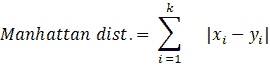
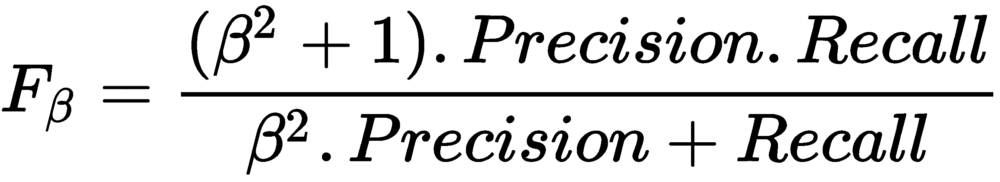

# 第十二章：无监督学习 - PCA 和聚类

无监督学习是机器学习中最重要的分支之一。它使我们能够在没有目标标签的情况下进行预测。在无监督学习中，模型仅通过特征进行学习，因为数据集没有目标标签列。大多数机器学习问题从某些能够自动化过程的事物开始。例如，当你想要开发一个预测模型来检测糖尿病患者时，你需要为数据集中的每个患者设置目标标签。在初期阶段，为任何机器学习问题安排目标标签并非易事，因为这需要改变业务流程来获得标签，无论是通过手动内部标注还是再次收集带标签的数据。

在本章中，我们的重点是学习无监督学习技术，这些技术可以处理没有目标标签的情况。我们将特别介绍降维技术和聚类技术。当我们有大量特征时，降维技术将被使用，以减少这些特征的数量。这将减少模型复杂性和训练成本，因为这意味着我们可以仅通过少量特征就能实现我们想要的结果。

聚类技术根据相似性在数据中找到组。这些组本质上代表了*无监督分类*。在聚类中，特征观察的类或标签是以无监督的方式找到的。聚类在各种业务操作中非常有用，例如认知搜索、推荐、细分和文档聚类。

本章的主题如下：

+   无监督学习

+   降低数据的维度

+   主成分分析

+   聚类

+   使用 K-means 聚类对数据进行划分

+   层次聚类

+   DBSCAN 聚类

+   谱聚类

+   评估聚类性能

# 技术要求

本章有以下技术要求：

+   你可以通过以下 GitHub 链接找到代码和数据集：[`github.com/PacktPublishing/Python-Data-Analysis-Third-Edition/tree/master/Chapter11`](https://github.com/PacktPublishing/Python-Data-Analysis-Third-Edition/tree/master/Chapter11)。

+   所有代码块都可以在 `ch11.ipynb` 文件中找到。

+   本章仅使用一个 CSV 文件（`diabetes.csv`）进行实践。

+   在本章中，我们将使用 pandas 和 scikit-learn Python 库。

# 无监督学习

无监督学习意味着通过观察学习，而不是通过示例学习。这种学习类型适用于无标签的数据。降维和聚类就是这种学习的例子。降维用于将大量特征减少到只有少数几个特征，但能产生相同的结果。有几种方法可以减少数据的维度，例如**主成分分析**（**PCA**）、t-SNE、小波变换和特征子集选择。

术语“聚类”指的是一组相似的项目，它们彼此密切相关。聚类是一种生成相似单元或项目组的方法。此相似性是基于项目的某些特征或特性计算的。我们可以说，聚类是一组数据点，它们与其聚类中的其他数据点相似，并且与其他聚类的数据点不相似。聚类具有许多应用，例如搜索文档、业务智能、信息安全和推荐系统：


在上图中，我们可以看到聚类如何将数据记录或观察结果分成少数几组，而降维则减少了特征或属性的数量。让我们在接下来的部分详细讨论每个主题。

# 减少数据的维度

减少维度，即降维，意味着将大量属性或列（特征）缩减为较少数量的属性。该技术的主要目标是获得最佳的特征数用于分类、回归和其他无监督方法。在机器学习中，我们面临一个称为维度灾难的问题。这意味着有大量属性或特征。这意味着更多的数据，导致复杂的模型和过拟合问题。

降低数据的维度有助于应对维度灾难。它可以线性和非线性地转换数据。线性转换技术包括 PCA、线性判别分析和因子分析。非线性转换包括 t-SNE、Hessian 特征映射、谱嵌入和等距特征映射等技术。降维提供以下好处：

+   过滤冗余和不重要的特征。

+   减少模型复杂性，使用较少维度的数据。

+   减少模型生成的内存和计算成本。

+   它可视化高维数据。

在接下来的部分中，我们将专注于一种重要且流行的降维技术之一，PCA。

## PCA

在机器学习中，认为拥有大量数据意味着拥有预测模型的高质量，但大型数据集也带来了更高维度的挑战（或维度灾难）。由于属性数量众多，这导致了预测模型复杂度的增加。PCA 是最常用的降维方法，帮助我们识别原始数据集中的模式和相关性，将其转换为一个低维数据集，同时不丢失信息。

PCA 的主要概念是发现原始数据集中属性之间未见的关系和关联。高度相关的属性是如此相似，以至于它们是冗余的。因此，PCA 去除了这些冗余的属性。例如，如果我们的数据中有 200 个属性或列，那么面对这么多属性时，我们将难以继续处理。在这种情况下，我们需要将这些属性的数量减少到 10 或 20 个变量。PCA 的另一个目标是减少维度，同时不影响重要信息。对于*p*维数据，PCA 的方程可以写成如下：


主成分是所有属性的加权和。这里，是原始数据集中的属性，是属性的权重。

让我们举个例子。假设我们将一个城市的街道作为属性，并且假设你想参观这个城市。那么问题是，你会参观多少条街道？显然，你会想参观城市中的热门或主要街道，假设这些街道是 50 条中的 10 条。这 10 条街道将为你提供对这座城市的最佳了解。这些街道就是主成分，因为它们解释了数据（城市街道）中的大部分方差。

### 执行 PCA

让我们从头开始在 Python 中执行 PCA：

1.  计算给定数据集的相关或协方差矩阵。

1.  求解相关或协方差矩阵的特征值和特征向量。

1.  将特征向量矩阵与原始数据集相乘，你将得到主成分矩阵。

让我们从头开始实现 PCA：

1.  我们将首先导入库并定义数据集：

```py
# Import numpy
import numpy as np
# Import linear algebra module
from scipy import linalg as la
# Create dataset
data=np.array([[7., 4., 3.],
[4., 1., 8.],
[6., 3., 5.],
[8., 6., 1.],
[8., 5., 7.],
[7., 2., 9.],
[5., 3., 3.],
[9., 5., 8.],
[7., 4., 5.],
[8., 2., 2.]])
```

1.  计算协方差矩阵：

```py
# Calculate the covariance matrix
# Center your data
data -= data.mean(axis=0)
cov = np.cov(data, rowvar=False)
```

1.  计算协方差矩阵的特征值和特征向量：

```py
# Calculate eigenvalues and eigenvector of the covariance matrix
evals, evecs = la.eig(cov)
```

1.  将原始数据矩阵与特征向量矩阵相乘：

```py
# Multiply the original data matrix with Eigenvector matrix.

# Sort the Eigen values and vector and select components
num_components=2
sorted_key = np.argsort(evals)[::-1][:num_components]
evals, evecs = evals[sorted_key], evecs[:, sorted_key]

print("Eigenvalues:", evals)
print("Eigenvector:", evecs)
print("Sorted and Selected Eigen Values:", evals)
print("Sorted and Selected Eigen Vector:", evecs)

# Multiply original data and Eigen vector
principal_components=np.dot(data,evecs)
print("Principal Components:", principal_components)
```

这将产生如下输出：

```py
Eigenvalues: [0.74992815+0.j 3.67612927+0.j 8.27394258+0.j]
Eigenvector: [[-0.70172743 0.69903712 -0.1375708 ]
[ 0.70745703 0.66088917 -0.25045969]
[ 0.08416157 0.27307986 0.95830278]]

Sorted and Selected Eigen Values: [8.27394258+0.j 3.67612927+0.j]

Sorted and Selected Eigen Vector: [[-0.1375708 0.69903712]
[-0.25045969 0.66088917]
[ 0.95830278 0.27307986]]

Principal Components: [[-2.15142276 -0.17311941]
[ 3.80418259 -2.88749898]
[ 0.15321328 -0.98688598]
[-4.7065185 1.30153634]
[ 1.29375788 2.27912632]
[ 4.0993133 0.1435814 ]
[-1.62582148 -2.23208282]
[ 2.11448986 3.2512433 ]
[-0.2348172 0.37304031]
[-2.74637697 -1.06894049]]
```

在这里，我们从头开始计算了主成分矩阵。首先，我们对数据进行了中心化并计算了协方差矩阵。计算协方差矩阵后，我们求得了特征值和特征向量。最后，我们选择了两个主成分（主成分的数量应等于特征值大于 1 的数量），并将原始数据与排序和选择的特征向量相乘。我们也可以使用 scikit-learn 库来执行 PCA。

让我们在 Python 中使用 scikit-learn 进行 PCA：

```py
# Import pandas and PCA
import pandas as pd

# Import principal component analysis
from sklearn.decomposition import PCA

# Create dataset
data=np.array([[7., 4., 3.],
[4., 1., 8.],
[6., 3., 5.],
[8., 6., 1.],
[8., 5., 7.],
[7., 2., 9.],
[5., 3., 3.],
[9., 5., 8.],
[7., 4., 5.],
[8., 2., 2.]])

# Create and fit_transformed PCA Model
pca_model = PCA(n_components=2)
components = pca_model.fit_transform(data)
components_df = pd.DataFrame(data = components,

columns = ['principal_component_1', 'principal_component_2'])
print(components_df)

```

这将产生如下输出：

```py
principal_component_1 principal_component_2

0 2.151423 -0.173119
1 -3.804183 -2.887499
2 -0.153213 -0.986886
3 4.706518 1.301536
4 -1.293758 2.279126
5 -4.099313 0.143581
6 1.625821 -2.232083
7 -2.114490 3.251243
8 0.234817 0.373040
9 2.746377 -1.068940
```

在上面的代码中，我们使用 scikit-learn 库执行了 PCA。首先，我们创建了数据集并实例化了 PCA 对象。之后，我们执行了`fit_transform()`并生成了主成分。

以上就是 PCA 的内容。现在是时候了解另一个无监督学习的概念——聚类。

# 聚类

聚类是将相似的项目进行分组。将相似的产品分组、将相似的文章或文档分组、以及将相似的客户进行市场细分，都是聚类的例子。聚类的核心原理是最小化簇内距离并最大化簇间距离。簇内距离是同一组内数据项之间的距离，而簇间距离是不同组之间的距离。由于数据点没有标签，因此聚类是一个无监督问题。聚类有多种方法，每种方法使用不同的方式将数据点分组。下图展示了如何使用聚类将数据观察值分组：


当我们将相似的数据点进行合并时，出现的问题是如何找到两个数据点之间的相似性，从而将相似的数据对象归为同一个簇。为了衡量数据点之间的相似性或差异性，我们可以使用距离度量，如欧几里得距离、曼哈顿距离和闵可夫斯基距离：



在这里，距离公式计算的是两个 k 维向量 x[i]和 y[i]之间的距离。

现在我们知道了什么是聚类，但最重要的问题是，在对数据进行分组时，应该考虑多少个簇？这是大多数聚类算法面临的最大挑战。有很多方法可以决定簇的数量。让我们在接下来的章节中讨论这些方法。

## 查找簇数

在本节中，我们将重点讨论聚类算法中的最基本问题，即发现数据集中的簇数——这个问题没有明确的答案。然而，并非所有的聚类算法都需要预定义簇数。在层次聚类和 DBSCAN 聚类中，不需要定义簇数，但在 k-means、k-medoids 和谱聚类中，我们需要定义簇数。选择簇数的正确值是非常棘手的，因此我们来看看几种确定最佳簇数的方法：

+   肘部法则

+   轮廓法

让我们详细了解这些方法。

### 肘部法则

肘部法则是一种广为人知的确定最佳簇数的方法。在这种方法中，我们关注不同簇数下的方差百分比。该方法的核心概念是选择一个簇数，使得再增加一个簇时，方差不会发生巨大的变化。我们可以使用簇数绘制一个图，表示簇内平方和，以找到最佳值。簇内平方和也被称为**簇内平方和**（**WCSS**）或惯性：


这里！[](img/38f9dbcc-1544-468e-9c78-f801e65b255c.png) 是聚类的质心， 是每个聚类中的数据点：


如图所示，在 k = 3 时，图形开始显著变平，因此我们会选择 3 作为聚类数。

让我们使用肘部法则在 Python 中找到最佳聚类数：

```py
# import pandas
import pandas as pd

# import matplotlib
import matplotlib.pyplot as plt

# import K-means
from sklearn.cluster import KMeans

# Create a DataFrame
data=pd.DataFrame({"X":[12,15,18,10,8,9,12,20],
"Y":[6,16,17,8,7,6,9,18]})
wcss_list = []

# Run a loop for different value of number of cluster
for i in range(1, 6):
    # Create and fit the KMeans model
    kmeans_model = KMeans(n_clusters = i, random_state = 123)
    kmeans_model.fit(data)

    # Add the WCSS or inertia of the clusters to the score_list
    wcss_list.append(kmeans_model.inertia_)

# Plot the inertia(WCSS) and number of clusters
plt.plot(range(1, 6), wcss_list, marker='*')

# set title of the plot
plt.title('Selecting Optimum Number of Clusters using Elbow Method')

# Set x-axis label
plt.xlabel('Number of Clusters K')

# Set y-axis label
plt.ylabel('Within-Cluster Sum of the Squares(Inertia)')

# Display plot
plt.show()
```

这将产生以下输出：


在前面的示例中，我们创建了一个包含 `X` 和 `Y` 两列的 DataFrame。我们使用 `K-means` 生成了聚类并计算了 WCSS。之后，我们绘制了聚类数量和惯性图。如图所示，在 k = 2 时，图形开始显著变平，因此我们会选择 2 作为最佳聚类数。

### 轮廓法

轮廓法评估并验证聚类数据。它找出每个数据点的分类效果。轮廓分数的图表帮助我们可视化和解释数据点在各自聚类内部的紧密程度，以及与其他聚类的分离程度。它帮助我们评估聚类的数量。其得分范围从 -1 到 +1。正值表示聚类分离良好，负值表示数据点被错误地分配。值越正，数据点与最近的聚类的距离越远；零值表示数据点位于两个聚类之间的分隔线上。让我们看看轮廓分数的公式：


*a[i]* 是第 *i* 个数据点与聚类内其他点的平均距离。

*b[i]* 是第 *i* 个数据点与其他聚类点的平均距离。

这意味着我们可以轻松地说 *S(i)* 的值将在[-1, 1]之间。所以，*S(i)* 要接近 1，*a[i]* 必须相较于 *b*[*i*，即]*e，a[i] << b[i]*。

让我们使用轮廓分数在 Python 中找到最佳聚类数：

```py
# import pandas
import pandas as pd

# import matplotlib for data visualization
import matplotlib.pyplot as plt

# import k-means for performing clustering
from sklearn.cluster import KMeans

# import silhouette score
from sklearn.metrics import silhouette_score

# Create a DataFrame
data=pd.DataFrame({"X":[12,15,18,10,8,9,12,20],
"Y":[6,16,17,8,7,6,9,18]})
score_list = []

# Run a loop for different value of number of cluster
for i in range(2, 6):
    # Create and fit the KMeans model
    kmeans_model = KMeans(n_clusters = i, random_state = 123)
    kmeans_model.fit(data)

    # Make predictions
    pred=kmeans_model.predict(data)
    # Calculate the Silhouette Score
    score = silhouette_score (data, pred, metric='euclidean')

    # Add the Silhouette score of the clusters to the score_list
    score_list.append(score)

# Plot the Silhouette score and number of cluster
plt.bar(range(2, 6), score_list)

# Set title of the plot
plt.title('Silhouette Score Plot')

# Set x-axis label
plt.xlabel('Number of Clusters K')

# Set y-axis label
plt.ylabel('Silhouette Scores')

# Display plot
plt.show()

```

这将产生以下输出：


在前面的示例中，我们创建了一个包含 `X` 和 `Y` 两列的 DataFrame。我们使用 `K-means` 在创建的 DataFrame 上生成了不同数量的聚类并计算了轮廓分数。之后，我们使用条形图绘制了聚类数量和轮廓分数。如图所示，在 k = 2 时，轮廓分数达到最高值，因此我们会选择 2 个聚类。接下来，我们进入 k-means 聚类技术。

# 使用 k-means 聚类对数据进行分区

k-means 是最简单、最流行且最著名的聚类算法之一。它是一种划分聚类方法。它通过定义一个基于给定聚类数目的随机初始聚类中心来划分输入数据。在下一次迭代中，它使用欧氏距离将数据项与最近的聚类中心关联。在该算法中，初始聚类中心可以手动选择或随机选择。k-means 以数据和聚类数目作为输入，执行以下步骤：

1.  选择*k*个随机数据项作为聚类的初始中心。

1.  将数据项分配到最近的聚类中心。

1.  通过计算其他聚类项的平均值来选择新的聚类中心。

1.  重复步骤 2 和 3，直到聚类不再发生变化。

该算法旨在最小化平方误差之和：


k-means 是同类算法中最快且最稳健的算法之一。它在数据集具有明显且分离的数据项时效果最佳。它生成球形聚类。k-means 在开始时需要聚类数作为输入。如果数据项高度重叠，它的表现不佳。它捕捉到的是平方误差函数的局部最优解。它在处理噪声和非线性数据时表现不佳。它也不适用于非球形聚类。让我们使用 k-means 聚类创建一个聚类模型：

```py
# import pandas
import pandas as pd

# import matplotlib for data visualization
import matplotlib.pyplot as plt

# Import K-means
from sklearn.cluster import KMeans

# Create a DataFrame
data=pd.DataFrame({"X":[12,15,18,10,8,9,12,20],
"Y":[6,16,17,8,7,6,9,18]})

# Define number of clusters
num_clusters = 2

# Create and fit the KMeans model
km = KMeans(n_clusters=num_clusters)
km.fit(data)

# Predict the target variable
pred=km.predict(data)

# Plot the Clusters
plt.scatter(data.X,data.Y,c=pred, marker="o", cmap="bwr_r")

# Set title of the plot
plt.title('K-Means Clustering')

# Set x-axis label
plt.xlabel('X-Axis Values')

# Set y-axis label
plt.ylabel('Y-Axis Values')

# Display the plot
plt.show()
```

这将产生以下输出：


在前面的代码示例中，我们导入了`KMeans`类并创建了它的对象或模型。该模型将在数据集（无标签）上进行拟合。训练后，模型已经准备好使用`predict()`方法进行预测。在预测结果后，我们使用散点图绘制了聚类结果。在本节中，我们已经了解了 k-means 的工作原理以及如何使用 scikit-learn 库实现它。在下一节中，我们将介绍层次聚类。

# 层次聚类

层次聚类根据不同的层次结构级别对数据项进行分组。它使用自顶向下或自底向上的策略，根据不同的层次结构级别将数据项组合成组。根据所使用的策略，层次聚类可以分为两种类型——凝聚型或分裂型：

+   聚合型层次聚类是最广泛使用的层次聚类技术。它基于相似性将相似的数据项分组成层次结构。这种方法也叫做**聚合嵌套**（**AGNES**）。该算法从将每个数据项视为单独的聚类开始，并根据相似性合并聚类。它迭代地收集小的聚类，并将其合并为一个大的聚类。该算法的结果以树形结构呈现。它以自底向上的方式工作；也就是说，每个项最初被视为一个单独的元素聚类，在算法的每次迭代中，两个最相似的聚类会被合并，形成一个更大的聚类。

+   分裂式层次聚类是一种自上而下的策略算法。它也被称为**分裂分析**（**DIANA**）。它从将所有数据项视为一个大的聚类开始，并递归地进行划分。在每次迭代中，聚类被分成两个非相似或异质的子聚类：


为了决定哪些聚类应该被组合或拆分，我们使用各种距离和链接标准，例如单链、全链、平均链和质心链。这些标准决定了聚类的形状。两种类型的层次聚类（聚合型和分裂型层次聚类）都需要预定义的聚类数量或距离阈值作为输入，以终止递归过程。由于很难确定距离阈值，因此最简单的选项是通过树状图检查聚类数量。树状图帮助我们理解层次聚类的过程。让我们来看一下如何使用`scipy`库创建树状图：

```py
# import pandas
import pandas as pd

# import matplotlib for data visualization
import matplotlib.pyplot as plt

# Import dendrogram
from scipy.cluster.hierarchy import dendrogram
from scipy.cluster.hierarchy import linkage

# Create a DataFrame
data=pd.DataFrame({"X":[12,15,18,10,8,9,12,20],
"Y":[6,16,17,8,7,6,9,18]})

# create dendrogram using ward linkage
dendrogram_plot = dendrogram(linkage(data, method = 'ward'))

# Set title of the plot
plt.title('Hierarchical Clustering: Dendrogram')

# Set x-axis label
plt.xlabel('Data Items')

# Set y-axis label
plt.ylabel('Distance')

# Display the plot
plt.show()
```

这将产生以下输出：


在前面的代码示例中，我们创建了数据集，并使用 ward 链接生成了树状图。对于树状图，我们使用了`scipy.cluster.hierarchy`模块。为了设置图表标题和轴标签，我们使用了`matplotlib`。为了选择聚类数量，我们需要画一条横线，使其不与聚类相交，并计算垂直线的数量以找出聚类数。让我们使用聚合型聚类创建一个聚类模型：

```py
# import pandas
import pandas as pd

# import matplotlib for data visualization
import matplotlib.pyplot as plt

# Import Agglomerative Clustering
from sklearn.cluster import AgglomerativeClustering

# Create a DataFrame
data=pd.DataFrame({"X":[12,15,18,10,8,9,12,20],
"Y":[6,16,17,8,7,6,9,18]})

# Specify number of clusters
num_clusters = 2

# Create agglomerative clustering model
ac = AgglomerativeClustering(n_clusters = num_clusters, linkage='ward')

# Fit the Agglomerative Clustering model
ac.fit(data)

# Predict the target variable
pred=ac.labels_

# Plot the Clusters
plt.scatter(data.X,data.Y,c=pred, marker="o")

# Set title of the plot
plt.title('Agglomerative Clustering')

# Set x-axis label
plt.xlabel('X-Axis Values')

# Set y-axis label
plt.ylabel('Y-Axis Values')

# Display the plot
plt.show()
```

这将产生以下输出：


在前面的代码示例中，我们导入了`AgglomerativeClustering`类，并创建了它的对象或模型。该模型将适应没有标签的数据集。训练后，模型准备好使用`predict()`方法进行预测。预测结果之后，我们使用散点图绘制了聚类结果。在这一部分中，我们已经看到层次聚类的工作原理及其使用`scipy`和 scikit-learn 库的实现。在下一部分中，我们将介绍基于密度的聚类。

# DBSCAN 聚类

分区聚类方法，如 k-means，和层次聚类方法，如凝聚聚类，适用于发现球形或凸形的簇。这些算法对噪声或离群点较为敏感，并且适用于分离良好的簇：


直观地说，我们可以认为基于密度的聚类方法最类似于我们人类可能本能地对物品进行分组的方式。在所有前面的图中，我们可以通过物品的密度快速看到不同组或簇的数量。

**基于密度的空间聚类法（带噪声）** (**DBSCAN**) 基于群组和噪声的思想。其核心思想是每个群组或簇中的每个数据项在给定半径内都有最少数量的数据项。

DBSCAN 的主要目标是发现密集区域，该区域可以通过最少数量的对象（`minPoints`）和给定半径（`eps`）来计算。DBSCAN 能够生成随机形状的簇，并处理数据集中的噪声。此外，DBSCAN 不需要输入簇的数量。它会自动识别数据中的簇数。

让我们使用 Python 中的 DBSCAN 聚类方法来创建一个聚类模型：

```py
# import pandas
import pandas as pd

# import matplotlib for data visualization
import matplotlib.pyplot as plt

# Import DBSCAN clustering model
from sklearn.cluster import DBSCAN

# import make_moons dataset
from sklearn.datasets import make_moons

# Generate some random moon data
features, label = make_moons(n_samples = 2000)

# Create DBSCAN clustering model
db = DBSCAN()

# Fit the Spectral Clustering model
db.fit(features)

# Predict the target variable
pred_label=db.labels_

# Plot the Clusters
plt.scatter(features[:, 0], features[:, 1], c=pred_label, 
marker="o",cmap="bwr_r")

# Set title of the plot
plt.title('DBSCAN Clustering')

# Set x-axis label
plt.xlabel('X-Axis Values')

# Set y-axis label
plt.ylabel('Y-Axis Values')

# Display the plot
plt.show()
```

这将生成以下输出：


首先，我们导入 `DBSCAN` 类并创建月亮数据集。之后，我们创建 DBSCAN 模型并将其拟合到数据集上。DBSCAN 不需要簇的数量。训练完成后，模型可以使用 `predict()` 方法进行预测。预测结果后，我们通过散点图绘制了聚类结果。在本节中，我们了解了 DBSCAN 聚类的工作原理及其在 scikit-learn 库中的实现。下一节中，我们将介绍谱聚类技术。

# 谱聚类

谱聚类是一种利用相似度矩阵谱的方法。矩阵的谱代表其特征值的集合，而相似度矩阵由每个数据点之间的相似度分数组成。它在聚类前进行数据的降维。换句话说，谱聚类创建一个数据点图，这些点被映射到较低的维度，并分成不同的簇。

相似度矩阵将数据转换，以克服分布中缺乏凸性的难题。对于任何数据集，数据点可能是*n*维的，且这里可能有*m*个数据点。从这*m*个点中，我们可以创建一个图，其中点是节点，边则是节点之间的相似度加权。定义相似度的一种常见方式是使用高斯核，它是欧几里得距离的非线性函数：


这个函数的距离范围从 0 到 1。它被限制在零和一之间是一个很好的性质。欧几里得距离中的绝对距离（它可以是任何值）可能导致不稳定性和建模困难。你可以将高斯核视为欧几里得距离的归一化函数。

在获得图形后，创建一个邻接矩阵，并在矩阵的每个单元格中填入边的权重 。这是一个对称矩阵。我们将邻接矩阵称为 A。我们还可以创建一个“度数”对角矩阵 D，在每个  元素中填入与节点 *i* 相连的所有边的权重之和。我们将这个矩阵称为 D。对于一个给定的图 G，假设它有 *n* 个顶点，它的 *n*×*n* 拉普拉斯矩阵可以定义如下：


这里 *D* 是度数矩阵，*A* 是图的邻接矩阵。

现在我们有了图（G）的拉普拉斯矩阵。我们可以计算矩阵的特征向量谱。如果我们取 *k* 个最不显著的特征向量，就可以得到一个 *k* 维度的表示。最不显著的特征向量与最小的特征值相关。每个特征向量提供有关图的连通性的信息。

谱聚类的思想是使用这 *k* 个特征向量来对点进行聚类。所以，你取 *k* 个最不显著的特征向量，你就有了 *k* 维度下的 *m* 个点。然后，你运行一个聚类算法，比如 k-means，最后得到结果。在谱聚类中，这个 *k* 与高斯核 k-means 密切相关。你也可以将其看作是一种聚类方法，其中你的点被投影到一个无限维的空间中，在那里进行聚类，然后你使用这些结果作为聚类点的结果。

当 k-means 聚类效果不好时，通常使用谱聚类，因为原始空间中的簇无法线性区分。我们还可以尝试其他聚类方法，如层次聚类或基于密度的聚类，来解决这个问题。让我们在 Python 中使用谱聚类创建一个聚类模型：

```py
# import pandas
import pandas as pd

# import matplotlib for data visualization
import matplotlib.pyplot as plt

# Import Spectral Clustering
from sklearn.cluster import SpectralClustering

# Create a DataFrame
data=pd.DataFrame({"X":[12,15,18,10,8,9,12,20],
"Y":[6,16,17,8,7,6,9,18]})

# Specify number of clusters
num_clusters = 2

# Create Spectral Clustering model
sc=SpectralClustering(num_clusters, affinity='rbf', n_init=100, assign_labels='discretize')

# Fit the Spectral Clustering model
sc.fit(data)

# Predict the target variable
pred=sc.labels_

# Plot the Clusters
plt.scatter(data.X,data.Y,c=pred, marker="o")

# Set title of the plot
plt.title('Spectral Clustering')

# Set x-axis label
plt.xlabel('X-Axis Values')

# Set y-axis label
plt.ylabel('Y-Axis Values')

# Display the plot
plt.show()
```

这会产生以下输出：


在前面的代码示例中，我们导入了 `SpectralClustering` 类，并使用 pandas 创建了一个虚拟数据集。之后，我们创建了模型并将其拟合到数据集上。训练完成后，模型已经准备好使用 `predict()` 方法进行预测。在本节中，我们已经了解了谱聚类的工作原理及其在 scikit-learn 库中的实现。在下一节中，我们将学习如何评估聚类算法的性能。

# 评估聚类性能

评估聚类性能是评估聚类算法在给定数据集上强度的必要步骤。在无监督环境中评估性能并非易事，但文献中有许多可用的方法。我们可以将这些方法分为两大类：内部评估和外部评估。让我们详细了解这两类评估方法。

## 内部性能评估

在内部性能评估中，聚类是仅基于特征数据进行评估的。这种方法不使用任何目标标签信息。这些评估指标为生成良好分离聚类的聚类方法分配更高的分数。在这里，高分数并不保证有效的聚类结果。

内部性能评估有助于我们比较多个聚类算法，但这并不意味着得分更高的算法会比其他算法生成更好的结果。以下内部性能评估指标可以用来估计生成聚类的质量：

### Davies-Bouldin 指数

**Davies-Bouldin 指数** (**BDI**) 是聚类内距离与聚类间距离的比值。较低的 DBI 值意味着更好的聚类结果。计算公式如下：


在此，以下公式适用：

+   n：聚类的数量

+   c[i]：聚类 *i* 的质心

+   σ[i]：聚类内距离或所有聚类项到质心 c[i]的平均距离

+   d(c[i], c[j])：两个聚类质心 c[i]和 c[j]之间的聚类间距离

### 轮廓系数

轮廓系数用于找出一个项目与其自身聚类项目和其他最近聚类之间的相似度。它也用于确定聚类的数量，如我们在本章其他部分看到的那样。较高的轮廓系数意味着更好的聚类结果。计算公式如下：


a[i] 是第 *i* 个数据点与聚类内其他点的平均距离。

b[i] 是第 *i* 个数据点与其他聚类点之间的平均距离。

所以，我们可以说 *S(i)* 的值会在[-1, 1]之间。为了让 *S(i)* 接近 1，a[i]必须比 b[i]小很多，即 a[i] << b[i]。

## 外部性能评估

在外部性能评估中，生成的聚类是通过与聚类过程中未使用的实际标签进行评估的。这类似于监督学习评估过程；也就是说，我们可以使用相同的混淆矩阵来评估性能。以下外部评估指标用于评估生成聚类的质量。

### Rand 得分

Rand 得分表示一个聚类与基准分类的相似度，并计算正确决策的百分比。较低的值更可取，因为这表示聚类更加分明。计算公式如下：


这里，以下内容适用：

+   TP：真阳性的总数

+   TN：真阴性的总数

+   FP：假阳性的总数

+   FN：假阴性的总数

### Jaccard 分数

Jaccard 分数计算两个数据集之间的相似性。它的取值范围是 0 到 1，1 表示数据集完全相同，0 表示数据集没有共同元素。较低的值更可取，因为它表示簇之间的区别。这可以按以下方式计算：


这里 A 和 B 是两个数据集。

### F-度量或 F1 分数

F-度量是精度和召回率值的调和平均数。它衡量了聚类算法的精度和鲁棒性。它还试图通过β的值平衡假阴性的参与。可以按以下方式计算：



这里β是非负值。β=1 表示精度和召回率赋予相等的权重，β=0.5 表示精度的权重是召回率的两倍，而β=0 则表示不考虑召回率。

### Fowlkes-Mallows 分数

Fowlkes-Mallows 分数是精度和召回率的几何平均数。较高的值表示簇之间相似。可以按以下方式计算：


让我们使用 k-means 聚类创建一个聚类模型，并使用 Python 中的内部和外部评估指标评估性能，使用 Pima Indian Diabetes 数据集[(https://github.com/PacktPublishing/Python-Data-Analysis-Third-Edition/blob/master/Chapter11/diabetes.csv](https://github.com/PacktPublishing/Python-Data-Analysis-Third-Edition/blob/master/Chapter11/diabetes.csv))：

```py
# Import libraries
import pandas as pd

# read the dataset 
diabetes = pd.read_csv("diabetes.csv")

# Show top 5-records
diabetes.head()
```

这将得到以下输出：


首先，我们需要导入 pandas 并读取数据集。在前面的例子中，我们读取的是 Pima Indian Diabetes 数据集：

```py
# split dataset in two parts: feature set and target label
feature_set = ['pregnant', 'insulin', 'bmi', 'age','glucose','bp','pedigree']

features = diabetes[feature_set]
target = diabetes.label
```

在加载数据集后，我们需要将数据集分为依赖/标签列（目标）和独立/特征列（`feature_set`）。之后，数据集将被拆分为训练集和测试集。现在，依赖列和独立列会通过`train_test_split()`拆分成训练集和测试集（`feature_train`、`feature_test`、`target_train` 和 `target_test`）。我们来拆分数据集为训练集和测试集：

```py
# partition data into training and testing set
from sklearn.model_selection import train_test_split

feature_train, feature_test, target_train, target_test = train_test_split(features, target, test_size=0.3, random_state=1)
```

这里，`train_test_split()`接收依赖和独立的 DataFrame、`test_size`和`random_state`。其中，`test_size`决定了训练集和测试集的比例（`test_size`值为`0.3`意味着 30%的数据将分配给测试集，其余 70%将作为训练集），而`random_state`则作为种子值，用于每次生成相同的数据分割。如果`random_state`为`None`，那么每次会随机分割记录，这将导致不同的性能评估结果：

```py
# Import K-means Clustering
from sklearn.cluster import KMeans

# Import metrics module for performance evaluation
from sklearn.metrics import davies_bouldin_score
from sklearn.metrics import silhouette_score
from sklearn.metrics import adjusted_rand_score
from sklearn.metrics import jaccard_score
from sklearn.metrics import f1_score
from sklearn.metrics import fowlkes_mallows_score

# Specify the number of clusters
num_clusters = 2

# Create and fit the KMeans model
km = KMeans(n_clusters=num_clusters)
km.fit(feature_train)

# Predict the target variable
predictions = km.predict(feature_test)

# Calculate internal performance evaluation measures
print("Davies-Bouldin Index:", davies_bouldin_score(feature_test, predictions))
print("Silhouette Coefficient:", silhouette_score(feature_test, predictions))

# Calculate External performance evaluation measures
print("Adjusted Rand Score:", adjusted_rand_score(target_test, predictions))
print("Jaccard Score:", jaccard_score(target_test, predictions))
print("F-Measure(F1-Score):", f1_score(target_test, predictions))
print("Fowlkes Mallows Score:", fowlkes_mallows_score(target_test, predictions))

```

这将导致以下输出：

```py
Davies-Bouldin Index: 0.7916877512521091
Silhouette Coefficient: 0.5365443098840619
Adjusted Rand Score: 0.03789319261940484
Jaccard Score: 0.22321428571428573
F-Measure(F1-Score): 0.36496350364963503
Fowlkes Mallows Score: 0.6041244457314743
```

首先，我们导入了`KMeans`和`metrics`模块。我们创建了一个 k-means 对象或模型，并将其拟合到训练数据集（没有标签）。训练完成后，模型进行预测，并使用内部评估指标（如 DBI 和轮廓系数）和外部评估指标（如 Rand 得分、Jaccard 得分、F-Measure 和 Fowlkes-Mallows 得分）来评估这些预测。

# 摘要

在本章中，我们探讨了无监督学习及其技术，如降维和聚类。主要内容包括 PCA（主成分分析）降维技术以及几种聚类方法，如 k-means 聚类、层次聚类、DBSCAN 和谱聚类。本章从降维和 PCA 开始，PCA 之后，我们的主要焦点是聚类技术及如何确定聚类的数量。在后续章节中，我们介绍了聚类性能评估指标，如 DBI 和轮廓系数，这些是内部评估指标。接着，我们又探讨了外部评估指标，如 Rand 得分、Jaccard 得分、F-Measure 和 Fowlkes-Mallows 指数。

下一章，第十二章，*文本数据分析*，将专注于文本分析，包括使用 NLTK、SpaCy 和 scikit-learn 进行文本预处理和文本分类。本章首先探讨文本数据的基本操作，如通过分词、去除停用词、词干提取和词形还原、词性标注、实体识别、依存句法分析以及词云等进行文本标准化。在后续章节中，重点将放在特征工程方法上，如词袋模型、术语存在、TF-IDF、情感分析、文本分类和文本相似度。
