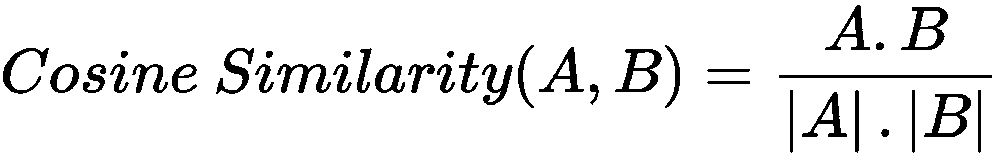

# 第十三章：分析文本数据

在信息化时代，数据以惊人的速度和体量产生。产生的数据不仅限于结构化或表格类型，也可以是多种非结构化类型，如文本数据、图像或图形数据、语音数据和视频数据。文本是非常常见且丰富的数据类型。文章、博客、教程、社交媒体帖子和网站内容都会生成非结构化的文本数据。每分钟都会有成千上万的电子邮件、消息、评论和推文发送出去。如此大量的文本数据需要被挖掘。文本分析为商业人士提供了大量机会；例如，亚马逊可以解读关于特定产品的客户反馈，新闻分析师可以分析 Twitter 上的新闻趋势和最新问题，Netflix 也可以解读每部电影和网络剧集的评论。商业分析师可以通过 NLP 和文本分析解读客户活动、评论、反馈和情感，从而有效推动业务发展。

本章将从基本的文本分析操作开始，如分词、移除停用词、词干提取、词形还原、词性标注和实体识别。之后，我们将学习如何使用 WordCloud 可视化文本分析结果。我们将看到如何基于评论，通过情感分析找出客户对某个产品的看法。在这里，我们将使用文本分类进行情感分析，并通过准确率、精确度、召回率和 F1 分数评估模型的性能。最后，我们将重点关注通过 Jaccard 和余弦相似度衡量两句话之间的文本相似性。

本章的主题如下所示：

+   安装 NLTK 和 SpaCy

+   文本规范化

+   分词

+   移除停用词

+   词干提取与词形还原

+   词性标注

+   实体识别

+   依存句法分析

+   创建词云

+   词袋模型

+   TF-IDF

+   使用文本分类进行情感分析

+   文本相似度

# 技术要求

本章的技术要求如下：

+   你可以通过以下 GitHub 链接找到代码和数据集：[`github.com/PacktPublishing/Python-Data-Analysis-Third-Edition/tree/master/Chapter12`](https://github.com/PacktPublishing/Python-Data-Analysis-Third-Edition/tree/master/Chapter12)

+   所有代码块都可以在`ch12.ipynb`文件中找到。

+   本章仅使用一个 TSV 文件（`amazon_alexa.tsv`）进行练习。

+   在本章中，我们将使用 NLTK、SpaCy、WordCloud、matplotlib、seaborn 和 scikit-learn Python 库。

# 安装 NLTK 和 SpaCy

NLTK 是一个流行且重要的 Python 自然语言处理库。它提供所有基础和高级的 NLP 操作。它包括常见的算法，如分词、词干提取、词形还原、词性标注和命名实体识别。NLTK 库的主要特点是开源、易于学习、易于使用、拥有活跃的社区以及完善的文档。NLTK 库可以通过在命令行中运行以下`pip install`命令来安装：

```py
pip install nltk
```

NLTK 不是 Anaconda 中预安装的库。我们可以直接在 Jupyter Notebook 中安装`nltk`。我们可以在单元格中的命令前加上感叹号 (!)：

```py
!pip install nltk
```

SpaCy 是另一个重要且强大的 Python NLP 库。它提供了常见的 NLP 算法和高级功能。它旨在用于生产目的，并为大规模数据开发应用程序。可以使用以下命令在命令行中通过`pip install`安装 SpaCy 库：

```py
pip install spacy
```

安装完 spaCy 后，我们需要安装一个`spacy`英语语言模型。我们可以使用以下命令安装：

```py
python -m spacy download en
```

SpaCy 及其英语模型没有预安装在 Anaconda 中。我们可以使用以下代码直接安装`spacy`。我们可以在单元格中的命令前加上感叹号 (!)：

```py
!pip install spacy
!python -m spacy download en
```

使用上述语法，我们可以在 Jupyter Notebook 中安装`spacy`及其英语模型。

# 文本标准化

文本标准化将文本转换为标准或规范形式。它确保一致性，并有助于处理和分析。标准化过程没有单一的方法。标准化的第一步是将所有文本转换为小写。这是最简单、最适用且最有效的文本预处理方法。另一种方法可能是处理拼写错误的单词、缩写词、简写和使用超出词汇表的单词；例如，“super”，“superb”和“superrrr”可以转换为“super”。文本标准化处理测试数据中的噪声和干扰，准备无噪声数据。我们还会应用词干提取和词形还原来标准化文本中存在的单词。

让我们通过将文本转换为小写来执行基本的标准化操作：

```py
# Input text
paragraph="""Taj Mahal is one of the beautiful monuments. It is one of the wonders of the world. It was built by Shah Jahan in 1631 in memory of his third beloved wife Mumtaj Mahal."""

# Converting paragraph in lowercase 
print(paragraph.lower()) 
```

这将输出以下内容：

```py
taj mahal is one of the beautiful monuments. it is one of the wonders of the world. it was built by shah jahan in 1631 in memory of his third beloved wife mumtaj mahal.
```

在前面的代码块中，我们通过使用`lower()`方法将给定的输入段落转换为小写。

在 NLP 中，文本标准化处理随机性，并将文本转换为标准形式，从而提高 NLP 解决方案的整体性能。它还通过将单词转换为根词来减少文档词项矩阵的大小。在接下来的部分中，我们将重点介绍基本的文本预处理操作。

# 分词

分词是文本分析中的初步步骤。分词被定义为将文本段落分解成更小的部分或词元，如句子或单词，并忽略标点符号。分词可以分为两种类型：句子分词和单词分词。句子分词器将段落拆分为句子，而单词分词器将文本拆分为单词或词元。

让我们使用 NLTK 和 spaCy 对段落进行分词：

1.  在分词之前，导入 NLTK 并下载所需的文件：

```py
# Loading NLTK module
import nltk

# downloading punkt
nltk.download('punkt')

# downloading stopwords
nltk.download('stopwords')

# downloading wordnet
nltk.download('wordnet')

# downloading average_perception_tagger
nltk.download('averaged_perceptron_tagger')
```

1.  现在，我们将使用 NLTK 的 `sent_tokenize()` 方法将段落分割成句子：

```py
# Sentence Tokenization
from nltk.tokenize import sent_tokenize

paragraph="""Taj Mahal is one of the beautiful monuments. It is one of the wonders of the world. It was built by Shah Jahan in 1631 in memory of his third beloved wife Mumtaj Mahal."""

tokenized_sentences=sent_tokenize(paragraph)
print(tokenized_sentences)
```

这将产生以下输出：

```py
['Taj Mahal is one of the beautiful monument.', 'It is one of the wonders of the world.', 'It was built by Shah Jahan in 1631 in memory of his third beloved wife Mumtaj Mahal.']
```

在前面的例子中，我们将段落作为参数传递给 `sent_tokenize()` 方法。此方法的输出将是一个句子列表。

让我们使用 spaCy 将段落分割成句子：

```py
# Import spacy
import spacy

# Loading english language model 
nlp = spacy.load("en")

# Build the nlp pipe using 'sentencizer'
sent_pipe = nlp.create_pipe('sentencizer')

# Append the sentencizer pipe to the nlp pipeline
nlp.add_pipe(sent_pipe)
paragraph = """Taj Mahal is one of the beautiful monuments. It is one of the wonders of the world. It was built by Shah Jahan in 1631 in memory of his third beloved wife Mumtaj Mahal."""

# Create nlp Object to handle linguistic annotations in a documents.
nlp_doc = nlp(paragraph)

# Generate list of tokenized sentence
tokenized_sentences = []
for sentence in nlp_doc.sents:
    tokenized_sentences.append(sentence.text)
print(tokenized_sentences)
```

这将产生以下输出：

```py
['Taj Mahal is one of the beautiful monument.', 'It is one of the wonders of the world.', 'It was built by Shah Jahan in 1631 in memory of his third beloved wife Mumtaj Mahal.']
```

在前面的例子中，我们首先导入了英语语言模型并实例化它。之后，我们使用 `sentencizer` 创建了 NLP 管道，并将其添加到管道中。最后，我们创建了 NLP 对象，并通过迭代 NLP 对象的 `sents` 属性来生成一个分词后的句子列表。

让我们使用 NLTK 的 `word_tokenize()` 函数将段落分词：

```py
# Import nltk word_tokenize method
from nltk.tokenize import word_tokenize

# Split paragraph into words
tokenized_words=word_tokenize(paragraph)
print(tokenized_words)
```

这将产生以下输出：

```py
['Taj', 'Mahal', 'is', 'one', 'of', 'the', 'beautiful', 'monument', '.', 'It', 'is', 'one', 'of', 'the', 'wonders', 'of', 'the', 'world', '.', 'It', 'was', 'built', 'by', 'Shah', 'Jahan', 'in', '1631', 'in', 'memory', 'of', 'his', 'third', 'beloved', 'wife', 'Mumtaj', 'Mahal', '.']
```

在前面的例子中，我们将段落作为参数传递给 `word_tokenize()` 方法。此方法的输出将是一个单词列表。

让我们使用 spaCy 将段落分词为单词：

```py
# Import spacy
import spacy

# Loading english language model 
nlp = spacy.load("en")

paragraph = """Taj Mahal is one of the beautiful monuments. It is one of the wonders of the world. It was built by Shah Jahan in 1631 in memory of his third beloved wife Mumtaj Mahal."""

# Create nlp Object to handle linguistic annotations in a documents.
my_doc = nlp(paragraph)

# tokenize paragraph into words
tokenized_words = []
for token in my_doc:
    tokenized_words.append(token.text)

print(tokenized_words)
```

这将产生以下输出：

```py
['Taj', 'Mahal', 'is', 'one', 'of', 'the', 'beautiful', 'monument', '.', 'It', 'is', 'one', 'of', 'the', 'wonders', 'of', 'the', 'world', '.', 'It', 'was', 'built', 'by', 'Shah', 'Jahan', 'in', '1631', 'in', 'memory', 'of', 'his', 'third', 'beloved', 'wife', 'Mumtaj', 'Mahal', '.']
```

在前面的例子中，我们首先导入了英语语言模型并实例化它。之后，我们创建了一个文本段落。最后，我们使用文本段落创建了一个 NLP 对象，并通过迭代它来生成一个分词后的单词列表。

让我们创建分词后的单词的频率分布：

```py
# Import frequency distribution
from nltk.probability import FreqDist

# Find frequency distribution of paragraph
fdist = FreqDist(tokenized_words)

# Check top 5 common words
fdist.most_common(5)
```

这将产生以下输出：

```py
[('of', 4), ('the', 3), ('.', 3), ('Mahal', 2), ('is', 2)]
```

让我们使用 matplotlib 创建一个频率分布图：

```py
# Import matplotlib
import matplotlib.pyplot as plt

# Plot Frequency Distribution
fdist.plot(20, cumulative=False)
plt.show()

```

这将产生以下输出：


在前面的例子中，我们使用 `FreqDist` 类生成了词元的频率分布。在句子和单词分词后，我们将学习如何从给定文本中移除停用词。

# 移除停用词

停用词被视为文本分析中的噪声。任何文本段落中都必须包含动词、冠词和介词。这些都被视为停用词。停用词对于人类对话是必要的，但在文本分析中贡献不大。从文本中移除停用词称为噪声消除。

让我们看看如何使用 NLTK 移除停用词：

```py
# import the nltk stopwords
from nltk.corpus import stopwords

# Load english stopwords list
stopwords_set=set(stopwords.words("english"))

# Removing stopwords from text
filtered_word_list=[]
for word in tokenized_words:
    # filter stopwords
    if word not in stopwords_set:
        filtered_word_list.append(word)

# print tokenized words
print("Tokenized Word List:", tokenized_words)

# print filtered words
print("Filtered Word List:", filtered_word_list)
```

这将产生以下输出：

```py
Tokenized Word List: ['Taj', 'Mahal', 'is', 'one', 'of', 'the', 'beautiful', 'monuments', '.', 'It', 'is', 'one', 'of', 'the', 'wonders', 'of', 'the', 'world', '.', 'It', 'was', 'built', 'by', 'Shah', 'Jahan', 'in', '1631', 'in', 'memory', 'of', 'his', 'third', 'beloved', 'wife', 'Mumtaj', 'Mahal', '.']

Filtered Word List: ['Taj', 'Mahal', 'one', 'beautiful', 'monuments', '.', 'It', 'one', 'wonders', 'world', '.', 'It', 'built', 'Shah', 'Jahan', '1631', 'memory', 'third', 'beloved', 'wife', 'Mumtaj', 'Mahal', '.']
```

在前面的示例中，首先，我们导入了停用词并加载了英文单词列表。之后，我们使用`for`循环迭代在上一节中生成的分词单词列表，并使用`if`条件从停用词列表中过滤分词单词。我们将过滤后的单词保存在`fltered_word_list`列表对象中。

让我们看看如何使用 spaCy 去除停用词：

```py
# Import spacy
import spacy

# Loading english language model 
nlp = spacy.load("en")

# text paragraph
paragraph = """Taj Mahal is one of the beautiful monuments. It is one of the wonders of the world. It was built by Shah Jahan in 1631 in memory of his third beloved wife Mumtaj Mahal."""

# Create nlp Object to handle linguistic annotations in a documents.
my_doc = nlp(paragraph)

# Removing stopwords from text
filtered_token_list = []
for token in my_doc:
     # filter stopwords
     if token.is_stop==False:
         filtered_token_list.append(token)

print("Filtered Word List:",filtered_token_list)
```

这会产生以下输出：

```py
Filtered Sentence: [Taj, Mahal, beautiful, monument, ., wonders, world, ., built, Shah, Jahan, 1631, memory, beloved, wife, Mumtaj, Mahal, .]
```

在前面的示例中，首先，我们导入了停用词并将英文单词列表加载到停用词变量中。之后，我们使用`for`循环迭代 NLP 对象，并通过`if`条件从停用词列表中过滤每个单词，使用属性`"is_stop"`。我们将过滤后的单词附加到`fltered_token_list`列表对象中。在这一部分，我们了解了如何去除停用词。现在，轮到我们学习词干提取和词形还原，找到根词了。

# 词干提取和词形还原

词干提取（Stemming）是文本分析中语言层面的另一步规范化。词干提取过程将单词替换为其词根。它会去除单词的前缀和后缀。例如，单词“connect”是“connecting”、“connected”和“connection”的词根。所有这些单词都有一个共同的词根：**connect**。这种单词拼写的差异使得文本数据分析变得困难。

词形还原（Lemmatization）是另一种词汇规范化方法，它将一个单词转换为其词根。它与词干提取（stemming）密切相关。主要区别在于，词形还原在执行规范化时考虑了单词的上下文，而词干提取则没有考虑单词的上下文知识。词形还原比词干提取更为复杂。例如，单词“geese”经过词形还原后变成“goose”。词形还原通过使用词典将单词简化为有效的词元。词形还原会根据单词的词性进行规范化；这就是为什么它难以实现且速度较慢，而词干提取则容易实现且速度较快，但准确度较低的原因。

让我们看看如何使用 NLTK 进行词干提取和词形还原：

```py
# Import Lemmatizer
from nltk.stem.wordnet import WordNetLemmatizer

# Import Porter Stemmer
from nltk.stem.porter import PorterStemmer

# Create lemmatizer object
lemmatizer = WordNetLemmatizer()

# Create stemmer object
stemmer = PorterStemmer()

# take a sample word
sample_word = "crying"
print("Lemmatized Sample Word:", lemmatizer.lemmatize(sample_word, "v"))

print("Stemmed Sample Word:", stemmer.stem(sample_word))
```

这会产生以下输出：

```py
Lemmatized Sample Word: cry
Stemmed Sample Word: cri
```

在前面的示例中，首先，我们导入了`WordNetLemmatizer`进行词形还原并实例化了它的对象。类似地，我们导入了`PorterStemmer`进行词干提取并实例化了它的对象。之后，我们通过`lemmatize()`函数获得了词形，还通过`stem()`函数得到了词干。

让我们看看如何使用 spaCy 进行词形还原：

```py
# Import english language model
import spacy

# Loading english language model 
nlp = spacy.load("en")

# Create nlp Object to handle linguistic annotations in documents.
words = nlp("cry cries crying")

# Find lemmatized word
for w in words:
    print('Original Word: ', w.text)
    print('Lemmatized Word: ',w.lemma_)
```

这会产生以下输出：

```py
Original Word:  cry
Lemmatized Word:  cry
Original Word:  cries
Lemmatized Word:  cry
Original Word:  crying
Lemmatized Word:  cry
```

在前面的示例中，首先，我们导入了英文语言模型并实例化了它。之后，我们创建了 NLP 对象并使用`for`循环对其进行迭代。在循环中，我们通过`text`和`lemma_`属性获取了文本值及其词形还原值。在这一部分，我们学习了词干提取和词形还原。现在，我们将学习给定文档中的词性标注（PoS tagging）。

# 词性标注（POS tagging）

PoS 代表词性。PoS 标签的主要目标是发现单词的句法类型，如名词、代词、形容词、动词、副词和介词。PoS 标签能够找到句子中单词之间的关系。

让我们看看如何使用 NLTK 获取单词的 PoS 标签：

```py
# import Word Tokenizer and PoS Tagger
from nltk.tokenize import word_tokenize
from nltk import pos_tag

# Sample sentence
sentence = "Taj Mahal is one of the beautiful monument."

# Tokenize the sentence
sent_tokens = word_tokenize(sentence)

# Create PoS tags
sent_pos = pos_tag(sent_tokens)

# Print tokens with PoS
print(sent_pos)
```

这将产生以下输出：

```py
[('Taj', 'NNP'), ('Mahal', 'NNP'), ('is', 'VBZ'), ('one', 'CD'), ('of', 'IN'), ('the', 'DT'), ('beautiful', 'JJ'), ('monument', 'NN'), ('.', '.')]
```

在前面的示例中，首先，我们导入了`word_tokenize`和`pos_tag`。接着，我们获取了一段文本并将其作为参数传递给`word_tokenize()`方法。此方法的输出将是一个单词列表。接下来，使用`pos_tag()`函数为每个标记生成 PoS 标签。

让我们看看如何使用 spaCy 获取单词的 PoS 标签：

```py
# Import spacy
import spacy

# Loading small english language model 
nlp = spacy.load("en_core_web_sm")

# Create nlp Object to handle linguistic annotations in a documents.
sentence = nlp(u"Taj Mahal is one of the beautiful monument.")

for token in sentence:
  print(token.text, token.pos_)
```

这将产生以下输出：

```py
Taj PROPN 
Mahal PROPN 
is VERB 
one NUM 
of ADP 
the DET 
beautiful ADJ 
monument NOUN
. PUNCT
```

在前面的示例中，首先，我们导入了英语语言模型并实例化了它。接着，我们创建了 NLP 对象，并使用`for`循环对其进行迭代。在循环中，我们通过`text`和`pos_`属性获取文本值及其词干值。在这一部分中，我们已经研究了 PoS 标签。现在，是时候跳转到识别文本中的命名实体了。

# 识别实体

实体识别是指从给定文本中提取或检测实体。它也被称为**命名实体识别**（**NER**）。实体可以定义为一个对象，如地点、人物、组织或日期。实体识别是 NLP 的高级主题之一，它用于从文本中提取重要信息。

让我们看看如何使用 spaCy 从文本中提取实体：

```py
# Import spacy
import spacy

# Load English model for tokenizer, tagger, parser, and NER
nlp = spacy.load('en')

# Sample paragraph
paragraph = """Taj Mahal is one of the beautiful monuments. It is one of the wonders of the world. It was built by Shah Jahan in 1631 in memory of his third beloved wife Mumtaj Mahal."""

# Create nlp Object to handle linguistic annotations in documents.
docs=nlp(paragraph)
entities=[(i.text, i.label_) for i in docs.ents]
print(entities)
```

这将产生以下输出：

```py
[('Taj Mahal', 'PERSON'), ('Shah Jahan', 'PERSON'), ('1631', 'DATE'), ('third', 'ORDINAL'), ('Mumtaj Mahal', 'PERSON')]
```

在前面的示例中，首先，我们导入了 spaCy 并加载了英语语言模型。接着，我们创建了 NLP 对象，并使用`for`循环对其进行迭代。在循环中，我们通过`text`和`label_`属性获取文本值及其实体类型值。现在，让我们使用 spaCy 的`display`类来可视化文本中的实体：

```py
# Import display for visualizing the Entities
from spacy import displacy

# Visualize the entities using render function
displacy.render(docs, style = "ent",jupyter = True)

```

这将产生以下输出：


在前面的示例中，我们导入了`display`类，并使用一个 NLP 文本对象调用了它的`render()`方法，`style`设置为`ent`，`jupyter`设置为`True`。

# 依存解析

依存解析用于发现单词之间的关系——即单词是如何彼此关联的。它帮助计算机理解句子以便进行分析；例如，“泰姬陵是最美丽的纪念碑之一。”我们不能仅通过分析单词来理解这个句子。我们需要深入分析并理解单词顺序、句子结构以及词性：

```py
# Import spacy
import spacy

# Load English model for tokenizer, tagger, parser, and NER
nlp = spacy.load('en')

# Create nlp Object to handle linguistic annotations in a documents.
docs=nlp(sentence)

# Visualize the using render function
displacy.render(docs, style="dep", jupyter= True, options={'distance': 150})
```

这将产生以下输出：


在前面的示例中，我们导入了`display`类，并使用一个 NLP 文本对象调用了它的`render()`方法，`style`设置为`'dep'`，`jupyter`设置为`True`，并将`options`设置为一个包含`distance`键和值 150 的字典。接下来，我们将看看如何根据文本中单词的频率，使用词云可视化文本数据。

# 创建词云

作为数据分析师，你需要识别最常见的单词，并以图形形式向高层管理层呈现它们。词云用于表示单词频率图。它通过单词的大小来表示频率，也就是说，频率越高的单词看起来越大，频率较低的单词看起来越小。它也被称为标签云。我们可以使用 Python 中的`wordcloud`库来创建词云。我们可以使用以下命令安装它：

```py
pip install wordcloud
```

或者，也可以使用这个：

```py
conda install -c conda-forge wordcloud
```

让我们学习如何创建词云：

1.  导入库并加载停用词列表：

```py
# importing all necessary modules
from wordcloud import WordCloud
from wordcloud import STOPWORDS
import matplotlib.pyplot as plt

stopword_list = set(STOPWORDS)

paragraph="""Taj Mahal is one of the beautiful monuments. It is one of the wonders of the world. It was built by Shah Jahan in 1631 in memory of his third beloved wife Mumtaj Mahal."""
```

在前面的示例中，我们导入了`WordCloud`、`STOPWORDS`和`matplotlib.pyplot`类。我们还创建了停用词集合并定义了段落文本。

1.  创建并生成词云：

```py
word_cloud = WordCloud(width = 550, height = 550,
background_color ='white',
stopwords = stopword_list,
min_font_size = 10).generate(paragraph)
```

之后，创建并生成一个`WordCloud`对象，设置`width`、`height`、`background_color`、`stopwords`和`min_font_size`等参数，并在段落文本字符串上生成词云。

1.  可视化词云：

```py
0.# Visualize the WordCloud Plot
# Set wordcloud figure size
plt.figure(figsize = (8, 6))

# Show image
plt.imshow(word_cloud)

# Remove Axis
plt.axis("off")

# show plot
plt.show()
```

这将产生以下输出：


在前面的示例中，我们使用`matplotlib.pyplot`可视化了词云。让我们学习如何使用词袋模型将文本文档转换为数值向量。

# 词袋模型

**词袋模型**（**BoW**）是最基本、最简单和最流行的特征工程技术之一，用于将文本转换为数值向量。它分为两个步骤：收集词汇表中的单词，并计算它们在文本中的出现频率或存在。它不考虑文档结构和上下文信息。让我们以以下三个文档为例，理解 BoW：

文档 1：我喜欢披萨。

文档 2：我不喜欢汉堡。

文档 3：披萨和汉堡都属于垃圾食品。

现在，我们将创建**文档词矩阵**（**DTM**）。该矩阵由文档（行）、单词（列）以及单词频率（单元格值）组成。

|  | I | like | pizza | do | not | burgers | and | both | are | junk | food |
| --- | --- | --- | --- | --- | --- | --- | --- | --- | --- | --- | --- |
| Doc-1 | 1 | 1 | 1 | 0 | 0 | 0 | 0 | 0 | 0 | 0 | 0 |
| Doc-2 | 1 | 1 | 0 | 1 | 1 | 1 | 0 | 0 | 0 | 0 | 0 |
| Doc-3 | 0 | 0 | 1 | 0 | 0 | 1 | 1 | 1 | 1 | 1 | 1 |

在前面的示例中，我们使用了单一的关键词生成了 DTM，这称为单元法（unigram）。我们还可以使用连续的两个关键词组合，这被称为二元模型（bigram），或者三个关键词的组合，称为三元模型（trigram）。这种通用形式被称为 n 元模型（n-gram）。

在 Python 中，scikit-learn 提供了`CountVectorizer`来生成 BoW 的文档词矩阵（DTM）。我们将在*使用文本分类进行情感分析*章节中看到如何使用 scikit-learn 生成它。

# TF-IDF

**TF-IDF** 代表 **词频-逆文档频率**。它有两个部分：**词频** (**TF**) 和 **逆文档频率** (**IDF**)。TF 仅计算每个文档中单词的出现次数，等同于 BoW（词袋模型）。TF 不考虑单词的上下文，且偏向较长的文档。**IDF** 计算值，表示某个词保留的信息量。


TF-IDF 是 TF 和 IDF 两个部分的点积。TF-IDF 会对文档权重进行归一化处理。TF-IDF 值越高，表示某个词在该文档中的出现频率越高。让我们看看以下三个文档：

文档 1：我喜欢比萨。

文档 2：我不喜欢汉堡。

文档 3：比萨和汉堡都是垃圾食品。

现在，我们将创建 DTM（文档-词项矩阵）。该矩阵的行头是文档名称，列头是词汇，单元格中则是 TF-IDF 值：

|  | I | like | pizza | do | not | burgers | and | both | are | junk | food |
| --- | --- | --- | --- | --- | --- | --- | --- | --- | --- | --- | --- |
| Doc-1 | 0.58 | 0.58 | 0.58 | 0 | 0 | 0 | 0 | 0 | 0 | 0 | 0 |
| Doc-2 | 0.58 | 0.58 | 0 | 1.58 | 1.58 | 0.58 | 0 | 0 | 0 | 0 | 0 |
| Doc-3 | 0 | 0 | 0.58 | 0 | 0 | 0.58 | 1.58 | 1.58 | 1.58 | 1.58 | 1.58 |

在 Python 中，scikit-learn 提供了 `TfidfVectorizer` 用于生成 TF-IDF DTM。我们将在接下来的章节中看到如何使用 scikit-learn 来生成它。

# 使用文本分类进行情感分析

一个业务或数据分析师需要了解客户对某一特定产品的反馈和评价。客户喜欢或不喜欢什么？销售情况如何？作为一名业务分析师，你需要以合理的准确性分析这些内容，并量化客户的评论、反馈、意见和推文，从而了解目标受众。情感分析提取文本中的核心信息，并提供人们对产品、服务、品牌以及政治和社会话题的看法。情感分析用于了解客户和人们的心态。它不仅应用于营销领域，我们还可以在政治、公共管理、政策制定、信息安全和研究中使用它。它帮助我们理解人们反馈的极性。情感分析还涵盖了词汇、语气和写作风格。

文本分类可以作为情感分析的一种方法。它是一种监督学习方法，用于检测网页内容、新闻文章、博客、推文和情感类别。文本分类在营销、金融、电子商务和安全等领域有着广泛的应用。首先，我们对文本进行预处理，然后找出预处理文本的特征，再将这些特征和标签输入机器学习算法进行分类。以下图解展示了使用文本分类进行情感分析的完整过程：


让我们对 Amazon Alexa 产品评论进行情感分类。我们可以从 Kaggle 网站获取数据（[`www.kaggle.com/sid321axn/amazon-alexa-reviews`](https://www.kaggle.com/sid321axn/amazon-alexa-reviews)）。

Alexa 产品评论数据是一个制表符分隔的值文件（TSV 文件）。该数据有五列或属性——**评分**，**日期**，**变体**，**已验证评论**，和 **反馈**。

`评分` 列表示用户对 Alexa 产品的评分。日期列是用户给出评论的日期。`变体` 列表示产品型号。`已验证评论` 包含用户对产品的实际评论。

评分表示每个用户对产品给出的评分。日期表示评论的日期，变体描述了型号名称。`已验证评论` 包含用户撰写的文本评论，反馈列表示情感分数，其中 1 表示正面情感，0 表示负面情感。

## 使用 BoW 进行分类

在本小节中，我们将基于 BoW 执行情感分析和文本分类。这里，我们使用 `scikit-learn` 库生成词袋。接下来，让我们看看如何在以下步骤中使用 BoW 特征执行情感分析：

1.  加载数据集：

构建机器学习模型的第一步是加载数据集。让我们首先使用 pandas 的 `read_csv()` 函数读取数据：

```py
# Import libraries
import pandas as pd

# read the dataset
df=pd.read_csv('amazon_alexa.tsv', sep='\t')

# Show top 5-records
df.head()
```

这将生成以下输出：


在之前的输出数据框中，我们看到 Alexa 评论数据集有五个列：**评分**，**日期**，**变体**，**已验证评论**，和 **反馈**。

1.  探索数据集。

让我们绘制 **反馈** 列的计数，以查看数据集中的正面和负面评论数量：

```py
# Import seaborn
import seaborn as sns
import matplotlib.pyplot as plt

# Count plot
sns.countplot(x='feedback', data=df)

# Set X-axis and Y-axis labels
plt.xlabel('Sentiment Score')
plt.ylabel('Number of Records')

# Show the plot using show() function
plt.show()
```

这将生成以下输出：


在前面的代码中，我们使用 seaborn 的 `countplot()` 函数绘制了反馈列的条形图。该函数会计算并绘制 **反馈** 列的值。在此图中，我们可以看到 2,900 条评论为正面评论，250 条评论为负面评论。

1.  使用 `CountVectorizer` 生成特征：

让我们使用 scikit-learn 的 `CountVectorizer` 为客户评论生成一个 BoW 矩阵：

```py
# Import CountVectorizer and RegexTokenizer
from nltk.tokenize import RegexpTokenizer
from sklearn.feature_extraction.text import CountVectorizer

# Create Regex tokenizer for removing special symbols and numeric values
regex_tokenizer = RegexpTokenizer(r'[a-zA-Z]+')

# Initialize CountVectorizer object
count_vectorizer = CountVectorizer(lowercase=True,
stop_words='english',
ngram_range = (1,1),
tokenizer = regex_tokenizer.tokenize)

# Fit and transform the dataset
count_vectors = count_vectorizer.fit_transform( df['verified_reviews'])
```

在前面的代码中，我们创建了一个`RegexTokenizer`对象，并使用输入的正则表达式来去除特殊字符和符号。之后，创建了`CountVectorizer`对象，并对已验证的评论执行了 fit 和 transform 操作。这里，`CountVectorizer`接受一些参数，如`lowercase`用于将关键字转换为小写，`stop_words`用于指定特定语言的停用词列表，`ngram_range`用于指定单词一元组、二元组或三元组，而`tokenizer`则用来传递`tokenizer`对象。`RegexTokenizer`对象被传递给`tokenizer`参数。最后，我们调用了`fit_transform()`函数，该函数根据指定的参数将文本评论转换为文档-词项矩阵（DTM）。

1.  分割训练集和测试集：

让我们使用`train_test_split()`将特征集和目标列分割为`feature_train`、`feature_test`、`target_train`和`target_test`。`train_test_split()`接受依赖和独立数据帧、`test_size`和`random_state`作为参数。这里，`test_size`决定了训练集与测试集的比例（即，`test_size 0.3`表示 30%的数据作为测试集，剩下的 70%作为训练集），而`random_state`则用作种子值，以便每次能重复相同的数据分割。如果`random_state`为`None`，则会每次随机分割记录，这会导致不同的性能度量：

```py
# Import train_test_split
from sklearn.model_selection import train_test_split

# Partition data into training and testing set
feature_train, feature_test, target_train, target_test = train_test_split(count_vectors, df['feedback'], test_size=0.3, random_state=1)
```

在前面的代码中，我们使用`train_test_split()`方法将特征集和目标列分割为`feature_train`、`feature_test`、`target_train`和`target_test`。

1.  使用逻辑回归构建分类模型：

在这一部分，我们将构建逻辑回归模型，通过 BoW（或`CountVectorizer`）对评论情感进行分类。让我们创建逻辑回归模型：

```py
# import logistic regression scikit-learn model
from sklearn.linear_model import LogisticRegression

# Create logistic regression model object
logreg = LogisticRegression(solver='lbfgs')

# fit the model with data
logreg.fit(feature_train,target_train)

# Forecast the target variable for given test dataset
predictions = logreg.predict(feature_test)
```

在前面的代码中，我们导入了`LogisticRegression`并创建了`LogisticRegression`对象。创建模型对象后，我们对训练数据执行了`fit()`操作，并使用`predict()`对测试数据集进行情感预测。

1.  评估分类模型：

让我们使用`metrics`类及其方法——`accuracy_score`、`precision_score`和`recall_score`来评估分类模型：

```py
# Import metrics module for performance evaluation
from sklearn.metrics import accuracy_score
from sklearn.metrics import precision_score
from sklearn.metrics import recall_score
from sklearn.metrics import f1_score

# Assess model performance using accuracy measure
print("Logistic Regression Model Accuracy:",accuracy_score(target_test, predictions))

# Calculate model precision
print("Logistic Regression Model Precision:",precision_score(target_test, predictions))

# Calculate model recall
print("Logistic Regression Model Recall:",recall_score(target_test, predictions))

# Calculate model f1 score
print("Logistic Regression Model F1-Score:",f1_score(target_test, predictions))
```

这会产生以下输出：

```py
Logistic Regression Model Accuracy: 0.9428571428571428
Logistic Regression Model Precision: 0.952433628318584
Logistic Regression Model Recall: 0.9873853211009175
Logistic Regression Model F1-Score: 0.9695945945945945
```

在前面的代码中，我们使用`scikit-learn metrics`函数评估了模型的性能，指标包括准确率、精确度、召回率和 F1 值。所有这些度量都大于 94%，所以我们可以说我们的模型表现良好，能够准确分类情感级别，并且精确度和召回率都很高。

## 使用 TF-IDF 进行分类

在这一小节中，我们将基于 TF-IDF 执行情感分析和文本分类。这里，TF-IDF 是通过`scikit-learn`库生成的。让我们看看如何使用 TF-IDF 特征执行情感分析，具体步骤如下：

1.  加载数据集：

构建机器学习模型的第一步是加载数据集。

首先，使用 pandas 的`read_csv()`函数读取数据：

```py
# Import libraries
import pandas as pd

# read the dataset
df=pd.read_csv('amazon_alexa.tsv', sep='\t')

# Show top 5-records
df.head()
```

这将产生以下输出：


在前面的输出数据帧中，我们看到 Alexa 评论数据集包含五列：**rating**、**date**、**variation**、**verified_reviews**和**feedback**。

1.  使用`TfidfVectorizer`生成特征：

让我们使用 scikit-learn 的`TfidfVectorizer`生成客户评论的 TF-IDF 矩阵：

```py
# Import TfidfVectorizer and RegexTokenizer
from nltk.tokenize import RegexpTokenizer
from sklearn.feature_extraction.text import TfidfVectorizer

# Create Regex tokenizer for removing special symbols and numeric values
regex_tokenizer = RegexpTokenizer(r'[a-zA-Z]+')

# Initialize TfidfVectorizer object
tfidf = TfidfVectorizer(lowercase=True, stop_words ='english',ngram_range = (1,1),tokenizer = regex_tokenizer.tokenize)

# Fit and transform the dataset
text_tfidf = tfidf.fit_transform(df['verified_reviews'])
```

在前面的代码中，我们创建了一个`RegexTokenizer`对象，并使用一个输入的正则表达式来去除特殊字符和符号。之后，我们创建了`TfidfVectorizer`对象，并对已验证的评论进行了拟合和转换操作。在这里，`TfidfVectorizer`接受一些参数，比如`lowercase`，用于将关键词转换为小写；`stop_words`，指定语言特定的停用词列表；`ngram_range`，指定单词组（unigram）、双词组（bigram）或三词组（trigram）；`tokenizer`则用于传递`tokenizer`对象。`RegexTokenizer`对象被传递给`tokenizer`参数。最后，我们调用了`fit_transform()`函数，根据指定的参数将文本评论转换为文档-词项矩阵（DTM）。

1.  分割训练集和测试集：

我们使用`train_test_split()`将特征集和目标列分割成`feature_train`、`feature_test`、`target_train`和`target_test`。`train_test_split()`接受依赖变量和独立数据帧、`test_size`和`random_state`作为参数。让我们将数据集分割为训练集和测试集：

```py
# Import train_test_split
from sklearn.model_selection import train_test_split

# Partition data into training and testing set
from sklearn.model_selection import train_test_split

feature_train, feature_test, target_train, target_test = train_test_split(text_tfidf, df['feedback'], test_size=0.3, random_state=1)

```

在前面的代码中，我们使用`train_test_split()`方法将特征集和目标列分割成`feature_train`、`feature_test`、`target_train`和`target_test`。

1.  使用逻辑回归构建分类模型：

在本节中，我们将构建逻辑回归模型，以使用 TF-IDF 对评论情感进行分类。让我们创建逻辑回归模型：

```py
# import logistic regression scikit-learn model
from sklearn.linear_model import LogisticRegression

# instantiate the model
logreg = LogisticRegression(solver='lbfgs')

# fit the model with data
logreg.fit(feature_train,target_train)

# Forecast the target variable for given test dataset
predictions = logreg.predict(feature_test)
```

在前面的代码中，我们导入了`LogisticRegression`并创建了`LogisticRegression`对象。在创建模型对象之后，我们对训练数据进行了`fit()`操作，并使用`predict()`对测试数据集进行情感预测。

1.  评估分类模型：

让我们使用`metrics`类及其方法——`accuracy_score`、`precision_score`和`recall_score`来评估分类模型：

```py
# Import metrics module for performance evaluation
from sklearn.metrics import accuracy_score
from sklearn.metrics import precision_score
from sklearn.metrics import recall_score
from sklearn.metrics import f1_score

# Assess model performance using accuracy measure
print("Logistic Regression Model Accuracy:",accuracy_score(target_test, predictions))

# Calculate model precision
print("Logistic Regression Model Precision:",precision_score(target_test, predictions))

# Calculate model recall
print("Logistic Regression Model Recall:",recall_score(target_test, predictions))

# Calculate model f1 score
print("Logistic Regression Model F1-Score:",f1_score(target_test, predictions))

```

这将产生以下输出：

```py
Logistic Regression Model Accuracy: 0.9238095238095239
Logistic Regression Model Precision: 0.923728813559322
Logistic Regression Model Recall: 1.0
Logistic Regression Model F1-Score: 0.960352422907489

```

在前面的代码中，我们使用 scikit-learn 的`metrics`函数，通过准确率、精确率、召回率和 F1 分数评估了模型的性能。所有指标都大于 94%，因此我们可以说我们的模型表现良好，并且能够以较好的精度和召回率对两种情感类别进行分类。在本节中，我们了解了如何通过文本分类进行情感分析。文本分类使用了 BoW 和 TF-IDF 特征。在下一节中，我们将学习如何找出两段文本之间的相似性，比如句子或段落。

# 文本相似度

文本相似度是确定两个最接近文本的过程。文本相似度对于查找相似文档、问题和查询非常有帮助。例如，像 Google 这样的搜索引擎使用相似度来查找文档的相关性，而像 StackOverflow 这样的问答系统或客户服务系统则使用类似问题。文本相似度通常使用两种度量标准，即 Jaccard 相似度和余弦相似度。

我们还可以使用 spaCy 中可用的相似度方法。`nlp` 对象的 `similarity` 方法返回两个句子之间的分数。我们来看以下示例：

```py
# Import spacy
import spacy

# Load English model for tokenizer, tagger, parser, and NER
nlp = spacy.load('en')

# Create documents
doc1 = nlp(u'I love pets.')
doc2 = nlp(u'I hate pets')

# Find similarity
print(doc1.similarity(doc2))
```

这将产生以下输出：

```py
0.724494176985974
<ipython-input-32-f157deaa344d>:12: UserWarning: [W007] The model you're using has no word vectors loaded, so the result of the Doc.similarity method will be based on the tagger, parser and NER, which may not give useful similarity judgements. This may happen if you're using one of the small models, e.g. `en_core_web_sm`, which don't ship with word vectors and only use context-sensitive tensors. You can always add your own word vectors, or use one of the larger models instead if available.
```

在前面的代码块中，我们使用 spaCy 的 `similarity()` 函数计算了两个句子之间的相似度。spaCy 的相似度函数在使用较小模型（如 `en_core_web_sm` 和 `en` 模型）时效果不佳；因此你会收到一个警告：**UserWarning: [W007]**。要去除此警告，请使用更大的模型，如 `en_core_web_lg`。

## Jaccard 相似度

Jaccard 相似度通过两个集合中共同单词（交集）与完全独特单词（并集）的比例来计算相似度。它会列出每个句子或文档中的唯一单词列表。这个方法适用于单词重复不重要的场景。Jaccard 相似度的范围是 0-100%；百分比越高，两个集合的相似度越大：


让我们看一个 Jaccard 相似度的示例：

```py
def jaccard_similarity(sent1, sent2):
    """Find text similarity using jaccard similarity"""
    # Tokenize sentences
    token1 = set(sent1.split())
    token2 = set(sent2.split())

    # intersection between tokens of two sentences    
    intersection_tokens = token1.intersection(token2)

    # Union between tokens of two sentences
    union_tokens=token1.union(token2)

    # Cosine Similarity
    sim_= float(len(intersection_tokens) / len(union_tokens))
    return sim_

jaccard_similarity('I love pets.','I hate pets.')
```

这将产生以下输出：

```py
0.5
```

在上述示例中，我们创建了一个函数 `jaccard_similarity()`，该函数接受两个参数 `sent1` 和 `sent2`。它将计算两个句子中关键词的交集与并集之间的比例。

## 余弦相似度

余弦相似度计算两个多维投影向量之间的夹角余弦值。它表示两个文档之间的关系。两个向量可以由词袋模型、TF-IDF 或任何等效的文档向量组成。它适用于单词重复重要的情况。余弦相似度可以测量文本相似度，而不考虑文档的大小。



让我们看一个余弦相似度的示例：

```py
# Let's import text feature extraction TfidfVectorizer
from sklearn.feature_extraction.text import TfidfVectorizer
docs=['I love pets.','I hate pets.']

# Initialize TfidfVectorizer object
tfidf= TfidfVectorizer()

# Fit and transform the given data
tfidf_vector = tfidf.fit_transform(docs)

# Import cosine_similarity metrics
from sklearn.metrics.pairwise import cosine_similarity

# compute similarity using cosine similarity
cos_sim=cosine_similarity(tfidf_vector, tfidf_vector)

print(cos_sim)
```

这将产生以下输出：

```py
[[1\. 0.33609693]
[0.33609693 1\. ]]
```

在上述示例中，首先我们导入 `TfidfVectorizer` 并生成给定文档的 TF-IDF 向量。之后，我们应用 `cosine_similarity()` 度量标准对文档列表进行相似度计算。

# 总结

本章探讨了使用 NLTK 和 spaCy 进行文本分析。主要内容包括文本预处理、情感分析和文本相似度。章节从文本预处理任务入手，如文本标准化、分词、去除停用词、词干提取和词形还原。我们还重点讲解了如何创建词云、识别给定文本中的实体并找到词元之间的依赖关系。在后续部分，我们将重点讨论 BoW、TFIDF、情感分析和文本分类。

下一章，第十三章，*图像数据分析*，主要讲解图像处理、基本图像处理操作以及使用 OpenCV 进行人脸检测。该章节从图像颜色模型开始，并介绍了图像操作，如在图像上绘制、调整图像大小、翻转和模糊图像。在后续部分，将重点讨论如何在人脸检测输入图像中进行分析。
