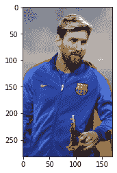

# 第十四章：分析图像数据

我们正处在信息时代，每一个动作都会生成各种格式的数据，如文本、图像、地理空间数据和视频。智能手机已经进入世界各地的乡村，人们正在捕捉活动，特别是图像和视频，并将它们分享到社交媒体平台。这就是大量数据产生的方式，而且大部分数据以图像和视频的形式存在。工业和研究机构希望分析图像和视频数据集，以创造价值并制定自动化解决方案以降低成本。图像处理和计算机视觉是探索和开发基于图像和视频的解决方案的领域。在计算机视觉领域，有许多研究、创新和初创企业的机会。在本章中，我们将重点介绍图像处理的基础知识，帮助你建立计算机视觉领域的基本知识。

图像处理是计算机视觉的一个子集。计算机视觉是机器学习和人工智能领域内的一个高级且更强大的领域。计算机视觉提供了大量的应用，例如物体检测、图像和物体分类、图像字幕生成和图像分割。图像可以在信号处理中定义为二维信号，在几何学中定义为二维或三维的点集，在 Python 中则是二维或三维的 NumPy 数组。图像处理是指处理图像数据，并执行绘制、书写、调整大小、翻转、模糊、改变亮度和检测人脸等操作。在本章中，我们将详细探讨所有这些图像处理操作。

本章将涵盖以下主题：

+   安装 OpenCV

+   理解图像数据

+   色彩模型

+   在图像上绘制

+   在图像上写字

+   调整图像大小

+   翻转图像

+   改变亮度

+   模糊图像

+   人脸检测

# 技术要求

本章具有以下技术要求：

+   你可以通过以下 Github 链接找到代码、人脸分类器文件以及数据集：[`github.com/PacktPublishing/Python-Data-Analysis-Third-Edition/tree/master/Chapter13`](https://github.com/PacktPublishing/Python-Data-Analysis-Third-Edition/tree/master/Chapter13)[.](https://github.com/PacktPublishing/Python-Data-Analysis-Third-Edition/tree/master/Python-Data-Analysis-Third-Edition/Ch13)

+   所有代码块均可在 `ch13.ipynb` 文件中找到。

+   本章使用 `.jpg`/`.jpeg` 文件（`google.jpg`、`image.jpg`、`messi.png`、`nature.jpeg`、`barcelona.jpeg` 和 `tajmahal.jpg`）进行练习。

+   本章使用一个人脸分类器 XML 文件（`haarcascade_frontalface_default.xml`）。

+   在本章中，我们将使用 OpenCV、NumPy 和 matplotlib Python 库。

# 安装 OpenCV

OpenCV 是一个开源库，提供计算机视觉操作，如图像和视频分析。OpenCV 主要由 Intel 使用 C++开发，并提供 Python、Java 和 Matlab 的接口。OpenCV 具有以下特点：

+   它是一个开源的图像处理 Python 库。

+   OpenCV 是图像处理和计算机视觉的核心 Python 库。

+   OpenCV 易于学习和在网页和移动应用程序中部署。

+   OpenCV 在 Python 中是一个 API 和它 C++核心实现的包装器。

+   它因为后台 C++代码而运行速度很快。

我们可以使用以下命令安装 OpenCV：

```py
pip install opencv-python
```

使用前面提到的 pip 命令，我们可以轻松安装 OpenCV。OpenCV 是最受欢迎的图像处理和计算机视觉库。它提供了多种与图像分析操作相关的用例，例如提高图像质量、过滤和转换图像、在图像上绘制、改变颜色、检测人脸和物体、识别人类动作、跟踪物体、分析运动以及查找相似图像。安装完 OpenCV 库后，接下来就是了解图像处理的基础。

# 理解图像数据

图像数据是一个二维数组或函数`f(x,y)`，带有空间坐标。`coordinate(x,y)`的幅度称为强度。在 Python 中，图像是一个二维或三维的 NumPy 数组，包含像素值。像素是最小的图像单元，决定图像的质量。像素数量越多，分辨率越高。此外，还有多种图像格式可用，例如`.jpeg`、`.png`、`.gif`和`.tiff`。这些文件格式有助于组织和管理数字图像文件。在分析图像数据之前，我们需要了解图像的类型。图像数据有三种类型：

+   二值图像

+   灰度

+   颜色

## 二值图像

二值图像像素只有两种颜色，一般是黑色和白色。二值图像像素仅使用二进制值 0 或 1。


上面的图像是二值图像的示例。它只有两种颜色，黑色和白色，且不使用黑白的不同阴影。

## 灰度图像

灰度图像看起来像黑白图像。它由每个像素 8 位表示，也就是说有 256 个强度值或色调，范围从 0 到 255。这 256 种色调从纯黑到纯白过渡；0 代表纯黑，而 255 代表白色。


上面的图像是灰度图像。它是一个黑白图像，其中的色调从纯黑过渡到纯白。

## 彩色图像

彩色图像是由红色、蓝色和绿色三种基本颜色混合而成。这些基本颜色具有按一定比例混合形成新颜色的能力。每种颜色使用 8 位（强度值在 0 到 255 之间），即每个像素 24 位。让我们看一个彩色图像的例子：


在前面的图像文件中，我们可以看到不同强度的各种颜色阴影。了解了图像类型之后，接下来就是了解 RGB、CMYK、HSV、HSL 和灰度等颜色模型。让我们来看看颜色模型。

# 颜色模型

颜色模型是一种用于处理和测量原色组合的结构。它们帮助我们解释颜色在计算机屏幕或纸张上的显示方式。颜色模型可以分为两种类型：加法模型和减法模型。加法模型用于计算机屏幕，例如 RGB（红色、绿色和蓝色）模型，减法模型用于图像打印，例如 CMYK（青色、品红色、黄色和黑色）模型：


除了 RGB 和 CMYK，还有许多其他模型，如 HSV、HSL 和灰度模型。HSV 是色调、饱和度和明度的缩写。它是一个三维颜色模型，是 RGB 模型的改进版本。在 HSV 模型中，中心轴的顶部是白色，底部是黑色，剩余的颜色位于其间。在这里，色调是角度，饱和度是离中心轴的距离，明度是离轴底部的距离。

HSL 是色调、饱和度和亮度的缩写。HSV 和 HSL 的主要区别在于亮度的量和颜色在中心轴上的值。


让我们学习如何读取和显示图像文件：

```py
# Import cv2 latest version of OpenCV library 
import cv2

# Import numeric python (NumPy) library
import numpy as np

# Import matplotlib for showing the image 
import matplotlib.pyplot as plt 

# magic function to render the figure in a notebook 
%matplotlib inline 

# Read image using imread() function
image = cv2.imread('google.jpg') 

# Let's check image data type
print('Image Type:',type(image)) 

# Let's check dimension of image 
print('Image Dimension:',image.shape) 

# Let's show the image 
plt.imshow(image)
plt.show()
```

这将产生以下输出：


在前面的示例中，我们导入了`cv2`、NumPy 和`matplotlib.pyplot`。`cv2`用于图像处理，NumPy 用于数组，`matplotlib.pyplot`用于显示图像。我们使用`imread()`函数读取图像，并返回一个图像数组。我们可以使用`type()`函数检查其类型，并通过 NumPy 数组的`shape`属性查看其形状。我们可以使用`matpltlib.pyplot`模块的`show()`函数显示图像。前面的图像未显示 Google 徽标图像的正确颜色，这是因为`imread()`函数以 BGR 颜色模型读取图像。让我们使用`cvtColor()`函数将 BGR 转换为 RGB 颜色模型，并传递标志`cv2.COLOR_BGR2RGB`：

```py
# Convert image color space BGR to RGB
rgb_image=cv2.cvtColor(image,cv2.COLOR_BGR2RGB)

# Display the image
plt.imshow(rgb_image)
plt.show()
```

这将产生以下输出：


在这里，您可以看到 RGB 格式下正确的图像。

让我们使用`imwrite()`函数将图像文件写入本地磁盘：

```py
# Write image using imwrite()
cv2.imwrite('image.jpg',image)

Output: True
```

在前面的代码块中，我们已经将图像文件写入本地磁盘，文件名为`image.jpg`。理解了颜色模型之后，接下来就是学习如何在图像上绘制元素。

# 在图像上绘制

让我们学习如何在图像上使用 OpenCV 绘制不同的图形形状，如线条、正方形或三角形。当我们在图像上绘制任何形状时，我们需要注意形状的坐标、颜色和粗细。首先，我们创建一个背景为白色或黑色的空白图像：

```py
# Import cv2 latest version of OpenCV library
import cv2

# Import numeric python (NumPy) library
import numpy as np

# Import matplotlib for showing the image
import matplotlib.pyplot as plt

# Magic function to render the figure in a notebook
%matplotlib inline

# Let's create a black image
image_shape=(600,600,3)
black_image = np.zeros(shape=image_shape,dtype=np.int16)

# Show the image
plt.imshow(black_image)
```

这将产生以下输出：


在前面的示例中，我们使用 NumPy 模块的`zeros()`函数创建了一个背景为黑色的空白图像。`zeros()`函数创建一个给定大小的数组，并用零填充矩阵。

让我们创建一个背景为白色的空白图像：

```py
# Create a white image
image_shape=(600,600,3)
white_image = np.zeros(shape=image_shape,dtype=np.int16)

# Set every pixel of the image to 255
white_image.fill(255)

# Show the image
plt.imshow(white_image)
```

这将产生以下输出：


在前面的示例中，我们使用 NumPy 模块的`zeros()`函数创建了一个背景为白色的空白图像，并将每个像素的值填充为 255。`zeros()`函数创建一个给定大小的数组，并用零填充矩阵。`fill()`函数将给定的值赋给矩阵中的所有元素。接下来，我们将在一张黑色图像上使用 OpenCV 绘制一条线：

```py
# Draw a line on black image
line = cv2.line(black_image,(599,0),(0,599),(0,255,0),4)

# Show image
plt.imshow(line)
```

这将产生以下输出：


在前面的示例中，我们使用`line()`函数在黑色图像上绘制了绿色线条。`line()`函数接受以下参数：图像文件，`start_point`，`end_point`，颜色和粗细。在我们的示例中，起点和终点分别是 (599,0) 和 (0,599)，颜色元组是 (0,255,0)，粗细为 4。同样，我们可以在白色图像上创建一条线。让我们看看以下示例：

```py
# Let's draw a blue line on white image

line = cv2.line(white_image,(599,0),(0,599),(0,0,255),4)
# Show the image
plt.imshow(line)
```

这将产生以下输出：


让我们看一个在白色图像上绘制圆形的示例：

```py
# Let's create a white image
img_shape=(600,600,3)
white_image = np.zeros(shape=image_shape,dtype=np.int16)

# Set every pixel of the image to 255
white_image.fill(255)

# Draw a red circle on white image
circle=cv2.circle(white_image,(300, 300), 100, (255,0,0),6)

# Show the image
plt.imshow(circle)
```

这将产生以下输出：


在前面的示例中，我们创建了一个白色图像并使用`circle()`函数绘制了一个圆。`circle()`函数接受以下参数：图像，`center_coordinates`，半径，颜色和粗细。在我们的示例中，圆心是 (300, 300)，半径是 100，颜色元组是 (255,0,0)，粗细是 6。

让我们看一个在黑色图像上绘制矩形的示例：

```py
# Let's create a black image
img_shape=(600,600,3)
black_image = np.zeros(shape=image_shape,dtype=np.int16)

# Draw a green rectangle on black image
rectangle= cv2.rectangle(black_image,(200,200),(400,500),(0,255,0),5)

# Show the image
plt.imshow(rectangle)

```

这将产生以下输出：


在前面的示例中，我们创建了一个黑色图像，并使用`rectangle()`函数绘制了一个矩形。`rectangle()`函数接受以下参数：图像，`start_point`，`end_point`，颜色和粗细。这里，粗细还可以接受一个参数`-1`，`-1`像素值将填充矩形形状并指定颜色。让我们看一个填充矩形的示例：

```py
# Let's create a black image
img_shape=(600,600,3)
black_image = np.zeros(shape=image_shape,dtype=np.int16)

# Draw a green filled rectangle on black image
rectangle= cv2.rectangle(black_image,(200,200),(400,500),(0,255,0),-1)

# Show the image
plt.imshow(rectangle)

```

这将产生以下输出：


在前面的例子中，我们通过传递厚度值为-1 px 来填充矩形。简而言之，我们可以说，线条主要以起始点和终点为输入，矩形以左上角和右下角坐标为输入，圆形则以中心坐标和半径值为输入。

# 在图像上写字

在前一节中，我们在图像上创建了各种形状。现在，我们将学习如何在图像上写文字。在图像上写文字类似于绘制形状。让我们看看在图像上写字的例子：

```py
# Let's create a black image
img_shape=(600,800,3)
black_image = np.zeros(shape=image_shape,dtype=np.int16)

# Write on black image
text = cv2.putText(black_image,'Thanksgiving',(10,500),
cv2.FONT_HERSHEY_SIMPLEX, 3,(255,0,0),2,cv2.LINE_AA)

# Display the image
plt.imshow(text)
```

这将得到以下输出：


在前面的例子中，我们创建了一个颜色为黑色的空白图像。我们使用`putText()`函数在图像上写了文字。`putText()`函数将接受以下参数：图像、文字、左下角坐标、字体、`fontScale`、颜色、厚度和`linetype`。

# 调整图像大小

调整图像大小是指改变给定图像的尺寸或缩放。缩放或调整大小可以通过宽度、高度或两者进行。调整图像大小的应用之一是训练深度学习模型，在这种情况下，缩小的图像尺寸可以加速训练。本书不涉及训练深度学习模型。如果你感兴趣，可以参考 Packt 出版的任何深度学习书籍。让我们看看调整图像大小的例子：

```py
# Import cv2 module
import cv2

# Import matplotlib for showing the image
import matplotlib.pyplot as plt

# magic function to render the figure in a notebook
%matplotlib inline

# read image
image = cv2.imread('tajmahal.jpg')

# Convert image color space BGR to RGB
rgb_image=cv2.cvtColor(image,cv2.COLOR_BGR2RGB)

# Display the image
plt.imshow(rgb_image)
```

这将得到以下输出：


在前面的代码中，我们读取了图像并将其从 BGR 空间转换为 RGB 空间。现在让我们使用`resize()`函数来调整图像大小：

```py
# Resize the image
image_resized = cv2.resize(rgb_image, (200, 200))
interpolation = cv2.INTER_NEAREST

# Display the image
plt.imshow(image_resized)
```

这将得到以下输出：


在前面的例子中，我们读取了图像，使用`cvtColor()`函数将 BGR 转换为 RGB 颜色，并使用`resize()`函数调整了图像大小。`resize()`函数将接受以下参数：图像、尺寸和插值。插值用于缩放无摩尔纹的图像。插值接受以下标志之一：`INTER_NEAREST`（最近邻插值）、`INTER_LINEAR`（双线性插值）和`INTER_AREA`（使用像素区域关系进行重采样）。

# 翻转图像

翻转图像相当于镜像效果。让我们学习如何沿* x *轴（垂直翻转）、* y *轴（水平翻转）或两个轴翻转图像。OpenCV 提供了`flip()`函数来翻转图像。`flip()`函数将接受两个参数：图像和 flipcode。图像是像素值的 NumPy 数组，flipcode 定义了翻转类型，如水平翻转、垂直翻转或两者。以下 flipcode 值表示不同类型的翻转：

+   Flipcode > 0 表示水平翻转。

+   Flipcode = 0 表示垂直翻转。

+   Flipcode < 0 表示水平和垂直翻转。

让我们看看翻转图像的例子：

```py
# Import OpenCV module
import cv2

# Import NumPy
import numpy as np

# Import matplotlib for showing the image
import matplotlib.pyplot as plt

# magic function to render the figure in a notebook
%matplotlib inline

# Read image
image = cv2.imread('messi.png')

# Convert image color space BGR to RGB
rgb_image=cv2.cvtColor(image,cv2.COLOR_BGR2RGB)

# Display the image
plt.imshow(rgb_image)
```

这将得到以下输出：



这是原始图像，展示了莱昂内尔·梅西的照片。让我们使用`flip()`函数通过将 1 作为 flipcode 传递给`flip()`函数，将图像水平翻转：

```py
# Flipping image (Horizontal flipping)
image_flip = cv2.flip(rgb_image, 1)

# Display the image
plt.imshow(image_flip)
```

这将产生以下输出：


这是水平翻转后的图像。让我们将原始图像垂直翻转：

```py
# Flipping image (Vertical flipping)
image_flip = cv2.flip(rgb_image,0)

# Display the image
plt.imshow(image_flip)
```

这将产生以下输出：


你可以看到垂直翻转后的图像。让我们在两个轴上翻转原始图像：

```py
# Flipping image (Horizontal and vertical flipping)
image_flip = cv2.flip(rgb_image, -1)

# Display the image
plt.imshow(image_flip)
```

这将产生以下输出：


你可以看到垂直和水平翻转后的图像。在翻转图像后，接下来让我们学习如何更改图像的亮度。

# 改变亮度

亮度是一个由视觉感知决定的相对概念。有时候很难感知亮度。像素强度的值可以帮助我们找到更亮的图像。例如，如果两个像素的强度值分别是 110 和 230，那么后者更亮。

在 OpenCV 中，调整图像亮度是一个非常基础的操作。亮度可以通过改变图像中每个像素的强度来控制：

```py
# Import cv2 latest version of OpenCV library
import cv2

# Import matplotlib for showing the image
import matplotlib.pyplot as plt

# Magic function to render the figure in a notebook
%matplotlib inline

# Read image
image = cv2.imread('nature.jpeg')

# Convert image color space BGR to RGB
rgb_image=cv2.cvtColor(image,cv2.COLOR_BGR2RGB)

# Display the image
plt.imshow(rgb_image)
```

这将产生以下输出：


在前面的代码示例中，我们读取了图像并将基于 BGR 色彩模型的图像转换为基于 RGB 色彩模型的图像。接下来，让我们在以下代码块中更改图像的亮度：

```py
# set weightage for alpha and betaboth the matrix
alpha_=1
beta_=50

# Add weight to the original image to change the brightness
image_change=cv2.addWeighted(rgb_image, alpha_,
np.zeros(image.shape,image.dtype),0, beta_)

# Display the image
plt.imshow(image_change)
```

这将产生以下输出：


在前面的示例中，我们使用`addWeighted()`函数将两个矩阵按给定的权重（alpha 和 beta）相加。`addWeighted()`函数需要以下参数：`first_image`、`alpha`、`second_image`、`gamma`和`beta`。在我们的示例中，`first_image`是输入图像，而`second_image`是空矩阵。`alpha`和`beta`的值是两个矩阵的权重，`gamma`为 0。

# 图像模糊

模糊是图像预处理中的一个关键步骤。在预处理过程中，去除噪声对算法的表现有很大影响。模糊是减少图像数据噪声的过程，以实现更好的准确性。模糊也帮助我们处理像素强度。

让我们看一个模糊图像的示例：

```py
# Import OpenCV module
import cv2

# Import matplotlib for showing the image
import matplotlib.pyplot as plt

# Magic function to render the figure in a notebook
%matplotlib inline

# Read image
image = cv2.imread('tajmahal.jpg')

# Convert image color space BGR to RGB
rgb_image=cv2.cvtColor(image,cv2.COLOR_BGR2RGB)

# Display the image
plt.imshow(rgb_image)
```

这将产生以下输出：


在前面的代码示例中，我们读取了图像并将其从 BGR 转换为 RGB 图像。现在，让我们使用`blur()`函数对其进行模糊处理。`blur()`函数需要两个参数：图像和内核大小。`blur()`函数使用平均模糊方法：

```py
# Blur the image using blur() function
image_blur = cv2.blur(rgb_image,(15,15))

# Display the image
plt.imshow(image_blur)
```

这将产生以下输出：


在前面的示例中，我们读取了图像，使用`cvtColor()`函数将 BGR 转换为 RGB 颜色，并显示了图像。在这里，我们使用`blur()`函数对图像进行了模糊处理。`blur()`函数应用了均值模糊，使用了归一化的盒式滤波器。`blur()`函数接受以下参数：图像和内核大小。

我们已经看到了使用均值模糊处理的图像。让我们探索使用高斯模糊进行模糊处理。在这种模糊处理中，使用了高斯核而不是盒式滤波器。`GaussianBlur()`将接受图像和内核大小。内核大小将是一个由宽度和高度组成的元组。宽度和高度必须是正数且为奇数：

```py
# Import cv2 module
import cv2

# Import matplotlib for showing the image
import matplotlib.pyplot as plt

# magic function to render the figure in a notebook
%matplotlib inline

# read image
image = cv2.imread('tajmahal.jpg')

# Convert image color space BGR to RGB
rgb_image=cv2.cvtColor(image,cv2.COLOR_BGR2RGB)

# Blurring the image using Gaussian Blur
image_blur = cv2.GaussianBlur(rgb_image, (7,7), 0)

# Display the image
plt.imshow(image_blur)
```

这将产生以下输出：


让我们探索给定图像的中值模糊。中值模糊将内核区域的像素取出，并将中央元素替换为中位值。`medianBlur()`将接受图像和内核大小作为参数。建议内核大小应该是一个大于 1 的奇数，例如 3、5、7、9、11 等：

```py
# Import cv2 module
import cv2

# Import matplotlib for showing the image
import matplotlib.pyplot as plt

# Convert image color space BGR to RGB
%matplotlib inline

# read image
image = cv2.imread('tajmahal.jpg')

# Convert image color space BGR to RGB
rgb_image=cv2.cvtColor(image,cv2.COLOR_BGR2RGB)

# Blurring the image using Median blurring
image_blur = cv2.medianBlur(rgb_image,11)

# Display the image
plt.imshow(image_blur)
```

这将产生以下输出：


在前面的代码块中，我们使用中值模糊对图像进行了模糊处理。在这里，我们使用了`medianBlur()`方法进行中值模糊处理，并且可以在输出中观察到模糊后的图像。在本节中，我们讨论了均值模糊、高斯模糊和中值模糊技术。在下一节中，我们将学习如何在图像中检测人脸。

# 人脸检测

现在，大家都在使用 Facebook，你们一定都见过 Facebook 上的图像人脸识别。人脸识别能够识别出一张脸属于谁，而人脸检测仅仅是找出图像中的人脸，也就是说，人脸检测并不确定被检测到的脸属于谁。人脸检测在许多应用中都很常见；例如，统计图像中的人数。在人脸检测中，算法试图在数字图像中找到人脸。

人脸检测是一个分类问题。我们可以将图像分为两类，脸或非脸。我们需要大量的图像来训练这样的分类模型。幸运的是，OpenCV 提供了预训练的模型，如 Haar 特征级联分类器和**局部二值模式**（**LBP**）分类器，这些分类器在数千张图像上进行了训练。在我们的示例中，我们将使用 Haar 特征提取来检测人脸。让我们看看如何使用 OpenCV 在图像中捕捉人脸：

1.  读取图像并将其转换为灰度图：

```py
# Import cv2 latest version of OpenCV library
import cv2

# Import numeric python (NumPy) library
import numpy as np

# Import matplotlib for showing the image
import matplotlib.pyplot as plt

# magic function to render the figure in a notebook
%matplotlib inline

# Read image
image= cv2.imread('messi.png')

# Convert image color space BGR to grayscale
image_gray = cv2.cvtColor(image, cv2.COLOR_BGR2GRAY)

# Displaying the grayscale image
plt.imshow(image_gray, cmap='gray')
```

这将产生以下输出：


在前面的代码示例中，我们读取了莱昂内尔·梅西的图像，并使用`cvtColor()`函数将其转换为灰度图像。

让我们在生成的灰度图像中找到人脸：

1.  加载 Haar 级联人脸分类器文件：

```py
# Load the haar cascade face classifier file
haar_cascade = cv2.CascadeClassifier('haarcascade_frontalface_default.xml')
```

1.  获取图像中所有人脸的坐标：

```py
# Get the faces coordinates for all the faces in the image
faces_cordinates = haar_cascade.detectMultiScale(image_gray, scaleFactor = 1.3, minNeighbors = 7);
```

1.  在检测到的面部上绘制矩形：

```py
# Draw rectangle on detected faces
for (p,q,r,s) in faces_cordinates:
    cv2.rectangle(image, (p, q), (p+r, q+s), (255,255,0), 2)
```

1.  将图像颜色空间从 BGR 转换为 RGB 并显示图像：

```py
# Convert image color space BGR to RGB
image_rgb=cv2.cvtColor(image, cv2.COLOR_BGR2RGB)

# Display face detected image
plt.imshow(image_rgb)
```

这将得到以下输出：


在前面的示例中，我们将 BGR 图像转换为灰度图像。OpenCV 已经预先训练了面部、眼睛和微笑检测的分类器。我们可以使用预训练的面部级联分类器 XML 文件（`haarcascade_frontalface_default.xml`）。你可以从官方 Git 仓库获取分类器文件（`haarcascade_frontalface_default.xml`）：[`github.com/opencv/opencv/tree/master/data/haarcascades`](https://github.com/opencv/opencv/tree/master/data/haarcascades)，或者你也可以从我们的 GitHub 仓库获取： [`github.com/PacktPublishing/Python-Data-Analysis-Third-Edition/tree/master/Chapter13`](https://github.com/PacktPublishing/Python-Data-Analysis-Third-Edition/tree/master/Chapter13)。

完成后，我们可以将图像传递给级联分类器，并获取图像中的面部坐标。我们已经使用`rectangle()`函数在这些面部坐标上绘制了矩形。显示输出之前，我们需要将 RGB 图像转换为 BGR，以便正确显示它。让我们在一张包含多个面部的图像上尝试这个示例：

```py
# Read the image
image= cv2.imread('barcelona.jpeg')

# Convert image BGR to grayscale
image_gray = cv2.cvtColor(image, cv2.COLOR_BGR2GRAY)

# Load the haar cascade face classifier file
haar_cascade = cv2.CascadeClassifier('haarcascade_frontalface_default.xml')

# Get the faces coordinates for all the faces in the image
faces_cordinates = haar_cascade.detectMultiScale(image_gray, scaleFactor = 1.3, minNeighbors = 5);

# Draw rectangle on detected faces
for (x1,y1,x2,y2) in faces_cordinates:
cv2.rectangle(image, (x1, y1), (x1+x2, y1+y2), (255,255,0), 2)

# Convert image color space BGR to RGB
image_rgb=cv2.cvtColor(image, cv2.COLOR_BGR2RGB)

# Display face detected the image
plt.imshow(image_rgb)
```

这将得到以下输出：


在前面的示例中，我们可以看到程序已经检测到图像中的所有面部。

# 总结

本章讨论了使用 OpenCV 进行图像处理。本章的主要内容是基础的图像处理操作和面部检测。章节开始时介绍了图像类型和图像颜色模型。在后续部分，重点讨论了图像操作，例如绘制、调整大小、翻转和模糊图像。在最后部分，我们讨论了在给定输入图像中的面部检测。

下一章，第十四章，*使用 Dask 进行并行计算*，将重点讨论使用 Dask 对基本的数据科学 Python 库（如 Pandas、NumPy 和 scikit-learn）进行并行计算。章节将从 Dask 的数据类型（如数据框、数组和袋子）开始。在后续部分，我们将把重点从数据框和数组转移到使用 Dask 进行并行延迟、预处理和机器学习算法。
