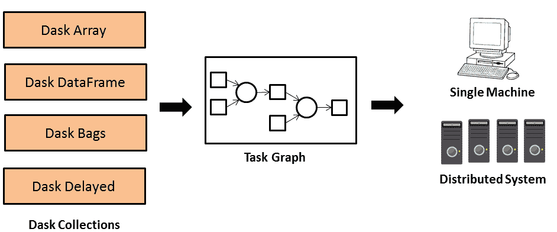
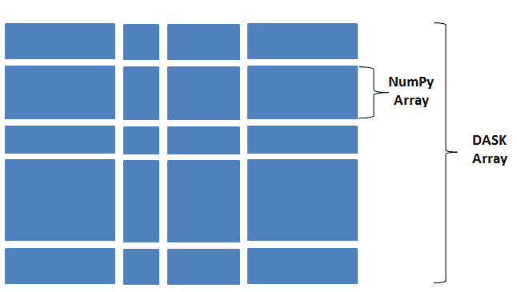
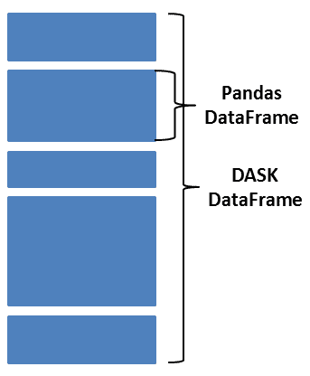
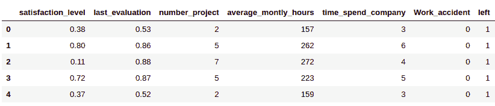
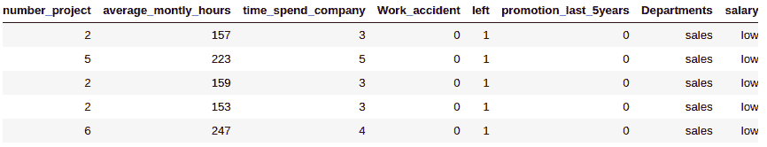
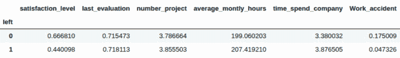
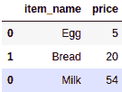
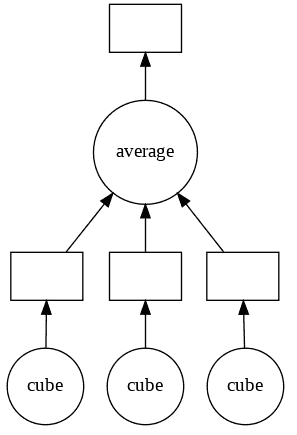
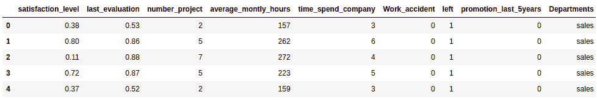
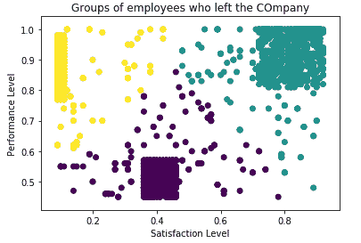

# 第十五章：使用 Dask 进行并行计算

Dask 是处理数据并行方式的最简单方法之一。这个平台适合那些在大数据集上挣扎的 pandas 爱好者。Dask 提供类似 Hadoop 和 Spark 的可扩展性，同时具备 Airflow 和 Luigi 提供的灵活性。Dask 可以用来处理无法放入 RAM 中的 pandas 数据框和 NumPy 数组。它将这些数据结构拆分并进行并行处理，同时对代码的修改最小化。它利用笔记本电脑的计算能力，并可以本地运行。我们也可以像部署 Python 应用一样在大规模分布式系统上部署 Dask。Dask 可以并行执行数据，并减少处理时间。它还可以在不迁移到更大或分布式环境的情况下，扩展工作站的计算能力。

本章的主要目标是学习如何使用 Dask 在大规模数据集上进行灵活的并行计算。该平台提供三种并行执行的数据类型：Dask 数组、Dask 数据框和 Dask 包。Dask 数组类似于 NumPy 数组，而 Dask 数据框则类似于 pandas 数据框。两者都可以并行执行数据。Dask 包是 Python 对象的封装器，使它们能够同时执行操作。本章还将介绍 Dask Delayed，这是一个将代码并行化的概念。Dask 还提供了数据预处理和机器学习模型开发的并行模式。

在本章中，我们将涵盖以下主题：

+   使用 Dask 进行并行计算

+   Dask 数据类型

+   Dask Delayed

+   大规模数据预处理

+   大规模机器学习

让我们开始吧！

# 使用 Dask 进行并行计算

Python 是数据专业人员中最流行的编程语言之一。Python 的数据科学库，如 Numpy、Pandas、Scipy 和 Scikit-learn，可以顺序地执行数据科学任务。然而，对于大数据集，这些库在处理时会变得非常缓慢，因为它们无法在单台机器上进行扩展。这时，Dask 就派上了用场。Dask 帮助数据专业人员处理超过单台机器 RAM 大小的数据集。Dask 利用处理器的多个核心，或者将其作为分布式计算环境使用。Dask 具有以下特点：

+   它熟悉现有的 Python 库

+   它提供灵活的任务调度

+   它为并行计算提供了单机和分布式环境

+   它执行快速操作，具有较低的延迟和开销

+   它可以实现横向扩展和缩减

Dask 提供了与 pandas、NumPy 和 Scikit-learn 相似的概念，这使得它更容易学习。它是一个开源的并行计算 Python 库，运行在 pandas、NumPy 和 Scikit-learn 之上，可以跨多个 CPU 核心或多个系统运行。例如，如果一台笔记本电脑有四核处理器，Dask 就会使用 4 个核心来处理数据。如果数据无法全部装入内存，它会在处理之前将数据分割成多个块。Dask 扩展了 pandas 和 NumPy 的能力，用来处理适中的大数据集。让我们通过以下图表了解 Dask 如何并行执行操作：



Dask 创建一个任务图来并行执行程序。在任务图中，节点表示任务，节点之间的边表示一个任务对另一个任务的依赖关系。

让我们在本地系统上安装 Dask 库。默认情况下，Anaconda 已经安装了 Dask，但如果你想重新安装或更新 Dask，可以使用以下命令：

```py
conda install dask
```

我们也可以使用`pip`命令来安装它，如下所示：

```py
pip install dask
```

有了这些，我们已经学会了如何安装 `dask` 库以实现并行和快速执行。现在，让我们来看看 Dask 库的核心数据类型。

# Dask 数据类型

在计算机编程中，数据类型是编写任何功能的基本构建块。它们帮助我们处理不同类型的变量。数据类型是存储在变量中的值的种类。数据类型可以是基本数据类型和次级数据类型。

基本数据类型是像 int、float 和 char 这样的基本数据类型，而次级数据类型是通过基本数据类型开发的，如列表、数组、字符串和数据框。Dask 提供了三种用于并行操作的数据结构：数据框、袋和数组。这些数据结构将数据分割成多个分区，并将它们分配到集群中的多个节点。Dask 数据框是多个小的 pandas 数据框的组合，它的操作方式类似。Dask 数组类似于 NumPy 数组，并支持 NumPy 的所有操作。最后，Dask 袋用于处理大型 Python 对象。

现在，到了探索这些数据类型的时候了。我们从 Dask 数组开始。

## Dask 数组

Dask 数组是 NumPy n 维数组的抽象，通过并行处理并分割成多个子数组。这些小数组可以存储在本地或分布式远程机器上。Dask 数组通过利用系统中所有可用的核心来计算大型数组。它们可以应用于统计、优化、生物信息学、商业领域、环境科学等多个领域。它们还支持大量的 NumPy 操作，如算术和标量运算、聚合操作、矩阵和线性代数运算。然而，它们不支持未知形状。此外，`tolist`和`sort`操作在并行执行时较为困难。让我们通过以下图示来了解 Dask 数组如何将数据分解成 NumPy 数组并并行执行：



如我们所见，有多个形状不同的块，这些块都表示 NumPy 数组。这些数组形成了一个 Dask 数组，并可以在多个机器上执行。让我们用 Dask 创建一个数组：

```py
# import Dask Array
import dask.array as da

# Create Dask Array using arange() function and generate values from 0 to 17
a = da.arange(18, chunks=4)

# Compute the array
a.compute()
```

这将产生以下输出：

```py
array([ 0, 1, 2, 3, 4, 5, 6, 7, 8, 9, 10, 11, 12, 13, 14, 15, 16,17])
```

在前面的例子中，我们使用了`compute()`函数来获取最终输出。`da.arange()`函数只会创建计算图，而`compute()`函数用于执行该图。我们使用`da.arange()`函数生成了 18 个值，块大小为 4。我们也来检查一下每个分区中的块：

```py
# Check the chunk size
a.chunks

```

这将产生以下输出：

```py
((4, 4, 4, 4, 2),)
```

在前面的例子中，一个包含 18 个值的数组被分成了五个部分，每个部分的大小为 4，其中前四个部分各包含 4 个值，最后一个部分包含 2 个值。

## Dask DataFrame

Dask DataFrame 是 pandas DataFrame 的抽象。它们是并行处理的，并分割成多个较小的 pandas DataFrame，如下图所示：



这些小的 DataFrame 可以存储在本地或分布式远程机器上。Dask DataFrame 通过利用系统中所有可用的核心来计算大型 DataFrame。它们通过索引来协调 DataFrame，并支持标准的 pandas 操作，如`groupby`、`join`和`时间序列`。与在索引操作中使用`set_index()`和`join()`相比，Dask DataFrame 在元素级、行级、`isin()`和日期操作上执行速度更快。现在，让我们来测试一下 Dask 的性能或执行速度：

```py
# Read csv file using pandas
import pandas as pd
%time temp = pd.read_csv("HR_comma_sep.csv")
```

这将产生以下输出：

```py
CPU times: user 17.1 ms, sys: 8.34 ms, total: 25.4 ms

Wall time: 36.3 ms
```

在前面的代码中，我们使用 pandas 的`read_csv()`函数测试了文件的读取时间。现在，让我们测试 Dask 的`read_csv()`函数的读取时间：

```py
# Read csv file using Dask

import dask.dataframe as dd

%time df = dd.read_csv("HR_comma_sep.csv")
```

这将产生以下输出：

```py
CPU times: user 18.8 ms, sys: 5.08 ms, total: 23.9 ms

Wall time: 25.8 ms
```

在这两个例子中，我们可以看到，使用 Dask 的`read_csv()`函数时，数据读取的执行时间有所减少。

### DataFrame 索引

Dask DataFrame 支持两种类型的索引：基于标签的索引和基于位置的索引。Dask 索引的主要问题是它不维护分区信息。这意味着执行行索引很困难；只可能进行列索引。`DataFrame.iloc` 仅支持基于整数的索引，而 `DataFrame.loc` 支持基于标签的索引。`DataFrame.iloc` 只能选择列。

让我们对 Dask DataFrame 执行这些索引操作：

1.  首先，我们必须创建一个 DataFrame 并执行列索引：

```py
# Import Dask and Pandas DataFrame
import dask.dataframe as dd
import pandas as pd

# Create Pandas DataFrame
df = pd.DataFrame({"P": [10, 20, 30], "Q": [40, 50, 60]},
index=['p', 'q', 'r'])

# Create Dask DataFrame
ddf = dd.from_pandas(df, npartitions=2)

# Check top records
ddf.head()
```

这将产生以下输出：

```py
P Q

p 10 40

q 20 50

r 30 60
```

在上面的示例中，我们创建了一个 pandas DataFrame（具有 `p`、`q` 和 `r` 索引，以及 `P` 和 `Q` 列），并将其转换为 Dask DataFrame。

1.  在 Dask 中，列选择过程与我们在 pandas 中的操作类似。让我们在 Dask DataFrame 中选择单列：

```py
# Single Column Selection
ddf['P']
```

这将产生以下输出：

```py
Dask Series Structure:

npartitions=1

p int64

r ...
Name: P, dtype: int64
Dask Name: getitem, 2 tasks
```

在上面的代码中，我们通过传递列名选择了单个列。要选择多个列，我们需要传递列名的列表。

1.  让我们在 Dask DataFrame 中选择多列：

```py
# Multiple Column Selection
ddf[['Q', 'P']]
```

这将产生以下输出：

```py

Dask DataFrame Structure:

Q P

npartitions=1

p int64 int64

r ... ...

Dask Name: getitem, 2 tasks
```

在这里，我们从可用的列列表中选择了两列。

1.  现在，让我们创建一个具有整数索引的 DataFrame：

```py
# Import Dask and Pandas DataFrame
import dask.dataframe as dd
import pandas as pd

# Create Pandas DataFrame
df = pd.DataFrame({"X": [11, 12, 13], "Y": [41, 51, 61]})

# Create Dask DataFrame
ddf = dd.from_pandas(df, npartitions=2)

# Check top records
ddf.head()
```

这将产生以下输出：

```py
X Y

0 11 41

1 12 51

2 13 61
```

在上面的代码中，我们创建了一个 pandas DataFrame，并使用 `from_pandas()` 函数将其转换为 Dask DataFrame。

1.  让我们使用基于位置的整数索引选择所需的列：

```py
ddf.iloc[:, [1, 0]].compute()
```

这将产生以下输出：

```py
Y X
0 41 11

1 51 12

2 61 13
```

在上面的代码中，我们使用 `iloc` 交换了列的位置，同时使用了基于位置的整数索引。

1.  如果我们尝试选择所有行，我们会遇到 `NotImplementedError` 错误，如下所示：

```py
ddf.iloc[0:4, [1, 0]].compute()
```

这将产生以下输出：

```py
NotImplementedError: 'DataFrame.iloc' only supports selecting columns. It must be used like 'df.iloc[:, column_indexer]'.
```

在上面的代码块中，我们可以看到 `DataFrame.iloc` 仅支持选择列。

### 过滤数据

我们可以像对待 pandas DataFrame 一样过滤 Dask DataFrame 中的数据。让我们看一个例子：

```py
# Import Dask DataFrame
import dask.dataframe as dd

# Read CSV file
ddf = dd.read_csv('HR_comma_sep.csv')

# See top 5 records
ddf.head(5)

```

这将产生以下输出：



在上面的代码中，我们使用 `read_csv()` 函数将人力资源 CSV 文件读入 Dask DataFrame。此输出只显示了一些列。然而，当你自己运行笔记本时，你将能够看到所有可用的列。让我们过滤数据集中低薪的员工：

```py
# Filter employee with low salary
ddf2 = ddf[ddf.salary == 'low']

ddf2.compute().head()
```

这将产生以下输出：



在上面的代码中，我们通过条件将低薪员工筛选到括号内。

### Groupby

`groupby` 操作用于聚合相似的项目。首先，它根据值拆分数据，找到相似值的聚合，然后将聚合结果合并。这可以在以下代码中看到：

```py
# Find the average values of all the columns for employee left or stayed
ddf.groupby('left').mean().compute()
```

这将产生以下输出：



在前面的示例中，我们根据左侧列（显示了员工是留下还是离开公司）对数据进行了分组，并按均值进行了聚合。

### 将 pandas DataFrame 转换为 Dask DataFrame

Dask DataFrames 是基于 pandas DataFrames 实现的。对于数据分析师来说，学习如何将 Dask DataFrame 转换为 pandas DataFrame 是必要的。请查看以下代码：

```py
# Import Dask DataFrame
from dask import dataframe as dd

# Convert pandas dataframe to dask dataframe
ddf = dd.from_pandas(pd_df,chunksize=4)

type(ddf)
```

这将导致以下输出：

```py
dask.dataframe.core.DataFrame
```

在这里，我们使用`from_pandas()`方法将一个 pandas DataFrame 转换为 Dask DataFrame。

### 将 Dask DataFrame 转换为 pandas DataFrame

在前一小节中，我们将一个 pandas DataFrame 转换为 Dask DataFrame。同样，我们也可以使用`compute()`方法将 Dask DataFrame 转换为 pandas DataFrame，如下所示：

```py
# Convert dask DataFrame to pandas DataFrame
pd_df = df.compute()

type(pd_df)
```

这将导致以下输出：

```py
pandas.core.frame.DataFrame
```

现在，让我们学习另一个重要的主题：Dask Bags。

## Dask Bags

Dask Bag 是对通用 Python 对象的抽象。它通过 Python 迭代器在较小的 Python 对象的并行接口中执行`map`、`filter`、`fold`和`groupby`操作。其执行方式类似于 PyToolz 或 PySpark RDD。Dask Bags 更适合用于非结构化和半结构化数据集，如文本、JSON 和日志文件。它们通过多进程计算来加速处理，但在工作节点间通信方面表现不佳。Bags 是不可变的数据结构，不能更改，并且与 Dask Arrays 和 DataFrames 相比速度较慢。Bags 在执行`groupby`操作时也较慢，因此推荐使用`foldby`代替`groupby`。

现在，让我们创建各种 Dask Bag 对象并对它们执行操作。

### 使用 Python 可迭代项创建 Dask Bag

让我们使用 Python 可迭代项创建一些 Dask Bag 对象：

```py
# Import dask bag
import dask.bag as db

# Create a bag of list items
items_bag = db.from_sequence([1, 2, 3, 4, 5, 6, 7, 8, 9, 10], npartitions=3)

# Take initial two items
items_bag.take(2)
```

这将导致以下输出：

```py
(1, 2)
```

在前面的代码中，我们使用`from_sequence()`方法创建了一个列表项的 bag。`from_Sequence()`方法接受一个列表并将其放入`npartitions`（分区数）。让我们从列表中过滤出奇数：

```py
# Filter the bag of list items
items_square=items_bag.filter(lambda x: x if x % 2 != 0 else None)

# Compute the results
items_square.compute()
```

这将导致以下输出：

```py
[1, 3, 5, 7, 9]
```

在前面的代码中，我们使用`filter()`方法从列表的 bag 中过滤出了奇数。现在，让我们使用`map`函数将 bag 中的每个项平方：

```py
# Square the bag of list items
items_square=items_b.map(lambda x: x**2)

# Compute the results
items_square.compute()
```

这将导致以下输出：

```py
[1, 4, 9, 16, 25, 36, 49, 64, 81, 100]
```

在前面的代码中，我们使用`map()`函数对 bag 中的项进行了映射。我们将这些项映射到它们的平方值。

### 使用文本文件创建 Dask Bag

我们可以使用`read_text()`方法，通过文本文件创建一个 Dask Bag，代码如下：

```py
# Import dask bag
import dask.bag as db

# Create a bag of text file
text = db.read_text('sample.txt')

# Show initial 2 items from text
text.take(2)
```

这将导致以下输出：

```py
('Hi! how are you? \n', '\n')
```

在前面的代码中，我们使用`read_text()`方法将文本文件读取到一个`dask bag`对象中。这让我们能够展示 Dask Bag 中的前两个项目。

### 将 Dask Bag 存储到文本文件中

让我们将 Dask Bag 存储到文本文件中：

```py
# Convert dask bag object into text file
text.to_textfiles('/path/to/data/*.text.gz')
```

这将导致以下输出：

```py
['/path/to/data/0.text.gz']
```

在前面的代码中，`to_textfiles()`将`bag`对象转换为一个文本文件。

### 将 Dask Bag 存储到 DataFrame 中

让我们将 Dask Bag 存储到 DataFrame 中：

```py
# Import dask bag
import dask.bag as db

# Create a bag of dictionary items
dict_bag = db.from_sequence([{'item_name': 'Egg', 'price': 5},
{'item_name': 'Bread', 'price': 20},
{'item_name': 'Milk', 'price': 54}],
npartitions=2)

# Convert bag object into dataframe
df = dict_bag.to_dataframe()

# Execute the graph results
df.compute()
```

这将产生以下输出：



在前面的示例中，我们创建了一个包含字典项的 Dask Bag，并使用 `to_dataframe()` 方法将其转换为 Dask DataFrame。在下一节中，我们将讨论 Dask 延迟。

# Dask 延迟

Dask 延迟是一种用于并行化代码的方法。它可以延迟任务图中的依赖函数调用，并在提高性能的同时为用户提供对并行进程的完全控制。它的惰性计算帮助我们控制函数的执行。然而，这与并行执行中函数的执行时机有所不同。

让我们通过一个示例来理解 Dask 延迟的概念：

```py
# Import dask delayed and compute
from dask import delayed, compute

# Create delayed function
@delayed
def cube(item):
    return item ** 3

# Create delayed function
@delayed
def average(items):
    return sum(items)/len(items)

# create a list
item_list = [2, 3, 4]

# Compute cube of given item list
cube_list= [cube(i) for i in item_list]

# Compute average of cube_list
computation_graph = average(cube_list)

# Compute the results
computation_graph.compute()
```

这将产生以下输出：

```py
33.0
```

在前面的示例中，`cube` 和 `average` 两个方法都被 `@dask.delayed` 注解。创建了一个包含三个数字的列表，并计算了每个值的立方。在计算完列表值的立方后，我们计算了所有值的平均值。所有这些操作都是惰性计算，只有当程序员需要输出时，计算才会执行，执行流会被存储在计算图中。我们通过 `compute()` 方法来执行这一操作。在这里，所有的立方操作都将并行执行。

现在，我们将可视化计算图。然而，在此之前，我们需要安装 Graphviz 编辑器。

在 Windows 上，我们可以使用 `pip` 安装 Graphviz。我们还必须在环境变量中设置路径：

```py
 pip install graphviz
```

在 Mac 上，我们可以使用 `brew` 安装，如下所示：

```py
brew install graphviz
```

在 Ubuntu 上，我们需要通过 `sudo apt-get` 命令在终端中安装：

```py
sudo apt-get install graphviz
```

现在，让我们可视化计算图：

```py
# Compute the results
computation_graph.visualize()
```

这将产生以下输出：



在前面的示例中，我们使用 `visualize()` 方法打印了一个计算图。在该图中，所有的立方体操作都是并行执行的，并且它们的结果被 `average()` 函数消费。

# 大规模数据预处理

Dask 预处理提供了 scikit-learn 功能，如缩放器、编码器和训练/测试拆分。这些预处理功能与 Dask DataFrame 和数组配合良好，因为它们可以并行地拟合和转换数据。在本节中，我们将讨论特征缩放和特征编码。

## Dask 中的特征缩放

正如我们在第七章 *清理混乱数据* 中讨论的，特征缩放，也叫做特征归一化，用于将特征缩放到相同的水平。它可以处理不同列范围和单位的问题。Dask 还提供了具有并行执行能力的缩放方法。它使用了 scikit-learn 提供的大多数方法：

| **Scaler** | **描述** |
| --- | --- |
| MinMaxScaler | 通过将每个特征缩放到给定范围来转换特征 |
| RobustScaler | 使用对异常值稳健的统计方法进行特征缩放 |
| StandardScaler | 通过去除均值并将特征缩放到单位方差来标准化特征 |

让我们对人力资源数据集中的`last_evaluation`（员工表现得分）列进行缩放：

```py
# Import Dask DataFrame
import dask.dataframe as dd

# Read CSV file
ddf = dd.read_csv('HR_comma_sep.csv')

# See top 5 records
ddf.head(5)
```

这将产生以下输出：


在前面的代码中，我们使用`read_csv()`函数将人力资源 CSV 文件读取到 Dask DataFrame 中。前面的输出仅显示了部分可用列。然而，当你自己运行笔记本时，你将能够看到数据集中的所有列。现在，让我们对`last_evalaution`列（最后评估的表现得分）进行缩放：

```py
# Import MinMaxScaler
from sklearn.preprocessing import MinMaxScaler

# Instantiate the MinMaxScaler Object
scaler = MinMaxScaler(feature_range=(0, 100))

# Fit the data on Scaler
scaler.fit(ddf[['last_evaluation']])

# Transform the data
performance_score=scaler.transform(ddf[['last_evaluation']])

# Let's see the scaled performance score
performance_score
```

这将产生以下输出：

```py
array([[26.5625],

[78.125 ],

[81.25 ],

...,

[26.5625],

[93.75 ],

[25\. ]])
```

在前面的示例中，我们对`last_evaluation`（最后评估的表现得分）列进行了缩放。我们将其从 0-1 的范围缩放到 0-100 的范围。接下来，我们将看一下 Dask 中的特征编码。

## Dask 中的特征编码

正如我们在第七章*清理杂乱数据*中讨论的那样，特征编码是处理类别特征的一个非常有用的技术。Dask 还提供了具有并行执行能力的编码方法。它使用了 scikit-learn 提供的大多数方法：

| **编码器** | **描述** |
| --- | --- |
| LabelEncoder | 将标签编码为介于 0 和 1 之间的值，且该值小于可用类别的数量。 |
| OneHotEncoder | 将类别整数特征编码为独热编码。 |
| OrdinalEncoder | 将类别列编码为序数变量。 |

让我们尝试使用这些方法：

```py
# Import Dask DataFrame
import dask.dataframe as dd

# Read CSV file
ddf = dd.read_csv('HR_comma_sep.csv')

# See top 5 records
ddf.head(5)
```

这将产生以下输出：


在前面的代码中，我们使用`read_csv()`函数将人力资源 CSV 文件读取到 Dask DataFrame 中。前面的输出仅显示了部分可用列。然而，当你自己运行笔记本时，你将能够看到数据集中的所有列。现在，让我们对`last_evalaution`列（最后评估的表现得分）进行缩放：

```py
# Import Onehot Encoder
from dask_ml.preprocessing import Categorizer
from dask_ml.preprocessing import OneHotEncoder
from sklearn.pipeline import make_pipeline

# Create pipeline with Categorizer and OneHotEncoder
pipe = make_pipeline(Categorizer(), OneHotEncoder())

# Fit and transform the Categorizer and OneHotEncoder
pipe.fit(ddf[['salary',]])
result=pipe.transform(ddf[['salary',]])

# See top 5 records
result.head()
```

这将产生以下输出：

|  | **salary_low** | **salary_medium** | **salary_high** |
| --- | --- | --- | --- |
| **0** | 1.0 | 0.0 | 0.0 |
| **1** | 0.0 | 1.0 | 0.0 |
| **2** | 0.0 | 1.0 | 0.0 |
| **3** | 1.0 | 0.0 | 0.0 |
| **4** | 1.0 | 0.0 | 0.0 |

在前面的示例中，`scikit-learn`管道是通过`Categorizer()`和`OneHotEncoder()`创建的。然后，使用`fit()`和`transform()`方法对人力资源数据的薪资列进行了编码。请注意，分类器将把 DataFrame 的列转换为类别数据类型。

类似地，我们也可以使用序数编码器对薪资列进行编码。让我们来看一个例子：

```py
# Import Onehot Encoder
from dask_ml.preprocessing import Categorizer
from dask_ml.preprocessing import OrdinalEncoder
from sklearn.pipeline import make_pipeline

# Create pipeline with Categorizer and OrdinalEncoder
pipe = make_pipeline(Categorizer(), OrdinalEncoder())

# Fit and transform the Categorizer and OneHotEncoder
pipe.fit(ddf[['salary',]])
result=pipe.transform(ddf[['salary',]])

# Let's see encoded results
result.head()
```

这将产生以下输出：

```py
salary

0 0

1 1

2 1

3 0

4 0
```

在前面的示例中，scikit-learn 管道是通过`Categorizer()`和`OrdinalEncoder()`创建的。然后，使用`fit()`和`transform()`方法对人力资源数据的薪资列进行了编码。请注意，分类器将把 DataFrame 的列转换为类别数据类型。

# 大规模机器学习

Dask 提供了 Dask-ML 服务，用于使用 Python 进行大规模机器学习操作。Dask-ML 能够缩短中型数据集的模型训练时间，并进行超参数调优实验。它为机器学习操作提供了类似于 scikit-learn 的算法。

我们可以通过三种不同方式扩展 scikit-learn：使用 `joblib` 并通过随机森林和支持向量机（SVC）并行化 scikit-learn；使用 Dask Arrays 重新实现算法，采用广义线性模型、预处理和聚类；并将其与分布式库如 XGBoost 和 Tensorflow 配对使用。

让我们首先来看一下使用 scikit-learn 进行并行计算。

## 使用 scikit-learn 进行并行计算

要在单个 CPU 上使用 scikit-learn 进行并行计算，我们需要使用 `joblib`。这使得 scikit-learn 操作可以并行计算。`joblib` 库在 Python 作业上执行并行化。Dask 可以帮助我们在多个 scikit-learn 估计器上执行并行操作。让我们来看看：

1.  首先，我们需要读取数据集。我们可以像这样使用 pandas DataFrame 加载数据集：

```py
# Import Dask DataFrame
import pandas as pd

# Read CSV file
df = pd.read_csv('HR_comma_sep.csv')

# See top 5 records
df.head(5)
```

这会生成以下输出：



在前面的代码中，我们通过 `read_csv()` 函数将人力资源 CSV 文件读入 Dask DataFrame。前面的输出仅显示了部分可用的列。然而，当你自己运行该笔记本时，你将能看到数据集中的所有列。现在，让我们对 `last_evalaution` 列（最后评估的表现分数）进行缩放。

1.  接下来，我们需要选择因变量和自变量。为此，选择列并将数据分为因变量和自变量，如下所示：

```py
# select the feature and target columns
data=df[['satisfaction_level', 'last_evaluation']]

label=df['left']
```

1.  创建一个调度程序，并并行生成模型。导入 `dask.distributed` 客户端以在本地计算机上创建调度程序和工作者：

```py
# Import client
from dask.distributed import Client

# Instantiate the Client
client = Client()
```

1.  下一步是使用 `sklearn.externals.joblib` 创建并行后端，并编写正常的 `scikit-learn` 代码：

```py
# import dask_ml.joblib
from sklearn.externals.joblib import parallel_backend

with parallel_backend('dask'):
    # Write normal scikit-learn code here
    from sklearn.ensemble import RandomForestClassifier
    from sklearn.metrics import accuracy_score
    from sklearn.model_selection import train_test_split

    # Divide the data into two parts: training and testing set
    X_train, X_test, y_train, y_test = train_test_split(data,label,
    test_size=0.2,
    random_state=0)

    # Instantiate RandomForest Model
    model = RandomForestClassifier()

    # Fit the model
    model.fit(X_train,y_train)

    # Predict the classes
    y_pred = model.predict(X_test)

    # Find model accuracy
    print("Accuracy:",accuracy_score(y_test, y_pred))
```

这会生成以下输出：

```py
Accuracy: 0.92
```

前面并行生成的随机森林模型给出了 92% 的准确率，非常好。

## 为 Dask 重新实现机器学习算法

一些机器学习算法已由 Dask 开发团队使用 Dask Arrays 和 DataFrames 重新实现。以下是已重新实现的算法：

+   线性机器学习模型，如线性回归和逻辑回归

+   使用缩放器和编码器进行预处理

+   无监督算法，如 k-means 聚类和谱聚类

在以下小节中，我们将构建一个逻辑回归模型，并对数据集进行聚类。

### 逻辑回归

让我们使用逻辑回归构建一个分类器：

1.  将数据集加载到 Dask DataFrame 中，如下所示：

```py
# Read CSV file using Dask
import dask.dataframe as dd

# Read Human Resource Data
ddf = dd.read_csv("HR_comma_sep.csv")

# Let's see top 5 records
ddf.head()
```

这会生成以下输出：


在之前的代码中，我们使用`read_csv()`函数将人力资源 CSV 文件读取到 Dask DataFrame 中。之前的输出只显示了可用的部分列。然而，当你自己运行笔记本时，你将能够看到数据集中所有的列。现在，让我们对`last_evalaution`列（最后评估的性能得分）进行缩放。

1.  接下来，选择所需的列进行分类，并将其划分为依赖变量和独立变量：

```py
data=ddf[['satisfaction_level','last_evaluation']].to_dask_array(lengths=True)

label=ddf['left'].to_dask_array(lengths=True)
```

1.  现在，让我们创建一个`LogisticRegression`模型。首先，导入`LogisticRegression`和`train_test_split`。导入所需的库后，将数据集分成两部分，即训练数据集和测试数据集：

```py
# Import Dask based LogisticRegression
from dask_ml.linear_model import LogisticRegression

# Import Dask based train_test_split
from dask_ml.model_selection import train_test_split

# Split data into training and testing set
X_train, X_test, y_train, y_test = train_test_split(data, label)
```

1.  实例化模型并将其拟合到训练数据集上。现在，你可以预测测试数据并计算模型的准确性，如下所示：

```py
# Create logistic regression model
model = LogisticRegression()

# Fit the model
model.fit(X_train,y_train)

# Predict the classes
y_pred = model.predict(X_test)

# Find model accuracy
print("Accuracy:",accuracy_score(y_test, y_pred))

```

这将产生以下输出：

```py
Accuracy: 0.7753333333333333
```

如我们所见，模型提供的准确率为 77.5%，这被认为是一个不错的结果。

### 聚类

Dask 的开发人员还重新实现了各种 k-means 聚类算法。让我们使用 Dask 进行聚类：

1.  将人力资源数据读取到 Dask DataFrame 中，如下所示：

```py
# Read CSV file using Dask
import dask.dataframe as dd

# Read Human Resource Data
ddf = dd.read_csv("HR_comma_sep.csv")

# Let's see top 5 records
ddf.head()
```

这将产生以下输出：


在之前的代码中，我们使用`read_csv()`函数将人力资源 CSV 文件读取到 Dask DataFrame 中。之前的输出只显示了可用的部分列。然而，当你自己运行笔记本时，你将能够看到数据集中所有的列。现在，让我们对`last_evalaution`列（最后评估的性能得分）进行缩放。

1.  接下来，选择所需的列进行 k-means 聚类。我们在这里选择了`satisfaction_level`和`last_evaluation`列：

```py
data=ddf[['satisfaction_level', 'last_evaluation']].to_dask_array(lengths=True)
```

1.  现在，让我们创建一个 k-means 聚类模型。首先，导入 k-means。导入所需的库后，将其拟合到数据集上并获取必要的标签。我们可以使用`compute()`方法找到这些标签：

```py
# Import Dask based Kmeans
from dask_ml.cluster import KMeans

# Create the Kmeans model
model=KMeans(n_clusters=3)

# Fit the model
model.fit(data)

# Predict the classes
label=model.labels_

# Compute the results
label.compute()
```

这将产生以下输出：

```py
array([0, 1, 2, ..., 0, 2, 0], dtype=int32)
```

在之前的代码中，我们创建了一个包含三个聚类的 k-means 模型，拟合了模型，并预测了聚类标签。

1.  现在，我们将使用`matplotlib`库来可视化 k-means 的结果：

```py
# Import matplotlib.pyplot
import matplotlib.pyplot as plt

# Prepare x,y and cluster_labels
x=data[:,0].compute()
y=data[:,1].compute()
cluster_labels=label.compute()

# Draw scatter plot
plt.scatter(x,y, c=cluster_labels)

# Add label on X-axis
plt.xlabel('Satisfaction Level')

# Add label on X-axis
plt.ylabel('Performance Level')

# Add a title to the graph
plt.title('Groups of employees who left the Company')

# Show the plot
plt.show()
```

这将产生以下输出：



在之前的代码中，我们使用`matplotlib.pyplot`对聚类进行了可视化。在这里，我们将满意度得分绘制在 X 轴上，性能得分绘制在 Y 轴上，并通过使用不同的颜色来区分聚类。

# 总结

在本章中，我们重点讲解了如何在基础数据科学 Python 库（如 pandas、Numpy 和 scikit-learn）上执行并行计算。Dask 为 DataFrame 和数组提供了完整的抽象，可以在单核/多核机器或集群中的多个节点上处理中等规模的数据集。

我们从本章开始时，先了解了 Dask 的数据类型，如 DataFrame、数组和 Bag。接着，我们重点介绍了 Dask Delayed、预处理以及在并行环境下的机器学习算法。

这是本书的最后一章，意味着我们的学习旅程到此为止。我们重点介绍了用于数据分析和机器学习的核心 Python 库，如 pandas、Numpy、Scipy 和 scikit-learn。我们还关注了可以用于文本分析、图像分析和并行计算的 Python 库，如 NLTK、spaCy、OpenCV 和 Dask。当然，你的学习过程不需要止步于此；继续学习新知识并关注最新的变化。尝试根据你的业务或客户需求探索和修改代码。你也可以开始私人或个人项目来进行学习。如果你无法决定要开始什么样的项目，可以参加 Kaggle 竞赛，访问[`www.kaggle.com/`](http://www.kaggle.com/)等平台！
