# 二、创建有吸引力的数据可视化

在本章中，我们将介绍:

*   绘制安斯科姆的四重奏
*   选择海鸟调色板
*   选择 matplotlib 颜色映射
*   与 IPython 笔记本小部件交互
*   查看散点图矩阵
*   通过 mpld3 可视化 d3.js
*   创建热图
*   将箱式图和核密度图与小提琴图相结合
*   用蜂巢图可视化网络图
*   显示地理地图
*   使用类似 ggplot2 的图
*   用影响图突出显示数据点

# 简介

数据分析与其说是一门科学，不如说是一门艺术。创造有吸引力的视觉效果是这门艺术不可或缺的一部分。显然，一个人觉得有吸引力的东西，其他人可能会觉得完全不可接受。就像在艺术中一样，在快速发展的数据分析世界中，观点和品味会随着时间而变化；然而，原则上，没有人是绝对正确或错误的。作为数据艺术家和皮托尼斯塔斯，我们可以从几个库中进行选择，我将介绍 matplotlib、seaborn、Bokeh 和 ggplot。我们在本章中使用的一些软件包的安装说明已经包含在[第 1 章](01.html "Chapter 1. Laying the Foundation for Reproducible Data Analysis")、*为可再现数据分析奠定基础*中，因此我不再重复。我将为本章提供一个安装脚本(仅使用 pip 您甚至可以使用我在上一章中描述的 Docker 图像。我决定不把 Proj 制图库和 R 相关的库包括在图像中，因为它们的大小。所以对于本章涉及的两个食谱，你可能要做额外的工作。

# 描绘安斯科姆的四重奏

**安斯科姆的四重奏**是一个经典的例子，说明了为什么可视化数据很重要。四重奏由四个具有相似统计属性的数据集组成。每个数据集都有一系列的 *x* 值和从属的 *y* 值。我们将在 IPython 笔记本上列出这些指标。但是，如果绘制数据集，它们看起来会有惊人的不同。

## 怎么做...

对于此配方，您需要执行以下步骤:

1.  从以下进口开始:

    ```py
    import pandas as pd
    import seaborn as sns
    import matplotlib.pyplot as plt
    import matplotlib as mpl
    from dautil import report
    from dautil import plotting
    import numpy as np
    from tabulate import tabulate
    ```

2.  定义以下函数来计算数据集内`x`和`y`的平均值、方差和相关性，以及每个数据集线性拟合的斜率和截距:

    ```py
    df = sns.load_dataset("anscombe")

     agg = df.groupby('dataset')\
     .agg([np.mean, np.var])\
     .transpose()
        groups = df.groupby('dataset')

        corr = [g.corr()['x'][1] for _, g in groups]
        builder = report.DFBuilder(agg.columns)
        builder.row(corr)

        fits = [np.polyfit(g['x'], g['y'], 1) for _, g in groups]
        builder.row([f[0] for f in fits])
        builder.row([f[1] for f in fits])
        bottom = builder.build(['corr', 'slope', 'intercept'])

        return df, pd.concat((agg, bottom))
    ```

3.  下面的函数返回一个字符串，部分是 Markdown，部分是重组文本，部分是 HTML，因为核心 Markdown 不正式支持表:

    ```py
    def generate(table):
        writer = report.RSTWriter()
        writer.h1('Anscombe Statistics')
        writer.add(tabulate(table, tablefmt='html', floatfmt='.3f'))

        return writer.rst
    ```

4.  用 Seaborn `lmplot()`函数

    ```py
    def plot(df):
        sns.set(style="ticks")
        g = sns.lmplot(x="x", y="y", col="dataset", 
             hue="dataset", data=df,
             col_wrap=2, ci=None, palette="muted", size=4,
             scatter_kws={"s": 50, "alpha": 1})

        plotting.embellish(g.fig.axes)
    ```

    绘制数据和相应的线性拟合
5.  Display a table with statistics, as follows:

    ```py
    df, table = aggregate()
    from IPython.display import display_markdown
    display_markdown(generate(table), raw=True)
    ```

    下表显示了每个数据集几乎相同的统计数据(我修改了 IPython 配置文件中的`custom.css`文件以获得颜色):

    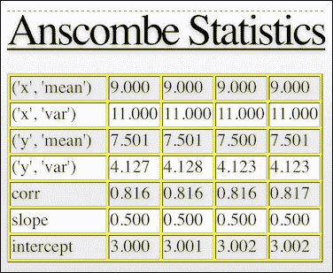

6.  以下行绘制数据集:

    ```py
    %matplotlib inline
    plot(df)
    ```

最终结果见下图:

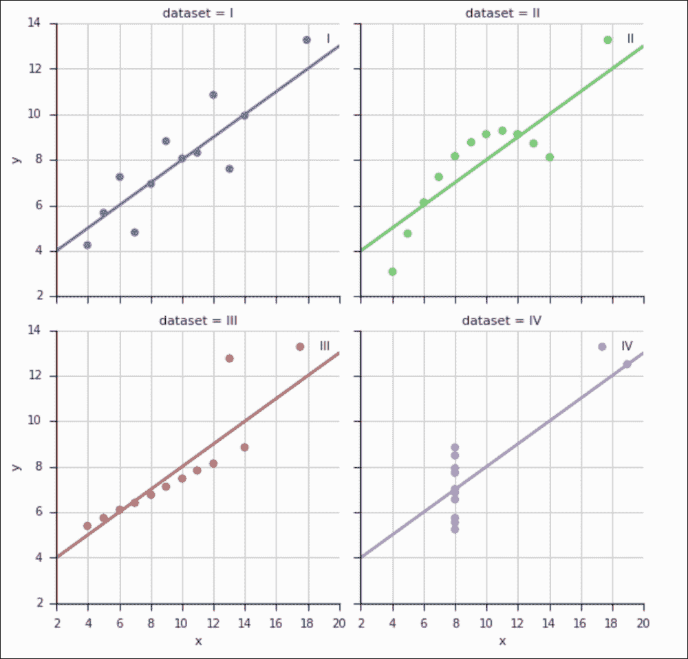

一张图胜过千言万语。源代码在本书代码包的`anscombe.ipynb`文件中。

## 另见

*   https://en.wikipedia.org/wiki/Anscombe%27s_quartet 的安斯科姆四重奏维基百科页面(2015 年 7 月检索)
*   [的`lmplot()`功能的](https://web.stanford.edu/~mwaskom/software/seaborn/generated/seaborn.lmplot.html)文档

# 选择海鸟调色板

Seaborn 调色板类似于 matplotlib 颜色图。颜色可以帮助您发现数据中的模式，并且是一个重要的可视化组件。Seaborn 有各种各样的调色板，我将在这个食谱中尝试可视化。

## 怎么做...

1.  进口如下:

    ```py
    import seaborn as sns
    import matplotlib.pyplot as plt
    import matplotlib as mpl
    import numpy as np
    from dautil import plotting
    ```

2.  使用以下有助于绘制调色板的功能:

    ```py
    def plot_palette(ax, plotter, pal, i, label, ncol=1):
        n = len(pal)
        x = np.linspace(0.0, 1.0, n)
        y = np.arange(n) + i * n
        ax.scatter(x, y, c=x, 
                    cmap=mpl.colors.ListedColormap(list(pal)), 
                    s=200)
        plotter.plot(x,y, label=label)
        handles, labels = ax.get_legend_handles_labels()
        ax.legend(loc='best', ncol=ncol, fontsize=18)
    ```

3.  **分类调色板**对分类数据很有用，例如，性别或血型。以下函数绘制了一些 Seaborn 分类调色板:

    ```py
    def plot_categorical_palettes(ax):
        palettes = ['deep', 'muted', 'pastel', 'bright', 'dark', 'colorblind']
        plotter = plotting.CyclePlotter(ax)
        ax.set_title('Categorical Palettes')

        for i, p in enumerate(palettes):
            pal = sns.color_palette(p)
         plot_palette(ax, plotter, pal, i, p, 4)
    ```

4.  **圆形颜色系统**通常使用 **HLS** ( **色相明度饱和度**)代替 **RGB** ( **红绿蓝**)颜色空间。如果你有很多类别，它们是有用的。以下功能使用 HSL 系统绘制调色板:

    ```py
    def plot_circular_palettes(ax):
        ax.set_title('Circular Palettes')
        plotter = plotting.CyclePlotter(ax)

        pal = sns.color_palette("hls", 6)
        plot_palette(ax, plotter, pal, 0, 'hls')

        sns.hls_palette(6, l=.3, s=.8)
        plot_palette(ax, plotter, pal, 1, 'hls l=.3 s=.8')

        pal = sns.color_palette("husl", 6)
        plot_palette(ax, plotter, pal, 2, 'husl')

        sns.husl_palette(6, l=.3, s=.8)
        plot_palette(ax, plotter, pal, 3, 'husl l=.3 s=.8')
    ```

5.  Seaborn 也有调色板，基于在线 ColorBrewer 工具([http://colorbrewer2.org](http://colorbrewer2.org)/)。如下图所示:

    ```py
    def plot_brewer_palettes(ax):
        ax.set_title('Brewer Palettes')
        plotter = plotting.CyclePlotter(ax)

        pal = sns.color_palette("Paired")
        plot_palette(ax, plotter, pal, 0, 'Paired')

        pal = sns.color_palette("Set2", 6)
        plot_palette(ax, plotter, pal, 1, 'Set2')
    ```

6.  **顺序调色板**对于大范围的数据很有用，例如，数量级不同的数据。使用以下函数绘制它们:

    ```py
    def plot_sequential_palettes(ax):
        ax.set_title('Sequential Palettes')
        plotter = plotting.CyclePlotter(ax)

        pal = sns.color_palette("Blues")
        plot_palette(ax, plotter, pal, 0, 'Blues')

        pal = sns.color_palette("BuGn_r")
        plot_palette(ax, plotter, pal, 1, 'BuGn_r')

        pal = sns.color_palette("GnBu_d")
        plot_palette(ax, plotter, pal, 2, 'GnBu_d')

        pal = sns.color_palette("cubehelix", 6)
        plot_palette(ax, plotter, pal, 3, 'cubehelix')
    ```

7.  下面几行调用我们定义的函数:

    ```py
    %matplotlib inline

    fig, axes = plt.subplots(2, 2, figsize=(16, 12))
    plot_categorical_palettes(axes[0][0])
    plot_circular_palettes(axes[0][1])
    plot_brewer_palettes(axes[1][0])
    plot_sequential_palettes(axes[1][1])
    plotting.hide_axes(axes)
    plt.tight_layout()
    ```

完整的代码可在本书的代码包中的`choosing_palettes.ipynb`文件中找到。最终结果见下图:

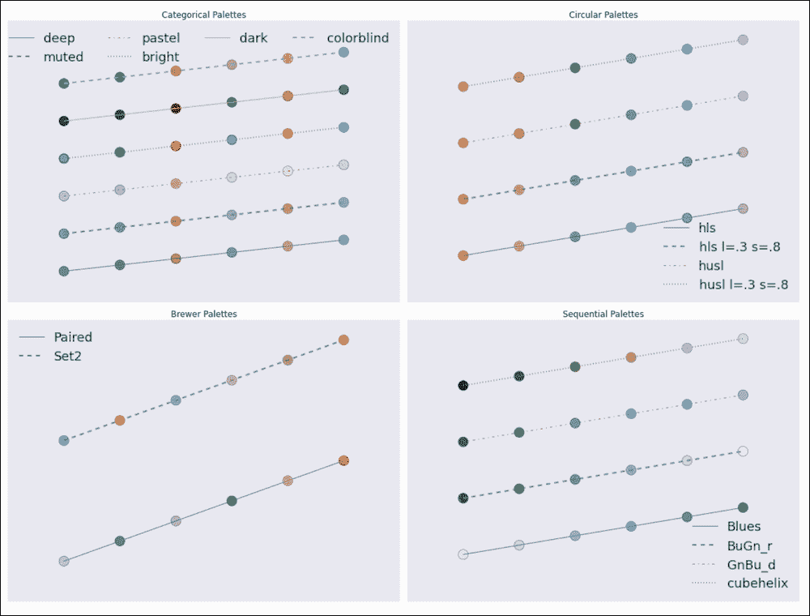

## 另见

*   位于[的【海鸟】调色板文档](https://web.stanford.edu/~mwaskom/software/seaborn/tutorial/color_palettes.html)

# 选择 matplotlib 颜色图

matplotlib 彩色地图最近受到了很多批评，因为它们可能会误导人；然而，在我看来，大多数彩色地图都很好。默认情况是在 matplotlib 2.0 中得到一个改造，正如在[http://matplotlib.org/style_changes.html](http://matplotlib.org/style_changes.html)宣布的那样(检索于 2015 年 7 月)。当然，有一些很好的论点不支持使用某些 matplotlib 颜色图，比如`jet`。在艺术中，就像在数据分析中一样，几乎没有什么是绝对真实的，所以我让你来决定。实际上，我认为重要的是考虑如何处理印刷出版物和各种类型的色盲。在这个食谱中，我设想了相对安全的带有彩条的彩色地图。这是 matplotlib 中许多颜色图的一小部分。

## 怎么做...

1.  进口情况如下:

    ```py
    import matplotlib.pyplot as plt
    import matplotlib as mpl
    from dautil import plotting
    ```

2.  使用以下代码绘制数据集:

    ```py
    fig, axes = plt.subplots(4, 4)
    cmaps = ['autumn', 'spring', 'summer', 'winter',
             'Reds', 'Blues', 'Greens', 'Purples',
             'Oranges', 'pink', 'Greys', 'gray',
             'binary', 'bone', 'hot', 'cool']

    for ax, cm in zip(axes.ravel(), cmaps):
        cmap = plt.cm.get_cmap(cm)
        cb = mpl.colorbar.ColorbarBase(ax, cmap=cmap, 
                                       orientation='horizontal')
        cb.set_label(cm)
        ax.xaxis.set_ticklabels([])

    plt.tight_layout()
    plt.show()
    ```

最终结果见下图:


笔记本在本书代码包的 `choosing_colormaps.ipynb`文件中。在这本书里，彩色地图被用在各种各样的可视化中。

## 另见

*   http://matplotlib.org/users/colormaps.html 相关的 matplotlib 文档(2015 年 7 月检索)

# 与 IPython 笔记本小部件交互

交互式 IPython 笔记本小部件在撰写本文时(2015 年 7 月)，是一项实验性功能。我，以及据我所知的许多其他人，都希望这一特征能够保留下来。简而言之，小部件可以让你像选择 HTML 表单一样选择值。这包括滑块、下拉框和复选框。如您所见，这些小部件非常便于可视化我在[第 1 章](01.html "Chapter 1. Laying the Foundation for Reproducible Data Analysis")、*中介绍的天气数据，为可再现数据分析*奠定基础。

## 怎么做...

1.  导入以下内容:

    ```py
    import seaborn as sns
    import numpy as np
    import pandas as pd
    import matplotlib.pyplot as plt
    from IPython.html.widgets import interact
    from dautil import data
    from dautil import ts
    ```

2.  加载数据并请求内联图:

    ```py
    %matplotlib inline
    df = data.Weather.load()
    ```

3.  定义以下显示气泡图的功能:

    ```py
    def plot_data(x='TEMP', y='RAIN', z='WIND_SPEED', f='A', size=10, cmap='Blues'):
        dfx = df[x].resample(f)
        dfy = df[y].resample(f)
        dfz = df[z].resample(f)

        bubbles = (dfz - dfz.min())/(dfz.max() - dfz.min())
        years = dfz.index.year
        sc = plt.scatter(dfx, dfy, s= size * bubbles + 9, c = years,
                    cmap=cmap, label=data.Weather.get_header(z), alpha=0.5)
        plt.colorbar(sc, label='Year')

        freqs = {'A': 'Annual', 'M': 'Monthly', 'D': 'Daily'}
        plt.title(freqs[f] + ' Averages')
        plt.xlabel(data.Weather.get_header(x))
        plt.ylabel(data.Weather.get_header(y))
        plt.legend(loc='best')
    ```

4.  用下面的代码调用我们刚刚定义的函数:

    ```py
    vars = df.columns.tolist()
    freqs = ('A', 'M', 'D')
    cmaps = [cmap for cmap in plt.cm.datad if not cmap.endswith("_r")]
    cmaps.sort()
    interact(plot_data, x=vars, y=vars, z=vars, f=freqs, size=(100,700), cmap=cmaps)
    ```

5.  This is one of the recipes where you really should play with the code to understand how it works. The following is an example bubble plot:

    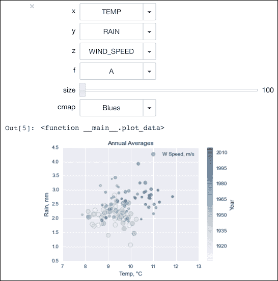

6.  定义另一个函数(其实是同名的)，但这次函数是按年或月的天数分组数据:

    ```py
    def plot_data(x='TEMP', y='RAIN', z='WIND_SPEED', groupby='ts.groupby_yday', size=10, cmap='Blues'):
        if groupby == 'ts.groupby_yday':
            groupby = ts.groupby_yday
        elif groupby == 'ts.groupby_month':
            groupby = ts.groupby_month
        else:
            raise AssertionError('Unknown groupby ' + groupby)

        dfx = groupby(df[x]).mean()
        dfy = groupby(df[y]).mean()
        dfz = groupby(df[z]).mean()

        bubbles = (dfz - dfz.min())/(dfz.max() - dfz.min())
        colors = dfx.index.values
        sc = plt.scatter(dfx, dfy, s= size * bubbles + 9, c = colors,
                    cmap=cmap, label=data.Weather.get_header(z), alpha=0.5)
        plt.colorbar(sc, label='Day of Year')

        by_dict = {ts.groupby_yday: 'Day of Year', ts.groupby_month: 'Month'}
        plt.title('Grouped by ' + by_dict[groupby])
        plt.xlabel(data.Weather.get_header(x))
        plt.ylabel(data.Weather.get_header(y))
        plt.legend(loc='best')
    ```

7.  用下面的代码片段调用这个函数【T1:

    ```py
    groupbys = ('ts.groupby_yday', 'ts.groupby_month')
    interact(plot_data, x=vars, y=vars, z=vars, groupby=groupbys, size=(100,700), cmap=cmaps)
    ```

最终结果见下图:


我对这个图的第一印象是温度和风速似乎是相关的。源代码在本书的代码包中的`Interactive.ipynb`文件中。

## 另见

*   在[https://IPython . org/IPython-doc/dev/API/generated/IPython . html . widgets . interaction . html](https://ipython.org/ipython-doc/dev/api/generated/IPython.html.widgets.interaction.html)上关于交互式 IPython 小部件的文档(2015 年 7 月检索)

# 查看散点图矩阵

如果你的数据集中没有很多变量，那么查看你的数据所有可能的散点图是一个好主意。你可以通过一个函数调用来完成这个任务。这些函数显示一个矩阵图，对角线上有核密度估计图或直方图。

## 怎么做...

1.  导入以下内容:

    ```py
    import pandas as pd
    from dautil import data
    from dautil import ts
    import matplotlib.pyplot as plt
    import seaborn as sns
    import matplotlib as mpl
    ```

2.  用以下行加载天气数据:

    ```py
    df = data.Weather.load()
    df = ts.groupby_yday(df).mean()
    df.columns = [data.Weather.get_header(c) for c in df.columns]
    ```

3.  Plot with the Seaborn `pairplot()` function, which plots histograms on the diagonal by default:

    ```py
    %matplotlib inline

    # Seaborn plotting, issues due to NaNs
    sns.pairplot(df.fillna(0))
    ```

    结果如下:

    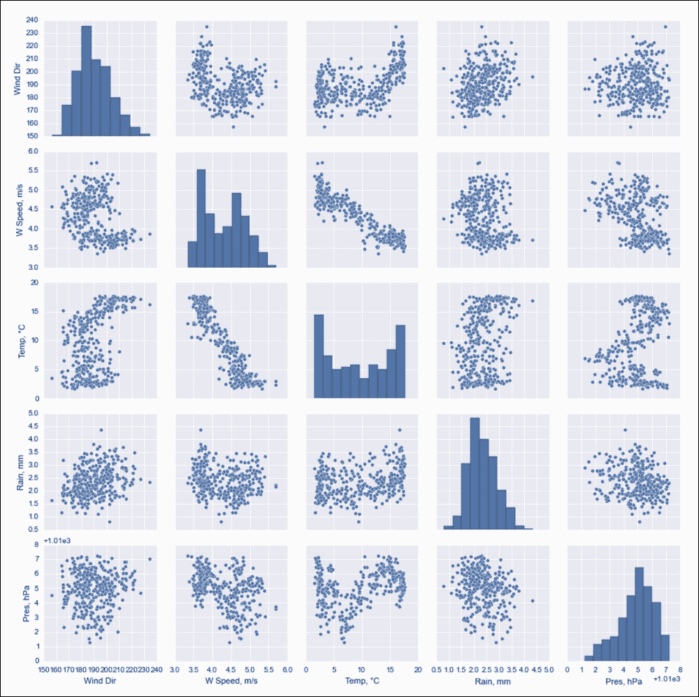

4.  使用 Pandas`scatter_matrix()`功能绘制类似的图，并在对角线上请求内核密度估计图:

    ```py
    sns.set({'figure.figsize': '16, 12'})
    mpl.rcParams['axes.linewidth'] = 9
    mpl.rcParams['lines.linewidth'] = 2
    plots = pd.scatter_matrix(df, marker='o', diagonal='kde')
    plt.show()
    ```

有关最终结果，请参考以下图表:

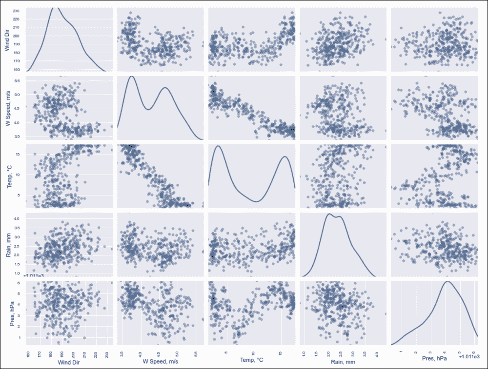

完整的代码可在本书的代码包中的`scatter_matrix.ipynb`文件中找到。

# 通过 mpld3 用 d3.js 可视化

**D3.js** 是 2011 年发布的 JavaScript 数据可视化库，我们也可以在 IPython 笔记本中使用。我们将在常规 matplotlib 图中添加悬停工具提示。作为桥梁，我们需要`mpld3`套餐。这个食谱不需要任何 JavaScript 编码。

## 做好准备

我使用以下命令安装了 mpld3 0.2:

```py
$ [sudo] pip install mpld3

```

## 怎么做...

1.  从导入开始，启用 mpld3:

    ```py
    %matplotlib inline
    import matplotlib.pyplot as plt
    import mpld3
    mpld3.enable_notebook()
    from mpld3 import plugins
    import seaborn as sns
    from dautil import data
    from dautil import ts
    ```

2.  加载天气数据并将其绘制为如下:

    ```py
    df = data.Weather.load()
    df = df[['TEMP', 'WIND_SPEED']]
    df = ts.groupby_yday(df).mean()

    fig, ax = plt.subplots()
    ax.set_title('Averages Grouped by Day of Year')
    points = ax.scatter(df['TEMP'], df['WIND_SPEED'],
                        s=30, alpha=0.3)
    ax.set_xlabel(data.Weather.get_header('TEMP'))
    ax.set_ylabel(data.Weather.get_header('WIND_SPEED'))
    labels = ["Day of year {0}".format(i) for i in range(366)]
    tooltip = plugins.PointLabelTooltip(points, labels)

    plugins.connect(fig, tooltip)

    ```

高亮显示的线负责工具提示。在下面的截图中，31 年**日**文本来自工具提示:


如您所见，在图的底部，您还有用于平移和缩放的小部件(参考本书代码包中的`mpld3_demo.ipynb`文件)。

# 创建热图

热图使用一组颜色将矩阵中的数据可视化。最初，热图用于表示金融资产的价格，如股票。Bokeh 是一个 Python 包，可以在 IPython 笔记本中显示热图，或者生成独立的 HTML 文件。

## 做好准备

我通过 Anaconda 获得了 Bokeh 0.9.1。博克安装说明可在[http://bokeh.pydata.org/en/latest/docs/installation.html](http://bokeh.pydata.org/en/latest/docs/installation.html)获得(2015 年 7 月检索)。

## 怎么做...

1.  进口如下:

    ```py
    from collections import OrderedDict
    from dautil import data
    from dautil import ts
    from dautil import plotting
    import numpy as np
    import bokeh.plotting as bkh_plt
    from bokeh.models import HoverTool
    ```

2.  以下函数加载温度数据，并按年、月分组:

    ```py
    def load():
        df = data.Weather.load()['TEMP']
        return ts.groupby_year_month(df)
    ```

3.  定义一个在特殊 Bokeh 结构中重新排列数据的函数:

    ```py
    def create_source():
        colors = plotting.sample_hex_cmap()

        month = []
        year = []
        color = []
        avg = []

        for year_month, group in load():
            month.append(ts.short_month(year_month[1]))
            year.append(str(year_month[0]))
            monthly_avg = np.nanmean(group.values)
            avg.append(monthly_avg)
            color.append(colors[min(int(abs(monthly_avg)) - 2, 8)])

        source = bkh_plt.ColumnDataSource(
            data=dict(month=month, year=year, color=color, avg=avg)
        )

        return year, source
    ```

4.  定义一个返回横轴标签的函数:

    ```py
    def all_years():
        years = set(year)
        start_year = min(years)
        end_year = max(years)

        return [str(y) for y in range(int(start_year), int(end_year), 5)]
    ```

5.  为热图定义绘图功能，该功能还设置悬停工具提示:

    ```py
    def plot(year, source):
        fig = bkh_plt.figure(title="De Bilt, NL Temperature (1901 - 2014)",
                             x_range=all_years(), 
                             y_range=list(reversed(ts.short_months())),
                             toolbar_location="left", 
                             tools="resize,hover,save,pan,box_zoom,wheel_zoom")

        fig.rect("year", "month", 1, 1, source=source,
            color="color", line_color=None)

        fig.xaxis.major_label_orientation = np.pi/3

        hover = fig.select(dict(type=HoverTool))
        hover.tooltips = OrderedDict([
            ('date', '@month @year'),
            ('avg', '@avg'),
        ])

        bkh_plt.output_notebook()
        bkh_plt.show(fig)
    ```

6.  调用你定义的函数:

    ```py
    year, source = create_source()
    plot(year, source)
    ```

最终结果见下图:

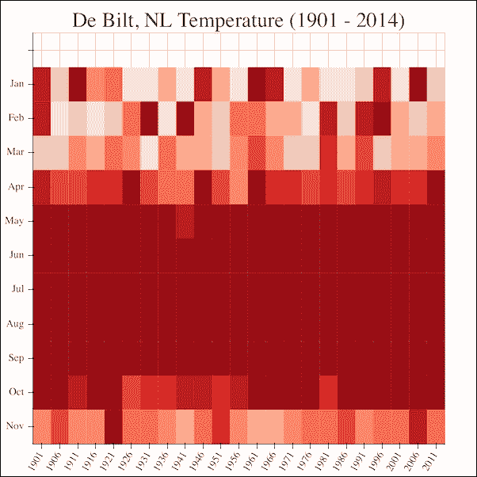

源代码可以在本书的代码包中的`heat_map.ipynb`文件中找到。

## 另见

*   关于在[嵌入博克地块的博克文档](http://bokeh.pydata.org/en/latest/docs/user_guide/embed.html)(2015 年 7 月检索)

# 盒子图、核密度图与小提琴图相结合

**Violin 图**将 box 图和核密度图或直方图组合成一种类型的图。Seaborn 和 matplotlib 都提供小提琴情节。我们将在这个食谱中使用 Seaborn 对的天气数据进行 z 评分。z 评分并不重要，但没有它，小提琴会更分散。

## 怎么做...

1.  导入所需的库，如下所示:

    ```py
    import seaborn as sns
    from dautil import data
    import matplotlib.pyplot as plt
    ```

2.  加载天气数据，计算 z 分:

    ```py
    df = data.Weather.load()
    zscores = (df - df.mean())/df.std()
    ```

3.  Plot a violin plot of the z-scores:

    ```py
    %matplotlib inline
    plt.figure()
    plt.title('Weather Violin Plot')
    sns.violinplot(zscores.resample('M'))
    plt.ylabel('Z-scores')
    ```

    第一段小提琴剧情参考以下剧情:

    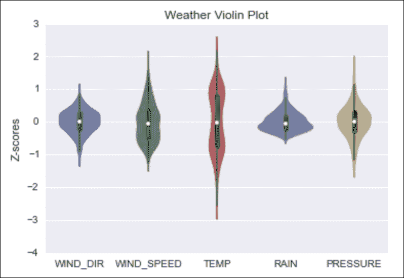

4.  绘制阴雨天和干燥天(与雨天相反)与风速的小提琴图:

    ```py
    plt.figure()
    plt.title('Rainy Weather vs Wind Speed')
    categorical = df
    categorical['RAIN'] = categorical['RAIN'] > 0
    ax = sns.violinplot(x="RAIN", y="WIND_SPEED", 
     data=categorical)

    ```

第二段小提琴剧情参考以下剧情:

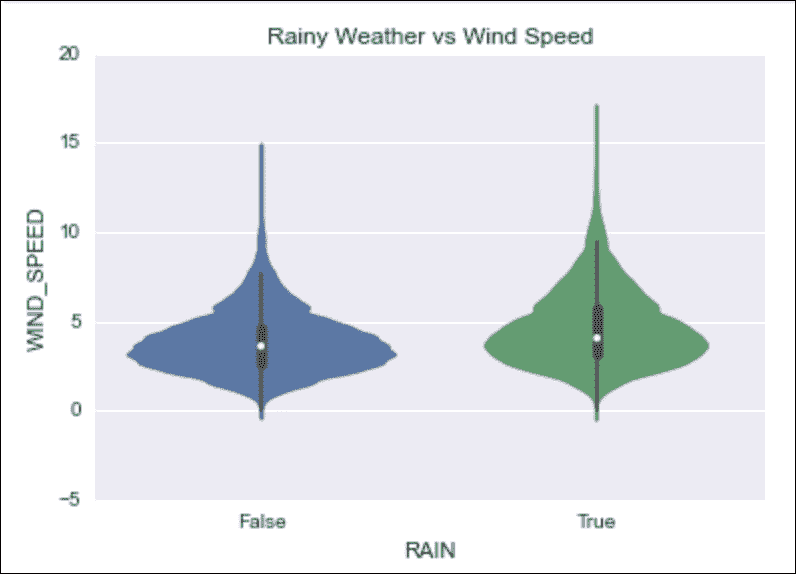

源代码可以在本书代码包的`violins.ipynb`文件中找到。

## 另见

*   在[关于小提琴地块的](https://web.stanford.edu/~mwaskom/software/seaborn/generated/seaborn.violinplot.html)文档

# 用蜂巢图可视化网络图

一个**蜂巢图**是一种可视化技术，用于绘制网络图。在蜂房图中，我们把边画成曲线。我们通过一些属性将节点分组，并在径向轴上显示它们。NetworkX 是最著名的 Python 网络图库之一；然而，它还不支持蜂房地块(2015 年 7 月)。幸运的是，有几个专门研究蜂房地块的图书馆。此外，我们将使用一个应用编程接口来划分在[https://snap.stanford.edu/data/egonets-Facebook.html](https://snap.stanford.edu/data/egonets-Facebook.html)可用的脸书用户的图表(2015 年 7 月检索)。数据属于 **斯坦福网络分析项目** ( **SNAP** )，其中也有 Python API。可惜的是 SNAP API 还不支持 Python 3。

## 做好准备

我通过 Anaconda 获得了 NetworkX 1.9.1。安装网络的说明在(2015 年 7 月检索)。我们还需要 https://bitbucket.org/taynaud/python-louvain 的 `community`套餐(2015 年 7 月取回)。PyPi 上还有另外一个同名的包，完全不相关。安装在[https://github.com/ericmjl/hiveplot](https://github.com/ericmjl/hiveplot)托管的 `hiveplot`包(2015 年 7 月检索到):

```py
$ [sudo] pip install hiveplot

```

我用 hiveplot 0.1.7.4 编写了代码。

## 怎么做...

1.  进口为如下:

    ```py
    import networkx as nx
    import community
    import matplotlib.pyplot as plt
    from hiveplot import HivePlot
    from collections import defaultdict
    from dautil import plotting
    from dautil import data
    ```

2.  加载数据并创建一个网络对象:

    ```py
    fb_file = data.SPANFB().load()
    G = nx.read_edgelist(fb_file, 
                         create_using = nx.Graph(), 
                         nodetype = int)
    print(nx.info(G))
    ```

3.  分割图形并创建`nodes`字典，如下所示:

    ```py
    parts = community.best_partition(G)
    nodes = defaultdict(list)

    for n, d in parts.items():
        nodes[d].append(n)
    ```

4.  这个图相当大，所以我们将只创建三组边:

    ```py
    edges = defaultdict(list)

    for u, v in nx.edges(G, nodes[0]):
        edges[0].append((u, v, 0))

    for u, v in nx.edges(G, nodes[1]):
        edges[1].append((u, v, 1))

    for u, v in nx.edges(G, nodes[2]):
        edges[2].append((u, v, 2))
    ```

5.  标绘大约需要六分钟:

    ```py
    %matplotlib inline
    cmap = plotting.sample_hex_cmap(name='hot', ncolors=len(nodes.keys()))
    h = HivePlot(nodes, edges, cmap, cmap)
    h.draw()
    plt.title('Facebook Network Hive Plot')
    ```

等待期结束后，我们得到如下图:

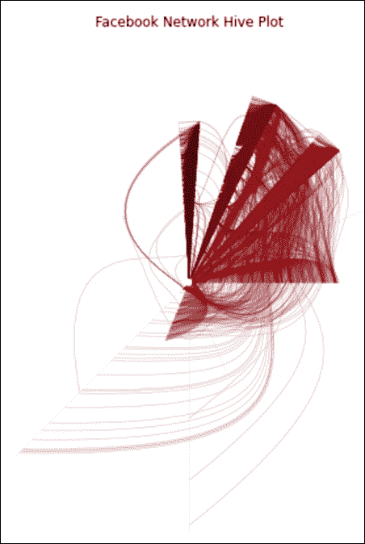

代码在本书代码包的`hive_plot.ipynb`文件中。

# 显示地理地图

无论是处理全球数据的局部，地理地图都是一种合适的可视化。要在地图上绘制数据，我们需要坐标，通常以纬度和经度值的形式。有几种文件格式，我们可以用它们来保存地理数据。在本食谱中，我们将使用特殊的**形状文件**格式和更常见的标签分隔值 ( **TSV** )格式。shapefile 格式由 Esri 公司创建，使用三个扩展名为`.shp`、`.shx`和`.dbf`的强制文件。`.dbf`文件包含一个数据库，其中包含 shapefile 中每个地理位置的额外信息。我们将使用的 shapefile 包含关于国家边界、人口和 **国内生产总值** ( **国内生产总值**)的信息。我们可以从`cartopy`图书馆下载形状文件。TSV 文件以时间序列的形式保存了 4000 多个城市的人口数据。它来自[https://nord pil . com/resources/world-database-of-city-of-city/](https://nordpil.com/resources/world-database-of-large-cities/)(2015 年 7 月检索)。

## 做好准备

首先，我们需要从源代码安装 Proj.4，或者，如果你幸运的话，使用来自[https://github.com/OSGeo/proj.4/wiki](https://github.com/OSGeo/proj.4/wiki)的二进制发行版(检索于 2015 年 7 月)。安装项目 4 的说明可在[https://github.com/OSGeo/proj.4](https://github.com/OSGeo/proj.4)获得(2015 年 7 月检索)。然后，用 pip 安装`cartopy`——我用 cartopy-0.13.0 写的代码。或者，我们可以运行以下命令:

```py
$ conda install -c scitools cartopy

```

## 怎么做...

1.  进口为如下:

    ```py
    import cartopy.crs as ccrs
    import matplotlib.pyplot as plt
    import cartopy.io.shapereader as shpreader
    import matplotlib as mpl
    import pandas as pd
    from dautil import options
    from dautil import data
    ```

2.  我们将使用颜色来可视化乡村人口和人口众多的城市。加载数据如下:

    ```py
    countries = shpreader.natural_earth(resolution='110m',
                                        category='cultural',
                                        name='admin_0_countries')

    cities = pd.read_csv(data.Nordpil().load_urban_tsv(),
                         sep='\t', encoding='ISO-8859-1')
    mill_cities = cities[cities['pop2005'] > 1000]
    ```

3.  画一张地图，一个相应的颜色条，用下面的代码在地图上标出人口众多的城市:

    ```py
    %matplotlib inline
    plt.figure(figsize=(16, 12))
    gs = mpl.gridspec.GridSpec(2, 1,
                               height_ratios=[20, 1])
    ax = plt.subplot(gs[0], projection=ccrs.PlateCarree())

    norm = mpl.colors.Normalize(vmin=0, vmax=2 * 10 ** 9)
    cmap = plt.cm.Blues
    ax.set_title('Population Estimates by Country')

    for country in shpreader.Reader(countries).records():
        ax.add_geometries(country.geometry, ccrs.PlateCarree(),
                          facecolor=cmap(
                              norm(country.attributes['pop_est'])))

    plt.plot(mill_cities['Longitude'],
             mill_cities['Latitude'], 'r.',
             label='Populous city',
             transform=ccrs.PlateCarree())

    options.set_mpl_options()
    plt.legend(loc='lower left')

    cax = plt.subplot(gs[1])
    cb = mpl.colorbar.ColorbarBase(cax,
                                   cmap=cmap,
                                   norm=norm,
                                   orientation='horizontal')

    cb.set_label('Population Estimate')
    plt.tight_layout()
    ```

最终结果参见以下图:


你可以在本书的代码包`plot_map.ipynb`文件中找到代码。

# 使用类似 ggplot2 的图

**Ggplot2** 是一个在 R 用户中流行的数据可视化的 R 库。ggplot2 的主要思想是数据可视化的产品由许多层组成。就像画家一样，我们从一张空画布开始，然后逐渐添加颜料层。通常情况下，我们使用来自 Python 的 R 代码与`rpy2`进行接口(我将在我的书 *Python 数据分析*的第 11 章中讨论几个互操作性选项)。但是，如果我们只想使用`ggplot2`，那么使用`pyggplot`图书馆更方便。在本食谱中，我们将使用可通过`pandas`检索的世界银行数据来可视化三个国家的人口增长。数据由各种指标和相关元数据组成。[http://api.worldbank.org/v2/en/topic/19?的电子表格 download format = excel](http://api.worldbank.org/v2/en/topic/19?downloadformat=excel)(2015 年 7 月检索)有指标说明。我认为我们可以认为世界银行数据集是静态的；然而，相似的数据集经常变化，足以让分析师忙得不可开交。显然，更改指示器的名称(可能)会破坏代码，所以我决定通过`joblib`库缓存数据。`joblib`库与 **scikit-learn** 相关，我们将在[第 9 章](09.html "Chapter 9. Ensemble Learning and Dimensionality Reduction")*集成学习和降维*中详细讨论。不幸的是，这种方法有一些局限性；特别是，我们无法腌制所有 Python 对象。

## 做好准备

首先，您需要安装了 ggplot2 的 R。如果你不打算认真使用 ggplot2，也许你应该完全跳过这个食谱。R 的主页是[http://www.r-project.org/](http://www.r-project.org/)(2015 年 7 月检索)。ggplot2 的文件位于[http://docs.ggplot2.org/current/index.html](http://docs.ggplot2.org/current/index.html)(2015 年 7 月检索)。你可以用 pip 安装 pyg plot——我用的是 pyg plot-23。要安装`joblib`，请访问[https://pythonhosted.org/joblib/installing.html](https://pythonhosted.org/joblib/installing.html)(2015 年 7 月检索)。通过 Python 我有`joblib` 0.8.4。

## 怎么做...

1.  进口情况如下:

    ```py
    import pyggplot
    from dautil import data
    ```

2.  用以下代码加载数据:

    ```py
    dawb = data.Worldbank()
    pop_grow = dawb.get_name('pop_grow')
    df = dawb.download(indicator=pop_grow, start=1984, end=2014)
    df = dawb.rename_columns(df, use_longnames=True)
    ```

3.  下面一行用我们创建的 Pandas`DataFrame`对象初始化 pyggplot:

    ```py
    p = pyggplot.Plot(df)
    ```

4.  用以下线条添加条形图:

    ```py
    p.add_bar('country', dawb.get_longname(pop_grow), color='year')
    ```

5.  翻转图表，使条形图指向右侧并渲染:

    ```py
    p.coord_flip()
    p.render_notebook()
    ```

最终结果见下图:


代码在本书代码包的 `using_ggplot.ipynb`文件中。

# 用影响图突出显示数据点

**影响图**考虑了拟合、影响和杠杆作用后的残差，类似于气泡图。残差的大小绘制在垂直轴上，可以指示数据点是异常值。要理解影响图，请看下面的等式:

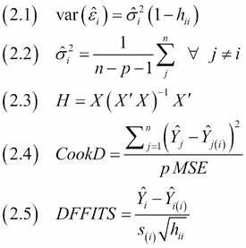

根据`statsmodels`文件，残差用标准偏差 **(2.1)** 进行换算。在 **(2.2)** 中， *n* 为观察数， *p* 为回归数。我们有一个所谓的 **帽子矩阵**，由 **(2.3)** 给出。

帽子矩阵的对角线元素给出了特殊的度量，称为杠杆。**杠杆**以为横轴，表示影响地块的潜在影响。在影响图中，影响决定了绘制点的大小。影响点往往有很高的残差和杠杆。要测量影响，`statsmodels`可以使用**库克距离** **(2.4)** 或 **DFFITS (2.5)** 。

## 怎么做...

1.  进口情况如下:

    ```py
    import matplotlib.pyplot as plt
    import statsmodels.api as sm
    from statsmodels.formula.api import ols
    from dautil import data
    ```

2.  获取可用的国家代码:

    ```py
    dawb = data.Worldbank()

    countries = dawb.get_countries()[['name', 'iso2c']]
    ```

3.  从世界银行加载数据:

    ```py
    population = dawb.download(indicator=[dawb.get_name('pop_grow'), dawb.get_name('gdp_pcap'),
                                        dawb.get_name('primary_education')],
                             country=countries['iso2c'], start=2014, end=2014)

    population = dawb.rename_columns(population)
    ```

4.  定义一个普通的最小二乘模型，如下:

    ```py
    population_model = ols("pop_grow ~ gdp_pcap + primary_education",
                           data=population).fit()
    ```

5.  使用库克距离

    ```py
    %matplotlib inline
    fig, ax = plt.subplots(figsize=(19.2, 14.4))
    fig = sm.graphics.influence_plot(population_model, ax=ax, criterion="cooks")
    plt.grid()
    ```

    显示模型的影响图

最终结果见下图:

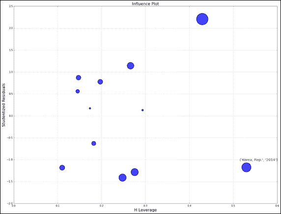

代码在本书代码包的 `highlighting_influence.ipynb`文件中。

## 另见

*   维基百科关于库克在 https://en.wikipedia.org/wiki/Cook%27s_distance T2 的距离的页面
*   https://en.wikipedia.org/wiki/DFFITS 关于 DFFITS 的维基百科页面(2015 年 7 月检索)