# 三、统计数据分析与概率

我们将在本章介绍以下食谱:

*   将数据拟合到指数分布
*   将聚合数据拟合到伽马分布
*   将聚合计数拟合到泊松分布
*   确定偏差
*   估计核密度
*   确定均值、方差和标准差的置信区间
*   概率加权抽样
*   探索极端价值观
*   用皮尔逊相关系数关联变量
*   spearman 秩相关的相关变量
*   将二元和连续变量与点双序列相关联系起来
*   用方差分析评估变量之间的关系

# 简介

已经发明了各种统计分布，这相当于数据分析师的轮子。正如无论我想到什么都会以不同的方式打印出来一样，我们世界中的数据并不遵循严格的数学定律。然而，在可视化我们的数据之后，我们可以看到数据遵循(在一定程度上)一个分布。即使没有可视化，我们也可以使用经验法则找到候选分布。下一步是尝试将数据调整到已知的分布。如果数据非常复杂，可能是由于大量的变量，估计它的核密度是有用的(对于一个变量也是有用的)。在所有情况下，估计我们结果的置信区间或 p 值是很好的。当我们至少有两个变量时，有时看一看变量之间的相关性是合适的。在本章中，我们将应用三种类型的相关性。

# 将数据拟合到指数分布

**指数分布**是**伽玛分布**的一个特例，我们也会在这一章遇到。指数分布可用于分析降雨极值。它也可以用来模拟为排队的顾客提供服务所需的时间。对于零值和负值，指数分布的**概率分布函数** ( **PDF** )为零。对于正值，PDF 指数衰减:


我们将使用降雨数据作为例子，这是指数分布拟合的一个很好的候选。显然，降雨量不能是负数，我们知道大雨比完全不下雨的可能性小。事实上，一天不下雨是很有可能的。

## 怎么做...

以下步骤使雨量数据符合指数分布:

1.  进口情况如下:

    ```py
    from scipy.stats.distributions import expon
    import matplotlib.pyplot as plt
    import dautil as dl
    from IPython.display import HTML
    ```

2.  我做了一个包装类，调用`scipy.stats.expon`方法。首先，调用`fit()`方法:

    ```py
    rain = dl.data.Weather.load()['RAIN'].dropna()
    dist = dl.stats.Distribution(rain, expon)
    dl.options.set_pd_options()
    html_builder = dl.report.HTMLBuilder()
    html_builder.h1('Fitting Data to the Exponential Distribution')
    loc, scale = dist.fit()
    table = dl.report.DFBuilder(['loc', 'scale'])
    table.row([loc, scale])
    html_builder.h2('Distribution Parameters')
    html_builder.add_df(table.build())
    ```

3.  下面的代码在拟合残差上调用`scipy.stats.expon.pdf()`方法和`scipy.stats.describe()`函数:

    ```py
    pdf = dist.pdf(loc, scale)
    html_builder.h2('Residuals of the Fit')
    residuals = dist.describe_residuals()
    html_builder.add(residuals.to_html())
    ```

4.  为了评估拟合，我们可以使用度量。使用以下代码片段计算适合度指标:

    ```py
    table2 = dl.report.DFBuilder(['Mean_AD', 'RMSE'])
    table2.row([dist.mean_ad(), dist.rmse()])
    html_builder.h2('Fit Metrics')
    html_builder.add_df(table2.build())
    ```

5.  绘制拟合图并显示分析报告，如下所示:

    ```py
    plt.hist(rain, bins=dist.nbins, normed=True, label='Rain')
    plt.plot(dist.x, pdf, label='PDF')
    plt.title('Fitting to the exponential distribution')

    # Limiting the x-asis for a better plot
    plt.xlim([0, 15])
    plt.xlabel(dl.data.Weather.get_header('RAIN'))
    plt.ylabel('Probability')
    plt.legend(loc='best')
    HTML(html_builder.html)
    ```

最终结果见下图截图(代码在本书代码包的`fitting_expon.ipynb`文件中):

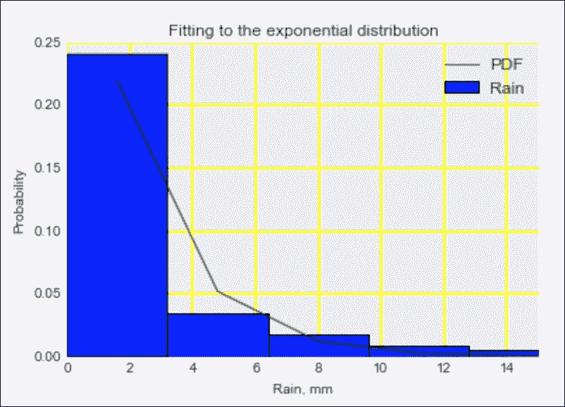

## 它是如何工作的…

`scipy.stats.expon.fit()`返回的`scale`参数是 **(3.1)** 的衰变参数的倒数。我们得到大约 2 的`scale`值，所以衰减大约是一半。因此不下雨的概率约为一半。拟合残差的平均值和偏斜度应该接近于 0。如果我们有一个非零的偏斜，一定会有奇怪的事情发生，因为我们不希望残差向任何方向偏斜。 **平均绝对偏差** ( **MAD** )和**均方根误差** ( **RMSE** )是回归度量，我们将在[第 10 章](10.html "Chapter 10. Evaluating Classifiers, Regressors, and Clusters")、*评估分类器、回归器和聚类*中详细介绍。

## 另见

*   https://en.wikipedia.org/wiki/Exponential_distribution T2 的指数分布维基百科(2015 年 8 月检索)
*   相关的 SciPy 文档位于[http://docs . SciPy . org/doc/SciPy-dev/reference/generated/SciPy . stats . expon . html](http://docs.scipy.org/doc/scipy-dev/reference/generated/scipy.stats.expon.html)(2015 年 8 月检索)

# 将聚集数据拟合到伽马分布

伽马分布可以用来模拟保险索赔的规模、降雨量和大脑中尖峰间隔的分布。伽马分布的 PDF 由形状 *k* 和比例 *θ* 定义如下:


还有一个定义使用了反比例参数(由 SciPy 使用)。伽马分布的平均值和方差由(3.3)和(3.4)描述。如您所见，我们可以使用简单的代数从均值和方差估计形状参数。

## 怎么做...

让我们将 1 月份雨水数据的总量与伽马分布进行拟合:

1.  从以下进口开始:

    ```py
    from scipy.stats.distributions import gamma
    import matplotlib.pyplot as plt
    import dautil as dl
    import pandas as pd
    from IPython.display import HTML
    ```

2.  加载数据并选择 1 月份的聚合:

    ```py
    rain = dl.data.Weather.load()['RAIN'].resample('M').dropna()
    rain = dl.ts.groupby_month(rain)
    rain = rain.get_group(1)
    ```

3.  从分布的均值和方差导出 *k* 的值，并使用它拟合数据:

    ```py
    dist = dl.stats.Distribution(rain, gamma)

    a = (dist.mean() ** 2)/dist.var()
    shape, loc, scale = dist.fit(a)
    ```

代码的其余部分类似于*中的代码，将数据拟合到指数分布*。最终结果参见下面的截图(代码在本书代码包的`fitting_gamma.ipynb`文件中):


## 另见

*   相关的 SciPy 文档位于[http://docs . SciPy . org/doc/SciPy-dev/reference/generated/SciPy . stats . gamma . html # SciPy . stats . gamma](http://docs.scipy.org/doc/scipy-dev/reference/generated/scipy.stats.gamma.html#scipy.stats.gamma)(2015 年 8 月检索)
*   https://en.wikipedia.org/wiki/Gamma_distribution T2 伽马射线分布的维基百科页面(2015 年 8 月检索)

# 将聚集计数拟合到泊松分布

**泊松分布**是以法国数学家泊松命名的，他在 1837 年发表了一篇关于它的论文。泊松分布是一种离散分布，通常与固定时间或空间间隔的计数相关联。它只为整数值 *k* 定义。例如，我们可以将其应用于每月的雨天数。在这种情况下，我们隐含地假设雨天的事件以固定的月速率发生。将数据拟合到泊松分布的目标是找到固定利率。

以下等式描述了泊松分布的概率质量函数 **(3.5)** 和速率参数 **(3.6)** :


## 怎么做...

以下步骤使用**最大似然估计** ( **最大似然估计**)方法拟合:

1.  进口情况如下:

    ```py
    from scipy.stats.distributions import poisson
    import matplotlib.pyplot as plt
    import dautil as dl
    from scipy.optimize import minimize
    from IPython.html.widgets.interaction import interactive
    from IPython.core.display import display
    from IPython.core.display import HTML
    ```

2.  定义功能最大化:

    ```py
    def log_likelihood(k, mu):
        return poisson.logpmf(k, mu).sum()
    ```

3.  加载数据并按月分组:

    ```py
    def count_rain_days(month):
        rain = dl.data.Weather.load()['RAIN']
        rain = (rain > 0).resample('M', how='sum')
        rain = dl.ts.groupby_month(rain)
        rain = rain.get_group(month)

        return rain
    ```

4.  定义如下可视化功能:

    ```py
    def plot(rain, dist, params, month):
        fig, ax = plt.subplots()
        plt.title('Fitting to the Poisson distribution ({})'.format(dl.ts.short_month(month)))

        # Limiting the x-asis for a better plot
        plt.xlim([0, 15])
        plt.figtext(0.5, 0.7, 'rate {:.3f}'.format(params.x[0]), alpha=0.7,
                    fontsize=14)
        plt.xlabel('# Rainy days in a month')
        plt.ylabel('Probability')
        ax.hist(dist.train, bins=dist.nbins, normed=True, label='Data')
        ax.plot(dist.x, poisson.pmf(dist.x, params.x))
    ```

5.  定义一个函数作为入口点:

    ```py
    def fit_poisson(month):
        month_index = dl.ts.month_index(month)
        rain = count_rain_days(month_index)

        dist = dl.stats.Distribution(rain, poisson, range=[-0.5, 19.5])
        params = minimize(log_likelihood, x0=rain.mean(), args=(rain,))
        plot(rain, dist, params, month_index)
    ```

6.  使用交互式小部件，这样我们可以显示每个月的图表:

    ```py
    display(interactive(fit_poisson, month=dl.nb.create_month_widget(month='May')))
    HTML(dl.report.HTMLBuilder().watermark())
    ```

最终结果参见下面的截图(参见本书代码包中的`fitting_poisson.ipynb`文件):

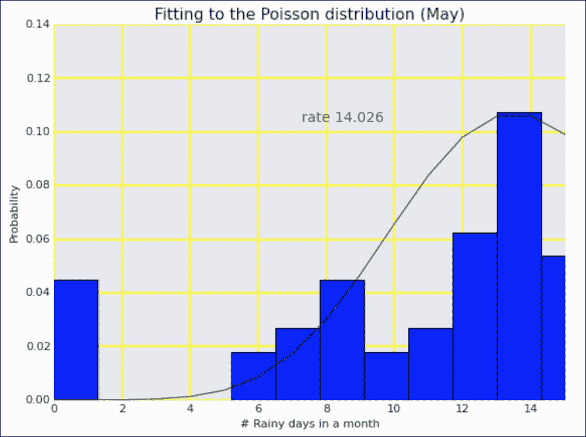

## 另见

*   https://en.wikipedia.org/wiki/Poisson_distribution T2 发布维基百科页面(2015 年 8 月检索)
*   相关的 SciPy 文档位于[http://docs . SciPy . org/doc/SciPy/reference/generated/SciPy . stats . poisson . html # SciPy . stats . poisson](http://docs.scipy.org/doc/scipy/reference/generated/scipy.stats.poisson.html#scipy.stats.poisson)(2015 年 8 月检索)

# 确定偏差

在教授概率时，习惯给出抛硬币的例子。天要不要下雨或多或少有点像抛硬币。如果我们有两种可能的结果，T2 二项分布是合适的。这种分布需要两个参数:概率和样本量。

在统计学中，有两种普遍接受的方法。在**常客**方法中，我们测量投掷硬币的次数，并使用该频率进行进一步分析。**贝叶斯**分析以其创始人托马斯·贝叶斯牧师的名字命名。贝叶斯方法是更多的增量，需要**优先分布**，这是我们在进行实验之前假设的分布。 **后验分布**是我们感兴趣的分布，是我们从实验中获得新数据后得到的分布。让我们先来看看下面的等式:

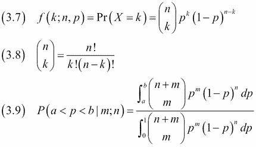

**(3.7)****(3.8)**描述了二项式分布的概率质量函数。 **(3.9)** 出自贝叶斯发表的一篇文章。该方程是关于 *m* 成功和 *n* 失败的实验，并假设二项式分布的概率参数具有均匀的先验分布。

## 怎么做...

在这个食谱中，我们将运用频繁者和贝叶斯方法来获取降雨数据:

1.  进口情况如下:

    ```py
    import dautil as dl
    from scipy import stats
    import matplotlib.pyplot as plt
    import numpy as np
    from IPython.html.widgets.interaction import interact
    from IPython.display import HTML
    ```

2.  定义以下函数加载数据:

    ```py
    def load():
        rainy = dl.data.Weather.rain_values() > 0
        n = len(rainy)
        nrains = np.cumsum(rainy)

        return n, nrains
    ```

3.  定义以下函数计算后验值:

    ```py
    def posterior(i, u, data):
        return stats.binom(i, u).pmf(data[i])
    ```

4.  定义以下函数来绘制数据子集的后验值:

    ```py
    def plot_posterior(ax, day, u, nrains):
        ax.set_title('Posterior distribution for day {}'.format(day))
        ax.plot(posterior(day, u, nrains),
                label='rainy days in period={}'.format(nrains[day]))
        ax.set_xlabel('Uniform prior parameter')
        ax.set_ylabel('Probability rain')
        ax.legend(loc='best')
    ```

5.  定义以下功能进行绘图:

    ```py
    def plot(day1=1, day2=30):
        fig, [[upleft, upright], [downleft, downright]] = plt.subplots(2, 2)
        plt.suptitle('Determining bias of rain data')
        x = np.arange(n) + 1
        upleft.set_title('Frequentist Approach')
        upleft.plot(x, nrains/x, label='Probability rain')
        upleft.set_xlabel('Days')
        set_ylabel(upleft)

        max_p = np.zeros(n)
        u = np.linspace(0, 1, 100)

        for i in x - 1:
            max_p[i] = posterior(i, u, nrains).argmax()/100

        downleft.set_title('Bayesian Approach')
        downleft.plot(x, max_p)
        downleft.set_xlabel('Days')
        set_ylabel(downleft)

        plot_posterior(upright, day1, u, nrains)
        plot_posterior(downright, day2, u, nrains)
        plt.tight_layout()
    ```

6.  以下几行调用其他函数并放置水印:

    ```py
    interact(plot, day1=(1, n), day2=(1, n))
    HTML(dl.report.HTMLBuilder().watermark())
    ```

最终结果参见下面的截图(参见本书代码包中的`determining_bias.ipynb`文件):

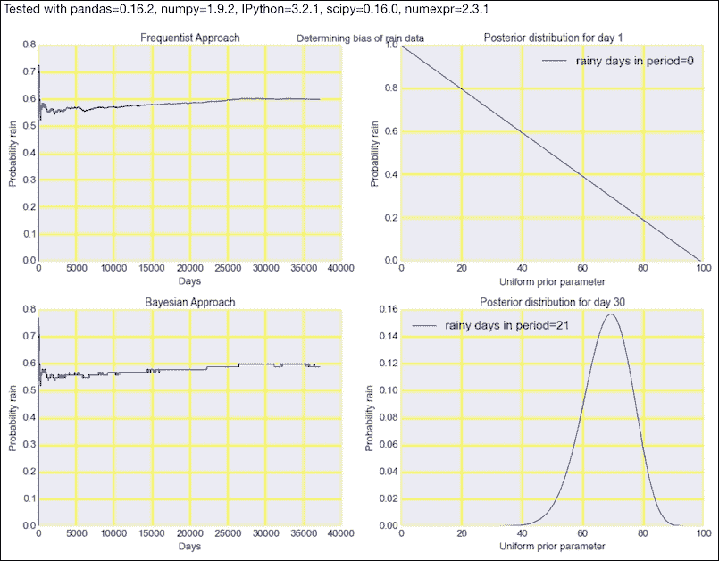

## 另见

*   关于本食谱中提到的论文的维基百科页面在[上](https://en.wikipedia.org/wiki/An_Essay_towards_solving_a_Problem_in_the_Doctrine_of_Chances)

# 估计核密度

通常，我们对适合我们数据的分布类型有一个概念。如果不是这样，我们可以应用一个叫做**核密度估计**的过程。这个方法不做任何假设并且是非参数的。我们基本上平滑了数据，试图处理概率密度。为了平滑数据，我们可以使用各种函数。在这种情况下，这些函数被称为内核函数。以下等式定义了估计量:


在前面的公式中， *K* 是核函数，一个属性类似于 PDF 的函数。带宽 *h* 参数控制平滑过程，可以保持固定或变化。一些库使用经验法则来计算 *h* ，而另一些库让你指定它的值。SciPy、statsmodels、scikit-learn 和 Seaborn 使用不同的算法实现内核密度估计。

## 怎么做...

在本食谱中，我们将使用天气数据估计二元内核密度:

1.  进口情况如下:

    ```py
    import seaborn as sns
    import matplotlib.pyplot as plt
    import dautil as dl
    from dautil.stats import zscores
    import statsmodels.api as sm
    from sklearn.neighbors import KernelDensity
    import numpy as np
    from scipy import stats
    from IPython.html import widgets
    from IPython.core.display import display
    from IPython.display import HTML
    ```

2.  定义以下函数来绘制估计的内核密度:

    ```py
    def plot(ax, a, b, c, xlabel, ylabel):
        dl.plotting.scatter_with_bar(ax, 'Kernel Density', a.values, b.values, c=c, cmap='Blues')
        ax.set_xlabel(xlabel)
        ax.set_ylabel(ylabel)
    ```

3.  在下面的笔记本单元格中，加载数据并定义用于选择天气变量的小部件:

    ```py
    df = dl.data.Weather.load().resample('M').dropna()
    columns = [str(c) for c in df.columns.values]
    var1 = widgets.Dropdown(options=columns, selected_label='RAIN')
    display(var1)
    var2 = widgets.Dropdown(options=columns, selected_label='TEMP')
    display(var2)
    ```

4.  在下一个笔记本单元格中，使用我们创建的小部件的值定义变量:

    ```py
    x = df[var1.value]
    xlabel = dl.data.Weather.get_header(var1.value)
    y = df[var2.value]
    ylabel = dl.data.Weather.get_header(var2.value)
    X = [x, y]
    ```

5.  下一个笔记本电脑单元执行繁重的工作，突出显示最重要的行:

    ```py
    # need to use zscores to avoid errors
    Z = [zscores(x), zscores(y)]
    kde = stats.gaussian_kde(Z)

    _, [[sp_ax, sm_ax], [sk_ax, sns_ax]] = plt.subplots(2, 2)
    plot(sp_ax, x, y, kde.pdf(Z), xlabel, ylabel)
    sp_ax.set_title('SciPy')

    sm_kde = sm.nonparametric.KDEMultivariate(data=X, var_type='cc',
                                              bw='normal_reference')
    sm_ax.set_title('statsmodels')
    plot(sm_ax, x, y, sm_kde.pdf(X), xlabel, ylabel)

    XT = np.array(X).T
    sk_kde = KernelDensity(kernel='gaussian', bandwidth=0.2).fit(XT)
    sk_ax.set_title('Scikit Learn')
    plot(sk_ax, x, y, sk_kde.score_samples(XT), xlabel, ylabel)

    sns_ax.set_title('Seaborn')
    sns.kdeplot(x, y, ax=sns_ax)
    sns.rugplot(x, color="b", ax=sns_ax)
    sns.rugplot(y, vertical=True, ax=sns_ax)
    sns_ax.set_xlabel(xlabel)
    sns_ax.set_ylabel(ylabel)

    plt.tight_layout()
    HTML(dl.report.HTMLBuilder().watermark())
    ```

最终结果参见以下截图(参见本书代码包中的`kernel_density_estimation.ipynb`文件):


## 另见

*   https://en.wikipedia.org/wiki/Kernel_density_estimation 的核密度估计维基百科页面(2015 年 8 月检索)
*   相关的 statsmodels 文档位于[http://stats models . source forge . net/dev/generated/stats models . nonparameter . kernel _ density。KDEMultivariate.html](http://statsmodels.sourceforge.net/devel/generated/statsmodels.nonparametric.kernel_density.KDEMultivariate.html)(2015 年 8 月检索)
*   http://scikit-learn.org/stable/modules/density.html 的相关 scikit-learn 文档(2015 年 8 月检索)

# 确定平均值、方差和标准偏差的置信区间

想象我们观察到的数据只是冰山一角有时是有用的。如果你进入这种心态，那么你可能会想知道这座冰山到底有多大。显然，如果你看不到整件事，你还是可以试着从你所拥有的数据中进行外推。在统计学中，我们试图估计置信区间，置信区间是一个估计范围，通常与百分比引用的某个置信水平相关。

`scipy.stats.bayes_mvs()`函数估计平均值、方差和标准偏差的置信区间。该函数使用贝叶斯统计估计置信度，假设数据是独立的和正态分布的。**折刀**是估计置信区间的替代确定性算法。它属于重采样算法家族。通常，我们通过删除一个值(我们也可以删除两个或更多的值)在折刀算法下生成新的数据集。我们生成数据 *N* 次，其中 *N* 是数据集中的数值个数。通常，如果我们想要 5%的置信水平，我们估计新数据集的平均值或方差，并确定 2.5 和 97.5 百分位值。

## 怎么做...

在这个配方中，我们使用`scipy.stats.bayes_mvs()`函数和折刀来估计置信区间:

1.  进口情况如下:

    ```py
    from scipy import stats
    import dautil as dl
    from dautil.stats import jackknife
    import pandas as pd
    import matplotlib.pyplot as plt
    import numpy as np
    from IPython.html.widgets.interaction import interact
    from IPython.display import HTML
    ```

2.  定义以下功能，使用误差线可视化 Scipy 结果:

    ```py
    def plot_bayes(ax, metric, var, df):
        vals = np.array([[v.statistic, v.minmax[0], v.minmax[1]] for v in
                         df[metric].values])

        ax.set_title('Bayes {}'.format(metric))
        ax.errorbar(np.arange(len(vals)), vals.T[0], yerr=(vals.T[1], vals.T[2]))
        set_labels(ax, var)
    ```

3.  定义功能后的使用误差线可视化折刀结果:

    ```py
    def plot_jackknife(ax, metric, func, var, df):
        vals = df.apply(lambda x: jackknife(x, func, alpha=0.95))
        vals = np.array([[v[0], v[1], v[2]] for v in vals.values])

        ax.set_title('Jackknife {}'.format(metric))
        ax.errorbar(np.arange(len(vals)), vals.T[0], yerr=(vals.T[1], vals.T[2]))
        set_labels(ax, var)
    ```

4.  定义以下函数，该函数将在 IPython 交互小部件的帮助下调用:

    ```py
    def confidence_interval(var='TEMP'):
        df = dl.data.Weather.load().dropna()
        df = dl.ts.groupby_yday(df)

        def f(x):
            return stats.bayes_mvs(x, alpha=0.95)

        bayes_df = pd.DataFrame([[v[0], v[1], v[2]] for v in
                                 df[var].apply(f).values], columns=['Mean', 'Var',
                                                                    'Std'])

        fig, axes = plt.subplots(2, 2)
        fig.suptitle('Confidence Intervals')

        plot_bayes(axes[0][0], 'Mean', var, bayes_df)
        plot_bayes(axes[0][1], 'Var', var, bayes_df)
        plot_jackknife(axes[1][0], 'Mean', np.mean, var, df[var])
        plot_jackknife(axes[1][1], 'Mean', np.var, var, df[var])

        plt.tight_layout()
    ```

5.  设置一个交互式 IPython 小部件:

    ```py
    interact(confidence_interval, var=dl.data.Weather.get_headers())
    HTML(dl.report.HTMLBuilder().watermark())
    ```

最终结果参见以下截图(参见本书代码包中的`bayes_confidence.ipynb`文件):

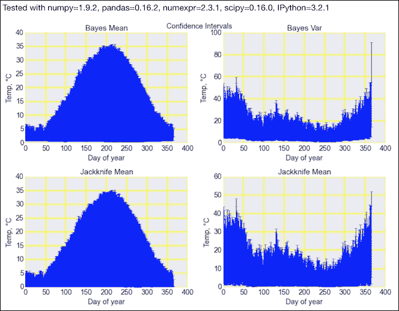

## 另见

*   https://en.wikipedia.org/wiki/Jackknife_resampling 刀切重采样维基百科页面(2015 年 8 月检索)
*   奥列芬特，“*从数据*估计均值、方差和标准差的贝叶斯观点”(http://hdl.handle.net/1877/438，2006)

# 概率权重抽样

为了在第二次世界大战期间制造核弹，物理学家需要进行相当复杂的计算。斯坦尼斯瓦夫·乌兰产生了将这一挑战视为一场碰运气的游戏的想法。后来，他想出的方法被命名为**蒙特卡洛**。概率游戏通常有非常简单的规则，但是以最佳方式玩可能很困难。根据量子力学，亚原子粒子也是不可预测的。如果我们用亚原子粒子模拟许多实验，我们仍然可以了解它们可能的行为。蒙特卡罗方法不是确定性的，但是对于足够多的模拟，它接近于复杂计算的正确结果。

`statsmodels.distributions.empirical_distribution.ECDF`类定义了数据数组的累积分布函数。我们可以用它的输出来模拟一个复杂的过程。这个模拟并不完美，因为我们在这个过程中丢失了信息。

## 怎么做...

在这个食谱中，我们将模拟天气过程。我尤其对年气温值感兴趣。我有兴趣了解模拟数据集是否也呈现上升趋势:

1.  进口情况如下:

    ```py
    from statsmodels.distributions.empirical_distribution import ECDF
    import dautil as dl
    import numpy as np
    import matplotlib.pyplot as plt
    from sklearn.utils import check_random_state
    from IPython.html.widgets.interaction import interact
    from IPython.core.display import HTML
    ```

2.  定义以下函数计算斜率:

    ```py
    def slope(x, y):
        return np.polyfit(x, y, 1)[0]
    ```

3.  定义以下函数生成单年数据:

    ```py
    def simulate(x, years, rs, p):
        N = len(years)
        means = np.zeros(N)

        for i in range(N):
            sample = rs.choice(x, size=365, p=p)
            means[i] = sample.mean()

        return means, np.diff(means).mean(), slope(years, means)
    ```

4.  定义以下函数来运行多个模拟:

    ```py
    def run_multiple(times, x, years, p):
        sims = []
        rs = check_random_state(20)

        for i in range(times):
            sims.append(simulate(x, years, rs, p))

        return np.array(sims)
    ```

5.  定义以下函数，默认加载温度值:

    ```py
    def main(var='TEMP'):
        df = dl.data.Weather.load().dropna()[var]
        cdf = ECDF(df)
        x = cdf.x[1:]
        p = np.diff(cdf.y)

        df = df.resample('A')
        years = df.index.year
        sims = run_multiple(500, x, years, p)

        sp = dl.plotting.Subplotter(2, 1, context)
        plotter = dl.plotting.CyclePlotter(sp.ax)
        plotter.plot(years, df.values, label='Data')
        plotter.plot(years, sims[0][0], label='Sim 1')
        plotter.plot(years, sims[1][0], label='Sim 2')
        header = dl.data.Weather.get_header(var)
        sp.label(title_params=header, ylabel_params=header)
        sp.ax.legend(loc='best')

        sp.next_ax()
        sp.label()
        sp.ax.hist(sims.T[2], normed=True)
        plt.figtext(0.2, 0.3, 'Slope of the Data {:.3f}'.format(slope(years, df.values)))
        plt.tight_layout()
    ```

存储在本书代码包中`sampling_weights.ipynb`文件中的笔记本也为您提供了选择其他天气变量的选项。有关最终结果，请参考以下屏幕截图:

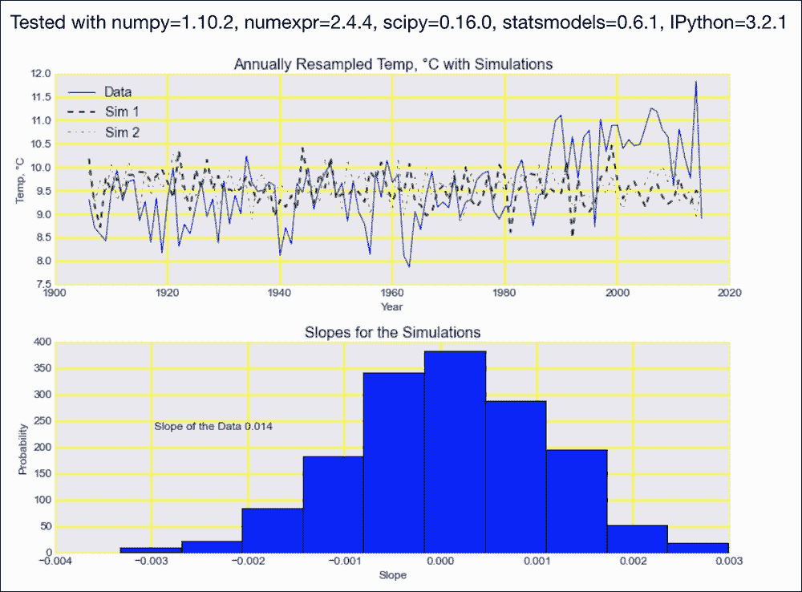

## 另见

*   https://en.wikipedia.org/wiki/Monte_Carlo_method 蒙特卡罗方法的维基百科页面(2015 年 8 月检索)
*   位于[的`ECDF` 类的文档。ECDF.html](http://statsmodels.sourceforge.net/0.6.0/generated/statsmodels.distributions.empirical_distribution.ECDF.html)(2015 年 8 月检索)

# 探索极值

全世界有近一百万座大坝，其中大约 5%高于 15 米。设计大坝的土木工程师必须考虑许多因素，包括降雨量。为了简单起见，让我们假设工程师想知道累计年降雨量。我们也可以取月最大值，并将其拟合到一个 **广义极值** ( **GEV** ) 分布。利用这个分布，我们可以引导得到我们的估计。相反，我选择的数值高于食谱中的第 95 个百分位数。

GEV 分布在`scipy.stats`中实现，并且是 Gumbel 分布、Frechet 分布和 Weibull 分布的混合。以下等式描述了累积分布函数 **(3.11)** 和相关约束 **(3.12)** :


在这些方程中， *μ* 为位置参数， *σ* 为尺度参数， *ξ* 为形状参数。

## 怎么做...

让我们使用 GEV 分布来分析数据:

1.  进口情况如下:

    ```py
    from scipy.stats.distributions import genextreme
    import matplotlib.pyplot as plt
    import dautil as dl
    import numpy as np
    from IPython.display import HTML
    ```

2.  定义以下函数对 GEV 分布进行采样:

    ```py
    def run_sims(nsims):
        sums = []

        np.random.seed(19)

        for i in range(nsims):
            for j in range(len(years)):
                sample_sum = dist.rvs(shape, loc, scale, size=365).sum()
                sums.append(sample_sum)

        a = np.array(sums)
        low, high = dl.stats.ci(a)

        return a, low, high
    ```

3.  加载数据，选择极值:

    ```py
    rain = dl.data.Weather.load()['RAIN'].dropna()
    annual_sums = rain.resample('A', how=np.sum)
    years = np.unique(rain.index.year)
    limit = np.percentile(rain, 95)
    rain = rain[rain > limit]
    dist = dl.stats.Distribution(rain, genextreme)
    ```

4.  将极值拟合到 GEV 分布:

    ```py
    shape, loc, scale = dist.fit()
    table = dl.report.DFBuilder(['shape', 'loc', 'scale'])
    table.row([shape, loc, scale])
    dl.options.set_pd_options()
    html_builder = dl.report.HTMLBuilder()
    html_builder.h1('Exploring Extreme Values')
    html_builder.h2('Distribution Parameters')
    html_builder.add_df(table.build())
    ```

5.  获取拟合残差的统计数据:

    ```py
    pdf = dist.pdf(shape, loc, scale)
    html_builder.h2('Residuals of the Fit')
    residuals = dist.describe_residuals()
    html_builder.add(residuals.to_html())
    ```

6.  获取适合度指标:

    ```py
    table2 = dl.report.DFBuilder(['Mean_AD', 'RMSE'])
    table2.row([dist.mean_ad(), dist.rmse()])
    html_builder.h2('Fit Metrics')
    html_builder.add_df(table2.build())
    ```

7.  绘制数据和引导的结果:

    ```py
    sp = dl.plotting.Subplotter(2, 2, context)

    sp.ax.hist(annual_sums, normed=True, bins=dl.stats.sqrt_bins(annual_sums))
    sp.label()
    set_labels(sp.ax)

    sp.next_ax()
    sp.label()
    sp.ax.set_xlim([5000, 10000])
    sims = []
    nsims = [25, 50, 100, 200]

    for n in nsims:
        sims.append(run_sims(n))

    sims = np.array(sims)
    sp.ax.hist(sims[2][0], normed=True, bins=dl.stats.sqrt_bins(sims[2][0]))
    set_labels(sp.ax)

    sp.next_ax()
    sp.label()
    sp.ax.set_xlim([10, 40])
    sp.ax.hist(rain, bins=dist.nbins, normed=True, label='Rain')
    sp.ax.plot(dist.x, pdf, label='PDF')
    set_labels(sp.ax)
    sp.ax.legend(loc='best')

    sp.next_ax()
    sp.ax.plot(nsims, sims.T[1], 'o', label='2.5 percentile')
    sp.ax.plot(nsims, sims.T[2], 'x', label='97.5 percentile')
    sp.ax.legend(loc='center')
    sp.label(ylabel_params=dl.data.Weather.get_header('RAIN'))

    plt.tight_layout()
    HTML(html_builder.html)
    ```

最终结果参见以下截图(参见本书代码包中的`extreme_values.ipynb`文件):

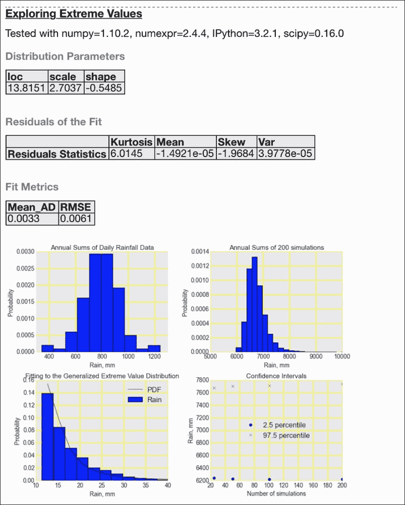

## 另见

*   GEV 发行版的维基百科页面，位于(2015 年 8 月检索)。

# 用皮尔逊相关法关联变量

皮尔森的 r ，以其开发者卡尔·皮尔逊(1896)的名字命名为，测量两个变量之间的线性相关性。让我们看看下面的等式:

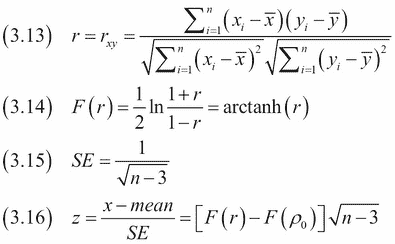

**(3.13)** 定义系数， **(3.14)** 描述用于计算置信区间的 **费希尔变换**。 **(3.15)** 给出相关的标准误差。 **(3.16)** 是关于费希尔变换相关的 z 分数。如果我们假设正态分布，我们可以使用 z 分数来计算置信区间。或者，我们可以通过替换对值对进行重采样来引导。此外，`scipy.stats.pearsonr()`函数返回一个 p 值，该值(根据文档)对于小于 500 个值的样本是不准确的。不幸的是，我们将在这个食谱中使用这样一个小样本。我们将把世界银行的二氧化碳排放数据与荷兰的相关温度数据联系起来。

## 怎么做...

在本食谱中，我们将通过以下步骤，使用 z 分数和自举计算相关系数并估计置信区间:

1.  进口情况如下:

    ```py
    import dautil as dl
    import pandas as pd
    from scipy import stats
    import numpy as np
    import math
    from sklearn.utils import check_random_state
    import matplotlib.pyplot as plt
    from IPython.display import HTML
    from IPython.display import display
    ```

2.  下载数据并设置适当的数据结构:

    ```py
    wb = dl.data.Worldbank()
    indicator = wb.get_name('co2')
    co2 = wb.download(country='NL', indicator=indicator, start=1900,
                      end=2014)
    co2.index = [int(year) for year in co2.index.get_level_values(1)]
    temp = pd.DataFrame(dl.data.Weather.load()['TEMP'].resample('A'))
    temp.index = temp.index.year
    temp.index.name = 'year'
    df = pd.merge(co2, temp, left_index=True, right_index=True).dropna()
    ```

3.  计算相关性如下:

    ```py
    stats_corr = stats.pearsonr(df[indicator].values, df['TEMP'].values)
    print('Correlation={0:.4g}, p-value={1:.4g}'.format(stats_corr[0], stats_corr[1]))
    ```

4.  用费希尔变换计算置信区间:

    ```py
    z = np.arctanh(stats_corr[0])
    n = len(df.index)
    se = 1/(math.sqrt(n - 3))
    ci = z + np.array([-1, 1]) * se * stats.norm.ppf((1 + 0.95)/2)

    ci = np.tanh(ci)
    dl.options.set_pd_options()
    ci_table = dl.report.DFBuilder(['Low', 'High'])
    ci_table.row([ci[0], ci[1]])
    ```

5.  通过对替换对进行重采样来引导:

    ```py
    rs = check_random_state(34)

    ranges = []

    for j in range(200):
        corrs = []

        for i in range(100):
            indices = rs.choice(n, size=n)
            pairs = df.values
            gen_pairs = pairs[indices]
            corrs.append(stats.pearsonr(gen_pairs.T[0], gen_pairs.T[1])[0])

        ranges.append(dl.stats.ci(corrs))

    ranges = np.array(ranges)
    bootstrap_ci = dl.stats.ci(corrs)
    ci_table.row([bootstrap_ci[0], bootstrap_ci[1]])
    ci_table = ci_table.build(index=['Formula', 'Bootstrap'])
    ```

6.  绘制结果并生成报告:

    ```py
    x = np.arange(len(ranges)) * 100
    plt.plot(x, ranges.T[0], label='Low')
    plt.plot(x, ranges.T[1], label='High')
    plt.plot(x, stats_corr[0] * np.ones_like(x), label='SciPy estimate')
    plt.ylabel('Pearson Correlation')
    plt.xlabel('Number of bootstraps')
    plt.title('Bootstrapped Pearson Correlation')
    plt.legend(loc='best')
    result = dl.report.HTMLBuilder()
    result.h1('Pearson Correlation Confidence intervals')
    result.h2('Confidence Intervals')
    result.add(ci_table.to_html())
    HTML(result.html)
    ```

最终结果参见下面的截图(参见本书代码包中的`correlating_pearson.ipynb`文件):

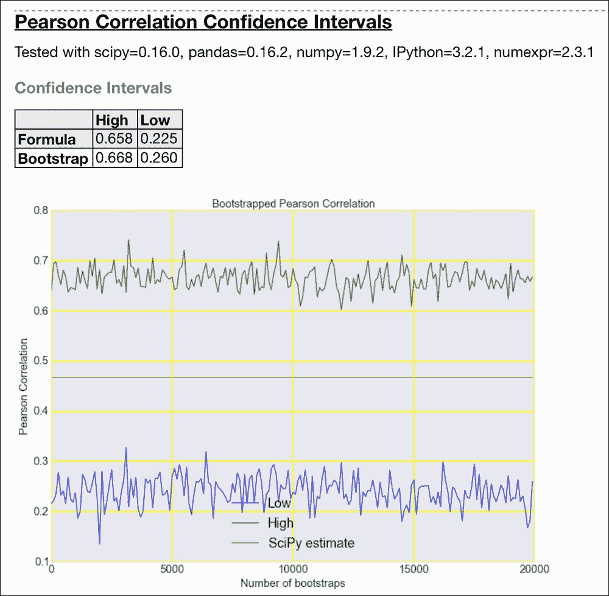

## 另见

*   位于[的相关 SciPy 文档 http://docs . SciPy . org/doc/SciPy/reference/generated/SciPy . stats . Pearson . html # SciPy . stats . Pearson](http://docs.scipy.org/doc/scipy/reference/generated/scipy.stats.pearsonr.html#scipy.stats.pearsonr)(2015 年 8 月检索)。

# 将变量与斯皮尔曼等级相关进行关联

**斯皮尔曼等级相关性**使用等级将两个变量与皮尔逊相关性相关联。等级是值在排序顺序中的位置。值相等的项目会获得一个等级，这是它们位置的平均值。例如，如果我们有两个值相等的项目分配到位置 2 和 3，两个项目的排名都是 2.5。看看下面的等式:

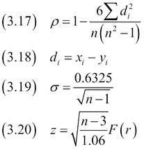

在这些方程中， *n* 是样本量。 **(3.17)** 显示了如何计算相关性。 **(3.19)** 给出标准误差。 **(3.20)** 是关于的 z 分数，我们假设是正态分布。 *F(r)* 在这里与 **(3.14)** 相同，因为它是相同的相关性，但适用于等级。

## 怎么做...

在这个食谱中，我们计算了风速和温度之间的斯皮尔曼相关性，通过一年中的某一天和相应的置信区间进行汇总。然后，我们显示所有天气数据的相关矩阵。步骤如下:

1.  进口情况如下:

    ```py
    import dautil as dl
    from scipy import stats
    import numpy as np
    import math
    import seaborn as sns
    import matplotlib.pyplot as plt
    from IPython.html import widgets
    from IPython.display import display
    from IPython.display import HTML
    ```

2.  定义以下函数计算置信区间:

    ```py
    def get_ci(n, corr):
        z = math.sqrt((n - 3)/1.06) * np.arctanh(corr)
        se = 0.6325/(math.sqrt(n - 1))
        ci = z + np.array([-1, 1]) * se * stats.norm.ppf((1 + 0.95)/2)

        return np.tanh(ci)
    ```

3.  加载数据并显示小部件，以便您可以根据需要关联不同的配对:

    ```py
    df = dl.data.Weather.load().dropna()
    df = dl.ts.groupby_yday(df).mean()

    drop1 = widgets.Dropdown(options=dl.data.Weather.get_headers(), 
                             selected_label='TEMP', description='Variable 1')
    drop2 = widgets.Dropdown(options=dl.data.Weather.get_headers(), 
                             selected_label='WIND_SPEED', description='Variable 2')
    display(drop1)
    display(drop2)
    ```

4.  计算斯皮尔曼等级与 SciPy 的相关性:

    ```py
    var1 = df[drop1.value].values
    var2 = df[drop2.value].values
    stats_corr = stats.spearmanr(var1, var2)
    dl.options.set_pd_options()
    html_builder = dl.report.HTMLBuilder()
    html_builder.h1('Spearman Correlation between {0} and {1}'.format(
        dl.data.Weather.get_header(drop1.value), dl.data.Weather.get_header(drop2.value)))
    html_builder.h2('scipy.stats.spearmanr()')
    dfb = dl.report.DFBuilder(['Correlation', 'p-value'])
    dfb.row([stats_corr[0], stats_corr[1]])
    html_builder.add_df(dfb.build())
    ```

5.  计算置信区间如下:

    ```py
    n = len(df.index)
    ci = get_ci(n, stats_corr)
    html_builder.h2('Confidence intervale')
    dfb = dl.report.DFBuilder(['2.5 percentile', '97.5 percentile'])
    dfb.row(ci)
    html_builder.add_df(dfb.build())
    ```

6.  将相关矩阵显示为 Seaborn 热图:

    ```py
    corr = df.corr(method='spearman')

    %matplotlib inline
    plt.title('Spearman Correlation Matrix')
    sns.heatmap(corr)
    HTML(html_builder.html)
    ```

最终结果见下面截图(见本书代码包中的`correlating_spearman.ipynb`文件):

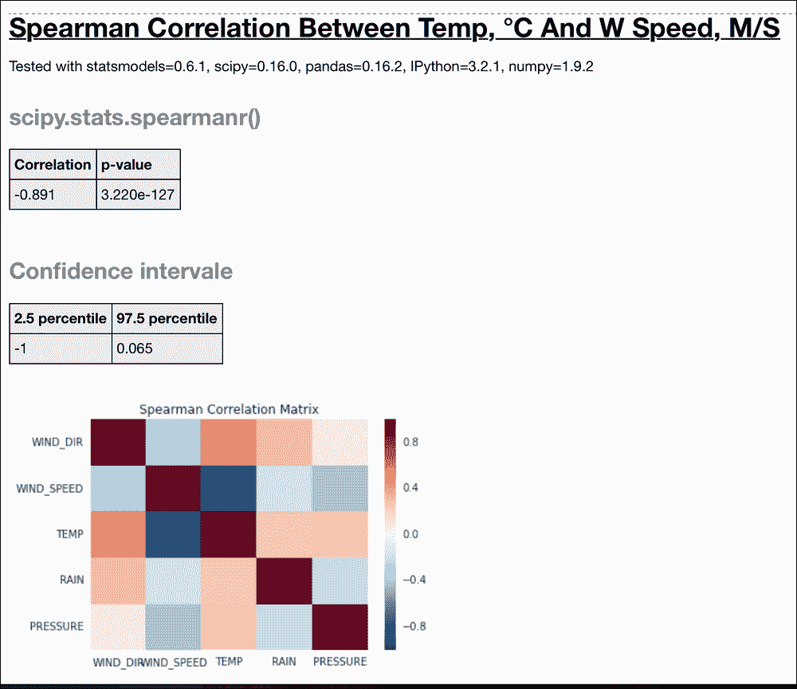

## 另见

*   Spearman 排名相关性维基百科页面位于[https://en . Wikipedia . org/wiki/Spearman % 27s _ rank _ correlation _ 系数](https://en.wikipedia.org/wiki/Spearman%27s_rank_correlation_coefficient)(2015 年 8 月检索)

# 将二元和连续变量与点双列相关进行关联

**点-双列关联**关联一个二元变量 *Y* 和一个连续变量 *X* 。系数计算如下:

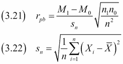

**(3.21)** 中的下标对应两组二元变量。 *M1* 是 *X* 的平均值，对应于 *Y* 组 1 的值。 *M2* 是 *X* 对应于 *Y* 第 0 组数值的平均值。

在这个食谱中，我们将使用的二进制变量是下雨或不下雨。我们将把这个变量和温度联系起来。

## 怎么做...

我们将计算与`scipy.stats.pointbiserialr()`函数的相关性。我们还将使用带有`np.roll()`功能的 2 年窗口计算滚动相关性。步骤如下:

1.  进口情况如下:

    ```py
    import dautil as dl
    from scipy import stats
    import numpy as np
    import matplotlib.pyplot as plt
    import pandas as pd
    from IPython.display import HTML
    ```

2.  加载数据并关联两个相关数组:

    ```py
    df = dl.data.Weather.load().dropna()
    df['RAIN'] = df['RAIN'] > 0

    stats_corr = stats.pointbiserialr(df['RAIN'].values, df['TEMP'].values)
    ```

3.  计算 2 年滚动相关性如下:

    ```py
    N = 2 * 365
    corrs = []

    for i in range(len(df.index) - N):
        x = np.roll(df['RAIN'].values, i)[:N]
        y = np.roll(df['TEMP'].values, i)[:N]
        corrs.append(stats.pointbiserialr(x, y)[0])

    corrs = pd.DataFrame(corrs,
                         index=df.index[N:],
                         columns=['Correlation']).resample('A')
    ```

4.  用以下代码绘制结果:

    ```py
    plt.plot(corrs.index.values, corrs.values)
    plt.hlines(stats_corr[0], corrs.index.values[0], corrs.index.values[-1],
               label='Correlation using the whole data set')
    plt.title('Rolling Point-biserial Correlation of Rain and Temperature with a 2 Year Window')
    plt.xlabel('Year')
    plt.ylabel('Correlation')
    plt.legend(loc='best')
    HTML(dl.report.HTMLBuilder().watermark())
    ```

最终结果见以下截图(见本书代码包中`correlating_pointbiserial.ipynb`文件):


## 另见

*   相关的 SciPy 文档位于[http://docs . SciPy . org/doc/SciPy/reference/generated/SciPy . stats . pointbiseriarr . html # SciPy . stats . pointbiseriarr](http://docs.scipy.org/doc/scipy/reference/generated/scipy.stats.pointbiserialr.html#scipy.stats.pointbiserialr)(2015 年 8 月检索)。

# 用方差分析评价变量之间的关系

**方差分析** ( **方差分析**)是统计学家罗纳德·费雪发明的一种统计数据分析方法。该方法使用一个或多个对应分类变量的值分割连续变量的数据，以分析方差。方差分析是线性建模的一种形式。如果我们用一个分类变量建模，我们说的**单向方差分析**。在这个食谱中，我们将使用两个分类变量，因此我们有**双向方差分析**。在双向方差分析中，我们创建了一个**列联表**—一个包含两个分类变量所有组合的计数的表(我们很快会看到一个列联表的例子)。线性模型由下式给出:


这是一个加法模型，其中 *μ <sub>ij</sub>* 是对应于列联表的一个单元格的连续变量的平均值， *μ* 是整个数据集的平均值， *α <sub>i</sub>* 是第一个分类变量的贡献， *β <sub>j</sub>* 是第二个分类变量的贡献， *ɣ* *ij 我们将把这个模型应用于天气数据。*

## 怎么做...

以下步骤将双向方差分析应用于作为连续变量的风速、作为二元变量的雨和作为分类变量的风向:

1.  进口情况如下:

    ```py
    from statsmodels.formula.api import ols
    import dautil as dl
    from statsmodels.stats.anova import anova_lm
    import seaborn as sns
    import matplotlib.pyplot as plt
    from IPython.display import HTML
    ```

2.  加载数据，用`statsmodels` :

    ```py
    df = dl.data.Weather.load().dropna()
    df['RAIN'] = df['RAIN'] > 0
    formula = 'WIND_SPEED ~ C(RAIN) + C(WIND_DIR)'
    lm = ols(formula, df).fit()
    hb = dl.HTMLBuilder()
    hb.h1('ANOVA Applied to Weather Data')
    hb.h2('ANOVA results')
    hb.add_df(anova_lm(lm), index=True)
    ```

    拟合模型
3.  显示一个截断的列联表，并用 Seaborn 可视化数据:

    ```py
    df['WIND_DIR'] = dl.data.Weather.categorize_wind_dir(df)
    hb.h2('Truncated Contingency table')
    hb.add_df(df.groupby([df['RAIN'], df['WIND_DIR']]).count().head(3),index=True)

    sns.pointplot(y='WIND_SPEED', x='WIND_DIR',
                  hue='RAIN', data=df[['WIND_SPEED', 'RAIN', 'WIND_DIR']])
    HTML(hb.html)
    ```

最终结果参见以下截图(参见本书代码包中的`anova.ipynb`文件):

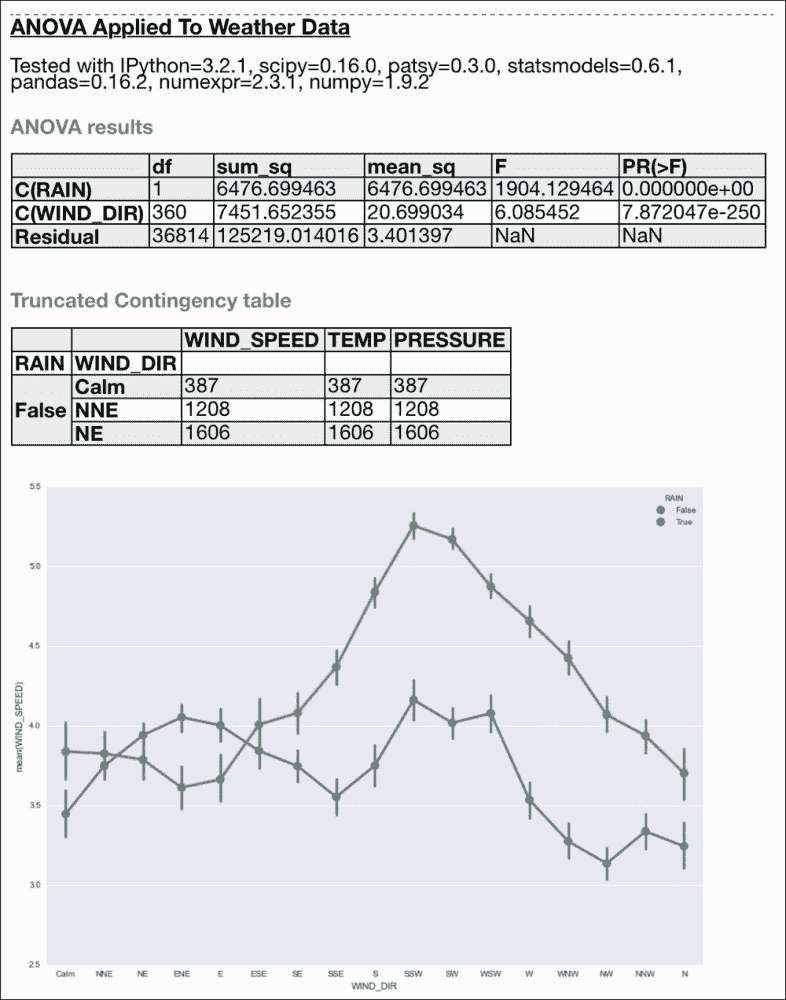

## 另见

*   https://en.wikipedia.org/wiki/Two-way_analysis_of_variance 双向方差分析的维基百科页面(2015 年 8 月检索)
*   关于应急表的维基百科页面是[https://en.wikipedia.org/wiki/Contingency_table](https://en.wikipedia.org/wiki/Contingency_table)(2015 年 8 月检索)