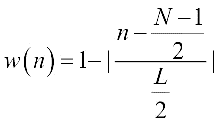
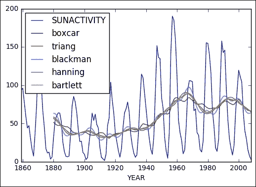
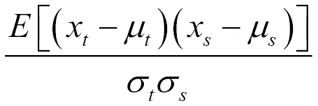
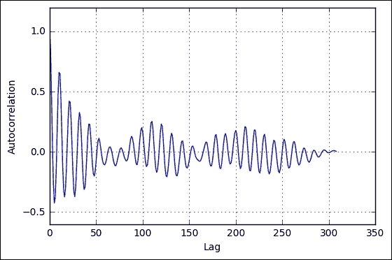
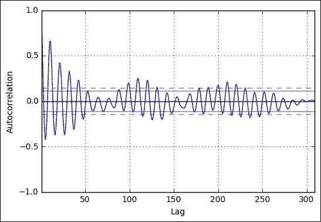
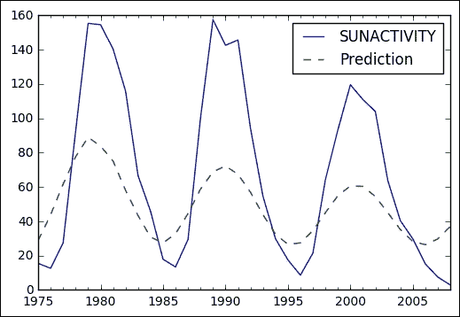
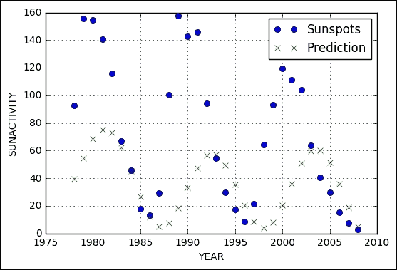
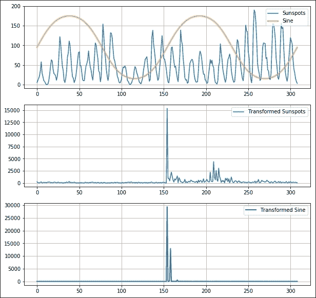
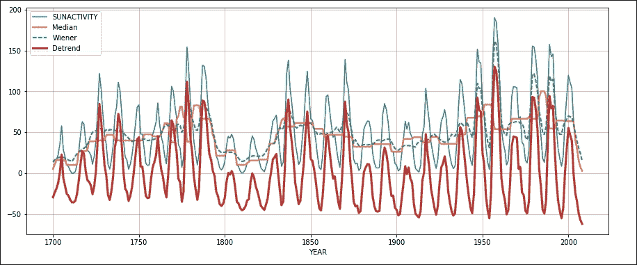

# 七、信号处理和时间序列

**信号处理**是工程和应用数学的一个领域，包括分析随时间变化的变量，这种数据也被称为模拟和数字信号。信号处理技术的一个类别是时间序列分析。一个**时间序列**是一个有序的数据点列表，从最早的测量值开始。数据点通常是等距的，例如，每小时、每天、每周、每月或每年取样。在时间序列分析中，值的顺序很重要。在同一时间序列中，试图导出一个值与另一个数据点或数据点组合(过去的固定周期数)之间的关系是很常见的。

本章中的时间序列例子使用了年太阳黑子周期数据。该数据由`statsmodels`包(一个开源 Python 项目)提供。示例使用了 NumPy/SciPy、Pandas 以及`statsmodels`。

我们将在本章中讨论以下主题:

*   statsmodels 模块
*   移动平均线
*   窗口功能
*   定义协整
*   自相关
*   自回归模型
*   ARMA 模型
*   产生周期性信号
*   傅里叶分析
*   光谱分析
*   过滤

# stats models 模块

要安装`statsmodels`，执行以下命令:

```py
$ pip3 install statsmodels

```

在所附的`ch-07.ipynb`文件中，我们列出了`statsmodels`模块，得到如下结果:

```py
statmodels version 0.6.1
statsmodels.base 
statsmodels.compat 
statsmodels.datasets 
statsmodels.discrete 
statsmodels.distributions 
statsmodels.duration 
statsmodels.emplike 
statsmodels.formula 
statsmodels.genmod 
statsmodels.graphics 
statsmodels.interface 
statsmodels.iolib 
statsmodels.miscmodels 
statsmodels.nonparametric 
DESCRIPTION For an overview of this module, see docs/source/nonparametric.rst PACKAGE CONTENTS _kernel_base _smoothers_lowess api bandwidths statsmodels.regression 
statsmodels.resampling 
statsmodels.robust 
statsmodels.sandbox 
statsmodels.stats 
statsmodels.tests 
statsmodels.tools 
statsmodels.tsa 

```

# 移动平均线

**移动平均线**常用于分析时间序列。移动平均线指定了以前看到的数据窗口，每次窗口向前滑动一个周期时，移动平均线就会取平均值:


不同类型的移动平均线在用于平均的权重上有本质的不同。例如，**指数移动平均线**的权重随时间呈指数递减:


这意味着旧值比新值的影响小，这有时是可取的。

本书代码包中`ch-07.ipynb`文件的以下代码绘制了 11 年和 22 年太阳黑子周期的简单移动平均线:

```py
import matplotlib.pyplot as plt 
import statsmodels.api as sm 
from pandas.stats.moments import rolling_mean 

data_loader = sm.datasets.sunspots.load_pandas() 
df = data_loader.data 
year_range = df["YEAR"].values 
plt.plot(year_range, df["SUNACTIVITY"].values, label="Original") 
plt.plot(year_range, df.rolling(window=11).mean()["SUNACTIVITY"].values, label="SMA 11") 
plt.plot(year_range, df.rolling(window=22).mean()["SUNACTIVITY"].values, label="SMA 22") 
plt.legend() 
plt.show() 

```

我们可以表示指数移动平均线的指数递减权重策略，如下面的 NumPy 代码所示:

```py
weights = np.exp(np.linspace(-1., 0., N)) 
weights /= weights.sum() 

```

简单的移动平均线使用相等的权重，在代码中看起来如下:

```py
def sma(arr, n): 
   weights = np.ones(n) / n 

   return np.convolve(weights, arr)[n-1:-n+1]  

```

因为我们可以将数据加载到**Pandas 数据框**中，所以使用 Pandas`DataFrame.rolling().mean()`功能更方便。使用`statsmodels`加载数据如下:

```py
data_loader = sm.datasets.sunspots.load_pandas() 
df = data_loader.data 

```

最终结果见下图:


# 窗口功能

NumPy 有许多窗口例程，可以像我们在上一节中所做的那样，在滚动窗口中计算权重。

一个**窗口函数**是一个在一个区间(窗口)内定义的函数，或者是零值。我们可以使用窗口函数进行光谱分析和滤波器设计(更多背景信息，请参考[http://en.wikipedia.org/wiki/Window_function](http://en.wikipedia.org/%20wiki/Window_function))。**棚车车窗**为矩形车窗，公式如下:

```py
w(n) = 1 

```

**三角窗**形状像三角形，公式如下:



在上式中，`L`可以等于`N`、`N+1`或`N-1`。在最后一种情况下，窗口函数被称为**巴特利特窗口**。**布莱克曼窗**为钟形，定义如下:


**汉宁窗**也是钟形的，定义如下:


在 Pandas 应用编程接口中，`DataFrame.rolling()`函数提供相同的功能，不同的窗口函数对应不同的`win_type`字符串参数值。另一个参数是窗口的大小，对于太阳黑子数据的中间周期(根据研究，有 11 年、22 年和 100 年三个周期)，窗口将被设置为`22`。代码很简单，在本书代码包的`ch-07.ipynb`文件中给出(这里的数据仅限于过去 150 年，以便在图中进行比较):

```py
import matplotlib.pyplot as plt 
import statsmodels.api as sm 
from pandas.stats.moments import rolling_window 
import pandas as pd 

data_loader = sm.datasets.sunspots.load_pandas() 
df = data_loader.data.tail(150) 
df = pd.DataFrame({'SUNACTIVITY':df['SUNACTIVITY'].values}, index=df['YEAR']) 
ax = df.plot() 

def plot_window(wintype): 
    df2 = df.rolling(window=22,win_type=wintype, 
center=False,axis=0).mean() 
    df2.columns = [wintype] 
    df2.plot(ax=ax) 

plot_window('boxcar') 
plot_window('triang') 
plot_window('blackman') 
plot_window('hanning') 
plot_window('bartlett') 
plt.show() 

```

最终结果见下图:



# 定义协整

**协整**类似于相关性，但被许多人视为定义两个时间序列相关性的优越指标。如果两个时间序列`x(t)`和`y(t)`的线性组合是平稳的，则它们是协整的。在这种情况下，下面的等式应该是固定的:

```py
y(t) - a x(t) 

```

想想一个醉汉和他的狗出去散步。相关性告诉我们它们是否在同一个方向。协整告诉我们一些关于人和他的狗之间的时间距离。我们将使用随机生成的时间序列和真实数据来展示协整性。**增广 Dickey-Fuller** ( **ADF** )测试(见[http://en . Wikipedia . org/wiki/增广 _Dickey%E2%80%93Fuller_test](http://en.wikipedia.org/wiki/Augmented_Dickey%E2%80%93Fuller_test) )测试时间序列中的单位根，可用于确定时间序列的协整性。

对于下面的代码，请看一下本书代码包中的`ch-07.ipynb`文件:

```py
import statsmodels.api as sm 
from pandas.stats.moments import rolling_window 
import pandas as pd 
import statsmodels.tsa.stattools as ts 
import numpy as np 

def calc_adf(x, y): 
    result = sm.OLS(x, y).fit()     
    return ts.adfuller(result.resid) 

data_loader = sm.datasets.sunspots.load_pandas() 
data = data_loader.data.values 
N = len(data) 

t = np.linspace(-2 * np.pi, 2 * np.pi, N) 
sine = np.sin(np.sin(t)) 
print("Self ADF", calc_adf(sine, sine)) 

noise = np.random.normal(0, .01, N) 
print("ADF sine with noise", calc_adf(sine, sine + noise)) 

cosine = 100 * np.cos(t) + 10 
print("ADF sine vs cosine with noise", calc_adf(sine, cosine + noise)) 

print("Sine vs sunspots", calc_adf(sine, data)) 

```

让我们从协整演示开始:

1.  定义以下函数来计算 ADF 统计量:

    ```py
            def calc_adf(x, y): 
                result = sm.OLS(x, y).fit()     
                return ts.adfuller(result.resid) 

    ```

2.  将太阳黑子数据加载到 NumPy 数组中:

    ```py
            data_loader = sm.datasets.sunspots.load_pandas() 
            data = data_loader.data.values 
            N = len(data) 

    ```

3.  生成`sine`并计算`sine`与自身的协整:

    ```py
            t = np.linspace(-2 * np.pi, 2 * np.pi, N) 
            sine = np.sin(np.sin(t)) 
            print("Self ADF", calc_adf(sine, sine)) 

    ```

4.  The code should print the following:

    ```py
            Self ADF (-5.0383000037165746e-16, 0.95853208606005591, 0, 308,  
            {'5%': -2.8709700936076912, '1%': -3.4517611601803702, '10%':  
            -2.5717944160060719}, -21533.113655477719)

    ```

    打印输出中的第一个值是 ADF 指标，第二个值是 p 值。如你所见，p 值非常高。以下值是滞后和样本大小。最后的字典给出了这个精确样本量的 t 分布值。

5.  现在，向`sine`添加噪声，演示噪声将如何影响信号:

    ```py
            noise = np.random.normal(0, .01, N) 
            print("ADF sine with noise", calc_adf(sine, sine + noise)) 

    ```

6.  With the noise, we get the following results:

    ```py
           ADF sine with noise (-7.4535502402193075, 5.5885761455106898e-
           11, 3, 305, {'5%': -2.8710633193086648, '1%': 
           -3.4519735736206991, '10%': -2.5718441306100512}, 
           -1855.0243977703672)

    ```

    p 值已经大幅下降。这里的 ADF 度量`-7.45`低于字典中所有的临界值。所有这些都是拒绝协整的有力论据。

7.  让我们生成一个更大幅度和偏移的`cosine`。再次，让我们添加噪音:

```py
        cosine = 100 * np.cos(t) + 10 
        print("ADF sine vs cosine with noise", calc_adf(sine, cosine + 
        noise)) 

```

将打印以下值:

```py
ADF sine vs cosine with noise (-17.927224617871534, 2.8918612252729532e-30, 16, 292, {'5%': -2.8714895534256861, '1%': -3.4529449243622383, '10%': -2.5720714378870331}, -11017.837238220782)

```

同样，我们有充分的理由拒绝协整。检查`sine`和`sunspots`之间的协整给出以下输出:

```py
Sine vs sunspots (-6.7242691810701016, 3.4210811915549028e-09, 16, 292, {'5%': -2.8714895534256861, '1%': -3.4529449243622383, '10%': -2.5720714378870331}, -1102.5867415291168)

```

这里使用的对的置信水平大致相同，因为它们取决于数据点的数量，而数据点的数量变化不大。下表总结了结果:

<colgroup><col> <col> <col> <col> <col> <col> <col></colgroup> 
| **配对** | **统计** | **p 值** | **5%** | **1%** | **10%** | **拒绝** |
| 自正弦 | -5.03E-16 | Zero point nine five | -2.87 | -3.45 | -2.57 | 不 |
| 正弦与正弦噪声 | -7.45 | 5.58E-11 | -2.87 | -3.45 | -2.57 | 是 |
| 正弦和余弦与噪声的关系 | -17.92 | 2.89E-30 | -2.87 | -3.45 | -2.57 | 是 |
| 正弦与太阳黑子 | -6.72 | 3.42E-09 | -2.87 | -3.45 | -2.57 | 是 |

# 自相关

**自相关**是数据集内的相关性，可以指示趋势。

对于给定的时间序列，在已知均值和标准差的情况下，我们可以使用期望值运算符定义时间`s`和`t`的自相关，如下所示:



本质上，这是应用于时间序列和滞后时间序列的相关公式。

例如，如果我们有一个周期的滞后，我们可以检查前一个值是否影响当前值。要做到这一点，自相关值必须相当高。

在前一章[第 6 章](06.html "Chapter 6. Data Visualization")、*数据可视化*中，我们已经使用了绘制自相关的 Pandas 函数。在这个例子中，我们将使用 NumPy `correlate()`函数来计算太阳黑子周期的实际自相关值。最后，我们需要将我们收到的值规范化。按如下方式应用数字按钮`correlate()`功能:

```py
y = data - np.mean(data) 
norm = np.sum(y ** 2) 
correlated = np.correlate(y, y, mode='full')/norm 

```

我们还对与最高相关性相对应的指数感兴趣。这些索引可以通过 NumPy `argsort()`函数找到，该函数返回对数组进行排序的索引:

```py
print np.argsort(res)[-5:] 

```

这些是最大自相关的指数:

```py
[ 9 11 10  1  0]  

```

根据定义，最大的自相关是零滞后，即信号与其自身的相关性。第二大值是滞后 1 年和 10 年。查看本书代码包中的`ch-07.ipynb`文件:

```py
import numpy as np 
import pandas as pd 
import statsmodels.api as sm 
import matplotlib.pyplot as plt 
from pandas.tools.plotting import autocorrelation_plot 

data_loader = sm.datasets.sunspots.load_pandas() 
data = data_loader.data["SUNACTIVITY"].values 
y = data - np.mean(data) 
norm = np.sum(y ** 2) 
correlated = np.correlate(y, y, mode='full')/norm 
res = correlated[len(correlated)/2:] 

print(np.argsort(res)[-5:]) 
plt.plot(res) 
plt.grid(True) 
plt.xlabel("Lag") 
plt.ylabel("Autocorrelation") 
plt.show() 
autocorrelation_plot(data) 
plt.show() 

```

最终结果见下图:



将之前的剧情与 Pandas 制作的剧情进行对比:



# 自回归模型

一个**自回归模型**可以用来表示一个时间序列，目标是预测未来值。在这样的模型中，假设一个变量依赖于它以前的值。该关系也被假设为线性的，并且我们需要拟合数据以便找到数据的参数。自回归模型的数学公式如下:


在前面的公式中，`c`是常数，最后一项是随机分量，也称为白噪声。

这给我们带来了非常常见的线性回归问题。出于实际原因，保持模型简单并且只包含必要的滞后组件是很重要的。在机器学习术语中，这些被称为特征。对于回归问题，Python 机器学习 scikit-learn 库即使不是最好的选择，也是一个不错的选择。我们将在第 10 章、*预测性分析和机器学习*中使用该应用编程接口。

在回归设置中，我们经常会遇到过度拟合的问题——当我们对一个样本有完美的拟合时，这个问题就会出现，当我们引入新的数据点时，这个样本的性能会很差。标准的解决方案是应用交叉验证(或者使用避免过度拟合的算法)。在这种方法中，我们估计部分样本的模型参数。其余的数据用于测试和评估模型。这其实是一个简化的解释。还有更复杂的交叉验证方案，其中很多都得到 scikit-learn 的支持。为了评估模型，我们可以计算适当的评估指标。可以想象，有许多度量标准，由于实践者的不断调整，这些度量标准可以有不同的定义。我们可以在书上或维基百科上找到这些定义。重要的是要记住，对预测或拟合的评估不是一门精确的科学。有这么多指标的事实只能证实这一点。

我们将使用前一节中找到的前两个滞后分量，使用`scipy.optimize.leastsq()`函数建立模型。我们可以选择线性代数函数来代替。然而，`leastsq()`功能更加灵活，让我们可以指定几乎任何类型的模型。按照以下步骤设置模型:

```py
def model(p, x1, x10): 
   p1, p10 = p 
   return p1 * x1 + p10 * x10 

def error(p, data, x1, x10): 
   return data - model(p, x1, x10) 

```

要拟合模型，初始化参数列表并将其传递给`leastsq()`函数，如下所示:

```py
def fit(data): 
   p0 = [.5, 0.5] 
   params = leastsq(error, p0, args=(data[10:], data[9:-1], data[:-10]))[0] 
   return params 

```

根据部分数据训练模型:

```py
cutoff = .9 * len(sunspots) 
params = fit(sunspots[:cutoff]) 
print "Params", params 

```

以下是我们得到的参数:

```py
Params [ 0.67172672  0.33626295]

```

有了这些参数，我们将绘制预测值并计算各种指标。以下是我们获得的指标值:

```py
Root mean square error 22.8148122613
Mean absolute error 17.6515446503
Mean absolute percentage error 60.7817800736
Symmetric Mean absolute percentage error 34.9843386176
Coefficient of determination 0.799940292779

```

有关最终结果，请参考下图:


似乎我们有许多几乎是准确无误的预测，但也有一堆相当遥远的预测。总的来说，我们没有完美的契合；然而，这并不是一场彻底的灾难。它在中间的某个地方。

以下代码在本书代码包的`ch-07.ipynb`文件中:

```py
from scipy.optimize import leastsq 
import statsmodels.api as sm 
import matplotlib.pyplot as plt 
import numpy as np 

def model(p, x1, x10): 
   p1, p10 = p 
   return p1 * x1 + p10 * x10 

def error(p, data, x1, x10): 
   return data - model(p, x1, x10) 

def fit(data): 
   p0 = [.5, 0.5] 
   params = leastsq(error, p0, args=(data[10:], data[9:-1], data[:-10]))[0] 
   return params 

data_loader = sm.datasets.sunspots.load_pandas() 
sunspots = data_loader.data["SUNACTIVITY"].values 

cutoff = .9 * len(sunspots) 
params = fit(sunspots[:cutoff]) 
print("Params", params) 

pred = params[0] * sunspots[cutoff-1:-1] + params[1] * sunspots[cutoff-10:-10] 
actual = sunspots[cutoff:] 
print("Root mean square error", np.sqrt(np.mean((actual - pred) ** 2))) 
print("Mean absolute error", np.mean(np.abs(actual - pred))) 
print("Mean absolute percentage error", 100 * np.mean(np.abs(actual - pred)/actual)) 
mid = (actual + pred)/2 
print("Symmetric Mean absolute percentage error", 100 * np.mean(np.abs(actual - pred)/mid)) 
print("Coefficient of determination", 1 - ((actual - pred) ** 2).sum()/ ((actual - actual.mean()) ** 2).sum()) 
year_range = data_loader.data["YEAR"].values[cutoff:] 
plt.plot(year_range, actual, 'o', label="Sunspots") 
plt.plot(year_range, pred, 'x', label="Prediction") 
plt.grid(True) 
plt.xlabel("YEAR") 
plt.ylabel("SUNACTIVITY") 
plt.legend() 
plt.show() 

```

# ARMA 模型

**ARMA 模型**常用于预测一个时间序列。这些模型结合了自回归和移动平均模型。在移动平均模型中，我们假设一个变量是时间序列平均值和噪声成分线性组合的和。

### 注

自回归和移动平均模型可以有不同的顺序。一般来说，我们可以用`p`自回归项和`q`移动平均项定义一个 ARMA 模型，如下所示:


在前面的公式中，就像在自回归模型公式中一样，我们有一个常数和一个白噪声分量；然而，我们也试图拟合滞后噪声分量。

幸运的是，可以使用`statsmodelssm.tsa.ARMA()`例程进行此分析。将数据拟合到`ARMA(10,1)`模型，如下所示:

```py
model = sm.tsa.ARMA(df, (10,1)).fit() 

```

执行预测(statsmodels 大量使用字符串):

```py
prediction = model.predict('1975', str(years[-1]), dynamic=True) 

```

最终结果见下图:



拟合度很差，因为坦率地说，我们过度拟合了数据。上一节中更简单的模型效果更好。示例代码可以在本书代码包的`ch-07.ipynb`文件中找到:

```py
import pandas as pd 
import matplotlib.pyplot as plt 
import statsmodels.api as sm 
import datetime 

data_loader = sm.datasets.sunspots.load_pandas() 
df = data_loader.data 
years = df["YEAR"].values.astype(int) 
df.index = pd.Index(sm.tsa.datetools.dates_from_range(str(years[0]), str(years[-1]))) 
del df["YEAR"] 

model = sm.tsa.ARMA(df, (10,1)).fit() 
prediction = model.predict('1975', str(years[-1]), dynamic=True) 

df['1975':].plot() 
prediction.plot(style='--', label='Prediction') 
plt.legend() 
plt.show() 

```

# 产生周期信号

许多自然现象就像一个精确的时钟一样有规律，值得信赖。有些现象呈现出似乎有规律的模式。一组科学家通过**希尔伯特-黄变换**发现了太阳黑子活动的三个周期。周期的持续时间大约为 11 年、22 年和 100 年。通常，我们会使用三角函数(如正弦函数)来模拟周期信号。你可能还记得高中时的一些三角学。这就是我们这个例子所需要的。因为我们有三个周期，所以创建一个模型似乎是合理的，它是三个正弦函数的线性组合。这仅仅需要对自回归模型的代码进行微小的调整。以下代码请参考本书代码包中的`periodic.py`文件:

```py
from scipy.optimize import leastsq 
import statsmodels.api as sm 
import matplotlib.pyplot as plt 
import numpy as np 
def model(p, t): 
   C, p1, f1, phi1 , p2, f2, phi2, p3, f3, phi3 = p 
   return C + p1 * np.sin(f1 * t + phi1) + p2 * np.sin(f2 * t + phi2) +p3 * np.sin(f3 * t + phi3) 

def error(p, y, t): 
   return y - model(p, t) 

def fit(y, t): 
   p0 = [y.mean(), 0, 2 * np.pi/11, 0, 0, 2 * np.pi/22, 0, 0, 2 * np.pi/100, 0] 
   params = leastsq(error, p0, args=(y, t))[0] 
   return params 

data_loader = sm.datasets.sunspots.load_pandas() 
sunspots = data_loader.data["SUNACTIVITY"].values 
years = data_loader.data["YEAR"].values 

cutoff = .9 * len(sunspots) 
params = fit(sunspots[:cutoff], years[:cutoff]) 
print("Params", params) 

pred = model(params, years[cutoff:]) 
actual = sunspots[cutoff:] 
print("Root mean square error", np.sqrt(np.mean((actual - pred) ** 2))) 
print("Mean absolute error", np.mean(np.abs(actual - pred))) 
print("Mean absolute percentage error", 100 * np.mean(np.abs(actual - pred)/actual)) 
mid = (actual + pred)/2 
print("Symmetric Mean absolute percentage error", 100 * np.mean(np.abs(actual - pred)/mid)) 
print("Coefficient of determination", 1 - ((actual - pred) ** 2).sum()/ ((actual - actual.mean()) ** 2).sum()) 
year_range = data_loader.data["YEAR"].values[cutoff:] 
plt.plot(year_range, actual, 'o', label="Sunspots") 
plt.plot(year_range, pred, 'x', label="Prediction") 
plt.grid(True) 
plt.xlabel("YEAR") 
plt.ylabel("SUNACTIVITY") 
plt.legend() 
plt.show() 

```

我们得到以下输出:

```py
Params [ 47.18800285  28.89947419   0.56827284   6.51168446   4.55214999
0.29372077 -14.30926648 -18.16524041   0.06574835  -4.37789602]
Root mean square error 59.5619175499
Mean absolute error 44.5814573306
Mean absolute percentage error 65.1639657495
Symmetric Mean absolute percentage error 78.4477263927
Coefficient of determination -0.363525210982

```

第一行显示了我们尝试的模型的系数。我们的平均绝对误差为 44，这意味着我们平均在任一方向上偏离了这个量。我们还希望确定系数尽可能接近 1，以获得良好的拟合。相反，我们得到一个负值，这是不可取的。有关最终结果，请参考下图:



# 傅里叶分析

**傅里叶分析**是基于以数学家约瑟夫·傅里叶命名的**傅里叶级数**而产生的。傅立叶级数是一种数学方法，用于将函数表示为正弦和余弦项的无穷级数。所讨论的函数可以是实数或复数:


傅里叶分析最有效的算法是**快速傅里叶变换** ( **快速傅里叶变换**)。该算法在 SciPy 和 NumPy 中实现。当应用于时间序列数据时，傅立叶分析将映射转换到频域，产生频谱。频谱将谐波显示为特定频率的明显尖峰。例如，音乐是由不同的频率组成的，音符 A 在 440 赫兹。音符 A 可以由音叉产生。我们可以用钢琴之类的乐器来演奏这个和其他的音符。白噪声是由许多频率组成的信号，这些频率被相等地表示。白光是光的所有可见频率的混合，也同样表现出来。

在下面的例子中，我们将导入两个函数(参考`ch-07.ipynb`):

```py
from scipy.fftpack import rfft 
from scipy.fftpack import fftshift 

```

`rfft()`功能对实值数据进行快速傅立叶变换。我们也可以使用`fft()`函数，但是它在这个特定的数据集上给出了一个警告。`fftshift()`功能将零频率分量(数据的平均值)移动到频谱的中间，以便更好地可视化。我们还将看一下正弦波，因为这很容易理解。创建正弦波并对其应用快速傅立叶变换:

```py
t = np.linspace(-2 * np.pi, 2 * np.pi, len(sunspots)) 
mid = np.ptp(sunspots)/2 
sine = mid + mid * np.sin(np.sin(t)) 

sine_fft = np.abs(fftshift(rfft(sine))) 
print "Index of max sine FFT", np.argsort(sine_fft)[-5:] 

```

以下输出显示了对应于最大振幅的指数:

```py
Index of max sine FFT [160 157 166 158 154]

```

对太阳黑子数据进行快速傅立叶变换:

```py
transformed = np.abs(fftshift(rfft(sunspots))) 
print "Indices of max sunspots FFT", np.argsort(transformed)[-5:] 

```

光谱中的五个最大峰值可以在以下指数中找到:

```py
Indices of max sunspots FFT [205 212 215 209 154]

```

最大的山峰也位于 154。最终结果见下图:



完整的代码位于本书代码包的`ch-07.ipynb`文件中:

```py
import numpy as np 
import statsmodels.api as sm 
import matplotlib.pyplot as plt 
from scipy.fftpack import rfft 
from scipy.fftpack import fftshift 

data_loader = sm.datasets.sunspots.load_pandas() 
sunspots = data_loader.data["SUNACTIVITY"].values 

t = np.linspace(-2 * np.pi, 2 * np.pi, len(sunspots)) 
mid = np.ptp(sunspots)/2 
sine = mid + mid * np.sin(np.sin(t)) 

sine_fft = np.abs(fftshift(rfft(sine))) 
print("Index of max sine FFT", np.argsort(sine_fft)[-5:]) 

transformed = np.abs(fftshift(rfft(sunspots))) 
print("Indices of max sunspots FFT", np.argsort(transformed)[-5:]) 

plt.subplot(311) 
plt.plot(sunspots, label="Sunspots") 
plt.plot(sine, lw=2, label="Sine") 
plt.grid(True) 
plt.legend() 
plt.subplot(312) 
plt.plot(transformed, label="Transformed Sunspots") 
plt.grid(True) 
plt.legend() 
plt.subplot(313) 
plt.plot(sine_fft, lw=2, label="Transformed Sine") 
plt.grid(True) 
plt.legend() 
plt.show() 

```

# 光谱分析

在前一节中，我们绘制了数据集的振幅谱。物理信号的**功率谱**可视化了信号的能量分布。我们可以很容易地修改代码来绘制功率谱，只需将值平方如下:

```py
plt.plot(transformed ** 2, label="Power Spectrum") 

```

**相位谱**将相位(正弦函数的初始角度)可视化，可以绘制如下:

```py
plt.plot(np.angle(transformed), label="Phase Spectrum") 

```

有关最终结果，请参考下图:


完整代码请参考本书代码包中的`ch-07.ipynb`文件。

# 过滤

**滤波**是一种信号处理，包括去除或抑制信号的一部分。在应用快速傅立叶变换后，我们可以过滤高频或低频，或者我们可以尝试去除白噪声。白噪声是具有恒定功率谱的随机信号，因此不包含任何有用的信息。`scipy.signal`包有许多用于过滤的实用程序。在本例中，我们将演示这些例程的一个小示例:

*   **中值滤波器**计算滚动窗口中的中值(参见[http://en.wikipedia.org/wiki/Median_filter](http://en.wikipedia.org/wiki/Median_filter))。它由`medfilt()`函数实现，该函数有一个可选的窗口大小参数。
*   **维纳滤波器**使用统计数据去除噪声(参见[http://en.wikipedia.org/wiki/Wiener_filter](http://en.wikipedia.org/wiki/Wiener_filter))。对于滤波器`g(t)`和信号`s(t)`，通过卷积`(g * [s + n])(t)`计算输出。通过`wiener()`功能实现。该函数还有一个可选的窗口大小参数。
*   **去趋势过滤器**去除趋势。这可以是线性或恒定趋势。通过`detrend()`功能实现。

以下代码请参考本书代码包中的`ch-07.ipynb`文件:

```py
import statsmodels.api as sm 
import matplotlib.pyplot as plt 
from scipy.signal import medfilt 
from scipy.signal import wiener 
from scipy.signal import detrend 

data_loader = sm.datasets.sunspots.load_pandas() 
sunspots = data_loader.data["SUNACTIVITY"].values 
years = data_loader.data["YEAR"].values 

plt.plot(years, sunspots, label="SUNACTIVITY") 
plt.plot(years, medfilt(sunspots, 11), lw=2, label="Median") 
plt.plot(years, wiener(sunspots, 11), '--', lw=2, label="Wiener") 
plt.plot(years, detrend(sunspots), lw=3, label="Detrend") 
plt.xlabel("YEAR") 
plt.grid(True) 
plt.legend() 
plt.show() 

```

有关最终结果，请参考下图:



# 总结

在本章中，时间序列示例使用了年太阳黑子周期数据。

您了解到，在过去的固定时间段内，在同一时间序列中，试图推导一个值与另一个数据点或数据点组合之间的关系是很常见的。

移动平均值指定了以前看到的数据的窗口，每次窗口向前滑动一个周期时，移动平均值就会被平均。在 Pandas 应用编程接口中，`DataFrame.rolling()`函数为窗口函数功能提供了与不同窗口函数对应的不同的`win_type`字符串参数值。

协整类似于相关性，是定义两个时间序列相关性的度量。在回归设置中，我们经常遇到过度拟合的问题。当我们完全适合一个样本时，这个问题就出现了，当我们引入新的数据点时，这个样本表现不佳。为了评估模型，我们可以计算适当的评估指标。

数据库是数据分析的重要工具。关系数据库从 20 世纪 70 年代就已经出现了。最近，NoSQL 数据库已经成为一个可行的选择。下一章，[第 8 章](08.html "Chapter 8.  Working with Databases")、*使用数据库*，包含关于各种数据库(关系数据库和 NoSQL 数据库)和相关应用编程接口的信息。