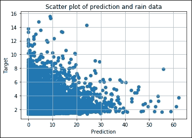
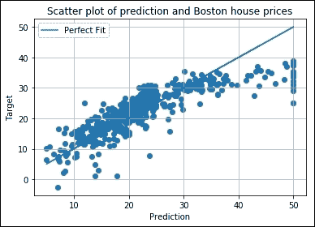
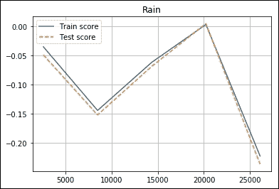
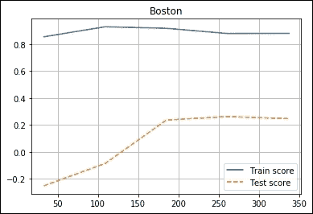
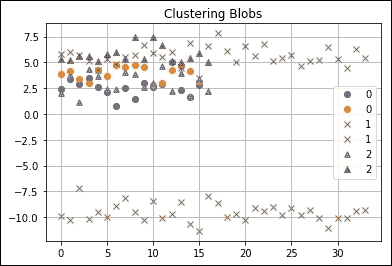
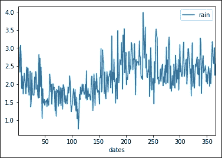
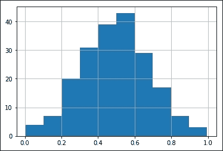
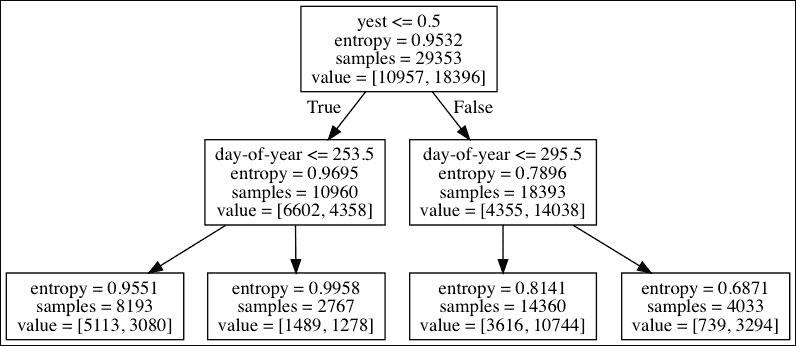

# 十、预测性分析和机器学习

**预测性分析**和**机器学习**最近被许多行业接受进入主流数据科学和数据分析。它们现在与其他领域相比，毫无疑问，我们可以期待大量的快速增长。甚至有人预测，机器学习将加速发展，在短短几十年内，人类的劳动将被智能机器所取代(见[http://en.wikipedia.org/wiki/Technological_singularity](http://en.wikipedia.org/wiki/Technological_singularity))。**人工通用智能** ( **AGI** )目前的技术水平离那个乌托邦还很远，但机器学习已经取得了长足的进步，并被用于自动驾驶汽车、聊天机器人和基于人工智能的助手，如亚马逊的 Alexa、苹果的 Siri 和 Ok Google。即使是简单的决策，比如确定网络上的图片是包含狗还是猫，仍然需要大量的计算能力和数据。预测性分析使用各种技术，包括机器学习，来做出有用的预测。例如，它可以用来确定客户是否能够偿还贷款，或者识别怀孕的女性客户(见[http://www . Forbes . com/sites/kashmirhill/2012/02/16/how-target-揣摩-一名少女在她父亲怀孕之前怀孕了/](http://www.forbes.com/sites/kashmirhill/2012/02/16/how-target-figured-out-a-teen-girl-was-pregnant-before-her-father-did/) )。

为了做出这些预测，从大量数据中提取特征。我们之前提到过特性。特征，也称为预测因子，是可以用来进行预测的输入变量。本质上，我们在数据中找到特征，并寻找将特征映射到目标的函数，目标可能是已知的，也可能是未知的。找到合适的函数可能很难。通常，不同的算法和模型被组合成所谓的**集合**。集合的输出可以是多数票，也可以是一组模型的平均值，但我们也可以使用更高级的算法来产生最终结果。我们不会在本章中使用合奏，但这是需要记住的。

在前一章中，我们尝到了机器学习算法的甜头——朴素贝叶斯分类算法。我们可以将机器学习算法和方法分为三大类:

*   **监督学习**:监督学习是指对训练数据进行标注的方法，即给算法提供分类数据的例子。使用标记的训练数据，我们创建一个函数，将数据中的输入变量映射到结果变量。例如，如果我们想对垃圾邮件进行分类，我们需要提供垃圾邮件和普通电子邮件的例子。监督学习算法的例子有线性回归、逻辑回归、状态向量机、随机森林、k 近邻等等。
*   **无监督学习**:无监督学习是指不标注训练数据的方法。这种类型的学习可以发现模式，例如大型数据集中的集群。无监督学习算法的例子是 k-means 和层次聚类。
*   **强化学习**:强化学习是指计算机从反馈中学习的方法。例如，计算机可以通过与自己对弈来学习下棋。当然，其他游戏和技能也是可以学习的，如果你还记得 1983 年的电影*战争游戏*(见[http://en.wikipedia.org/wiki/WarGames](http://en.wikipedia.org/wiki/WarGames))想到井字游戏和热核战争。

我们将以天气预报为例。在本章中，我们将主要使用 Python scikit-learn 库。这个库有聚类、回归和分类算法。然而，scikit-learn 没有涵盖一些机器学习算法，因此对于这些算法，我们将使用其他 API。本章涵盖的主题如下:

*   预处理
*   逻辑回归分类
*   支持向量机分类
*   弹性回归
*   支持向量回归
*   具有相似性传播的聚类
*   均值漂移
*   遗传算法
*   神经网络
*   决策树

# 预处理

Library scikit-learn 有一个预处理模块，这是本节的主题。在上一章[第九章](09.html "Chapter 9. Analyzing Textual Data and Social Media")、*分析文本数据和社交媒体*中，我们安装了 scikit-learn，并通过过滤掉停止词来练习一种数据预处理形式。一些机器学习算法对于平均值为 0、方差为 1 的非高斯分布的数据有问题。`sklearn.preprocessing`模块处理这个问题。我们将在本节中演示它。我们将对来自荷兰 KNMI 研究所的气象数据进行预处理(德比尔特气象站原始数据来自[http://www . KNMI . nl/气候学/daily _ data/data files 3/260/etmgeg _ 260 . zip](http://www.knmi.nl/climatology/daily_data/datafiles3/260/etmgeg_260.zip))。数据只是原始数据文件的一列，包含每日降雨量值。它以[第 5 章](05.html "Chapter 5. Retrieving, Processing, and Storing Data")、*检索、处理和存储数据*中讨论的`.npy`格式存储。我们可以将数据加载到 NumPy 数组中。这些值是整数，我们必须乘以 0.1，才能得到以毫米为单位的日降水量。

数据有一个有点奇怪的特点，0.05 毫米以下的数值被引用为-1。我们将这些值设置为 0.025 (0.05 除以 2)。原始数据中有几天缺少值。我们将完全忽略丢失的数据。我们可以这样做，因为我们有很多数据点。数据在本世纪初丢失了大约一年，在本世纪后期丢失了几天。`preprocessing`模块有一个`Imputer`类，它有处理缺失值的默认策略。然而，在这种情况下，这些策略似乎不合适。数据分析就是把数据当作一个窗口来看待——一个通向知识的窗口。数据清理和输入是可以让我们的窗口看起来更好的活动。然而，我们应该注意不要过分扭曲原始数据。

我们的机器学习示例的主要特征将是一系列一年中的某一天的值(1 到 366)。这应该有助于解释任何季节性影响。

安德森-达林检验的平均值、方差和输出(见[第 4 章](04.html "Chapter 4. Statistics and Linear Algebra")、*统计和线性代数*)打印如下:

```py
Rain mean 2.17919594267
Rain variance 18.803443919
Anderson rain (inf, array([ 0.576,  0.656,  0.787,  0.918,     
1.092]), array([ 15\. ,  10\. ,   5\. ,   2.5,   1\. ]))

```

我们可以有把握地得出结论，数据没有 0 的平均值和 1 的方差，也不符合正态分布。数据中有很大比例的 0 值对应于没有下雨的日子。大量降雨越来越少(这是好事)。然而，数据分布是完全不对称的，因此不是高斯分布。我们可以很容易地安排 0 的平均值和 1 的方差。使用`scale()`功能缩放数据:

```py
scaled = preprocessing.scale(rain) 

```

我们现在得到了平均值和方差的要求值，但是数据分布仍然是不对称的:

```py
Scaled mean 3.41301602808e-17
Scaled variance 1.0
Anderson scaled (inf, array([ 0.576,  0.656,  0.787,  0.918,  
1.092]), array([ 15\. ,  10\. ,   5\. ,   2.5,   1\. ]))

```

有时，我们希望将数字特征值转换为布尔值。这通常用于文本分析，以简化计算。使用`binarize()`功能进行转换:

```py
binarized = preprocessing.binarize(rain) 
print(np.unique(binarized), binarized.sum()) 

```

默认情况下，会创建一个新数组；我们也可以选择就地进行手术。默认阈值为零，这意味着正值被 1 替换，负值被 0 替换:

```py
[ 0\.  1.] 24594.0

```

`LabelBinarizer`类可以将整数标记为类(在分类的上下文中):

```py
lb = preprocessing.LabelBinarizer() 
lb.fit(rain.astype(int)) 
print(lb.classes_) 

```

输出是从 0 到 62 的整数列表。参考本书代码包中的`ch-10.ipynb`文件:

```py
import numpy as np 
from sklearn import preprocessing 
from scipy.stats import anderson 

rain = np.load('rain.npy') 
rain = .1 * rain 
rain[rain < 0] = .05/2 
print("Rain mean", rain.mean()) 
print("Rain variance", rain.var()) 
print("Anderson rain", anderson(rain)) 

scaled = preprocessing.scale(rain) 
print("Scaled mean", scaled.mean()) 
print("Scaled variance", scaled.var()) 
print("Anderson scaled", anderson(scaled)) 

binarized = preprocessing.binarize(rain) 
print(np.unique(binarized), binarized.sum()) 

lb = preprocessing.LabelBinarizer() 
lb.fit(rain.astype(int)) 
print(lb.classes_) 

```

# 用逻辑回归进行分类

**逻辑回归**是一种分类算法(见[http://en.wikipedia.org/wiki/Logistic_regression](http://en.wikipedia.org/wiki/Logistic_regression))。这种算法可以用来预测一个类或事件发生的概率。具有多个类的分类问题可以简化为二元分类问题。在这种最简单的情况下，一个类的高概率意味着另一个类的低概率。逻辑回归基于**逻辑函数**，其值在 0 和 1 之间，概率也是如此。因此，逻辑函数可用于将任意值转换为概率。

我们可以定义一个用逻辑回归进行分类的函数。按如下方式创建分类器对象:

```py
clf = LogisticRegression(random_state=12) 

```

`random_state`参数就像伪随机发生器的种子。在本书的前面，我们谈到了交叉验证作为一种避免过度拟合的技术的重要性。 **k 折叠交叉验证**是一种交叉验证形式，涉及 *k* (一个小整数)和称为**折叠**的随机数据分区。在 *k* 迭代中，每个折叠使用一次进行验证，其余数据用于训练。scikit-learn 中的类的默认 *k* 值为 3，但通常我们可能希望将其设置为更高的值，例如 5 或 10。迭代的结果可以在最后合并。scikit-learn 有一个用于 k 倍交叉验证的实用工具`KFold`类。用`10`折叠创建一个`KFold`对象，如下所示:

```py
kf = KFold(len(y), n_folds=10) 

```

使用`fit()`方法训练数据，如下所示:

```py
clf.fit(x[train], y[train]) 

```

`score()`方法测量分类精度:

```py
scores.append(clf.score(x[test], y[test])) 

```

在本例中，我们将使用一年中的某一天和前一天的降雨量作为特征。构建一个带有特征的数组，如下所示:

```py
x = np.vstack((dates[:-1], rain[:-1])) 

```

作为类，首先定义降雨量为 0 的无雨日；第二，我们的数据中对应于-1 的低降雨量；第三，雨天。这三个类可以链接到我们数据中的值的符号:

```py
y = np.sign(rain[1:]) 

```

使用这种设置，我们获得了 57%的平均准确率。对于 scikit-learn 样本 iris 数据集，我们得到的平均准确率为 41%(参考本书代码包中的`ch-10.ipynb`文件):

```py
from sklearn.linear_model import LogisticRegression 
from sklearn.cross_validation import KFold 
from sklearn import datasets 
import numpy as np 

def classify(x, y): 
    clf = LogisticRegression(random_state=12) 
    scores = [] 
    kf = KFold(len(y), n_folds=10) 
    for train,test in kf: 
      clf.fit(x[train], y[train]) 
      scores.append(clf.score(x[test], y[test])) 

    print("accuracy", np.mean(scores)) 

rain = np.load('rain.npy') 
dates = np.load('doy.npy') 

x = np.vstack((dates[:-1], rain[:-1])) 
y = np.sign(rain[1:]) 
classify(x.T, y) 

#iris example 
iris = datasets.load_iris() 
x = iris.data[:, :2] 
y = iris.target 
classify(x, y) 

```

# 支持向量机分类

**支持向量机**(**【SVM】**)可用于回归，即**支持向量回归** ( **SVR** )和**支持向量分类** ( **SVC** )。这个算法是弗拉基米尔·瓦普尼克在 1993 年发明的(见[http://en.wikipedia.org/wiki/Support_vector_machine](http://en.wikipedia.org/wiki/Support_vector_machine))。SVM 将数据点映射到多维空间中的点。该映射由所谓的**内核函数**执行。核函数可以是线性的或非线性的。然后将分类问题简化为寻找一个或多个超平面，该超平面最好地将点分成类。很难用超平面进行分离，这就导致了**软边界**概念的出现。软裕度衡量误分类的容限，由通常用 c 表示的常数控制。另一个重要参数是核函数的类型，它可以是以下之一:

*   线性函数
*   多项式函数
*   径向基函数
*   sigmoid 函数

一个**网格搜索**可以为一个问题找到合适的参数。这是一种尝试所有可能的参数组合的系统方法。我们将使用 scikit-learn `GridSearchCV`类执行网格搜索。我们给这个类一个带有字典的分类器或回归器类型对象。字典的键是我们想要调整的参数。字典的值是要尝试的参数值的对应列表。scikit-learn API 有许多类，它们向对应的类添加了交叉验证功能。默认情况下，交叉验证处于关闭状态。如下创建一个`GridSearchCV`对象:

```py
clf = GridSearchCV(SVC(random_state=42, max_iter=100), {'kernel': ['linear', 'poly', 'rbf'], 'C':[1, 10]}) 

```

在这一行中，我们指定了最大迭代次数，以避免过度考验我们的耐心。交叉验证也被关闭，以加快过程。此外，我们改变了核的类型和软边界参数。

前面的代码片段为可能的参数变化创建了一个 2 乘 3 的网格。如果我们有更多的时间，我们可以用更多可能的值创建一个更大的网格。我们还会将`GridSearchCV`的`cv`参数设置为我们想要的折叠数，例如 5 或 10。最大迭代次数也应该设置为更高的值。不同的内核在适应所需的时间上可能有很大的差异。我们可以打印更多信息，例如每个参数值组合的执行时间，详细参数设置为非零整数值。通常，我们希望将软裕度参数改变几个数量级，例如，从 1 到 10，000。我们可以通过数字 T2 功能来实现这一点。

应用这个分类器，我们获得了 56%的天气数据准确率和 82%的虹膜样本数据集准确率。`GridSearchCV`的`grid_scores_`字段包含网格搜索得到的分数。对于天气数据，得分如下:

```py
[mean: 0.42879, std: 0.11308, params: {'kernel': 'linear', 'C': 1},
 mean: 0.55570, std: 0.00559, params: {'kernel': 'poly', 'C': 1},
 mean: 0.36939, std: 0.00169, params: {'kernel': 'rbf', 'C': 1},
 mean: 0.30658, std: 0.03034, params: {'kernel': 'linear', 'C':10},
 mean: 0.41673, std: 0.20214, params: {'kernel': 'poly', 'C': 10},
 mean: 0.49195, std: 0.08911, params: {'kernel': 'rbf', 'C': 10}]
```

对于虹膜样本数据，我们得到以下分数:

```py
[mean: 0.80000, std: 0.03949, params: {'kernel': 'linear', 'C': 1},
 mean: 0.58667, std: 0.12603, params: {'kernel': 'poly', 'C': 1},
 mean: 0.80000, std: 0.03254, params: {'kernel': 'rbf', 'C': 1},
 mean: 0.74667, std: 0.07391, params: {'kernel': 'linear', 'C':10},
 mean: 0.56667, std: 0.13132, params: {'kernel': 'poly', 'C': 10},
 mean: 0.79333, std: 0.03467, params: {'kernel': 'rbf', 'C': 10}]
```

参考本书代码包中的`ch-10.ipynb`文件:

```py
from sklearn.svm import SVC 
from sklearn.grid_search import GridSearchCV 
from sklearn import datasets 
import numpy as np 
from pprint import PrettyPrinter 

def classify(x, y): 
    clf = GridSearchCV(SVC(random_state=42, max_iter=100), {'kernel': ['linear', 'poly', 'rbf'], 'C':[1, 10]}) 

    clf.fit(x, y) 
    print("Score", clf.score(x, y)) 
    PrettyPrinter().pprint(clf.grid_scores_) 

rain = np.load('rain.npy') 
dates = np.load('doy.npy') 

x = np.vstack((dates[:-1], rain[:-1])) 
y = np.sign(rain[1:]) 
classify(x.T, y) 

#iris example 
iris = datasets.load_iris() 
x = iris.data[:, :2] 
y = iris.target 
classify(x, y) 

```

# 用弹性系数回归

弹性网正则化是一种减少回归情况下过拟合危险的方法(参见[http://en.wikipedia.org/wiki/Elastic_net_regularization](http://en.wikipedia.org/wiki/Elastic_net_regularization))。弹性网正则化线性组合了**最小绝对收缩和选择算子** ( **拉索**)和**脊**方法。LASSO 限制了所谓的 L1 范数，或曼哈顿距离。这个范数度量一对点的绝对坐标之差的和。岭方法使用一个惩罚，即 L1 范数的平方。对于回归问题，拟合优度通常使用**确定系数** **，**也称为 **R 平方**(见[http://en.wikipedia.org/wiki/Coefficient_of_determination](http://en.wikipedia.org/wiki/Coefficient_of_determination))。不幸的是，R 平方有几种定义。此外，这个名字有点误导，因为负值是可能的。完美拟合的决定系数为 1。由于这些定义允许广泛的可接受值，我们应该将目标定在尽可能接近 1 的分数。

让我们使用 10 倍交叉验证。如下定义`ElasticNetCV`对象:

```py
clf = ElasticNetCV(max_iter=200, cv=10, l1_ratio = [.1, .5, .7, .9, .95, .99, 1]) 

```

`ElasticNetCV`类有一个`l1_ratio`参数，其值在`0`和`1`之间。如果值为`0`，我们有一个岭回归；如果是`1`，我们有一个 LASSO 回归。否则，我们有混合物。我们可以指定一个数字或一个数字列表供选择。对于雨水数据，我们得到以下分数:

```py
Score 0.0527838760942
```

这个分数表明我们对数据的拟合不足。出现这种情况有几个原因，例如，也许我们没有使用足够的功能，或者也许模型是错误的。对于波士顿房价数据，根据目前的所有特征，我们得出以下结论:

```py
Score 0.683143903455
```

`predict()`方法给出新数据的预测。我们将使用散点图来可视化预测的质量。对于降雨数据，我们得到如下图:



上图中的图证实了我们有一个不好的匹配(装配不足)。穿过原点的一条直的对角线表示完美的配合。这几乎是我们从波士顿房价数据中得到的:



参考本书代码包中的`ch-10.ipynb`文件:

```py
from sklearn.linear_model import ElasticNetCV 
import numpy as np 
from sklearn import datasets 
import matplotlib.pyplot as plt 

def regress(x, y, title): 
    clf = ElasticNetCV(max_iter=200, cv=10, l1_ratio = [.1, .5, .7, .9, .95, .99, 1]) 

    clf.fit(x, y) 
    print("Score", clf.score(x, y)) 

    pred = clf.predict(x) 
    plt.title("Scatter plot of prediction and " + title) 
    plt.xlabel("Prediction") 
    plt.ylabel("Target") 
    plt.scatter(y, pred) 
    # Show perfect fit line 
    if "Boston" in title: 
        plt.plot(y, y, label="Perfect Fit") 
        plt.legend() 

    plt.grid(True) 
    plt.show() 

rain = .1 * np.load('rain.npy') 
rain[rain < 0] = .05/2 
dates = np.load('doy.npy') 

x = np.vstack((dates[:-1], rain[:-1])) 
y = rain[1:] 
regress(x.T, y, "rain data") 

boston = datasets.load_boston() 
x = boston.data 
y = boston.target 
regress(x, y, "Boston house prices") 

```

# 支持向量回归

如前所述，支持向量机可以用于回归。在回归的情况下，我们使用超平面不是为了分离点，而是为了拟合。一条**学习曲线**是一种可视化学习算法行为的方式。它是一系列训练数据大小的训练和测试分数图。创建一条学习曲线迫使我们多次训练估计器，因此总体而言速度很慢。我们可以通过创建多个并发估算器作业来弥补这一点。支持向量回归是可能需要缩放的算法之一。如果我们这样做，那么我们会得到以下最高分:

```py
Max test score Rain 0.0161004084576
Max test score Boston 0.662188537037

```

这类似于`ElasticNetCV`类获得的结果。为此，许多 scikit 学习类都有一个`n_jobs`参数。根据经验，我们创造的就业机会往往与我们系统中的中央处理器数量一样多。作业是使用标准的 Python 多处理应用编程接口创建的。调用`learning_curve()`功能进行培训和测试:

```py
train_sizes, train_scores, test_scores = learning_curve(clf, X, Y, n_jobs=ncpus) 

```

通过取平均值绘制分数:

```py
plt.plot(train_sizes, train_scores.mean(axis=1), label="Train score") 
plt.plot(train_sizes, test_scores.mean(axis=1), '--', label="Test score") 

```

rain 数据学习曲线如下所示:



学习曲线是我们在日常生活中熟悉的东西。我们的经验越多，我们应该学到的就越多。在数据分析方面，如果我们增加更多的数据，应该会有更好的分数。如果我们训练成绩很好，但是考试成绩很差，这意味着我们过度适应了。我们的模型只对训练数据起作用。波士顿房价数据学习曲线看起来要好得多:



代码在本书代码包的`sv_regress.py`文件中:

```py
import numpy as np 
from sklearn import datasets 
from sklearn.learning_curve import learning_curve 
from sklearn.svm import SVR 
from sklearn import preprocessing 
import multiprocessing 
import matplotlib.pyplot as plt 

def regress(x, y, ncpus, title): 
    X = preprocessing.scale(x) 
    Y = preprocessing.scale(y) 
    clf = SVR(max_iter=ncpus * 200) 

    train_sizes, train_scores, test_scores = learning_curve(clf, X, Y, n_jobs=ncpus)  

    plt.figure() 
    plt.title(title) 
    plt.plot(train_sizes, train_scores.mean(axis=1), label="Train score") 
    plt.plot(train_sizes, test_scores.mean(axis=1), '--', label="Test score") 
    print("Max test score " + title, test_scores.max()) 
    plt.grid(True) 
    plt.legend(loc='best') 
    plt.show() 

rain = .1 * np.load('rain.npy') 
rain[rain < 0] = .05/2 
dates = np.load('doy.npy') 

x = np.vstack((dates[:-1], rain[:-1])) 
y = rain[1:] 
ncpus = multiprocessing.cpu_count() 
regress(x.T, y, ncpus, "Rain") 

boston = datasets.load_boston() 
x = boston.data 
y = boston.target 
regress(x, y, ncpus, "Boston") 

```

# 利用亲和传播进行聚类

**聚类**旨在将数据划分为称为聚类的组。聚类通常是无监督的，因为没有给出例子。一些聚类算法需要猜测聚类的数量，而其他算法则不需要。亲缘关系传播属于后一类。数据集中的每个项目都可以使用特征值映射到欧氏空间。相似性传播依赖于包含数据点之间欧几里得距离的矩阵。由于矩阵可以很快变得相当大，我们应该注意不要占用太多的内存。scikit-learn 库有生成结构化数据的实用程序。创建三个数据块，如下所示:

```py
x, _ = datasets.make_blobs(n_samples=100, centers=3, n_features=2, random_state=10) 

```

调用`euclidean_distances()`函数创建上述矩阵:

```py
S = euclidean_distances(x) 

```

使用矩阵进行聚类，以便用相应的聚类标记数据:

```py
aff_pro = cluster.AffinityPropagation().fit(S) 
labels = aff_pro.labels_ 

```

如果我们绘制集群，我们会得到下图:



参考本书代码包中的`ch-10.ipynb.py`文件:

```py
from sklearn import datasets 
from sklearn import cluster 
import numpy as np 
import matplotlib.pyplot as plt 
from sklearn.metrics import euclidean_distances 

x, _ = datasets.make_blobs(n_samples=100, centers=3, n_features=2, random_state=10) 
S = euclidean_distances(x) 

aff_pro = cluster.AffinityPropagation().fit(S) 
labels = aff_pro.labels_ 

styles = ['o', 'x', '^'] 

for style, label in zip(styles, np.unique(labels)): 
   print(label) 
   plt.plot(x[labels == label], style, label=label) 
plt.title("Clustering Blobs") 
plt.grid(True) 
plt.legend(loc='best') 
plt.show() 

```

# 均值漂移

**均值漂移**是另一种不需要估计聚类数量的聚类算法。它已成功地应用于图像处理。该算法试图迭代地找到密度函数的最大值。在演示均值漂移之前，我们将使用 Pandas`DataFrame`对一年中每天的降雨数据进行平均。创建`DataFrame`并将其数据平均如下:

```py
df = pd.DataFrame.from_records(x.T, columns=['dates', 'rain']) 
df = df.groupby('dates').mean() 

df.plot() 

```

结果如下图所示:



用均值漂移算法对数据进行聚类，如下所示:

```py
x = np.vstack((np.arange(1, len(df) + 1) , df.as_matrix().ravel())) 
x = x.T 
ms = cluster.MeanShift() 
ms.fit(x) 
labels = ms.predict(x) 

```

如果我们用不同的线宽和阴影来可视化三个结果聚类的数据，会得到下图:


如你所见，根据一年中某一天的平均降雨量(1-366 毫米)，我们有三个聚类。完整的代码在本书代码包的`ch-10.ipynb`文件中:

```py
import numpy as np 
from sklearn import cluster 
import matplotlib.pyplot as plt 
import pandas as pd 

rain = .1 * np.load('rain.npy') 
rain[rain < 0] = .05/2 
dates = np.load('doy.npy') 
x = np.vstack((dates, rain)) 
df = pd.DataFrame.from_records(x.T, columns=['dates', 'rain']) 
df = df.groupby('dates').mean() 
df.plot() 
x = np.vstack((np.arange(1, len(df) + 1) , df.as_matrix().ravel())) 
x = x.T 
ms = cluster.MeanShift() 
ms.fit(x) 
labels = ms.predict(x) 

plt.figure() 
grays = ['0', '0.5', '0.75'] 

for gray, label in zip(grays, np.unique(labels)): 
    match = labels == label 
    x0 = x[:, 0] 
    x1 = x[:, 1] 
    plt.plot(x0[match], x1[match], lw=label+1, label=label) 
    plt.fill_between(x0, x1, where=match, color=gray) 

plt.grid(True) 
plt.legend() 
plt.show() 

```

# 遗传算法

这是本书迄今为止最有争议的部分。**遗传算法**基于生物进化理论(见[http://en.wikipedia.org/wiki/Evolutionary_algorithm](http://en.wikipedia.org/wiki/Evolutionary_algorithm))。这种类型的算法对于搜索和优化很有用。例如，我们可以用它来寻找回归或分类问题的最佳参数。

人类和地球上的其他生命形式在染色体中携带遗传信息。染色体经常被模拟成字符串。遗传算法中也使用了类似的表示。第一步是用随机个体和遗传信息的相关表示初始化种群。我们也可以用已知的候选解决方案来初始化这个问题。之后，我们要经历很多次迭代，称为**代**。在每一代中，个体都是根据预定义的**适应度函数**来选择交配的。适应度函数评估个体与期望解的接近程度。

两个**遗传算子**生成新的遗传信息:

*   **杂交**:这是通过交配发生的，会产生新的孩子。**单点杂交**过程从一个父母那里获得一条遗传信息，从另一个父母那里获得一条互补信息。例如，如果信息由 100 个列表元素表示，交叉可以从第一个父代中获取前 80 个元素，从另一个父代中获取最后 20 个元素。在遗传算法中，有可能从两个以上的父母那里产生孩子。这是一个正在研究的领域(参考 Eiben，A. E. et al. *多亲重组遗传算法*，*国际进化计算会议论文集- PPSN 三世*)。第三届自然并行问题解决会议:78-87。ISBN 3-540-58484-6，1994 年)。
*   **突变**:这是由固定的突变率控制的。这一概念已经在流行文化中得到探索，包括几部好莱坞电影。突变是罕见的，通常是有害的，甚至是致命的。然而，有时突变体可以获得理想的性状。在某些情况下，这种特征可以遗传给后代。

最终，新的个体取代了旧的群体，我们可以开始新的迭代。在这个例子中，我们将使用 Python DEAP 库。按照以下步骤安装 DEAP:

```py
$ pip3 install deap

```

首先定义一个最大化适合度的`Fitness`子类:

```py
creator.create("FitnessMax", base.Fitness, weights=(1.0,)) 

```

然后，为群体中的每个个体定义一个模板:

```py
creator.create("Individual", array.array, typecode='d', fitness=creator.FitnessMax) 

```

DEAP 有工具箱的概念，这是一个必要功能的登记册。创建一个工具箱并注册初始化函数，如下所示:

```py
toolbox = base.Toolbox() 
toolbox.register("attr_float", random.random) 
toolbox.register("individual", tools.initRepeat, creator.Individual, toolbox.attr_float, 200) 
toolbox.register("populate", tools.initRepeat, list, toolbox.individual) 

```

第一个函数生成 0 到 1 之间的浮点数。第二个函数创建一个包含 200 个浮点数的个体。第三个函数创建一个个人列表。该列表表示搜索或优化问题的可能解决方案的总体。

在一个社会里，我们要的是“正常”的个体，也要像爱因斯坦这样的人。在[第 4 章](04.html "Chapter 4. Statistics and Linear Algebra")、*统计学和线性代数*中，我们被介绍到`shapiro()`函数，该函数执行正态性测试。要使一个人正常，他或她的列表的正态性检验 p 值需要尽可能高。以下代码定义了健身功能:

```py
def eval(individual): 
    return shapiro(individual)[1], 

```

让我们定义遗传算子:

```py
toolbox.register("evaluate", eval) 
toolbox.register("mate", tools.cxTwoPoint) 
toolbox.register("mutate", tools.mutFlipBit, indpb=0.1) 
toolbox.register("select", tools.selTournament, tournsize=4) 

```

下面的列表将向您解释前面的遗传操作符:

*   `evaluate`:这个操作员测量每个人的体能。在这个例子中，正态性测试的 p 值被用作适合度得分。
*   `mate`:此运算符产生子代。在这个例子中，它使用两点交叉。
*   `mutate`:这个操作者随意改变一个个体。对于布尔值列表，这意味着一些值从`True`翻转到`False`，反之亦然。
*   `select`:该操作员选择允许交配的个体。

在前面的代码片段中，我们指定使用两点交叉和属性翻转的概率。生成 400 个个体作为初始群体:

```py
pop = toolbox.populate(n=400) 

```

现在开始进化过程，如下所示:

```py
hof = tools.HallOfFame(1) 
stats = tools.Statistics(key=lambda ind: ind.fitness.values) 
stats.register("max", np.max) 

algorithms.eaSimple(pop, toolbox, cxpb=0.5, mutpb=0.2, ngen=80, stats=stats, halloffame=hof) 

```

该计划报告统计数据，包括每一代人的最大体能。我们指定了交叉概率、变异率和停止后的世代数。以下是显示的统计报告的摘录:

```py
    gen        nevals        max
    0          400           0.000484774
    1          245           0.000776807
    2          248           0.00135569
    ...
    79         250           0.99826
    80         248           0.99826

```

如您所见，我们从远离正常的分布开始，但最终我们得到一个具有以下直方图的个体:



参考本书代码包中的`ch-10.ipynb`文件:

```py
import array 
import random 
import numpy as np 
from deap import algorithms 
from deap import base 
from deap import creator 
from deap import tools 
from scipy.stats import shapiro 
import matplotlib.pyplot as plt 

creator.create("FitnessMax", base.Fitness, weights=(1.0,)) 
creator.create("Individual", array.array, typecode='d', fitness=creator.FitnessMax) 

toolbox = base.Toolbox() 
toolbox.register("attr_float", random.random) 
toolbox.register("individual", tools.initRepeat, creator.Individual, toolbox.attr_float, 200) 
toolbox.register("populate", tools.initRepeat, list, toolbox.individual) 

def eval(individual): 
    return shapiro(individual)[1], 

toolbox.register("evaluate", eval) 
toolbox.register("mate", tools.cxTwoPoint) 
toolbox.register("mutate", tools.mutFlipBit, indpb=0.1) 
toolbox.register("select", tools.selTournament, tournsize=4) 

random.seed(42) 

pop = toolbox.populate(n=400) 
hof = tools.HallOfFame(1) 
stats = tools.Statistics(key=lambda ind: ind.fitness.values) 
stats.register("max", np.max) 

algorithms.eaSimple(pop, toolbox, cxpb=0.5, mutpb=0.2, ngen=80, stats=stats, halloffame=hof) 

print(shapiro(hof[0])[1]) 
plt.hist(hof[0]) 
plt.grid(True) 
plt.show() 

```

# 神经网络

**人工神经网络** ( **ANN** )是受动物大脑(高度进化的动物)启发的模型。神经网络是由神经元组成的网络，神经元是具有输入和输出的单元。例如，一个神经元的输入可以是与图像像素相关的值，一个神经元的输出可以传递给另一个神经元，然后传递给另一个神经元，以此类推，从而创建多层网络。神经网络包含自适应元素，使其适合处理非线性模型和模式识别问题。我们将再次尝试根据一年中的某一天和前一天的数值来预测是否会下雨。让我们使用 Python 库，它可以如下安装:

```py
$ pip3 install theanets nose_parameterized

```

其中一名技术审查人员遇到错误，通过更新 NumPy 和 SciPy 解决了该错误。我们首先创建一个对应于神经网络的`Experiment`，然后训练网络。创建一个具有两个输入神经元和一个输出神经元的网络:

```py
net = theanets.Regressor(layers=[2,3,1]) 

```

该网络有一个带有三个神经元的隐藏层，并使用标准的 Python 多处理应用编程接口来加快计算速度。使用训练和验证数据集进行训练:

```py
train = [x[:N], y[:N]] 
valid = [x[N:], y[N:]] 
net.train(train,valid,learning_rate=0.1,momentum=0.5) 

```

获取验证数据的预测，如下所示:

```py
pred = net.predict(x[N:]).ravel() 

```

scikit-learn 库具有计算分类器精度的实用函数。计算精度如下:

```py
print("Pred Min", pred.min(), "Max", pred.max()) 
print("Y Min", y.min(), "Max", y.max()) 
print("Accuracy", accuracy_score(y[N:], pred >= .5)) 

```

由于神经网络的性质，输出值可能会有所不同。输出可能如下所示:

```py
Pred Min 0.615606596762 Max 0.615606596762 
Y Min 0.0 Max 1.0 
Accuracy 0.634133878385

```

参考本书代码包中的`ch-10.ipynb`文件:

```py
import numpy as np 
import theanets 
import multiprocessing 
from sklearn import datasets 
from sklearn.metrics import accuracy_score 

rain = .1 * np.load('rain.npy') 
rain[rain < 0] = .05/2 
dates = np.load('doy.npy') 
x = np.vstack((dates[:-1], np.sign(rain[:-1]))) 
x = x.T 

y = np.vstack(np.sign(rain[1:]),) 
N = int(.9 * len(x)) 

train = [x[:N], y[:N]] 
valid = [x[N:], y[N:]] 

net = theanets.Regressor(layers=[2,3,1]) 

net.train(train,valid,learning_rate=0.1,momentum=0.5) 

pred = net.predict(x[N:]).ravel() 
print("Pred Min", pred.min(), "Max", pred.max()) 
print("Y Min", y.min(), "Max", y.max()) 
print("Accuracy", accuracy_score(y[N:], pred >= .5)) 

```

# 决策树

`if a: else b`语句是 Python 编程中最常见的语句之一。通过嵌套和组合这样的语句，我们可以构建一个所谓的**决策树**。这类似于老式的流程图，尽管流程图也允许循环。决策树在机器学习中的应用被称为**决策树学习**。决策树学习中的树的末端节点，也称为**叶子**，包含一个分类问题的类标签。每个非叶节点都与一个包含特征值的布尔条件相关联。scikit-learn 实现使用基尼杂质和熵作为信息度量。这些指标衡量物品被错误分类的概率(见[http://en.wikipedia.org/wiki/Decision_tree_learning](http://en.wikipedia.org/wiki/Decision_tree_learning))。决策树易于理解、使用、可视化和验证。为了可视化树，我们将使用 Graphviz，它可以从[http://graphviz.org/](http://graphviz.org/)下载。我们还需要安装 pydot2，如下所示:

```py
$ pip3 install pydot2

```

使用 scikit-learn `train_test_split()`功能，将 rain 数据拆分为如下训练和测试集:

```py
x_train, x_test, y_train, y_test = train_test_split(x, y, random_state=37) 

```

如下创建`DecisionTreeClassifier`:

```py
clf = tree.DecisionTreeClassifier(random_state=37) 

```

我们将使用 scikit-learn `RandomSearchCV`类来尝试一系列参数。按如下方式使用该类:

```py
params = {"max_depth": [2, None], 
              "min_samples_leaf": sp_randint(1, 5), 
              "criterion": ["gini", "entropy"]} 
rscv = RandomizedSearchCV(clf, params) 
rscv.fit(x_train,y_train) 

```

我们从搜索中获得以下最佳分数和参数:

```py
    Best Train Score 0.703164923517
    Test Score 0.705058763413
    Best params {'criterion': 'gini', 'max_depth': 2, 'min_samples_leaf': 2}

```

可视化决策树很好，即使它只是为了验证我们的假设。使用以下代码创建决策树图:

```py
sio = io.StringIO() 
tree.export_graphviz(rscv.best_estimator_, out_file=sio, feature_names=['day-of-year','yest']) 
dec_tree = pydot.graph_from_dot_data(sio.getvalue()) 

print("Best Train Score", rscv.best_score_) 
print("Test Score", rscv.score(x_test, y_test)) 
print("Best params", rscv.best_params_) 

from IPython.display import Image 
Image(dec_tree.create_png()) 

```

最终结果见下图:



在非叶节点中，我们将条件打印为顶行。如果条件是真的，我们去左边的孩子；否则，我们向右走。当我们到达一个叶节点时，具有最高值的类获胜，如底线所示。检查本书代码包中的`ch-10.ipynb`文件:

```py
from sklearn.model_selection import train_test_split 
from sklearn import tree 
from sklearn.model_selection import RandomizedSearchCV 
from scipy.stats import randint as sp_randint 
import pydotplus as pydot 
import io 
import numpy as np 

rain = .1 * np.load('rain.npy') 
rain[rain < 0] = .05/2 
dates = np.load('doy.npy').astype(int) 
x = np.vstack((dates[:-1], np.sign(rain[:-1]))) 
x = x.T 

y = np.sign(rain[1:]) 

x_train, x_test, y_train, y_test = train_test_split(x, y,  
random_state=37) 

clf = tree.DecisionTreeClassifier(random_state=37) 
params = {"max_depth": [2, None], 
              "min_samples_leaf": sp_randint(1, 5), 
              "criterion": ["gini", "entropy"]} 
rscv = RandomizedSearchCV(clf, params) 
rscv.fit(x_train,y_train) 

sio = io.StringIO() 
tree.export_graphviz(rscv.best_estimator_, out_file=sio,  
feature_names=['day-of-year','yest']) 
dec_tree = pydot.graph_from_dot_data(sio.getvalue()) 

print("Best Train Score", rscv.best_score_) 
print("Test Score", rscv.score(x_test, y_test)) 
print("Best params", rscv.best_params_) 

from IPython.display import Image 
Image(dec_tree.create_png()) 

```

# 总结

这一章致力于预测建模和机器学习。这些都是很大的领域，要在一章中涵盖，所以你可能想看看帕克特出版社的一些书(见[http://www.packtpub.com](http://www.packtpub.com))。预测性分析使用各种技术，包括机器学习，来做出有用的预测——例如，确定明天是否会下雨。

SVM 将数据点映射到多维空间中的点。然后将分类问题简化为寻找一个或多个超平面，该超平面最好地将点分成类。

弹性网络正则化线性结合了 LASSO 和岭方法。对于回归问题，拟合优度通常由决定系数决定，也称为 R 平方。一些聚类算法需要估计聚类的数量，而其他算法不需要。

遗传算法的第一步是用随机个体和遗传信息的相关表示初始化种群。在每一代中，个体被选择用于基于预定义的适应度函数进行交配。决策树在机器学习中的应用称为决策树学习。

下一章[第 11 章](11.html "Chapter 11.  Environments Outside the Python Ecosystem and Cloud Computing")、*Python 生态系统和云计算*之外的环境描述了互操作性和云的可能性。