# 二、了解您的数据

在这一章中，我们将涵盖以下食谱:

*   从 CSV 导入数据
*   从微软 Excel 文件导入数据
*   从固定宽度数据文件导入数据
*   从制表符分隔的文件导入数据
*   从 JSON 资源导入数据
*   将数据导出到 JSON、CSV 和 Excel
*   从数据库导入数据
*   从异常值中清除数据
*   分块读取文件
*   读取流数据源
*   将图像数据导入 NumPy 数组
*   生成受控随机数据集
*   平滑真实数据中的噪声

# 简介

本章介绍从各种格式导入和导出数据的基本知识。还介绍了清理数据的方法，例如标准化值、添加缺失数据、实时数据检查，以及使用一些类似的技巧来为可视化正确准备数据。

# 从 CSV 导入数据

在这个食谱中，我们将使用在数据的狂野世界中会遇到的最常见的文件格式，CSV。它代表逗号分隔值，几乎解释了所有的格式。(文件还有一个标题部分，但是那些值也是逗号分隔的。)

Python 有一个叫`csv`的模块，支持各种方言的 CSV 文件的读写。方言很重要，因为没有标准的 CSV，不同的应用实现 CSV 的方式略有不同。文件的方言几乎总是可以通过第一次查看文件来识别。

## 做好准备

这个食谱我们需要的是 CSV 文件本身。我们将使用您可以从`ch02-data.csv`下载的样本 CSV 数据。

我们假设示例数据文件与读取它的代码在同一个文件夹中。

## 怎么做...

下面的代码示例演示如何从 CSV 文件导入数据。我们将:

1.  打开`ch02-data.csv`文件进行读取。
2.  先看标题。
3.  阅读其余的行。
4.  如果出现错误，引发异常。
5.  阅读完所有内容后，打印标题和其余行。

    ```py
    import csv

    filename = 'ch02-data.csv'

    data = []
    try:
        with open(filename) as f:
            reader = csv.reader(f)
        header = reader.next()
        data = [row for row in reader]
    except csv.Error as e:
        print "Error reading CSV file at line %s: %s" % (reader.line_num, e)
        sys.exit(-1)
    if header:
        print header
        print '=================='

    for datarow in data:
        print datarow
    ```

## 它是如何工作的...

首先，我们导入`csv`模块，以便能够访问所需的方法。然后，我们使用`with`复合语句打开带有数据的文件，并将其绑定到对象`f`。上下文管理器`with`语句在我们完成对资源的操作后，释放我们对关闭资源的关心。这是处理资源类文件的一种非常方便的方式，因为它确保在对资源执行代码块后释放资源(例如，关闭文件)。

然后，我们使用返回`reader`对象的`csv.reader()`方法，允许我们迭代读取文件的所有行。每一行都只是一个值列表，并在循环中打印。

读取第一行有些不同，因为它是文件的标题，描述了每一列中的数据。这对于 CSV 文件来说并不是强制性的，有些文件没有标题，但它们确实是提供关于数据集的最少元数据的好方法。但有时，您会发现单独的文本甚至 CSV 文件只是用作元数据，描述数据的格式和附加数据。

检查第一行是什么样子的唯一方法是打开文件并进行视觉检查(例如，查看文件的前几行)。这可以在 Linux 上使用 bash 命令(如`head`)高效地完成，如下所示:

```py
$ head some_file.csv

```

在数据迭代过程中，我们将第一行保存在`header`中，而每隔一行添加到`data`列表中。

如果在读取过程中出现任何错误，`csv.reader()`将生成一个错误，我们可以捕捉到该错误并打印出有用的消息给用户，以帮助检测错误。

## 还有更多...

如果你想了解`csv`模块的背景和推理，可以在[http://www.python.org/dev/peps/pep-0305/](http://www.python.org/dev/peps/pep-0305/)获得 PEP 定义的文档 *CSV 文件 API* 。

如果我们有更大的文件要加载，通常最好使用众所周知的库，如 NumPy 的`loadtxt()`，可以更好地处理大型 CSV 文件。

基本用法很简单，如下面的代码片段所示:

```py
import numpy
data = numpy.looadtxt('ch02-data.csv', dtype='string', delimiter=',')
```

请注意，我们需要定义一个分隔符来指示 NumPy 适当地分隔我们的数据。函数`numpy.loadtxt()`比类似的函数`numpy.genfromtxt()`稍快，但后者可以更好地处理丢失的数据，并且您可以提供函数来表示在处理某些列加载的数据文件时要做什么。

### 注

目前在 Python 2.7.x 中，`csv`模块不支持 Unicode，必须将读取的数据显式转换为 UTF-8 或 ASCII 可打印。Python CSV 官方文档提供了如何解决数据编码问题的好例子。

在 Python 3.3 和更高版本中，默认情况下支持 Unicode，不存在此类问题。

# 从微软 Excel 文件导入数据

虽然微软 Excel 支持一些图表制作，但有时候你需要更灵活更强大的可视化，需要将数据从现有的电子表格导出到 Python 中进一步使用。

从 Excel 文件中导入数据的一种常见方法是将数据从 Excel 导出到 CSV 格式的文件中，并使用前面配方中描述的工具使用 Python 从 CSV 文件中导入数据。如果我们有一个或两个文件(并且安装了微软 Excel 或 OpenOffice.org)，这是一个相当简单的过程，但是如果我们正在自动化许多文件的数据管道(作为正在进行的数据处理工作的一部分)，我们不能手动将每个 Excel 文件转换成 CSV。所以，我们需要一种读取任何 Excel 文件的方法。

Python 对通过项目[www.python-excel.org](http://www.python-excel.org)读写 Excel 文件有不错的支持。这种支持是以读写不同模块的形式提供的，是平台无关的；换句话说，我们不必为了读取 Excel 文件而在 Windows 上运行。

微软 Excel 文件格式随着时间的推移而改变，不同的 Python 库支持不同的版本。XLRD 的最新稳定版本在撰写本文时是 0.90，它支持阅读。`xlsx`文件。

## 做好准备

首先我们需要安装所需的模块。对于这个例子，我们将使用模块`xlrd`。我们将在我们的虚拟环境中使用`pip`。

```py
$ mkvirtualenv xlrdexample
(xlrdexample)$ pip install xlrd

```

安装成功后，使用样品文件`ch02-xlsxdata.xlsx`。

## 怎么做...

下面的代码示例演示如何从已知的 Excel 文件中读取示例数据集。我们将:

1.  打开文件工作簿。
2.  按名称查找工作表。
3.  使用行数(`nrows`)和列数(`ncols`)读取单元格。
4.  出于演示目的，我们只打印读取的数据集。

    ```py
    import xlrd

    file = 'ch02-xlsxdata.xlsx'

    wb = xlrd.open_workbook(filename=file)

    ws = wb.sheet_by_name('Sheet1')

    dataset = []

    for r in xrange(ws.nrows):
        col = []
        for c in range(ws.ncols):
            col.append(ws.cell(r, c).value)
        dataset.append(col)

    from pprint import pprint
    pprint(dataset)
    ```

## 它是如何工作的...

让我们试着解释一下`xlrd`使用的简单对象模型。在顶层，我们有一个工作簿(Python 类`xlrd.book.Book`)，它由一个或多个工作表(`xlrd.sheet.Sheet`)组成，每个工作表都有一个单元格(`xlrd.sheet.Cell`)，我们可以从中读取值。

我们使用`open_workbook()`从一个文件中加载一个工作簿，该文件返回包含工作簿所有信息的`xlrd.book.Book`实例，例如工作表。我们使用`sheet_by_name()`访问工作表；如果我们需要所有的表，我们可以使用 `sheets()`，它返回一个`xlrd.sheet.Sheet`实例的列表。`xlrd.sheet.Sheet`类有许多列和行作为属性，我们可以使用这些属性来推断循环的范围，以便使用方法 `cell()`访问工作表中的每个特定单元格。有一个`xrld.sheet.Cell`类，虽然不是我们想直接用的东西。

请注意，日期是作为浮点数存储的，而不是作为单独的数据类型存储的，但是`xlrd`模块能够检查该值，并尝试推断数据是否实际上是日期。因此，我们可以检查单元格的单元格类型，以获得 Python 日期对象。如果数字格式字符串看起来像日期，模块`xlrd`将返回`xlrd.XL_CELL_DATE`作为单元格类型。下面是演示这一点的代码片段:

```py
from datetime import datetime
from xlrd import open_workbook, xldate_as_tuple
…
cell = sheet.cell(1, 0)
print cell
print cell.value
print cell.ctype
if cell.ctype == xlrd.XL_CELL_DATE:
    date_value = xldate_as_tuple(cell.value, book.datemode)
    print datetime(*date_value)
```

此字段仍有问题，因此请参考官方文档和邮件列表，以防您需要大量的日期工作。

## 还有更多...

`xlrd`的一个简洁的特性是它能够只加载内存中需要的部分文件。有一个`on_demand`参数可以在调用`open_workbook`时传递值`True`，这样工作表只有在被请求时才会被加载。例如:

```py
book = open_workbook('large.xls', on_demand=True)
```

在这一节中，我们没有提到编写 Excel 文件，部分是因为将有一个单独的方法，部分是因为有一个不同的模块——T0。您将在本章的*将数据导出到 JSON、CSV 和 Excel* 配方中了解更多信息。

如果您需要前面解释的模块和示例中没有涉及到的具体用法，这里列出了 PyPi 上的其他 Python 模块，这些模块可能会帮助您处理电子表格:[http://pypi.python.org/pypi?:action=browse&c = 377](http://pypi.python.org/pypi?:action=browse&c=377)。

# 从固定宽度的数据文件导入数据

事件日志文件和时间序列数据文件是数据可视化的常见来源。有时，我们可以用 CSV 方言读取制表符分隔的数据，但有时它们没有被任何特定的字符分隔。相反，字段的宽度是固定的，我们可以推断出匹配和提取数据的格式。

实现这一点的一种方法是逐行读取文件，然后使用字符串操作函数将字符串拆分成单独的部分。这种方法看起来很简单，如果性能不是问题，应该首先尝试。

如果性能更重要或者要解析的文件很大(几百兆字节)，使用 Python 模块`struct`([http://docs.python.org/library/struct.html](http://docs.python.org/library/struct.html))可以加快速度，因为该模块是用 C 实现的，而不是用 Python 实现的。

## 做好准备

由于模块`struct`是 Python 标准库的一部分，我们不需要安装任何额外的软件来实现这个配方。

## 怎么做...

我们将使用具有一百万行固定宽度记录的预生成数据集。以下是示例数据:

```py
…
207152670 3984356804116 9532
427053180 1466959270421 5338
316700885 9726131532544 4920
138359697 3286515244210 7400
476953136 0921567802830 4214
213420370 6459362591178 0546
…
```

该数据集是使用可在本章`ch02-generate_f_data.py`的存储库中找到的代码生成的。

现在我们可以读取数据了。我们可以使用下面的代码示例。我们将:

1.  定义要读取的数据文件。
2.  定义如何读取数据的掩码。
3.  使用掩码逐行读取，将每行解包到单独的数据字段中。
4.  将每行打印为单独的字段。

    ```py
    import struct
    import string

    datafile = 'ch02-fixed-width-1M.data'

    # this is where we define how to
    # understand line of data from the file
    mask='9s14s5s'

    with open(datafile, 'r') as f:
        for line in f:
            fields = struct.Struct(mask).unpack_from(line)
            print 'fields: ', [field.strip() for field in fields]
    ```

## 它是如何工作的...

我们根据之前在数据文件中看到的内容定义格式掩码。要查看该文件，我们可以使用 Linux shell 命令，如`head`或`more`，或类似的命令。

字符串格式用于定义要提取的数据的预期布局。我们使用格式字符来定义我们期望的数据类型。因此，如果将掩码定义为`9s15s5s`，我们可以将其理解为“一个宽度为 9 个字符的字符串，后跟一个 15 个字符的字符串，再后跟一个 5 个字符的字符串。”

一般来说，`c`定义字符(C 中的`char`类型)或长度为 1 的字符串，`s`定义字符串(C 中的`char[]`类型)，`d`定义浮点数(C 中的`double`类型)等等。完整表格可在 Python 官方网站[http://docs . Python . org/library/struct . html # format-characters](http://docs.python.org/library/struct.html#format-characters)查阅。

然后我们逐行读取文件，并根据指定的格式提取(T0 方法)该行。因为我们的字段前(或后)可能有多余的空格，所以我们使用`strip()`来去除每个提取的字段。

对于解包，我们使用了使用`struct.Struct`类的**面向对象** ( **OO** )方法，但是我们也可以使用非对象方法，其中的线是:

```py
fields = struct.unpack_from(mask, line)
```

唯一不同的是模式的用法。如果我们要使用相同的格式掩码来执行更多的处理，那么面向对象的方法可以避免我们在每次调用中使用这种格式。此外，它使我们能够在将来继承`struct.Struct`类，为特定需求扩展或提供额外的功能。

# 从制表符分隔的文件导入数据

平面数据文件的另一种非常常见的格式是制表符分隔的文件。这也可以来自 Excel 导出，但也可以是一些自定义软件的输出，我们必须从这些软件中获取输入。

好的一点是，通常这种格式可以以几乎与 CSV 文件相同的方式读取，因为 Python 模块`csv`支持所谓的方言，这使我们能够使用相同的原理来读取类似文件格式的变体——其中之一是制表符分隔格式。

## 做好准备

我们已经能够读取 CSV 文件。如果没有，请先参考*从 CSV* 配方导入数据。

## 怎么做...

我们将重新使用*中的代码，从 CSV* 配方中导入数据，我们只需要改变我们使用的方言。

```py
import csv

filename = 'ch02-data.tab'

data = []
try:
    with open(filename) as f:
        reader = csv.reader(f, dialect=csv.excel_tab)
    header = reader.next()
       data = [row for row in reader]
except csv.Error as e:
    print "Error reading CSV file at line %s: %s" % (reader.line_num, e)
    sys.exit(-1)

if header:
    print header
    print '==================='

for datarow in data:
    print datarow
```

## 它是如何工作的...

基于方言的方法与我们已经在*中从 CSV* 配方导入数据的非常相似，除了我们实例化`csv`读取器对象的一行，给它参数`dialect`并指定我们想要的`'excel_tab'`方言。

## 还有更多...

如果数据是“脏的”，也就是说，如果某些行不是以新的行字符结束，而是有额外的`\t`(制表符)标记，基于 CSV 的方法将不起作用。所以我们需要在拆分之前单独清洗特殊线路。样本“脏”制表符分隔的文件可以在`ch02-data-dirty.tab`中找到。下面的代码示例在读取数据时清除数据:

```py
datafile = 'ch02-data-dirty.tab'

with open(datafile, 'r') as f:
    for line in f:
        # remove next comment to see line before cleanup
        # print 'DIRTY: ', line.split('\t')

        # we remove any space in line start or end
        line = line.strip()

        # now we split the line by tab delimiter
        print line.split('\t')
```

我们还看到还有另一种方法——使用`split('\t')`函数。

有时使用`csv`模块方法相对于`split()`的优势在于，我们可以通过更改方言并使用文件扩展名(`.csv`和`.tab`)或一些其他方法(例如，使用`csv.Sniffer`类)检测方言来重新使用相同的代码进行读取。

# 从 JSON 资源导入数据

这个食谱将告诉我们如何读取 JSON 数据格式。此外，我们将在本食谱中使用远程资源。它会给食谱增加一点点复杂性，但它会让它变得更有用，因为在现实生活中，我们会遇到比本地更多的远程资源。

**JavaScript 对象符号** ( **JSON** )作为一种独立于平台的格式被广泛用于系统或应用之间的数据交换。

在这种情况下，资源是我们可以读取的任何东西，无论是文件还是网址端点(可以是远程进程/程序的输出，也可以只是远程静态文件)。简而言之，我们不在乎谁生产了一种资源，如何生产；我们只需要它采用已知的格式，比如 JSON。

## 做好准备

为了开始使用这个配方，我们需要在虚拟环境中安装并导入 `requests`模块(在`PYTHONPATH`中)。我们已经在[第 1 章](1.html "Chapter 1. Preparing Your Working Environment")、*准备您的工作环境*中安装了该模块。

我们还需要互联网连接，因为我们将阅读远程资源。

## 怎么做...

下面的代码示例从 GitHub([http://github.com](http://github.com))站点读取并解析最近的活动时间线。我们将为此执行以下步骤:

1.  定义 GitHub URL 来读取 JSON 格式。
2.  使用`requests`模块从网址获取内容。
3.  以 JSON 的形式阅读内容。
4.  对于 JSON 对象中的每个条目，读取每个存储库的网址值。

    ```py
    import requests

    url = 'https://github.com/timeline.json'

    r = requests.get(url)
    json_obj = r.json()

    repos = set()
    for entry in json_obj:
        try:
            repos.add(entry['repository']['url'])
        except KeyError as e:
            print "No key %s. Skipping..." % (e)

    from pprint import pprint
    pprint(repos)
    ```

## 它是如何工作的...

首先，我们使用`requests`模块获取远程资源。这非常简单，因为`requests`模块提供了一个简单的 API 来定义 HTTP 动词，所以我们只需要发出一个`get()`方法调用。这个方法检索数据并请求元数据，将其包装在`Response`对象中，以便我们可以检查它。对于这个食谱，我们只对`Response.json()`方法感兴趣，它会自动读取内容(可在`Response.content`获得)，并将其解析为 JSON，然后将其加载到 JSON 对象中。

现在我们有了 JSON 对象，我们可以处理数据了。为了做到这一点，我们需要了解数据是什么样子的。我们可以通过使用我们最喜欢的网络浏览器或命令行工具(如`wget`或`curl`)打开 JSON 资源来实现这种理解。

另一种方法是从 IPython 获取数据，并以交互方式进行检查。我们可以通过从 IPython 运行我们的程序(使用`%run program_name.py`)来实现这一点。执行之后，我们剩下程序产生的所有变量。使用`%who`或`%whos`列出它们。

无论我们使用什么方法，我们都会获得关于 JSON 数据结构的知识，并能够看到该结构中我们感兴趣的部分。

JSON 对象基本上只是一个 Python 字典(或者更复杂的话，一个字典的字典)，我们可以使用一个众所周知的基于键的符号来访问它的一部分。我们得到了最近更新的参考`entry['repository']['url']`库的网址列表。

`entry['repository']['url']`匹配实际 JSON 文件中的该部分:

```py
…
    "repository" : {
        ...
        "url" : "https://github.com/ipython/ipython",
        ...
      },
…
```

我们现在可以看到嵌套结构如何对应于 Python 代码中的多维键索引。

## 还有更多...

JSON 格式(由 RFC 4627 指定；参考[http://tools.ietf.org/html/rfc4627.html](http://tools.ietf.org/html/rfc4627.html))最近变得非常流行，因为它比 XML 更具可读性，也不那么冗长。因此，就传输数据所需的语法而言，它更简单。它在网络应用领域非常受欢迎，因为它是 JavaScript 的 T2 本地语言，JavaScript 是当今大多数丰富的互联网应用所使用的语言。

Python JSON 模块的功能比我们这里展示的还要多；例如，我们可以专门化基本的`JSONEncoder` / `JSONDecoder`类，将我们的 Python 数据转换为 JSON 格式。经典的例子使用这种方法来 JSON-ify 用于复数的 Python 内置类型。

对于简单的定制，我们不必子类化`JSONDecoder` / `JSONEncoder`类，因为一些参数可以解决我们的问题。

例如，`json.loads()`将解析一个浮点数为 Python 类型`float`，大部分时间都是对的。然而，有时 JSON 文件中的浮点值代表价格值，这最好用十进制表示。我们可以指示`json`解析器将浮点解析为十进制。例如，我们有这个 JSON 字符串:

```py
jstring = '{"name":"prod1","price":12.50}'
```

接下来是这两行代码:

```py
from decimal import Decimal
json.loads(jstring, parse_float=Decimal)
```

前面两行代码将生成以下输出:

```py
{u'name': u'prod1', u'price': Decimal('12.50')}
```

# 将数据导出到 JSON、CSV、Excel

而作为数据可视化的生产者，我们大多使用别人的数据；导入和读取数据是主要活动。我们确实需要编写或导出我们生产或处理的数据，无论数据是供我们或他人当前或未来使用。

我们将演示如何使用前面提到的 Python 模块来导入、导出和将数据写入各种格式，如 JSON、CSV 和 XLSX。

出于演示目的，我们使用从固定宽度数据文件导入数据的*预生成数据集。*

## 做好准备

对于 Excel 编写部分，我们需要通过执行以下命令来安装`xlwt`模块(在我们的虚拟环境中):

```py
$ pip install xlwt

```

## 怎么做...

我们将展示一个包含我们想要演示的所有格式的代码示例:CSV、JSON 和 XLSX。程序的主要部分接受输入并调用适当的函数来转换数据。我们将遍历代码的不同部分，解释它的用途。

1.  导入所需的模块。

    ```py
    import os
    import sys
    import argparse

    try:
        import cStringIO as StringIO
    except:
        import StringIO
    import struct
    import json
    import csv
    ```

2.  然后，定义读写数据的适当函数。

    ```py
    def import_data(import_file):
        '''
        Imports data from import_file.
        Expects to find fixed width row
        Sample row: 161322597 0386544351896 0042
        '''
        mask = '9s14s5s'
        data = []
        with open(import_file, 'r') as f:
            for line in f:
                # unpack line to tuple
                fields = struct.Struct(mask).unpack_from(line)
                # strip any whitespace for each field
                # pack everything in a list and add to full dataset
                data.append(list([f.strip() for f in fields]))
        return data

    def write_data(data, export_format):
        '''Dispatches call to a specific transformer and returns data set.
        Exception is xlsx where we have to save data in a file.
        '''
        if export_format == 'csv':
            return write_csv(data)
        elif export_format == 'json':
            return write_json(data)
        elif export_format == 'xlsx':
            return write_xlsx(data)
        else:
            raise Exception("Illegal format defined")
    ```

3.  我们单独为每个数据格式(CSV、JSON 和 XLSX)指定单独实现。

    ```py
    def write_csv(data):
        '''Transforms data into csv. Returns csv as string.
        '''
        # Using this to simulate file IO,
        # as csv can only write to files.
        f = StringIO.StringIO()
        writer = csv.writer(f)
        for row in data:
            writer.writerow(row)
        # Get the content of the file-like object
        return f.getvalue()

    def write_json(data):
        '''Transforms data into json. Very straightforward.
        '''
        j = json.dumps(data)
        return j

    def write_xlsx(data):
        '''Writes data into xlsx file.

        '''
        from xlwt import Workbook
        book = Workbook()
        sheet1 = book.add_sheet("Sheet 1")
        row = 0
        for line in data:
            col = 0
            for datum in line:
                print datum
                sheet1.write(row, col, datum)
                col += 1
            row += 1
            # We have hard limit here of 65535 rows
            # that we are able to save in spreadsheet.
            if row > 65535:
                print >> sys.stderr, "Hit limit of # of rows in one sheet (65535)."
                break
        # XLS is special case where we have to
        # save the file and just return 0
        f = StringIO.StringIO()
        book.save(f)
        return f.getvalue()
    ```

4.  最后，我们有主代码入口点，在这里我们从命令行解析类似参数的文件，以导入数据并将其导出为所需的格式。

    ```py
    if __name__ == '__main__':
        # parse input arguments
        parser = argparse.ArgumentParser()
        parser.add_argument("import_file", help="Path to a fixed-width data file.")
        parser.add_argument("export_format", help="Export format: json, csv, xlsx.")
        args = parser.parse_args()

        if args.import_file is None:
            print >> sys.stderr, "You myst specify path to import from."
            sys.exit(1)

        if args.export_format not in ('csv','json','xlsx'):
            print >> sys.stderr, "You must provide valid export file format."
            sys.exit(1)

        # verify given path is accesible file
        if not os.path.isfile(args.import_file):
            print >> sys.stderr, "Given path is not a file: %s" % args.import_file
            sys.exit(1)

        # read from formated fixed-width file
        data = import_data(args.import_file)

        # export data to specified format
        # to make this Unix-lixe pipe-able
        # we just print to stdout
        print write_data(data, args.export_format)
    ```

## 它是如何工作的...

简单来说，我们导入固定宽度数据集(定义在*中，从固定宽度数据文件*中导入数据)，然后将其导出到`stdout`，这样我们就可以在文件中捕捉到它，或者将其作为另一个程序的输入。

我们从命令行调用程序员，给两个强制参数:输入文件名和导出数据格式(JSON、CSV 和 XLSX)。

如果我们成功解析了这些参数，我们会将输入文件的读取发送到函数`import_data()`，该函数返回 Python 数据结构(列表列表)，我们可以轻松操作该数据结构以获得适当的导出格式。

我们在`write_data()`函数中路由我们的请求，在那里我们只需将调用转发给适当的函数(例如`write_csv()`)。

对于 CSV，我们获得`csv.writer()`实例，用于编写我们迭代的每一行数据。

我们只返回给定的字符串，因为我们将把这个输出从我们的程序重定向到另一个程序(或者只是猫在一个文件中)。

这个例子不需要 JSON 导出，因为`json`模块为我们提供了`dump()`方法，可以愉快地读取我们的 Python 结构。就像 CSV 一样，我们只需将这个输出返回并转储到`stdout`。

Excel 导出需要更多的代码，因为我们需要为 Excel 工作簿和保存数据的工作表创建一个更复杂的模型。这项活动之后是类似的迭代方法。我们有两个循环，外部循环遍历源数据集中迭代的每一行，而内部循环遍历给定行中的每个字段。

在完成所有这些之后，我们将`Book`实例保存到一个类似文件的流中，我们可以返回到`stdout`并在读取文件和 web 服务使用的文件中使用它。

## 还有更多...

当然，这只是我们可以导出的一小组可能的数据格式。修改行为相当容易。基本上有两个地方需要改变:导入和导出功能。如果我们想导入一种新的数据源，导入函数需要改变。

如果我们想添加一个新的导出格式，我们需要首先添加函数，这些函数将返回一个格式的数据流。然后，我们需要更新`write_data()`函数来添加新的`elif`分支，让它调用我们新的`write_*`函数。

我们还可以做的一件事是将它做成一个 Python 包，这样我们就可以在更多的项目中重用它。在这种情况下，我们希望使`import`更加灵活，并可能为`import`添加一些更多的配置功能。

# 从数据库导入数据

很多时候，我们在数据分析和可视化方面的工作是在数据管道的消费者端。我们通常使用已经产生的数据，而不是自己产生数据。例如，现代应用在关系数据库(或其他数据库)中保存不同的数据集，我们使用这些数据库并生成漂亮的图形。

这个食谱将向您展示如何使用 Python 中的 SQL 驱动程序来访问数据。

我们将使用一个 SQLite 数据库演示这个方法，因为它需要最少的设置工作，但是界面类似于大多数其他基于 SQL 的数据库引擎(MySQL 和 PostgreSQL)。然而，这些数据库引擎支持的 SQL 方言存在差异。此示例使用简单的 SQL 语言，并且应该可以在大多数常见的 SQL 数据库引擎上重现。

## 做好准备

为了能够执行这个食谱，我们需要安装 SQLite 库。

```py
$ sudo apt-get install sqlite3

```

默认情况下，Python 支持 SQLite，所以我们不需要安装任何与 Python 相关的东西。只需在 IPython 中激发以下代码片段来验证一切都在那里:

```py
import sqlite3
sqlite3.version
sqlite3.sqlite_version
```

我们得到类似如下的输出:

```py
In [1]: import sqlite3

In [2]: sqlite3.version
Out[2]: '2.6.0'

In [3]: sqlite3.sqlite_version
Out[3]: '3.6.22'

```

这里，`sqlite3.version`获取 Python `sqlite3`模块的版本，`sqlite_version`返回系统 SQLite 库版本。

## 怎么做...

为了能够读取数据库，我们需要:

1.  连接到数据库引擎(或者在 SQLite 的情况下连接到文件)。
2.  对选定的表运行查询。
3.  读取数据库引擎返回的结果。

我不会尝试在这里教 SQL，因为有很多关于这个特定主题的书。但是为了清楚起见，我们将在这个代码示例中解释 SQL 查询:

```py
SELECT ID, Name, Population FROM City ORDER BY Population DESC LIMIT 1000

```

`ID`、`Name`和`Population`是表`City`的列(字段)，我们从中选择数据。`ORDER BY`告诉数据库引擎按照`Population`列对我们的数据进行排序，`DESC`表示降序。`LIMIT`允许我们只获得找到的第一个 1000 条记录。

对于本例，我们将使用`world.sql`示例表，其中保存了世界上的城市名称和人口。这个表有 5000 多个条目。

我们的桌子是这样的:

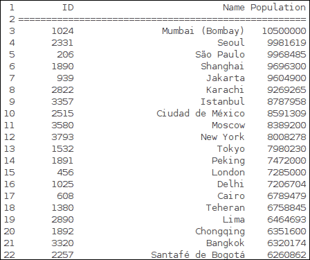

首先，我们需要将这个 SQL 文件导入到 SQLite 数据库中。以下是如何做到这一点:

```py
import sqlite3
import sys

if len(sys.argv) < 2:
    print "Error: You must supply at least SQL script."
    print "Usage: %s table.db ./sql-dump.sql" % (sys.argv[0])
    sys.exit(1)

script_path = sys.argv[1]

if len(sys.argv) == 3:
    db = sys.argv[2]
else:
    # if DB is not defined
    # create memory database
    db = ":memory:"

try:
    con = sqlite3.connect(db)
    with con:
        cur = con.cursor()
        with open(script_path,'rb') as f:
            cur.executescript(f.read())
except sqlite3.Error as err:
    print "Error occured: %s" % err
```

这将读取 SQL 文件，并针对打开的 SQLite `db`文件执行 SQL 语句。如果我们不指定文件名，SQLite 会在内存中创建数据库。然后一行行地执行这些语句。

如果我们遇到任何错误，我们会捕捉异常并将错误消息打印给用户。

将数据导入数据库后，我们就可以查询数据并进行一些处理。下面是从数据库文件中读取数据的代码:

```py
import sqlite3
import sys

if len(sys.argv) != 2:
    print "Please specify database file."
    sys.exit(1)

db = sys.argv[1]

try:
    con = sqlite3.connect(db)
    with con:
        cur = con.cursor()
        query = 'SELECT ID, Name, Population FROM City ORDER BY Population DESC LIMIT 1000'
        con.text_factory = str
        cur.execute(query)

        resultset = cur.fetchall()

        # extract column names

        col_names = [cn[0] for cn in cur.description]
        print "%10s %30s %10s" % tuple(col_names)
        print "="*(10+1+30+1+10)

        for row in resultset:
            print "%10s %30s %10s" % row
except sqlite3.Error as err:
    print "[ERROR]:", err
```

## 它是如何工作的...

首先，我们验证用户是否提供了数据库文件路径。这只是一个快速检查，我们可以继续进行其余的代码。

然后，我们尝试连接到数据库；如果失败，我们捕捉`sqlite3.Error`并打印给用户。

如果连接成功，我们使用`con.cursor()`获得一个光标。游标是一种类似迭代器的结构，它使我们能够遍历从数据库返回的结果集的记录。

我们定义一个通过连接执行的查询，并使用`cur.fetchall()`获取结果集。如果我们只期望一个结果，我们会只使用`fetchone()`。

对`cur.description`的列表理解允许我们获取列名。`description`是一个只读属性，只返回列名所需的内容，所以我们只从每个列的 7 项元组中获取第一项。

然后，我们使用简单的字符串格式打印带有列名的表格标题。之后，我们迭代`resultset`并以类似的方式打印每一行。

## 还有更多...

数据库是当今最常见的数据来源。我们无法在这份简短的食谱中呈现所有内容，但我们可以建议进一步的研究方向。

官方 Python 文档是寻找如何使用数据库的解释的第一个地方。最常见的数据库是开源数据库，如 MySQL、PostgreSQL 和 SQLite，另一端是企业数据库系统，如微软的 SQL、甲骨文和 Sybase。大多数情况下，Python 支持它们，并且接口总是抽象的，所以如果底层数据库发生变化，您不必更改程序，但是可能需要进行一些调整。这取决于您是否使用了特定数据库系统的细节。例如，Oracle 支持一种特定的语言 PL/SQL，这种语言不是标准的 SQL，如果您的数据库从 Oracle 更改为 MS SQL，有些东西将不起作用。同样，SQLite 不支持来自 MySQL 数据类型或数据库引擎类型(MyISAM 和 InnoDB)的细节。这些事情可能很烦人，但是让你的代码依赖于标准的 SQL([http://en.wikipedia.org/wiki/SQL:2011](http://en.wikipedia.org/wiki/SQL:2011))会让你的代码从一个数据库系统移植到另一个系统。

# 从异常值中清除数据

这个食谱描述了如何处理来自现实世界的数据集，以及如何在可视化之前清理它们。

我们将展示几种技术，本质上不同，但是有相同的目标，那就是清理数据。

然而，清洁不应该是全自动的。在我们应用任何强大的现代算法来清理数据之前，我们需要理解给定的数据，并且能够理解什么是异常值以及数据点代表什么。这不是一个可以在食谱中定义的东西，因为它依赖于大量的领域，如统计数据、领域知识和良好的眼光(然后是一些运气)。

## 做好准备

我们将使用我们已经知道的标准 Python 模块，因此不需要额外的安装。

在这个食谱中，我将引入一个新的术语，MAD。**统计学中的中值绝对偏差** ( **MAD** )代表定量数据的单变量(拥有一个变量)样本的可变性的度量。这是统计离差的一种度量。它属于一组稳健的统计数据，因此对异常值更有弹性。

## 怎么做...

这里有一个例子，展示了如何使用 MAD 来检测数据中的异常值。我们将为此执行以下步骤:

1.  生成正态分布的随机数据。
2.  加入一些异常值。
3.  使用功能`is_outlier()`检测异常值。
4.  绘制两个数据集(`x`和`filtered`)以查看差异。

    ```py
    import numpy as np
    import matplotlib.pyplot as plt

    def is_outlier(points, threshold=3.5):
        """
        Returns a boolean array with True if points are outliers and False
        otherwise.

        Data points with a modified z-score greater than this
        # value will be classified as outliers.
        """
        # transform into vector
        if len(points.shape) == 1:
            points = points[:,None]

        # compute median value    
        median = np.median(points, axis=0)

        # compute diff sums along the axis
        diff = np.sum((points - median)**2, axis=-1)
        diff = np.sqrt(diff)
        # compute MAD
        med_abs_deviation = np.median(diff)

        # compute modified Z-score
        # http://www.itl.nist.gov/div898/handbook/eda/section4/eda43.htm#Iglewicz
        modified_z_score = 0.6745 * diff / med_abs_deviation

        # return a mask for each outlier
        return modified_z_score > threshold

    # Random data
    x = np.random.random(100)

    # histogram buckets
    buckets = 50

    # Add in a few outliers
    x = np.r_[x, -49, 95, 100, -100]

    # Keep valid data points
    # Note here that
    # "~" is logical NOT on boolean numpy arrays
    filtered = x[~is_outlier(x)]
    # plot histograms
    plt.figure()

    plt.subplot(211)
    plt.hist(x, buckets)
    plt.xlabel('Raw')

    plt.subplot(212)
    plt.hist(filtered, buckets)
    plt.xlabel('Cleaned')

    plt.show()
    ```

请注意，在 NumPy 中，`~`运算符被重载为逻辑运算符，而不是布尔数组。例如，假设我们在`pylab`模式下启动 IPython。

```py
$ ipython –pylab

```

我们得到:

```py
In [1]: ~numpy.array(False)
Out[1]: True

```

我们应该会看到两个不同的直方图，第一个直方图几乎什么都没有显示——除了一个桶中最大的异常值——第二个直方图显示了多样化的数据桶，因为我们移除了异常值。

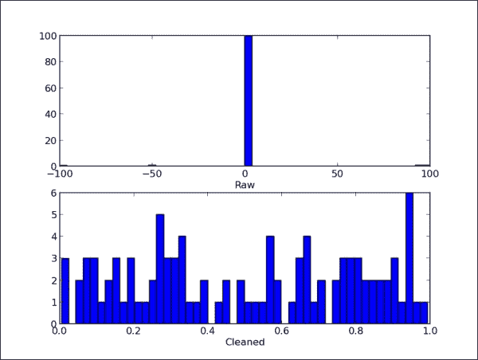

识别异常值的另一种方法是目视检查您的数据。为了做到这一点，我们可以创建散点图，在散点图中，我们可以很容易地发现中央群体之外的值。我们也可以做一个方框图，里面会显示的中位数，中位数上下的四分位数，以及距离这个方框较远的点。

该框从数据的下四分位数延伸到上四分位数，中间有一条线。触须从方框中延伸出来，显示数据的范围。飞人点是那些超过胡须末端的点。

这里有一个例子来证明:

```py
from pylab import *

# fake up some data
spread= rand(50) * 100
center = ones(25) * 50

# generate some outliers high and low
flier_high = rand(10) * 100 + 100
flier_low = rand(10) * -100

# merge generated data set
data = concatenate((spread, center, flier_high, flier_low), 0)

subplot(311)
# basic plot
# 'gx' defining the outlier plotting properties
boxplot(data, 0, 'gx')

# compare this with similar scatter plot
subplot(312)
spread_1 = concatenate((spread, flier_high, flier_low), 0)
center_1 = ones(70) * 25
scatter(center_1, spread_1)
xlim([0, 50])

# and with another that is more appropriate for
# scatter plot
subplot(313)
center_2 = rand(70) * 50
scatter(center_2, spread_1)
xlim([0, 50])

show()
```

我们可以然后看到代表异常值的 x 形标记:

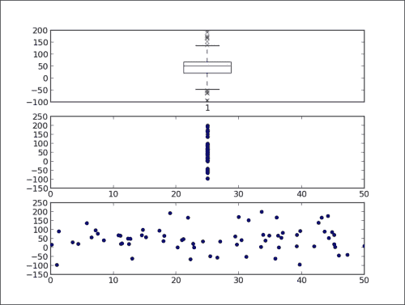

我们还可以看到，在散点图中显示类似数据集的第二个图不是很直观，因为 x 轴的所有值都在 25，我们并没有真正区分内联和外联。

第三个图，我们在 x 轴上生成的值为分布在从 0 到 50 的范围内，让我们更清楚地看到不同的值，我们可以看到哪些值是 y 轴上的异常值。

在下面的代码示例中，我们看到了相同的数据(在本例中是均匀分布的)如何以非常不同的方式显示自己，有时还会欺骗性地传达一些不真实的信息:

```py
# generate uniform data points
x = 1e6*rand(1000)
y = rand(1000)

figure()
# crate first subplot
subplot(211)
# make scatter plot
scatter(x, y)
# limit x axis
xlim(1e-6, 1e6)

# crate second subplot
subplot(212)
# make scatter plot
scatter(x,y)
# but make x axis logarithmic
xscale('log')
# set same x axis limit
xlim(1e-6, 1e6)

show()
```

这是结果输出:

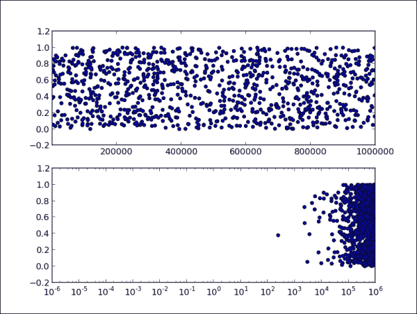

如果我们有一个缺失值的数据集呢？我们可以使用 NumPy 加载器来补偿丢失的值，或者我们可以编写代码来用我们需要的值替换现有的值，以便进一步使用。

假设我们想要说明美国地理地图上的一些数据集，并且可能在数据集中有不一致的州名值。例如，我们有代表美国俄亥俄州的值`OH`、`Ohio`、`OHIO`、`US-OH`和`OH-USA`。在这种情况下，我们必须手动检查数据集，或者将其加载到电子表格处理器(如微软 Excel 或 OpenOffice.org Calc)中。有时候，用 Python 打印所有的行就足够简单了。如果文件是 CSV 或者类 CSV，我们可以用任何文本编辑器打开，直接检查数据。

在我们总结了数据中的内容之后，我们可以编写 Python 代码来对这些相似的值进行分组，并用一个将使进一步处理一致的值来替换它们。通常的方法是使用`readlines()`读入文件的行，并使用标准的 Python 字符串操作函数来执行操作。

## 还有更多...

有一些特殊的产品，包括商业和非商业的(比如 OpenRefine—[https://github.com/OpenRefine](https://github.com/OpenRefine)，它们围绕“肮脏”的实时数据集上的转换提供了一些自动化。

尽管如此，还是需要手工操作，这取决于数据有多嘈杂，以及我们对数据的理解有多深刻。

如果你想了解更多关于清理异常值和清理一般数据的信息，请寻找统计模型和抽样理论。

# 分块读取文件

Python 非常擅长处理读写文件或类似文件的对象。例如，如果你试图加载大文件，比如几百 MB，假设你有一台至少有 2gb RAM 的现代机器，Python 将能够毫无问题地处理它。它不会试图一次加载所有内容，而是聪明地玩，根据需要加载。

因此，即使有合适的文件大小，做一些像下面的代码这样简单的事情也能直接工作:

```py
with open('/tmp/my_big_file', 'r') as bigfile:
    for line in bigfile:
        # line based operation, like 'print line'
```

但是，如果我们想跳转到文件中的某个特定位置或进行其他非顺序读取，我们将需要使用手工方法并使用 IO 功能，如`seek()`、`tell()`、`read()`和`next()`，这些功能为大多数用户提供了足够的灵活性。这些函数中的大多数只是绑定到 C 实现(并且是特定于操作系统的)，所以它们速度很快，但是它们的行为会根据我们运行的操作系统而有所不同。

## 怎么做...

根据我们的目标，处理大文件有时可以分块管理。例如，您可以读取 1000 行，并使用 Python 标准的基于迭代器的方法来处理它们。

```py
import sys

filename = sys.argv[1]  # must pass valid file name

with open(filename, 'rb') as hugefile:
    chunksize = 1000
    readable = ''
    # if you want to stop after certain number of blocks
    # put condition in the while
    while hugefile:  
        # if you want to start not from 1st byte
        # do a hugefile.seek(skipbytes) to skip
        # skipbytes of bytes from the file start
        start = hugefile.tell()
        print "starting at:", start
        file_block = ''  # holds chunk_size of lines
        for _ in xrange(start, start + chunksize):
            line = hugefile.next()
            file_block = file_block + line
            print 'file_block', type(file_block), file_block
        readable = readable + file_block
        # tell where are we in file
        # file IO is usually buffered so tell()
        # will not be precise for every read.
        stop = hugefile.tell()
        print 'readable', type(readable), readable
        print 'reading bytes from %s to %s' % (start, stop)
        print 'read bytes total:', len(readable)

        # if you want to pause read between chucks
        # uncomment following line
        #raw_input()
```

我们从 Python 命令行解释器调用这段代码，给出文件名路径作为第一个参数。

```py
$ python ch02-chunk-read.py myhugefile.dat

```

## 它是如何工作的...

我们希望能够读取行块进行处理，而不读取内存中的整个文件。

我们打开文件，在内部`for`循环中读入行。我们移动文件的方式是在文件对象上调用`next()`。这个函数从文件中读取一行，并将文件指针移动到下一行。在循环执行期间，我们在`file_block`变量中添加行。为了简化示例代码，我们不做任何处理，只是添加`file_block`来完成输出变量`readable`。

我们在执行过程中做一些打印，只是为了说明某些变量的当前状态。

`while`循环中的最后一个注释行`raw_input()`可以取消注释，我们可以暂停执行并读取上面打印的行。

## 还有更多...

当然，这个方法只是读取大(巨大)文件的可能方法之一。其他方法可能包括特定的 Python 或 C 库，但它们都取决于我们打算如何处理数据以及我们希望如何处理数据。

像 MapReduce 范例这样的并行方法最近变得非常流行，因为我们可以以较低的价格获得更多的处理能力和内存。

多处理有时也是一种可行的方法，因为 Python 有很好的库支持来创建和管理带有多个库的线程，例如`multiprocessing`、`threading`和`thread`。

如果处理巨大的文件对于一个项目来说是一个重复的过程，我们建议构建您的数据管道，这样每次您需要在输出端以特定的格式准备好数据时，您就不必去源并手动完成它。

# 读取流数据源

如果来源的数据是连续的呢？如果我们需要读取连续数据怎么办？这个方法将展示一个简单的解决方案，它将适用于许多常见的现实场景，尽管它不是通用的，如果您在应用中遇到特殊情况，您将需要修改它。

## 怎么做...

在这个食谱中，我们将向您展示如何读取一个总是变化的文件并打印输出。我们将使用常见的 Python 模块来实现这一点。

```py
import time
import os
import sys

if len(sys.argv) != 2:
    print >> sys.stderr, "Please specify filename to read"

filename = sys.argv[1]

if not os.path.isfile(filename):
    print >> sys.stderr, "Given file: \"%s\" is not a file" % filename

with open(filename,'r') as f:
    # Move to the end of file
    filesize = os.stat(filename)[6]
    f.seek(filesize)

    # endlessly loop
    while True:
        where = f.tell()
        # try reading a line
        line = f.readline()
        # if empty, go back
        if not line:
            time.sleep(1)
            f.seek(where)
        else:
            # , at the end prevents print to add newline, as readline()
            # already read that.
            print line,
```

## 它是如何工作的...

代码的核心在`while True:`循环内部。这个循环从未停止(除非我们通过按下键盘上的 *Ctrl* + *C* 来中断它)。我们首先移动到正在读取的文件的末尾，然后尝试读取一行。如果没有行，说明我们使用`seek()`检查后，文件中没有添加任何内容。所以，我们睡一秒钟，然后再试一次。

如果有一个非空行，我们打印出来，并抑制新的行字符。

## 还有更多...

我们可能想读最后一行*。我们可以通过接近文件的结尾来做到这一点。我们可以通过寻找文件，也就是`file.seek(filesize – N * avg_line_len)`去那里。这里，`avg_line_len`应该是该文件中平均行长度的近似值(大约 1，024)。然后，我们可以使用`readlines()`从那个点读取行，然后只打印列表中的`[-N]`行。*

 *这个例子中的想法可以用于各种解决方案。例如，输入必须是类似文件的对象或远程 HTTP 可访问的资源。因此，可以从远程服务中读取输入，并持续解析它和更新实时图表，例如，或者更新中间队列、缓冲区或数据库。

一个特定的模块对于流处理非常有用— `io`。它是从 2.6 版本开始的 Python 中的，是作为文件模块的替代而构建的，并且是 Python 3.x 中的默认接口

在一些更复杂的数据管道中，我们需要启用某种消息队列，在这里，我们的传入连续数据必须排队一段时间才能被接受。这使得我们作为数据的消费者，能够在超负荷的情况下暂停处理。在公共消息总线上拥有数据使项目中的其他客户端能够使用相同的数据，并且不会干扰我们的软件。

# 将图像数据导入 NumPy 数组

我们将在演示如何使用 Python 的库如 **NumPy** 和 **SciPy** 来进行图像处理。

在科学的计算中，图像通常被视为 *n* 维数组。它们通常是二维数组；在我们的示例中，它们被表示为 NumPy 数组数据结构。因此，在这些结构上执行的功能和操作被视为矩阵操作。

从这个意义上说，图像并不总是二维的。对于医学或生物科学，图像是更高维度的数据结构，例如 3D(以 z 轴作为深度或时间轴)或 4D(以三个空间维度和一个时间维度作为第四维度)。我们不会在这个食谱中使用这些。

我们可以使用各种技术导入图像；它们都取决于你想用图像做什么。此外，这还取决于你所使用的工具的更大的生态系统，以及你运行你的项目的平台。

在这个食谱中，我们将演示几种在 Python 中使用图像处理的方法，主要与科学处理有关，较少涉及图像处理的艺术方面。

## 做好准备

在本食谱的一些例子中，我们使用了 SciPy 库，如果您已经安装了 NumPy，那么您已经安装了该库。如果没有，可以通过执行以下命令，使用操作系统的软件包管理器轻松安装:

```py
$ sudo apt-get install python-scipy

```

对于 Windows 用户，我们建议使用预打包的 Python 环境，例如 EPD，我们在[第 1 章](1.html "Chapter 1. Preparing Your Working Environment")、*准备您的工作环境*中讨论过。

如果您想使用官方源代码发行版安装这些，请确保您已经安装了系统依赖项，例如:

*   BLAS 和 LAPACK: `libblas`和`liblapack`
*   c 和 Fortran 编译器:`gcc`和`gfortran`

## 怎么做...

无论谁在数字信号处理领域工作过，甚至上过这方面或相关学科的大学课程，都一定遇到过 Lena 的图像，这是事实上的标准图像，用于演示图像处理算法。

SciPy 包含这个已经打包在`misc.`模块中的图像，所以我们重用那个图像真的很简单。这是如何阅读和展示这张图片:

```py
import scipy.misc
import matplotlib.pyplot as plt

# load already prepared ndarray from scipy
lena = scipy.misc.lena()

# set the default colormap to gray
plt.gray()

plt.imshow(lena)
plt.colorbar()
plt.show()
```

这应该会打开一个新窗口，图中以灰色调和轴显示莉娜的图像。颜色条显示了图中的数值范围；这里显示 0-黑色到 255-白色。


此外，我们可以用下面的代码来检查这个对象:

```py
print lena.shape
print lena.max()
print lena.dtype
```

前面代码的输出如下:

```py
(512, 512)
245
dtype('int32')
```

这里我们看到的图像是:

*   宽 512 点，高 512 点
*   整个数组(即图像)中的最大值是 254
*   每个点都表示为一个小端 32 位长整数

我们也可以使用 **Python 图像库** ( **PIL** )读取图像，我们在[第 1 章](1.html "Chapter 1. Preparing Your Working Environment")、*准备* *您的工作环境*中安装了该图像。

```py
import numpy
import Image
import matplotlib.pyplot as plt

bug = Image.open('stinkbug.png')
arr = numpy.array(bug.getdata(), numpy.uint8).reshape(bug.size[1], bug.size[0], 3)

plt.gray()
plt.imshow(arr)
plt.colorbar()
plt.show()
```

我们应该看到类似莉娜的形象如下:


如果我们已经在利用一个使用 PIL 作为默认图像加载器的现有系统，这将非常有用。

## 它是如何工作的...

除了加载图像之外，我们真正想做的是使用 Python 来处理图像。我们希望能够加载一个由 RGB 通道组成的真实图像，将其转换为一个通道`ndarray`，然后使用数组切片来放大图像的部分。下面的代码演示了我们如何使用 NumPy 和 matplotlib 来做到这一点。

```py
import matplotlib.pyplot as plt
import scipy
import numpy

bug = scipy.misc.imread('stinkbug1.png')

# if you want to inspect the shape of the loaded image
# uncomment following line
#print bug.shape

# the original image is RGB having values for all three
# channels separately. We need to convert that to greyscale image
# by picking up just one channel.

# convert to gray
bug = bug[:,:,0]
```

`bug[:,:,0]`叫做 **阵切片**。这个 NumPy 特性允许我们选择多维数组的任何部分。例如，让我们看一个一维数组:

```py
>>> a = array(5, 1, 2, 3, 4)
>>> a[2:3]
array([2])
>>> a[:2]
array([5, 1])
>>> a[3:]
array([3, 4])

```

对于多维数组，我们用逗号(`,`)分隔每个维度。例如:

```py
>>> b = array([[1,1,1],[2,2,2],[3,3,3]])  # matrix 3 x 3
>>> b[0,:]  # pick first row
array([1,1,1])
>>> b[:,0]   # we pick the first column
array([1,2,3])

```

看看下面的代码:

```py
# show original image
plt.figure()
plt.gray()

plt.subplot(121)
plt.imshow(bug)

# show 'zoomed' region
zbug = bug[100:350,140:350]
```

这里我们放大整个图像的特定部分。记住图像只是一个表示为 NumPy 数组的多维数组。这里的缩放意味着从这个矩阵中选择一系列的行和列。所以我们从 100 到 250 行和 140 到 350 列中选择一个部分矩阵。请记住，索引从 0 开始，因此坐标 100 处的行是第 101 行。

```py
plt.subplot(122)
plt.imshow(zbug)

plt.show()
```

这将显示如下:

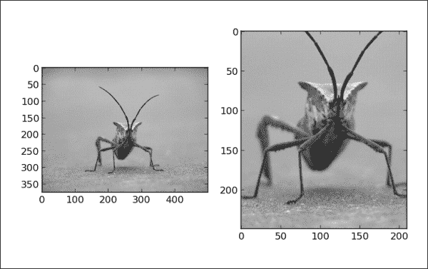

## 还有更多...

对于大的图像，我们建议使用`numpy.memmap`进行图像的记忆映射。这将加快处理图像数据的速度。例如:

```py
import numpy
file_name  = 'stinkbug.png'
image = numpy.memmap(file_name, dtype=numpy.uint8, shape = (375, 500))
```

在这里，我们将一个大文件的一部分加载到内存中，以 NumPy 数组的形式访问它。这是非常有效的，允许我们将文件数据结构作为标准的 NumPy 数组进行操作，而无需将所有内容加载到内存中。参数形状定义了从`file_name`参数加载的数组的形状，它是一个类似文件的对象。请注意，这是一个与 Python 的`mmap`参数([http://docs.python.org/2/library/mmap.html](http://docs.python.org/2/library/mmap.html))相似的概念，但在一个非常重要的方面有所不同——NumPy 的`memmap`属性返回一个类似数组的对象，而 Python 的`mmap`返回一个类似文件的对象。因此，我们使用它们的方式非常不同，但在每个环境中都非常自然。

有一些专门的包只是专注于图像处理，比如 sci kit-image([http://scikit-image.org/](http://scikit-image.org/))；这基本上是一个免费的图像处理算法集合，建立在 NumPy/SciPy 库之上。如果你想做边缘检测，去除图像中的噪声，或者寻找轮廓，scikit 是用来寻找算法的工具。最好的开始方式是查看示例库，找到示例图像和代码([http://scikit-image.org/docs/dev/auto_examples/](http://scikit-image.org/docs/dev/auto_examples/))。

# 生成受控随机数据集

在这个食谱中，我们将展示生成随机数序列和单词序列的不同方法。有些示例使用标准 Python 模块，有些使用 NumPy/SciPy 函数。

我们将进入一些统计术语，但我们将解释每个术语，这样您就不必在阅读本食谱时随身携带统计参考书。

我们使用常见的 Python 模块生成人工数据集。通过这样做，我们能够理解分布、方差、抽样和类似的统计术语。更重要的是，我们可以利用这些假数据来了解我们的统计方法是否能够发现我们想要发现的模型。我们可以这样做，因为我们提前知道模型，并通过在已知数据上应用它来验证我们的统计方法。在现实生活中，我们没有这种能力，总是有一定比例的不确定性我们必须假设，让位于错误。

## 做好准备

为了练习这些例子，我们不需要在系统上安装任何新的东西。掌握一些统计学知识是有用的，尽管不是必需的。

为了更新我们的统计知识，这里有一个小词汇表，我们将在这一章和后面的章节中使用。

*   **分布或概率分布** :这将统计实验的结果与该实验发生的概率联系起来。
*   **标准偏差**:这是一个数值，表示个体与群体相比在上的差异。如果它们的变化更大，标准偏差就会很大，反之亦然——如果所有的单个实验在整个组中大致相同，标准偏差就会很小。
*   **方差** :等于标准偏差的平方。
*   **人口或统计人口** :这是一个所有潜在可观察案例的集合，例如，世界上所有学生的所有成绩，如果我们有兴趣得到世界学生平均成绩的话。
*   **样本**:这是人群的一个子集。我们无法获得世界上所有学生的所有成绩，所以我们只能收集数据样本并对其进行建模。

## 怎么做...

我们可以使用 Python 的模块`random`生成一个简单的随机样本。这里有一个例子:

```py
import pylab
import random

SAMPLE_SIZE = 100

# seed random generator
# if no argument provided
# uses system current time
random.seed()

# store generated random values here
real_rand_vars = []

# pick some random values
real_rand_vars = [random.random() for val in xrange(SIZE)]
# create histogram from data in 10 buckets
pylab.hist(real_rand_vars, 10)

# define x and y labels
pylab.xlabel("Number range")
pylab.ylabel("Count")

# show figure
pylab.show()
```

这是一个均匀分布的样本。当我们运行这个例子时，我们应该会看到类似于下面的图:

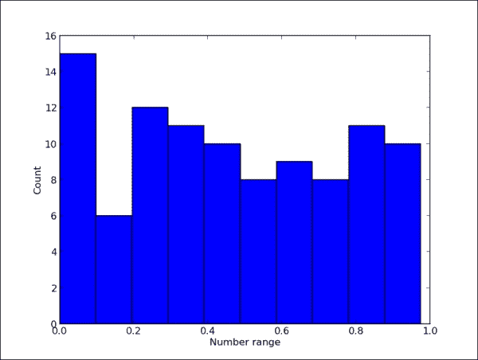

尝试将`SAMPLE_SIZE`设置为一个大数字(比如`10000`)，看看直方图的表现。

如果我们希望值的范围不是从 0 到 1，而是从 1 到 6(例如，模拟单骰子投掷)，我们可以使用`random.randint(min, max)`；这里，`min`和`max`分别是包含下限和包含上限。如果你想生成的是浮点数而不是整数，有一个`random.uniform(min, max)`函数来提供。

以类似的方式，并使用相同的工具，我们可以生成虚构的价格增长数据的时间序列图，带有一些随机噪声。

```py
import pylab
import random

# days to generate data for
duration = 100
# mean value
mean_inc = 0.2

# standard deviation
std_dev_inc = 1.2

# time series
x = range(duration)
y = []
price_today = 0

for i in x:
    next_delta = random.normalvariate(mean_inc, std_dev_inc)
    price_today += next_delta
    y.append(price_today)

pylab.plot(x,y)
pylab.xlabel("Time")
pylab.xlabel("Time")
pylab.ylabel("Value")
pylab.show()
```

这个代码定义了一系列 100 个数据点(虚构的日子)。对于接下来的每一天，我们从从`mean_inc`到`std_dev_inc`的正态分布(`random.normalvariate()`)中选择一个随机值，并将该值添加到昨天的价格值(`price_today`)中。

如果我们想要更多的控制，我们可以使用不同的分布。下面的代码演示并可视化了不同的分布。我们将对单独的代码段进行注释。我们首先导入所需的模块，并定义一些直方图桶。我们还创建了一个保存直方图的图形。

```py
# coding: utf-8
import random
import matplotlib
import matplotlib.pyplot as plt

SAMPLE_SIZE = 1000
# histogram buckets
buckets = 100

plt.figure()

# we need to update font size just for this example
matplotlib.rcParams.update({'font.size': 7})
```

为了布局所有需要的图，我们为所有直方图定义了一个 6 乘 2 的子图网格。第一个图是正态分布随机变量。

```py
plt.subplot(621)
plt.xlabel("random.random")
# Return the next random floating point number in the range [0.0, 1.0).
res = [random.random() for _ in xrange(1, SAMPLE_SIZE)]
plt.hi
```

对于第二个图，我们绘制了一个均匀分布的随机变量。

```py
plt.subplot(622)
plt.xlabel("random.uniform")
# Return a random floating point number N such that a <= N <= b for a <= b and b <= N <= a for b < a.
# The end-point value b may or may not be included in the range depending on floating-point rounding in the equation a + (b-a) * random().
a = 1
b = SAMPLE_SIZE
res = [random.uniform(a, b) for _ in xrange(1, SAMPLE_SIZE)]
plt.hist(res, buckets)
```

第三个图是三角形分布。

```py
plt.subplot(623)
plt.xlabel("random.triangular")

# Return a random floating point number N such that low <= N <= high and with the specified  # mode between those bounds. The low and high bounds default to zero and one. The mode 
# argument defaults to the midpoint between the bounds, giving a symmetric distribution.
low = 1
high = SAMPLE_SIZE
res = [random.triangular(low, high) for _ in xrange(1, SAMPLE_SIZE)]
plt.hist(res, buckets)
```

第四个图是贝塔分布。参数的条件是α和β应该大于零。返回值的范围在 0 和 1 之间。

```py
plt.subplot(624)
plt.xlabel("random.betavariate")
alpha = 1
beta = 10
res = [random.betavariate(alpha, beta) for _ in xrange(1, SAMPLE_SIZE)]
plt.hist(res, buckets)
```

第五个图显示了指数分布。`lambd`是 1.0 除以所需平均值。它应该是非零的。(该参数将被称为 lambda，但在 Python 中这是一个保留字。)如果`lambd`为正，返回值范围从 0 到正无穷大，如果`lambd`为负，返回值范围从负无穷大到 0。

```py
plt.subplot(625)
plt.xlabel("random.expovariate")
lambd = 1.0 / ((SAMPLE_SIZE + 1) / 2.)
res = [random.expovariate(lambd) for _ in xrange(1, SAMPLE_SIZE)]
plt.hist(res, buckets)
```

我们的下一个图是伽马分布，其中参数的条件是α和β大于 0。概率分布函数为:

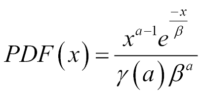

伽马分布的代码如下:

```py
plt.subplot(626)
plt.xlabel("random.gammavariate")

alpha = 1
beta = 10
res = [random.gammavariate(alpha, beta) for _ in xrange(1, SAMPLE_SIZE)]
plt.hist(res, buckets)
```

对数正态分布是我们的下一个图。如果你取这个分布的自然对数，你会得到一个均值`mu`和标准差`sigma`的正态分布。`mu`可以有任意值，`sigma`必须大于零。

```py
plt.subplot(627)
plt.xlabel("random.lognormvariate")
mu = 1
sigma = 0.5
res = [random.lognormvariate(mu, sigma) for _ in xrange(1, SAMPLE_SIZE)]
plt.hist(res, buckets)
```

下一个图是正态分布，其中`mu`是平均值，`sigma`是标准差。

```py
plt.subplot(628)
plt.xlabel("random.normalvariate")
mu = 1
sigma = 0.5
res = [random.normalvariate(mu, sigma) for _ in xrange(1, SAMPLE_SIZE)]
plt.hist(res, buckets)
```

最后一个图是帕累托分布。`alpha`是形状参数。

```py
plt.subplot(629)
plt.xlabel("random.paretovariate")
alpha = 1
res = [random.paretovariate(alpha) for _ in xrange(1, SAMPLE_SIZE)]
plt.hist(res, buckets)

plt.tight_layout()
plt.show()
```

这是一个很大的代码示例，但是基本上，我们根据各种分布选择了 1000 个随机数。这些是不同统计分支(经济学、社会学、生物科学等)中使用的常见分布。

我们应该看到基于所使用的分布算法的直方图的差异。花点时间了解以下九个绘图:

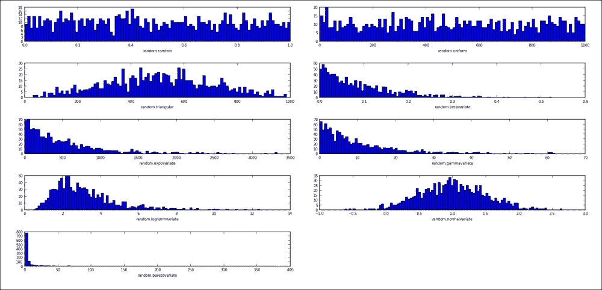

使用`seed()`初始化伪随机发生器，因此`random()`产生相同的预期随机值。这有时很有用，比预先生成随机数据并将其保存到文件中要好。后一种技术并不总是可行的，因为它需要在文件系统上保存(可能是大量的)数据。

如果您想防止您随机生成的序列的任何重复性，我们建议使用`random.SystemRandom`，它下面使用`os.urandom`；`os.urandom`提供更多熵源。如果使用这个随机生成器界面，`seed()`和`setstate()` 没有效果；因此，这些样品是不可复制的。

如果我们想有一些随机词，最简单的方法(在 Linux 上)可能是使用`/usr/share/dicts/words`。我们可以在下面的例子中看到这是如何做到的:

```py
import random

with open('/usr/share/dict/words', 'rt') as f:
    words = f.readlines()
words = [w.rstrip() for w in words]

for w in random.sample(words, 5):
    print w
```

这个解决方案只适用于 Unix，不会在 Windows 上运行(不过会在 Mac OS 上运行)。对于 Windows，您可以使用从各种免费来源构建的文件(古登堡计划、维基词典、英国国家语料库或彼得·诺维格博士的[http://norvig.com/big.txt](http://norvig.com/big.txt))。

# 平滑真实数据中的噪声

在这个食谱中，我们引入了一些高级算法来帮助清理来自真实世界来源的数据。这些算法在信号处理领域是众所周知的，我们不会深入数学，而只是举例说明它们是如何以及为什么工作的，以及它们可以用于什么目的。

## 做好准备

来自不同现实生活传感器的数据通常不平滑和干净，并且包含一些我们通常不想在图表和绘图上显示的噪声。我们希望图表清晰明了，能够显示信息，让观众花最少的力气去解读。

我们不需要安装任何新软件，因为我们将使用一些已经熟悉的 Python 包:NumPy、SciPy 和 matplotlib。

## 怎么做...

基本算法基于使用滚动窗口(例如卷积)。该窗口滚动数据，用于计算该窗口的平均值。

对于我们的离散数据，我们使用 NumPy 的 `convolve`函数；它返回两个一维序列的离散线性卷积。我们还使用了 NumPy 的`linspace`功能，它为指定的时间间隔生成一系列均匀间隔的数字。

函数`ones`定义了一个数组或矩阵(例如多维数组)，其中每个元素都有值`1`。这有助于生成用于平均的窗口。

## 它是如何工作的...

平滑我们正在处理的数据中的噪声的一个简单而天真的技术是对某个窗口(样本)求平均值，并绘制给定窗口的平均值，而不是所有数据点的平均值。这是更高级算法的基础。

```py
from pylab import *
from numpy import *

def moving_average(interval, window_size):
    '''Compute convoluted window for given size
    '''
    window = ones(int(window_size)) / float(window_size)
    return convolve(interval, window, 'same')

t = linspace(-4, 4, 100)
y = sin(t) + randn(len(t))*0.1

plot(t, y, "k.")

# compute moving average
y_av = moving_average(y, 10)
plot(t, y_av,"r")
#xlim(0,1000)

xlabel("Time")
ylabel("Value")
grid(True)
show()
```

这里，我们展示了与原始数据点(绘制为点)相比，平滑线的外观:

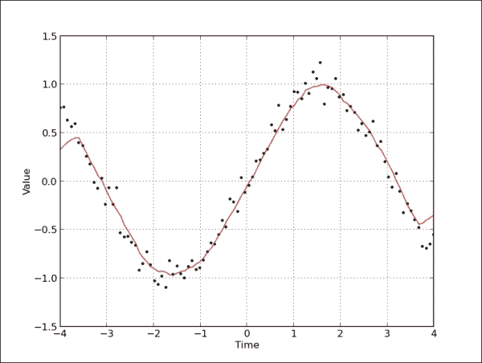

按照这个想法，我们可以跳到一个更高级的例子，并使用现有的 SciPy 库使这个窗口平滑工作得更好。

我们将要演示的方法是基于缩放窗口与信号(即数据点)的卷积(函数求和)。这个信号是以一种巧妙的方式准备的，在两端添加相同信号的副本，但反射它，因此我们将边界效应降至最低。这段代码基于 SciPy Cookbook 的例子，可以在这里找到:[http://www.scipy.org/Cookbook/SignalSmooth](http://www.scipy.org/Cookbook/SignalSmooth)。

```py
import numpy
from numpy import *
from pylab import *

# possible window type
WINDOWS = ['flat', 'hanning', 'hamming', 'bartlett', 'blackman']
# if you want to see just two window type, comment previous line,
# and uncomment the following one
# WINDOWS = ['flat', 'hanning']

def smooth(x, window_len=11, window='hanning'):
    """
    Smooth the data using a window with requested size.
    Returns smoothed signal.

    x -- input signal
    window_len -- lenght of smoothing window
    window -- type of window: 'flat', 'hanning', 'hamming',
                    'bartlett', 'blackman'
                  flat window will produce a moving average smoothing.
    """

    if x.ndim != 1:
        raise ValueError, "smooth only accepts 1 dimension arrays."

    if x.size < window_len:
        raise ValueError, "Input vector needs to be bigger than window size."

    if window_len < 3:
        return x

    if not window in WINDOWS:
        raise ValueError("Window is one of 'flat', 'hanning', 'hamming', "
                          "'bartlett', 'blackman'")
    # adding reflected windows in front and at the end
    s=numpy.r_[x[window_len-1:0:-1], x, x[-1:-window_len:-1]]
    # pick windows type and do averaging
    if window == 'flat': #moving average
        w = numpy.ones(window_len, 'd')
    else:
        # call appropriate function in numpy
        w = eval('numpy.' + window + '(window_len)')

    # NOTE: length(output) != length(input), to correct this:
    # return y[(window_len/2-1):-(window_len/2)] instead of just y.
    y = numpy.convolve(w/w.sum(), s, mode='valid')
    return y

# Get some evenly spaced numbers over a specified interval.
t = linspace(-4, 4, 100)

# Make some noisy sinusoidal
x = sin(t)
xn = x + randn(len(t))*0.1

# Smooth it
y = smooth(x)

# windows
ws = 31

subplot(211)
plot(ones(ws))

# draw on the same axes
hold(True)

# plot for every windows
for w in WINDOWS[1:]:
    eval('plot('+w+'(ws) )')

# configure axis properties
axis([0, 30, 0, 1.1])

# add legend for every window
legend(WINDOWS)

title("Smoothing windows")

# add second plot
subplot(212)
# draw original signal
plot(x)

# and signal with added noise
plot(xn)

# smooth signal with noise for every possible windowing algorithm
for w in WINDOWS:
    plot(smooth(xn, 10, w))

# add legend for every graph
l=['original signal', 'signal with noise']
l.extend(WINDOWS)
legend(l)

title("Smoothed signal")

show()
```

我们应该看下面两个图，看看开窗算法如何影响噪声信号。上图表示可能的窗口算法，下图显示从原始信号到加噪信号的所有可能结果，甚至每个窗口算法的平滑信号。尝试对可能的窗口类型进行评论，只留下一两个以获得更好的理解。

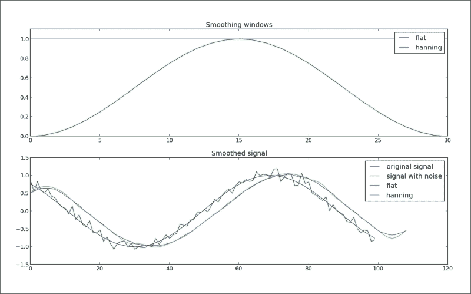

## 还有更多...

另一个非常流行的信号平滑算法是**中值滤波**。该滤波器的主要思想是逐个条目地遍历信号条目，用相邻条目的中值替换每个条目。这个想法使得这个过滤器既快速又适用于等一维数据集，也适用于二维数据集(如图像)。

在下面的例子中，我们使用了 SciPy 信号工具箱中的实现:

```py
import numpy as np
import pylab as p
import scipy.signal as signal

# get some linear data
x = np.linspace (0, 1, 101)

# add some noisy signal
x[3::10] = 1.5

p.plot(x)
p.plot(signal.medfilt(x,3))
p.plot(signal.medfilt(x,5))

p.legend(['original signal', 'length 3','length 5'])
p.show ()
```

我们在下图中看到，窗口越大，我们的信号与原始信号相比失真越大，但看起来越平滑:

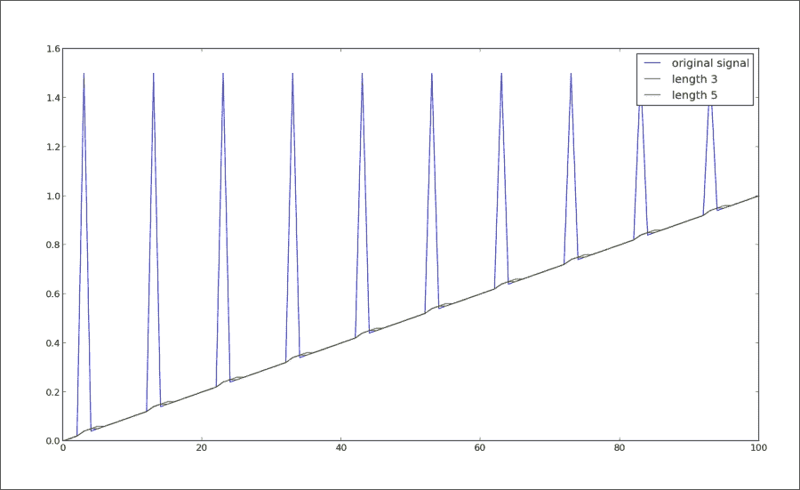

还有很多方法可以平滑从外部来源接收的数据(信号)。这在很大程度上取决于你工作的区域和信号的性质。许多算法是专门针对特定信号的，可能并没有针对您遇到的每种情况的通用解决方案。

然而，有一个重要的问题:“什么时候你不应该平滑一个信号？”不应该平滑信号的一种常见情况是在统计过程之前，例如最小二乘曲线拟合，因为所有的平滑算法都至少有轻微的损耗，并且会改变信号形状。此外，平滑的噪声可能被误认为是实际信号。*