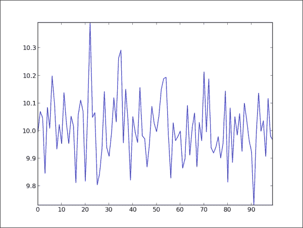
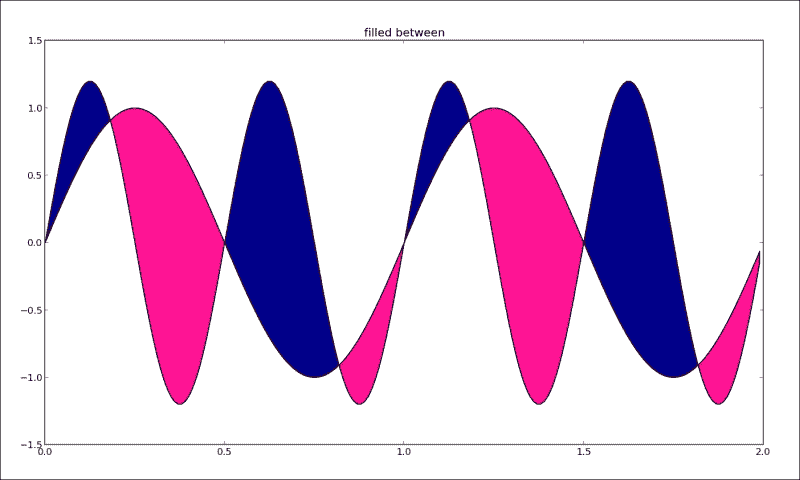

# 三、绘制您的第一个绘图并自定义它们

在这一章中，我们将更详细地介绍 matplotlib 的大部分可能性。我们将涵盖:

*   定义绘图类型-条形图、折线图和堆叠图
*   绘制简单的正弦和余弦曲线
*   定义轴长度和限制
*   定义绘图线样式、特性和格式字符串
*   设置记号、标签和网格
*   添加图例和标注
*   将脊椎移向中心
*   制作直方图
*   用误差线制作条形图
*   让饼图有价值
*   用填充区域绘图
*   用彩色标记绘制散点图

# 简介

虽然我们已经使用 matplotlib 绘制了我们的第一个图，但是我们没有详细讨论它们是如何工作的，如何设置它们，或者使用 matplotlib 有什么可能性。我们探索和练习最常见的数据可视化类型:折线图、条形图、直方图、饼图及其变体。

matplotlib 是一个强大的工具箱，它几乎满足了我们对 2D 的所有需求，也满足了一些 3D 绘图需求。作者打算让你学习 matplotlib 的最好方法是通过例子。当我们需要画一个绘图时，我们会寻找一个类似的例子，并试图改变它以适应我们的需要。这样，我们也准备给大家呈现一些有用的例子，相信这个例子会帮助大家找到一个最符合自己需要的绘图。

# 定义绘图类型–条形图、折线图和堆叠图

在这个食谱中，我们将展示不同的基本绘图以及它们的用途。这里描述的大部分图都是日常使用的，其中一些图为理解更多数据可视化高级概念提供了基础。

## 做好准备

我们从`matplotlib.pyplot`库中的一些常见图表开始，仅包含样本数据集，以开始基本的图表制作，并为以下食谱奠定基础。

## 怎么做...

我们从在 IPython 中创建一个简单的图开始。IPython 非常棒，因为它允许我们交互式地更改绘图，并立即看到结果。

1.  通过在命令提示符下键入以下命令启动 IPython:

    ```py
    $ ipython --pylab

    ```

2.  然后输入 matplotlib `plot`代码:

    ```py
    In [1]: plot([1,2,3,2,3,2,2,1])
    Out[1]: [<matplotlib.lines.Line2D at 0x412fb50>]
    ```

该图应在新窗口中打开，显示图的默认外观和一些支持信息:


matplotlib 中的基本绘图包含以下元素:

*   **x 轴和 y 轴**:这是水平轴和垂直轴。
*   **x 和 y 刻度**:这些是表示轴段的小刻度。可以有大票和小票。
*   **x 和 y 刻度标签**:代表特定轴上的值。
*   **绘图区**:这是实际绘图的地方。

您会注意到我们提供给`plot()`的值是 y 轴值。`plot()`提供 x 轴的默认值；它们是从 0 到 7 的线性值(y 值的数量减 1)。

现在，尝试为 x 轴添加值；作为`plot()`函数的第一个参数，同样在同一个 IPython 会话中，键入:

```py
In [2]: plot([4,3,2,1],[1,2,3,4])
Out[2]: [<matplotlib.lines.Line2D at 0x31444d0>]
```

### 型式

注意 IPython 如何计数输入和输出线(`In [2]`和`Out [2]`)。这将帮助我们记住我们在当前会话中的位置，并启用更高级的功能，例如将会话的一部分保存在 Python 文件中。在数据分析过程中，使用 IPython 进行原型制作是获得令人满意的解决方案，然后将特定会话保存到文件中的最快方法，如果需要重现相同的绘图，可以稍后执行。

这将更新绘图如下:


我们在这里看到如何 matplotlib 扩展 y 轴以适应新的值范围，并自动改变第二条绘图线的颜色以使我们能够区分新的绘图。

除非我们关闭 `hold`属性(通过调用`hold(False)`)，否则所有后续的图都将绘制在相同的轴上。这是 IPython 中`pylab`模式的默认行为，而在常规 Python 脚本中，`hold`默认为关闭。

让我们打包一些更常见的图，并在同一数据集上进行比较。您可以在 IPython 中键入它，或者从单独的 Python 脚本中运行它:

```py
from matplotlib.pyplot import *

# some simple data
x = [1,2,3,4]
y = [5,4,3,2]
# create new figure
figure()

# divide subplots into 2 x 3 grid
# and select #1
subplot(231)
plot(x, y)

# select #2
subplot(232)
bar(x, y)

   # horizontal bar-charts
subplot(233)
barh(x, y)

# create stacked bar charts
subplot(234)
bar(x, y)

# we need more data for stacked bar charts
y1 = [7,8,5,3]
bar(x, y1, bottom=y, color = 'r')

# box plot
subplot(235)
boxplot(x)

# scatter plot
subplot(236)
scatter(x,y)

show()
```

这就是应该如何将从变成的图形:


## 它是如何工作的...

借助`figure()`我们创建一个新的图形。如果我们提供一个字符串参数，比如`sample charts`，它将是一个窗口的后端标题。如果我们用相同的参数(也可以是数字)调用`figure()`函数，我们将激活相应的图形，并对该图形执行以下所有绘图。

接下来，我们使用`subplot(231)`调用将图分成 2 乘 3 的网格。我们可以用`subplot(3, 2, 1)`来称呼这个，其中第一个参数是行数，第二个是列数，第三个代表图号。

我们继续使用简单的调用创建垂直条形图(`bar()`)和水平条形图(`barh()`)来创建一个常见的图表类型。对于堆叠条形图，我们需要将两个条形图调用绑定在一起。我们通过使用参数`bottom = y`将第二个条形图与前一个连接起来。

使用`boxplot()`调用创建方框图，其中方框从下四分位数延伸到上四分位数，线条位于中间值。我们将很快回到方块图。

我们最后创建一个散点图，让您了解基于点的数据集。当我们在一个数据集中有数千个数据点时，这可能更适合使用，但是在这里，我们想说明同一数据集的不同表示。

## 还有更多...

我们现在可以回到方框图，因为我们需要解释最重要的显示选项。

对于初学者，我们可以添加从框延伸的胡须来表示数据集的整个范围。方框和须图主要用于表示一个或多个数据集中数据的变化；它们很容易比较和易读。在同一个图中，它们可以表示五个统计数据:

*   **最小值**:在数据集中
*   **第二个四分位数**:低于这个四分位数的是给定数据集的 25%
*   **中值**:这是数据集的中值
*   **第三个四分位数**:高于这个四分位数的是给定数据集的上 25%
*   **最大值**:这是给定数据集的最大值

为了说明这种行为，我们将演示在方框图和直方图中绘制相同的数据集，如以下代码所示:

```py
from pylab import *

dataset = [113, 115, 119, 121, 124,
           124, 125, 126, 126, 126,
           127, 127, 128, 129, 130,
           130, 131, 132, 133, 136]

subplot(121)
boxplot(dataset, vert=False)

subplot(122)
hist(dataset)

show()
```

这将为我们提供以下图表:


在之前的比较中，我们可以观察到两个不同图表中相同数据集的表示中的差异。左侧的指向上述五个统计值，而右侧的(直方图)显示给定范围内数据集的分组。

# 绘制简单的正弦和余弦图

本食谱将复习绘制数学函数的基础知识以及与数学图形相关的几件事，例如在标签和曲线上写希腊符号。

## 做好准备

我们最常用的图形是线图命令，它在图形图上绘制给定的(x，y)坐标。

## 怎么做...

我们从开始，计算同一线性区间内的正弦和余弦函数——从π到π，中间有 256 个点——并在同一曲线上绘制正弦(x)和余弦(x)的值:

```py
import matplotlib.pyplot as pl
import numpy as np

x = np.linspace(-np.pi, np.pi, 256, endpoint=True)

y = np.cos(x)
y1 = np.sin(x)

pl.plot(x,y)
pl.plot(x, y1)

pl.show()
```

这将为我们提供以下图表:


按照这个简单的图，我们可以定制更多，以提供更多信息，并更精确地了解轴和边界:

```py
from pylab import *
import numpy as np

# generate uniformly distributed
# 256 points from -pi to pi, inclusive
x = np.linspace(-np.pi, np.pi, 256, endpoint=True)

# these are vectorised versions
# of math.cos, and math.sin in built-in Python maths
# compute cos for every x
y = np.cos(x)

# compute sin for every x
y1 = np.sin(x)

# plot cos
plot(x, y)

# plot sin
plot(x, y1)

# define plot title
title("Functions $\sin$ and $\cos$")

# set x limit
xlim(-3.0, 3.0)
# set y limit
ylim(-1.0, 1.0)

# format ticks at specific values
xticks([-np.pi, -np.pi/2, 0, np.pi/2, np.pi],
          [r'$-\pi$', r'$-\pi/2$', r'$0$', r'$+\pi/2$', r'$+\pi$'])
yticks([-1, 0, +1],
          [r'$-1$', r'$0$', r'$+1$'])

show()
```

这应该会给我们一个稍微好一点的图表:


我们看到我们使用了这样的表达方式`$\sin$`，或者`$-\pi$`来写数字中的希腊字母。这是 LaTex 语法，我们将在后面的章节中进一步探讨。在这里，我们只是说明了让你的数学图表对某些受众来说更易读是多么容易。

# 定义轴长度和极限

这个配方将围绕极限和长度展示各种有用的轴属性，我们可以在 matplotlib 中进行配置。

## 做好准备

对于这个食谱，我们想激发 IPython:

```py
$ ipython --pylab

```

## 怎么做...

开始尝试轴的各种属性。只需调用一个空的`axis()`函数就会返回轴的默认值:

```py
In [1]: axis()
Out[1]: (0.0, 1.0, 0.0, 1.0)

```

请注意，如果您处于交互模式并使用窗口后端，将显示一个带有空轴的图形。

这里的数值分别代表`xmin`、`xmax`、`ymin`和`ymax`。同样，我们可以设置 x 轴和 y 轴的值:

```py
In [2]: l = [-1, 1, -10, 10]

In [3]: axis(l)
Out[3]: [-1, 1, -10, 10]

```

同样，如果您处于交互模式，这将更新相同的数字。此外，我们还可以使用关键字参数(`**kwargs`)单独更新任何值，只需将`xmax`设置为某个值。

## 它是如何工作的...

如果我们不使用`axis()`或其他设置，matplotlib 将自动使用允许我们在一个图中看到所有数据点的最小值。如果我们将`axis()`限制设置为小于数据集中的最大值，matplotlib 将按照指示执行，并且我们不会看到图上的所有点。这可能是一个混乱甚至错误的来源，我们认为我们看到了我们画的一切。避免这种情况的一种方法是调用`autoscale()` ( `matplotlib.pyploy.autoscale()`)，它将计算轴的最佳大小以适合要显示的数据。

如果要给同一个图形添加新的轴，可以使用`matplotlib.pyploy.axes()`。我们通常想在这个默认调用中添加一些属性；例如，`rect`—可以用归一化单位(0，1)表示属性`left`、`bottom`、`width`和`height`—也可能是`axisbg`，指定坐标轴的背景色。

我们还可以为添加的轴设置其他属性，如`sharex` / `sharey`，它接受其他轴实例的值，并与其他轴共享当前轴(x/y)。或者定义我们是否要使用极轴的参数`polar`。

添加新的轴可能很有用；例如，如果需要紧密耦合同一数据的不同视图来说明其属性，可以将多个图表组合在一个图上。

如果我们想在当前图形中只添加一行，可以使用`matplotlib.pyploy.axhline()`或`matplotlib.pyplot.axvline()`。功能`axhilne()`和`axvline()`将分别为给定的 x 和 y 数据值绘制横轴和纵轴。它们共享相似的参数，最重要的是 y 位置、`xmin`，以及用于`axhline()`和 x 位置、`ymin`的`xmax`，以及用于`axvline()`的`ymax`。

让我们看一下它的外观，在同一个 IPython 会话中继续:

```py
In [3]: axhline()
Out[3]: <matplotlib.lines.Line2D at 0x414ecd0>

In [4]: axvline()
Out[4]: <matplotlib.lines.Line2D at 0x4152490>

In [5]: axhline(4)
Out[5]: <matplotlib.lines.Line2D at 0x4152850>

```

我们应该有一个像下面这样的图:


这里我们看到只是在没有参数的情况下调用这些函数让它们取默认值，为`y=0` ( `axhline()`)画一条水平线，为`x=0` ( `axvline()`)画一条垂直线。

与此类似的是两个相关的函数，允许我们在轴上添加水平跨度(矩形)。这些是`matplotlib.pyplot.axhspan()`和`matplotlib.pyplot.axspan()`。功能`axhspan()`有`ymin`和`ymax`作为定义水平跨度有多宽的必需参数。与此类似，`axvspan()`有`xmin`和`xmax`来定义垂直跨度的宽度。

## 还有更多...

默认情况下，图形中的网格处于关闭状态，但可以轻松打开和自定义。对`matplotlib.pyplot.grid()`的默认调用将切换网格的可见性。其他控制参数如下:

*   `which`:定义要绘制的网格刻度类型(可以是`major`、`minor`或`both`)
*   `axis`:定义画哪组网格线(可以是`both`、`x`或`y`)

轴通常通过`matplotlib.pyplot.axis()`控制。在内部，轴由几个 Python 类表示，父类是`matplotlib.axes.Axes`，它包含了大多数操作轴的方法。单个轴由`matplotlib.axis.Axis`类表示，其中 x 轴使用`matplotlib.axis.XAxis`，y 轴使用`matplotlib.axis.YAxis`类。

我们不需要使用这些来执行我们的配方，但重要的是要知道如果我们对更高级的轴控制感兴趣，以及当我们达到通过`matplotlib.pyplot`命名空间可用的极限时，应该从哪里寻找。

# 定义绘图线样式、特性和格式字符串

这个食谱展示了我们如何改变各种线条属性，例如样式、颜色或宽度。根据所呈现的信息，适当设置线条，并使其足够清晰以适合目标观众(如果观众是较年轻的人群，我们可能希望用更鲜艳的颜色来瞄准他们；如果他们年龄较大，我们可能希望使用更多对比色)可以在几乎不引人注意和给观众留下很大影响之间产生差异。

## 做好准备

尽管我们强调了从美学角度调整演示文稿的重要性，但我们首先必须学会如何做。

如果你对配色没有特别的眼光，有免费的商业在线工具可以为你生成颜色集。其中最著名的是彩色啤酒 2，可以在 http://colorbrewer2.org/ T2 找到。

一些严肃的研究已经在数据可视化中使用了颜色，但是解释这个理论超出了本书的范围。如果你每天都在使用更高级的可视化工具，那么这个主题的材料是必读的。

## 怎么做...

让我们学习如何更改线条属性。我们可以用不同的方法改变我们的绘图。

首先也是最常见的是通过将关键字参数传递给函数来定义行，如`plot()`:

```py
plot(x, y, linewidth=1.5)
```

因为对`plot()`的调用会返回行实例(`matplotlib.lines.Line2D`)，所以我们可以在该实例上使用一组 setter 方法来设置各种属性:

```py
line, = plot(x, y)
line.set_linewidth(1.5)
```

使用 MATLAB 的人会觉得有必要使用第三种方式配置线属性——使用 `setp()`功能:

```py
lines = plot(x, y)
setp(lines,  'linewidth', 1.5)
```

另一种使用`setp()`的方式是:

```py
setp(lines, linewidth=1.5)
```

无论你喜欢用什么方式配置线路，选择一种方法在整个项目中保持一致(或者至少一个文件)。这种的方式，当你(或者将来是你的另一个人)回到代码时，会更容易理解和改变它。

## 它是如何工作的...

我们可以为一条线更改的所有属性都包含在`matplotlib.lines.Line2D`类中。我们在下表中列出了其中的一些:

<colgroup><col style="text-align: left"> <col style="text-align: left"> <col style="text-align: left"></colgroup> 
| 

财产

 | 

值类型

 | 

描述

 |
| --- | --- | --- |
| `alpha` | `float` | 设置用于混合的 alpha 值；并非所有后端都支持。 |
| `color`或`c` | 任何 matplotlib 颜色 | 设置线条的颜色。 |
| `dashes` | 以点为单位的开/关油墨顺序 | 设置破折号序列，即以磅为单位的带开/关墨水的破折号序列。如果`seq`为空或者如果`seq = (None, None)`，`linestyle`将被设置为`solid`。 |
| `label` | 任何字符串 | 将自动图例的标签设置为`s`。 |
| `linestyle`或`ls` | `[ '-' &#124; '–' &#124; '-.' &#124; ':' &#124; 'steps' &#124; ...]` | 设置线条的线条样式(也接受绘图样式)。 |
| `linewidth`或`lw` | `float`以点数表示的值 | 以磅为单位设置线宽。 |
| `marker` | `[ 7 &#124; 4 &#124; 5 &#124; 6 &#124; 'o' &#124; 'D' &#124; 'h' &#124; 'H' &#124; '_' &#124; '' &#124; 'None' &#124; ' ' &#124; None &#124; '8' &#124; 'p' &#124; ',' &#124; '+' &#124; '.' &#124; 's' &#124; '*' &#124; 'd' &#124; 3 &#124; 0 &#124; 1 &#124; 2 &#124; '1' &#124; '3' &#124; '4' &#124; '2' &#124; 'v' &#124; '<' &#124; '>' &#124; '^' &#124; '&#124;' &#124; 'x' &#124; '$...$' &#124; tuple &#124; Nx2 array ]` | 设置线条标记。 |
| `markeredgecolor`或`mec` | 任何 matplotlib 颜色 | 设置标记边缘颜色。 |
| `markeredgewidth`或`mew` | `float`以点数表示的值 | 以磅为单位设置标记边缘宽度。 |
| `markerfacecolor`或`mfc` | 任何 matplotlib 颜色 | 设置标记面颜色。 |
| `markersize`或`ms` | `float` | 以磅为单位设置标记的大小。 |
| `solid_capstyle` | `['butt' &#124; 'round' &#124; 'projecting']` | 为实线样式设置帽样式。 |
| `solid_joinstyle` | `['miter' &#124; 'round' &#124; 'bevel']` | 设置实线样式的连接样式。 |
| `visible` | `[True &#124; False]` | 设置艺术家的可见性。 |
| `xdata` | `np.array` | 为 x 设置数据`np.array`。 |
| `ydata` | `np.array` | 设置数据`np.array`为 y。 |
| `Zorder` | `Any number` | 为艺术家设置 z 轴顺序。先画出`Zorder`值较低的艺术家。如果 x 轴和 y 轴水平向右，垂直于屏幕顶部，则 z 轴是向观看者延伸的轴。所以 0 值会在屏幕上，1，上面一层，以此类推。 |

以下表格显示了一些线型:

<colgroup><col style="text-align: left"> <col style="text-align: left"></colgroup> 
| 

线条样式

 | 

描述

 |
| --- | --- |
| `'-'` | 固体 |
| `'--'` | 虚线 |
| `'-.'` | 虚线点 |
| `':'` | 有点的 |
| `'None', ' ', ''` | 什么都不画 |

下表显示了线标记:

<colgroup><col style="text-align: left"> <col style="text-align: left"></colgroup> 
| 

标记

 | 

描述

 |
| --- | --- |
| `'o'` | 圆 |
| `'D'` | 钻石 |
| `'h'` | 六边形 1 |
| `'H'` | 六边形 2 |
| `'_'` | 水平线 |
| `'', 'None', ' ', None` | 没有任何东西 |
| `'8'` | 八角形 |
| `'p'` | 五边形 |
| `','` | 像素 |
| `'+'` | 加 |
| `'.'` | 要点 |
| `'s'` | 平方 |
| `'*'` | 星星 |
| `'d'` | 薄钻石 |
| `'v'` | 三角形向下 |
| `'<'` | 三角形 _ 左侧 |
| `'>'` | 三角形 _ 右 |
| `'^'` | 三角形向上 |
| `'&#124;'` | 垂直线 |
| `'x'` | X |

### 颜色

我们可以通过调用`matplotlib.pyplot.colors()`获得【matplotlib 支持的所有颜色；这将给出:

<colgroup><col style="text-align: left"> <col style="text-align: left"></colgroup> 
| 

别名

 | 

颜色

 |
| --- | --- |
| `b` | 蓝色 |
| `g` | 格林（姓氏）；绿色的 |
| `r` | 红色 |
| `c` | 蓝绿色 |
| `m` | 品红 |
| `y` | 黄色 |
| `k` | 黑色 |
| `w` | 怀特（姓氏） |

这些颜色可以在不同的 matplotlib 函数中使用，这些函数接受颜色参数。

如果这些基本的颜色不够——随着我们的进步，它们将不够——我们可以使用另外两种方式来定义颜色值。我们可以使用一个 HTML 十六进制字符串:

```py
color = '#eeefff'
```

我们也可以使用合法的 HTML 颜色名称(`'red'`、`'chartreuse'`)。我们还可以传递一个归一化为`[0, 1]`的 RGB 元组:

```py
color = (0.3, 0.3, 0.4)
```

参数颜色被一系列函数接受，例如`title()`:

```py
title('Title in a custom color', color='#123456')
```

### 背景颜色

通过为`matplotlib.pyplot.axes()`或`matplotlib.pyplot.subplot()`等功能提供`axisbg`，我们可以定义轴的背景颜色:

```py
subplot(111, axisbg=(0.1843, 0.3098, 0.3098))
```

# 设置刻度、标签和网格

在这个配方中，我们将继续设置轴和线属性，并为我们的图形和图表添加更多数据。

## 做好准备

让我们了解一下图表和子图。

在 matplotlib 中，`figure()` 用于显式创建图形，表示用户界面窗口。图形是通过调用`plot()`或类似的函数隐式创建的。这对于简单的图表来说很好，但是具有能力来显式地创建图形并获得对其实例的引用对于更高级的使用非常有用。

一个图表包含一个或多个子图。子图允许我们在一个规则的网格中安排绘图。我们已经使用了`subplot()`，其中我们指定了行数和列数以及我们所指的图的数量。

如果我们想要更多的控制，我们需要使用`matplotlib.axes.Axes`类的轴实例。它们允许我们在图中的任何位置放置绘图。一个例子是把一个小的绘图放在一个大的绘图里。

## 怎么做...

刻度是数字的一部分。它们由刻度定位器(刻度出现的地方)和显示刻度如何出现的刻度格式化器组成。有大有小。默认情况下，次要刻度不可见。更重要的是，大刻度和小刻度可以相互独立地格式化和定位。

我们可以使用`matplotlib.pyplot.locator_params()`来控制刻度定位器的行为。即使刻度位置通常是自动确定的，我们也可以控制刻度的数量，如果我们想的话，可以使用紧凑的视图，例如当图较小时。

```py
from pylab import *

# get current axis
ax = gca()
# set view to tight, and maximum number of tick intervals to 10
ax.locator_params(tight=True, nbins = 10)

# generate 100 normal distribution values
ax.plot(np.random.normal(10, .1, 100))

show()
```

这应该会给我们以下图表:



我们看到 x 轴和 y 轴是如何划分的，显示了哪些值。我们本可以使用定位器类实现相同的设置。这里我们说的是“将主定位器设置为为 10 的倍数”:

```py
ax.xaxis.set_major_locator(matplotlib.ticker.MultipleLocator(10))
```

同样可以指定刻度格式化程序。格式化程序指定值(通常是数字)的显示方式。例如，`matplotlib.ticker.FormatStrFormatter`简单地指定`'%2.1f'`或`'%1.1f cm'`作为用于跑马灯标签的字符串。

让我们看一个使用日期的例子。

### 注

matplotlib 将浮点值中的日期表示为自世界协调时 0001-01-01 加 1 后经过的天数。所以，0001-01-01 世界协调时 06:00 是 1.25。

然后我们可以使用诸如`matplotlib.dates.date2num()`、`matplotlib.dates.num2date()`、`matplotlib.dates.drange()`等辅助函数在不同的表示之间转换日期。

让我们看另一个例子:

```py
from pylab import *
import matplotlib as mpl
import datetime

fig = figure()

# get current axis
ax = gca()

# set some daterange
start = datetime.datetime(2013, 01, 01)
stop = datetime.datetime(2013, 12, 31)
delta = datetime.timedelta(days = 1)

# convert dates for matplotlib
dates = mpl.dates.drange(start, stop, delta)

# generate some random values
values = np.random.rand(len(dates))

ax = gca()

# create plot with dates
ax.plot_date(dates, values, linestyle='-', marker='')

# specify formater
date_format = mpl.dates.DateFormatter('%Y-%m-%d')

# apply formater
ax.xaxis.set_major_formatter(date_format)

# autoformat date labels
# rotates labels by 30 degrees by default
# use rotate param to specify different rotation degree
# use bottom param to give more room to date labels
fig.autofmt_xdate()

show()
```

前面的代码将给出下面的图表:


# 添加图例和标注

图例和标注在上下文中清晰地解释了数据图。通过给每个绘图分配一个关于它所代表的数据的简短描述，我们在读者(观众)的头脑中启用了一个更简单的心智模型。这个食谱将展示如何在我们的图形上标注特定的点，以及如何创建和定位数据图例。

## 做好准备

你有多少次看着图表想知道数据代表什么？更多的时候，报纸和其他日报和周刊会制造不包含适当传说的绘图，这样读者就可以自由地解读这些表象。这给读者造成了歧义，增加了出错的可能性。

## 怎么做...

让我们用下面的例子演示如何添加图例和标注:

```py
from matplotlib.pyplot import *

# generate different normal distributions
x1 = np.random.normal(30, 3, 100)
x2 = np.random.normal(20, 2, 100)
x3 = np.random.normal(10, 3, 100)

# plot them
plot(x1, label='plot')
plot(x2, label='2nd plot')
plot(x3, label='last plot')

# generate a legend box
legend(bbox_to_anchor=(0., 1.02, 1., .102), loc=3,
       ncol=3, mode="expand", borderaxespad=0.)

# annotate an important value
annotate("Important value", (55,20), xycoords='data',
         xytext=(5, 38),
         arrowprops=dict(arrowstyle='->'))
show()
```

在代码之前的将给出如下图:


我们所做的是为每个图分配一个字符串标签，这样`legend()`将尝试并确定在图例框中添加什么。

我们通过定义`loc`参数来设置图例框的位置。这是可选的，但是我们希望指定一个最不可能在绘图线上绘制图例框的位置。

## 它是如何工作的...

下表给出了所有位置参数字符串:

<colgroup><col style="text-align: left"> <col style="text-align: left"></colgroup> 
| 

线

 | 

数值

 |
| --- | --- |
| `upper right` | `1` |
| `upper left` | `2` |
| `lower left` | `3` |
| `lower right` | `4` |
| `right` | `5` |
| `center left` | `6` |
| `center right` | `7` |
| `lower center` | `8` |
| `upper center` | `9` |
| `center` | `10` |

要不在图例中显示标签，请将标签设置为`_nolegend_`。

对于图例，我们用`ncol = 3`定义列数，用`lower left`设置位置。我们指定了一个边界框(`bbox_to_anchor`)从位置`(0., 1.02)`开始，宽度为`1`，高度为`0.102`。这些是标准化的轴坐标。参数`mode`为`None`或`expand`，允许图例框水平扩展填充轴区域。参数`borderaxespad`定义轴和图例边框之间的填充。

对于标注，我们已经定义了要在坐标`xy`上绘制的字符串。坐标系被指定为与数据坐标系相同；因此，坐标系为`xycoord = 'data'`。文本的起始位置由`xytext`的值定义。

一个箭头从`xytext`画到`xy`坐标，并且`arrowprops`字典可以为该箭头定义许多属性。对于这个例子，我们使用`arrowstyle`来定义箭头样式。

# 将脊椎移向中央

这个食谱将演示如何将脊椎移到中间。

脊线定义数据区边界；它们连接轴刻度标记。有四根刺。我们可以把它们放在任何我们想放的地方；默认情况下，它们被放置在轴的边界上，因此我们看到数据图周围有一个框。

## 怎么做...

要将刺移到绘图中心，我们需要去掉两个刺，使其隐藏(将`color`设置为`none`)。之后，我们移动另外两个坐标(0，0)。坐标在数据空间坐标中指定。

下面的代码显示了如何做到这一点:

```py
import matplotlib.pyplot as plt
import numpy as np

x = np.linspace(-np.pi, np.pi, 500, endpoint=True)
y = np.sin(x)

plt.plot(x, y)

ax = plt.gca()

# hide two spines
ax.spines['right'].set_color('none')
ax.spines['top'].set_color('none')

# move bottom and left spine to 0,0
ax.spines['bottom'].set_position(('data',0))
ax.spines['left'].set_position(('data',0))

# move ticks positions
ax.xaxis.set_ticks_position('bottom')
ax.yaxis.set_ticks_position('left')

plt.show()
```

这就是绘图会是什么样子:


## 它是如何工作的...

这段代码依赖于绘制的图，因为我们正在将脊线移动到位置(0，0)，并且在(0，0)位于图中间的间隔上绘制正弦函数。

然而，这展示了如何将脊椎移动到一个特定的位置，以及如何去掉我们不想展示的脊椎。

## 还有更多...

此外，spines 可以被限制在数据结束的地方，例如，使用`set_smart_bounds(True)`调用。在这种情况下，matplotlib 试图以一种复杂的方式设置界限，例如，处理倒排界限，或者在数据超出视图范围时剪切要查看的行。

# 制作直方图

直方图很简单，但是将正确的数据放入其中很重要。我们现在将讨论 2D 的直方图。

直方图用于可视化数据分布的估计。一般来说，我们在谈到直方图时会用到几个术语。垂直矩形表示数据点在特定时间间隔内的频率，称为箱。以固定的间隔创建面元，因此直方图的总面积等于数据点的数量。

直方图可以显示数据的相对频率，而不是使用数据的绝对值。在这种情况下，总面积等于 1。

直方图通常在图像处理软件中用作可视化图像属性的一种方式，例如特定颜色通道中的光分布。此外，这些图像直方图可用于计算机视觉算法中，以检测峰值，帮助边缘检测、图像分割等。

在[第 5 章](5.html "Chapter 5. Making 3D Visualizations")、*制作三维可视化*中，我们有处理三维直方图的食谱。

## 做好准备

箱的数量是我们想要得到的值，但是很难得到正确的值，因为没有关于最佳箱数量的严格规则。关于如何计算箱数有不同的理论，最简单的是基于天花板函数的理论，其中箱数( *k* )等于天花板*(max(x)–min(x)/h)*，其中 *x* 是绘制的数据集， *h* 是所需的箱宽度。这只是一种选择，因为正确显示数据所需的箱数取决于实际数据分布。

## 怎么做...

我们用一组参数创建一个名为`matplotlib.pyploy.hist()`的直方图。以下是一些最有用的方法:

*   `bins`:这要么是整数个箱，要么是给出箱的序列。默认为`10`。
*   `range`:这是仓位的范围，如果仓位是按顺序给定的，则不使用。离群值被忽略，默认为`None`。
*   `normed`:如果该值为`True`，直方图值归一化，形成概率密度。默认为`False`。
*   `histtype`:这是默认的条形直方图。其他选项包括:
    *   `barstacked`:对于多个数据，这给出了堆叠视图直方图。
    *   `step`:这将创建一个未填充的线图。
    *   `stepfilled`:这将创建默认填充的线图。默认为`bar`。
*   `align`:这将使料箱边缘之间的条居中。默认为`mid`。其他数值有`left`和`right`。
*   `color`:指定直方图的颜色。它可以是单个值，也可以是一系列颜色。如果指定了多个数据集，颜色序列将以相同的顺序使用。如果未指定，则使用默认的线条颜色序列。
*   `orientation`:这允许通过将`orientation`设置为`horizontal`来创建水平直方图。默认为`vertical`。

以下代码演示了`hist()`的用法:

```py
import numpy as np
import matplotlib.pyplot as plt

mu = 100
sigma = 15
x = np.random.normal(mu, sigma, 10000)

ax = plt.gca()

# the histogram of the data
ax.hist(x, bins=35, color='r')

ax.set_xlabel('Values')
ax.set_ylabel('Frequency')

ax.set_title(r'$\mathrm{Histogram:}\ \mu=%d,\ \sigma=%d$' % (mu, sigma))

plt.show()
```

这为我们的数据样本创建了一个整洁的红色直方图:


## 它是如何工作的...

我们从生成一些正态分布的数据开始。直方图以指定的箱数(35 个)绘制，并通过将`normed`设置为`True`(或`1`)进行归一化；我们将`color`设置为`red` ( `r`)。

之后，我们为绘图设置标签和标题。在这里，我们使用编写 LaTeX 表达式的能力来编写数学符号，并将其与 Python 格式字符串混合在一起。

# 用误差线制作条形图

在本食谱中，我们将展示如何创建条形图以及如何绘制误差线。

## 做好准备

为了可视化数据集中的测量不确定性或指示误差，我们可以使用误差线。误差线可以很容易地给出数据集无误差的概念。它们可以显示一个标准偏差、一个标准误差或 95%的置信区间。这里没有标准，所以一定要明确说明误差线显示什么值(误差)。实验科学中的大多数论文应该包含误差条来表示数据的准确性。

## 怎么做...

即使只有两个参数是强制的— `left`和`height` —我们经常想要使用更多的参数。以下是我们可以使用的一些参数:

*   `width`:这给出了条的宽度。默认值为`0.8`。
*   `bottom`:如果指定了`bottom`，则该值加到高度上。默认为`None`。
*   `edgecolor`:这给出了条边的颜色。
*   `ecolor`:指定任意误差线的颜色。
*   `linewidth`:这给出了条边的宽度；特殊值为`None`(使用默认值)和`0`(不显示条边时)。
*   `orientation`:这有两个值`vertical`和`horizontal`。
*   `xerr`和`yerr`:用于在条形图上生成误差线。

一些可选参数(`color`、`edgecolor`、`linewidth`、`xerr`和`yerr`)可以是单个值或长度与小节数相同的序列。

## 它是如何工作的...

让我们用一个例子来说明这一点:

```py
import numpy as np
import matplotlib.pyplot as plt

# generate number of measurements
x = np.arange(0, 10, 1)

# values computed from "measured"
y = np.log(x)

# add some error samples from standard normal distribution
xe = 0.1 * np.abs(np.random.randn(len(y)))

# draw and show errorbar
plt.bar(x, y, yerr=xe, width=0.4, align='center', ecolor='r', color='cyan', label='experiment #1');

# give some explainations
plt.xlabel('# measurement')
plt.ylabel('Measured values')
plt.title('Measurements')
plt.legend(loc='upper left')

plt.show()
```

前面的代码将绘制以下内容:


为了能够绘制误差线，我们需要一些措施(`x`)；对于计算出的每一个度量值(`y`，我们引入了误差(`xe`)。

我们使用 NumPy 来生成和计算值；标准分布对于演示目的来说已经足够好了，但是如果你碰巧提前知道你的数据分布，你总是可以制作一些原型可视化，并尝试不同的布局来找到呈现信息的最佳选项。

另一个有趣的选择，如果我们正在准备黑白介质的可视化是阴影；它可以具有以下值:

<colgroup><col style="text-align: left"> <col style="text-align: left"></colgroup> 
| 

阴影值

 | 

描述

 |
| --- | --- |
| `/` | 对角线阴影线 |
| `\` | 后对角线 |
| `&#124;` | 垂直阴影线 |
| `-` | 水平的 |
| `+` | 交叉的 |
| `x` | 交叉对角线 |
| `o` | 小圆 |
| `0` | 大圈 |
| `.` | 光点图形 |
| `*` | 星形图案 |

## 还有更多...

我们刚才使用的是误差线，称为对称误差线。如果数据集的性质使得误差在两个方向上(负的和正的)不相同，我们也可以使用不对称误差线分别指定它们。

我们所要做的不同是使用两元素列表(如 2D 数组)来指定`xerr`或`yerr`，其中第一个列表包含负误差的值，第二个列表包含正误差的值。

# 让饼图有价值

饼图在很多方面都很特别，最重要的是它们显示的数据集总和必须达到 100%，否则它们就完全无效。

## 做好准备

饼图代表数字比例，其中每个线段的弧长与其代表的数量成比例。

它们很紧凑，看起来很有美感，但它们一直被批评为难以比较。饼图的另一个不符合其最大利益的特性是，饼图以特定的角度(视角)呈现，而线段使用特定的颜色，这会扭曲我们的感知，并影响我们对所呈现信息的结论。

我们将在这里展示使用饼图呈现数据的不同方式。

## 怎么做...

首先，我们创建一个所谓的**分解的**饼图:

```py
from pylab import *

# make a square figure and axes
figure(1, figsize=(6,6))
ax = axes([0.1, 0.1, 0.8, 0.8])

# the slices will be ordered
# and plotted counter-clockwise.
labels = 'Spring', 'Summer', 'Autumn', 'Winter'

# fractions are either x/sum(x) or x if sum(x) <= 1
x = [15, 30, 45, 10]

# explode must be len(x) sequence or None
explode=(0.1, 0.1, 0.1, 0.1)

pie(x, explode=explode, labels=labels,
    autopct='%1.1f%%', startangle=67)

title('Rainy days by season')

show()
```

如果饼图位于方形图中，并且有方形轴，则看起来最佳。

饼图总和的分数定义为`x/sum(x)`，如果是`sum(x) <= 1`，则定义为`x`。我们通过定义一个爆炸序列来获得爆炸效果，其中每一项代表偏移每条弧线的半径分数。我们使用`autopct`参数来格式化将要在弧内绘制的标签；它们可以是格式字符串或可调用函数。

我们还可以使用布尔阴影参数为饼图添加阴影效果。

如果我们不指定`startangle`，分数将从 x 轴(角度 0)逆时针开始排序。如果我们将`90`指定为`startangle`的值，那么饼图将从 y 轴开始。

这是生成的饼图:


# 绘制填充区域

在本食谱中，我们将向您展示如何填充曲线下或两条不同曲线之间的区域。

## 做好准备

库 matplotlib 允许我们用颜色填充曲线之间和之下的区域，这样我们就可以向观众显示该区域的价值。有时，读者(观众)理解给定的专业是必要的。

## 怎么做...

下面是一个如何填充两个轮廓之间区域的示例:

```py
from matplotlib.pyplot import figure, show, gca
import numpy as np

x = np.arange(0.0, 2, 0.01)

# two different signals are measured
y1 = np.sin(2*np.pi*x)
y2 = 1.2*np.sin(4*np.pi*x)

fig = figure()
ax = gca()

# plot and
# fill between y1 and y2 where a logical condition is met
ax.plot(x, y1, x, y2, color='black')

ax.fill_between(x, y1, y2, where=y2>=y1, facecolor='darkblue', interpolate=True)
ax.fill_between(x, y1, y2, where=y2<=y1, facecolor='deeppink', interpolate=True)

ax.set_title('filled between')

show()
```

## 它是如何工作的...

在我们为预定义的时间间隔生成随机信号后，我们使用规则的`plot()`绘制这两个信号。然后我们用必需属性和强制属性来调用`fill_between()`。

`fill_between()` 功能是使用`x`作为拾取`y`值(`y1`、`y2`)的位置，然后以特定定义的颜色绘制多边形。

我们用`where`参数指定一个条件来填充曲线，该参数接受布尔值(可以是表达式)，因此只有在满足`where`条件时才会进行填充。



## 还有更多...

与其他绘图功能类似，该功能也接受更多参数，例如，`hatch`(指定填充图案而不是颜色)和线条选项(`linewidth`和`linestyle`)。

还有`fill_betweenx()`，启用类似的填充特征，但在水平曲线之间也是如此。

更通用的功能`fill()` 提供了用颜色或阴影填充任何多边形的能力。

# 用彩色标记绘制散点图

如果你有两个变量，并想找出它们之间的相关性，散点图可能是点模式的解决方案。

这种类型的绘图也非常适合作为多维数据的更高级可视化的起点，例如，绘制散点图矩阵。

## 做好准备

散点图显示两组数据的值。数据可视化是作为没有线连接的点的集合来完成的。它们中的每一个都有由变量值决定的坐标。一个变量是受控的(独立变量)，而另一个变量是测量的(因变量)，通常绘制在 y 轴上。

## 怎么做...

下面是一个代码示例，绘制了两个图:一个具有不相关的数据，另一个具有强正相关:

```py
import matplotlib.pyplot as plt
import numpy as np

# generate x values
x = np.random.randn(1000)

# random measurements, no correlation
y1 = np.random.randn(len(x))

# strong correlation
y2 = 1.2 + np.exp(x)

ax1 = plt.subplot(121)
plt.scatter(x, y1, color='indigo', alpha=0.3, edgecolors='white', label='no correl')
plt.xlabel('no correlation')
plt.grid(True)
plt.legend()

ax2 = plt.subplot(122, sharey=ax1, sharex=ax1)
plt.scatter(x, y2, color='green', alpha=0.3, edgecolors='grey', label='correl')
plt.xlabel('strong correlation')
plt.grid(True)
plt.legend()

plt.show()
```

在这里，我们还使用了更多的参数，例如`color`用于设置绘图的颜色，`marker`用于用作点标记(默认为`circle`)、`alpha` (alpha 透明度)、`edgecolors`(标记边缘的颜色)和`label`(用于图例框)。

这些是我们得到的图:


## 它是如何工作的...

散点图通常用于识别两个变量之间的潜在关联，并且通常在拟合回归函数之前绘制。它给出了相关性的良好视觉图像，特别是对于非线性关系。matplotlib 提供了`scatter()`功能来绘制`x`与`y`一维数组，一维数组的长度与散点图相同。