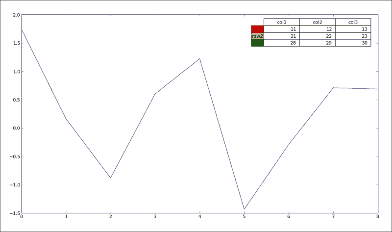
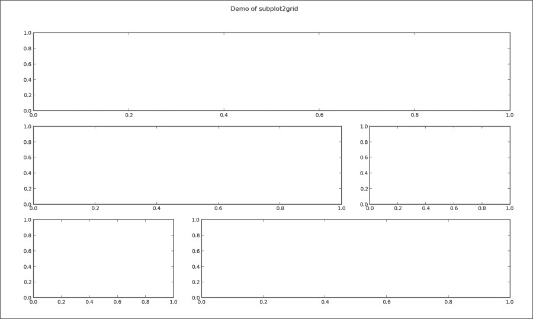
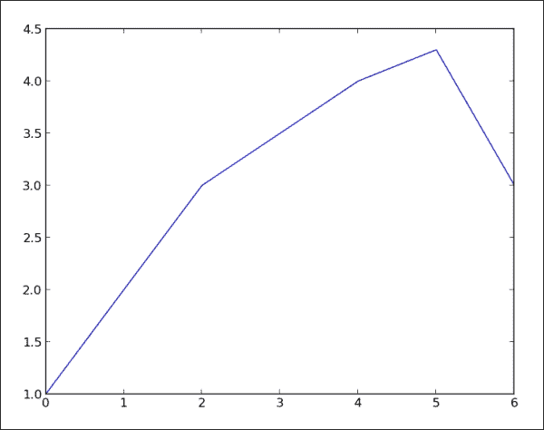
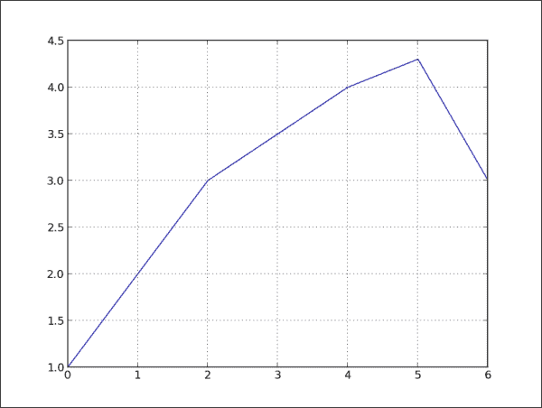
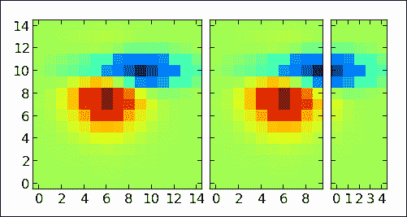
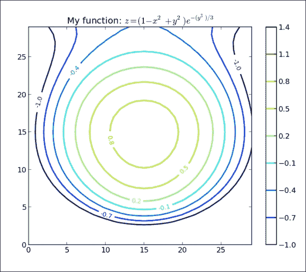
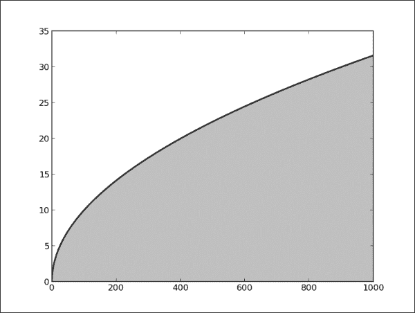
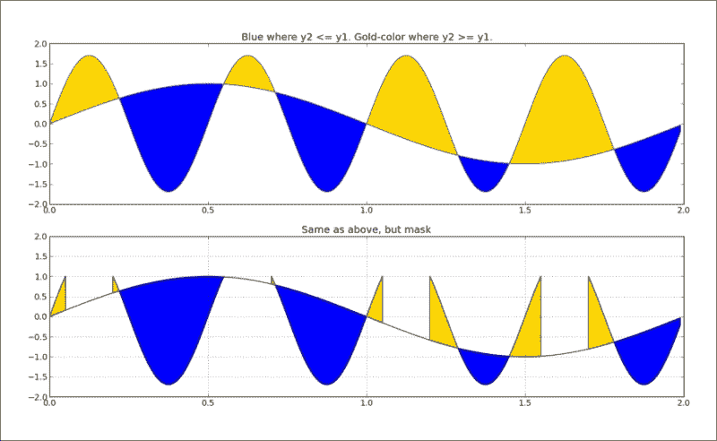
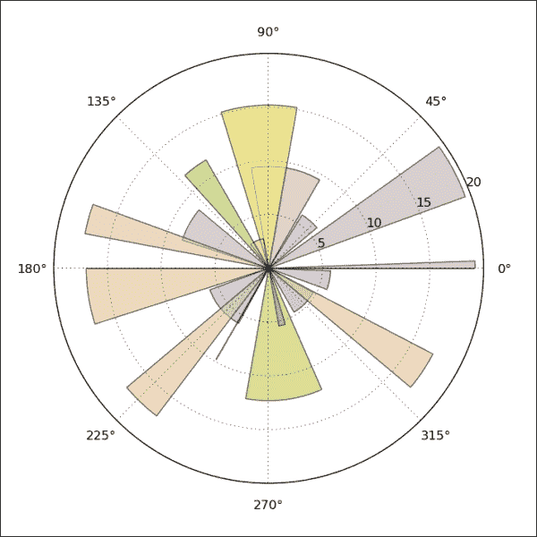
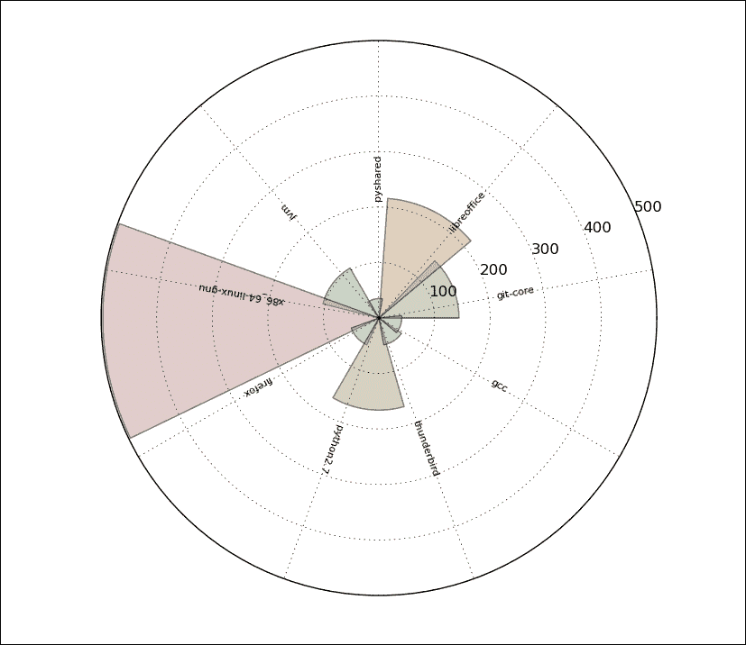

# 四、更多绘图和自定义

在本章中，我们将了解:

*   设置轴标签的透明度和大小
*   给图表线条添加阴影
*   向图中添加数据表
*   使用子图
*   自定义网格
*   创建等高线图
*   填充地下区域
*   绘制极坐标图
*   使用极坐标条可视化文件系统树

# 简介

在本章中，我们将探索 matplolib 库的更高级的属性。我们将介绍更多的选择，并将研究如何获得某些视觉上令人愉悦的结果。

在这一章中，我们将寻求在简单的图表还不够时，用数据表示一些非平凡问题的解决方案。我们将尝试使用多种类型的图形或创建混合图形来覆盖一些高级数据结构和所需的表示。

# 设置轴标签的透明度和大小

`Axes`标签描述了图中的数据所代表的内容，对于观众理解图本身非常重要。通过为`axes`背景提供标签，我们帮助观众以适当的方式理解中的信息。

## 做好准备

在我们深入研究代码之前，了解 matplotlib 如何组织我们的数据是很重要的。

在顶层，有一个`Figure`实例，它包含了我们看到的一切和更多的东西(我们没有看到的)。该图包含了`Axes`类作为字段`Figure.axes`的实例。`Axes`实例包含我们关心的几乎所有东西:所有的线、点、记号和标签。所以，当我们呼叫`plot()`时，我们正在`Axes.lines`列表中添加一行(`matplotlib.lines.Line2D`)。如果我们绘制直方图(`hist()`)，我们将在`Axes.patches`列表中添加矩形(“面片”是从 MATLAB 继承而来的术语，代表“颜色面片”的概念)。

`Axes`的一个实例还包含对`XAxis`和`YAxis`实例的引用，它们又分别引用 x 轴和 y 轴。`XAxis`和`YAxis`管理轴、标签、刻度、刻度标签、定位器和格式化器的绘制。我们可以分别通过`Axes.xaxis`和`Axes.yaxis`来参考。我们不必一直到`XAxis`或`YAxis`实例才能到达标签，因为 matplotlib 为我们提供了一个辅助方法(实际上是一个快捷方式)，可以通过这些标签实现迭代:`matplotlib.pyplot.xlabel()`和`matplotlib.pyplot.ylabel()`。

## 怎么做...

我们现在将创建一个新的数字，我们将:

1.  用一些随机生成的数据创建一个图。
2.  添加`title`和`axes`标签。
3.  添加 alpha 设置。
4.  给`title`和`axes`标签添加阴影效果。

    ```py
    import matplotlib.pyplot as plt
    from matplotlib import patheffects
    import numpy as np
    data = np.random.randn(70)

    fontsize = 18
    plt.plot(data)

    title = "This is figure title"
    x_label = "This is x axis label"
    y_label = "This is y axis label"

    title_text_obj = plt.title(title, fontsize=fontsize, verticalalignment='bottom')

    title_text_obj.set_path_effects([patheffects.withSimplePatchShadow()])

    # offset_xy -- set the 'angle' of the shadow
    # shadow_rgbFace -- set the color of the shadow
    # patch_alpha -- setup the transparency of the shadow

    offset_xy = (1, -1)
    rgbRed = (1.0,0.0,0.0)
    alpha = 0.8

    # customize shadow properties
    pe = patheffects.withSimplePatchShadow(offset_xy = offset_xy,
                                           shadow_rgbFace = rgbRed,
                                           patch_alpha = alpha)
    # apply them to the xaxis and yaxis labels
    xlabel_obj = plt.xlabel(x_label, fontsize=fontsize, alpha=0.5)
    xlabel_obj.set_path_effects([pe])

    ylabel_obj = plt.ylabel(y_label, fontsize=fontsize, alpha=0.5)
    ylabel_obj.set_path_effects([pe])

    plt.show()
    ```

## 它是如何工作的...

我们已经知道所有熟悉的导入、生成数据的零件以及基本的绘图技术，所以我们将跳过这些。如果您无法破译示例的前几行，请参考[第 2 章](2.html "Chapter 2. Knowing Your Data")、*了解您的数据*、[第 3 章](3.html "Chapter 3. Drawing Your First Plots and Customizing Them")、*绘制您的第一个图并定制它们*，这些概念在这里已经解释过了。

绘制数据集后，我们准备添加标题和标签，并自定义它们的外观。

首先，我们添加标题。然后我们定义标题文本的字体大小和垂直对齐方式为`bottom`。如果我们使用的是不带参数的`matplotlib.patheffects.withSimplePatchShadow()`，默认阴影效果会添加到标题中。参数默认值为:`offset_xy=(2,-2)`、`shadow_rgbFace=None`和`patch_alpha=0.7`。其他数值有`center`、`top`、`baseline`但是我们选择`bottom`作为文字会有一些阴影。下一行我们添加阴影效果。路径效果是支持`matplotlib.text.Text`和`matplotlib.patches.Patch`的`matplotlib`模块`matplotlib.patheffects`的一部分。

我们现在想给 x 轴和 y 轴添加不同的阴影设置。首先，我们自定义阴影相对于父对象的位置(偏移)，然后设置阴影的颜色。此处，颜色由 0.0 到 1.0 之间的三个浮点值(三元组)表示，用于每个 RGB 通道。因此，我们的红色被表示为`(1.0, 0.0, 0.0)`(全红，无绿，无蓝)。

透明度(或 alpha)被设置为一个规范化的值，我们也希望在这里将其设置为不同于默认值。

有了所有的设置，我们实例化`matplotlib.patheffects.withSimplePatchShadow`并将对它的引用保存在变量`pe`中，以便几行后重用它。

为了能够应用阴影效果，我们需要到达`label`对象。这很简单，因为`matplotlib.pyplot.xlabel()`返回对对象(`matplotlib.text.Text`)的引用，然后我们用它来调用`set_path_effects([pe])`。

我们终于展示了绘图，并为我们的工作感到自豪。

## 还有更多...

如果对`matplotlib.patheffects`当前提供的效果不满意，可以继承`matplotlib.patheffects._Base`类并覆盖`draw_path`方法。在这里看一下代码和关于如何做到这一点的评论:

[https://github . com/matplotlib/matplotlib/blob/master/lib/matplotlib/patheffects . py # l47](https://github.com/matplotlib/matplotlib/blob/master/lib/matplotlib/patheffects.py#L47)

# 给图表线条添加阴影

为了能够区分图中的一条特定的绘图线或，只是为了适合我们的图所在的输出的整体风格，我们有时需要给图表线(或直方图，就此而言)添加阴影效果。在这个食谱中，我们将学习如何给图表线条添加阴影效果。

## 做好准备

为了给图表中的线条或矩形添加阴影，我们需要使用 matplotlib 中构建的位于`matplotlib.transforms`的变换框架。

为了理解这一切是如何工作的，我们需要解释变换在 matplotlib 中是什么以及它们是如何工作的。

变换知道如何将给定坐标从其坐标系转换成显示。他们也知道如何将它们从显示坐标转换成自己的坐标系。

下表总结了现有坐标系及其代表的内容:

<colgroup><col style="text-align: left"> <col style="text-align: left"> <col style="text-align: left"></colgroup> 
| 

坐标系

 | 

转换对象

 | 

描述

 |
| --- | --- | --- |
| `Data` | `Axes.transData` | 表示用户的数据坐标系。 |
| `Axes` | `Axes.transAxes` | 表示`Axes`坐标系，其中(0，0)表示轴的左下角，(1，1)表示轴的右上角。 |
| `Figure` | `Figure.transFigure` | 这是`Figure`坐标系，其中(0，0)代表图的左下角，(1，1)代表图的右上角。 |
| `Display` | `None` | 表示用户显示的像素坐标系，其中(0，0)表示显示的左下角，元组(宽度，高度)表示显示的右上角，其中宽度和高度以像素为单位。 |

请注意，显示在列中没有值。这是因为默认坐标系是`Display`，所以坐标相对于您的显示坐标系总是以像素为单位。这不是很有用，大多数情况下，我们希望将它们归一化到`Figure`或`Axes`或`Data`坐标系中。

这个框架使我们能够将当前对象转换为偏移对象，也就是说，将该对象放置在与原始对象偏移一定距离的位置。

我们将使用这个框架在绘制的正弦波上创建我们想要的效果。

## 怎么做...

以下是为绘制的图表添加阴影的代码配方。代码将在下一节中解释。

```py
import numpy as np
import matplotlib.pyplot as plt
import matplotlib.transforms as transforms

def setup(layout=None):
    assert layout is not None

    fig = plt.figure()
    ax = fig.add_subplot(layout)
    return fig, ax

def get_signal():
    t = np.arange(0., 2.5, 0.01)
    s = np.sin(5 * np.pi * t)
    return t, s

def plot_signal(t, s):
    line, = axes.plot(t, s, linewidth=5, color='magenta')
    return line,

def make_shadow(fig, axes, line, t, s):
    delta = 2 / 72\.  # how many points to move the shadow
    offset = transforms.ScaledTranslation(delta, -delta, fig.dpi_scale_trans)
    offset_transform = axes.transData + offset

    # We plot the same data, but now using offset transform
    # zorder -- to render it below the line
    axes.plot(t, s, linewidth=5, color='gray',
              transform=offset_transform,
              zorder=0.5 * line.get_zorder())

if __name__ == "__main__":
    fig, axes = setup(111)
    t, s = get_signal()
    line, = plot_signal(t, s)

    make_shadow(fig, axes, line, t, s)

    axes.set_title('Shadow effect using an offset transform')
    plt.show()
```

## 它是如何工作的...

在`if __name__`检查之后，我们从底部开始读取代码。首先，我们在`setup()`中创建图形和轴；之后，我们获得一个信号(或产生数据——正弦波)。我们在`plot_signal()`中绘制基本信号。然后，我们进行阴影变换，在`make_shadow()`中绘制阴影。

我们使用偏移效果在下方创建一个偏移对象，并且距离原始对象只有几个点。

原始对象是一个简单的正弦波，我们使用标准函数`plot()`绘制。

要添加到该偏移变换，matplotlib 包含辅助变换— `matplotlib.transforms.ScaledTranslation`。

`dx`和`dy`的值是以点定义的，由于点是 1/72 英寸，我们将偏移对象向右移动 2pt，向下移动 2pt。

### 注

如果你想了解更多关于我们如何将该点转换为 1/71 英寸的信息，请阅读维基百科的这篇文章:[http://en.wikipedia.org/wiki/Point_%28typography%29](http://en.wikipedia.org/wiki/Point_%28typography%29)。

我们可以用`matplotlib.transforms.ScaledTransformation(xtr, ytr, scaletr)`；这里，`xtr`和`ytr`是平移偏移，`scaletr`是变换时间和显示前可调用缩放`xtr`和`ytr`的变换。这方面最常见的使用情形是从点转换到显示空间:例如，转换到 DPI，这样无论实际输出是什么，无论是显示器还是打印材料，偏移量总是保持在相同的位置。我们用于此的可调用程序已经内置，可在`Figure.dpi_scale_trans`获得。

然后，我们用应用的转换绘制相同的数据。

## 还有更多...

使用变换来添加阴影只是这个框架的一个，并不是最流行的用例。为了能够使用转换框架做更多的事情，您将需要了解转换管道如何工作以及扩展点是什么(继承什么类以及如何继承)的细节。这已经足够容易了，因为 matplotlib 是开源的，即使有些代码没有很好的文档化，也有一个你可以阅读和使用或更改的源代码，从而有助于 matplotlib 的整体质量和有用性。

# 在图中添加数据表

虽然 matplotlib 主要是一个绘图库，但它在我们创建图表时帮助我们完成的小差事，比如在我们漂亮的图表旁边有一个整洁的数据表。在本食谱中，我们将学习如何在图中的图表旁边显示数据表。

## 做好准备

理解我们为什么要在图表中添加表格是很重要的。直观绘制数据的主要目的是解释不可理解(或难以理解)的数据值。现在，我们想把这些数据加回去。仅仅在图表下面塞进一张大桌子的数值是不明智的。

但是，仔细挑选，也许从整个图表数据集中总结或突出显示的值可以识别图表的重要部分，或者强调那些精确值(例如，以美元表示的年销售额)很重要(甚至是必需的)的地方的重要值。

## 怎么做...

下面是向图中添加示例表的代码:

```py
import matplotlib.pylab as plt
import numpy as np

plt.figure()
ax = plt.gca()
y = np.random.randn(9)

col_labels = ['col1','col2','col3']
row_labels = ['row1','row2','row3']
table_vals = [[11, 12, 13], [21, 22, 23], [28, 29, 30]]
row_colors = ['red', 'gold', 'green']
my_table = plt.table(cellText=table_vals,
                     colWidths=[0.1] * 3,
                     rowLabels=row_labels,
                     colLabels=col_labels,
                     rowColours=row_colors,
                     loc='upper right')

plt.plot(y)
plt.show()
```

先前的代码片段给出了如下图:



## 它是如何工作的...

使用`plt.table()`我们创建一个单元格表，并将其添加到当前轴。该表可以有(可选的)行和列标题。每个表格单元格包含补丁或文本。可以指定表格的列宽和行高。返回值是构成该表的一系列对象(文本、行和面片实例)。

基本功能签名是:

```py
table(cellText=None, cellColours=None,
      cellLoc='right', colWidths=None,
      rowLabels=None, rowColours=None, rowLoc='left',
      colLabels=None, colColours=None, colLoc='center',
      loc='bottom', bbox=None)
```

该函数实例化并返回`matplotlib.table.Table`实例。matplotlib 通常就是这种情况；将表添加到图中只有一种方法。面向对象的接口可以直接访问。我们可以直接使用`matplotlib.table.Table`类来微调我们的表，然后用`add_table()`将其添加到我们的`axes`实例中。

## 还有更多...

如果直接创建一个`matplotlib.table.Table`的实例，并在将其添加到`axes`实例之前对其进行配置，可以获得更多的控制权。您可以使用`Axes.add_table(table)`将`table`实例添加到`axes`，其中`table`是`matplotlib.table.Table`的实例。

# 使用子图

如果你从一开始就阅读这本书，你可能对`subplot`类很熟悉，它是`axes`的后代，生活在`subplot`实例的规则网格上。我们将解释并演示如何以高级方式使用子图。

在这个食谱中，我们将学习如何在我们的绘图中创建自定义的子绘图配置。

## 做好准备

子图的基类是`matplotlib.axes.SubplotBase`。这些子绘图是`matplotlib.axes.Axes`实例，但提供了在图形中生成和操纵一组`Axes`的辅助方法。

有一个类`matplotlib.figure.SubplotParams`，保存`subplot`的所有参数。尺寸标准化为图形的宽度或高度。正如我们已经知道的，如果我们不指定任何自定义值，它们将从`rc`参数中读取。

脚本层(`matplotlib.pyplot`)包含一些辅助方法来操作子场景。

`matplotlib.pyplot.subplots`用于轻松创建子图的通用布局。我们可以指定网格的大小——子图网格的行数和列数。

我们可以创建共享 x 轴或 y 轴的子场景。这是使用`sharex`或`sharey`关键字参数实现的。参数`sharex`可以有值`True`，在这种情况下，x 轴在所有子绘图中共享。除了最后一行图，刻度标签在所有图上都不可见。也可以定义为字符串，枚举值为`row`、`col`、`all`或`none`。数值`all`与`True`相同，数值`none`与`False`相同。如果指定了值`row`，则每个子图行共享 x 轴。如果指定了值`col`，则每个子图列共享 x 轴。该助手返回元组`fig, ax`，其中`ax`或者是轴实例，或者，如果创建了多个子图，则是轴实例的数组。

`matplotlib.pyplot.subplots_adjust`用于调整子图布局。关键字参数指定图形内的子图坐标(`left`、`right`、`bottom`和`top`)归一化为图形大小。分别使用宽度和高度的`wspace`和`hspace`参数，可以指定在子绘图之间留出空白。

## 怎么做...

1.  我们将向您展示在 matplotlib 工具包中使用另一个助手函数的示例— `subplot2grid`。我们定义网格的几何形状和子图的位置。请注意，这个位置是从 0 开始的，而不是像我们在`plot.subplot()`中习惯的从 1 开始。我们还可以使用`colspan`和`rowspan`来允许子绘图跨越给定网格中的多列和多行。例如，我们将:创建一个图形；使用`subplot2grid`添加各种子图布局；重新配置刻度标签大小。
2.  Show the plot:

    ```py
    import matplotlib.pyplot as plt

    plt.figure(0)
    axes1 = plt.subplot2grid((3, 3), (0, 0), colspan=3)
    axes2 = plt.subplot2grid((3, 3), (1, 0), colspan=2)
    axes3 = plt.subplot2grid((3, 3), (1, 2))
    axes4 = plt.subplot2grid((3, 3), (2, 0))
    axes5 = plt.subplot2grid((3, 3), (2, 1), colspan=2)

    # tidy up tick labels size
    all_axes = plt.gcf().axes
    for ax in all_axes:
        for ticklabel in ax.get_xticklabels() + ax.get_yticklabels():
            ticklabel.set_fontsize(10)

    plt.suptitle("Demo of subplot2grid")
    plt.show()
    ```

    当我们执行前面的代码时，会创建以下图:

    

## 它是如何工作的...

我们为`subplot2grid`提供形状、位置(`loc`)以及可选的`rowspan`和`colspan`。这里重要的区别是位置是从 0 开始索引的，而不是像在`figure.add_subplot`那样从 1 开始。

## 还有更多...

举一个另一种方式的例子，你可以自定义当前的`axes`或`subplot`:

```py
axes = fig.add_subplot(111)
rectangle = axes.patch
rectangle.set_facecolor('blue')
```

这里我们看到每个`axes`实例都包含一个引用`rectangle`实例的字段补丁，因此代表了当前`axes`实例的背景。这个实例有我们可以更新的属性，因此更新当前`axes`背景。例如，我们可以改变它的颜色，但也可以加载图像来添加水印保护。

也可以先创建一个补丁，然后将其添加到`axes`背景中:

```py
fig = plt.figure()
axes = fig.add_subplot(111)
rect = matplotlib.patches.Rectangle((1,1), width=6, height=12)
axes.add_patch(rect)
# we have to manually force a figure draw
axes.figure.canvas.draw()
```

# 定制网格

网格通常便于在线条和图表下绘制，因为它有助于人眼发现图案上的差异，并直观地比较图中的图。为了能够设置网格的显示方式、频率和样式，或者是否显示，我们应该使用`matplotlib.pyplot.grid`。

在这个食谱中，我们将学习如何打开和关闭网格，以及如何改变网格上的主要和次要刻度。

## 做好准备

最频繁的网格定制可以在`matplotlib.pyplot.grid`助手功能中到达。

要看这个的交互效果，应该在`ipython –pylab`下运行以下。对`plt.grid()`的基本调用将切换上一个 IPython PyLab 环境启动的当前交互会话中的网格可见性:

```py
In [1]: plt.plot([1,2,3,3.5,4,4.3,3])
Out[1]: [<matplotlib.lines.Line2D at 0x3dcc810>]
```



现在我们可以在同一个图上切换网格:

```py
In [2]: plt.grid()
```

我们重新打开网格，如下图所示:



然后我们再次关闭 if:

```py
In [3]: plt.grid()
```


除了打开和关闭它们，我们还可以进一步定制网格外观。

我们可以仅使用主要刻度或次要刻度或两者来操纵网格；因此，函数参数`which`的值可以是`'major'`、`'minor'`或`'both'`。与此类似，我们可以使用参数`axis`分别控制水平和垂直刻度，该参数可以有值`'x'`、`'y'`或`'both'`。

所有其他属性都通过`kwargs`传递，并表示一个`matplotlib.lines.Line2D`实例可以接受的标准属性集，例如`color`、`linestyle`和`linewidth`；这里有一个例子:

```py
ax.grid(color='g', linestyle='--', linewidth=1)
```

## 怎么做...

这很好，但我们希望能够定制更多。为了做到这一点，我们需要深入 matplotlib 和`mpl_toolkits`并找到`AxesGrid`模块，该模块允许我们以简单和可管理的方式制作轴的网格:

```py
import numpy as np
import matplotlib.pyplot as plt
from mpl_toolkits.axes_grid1 import ImageGrid
from matplotlib.cbook import get_sample_data

def get_demo_image():
    f = get_sample_data("axes_grid/bivariate_normal.npy", asfileobj=False)
    # z is a numpy array of 15x15
    Z = np.load(f)
    return Z, (-3, 4, -4, 3)

def get_grid(fig=None, layout=None, nrows_ncols=None):
    assert fig is not None
    assert layout is not None
    assert nrows_ncols is not None

    grid = ImageGrid(fig, layout, nrows_ncols=nrows_ncols,
                    axes_pad=0.05, add_all=True, label_mode="L")
    return grid

def load_images_to_grid(grid, Z, *images):
    min, max = Z.min(), Z.max()
    for i, image in enumerate(images):
        axes = grid[i]
        axes.imshow(image, origin="lower", vmin=min, vmax=max,
                  interpolation="nearest")
if __name__ == "__main__":
    fig = plt.figure(1, (8, 6))
    grid = get_grid(fig, 111, (1, 3))
    Z, extent = get_demo_image()

    # Slice image
    image1 = Z
    image2 = Z[:, :10]
    image3 = Z[:, 10:]

    load_images_to_grid(grid, Z, image1, image2, image3)

    plt.draw()
    plt.show()
```

给定的代码将呈现以下图表:



## 它是如何工作的...

在函数`get_demo_image`中，我们从 matplotlib 附带的样本数据目录中加载数据。

列表`grid`保存了我们的`axes`网格(这里是`ImageGrid`)。

变量`image1`、`image2`和`image3`保存了我们在列表`grid`中的多个轴上分割的来自 Z 的切片数据。

在所有网格上循环，我们使用标准的`imshow()`调用绘制来自`im1`、`im2`和`im3`的数据，而 matplotlib 注意所有东西都被整齐地渲染和对齐。

# 创建等高线图

等高线图显示矩阵的等值线。**等值线**是曲线，其中两个变量的函数具有相同的值。

在本食谱中，我们将学习如何创建等高线图。

## 做好准备

等高线表示为矩阵 Z 的等高线图，其中 Z 解释为相对于 X-Y 平面的高度。z 的最小大小为 2，并且必须包含至少两个不同的值。

等高线图的问题在于，如果没有标注等值线就对其进行编码，它们会变得非常无用，因为我们无法将高点与低点进行解码，也无法找到局部最小值。

这里我们也需要标注轮廓。等值线的标注可以使用标注(`clabel()`)或`colormaps`。如果您的输出媒体允许使用颜色，`colormaps`是首选，因为观众将能够更容易地解码数据。

等高线图的另一个风险是选择绘制等值线的数量。如果我们选择太多，绘图会变得太密集而无法解码，如果我们选择太少的等值线，我们会丢失信息，并且可以以不同的方式感知数据。

`contour()` 功能会自动猜测要绘制多少条等值线，但我们也有能力指定自己的编号。

在 matplotlib 中，我们使用`matplotlib.pyplot.contour`绘制等高线图。

有两个类似的功能:`contour()`绘制等高线，`contourf()`绘制填充等高线。我们将只演示`contour()`，但几乎所有内容都适用于`contourf()`。他们也理解几乎相同的论点。

函数`contour()`可以有不同的调用签名，这取决于我们有什么数据和/或我们想要可视化的属性是什么。

<colgroup><col style="text-align: left"> <col style="text-align: left"></colgroup> 
| 

呼叫签名

 | 

描述

 |
| --- | --- |
| `contour(Z)` | 绘制 Z(数组)的轮廓。级别值是自动选择的。 |
| `contour(X,Y,Z)` | 绘制 X、Y 和 z 的轮廓。阵列`X`和`Y`是(X，Y)表面坐标。 |
| `contour(Z,N)``contour(X,Y,Z,N)` | 绘制`Z`的轮廓，其中层级的数量由`N`定义。级别值是自动选择的。 |
| `contour(Z,V)` `contour(X,Y,Z,V)` | 用`V`中指定的值绘制等高线。 |
| `contourf(..., V)` | 依次填充级别值之间的`len(V)-1`区域`V`。 |
| `contour(Z, **kwargs)` | 使用关键字参数控制公共线条属性(颜色、线条宽度、原点、颜色映射等)。 |

X、Y、Z 的维度和形状都存在一定的约束，比如 X、Y 可以是二维的，和 Z 的形状相同，如果是一维的，比如 X 的长度等于 Z 的列数，那么 Y 的长度就等于 Z 的行数

## 怎么做...

在下面的代码示例中，我们将:

1.  实现一个功能作为模拟信号处理器。
2.  生成一些线性信号数据。
3.  将数据转换成适合矩阵运算的矩阵。
4.  绘制等高线。
5.  添加等高线标签。
6.  展示绘图。
7.  将 numpy 导入为`np`。
8.  将 matplotlib 汇入为`mpl`。
9.  将`matplotlib.pyplot`导入为`plt`。

    ```py
    def process_signals(x,y):
        return (1 – (x ** 2 + y ** 2)) * np.exp(-y ** 3 / 3)

    x = np.arange(-1.5, 1.5, 0.1)
    y = np.arange(-1.5, 1.5, 0.1)

    # Make grids of points
    X,Y = np.meshgrid(x, y)

    Z = process_signals(X, Y)

    # Number of isolines
    N = np.arange(-1, 1.5, 0.3)

    # adding the Contour lines with labels
    CS = plt.contour(Z, N, linewidths=2, cmap=mpl.cm.jet)
    plt.clabel(CS, inline=True, fmt='%1.1f', fontsize=10)
    plt.colorbar(CS)

    plt.title('My function: $z=(1-x^2+y^2) e^{-(y^3)/3}$')
    plt.show()
    ```

这将为我们提供以下图表:



## 它是如何工作的...

我们从`numpy`开始寻找小帮手来创建我们的范围和矩阵。

在我们将`my_function`评估为`Z`之后，我们简单的称之为`contour`，提供`Z`和等值线的层数。

此时，尝试在`N arange()`调用中尝试第三个参数。例如，不要选择`N = np.arange(-1, 1.5, 0.3)`，而是尝试将`0.3`更改为`0.1`或`1`来体验如何以不同的方式看待相同的数据，这取决于我们如何在等高线图中对数据进行编码。

我们还通过简单地给它`CS`(一个`matplotlib.contour.QuadContourSet`实例)添加了一个彩色地图。

# 填充绘图下区域

在 matplotlib 中绘制填充多边形的基本方式是使用`matplotlib.pyplot.fill`。该函数接受与`matplotlib.pyplot.plot`相似的参数——多个`x`和`y`对以及其他`Line2D`属性。该函数返回添加的`Patch`实例列表。

在本食谱中，我们将学习如何给绘图交叉点的特定区域着色。

## 做好准备

matplotlib 提供了几个功能来帮助我们绘制填充图形，当然，除了绘制本来就是绘制闭合填充多边形的功能，比如`histogram ()`。

我们已经提到了一个——`matplotlib.pyplot.fill`——但是还有`matplotlib.pyplot.fill_between()`和`matplotlib.pyploy.fill_betweenx()`功能。这些函数填充两条曲线之间的多边形。`fill_between()`和`fill_betweenx()`的主要区别在于后者填充在 x 轴值之间，而前者填充在 y 轴值之间。

函数`fill_between` 接受参数`x`—数据的 x 轴数组，以及`y1`和`y2`—数据的 y 轴数组。使用参数，我们可以指定填充区域的条件。该条件是布尔条件，通常指定 y 轴值范围。默认值是`None`——意思是，到处都要填。

## 怎么做...

从一个简单的例子开始，我们将填充一个简单函数下的区域:

```py
import numpy as np
import matplotlib.pyplot as plt
from math import sqrt

t = range(1000)
y = [sqrt(i) for i in t]
plt.plot(t, y, color='red', lw=2)
plt.fill_between(t, y, color='silver')
plt.show()
```

前面的代码给出了下面的图:



这相当简单，并给出了`fill_between()`的工作原理。注意我们如何需要绘制实际的功能线(当然是使用`plot()`，其中`fill_between()`只是绘制了一个填充了颜色的多边形区域(`'silver'`)。

我们将在这里演示另一个食谱。这将涉及对`fill`功能的更多调节。以下是该示例的代码:

```py
import matplotlib.pyplot as plt
import numpy as np

x = np.arange(0.0, 2, 0.01)
y1 = np.sin(np.pi*x)
y2 = 1.7*np.sin(4*np.pi*x)

fig = plt.figure()
axes1 = fig.add_subplot(211)
axes1.plot(x, y1, x, y2, color='grey')
axes1.fill_between(x, y1, y2, where=y2<=y1, facecolor='blue', interpolate=True)
axes1.fill_between(x, y1, y2, where=y2>=y1, facecolor='gold', interpolate=True)
axes1.set_title('Blue where y2 <= y1\. Gold-color where y2 >= y1.')
axes1.set_ylim(-2,2)

# Mask values in y2 with value greater than 1.0
y2 = np.ma.masked_greater(y2, 1.0)
axes2 = fig.add_subplot(212, sharex=axes1)
axes2.plot(x, y1, x, y2, color='black')
axes2.fill_between(x, y1, y2, where=y2<=y1, facecolor='blue', interpolate=True)
axes2.fill_between(x, y1, y2, where=y2>=y1, facecolor='gold', interpolate=True)
axes2.set_title('Same as above, but mask')
axes2.set_ylim(-2,2)
axes2.grid('on')

plt.show()
```

前面的代码将呈现如下图:



## 它是如何工作的...

对于这个例子，我们首先创建了两个在某些点重叠的正弦函数。

我们还创建了两个子场景来比较渲染填充区域的两个变体。

在这两种情况下，我们都将`fill_between()`与参数`where`一起使用，该参数接受一个 N 长度的布尔数组，并将填充`where`等于`True`的区域。

底部的子图显示了`mask_greater`，它用大于给定值的值屏蔽了一个数组。这是`numpy.ma`包中的一个函数，用于处理缺失或无效的值。我们在底部的轴上转动网格，以便更容易发现这一点。

# 绘制极坐标图

如果数据已经用极坐标表示，我们也可以用极坐标图形显示。即使数据不是极坐标，也要考虑转换成极坐标形式，在极坐标图上绘制。

要回答我们是否要这样做，我们需要了解数据代表什么，我们希望向最终用户显示什么。想象用户将从我们的图形中读取和解码什么，通常会引导我们达到最佳的可视化效果。

极坐标图通常用于显示本质上呈放射状的信息。例如，在太阳路径图中——我们在径向投影中看到天空，天线的辐射图在不同角度辐射不同。你可以在以下网站了解更多信息:T2。

在本食谱中，我们将学习如何更改绘图中使用的坐标系，并改用极坐标系统。

## 做好准备

要在极坐标中显示数据，我们必须有适当的数据值。在极坐标系统中，一个点用半径距离(通常用 *r* 表示)和角度(通常用*θ*表示)来描述。角度可以是弧度或度数，但 matplotlib 使用度数。

与函数`plot()`非常相似，为了绘制极坐标图，我们将使用函数`polar()` ，该函数接受两个相同长度的参数数组`theta`和`r`，分别用于角度数组和半径数组。该函数还接受其他格式参数，与`plot()`函数相同。

我们还需要告诉 matplotlib，我们想要极坐标系统中的轴。这是通过向`add_axes`或`add_subplot`函数提供`polar=True`参数来实现的。

此外，要在图形上设置其他属性，如半径或角度上的网格，我们需要使用`matplotlib.pyplot.rgrids()`切换径向网格可见性或设置标签。同样，我们使用`matplotlib.pyplot.thetagrid()`来配置角度记号和标签。

## 怎么做...

这里有一个演示如何绘制极坐标的配方:

```py
import numpy as np
import matplotlib.cm as cm
import matplotlib.pyplot as plt

figsize = 7
colormap = lambda r: cm.Set2(r / 20.)
N = 18 # number of bars

fig = plt.figure(figsize=(figsize,figsize))
ax = fig.add_axes([0.2, 0.2, 0.7, 0.7], polar=True)

theta = np.arange(0.0, 2*np.pi, 2*np.pi/N)
radii = 20*np.random.rand(N)
width = np.pi/4*np.random.rand(N)
bars = ax.bar(theta, radii, width=width, bottom=0.0)
for r, bar in zip(radii, bars):
    bar.set_facecolor(colormap(r))
    bar.set_alpha(0.6)

plt.show()
```

前面的代码片段将给出下面的图:



## 它是如何工作的...

首先，我们创建一个正方形图形，并添加极轴。图形不一定是正方形，但这样我们的极坐标图就会是椭球形。

然后，我们为一组角度(θ)和一组极距(半径)生成随机值。因为我们画了条，我们也需要为每个条设置一组宽度，所以我们也生成了一组宽度。由于`maplotlib.axes.bar`接受一组值(就像 matplotlib 中几乎所有的绘图函数一样)，我们不必循环这个生成的数据集；我们只需要把所有的论据传递给律师协会一次。

为了让每一个小节都容易区分，我们必须循环添加到`ax`(轴)的每一个小节，并自定义其外观(面色和透明度)。

# 使用极坐标条可视化文件系统树

我们想在这个食谱中展示如何解决一个“现实世界”的任务——如何使用 matplotlib 来可视化我们的目录占用率。

在这个食谱中，我们将学习如何可视化具有相对大小的文件系统树。

## 做好准备

我们都有很大的硬盘，里面有时会有我们通常会忘记的东西。如果能看到这样一个目录里面有什么，里面最大的文件是什么，那就太好了。

虽然有许多更复杂和精细的软件产品可以完成这项工作，但我们想展示如何使用 Python 和 matplotlib 来实现这一点。

## 怎么做...

让我们执行以下步骤:

1.  实现一些助手函数来处理文件夹发现和内部数据结构。
2.  实现主功能`draw()`，进行绘图。
3.  实现验证用户输入参数的主程序主体:

    ```py
    import os
    import sys

    import matplotlib.pyplot as plt
    import matplotlib.cm as cm
    import numpy as np

    def build_folders(start_path):
        folders = []

        for each in get_directories(start_path):
            size = get_size(each)
            if size >= 25 * 1024 * 1024:
                folders.append({'size' : size, 'path' : each})

        for each in folders:
            print "Path: " + os.path.basename(each['path'])
            print "Size: " + str(each['size'] / 1024 / 1024) + " MB"
        return folders

    def get_size(path):
        assert path is not None

        total_size = 0
        for dirpath, dirnames, filenames in os.walk(path):
            for f in filenames:
                fp = os.path.join(dirpath, f)
                try:
                    size = os.path.getsize(fp)
                    total_size += size
                    #print "Size of '{0}' is {1}".format(fp, size)
                except OSError as err:
                    print str(err)
                    pass
        return total_size

    def get_directories(path):
        dirs = set()
        for dirpath, dirnames, filenames in os.walk(path):
            dirs = set([os.path.join(dirpath, x) for x in dirnames])
            break # we just want the first one
        return dirs

    def draw(folders):
        """ Draw folder size for given folder"""
        figsize = (8, 8)  # keep the figure square
        ldo, rup = 0.1, 0.8  # leftdown and right up normalized
        fig = plt.figure(figsize=figsize)
        ax = fig.add_axes([ldo, ldo, rup, rup], polar=True)

        # transform data
        x = [os.path.basename(x['path']) for x in folders]
        y = [y['size'] / 1024 / 1024 for y in folders]
        theta = np.arange(0.0, 2 * np.pi, 2 * np.pi / len(x))
        radii = y

        bars = ax.bar(theta, radii)
        middle = 90/len(x)
        theta_ticks = [t*(180/np.pi)+middle for t in theta]
        lines, labels = plt.thetagrids(theta_ticks, labels=x, frac=0.5)
        for step, each in enumerate(labels):
            each.set_rotation(theta[step]*(180/np.pi)+ middle)
            each.set_fontsize(8)

        # configure bars
        colormap = lambda r:cm.Set2(r / len(x))
        for r, each in zip(radii, bars):
            each.set_facecolor(colormap(r))
            each.set_alpha(0.5)

        plt.show()
    ```

4.  接下来，我们将实现主程序主体，在这里我们验证当从命令行调用程序时用户给出的输入参数:

    ```py
    if __name__ == '__main__':
        if len(sys.argv) is not 2:
            print "ERROR: Please supply path to folder."
            sys.exit(-1)

        start_path = sys.argv[1]

        if not os.path.exists(start_path):
            print "ERROR: Path must exits."
            sys.exit(-1)

        folders = build_folders(start_path)

        if len(folders) < 1:
            print "ERROR: Path does not contain any folders."
            sys.exit(-1)

        draw(folders)
    ```

您需要从命令行运行以下命令:

```py
$ python ch04_rec11_filesystem.py /usr/lib/

```

它将产生一个类似于这个的绘图:



## 它是如何工作的...

我们将从代码的底部开始，在`if __name__ == '__main__'`之后，因为那是我们程序开始的地方。

使用模块`sys`，我们提取命令行参数；它们表示我们想要可视化的目录的路径。

函数`build_folders`建立字典列表，每个字典包含它在给定的`start_path`中找到的大小和路径。该函数调用`get_directories`，返回`start_path`中所有子目录的列表。之后，对于每个找到的目录，我们使用`get_size`函数计算字节大小。

为了调试的目的，我们打印我们的字典，这样我们就可以将数字与我们的数据进行比较。

在我们将文件夹构建为字典列表后，我们将它们传递给一个函数`draw`，该函数执行将数据转换为正确维度的所有工作(这里，我们使用极坐标系统)，构建极坐标图形，并绘制所有的条、记号和标签。

严格来说，我们应该把这个工作分成更小的功能，尤其是如果这个代码要进一步开发的话。